# Arquiteturas de computadores paralelos
Embora os computadores continuem a ficar cada vez mais rápidos, as demandas impostas a eles estão crescendo no mínimo com a mesma rapidez. Astrônomos querem simular toda a história do universo, desde o big bang até o final do espetáculo. Cientistas farmacêuticos adorariam projetar em seus computadores medicamentos por encomenda para doenças específicas, em vez de ter de sacrificar legiões de ratos. Projetistas de aeronaves poderiam inventar produtos mais eficientes no consumo de combustível se os computadores pudessem fazer todo o trabalho sem a necessidade de construir protótipos físicos para testar em túneis aerodinâmicos. Em suma, seja qual for a capacidade de computação disponível, para muitos usuários, em especial nas áreas da ciência, engenharia e industrial, ela nunca será suficiente.

Embora as velocidades de clock continuem subindo, velocidades de circuitos não podem aumentar indefinidamente. A velocidade da luz já é um grande problema para projetistas de computadores de alta tecnologia, e as perspectivas de conseguir que elétrons e fótons se movam com maior rapidez são desanimadoras. Questões de
dissipação de calor estão transformando supercomputadores em condicionadores de ar de última geração. Por fim, como o tamanho dos transistores continua a diminuir, chegará um ponto em que cada transistor terá um número tão pequeno de átomos dentro dele que os efeitos da mecânica quântica (por exemplo, o princípio da incerteza de Heisenberg) podem se tornar um grande problema.

Portanto, para enfrentar problemas cada vez maiores, os arquitetos de computadores estão recorrendo cada vez mais a computadores paralelos. Apesar de talvez não ser possível construir uma máquina com uma única CPU e um tempo de ciclo de 0,001 ns, pode ser perfeitamente viável produzir uma com 1.000 CPUs com um tempo
de ciclo de 1 ns cada. Embora esse último projeto use CPUs mais lentas do que o primeiro, sua capacidade total de computação é teoricamente a mesma. E é aqui que reside a esperança.

O paralelismo pode ser introduzido em vários níveis. No nível mais baixo, ele pode ser adicionado ao chip da CPU, por pipeline e projetos superescalares com várias unidades funcionais. Também pode ser adicionado por meio de palavras de instrução muito longas com paralelismo implícito. Características especiais podem ser adicionadas à CPU para permitir que ela manipule múltiplos threads de controle ao mesmo tempo. Por fim, várias CPUs podem ser reunidas no mesmo chip. Juntas, essas características podem equivaler, talvez, a um fator de 10 vezes em desempenho em relação a projetos puramente sequenciais.

No nível seguinte, placas extras de CPU com capacidade de processamento adicional podem ser acrescentadas a um sistema. Em geral, essas CPUs de encaixe têm funções especializadas, tais como **processamento de pacotes de rede, processamento de multimídia ou criptografia**. No caso de funções especializadas, o fator de ganho também pode ser de, talvez, 5 a 10.

Contudo, para conseguir um fator de cem, de mil, ou de milhão, é necessário replicar CPUs inteiras e fazer que todas elas funcionem juntas com eficiência. Essa ideia leva a grandes multiprocessadores e multicomputadores (computadores em cluster). Nem é preciso dizer que interligar milhares de processadores em um grande sistema gera seus próprios problemas, que precisam ser resolvidos.

Por fim, agora é possível envolver organizações inteiras pela Internet e formar grades de computação fracamente acopladas. Esses sistemas estão apenas começando a surgir, mas têm um potencial interessante para o futuro.

Quando duas CPUs ou dois elementos de processamento estão perto um do outro, têm alta largura de banda, o atraso entre eles é baixo e são muito próximos em termos computacionais, diz-se que são fortemente acoplados. Por outro lado, quando estão longe um do outro, têm baixa largura de banda e alto atraso e são remotos em termos computacionais, diz-se que são fracamente acoplados. Neste capítulo, vamos examinar os princípios de projeto para essas várias formas de paralelismo e estudar variados exemplos. Começaremos com os sistemas mais fortemente acoplados, os que usam paralelismo no chip, passaremos aos poucos para sistemas cada vez mais fracamente acoplados, e concluiremos com alguns comentários sobre computação em grade. Esse espectro é ilustrado em linhas gerais na Figura 8.1.

Toda a questão do paralelismo, de uma extremidade do espectro à outra, é um tópico de pesquisa muito atual e concorrido. Por isso, daremos um número muito maior de referências neste capítulo, de preferência a artigos recentes sobre o assunto. Muitas conferências e periódicos também publicam artigos sobre o assunto, e a literatura está crescendo rapidamente.

**• Figura 8.1   (a) Paralelismo no chip. (b) Coprocessador. (c) Multiprocessador. (d) Multicomputador. (e) Grade**

    +------------------------------------------------------------------------+
    |                 TAXONOMIA DE SISTEMAS PARALELOS                        |
    |========================================================================|
    |                                                                        |
    |  (a) CHIP      (b) COPROCES.    (c) MULTIPROC.   (d) MULTICOMP.        |
    |   +-----+        +---+            +-----+          +-----+             |
    |   | {S} |        |CP |            | CPU |          |  M  |             |
    |   | {S} | <---   +---+            +--|--+          +--|--+             |
    |   | CPU |        |CPU| <---        [ M ]           | CPU |             |
    |   +-----+        +---+            +--|--+          +-----+             |
    |                                   | CPU |          |  M  |             |
    |                                   +-----+          +--|--+             |
    |                                                    | CPU |             |
    |                                                    +-----+             |
    |  <--- FORTEMENTE ACOPLADO                       FRACAMENTE ACOPLADO -->|
    +------------------------------------------------------------------------+

    +-----------------------------------------------------------------+
    |                  Arquiteturas                                   |
    +-----------------------------------------------------------------+
    |  Tipo           | Nível de Acoplamento  | Descrição Técnica     |
    +-----------------+-----------------------+-----------------------+
    | (a)             | Fortemente Acoplado   | Múltiplas threads     |
    | Paralelismo     |                       | de execução           |
    | no Chip         |                       | compartilhando        |
    |                 |                       | recursos internos     |
    +-----------------+-----------------------+-----------------------+
    | (b)             | Fortemente Acoplado   | CPU principal         |
    | Coprocessador   |                       | delegando tarefas     |
    |                 |                       | específicas           |
    +-----------------+-----------------------+-----------------------+
    | (c)             | Fortemente Acoplado   | Duas ou mais CPUs     |
    | Multiprocessador|                       | compartilhando M      |
    |                 |                       | através de barramento | 
    +-----------------+-----------------------+-----------------------+
    | (d)             | Fracamente Acoplado   | Cada CPU com M        |
    | Multicomputador |                       | privada e troca de    |
    |                 |                       | mensagens             |
    +-----------------+-----------------------+-----------------------+
    | (e)             | Fracamente Acoplado   | Computadores          |
    | Grade (Grid)    |                       | independentes         |
    |                 |                       | conectados via        |
    |                 |                       | Internet              |
    +-----------------+-----------------------+-----------------------+

## 8.1 Paralelismo no chip
Um modo de aumentar a produtividade de um chip é conseguir que ele faça mais coisas ao mesmo tempo. Em outras palavras, explorar o paralelismo. Nesta seção, vamos estudar alguns modos de conseguir aumentar a velocidade por meio do paralelismo no nível do chip, incluídos paralelismo no nível da instrução, multithreading e a colocação de mais de uma CPU no chip. Essas técnicas são bem diferentes, mas cada uma delas ajuda à sua própria maneira. Mas, em todos os casos, a ideia é conseguir que mais atividades aconteçam ao mesmo tempo.

## 8.1.1 Paralelismo no nível da instrução
Um modo de conseguir paralelismo no nível mais baixo é emitir múltiplas instruções por ciclo de clock. Há duas variedades de CPUs de emissão múltipla: processadores superescalares e processadores VLIW. Na verdade, já comentamos alguma coisa sobre essas duas no livro, mas talvez seja útil revisar aqui esse material.

Vimos CPUs superescalares antes (por exemplo, na Figura 2.5). Na configuração mais comum, em certo ponto do pipeline há uma instrução pronta para ser executada. CPUs superescalares são capazes de emitir múltiplas instruções para as unidades de execução em um único ciclo de clock. O número real de instruções emitidas
depende do projeto do processador, bem como das circunstâncias correntes. O hardware determina o número máximo que pode ser emitido, em geral duas a seis instruções. Contudo, se uma instrução precisar de uma unidade funcional que não está disponível ou de um resultado que ainda não foi calculado, ela não será emitida.

A outra forma de paralelismo no nível da instrução é encontrada em processadores VLIW (Very Long Instruction Word – palavra de instrução muito longa). Na forma original, máquinas VLIW de fato tinham palavras longas que continham instruções que usavam múltiplas unidades funcionais. Considere, por exemplo, o pipeline da Figura 8.2(a), no qual a máquina tem cinco unidades funcionais e pode efetuar, simultaneamente, duas operações com inteiros, uma operação de ponto flutuante, um carregamento e um armazenamento. Uma instrução VLIW para essa máquina conteria cinco opcodes e cinco pares de operandos, um opcode e um par de operandos por unidade funcional. Com 6 bits por opcode, 5 bits por registrador e 32 bits por endereço de memória, as instruções poderiam facilmente ter 134 bits – bem compridas, de fato.

Contudo, esse projeto revelou ser muito rígido porque nem toda instrução podia utilizar todas as unidades funcionais, o que resultava em muitas NO-OP inúteis usadas como filtro, como ilustrado na Figura 8.2(b). Por conseguinte, modernas máquinas VLIW têm um modo de marcar um grupo de instruções que formam um conjunto com um bit de “final de grupo”, conforme mostra a Figura 8.2(c). Então, o processador pode buscar o grupo inteiro e emiti-lo de uma vez só. Cabe ao compilador preparar grupos de instruções compatíveis.

Na verdade, VLIW transfere do tempo de execução para o tempo de compilação o trabalho de determinar quais instruções podem ser emitidas em conjunto. Essa opção não apenas simplifica o hardware e o torna mais rápido, mas também, visto que um compilador otimizador pode funcionar durante um longo tempo se for preciso,
permite que se montem pacotes melhores do que o hardware poderia montar durante o tempo de execução. É claro que tal mudança radical na arquitetura da CPU será difícil de introduzir, como demonstra a lenta aceitação do Itanium, exceto para aplicações de nicho.

Vale a pena observar que o paralelismo no nível da instrução não é a única forma de paralelismo de baixo nível. Outra forma é o paralelismo no nível da memória, no qual há múltiplas operações de memória no ar ao mesmo tempo (Chou et al., 2004).

**•A CPU VLIW TriMedia**
Estudamos um exemplo de uma CPU VLIW, a Itanium-2, no Capítulo 5. Agora, vamos examinar um processador VLIW muito diferente, o TriMedia, projetado pela Philips, a empresa holandesa de equipamentos eletrônicos que também inventou o CD de áudio e o CD-ROM. A utilização pretendida do TriMedia é como um processador embutido em aplicações que fazem uso intensivo de imagem, áudio e vídeo, como reprodutores de CD, DVD e players MP3, gravadores de CD e DVD, televisores interativos, câmeras digitais, filmadoras e assim por diante. Dadas essas áreas de aplicação, não é surpresa que ele seja consideravelmente diferente da Itanium-2, que é uma CPU de uso geral, voltada para servidores de alta tecnologia.

**• Figura 8.2 - (a) Pipeline de CPU. (b) Sequência de instruções VLIW. (c) Fluxo de instruções com pacotes marcados.**
A Figura 8.2 é fundamental para o seu eBook, pois ela descreve como os processadores modernos otimizam a execução de tarefas através de paralelismo em nível de instrução. No seu Lenovo IdeaPad, o processador utiliza técnicas similares para garantir que o seu sistema Ubuntu rode de forma fluida mesmo com múltiplas aplicações abertas.

    +-------------------------------------------------------------+
    |              FLUXO DE EXECUÇÃO DA CPU (PIPELINE)            |
    |=============================================================|
    |                                                             |
    |   (a) ESTÁGIOS DO PIPELINE:                                 |
    |   [ BUSCA ] -> [ DECODIFICAÇÃO ] -> [ EMISSÃO ]             |
    |                                         ||                  |
    |          +------------------------------VV--------------+   |
    |          | UNIDADES DE EXECUÇÃO: INTEIRO, PONTO FLUT.,  |   |
    |          | CARGA E ARMAZENAMENTO                        |   |
    |          +------------------------------||--------------+   |
    |                                         VV                  |
    |                                    [ RETIRADA ]             |
    |                                                             |
    |   (b) VLIW: [ OP1 | OP2 | OP3 | OP4 ] (Uma instrução longa) |
    |                                                             |
    |   (c) GRUPOS: [ IL NFS ] / [ IFLS ] / [ IFL ] (Marcadores)  |
    +-------------------------------------------------------------+

    +-------------------------------------------------+
    |           Conceitos de Processamento            |
    +-------------------------------------------------+
    |  Conceito  | Descrição Técnica                  |
    +------------+------------------------------------+
    | (a)        | A CPU divide a execução de uma     |
    | Pipeline   | instrução em etapas sequenciais:   |
    | de CPU     | Busca, Decodificação, Emissão,     |
    |            | Execução e Retirada.               |
    +------------+------------------------------------+
    | (b)        | Very Long Instruction Word. O      |
    | Sequência  | compilador agrupa operações        |
    | VLIW       | independentes em uma instrução     |
    |            | longa para execução paralela.      |
    +------------+------------------------------------+
    | (c)        | Representa o fluxo de instruções   |
    | Fluxo com  | agrupadas. O processador utiliza   |
    | Pacotes    | Marcadores de final de grupo para  |
    |            | identificar instruções a serem     |
    |            | executadas juntas.                 |
    +------------+------------------------------------+

**• Decodificação dos Símbolos (Legenda Técnica)**
Cada letra no diagrama indica uma unidade funcional específica que será ativada naquele ciclo de clock:

 - I (Inteiro): Operações aritméticas básicas (adição, subtração) ou lógica de bits.

 - L (Carga - Load): Instrução para buscar um dado da memória (RAM/Cache) para o registrador.

 - S (Armazenamento - Store): Instrução para gravar um dado do registrador na memória.

 - F (Ponto Flutuante - Float): Operações matemáticas complexas com casas decimais.

 - Traço (—): Representa um Slot Vazio ou uma operação No-op (sem operação). Indica que, naquele ciclo, aquela unidade funcional específica não tem trabalho a fazer.

        +-----------------------------------------------------------------+
        |                  Unidades de Execução                           |
        +-----------------------------------------------------------------+
        |  Símbolo  | Unidade de Execução | Importância no seu Projeto    |
        +-----------+---------------------+-------------------------------+
        | I         | Unidade Inteira     | Essencial para manipulação    |
        |           |                     | de ponteiros em C e índices   |
        |           |                     | de arrays.                    |
        +-----------+---------------------+-------------------------------+
        | L/S       | Memória (Load/Store)| Crítico para o desempenho do  |
        |           |                     | backup de projetos e acesso   |
        |           |                     | a arquivos .md.               |
        +-----------+---------------------+-------------------------------+
        |           | Marcador de Grupo   | Define o limite do paralelismo|
        |           |                     | que o seu Ubuntu pode extrair |
        |           |                     | do código.                    |
        +-----------+---------------------+-------------------------------+

O TriMedia é um verdadeiro processador VLIW, no qual todas as instruções contêm até cinco operações. Em condições completamente ideais, a cada ciclo de clock é iniciada uma instrução e são emitidas cinco operações. O clock funciona a 266 MHz ou 300 MHz; porém, como ele pode emitir cinco operações por ciclo, a velocidade efetiva de clock é cinco vezes mais alta. Na discussão a seguir, focalizaremos a implementação TM3260 do TriMedia; as diferenças em relação a outras versões são muito pequenas.

Uma instrução típica é ilustrada na Figura 8.3. As instruções variam de instruções padrões de inteiros de 8, 16 e 32 bits, passando por aquelas de ponto flutuante IEEE 754, até as de multimídia paralela. Como consequência das cinco emissões por ciclo e das instruções de multimídia paralela, o TriMedia é rápido o suficiente para decodificar vídeo digital de uma filmadora em tempo real em tamanho total e taxa de quadros total em software.

O TriMedia tem uma memória baseada em bytes, e os registradores de E/S são mapeados para o espaço de memória. Meias-palavras (16 bits) e palavras completas (32 bits) devem ser alinhadas em suas fronteiras naturais. Ela pode funcionar como little-endian ou big-endian, dependendo de um bit PSW que o sistema operacional pode ajustar. Esse bit afeta somente o modo com que as operações de carga e as de armazenamento transferem dados entre memória e registradores. A CPU contém uma cache dividida de 8 vias de conjuntos associativos com tamanho de linha de 64 bytes para a cache de instruções, bem como para a de dados. A cache de instruções é de 64 KB; a de dados é de 16 KB.

**• Figura 8.3   Instrução TriMedia típica, mostrando cinco operações possíveis.**
       
        +---------------------------------------------------------------------------+
        |                   INSTRUÇÃO VLIW TÍPICA (TRIMEDIA)                        |
        |===========================================================================|
        |                                                                           |
        |  [ Posição 1 ]  [ Posição 2 ]  [ Posição 3 ]  [ Posição 4 ]  [ Posição 5 ]|
        |  +----------+   +----------+   +-----------+  +----------+  +----------+  |
        |  |  ADIÇÃO  |   | DESLOCA- |   | MULTIMÍDIA|  |   LOAD   |  |   STORE  |  |
        |  |   (Add)  |   |  MENTO   |   |   (DSP)   |  | (Carga)  |  |(Armazena)|  |
        |  +----------+   +----------+   +-----------+  +----------+  +----------+  |
        |                                                                           |
        |  <-------------------------- 1 ÚNICA INSTRUÇÃO ------------------------>  |
        +---------------------------------------------------------------------------+

**• Detalhando as Operações (Explicação para o eBook)**
No contexto de sistemas como o seu Ubuntu rodando no Lenovo IdeaPad, cada posição da instrução TriMedia utiliza uma unidade de execução distinta:

 - Posição 1 (Adição): Executa operações aritméticas inteiras (ex: i++ em um loop C).

 - Posição 2 (Deslocamento/Shift): Move bits para a esquerda ou direita. É vital para criptografia e manipulação de protocolos de rede no seu IDS Sentinel.

 - Posição 3 (Multimídia): Instruções especializadas (SIMD) que processam vários dados de imagem ou som de uma vez.

 - Posição 4 (Load): Busca um dado da memória RAM/Cache e traz para os registradores da CPU.

 - Posição 5 (Store): Pega o resultado processado e o grava de volta na memória.

**• Resumo Técnico para Documentação**

    Característica                 Detalhe

    Tipo de Arquitetura            VLIW (Very Long Instruction Word)

    Paralelismo	                   Explícito (o compilador deve garantir que as 5 operações sejam independentes)

    Vantagem	                   Alta performance com baixo consumo de energia, pois a CPU não precisa "adivinhar" o que pode ser feito em paralelo.

Há 128 registradores de uso geral de 32 bits. O registrador R0 é travado com valor 0. O registrador R1 é travado em 1. Tentar mudar qualquer um deles provoca um ataque cardíaco na CPU. Os 126 registradores restantes são todos equivalentes em termos funcionais e podem ser utilizados para qualquer finalidade. Além disso, há também quatro registradores de uso especial de 32 bits: o contador de programa, a palavra de estado de programa e dois registradores relacionados a interrupções. Por fim, um registrador de 64 bits conta o número de ciclos de CPU desde sua última reinicialização. A 300 MHz, o contador leva cerca de dois mil  anos para dar uma volta completa e reiniciar o ciclo de contagem.

O Trimedia TM3260 tem 11 unidades funcionais diferentes para efetuar operações aritméticas, lógicas e de controle de fluxo (bem como uma para controle de cache que não discutiremos aqui). Elas estão relacionadas na Figura 8.4. As duas primeiras colunas dão o nome da unidade e uma breve descrição do que ela faz. A terceira informa quantas cópias da unidade existem em hardware. A quarta dá a latência, isto é, quantos ciclos de clock ela leva para concluir. Nesse contexto, vale a pena observar que todas as unidades funcionais, exceto a unidade de ponto flutuante de raiz quadrada/divisão, têm paralelismo. A latência dada na tabela informa quanto tempo falta para o resultado de uma operação estar disponível, mas uma nova operação pode ser iniciada a cada ciclo. Assim, por exemplo, cada uma das três instruções consecutivas pode conter duas operações de carregamento, o que resulta em seis carregamentos em vários estágios de execução ao mesmo tempo.

Por fim, as últimas cinco colunas mostram quais posições de instrução podem ser utilizadas por qual unidade funcional. Por exemplo, operações de comparação de ponto flutuante devem aparecer somente na terceira posição de uma instrução.

**• Figura 8.4   Unidades funcionais da TM3260, sua quantidade, latência e as posições de instrução que usam.**

    +-------------------------------------------------------------------------------+
    |              UNIDADES FUNCIONAIS DA TM3260 (TABELA CORRIGIDA)                 |
    |===============================================================================|
    |                                                                               |
    |  Unidade        | Descrição                        | Qtd | Lat |  1 2 3 4 5   |
    |-----------------|----------------------------------|-----|-----|--------------|
    |  Constante      | Operações imediatas              |  5  |  1  |  x x x x x   | Latência - indica quantos ciclos de clock leva p/ concluir
    |  ULA de inteiros| Operações aritmét., bool, 32 bit |  5  |  1  |  x x x x x   |
    |  Deslocador     | Deslocamentos multibits          |  2  |  1  |  x x x x x   |
    |  Load/Store     | Operações de memória             |  2  |  3  |        x x   | Load/Store (carregamento/armazenamento)
    |  Int/FP MUL     | Multiplic. int e PF 32 bits      |  2  |  3  |    x x       |
    |  ULA de PF      | Aritmética de PF                 |  2  |  3  |  x     x     |
    |  Comparação PF  | Compara Ponto Flutuante          |  1  |  1  |      x       |
    |  Raiz/div de PF | Divisão e raiz quadrada PF       |  1  | 17  |    x         |
    |  Desvio         | Controle de fluxo (Jumps)        |  3  |  3  |    x x x     |
    |  ULA DSP        | Aritmét. multimídia (8/16 bits)  |  2  |  3  |  x   x   x   |
    |  MUL DSP        | Multiplic. multimídia (8/16 bits)|  2  |  3  |    x x       | DSP - Digital Signal Processor (processador de sinal digital)
    |                                                                               |
    |  (Legenda: x = Unidade disponível nesta posição | Espaço vazio = Indisponível)|
    +-------------------------------------------------------------------------------+

**• Insights para sua Documentação de Hardware:**

 - Slots Dedicados: Note que a unidade de Raiz/div de PF só pode ser acionada na posição 2. O compilador do seu processador precisa garantir que qualquer divisão em C caia exatamente naquele slot, ou o código falhará.

 - Latência: A latência de 17 ciclos para a divisão significa que, se você iniciar essa operação no ciclo 0, o resultado só estará disponível no ciclo 18 (17 ciclos de espera).

 - Gargalo de Memória: Como só existem 2 unidades de Load/Store e elas operam nas posições 4 e 5, o seu sistema só consegue ler ou gravar 2 dados da memória RAM por ciclo.

A unidade de constante é usada para operações imediatas, como carregar em um registrador um número armazenado na própria operação. A ULA de inteiros efetua adição, subtração, as operações booleanas normais e operações de empacotamento/desempacotamento. O deslocador (shifter) pode mover um registrador em qualquer
direção por um número especificado de bits.

A unidade de Load/Store (carregamento/armazenamento) traz palavras da memória para dentro de registradores e as escreve de volta na memória. O TriMedia é, na essência, uma CPU RISC aumentada, portanto, operações normais são efetuadas em registradores e a unidade de Load/Store é usada para acessar a memória.
Transferências podem ser de 8, 16 ou 32 bits. Instruções aritméticas e lógicas não acessam a memória.

A unidade de multiplicação efetua multiplicações de inteiros e de ponto flutuante. As três unidades seguintes efetuam, na ordem, adições/subtrações, comparações, e raiz quadrada e divisões de ponto flutuante.

Operações de desvio são executadas pela unidade de desvio. Há um atraso fixo de 3 ciclos após um desvio, portanto, as três instruções (até 15 operações) que vêm após um desvio são sempre executadas, mesmo para desvios incondicionais.

Por fim, chegamos às duas unidades de multimídia, que executam as operações especiais de multimídia. O DSP no nome da unidade funcional refere-se a Digital Signal Processor (processador de sinal digital) que, na verdade, as operações de multimídia substituem. Mais adiante, faremos uma breve descrição das operações de multimídia. Um aspecto digno de nota é que todas elas utilizam aritmética saturada em vez de aritmética de complemento de dois usada pelas operações com inteiros. Quando uma operação produz um resultado que não pode ser expresso por causa de excesso, em vez de gerar uma exceção ou dar resultado lixo, é usado o número válido mais próximo. Por exemplo, com números de 8 bits sem sinal, somar 130 com 130 dá 255.

Como nem toda operação pode aparecer em toda posição, muitas vezes acontece de uma instrução não conter todas as cinco operações potenciais. Quando uma posição não é usada, ela é compactada para minimizar a quantidade de espaço desperdiçada. Operações que estão presentes ocupam 26, 34 ou 42 bits. Dependendo do número de operações que de fato estão presentes, as instruções TriMedia variam entre 2 e 28 bytes, incluindo algum cabeçalho fixo.

O TriMedia não verifica durante a execução se as operações um uma instrução são compatíveis. Se não forem, ele as executa mesmo assim e obtém a resposta errada. Deixar a verificação de fora foi uma decisão deliberada para poupar tempo e transistores. O Core i7 faz verificação em tempo de execução para ter certeza
de que todas as operações superescalares são compatíveis, mas a um custo imenso em termos de complexidade, tempo e transistores. O TriMedia evita esse custo passando a carga do escalonamento para o compilador, que tem todo o tempo do mundo para otimizar com cuidado o posicionamento de operações em palavras de instru-
ção. Por outro lado, se uma operação precisar de uma unidade funcional que não está disponível, a instrução protelará até que ela fique disponível.

Como na Itanium-2, as operações do TriMedia são predicadas. Cada operação (com duas pequenas exceções) especifica um registrador que é testado antes de ser executada. Se o bit de ordem baixa do registrador estiver marcado (valor 1), a operação é executada; caso contrário, ela é saltada. Cada uma das (até) cinco
operações é predicada individualmente. Um exemplo de uma operação predicada é
    
    **IF R2 IADD R4, R5 –> R8**

que testa R2 e, se o bit de ordem baixa for 1, soma R4 com R5 e armazena o resultado em R8. Uma operação pode ser transformada em incondicional usando R1 (que é sempre 1) como o registrador de predicado. Usar R0 (que é sempre 0) a transforma em uma no-op.

As operações multimídia do TriMedia podem ser agrupadas nos 15 grupos relacionados na Figura 8.5. Muitas das operações envolvem clipping (corte), que especifica um operando e uma faixa e obriga o operando a entrar na faixa usando os valores mais baixo ou mais alto para operandos que caem fora da faixa. O clipping pode ser feito em operandos de 8, 16 ou 32 bits. Por exemplo, quando o clipping é realizado dentro de uma faixa de 0 a 255 sobre 40 e 340, os resultados cortados são 40 e 255, respectivamente. O grupo clip efetua operações de corte.

Os quatro grupos seguintes da Figura 8.5 efetuam a operação indicada com operandos de vários tamanhos, cortando os resultados para ajustá-los a uma faixa específica. O grupo mínimo, máximo examina dois registradores e acha o maior e o menor valor para cada byte. De modo semelhante, o grupo comparação
considera dois registradores como quatro pares de bytes e compara cada par.

É raro que operações de multimídia sejam efetuadas com inteiros de 32 bits porque a maioria das imagens é composta de pixels RGB com valores de 8 bits para cada uma das cores vermelha, verde e azul. Quando uma imagem está sendo processada – por exemplo, comprimida –, ela é em geral representada por três componentes, um para cada cor (espaço RGB) ou por uma forma equivalente em termos lógicos (espaço YUV, que será discutido mais adiante neste capítulo). De qualquer modo, muito processamento é executado em arranjos retangulares que contêm inteiros de 8 bits sem sinal.

**• Figura 8.5   Principais grupos de operações que vêm com o TriMedia.**

    +-----------------------------------------------------------------------------+
    |                  Grupos de Operações TriMedia                               |
    +----------------------------+------------------------------------------------+
    | Processamento              | Armazenamento (Descrição Técnica)              |
    +----------------------------+------------------------------------------------+
    | Clip                       | Corta 4 bytes ou 2 meias-palavras (Saturação)  |
    +----------------------------+------------------------------------------------+
    | Valor absoluto             | Valor cortado, com sinal, absoluto (DSP)       |
    +----------------------------+------------------------------------------------+
    | Adição DSP                 | Adição cortada, com sinal (Saturação)          |
    +----------------------------+------------------------------------------------+
    | Subtração DSP              | Subtração cortada, com sinal                   |
    +----------------------------+------------------------------------------------+
    | Multiplicação  DSP         | Multiplicação cortada, com sinal               |
    +----------------------------+------------------------------------------------+
    | Mínimo, máximo             | Obtém mínimo ou máximo de pares de 4 bytes     |
    +----------------------------+------------------------------------------------+
    | Comparação                 | Compara dois registradores byte por byte       |
    +----------------------------+------------------------------------------------+
    | Deslocamento               | Desloca um par de operandos de 16 bits         |
    +----------------------------+------------------------------------------------+
    | Soma de produtos           | Soma, com sinal, produtos de 8 ou 16 bits      |
    +----------------------------+------------------------------------------------+
    | Merge, pack, swap          | Manipulação de bytes e meias-palavras          |
    +----------------------------+------------------------------------------------+
    | Médias quadráticas         | Média quádrupla, sem sinal, byte por byte      |
    +----------------------------+------------------------------------------------+
    | Médias de byte             | Média de quatro elementos, sem sinal           |
    +----------------------------+------------------------------------------------+
    | Multiplicações de byte     | Multiplicação, sem sinal, de 8 bits            |
    +----------------------------+------------------------------------------------+
    | Estimativa de movimento    | Soma de diferenças absolutas (SAD)             |
    +----------------------------+------------------------------------------------+
    | Diversos                   | Outras operações aritméticas                   |
    +----------------------------+------------------------------------------------+
    | CLOCK (Sincronismo)        | MEMÓRIA PRINCIPAL (RAM)                        |
    +----------------------------+------------------------------------------------+

O TriMedia tem um grande número de operações projetadas especificamente para o processamento eficiente de matrizes de inteiros de 8 bits sem sinal. Como um exemplo simples, considere o canto superior esquerdo de uma matriz de valores de 8 bits armazenados em memória (big-endian), como ilustra a Figura 8.6(a). O bloco 4 × 4 mostrado nesse canto contém 16 valores de 8 bits rotulados de A até P. Suponha, por exemplo, que a imagem precisa ser transposta, para produzir a Figura 8.6(b). Como essa tarefa deve ser realizada?

**• Figura 8.6 - (a) Matriz de elementos de 8 bits. (b) Matriz transposta. (c) Matriz original buscada em quatro registradores. (d) Matriz transposta em quatro registradores.

    +-----------------------------------------------------------------------------+
    |              TRANSPOSIÇÃO DE MATRIZ (REGISTRADORES DE 32 BITS)              |
    |=============================================================================|
    |                                                                             |
    | (a) Matriz Original (8-bit elem)      (b) Matriz Transposta                 |
    |      A  B  C  D                            A  E  I  M                       |
    |      E  F  G  H                            B  F  J  N                       |
    |      I  J  K  L                            C  G  K  O                       |
    |      M  N  O  P                            D  H  L  P                       |
    |                                                                             |
    |-----------------------------------------------------------------------------|
    |                                                                             |
    | (c) Carregamento nos Registradores    (d) Resultado nos Registradores       |
    |                                                                             |
    | R2: [ A ][ B ][ C ][ D ]              R2: [ A ][ E ][ I ][ M ]              |
    | R3: [ E ][ F ][ G ][ H ]    ====>     R3: [ B ][ F ][ J ][ N ]              |
    | R4: [ I ][ J ][ K ][ L ]              R4: [ C ][ G ][ K ][ O ]              |
    | R5: [ M ][ N ][ O ][ P ]              R5: [ D ][ H ][ L ][ P ]              |
    |                                                                             |
    +-----------------------------------------------------------------------------+

**• Detalhamento Técnico para o eBook**
Esta operação demonstra o poder das unidades de processamento que você está documentando:

 - Estrutura de Dados: Cada registrador de 32 bits comporta quatro elementos de 8 bits (1 byte cada), permitindo que uma única instrução atue sobre quatro dados simultaneamente.

 - A Operação (Transposição):

    - No estado (c), cada registrador armazena uma linha da matriz.

    - No estado (d), após a operação de transposição (geralmente usando instruções de "shuffle" ou "unpack"), cada registrador passa a armazenar uma coluna da matriz original.

Um modo de fazer a transposição é usar 12 operações, cada qual carregando um byte em um registrador diferente, seguidas de mais 12 operações, cada qual armazenando um byte em sua localização correta. (Nota: os quatro bytes na diagonal não são movidos na transposição.) O problema dessa abordagem é que ela requer 24 operações (longas e lentas) que referenciam a memória.

Uma abordagem alternativa é começar com quatro operações, cada qual carregando uma palavra dentro de quatro registradores diferentes, R2 a R5, como mostra a Figura 8.6(c). Então, as quatro palavras produzidas são montadas por operações de mascaramento e deslocamento para conseguir a saída desejada, conforme mostra a
Figura 8.6(d). Por fim, essas palavras são armazenadas na memória. Embora esse modo de fazer a transposição reduza o número de referências à memória de 24 para 8, o mascaramento e o deslocamento são caros por causa das muitas operações requeridas para extrair e inserir cada byte na posição correta.

O TriMedia proporciona uma solução melhor do que essas duas. Ela começa trazendo as quatro palavras para registradores. Todavia, em vez de construir a saída usando mascaramento e deslocamento, são utilizadas operações especiais que extraem e inserem bytes em registradores para construir a saída. O resultado é que, com oito referências à memória e oito dessas operações especiais de multimídia, pode-se realizar a transposição. Primeiro, o código contém uma operação com duas operações de carregamento nas posições 4 e 5, para carregar palavras em R2 e R3, seguida por outra operação como essa para carregar R4 e R5.

As instruções que contêm essas operações podem usar as posições 1, 2 e 3 para outras finalidades. Quando todas as palavras forem carregadas, as oito operações especiais de multimídia podem ser empacotadas em duas instruções para construir a saída, seguidas por duas operações para armazená-las. No total, são necessárias apenas seis instruções, e 14 das 30 posições nessas instruções ficam disponíveis para outras operações. Na verdade, todo o trabalho pode ser realizado com o equivalente efetivo a cerca de três instruções. Outras operações de multimídia são igualmente eficientes. Entre essas operações poderosas e as cinco posições de emissão por instrução, o TriMedia é muito eficiente para efetuar os tipos de cálculos necessários em processamento de multimídia.

## 8.1.2 Multithreading no chip
Todas as CPUs modernas, com paralelismo (pipeline), têm um problema inerente: quando uma referência à memória encontra uma ausência das caches de nível 1 e nível 2, há uma longa espera até que a palavra requisitada (e sua linha de cache associada) sejam carregadas na cache, portanto, o pipeline para. Uma abordagem para lidar com essa situação, denominada multithreading no chip, permite que a CPU gerencie múltiplos threads de controle ao mesmo tempo em uma tentativa de mascarar essas protelações. Em suma, se o thread 1 estiver bloqueado, a CPU ainda tem uma chance de executar o thread 2, de modo a manter o hardware totalmente ocupado.

Embora a ideia básica seja bastante simples, existem múltiplas variantes, que examinaremos agora. A primeira abordagem, multithreading de granulação fina, é ilustrada na Figura 8.7 para uma CPU que tem a capacidade de emitir uma instrução por ciclo de clock. Na Figura 8.7(a)–(c), vemos três threads, A, B e C, para 12 ciclos de máquina. Durante o primeiro ciclo, o thread A executa a instrução A1. Essa instrução conclui em um ciclo, portanto, no segundo, a instrução A2 é iniciada. Infelizmente, essa instrução encontra uma ausência de cache de nível 1, portanto, dois ciclos são desperdiçados enquanto a palavra necessária é buscada na cache de nível 2. O thread continua no ciclo 5. De modo semelhante, os threads B e C também protelam por vezes, como ilustrado na figura. Nesse modelo, se uma instrução protelar, as subsequentes não podem ser emitidas. É claro que, mesmo com uma tabela de escalonamento mais sofisticada, às vezes podem ser emitidas novas instruções, mas, nesta discussão, vamos ignorar tal possibilidade.

**• Figura 8.7 - (a)–(c) Três threads. Os retângulos vazios indicam que o thread parou esperando por memória. (d) Multithreading de granulação fina. (e) Multithreading de granulação grossa.**

    THREADS INDIVIDUAIS:
    (a) A: [A1][A2][  ][  ][A3][A4][A5][  ][  ][A6][A7][A8]
    (b) B: [B1][  ][  ][  ][B2][  ][  ][B3][B4][B5][B6][B7]
    (c) C: [C1][C2][C3][C4][  ][  ][  ][  ][C5][C6][  ][  ]

    ESTRATÉGIAS DE EXECUÇÃO:
    (d) GRANULAÇÃO FINA (Alternância por ciclo):
        [A1][B1][C1][A2][  ][C2][  ][  ][C3][A3][B2][C4]...

    (e) GRANULAÇÃO GROSSA (Troca na espera longa):
        [A1][A2][ B1 ][C1][C2][C3][C4][A3][A4][A5][B2]...

O multithreading de granulação fina mascara as protelações executando os threads segundo uma política de alternância circular, com um thread diferente em ciclos consecutivos, como ilustrado na Figura 8.7(d). Quando chega o quarto ciclo, a operação de memória iniciada em A1 foi concluída, portanto, a instrução A2 pode ser
executada, ainda que necessite do resultado de A1. Nesse caso, a protelação máxima é dois ciclos, portanto, com três threads, a operação protelada sempre é concluída a tempo. Se uma protelação de memória demorasse quatro ciclos, precisaríamos de quatro threads para garantir a operação contínua e assim por diante.

Uma vez que threads diferentes nada têm a ver um com o outro, cada um precisa de seu próprio conjunto de registradores. Quando uma instrução é emitida, é preciso incluir, com ela, um ponteiro para seu conjunto, de modo que, se um registrador for referenciado, o hardware saberá qual conjunto de registradores usar. Por conseguinte, o número máximo de threads que podem ser executados de uma vez só é fixado na ocasião em que o chip é projetado.

Operações de memória não são a única razão para protelação. Às vezes, uma instrução precisa de um resultado calculado por uma instrução anterior que ainda não foi concluída. Às vezes, uma instrução não pode iniciar porque ela vem após um desvio condicional cuja direção ainda não é conhecida. Em geral, se o pipeline tiver k estágios, mas houver no mínimo k threads para fazer alternância circular, nunca haverá mais de uma instrução por thread no pipeline a qualquer momento, portanto, não pode ocorrer nenhum conflito. Nessa situação, a CPU pode executar na velocidade total, sem nunca ficar ociosa.

É claro que pode não haver tantos threads disponíveis quantos são os estágios do pipeline, portanto, alguns projetistas preferem uma abordagem diferente, conhecida como multithreading de granulação grossa, ilustrada na Figura 8.7(e). Nesse caso, o thread A inicia e continua a emitir instruções até protelar, desperdiçando um ciclo. Nesse ponto, ocorre uma troca e B1 é executado. Visto que a primeira instrução do thread B protela, acontece outra troca de thread e C1 é executado no ciclo 6. Como se perde um ciclo sempre que uma instrução protela, o multithreading de granulação grossa é potencialmente menos eficiente do que o de granulação fina, mas tem a grande vantagem de precisar de um número muito menor de threads para manter a CPU ocupada. Em situações em que há um número insuficiente de threads ativos, para garantir que será encontrado um que pode ser executado, o multithreading de granulação grossa funciona melhor.

Embora tenhamos demonstrado que o multithreading de granulação grossa troca threads quando há uma protelação, essa não é a única opção. Outra possibilidade é trocar de imediato em qualquer instrução que poderia acarretar uma protelação, tal como uma instrução de carregamento, armazenamento ou desvio, antes mesmo de
descobrir se ela de fato causa isso. Essa última estratégia permite que uma troca ocorra mais cedo (tão logo a instrução seja decodificada) e pode possibilitar evitar ciclos mortos. Na verdade, ela está dizendo: “Execute até achar que poderia haver um problema, então troque, só por precaução”. Isso faz o multithreading de granulação grossa ficar mais parecido com o de granulação fina, com suas trocas frequentes.

Seja qual for o tipo de multithreading usado, é preciso ter algum meio de monitorar qual operação pertence a qual thread. Com o multithreading de granulação fina, a única possibilidade séria é anexar um identificador de thread a cada operação, para que sua identidade fique clara ao percorrer o pipeline. Com o multithreading de granulação grossa, existe outra maneira: ao trocar threads, limpe o pipeline e só então inicie o próximo thread. Desse modo, somente um thread por vez está no pipeline e sua identidade nunca é duvidosa. É claro que deixar o pipeline funcionar no vazio durante uma troca de thread só faz sentido se as trocas ocorrerem em intervalos muito mais longos do que o tempo gasto para esvaziar o pipeline.

Até aqui, consideramos que a CPU só pode emitir uma única instrução por ciclo. Todavia, como já vimos, CPUs modernas podem emitir múltiplas instruções por ciclo. Na Figura 8.8, consideramos que a CPU pode emitir duas instruções por ciclo de clock, mas mantivemos a regra que diz que, quando uma instrução protela, as sub-sequentes não podem ser emitidas. Na Figura 8.8(a), vemos como funciona o multithreading de granulação fina com uma CPU superescalar de emissão dual. Para o thread A, as duas primeiras instruções podem ser emitidas no primeiro ciclo, mas para o thread B encontramos logo um problema no próximo ciclo, portanto, somente uma instrução pode ser emitida, e assim por diante.

**• Figura 8.8 - Multithreading com uma CPU superescalar de emissão dual. (a) Multithreading de granulação fina. (b) Multithreading de gra-
nulação grossa. (c) Multithreading simultâneo.**

    +-----------------------------------------------------------------------+
    |           COMPARAÇÃO DE MULTITHREADING (EMISSÃO DUAL)                 |
    |=======================================================================|
    |                                                                       |
    | (a) GRANULAÇÃO FINA:                                                  |
    |     Ciclo 1: [ A1 ][ A2 ]  <- Alterna a thread a cada ciclo           |
    |     Ciclo 2: [ B1 ][    ]                                             |
    |     Ciclo 3: [ C1 ][ C2 ]                                             |
    |                                                                       |
    | (b) GRANULAÇÃO GROSSA:                                                |
    |     Ciclo 1: [ A1 ][ A2 ]  <- Executa a mesma thread até encontrar    |
    |     Ciclo 2: [ B1 ][    ]     uma espera de memória longa.            |
    |     Ciclo 3: [ C1 ][ C2 ]                                             |
    |                                                                       |
    | (c) MULTITHREADING SIMULTÂNEO (SMT):                                  |
    |     Ciclo 1: [ A1 ][ A2 ]  <- Instruções de threads DIFERENTES podem  |
    |     Ciclo 2: [ B1 ][ C1 ]     ocupar o mesmo ciclo de clock.          |
    |     Ciclo 3: [ C2 ][ C3 ]                                             |
    |                                                                       |
    +-----------------------------------------------------------------------+

    +-----------------------------------------------------------------------+
    |          ESCALONAMENTO SUPERESCALAR DE DUAS VIAS (EMISSÃO DUAL)       |
    |=======================================================================|
    |                                                                       |
    | (a) GRANULAÇÃO FINA (Fine-grained)                                    |
    |     Ciclo:   1      2      3      4      5      6                     |
    |     Slot 1: [A1]   [B1]   [C1]   [A3]   [B2]   [C3]                   |
    |     Slot 2: [A2]   [  ]   [C2]   [A4]   [  ]   [C4]                   |
    |             (Alterna a thread a cada ciclo de clock)                  |
    |                                                                       |
    |-----------------------------------------------------------------------|
    |                                                                       |
    | (b) GRANULAÇÃO GROSSA (Coarse-grained)                                |
    |     Ciclo:   1      2      3      4      5      6                     |
    |     Slot 1: [A1]   [B1]   [C1]   [C3]   [A3]   [A5]                   |
    |     Slot 2: [A2]   [  ]   [C2]   [C4]   [A4]   [  ]                   |
    |             (Troca de thread apenas em esperas longas)                |
    |                                                                       |
    |-----------------------------------------------------------------------|
    |                                                                       |
    | (c) MULTITHREADING SIMULTÂNEO (SMT)                                   |
    |     Ciclo:   1      2      3      4      5      6                     |
    |     Slot 1: [A1]   [B1]   [C2]   [C4]   [A4]   [B2]                   |
    |     Slot 2: [A2]   [C1]   [C3]   [A3]   [A5]   [C5]                   |
    |             (Instruções de threads diferentes no mesmo ciclo)         |
    |                                                                       |
    +-----------------------------------------------------------------------+

    (a) Multithreading de Granulação Fina (Fine-grained) Alterna a thread a cada ciclo de clock.

    +-----------------------------------------------------------+
    | A1 | B1 | C1 | A3 | B2 | C3 | A5 | B3 | C5 | A6 | B5 | C7 |
    +-----------------------------------------------------------+
    | A2 |    | C2 | A4 |    | C4 |    | B4 | C6 | A7 | B6 | C8 |
    +-----------------------------------------------------------+

    (b) Multithreading de Granulação Grossa (Coarse-grained) Troca de thread apenas quando ocorre uma espera longa (ex: falta de dados no cache).

    +-----------------------------------------------------------+
    | A1 | B1 | C1 | C3 | A3 | A5 | B2 | C5 | A6 | A8 | B3 | B5 |
    +-----------------------------------------------------------+
    | A2 |    | C2 | C4 | A4 |    |    | C6 | A7 |    | B4 | B6 |
    +-----------------------------------------------------------+

    (c) Multithreading Simultâneo (SMT) Instruções de threads diferentes podem ocupar o mesmo ciclo simultaneamente.

    +-----------------------------------------------------------+
    | A1 | B1 | C2 | C4 | A4 | B2 | C6 | A7 | B3 | B5 | B7 | C7 |
    +-----------------------------------------------------------+
    | A2 | C1 | C3 | A3 | A5 | C5 | A6 | A8 | B4 | B6 | B8 | C8 |
    +-----------------------------------------------------------+

**• Destaques para sua Documentação:**
 - Slots Vazios: Note que nas opções (a) e (b) existem espaços em branco. Isso representa unidades funcionais (como as ULAs que vimos na Figura 8.4) que ficaram ociosas naquele ciclo porque a thread atual não tinha uma segunda instrução pronta para disparar.

 - Eficiência do SMT: A representação (c) é a mais densa. Ela aproveita que as threads A, B e C são independentes para "empilhar" instruções e manter o hardware do seu IdeaPad operando na capacidade máxima.

Na Figura 8.8(b), vemos como funciona o multithreading de granulação grossa com uma CPU de emissão dual, mas agora com um escalonador estático que não introduz um ciclo morto após uma instrução que protela. Em essência, os threads são executados um por vez, sendo que a CPU emite duas instruções por thread até atingir um
que protela, ponto em que troca para o próximo thread no início do ciclo seguinte.

Com CPUs superescalares há um terceiro modo, denominado multithreading simultâneo, ilustrado na Figura 8.8(c). Essa técnica pode ser considerada um refinamento do multithreading de granulação grossa, na qual um único thread tem permissão de emitir duas instruções por ciclo pelo tempo que puder, mas, quando protelar, as instruções são tomadas imediatamente do próximo thread na sequência, para manter a CPU ocupada por completo. O multithreading simultâneo também pode ajudar a manter ocupadas todas as unidades funcionais. Quando uma instrução não puder ser iniciada porque uma unidade funcional de que ela necessita está ocupada, pode-se escolher uma instrução de um thread diferente no lugar daquela. Nessa figura, estamos considerando que B8 protela no ciclo 11, portanto, C7 é iniciada no ciclo 12.

    **Se quiser mais informações sobre multithreading, consulte Gebhart et al., 2011; e Wing-kei et al., 2011.**

**• Hyperthreading no Core i7**
Agora que já vimos o multithreading no campo abstrato, vamos considerar um exemplo prático: o Core i7. No início da década de 2000, processadores como Pentium 4 não ofereciam os aumentos de desempenho de que a Intel precisava para manter suas vendas. Depois que o Pentium 4 já estava em produção, os arquitetos da Intel
procuraram vários meios de aumentar sua velocidade sem mudar a interface de programadores, algo que jamais seria aceito. Logo surgiram cinco modos:

    1. Aumentar a velocidade de clock.

    2. Colocar duas CPUs em um chip.

    3. Adicionar unidades funcionais.

    4. Aumentar o comprimento do pipeline.

    5. Usar multithreading.

Um modo óbvio de melhorar o desempenho é aumentar a velocidade de clock sem alterar mais nada. Isso é algo relativamente direto e bem entendido, portanto, cada novo chip lançado em geral é um pouco mais rápido do que seu predecessor. Infelizmente, um clock mais rápido também tem duas desvantagens principais que limitam
o tanto de aumento que pode ser tolerado. Primeiro, um clock mais rápido usa mais energia, o que é um enorme problema para notebooks e outros dispositivos que funcionam com bateria. Segundo, a entrada de energia extra significa que o chip fica mais quente e que há mais calor para dissipar.

Colocar duas CPUs em um chip é relativamente direto, mas equivale a quase duplicar a área do chip se cada uma tiver suas próprias caches e, por isso, reduz por um fator de dois o número de chips por lâmina, o que dobra o custo de fabricação por unidade. Se os dois chips compartilharem uma cache em comum, do mesmo tamanho da original, a área do chip não é dobrada, mas o tamanho da cache por CPU é dividido ao meio, o que reduz o desempenho. Além disso, enquanto aplicações de servidores de alto desempenho muitas vezes podem utilizar totalmente múltiplas CPUs, nem todas as aplicações para computadores de mesa têm paralelismo inerente suficiente para justificar duas CPUs completas.

Adicionar unidades funcionais também é razoavelmente fácil, mas é importante conseguir o equilíbrio correto. Não adianta muito ter dez ULAs se o chip é incapaz de alimentar instruções no pipeline com rapidez suficiente para mantê-las todas ocupadas.

Um pipeline mais longo, com mais estágios, cada um realizando uma porção menor do trabalho em um período de tempo mais curto eleva o desempenho, mas também aumenta os efeitos negativos das previsões erradas de desvios, ausências da cache, interrupções e outros fatores que obstruem o fluxo normal no pipeline. Além
do mais, para o total aproveitamento de um pipeline mais longo, a velocidade de clock tem de ser aumentada, o que significa que mais energia é consumida e mais calor é produzido.

Por fim, pode-se adicionar multithreading. Seu valor está em fazer um segundo thread utilizar hardware que, não fosse por isso, ficaria abandonado. Após algumas experimentações, ficou claro que um **aumento de 5% na área do chip para suporte de multithreading resultaria em ganho de 25% em desempenho para muitas aplicações**, o que significava uma boa escolha. A primeira CPU com multithreading da Intel foi a Xeon em 2002, porém, mais tarde ele foi adicionado ao Pentium 4, a partir da versão de 3,06 GHz e continuando com versões mais rápidas do processador Pentium, incluindo o Core i7. A Intel deu o nome de hyperthreading à implementação de multithreading usada nos seus processadores.

A ideia básica é permitir que dois threads (ou talvez processos, já que a CPU não pode distinguir entre thread e processo) executem ao mesmo tempo. Para o sistema operacional, o chip Core i7 com hyperthreading parece um processador dual em que ambas as CPUs compartilham em comum uma cache e a memória principal.
O sistema operacional escalona os threads de modo independente. Se duas aplicações estiverem executando ao mesmo tempo, o sistema operacional pode executar ambos ao mesmo tempo. Por exemplo, se um daemon de correio estiver enviando ou recebendo e-mail em segundo plano enquanto um usuário está interagindo com algum
programa em primeiro plano, o programa daemon e o programa usuário podem executar em paralelo, como se houvesse duas CPUs disponíveis.

Um software de aplicação projetado para executar como threads múltiplos pode usar ambas as CPUs virtuais. Por exemplo, programas de edição de vídeo em geral permitem que os usuários especifiquem certos filtros para aplicar a cada quadro dentro de algum limite. Esses filtros podem modificar o brilho, o contraste, o equilíbrio de cores e outras propriedades. Então, o programa pode designar uma CPU para processar os quadros de números pares e a outra para processar os de números ímpares e as duas conseguem executar em paralelo.

Uma vez que dois threads compartilham todos os recursos de hardware, é preciso uma estratégia para gerenciar o compartilhamento. A Intel identificou quatro estratégias úteis para compartilhamento de recursos em conjunto com hyperthreading: duplicação de recursos, partição de recursos, compartilhamento limitado e
compartilhamento total. Vamos estudar cada uma delas por vez.

Para começar, alguns recursos são duplicados só para fazer o threading. Por exemplo, visto que cada thread tem seu próprio fluxo de controle, é preciso acrescentar um segundo contador de programa. Além disso, a tabela que mapeia os registradores de arquitetura (EAX, EBX etc.) para registradores físicos também tem de ser duplicada, assim como o controlador de interrupção, já que os threads podem ser interrompidos independentemente.

Em seguida, temos o, compartilhamento por partição de recursos, no qual os recursos do hardware são divididos rigidamente entre os threads. Por exemplo, se a CPU tiver uma fila entre dois estágios de pipeline funcional, metade das posições poderia ser dedicada ao thread 1 e a outra metade ao thread 2. A partição é fácil de executar, não tem sobrecarga e impede que os threads interfiram uns com os outros. Se todos os recursos são repartidos, na verdade temos duas CPUs separadas. Como desvantagem, é fácil acontecer que, em algum ponto, um thread não esteja usando alguns de seus recursos de que o outro necessita, porém está proibido de acessar. Por conseguinte, recursos que poderiam ter sido usados produtivamente ficam ociosos.

O oposto do compartilhamento por partição de recursos é o compartilhamento total de recursos. Quando esse esquema é usado, qualquer thread pode adquirir quaisquer recursos de que precisar, conforme política do primeiro a chegar, primeiro a ser atendido. Contudo, imagine um thread rápido que consiste em adições e subtrações e um lento que consiste em multiplicações e divisões. Se as instruções forem buscadas na memória com maior rapidez do que as multiplicações e divisões podem ser efetuadas, a provisão de instruções buscadas para o thread lento e enfileiradas, mas ainda não alimentadas no pipeline, crescerá com o tempo.

Em dado instante, essa provisão ocupará toda a fila de instruções, o que ocasiona a parada do thread por falta de espaço nessa fila. O compartilhamento total resolve o problema de um recurso que fica ocioso enquanto outro thread o quer, mas cria um novo problema: um thread poderia tomar para si uma quantidade tão grande de recursos que provocaria a redução da velocidade do outro ou o faria parar por completo.

Um esquema intermediário é o compartilhamento limitado, no qual um thread pode adquirir recursos dinamicamente (não há partições fixas), mas apenas até um máximo. Quando há recursos duplicados, essa técnica permite flexibilidade sem o perigo de um thread morrer de fome pela incapacidade de adquirir uma parte
do recurso. Por exemplo, se nenhum thread puder adquirir mais do que 3/4 da fila de instruções, não importa o que o thread lento faça, o thread rápido sempre poderá executar. O hyperthreading do Core i7 usa estratégias diferentes para recursos diferentes na tentativa de enfrentar os vários problemas que acabamos de citar. A duplicação é usada para recursos que cada thread requer o tempo todo, como o contador de programa, o mapa de registradores e o controlador de interrupção. Duplicar esses recursos aumenta a área do chip em apenas 5%, um preço modesto a pagar pelo multithreading. Recursos disponíveis com tal abundância que não há perigo de um único thread capturar todos eles, como linhas de cache, são totalmente compartilhados de um modo dinâmico. Por outro lado, recursos que controlam a operação do pipeline, como as várias filas dentro do pipeline, são repartidos e cada thread recebe metade das posições. O pipeline principal da microarquitetura Sandy Bridge usada no Core i7 é ilustrado na Figura 8.9; os retângulos brancos e cinza indicam como os recursos são alocados entre os threads brancos e cinza.

**• Figura 8.9 - Compartilhamento de recursos entre threads na microarquitetura Core i7.**
Figura 8.9, que detalha a microarquitetura do processador Core i7 (como o do seu Lenovo IdeaPad) e como ele compartilha recursos físicos entre diferentes threads para realizar o Multithreading Simultâneo (SMT).

    +-----------------------------------------------------------------------+
    |        FLUXO DE EXECUÇÃO E COMPARTILHAMENTO DE THREADS (i7)           |
    |=======================================================================|
    |                                                                       |
    |  [PC A] [PC B]  <-- Program Counters (Duplicados por Thread)          |
    |      |      |                                                         |
    |  +--------------+                                                     |
    |  |   Cache I    |  <-- Cache de Instruções (Compartilhado)            |
    |  +--------------+                                                     |
    |         |                                                             |
    |  +--------------+                                                     |
    |  | Fila / Busca |  <-- Fila de Alocação e Renomeação (Particionada)   |
    |  +--------------+                                                     |
    |      /      \                                                         |
    | [Buffer A] [Buffer B] <-- Buffers de Reordenação (Particionados)      |
    |      \      /                                                         |
    |  +--------------+                                                     |
    |  |  Escalonador |  <-- Scheduler Único (Compartilhado)                |
    |  +--------------+                                                     |
    |         |                                                             |
    |  +--------------+      +---------------------------+                  |
    |  | Registradores| ---> | UNIDADES DE EXECUÇÃO (6)  |                  |
    |  +--------------+      | (ALUs, FP, Load/Store...) |                  |
    |                        +---------------------------+                  |
    |                                     |                                 |
    |  +--------------+           +--------------+                          |
    |  |   Cache D    | <---------| Fila Retirada |  <-- (Particionada)     |
    |  +--------------+           +--------------+                          |
    |                                                                       |
    +-----------------------------------------------------------------------+

    +-----------------------------------------------------------------------+
    |          ESTRUTURAS DA MICROARQUITETURA CORE i7                       |
    +=======================================================================+
    | COMPONENTE                  | TIPO DE COMPARTILHAMENTO                |
    +-----------------------------+-----------------------------------------+
    | PC (Contador de Programa)   | [Duplicado]                             |
    | Cache I (Instruções)        | [Compartilhado]                         |
    | Fila de Busca               | [Particionado]                          |
    | Alocação / Renomeação       | [Particionado]                          |
    | Buffer de Reordenação (ROB) | [Particionado]                          |
    | Escalonador                 | [Compartilhado]                         |
    | Registradores               | [Duplicado (Logicamente)]               |
    | Unidades de Execução        | [Compartilhado]                         |
    | Cache D (Dados)             | [Compartilhado]                         |
    | Fila de Retirada (Retire)   | [Particionado]                          |
    +-----------------------------+-----------------------------------------+

**• Detalhes Técnicos para o seu eBook:**

 - Recursos Duplicados: Para que o SMT funcione, o hardware duplica apenas o estado lógico (como o PC - Program Counter e os Registradores), fazendo o sistema operacional acreditar que existem dois núcleos onde só existe um.

 - Recursos Particionados: Elementos como o Buffer de Reordenação e as Filas de Retirada são divididos: metade do espaço para a Thread A e metade para a Thread B.

 - Recursos Compartilhados: O "coração" do chip, que inclui o Escalonador e as Unidades de Execução (como as que vimos na Figura 8.4), é totalmente compartilhado. Se a Thread A não estiver usando uma ULA em um ciclo, a Thread B pode usá-la imediatamente.

Nessa figura, podemos ver que todas as filas são repartidas, sendo que metade das posições em cada fila é reservada para cada thread. Nessa partição, nenhum thread pode estrangular o outro. O alocador e renomeador de registrador também é repartido. O escalonador é compartilhado dinamicamente, mas com um limite, para
impedir que qualquer dos threads reivindique para si todas as posições. Os estágios restantes do pipeline são totalmente compartilhados.

Entretanto, nem tudo são flores no multithreading – também há uma desvantagem. Embora o particionamento seja barato, o compartilhamento dinâmico de qualquer recurso e, em especial, com um limite sobre quanto um thread pode pegar, requer contabilidade durante a execução, para monitorar a utilização. Além disso, podem surgir situações nas quais programas funcionam muito pior com multithreading do que sem ele. Por exemplo, imagine que temos dois threads e que cada um precisa de 3/4 da cache para funcionar bem. Se executados em separado, cada um funciona bem e encontra poucas ausências da cache (caras). Se executados juntos, cada um encontra um grande número de ausências da cache e o resultado líquido é bem pior do que se não houvesse multithreading.

Mais informações sobre multithreading e sua implementação dentro dos processadores Intel são dadas em Gerber e Binstock, 2004; e Gepner et al., 2011.

## 8.1.3 Multiprocessadores com um único chip
Embora o multithreading ofereça ganhos em desempenho significativos por um custo modesto, para algumas aplicações é preciso um ganho em desempenho muito maior do que ele pode oferecer. Para conseguir esse desempenho estão sendo desenvolvidos chips multiprocessadores. Há duas áreas de interesse para esses chips
que contêm duas ou mais CPUs: servidores de alta tecnologia e equipamentos eletrônicos de consumo. A seguir, vamos fazer um breve estudo de cada uma delas.

**• Multiprocessadores homogêneos em um chip**
Com os avanços na tecnologia VLSI, agora é possível colocar duas ou mais CPUs de grande capacidade em um único chip. Visto que essas CPUs em geral compartilham a mesma cache de nível 2 e memória principal, elas se qualificam como um multiprocessador, como discutimos no Capítulo 2. Uma área de aplicação típica é um
grande conjunto de hospedeiros Web (server farm) composto de muitos servidores. Ao colocar duas CPUs na mesma caixa, compartilhando não só memória, mas também discos e interfaces de rede, muitas vezes pode-se dobrar o desempenho do servidor sem dobrar o custo (porque, mesmo ao dobro do preço, o chip de CPU é apenas
uma fração do custo total do sistema).

Há dois projetos predominantes para multiprocessadores de pequena escala em um único chip. No primeiro, mostrado na Figura 8.10(a), na realidade há só um chip, mas ele tem um segundo pipeline, o que pode dobrar a taxa de execução de instruções. No segundo, mostrado na Figura 8.10(b), há núcleos separados no chip e cada
um contém uma CPU completa. Um núcleo é um grande circuito, tal como uma CPU, controlador de E/S ou cache, que pode ser colocado em um chip de forma modular, normalmente ao lado de outros núcleos.

**• Figura 8.10 - Multiprocessadores com um único chip. (a) Chip com pipeline dual. (b) Chip com dois núcleos.**

    (a) Chip com Pipeline Dual          (b) Chip com Dois Núcleos
    +--------------------------+        +--------------------------+
    |  CPU                     |        |    CPU 1       CPU 2     |
    |  [ooooooo] (Pipeline 1)  |        |  [ooooooo]   [ooooooo]   |
    |  [ooooooo] (Pipeline 2)  |        |      \ Pipelines /       |
    +--------------------------+        +--------------------------+
    |      Memória Cache       |        |      Memória Cache       |
    +--------------------------+        +--------------------------+

**• Conclusão para o eBook:**

 - Pipeline Dual (a): Compartilha mais recursos internos, sendo uma forma mais simples de paralelismo.

 - Dois Núcleos (b): Cada núcleo é independente, o que é o padrão atual do seu Lenovo IdeaPad, permitindo que tarefas pesadas como o seu IDS Sentinel rodem em um núcleo enquanto o sistema operacional gerencia o restante no outro.

1. NIDS - Network IDSMonitora o tráfego da rede inteira. Geralmente fica num ponto de espelhamento.

    [ Internet ]
        |
        v
    +----------+      +----------------+
    | Firewall |----->| Switch Core    |
    +----------+      +-------+--------+
                              |
            +-----------------+-----------------+
            |                 |                 |
            v                 v                 v
       +---------+      +---------+      +---------+
       | Servidor|      | Servidor|      |   PCs   |
       +---------+      +---------+      +---------+
            |
            | Porta SPAN/TAP
            v
      +-----------+
      |   NIDS    |  <- Só escuta o tráfego, não bloqueia
      |  (Snort)  |     Gera alertas pro admin
      +-----------+
            |
            v
    [ SIEM / Logs ]

Posição: Instalado direto no host. Se detectar /etc/passwd alterado, dispara alerta.

NIDS vs IPS no fluxo:

[ Internet ] -> [ Firewall ] -> [ IPS ] -> [ Switch ] -> [ Servidores ]
                                  |             |
                               Bloqueia      [ NIDS ] -> Só Alerta

Resumo rápido:
NIDS = câmera de segurança da rede, só filma.
IPS = segurança na porta, barra o invasor.

O primeiro projeto permite que recursos, como unidades funcionais, sejam compartilhados entre os processadores, o que permite que uma CPU use recursos que a outra não necessita. Por outro lado, essa técnica requer um novo projeto para o chip e não funciona muito bem para mais de duas CPUs. Por comparação, colocar dois ou mais núcleos de CPU no mesmo chip é algo relativamente fácil de fazer.

Discutiremos multiprocessadores mais adiante neste capítulo. Embora o foco dessa discussão esteja mais em multiprocessadores construídos a partir de chips com uma única CPU, grande parte também pode ser aplicada a chips com múltiplas CPUs.

**• O multiprocessador em um único chip Core i7**
A CPU Core i7 é um processador em um único chip manufaturado com quatro ou mais núcleos em uma única pastilha de silício. A organização de alto nível de um processador Core i7 é ilustrada na Figura 8.11.

**• Figura 8.11   Arquitetura do multiprocessador em um único chip do Core i7.**

        +-----------------------------------------------------------------------+
        |                 ARQUITETURA DO CHIP INTEL CORE I7                     |
        |=======================================================================|
        |                                                                       |
        |  +-----------+    +-----------+    +-----------+    +-----------+     |
        |  | IA-32 CPU |    | IA-32 CPU |    | IA-32 CPU |    | IA-32 CPU |     |
        |  |   + L1    |    |   + L1    |    |   + L1    |    |   + L1    |     |
        |  +-----------+    +-----------+    +-----------+    +-----------+     |
        |        |                |                |                |           |
        |  +-----------+    +-----------+    +-----------+    +-----------+     |
        |  | Cache L2  |    | Cache L2  |    | Cache L2  |    | Cache L2  |     |
        |  +-----------+    +-----------+    +-----------+    +-----------+     |
        |        |                |                |                |           |
        |      | R |            | R |            | R |            | R |         |
        |        |                |                |                |           |
        | [======================== REDE EM ANEL ============================]  |
        |                                |                                      |
        |                              | R |                                    |
        |                  +---------------------------+                        |
        |                  |   CACHE L3 COMPARTILHADA  |                        |
        |                  +---------------------------+                        |
        +-----------------------------------------------------------------------+

**•  Insights Técnicos para o seu eBook:**

- Hierarquia de Cache: Cada núcleo tem seu próprio Cache L1 e L2 (privados), o que garante velocidade para tarefas locais. O Cache L3 é o grande "pátio comum" onde todos os núcleos trocam dados.

- Rede em Anel (Ring Bus): É o barramento de alta velocidade que conecta as CPUs ao Cache L3 e ao controlador de memória, permitindo que a comunicação entre núcleos ocorra com latência mínima.

 - Eficiência de Pipeline: Ao unir as latências da Figura 8.4 com essa estrutura, você vê por que o Multithreading é necessário: se um núcleo trava em uma divisão de 17 ciclos, a rede em anel permite que as outras CPUs continuem acessando o Cache L3 sem interrupções.

Cada processador no Core i7 tem suas próprias caches L1 privada para instrução e dados, mais sua própria cache L2 unificada privada. Os processadores são conectados às caches privadas com conexões ponto a ponto dedicadas. O próximo nível da hierarquia de memória é a cache de dados L3 compartilhada e unificada.

As caches L2 se conectam à cache compartilhada L3 usando uma rede em anel. Quando um pedido de comunicação entra na rede em anel, ele é encaminhado para o próximo nó na rede, onde é verificado se alcançou seu nó de destino. Esse processo continua de um nó para outro no anel, até que o nó de destino seja encontrado ou o pedido chegue a sua origem novamente (quando o destino não existe). A vantagem de uma rede em anel é que ela é um modo barato de conseguir alta largura de banda, com o custo de maior latência enquanto os pedidos saltam de um nó para outro. A rede em anel do Core i7 tem duas finalidades principais. Primeiro, ela oferece um modo de mover pedidos de memória e E/S entre as caches e processadores. Segundo, ela executa as verificações necessárias para garantir que cada processador esteja sempre tendo uma visão coerente da memória. Aprenderemos mais sobre essas verificações de coerência mais adiante neste capítulo.

**• Multiprocessadores heterogêneos em um chip**
Uma área de aplicação completamente diferente que utiliza multiprocessadores em um único chip é a de sistemas embutidos, em especial em equipamentos eletrônicos audiovisuais de consumo, como aparelhos de televisão, DVDs, filmadoras, consoles de jogos, telefones celulares e assim por diante. Esses sistemas possuem
requisitos de desempenho exigentes e restrições rígidas. Embora tendo aparências diferentes, cada vez mais esses aparelhos são só pequenos computadores, com uma ou mais CPUs, memórias, controladores de E/S e alguns dispositivos de E/S próprios. Um telefone celular, por exemplo, é um mero PC com uma CPU, memória, teclado
diminuto, microfone, alto-falante e uma conexão de rede sem fio, dentro de um pequeno pacote.

Considere, como exemplo, um aparelho portátil de DVD. O computador que está dentro dele tem de manipular as seguintes funções:

    1. Controle de um servomecanismo barato, não confiável, para posicionamento do cabeçote.

    2. Conversão de analógico para digital.

    3. Correção de erros.

    4. Decriptação e gerenciamento de direitos digitais.

    5. Descompressão de vídeo MPEG-2.

    6. Descompressão de áudio.

    7. Codificação da saída para aparelhos de televisão NTSC, PAL ou SECAM.

Esse trabalho deve ser realizado em rígidas restrições de tempo real, qualidade de serviço, energia, dissipação de calor, tamanho, peso e preço.

Discos de CD, DVD e Blu-ray contêm uma longa espiral na qual estão as informações, como ilustrado na Figura 2.25 (para um CD). Nesta seção, discutiremos os DVDs, pois eles ainda são mais comuns do que os discos Blu-ray, mas estes são muito semelhantes aos DVDs, exceto por utilizarem codificação MPEG-4 em vez de MPEG-2.Com toda mídia ótica, o cabeçote de leitura deve percorrer a espiral com precisão à medida que o disco gira. O preço é mantido baixo pela utilização de um projeto mecânico relativamente simples e pelo rígido controle da posição do cabeçote em software. O sinal que sai do cabeçote é um sinal analógico que deve ser convertido para forma digital antes de ser processado. Após ser digitalizado, é preciso extensa correção de erros porque DVDs são prensados e contêm muitos erros, que devem ser corrigidos em software. O vídeo é comprimido usando o padrão internacional MPEG-2, que requer cálculos complexos para a descompressão (parecidos com transformadas de Fourier). O áudio é comprimido usando um modelo psicoacústico que também requer cálculos sofisticados para  descompressão. Por fim, áudio e vídeo têm de ser entregues em uma forma adequada para reprodução em aparelhos de televisão NTSC, PAL ou SECAM, dependendo do país para o qual o aparelho de DVD será despachado. Não é nenhuma surpresa que seja impossível fazer todo esse trabalho em tempo real, em software, com uma CPU barata de uso geral. Nesse caso, precisamos de um multiprocessador heterogêneo que contenha múltiplos núcleos, cada um especializado para uma tarefa particular. Um exemplo de aparelho de DVD é dado na Figura 8.12.

**• Figura 8.12 - A estrutura lógica de um simples aparelho de DVD contém um multiprocessador heterogêneo com múltiplos núcleos para diferentes funções.**

    +---------------------------------------------------------------+
    |          CHIP MULTIPROCESSADOR HETEROGÊNEO (6 NÚCLEOS)        |
    |===============================================================|
    |  [ Proc. ] [ Decod. ] [ Decod. ] [ Codif. ] [ Contr. ] [ C  ] |
    |  [ Contr.] [ Video  ] [ Áudio  ] [ Video  ] [ Disco  ] [ a  ] | Chip multiprocessador heterogênio com seis núcleos
    |  [       ] [ MPEG   ] [        ] [ Comp.  ] [        ] [ che] | 
    +---------------------------------------------------------------+
          |            |            |            |            |
     [======================== BARRAMENTO =========================]
          |                                      |
    +-----------+                          +-----------+
    |  MEMÓRIA  |                          | DISPOSIT. |
    +-----------+                          +-----------+

**• Notas para o seu eBook:**

 - Especialização vs. Generalização: Enquanto o processador do seu Lenovo é feito para rodar qualquer código (C, JS, Assembly), o chip da Figura 8.12 é otimizado. O "Decodificador de Vídeo MPEG" faz apenas uma coisa, mas a faz consumindo muito menos energia do que um núcleo comum.

 - Paralelismo Funcional: No exemplo do DVD, todos esses núcleos podem trabalhar ao mesmo tempo: um lê o disco, outro decodifica o som e um terceiro processa a imagem.

 - Conexão com Sistemas Operacionais: No Ubuntu, você consegue ver essa especialização ao usar a aceleração de hardware da sua GPU para processar vídeos, aliviando os núcleos principais da CPU.

As funções dos núcleos na Figura 8.12 são todas diferentes, e cada uma é projetada com cuidado para ser muito boa no que faz pelo preço mais baixo possível. Por exemplo, o vídeo de DVD é comprimido usando um esquema conhecido como MPEG-2 (que quer dizer Motion Picture Experts Group – grupo de especialistas em filmes –, que o inventou). O sistema consiste em dividir cada quadro em blocos de pixels e fazer uma transformação complexa em cada um. Um quadro pode consistir inteiramente em blocos transformados ou especificar que certo bloco é igual a outro já encontrado no quadro anterior, exceto por um par de pixels que foram alterados, porém localizado com um afastamento de (Δx, Δy) em relação à posição corrente. Esse cálculo em software é extremamente lento, mas é possível
construir uma máquina de decodificação MPEG-2 que pode efetuá-lo em hardware com bastante rapidez. De modo semelhante, a decodificação de áudio e a recodificação de sinal de áudio-vídeo composto para ficar de acordo com um dos padrões mundiais de televisão podem ser mais bem executadas por processadores dedicados em hardware. Essas observações não tardaram a gerar chips multiprocessadores heterogêneos que contêm múltiplos núcleos projetados para aplicações audiovisuais. Contudo, como o processador de controle é uma CPU programável de uso geral, o chip multiprocessador também pode ser usado em outras aplicações semelhantes, como um gravador de DVD.

Outro dispositivo que requer um multiprocessador heterogêneo é o que está dentro de um telefone celular avançado. Os atuais às vezes têm máquinas fotográficas, videocâmeras, máquinas de jogos, browsers Web, leitores de e-mail e receptores de rádio por satélite, que usam a tecnologia de telefonia celular (CDMA ou GSM, dependendo do país) ou Internet sem fio (IEEE 802.11, também chamada WiFi); os futuros podem incluir todos esses. À medida que os dispositivos adquirem cada vez mais funcionalidade, com relógios que se transformam em mapas baseados em GPS e óculos que se transformam em rádios, a necessidade de multiprocessadores heterogêneos só aumentará.

Dentro em pouco, os chips terão dezenas de bilhões de transistores. Chips como esses são grandes demais para que se projete uma porta e um fio por vez. O esforço humano requerido faria com que os chips ficassem obsoletos quando fossem terminados. A única maneira viável é usar núcleos (basicamente, bibliotecas) que contenham subconjuntos grandes o suficiente e então colocá-los e interconectá-los no chip conforme necessário. Então, os projetistas têm de determinar qual núcleo de CPU usar para o processador de controle e quais processadores de uso especial acrescentar para ajudá-lo. Atribuir mais carga ao software que executa no processador de controle faz o sistema ficar mais lento, mas resulta em um chip menor (e mais barato). Ter vários processadores de uso especial para processamento de áudio e vídeo ocupa área do chip, aumentando o custo, mas resulta em desempenhos mais altos e uma taxa de clock mais baixa, o que significa menor consumo de energia e menos dissipação de calor. Assim, os projetistas de chips enfrentam cada vez mais esses compromissos macroscópicos em vez de se preocupar com onde vão colocar cada transistor.

Aplicações audiovisuais utilizam dados intensamente. Enormes quantidades de dados têm de ser processadas de modo muito rápido, portanto, o normal é que 50% a 75% da área do chip sejam dedicados à memória de uma forma ou outra, e a quantidade está crescendo. Neste caso, as questões de projeto são numerosas. Quantos níveis devem ser usados? As caches devem ser divididas ou unificadas? Qual deverá ser o tamanho de cada uma? Qual deverá ser a rapidez? Um pouco da memória também tem de ir para o chip? Ela deve ser SRAM ou SDRAM? As respostas para cada uma dessas perguntas têm importantes implicações para o desempenho, consumo de energia e dissipação de calor do chip.

Além do projeto de processadores e sistema de memória, outra questão de considerável consequência é o sistema de comunicação – como todos os núcleos se comunicam uns com os outros? No caso de sistemas pequenos, um único barramento costuma dar conta do negócio, mas para sistemas maiores ele logo se torna um gargalo. Muitas vezes, o problema pode ser resolvido migrando para múltiplos barramentos ou, talvez, para um anel que vai de um núcleo a outro. Nesse último caso, a arbitração é conduzida passando um pequeno pacote, denominado permissão, ao redor do anel. Para transmitir, primeiro um núcleo deve capturar a permissão. Ao concluir, ele devolve a permissão ao anel, de modo que ela possa continuar circulando. Esse protocolo evita colisões no anel.

Como exemplo de uma interconexão no chip, considere o CoreConnect da IBM, ilustrado na Figura 8.13. É uma arquitetura para conectar núcleos em um multiprocessador heterogêneo de um único chip. Trata-se de um projeto de sistema-em-um-chip especialmente completo. De certo modo, o CoreConnect é para multiprocessadores de chip único o que o barramento PCI foi para o Pentium – a cola que mantém juntas todas as partes. (Com os modernos sistemas Core i7, PCIe é a cola, mas é uma rede ponto a ponto, sem um barramento compartilhado, como PCI.) Contudo, ao contrário do barramento PCI, o CoreConnect foi projetado sem qualquer exigência de compatibilidade com equipamentos herdados ou protocolos e sem as restrições de barramentos de nível de placa, como limites ao número de pinos que o conector de borda pode ter.

**• Figura 8.13   Exemplo da arquitetura CoreConnect da IBM.**
Este diagrama ilustra a organização de um sistema em chip (SoC) usando múltiplos barramentos interligados por uma ponte.

    +-------------------------------------------------------------+
    |               BARRAMENTO DE REGISTRADORES                   |
    +-------------------------------------------------------------+
        |           |           |                 |           |
    +-------+   +-------+   +-------+         +-------+   +-------+
    | CPU   |   | Outra |   | Disp. |         | Disp. |   | Disp. |
    | Contr.|   | CPU   |   | E/S   |         | E/S   |   | E/S   |
    +-------+   +-------+   +-------+         +-------+   +-------+
        |           |           |                 |           |
    [======= BARRAMENTO DE =======]     +-----+   [== BARRAMENTO ==]
    [======= PROCESSADOR   =======]<--->|PONTE|<-->[== PERIFÉRICOS ==]
        |           |           |       +-----+   [================]
        |       +-------+       |                         |
        +-------|MEMÓRIA|-------+                     +-------+
                +-------+                             |ÁRBITRO|
                                                      +-------+

**• Notas Técnicas para o eBook:**

 - Escalonamento (Fig. 8.7): A granulação fina alterna threads a cada ciclo, enquanto a grossa espera por eventos longos de latência.

 - Densidade SMT (Fig. 8.8): O SMT é a técnica que permite ao seu Core i7 rodar instruções de threads diferentes simultaneamente no mesmo ciclo de clock, eliminando quase toda a ociosidade.

 - Hierarquia de Barramentos (Fig. 8.13): O uso de uma Ponte de Barramentos permite separar o tráfego rápido (CPU/Memória) do tráfego mais lento (Periféricos), evitando que dispositivos lentos reduzam a performance global do sistema.

O CoreConnect consiste em três barramentos. O barramento de processador é de alta velocidade, síncrono, com pipeline, com 32, 64 ou 128 linhas de dados com clocks de 66, 133 ou 183 MHz. Assim, a vazão máxima é 23,4 Gbps (contra 4,2 Gbps para o barramento PCI). As características de pipeline permitem que os núcleos
requisitem o barramento enquanto está ocorrendo uma transferência e permitem que diferentes núcleos usem linhas diferentes ao mesmo tempo, semelhante ao barramento PCI. O barramento de processador é otimizado para curtas transferências de blocos. Ele foi projetado para conectar núcleos rápidos, como CPUs, decodificadores MPEG-2, redes de alta velocidade e itens semelhantes.

Estender o **barramento de processador** ao chip inteiro reduziria seu desempenho, portanto, um segundo barramento está presente para dispositivos de E/S lentos, como UARTs, temporizadores, controladores USB, dispositivos de E/S serial e assim por diante. Esse barramento de periféricos foi projetado com o objetivo de simplificar sua interface com periféricos de 8, 16 e 32 bits usando não mais do que uma centena de portas. Ele também é síncrono, com uma vazão máxima de 300 Mbps. Os dois barramentos são conectados por uma ponte, não muito diferente das pontes que foram usadas para conectar os barramentos PCI e ISA em PCs, até o barramento ISA ser descontinuado há alguns anos.

O terceiro barramento é o barramento de registradores de dispositivo, de mútua apresentação, assíncrono, de velocidade muito baixa, utilizado para permitir que os processadores acessem os registradores de dispositivos de todos os periféricos de modo a controlar os dispositivos correspondentes. É destinado a transferências pouco frequentes de apenas alguns bytes por vez.

Ao fornecer barramento no chip, interface e estrutura padronizados, a IBM espera criar uma versão em miniatura do mundo do PCI, na qual muitos fabricantes produzam processadores e controladores fáceis de serem interconectados. Entretanto, uma diferença é que, no mundo do PCI, os fabricantes produzem e vendem
as placas propriamente ditas que os montadores e usuários finais de PC compram. No mundo do CoreConnect, terceiros projetam núcleos, mas não os fabricam. Em vez disso, eles os licenciam como propriedade intelectual para empresas de eletrônicos de consumo e outras, que então projetam chips multiprocessadores heterogêneos
por encomenda, baseados em seus próprios núcleos e em núcleos licenciados por terceiros. Visto que fabricar esses chips tão grandes e complexos requer maciço investimento em unidades industriais, na maioria dos casos as empresas de eletrônicos de consumo apenas fazem o projeto e subcontratam a fabricação do chip com um fabricante de semicondutores. Existem núcleos para várias CPUs (ARM, MIPS, PowerPC etc.), bem como para decodificadores MPEG, processadores de sinais digitais e todos os controladores de E/S padronizados.

O CoreConnect da IBM não é o único barramento no chip popular no mercado. O AMBA (Advanced Microcontroller Bus Architecture – arquitetura de barramento avançado de microcontrolador), também é muito usado para conectar CPUs ARM a outras CPUs e dispositivos de E/S (Flynn, 1997). Outros barramentos no chip um pouco menos populares são o **VCI (Virtual Component Interconnect – interconexão de componentes virtuais)** e o **OCP-IP (Open Core Protocol-International Partnership – Aliança Internacional de Protocolo de Núcleo Aberto)**, que também estão competindo por uma fatia do mercado (Bhakthavatchalu et al., 2010). Barramentos no chip são
apenas o começo; há quem já esteja pensando em redes inteiras em um chip (Ahmadinia e Shahrabi, 2011). Como os fabricantes de chips encontram uma dificuldade cada vez maior para elevar frequências de clock por causa de problemas de dissipação de calor, multiprocessadores em um único chip são um tópico que desperta muito interesse. Mais informações podem ser encontradas em Gupta et al., 2010; Herrero et al., 2010; e Mishra et al., 2011.

## 8.2 Coprocessadores
Agora que já vimos alguns dos modos de conseguir paralelismo no chip, vamos subir um degrau e ver como o computador pode ganhar velocidade com a adição de um segundo processador especializado. Há uma variedade desses coprocessadores, de pequenos a grandes. Nos mainframes IBM 360 e em todos os seus sucessores, existem
canais independentes de E/S para fazer entrada/saída. De modo semelhante, o CDC 6600 tinha dez processadores independentes para efetuar E/S. Gráficos e aritmética de ponto flutuante são outras áreas em que são usados coprocessadores. Até mesmo um chip DMA pode ser visto como um coprocessador. Em alguns casos, a CPU dá ao coprocessador uma instrução ou um conjunto de instruções e ordena que ele as execute; em outros casos, ele é mais independente e funciona em grande parte por si só.

Em termos físicos, coprocessadores podem variar de um gabinete separado (os canais de E/S do 360) a uma placa de expansão (processadores de rede) ou uma área no chip principal (ponto flutuante). Em todos os casos, o que os distingue é o fato de que algum outro processador é o principal e que os coprocessadores estão lá para ajudá-lo. Agora, examinaremos três áreas em que é possível aumentar a velocidade: processamento de rede, multimídia e criptografia.

## 8.2.1 Processadores de rede
Grande parte dos computadores de hoje estão conectados a uma rede ou à Internet. Como resultado desse progresso tecnológico em hardware de rede, as redes agora são tão rápidas que ficou cada vez mais difícil processar em software todos os dados que entram e que saem. Por conseguinte, foram desenvolvidos processadores
especiais de rede para lidar com o tráfego e muitos computadores de alta tecnologia agora têm um desses processadores. Nesta seção, antes de tudo, vamos dar uma breve introdução a redes e em seguida discutiremos como funcionam os processadores de rede.

**• Introdução a redes**
Redes de computadores podem ser de dois tipos gerais: **redes locais**, ou **LANs (Local-Área Networks)**, que conectam vários computadores dentro de um edifício, campus, escritório ou residência, e redes de longa distância ou WANs (Wide-Área Networks), que conectam computadores espalhados por uma grande área geográfica. A LAN mais popular é denominada Ethernet. A Ethernet original consistia em um cabo grosso no qual eram forçosamente inseridos os fios que vinham de cada computador, usando uma derivação conhecida pelo eufemismo conector vampiro. Ethernets modernas ligam os computadores a um switch central, como ilustrado no lado direito da Figura 8.14. A Ethernet original se arrastava a 3 Mbps, mas a primeira versão comercial foi de 10 Mbps. Ela não demorou muito a ser substituída pela Fast Ethernet a 100 Mbps e, em seguida, pela Gigabit Ethernet a 1 Gbps. Já existe no mercado uma Ethernet de 10 gigabits e uma de 40 gigabits já está pronta para ser lançada.

A organização das WANs é diferente. Elas consistem em computadores especializados denominados roteadores conectados por fios ou fibras óticas, como mostra a parte do meio da Figura 8.14. Blocos de dados denominados pacotes, normalmente de 64 a cerca de 1.500 bytes, são movidos da máquina de origem e passam por um
ou mais roteadores até alcançarem seu destino. Em cada salto, um pacote é armazenado na memória do roteador e então repassado ao próximo roteador ao longo do caminho, tão logo a linha de transmissão necessária esteja disponível. Essa técnica é denominada **comutação de pacotes armazena-e-encaminha**.

**• Figura 8.14 - Como os usuários são conectados a servidores na Internet.**
Este diagrama ilustra o caminho físico de um pacote de dados desde o seu computador até o servidor de destino.

    +-----------+
    | Usuários  |----\
    +-----------+     \  +-----+     ( PACOTES )     +-------------+
                    >--->| ISP |====================>|  INTERNET   |
    +-----------+     /  +-----+    (Fibra Ótica)    | (Roteadores)|
    | Usuários  |----/                               +-------------+
    +-----------+                                             |
                                                              |
            +-------------------------------------------------+
            |
            |      INSTALAÇÕES DO PROVEDOR (APPLICATION PROVIDER) - Instalações do provedor de aplicação
            |     +----------+      +----------+      +----------+
            \---->| FIREWALL |----->|  SWITCH  |----->| SERVIDOR |
                  +----------+      +----------+      +----------+

**• Hardware de Rede: O ISP (Provedor de Internet) converte o sinal da sua linha telefônica para enlaces de alta velocidade como a Fibra Ótica para atravessar a rede de roteadores da Internet.**

Embora muitos achem que Internet é uma WAN única, tecnicamente ela é um conjunto de muitas WANs conectadas umas às outras. Todavia, essa distinção não é importante para nossa finalidade. A Figura 8.14 dá uma visão da Internet do ponto de vista de um usuário doméstico. O computador do usuário em geral está conectado a um servidor Web pelo sistema telefônico, por meio de um modem discado de 56 kbps ou por ADSL, que foi discutido no Capítulo 2. (Como alternativa, pode ser usado um cabo de TV, caso em que o lado esquerdo da Figura 8.14 é ligeiramente diferente e a empresa de TV a cabo é o ISP.) O computador do usuário desmembra em pacotes os dados que serão enviados ao servidor e envia esses pacotes ao ISP (Internet Service Provider – provedor de serviços de Internet), uma empresa que oferece acesso à Internet aos seus clientes. O ISP tem uma conexão de alta velocidade (geralmente por fibra ótica) com uma das redes regionais ou backbones que compõem a Internet. Os pacotes do usuário são repassados salto por salto pela Internet até chegarem ao servidor Web.

A maioria das empresas que oferece serviços de Web tem um computador especializado denominado firewall, que filtra todo o tráfego que chega na tentativa de remover pacotes indesejados (por exemplo, pacotes de hackers que estejam tentando invadir a rede). O firewall está conectado à LAN local, normalmente um switch
Ethernet, que roteia pacotes até o servidor desejado. É claro que a realidade é muito mais complicada do que mostramos, mas a ideia básica da Figura 8.14 continua válida.

O software de rede consiste em múltiplos protocolos, e cada um deles é um conjunto de formatos, sequências de troca e regras sobre o significado dos pacotes. Por exemplo, quando um usuário quer buscar uma página Web em um servidor, seu browser envia ao servidor um pacote que contém uma requisição GET PAGE usando
o protocolo **HTTP (HyperText Transfer Protocol – protocolo de transferência de hipertexto)**. O servidor sabe como processar essas requisições. Há muitos protocolos em uso e, com frequência, eles são combinados. Na maioria das situações, os protocolos são estruturados como uma série de camadas, sendo que as mais altas passam pacotes para as mais baixas para processamento e a camada mais baixa efetua a transmissão propriamente dita. No lado receptor, os pacotes percorrem seu caminho pelas camadas na ordem inversa.

Uma vez que processamento de protocolos é o que os processadores de rede fazem para ganhar a vida, é necessário explicar um pouco sobre protocolos antes de estudar os processadores de rede em si. Por enquanto, vamos voltar à requisição GET PAGE. Como ela é enviada ao servidor Web? O que acontece é que, em pri-
meiro lugar, o browser estabelece uma conexão com o servidor Web usando um protocolo denominado TCP (Transmission Control Protocol – protocolo de controle de transmissão). O software que executa esse protocolo verifica se todos os pacotes foram recebidos corretamente e na ordem certa. Se um pacote se perder, o software TCP garante que ele seja retransmitido tantas vezes quantas forem necessárias até ser recebido.

Na prática, o que acontece é que o browser Web formata a requisição GET PAGE como uma mensagem HTTP correta e então a entrega ao software TCP para que seja transmitida pela conexão. O software TCP acrescenta um cabeçalho à frente da mensagem, que contém um número de sequência e outras informações. Naturalmente, esse cabeçalho é denominado cabeçalho TCP.

Isso feito, o software TCP pega o cabeçalho TCP e a carga útil (ou payload, que contém a requisição GET PAGE) e os passa a outro software que executa o Protocolo IP (Internet Protocol). Esse software anexa à frente do pacote um cabeçalho IP que contém o endereço da origem (a máquina da qual o pacote está partindo), o endereço de destino (a máquina para a qual o pacote deve ir), por quantos saltos mais o pacote pode viver (para evitar que pacotes perdidos fiquem vagando eternamente pela rede), uma soma de verificação (para detectar erros de transmissão e de memória) e outros campos.

Em seguida, o pacote resultante (que agora é composto do cabeçalho IP, cabeçalho TCP e requisição GET PAGE) é passado para baixo, para a camada de enlace de dados, e é acrescentado um cabeçalho de enlace de dados à frente do pacote para a transmissão. A camada de enlace de dados também acrescenta uma soma de verificação ao final do pacote, denominada **CRC (Cyclic Redundancy Code – código de redundância cíclica)** para detectar erros de transmissão. A presença de somas de verificação na camada de enlace de dados e na de IP poderia parecer redundante, mas ela melhora a confiabilidade. A cada salto, o CRC é verificado e o cabeçalho e o CRC são removidos e recriados em um formato apropriado para o enlace de saída. A Figura 8.15 mostra o aspecto do pacote quando está na Ethernet. Em uma linha telefônica (para ADSL) ele é semelhante, exceto pelo “cabeçalho de linha telefônica” em vez de um cabeçalho Ethernet. O gerenciamento de cabeçalhos é importante e é uma das coisas que os processadores de rede podem fazer. Não é preciso dizer que apenas arranhamos a superfície da questão de redes de computadores. Se o leitor quiser um tratamento mais abrangente, consulte Tanenbaum e Wetherall, 2011.

**• Figura 8.15 - Pacote tal como aparece na Ethernet.**
Este diagrama é fundamental para o seu projeto de IDS Sentinel, pois mostra exatamente como os cabeçalhos são empilhados (encapsulamento) para que você possa realizar a análise de protocolos como IP e TCP.

    +-----------+-----------+-----------+-------------------------+-----+
    | Cabeçalho | Cabeçalho | Cabeçalho |                         |  C  |
    | Ethernet  |    IP     |    TCP    |       Carga Útil        |  R  |
    |           |           |           |                         |  C  |
    +-----------+-----------+-----------+-------------------------+-----+

**• Introdução a processadores de rede**
Há muitos tipos de dispositivos conectados às redes. Usuários finais têm computadores pessoais (de mesa ou notebooks), é claro, porém, cada vez mais também têm máquinas de jogos, PDAs (palmtops) e smartphones. Empresas têm PCs e servidores como sistemas finais. Todavia, há também numerosos dispositivos que funcionam
como sistemas intermediários em redes, entre eles roteadores, switches, firewalls, proxies da Web e balanceadores de carga. O interessante é que esses sistemas intermediários são os mais exigentes, já que são eles que devem movimentar o maior número de pacotes por segundo. Servidores também são exigentes, mas as máquinas do usuário não são.

Dependendo da rede e do pacote em si, um pacote que chega pode precisar de vários tipos de processamento antes de ser repassado para a linha de saída ou para o programa de aplicação. Esse processamento pode incluir decidir para onde enviar o pacote, fragmentá-lo, reconstruí-lo a partir de seus pedaços, gerenciar sua qualidade de serviço (em especial para fluxos de áudio e vídeo), gerenciar segurança (por exemplo, criptografar e decriptografar), compressão/descompressão e assim por diante.

Com a velocidade das LANs se aproximando de 40 gigabits/segundo e pacotes de 1 KB, um computador em rede pode ter de processar quase 5 milhões de pacotes/segundo. Quando os pacotes são de 64 bytes, o número deles que tem de ser processado por segundo sobe a quase 80 milhões. Executar todas as várias funções que
acabamos de mencionar em 12–200 ns (além das múltiplas cópias do pacote que, sempre, são necessárias) simplesmente não é viável em software. A assistência do hardware é essencial.

Um tipo de solução de hardware para processamento rápido de pacotes é usar um ASIC (Application-Specific Integrated Circuit – circuito integrado específico da aplicação) por especificação. Esse chip é como um programa fixo que executa qualquer conjunto de funções de processamento para o qual foi projetado. Muitos roteadores atuais usam ASICs. Entretanto, os ASICs têm muitos problemas. Primeiro, o projeto de um ASIC é muito demorado e sua fabricação também. Eles são rígidos, portanto, se for necessária uma nova funcionalidade, será preciso projetar e fabricar um novo chip. Além do mais, o gerenciamento de bugs é um pesadelo, visto que o único modo de consertá-los é projetar, fabricar, despachar e instalar novos chips. Também são caros, a menos que o volume seja tão grande
que permita amortizar o esforço do desenvolvimento com uma quantidade substancial de chips.

Uma segunda solução é o FPGA (Field Programmable Gate Array – arranjo de portas programável em campo), um conjunto de portas que pode ser organizado conforme o circuito desejado modificando sua fiação em campo. O tempo de chegada ao mercado desses chips é muito mais curto do que o dos ASICs, e sua fiação pode ser modificada em campo removendo-os do sistema e inserindo-os em um dispositivo especial de reprogramação. Por outro lado, eles são complexos, lentos e caros e, por isso, não são atraentes, exceto para aplicações que têm um nicho de mercado específico.

Por fim, chegamos aos processadores de rede, dispositivos programáveis que podem manipular pacotes que chegam e que saem à velocidade dos fios, isto é, em tempo real. Um projeto comum é uma placa de expansão que contém um processador de rede em um chip junto com memória e lógica de apoio. Uma ou mais linhas de rede se conectam com a placa e são roteadas para o processador de rede. Ali, os pacotes são extraídos, processados e enviados por uma linha de rede diferente (por exemplo, para um roteador) ou enviados para o barramento do sistema principal (por exemplo, o barramento PCI) no caso de dispositivo de usuário final, como um PC. Uma placa de processador de rede e um chip típicos são ilustrados na Figura 8.16.

**• Figura 8.16 - Placa e chip de um processador de rede típico.**
Este diagrama é o complemento perfeito para o seu estudo sobre o pacote Ethernet (Figura 8.15), pois mostra o "motor" físico que processa esses pacotes em alta velocidade.

    +-----------------------------------------------------------------------+
    |                   PLACA DE PROCESSADOR DE REDE                        |
    |=======================================================================|
    |  [ MEMÓRIA ]                                                          |
    |  +-------+-------+         [ PROCESSADOR DE REDE ]                    |
    |  | SRAM  | SDRAM |         +---------------------------------------+  |
    |  +-------+-------+         |  +---------+  +---------+  +--------+ |  |
    |  | Inter.| Inter.|         |  | CPU de  |  | Memória |  | Inter. | |  |
    |  | SRAM  | SDRAM | <------>|  | Controle|  | Local   |  | de Rede| |  |
    |  +-------+-------+         |  +---------+  +---------+  +--------+ |  |
    |                            |       |            |            |     |  |
    |                            |  [========== BARRAMENTOS ===========] |  |
    |                            |       |            |            |     |  |
    |  +---------------+         |  +-----+  +-----+  +-----+  +-----+   |  |
    |  | INTERFACE PCI | <------>|  | PPE |  | PPE |  | PPE |  | PPE |   |  |
    |  +---------------+         |  +-----+  +-----+  +-----+  +-----+   |  |
    |                            +---------------------------------------+  |
    |                               (PPE = Processadores Especializados)    |
    |_______________________________________________________________________|
    | |||||||||||||||||||||||||| CONECTOR PCI ||||||||||||||||||||||||||||| |
    +-----------------------------------------------------------------------+

**• Notas Técnicas para o eBook:**

 - PPE (Packet Processing Elements): São os núcleos especializados em processar pacotes individualmente. Em vez de núcleos genéricos como os do seu Core i7, esses são otimizados para tarefas de rede (como verificar o CRC ou ler o cabeçalho IP que vimos antes).

 - Hierarquia de Memória: O chip utiliza SRAM para tarefas que exigem altíssima velocidade (como tabelas de roteamento rápidas) e SDRAM para armazenamento de pacotes em trânsito (buffers).

 - Interface de Rede e PCI: O processador se comunica com a rede externa e com o restante do sistema (seu Ubuntu, por exemplo) através dessas interfaces dedicadas, garantindo que o tráfego de dados não sature o barramento principal do computador.

Tanto a SRAM quanto a SDRAM são fornecidas na placa e normalmente são usadas de modos diferentes. A SRAM é mais rápida, porém mais cara do que a SDRAM, portanto, há apenas uma pequena quantidade dela. A SRAM é usada para conter tabelas de roteamento e outras estruturas de dados fundamentais, enquanto a SDRAM contém os pacotes que estão sendo processados. Como a SRAM e a SDRAM são externas ao chip do processador de rede, os projetistas da placa têm flexibilidade para determinar quanto fornecer de cada uma. Desse modo, placas de baixa tecnologia com uma única linha de rede (por exemplo, para um PC ou um servidor) podem ser equipadas com uma pequena quantidade de memória, enquanto uma placa de alta tecnologia para um roteador de grande porte pode ser equipada com muito mais.

Chips de processadores de rede são otimizados para processar de modo rápido grandes quantidades de pacotes que entram e saem. Isso significa milhões de pacotes por segundo por linha de rede, e um roteador poderia ter, facilmente, meia dúzia de linhas. A única maneira de atingir tais taxas de processamento é construir processadores de rede munidos de alto grau de paralelismo. E, de fato, todos os processadores de rede consistem em vários PPEs, denominados pelos variados nomes Protocol/Programmable/Packet Processing Engines (dispositivos de processamento de protocolo/programáveis/pacotes). Cada um é um núcleo RISC (talvez modificado) e uma pequena quantidade de memória interna para conter o programa e algumas variáveis.

Os PPEs podem ser organizados de dois modos diferentes. A organização mais simples é todos os PPEs idênticos. Quando um pacote chega ao processador de rede, seja um pacote de entrada que vem de uma linha de rede, seja um de saída que vem do barramento, ele é entregue a um PPE ocioso para processamento. Se não houver
um, o pacote entra na fila da SDRAM na placa até que algum PPE seja liberado. Quando é usada essa organização, as conexões horizontais mostradas entre os PPEs na Figura 8.16 não existem porque os PPEs não têm nenhuma necessidade de se comunicar uns com os outros.

A outra forma de organização de PPEs é o pipeline. Nessa organização, cada PPE executa uma etapa de processamento e então alimenta um ponteiro para seu pacote de saída para o próximo PPE no pipeline. Desse modo, o pipeline de PPE age de modo muito parecido com os de CPU que estudamos no Capítulo 2. Em ambas as organizações, os PPEs são completamente programáveis.

Em projetos avançados, os PPEs têm multithreading, o que significa que eles têm vários conjuntos de registradores e um registrador em hardware que indica qual deles está em uso no momento. Essa característica é usada para executar vários programas ao mesmo tempo, permitindo que um programa (isto é, um thread) comute
apenas alterando a variável “conjunto atual de registradores”. Mais frequentemente, quando um PPE protela, por exemplo, quando referencia a SDRAM (o que toma vários ciclos de clock), ele pode comutar instantaneamente para um thread executável. Dessa maneira, um PPE pode conseguir alta utilização, mesmo quando bloqueia com frequência para acessar a SDRAM ou realizar alguma outra operação externa lenta. Além dos PPEs, todos os processadores de rede contêm um processador de controle, quase sempre apenas uma CPU RISC padronizada de uso geral, para realizar todo o trabalho não relacionado com processamento de pacotes, tal como atualização das tabelas de roteamento. Seu programa e dados estão na memória no chip local.

Além do mais, muitos chips de processadores de rede também contêm um ou mais processadores especializados para compatibilizar padrões ou outras operações críticas. Na realidade, esses processadores são pequenos ASICs que são bons para executar uma única operação simples, como consultar um endereço de destino na tabela de roteamento. Todos os componentes do processador de rede se comunicam por um ou mais barramentos paralelos no chip, que funcionam a velocidades de multigigabits/segundo.

**• Processamento de pacotes**
Quando um pacote chega, ele passa por vários estágios de processamento, independentemente de o processador de rede ter uma organização paralela ou de pipeline. Alguns processadores de rede dividem essas etapas em operações executadas em pacotes que chegam (seja de uma linha de rede, seja de um barramento de sistema),
denominadas processamento de entrada, e operações executadas em pacotes de saída, denominadas processamento de saída. Quando essa distinção é feita, todo pacote passa, primeiro, pelo processamento de entrada e, em seguida, pelo de saída. A fronteira entre o processamento de entrada e o de saída é flexível porque algumas etapas podem ser realizadas em quaisquer das duas partes (por exemplo, coletar estatísticas de tráfego).

A seguir, discutiremos uma ordenação potencial das várias etapas, mas observe que nem todos os pacotes precisam de todas as etapas e muitas outras ordenações são igualmente válidas.

    1. Soma de verificação. Se o pacote de entrada estiver chegando da Ethernet, o CRC é recalculado para ser comparado com o que está no pacote e ter certeza de que não há erro de transmissão algum. Se o CRC Ethernet estiver correto, ou não estiver presente, a soma de verificação IP é recalculada e comparada
    com a que está no pacote para ter certeza de que o pacote IP não foi danificado por um bit defeituoso na memória do remetente após o cálculo da soma de verificação IP ali efetuado. Se todas as somas estiverem corretas, o pacote é aceito para o processamento seguinte; caso contrário, é simplesmente
    descartado.

    2. Extração do campo. O cabeçalho relevante é analisado e os campos fundamentais são extraídos. Em um switch Ethernet, só o cabeçalho Ethernet é examinado, ao passo que, em um roteador IP, o cabeçalho IP é inspecionado. Os campos fundamentais são armazenados em registradores (organização em PPEs paralelos) ou SRAM (organização em pipeline).
    
    3. Classificação de pacotes. O pacote é classificado conforme uma série de regras programáveis. A classificação mais simples é distinguir pacotes de dados dos de controle, mas em geral são feitas distinções mais refinadas.
    
    4. Seleção de caminho. A maioria dos processadores de rede tem um caminho rápido especial, otimizado, para tratar os pacotes de dados mais comuns; todos os outros pacotes são tratados de modo diferente, muitas vezes pelo processador de controle. Por conseguinte, é preciso escolher o caminho rápido ou o caminho lento.

    5. Determinação da rede de destino. Pacotes IP contêm um endereço de destino de 32 bits. Não é possível (nem desejável) ter uma tabela de 232 entradas para consultar o destino de cada pacote IP, de modo que a parte da extrema esquerda do endereço IP é o número da rede e o resto especifica a máquina naquela
    rede. Números de rede podem ter qualquer comprimento, portanto, determinar o número da rede de destino não é uma tarefa trivial e piora pelo fato de que várias combinações são possíveis e a mais longa é a que conta. Nessa fase, muitas vezes é usado um ASIC por encomenda.
    
    6. Consulta de rota. Uma vez conhecido o número da rede de destino, a linha de saída a usar pode ser consultada em uma tabela na SRAM. Mais uma vez, nessa etapa pode ser usado um ASIC fabricado por encomenda.
    
    7. Fragmentação e reconstrução. Programadores gostam de apresentar grandes cargas úteis à camada TCP para reduzir o número de chamadas de sistema necessárias, mas todos, TCP, IP e Ethernet, têm tamanhos máximos para os pacotes que podem manusear. Como consequência desses limites, cargas úteis e pacotes talvez tenham de ser fragmentados no lado remetente e seus pedaços reconstruídos no lado receptor. Essas são tarefas que o processador de rede pode realizar.
    
    8. Computação. Às vezes, é necessário realizar computação pesada sobre a carga útil, por exemplo, comprimir/descomprimir dados e criptografar/decriptografar dados. Essas são tarefas que um processador de rede pode realizar.

    9. Gerenciamento de cabeçalho. Às vezes, é preciso adicionar ou remover cabeçalhos, ou modificar alguns de seus campos. Por exemplo, o cabeçalho IP tem um campo que conta o número de saltos que o pacote ainda pode fazer antes de ser descartado. Toda vez que é retransmitido, esse campo deve ser decrementado, algo que o processador de rede pode fazer.
    
    10. Gerenciamento de fila. Pacotes que chegam e saem muitas vezes têm de ser colocados em filas enquanto esperam sua vez de serem processados. Aplicações de multimídia talvez precisem de algum espaçamento de tempo entre pacotes para evitar instabilidade no sinal (jitter). Um firewall ou roteador pode precisar distribuir a carga que chega entre várias linhas de saída de acordo com certas regras. Todas essas tarefas podem ser executadas pelo processador de rede.
    
    11. Geração de soma de verificação. Pacotes de saída precisam receber uma soma de verificação. A soma de verificação IP pode ser gerada pelo processador de rede, mas o CRC Ethernet é em geral calculado pelo hardware.

    12. Contabilidade. Em alguns casos, é preciso uma contabilidade para o tráfego de pacotes, em especial quando uma rede está repassando tráfego para outras redes como um serviço comercial. O processador de rede pode fazer a contabilidade.
    
    13. Coleta de dados estatísticos. Por fim, muitas organizações gostam de coletar dados estatísticos referentes a seu tráfego. Elas querem saber quantos pacotes vieram e quantos foram enviados, em que horários do dia e outras informações. O processador de rede é um bom local para fazer essa coleta.

**• Melhorias de desempenho**
Desempenho é o que importa em processadores de rede. O que pode ser feito para melhorá-lo? Porém, antes de melhorar o desempenho, temos de definir o que ele significa. Um modo de medição é o número de pacotes repassados por segundo. Um segundo modo é o número de bytes transmitidos por segundo. Essas medições são
diferentes e um esquema que funciona bem para pacotes pequenos pode não funcionar tão bem para pacotes grandes. Em particular, no caso de pacotes pequenos, melhorar o número de consultas de destino por segundo pode ajudar muito, mas, quando se trata de pacotes grandes, pode não ajudar.

O modo mais direto de melhorar o desempenho é aumentar a velocidade de clock do processador de rede. Claro que o desempenho não é linear em relação à velocidade de clock, visto que tempo de ciclo de memória e outros fatores também o influenciam. Além disso, um clock mais rápido significa que mais calor deve ser dissipado.

Introduzir mais PPEs e paralelismo costuma ser um método que dá ótimos resultados, em especial quando a organização consiste em PPEs paralelos. Um pipeline mais profundo também pode ajudar, mas só se o trabalho de processar um pacote puder ser subdividido em porções menores.

Outra técnica é adicionar processadores especializados ou ASICs para tratar operações específicas, que tomam muito tempo e são realizadas repetidas vezes, e que podem ser executadas com maior rapidez em hardware do que em software. Consultas, cálculos de somas de verificação e criptografia estão entre as muitas candidatas.

Adicionar mais barramentos internos e aumentar a largura dos barramentos existentes pode ajudar a ganhar velocidade porque os pacotes passam pelo sistema com maior rapidez. Por fim, substituir SDRAM por SRAM costuma ser entendido como algo que melhora o desempenho, mas, por certo, tem um preço.

É claro que há muito mais a dizer sobre processadores de rede. Algumas referências são Freitas et al., 2009; Lin et al., 2010; e Yamamoto e Nakao, 2011.

## 8.2.2 Processadores gráficos
Uma segunda área na qual coprocessadores são usados é o tratamento de processamento gráfico de alta resolução, como renderização 3D. CPUs comuns não são muito boas nas computações maciças necessárias para processar as grandes quantidades de dados requeridas nessas aplicações. Por essa razão, alguns PCs atuais e a
maioria dos PCs futuros serão equipados com GPUs (Graphics Processing Units – unidades de processamento gráfico) para os quais passarão grandes porções do processamento geral.

**• A GPU Fermi NVIDIA**
Estudaremos essa área cada vez mais importante por meio de um exemplo: a GPU Fermi NVIDIA, uma arquitetura usada em uma família de chips de processamento gráfico que estão disponíveis em diversas velocidades e tamanhos. A arquitetura da GPU Fermi aparece na Figura 8.17. Ela é organizada em 16 **SMs (Streaming
Multiprocessors – multiprocessadores streaming)** , tendo sua própria cache nível 1 privada com alta largura de banda. Cada multiprocessador streaming contém 32 núcleos CUDA, para um total de 512 núcleos CUDA por GPU Fermi. Um núcleo **CUDA (Compute Unified Device Architecture – arquitetura de elemento unificado de computação)** é um processador simples que dá suporte a cálculos com inteiros e ponto flutuante com precisão simples. Um único SM com 32 núcleos CUDA é ilustrado na Figura 2.7. Os 16 SMs compartilham acesso a uma única cache nível 2 unificada de 768 KB, que está conectada a uma interface DRAM de múltiplas portas. A interface do processador hospedeiro oferece um caminho de comunicação entre o sistema hospedeiro e a GPU por meio de uma interface de barramento DRAM compartilhada, em geral por meio de uma interface PCI-Express.

A arquitetura Fermi é projetada para executar, com eficiência, códigos de processamento de gráficos, vídeo e imagens, que costumam ter muitos cálculos redundantes espalhados por muitos pixels. Por causa dessa redundância, os multiprocessadores streaming, embora capazes de executar 16 operações por vez, exigem que todas as operações executadas em um único ciclo sejam idênticas. Esse estilo de processamento é denominado computação **SIMD (Single-Instruction Multiple Data – instrução única, múltiplos dados)**, e tem a importante vantagem de que cada SM busca e decodifica apenas uma única instrução a cada ciclo. Somente compartilhando o processamento de instruções por todos os núcleos em um SM é que a NVIDIA consegue colocar 512 núcleos em uma única pastilha de silício. Se os programadores puderem aproveitar todos os recursos de computação (sempre um “se” muito grande e incerto), então o sistema oferece vantagens computacionais significativas sobre arquiteturas escalares tradicionais, como o Core i7 ou o OMAP4430.

**• Figura 8.17 - A arquitetura da GPU Fermi.**
Este diagrama é excelente para contrastar com o Core i7 (Figura 8.11), mostrando como uma GPU prioriza milhares de pequenos núcleos para processamento massivo em paralelo.

    +-----------------------------------------------------------------------+
    |                    ARQUITETURA DA GPU (FERMI)                         |
    |=======================================================================|
    |                                                                       |
    |  [ SM ] [ SM ] [ SM ] [ SM ] [ SM ] [ SM ] [ SM ] [ SM ]              |
    |  +---+   +---+   +---+   +---+   +---+   +---+   +---+   +---+        |
    |  |||||   |||||   |||||   |||||   |||||   |||||   |||||   |||||        |
    |  |||||   |||||   |||||   |||||   |||||   |||||   |||||   ||||| (NÚCLEOS|
    |  |||||   |||||   |||||   |||||   |||||   |||||   |||||   |||||  CUDA) | --> Arquitetura de elemento unificado de computação
    |  +---+   +---+   +---+   +---+   +---+   +---+   +---+   +---+        |
    |    ^       ^       ^       ^       ^       ^       ^       ^          |
    |    |       |       |       |       |       |       |       |          |
    |  [=========== CACHE L2 / MEMÓRIA COMPARTILHADA =============]         |
    |    |                                                       |          |
    |    v                                                       v          |
    | +----------+                                         +------------+   |
    | | PARA DRAM|                                         | INTERFACE  |   |
    | +----------+                                         | HOSPEDEIRO |   |
    |                                                      +------------+   |
    +-----------------------------------------------------------------------+
    (SM = Multiprocessador Streaming | Cada SM contém 32 núcleos CUDA)

**• Notas Técnicas para o seu eBook:**

 - Núcleos CUDA: Diferente dos núcleos IA-32 complexos do seu Core i7, os núcleos CUDA são unidades simples e eficientes, focadas em cálculos matemáticos pesados. A Fermi possui centenas deles trabalhando em sincronia.

 - Multiprocessadores Streaming (SM): Os núcleos são agrupados em SMs. Cada SM compartilha uma pequena memória local ultrarrápida (Memória Compartilhada), permitindo que os núcleos troquem dados sem precisar acessar a DRAM externa o tempo todo.

 - Cache L2 Unificado: Serve como o ponto central de comunicação entre todos os SMs, a memória de vídeo (DRAM) e o processador principal do seu computador (Interface do Hospedeiro).

Os requisitos de processamento SIMD (instrução única, múltiplos dados) dentro dos SMs impõem restrições sobre o tipo de código que os programadores podem executar sobre essas unidades. De fato, cada núcleo CUDA precisa estar rodando o mesmo código em sincronismo para alcançar 16 operações ao mesmo tempo. Para aliviar esse peso ao programador, a NVIDIA desenvolveu a linguagem de programação CUDA, a qual especifica o paralelismo do programa usando threads. Threads são então agrupados em blocos, designados a processadores streaming. Desde que cada thread em um bloco execute exatamente a mesma sequência de código (ou seja, todos os desvios tomem a mesma decisão), até 16 operações serão executadas em simultâneo (supondo que haja 16 threads prontos para executar). Quando os threads em um SM tomarem decisões de desvio diferentes, haverá um efeito de diminuição de desempenho, denominado divergência de desvio, forçando os threads com caminhos de código diferentes a serem executados de modo serial no SM. A divergência de desvio reduz o paralelismo e atrasa o processamento da GPU. Felizmente, há uma grande faixa de atividades no processamento gráfico e de imagens, que poderá evitar a divergência de desvio e alcançar bons ganhos de velocidade. Também muitos outros códigos se beneficiaram da arquitetura no estilo SIMD sobre processadores gráficos, como imagens médicas, resolução de prova, previsão financeira e análise de gráficos. Essa ampliação das aplicações em potencial para GPUs lhes deu o novo apelido de **GPGPUs (General-Purpose Graphics Processing Units – unidades de processamento gráfico de uso geral)**.

Com 512 núcleos CUDA, a GPU Fermi pararia sem uma largura de banda de memória significativa. Para fornecer essa largura de banda, a GPU Fermi implementa uma hierarquia de memória moderna, conforme ilustrado na Figura 8.18. Todos os SMs têm uma memória compartilhada dedicada e uma cache de dados nível 1 privada. A memória compartilhada dedicada é endereçada diretamente pelos núcleos CUDA, e oferece compartilhamento rápido de dados entre threads dentro de um único SM. A cache de nível 1 agiliza os acessos aos dados da DRAM. Para acomodar a grande variedade de uso dos dados do programa, os SMs podem ser configurados com memória compartilhada de 16 KB e cache nível 1 de 48 KB ou memória compartilhada de 48 KB e cache nível 1 de 16 KB. Todos os SMs compartilham uma única cache nível 2 de 768 KB. A cache nível 2 oferece acesso mais rápido aos dados da DRAM que não couberem nas de nível 1. A cache nível 2 também oferece compartilhamento entre SMs, embora esse modo seja muito mais lento do que o que ocorre dentro da memória compartilhada de um SM. Além da cache nível 2 está a DRAM, que mantém os dados restantes, imagens e texturas, usados por programas rodando na GPU Fermi. Programas eficientes tentarão evitar o acesso à DRAM a todo custo, pois um único acesso pode levar centenas de ciclos para concluir.

**• Figura 8.18 - Hierarquia de memória da GPU Fermi.**

       +---------------------------------------------+
       |                  THREADS                    |
       +---------------------------------------------+
               |              |              |
       +-------v-------+  +---v-----------+  +-------v-------+
       |    Memória    |  |    Memória    |  |     Cache     |
       | Compartilhada |  | Compartilhada |  |     L1 de     |
       |    de 16 KB   |  | de 48 KB ou   |  |     16 KB     |
       |               |  |   cache L1    |  |               |
       +-------+-------+  +-------+-------+  +-------+-------+
               |                  |                  |
               +------------------v------------------+
                                  |
               +-------------------------------------+
               |          CACHE L2 de 768 KB         |
               +-------------------------------------+
                                  |
               +-------------------------------------+
               |                 DRAM                |
               +-------------------------------------+

**• Resumo Técnico para o seu eBook**

 - Flexibilidade de Memória: O bloco central tracejado na figura original indica que os 64 KB de memória local podem ser configurados pelo programador: ou como 48 KB de Memória Compartilhada (gerenciada por software) e 16 KB de Cache L1 (gerenciada por hardware), ou o contrário.

 - Localização dos Dados: A Memória Compartilhada e o Cache L1 residem dentro dos Multiprocessadores Streaming (SM), garantindo que as threads tenham acesso quase instantâneo aos dados mais usados.

 - Interface com o Sistema: O Cache L2 de 768 KB é o ponto de encontro para todas as requisições de memória que não puderam ser resolvidas localmente, servindo de ponte para a DRAM (memória de vídeo principal).

Para um programador esperto, a GPU Fermi representa, em termos de computação, uma das plataformas mais capazes que já foram criadas. Uma única GPU GTX 580 baseada em Fermi rodando a 772 MHz com 512 núcleos CUDA pode alcançar uma taxa de computação sustentada de 1,5 teraflop, consumindo 250 watts de potência. Essa estatística é ainda mais impressionante quando se considera que o preço de varejo de uma GPU GTX 580 é menor que 600 dólares. Por questão de comparação histórica, em 1990, o computador mais rápido do mundo, o Cray-2, tinha um desempenho de 0,002 teraflop e um preço (em dólares ajustados pela inflação) de 30 milhões de dólares. Ele também preenchia uma sala de tamanho modesto e vinha com um sistema de resfriamento líquido para dissipar os 150 kW de potência que consumia. O GTX 580 tem 750 vezes mais potência para 1/50.000 do preço, enquanto consome 1/600 dessa energia. Não é um mau negócio.

## 8.2.3 Criptoprocessadores
Uma terceira área na qual os coprocessadores são populares é segurança, em especial segurança em redes. Quando uma conexão é estabelecida entre um cliente e um servidor, em muitos casos eles devem primeiro se autenticar mutuamente. Então, é preciso estabelecer uma conexão segura e criptografada entre eles, para que os
dados sejam transferidos com segurança, frustrando quaisquer bisbilhoteiros que poderiam estar invadindo a linha.

O problema da segurança é que, para consegui-la, é preciso usar criptografia, a qual faz uso muito intensivo de computação. Há dois tipos gerais de criptografia, denominados **criptografia de chave simétrica e criptografia de chave pública**. A primeira é baseada na mistura completa de bits, algo equivalente a jogar uma mensagem dentro de um liquidificador. A última é baseada em multiplicação e exponenciação de grandes números (por exemplo, 1.024 bits) e consome enormes quantidades de tempo.

Para tratar da computação necessária para criptografar os dados com segurança para transmissão ou armazenamento, várias empresas produziram coprocessadores criptográficos, às vezes na forma de placas de expansão para barramento PCI. Esses coprocessadores têm um hardware especial que os habilita a executar a criptografia necessária muito mais rápido do que poderia uma CPU comum. Infelizmente, uma discussão detalhada do modo de funcionamento dos criptoprocessadores exigiria, primeiro, explicar muita coisa sobre a criptografia em si, o que está fora do escopo deste livro. Se o leitor desejar mais informações sobre coprocessadores criptográficos, pode consultar Gaspar et al., 2010; Haghighizadeh et al., 2010; e Shoufan et al., 2011.

## 8.3 Multiprocessadores de memória compartilhada
Agora já vimos como se pode acrescentar paralelismo a chips únicos e a sistemas individuais adicionando um coprocessador. A próxima etapa é ver como múltiplas CPUs totalmente desenvolvidas podem ser combinadas para formar sistemas maiores. Sistemas com várias CPUs podem ser divididos em multiprocessadores e multicom-
putadores. Após vermos com atenção o que esses termos de fato significam, estudaremos primeiro multiprocessadores e, em seguida, multicomputadores.

## 8.3.1 Multiprocessadores versus multicomputadores
Em qualquer sistema de computação paralelo, CPUs que trabalham em partes diferentes do mesmo serviço devem se comunicar umas com as outras para trocar informações. O modo exato como elas devem fazer isso é assunto de muito debate na comunidade da arquitetura de computadores. Dois projetos distintos foram propostos e implementados: multiprocessadores e multicomputadores. A diferença fundamental entre os dois é a presença ou  ausência de memória compartilhada. Essa diferença interfere no modo como são projetados, construídos e programados, bem como em sua escala e preço.

**• Multiprocessadores** 
Um computador paralelo no qual todas as CPUs compartilham uma memória comum é denominado um multiprocessador, como indicado simbolicamente na Figura 8.19. Todos os processos que funcionam juntos em um multiprocessador podem compartilhar um único espaço de endereço virtual mapeado para a memória comum. Qualquer processo pode ler ou escrever uma palavra de memória apenas executando uma instrução **LOAD ou STORE**. Nada mais é preciso. O hardware faz o resto. Dois processos podem se comunicar pelo simples ato de um deles escrever dados para a memória e o outro os ler de volta.

A capacidade de dois (ou mais) processos se comunicarem apenas lendo e escrevendo na memória é a razão por que os multiprocessadores são populares. É um modelo fácil de entender pelos programadores e é aplicável a uma ampla faixa de problemas. Considere, por exemplo, um programa que inspeciona uma imagem de mapa de bits
e relaciona todos os objetos ali encontrados. Uma cópia da imagem é mantida na memória, como mostra a Figura 8.19(b). Cada uma das 16 CPUs executa um único processo, ao qual foi designada uma das 16 seções a analisar. Não obstante, cada processo tem acesso à imagem inteira, que é essencial, visto que alguns objetos podem ocupar várias seções. Se um processo descobrir que um de seus objetos se estende para além da fronteira de uma seção, ele apenas segue o objeto na próxima seção lendo as palavras dessa seção. Nesse exemplo, alguns objetos serão descobertos por vários processos, portanto, é preciso certa coordenação no final para determinar quantas casas, árvores e aviões há.

Como todas as CPUs em um multiprocessador veem a mesma imagem de memória, há somente uma cópia do sistema operacional. Por conseguinte, há somente um mapa de páginas e uma tabela de processos. Quando um processo bloqueia, sua CPU salva seu estado nas tabelas do sistema operacional e então consulta essas tabelas
para achar outro processo para executar. É essa imagem de único sistema que distingue um multiprocessador de um multicomputador, no qual cada computador tem sua própria cópia do sistema operacional.

**• Figura 8.19 - (a) Multiprocessador com 16 CPUs que compartilham uma memória comum. (b) Imagem repartida em 16 seções, cada qual analisada por uma CPU diferente.**
A Figura 8.19, que ilustra o conceito de multiprocessadores com memória compartilhada e a técnica de decomposição de tarefas.

    (a) Multiprocessador com 16 CPUs          (b) Decomposição de Imagem 
            em Memória Compartilhada                  (Processamento Paralelo)

               [P] [P] [P] [P] <-- CPUs                  [P] [P] [P] [P]
                |   |   |   |                             |   |   |   |
        [P]--+-----------------+--[P]             [P]--+-------------+--[P]
             |                 |                       |  ✈ |   | ☼  |
        [P]--|     MEMÓRIA     |--[P]             [P]--|----+---+----|--[P]
             |  COMPARTILHADA  |                       |    |   | ☁  |
        [P]--|                 |--[P]             [P]--|----+---+----|--[P]
             |                 |                       | 🚶 | 🌳| 🏠 |
        [P]--+-----------------+--[P]             [P]--+-------------+--[P]
                |   |   |   |                             |   |   |   |
               [P] [P] [P] [P]                           [P] [P] [P] [P]

        (P = Unidade de Processamento / CPU)

**• Notas Técnicas para o seu eBook:**

 - Modelo de Memória (a): Representa um sistema onde todas as 16 CPUs têm acesso direto a um único espaço de endereçamento global (Memória Compartilhada). Isso facilita a programação, pois as threads podem trocar dados simplesmente escrevendo em endereços de memória conhecidos.

 - Paralelismo de Dados (b): Mostra uma aplicação prática onde uma imagem complexa é dividida em 16 seções independentes. Cada CPU processa uma "peça" do quebra-cabeça simultaneamente, o que reduz drasticamente o tempo total de execução comparado a um processador único.

 - Aplicações Reais: Este é o princípio usado em algoritmos de renderização de vídeo e também no processamento de pacotes em larga escala, onde diferentes fluxos de dados podem ser analisados por núcleos distintos, como no hardware que vimos na Figura 8.16.

Um multiprocessador, como todos os computadores, deve ter dispositivos de E/S, como discos, adaptadores de rede e outros equipamentos. Em alguns sistemas multiprocessadores, somente certas CPUs têm acesso aos dispositivos de E/S e, por isso, têm uma função de E/S especial. Em outros, cada CPU tem igual acesso a
todo dispositivo de E/S. Quando cada CPU tem igual acesso a todos os módulos de memória e a todos os dispositivos de E/S e é tratada pelo sistema operacional como intercambiável com as outras, o sistema é denominado SMP (Symmetric MultiProcessor – multiprocessador simétrico).

**• Multicomputadores**
O segundo projeto possível para uma arquitetura paralela é um projeto no qual toda CPU tem sua própria memória privada, acessível somente a ela mesma e a nenhuma outra. Esse projeto é denominado multicomputador ou, às vezes, sistema de memória distribuída, e é ilustrado na Figura 8.20(a). O aspecto fundamental de um multicomputador que o distingue de um multiprocessador é que a CPU em um multicomputador tem sua própria memória local privada, a qual pode acessar apenas executando instruções **LOAD e STORE**, mas que nenhuma outra CPU pode acessar usando instruções **LOAD e STORE**. Assim, multiprocessadores têm um único espaço de endereço físico compartilhado por todas as CPUs, ao passo que multicomputadores têm um espaço de endereço físico para cada CPU.

**• Figura 8.20 - (a) Multicomputador com 16 CPUs, cada uma com sua própria memória privada. (b) Imagem de mapa de bits da figura 8.19 dividida entre as 16 memórias.**

    (a) Multicomputador com 16 CPUs           (b) Imagem de Mapa de Bits
            e Memórias Privadas (M)                   Dividida entre as Memórias

               [M] [M] [M] [M]                           [  ] [  ] [  ] [☼ ]
                |   |   |   |                             |     |   |    | 
               [P] [P] [P] [P]                           [P] [P] [P] [P]
                |   |   |   |                             |   |   |   | 
        [M]-[P]-+-----------+-[P]-[M]            [  ]-[P]-+-----------+-[P]-[  ]
                |  REDE DE  |                             |           | 
        [M]-[P]-| INTERCON. |--[P]-[M]           [  ]-[P]-|   REDE    |--[P]-[🧱]
                |           |                             |           | 
        [M]-[P]-|   TROCA   |--[P]-[M]           [🕊]-[P]-|           |--[P]-[🛣️]
                | MENSAGENS |                             |           | 
        [M]-[P]-+-----------+-[P]-[M]            [  ]-[P]-+-----------+-[P]-[🛤️]
                |   |   |   |                             |   |   |   | 
               [P] [P] [P] [P]                            [P] [P] [P] [P]
                |   |   |   |                              |   |   |   | 
               [M] [M] [M] [M]                           [🚶] [🌳] [🏠] [🏢]

        (P = CPU | M = Memória Privada)

**• Notas Técnicas para o seu eBook:**

 - Arquitetura de Memória Privada (a): Diferente dos multiprocessadores, aqui cada CPU (P) possui sua própria memória local (M) exclusiva. A comunicação entre os nós não ocorre por endereços globais, mas sim através de uma Rede de Interconexão que utiliza troca de mensagens (message passing).

 - Distribuição do Mapa de Bits (b): Na prática de processamento de imagens, cada parte da figura (como o sol, a casa ou a árvore) é armazenada fisicamente em uma memória diferente. Se a CPU que processa a "casa" precisar de dados sobre o "sol", ela deve solicitar explicitamente via rede.

 - Escalabilidade: Este modelo é a base para grandes clusters de servidores e sistemas de computação em nuvem, pois é mais fácil adicionar novos nós (CPU + Memória) sem criar gargalos no acesso a uma memória central única.

Uma vez que as CPUs em um multicomputador não podem se comunicar apenas lendo e escrevendo na memória comum, elas precisam de um mecanismo de comunicação diferente. O que elas fazem é passar mensagens uma para outra usando a rede de interconexão. Entre os exemplos de multicomputadores podemos citar o **IBM BlueGene/L, o Red Storm e o cluster Google**.

A ausência de memória compartilhada em hardware em um multicomputador tem importantes implicações para a estrutura do software. Ter um único espaço de endereço virtual do qual e para o qual todos os processos podem ler e escrever de e para toda a memória apenas executando instruções LOAD e STORE é impossível em um
multicomputador. Por exemplo, se a CPU 0 (a que está no canto superior esquerdo) da Figura 8.19(b) descobrir que parte de seu objeto se estende até a seção designada à CPU 1, ainda assim ela continua a ler memória para acessar a cauda do avião. Por outro lado, se a CPU 0 da Figura 8.20(b) fizer a mesma descoberta, ela não pode simplesmente ler a memória da CPU. Em vez disso, ela precisa fazer algo bem diferente para obter os dados de que necessita.

Em particular, ela tem de descobrir (de algum modo) qual CPU tem os dados de que precisa e enviar a essa CPU uma mensagem requisitando uma cópia dos dados. Em seguida, normalmente ela bloqueará até que a requisição seja atendida. Quando a mensagem chegar à CPU 1, o software ali presente tem de analisá-la e enviar os dados necessários. Quando a mensagem de resposta voltar à CPU 0, o software é desbloqueado e pode continuar a executar.

Em um multicomputador, a comunicação entre processos costuma usar primitivas de software como send e receive. Isso dá ao software uma estrutura diferente e muito mais complicada do que para um multiprocessador. Também significa que subdividir os dados corretamente e posicioná-los em localizações ótimas é uma questão
importante. Não é tão fundamental em um multiprocessador, visto que o posicionamento não afeta a correção ou a programabilidade, embora possa impactar o desempenho. Em suma, programar um multicomputador é muito mais difícil do que programar um multiprocessador.

Nessas condições, por que alguém construiria multicomputadores, quando multiprocessadores são mais fáceis de programar? A resposta é fácil: é muito mais simples e mais barato construir grandes multicomputadores do que multiprocessadores com o mesmo número de CPUs. Executar uma memória compartilhada, ainda que seja para algumas centenas de CPUs, é uma empreitada substancial, ao passo que construir um multicomputador com 10 mil CPUs, ou mais, é direto. Mais adiante neste capítulo estudaremos um multicomputador com mais de 50 mil CPUs.

Portanto, temos um dilema: multiprocessadores são difíceis de construir, mas fáceis de programar, enquanto multicomputadores são fáceis de construir, mas difíceis de programar. Essa observação gerou muito esforço para construir sistemas híbridos que são relativamente fáceis de construir e relativamente fáceis de programar. Esse trabalho levou à percepção de que a memória compartilhada pode ser executada de vários modos, cada qual com seu próprio conjunto de vantagens e desvantagens. Na verdade, grande parte da pesquisa atual na área de arquiteturas paralelas está relacionada à convergência entre arquiteturas de multiprocessador e multicomputador para formas híbridas que combinam as forças de cada uma. Nesse caso, o Santo Graal é achar projetos que sejam escaláveis, isto é, que continuem a funcionar bem à medida que mais e mais CPUs sejam adicionadas.

Uma técnica para a construção de sistemas híbridos é baseada no fato de que sistemas de computação modernos não são monolíticos, mas construídos como uma série de camadas – o tema deste livro. Essa percepção abre a possibilidade de implementar memória compartilhada em qualquer uma das várias camadas, como ilustra a Figura 8.21. Na Figura 8.21(a), vemos a memória compartilhada executada pelo hardware como um verdadeiro multiprocessador. Nesse projeto, há uma única cópia do sistema operacional com um único conjunto de tabelas, em particular, a tabela de alocação de memória. Quando um processo precisa de mais memória, recorre ao sistema operacional, que então procura em sua tabela uma página livre e mapeia a página para o espaço de endereço do processo chamador. No que concerne ao sistema operacional, há uma única memória, e ele monitora em software qual processo possui qual página. Há muitos modos de implementar memória compartilhada em hardware, como veremos mais adiante.

**• Figura 8.21 - Várias camadas onde a memória compartilhada pode ser implementada. (a) Hardware. (b) Sistema operacional. (c) Sistema de execução da linguagem.**
       
            (a) HARDWARE               (b) SISTEMA OPERACIONAL        (c) RUNTIME DA LINGUAGEM
        _____________________           _____________________           _____________________
        |      Máquina 1      |        |      Máquina 1      |         |      Máquina 1      |
        | [ Aplicação       ] |        | [ Aplicação       ] |         | [ Aplicação       ] |
        | [ Sist. Execução  ] |        | [ Sist. Execução  ] |         | [ Sist. Execução  ] |--+
        | [ Sist. Operativo ] |        | [ Sist. Operativo ] |--+      | [ Sist. Operativo ] |  |
        | [ Hardware        ] |--+     | [ Hardware        ] |  |      | [ Hardware        ] |  |
        |_____________________|  |     |_____________________|  |      |_____________________|  |
                |                |              |               |               |               |
        ________V________        |      ________V________       |       ________V________       |
        | MEMÓRIA         | <----+     | MEMÓRIA         | <----+      | MEMÓRIA         | <----+
        | COMPARTILHADA   | <----+     | COMPARTILHADA   | <----+      | COMPARTILHADA   | <----+
        |_________________|      |     |_________________|      |      |_________________|      |
                ^                |              ^               |               ^               |
        ________|____________    |      ________|____________   |      ________|____________    |
        |      Máquina 2      |  |     |      Máquina 2      |  |     |      Máquina 2      |   |
        | [ Aplicação       ] |  |     | [ Aplicação       ] |  |     | [ Aplicação       ] |   |
        | [ Sist. Execução  ] |  |     | [ Sist. Execução  ] |  |     | [ Sist. Execução  ] |---+
        | [ Sist. Operativo ] |  |     | [ Sist. Operativo ] |--+     | [ Sist. Operativo ] |
        | [ Hardware        ] |--+     | [ Hardware        ] |        | [ Hardware        ] |
        |_____________________|        |_____________________|        |_____________________|

        +-------------------+-------------------+-------------------+----------------------------+
        |     Nível         |   Velocidade      | Facilidade de     | Exemplo Real de            |
        |                   |                   |  Programação      | Hardware                   |
        +---------+---------+---------+---------+---------+---------+----------------------------+
        |                   |                   |                   |                            |
        |  Multiprocessador |    Média          |     Média         | SMP (Linux, Windows)       |
        |  (SMP) - S.O.     |                   |                   |                            |
        |                   |                   |                   |                            |
        +---------+---------+---------+---------+---------+---------+----------------------------+
        |                   |                   |                   |                            |
        |  Clusters de      |    Baixa          |     Difícil       | Servidores em rede         |
        |  Servidores       |                   |                   | (Hadoop, MPI)              |
        |                   |                   |                   |                            |
        +---------+---------+---------+---------+---------+---------+----------------------------+
        |                   |                   |                   |                            |
        |  Objetos          |  Altíssima        |  Muito Fácil      | Java RMI, CORBA,           |
        |  Distribuídos     |                   |                   | Serviços Web (SOAP, REST)  |
        |  (Java RMI, etc)  |                   |                   |                            |
        +---------+---------+---------+---------+---------+---------+----------------------------+

**• Análise Técnica para o eBook**

 - Esta figura é fundamental para entender como diferentes arquiteturas de computação distribuída simulam um ambiente de memória única entre máquinas distintas:

 - Implementação em Hardware (a): A memória compartilhada é física. Os processadores estão conectados diretamente ao mesmo barramento ou rede de memória, como vimos nos multiprocessadores da Figura 8.19.

 - Implementação no Sistema Operacional (b): O kernel do SO gerencia a ilusão de memória compartilhada. Ele intercepta falhas de página e busca os dados em outras máquinas via rede, de forma transparente para a aplicação.

 - Implementação no Sistema de Execução (c): Bibliotecas ou o próprio "runtime" da linguagem (como a JVM ou o runtime de C#) gerenciam a consistência dos dados. É comum em sistemas que utilizam objetos compartilhados em vez de endereços de memória brutos.

Uma segunda possibilidade é usar hardware de multicomputador e fazer com que o sistema operacional simule memória compartilhada proporcionando um único espaço de endereço virtual de compartilhamento de páginas no âmbito do sistema inteiro. Nessa técnica, denominada **DSM (Distributed Shared Memory – memória compartilhada distribuída)** (Li e Hudak, 1989), cada página está localizada em uma das memórias da Figura 8.20(a). Cada máquina tem memória virtual e tabelas de páginas próprias. Quando uma CPU faz uma **LOAD ou uma STORE** em uma página que ela não tem, ocorre uma exceção para o sistema operacional. Este, então, localiza a página e solicita à CPU que a contém no momento que desmapeie a página e a envie pela interconexão de rede. Quando chega, a página é mapeada para dentro e a instrução que falhou é reiniciada. Na verdade, o sistema operacional está apenas atendendo faltas de páginas a partir de memórias remotas em vez de a partir de disco. Para o usuário, parece que a máquina tem memória compartilhada. Examinaremos a DSM mais adiante neste capítulo.

Uma terceira possibilidade é fazer com que um sistema de execução em nível de usuário, possivelmente específico para uma linguagem, execute uma forma de memória compartilhada. Nessa abordagem, a linguagem de programação provê algum tipo de abstração de memória compartilhada, que então é realizada pelo compilador e
pelo sistema de execução. Por exemplo, **o modelo Linda é baseado na abstração de um espaço compartilhado de tuplas (registros de dados que contêm uma coleção de campos)**. Processos em qualquer máquina podem produzir entrada de uma tupla a partir do espaço compartilhado de tuplas ou produzir saída de uma tupla para o espaço compartilhado de tuplas. Como o acesso ao espaço de tuplas é todo controlado em software (pelo sistema de execução Linda), não é preciso nenhum hardware especial ou suporte de sistema operacional.

# Estruturas de Dados

## 1. Tuplas (Tuples)
* **Immutáveis** (não dá pra mudar depois de criadas)
* Ordenadas
* Indexadas por posição (acesso por índice)
* Permite valores repetidos
* Exemplo: `(1, 2, 3, 'a')`

## 2. Listas (Lists)
* **Mutáveis** (dá pra adicionar, remover, alterar)
* Ordenadas
* Indexadas por posição
* Permita valores repetidos
* Exemplo: `[1, 2, 3, 'a']`

## 3. Conjuntos (Sets)
* **Mutáveis** (dá pra adicionar, remover)
* **Não ordenados** (sem índice)
* **Não permite valores repetidos** (elementos únicos)
* Exemplo: `{1, 2, 3, 'a'}`

## 4. Dicionários (Dictionaries/Mapas)
* **Mutáveis**
* **Chave-valor** (acesso por chave, não por índice)
* Chaves únicas, valores podem se repetir
* Exemplo: `{'nome': 'João', 'idade': 30}`

## Outras estruturas comuns
* **Deque** (lista com operações eficientes nas pontas)
* **Fila (Queue)** e **Pilha (Stack)**
* **Árvores** (estruturas hierárquicas)
* **Grafos** (relacionamentos entre nós)

## Quando usar cada um?
* **Tupla**: dados fixos que não mudam (ex: coordenadas)
* **Lista**: dados que precisam ser alterados (ex: carrinho de compras)
* **Conjunto**: elementos únicos, sem ordem (ex: usuários únicos)
* **Dicionário**: quando precisa de chave-valor (ex: configurações)

Outro exemplo de memória compartilhada específica de linguagem executada pelo sistema de execução é o **modelo Orca** de objetos de dados compartilhados. Em Orca, os processos compartilham objetos genéricos em vez de apenas tuplas e podem executar neles métodos específicos de objetos. Quando um método muda o estado interno de um objeto, cabe ao sistema de execução garantir que todas as cópias do objeto em todas as máquinas sejam atualizadas simultaneamente. Mais uma vez, como objetos são um conceito estritamente de software, a implementação pode ser feita pelo sistema de execução sem ajuda do sistema operacional ou do hardware.
Examinaremos ambos, Linda e Orca, mais adiante neste capítulo.

* **Taxonomia de computadores paralelos**
Agora, vamos voltar a nosso tópico principal, a arquitetura de computadores paralelos. Muitos tipos já foram propostos e construídos ao longo dos anos. Portanto, é natural perguntar se há alguma maneira de categorizá-los em uma taxonomia. Muitos pesquisadores tentaram, com resultados mistos (Flynn, 1972; e Treleaven, 1985). Infelizmente, o Carl von Linné1 da computação paralela ainda está para surgir. O esquema de Flynn, o único que é muito usado, é dado na Figura 8.22, e mesmo este é, na melhor das hipóteses, uma aproximação muito grosseira.

* **Figura 8.22 - Taxonomia de Flynn para computadores paralelos**

    +---------------------+--------------- +-------------------------------------------+----------------------------------+
    | Fluxo de Instruções | Fluxo de Dados | Nome                                      | Exemplos                         |
    +---------------------+----------------+-------------------------------------------+----------------------------------+
    | 1                   | 1              | SISD (Single Instruction, Single Data)    | Máquina clássica de Von Neumann  | 
    +---------------------+----------------+-------------------------------------------+----------------------------------+
    | 1                   | Múltiplos      | SIMD (Single Instruction, Multiple Data)  | Supercomputador vetorial,        |
    |                     |                |                                           | processador de array             |
    +---------------------+----------------+-------------------------------------------+----------------------------------+
    | Múltiplos           | 1              | MISD (Multiple Instruction, Single Data)  | Possivelmente nenhum             |
    +---------------------+----------------+-------------------------------------------+----------------------------------+
    | Múltiplos           | Múltiplos      | MIMD (Multiple Instruction, Multiple Data)| Multiprocessador, multicomputador|
    +---------------------+----------------+-------------------------------------------+----------------------------------+

A classificação de Flynn é baseada em dois conceitos – fluxos de instruções e fluxos de dados. Um fluxo de instruções corresponde a um contador de programa. Um sistema com n CPUs tem n contadores de programa, por conseguinte, n fluxos de instruções.

Um fluxo de dados consiste em um conjunto de operandos. Por exemplo, em um sistema de previsão do tempo, cada um de um grande número de sensores poderia emitir um fluxo de temperaturas em intervalos regulares.

Os fluxos de instruções e de dados são, até certo ponto, independentes, portanto, existem quatro combinações, como relacionadas na Figura 8.22. SISD é apenas o clássico computador sequencial de Von Neumann. Ele tem um fluxo de instruções, um fluxo de dados e faz uma coisa por vez. Máquinas SIMD têm uma única unidade
de controle que emite uma instrução por vez, mas elas têm múltiplas ULAs para executá-las em vários conjuntos de dados simultaneamente. O ILLIAC IV (Figura 2.7) é o protótipo de tais máquinas. Elas estão ficando **cada vez mais raras**, mas computadores convencionais às vezes têm algumas instruções SIMD para processamento de material audiovisual. **As instruções SSE do Core i7 são SIMD**. Não obstante, há uma nova área na qual algumas das ideias do mundo SIMD estão desempenhando um papel: processadores de fluxo. Essas máquinas são projetadas especificamente para tratar demandas de **entrega de multimídia e podem se tornar importantes no futuro** (Kapasi et al., 2003).

As máquinas MISD são uma categoria um tanto estranha, com múltiplas instruções operando no mesmo dado. Não está claro se elas existem, embora haja quem considere MISD as máquinas com pipeline.

**Por fim, temos MIMD, que são apenas múltiplas CPUs independentes operando como parte de um sistema maior. A maioria dos processadores paralelos cai nessa categoria. Ambos, multiprocessadores e multicomputadores são máquinas MIMD.**

    1 - Carl von Linné (1707–1778) foi o biólogo sueco que inventou o sistema usado hoje para classificar todas as plantas e animais em reino, filo, classe, ordem, família, gênero e espécie.

A taxonomia de Flynn para aqui, mas nós a ampliamos na Figura 8.23. A SIMD foi subdividida em dois sub-grupos. O primeiro é para supercomputadores numéricos e outras máquinas que operam sobre vetores, efetuando a mesma operação em cada elemento do vetor. O segundo é para máquinas do tipo paralelo como ILLIAC IV, na
qual uma unidade mestra de controle transmite instruções para muitas ULAs independentes.

**• Figura 8.23   Taxonomia de computadores paralelos.**
Este mapa mental organiza como os sistemas são classificados com base no fluxo de instruções e dados, além da forma como gerenciam a memória.

                      [ ARQUITETURAS DE COMPUTADOR PARALELO ]
                                         |
        +----------------+---------------+---------------+---------------+
        |                |               |               |               |
    [ SISD ]         [ SIMD ]        [ MISD ]        [ MIMD ]            |
    (Von Neumann)        |               ?               |               |
                 +-------+-------+               +-------+-------+        |
                 |               |               |               |        |
            Processador     Processador     Multiproces-    Multicompu-  |
            de vetor        de array         sadores         tadores     |
                                                |               |        |
                                        +-------+-------+   +---+---+    |
                                        |       |       |   |       |    |
                                    [UMA]   [COMA]  [NUMA] [MPP]   [COW] |
                                        |               |   |       |    |
                                +--------+-------+      |   |       |    |
                                |                |      |   |       |    |
                        [Barramento]     [Comutado]   | [Grade][Hipercubo]
                                |                |      |   |       |    |
                                +-------+--------+-------+  +---+---+----+
                                        |                       |
                            [ MEMÓRIA COMPARTILHADA ]  [ PASSAGEM DE MENSAGEM ]

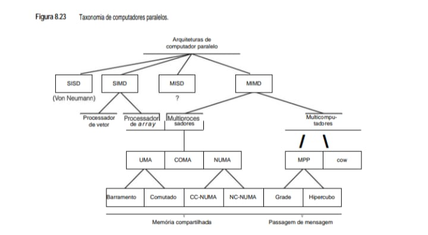

**• Síntese Técnica para o seu eBook:**

A taxonomia de Flynn e suas derivações modernas permitem classificar quase todo o hardware que estudamos até aqui:

 - MIMD (Multiple Instruction, Multiple Data): É a categoria mais relevante para o seu dia a dia. Ela se divide em:

    - Multiprocessadores (Memória Compartilhada): Onde se encaixa o seu Core i7. Ele utiliza a arquitetura UMA (Uniform Memory Access) via barramento para que todos os núcleos acessem a RAM igualmente.

    - Multicomputadores (Passagem de Mensagem): Onde se encaixam clusters e arquiteturas como COW (Cluster of Workstations) ou MPP (Massively Parallel Processors), similares ao que vimos na Figura 8.20.

 - SIMD (Single Instruction, Multiple Data): Categoria onde as GPUs (como a Fermi da Figura 8.17) operam de forma dominante, aplicando uma única instrução a grandes blocos de dados vetoriais simultaneamente.

 - NUMA (Non-Uniform Memory Access): Arquiteturas comuns em servidores de alta performance (como os da OCI) onde o tempo de acesso à memória depende da localização física do dado em relação ao processador.

Em nossa taxonomia, a categoria MIMD foi subdividida em multiprocessadores (máquinas de memória compartilhada) e multicomputadores (máquinas de troca de mensagens). Existem três tipos de multiprocessadores, distinguidos pelo modo como a memória compartilhada é neles implementada. Eles são denominados **UMA
(Uniform Memory Access – acesso uniforme à memória)** , **NUMA (NonUniform Memory Access – acesso não uniforme à memória)** e **COMA (Cache Only Memory Access – acesso somente à memória cache)**. Essas categorias existem porque, em grandes multiprocessadores, a memória costuma ser subdividida em vários módulos. A propriedade distintiva das máquinas UMA é que cada CPU tem o mesmo tempo de acesso a todos os módulos de memória. Ou seja, cada palavra de memória pode ser lida tão depressa quanto qualquer outra. Se isso for tecnicamente impossível, a velocidade das referências mais rápidas é reduzida para que se compatibilizem com as mais lentas, portanto, os programadores não veem a diferença. É isso que “uniforme” significa nesse caso. Essa uniformidade torna o desempenho previsível, um fator importante para escrever código eficiente.

Por comparação, essa propriedade não é válida em um multiprocessador **NUMA**. Muitas vezes, há um módulo de memória próximo a cada CPU e acessá-lo é mais rápido do que acessar os distantes. O resultado é que, por questões de desempenho, o local onde o código e os dados são posicionados é importante. Máquinas **COMA** também são não uniformes, mas de um modo diferente. Estudaremos detalhadamente cada um desses tipos e suas subcategorias mais adiante.

A outra categoria principal de máquinas **MIMD** consiste nos multicomputadores, que, diferente dos multiprocessadores, não têm memória primária compartilhada no nível da arquitetura. Em outras palavras, o sistema operacional em uma CPU de multicomputador não pode acessar memória ligada a uma CPU diferente apenas executando uma instrução LOAD. Ela tem de enviar uma mensagem explícita e esperar uma resposta. A capacidade­ do sistema operacional de ler uma palavra distante apenas executando uma LOAD é o que distingue multiprocessadores de multicomputadores. Como mencionamos antes, mesmo em um multicomputador, programas do
usuário podem ter a capacidade de acessar a memória remota usando instruções** LOAD e STORE**, mas essa ilusão é suportada pelo sistema operacional, e não pelo hardware. Essa diferença é sutil, mas muito importante. Como multicomputadores não têm acesso direto à memória remota, às vezes eles são denominados máquinas **NORMA (NO Remote Memory Access – sem acesso à memória remota)**.

Os multicomputadores podem ser divididos em duas categorias gerais. A primeira contém os **MPPs (Massively Parallel Processors – processadores de paralelismo maciço)**, que são supercomputadores caros que consistem em muitas CPUs fortemente acopladas por uma rede de interconexão proprietária de alta velocidade.
O **IBM SP/3** é um exemplo bem conhecido no mercado.

A outra categoria consiste em PCs ou estações de trabalho comuns, possivelmente montados em estantes e conectados por tecnologia de interconexão comercial, de prateleira. Em termos de lógica, não há muita diferença, mas supercomputadores enormes que custam muitos milhões de dólares são usados de modo diferente das redes de PCs montadas pelos usuários por uma fração do preço de um MPP. Essas máquinas caseiras são conhecidas por vários nomes, entre eles **NOW (Network of Workstations – rede de estações de trabalho)**, **COW (Cluster of Workstations – grupo de estações de trabalho)**, ou, às vezes, apenas **cluster** (grupo).

## 8.3.2 Semântica da memória
Ainda que todos os multiprocessadores apresentem às CPUs a imagem de um único espaço de endereço compartilhado, muitas vezes estão presentes muitos módulos de memória, cada um contendo alguma porção da memória física. As CPUs e memórias muitas vezes são conectadas por uma complexa rede de interconexão, como
discutimos na Seção 8.1.2. Diversas CPUs podem estar tentando ler uma palavra de memória ao mesmo tempo em que várias outras CPUs estão tentando escrever a mesma palavra, e algumas das mensagens de requisição podem ser ultrapassadas por outras em trânsito e ser entregues em uma ordem diferente daquela em que foram
emitidas. Além desse problema, há a existência de múltiplas cópias de alguns blocos de memória (por exemplo, em caches), o que pode resultar em caos com muita facilidade, a menos que sejam tomadas medidas rigorosas para evitá-lo. Nesta seção, veremos o que de fato significa memória compartilhada e como memórias podem reagir razoavelmente nessas circunstâncias.

Um modo de ver a semântica da memória é como um contrato entre o software e o hardware de memória (Adve e Hill, 1990). Se o software concordar em obedecer a certas regras, a memória concorda em entregar certos resultados e, então, a discussão fica centrada em quais são essas regras. Elas são denominadas modelos
de consistência e muitos modelos diferentes já foram propostos e executados.

Para dar uma ideia do problema, suponha que a CPU 0 escreve o valor 1 em alguma palavra de memória e, um pouco mais tarde, a CPU 1 escreve o valor 2 para a mesma palavra. Agora, a CPU 2 lê a palavra e obtém o valor 1. O proprietário do computador deve levar sua máquina para consertar? Isso depende do que a memória
prometeu (seu contrato).

* **Consistência estrita**
O modelo mais simples é o da consistência estrita. Nele, qualquer leitura para uma localização x sempre retorna o valor da escrita mais recente para x. Programadores adoram esse modelo, mas, na verdade, ele é efetivamente impossível de implementar de qualquer outro modo que não seja ter um único módulo de memória que apenas atende a todas as requisições segundo a política primeiro a chegar, primeiro a ser atendido, sem cache nem duplicação de dados. Essa implementação transformaria a memória em um imenso gargalo e, portanto, não é uma candidata séria, infelizmente.

* **Consistência sequencial**
O segundo melhor é um modelo denominado consistência sequencial (Lamport, 1979). Nesse caso, a ideia é que, na presença de múltiplas requisições de leitura (read) e escrita (write), o hardware escolhe (sem determinismo) alguma intercalação de todas as requisições, mas todas as CPUs veem a mesma ordem.

Para entender o que isso significa, considere um exemplo. Suponha que a CPU 1 escreve o valor 100 para a palavra x, e 1 ns mais tarde a CPU 2 escreve o valor 200 para a palavra x. Agora, suponha que 1 ns após a segunda escrita ter sido emitida (mas não necessariamente ainda concluída), duas outras CPUs, 3 e 4, leem a palavra x duas vezes cada uma em rápida sucessão, conforme mostra a Figura 8.24(a). Três possíveis ordenações dos seis eventos (duas escritas e quatro leituras)são mostradas na Figura 8.24 (b)–(d), respectivamente. Na Figura 8.24(b), a CPU 3 obtém (200, 200) e a CPU 4 obtém (200, 200). Na Figura 8.24(c), elas obtêm (100, 200) e (200, 200), respectivamente. Na Figura 8.24(d), elas obtêm (100, 100) e (200, 100), respectivamente. Todas essas são válidas, bem como algumas outras possibilidades que não são mostradas. Observe que não existe um único valor “correto”.

* **Figura 8.24 - (a) Duas CPUs escrevendo e duas CPUs lendo uma palavra de memória em comum. (b)–(d) Três modos possíveis de intercalar as duas escritas e as quatro leituras em relação ao tempo.**
Este diagrama mostra o que acontece quando duas CPUs tentam escrever em uma mesma variável ($x$) e outras duas tentam ler esses valores simultaneamente.

    (a) Cenário de Acesso                  (b)-(d) Sequências Possíveis
            à Memória                                  no Tempo
            
                 [CPU 2]                          (b)          (c)          (d)
                    |                            W100         W100         W200
            escrita 200                          W200         R3 = 100     R4 = 200
                    v                          R3 = 200       W200         W100
    [CPU 1] -> escrita 100 -> [ x ]            R3 = 200     R4 = 200     R3 = 100
                                |              R4 = 200     R3 = 200     R4 = 100
                            leitura 2x         R4 = 200     R4 = 200     R3 = 100
                                v
                            [CPU 3]          (W = Write/Escrita | R = Read/Leitura)
                                &
                            [CPU 4]

* **Resumo Técnico para o eBookA**
A Figura 8.24 é essencial para entender por que a ordem das operações importa em sistemas paralelos:

 - O Problema (a): As CPUs 1 e 2 realizam operações de escrita (valores 100 e 200), enquanto as CPUs 3 e 4 tentam ler o valor de $x$ duas vezes cada.
 
 - Intercalação no Tempo (b, c, d):
 
    - Sequência (b): Ambas as escritas terminam antes das leituras. As CPUs 3 e 4 leem o último valor gravado (200).
    
    - Sequência (c): Uma leitura ocorre entre as duas escritas. A CPU 3 vê o valor 100 primeiro e depois o 200.
    
    - Sequência (d): A ordem das escritas é invertida em relação ao tempo. As leituras finais resultam em 100.
    
 - Consistência Sequencial: Este exemplo demonstra que, sem mecanismos de sincronização (como locks ou barreiras), o resultado final de um programa paralelo pode variar a cada execução, dependendo de qual CPU "chega primeiro" à memória.

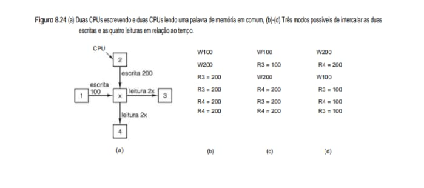

Contudo – e essa é a essência da consistência sequencial –, não importa o que aconteça, uma memória sequencialmente consistente nunca permitirá que a CPU 3 obtenha (100, 200) enquanto a CPU 4 obtém (200, 100). Se isso ocorresse, significaria que, de acordo com a CPU 3, a escrita de 100 pela CPU 1 concluiu após a
escrita de 200 pela CPU 2. Tudo bem. Mas também significaria que, de acordo com a CPU 4, a escrita de 200 pela CPU 2 concluiu antes da escrita de 100 pela CPU 1. Em si, esse resultado também é possível. O problema é que a consistência sequencial garante uma única ordenação global de todas as escritas, que é visível para todas as CPUs. Se a CPU 3 observar que 100 foi escrito primeiro, então a CPU 4 também deve ver essa ordem.

Embora a consistência sequencial não seja uma regra tão poderosa quanto a estrita, ainda é muito útil. Na verdade, ela diz que, quando múltiplos eventos acontecem concorrentemente, há alguma ordem verdadeira na qual eles ocorrem, talvez determinada pela temporização e pelo acaso, mas existe uma ordenação verdadeira e todos os processadores observam essa mesma ordem. Embora essa afirmativa talvez pareça óbvia, a seguir discutiremos modelos de consistência que nem isso garantem.

* **Consistência de processador**
Um modelo de consistência menos rigoroso, mas que é mais fácil de implementar em grandes multiprocessadores, é a consistência de processador (Goodman, 1989). Ele tem duas propriedades:

    1. Escritas por qualquer CPU são vistas por todas as CPUs na ordem em que foram emitidas.

    2. Para cada palavra de memória, todas as CPUs veem todas as escritas para ela na mesma ordem.

Esses dois pontos são importantes. O primeiro diz que, se a CPU 1 emitir escritas com valores 1A, 1B e 1C para alguma localização de memória nessa sequência, então todos os outros processadores as veem nessa ordem também.

Em outras palavras, qualquer outro processador em um laço restrito que observasse 1A, 1B e 1C lendo as palavras escritas nunca verá o valor escrito por 1B e depois o escrito por 1A, e assim por diante. O segundo ponto é necessário para exigir que toda palavra de memória tenha um valor não ambíguo após várias CPUs escreverem para ela e, por fim, pararem. Todos têm de concordar sobre qual veio por último.

Mesmo com essas restrições, o projetista tem muita flexibilidade. Considere o que acontece se a CPU 2 emitir escritas 2A, 2B e 2C concorrentemente com as três escritas da CPU 1. Outras CPUs que estão ocupadas lendo a memória observarão alguma intercalação de seis escritas, tal como 1A, 1B, 2A, 2B, 1C, 2C ou 2A, 1A, 2B, 2C, 1B, 1C ou muitas outras. A consistência de processador não garante que toda CPU vê a mesma ordenação, diferente da consistência sequencial, que dá essa garantia. Assim, é perfeitamente legítimo que o hardware se comporte de tal maneira que algumas CPUs veem a primeira ordenação mencionada, algumas veem a segunda e algumas veem ainda outras. O que é garantido é que nenhuma CPU verá a sequência na qual 1B vem antes de 1A e assim por diante. A ordem com que cada CPU faz suas escritas é observada em todos os lugares.

Vale a pena notar que alguns autores definem consistência de processador de modo diferente e não requerem a segunda condição.

* **Consistência fraca**
Nosso próximo modelo, a consistência fraca, nem mesmo garante que escritas de uma única CPU sejam vistas em ordem (Dubois et al., 1986). Em uma memória fracamente consistente, uma CPU poderia ver 1A antes de 1B e outra CPU poderia ver 1A depois de 1B. Contudo, para colocar alguma ordem no caos, tais memórias
têm variáveis de sincronização ou uma operação de sincronização. Quando uma sincronização é executada, todas as escritas pendentes são terminadas e nenhuma nova é iniciada até que todas as antigas – e a própria sincronização – estejam concluídas. Na verdade, uma sincronização “descarrega o pipeline” e leva a memória a um estado estável sem nenhuma operação pendente. Operações de sincronização são, em si, sequencialmente consistentes, isto é, quando múltiplas CPUs as emitem, alguma ordem é escolhida, mas todas as CPUs veem a mesma ordem.

Em consistência fraca, o tempo é dividido em épocas bem definidas delimitadas pelas sincronizações (sequencialmente consistentes), como ilustra a Figura 8.25. Nenhuma ordem relativa é garantida para 1A e 1B e diferentes CPUs podem ver as duas escritas em ordens diferentes, isto é, uma CPU pode ver 1A e então 1B e outra
CPU pode ver 1B e então 1A. Essa situação é permitida. Contudo, todas as CPUs veem 1B antes de 1C porque a primeira operação de sincronização força 1A, 1B e 2A a concluírem antes que 1C, 2B, 3A ou 3B tenham permissão de iniciar. Assim, realizando operações de sincronização, o software pode impor alguma ordem na sequência de eventos, embora não a custo zero, visto que descarregar o pipeline de memória toma algum tempo e, portanto, atrasa o processamento da máquina. Fazer isso com frequência pode ser um problema.

* **Figura 8.25 - A memória fracamente consistente usa operações de sincronização para dividir o tempo em épocas sequenciais.**
Este diagrama demonstra como o tempo é dividido em épocas sequenciais para garantir que todas as CPUs tenham uma visão coerente da memória em momentos específicos.

    ESCRITA
                 / t  \
    CPU A       1A 1B |  1C      |  1D 1E   |  1F
                      |          |          |
    CPU B      2A     |  2B      |  2C      |  2D
                      |          |          |
    CPU C             |  3A 3B   |  3C      |
                      |          |          |
               -------+----------+----------+-------> TEMPO
                      |          |          |
                    PONTO DE   PONTO DE   PONTO DE
                SINCRONIZACAO SINCRONIZACAO SINCRONIZACAO

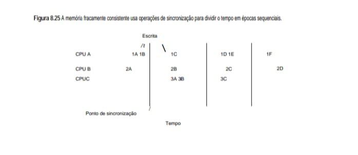

**• Resumo Técnico para o eBook**
A consistência fraca é uma estratégia de otimização comum em sistemas de alto desempenho, como os multiprocessadores heterogêneos:

 - Épocas Sequenciais: Em vez de tentar manter a memória atualizada para todos a cada instrução (o que seria muito lento), o sistema permite que as CPUs trabalhem de forma independente entre os Pontos de Sincronização.

 - Operações de Sincronização: Quando uma CPU atinge um ponto de sincronização, ela força a propagação de todas as suas escritas pendentes e atualiza suas leituras. Isso garante que, após o ponto, todas as CPUs concordem com o estado atual da memória compartilhada.

 - Exemplo de Fluxo: Na figura, as operações 1A e 1B da CPU A só precisam ser visíveis para as outras CPUs após o primeiro traço vertical (Sincronização).

* **Consistência de liberação**
A consistência fraca tem o problema de ser bastante ineficiente porque deve encerrar todas as operações de memória pendentes e deter todas as novas até que as operações correntes tenham terminado. A consistência de liberação melhora as coisas adotando um modelo semelhante ao das seções críticas (Gharachorloo et al., 1990). A ideia que fundamenta esse modelo é que, quando um processo sai de uma região crítica não é necessário forçar todas as escritas a concluírem imediatamente. Basta assegurar que elas estejam encerradas antes que qualquer processo entre naquela região crítica outra vez.

Nesse modelo, a operação de sincronização oferecida pela consistência fraca é subdividida em duas operações diferentes. Para ler ou escrever uma variável de dados compartilhada, uma CPU (isto é, seu software) deve realizar, primeiro, uma operação acquire na variável de sincronização para obter acesso exclusivo aos dados compartilhados. Então, a CPU pode usá-los como quiser, lendo e escrevendo à vontade. Ao concluir, a CPU realiza uma operação **release** na variável de sincronização para indicar que terminou. A **release** não obriga as escritas pendentes a concluir, mas ela própria não conclui até que as escritas emitidas antes estejam concluídas. Além do mais, novas operações de memória não são impedidas de iniciar imediatamente.

Quando a próxima operação acquire é emitida, é feita uma verificação para ver se todas as operações release anteriores foram concluídas. Se não foram, acquire é detida até que todas tenham concluído (e, portanto, que todas as escritas realizadas antes delas estejam concluídas). Desse modo, se a acquire seguinte ocorrer em um tempo longo o suficiente após a release mais recente, ela não tem de esperar antes de iniciar e pode entrar na região crítica sem demora. Se a acquire seguinte ocorrer logo após uma release, a acquire, e todas as instruções após ela, serão retardadas até todas as releases pendentes serem concluídas, garantindo assim que as variáveis na seção crítica tenham sido atualizadas. **Esse esquema é um pouco mais complicado do que consistência fraca, mas tem a significativa vantagem de não atrasar instruções com tanta frequência para manter consistência.**

A consistência de memória não é um assunto encerrado. Os pesquisadores ainda estão propondo novos modelos (Naeem et al., 2011; Sorin et al., 2011; e Tu et al., 2010).

## 8.3.3 Arquiteturas de multiprocessadores simétricos UMA(acesso uniforme à memória)
Os multiprocessadores mais simples são baseados em um único barramento, como ilustrado na Figura 8.26(a). Duas ou mais CPUs e um ou mais módulos de memória, todos usam o mesmo barramento para comunicação. Quando uma CPU quer ler uma palavra de memória, ela primeiro verifica se o barramento está ocupado. Se estiver ocioso, a CPU coloca nele o endereço da palavra que ela quer, ativa alguns sinais de controle e espera até que a memória coloque a palavra desejada no barramento.

Se o barramento estiver ocupado quando uma CPU quiser ler ou escrever na memória, a CPU apenas espera até que ele fique ocioso. E é aqui que está o problema desse projeto. Com duas ou três CPUs, a contenção pelo barramento será administrável; com 32 ou 64, será insuportável. O sistema ficará totalmente limitado pela largura de banda do barramento e a maioria das CPUs restará ociosa na maior parte do tempo.

**• Figura 8.26   Três multiprocessadores baseados em barramento. (a) Sem cache. (b) Com cache. (c) Com cache e memórias privadas.**
Este diagrama ilustra a evolução da arquitetura para reduzir o tráfego no barramento e melhorar o desempenho local das CPUs.

    (a) Sem Cache            (b) Com Cache            (c) Com Cache e
                                                            Memórias Privadas

        +-----+  +-----+         +-----+  +-----+         +-----+  +-----+
        | CPU |  | CPU |         | CPU |  | CPU |         | Mem.|  | Mem.|
        +--+--+  +--+--+         +--+--+  +--+--+         | Priv|  | Priv|
        |        |               |Cache|  |Cache|         +--+--+  +--+--+
        |        |               +--+--+  +--+--+            |        |
        +--+--------+--+      +-----+--+--+-----+--+      +--+--+  +--+--+
        |   MEMÓRIA    |      |      MEMÓRIA       |      | CPU |  | CPU |
        | COMPARTILHADA|      |   COMPARTILHADA    |      +--+--+  +--+--+
        +------+-------+      +---------+----------+      |Cache|  |Cache|
            |                          |                  +--+--+  +--+--+
            |                          |                     |        |
    [==== BARRAMENTO ====]   [==== BARRAMENTO ====]   [==== BARRAMENTO ====]
             |                          |                       |
         +---+---+                  +---+---+               +---+---+
         |   M   |                  |   M   |               |   M   |
         +-------+                  +-------+               +-------+

    (M = Módulo de Memória Global/Compartilhada)

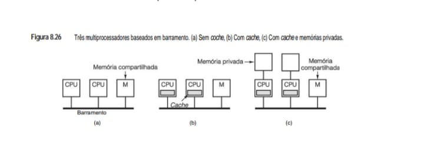

* **Notas Técnicas para o eBook:**

 - Configuração (a) - Sem Cache: Todas as instruções e dados devem ser buscados na memória compartilhada através do barramento. Isso gera um gargalo severo, pois o barramento fica rapidamente saturado com o tráfego de múltiplas CPUs.

 - Configuração (b) - Com Cache: Cada CPU possui um cache local para armazenar os dados e instruções mais usados. Isso reduz drasticamente a necessidade de acessar o barramento, mas introduz o problema da coerência de cache (garantir que todas as CPUs vejam a versão mais recente de um dado compartilhado).

 - Configuração (c) - Cache e Memória Privada: Além do cache, cada CPU possui uma memória privada para dados que nunca precisam ser compartilhados (como a pilha do sistema ou variáveis locais). Isso otimiza ainda mais o uso do barramento, deixando-o livre apenas para a comunicação essencial entre os nós.

A solução para esse problema é acrescentar uma cache a cada CPU, como retratado na Figura 8.26(b). A cache pode estar dentro do chip da CPU, próxima ao chip da CPU, na placa do processador ou alguma combinação de todas as três. Uma vez que agora muitas leituras podem ser satisfeitas pela cache local, haverá muito menos tráfego no barramento e o sistema pode suportar mais CPUs. Assim, nesse caso, fazer cache é um grande ganho. Porém, como veremos em breve, manter as caches consistentes entre si não é trivial.

Ainda outra possibilidade é o projeto da Figura 8.26(c), no qual cada CPU tem não só uma cache, mas também uma memória local e privada que ela acessa por um barramento dedicado (privado). Para fazer a utilização ideal dessa configuração, o compilador deve colocar nas memórias privadas todo o texto de programa, todas as cadeias, constantes e outros dados somente de leitura, pilhas e variáveis locais. Então, a memória compartilhada só é usada para variáveis compartilhadas que podem ser escritas. Na maioria dos casos, esse posicionamento cuidadoso reduzirá muito o tráfego no barramento, mas requer cooperação ativa do compilador.

* **Caches de escuta**
Embora os argumentos de desempenho que acabamos de apresentar decerto sejam verdadeiros, atenuamos um problema fundamental um pouco depressa demais. Suponha que a memória seja sequencialmente consistente. O que acontece se a CPU 1 tiver uma linha em sua cache e então a CPU 2 tentar ler uma palavra na mesma linha? Na ausência de quaisquer regras especiais, também ela obteria uma cópia em sua cache. Em princípio, é aceitável fazer duas vezes a cache de uma mesma linha. Agora, suponha que a CPU 1 modifique a linha e então, imediatamente após, a CPU 2 leia sua cópia da linha a partir de sua cache. Ela obterá dados velhos, violando
assim o contrato entre o software e a memória. O programa que está executando na CPU 2 não ficará satisfeito.

Esse problema, conhecido como **coerência de cache ou consistência de cache**, é extremamente sério. Sem uma solução, não se pode usar a cache e os multiprocessadores baseados em barramento ficariam limitados a duas ou três CPUs. Como consequência de sua importância, muitas soluções foram propostas ao longo dos anos (por exemplo, Goodman, 1983; e Papamarcos e Patel, 1984). Embora todos esses algoritmos de cache, denominados protocolos de coerência de cache,apresentem diferenças em detalhes, todos eles impedem que versões diferentes da mesma linha de cache apareçam simultaneamente em duas ou mais caches.

Em todas as soluções, o controlador de cache é projetado especialmente para permitir que ele escute o barramento monitorando todas as requisições de barramento de outras CPUs e caches e execute alguma ação em certos casos. Esses dispositivos são denominados **caches de escuta** ou, às vezes, **caches de espia**, porque “espiam” o barramento. O conjunto de regras executado pelas caches, CPUs e memória para impedir que diferentes versões dos dados apareçam em múltiplas caches forma o protocolo de coerência de cache. A unidade de transferência (LOAD) e armazenamento(STORE) de uma cache é denominada uma **linha de cache** e seu comprimento típico é 32 ou 64 bytes.

O protocolo de coerência de cache mais simples de todos é denominado **escrita direta**. Ele pode ser mais bem entendido distinguindo os quatro casos mostrados na Figura 8.27. Quando uma CPU tenta ler uma palavra que não está em sua cache (isto é, há uma ausência da cache para leitura), seu controlador de cache carrega nela a linha que contém aquela palavra. A linha é fornecida pela memória, que, nesse protocolo, está sempre atualizada. Leituras subsequentes (isto é, presenças na cache para leitura) podem ser satisfeitas pela cache.

* **Figura 8.27 - Protocolo de coerência de cache de escrita direta. Os retângulos vazios indicam que nenhuma ação foi realizada.**

        +---------------------+-----------------------+----------------------------------+
        |        AÇÃO         |        ESTADO         |             RESPOSTA             |
        +=====================+=======================+==================================+
        |                     | Ausência (Miss)       | [ Busque dados da memória ]      |
        |  REQUISIÇÃO LOCAL   | na Cache para Leitura |                                  |
        |     (READ/WRITE)    |-----------------------+----------------------------------+
        |                     | Presença (Hit)        | [ Use dados da cache local ]     |
        |                     | na Cache para Leitura |                                  |
        |                     |-----------------------+----------------------------------+
        |                     | Ausência (Miss)       | [ Atualize dados na memória ]    |
        |                     | na Cache para Escrita |                                  |
        |                     |-----------------------+----------------------------------+
        |                     | Presença (Hit)        | [ Atualize cache e memória ]     |
        |                     | na Cache para Escrita |                                  |
        +---------------------+-----------------------+----------------------------------+
        |  REQUISIÇÃO REMOTA  | Presença na Cache     | [ Invalide entrada de cache ]    |
        |    (SNOOPING)       | de outra CPU          |                                  |
        +---------------------+-----------------------+----------------------------------+             

Quando há uma ausência da cache para escrita, a palavra que foi modificada é escrita para a memória principal. A linha que contém a palavra referenciada não é carregada na cache. Quando há uma presença na cache para escrita, a cache é atualizada e, além disso, a palavra é escrita diretamente para a memória principal. A essência desse protocolo é que todas as operações de escrita resultam na escrita da palavra diretamente para a memória para mantê-la atualizada o tempo todo.

Agora, vamos observar todas essas ações de novo, mas, desta vez, do ponto de vista da escuta, mostrado na coluna à direita da Figura 8.27. Vamos dar nome de cache 1 à que realiza as ações e de cache 2 à de escuta. Quando a cache 1 encontra uma ausência da cache para leitura, ela faz uma requisição ao barramento para buscar uma linha da memória. A cache 2 vê isso, porém nada faz. Quando a cache 1 encontra uma presença na cache para leitura, a requisição é satisfeita localmente e não ocorre nenhuma requisição ao barramento, portanto, a cache 2 não está ciente das presenças na cache para leitura da cache 1.

Escritas são mais interessantes. Se a CPU 1 fizer uma escrita, a cache 1 fará uma requisição de escrita no barramento, tanto quando houver ausência da cache, como quando houver presença nela. Em todas as escritas a cache 2 verifica se ela tem a palavra que está sendo escrita. Se não tiver, de seu ponto de vista isso é uma requisição/ausência da cache remota e ela nada faz. (Para esclarecer um ponto sutil, note que, na Figura 8.27, uma ausência da cache remota significa que a palavra não está presente na cache de escuta; não importa se ela estava ou não na cache do originador. Assim, uma única requisição pode ser uma presença na cache localmente e uma ausência da cache na cache de escuta, e vice-versa.)

Agora, suponha que a cache 1 escreva uma palavra que está presente na cache da cache 2 (requisição remota/presença na cache para escrita). Se a cache 2 nada fizer, terá dados velhos, portanto, ela marca como inválida a entrada na cache que contém a palavra recém-modificada. Na verdade, ela remove o item da cache.
Como todas as caches escutam todas as requisições ao barramento, sempre que uma palavra for escrita, o efeito líquido é atualizá-la na cache do originador, atualizá-la na memória e extraí-la de todas as outras. Desse modo, são evitadas versões inconsistentes.

É claro que a CPU da cache 2 está livre para ler a mesma palavra já no ciclo seguinte. Nesse caso, a cache 2 lerá a palavra da memória, que está atualizada. Nesse ponto, cache 1, cache 2 e a memória, todas terão cópias idênticas da palavra. Se qualquer das CPUs fizer uma escrita agora, a cache da outra será purgada e a memória
será atualizada.

Muitas variações desse protocolo básico são possíveis. Por exemplo, em uma presença na cache para escrita, a cache de escuta em geral invalida sua entrada que contém a palavra que está sendo escrita. Como alternativa, poderia aceitar o novo valor e atualizar sua cache em vez de marcá-la como inválida. Em termos de conceito, atualizar a cache é o mesmo que invalidá-la, seguida por uma leitura da palavra na memória. Em todos os protocolos de cache deve ser feita uma escolha entre uma estratégia de atualização e uma estratégia de invalidação. Esses protocolos funcionam de maneira diferente em cargas diferentes. Mensagens de atualização carregam cargas úteis e, por isso, são maiores do que as de invalidação, mas podem evitar futuras ausências da cache.

Outra variante é carregar a cache de escuta quando houver ausência da cache para escrita. A correção do algoritmo não é afetada pelo carregamento, só o desempenho. A questão é: “Qual é a probabilidade de uma palavra recém-escrita ser escrita de novo em pouco tempo?”. Se for alta, há algo a dizer em favor de carregar a cache quando houver ausência desta para escrita, conhecida como política de alocação de escrita. Se for baixa, é melhor não atualizar quando houver ausência da cache para escrita. Se a palavra for lida dentro de pouco tempo, de qualquer modo ela será carregada pela ausência da cache para leitura; ganha-se pouco por carregá-la quando houver uma ausência da cache para escrita.

Como acontece com muitas soluções simples, essa é ineficiente. Cada operação de escrita vai até a memória passando pelo barramento, portanto, mesmo com uma modesta quantidade de CPUs, o barramento se tornará um gargalo. Para manter o tráfego dentro de limites, foram inventados outros protocolos de cache.
Uma propriedade que todos eles têm é que nem todas as escritas vão direto para a memória. Em vez disso, quando uma linha de cache é modificada, um bit é marcado dentro da cache, comunicando que a linha está correta, mas a memória não está. A certa altura, essa linha suja terá de ser escrita de volta na memória, porém, possivelmente depois que forem feitas muitas escritas nela. Esse tipo de protocolo é conhecido como protocolo de escrita retroativa (write-back).

**• O protocolo MESI de coerência de cache**
Um protocolo popular de coerência de cache de escrita retroativa é denominado MESI, representando as iniciais dos nomes dos quatro estados (M, E, S e I) que ele utiliza (Papamarcos e Patel, 1984). Ele é baseado no antigo protocolo escreve uma vez (write-once) (Goodman, 1983). O protocolo MESI é usado pelo Core i7 e por
muitas outras CPUs para espiar o barramento. Cada entrada de cache pode estar em um dos quatro estados:

    1. Inválido – A entrada da cache não contém dados válidos.

    2. Compartilhado (shared) – múltiplas caches podem conter a linha; a memória está atualizada.

    3. Exclusivo – nenhuma outra cache contém a linha; a memória está atualizada.

    4. Modificado – a entrada é válida; a memória é inválida; não existem cópias.

Quando a CPU é iniciada pela primeira vez, todas as entradas de cache são marcadas como inválidas. Na primeira vez que a memória é lida, a linha referenciada é buscada na cache da CPU que está lendo a memória e marcada como no estado E (exclusivo), uma vez que ela é a única cópia dentro de uma cache, como ilustrado
na Figura 8.28(a) para o caso da CPU 1 que está lendo a linha A. Leituras subsequentes por aquela CPU usam a entrada que está na cache e não passam pelo barramento. Outra CPU também pode buscar a mesma linha e colocá-la na cache, mas, por causa da escuta, o portador original (CPU 1) vê que não está mais sozinho e anuncia no barramento que ele também tem uma cópia. Ambas as cópias são marcadas como estado S (compartilhado), conforme mostra a Figura 8.28(b). Em outras palavras, o estado S significa que a linha está em uma ou em mais caches para leitura e a memória está atualizada. Leituras subsequentes por uma CPU para uma linha que ela colocou em cache no estado S não usam o barramento e não provocam mudança de estado.

Agora, considere o que acontece se a CPU 2 escrever para a linha de cache que ela está mantendo no estado S. Ela emite um sinal de invalidação no barramento, informando a todas as outras CPUs para descartar suas cópias. A cópia que está em cache agora passa para o estado M (modificado), como mostra a Figura 8.28(c). A linha não é escrita para a memória. Vale a pena observar que, se uma linha estiver no estado E quando for escrita, nenhum sinal é necessário para invalidar outras caches, porque todos sabem que não existe nenhuma outra cópia.

Em seguida, considere o que acontece se a CPU 3 ler a linha. A CPU 2, que agora possui a linha, sabe que a cópia na memória não é válida, portanto, ela ativa um sinal no barramento informando à CPU 3 que faça o favor de esperar enquanto ela escreve sua linha de volta para a memória. Quanto a CPU 2 concluir, a CPU 3 busca uma cópia e a linha é marcada como compartilhada em ambas as caches, como mostra a Figura 8.28(d). Após isso, a CPU 2 escreve a linha de novo, que invalida a cópia que está na cache da CPU 3, conforme mostra a Figura 8.28(e).

Por fim, a CPU 1 escreve uma palavra na linha. A CPU 2 vê que uma escrita está sendo tentada e ativa um sinal de barramento dizendo à CPU 1 fazer o favor de esperar enquanto ela escreve sua linha de volta na memória. Quando termina, a CPU 2 marca sua própria cópia como inválida, já que sabe que outra CPU está prestes a modificá-la. Nesse ponto, temos a situação em que uma CPU está escrevendo uma linha que não está na cache. Se a política de alocação de escrita estiver em uso, a linha será carregada na cache e marcada como em estado M, como ilustra a Figura 8.28(f). Se política de alocação de escrita não estiver em uso, a escrita irá diretamente até a memória e a linha não ficará em cache em lugar algum.

**• Figura 8.28 - Protocolo MESI de coerência de cache.**

         CPU 1       CPU 2       CPU 3      Memória
        +-----+     +-----+     +-----+     +-----+
    (a) |  A  |     |     |     |     |     |  A  |  CPU 1 lê bloco A
        +-----+     +-----+     +-----+     +-----+
        Exclusivo    Cache       Cache      Barramento
           |           |           |           |
        ---+-----------+-----------+-----------+---------
           |           |           |           |
    (b) |  A  |     |  A  |     |     |     |  A  |  CPU 2 lê bloco A
        +-----+     +-----+     +-----+     +-----+
        Compartilh. Compartilh.    Cache      Barramento
           |           |           |           |
        ---+-----------+-----------+-----------+---------
           |           |           |           |
    (c) |  I  |     |  A  |     |     |     |  A  |  CPU 2 escreve bloco A
        +-----+     +-----+     +-----+     +-----+
        Inválido   Modificado    Cache      Barramento
           |           |           |           |
        ---+-----------+-----------+-----------+---------
           |           |           |           |
    (d) |  I  |     |  A  |     |  A  |     |  A  |  CPU 3 lê bloco A
        +-----+     +-----+     +-----+     +-----+
        Inválido  Compartilh. Compartilh.   Barramento
           |           |           |           |
        ---+-----------+-----------+-----------+---------
           |           |           |           |
    (e) |  I  |     |  A  |     |  I  |     |  A  |  CPU 2 escreve bloco A
        +-----+     +-----+     +-----+     +-----+
        Inválido   Modificado  Inválido     Barramento
           |           |           |           |
        ---+-----------+-----------+-----------+---------
           |           |           |           |
    (f) |  A  |     |  I  |     |  I  |     |  A  |  CPU 1 escreve bloco A
        +-----+     +-----+     +-----+     +-----+
        Modificado   Inválido   Inválido     Barramento

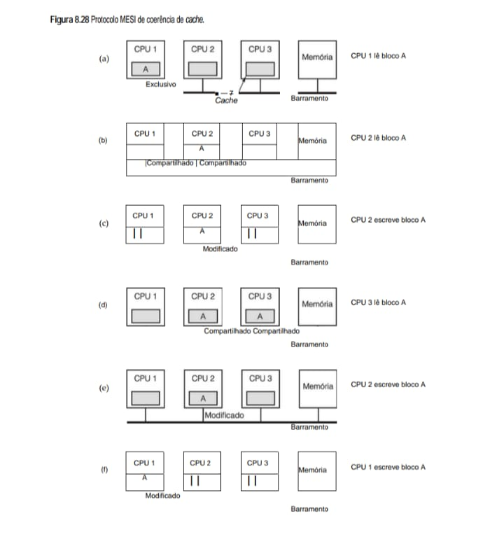

**• Notas Técnicas para o eBook:**

 - E - Exclusivo (a): A CPU 1 é a única a possuir o bloco A em cache. O dado está limpo (idêntico à memória principal).

 - S - Shared/Compartilhado (b, d): Mais de uma CPU possui o bloco. Todas as cópias estão limpas. Se uma CPU quiser escrever, as outras devem ser notificadas.

 - M - Modificado (c, e, f): A CPU possui a única cópia válida do dado, que foi alterado localmente e está "sujo" em relação à memória principal. As outras cópias são marcadas como Inválidas (I).

 - I - Inválido: O conteúdo do cache não é mais confiável e deve ser buscado novamente se a CPU precisar do dado.

**• Multiprocessadores UMA que usam switches crossbar**
Mesmo com todas as possíveis otimizações, a utilização de um único barramento limita o tamanho do multiprocessador UMA a cerca de 16 ou 32 CPUs. Para passar disso é preciso um tipo diferente de rede de interconexão. O circuito mais simples para conectar n CPUs a k memórias é o switch crossbar mostrado na Figura
8.28. Switches crossbar são utilizados há décadas em centrais de comutação telefônica para conectar um grupo de linhas de entrada a um conjunto de linhas de saída de um modo arbitrário.

Em cada intersecção de uma linha horizontal (de entrada) com uma linha vertical (de saída) está um ponto de cruzamento. Um ponto de cruzamento é um pequeno switch que pode ser aberto ou fechado eletricamente, dependendo de as linhas horizontal e vertical deverem ser ou não ser conectadas. Na Figura 8.29(a), vemos três pontos de cruzamento fechados simultaneamente, o que permite conexões entre os pares (CPU, memória) (001,000), (101, 101) e (110, 010) ao mesmo tempo. Muitas outras combinações também são possíveis. Na verdade, o número de combinações é igual ao número de modos diferentes em que oito torres podem ser posicionadas com segurança sobre um tabuleiro de xadrez.

**• Figura 8.29 - (a) Switch crossbar 8 × 8. (b) Ponto de cruzamento aberto. (c) Ponto de cruzamento fechado.**
Esta arquitetura permite que várias CPUs acessem diferentes módulos de memória simultaneamente sem gerar conflitos no barramento.

    (a) Switch Crossbar 8x8               Memórias
                                  000 001 010 011 100 101 110 111
                                   |   |   |   |   |   |   |   |
                            000 -- o---o---o---o---o---o---o---o
                                   |   |   |   |   |   |   |   |
                            001 -- o---●---o---o---o---o---o---o
                                   |   |   |   |   |   |   |   |
                            010 -- o---o---o---o---o---o---o---o
                CPUs        011 -- o---o---o---o---o---o---o---o
                                   |   |   |   |   |   |   |   |
                            100 -- o---o---o---o---o---o---o---o
                                   |   |   |   |   |   |   |   |
                            101 -- o---o---o---o---o---●---o---o
                                   |   |   |   |   |   |   |   |
                            110 -- o---o---●---o---o---o---o---o
                                   |   |   |   |   |   |   |   |
                            111 -- o---o---o---o---o---o---o---o

    (b) Aberto (Inativo)            (c) Fechado (Ativo)
        |                               |
        ---+---  <-- Linha da CPU       ---+---  
        |  o                            |  ●  <-- Conexão estabelecida
        |                               |
        v                               v
        Linha da Memória                Linha da Memória

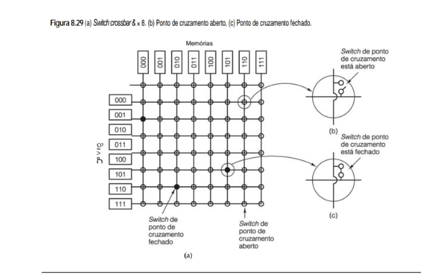

**• Notas Técnicas para o eBook:**

 - Arquitetura (a): Mostra uma grade onde as linhas horizontais representam as CPUs e as verticais os módulos de memória. Os pontos pretos (●) indicam conexões ativas entre uma CPU específica e uma memória.
 
 - Pontos de Cruzamento (b) e (c): Cada interseção possui um switch eletrônico. Quando o switch está aberto, não há passagem de dados. Quando está fechado, a CPU é conectada diretamente ao módulo de memória desejado.
 
 - Vantagem de Performance: Ao contrário do barramento único visto na Figura 8.26, o Crossbar permite paralelismo real: a CPU 001 pode ler a Memória 001 enquanto a CPU 110 lê a Memória 010 ao mesmo tempo.
 
 - Custo e Escalabilidade: O número de pontos de cruzamento cresce de forma quadrática ($n^2$). Para 8 CPUs e 8 Memórias, temos 64 pontos; para 1000 de cada, seriam 1.000.000 de pontos, o que torna essa arquitetura cara para sistemas muito grandes.

Uma das propriedades mais interessantes do switch crossbar é que ele é uma rede sem bloqueio, o que significa que a nenhuma CPU é negada a conexão de que necessita porque algum ponto de cruzamento ou linha já está ocupado (considerando que o módulo de memória em si esteja disponível). Além do mais, não é preciso planejamento antecipado. Ainda que já estejam estabelecidas sete conexões arbitrárias, sempre é possível conectar a CPU restante à memória restante. Mais adiante, veremos esquemas de interconexão que não têm essas propriedades.

Uma das piores propriedades do switch crossbar é o fato de que o número de pontos de cruzamento cresce com n2. O projeto de switches crossbar é viável para sistemas de tamanho médio. Discutiremos um desses projetos, o Sun Fire E25K, mais adiante neste capítulo. Contudo, com mil CPUs e mil módulos de memória, precisamos de um milhão de pontos de cruzamento. Um switch crossbar desse tamanho não é viável. Precisamos de algo bem diferente.

**• Multiprocessadores UMA que usam redes de comutação multiestágios**
Esse “algo bem diferente” pode ser baseado no modesto switch 2 × 2 mostrado na Figura 8.30(a). Ele tem duas entradas e duas saídas. Mensagens que chegam a qualquer uma das linhas de entrada podem ser comutadas para qualquer das linhas de saída. Para a finalidade que pretendemos aqui, as mensagens conterão até quatro partes, conforme mostra a Figura 8.30(b). O campo Módulo informa qual memória usar. O campo Endereço especifica um endereço dentro de um módulo. O campo Opcode dá a operação, como READ ou WRITE. Por fim, o campo opcional Valor pode conter um operando, como uma palavra de 32 bits a ser escrita em uma operação WRITE. O switch inspeciona o campo Módulo e o utiliza para determinar se a mensagem deve ser enviada por X ou por Y.

**• Figura 8.30 - (a) Switch 2 × 2. (b) Formato de mensagem.**

    (a) Switch 2 x 2                     (b) Formato de Mensagem
        +-------+
     ---|       |--- X        +--------+----------+--------+---------+
        |       |             | Módulo | Endereço | Opcode |  Valor  |
     ---|       |--- Y        +--------+----------+--------+---------+
        +-------+

 - Switch (a): Possui duas entradas e duas saídas (X e Y). Ele inspeciona o campo Módulo da mensagem recebida para determinar se deve encaminhá-la para a saída X ou Y.

 - Mensagem (b): Contém as informações necessárias para a operação: o Módulo de destino, o Endereço interno, o Opcode (ex: READ ou WRITE) e o Valor (dados de 32 bits para escrita).

**• Resumo Comparativo**
    +---------------------+---------------------+----------------------+--------------------------+
    | Arquitetura         | Escalabilidade      | Custo (Switches)     | Conflitos                |
    +---------------------+---------------------+----------------------+--------------------------+
    | Barramento Único    | Baixa               | Muito Baixo          | Alto (um por vez)        |
    +---------------------+---------------------+----------------------+--------------------------+
    | Crossbar (Grade)    | Média               | Muito Alto (n^2)     | Baixo (paralelismo total)|
    +---------------------+---------------------+----------------------+--------------------------+
    | Rede Ômega          | Alta                | Moderado (n/2 log2 n)| Médio (bloqueante)       |
    +---------------------+---------------------+----------------------+--------------------------+

Nossos switches 2 × 2 podem ser organizados de muitos modos para construir redes de comutação multiestágios maiores. Uma possibilidade é a rede ômega, classe econômica, sem supérfluos, ilustrada na Figura 8.31. Nesse caso, conectamos oito CPUs a oito memórias usando 12 switches. De modo mais geral, para n CPUs e n
memórias precisaríamos de log2 n estágios, com n/2 switches cada, para um total de (n/2)log2 n switches, o que é muito melhor do que n2 pontos de cruzamento, em especial para valores grandes de n.

O padrão de fiação da rede ômega costuma ser denominado embaralhamento perfeito, pois a mistura dos sinais em cada estágio é parecida com um baralho que é cortado ao meio e então embaralhado carta por carta. Para ver como a rede ômega funciona, suponha que a CPU 011 queira ler uma palavra do módulo de memória 110.
A CPU envia uma mensagem READ ao switch 1D que contém 110 no campo Módulo. O switch pega o primeiro bit de 110, isto é, o da extrema esquerda, e o utiliza para o roteamento. Um 0 roteia para a saída superior e um 1 roteia para a inferior. Como esse bit é um 1, a mensagem é roteada para 2D por meio da saída inferior.

Todos os switches do segundo estágio, incluindo 2D, usam o segundo bit para roteamento. Esse bit também é um 1, portanto, a mensagem agora é repassada para 3D por meio da saída inferior. Nesse ponto, o terceiro bit é testado e verifica-se que é 0. Por conseguinte, a mensagem sai pela saída superior e chega à memória 110, como desejado. O caminho percorrido por essa mensagem é marcado pela letra a na Figura 8.31.

**• Figura 8.31   Rede de comutação ômega.**

        ESTÁGIO 1        ESTÁGIO 2        ESTÁGIO 3
    CPUs    (2x2)            (2x2)            (2x2)        MEMÓRIAS
          +-------+        +-------+        +-------+
    000 --|       |--------|       |--------|       |-- 000
    001 --|  1A   |---+    |  2A   |---+    |  3A   |-- 001
          +-------+   |    +-------+   |    +-------+
                      |                |
    010 --|       |---+----|       |---+----|       |-- 010
    011 --|  1B   |---|----|  2B   |---|----|  3B   |-- 011
          +-------+   |    +-------+   |    +-------+
                      |                |
    100 --|       |---+----|       |---+----|       |-- 100
    101 --|  1C   |---|----|  2C   |---|----|  3C   |-- 101
          +-------+   |    +-------+   |    +-------+
                      |                |
    110 --|       |---+    |       |---+    |       |-- 110
    111 --|  1D   |--------|  2D   |--------|  3D   |-- 111
          +-------+        +-------+        +-------+

# Análise Técnica: Comutadores 2x2

## Estrutura dos Comutadores
Cada caixa (1A, 2B, etc.) pode conectar qualquer uma de suas 2 entradas a qualquer uma de suas 2 saídas (conhecidas como estado "direto" ou "cruzado").

## Roteamento por Bits
Para chegar à memória `011`, o sistema olha o endereço binário:
* O primeiro bit (0) orienta a saída no Estágio 1.
* O segundo bit (1) orienta no Estágio 2.
* O terceiro bit (1) orienta no Estágio 3.

## Bloqueio
Uma característica da Rede Ômega é que ela é bloqueante. Se a CPU `000` estiver acessando a Memória `000`, e a CPU `001` tentar acessar a Memória `010`, pode haver um conflito no uso de um caminho interno (uma "briga" pelo fio), forçando uma das CPUs a esperar.

* **Análise Técnica para o eBook**
Diferente do Crossbar, que requer n^2 switches, a Rede Ômega é mais econômica e organizada em camadas:

- Estrutura de Estágios: Para n CPUs, a rede possui log_2 n estágios. No exemplo de 8 CPUs, temos 3 estágios (2^3 = 8).

- Conexões de Estágio: Cada estágio contém n/2 switches 2 x 2

. No total, são usados 12 switches para conectar 8 CPUs, comparado aos 64 pontos necessários em um Crossbar.

- Conflitos de Bloqueio: Uma característica importante é que ela é bloqueante. Isso significa que, mesmo que duas CPUs queiram acessar memórias diferentes, elas podem "disputar" o mesmo switch interno, o que exige que uma espere a outra liberar o caminho.

À medida que a mensagem percorre a rede de comutação, os bits da extremidade esquerda do módulo já não são mais necessários. Eles podem muito bem ser usados para registrar ali o número da linha de entrada, de modo que a resposta possa encontrar seu caminho de volta. Para o caminho a, as linhas de entrada são 0 (entrada superior para 1D), 1 (entrada inferior para 2D) e 1 (entrada inferior para 3D), respectivamente. A resposta é roteada de volta usando 011, só que, desta vez, ela é lida da direita para a esquerda.

Ao mesmo tempo em que tudo isso está acontecendo, a CPU 001 quer escrever uma palavra para o módulo de memória 001. Nesse caso, acontece um processo análogo e a mensagem é roteada pelas saídas superior, superior e inferior, respectivamente, marcadas com a letra b. Quando chega, seu campo Módulo lê 001, que representa
o caminho que ela tomou. Uma vez que essas duas requisições não usam nenhum dos mesmos switches, linhas ou módulos de memória, elas podem prosseguir em paralelo.

Agora, considere o que aconteceria se a CPU 000 quisesse acessar simultaneamente o módulo de memória 000. Sua requisição entraria em conflito com a requisição da CPU 001 no switch 3A. Uma delas teria de esperar. Diferente do switch crossbar, a rede ômega é uma **rede com bloqueio.** Nem todos os conjuntos de requisições podem ser processados ao mesmo tempo. Podem ocorrer conflitos pela utilização de um fio ou de um switch, bem como entre requisições para a memória e respostas da memória.

É claramente desejável espalhar as referências à memória de maneira uniforme pelos módulos. Uma técnica comum é usar os bits de ordem baixa como o número de módulo. Considere, por exemplo, um espaço de endereço por bytes para um computador que acessa principalmente palavras de 32 bits. Os 2 bits de ordem baixa em
geral serão 00, mas os 3 bits seguintes estarão uniformemente distribuídos. Usando esses 3 bits como o número de módulo, palavras endereçadas consecutivamente estarão em módulos consecutivos. Um sistema de memória no qual palavras consecutivas estão em módulos consecutivos é denominado **intercalado**. Memórias intercaladas maximizam o paralelismo porque grande parte das referências à memória é para endereços consecutivos. Também é possível projetar redes de comutação que não são bloqueantes e oferecem múltiplos caminhos de cada CPU a cada módulo de memória, para distribuir melhor o tráfego.

## 8.3.4 Multiprocessadores NUMA
A esta altura, deve estar claro que multiprocessadores UMA de um único barramento em geral são limitados a não mais do que algumas dezenas de CPUs e que multiprocessadores crossbar ou comutados precisam de muito hardware (caro) e não são assim tão maiores. Para chegar a mais de cem CPUs, alguma coisa tem de ser
abandonada. Em geral, o que se abandona é a ideia de que todos os módulos de memória tenham o mesmo tempo de acesso. Essa concessão leva à ideia de multiprocessadores **NUMA (NonUniform Memory Access – acesso não uniforme à memória)**. Como seus primos UMA, eles fornecem um único espaço de endereço para todas as CPUs, porém, diferentemente das máquinas UMA, o acesso a módulos de memória locais é mais rápido do que o acesso a módulos remotos. Assim, todos os programas UMA executarão sem alteração em máquinas NUMA, mas o desempenho será pior do que em uma máquina UMA à mesma velocidade de clock.

Todas as máquinas NUMA têm três características fundamentais que, juntas, as distinguem de outros multiprocessadores:

    1. Há um único espaço de endereço visível a todas as CPUs.

    2. O acesso à memória remota é feito usando instruções **LOAD e STORE**.

    3. O acesso à memória remota é mais lento do que o acesso à memória local.

Quando o tempo de acesso à memória remota não é oculto (porque não há cache), o sistema é denominado **NC-NUMA**. Quando estão presentes caches coerentes, ele é denominado **CC-NUMA (ao menos pelo pessoal do hardware)**. O pessoal do software costuma denominá-lo **DSM de hardware**, porque ele é em essência o mesmo que memória compartilhada distribuída por software, mas implementada pelo hardware usando uma página de tamanho pequeno.

Umas das primeiras máquinas NC-NUMA (embora o nome ainda não tivesse sido cunhado) foi a Carnegie­‑Mellon Cm*, ilustrada de forma simplificada na Figura 8.32 (Swan et al., 1977). Ela consistia em uma coleção de CPUs LSI-11, cada uma com alguma memória endereçada por meio de um barramento local. (A LSI-11 era uma
versão de chip único do DEC PDP-11, um minicomputador popular na década de 1970.) Ademais, os sistemas LSI-11 eram conectados por um barramento de sistema. Quando uma requisição de memória entrava em uma MMU, especialmente modificada, era feita uma verificação para ver se a palavra necessária estava na memória
local. Se estivesse, era enviada uma requisição pelo barramento local para obter a palavra. Se não, a requisição era roteada pelo barramento de sistema até o sistema que continha a palavra, que, então, respondia. É claro que a última demorava muito mais do que a primeira. Embora um programa pudesse ser executado com facilidade a partir da memória remota, isso levava dez vezes mais tempo do que se o mesmo programa fosse executado a partir da memória local.

* **Figura 8.32   Máquina NUMA com dois níveis de barramentos. O Cm* foi o primeiro multiprocessador a usar esse projeto.**
Diferente das arquiteturas de acesso uniforme, o modelo NUMA (Non-Uniform Memory Access) organiza o sistema em nós locais para reduzir o congestionamento do barramento principal.

               MODULO 1          MODULO 2          MODULO 3          MODULO 4
            +-----------+     +-----------+     +-----------+     +-----------+
            | CPU | MEM |     | CPU | MEM |     | CPU | MEM |     | CPU | MEM |
            +--+--+--+--+     +--+--+--+--+     +--+--+--+--+     +--+--+--+--+
            |     |           |     |           |     |           |     |
         [MMU]----+        [MMU]----+        [MMU]----+        [MMU]----+
            |  Barramento     |  Barramento     |  Barramento     |  Barramento
            |  Local          |  Local          |  Local          |  Local
            |                 |                 |                 |
            ---+-----------------+-----------------+-----------------+----------
                            BARRAMENTO DO SISTEMA (Interconect)

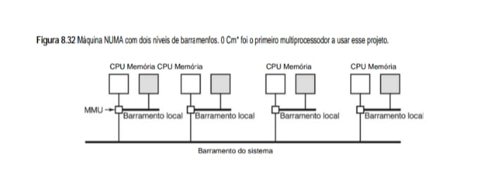

**• Análise Técnica para o eBook**

 - Acesso Local vs. Remoto: Cada CPU possui um Barramento Local que a conecta diretamente à sua própria memória. O acesso a essa memória "vizinha" é extremamente rápido.

 - Gargalo do Sistema: Quando uma CPU precisa de dados que estão na memória de outro nó, ela deve usar o Barramento do Sistema. Esse processo é mais lento e pode causar latência se muitas CPUs tentarem fazer o mesmo simultaneamente.

 - MMU (Memory Management Unit): Observe que a MMU está posicionada no barramento local. Ela decide se o endereço solicitado pela CPU está na memória local (acesso imediato) ou se precisa ser buscado através do barramento do sistema (acesso remoto).

 - Escalabilidade: Esse projeto permite adicionar mais CPUs de forma eficiente, mas exige que o programador (ou o sistema operacional) seja inteligente ao alocar dados próximos aos processadores que os utilizam.

A coerência de memória é garantida em uma máquina NC-NUMA porque não há cache presente. Cada palavra de memória reside em exatamente um local, portanto, não há perigo de uma cópia ter dados velhos: não há cópias. Claro que agora é muito importante saber que página está em qual memória, porque a penalidade sobre
o desempenho no caso de ela estar no lugar errado é muito grande. Por conseguinte, máquinas NC-NUMA usam software elaborado para mover páginas de um lado para outro de modo a maximizar o desempenho.

Em geral, há um processo residente denominado **scanner de páginas** que executa com intervalo de poucos segundos. Sua tarefa é examinar a estatística de utilização e mover páginas de um lado para outro na tentativa de melhorar o desempenho. Se a página parece estar no lugar errado, o scanner a desmapeia de modo que a próxima referência a ela causará uma falta de página. Quando ocorre a falta, é tomada uma decisão sobre onde colocá-la, possivelmente em uma memória diferente daquela em que estava antes. Para evitar paginação excessiva (thrashing), costuma haver alguma regra afirmando que, uma vez posicionada, a página é congelada no lugar durante algum tempo ΔT. Vários algoritmos foram estudados, mas a conclusão é que nenhum funciona melhor em todas as circunstâncias (LaRowe e Ellis, 1991). O melhor desempenho depende da aplicação.

* **Multiprocessadores NUMA com coerência de cache**
Projetos de multiprocessadores como o da Figura 8.32 não se prestam muito bem à ampliação, porque não fazem cache. Ter de ir até a memória remota toda vez que uma palavra de memória não local for acessada é um grande empecilho ao desempenho. Contudo, se for adicionado cache, então é preciso adicionar também coerência
de cache. Um modo de proporcionar coerência é escutar o barramento de sistema. Tecnicamente, não é difícil fazer isso, mas, se for ultrapassado certo número de CPUs, torna-se inviável. Para construir multiprocessadores grandes de fato é preciso usar uma técnica fundamentalmente diferente.

Hoje, a abordagem mais popular para construir multiprocessadores **CC-NUMA (Cache Coherent NUMA – NUMA com coerência de cache)** de grande porte é o **multiprocessador baseado em diretório**. A ideia é manter um banco de dados que informa onde está cada linha de cache e em que estado ela está. Quando uma linha de cache é referenciada, o banco de dados é pesquisado para descobrir onde ela está e se está limpa ou suja (modificada). Como é preciso pesquisar esse banco de dados a cada instrução que referenciar a memória, ele tem de ser mantido em hardware extremamente rápido de uso especial, que pode responder em uma fração de um ciclo de barramento.

Para tornar um pouco mais concreta a ideia de um multiprocessador baseado em diretório, vamos considerar o exemplo simples (hipotético) de um sistema de 256 nós, cada qual consistindo em uma CPU e 16 MB de RAM conectados à CPU por um barramento local. A memória total é 2^32 bytes, dividida em 2^26 linhas de cache de 64 bytes cada. A memória é alocada estaticamente entre os nós, com 0–16M no nó 0, 16–32M no nó 1 e assim por diante. Os nós são conectados por uma rede de interconexão, como mostra a Figura 8.33(a). A rede de interconexão poderia ser uma grade, um hipercubo ou outra topologia. Cada nó também contém as entradas de diretório para as 218 linhas de cache de 64 bytes abrangendo sua memória de 224 bytes. Por enquanto, vamos considerar que uma linha pode ser contida, no máximo, em uma cache.

Para ver como o diretório funciona, vamos acompanhar uma instrução LOAD da CPU 20 que referencia uma linha que está em cache. Primeiro, a CPU que está emitindo a instrução a apresenta à sua MMU (unidade de gerenciamento de memória), que a traduz para um endereço físico, por exemplo, 0x24000108. A MMU subdivide esse endereço nas três partes mostradas na Figura 8.33(b). Em decimal, essas três partes são nó 36, linha 4 e deslocamento 8. A MMU vê que a palavra de memória referenciada é do nó 36, e não do nó 20, portanto, envia uma mensagem de requisição pela rede de interconexão ao nó nativo da linha, 36, perguntando se sua linha 4 está em cache e, se sim, onde está.

* **Figura 8.33 - (a) Multiprocessador de 256 nós baseado em diretório. (b) Divisão de um endereço de memória de 32 bits em campos. (c) Diretório no nó 36.**
Esta arquitetura resolve o problema de escala: em vez de todas as CPUs "escutarem" o barramento (o que causaria um congestionamento imenso), cada nó gerencia quem tem acesso aos seus próprios dados através de um diretório local.

    (a) Arquitetura dos Nós

        [ NÓ 0 ]               [ NÓ 1 ]               [ NÓ 255 ]
    CPU     Memória        CPU     Memória        CPU     Memória
    +---+     +---+        +---+     +---+        +---+     +---+
    |   |     |   |        |   |     |   |        |   |     |   |
    +-+-+     +-+-+        +-+-+     +-+-+        +-+-+     +-+-+
      |         |            |         |            |         |
    --+----+----+--        --+----+----+--        --+----+----+--
      | Barramento|          | Barramento|          | Barramento|
      |   Local   |          |   Local   |          |   Local   |
    --+----+----+--        --+----+----+--        --+----+----+--
           |                      |                      |
      +----+----+            +----+----+            +----+----+
      |Diretório|            |Diretório|            |Diretório|
      +---------+            +---------+            +---------+
           |                      |                      |
    -------+----------------------+----------+-----------+-------
    |      REDE DE INTERCONEXÃO (Malha, Hipercubo, etc.)        |
    -------------------------------------------------------------

    (b) Divisão do Endereço (32 bits)

        +----------------+--------------------------+-------------------+
        |  Nó (8 bits)   |      Bloco (18 bits)     | Deslocam. (6 bits)|
        +----------------+--------------------------+-------------------+
        (Qual dos 256)    (Qual linha na memória)     (Byte no bloco)

    (c) Exemplo de entrada no diretório do Nó 36

        Índice do Bloco         Bit de Presença / Nó
        +---------------+      +-----------------------+
        |      ...      |      |          ...          |   2 ^ 18 -1
        +---------------+      +-----------------------+
        |       4       |      |  0  0  0  0  0  0  0  |
        +---------------+      +-----------------------+
        |       3       |      |  0  0  0  0  0  0  0  |
        +---------------+      +-----------------------+
        |       2       |      |  1  (Nó 82 possui)    | <-- Exemplo
        +---------------+      +-----------------------+
        |       1       |      |  0  0  0  0  0  0  0  |
        +---------------+      +-----------------------+
        |       0       |      |  0  0  0  0  0  0  0  |
        +---------------+      +-----------------------+
                ^                           ^
                |                           |
        Identifica o bloco       Indica quais dos 256 nós 
        na memória local         têm uma cópia deste bloco

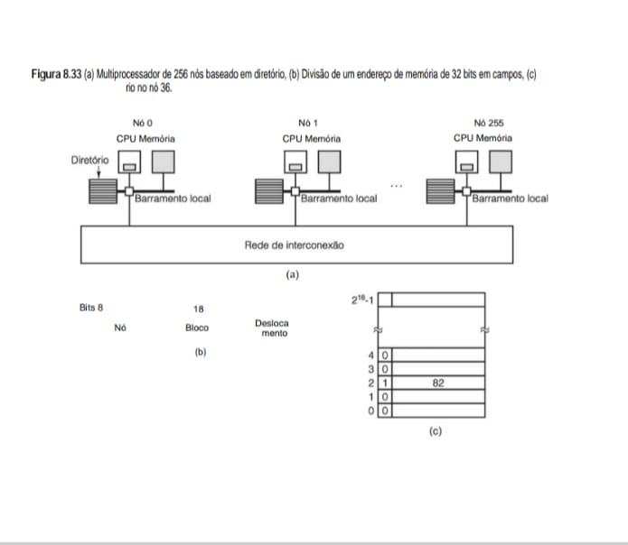

**• Notas de Estudo para o eBook:

 - O Diretório (a): Cada nó possui uma tabela (diretório) que sabe exatamente quais outros nós no sistema possuem uma cópia de seus blocos de memória. Se a CPU 0 quiser escrever em um dado, ela consulta seu diretório; se a CPU 255 tiver uma cópia, o diretório envia uma mensagem de invalidação apenas para ela.
 
 - Encaminhamento de Mensagens: A comunicação não é mais global (broadcast), mas direcionada (point-to-point), o que permite que o sistema cresça para centenas de processadores sem saturar a rede.
 
 - Mapeamento (b): Com 8 bits dedicados ao campo "Nó", o sistema consegue endereçar até 2^8 = 256 unidades independentes de processamento e memória.

 - Mapeamento de Presença: Cada entrada no diretório possui um conjunto de bits (ou um identificador) que aponta para os nós que carregaram aquele bloco em suas caches locais.

 - O Exemplo do Bloco 2: Na figura, o bloco 2 do Nó 36 está sendo usado pelo Nó 82. Se o Nó 36 precisar alterar esse dado, ele agora "sabe" exatamente que deve enviar uma mensagem de invalidação para o Nó 82, e não para todos os outros 255 nós.

 - Escalabilidade: Este mecanismo evita o tráfego desnecessário na Rede de Interconexão (Figura 8.33-a), permitindo que o sistema funcione de forma eficiente mesmo com centenas de processadores.

Quando a requisição chega ao nó 36 pela rede de interconexão, ela é roteada para o hardware de diretório. O hardware indexa para sua tabela de 218 entradas, uma para cada linha de cache, e extrai a entrada 4. Pela Figura 8.33(c), vemos que a linha não está em cache, portanto, o hardware busca a linha 4 na RAM local, a envia de volta ao nó 20 e atualiza a entrada de diretório 4 para indicar que a linha agora está em cache no nó 20.

Agora, vamos considerar uma segunda requisição, desta vez perguntando sobre a linha 2 do nó 36. Pela Figura 8.33(c), vemos que essa linha está em cache no nó 82. Nesse ponto, o hardware poderia atualizar a entrada de diretório 2 para informar que a linha agora está no nó 20 e então enviar uma mensagem ao nó 82 instruindo-o a passar a linha para o nó 20 e invalidar sua cache. Note que, mesmo um “multiprocessador de memória compartilhada”, por assim dizer, tem uma grande atividade oculta de troca de mensagens.

A propósito, vamos calcular quanta memória está sendo tomada pelos diretórios. Cada nó tem 16 MB de RAM e 218 entradas de 9 bits para monitorar aquela RAM. Assim, o overhead do diretório é de cerca de 9 × 218 bits divididos por 16 MB, ou mais ou menos 1,76%, o que, em geral, é aceitável (embora tenha de ser memória de alta velocidade, o que aumenta o custo). Mesmo com linhas de 32 bytes, o overhead seria de apenas 4%. Com linhas de cache de 128 bytes, ele estaria abaixo de 1%.

Uma limitação óbvia desse projeto é que uma linha só pode ser colocada em cache em um único nó. Para permitir cache de linhas em vários nós, precisaríamos de algum modo de localizar todas, por exemplo, para invalidá-las ou atualizá-las em uma escrita. Há várias opções para permitir cache em vários nós ao mesmo tempo.

Uma possibilidade é dar a cada entrada de diretório k campos para especificar outros nós, permitindo assim o caching de cada linha em até k nós. Uma segunda possibilidade é substituir o número do nó em nosso projeto simples por um mapa de bits, com um bit por nó. Nessa opção, não há nenhum limite à quantidade de cópias que pode haver, mas há um substancial aumento no overhead. Um diretório com 256 bits para cada linha de cache de 64 bytes (512 bits) implica um overhead de mais de 50%. Uma terceira possibilidade é manter um campo de 8 bits em cada entrada de diretório e usá-lo como o cabeçalho de uma lista encadeada que enfileira todas as cópias da linha de cache. Essa estratégia requer armazenamento extra em cada nó para ponteiros da lista encadeada e também demanda percorrer uma lista encadeada para achar todas as cópias quando isso for necessário. Cada possibilidade tem suas próprias vantagens e desvantagens, e todas as três têm sido usadas em sistemas reais.

Outra melhoria do projeto de diretório é monitorar se a linha de cache está limpa (memória residente está atualizada) ou suja (memória residente não está atualizada). Se chegar uma requisição de leitura para uma linha de cache limpa, o nó nativo pode cumprir a requisição de memória sem ter de repassá-la para uma cache. Contudo, uma requisição de leitura para uma linha de cache suja deve ser passada para o nó que contém a linha de cache porque somente ele tem uma cópia válida. Se for permitida apenas uma cópia de cache, como na Figura 8.33, não há vantagem real alguma em monitorar sua limpeza, porque qualquer nova requisição exige que seja enviada uma mensagem à cópia existente para invalidá-la.

Claro que monitorar se cada linha de cache está limpa ou suja implica que, quando uma linha de cache é modificada, o nó nativo tem de ser informado, mesmo se existir somente uma cópia de cache. Se existirem várias cópias, modificar uma delas requer que o resto seja invalidado, portanto, é preciso algum protocolo para evitar condições de disputa. Por exemplo, para modificar uma linha de cache compartilhada, um dos portadores poderia ter de requisitar acesso exclusivo antes de modificá-la. Tal requisição faria com que todas as outras cópias fossem invalidadas antes da concessão da permissão. Outras otimizações de desempenho para máquinas CC-NUMA são discutidas em Cheng e Carter, 2008.

* **O multiprocessador NUMA Sun Fire E25K**
Como exemplo de um multiprocessador NUMA de memória compartilhada, vamos estudar a família Sun Fire da Sun Microsystems. Embora essa família contenha vários modelos, focalizaremos o E25K, que tem 72 chips de CPU UltraSPARC IV. Uma UltraSPARC IV é, basicamente, um par de processadores UltraSPARC III que com-
partilham uma cache e memória. O E15K é, em essência, o mesmo sistema, exceto que tem um uniprocessador em vez de chips de CPU com processadores duais. Existem membros menores também, mas, de nosso ponto de vista, o interessante é como funcionam os que têm o maior número de CPUs.

O sistema E25K consiste em até 18 conjuntos de placas, cada conjunto composto por uma placa CPU-memória, uma placa de E/S com quatro conectores PCI e uma placa de expansão que acopla a placa CPU-memória à placa de E/S e une o par ao plano central, que suporta as placas e contém a lógica de comutação. Cada placa CPU-memória contém quatro chips de CPU e quatro módulos de RAM de 8 GB. Por conseguinte, cada placa CPU-memória no E25K contém oito CPUs e 32 GB de RAM (quatro CPUs e quatro 32 GB de RAM no E15K). Assim, um E25K completo contém 144 CPUs, 576 GB de RAM e 72 conectores PCI. Ele é ilustrado na Figura 8.34. O interessante é que o número 18 foi escolhido por causa de limitações de empacotamento: um sistema com 18 conjuntos de placas era o maior que podia passar inteiro por uma porta. Enquanto programadores só pensam em 0s e 1s, engenheiros têm de se preocupar com questões como se o produto consegue passar pela porta e entrar no prédio do cliente.

* **Figura 8.34 - Multiprocessador E25K da Sun Microsystems.**
Essa imagem representa a Figura 8.34, que detalha o Multiprocessador E25K da Sun Microsystems. É um exemplo clássico de um sistema de grande porte (mainframe/supercomputador) que utiliza uma arquitetura baseada em Crossbar Switch (Plano Central) para conectar múltiplas placas de CPU, memória e E/S.

Este sistema utiliza um Plano Central (Centerplane) com chaves crossbar de 18 X 18 para permitir que qualquer placa de CPU se comunique com qualquer placa de expansão ou E/S simultaneamente.

        9 PLACAS CPU-MEMÓRIA                     9 PLACAS DE E/S
        +-----------------------+    PLANO     +---------------------+
        | [CPU][MEM] [CPU][MEM] |    CENTRAL   | [Cont. PCI] [PCI]   |
        | [CPU][MEM] [CPU][MEM] |    (Cross)   | [Cont. PCI] [PCI]   |
        +-----------+-----------+   +-----+    +----------+----------+
                    |               |  C  |               |
         [Barramento de Escuta]-----|  R  |-----[Barramento de Escuta]
                    |               |  O  |               |
         [Controle de Diretório]----|  S  |-----[Controle de Diretório]
                    |               |  S  |               |
         [ Placa de Expansão  ]-----|  B  |-----[ Placa de Expansão  ]
                    |               |  A  |               |
                    |               |  R  |               |
                    +---------------+-----+---------------+

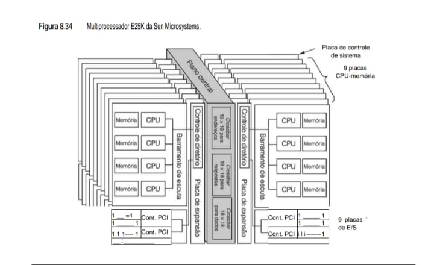

* **Análise Estrutural para o eBook:**

 - Plano Central (Centerplane): Funciona como o "coração" do sistema. Ele contém três tipos de chaves crossbar 18 X 18: uma para endereços, uma para respostas e uma para dados. Isso permite uma largura de banda massiva e evita gargalos comuns em barramentos únicos.
 
 - Barramento de Escuta (Snooping): Mesmo em um sistema gigante como este, as placas usam barramentos de escuta locais para manter a coerência de cache entre as CPUs de uma mesma placa.
 
 - Controle de Diretório: Essencial para a escalabilidade. Em vez de todas as CPUs "gritarem" no barramento o tempo todo para saber quem tem qual dado (o que saturaria o sistema), o diretório mantém um registro de onde os dados estão.

O plano central é composto de um conjunto de três switches crossbar 18 × 18 para conectar os 18 conjuntos de placas. Um switch crossbar é para as linhas de endereço, um é para respostas e um é para transferência de dados. Além das 18 placas de expansão, o plano central também tem um conjunto de placas de controle de sistema ligado a ele. Esse conjunto tem uma única CPU, mas também interfaces com CD-ROM, fita, linhas seriais e outros dispositivos periféricos necessários para inicializar, manter e controlar o sistema.

O coração de qualquer multiprocessador é o subsistema de memória. Como conectar 144 CPUs à memória distribuída? Os modos diretos – um grande barramento de escuta compartilhado ou um switch crossbar 144 × 72 – não funcionam bem. O primeiro falha porque o barramento é um gargalo e o último falha porque é muito
difícil e muito caro construir o switch. Por isso, grandes multiprocessadores como o E25K são obrigados a usar um subsistema de memória mais complexo.

No nível do conjunto de placas é usada lógica de escuta, de modo que todas as CPUs locais podem verificar todas as requisições de memória que vêm do conjunto de placas para referências a blocos que estão em suas caches no momento. Assim, quando uma CPU necessita de uma palavra da memória, primeiro ela converte o endereço virtual para um endereço físico e verifica sua própria cache. (Endereços físicos têm 43 bits, mas restrições de empacotamento limitam a memória a 576 GB.) Se o bloco de cache de que ela necessita estiver em sua própria cache, a palavra é devolvida. Caso contrário, a lógica de escuta verifica se há uma cópia
daquela palavra disponível em algum outro lugar do conjunto de placas. Se houver, a requisição é cumprida. Se não houver, a requisição é passada adiante por meio do switch crossbar 18 × 18 de endereço como descreveremos mais adiante. A lógica de escuta só pode fazer uma escuta por ciclo de clock. O clock do sistema
funciona a 150 MHz, portanto, é possível realizar 150 milhões de escutas/segundo por conjunto de placas ou 2,7 bilhões de escutas/segundo no âmbito do sistema.

Embora em termos lógicos a lógica de escuta seja um barramento, como retratado na Figura 8.34, em termos físicos ela é uma árvore de dispositivos, cujos comandos são repassados para cima e para baixo dela. Quando uma CPU ou uma placa PCI produzem um endereço, este vai até um repetidor de endereços por meio de uma conexão ponto a ponto, como mostra a Figura 8.35. Os dois repetidores convergem para a placa de expansão, onde os endereços são enviados de volta árvore abaixo para cada dispositivo para verificar presenças. Esse arranjo é usado para evitar ter um barramento que envolva três placas.

* **Conectando 144 CPUs à Memória Distribuída**

Para conectar 144 CPUs à memória distribuída, é necessário um subsistema de memória mais complexo, pois os modos diretos (barramento compartilhado ou switch crossbar) não são viáveis.

Algumas opções incluem:

 - Rede de Interconexão Hierárquica: uma rede de interconexão hierárquica, com vários níveis de switches e barramentos, pode ser usada para conectar os processadores à memória distribuída.
 
 - Rede de Interconexão em Malha: uma rede de interconexão em malha, com cada processador conectado a seus vizinhos, pode ser usada para conectar os processadores à memória distribuída.
 
 - Rede de Interconexão em Árvore: uma rede de interconexão em árvore, com cada processador conectado a um nó da árvore, pode ser usada para conectar os processadores à memória distribuída.
 
 Exemplos de Computadores que Usam essa Arquitetura
 
 - Sun Enterprise 25K (E25K): um servidor de alta escalabilidade da Sun Microsystems, que usa uma arquitetura de multiprocessador com memória distribuída.
 
 - IBM pSeries: uma linha de servidores de alta escalabilidade da IBM, que usa uma arquitetura de multiprocessador com memória distribuída.

*  **Figura 8.35 - O Sun Fire E25K usa uma interconexão de quatro níveis. As linhas tracejadas são caminhos de endereços. As linhas cheias são caminhos de dados.**
Este diagrama mostra o fluxo entre o Nível 0 (componentes físicos) até o Nível 3 (barramento central de alta velocidade).

            NÍVEL 3: PLANO CENTRAL
        +----------------------------------------------------------------+
        | [Crossbar Endereços]   [Crossbar Respostas]   [Crossbar Dados] |
        |         18 x 18                18 X 18               18 X 18   |
        +----------:--------------------:--------------------|-----------+
                   :                    :                    |
        NÍVEL 2: PLACA DE EXPANSÃO      :                    |
        +----------:--------------------:----------+         |
        | [Gerenciamento de Diretório e Escuta]    |    [Switch Dados 3x3]
        +----------:-------------------------------+         |
                :                                         |
        NÍVEL 1: PLACA CPU-MEMÓRIA                           |
        +----------:-----------------------------------------|--------+
        | [Rep. de Endereços] <---- (Sinais de Controle) ----+        |
        |    :          :                                    |        |
        | [Switch Dados 3x3] <-------------------------------+        |
        +----:----------:---------------------------------------------+
            :          :
        NÍVEL 0: COMPONENTES FÍSICOS
        [CPU]      [MEM]
        
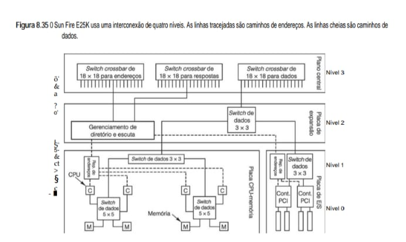

* **Notas de Arquitetura para o eBook**

 - Separação de Tráfego: Observe que o sistema possui barramentos distintos para endereços e dados. Isso evita que uma busca por endereço bloqueie a transferência de um grande bloco de dados que já foi localizado.
 
 - Decisão de Roteamento (Nível 2): O hardware de diretório decide se o dado está na mesma placa (Nível 1) ou se a requisição deve subir para o Plano Central (Nível 3) para buscar em outra placa do servidor.
 
 - Eficiência Local (Nível 0): O switch 5 X 5 permite que duas CPUs acessem suas memórias locais sem precisar incomodar o restante do sistema, o que é a base da eficiência NUMA.

# Análise dos Níveis

## Níveis de Comunicação
* **Nível 3 (Plano Central)**: Onde residem os switches crossbar 18 X 18. É o nível global de comunicação.
* **Nível 2 (Placa de Expansão)**: Atua como um "agregador". O gerenciamento de diretório aqui é fundamental para filtrar o tráfego de endereços, evitando que mensagens desnecessárias cheguem ao Plano Central.
* **Nível 1 (Placa de Unidade)**: Contém switches menores (3 X 3) que gerenciam o tráfego interno da placa.
* **Nível 0 (Componentes)**: É onde a computação acontece de fato (CPUs e Módulos de Memória).

## Diferenciação de Caminhos
* **Linhas Tracejadas (Endereços)**: Seguem uma topologia de árvore para garantir que a coerência de cache seja mantida via diretório.
* **Linhas Cheias (Dados)**: Utilizam a malha de switches para transferência de alta velocidade, otimizando o throughput.

Transferências de dados usam uma interconexão de quatro níveis como ilustrado na Figura 8.35. Esse projeto foi escolhido por causa de seu alto desempenho. No nível 0, pares de chips de CPU e memórias são conectados por um pequeno switch crossbar que também tem uma conexão com o nível 1. Os dois grupos de pares CPU-memória são conectados por um segundo switch crossbar no nível 1. Os switches crossbar são ASICs fabricados por especificação. Para todos eles, todas as entradas estão disponíveis nas linhas, bem como nas colunas, embora nem todas as combinações sejam usadas (ou nem mesmo façam sentido). Toda a lógica de comutação nas placas é construída a partir de crossbars 3 × 3.

Cada conjunto de placas consiste em três placas: a CPU-memória, a placa de E/S e a de expansão, que conecta as outras duas. A interconexão de nível 2 é outro switch crossbar 3 × 3 (na placa de expansão) que une a memória propriamente dita às portas de E/S (que são de mapeamento de memória em todas as UltraSPARCs). Todas as transferências de dados de ou para o conjunto de placas, seja para memória ou para uma porta de E/S, passam pelo switch de nível 2. Por fim, dados que têm de ser transferidos de ou para uma placa remota passam por um switch crossbar 18 × 18 de dados no nível 3. Transferências de dados são feitas 32 bytes por vez, portanto, leva dois ciclos de clock para transferir 64 bytes, que é a unidade de transferência normal.

Agora que já vimos como os componentes são organizados, vamos voltar nossa atenção ao modo como a memória compartilhada opera. No nível mais baixo, os 576 GB de memória são divididos em 229 blocos de 64 bytes cada. Esses blocos são as unidades atômicas do sistema de memória. Cada bloco tem uma placa nativa onde ele reside quando não está em uso em algum outro lugar. A maioria fica em sua placa nativa por grande parte do tempo. Contudo, quando uma CPU precisa de um bloco de memória, seja de sua própria placa ou de uma das 17 placas remotas, primeiro ela requisita uma cópia para sua própria cache e então acessa a cópia na cache. Embora cada chip de CPU no E25K contenha duas CPUs, elas compartilham uma única cache física e, por isso, compartilham todos os blocos nela contidos. Cada bloco de memória e linha de cache de cada chip de CPU pode estar em um de três estados:

    1. Acesso exclusivo (para escrita).

    2. Acesso compartilhado (para leitura).

    3. Inválido (isto é, vazio).

Quando uma CPU precisa ler ou escrever uma palavra de memória, ela primeiro verifica sua própria cache. Se não encontrar a palavra ali, ela emite uma requisição local para o endereço físico, que é transmitida somente em seu próprio conjunto de placas. Se uma cache do conjunto de placas tiver a linha necessária, a lógica de escuta detecta a presença e cumpre a requisição. Se a linha estiver em modo exclusivo, ela é transferida ao requisitante e a cópia original é marcada como inválida. Se estiver em modo compartilhado, a cache não responde, visto que a memória sempre responde quando uma linha de cache estiver limpa.

Se a lógica de escuta não puder encontrar a linha de cache ou se a linha estiver presente e compartilhada, ela envia uma requisição pelo plano central à placa-mãe perguntando onde está o bloco de memória. O estado de cada bloco de memória é armazenado nos bits ECC do bloco, portanto, a placa-mãe pode determinar de imediato seu estado. Se o bloco não estiver compartilhado ou estiver compartilhado com uma ou mais placas remotas, a memória residente estará atualizada e a requisição pode ser atendida a partir da memória da placa-mãe. Nesse caso, uma cópia da linha de cache é transmitida pelo switch crossbar de dados em dois ciclos de clock e acabará chegando à CPU requisitante.

Se a requisição era para leitura, é feita uma entrada no diretório na placa-mãe anotando que um novo cliente está compartilhando a linha de cache e a transação está concluída. Contudo, se a requisição for para escrita, uma mensagem de invalidação tem de ser enviada a todas as outras placas (se houver alguma) que
contiverem uma cópia dela. Assim, a placa que faz a requisição de escrita acaba ficando com a única cópia.

Agora, considere o caso em que o bloco requisitado está em estado exclusivo localizado em uma placa diferente. Quando a placa-mãe obtém a requisição, ela consulta a localização da placa remota no diretório e envia ao requisitante uma mensagem informando onde está a linha de cache. Agora, o requisitante envia a requisição para o conjunto de placas correto. Quando esta chega, a placa devolve a linha de cache. Se fosse uma requisição de leitura, a linha seria marcada como compartilhada e uma cópia enviada de volta à placa-mãe. Se fosse uma requisição de escrita, o respondedor invalidaria sua cópia para que o novo requisitante tivesse uma cópia exclusiva.

Uma vez que cada placa tem 229 blocos de memória, na pior das hipóteses o diretório precisaria de 229 entradas para monitorar todos eles. Como o diretório é muito menor do que 229, poderia acontecer de não haver espaço (que é pesquisado associativamente) para algumas entradas. Nesse caso, o diretório de origem tem de localizar o bloco transmitindo uma requisição de bloco de origem a todas as outras 17 placas. O switch crossbar de resposta desempenha um papel na coerência do diretório e protocolo de atualização dirigindo grande parte do tráfego no sentido inverso de volta ao remetente. A subdivisão do protocolo de tráfego em dois barramentos (de endereço e de resposta) e um terceiro barramento de dados aumenta a vazão do sistema.

Por distribuir a carga entre múltiplos dispositivos em placas diferentes, o Sun Fire E25K pode atingir desempenho muito alto. Além dos 2,7 bilhões de escutas/segundo que já mencionamos, o plano central pode tratar até nove transferências simultâneas, com nove placas enviando e nove recebendo. Uma vez que o switch crossbar para dados tem 32 bytes de largura, 288 bytes podem ser movidos através do plano central a cada ciclo de clock. A uma taxa de clock de 150 MHz, isso dá uma largura de banda agregada de pico de 40 GB/s quando todos os acessos forem remotos. Se o software puder posicionar páginas de modo a assegurar que a maioria dos acessos seja local, então a largura de banda do sistema pode ser consideravelmente maior do que 40 GB/s.

Se o leitor quiser mais informações técnicas sobre o Sun Fire, veja Charlesworth, 2002; e Charlesworth, 2001. Em 2009, a Oracle comprou a Sun Microsystems, continuando com o desenvolvimento de servidores baseados em SPARC. O SPARC Enterprise M9000 é o sucessor do E25K. O M9000 incorpora processadores SPARC quad-core mais velozes, além de memória adicional e conectores PCIe. Um servidor M9000 totalmente equipado contém 256 processadores SPARC, 4 TB de DRAM e 128 interfaces de E/S PCIe.

## 8.3.5 Multiprocessadores COMA
Uma desvantagem das máquinas NUMA e CC-NUMA é que referências à memória remota são muito mais lentas do que referências à memória local. Em CC-NUMA, essa diferença em desempenho está oculta, até certo ponto, pela atividade de cache. Não obstante, se a quantidade de dados remotos necessários for muito maior do
que a capacidade da cache, ausências desta ocorrerão constantemente e o desempenho será medíocre.

Assim, temos uma situação em que máquinas UMA têm excelente desempenho, mas seu tamanho é limitado e elas são muito caras. Máquinas NC-NUMA podem ser ampliadas para tamanhos um pouco maiores, mas requerem posicionamento de páginas manual ou semiautomático, muitas vezes com resultados mistos. O problema é que é difícil prever quais páginas serão necessárias em que lugares e, de qualquer modo, páginas costumam ser uma unidade muito grande para mover de um lado para outro. Máquinas CC-NUMA, como o Sun Fire E25K, podem experimentar mau desempenho se muitas CPUs precisarem de grandes quantidades de dados remotos. Levando tudo isso em conta, cada um desses projetos tem sérias limitações.

Um tipo alternativo de multiprocessador tenta contornar todos esses problemas usando a memória principal de cada CPU como uma cache. Nesse projeto, denominado **COMA (Cache Only Memory Access – acesso somente à memória cache)**, as páginas não têm máquinas nativas fixas, como acontece em máquinas NUMA e CC-NUMA. Na verdade, as páginas não têm qualquer significado.

Em vez disso, o espaço de endereço físico é subdividido em linhas de cache, que migram pelo sistema por demanda. Blocos não têm máquinas nativas. Como nômades em alguns países do Terceiro Mundo, seu lar é onde eles estão naquele momento. Uma memória que apenas atrai linhas conforme necessário é denominada memória
de atração. Usar a RAM principal com uma grande cache aumenta muito a taxa de presença na cache e, por conseguinte, o desempenho. Infelizmente, como sempre, não existe almoço grátis. Sistemas COMA introduzem dois novos problemas:

    1. Como as linhas de cache são localizadas?

    2. Quando uma linha é expurgada da memória, o que acontece se ela for a última cópia?

O primeiro problema está relacionado ao fato de que, após a MMU (Unidade de Gerenciamento de Memória) ter traduzido um endereço virtual para um endereço físico, se a linha não estiver na cache verdadeira de hardware, não existe uma maneira fácil de dizer se ela está na memória principal. O hardware de paginação não ajuda nada nesse caso, porque cada página é composta de muitas linhas de cache individuais que vagueiam de modo independente. Além do mais, ainda que se saiba que uma linha não está na memória principal, onde ela está então? Não podemos perguntar à máquina “lar” porque essa máquina não existe.

Foram propostas algumas soluções para o problema da localização. Para ver se uma linha de cache está na memória principal, poderia ser adicionado novo hardware para monitorar o rótulo de cada linha em cache. Então, a MMU poderia comparar o rótulo da linha necessária com os rótulos de todas as linhas de cache na memória em busca de uma presença na cache. Essa solução precisa de hardware adicional.

Uma solução um pouco diferente é mapear páginas inteiras, mas não exigir que todas as linhas de cache estejam presentes. Nessa solução, o hardware precisaria de um mapa de bits por página, que desse um único bit por linha de cache indicando a presença ou ausência da linha. Nesse projeto, denominado COMA simples, se a linha de cache estiver presente, ela deve estar na posição correta em sua página, mas, se não estiver presente, qualquer tentativa de usá-la causa uma exceção para permitir que o software vá achá-la e trazê-la para dentro.

Isso resulta em procurar linhas que são de fato remotas. Uma solução é dar a cada página uma máquina de residência em termos do lugar onde está a entrada de diretório, mas não daquele onde estão os dados. Então, uma mensagem pode ser enviada à máquina nativa para, no mínimo, localizar a linha de cache. Outros esquemas envolvem organizar memória como uma árvore e procurar de baixo para cima até encontrar a linha.

O segundo problema na lista que acabamos de citar está relacionado com a não remoção da última cópia. Como em CC-NUMA, uma linha de cache pode estar em vários nós ao mesmo tempo. Quando ocorre uma ausência da cache, uma linha deve ser buscada, o que costuma significar que uma linha deve ser descartada. O que
acontece se, por acaso, a linha escolhida for a última cópia? Nesse caso, ela não pode ser descartada.

Uma solução é voltar ao diretório e verificar se há outras cópias. Se houver, a linha pode ser descartada com segurança. Caso contrário, ela tem de ser migrada para algum outro lugar. Outra solução é identificar uma cópia de cada linha de cache como a cópia mestra e nunca jogá-la fora. Essa solução evita ter de verificar o diretório. Levando tudo em conta, COMA promete melhor desempenho do que CC-NUMA, mas poucas máquinas COMA foram construídas, portanto, é preciso mais experiência. As duas primeiras máquinas COMA construídas foram a KSR-1 (Burkhardt et al.,1992) e a Data Diffusion Machine (Hagersten et al., 1992). Artigos mais recentes sobre COMA são Vu et al., 2008; e Zhang e Jesshope, 2008.

## 8.4 Multicomputadores de troca de mensagens
Como vimos na Figura 8.23, os dois tipos de processadores paralelos MIMD são multiprocessadores e multicomputadores. Na seção anterior, estudamos os multiprocessadores. Vimos que eles aparecem para o sistema operacional como se tivessem memória compartilhada que pode ser acessada usando instruções comuns **LOAD e STORE**. Essa memória compartilhada pode ser executada de várias maneiras, como vimos, incluindo barramentos de escuta, crossbar de dados, redes de comutação multiestágios e vários esquemas baseados em diretório. Não obstante, programas escritos para um multiprocessador podem acessar qualquer localização na memória sem nada saber sobre a topologia interna ou o esquema de implementação. Essa ilusão é que torna os multiprocessadores tão atraentes e é a razão de os programadores gostarem desse modelo de programação.

Por outro lado, os multiprocessadores também têm suas limitações, e é por isso que os multicomputadores também são importantes. Antes de tudo, multiprocessadores não podem ser ampliados para grandes tamanhos. Vimos a enorme quantidade de hardware que a Sun teve de usar para aumentar o número de CPUs do E25K para 72. Por comparação, logo adiante estudaremos um multicomputador que tem 65.536 CPUs. Ainda faltam muitos anos para que alguém construa um multiprocessador comercial com 65.536 nós e, então, já estarão em uso multicomputadores com milhões de nós.

Ademais, a contenção pela memória em um multiprocessador pode afetar seriamente o desempenho. Se cem CPUs estiverem tentando ler e escrever as mesmas variáveis constantemente, a contenção pelas várias memórias, barramentos e diretórios pode resultar em um enorme impacto no desempenho.

Como consequência desses e de outros fatores, há um grande interesse em construir e usar computadores paralelos nos quais cada CPU tem sua própria memória privada, que não pode ser acessada diretamente por qualquer outra CPU. Eles são os multicomputadores. Programas em CPUs de multicomputadores interagem usando
primitivas como **send e receive** para trocar mensagens explicitamente, porque uma não pode chegar até a memória da outra com instruções **LOAD e STORE.** Essa diferença muda completamente o modelo de programação.

Cada nó em um multicomputador consiste em uma ou algumas CPUs, alguma RAM (decerto compartilhada só entre as CPUs que estão naquele nó), um disco e/ou outros dispositivos de E/S e um processador de comunicação. Os processadores de comunicação estão conectados por uma rede de intercomunicação de alta velocidade dos tipos que discutimos na Seção 8.3.3. São usadas muitas topologias, esquemas de comutação e algoritmos de roteamento diferentes. O que todos os multicomputadores têm em comum é que, quando um programa de aplicação executa a primitiva send, o processador de comunicação é notificado e transmite um bloco de dados de usuário à máquina de destino, possivelmente após pedir e obter permissão. Um multicomputador genérico é mostrado na Figura 8.36.

* **Figura 8.36 - Multicomputador genérico.**
Neste modelo, o segredo da escalabilidade está na independência de cada nó e na eficiência do processador de comunicação dedicado.

       +----------------------------+        +-----------------------------+
       |           NÓ 1             |        |           NÓ N              |
       |  +-----+  +-----+  +-----+ |        |  +-----+  +-----+  +-----+  |
       |  | CPU |  | CPU |  | MEM | |  ....  |  | CPU |  | CPU |  | MEM |  |
       |  +--+--+  +--+--+  +--+--+ |        |  +--+--+  +--+--+  +--+--+  |
       |     |        |        |    |        |     |        |        |     |
       |  [===== INTERCONEXÃO =====]|        |  [===== INTERCONEXÃO =====] |
       |  [        LOCAL          ] |        |  [        LOCAL          ]  |
       |  +-----------+-------------+        |  +-----------+-------------+|
       |              |             |        |              |              |
       |        +-----+-----+  +----+--+     |        +-----+-----+   +----+--+
       |        | PROCESSOR |  | DISCO |     |        | PROCESSOR |   | DISCO |
       |        | DE COMUN. |  | E E/S |     |        | DE COMUN. |   | E E/S |
       |        +-----+-----+  +-------+     |        +-----+-----+   +-------+
       +--------------|-------------+        +--------------|-----------------+
                      |                                     |
    ==================|=====================================|==================
    ||                                                                       ||
    ||             REDE DE INTERCONEXÃO DE ALTO DESEMPENHO                   ||
    ||           (Troca de Mensagens entre Nós Independentes)                ||
    ||                                                                       ||
    ===========================================================================

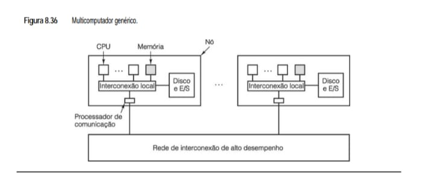

# Análise Técnica: O Nó

## Características do Nó
* Cada nó possui suas próprias CPUs, sua própria memória privada e, muitas vezes, seus próprios discos.

## Processador de Comunicação
* É o componente vital. Ele desonera a CPU principal de gerenciar os protocolos de rede, cuidando do envio e recebimento de pacotes.
* Ele empacota os dados da memória local e os envia pela rede, permitindo que as CPUs continuem processando sem esperar pela confirmação de recebimento da rede externa.

## Escalabilidade
* Multicomputadores são muito mais fáceis de expandir do que multiprocessadores, pois você pode simplesmente adicionar mais nós à rede sem sobrecarregar um barramento central.

## Programação
* Exige o uso de bibliotecas como MPI (Message Passing Interface), já que um processo no Nó A não pode ler diretamente uma variável na memória do Nó B.

## 8.4.1 Redes de interconexão
Na Figura 8.36, vemos que multicomputadores são mantidos juntos por redes de interconexão. Agora, chegou a hora de examiná-las mais de perto. O interessante é que multiprocessadores e multicomputadores são surpreendentemente similares nesse aspecto, porque os primeiros muitas vezes têm vários módulos de memória
que também devem se interconectar uns com os outros e com as CPUs. Assim, o material nesta seção com frequência se aplica a ambos os tipos de sistemas.

A razão fundamental por que redes de interconexão de multiprocessadores e multicomputadores são semelhantes é que, no fundo, ambos usam troca de mensagens. Até mesmo em uma máquina com uma única CPU, quando o processador quer ler ou escrever uma palavra, sua ação típica é ativar certas linhas no barramento e esperar por uma resposta. Fundamentalmente, essa ação é como trocar mensagens: o iniciador envia uma requisição e espera uma resposta. Em grandes multiprocessadores, a comunicação entre CPUs e memória remota quase sempre consiste em a CPU enviar à memória uma mensagem explícita, denominada pacote, requisitando alguns dados, e a memória que devolve um pacote de resposta.

* **Topologia**
A topologia de uma rede de interconexão descreve como os enlaces e os computadores são organizados, por exemplo, como um anel ou uma grade. Projetos topológicos podem ser modelados como grafos, com os enlaces representados por arcos e os switches por nós, como mostra a Figura 8.37. Cada nó em uma rede de interconexão
(ou em seu grafo) tem algum número de enlaces conectados a ele. Matemáticos denominam o número de enlaces de grau do nó; engenheiros o denominam fanout. Em geral, quanto maior o fanout, mais opções de roteamento há e maior é a tolerância à falha, isto é, a capacidade de continuar funcionando se um enlace falhar, fazendo um roteamento que contorna esse enlace. Se cada nó tiver k arcos e a fiação for executada de modo correto, é possível projetar a rede de modo que ela se mantenha totalmente conectada, mesmo que k – 1 enlaces falhem.

Outra propriedade de uma rede de interconexão (ou de seu grafo) é o seu diâmetro. Se medirmos a distância entre dois nós pelo número de arcos que têm de ser percorridos para chegar de um ao outro, o diâmetro de um grafo é a distância entre os dois nós que estão mais afastados (isto é, que têm a maior distância entre eles).

O diâmetro de uma rede de interconexão está relacionado ao pior atraso que pode ocorrer quando se enviam pacotes entre CPUs ou de CPU para memória, porque cada salto por um enlace toma uma quantidade finita de tempo. Quanto menor for o diâmetro, melhor será o desempenho no pior caso. Também importante é a distância
média entre dois nós, pois ela está relacionada com o tempo médio de trânsito do pacote.

* **Figura 8.37 - Várias topologias. Os pontos grossos representam switches. As CPUs e as memórias não são mostradas. (a) Estrela. (b) Malha de interconexão completa. (c) Árvore. (d) Anel. (e) Grade. (f) Toro duplo. (g) Cubo. (h) Hipercubo 4D.**
Estas formas definem como os switches (pontos grossos na imagem original) conectam as CPUs e memórias do sistema.

    (a) ESTRELA                       (b) MALHA COMPLETA          (d) ANEL
          \   /                       _____                         ---
        --- * ---                    /| X |\                       /   \
          /   \                     |_|___|_|                     |     |
                                     \/ X \/                       \   /
                                      -----                         ---

    (c) ÁRVORE                        (e) GRADE (2D)              (g) CUBO (3D)
             * *---*---* *-------*
            / \                       |   |   |                   /|      /|
           * * *---*---* *-------*  |
          / \ / \                     |   |   |                   | |     | |
          * * * *---*---* | *-----|-*
                                                                  |/      |/
                                                                   *-------*

    (f) TORO DUPLO                    (h) HIPERCUBO 4D
        (Grade com                       (Cubo dentro 
        bordas ligadas)                  de outro cubo)

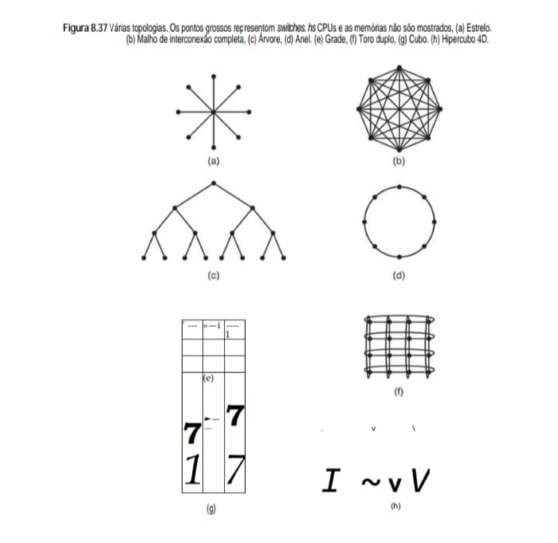

* **Análise Técnica para o eBook:**

 - Estrela (a): Simples, mas o switch central é um ponto único de falha e gargalo.
 
 - Malha Completa (b): Oferece a menor latência possível, mas o custo de cabeamento cresce exponencialmente com o número de nós.
 
 - Árvore (c): Comum em redes organizadas hierarquicamente; o tráfego nos níveis superiores tende a ser maior.
 
 - Grade e Toro (e, f): Muito utilizadas em supercomputadores reais por serem fáceis de montar fisicamente em racks.
 
 - Hipercubo (h): Uma topologia altamente eficiente onde cada nó tem n conexões em um sistema de 2^n nós, garantindo que o "caminho mais longo" entre dois pontos seja curto.

Ainda outra propriedade importante de uma rede de interconexão é sua capacidade de transmissão, isto é, quantos dados ela pode mover por segundo. Uma medida útil dessa capacidade é a largura de banda de bisseção. Para calcular essa quantidade, temos primeiro que dividir (conceitualmente) a rede em duas partes iguais (em termos do número de nós), porém não conectadas, removendo um conjunto de arcos de seu grafo. Então, calculamos a largura de banda total dos arcos que foram removidos. Pode haver muitos tipos diferentes de partição de rede em duas partes iguais. A largura de banda de bisseção é a mínima de todas as possíveis partições. A significância desse número é que, se ela for, por exemplo, 800 bits/s, então, se houver muita comunicação entre as duas metades, a vazão total pode ser limitada a apenas 800 bits/s, no pior caso. Muitos projetistas acham que a largura de banda de bisseção é a métrica mais importante de uma rede de interconexão. Muitas redes de interconexão são projetadas com o objetivo de maximizar a largura de banda de bisseção.

Redes de interconexão podem ser caracterizadas por sua dimensionalidade. Para nossas finalidades, a dimensionalidade é determinada pelo número de opções que há para chegar da origem ao destino. Se nunca houver alguma opção, isto é, se houver somente um caminho entre a origem e o destino, a rede tem dimensão zero.
Se houver uma dimensão na qual possa ser feita uma opção, por exemplo, ir para o oeste ou ir para o leste, a rede é unidimensional. Se houver dois eixos de modo que um pacote possa ir para o leste ou para o oeste ou, como alternativa, possa ir para o norte ou para o sul, a rede é bidimensional e assim por diante.

Várias topologias são mostradas na Figura 8.37. São mostrados apenas os enlaces (linhas) e os switches (pontos). As memórias e CPUs (não mostradas) em geral estariam ligadas aos switches por interfaces. Na Figura 8.37(a), temos uma configuração de dimensão zero em estrela, na qual as CPUs e memórias estariam ligadas aos nós externos e o nó central só faria a comutação. Embora seja um projeto simples, no caso de um grande sistema é provável que o switch central seja um importante gargalo. Ademais, da perspectiva da tolerância à falha, esse projeto é ruim, uma vez que uma única falha no switch central destrói completamente o sistema.

Na Figura 8.37(b), temos outro projeto de dimensão zero que está na outra extremidade do espectro, uma interconexão total. Nesse caso, cada nó tem uma conexão direta para cada outro nó. Esse projeto maximiza a largura de banda de bisseção, minimiza o diâmetro e tem altíssima tolerância à falha (pode perder quaisquer seis enlaces e a rede ainda continuar totalmente conectada). Infelizmente, o número de enlaces requerido para k nós é k(k – 1)/2, o que logo sai do controle para um k grande.

Outra topologia é a árvore, ilustrada na Figura 8.37(c). Um problema com esse projeto é que a largura de banda de bisseção é igual à capacidade do enlace. Como em geral haverá muito tráfego perto do topo da árvore, os poucos nós do topo se tornarão gargalos. Um modo de contornar esse problema é aumentar a largura de
bisseção dando mais largura de banda aos enlaces que estão mais em cima. Por exemplo, os enlaces dos níveis mais baixos poderiam ter uma capacidade b, o próximo nível poderia ter uma capacidade 2b e os enlaces do nível superior poderiam ter 4b cada um. Esse projeto é denominado árvore gorda e foi usado em multicompu-
tadores comerciais, como os CM-5 da Thinking Machines, que não existem mais.

O anel da Figura 8.37(d) é uma topologia unidimensional pela nossa definição, porque cada pacote enviado tem uma opção de ir para a direita ou para a esquerda. A grade ou malha da Figura 8.37(e) é um projeto bidimensional que tem sido usado em muitos sistemas comerciais. É de alta regularidade, fácil de ampliar
para tamanhos maiores e tem um diâmetro que aumenta apenas com a raiz quadrada do número de nós. Uma variante da grade é o toro duplo da Figura 8.37(f), que é uma grade cujas extremidades são conectadas. Além de ser mais tolerante à falha do que a grade, seu diâmetro também é menor, porque as arestas opostas agora
podem se comunicar em somente dois saltos.

Outra topologia popular é o toro tridimensional. Nesse caso, a topologia consiste em uma estrutura 3D com nós nos pontos (i, j, k) onde todas as coordenadas são números inteiros na faixa de (1, 1, 1) a (l, m, n). Cada nó tem seis vizinhos, dois ao longo de cada eixo. Os nós nas extremidades têm enlaces que fazem a volta completa até a extremidade oposta, exatamente como os toros 2D.

O cubo da Figura 8.37(g) é uma topologia tridimensional regular. Ilustramos um cubo 2 × 2 × 2, mas no caso geral ele poderia ser um cubo k × k × k. Na Figura 8.37(h), temos um cubo quadridimensional construído com dois cubos tridimensionais com os nós correspondentes conectados. Poderíamos fazer um cubo pentadimensional
clonando a estrutura da Figura 8.37(h) e conectando os nós correspondentes para formar um bloco de quatro cubos. Para ir a seis dimensões, poderíamos replicar o bloco de quatro cubos e interconectar os nós correspondentes e assim por diante. Um cubo n dimensional formado dessa maneira é denominado hipercubo. Muitos
computadores paralelos usam essa topologia porque o diâmetro cresce linearmente com a dimensionalidade. Em outras palavras, o diâmetro é o logaritmo de base 2 do número de nós, portanto, por exemplo, um hipercubo decadimensional tem 1.024 nós, mas um diâmetro de apenas 10, o que lhe confere excelentes propriedades de
atraso. Note que, por comparação, 1.024 nós organizados como uma grade 32 × 32 têm um diâmetro de 62, mais do que seis vezes pior do que o hipercubo. O preço pago pelo diâmetro menor é que o fanout e, por isso, o número de enlaces (e o custo), é muito maior para o hipercubo. Ainda assim, o hipercubo é uma escolha
comum para sistemas de alto desempenho.

Há vários formatos e tamanhos de multicomputadores, portanto, é difícil dar uma taxonomia clara para eles. Não obstante, há dois “estilos” que se destacam: os MPPs e os clusters. Estudaremos cada um por vez.

## 8.4.2 MPPs – processadores maciçamente paralelos
A primeira categoria consiste nos MPPs (Massively Parallel Processors – processadores maciçamente paralelos), que são imensos supercomputadores de muitos milhões de dólares. Eles são usados em ciências, em engenharia e na indústria para cálculos muito grandes, para tratar números muito grandes de transações por
segundo ou para data warehousing (armazenamento e gerenciamento de imensos bancos de dados). De início, os MPPs eram usados principalmente como supercomputadores científicos, mas, agora, a maioria deles é usada em ambientes comerciais. Em certo sentido, essas máquinas são as sucessoras dos poderosos mainframes da década de 1960 (embora a conexão seja tênue, como se um paleontólogo declarasse que um bando de pardais são os descendentes do Tyrannosaurus Rex). Em grande proporção, os MPPs substituíram máquinas SIMD, supercomputadores vetoriais e processadores matriciais do topo da cadeia alimentar digital.

A maioria dessas máquinas usa CPUs padronizadas como seus processadores. Opções populares são o Pentium da Intel, a UltraSPARC da Sun e o PowerPC da IBM. O que destaca os MPPs é a utilização que fazem de uma rede de interconexão proprietária de desempenho muito alto, projetada para mover mensagens com baixa latência e a alta largura de banda. Esses dois aspectos são importantes porque a grande maioria de todas as mensagens é de pequeno tamanho (bem abaixo de 256 bytes), mas grande parte do tráfego total é causada por grandes mensagens (mais de 8 KB). Os MPPs também vêm com extensivos softwares e bibliotecas proprietárias.

Outro ponto que caracteriza os MPPs é sua enorme capacidade de E/S. Problemas grandes o suficiente para justificar a utilização de MPPs invariavelmente têm quantidades maciças de dados a processar, muitas vezes da ordem de terabytes. Esses dados devem ser distribuídos entre muitos discos e precisam ser movidos pela máquina a grande velocidade.

Por fim, outra questão específica dos MPPs é sua atenção com a tolerância à falha. Com milhares de CPUs, várias falhas por semana são inevitáveis. Abortar uma execução de 18 horas porque uma CPU falhou é inaceitável, em especial quando se espera ter uma falha dessas toda semana. Assim, grandes MPPs sempre têm hardware e software especiais para monitorar o sistema, detectar falhas e recuperar-se delas facilmente.

Embora fosse interessante estudar os princípios gerais do projeto MPP agora, na verdade não há muitos princípios. No fim das contas, um MPP é uma coleção de nós de computação mais ou menos padronizados, conectados por uma interconexão muito rápida dos tipos que já estudamos. Portanto, em vez disso, vamos estudar agora
dois exemplos de MPPs: BlueGene/P e Red Storm.

**• BlueGene**
Como um primeiro exemplo de um processador maciçamente paralelo, examinaremos agora o sistema BlueGene da IBM. A IBM concebeu esse projeto em 1999 como um supercomputador maciçamente paralelo para resolver problemas com grandes quantidades de cálculos em áreas das ciências da vida, entre outras. Por exemplo, biólogos acreditam que a estrutura tridimensional de uma proteína determina sua funcionalidade, porém, calcular a estrutura 3D de uma pequena proteína a partir das leis da física levou anos nos supercomputadores daquela época. **O número de proteínas encontradas nos seres humanos é de mais de meio milhão e muitas delas
são muito grandes**; sabe-se que seu desdobramento errado é responsável por certas doenças como a fibrose cística. É claro que determinar a estrutura tridimensional de todas as proteínas humanas exigiria aumentar em muitas ordens de grandeza a capacidade mundial de computação e modelar o desdobramento de proteínas é apenas um dos problemas para cujo tratamento o BlueGene foi projetado. Desafios de igual complexidade em dinâmica molecular, modelagem do clima, astronomia e até mesmo modelagem financeira também requerem melhorias em supercomputação de muitas ordens de grandeza.

A IBM achou que havia mercado suficiente para a supercomputação maciça e investiu 100 milhões de dólares no projeto e construção do BlueGene. Em novembro de 2001, o Livermore National Laboratory, comandado pelo Departamento de Energia dos Estados Unidos, entrou como parceiro e primeiro cliente para a primeira versão da família BlueGene, denominada BlueGene/L. Em 2007, a IBM implantou a segunda geração do supercomputador BlueGene, denominada BlueGene/P, que detalhamos aqui. A meta do projeto BlueGene não era apenas fabricar o MPP mais rápido do mundo, mas também produzir o mais eficiente em termos de teraflops/dólar, teraflops/watt e teraflops/m3. Por essa razão, a IBM rejeitou a filosofia que fundamentava os MPPs anteriores, que era utilizar os componentes mais rápidos que o dinheiro pudesse comprar. Em vez disso, tomou a decisão de produzir um componente com um sistema-em-um-chip que executaria a uma velocidade modesta e com baixo consumo de energia, de modo a produzir a maior máquina possível com alta densidade de empacotamento. O primeiro BlueGene/P foi entregue a uma universidade da Alemanha
em novembro de 2007. O sistema continha 65.536 processadores e era capaz de oferecer 167 teraflops/s. Quando implantado, ele foi o computador mais rápido da Europa e o sexto mais rápido do mundo. O sistema também era considerado um dos supercomputadores mais eficientes em termos de potência de computação do mundo, capaz de produzir 371 megaflops/W, tornando sua eficiência de potência quase o dobro daquela de seu predecessor, o BlueGene/L. A primeira implantação do BlueGene/P foi atualizada em 2009 para incluir 294.912 processadores, dando-lhe um impulso computacional de 1 petaflop/s.

O coração do sistema BlueGene/P é o chip especial de nó ilustrado na Figura 8.38. Ele consiste em quatro núcleos de PowerPC 450 executando a 850 MHz. O PowerPC 450 é um processador superescalar de emissão dual com pipeline, popular em sistemas embutidos. Cada núcleo tem um par de unidades de ponto flutuante de emissão
dual que, juntas, podem emitir quatro instruções de ponto flutuante por ciclo de clock. As unidades de ponto flutuante foram aumentadas com uma quantidade de instruções do tipo SIMD que às vezes são úteis em cálculos científicos sobre matrizes. Embora não seja nenhum preguiçoso em matéria de desempenho, esse chip claramente não é um multiprocessador de topo de linha.

* **Figura 8.38 - Chip de processador sob especificação BlueGene/P.**
Este chip é um exemplo fascinante de como múltiplos núcleos, caches e interfaces de rede de alto desempenho são integrados em um único componente para formar supercomputadores.

O BlueGene/P utiliza uma organização interna focada em paralelismo massivo, integrando núcleos PowerPC com unidades de ponto flutuante (FPU) e uma hierarquia complexa de caches.

    NORTE (Interface para Toros 3D)         PARA CIMA
                |                                    |
    +----------*------------------------------------*----------+
    | CHIP ESPECIAL (BlueGene/P)                               |
    |                                                          |
    |  +-------+   +----------+   +----------+   +----------+  |
    |  |  FPU  |   | Núcleo   |   | Cache L2 |   |          |--|--> LESTE
    |  +-------+   | PowerPC  |   +----------+   | Cache L3 |  |
    |  |  FPU  |   |   450    |---|  Escuta  |---|   4 MB   |  |
    |  +-------+   +----------+   +----------+   |          |--|--> PARA DRAM
    |                                   |        |          |  |     DDR2
    |  +-------+   +----------+   +-----+----+   +----------+  |
    |  |  FPU  |   | Núcleo   |   | Switch de|         X       |  |
    |  +-------+   | PowerPC  |---| Multiplex|   +----------+  |
    |  |  FPU  |   |   450    |   +-----+----+   |          |  |
    |  +-------+   +----------+         |        | Cache L3 |  |
    |                                   |        |   4 MB   |--|--> PARA DRAM
    |  +-------+   +----------+   +----------+   |          |  |     DDR2
    |  |  FPU  |   | Núcleo   |   | Cache L2 |---|          |--|--> BAIXO
    |  +-------+   | PowerPC  |   +----------+   |          |  |
    |  |  FPU  |   |   450    |---|  Escuta  |   +----------+  |
    |  +-------+   +----------+   +----------+                 |
    |                                                          |
    +---*----------*----------*----------*----------*----------+
        |          |          |          |          |
    COLETIVO   BARREIRA     SUL     ETHERNET 10Gb  PARA BAIXO

* **Destaques Técnicos para o eBook:**

 - Núcleos e FPUs: Cada chip contém quatro núcleos PowerPC 450, cada um apoiado por duas Unidades de Ponto Flutuante (FPU) para acelerar cálculos científicos pesados.

 - Hierarquia de Cache e Escuta: O chip utiliza um mecanismo de Escuta (Snooping) entre as caches L2 para manter a coerência interna dos dados entre os quatro núcleos. Além disso, possui 8 MB de cache L3 compartilhada (dividida em dois blocos de 4 MB).

 - Interfaces de Rede Integradas: Diferente de processadores comuns, o BlueGene/P já traz no chip as interfaces para Toros 3D, Ethernet de 10 Gb e redes de suporte (Coletivo/Barreira). Isso permite que milhares desses chips sejam conectados diretamente para formar uma malha de multicomputadores.

# Análise Técnica: Arquitetura do Chip

## Núcleos PowerPC 450
* O chip utiliza quatro núcleos de 32 bits.
* Cada um possui duas unidades de ponto flutuante (FPU) de precisão dupla, permitindo processar números complexos de forma muito veloz.

## Hierarquia de Cache
* **L1**: Instruções (I) e Dados (D) privados por núcleo.
* **L2**: Um pequeno buffer para pré-busca (prefetch).
* **L3**: 8 MB totais (divididos em dois blocos de 4 MB) que servem como o principal repositório de dados antes da RAM.

## Redes Especializadas
* **Torus 3D**: Conecta o chip aos seus vizinhos nas direções Norte, Sul, Leste, Oeste, Cima e Baixo. É ideal para simulações físicas 3D.
* **Rede Coletiva/Barreira**: Usada para sincronização global. Quando milhares de chips precisam "concordar" que terminaram uma etapa do cálculo, essa rede faz isso em microssegundos.

Há três níveis de cache presentes no chip. O primeiro nível consiste em uma cache L1 dividida com 32 KB para instruções e 32 KB para dados. O segundo é uma cache unificada de 2 KB. Na verdade, as caches L2 são buffers de busca antecipada, em vez de caches verdadeiras. Elas escutam uma à outra e mantêm consistência de cache. O terceiro nível é uma cache compartilhada com 4 MB que alimenta dados para as caches L2. Os quatro processadores compartilham acesso aos dois módulos de cache L3 de 4 MB. Há coerência entre as caches L1 nas quatro CPUs. Assim, quando uma parte compartilhada da memória reside em mais de uma cache, os acessos a esse armazenamento por um processador serão imediatamente visíveis aos outros três processadores. Uma referência à memória que encontrar uma ausência da cache L1, mas obtiver uma presença na L2, leva cerca de 11 ciclos de clock. Uma ausência da cache L2 que encontra uma presença na L3 leva cerca de 28 ciclos. Por fim, uma ausência da cache L3, que tem de ir até a DRAM principal, leva cerca de 75 ciclos.

As quatro CPUs são conectadas por meio de um barramento com alta largura de banda a uma rede de toros 3D, que exige seis conexões: para cima, para baixo, norte, sul, leste e oeste. Além disso, cada processador tem uma porta para a rede coletiva, usada para a transmissão de dados a todos os processadores. A porta de barreira é usada para agilizar as operações de sincronização, dando a cada processador acesso rápido a uma rede de sincronização especializada.

No próximo nível acima, a IBM projetou um cartão especial que contém dois dos chips mostrados na Figura 8.38 junto com 2 GB de DRAM DDR2. O chip e o cartão são mostrados na Figura 8.39(a)–(b), respectivamente.

Os cartões são montados em placas de encaixe, com 32 cartões por placa para um total de 32 chips (e, assim, 128 CPUs) por placa. Visto que cada cartão contém 2 GB de DRAM, as placas contêm 64 GB por peça. Uma placa é ilustrada na Figura 8.39(c). No nível seguinte, 32 dessas placas são conectadas em um gabinete, preenchendo um único gabinete com 4.096 CPUs. Um gabinete é ilustrado na Figura 8.39(d).

Por fim, um sistema completo, que consiste em 72 gabinetes com 294.912 CPUs, é retratado na Figura 8.39(e). Um PowerPC 450 pode emitir até 6 instruções/ciclo, de modo que um sistema BlueGene/P completo poderia emitir até 1.769.472 instruções por ciclo. A 850 MHz, isso dá ao sistema um desempenho possível de 1.504 petaflops/s. Porém, concorrências de dados, latência da memória e falta de paralelismo juntos conspiram para garantir que a vazão real do sistema seja muito menor. Programas reais rodando no BlueGene/P têm demonstrado taxas de desempenho de até 1 petaflop/s.

* **Figura 8.39 - BlueGene/P. (a) Chip. (b) Cartão. (c) Placa. (d) Gabinete. (e) Sistema.**
Esta progressão demonstra como pequenas unidades de processamento são combinadas para atingir o nível de Petascale.

    (a) CHIP             (b) CARTÃO            (c) PLACA
    
    [ 4 CPUs ]           [ 1 Chip ]            [ 32 Cartões ]
    [ Cache L3 ]  --->   [ 2 GB RAM ]   --->   [ 128 CPUs ]
    [ 8 MB ]             [ 4 CPUs ]            [ 64 GB RAM ]
                                               [ 32 chips ]

            |                    |                     |
            v                    v                     v

    (d) GABINETE         (e) SISTEMA COMPLETO
    
    [ 32 Placas ]        [ 72 Gabinetes ]
    [ 4.096 CPUs ] --->  [ 294.912 CPUs ]
    [ 2 TB RAM ]         [ 144 TB RAM ]
    [ 1.024 cartões ]    [ 73.728 cartões ]
    [ 1.024 chips ]      [ 73.728 chips ]

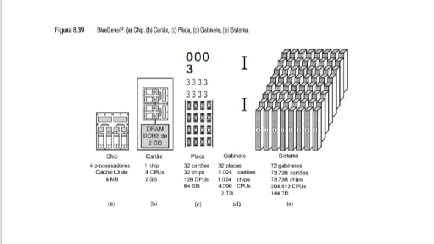

* **Resumo de Dados para o seu eBook**
Organizei os números em uma tabela comparativa para facilitar a visualização do poder computacional conforme o sistema cresce:

    +---------+-------------+---------------+----------------+
    | Nível   | Unidade Base| Total de CPUs | Memória Total  |
    +---------+-------------+---------------+----------------+
    | Chip    | 1 Unidade   | 4             | 8 MB (Cache L3)|
    +---------+-------------+---------------+----------------+
    | Cartão  | 1 Chip      | 4             | 2 GB (DRAM)    |
    +---------+-------------+---------------+----------------+
    | Placa   | 32 Cartões  | 128           | 64 GB          |
    +---------+-------------+---------------+----------------+
    | Gabinete| 32 Placas   | 4.096         | 2 TB           |
    +---------+-------------+---------------+----------------+
    | Sistema | 72 Gabinetes| 294.912       | 144 TB         |
    +---------+-------------+---------------+----------------+

O sistema é um multicomputador no sentido de que nenhuma CPU tem acesso direto a qualquer memória, ex­­ceto aos 2 GB em seu próprio cartão. Embora as CPUs dentro de um chip de processador tenham memória­ compartilhada, os processadores no nível de cartão, gabinete e sistema não compartilham a mesma memória. Além
disso, não há paginação por demanda porque não há discos locais a partir dos quais paginar. Em vez disso, o sistema tem 1.152 nós de E/S, que estão conectados a discos e a outros dispositivos periféricos.

Levando tudo em conta, embora o sistema seja extremamente grande, também é muito direto, com pouca tecnologia nova, exceto na área de empacotamento de alta densidade. A decisão de mantê-lo simples não foi acidental, uma vez que uma das metas principais era alta confiabilidade e disponibilidade. Por conseguinte,
uma grande quantidade de cuidadosa engenharia foi dedicada às fontes de energia, ventiladores, resfriamento e cabeamento, tendo como objetivo um tempo médio entre falhas de pelo menos dez dias.

Para conectar todos os chips é preciso uma interconexão de alto desempenho, que possa ser ampliada. O projeto usado é um toro tridimensional que mede 72 × 32 × 32. Como consequência, cada CPU precisa de apenas seis conexões com a rede de toro, duas para outras CPUs que, em termos lógicos, estão acima e abaixo dela, ao
norte e ao sul dela, a leste e a oeste dela. Essas seis conexões são denominadas leste, oeste, norte, sul, para cima e para baixo, respectivamente, na Figura 8.38. Em termos físicos, cada gabinete de 1.024 nós é um toro de 8 × 8 × 16. Pares de gabinetes vizinhos formam um toro de 8 × 8 × 32. Quatro pares de gabinetes na mesma linha formam um toro de 8 × 32 × 32. Por fim, todas as 9 linhas formam um toro de 72 × 32 × 32.

Portanto, todos os enlaces são ponto a ponto e funcionam a 3,4 Gbps. Uma vez que cada um dos 73.728 nós tem três enlaces para nós de números “mais altos”, um em cada dimensão, a largura de banda total do sistema é 752 terabits/s. O conteúdo de informação deste livro é de cerca de **300 milhões de bits**, incluindo toda a arte em formato PostScript encapsulado, portanto, o BlueGene/P poderia mover 2,5 milhões de cópias deste livro por segundo. Para onde elas iriam e quem as desejaria fica como exercício para o leitor.

A comunicação no toro 3D é feita na forma de roteamento por atalho virtual. Essa técnica é um pouco parecida com a comutação de pacotes armazena e reenvia, exceto que os pacotes não são armazenados inteiros antes de serem reenviados. Tão logo um byte chegue a um nó, ele pode ser repassado para o nó seguinte ao longo do caminho, antes mesmo de o pacote inteiro ter chegado. Ambos os tipos de roteamento são possíveis: o dinâmico (adaptativo) e o determinístico (fixo). Uma pequena quantidade de hardware de uso especial no chip é usada para implementar o atalho virtual.

Além do toro 3D principal usado para transporte de dados, há outras quatro redes de comunicação presentes. A segunda é uma rede combinada em forma de árvore. Muitas das operações realizadas em sistemas de alto grau de paralelismo tais como o BlueGene/P requerem participação de todos os nós. Por exemplo, considere achar o valor mínimo de um conjunto de 65.536 valores, um contido em cada nó. A rede combinada junta todos os nós em uma árvore e, sempre que dois nós enviarem seus respectivos valores a um nó de nível mais alto, ela seleciona o menor deles e o encaminha para cima. Desse modo, a quantidade de tráfego que chega à raiz é bem menor do que a que chegaria se todos os 65.536 nós enviassem uma mensagem para lá.

A terceira rede é a rede de barreiras, usada para implementar barreiras globais e interrupções. Alguns algoritmos funcionam em fases, sendo que cada nó deve esperar até que todos os outros tenham concluído a fase antes de iniciar a seguinte. A rede de barreira permite que o software defina as fases e forneça um meio de suspender todas as CPUs de cálculo que chegarem ao final de uma fase até que todas as outras também tenham chegado ao final, quando então todas são liberadas. Interrupções também usam essa rede.

Tanto a quarta quanto a quinta rede usam gigabit Ethernet. Uma delas conecta os nós de E/S aos servidores de arquivo, que são externos ao BlueGene/P, e à Internet. A outra é usada para depurar o sistema.

Cada um dos nós de CPU executa um pequeno núcleo especial, que suporta um único usuário e um único processo. Esse processo tem no máximo quatro threads, cada um executando em cada uma das CPUs no nó. Essa estrutura simples foi projetada para alto desempenho e alta confiabilidade.

Para confiabilidade adicional, o software de aplicação pode chamar um procedimento de biblioteca para fazer um ponto de verificação. Tão logo todas as mensagens pendentes tenham sido liberadas pela rede, pode-se criar e armazenar um ponto de verificação global de modo que, no evento de uma falha do sistema, a tarefa pode ser reiniciada a partir do ponto de verificação, em vez de a partir do início. Os nós de E/S executam um sistema operacional Linux tradicional e suportam múltiplos processos.

Continua o trabalho de desenvolvimento do sistema BlueGene da próxima geração, denominado BlueGene/Q. Esse sistema deverá estar disponível em 2012, e terá 18 processadores por chip de computação, que também possui multithreading simultâneo. Esses dois recursos deverão aumentar bastante o número de instruções por ciclo
que o sistema pode executar. O sistema deverá alcançar velocidades de 20 petaflops/s. Para obter mais informações sobre o BlueGene, veja Adiga et al., 2002; Alam et al., 2008; Almasi et al., 2003a, 2003b; Blumrich et al., 2005; e IBM, 2008.

* **Red Storm**
Como nosso segundo exemplo de um MPP, vamos considerar a máquina Red Storm (também denominada Martelo de Thor) do Sandia National Laboratory. O Sandia é operado pela Lockheed Martin e executa trabalhos confidenciais e não confidenciais para o Departamento de Energia dos Estados Unidos. Parte do trabalho confidencial está relacionada ao projeto e à simulação de armas nucleares, que exige alta capacidade de cálculos.

O Sandia está nesse ramo há muito tempo e produziu muitos supercomputadores de tecnologia de ponta ao longo dos anos. Durante décadas, deu preferência a supercomputadores vetoriais, mas, com o tempo, a tecnologia e a economia tornaram os MPPs mais econômicos em termos de custo. Em 2002, o MPP existente na época, denominado ASCI Red, estava ficando um pouco enferrujado. Embora tivesse 9.460 nós, coletivamente eles tinham meros 1,2 TB de RAM e 12,5 TB de espaço de disco, e o sistema mal conseguia produzir 3 teraflops/s. Portanto, no verão de 2002, o Sandia escolheu a Cray Research, uma fabricante de supercomputadores há muito tempo no mercado, para construir um substituto para o ASCI Red.

O substituto foi entregue em agosto de 2004, um ciclo de projeto e execução excepcionalmente curto para uma máquina de tão grande porte. A razão de o computador conseguir ser projetado e entregue com tamanha rapidez é que o Red Storm usa quase que só peças de prateleira, exceto para um dos chips especialmente monta-
dos, usado para roteamento. Em 2006, o sistema foi atualizado com novos processadores; detalhamos aqui essa versão do Red Storm.

A CPU escolhida para o Red Storm foi a AMD Opteron dual-core a 2,4 GHz. A Opteron tem diversas características fundamentais que influenciaram a escolha. A primeira é que ela tem três modos operacionais. No modo herdado, ela executa programas binários padrão Pentium sem modificação. No modo de compatibilidade, o sistema operacional executa em modo 64 bits e pode endereçar 264 bytes de memória, mas programas de aplicação executam em modo 32 bits. Por fim, em modo 64 bits, a máquina inteira é de 64 bits e todos os programas podem endereçar todo o espaço de endereço de 64 bits. Em modo 64 bits, é possível misturar e combinar software: programas de 32 bits e programas de 64 bits podem executar ao mesmo tempo, o que permite um fácil caminho de atualização.

A segunda característica fundamental que a Opteron tem é sua atenção ao problema da largura de banda da memória. Nos últimos anos, as CPUs estão ficando cada vez mais rápidas e a memória não consegue acompanhá-las, o que resulta em grande penalidade quando há uma ausência da cache de nível 2. A AMD integrou o
controlador de memória na Opteron, de modo que ela pode executar à velocidade do clock do processador em vez de à velocidade do barramento de memória, o que melhora o desempenho da memória. O controlador pode manusear oito DIMMS de 4 GB cada, para um total máximo de memória de 32 GB por Opteron. No sistema Red
Storm, cada Opteron tem apenas 2–4 GB. Contudo, à medida que a memória fica mais barata, não há dúvida de que mais será adicionada no futuro. Utilizando Opterons dual-core, o sistema foi capaz de duplicar a potência bruta de computação.

Cada Opteron tem seu próprio processador de rede dedicado, denominado Seastar, fabricado pela IBM. O Seastar é um componente crítico, uma vez que quase todo o tráfego entre os processadores passa pela rede Seastar. Sem a interconexão de alta velocidade oferecida por esses chips fabricados especialmente, o sistema
logo ficaria atolado em dados.

Embora as Opterons estejam disponíveis no comércio como mercadoria de prateleira, o empacotamento do Red Storm é fabricado por encomenda. Cada placa Red Storm contém quatro Opterons, 4 GB de RAM, quatro Seastars, um processador RAS (Reliability, Availability, and Service – confiabilidade, disponibilidade e serviço) e
um chip Ethernet de 100 Mbps, como ilustra a Figura 8.40.

* **Figura 8.40 - Pacote de componentes do Red Storm.**
Figura 8.40, que apresenta os componentes do sistema Red Storm. Assim como o BlueGene/P, ele utiliza uma estratégia de empilhamento modular para atingir alto desempenho.

O Red Storm organiza seus processadores em conjuntos de placas que são inseridas em gabinetes refrigerados, focando em uma interconexão robusta entre os nós.

         [ CONJUNTO DE 8 PLACAS ]                [ GABINETE ]
        /                        \              +------------+
        +--------------------------+            |            |
        |  [RAS]  [M] [M] [M] [M]  |            | [Porta-    |
        |         [C] [C] [C] [C]  |            |  cartões]  |
        |         [P] [P] [P] [P]  |            |            |
        |         [U] [U] [U] [U]  |----------->+------------+
        |                          |            |            |
        | [Eth]   [S] [S] [S] [S]  |            | [Porta-    |
        | 100Mbps [Seastar Chips]  |            |  cartões]  |
        +--------------------------+            |            |
            (AMD Opteron + SDRAM)               +------------+
                                                |            |
                                                | [Porta-    |
                                                |  cartões]  |
                                                |            |
                                                +------------+
        LEGENDA: [M] Memória | [C] CPU | [S] Chip de Interconexão (Seastar)

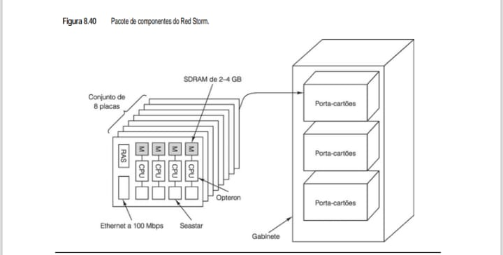

# Análise Técnica: Componentes da Placa

## Componentes da Placa
* Cada placa contém 4 CPUs AMD Opteron, cada uma com sua própria memória SDRAM (2 a 4 GB).
* Processadores Opteron: Diferente do BlueGene/P que utiliza PowerPC, o Red Storm utiliza CPUs AMD Opteron. Cada CPU é acompanhada por sua própria memória SDRAM de 2 a 4 GB.

## Seastar Chip
* Este é o componente crucial para a comunicação.
* Cada CPU tem um chip Seastar dedicado que gerencia a interconexão de alta velocidade entre os nós.

## RAS
* Módulo de Reliability, Availability, and Serviceability (Confiabilidade, Disponibilidade e Manutenibilidade), essencial para manter o supercomputador rodando sem falhas.

## Escalabilidade
* O design permite que milhares dessas placas sejam conectadas, criando uma malha de processamento massiva.

## Modularidade
*O sistema é montado em conjuntos de 8 placas, que preenchem compartimentos chamados "porta-cartões" dentro de grandes gabinetes.

## Gerenciamento 
*A placa inclui um módulo RAS (Reliability, Availability, and Serviceability) e interface Ethernet de 100 Mbps para monitoramento e controle do sistema.

Um conjunto de oito placas é conectado a um painel traseiro e inserido em uma porta-cartões. Cada gabinete contém três porta-cartões para um total de 96 Opterons, mais as fontes de energia e ventiladores necessários. O sistema completo consiste em 108 gabinetes para nós de cálculo, o que dá um total de 10.368 Opterons (20.736 processadores) com 10 TB de SDRAM. Cada CPU só tem acesso à sua própria SDRAM. Não há nenhuma memória compartilhada. A capacidade teórica de computação do sistema é de 41 teraflops/s.

A interconexão entre as CPUs Opteron é feita pelos roteadores Seastar, um roteador por CPU Opteron. Elas são conectadas em um toro 3D de tamanho 27 × 16 × 24 com um Seastar em cada ponto da malha. Cada Seastar tem sete enlaces bidirecionais de 24 Gbps nas direções norte, leste, sul, oeste, para baixo, para cima e para a Opteron. O tempo de trânsito entre pontos adjacentes da malha é de 2 microssegundos, e pelo conjunto inteiro de nós é de apenas 5 microssegundos. Uma segunda rede que usa uma Ethernet de 100 Mbps é usada para serviço e manutenção.

Além dos 108 gabinetes de cálculo, o sistema também contém 16 gabinetes para processadores de E/S e de serviço. Cada um desses gabinetes contém 32 Opterons. Essas 512 CPUs são divididas: 256 para E/S e 256 para serviço. O resto do espaço é para discos, que são organizados como RAID 3 e RAID 5, cada um com um drive de paridade e um sobressalente de entrada automática. O espaço total de disco é 240 TB. A largura de banda sustentada em disco é 50 GB/s.

O sistema é repartido em seções confidencial e não confidencial, com switches entre as partes, de modo que podem ser acopladas ou desacopladas mecanicamente. Um total de 2.688 CPUs de cálculo está sempre na seção confidencial e outras 2.688 sempre na seção não confidencial. As restantes 4.992 CPUs de cálculo podem ser comutadas para qualquer seção, como demonstra a Figura 8.41. Cada uma das 2.688 Opterons confidenciais tem 4 GB de RAM; todas as outras têm 2 GB cada. O trabalho aparentemente confidencial utiliza mais memória. Os processadores de E/S e de serviço são subdivididos entre as duas partes.

O conjunto inteiro está abrigado em um novo edifício de 2.000 m2 especialmente construído. O edifício e o local foram projetados de modo que o sistema possa ser ampliado para até 30 mil Opterons no futuro, se for necessário. Os nós de cálculo consomem 1,6 megawatt de energia; os discos consomem mais um megawatt.
Somando os ventiladores e os aparelhos de ar condicionado, o pacote todo usa 3,5 MW.

**• Figura 8.41 - Sistema Red Storm visto de cima.**
O sistema é dividido em grandes blocos de gabinetes interconectados, totalizando milhares de processadores e uma capacidade massiva de armazenamento.

    PLANTA BAIXA DO SISTEMA RED STORM
    +-----------------------------------------------------------+
    | [ ARMAZENAMENTO ]       [ ARMAZENAMENTO ]       [ SW ]    |
    |     120 TB                    120 TB                      |
    +-----------------------------------------------------------+
    |      (28)              (52)              (28)             |
    |   Gabinete          Gabinete          Gabinete            |
    | Confidencial       Comutável      Não-Confidencial        |
    |      |                 |                 |                |
    | (2.688 CPUs)      (4.992 CPUs)      (2.688 CPUs)          |
    +-----------------------------------------------------------+
    |      |                 |                 |                |
    |  Nó de E/S        Nó de Cálculo     Nó de Cálculo         |
    |  e Serviço                                                |
    +-----------------------------------------------------------+

* **Detalhes Estruturais para o eBook:**

## Zonamento de Segurança
* O Red Storm é projetado com uma separação clara entre gabinetes confidenciais (2.688 Opterons) e não confidenciais (2.688 Opterons), permitindo a execução de tarefas com diferentes níveis de sensibilidade no mesmo sistema.

## Núcleo de Processamento
* No centro, encontram-se 52 gabinetes comutáveis com 4.992 processadores, que podem ser alocados conforme a demanda de cálculo.

## Capacidade de Armazenamento
* O sistema conta com duas unidades de armazenamento de 120 TB cada, posicionadas nas extremidades para servir aos nós de E/S e serviço.

## Escala Total
* Somando os blocos, o sistema opera com mais de 10.000 processadores AMD Opteron, todos interconectados pela malha de alta performance que vimos anteriormente.

O hardware e o software do computador custaram 90 milhões de dólares. O edifício e o sistema de refrigeração custaram mais 9 milhões, portanto, o custo total ficou um pouco abaixo de 100 milhões de dólares, embora uma parte dessa quantia seja custo de engenharia não recorrente. Se você quiser encomendar um clone exato, 60 milhões de dólares seria um bom número para pensar. A Cray pretende vender versões menores do sistema a outros governos e a clientes comerciais sob o nome X3T.

Os nós de cálculo executam um núcleo leve denominado **catamount**. Os nós de E/S e serviço executam o Linux normal com uma pequena adição para suportar MPI (discutida mais adiante neste capítulo). Os nós RAS executam um Linux simplificado. Há muito software ASCI Red disponível para usar no Red Storm, incluindo
alocadores de CPU, escalonadores, bibliotecas MPI, bibliotecas matemáticas, bem como programas de aplicação.

Com um sistema tão grande, conseguir alta confiabilidade é essencial. Cada placa tem um processador RAS para fazer manutenção do sistema e também há facilidades especiais de hardware. A meta é um MTBF (Mean Time Between Failures – tempo médio entre falhas) de 50 horas. O ASCI Red tinha MTBF para o hardware de 900 horas, mas era atormentado por uma queda de sistema operacional a cada 40 horas. Embora o novo hardware seja muito mais confiável do que o antigo, o ponto fraco continua sendo o software. Se quiser mais informações sobre o Red Storm, consulte Brightwell et al., 2005, 2010.

* **Uma comparação entre BlueGene/P e Red Storm**
Red Storm e BlueGene/P são comparáveis sob certos aspectos, porém diferentes sob outros, portanto, é interessante colocar alguns desses parâmetros fundamentais lado a lado, como apresentado na Figura 8.42.

As duas máquinas foram construídas na mesma época, portanto, suas diferenças não se devem à tecnologia, mas às diferentes visões dos projetistas e, até certo ponto, às diferenças entre os fabricantes, IBM e Cray. O BlueGene/P foi projetado desde o início como uma máquina comercial, que a IBM espera vender em grandes
quantidades às empresas de biotecnologia, farmacêuticas e outras. O Red Storm foi construído sob contrato especial com o Sandia, embora a Cray também planeje construir uma versão menor para venda.

A visão da IBM é clara: combinar núcleos existentes para construir um chip especial que possa ser produzido em massa a baixo custo, executar a baixa velocidade e ser interligado em números muito grandes usando uma rede de comunicação de velocidade modesta. A visão do Sandia é igualmente clara, mas diferente: usar uma
poderosa CPU de 64 bits de prateleira, projetar um chip de roteador muito rápido e acrescentar uma grande quantidade de memória para produzir um nó mais poderoso do que o BlueGene/P, de modo que uma quantidade menor deles será necessária e a comunicação entre eles será mais rápida.

* **Figura 8.42 - Comparação entre BlueGene/P e Red Storm.**
Este comparativo destaca as diferenças fundamentais de arquitetura: enquanto o BlueGene/P foca em densidade extrema de núcleos simples, o Red Storm utiliza processadores mais potentes em menor quantidade.

        +-----------------------+--------------------------+--------------------------+
        |         ITEM          |        BLUEGENE/P        |        RED STORM         |
        +-----------------------+--------------------------+--------------------------+
        | CPU                   | PowerPC (32 bits)        | Opteron (64 bits)        |
        | Clock                 | 850 MHz                  | 2,4 GHz                  |
        | CPUs de Cálculo       | 294.912                  | 20.736                   |
        | CPUs / Placa          | 128                      | 8                        |
        | CPUs / Gabinete       | 4.096                    | 192                      |
        | Gabinetes de Cálculo  | 72                       | 108                      |
        | Teraflops/s           | 1.000                    | 124                      |
        | Memória / CPU         | 512 MB                   | 2 - 4 GB                 |
        | Memória Total         | 144 TB                   | 10 TB                    |
        | Roteador              | PowerPC                  | Seastar                  |
        | Num. de Roteadores    | 73.728                   | 10.368                   |
        | Interconexão          | Toros 3D (72x32x32)      | Toros 3D (27x16x24)      |
        | Outras Redes          | Gigabit Ethernet         | Fast Ethernet            |
        | Particionável?        | Não                      | Sim                      |
        | S.O. (Cálculo)        | Proprietário             | Proprietário             |
        | S.O. (E/S)            | Linux                    | Linux                    |
        | Fabricante            | IBM                      | Cray Research            |
        | Custo Elevado?        | Sim                      | Sim                      |
        +-----------------------+--------------------------+--------------------------+

# Observações para o seu eBook:**

## Poder de Processamento
*Note que o BlueGene/P atinge o marco de 1 Petaflop (1.000 Teraflops) usando uma massa gigantesca de núcleos PowerPC, enquanto o Red Storm prioriza o desempenho individual de cada núcleo Opteron.

## Eficiência de Memória
* O Red Storm oferece até 8x mais memória por CPU (4 GB vs 512 MB), o que é vital para aplicações que processam grandes conjuntos de dados localmente antes da troca de mensagens.

## Flexibilidade
* O Red Storm permite ser particionado, o que explica a divisão física que vimos na planta do sistema entre áreas confidenciais e não-confidenciais.

As consequências dessas decisões se refletiram no empacotamento. Como a IBM construiu um chip especial combinando processador e roteador, conseguiu uma densidade de empacotamento mais alta: 4.096 CPUs/ gabinete. Como o Sandia preferiu um chip de CPU de prateleira, sem modificação, e 2–4 GB de RAM por nó, ele
só conseguiu colocar 192 processadores de cálculo em um gabinete. O resultado é que o Red Storm ocupa mais espaço e consome mais energia do que o BlueGene/P.

No mundo exótico da computação de laboratório de âmbito nacional, o importante é o desempenho. Nesse aspecto, o **BlueGene/P ganha, 1.000 TF/s contra 124 TF/s**, mas o Red Storm foi projetado para ser expansível; portanto, acrescentando mais Opterons ao problema, o Sandia provavelmente conseguiria elevar seu desempenho de forma significativa. A IBM poderia responder aumentando um pouco o clock (850 MHz não significa forçar muito a tecnologia existente). Em suma, os supercomputadores MPP - Massively Parallel Processors (Processadores Massivamente Paralelos) ainda não chegaram nem perto de quaisquer limites da física e continuarão crescendo por muitos anos.

## 8.4.3 Computação de cluster
O outro estilo de multicomputador é o **computador de cluster** (Anderson et al., 1995; Martin et al., 1997). Em geral, consiste em centenas de milhares de PCs ou estações de trabalho conectadas por uma placa de rede disponível no mercado. A diferença entre um MPP e um cluster é análoga à diferença entre um mainframe e um PC. Ambos têm uma CPU, ambos têm RAM, ambos têm discos, ambos têm um sistema operacional e assim por diante.

Porém, os do mainframe são mais rápidos (exceto talvez o sistema operacional). No entanto, em termos qualitativos, eles são considerados diferentes e são usados e gerenciados de modo diferente. Essa mesma diferença vale para MPPs em comparação com clusters.

Historicamente, o elemento fundamental que tornava os MPPs especiais era sua interconexão de alta velocidade, mas o recente lançamento de interconexões de alta velocidade comerciais, de prateleira, começou a fechar essa lacuna. Levando tudo em conta, é provável que os clusters empurrem os MPPs para nichos cada vez meno-
res, exatamente como os PCs transformaram os mainframes em especialidades esotéricas. O principal nicho para MPPs são supercomputadores de alto preço, para os quais o desempenho de pico é tudo o que interessa e, se você precisar perguntar o preço, é porque não pode bancar um deles.

Embora existam muitos tipos de clusters, há duas espécies que dominam: o centralizado e o descentralizado. O centralizado é um cluster de estações de trabalho ou PCs montado em uma grande estante em uma única sala. Às vezes, eles são empacotados de um modo bem mais compacto do que o usual para reduzir o tamanho físico
e o comprimento dos cabos. Em geral, as máquinas são homogêneas e não têm periféricos, a não ser cartões de rede e, possivelmente, discos. Gordon Bell, o projetista do PDP-11 e do VAX, denominou essas máquinas estações de trabalho sem cabeça (porque não têm donos). Ficamos tentados a denominá-las COWs (vacas) sem cabeça, mas ficamos com medo que esse termo ferisse a suscetibilidade de muitas vacas sagradas, portanto, desistimos.

Clusters descentralizados consistem em estações de trabalho ou PCs espalhados por um prédio ou campus. Grande parte deles fica ociosa por muitas horas no dia, em especial à noite. Costumam ser conectados por uma LAN. Em geral, são heterogêneos e têm um conjunto completo de periféricos, embora ter um cluster com 1.024
mouses na verdade não é muito melhor do que ter um cluster sem mouse algum. O mais importante é que muitos deles têm proprietários que têm um apego emocional às suas máquinas e tendem a olhar com desconfiança algum astrônomo que queira simular o big bang nelas. Usar estações de trabalho ociosas para formar um cluster sempre significa dispor de algum meio de migrar tarefas para fora das máquinas quando seus donos as reivindicarem. A migração é possível, mas aumenta a complexidade do software.

De modo geral, os clusters são conjuntos pequenos, na faixa de uma dúzia a talvez 500 PCs. Contudo, também é possível construir clusters muito grandes com PCs de prateleira. O Google fez isso de modo interessante, que veremos agora.

* **Google**
Google é um sistema de busca popular para achar informações na Internet. Embora sua popularidade venha, em parte, de sua interface simples e tempo de resposta rápido, seu projeto não é nada simples. Do ponto de vista do Google, o problema é que ele tem de achar, indexar e armazenar toda a World Wide Web (estimada em 40
bilhões de páginas), ser capaz de pesquisar a coisa toda em menos de 0,5 segundo e manipular milhares de consultas/segundo que vêm do mundo inteiro, 24 horas por dia. Ademais, ele não pode parar nunca, nem mesmo em face de terremotos, queda de energia elétrica, queda de redes de telecomunicações, falhas de hardware e bugs de software. E, é claro, tem de fazer tudo isso do modo mais barato possível. Montar um clone do Google definitivamente não é um exercício para o leitor.

Como o Google consegue? Para começar, ele opera várias centrais de dados no mundo inteiro. Além de essa técnica proporcionar backups no caso de alguma delas ser engolida por um terremoto, quando o <www.google.com> é consultado, o endereço IP do remetente é inspecionado e é fornecido o endereço da central de dados mais
próxima. E é para lá que o browser envia a consulta.

Cada central de dados tem, no mínimo, uma conexão de fibra ótica OC-48 (2,488 Gbps) com a Internet, pela qual recebe consultas e envia respostas, bem como uma conexão de backup OC-12 (622 Mbps) com outro provedor de telecomunicações diferente, caso o primário falhe. Há fontes de energia ininterruptas e geradores
de emergência a diesel em todas as centrais de dados para manter o espetáculo em cena durante quedas de energia. Por conseguinte, quando acontece um grande desastre natural, o desempenho sofrerá, mas o Google continuará funcionando.

Para entender melhor por que o Google escolheu essa arquitetura, é bom descrever de modo resumido como uma consulta é processada assim que chega à sua central de dados designada. Após chegar à central de dados (etapa 1 na Figura 8.43), o balanceador de carga roteia a consulta para um dos muitos manipuladores de consultas (2) e para o revisor ortográfico (3) e um servidor de anúncios publicitários (4) em paralelo. Então, as palavras procuradas são pesquisadas nos servidores de índice (5) em paralelo. Esses servidores contêm uma entrada para cada palavra na Web. Cada entrada relaciona todos os documentos (páginas Web, arquivos PDF, apresentações PowerPoint etc.) que contêm a palavra, organizados por relevância da página. A relevância da página é determinada por uma fórmula complicada (e secreta), mas o número de referências para uma página e suas respectivas relevâncias desempenha um papel importante.

* **Figura 8.43 - Processamento de uma consulta no Google.**
Este diagrama é o exemplo perfeito de como um multicomputador massivo (como os que vimos nas Figuras 8.36 e 8.41) organiza o fluxo de dados para responder em milissegundos.

O processo é uma coreografia entre balanceadores de carga, servidores de consulta e bancos de dados distribuídos.

            [ ENTRADA DA CONSULTA ]
                    | (1)
            +---------v-----------+
            | Balanceador de Carga|
            +---------+-----------+
                    | (2)
            +---------v----------+      (3)      +------------+
            |   Manipulador de   |-------------->| Revisor    |
            |      Consultas     |<--------------| Ortográfico|
            +---------+----------+      (9)      +------------+
            | (5) ^   | (7) ^    | (4)
            | (6) |   | (8) |    +------------->+------------+
            v     |   v     |                   | Servidor   |
      +-----------+   +-----------+ (10)        | de Anúncios|
      | Servidores|   | Servidores|<------------+------------+
      |  de Índice|   | de Doc.   |
      +-----------+   +-----------+
            |               |
            +---------------+------> (11) [ RESULTADO FINAL ]

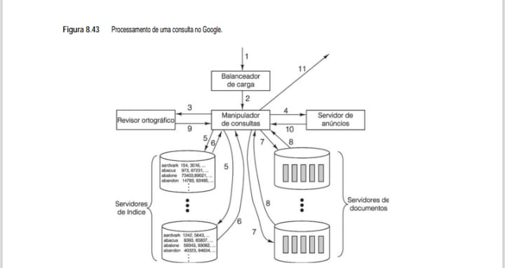

# Etapas do Processamento (Para o seu eBook):

    1. Entrada e Equilíbrio: A consulta chega e o Balanceador de Carga a direciona para um dos muitos Manipuladores de Consultas disponíveis no cluster.

    2. Refinamento: O manipulador envia a consulta para o Revisor Ortográfico (etapa 3) para sugestões de correção.

    3. Busca Paralela: O manipulador consulta simultaneamente os Servidores de Índice (para localizar documentos) e os Servidores de Documentos (para extrair os snippets de texto).

    4. Monetização: Em paralelo, o Servidor de Anúncios seleciona publicidade relevante para a busca.

    5. Assembleia: O manipulador reúne todos os resultados, ordena-os e envia a resposta final ao usuário (etapa 11).

Para obter maior desempenho, o índice é subdividido em partes denominadas **fragmentos** que podem ser pesquisadas em paralelo. Ao menos em termos conceituais, o fragmento 1 contém todas as palavras no índice, cada uma delas acompanhada pelos IDs dos n documentos de importância mais alta que contêm aquela palavra. O
fragmento 2 contém todas as palavras e os IDs dos n documentos de importância mais alta seguintes e assim por diante. À medida que a Web cresce, cada um desses fragmentos pode ser subdividido mais tarde, com as primeiras k palavras em um conjunto de fragmentos, as próximas k palavras em um segundo conjunto de fragmentos e assim por diante, de modo a conseguir cada vez mais paralelismo na busca.

Os servidores de índice retornam um conjunto de identificadores de documentos (6), que então são combinados de acordo com as propriedades booleanas da consulta. Por exemplo, se a pesquisa for para +digital +capivara +dança, então só os identificadores de documentos que aparecem em todos os três conjuntos são usados para a próxima etapa. Nessa etapa (7), os próprios documentos são referenciados para extrair seus títulos, URL e pedaços de texto que cercam os termos de pesquisa. Os servidores de documentos contêm muitas cópias de toda a Web em cada central de dados, que hoje são centenas de terabytes. Os documentos também são divididos em fragmentos para melhorar a pesquisa paralela. Embora o processamento de consultas não exija a leitura da Web inteira (ou até mesmo a leitura das dezenas de terabytes nos servidores de índice), ter de processar 100 MB por pesquisa é normal.

Quando os resultados são devolvidos ao manipulador de consultas (8), as páginas encontradas são reunidas e classificadas por importância. Se forem detectados potenciais erros de ortografia (9), eles são anunciados, e anúncios publicitários relevantes (10) são adicionados. Apresentar propaganda de anunciantes interessados em comprar termos de consulta específicos (por exemplo, “hotel” ou “filmadora”) é o modo como o Google ganha seu dinheiro. Por fim, os resultados são formatados em HTML (HyperText Markup Language – linguagem de marcação de hipertexto) e enviados ao usuário como uma página Web.

Munidos dessas informações básicas, agora podemos examinar a arquitetura do Google. A maioria das empresas, quando confrontadas com um imenso banco de dados, taxa de transmissão maciça e a necessidade de alta confiabilidade, compraria o equipamento maior, mais rápido e mais confiável existente no mercado. O Google
fez exatamente o oposto. Comprou PCs baratos, de desempenho modesto. Muitos deles. E, com eles, montou o maior cluster de prateleira do mundo. O princípio diretor dessa decisão foi simples: otimizar preço/desempenho.

A lógica que fundamentou essa decisão está na economia: PCs normais são muito baratos. Servidores de alta tecnologia não são, e grandes multiprocessadores, menos ainda. Assim, conquanto um servidor de alta tecnologia pudesse ter duas ou três vezes o desempenho de um PC desktop comum, normalmente seu preço seria 5 a 10 vezes mais alto, o que não é eficiente em termos de custo.

Claro que PCs baratos falham mais do que servidores de topo de linha, mas os últimos também falham, portanto, o software do Google tinha de ser projetado para funcionar com hardware que falhava, não importando qual equipamento estivesse usando. Uma vez escrito o software tolerante a falhas, na verdade não importava que a taxa de falha fosse 0,5% por ano ou 2% por ano, elas teriam de ser tratadas. A experiência do Google diz que cerca de 2% dos PCs falham a cada ano. Mais da metade das falhas se deve a discos defeituosos, seguidos por fontes de energia e chips de RAM. Uma vez construídas, as CPUs nunca falham. Na verdade, a maior fonte de quedas não é o hardware; é o software. A primeira reação a uma queda é apenas reinicializar, o que muitas vezes resolve o problema (o equivalente eletrônico de um médico dizer: “Tome duas aspirinas e vá para a cama”).

Um típico PC moderno do Google consiste em um processador Intel de 2 GHz, 4 GB de RAM e um disco de cerca de 2 TB, o tipo de máquina que uma avó compraria para verificar seu e-mail de vez em quando. O único item especializado é um chip Ethernet. Não exatamente um chip de última geração, mas um muito barato. Os PCs
são acondicionados em caixas de 1 unidade de altura (cerca de 5 cm de espessura) e empilhados em grupos de 40 em estantes de 50 centímetros, uma pilha na frente e uma atrás, para um total de 80 PCs por estante. Os PCs que estão em uma estante são conectados por Ethernet comutada e o switch está dentro da estante. As estantes em uma central de dados também são conectadas por Ethernet comutada, com dois switches redundantes por central de dados usados para sobreviver a falhas de switches .

O layout de uma típica central de dados Google é ilustrado na Figura 8.44. A fibra OC-48 de alta largura de banda de entrada é roteada para cada um de dois switches Ethernet de 128 portas. De modo semelhante, a fibra OC-12 de backup também é roteada para cada um dos dois switches. As fibras de entrada usam cartões especiais de entrada e não ocupam qualquer uma das 128 portas Ethernet.

Quatro enlaces Ethernet saem de cada estante: dois para o switch da esquerda e dois para o da direita. Nessa configuração, o sistema pode sobreviver à falha de qualquer dos dois switches. Uma vez que cada estante tem quatro conexões com o switch (dois dos 40 PCs da frente e dois dos 40 PCs de trás), é preciso quatro falhas de enlace ou duas falhas de enlace e uma de switch para tirar uma estante de linha. Com um par de switches de 128 portas e quatro enlaces de cada estante, até 64 estantes podem ser suportadas. Com 80 PCs por estante, uma central de dados pode ter até 5.120 PCs. Mas, é claro, as estantes não têm de conter exatamente 80 PCs e os switches podem ser maiores ou menores do que 128 portas; esses dados são apenas valores típicos de um cluster Google.

A densidade de energia também é uma questão fundamental. Um PC típico utiliza 120 watts, ou cerca de 10 kW por estante. Uma estante precisa de cerca de 3 m2 para que o pessoal de manutenção possa instalar e remover PCs e para que o condicionamento de ar funcione. Esses parâmetros dão uma densidade de energia de mais
de 3.000 watts/m2. A maioria das centrais de dados é projetada para 600–1.200 watts/m2, portanto, são necessárias medidas especiais para refrigerar as estantes.

* **Figura 8.44 - Cluster Google típico.**
A Figura 8.44 detalha a organização física de um Cluster típico do Google, mostrando como milhares de computadores comuns são transformados em uma superestrutura através de redes de alta velocidade.

O cluster utiliza redundância em múltiplos níveis, com switches de alta densidade conectando centenas de estantes de servidores.

    [ FIBRA OC-12 ]             [ FIBRA OC-48 ]
                |                           |
        +--------*---------------------------*--------+
        |                                            |
    +---v-------------+                        +-----v-----------+
    | Switch Gigabit  |                        | Switch Gigabit  |
    | Ethernet        |                        | Ethernet        |
    | (128 portas)    |                        | (128 portas)    |
    +---*--*--*--*----+                        +---*--*--*--*----+
        |  |  |  | \                          /  |  |  |  |
        |  |  |  |  \       LINKS GIGABIT    /   |  |  |  |
        |  |  |  |   \       DUPLOS         /    |  |  |  |
        |  |  |  |    \                    /     |  |  |  |
    [ESTANTE 1]   [ESTANTE 2]        [ESTANTE 3]   [ESTANTE N]
    (80 PCs)      (80 PCs)           (80 PCs)      (80 PCs)

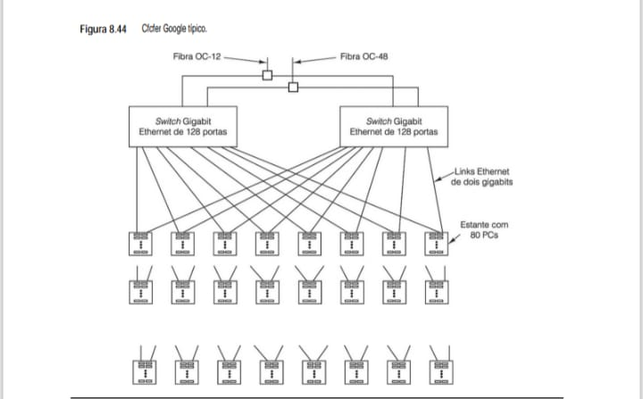

* **Detalhes de Implementação para o eBook:**

## Redundância de Switch
* Cada estante de servidores é conectada a dois switches Gigabit Ethernet diferentes por meio de links duplos. Isso garante que, se um switch falhar, o tráfego de dados continue fluindo sem interrupções.

## Densidade de Processamento
* O Google organiza seus servidores em estantes (racks), onde cada estante contém cerca de 80 PCs. Multiplicando isso pelo número de portas dos switches, um único cluster pode gerenciar milhares de nós de processamento.

## Conectividade de Backbone
* Os switches principais são alimentados por conexões de fibra óptica de altíssima velocidade (OC-12 e OC-48), que conectam o cluster ao restante da infraestrutura global da empresa.

O Google aprendeu três coisas sobre implementar servidores Web maciçamente paralelos, que é bom repetir:

    1. Componentes falham, portanto, planeje a falha.
    
    2. Duplique tudo para manter a vazão e a disponibilidade.

    3. Otimize preço/desempenho.

O primeiro item diz que você precisa ter software tolerante a falhas. Mesmo com o melhor dos equipamentos, se você tiver um número maciço de componentes, algum falhará e o software tem de ser capaz de tratar o erro. Quer você tenha uma falha por semana ou duas, com sistemas desse tamanho o software tem de ser capaz de tratá-las.

O segundo item indica que ambos, hardware e software, têm de ter alto grau de redundância. Além de melhorar as propriedades de tolerância a falhas, isso também melhora a vazão. No caso do Google, os PCs, discos, cabos e switches são todos replicados muitas vezes. Além do mais, o índice e os documentos são subdivididos em fragmentos e estes são muito replicados em cada central de dados, e as próprias centrais de dados também são replicadas.

O terceiro item é uma consequência dos dois primeiros. Se o sistema foi projetado corretamente para lidar com falhas, comprar componentes caros como RAIDs com discos SCSI é um erro. Até eles falharão, mas gastar dez vezes mais para reduzir a taxa de falhas à metade é uma má ideia. Melhor comprar dez vezes mais em hardware e tratar as falhas quando elas ocorrerem. No mínimo, ter mais hardware resultará em melhor desempenho quando tudo estiver funcionando.

Se quiser mais informações sobre o Google, veja Barroso et al., 2003; e Ghemawat et al., 2003.

## 8.4.4 Software de comunicação para multicomputadores
Programar um multicomputador requer software especial, quase sempre bibliotecas, para manipular a comunicação e a sincronização entre processos. Nesta seção, vamos falar um pouco sobre esse software. Na maioria das vezes, os mesmos pacotes de software executam em MPPs(Processadores Massivos Paralelos) e clusters, portanto, é fácil portar aplicações entre plataformas.

Sistemas de troca de mensagens têm dois ou mais processos que executam independentemente um do outro. Por exemplo, um processo pode produzir alguns dados e um, ou outros mais, podem consumi-los. Não há qualquer garantia de que, quando o remetente tiver mais dados, os receptores estarão prontos para ele, pois cada um
executa seu próprio programa.

A maioria dos sistemas de troca de mensagens fornece duas primitivas (em geral, chamadas de biblioteca), send e receive, mas diversos tipos de semânticas são possíveis. As três variantes principais são:

    1. Troca síncrona de mensagens.
    
    2. Troca de mensagens por buffers.
    
    3. Troca de mensagens sem bloqueio.

Na **troca síncrona de mensagens**, se o remetente executa um send e o receptor ainda não executou um receive, o remetente é bloqueado (suspenso) até que o receptor execute um receive, quando então a mensagem é copiada. Quando o remetente obtiver de novo o controle após a chamada, ele sabe que a mensagem foi enviada
e corretamente recebida. Esse método é o que tem a semântica mais simples e não requer operação alguma de buffer. Porém, uma séria desvantagem é que o remetente permanece bloqueado até que o receptor tenha adquirido a mensagem e reconhecido seu recebimento.

Na **troca de mensagens com buffer**, quando uma mensagem é enviada antes de o receptor estar pronto, ela é colocada em algum buffer, por exemplo, em uma caixa de correio, até que o receptor a retire dali. Assim, nesse tipo de troca, um remetente pode continuar após um send, ainda que o receptor esteja ocupado com alguma outra coisa. Visto que a mensagem já foi enviada, o remetente está livre para reutilizar de imediato o buffer de mensagens. Esse esquema reduz o tempo que o remetente tem de esperar. Basicamente, tão logo ele tenha enviado a mensagem, poderá continuar. Todavia, agora, o remetente não tem nenhuma garantia de que a mensagem foi corretamente recebida. Ainda que a comunicação seja confiável, o receptor pode ter sofrido uma avaria antes de receber a mensagem.

Na **troca de mensagens sem bloqueio**, o remetente tem permissão para continuar imediatamente após fazer a chamada. A biblioteca apenas diz ao sistema operacional para fazer a chamada mais tarde, quando tiver tempo. Por conseguinte, o remetente mal fica bloqueado. A desvantagem desse método é que, quando o remetente continua após a send, talvez não possa reutilizar o buffer de mensagens porque a mensagem pode não ter sido enviada ainda. Ele precisa descobrir, de alguma forma, quando pode utilizar novamente o buffer. Uma ideia é fazer com que o remetente pergunte ao sistema. Outra é obter uma interrupção quando o buffer estiver disponível. Nenhuma delas simplifica o software.

Logo adiante, vamos discutir brevemente um sistema popular de troca de mensagens disponível em muitos multicomputadores: a MPI.

* **MPI – Interface de troca de mensagens**
Durante muitos anos, o pacote de comunicação mais popular para multicomputadores foi a **PVM (Parallel Virtual Machine – máquina virtual paralela)** (Geist et al., 1994; e Sunderram, 1990). Contudo, nos últimos anos ele vem sendo substituído em grande parte pela **MPI (Message-Passing Interface – interface de troca de mensagens)**. A MPI é muito mais rica e mais complexa do que a PVM, tem muito mais chamadas de biblioteca, muito mais opções e muito mais parâmetros por chamada. A versão original da MPI, agora denominada MPI-1, foi ampliada pela MPI-2 em 1997. Mais adiante, daremos uma introdução muito sucinta à MPI-1 (que contém todos os aspectos básicos) e em seguida comentaremos um pouco o que foi adicionado na MPI-2. Se o leitor quiser mais informações sobre MPI, pode consultar Gropp et al., 1994; e Snir et al., 1996.

A MPI-1 não lida com criação nem gerenciamento de processo, como a PVM. Cabe ao usuário criar processos usando chamadas locais de sistema. Uma vez criados, os processos são organizados em grupos estáticos de processos, que não são alterados. É com esses grupos que a MPI trabalha.

A MPI é baseada em quatro conceitos principais: comunicadores, tipos de dados de mensagens, operações de comunicação e topologias virtuais. Um **comunicador** é um grupo de processos mais um contexto. Um contexto é um rótulo que identifica algo, como uma fase de execução. Quando mensagens são enviadas e recebidas, o con-
texto pode ser usado para impedir que mensagens não relacionadas interfiram umas com as outras.

Mensagens têm tipos e muitos tipos de dados são suportados, entre eles caracteres, números inteiros longos, normais e curtos, números de ponto flutuante de precisão simples e de precisão dupla, e assim por diante. Também é possível construir outros tipos derivados desses.

A MPI suporta um extenso conjunto de operações de comunicação. A mais básica é usada para enviar mensagens, como a seguir:

    **MPI_Send(buffer, quant, tipo_dado, destino, rótulo, comunicador)**

Essa chamada envia ao destino um buffer com um número quant de itens do tipo de dados especificado. O campo rótulo rotula a mensagem de modo que o receptor possa dizer que só quer receber uma mensagem com aquele rótulo. O último campo informa em qual grupo de processos está o destinatário (o campo destino é apenas um índice para a lista de processos do grupo especificado). A chamada correspondente para receber uma mensagem é:

    **MPI_Recv(&buffer, quant, tipo_dado, origem, rótulo, comunicador, &status)**

que anuncia que o receptor está procurando uma mensagem de certo tipo vinda de certa origem com certo rótulo.

A MPI suporta quatro modos básicos de comunicação. O modo 1 é síncrono, no qual o remetente não pode começar a enviar até que o receptor tenha chamado MPI_Recv. O modo 2 usa buffer e, com ele, a restrição que acabamos de citar não é válida. O modo 3 é o padrão, que é dependente da implementação e pode ser síncrono
ou com buffer. O modo 4 é o modo pronto, no qual o remetente declara que o receptor está disponível (como no modo síncrono), mas não faz qualquer verificação. Cada uma dessas primitivas vem em uma versão com ou sem bloqueio, o que resulta em oito primitivas no total. A recepção tem só duas variantes: com e sem bloqueio.

A MPI suporta comunicação coletiva, incluindo broadcast, espalha/reúne, permuta total, agregação e barreira. Seja qual for a forma de comunicação coletiva, todos os processos em um grupo devem fazer a chamada e com argumentos compatíveis. Não fazer isso é um erro. Uma forma típica de comunicação coletiva são processos organizados em uma árvore, na qual os valores se propagam das folhas para a raiz, passando por algum processamento a cada etapa, por exemplo, somar valores ou apanhar o valor máximo.

Um conceito básico em MPI é a topologia virtual, na qual os processos podem ser organizados em topologia de árvore, anel, grade, toro ou outra, pelo usuário e por aplicação. Essa organização proporciona um meio de nomear caminhos de comunicação e facilita a comunicação.

A MPI-2 adiciona processos dinâmicos, acesso à memória remota, comunicação coletiva sem bloqueio, suporte para E/S escalável, processamento em tempo real e muitas outras novas características que fogem do escopo deste livro. Durante anos, foi travada uma batalha na comunidade científica entre os defensores da MPI e da PVM. O lado da PVM afirmava que a PVM era mais fácil de aprender e mais simples de usar. O lado da MPI dizia que a MPI faz mais e também destacava que ela é um padrão formal, apoiada por um comitê de padronização e um documento oficial de definição. O lado da PVM concordou, mas declarou que a falta de uma burocracia completa de padronização não é necessariamente uma desvantagem. Depois de muita discussão, parece que a MPI venceu.

## 8.4.5 Escalonamento
Programadores de MPI podem criar jobs com facilidade requisitando várias CPUs e executando durante períodos substanciais de tempo. Quando várias requisições independentes estão disponíveis vindas de diferentes usuários, cada uma necessitando de um número diferente de CPUs por períodos de tempo diferentes, o cluster
precisa de um escalonador para determinar qual job é executado e quando.

No modelo mais simples, o escalonador de jobs requer que cada um especifique quantas CPUs necessita. Então, os jobs são executados em estrita ordem FIFO, como mostra a Figura 8.45(a). Nesse modelo, após um job ser iniciado, verifica-se se há número suficiente de CPUs disponíveis para iniciar o próximo job que está na fila de entrada. Se houver, este é iniciado e assim por diante. Caso contrário, o sistema espera até que mais CPUs fiquem disponíveis. A propósito, embora tenhamos sugerido que esse cluster tem oito CPUs, ele poderia perfeitamente ter 128 CPUs que são alocadas em unidades de 16 (o que resulta em oito grupos de CPUs) ou alguma outra combinação.

* **Figura 8.45 - Escalonamento de um cluster. (a) FIFO. (b) Sem bloqueio de cabeça de fila. (c) Lajotas. As áreas sombreadas indicam CPUs ociosas.**
O diagrama mostra como diferentes algoritmos gerenciam o tempo e o uso de CPUs em um grupo de processadores, onde as áreas vazias (sombreadas no original) representam ociosidade.
(a) FIFO                 (b) SEM BLOQUEIO       (c) LAJOTAS (Otimizado)
    Grupo de CPUs          Grupo de CPUs          Grupo de CPUs
   [0|1|2|3|4|5|6|7]      [0|1|2|3|4|5|6|7]        [0|1|2|3|4|5|6|7]
   +---------------+      +-----------------+      +-----------------+
 T | [  Job 1  ]   |      | [Job 1] [Job 4] |      | [Job 1] [Job 4] |
 E | [    Job 2    ]|     | [  Job 3  ] [7] |      | [  Job 3  ] [7] |
 M | [  Job 3  ]   |      | [Job 5] [Job 9] |      | [Job 5] [Job 8] |
 P | [Job 4][Job 5]|      | [    Job 2    ] |      | [    Job 2    ] |
 O | [  Job 6  ]   |      | [  Job 6  ] [8] |      | [  Job 6  ]     |
 | | [Job 7][Job 8]|      | [  Job 7  ]     |      | [  Job 9  ]     |
 v +---------------+      +-----------------+      +-----------------+
    (Muita ociosidade)     (Melhor aproveitado)   (Encaixe perfeito)

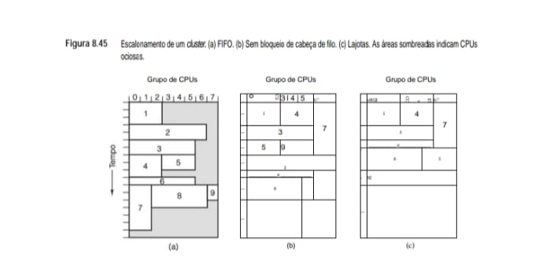

# Análise Técnica: Estratégias de Escalonamento

## FIFO (First-In, First-Out)
* As tarefas são executadas na ordem em que chegam. O grande problema aqui é a ociosidade.
* Se o Job 1 usa poucas CPUs, as outras ficam paradas esperando ele terminar para começar o Job 2.
* É simples, mas muito ineficiente.

## Sem Bloqueio de Cabeça de Fila
* Se o primeiro Job da fila não cabe nos recursos agora, o sistema "pula" ele e coloca um Job menor que caiba.
* Isso reduz o tempo ocioso.

## Lajotas (Tiling)
* É a estratégia mais avançada.
* O escalonador planeja o encaixe das tarefas como se fosse um jogo de Tetris, garantindo que o maior número possível de CPUs esteja trabalhando 100% do tempo.
* Tenta organizar as tarefas como blocos encaixados (lajotas) para maximizar a densidade de uso das CPUs em cada intervalo de tempo, minimizando fragmentação e espera.

Um algoritmo de escalonamento melhor evita bloqueio de cabeça de fila saltando jobs que não cabem e escolhendo o primeiro que couber. Sempre que um job termina, uma fila de jobs remanescentes é verificada em rdem FIFO. Esse algoritmo resulta na Figura 8.45(b).

Um algoritmo de escalonamento ainda mais sofisticado requer que cada job apresentado especifique seu formato, isto é, quantas CPUs ele quer durante quantos minutos. Com essa informação, o escalonador de jobs pode tentar montar um esquema em lajotas com o tempo da CPU. Esse esquema é especialmente eficaz quando os jobs são apresentados durante o dia para execução à noite, de modo que o escalonador tem todas as informações sobre os jobs com antecedência e pode executá-los na melhor ordem, como ilustrado na Figura 8.45(c).

## 8.4.6 Memória compartilhada no nível de aplicação
Algo que deve ficar claro por nossos exemplos é que os multicomputadores podem ser ampliados para tamanhos maiores do que os multiprocessadores. Essa realidade levou ao desenvolvimento de sistemas de troca de mensagens como a **MPI(Message-Passing Interface – interface de troca de mensagem)**. Muitos programadores não apreciam esse modelo e gostariam de ter a ilusão de memória compartilhada, ainda que ela não estivesse realmente ali. Atingir esse objetivo seria o melhor de ambos os mundos: hardware grande e barato (pelo menos, por nó), além de facilidade de programação. Esse é Santo Graal da computação paralela.

Muitos pesquisadores concluíram que, embora a capacidade de ampliação da memória compartilhada no nível da arquitetura não seja boa, pode haver outros modos de alcançar o mesmo objetivo. Pela Figura 8.21, vemos que há outros níveis nos quais uma memória compartilhada pode ser introduzida. Nas seções seguintes,
examinaremos alguns modos pelos quais a memória compartilhada pode ser introduzida em um multicomputador no modelo de programação, sem estar presente no nível do hardware.

* **Memória compartilhada distribuída(DSM)**
Uma classe de sistema de memória compartilhada no nível de aplicação é o sistema baseado em páginas. É conhecido pelo nome **DSM (Distributed Shared Memory – memória compartilhada distribuída)**. A ideia é simples: um conjunto de CPUs em um multicomputador compartilha um espaço de endereço virtual paginado. Na versão mais simples, cada página é mantida na RAM de exatamente uma CPU. Na Figura 8.46(a), vemos um espaço de endereço virtual compartilhado que consiste em 16 páginas, distribuídas por quatro CPUs.

Quando uma CPU referencia uma página em sua própria RAM local, a escrita ou leitura apenas ocorre, sem mais demora. Contudo, quando referencia uma página em uma memória remota, obtém uma falta de página. Só que, em vez de a página faltante ser trazida do disco, o sistema de execução ou o sistema operacional envia
uma mensagem ao nó que contém a página ordenando que ele a desmapeie e a envie. Após a página chegar, ela é mapeada e a instrução que falta é reiniciada, exatamente como uma falta de página normal. Na Figura 8.46(b), vemos a situação após a CPU 0 ter sofrido uma falta na página 10: ela é movida da CPU 1 para a CPU 0.

* **Figura 8.46 - Espaço de endereço virtual que consiste em 16 páginas distribuídas por quatro nós de um multicomputador. (a) Situação inicial. (b) Após a CPU 0 referenciar a página 10. (c) Após a CPU 1 referenciar a página 10, neste caso considerando que ela é uma página somente de leitura.**
A imagem demonstra como 16 páginas de memória virtual são distribuídas entre quatro nós independentes, cada um com sua própria CPU e memória física.

        ESPAÇO DE ENDEREÇAMENTO GLOBAL (16 PÁGINAS)
        +--+--+--+--+--+--+--+--+--+--+--+--+--+--+--+--+
        |00|01|02|03|04|05|06|07|08|09|10|11|12|13|14|15|
        +--+--+--+--+--+--+--+--+--+--+--+--+--+--+--+--+
        |  |  |  |  |  |  |  |  |  |  |  |  |  |  |  |
        v  v  v  v  v  v  v  v  v  v  v  v  v  v  v  v
        +-------+  +-------+  +-------+  +-------+
        | CPU 0 |  | CPU 1 |  | CPU 2 |  | CPU 3 |
        |-------|  |-------|  |-------|  |-------|
        | Págs: |  | Págs: |  | Págs: |  | Págs: |
        | 0,2,5 |  | 1,3,6 |  | 4,7,11|  | 13,15 |
        | 9     |  | 8,10  |  | 12,14 |  |       |
        +-------+  +-------+  +-------+  +-------+
            |          |          |          |
        ================= REDE ===================

* **(b) Situação após a CPU 0 referenciar a Página 10**
Neste cenário, ocorre um "Page Fault" de rede. A CPU 0 solicita a página, e ela é movida fisicamente (ou logicamente via mapeamento) da CPU 1 para a CPU 0.

        +--------+       +--------+       +--------+       +--------+
        | CPU 0  |       | CPU 1  |       | CPU 2  |       | CPU 3  |
        |------- |       |--------|       |--------|       |--------|
        | [0,2,5 |       | [1,3,6 |       | [4,7,11|       | [13,15]|
        | 9, 10] |<--+   |  8]    |       |  12,14]|       |        |
        +---+----+   |   +---+----+       +---+----+       +---+----+
            |        |       |                |                |
        ----+--------+-------+----------------+----------------+---- REDE
                     ^
            (Página 10 movida)

* **(c) Situação após a CPU 1 referenciar a Página 10 (Somente Leitura)**
Se a página for marcada como Read-Only (Somente Leitura), o sistema não precisa movê-la de volta. Ele cria uma replicação. Agora, ambas as CPUs possuem o dado, eliminando o tráfego de rede para futuras leituras.

        +--------+       +--------+       +--------+       +--------+
        | CPU 0  |       | CPU 1  |       | CPU 2  |       | CPU 3  |
        |--------|       |--------|       |--------|       |--------|
        | [0,2,5 |       | [1,3,6 |       | [4,7,11|       | [13,15 |
        | 9, 10] |       |  8, 10]|       |  12,14]|       |        |
        +---+----+       +---+----+       +---+----+       +---+----+
            |                |                |                |
        ----+----------------+----------------+----------------+---- REDE
            ^                ^
        (Página 10 agora está replicada em ambas)

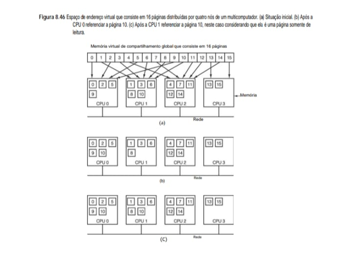

# Análise das Situações

## (a) Situação Inicial
* As páginas estão distribuídas.
* A Página 10, por exemplo, pertence originalmente à CPU 1.

## (b) CPU 0 referencia a Página 10
* A CPU 0 tenta ler o dado, percebe que não o tem e solicita via rede.
* A Página 10 sai da CPU 1 e "viaja" para a CPU 0.

## (c) Página Somente de Leitura
* Se a Página 10 for apenas para leitura, ela pode ser duplicada.
* Tanto a CPU 0 quanto a CPU 1 ficam com uma cópia, acelerando o acesso sem precisar mover o dado toda hora.

Essa ideia básica foi executada pela primeira vez no IVY (Li e Hudak, 1989). Ela proporciona uma memória totalmente compartilhada e sequencialmente consistente em um multicomputador. Contudo, há muitas otimizações possíveis para melhorar o desempenho. A primeira, presente no IVY, é permitir que as páginas marcadas
como somente de leitura estejam presentes em vários nós ao mesmo tempo. Assim, quando ocorre uma falta de página, uma cópia dela é enviada para a máquina onde ocorreu a falta, mas a original fica onde está, já que não há nenhum perigo de conflitos. A situação de duas CPUs que compartilham uma página somente de leitura (página 10) é ilustrada na Figura 8.46(c).

Mesmo com essa otimização, o desempenho muitas vezes é inaceitável, em especial quando um processo está escrevendo ativamente algumas palavras no topo de alguma página e outro processo em uma CPU diferente está escrevendo ativamente algumas palavras no final da página. Visto que só existe uma cópia da página, ela ficará
em constante ir e vir, uma situação conhecida como **falso compartilhamento.**

O problema do falso compartilhamento pode ser tratado de várias maneiras. No sistema **Treadmarks**, por exemplo, a memória sequencialmente consistente é abandonada em favor da consistência de liberação (Amza, 1996). Páginas que podem ser escritas conseguem estar presentes em múltiplos nós ao mesmo tempo, mas, antes de fazer uma escrita, um processo deve primeiro realizar uma operação **acquire** para sinalizar sua intenção. Nesse ponto, todas as cópias, exceto a mais recente, são invalidadas. Nenhuma outra cópia pode ser feita até que seja executada a **release** correspondente, quando então a página pode ser compartilhada novamente.

Uma segunda otimização feita em Treadmarks é mapear inicialmente cada página que pode ser escrita, em modo somente de leitura. Quando a página é escrita pela primeira vez, ocorre uma falha de proteção e o sistema faz uma cópia da página, denominada gêmea. Então, a página original é mapeada como de leitura-escrita e as
escritas subsequentes podem prosseguir a toda velocidade. Quando ocorrer uma falta de página remota mais tarde, e a página tiver de ser despachada para onde ocorreu a falta, é realizada uma comparação palavra por palavra entre a página corrente e a gêmea. Somente as palavras que foram alteradas são enviadas, o que reduz o tamanho das mensagens.

Quando ocorre uma falta de página, a página que está faltando tem de ser localizada. Há várias soluções possíveis, incluindo as usadas em máquinas NUMA e COMA, tais como diretórios (residentes). Na verdade, muitas das soluções usadas em DSM também são aplicáveis a NUMA e COMA porque, na realidade, DSM é apenas uma
execução em software de NUMA ou COMA na qual cada página é tratada como uma linha de cache.

DSM é uma área de pesquisa muito promissora. Entre os sistemas interessantes citamos CASHMERE (Kontothanassis et al., 1997; e Stets et al., 1997), CRL (Johnson et al., 1995), Shasta (Scales et al., 1996) e Treadmarks (Amza, 1996; e Lu et al., 1997). DSM(Memória Compartilhada Distribuída).

* **Linda**
Sistemas DSM baseados em páginas como o IVY e o Treadmarks usam o hardware MMU para causar exceções de acesso às páginas faltantes. Embora calcular e enviar diferenças em vez da página inteira ajude, permanece o fato de que páginas não são uma unidade natural para compartilhamento, portanto, foram tentadas outras técnicas.

Uma delas é Linda, que fornece processos em várias máquinas com uma memória compartilhada distribuída com alto grau de estruturação (Carriero e Gelernter, 1989). Essa memória é acessada por meio de um pequeno conjunto de operações primitivas que podem ser adicionadas a linguagens existentes, como C e FORTRAN, para
formar linguagens paralelas, nesse caso, C-Linda e FORTRAN-Linda.

O conceito unificador fundamental de Linda é o de um espaço de tuplas abstrato, que é global para o sistema inteiro e acessível a todos os seus processos. O espaço de tuplas é como uma memória global compartilhada, só que com certa estrutura embutida. O espaço de tuplas contém certa quantidade de tuplas, cada uma delas consistindo em um ou mais campos. Para C-Linda, os tipos de campos incluem inteiros, inteiros longos e números de ponto flutuante, bem como tipos compostos como vetores (incluindo cadeias) e estruturas (mas não outras tuplas). A Figura 8.47 mostra três exemplos de tuplas.

* **Figura 8.47 - Três tuplas Linda.**

("abc", 2, 5)
("matrix-1", 1, 6, 3.14)
("family", "is sister", Carolyn, Elinor)

São quatro as operações efetuadas em tuplas. A primeira, out, coloca uma tupla no espaço de tuplas. Por exemplo,

    out(“abc”, 2, 5);

coloca a tupla (“abc”, 2, 5) no espaço de tuplas. Os campos de out normalmente são constantes, variáveis ou expressões, como em

    out(“matrix–1”, i, j, 3.14);

que produz uma tupla com quatro campos, o segundo e terceiro dos quais são determinados pelos valores correntes das variáveis i e j.

Tuplas são recuperadas do espaço de tuplas pela primitiva in. Elas são endereçadas pelo conteúdo em vez de pelo nome ou endereço. Os campos de in podem ser expressões ou parâmetros formais. Considere, por exemplo,

    in(“abc”, 2, ? i);

    ESPAÇO DE TUPLAS (SHARED POOL)
    +------------------------------------------+
    |  ("abc", 2, 5)        ("sensor", 1, 25.4)|
    |                                          |
    |  ("matrix-1", 10, 20, 3.14)              |
    +------------------------------------------+
        ^                      |
        | out("abc", 2, 5)     | in("abc", 2, ? i)
        |                      v
    +-----------+          +-----------+
    | PROCESSO A|          | PROCESSO B|
    +-----------+          +-----------+
                           (i recebe 5)

# Operações em Espaço de Tuplas

## 1. A Operação `out` (Inserção)
* A primitiva `out` é responsável por gerar e colocar uma nova tupla no espaço de dados.
* Comportamento: Os valores são avaliados no momento da chamada e a tupla resultante é armazenada no espaço comum.
* Exemplo: `out("matrix-1", i, j, 3.14);` cria uma entrada contendo a string, os valores atuais de `i` e `j`, e a constante real.

## 2. A Operação `in` (Recuperação e Remoção)
* A primitiva `in` busca uma tupla que coincida com o padrão fornecido (chamado de template ou gabarito).
* Endereçamento por Conteúdo: Diferente de uma variável comum, você não busca pelo nome "X", mas por uma tupla que tenha, por exemplo, "abc" na primeira posição e 2 na segunda.
* Parâmetros Formais: O uso do símbolo `?` (como em `?i`) indica que aquela posição é um "espaço em branco" que deve ser preenchido com o valor encontrado na tupla recuperada.
* Bloqueio: Se nenhuma tupla coincidente for encontrada, o processo que executou o `in` fica bloqueado até que algum outro processo execute um `out` com uma tupla compatível.

Essa operação “pesquisa” o espaço de tuplas em busca de uma composta por uma cadeia “abc”, pelo inteiro 2, e por um terceiro campo que contém qualquer inteiro (considerando que i é um inteiro). Se encontrada, ela é retirada do espaço de tuplas e o valor do terceiro campo é atribuído à variável i. A combinação e a remoção são atômicas, portanto, se dois processos executarem a mesma operação in simultaneamente, só um deles será bem sucedido, a menos que duas ou mais tuplas compatíveis estejam presentes. O espaço de tuplas pode até conter múltiplas cópias da mesma tupla.

O algoritmo de combinação usado por in é direto. Os campos da primitiva in, denominados gabarito, são comparados, conceitualmente, com os campos correspondentes de toda tupla que estiver no espaço de tuplas. Ocorre uma combinação se todas as três condições a seguir forem cumpridas:

    1. O gabarito e a tupla têm o mesmo número de campos.

    2. Os tipos dos campos correspondentes são iguais.

    3. Cada constante ou variável no gabarito é compatível com seu campo de tupla.

Parâmetros formais, indicados por um ponto de interrogação seguido por um nome ou tipo de variável, não participam da combinação (exceto para verificação do tipo), embora os que contêm um nome de variável sejam atribuídos após uma combinação bem-sucedida.

Se nenhuma tupla compatível estiver presente, o processo de chamada é suspenso até que outro processo insira a tupla necessária, quando então o processo chamador é automaticamente revivido e recebe a nova tupla. O fato de os processos bloquearem e desbloquearem automaticamente significa que, se um processo estiver prestes a produzir uma tupla e outro estiver prestes a recebê-la, não importa qual deles vai ocorrer primeiro.

Além de out e in, Linda também tem uma primitiva read, que é igual a in, exceto que não retira a tupla do espaço de tuplas. Também há uma primitiva eval, que faz com que seus parâmetros sejam avaliados em paralelo e a tupla resultante seja depositada no espaço de tuplas. Esse mecanismo pode ser usado para efetuar um cálculo arbitrário. É assim que processos paralelos são criados em Linda.

Um paradigma de programação comum em Linda é o modelo operário replicado. Esse modelo é baseado na ideia da sacola de tarefas cheia de jobs por fazer. O processo principal inicia out executando um laço que contém 

    out(“task-bag”, job);

no qual uma descrição de job diferente é produzida para o espaço de tuplas a cada iteração. Cada operário começa obtendo uma tupla de descrição de job usando

    in(“task-bag”, ?job);

que ele então executa. Quando termina, pega outra. Além disso, novos trabalhos podem ser colocados na sacola de tarefas durante a execução. Desse modo simples, o trabalho é dividido dinamicamente entre os operários, e cada operário é mantido ocupado o tempo todo, e tudo com relativamente pouca sobrecarga.

Existem várias implementações de Linda em sistemas multicomputadores. Em todas elas, uma questão fundamental é como distribuir as tuplas entre as máquinas e como localizá-las quando necessário. Entre as várias possibilidades estão broadcasting e diretórios. A replicação também é uma questão importante. Esses pontos são discutidos em Bjornson, 1993.

* **Orca**
Uma abordagem um pouco diferente para a memória compartilhada no nível de aplicação em um multicomputador é usar objetos como unidade de compartilhamento, em vez de apenas tuplas. Objetos consistem em estado interno (oculto) mais métodos para operar naquele estado. Por não permitir que o programador acesse o estado diretamente, são abertas muitas possibilidades para permitir o compartilhamento por máquinas que não têm memória física compartilhada. O sistema baseado em objetos que dá a ilusão de memória compartilhada em sistemas multicomputadores é denominado Orca (Bal, 1991; Bal et al., 1992; e Bal e Tanenbaum, 1988). Orca é uma linguagem de programação tradicional (baseada em Modula 2), à qual foram adicionadas duas novas características: objetos e a capacidade de criar novos processos. Um objeto Orca é um tipo de dados abstrato, semelhante a um objeto em Java ou um pacote em Ada. Ele encapsula estruturas de dados internas e métodos escritos pelo usuário, denominados operações. Objetos são passivos, isto é, não contêm threads para os quais podem ser enviadas mensagens. Em vez disso,
processos acessam os dados internos de um objeto invocando seus métodos.

Cada método Orca consiste em uma lista de pares (guarda, bloco de declarações). Uma guarda é uma expressão booleana que não contém nenhum efeito colateral, ou a guarda vazia, que é o mesmo que o valor true. Quando uma operação é invocada, todas as suas guardas são avaliadas em uma ordem não especificada. Se todas
elas forem false, o processo invocador é atrasado até que uma se torne true. Quando é encontrada uma guarda que é avaliada como true, o bloco de declarações que vem depois dela é executado. A Figura 8.48 retrata um objeto stack com duas operações, push e pop.

Uma vez definida stack, podem-se declarar variáveis desse tipo, como em

    s, t: stack;

que cria dois objetos stack e inicializa a variável top em cada um deles como 0. A variável inteira k pode ser passada para a pilha s pela declaração

    s$push(k);

e assim por diante. A operação pop tem uma guarda, portanto, uma tentativa de retirar uma variável de uma pilha vazia suspenderá o processo chamador até que outro processo tenha passado alguma coisa para a pilha.

Orca tem uma declaração fork para criar um novo processo em um processador especificado pelo usuário. O novo processo executa o procedimento nomeado na declaração fork. Parâmetros, incluindo objetos, podem ser passados ao novo processo, e é assim que objetos ficam distribuídos entre as máquinas. Por exemplo, a declaração

    **for i in 1 .. n do fork foobar(s) on i; od;**

gera um novo processo em cada uma das máquinas, de 1 a n, executando o programa foobar em cada uma delas. À medida que esses n novos processos (e o pai) executam em paralelo, todos eles podem passar itens para a pilha compartilhada e retirá-los da pilha como se todos eles estivessem executando em um multiprocessador de memória compartilhada. Sustentar a ilusão de memória compartilhada onde ela realmente não existe é tarefa do sistema de run-time.

Object implementation stack;

  # Dados internos
  top: integer;                                # armazenamento para a pilha
  stack: array [integer 0..N-1] of integer;

  # Operações
  operation push(item: integer); 
    # Função retorna nada
    begin
      guard top < N - 1 do
        stack[top] := item;  # Passe item para a pilha
        top := top + 1;      # Incremente o ponteiro de pilha
      od;
    end;

  operation pop( ): integer; 
    # Função retornando um inteiro
    begin
      guard top > 0 do       # Suspenda se a pilha estiver vazia
        top := top - 1;      # Decremente o ponteiro de pilha
        return stack[top];   # Retorne o item do topo
      od;
    end;

begin
  top := 0;  # Inicialização
end;

Operações sobre objetos compartilhados são atômicas e sequencialmente consistentes. O sistema garante que, se vários processos efetuarem operações no mesmo objeto compartilhado quase de modo simultâneo, o sistema escolhe alguma ordem e todos os processos veem a mesma ordem de eventos.

Orca integra dados compartilhados e sincronização de um modo que não está presente em sistemas DSM baseados em paginação. Dois tipos de sincronização são necessários em programas paralelos. O primeiro tipo é sincronização por exclusão mútua, para evitar que dois processos executem a mesma região crítica ao mesmo
tempo. Para todos os efeitos, cada operação sobre um objeto compartilhado em Orca é como uma região crítica, porque o sistema garante que o resultado final é o mesmo que seria se todas as regiões críticas fossem executadas uma por vez (isto é, sequencialmente). Nesse aspecto, um objeto Orca é como uma forma distribuída de um monitor (Hoare, 1975).

O outro tipo é a sincronização de condição, na qual um processo bloqueia esperando por alguma condição válida. Em Orca, a sincronização de condição é feita com guardas. No exemplo da Figura 8.48, um processo que tente retirar um item de uma pilha vazia será suspenso até que a pilha não esteja mais vazia. Afinal, você não pode retirar uma palavra de uma pilha vazia.

O sistema de run-time de Orca trata da replicação de objeto, migração, consistência e invocação de operação. Cada objeto pode estar em um de dois estados: cópia única ou replicado. Um objeto em estado de cópia única existe somente em uma máquina, portanto, todas as requisições para ele são enviadas para essa máquina. Um objeto replicado está presente em todas as máquinas que contêm um processo que o está usando, o que facilita as operações de leitura (já que elas podem ser feitas localmente) à custa de encarecer as atualizações. Quando é executada uma operação que modifica um objeto replicado, em primeiro lugar ela deve obter um número de sequência dado por um processo centralizado que os emite. Então, é enviada uma mensagem a cada máquina que tem uma cópia do objeto, dizendo a ela que execute a operação. Uma vez que todas essas atualizações portam números de sequência, todas as máquinas executam as operações na mesma ordem, o que garante consistência sequencial.

## 8.4.7 Desempenho
O ponto principal da construção de um computador paralelo é fazer com que ele execute mais rápido do que uma máquina com um único processador. Se ele não cumprir esse simples objetivo, não vale a pena tê-lo. Além disso, ele deve cumprir o objetivo de uma maneira eficiente em relação ao custo. Uma máquina que é duas vezes mais rápida do que um uniprocessador a 50 vezes o custo muito provavelmente não será um sucesso de vendas. Nesta seção, examinaremos algumas das questões de desempenho associadas a arquiteturas de computadores paralelos.

* **Métrica de hardware**
Do ponto de vista do hardware, a métrica do desempenho que interessa são as velocidades de CPU e E/S e o desempenho da rede de interconexão. As velocidades de CPU e E/S são as mesmas de um uniprocessador, portanto, os parâmetros fundamentais de interesse em um sistema paralelo são os associados com dois itens fun-
damentais: latência e largura de banda, que agora examinaremos um por vez.

A latência de ida e volta é o tempo que leva para a CPU enviar um pacote e obter uma resposta. Se o pacote for enviado a uma memória, então a latência mede o tempo que leva para ler ou escrever uma palavra ou bloco de palavras. Se ele for enviado a outra CPU, a latência mede o tempo de comunicação entre processadores para pacotes daquele tamanho. Em geral, a latência que interessa é a de pacotes mínimos, muitas vezes uma única palavra ou uma pequena linha de cache.

A latência é composta de vários fatores e é diferente para interconexões de comutação de circuitos, armazenamento e repasse (store-and-forward), atalho virtual e wormhole roteada. No caso da comutação de circuitos, a latência é a soma do tempo de estabelecimento com o tempo de transmissão. Para estabelecer um circuito é preciso enviar um pacote de sondagem para reservar recursos e então devolver um relatório. Tão logo isso aconteça, o pacote de dados tem de ser montado. Quando o pacote estiver pronto, os bits podem fluir a toda velocidade, portanto, se o tempo total de montagem for Ts, o tamanho do pacote é p bits, e a largura de banda b bits/s, a latência de uma via é **Ts + p/b**. Se o circuito for full duplex, não há tempo de estabelecimento para a resposta, portanto, a latência mínima para enviar um pacote de p bits e obter uma resposta de p bits é **Ts + 2p/b s**.

Na comutação de pacotes não é necessário enviar antes um pacote de sondagem ao destino, mas ainda há algum tempo interno de estabelecimento para montar o pacote, Ta. Nesse caso, o tempo de transmissão de uma via é Ta + p/b, mas isso é apenas o tempo de levar o pacote até o primeiro switch. Há um atraso finito dentro do switch, por exemplo, Td, e então o processo é repetido no switch seguinte e assim por diante. O atraso Td é composto do tempo de processamento mais o atraso de fila à espera da liberação de uma porta de saída. Se houver n switches, então a latência total de uma via é dada pela fórmula **Ta + n(p/b + Td) + p/b**, cujo termo final se deve à cópia do último switch até o destino.

No melhor caso, as latências de uma via para atalho virtual e roteamento wormhole estão próximas a Ta + p/b porque não há nenhum pacote de sondagem para estabelecer um circuito e nenhum atraso de armazenamento e repasse. Basicamente, é o tempo inicial de estabelecimento para montar o pacote, mais o tempo para empurrar os bits porta afora. Em todos os casos, é preciso adicionar o atraso de propagação, mas ele costuma ser pequeno.

A outra métrica de hardware é a largura de banda. Muitos programas paralelos, em especial em ciências naturais, movimentam grande quantidade de dados de um lado para outro, portanto, o número de bytes/s que o sistema pode mover é crítico para o desempenho. Há várias métricas para largura de banda. Já vimos uma delas –
largura de banda de bisseção. Outra é a **largura de banda agregada**, que é calculada pela simples adição das capacidades de todos os enlaces. Esse número dá o número máximo de bits que podem estar em trânsito ao mesmo tempo. Ainda outra métrica importante é a largura de banda média na saída da CPU. Se cada CPU for capaz de produzir 1 MB/s, de pouco adianta a interconexão ter uma largura de bisseção de 100 GB/s. A comunicação será limitada pela quantidade de dados que cada CPU pode produzir.

Na prática, conseguir qualquer coisa que ao menos chegue perto da largura de banda teórica é muito difícil. Muitas fontes de sobrecarga contribuem para reduzir a capacidade. Por exemplo, há sempre alguma sobrecarga por pacote associada a cada pacote: montar o pacote, construir seu cabeçalho e mandá-lo embora. **O envio de 1.024 pacotes de 4 bytes nunca alcançará a mesma largura de banda que o envio de um único pacote de 4.096 bytes**. Infelizmente, para conseguir baixas latências é melhor usar pacotes menores, visto que os grandes bloqueiam as linhas e switches por muito tempo. Assim, há um conflito inerente entre conseguir baixas latências médias e alta utilização de largura de banda. Para algumas aplicações, uma delas é mais importante que a outra, e para outras aplicações pode ser o contrário. Entretanto, vale a pena observar que você sempre pode comprar mais largura de banda (instalando mais fios ou fios mais largos), mas não pode obter latências mais baixas. Por isso, em geral, é melhor errar para o lado das menores latências possíveis e se preocupar com largura de banda mais tarde.

* **Métrica de software**
A métrica de hardware, como a latência e a largura de banda, observa o que o hardware é capaz de fazer. Contudo, os usuários têm uma perspectiva diferente. Eles querem saber o ganho de rapidez na execução de seus programas em um computador paralelo em vez de em um uniprocessador. Para eles, a métrica fundamental é mais velocidade: quanto mais depressa um programa executa em um sistema de n processadores em comparação com um sistema com um só processador. Em geral, os resultados são mostrados em grafos como os da Figura 8.49. Nesse caso, vemos vários programas paralelos diferentes que executam em um multicomputador que consiste em 64 CPUs Pentium Pro. Cada curva mostra o ganho de velocidade de um programa com k CPUs como uma função de k. O ganho de velocidade perfeito é indicado pela linha pontilhada na qual usar k CPUs faz o programa funcionar k vezes mais rápido, para qualquer k. Poucos programas conseguem o ganho perfeito de velocidade, mas alguns chegam perto. O problema dos N corpos consegue um ótimo paralelismo; o awari (um jogo de tabuleiro africano) se sai razoavelmente bem, mas
inverter certa matriz de linha do horizonte não chega a mais do que cinco vezes a velocidade original, não importando quantas CPUs estejam disponíveis. Os programas e resultados são discutidos em Bal et al., 1998.

* **Figura 8.49   Programas reais alcançam menos do que o aumento perfeito de velocidade indicado pela linha pontilhada.**

         Aumento de Velocidade
    ^
    |          / (Aumento Linear Perfeito)
    |         / 
  60|        /  ■ (Problema dos N corpos)
    |       /  /
    |      /  /
  30|     /  ● (Awari - Jogo de tabuleiro)
    |    /--'
    |  / o o o o o o o (Inversão de matriz)
    +------------------------------------->
    0   10   20   30   40   50   60  Número de CPUs

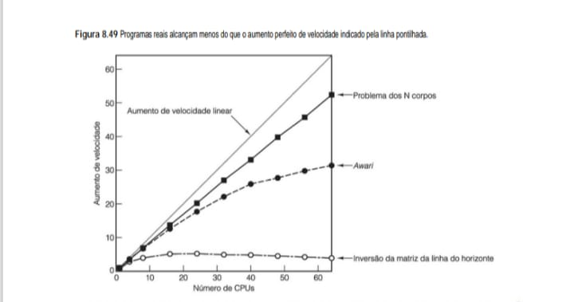

# Desempenho e Realidade em Multiprocessadores

## Escalabilidade
* A escalabilidade não é perfeita.
* A Figura 8.49 ilustra como programas reais se comportam à medida que adicionamos mais CPUs:

## Comportamento de Programas
* **Aumento de Velocidade Linear**: O ideal teórico onde dobrar as CPUs dobra a velocidade.
* **Problema dos N corpos**: Consegue manter uma eficiência alta, aproximando-se da linha ideal devido à sua natureza altamente paralelizável.
* **Inversão de Matriz**: Mostra um ganho muito baixo que estagna rapidamente.
 * Isso ocorre porque a sobrecarga de comunicação entre os nós (como as trocas de mensagens e sincronização de memória) acaba superando o ganho de processamento.
 * Inversão de Matriz: Péssimo escalonamento. Chega um ponto onde adicionar mais CPUs piora o desempenho devido ao congestionamento no barramento e na rede de interconexão.

Parte da razão por que o ganho de velocidade perfeito é quase impossível de alcançar é que quase todos os programas têm algum componente sequencial, que costuma ser a fase de incialização, a leitura de dados ou a coleta de resultados. Nesse caso, não adianta ter muitas CPUs. Suponha que um programa execute por T segundos em um uniprocessador, sendo que uma fração f de seu tempo é código sequencial e uma fração (1 – f) tem potencial para paralelismo, como mostra a Figura 8.50(a). Se esse último código puder executar em n CPUs sem nenhuma sobrecarga, seu tempo de execução pode ser reduzido de (1 – f)T para (1 – f)T/n na melhor das hipóteses, como mostra a Figura 8.50(b). Isso dá um tempo de execução total para as partes sequencial e paralela de fT + (1 – f)T/n. O aumento de velocidade é apenas o tempo de execução do programa original, T, dividido pelo novo tempo de execução:

    Aumento de velocidade =     n 
                            1+ (n - 1) f

* **Figura 8.50 - (a) Um programa tem uma parte sequencial e uma parte que pode utilizar paralelismo. (b) Efeito da execução de parte do programa em paralelo.**
A Figura 8.50 é fundamental para o seu eBook pois ela ilustra visualmente a Lei de Amdahl, um conceito crucial para qualquer desenvolvedor que trabalha com sistemas distribuídos ou multithreading.

É a representação visual da Lei de Amdahl. Ela explica matematicamente por que, mesmo que você tenha 1.000 CPUs, o tempo total de execução de um programa nunca será zero, pois sempre haverá uma parte do código que precisa ser executada de forma sequencial (uma instrução após a outra).

O diagrama demonstra que o ganho de desempenho de um programa é limitado pela sua parte que não pode ser paralelizada (sequencial).

    (a) Estrutura do Programa            (b) Execução em Paralelo (n CPUs)
        (Tempo Total = T)                    (Tempo Reduzido)

    +-----------------------+            +-------+
    |        Parte          |            |   f   | <--- 1 CPU ativa
    |      Sequencial (f)   |            +-------+
    +-----------------------+            |       |
    |                       |            | 1 - f |
    |        Parte          |            |-------|
    |     Paralelizável     |    ====>   | 1 - f | <--- n CPUs ativas
    |        (1 - f)        |            |-------|
    |                       |            | 1 - f |
    +-----------------------+            +-------+

    <---------- T ---------->            <--fT--><--- (1-f)T / n --->

# Lei de Amdahl: O Limite da Paralelização

## Componentes do Tempo de Execução
* **Parte Sequencial (f)**: Representa o código que precisa ser executado em ordem, como inicialização de variáveis, leitura de arquivos ou sincronização de travas (locks).
 * Não importa quantas CPUs você adicione, essa parte sempre levará o mesmo tempo (fT).
* **Parte Paralelizável (1 - f)**: É o trecho do código que pode ser dividido entre várias CPUs.
 * Em um cenário ideal com n CPUs, o tempo gasto nessa parte cai para (1 - f)T/n.

## O "Gargalo"
* Note que, mesmo que você tenha infinitas CPUs (n --> infinito), o tempo total de execução nunca será menor que fT.
* Se 10% do seu programa for sequencial, você nunca conseguirá um aumento de velocidade superior a 10 vezes, não importa o hardware.

## Lei de Amdahl
* Para f = 0, podemos obter aumento de velocidade linear, mas, para f > 0, o aumento de velocidade perfeito não é possível por causa do componente sequencial.
* Esse resultado é conhecido como lei de Amdahl.

        (a) EXECUÇÃO EM 1 CPU (Situação Original)
        +------------------------- T ---------------------------+
        |   Parte Sequencial (f)   |  Parte Paralelizável (1-f) |
        +--------------------------+----------------------------+
        |          f * T           |          (1 - f) * T       |

        (b) EXECUÇÃO EM n CPUs (Aceleração)
        +----------+---------------+
        |  f * T   | (1-f) * T / n |
        +----------+---------------+
        |  Fixa    |   Reduzida    |

# Lei de Amdahl: O Limite da Paralelização

## Componentes do Tempo de Execução
* **Fração Sequencial (f)**: É a parte do código que não pode ser dividida (ex: leitura de um arquivo, inicialização de variáveis). Ela é o gargalo.
* **Fração Paralelizável (1 - f)**: É a parte que pode ser distribuída entre várias CPUs (ex: cálculos matemáticos independentes).

## O Efeito
* Note que, por mais que aumentemos o número de CPUs (n), o tempo total nunca será menor que f x T.
* Se 5% do seu código for sequencial, o seu programa nunca será mais do que 20 vezes mais rápido, mesmo com infinitos processadores.

A lei de Amdahl não é a única razão por que o aumento perfeito de velocidade é quase impossível de conseguir. Latências de comunicação não zero, larguras de banda de comunicação finitas e ineficiências de algoritmos também podem desempenhar um papel. Além disso, mesmo que houvesse mil CPUs disponíveis, nem todos os
programas podem ser escritos para fazer uso de tantas CPUs e a sobrecarga para inicializar todas pode ser significativa. Ademais, muitas vezes o algoritmo mais conhecido não é bom para ser usado em uma máquina paralela, portanto, é preciso usar um algoritmo abaixo do ideal no caso paralelo. Dito isso, há muitas aplicações para as quais seria muito desejável que o programa executasse com velocidade n vezes maior, ainda que para isso precisasse de 2n CPUs. Afinal, CPUs não são tão caras, e muitas empresas vivem com consideravelmente menos do que 100% de eficiência em outras partes de seus negócios.

* **Obtenção de alto desempenho**
O modo mais direto de melhorar o desempenho é adicionar CPUs ao sistema. Contudo, essa adição deve ser feita de um modo tal que evite a criação de gargalos. Um sistema no qual se pode adicionar CPUs e obter mais capacidade de computação correspondente é denominado escalável.

Para ver algumas implicações da escalabilidade, considere quatro CPUs conectadas por um barramento, como ilustrado na Figura 8.51(a). Agora, imagine ampliar esse sistema para 16 CPUs adicionando 12, conforme mostra a Figura 8.51(b). Se a largura de banda do barramento for b MB/s, então, com a quadruplicação do número
de CPUs, também reduzimos a disponibilidade de largura de banda por CPU de b/4 MB/s para b/16 MB/s. Esse é um sistema não escalável.

* **Figura 8.51 - (a) Sistema de 4 CPUs com um barramento. (b) Sistema de 16 CPUs com um barramento. (c) Sistema de 4 CPUs em grade. (d) Sistema de 16 CPUs em grade**.
As arquiteturas de computadores paralelos evoluíram para lidar com as limitações físicas de processamento único, permitindo que múltiplos nós trabalhem em conjunto para resolver problemas complexos. No entanto, a eficiência desses sistemas depende diretamente da forma como os componentes são interconectados e como o trabalho é distribuído entre eles.

O diagrama ilustra a diferença fundamental entre conectar CPUs a um meio de comunicação compartilhado e organizá-las em uma topologia de malha.

    BARRAMENTO (Recurso Único)              GRADE / MESH (Caminhos Múltiplos)
                                          
      (a) 4 CPUs      (b) 16 CPUs            (c) 4 CPUs       (d) 16 CPUs
                                          
      [C][C][C][C]    [C][C]...[C]           [C]---[C]        [C]-[C]-[C]-[C]
           |               |                  |     |          |   |   |   |
     +-----+-----+   +-----+-----+           [C]---[C]        [C]-[C]-[C]-[C]
     | BARRAMENTO|   | BARRAMENTO|                             |   |   |   |
     +-----------+   +-----------+                            [C]-[C]-[C]-[C]
                                                               |   |   |   |
                                                              [C]-[C]-[C]-[C]

# Análise Técnica: Topologias de Interconexão

## Barramento (a e b)
* Todas as CPUs compartilham o mesmo "fio".
* Em (a), com 4 CPUs, o tráfego é gerenciável.
* Em (b), com 16 CPUs, o barramento vira um gargalo (bottleneck), pois apenas uma CPU pode transmitir dados por vez.

## Grade/Mesh (c e d)
* Cada CPU se conecta aos seus vizinhos.
* Em (d), mesmo com 16 CPUs, existem vários caminhos para os dados viajarem.
* Se uma CPU no topo quer falar com uma no fundo, ela não bloqueia a comunicação entre as outras.

## Escalabilidade
* A grade é muito mais escalável que o barramento, embora seja mais cara e complexa de implementar.                                                 

# Análise de Escalabilidade

## Sistemas com Barramento (a e b)
* **Limitação**: Todas as CPUs compartilham o mesmo caminho de comunicação.
* **O Gargalo**: À medida que passamos de 4 para 16 CPUs, a disputa pelo barramento aumenta drasticamente.
 * Isso causa latência, pois apenas uma CPU (ou um pequeno grupo, dependendo do protocolo) pode transmitir dados por vez.

## Sistemas em Grade (c e d)
* **Vantagem**: Utilizam múltiplos switches (S) para interconectar os nós.
* **Caminhos Múltiplos**: Se uma CPU precisa se comunicar com outra, existem vários caminhos possíveis através da grade, o que reduz a contenção e permite que o sistema escale muito melhor para um grande número de processadores.

Agora, vamos fazer a mesma coisa com um sistema em grade, conforme mostra a Figura 8.51(c) e a Figura 8.51(d). Com essa topologia, adicionar novas CPUs também adiciona novos enlaces, portanto, ampliar o sistema não provoca a queda da largura de banda agregada por CPU, como acontece com um barramento. Na verdade, a
razão entre enlaces e CPUs aumenta de 1,0 com 4 CPUs (4 CPUs, 4 enlaces) para 1,5 com 16 CPUs (16 CPUs, 24 enlaces), portanto, agregar CPUs melhora a largura de banda agregada por CPU.

Claro que a largura de banda não é a única questão. Adicionar CPUs ao barramento não aumenta o diâmetro da rede de interconexão nem a latência na ausência de tráfego, ao passo que adicioná-las à grade, sim. Para uma grade n × n, o diâmetro é 2(n – 1), portanto, na pior das hipóteses (e na média), a latência aumenta mais ou menos pela raiz quadrada do número de CPUs. Para 400 CPUs, o diâmetro é 38, ao passo que para 1.600 CPUs é 78, portanto, quadruplicar o número de CPUs aproximadamente dobra o diâmetro e, assim, a latência média.

O ideal seria que um sistema escalável mantivesse a mesma largura de banda média por CPU e uma latência média constante à medida que fossem adicionadas CPUs. Contudo, na prática, é viável manter suficiente largura de banda por CPU, mas, em todos os projetos práticos, a latência aumenta com o tamanho. Conseguir que ela
aumente por logaritmo, como em um hipercubo, é quase o melhor que se pode fazer.

O problema do aumento da latência à medida que o sistema é ampliado é que a latência costuma ser fatal para o desempenho em aplicações de granulações fina e média. Se um programa precisar de dados que não estão em sua memória local, muitas vezes há uma demora substancial para ir buscá-los e, quanto maior o sistema, mais longo é o atraso, como acabamos de ver. Esse problema é válido para multiprocessadores, bem como para multicomputadores, já que, em ambos os casos, a memória física é invariavelmente subdividida em módulos dispersos.

Como consequência dessa observação, projetistas de sistemas muitas vezes fazem grandes esforços para reduzir, ou ao menos ocultar, a latência, usando diversas técnicas que mencionaremos agora. A primeira é a replicação de dados. Se for possível manter cópias de um bloco de dados em vários locais, a velocidade dos acessos a partir desses locais pode ser aumentada. Uma dessas técnicas de replicação é fazer cache, na qual uma ou mais cópias de blocos de dados são mantidas próximas de onde estão sendo usadas, bem como no lugar a que elas “pertencem”. Contudo, outra estratégia é manter várias cópias pares – cópias que têm o mesmo status – em comparação com o relacionamento assimétrico primária/secundária usado em cache. Quando são mantidas várias cópias, não importando de que forma, as questões fundamentais são: onde são colocados os blocos de dados, quando e por quem. As respostas vão de posicionamento dinâmico por demanda pelo hardware a posicionamento intencional na hora do carregamento seguindo diretivas do compilador. Em todos os casos, gerenciar a consistência é uma questão.

Uma segunda técnica para ocultar latências é a busca antecipada. Se um item de dado puder ser buscado antes de ser necessário, o processo de busca pode ser sobreposto à execução normal, de modo que, quando o item for necessário, ele já estará lá. A busca antecipada pode ser automática ou por controle de programa. Quando uma cache carrega não apenas a palavra que está sendo referenciada, mas uma linha de cache inteira que contém a palavra, pode-se apostar que as palavras sucessivas também logo serão necessárias.

A busca antecipada pode ser controlada explicitamente. Quando o compilador percebe que precisará de alguns dados, pode inserir uma instrução explícita para buscá-los e colocar aquela instrução com antecedência suficiente para que os dados estejam lá em tempo. Essa estratégia requer que o compilador tenha
conhecimento completo da máquina subjacente e de sua temporização, bem como controle sobre o local onde todos os dados são colocados. E as instruções **LOAD ** especulativas funcionam melhor quando se tem certeza de que os dados serão necessários. Obter uma falta de página com uma LOAD para um caminho que, afinal, não é tomado, é muito custoso.

Uma terceira técnica é o multithreading, como já vimos. Se a mudança entre processos puder ser feita com suficiente rapidez, por exemplo, dando a cada um seu próprio mapa de memória e seus próprios registradores de hardware, então, quando um thread bloqueia por estar esperando a chegada de dados remotos, o hardware pode rapidamente mudar para algum outro que pode continuar. No caso-limite, a CPU executa a primeira instrução do thread um, a segunda instrução do thread dois e assim por diante. Desse modo, pode-se manter a CPU ocupada, mesmo em face de longas latências de memória para os threads individuais.

Uma quarta técnica para ocultar latência é usar escritas sem bloqueio. Em geral, quando é executada uma instrução **STORE**, a CPU espera até que a STORE tenha concluído antes de continuar. Com escritas sem bloqueio, a operação de memória é iniciada, mas o programa continua assim mesmo. É mais difícil continuar após
uma instrução LOAD, mas com a execução fora de ordem até isso é possível.

## 8.5 Computação em grade 
Muitos dos desafios atuais na ciência, engenharia, indústria, meio ambiente e outras áreas são de grande escala e interdisciplinares. Resolvê-los requer a experiência, as habilidades, conhecimentos, instalações, softwares e dados de múltiplas organizações e, muitas vezes, em países diferentes. Alguns exemplos são os seguintes:

    1. Cientistas que estão desenvolvendo uma missão para Marte.

    2. Um consórcio para construir um produto complexo (por exemplo, uma represa ou uma aeronave).

    3. Uma equipe de socorro internacional para coordenar o auxílio prestado após um desastre natural.

Algumas dessas cooperações são de longo prazo, outras de prazos mais curtos, mas todas compartilham a linha comum que é conseguir que organizações individuais, com seus próprios recursos e procedimentos, trabalhem juntas para atingir uma meta comum.

Até há pouco tempo, conseguir que organizações diferentes, com sistemas operacionais de computador, bancos de dados e protocolos diferentes, trabalhassem juntas era muito difícil. Contudo, a crescente necessidade de cooperação interorganizacional em larga escala levou ao desenvolvimento de sistemas e tecnologia para conectar computadores muito distantes uns dos outros no que é denominado **grade**. Em certo sentido, a grade é a etapa seguinte ao longo do eixo da Figura 8.1. Ela pode ser considerada um cluster muito grande, internacional, fracamente acoplado e heterogêneo.

O objetivo da grade é proporcionar infraestrutura técnica para permitir que um grupo de organizações que compartilham uma mesma meta forme uma **organização virtual**. Essa organização virtual tem de ser flexível, com um quadro de associados grande e mutável, permitindo que seus membros trabalhem juntos em áreas que
consideram apropriadas e, ao mesmo tempo, permitindo que eles mantenham controle sobre seus próprios recursos em qualquer grau que desejarem. Com essa finalidade, pesquisadores de grade estão desenvolvendo serviços, ferramentas e protocolos para habilitar o funcionamento dessas organizações virtuais.

A grade é inerentemente multilateral, com muitos participantes de mesmo status. Ela pode ser contrastada com estruturas de computação existentes. No modelo cliente-servidor, uma transação envolve duas partes: o servidor, que oferece algum serviço, e o cliente, que quer usar o serviço. Um exemplo típico é a Web, na qual usuários se dirigem a servidores Web para achar informações. A grade também é diferente de aplicações peer-to-peer, nas quais pares de indivíduos trocam arquivos. O e-mail é um exemplo comum dessa aplicação. Por ser diferente desses modelos, a grade requer novos protocolos e tecnologia.

A grade precisa ter acesso a uma ampla variedade de recursos. Cada recurso tem um sistema e organização específicos aos quais pertence e que decidem quanto desse recurso disponibilizará para a grade, em que horários e para quem. Em um sentido abstrato, a grade trata de acesso e gerenciamento de recursos.

Um modo de modelar a grade é a hierarquia em camadas da Figura 8.52. A camada-base na parte mais baixa é o conjunto de componentes com o qual a grade é construída. Inclui CPUs, discos, redes e sensores do lado do hardware, e programas e dados do lado do software. Esses são os recursos que a grade disponibiliza de um modo controlado.

* **Figura 8.52 - Camadas da grade.**
Esta tabela é o componente final para consolidar a hierarquia de software em sistemas de computação em grade (grid computing) no seu eBook. Enquanto as figuras anteriores focaram no hardware e na topologia física, a Figura 8.52 organiza como o software gerencia essa infraestrutura complexa em camadas lógicas.

        +---------------------+------------------------+---------------------+
        | Camada              | Função                 | Exemplos            |
        +---------------------+------------------------+---------------------+
        | Aplicação           | Aplicaçōes que         |                     |
        |                     | compartilham recursos  |                     |
        |                     | gerenciados de modos   |                     |
        |                     | controlados            |                     |
        +---------------------+------------------------+---------------------+
        | Coletiva            | Descoberta, corretagem,| BARRAMENTO          |
        |                     | monitoração e controle | INTERNO             |
        |                     | de grupos de recursos  |                     |
        +---------------------+------------------------+---------------------+
        | De recursos         | Acesso seguro e        | [B. Endereços]      |
        |                     | gerenciado a recursos  |                     |
        |                     | individuais            |                     |
        +---------------------+------------------------+---------------------+
        | Base                | Recursos físicos:      | CLOCK (Sincronismo),|
        |                     | computadores,          | MEMÓRIA PRINCIPAL   |
        |                     | armazenamento, redes,  | (RAM)               |
        |                     | sensores, programas    |                     |
        |                     | e dados                |                     |
        +---------------------+------------------------+---------------------+

# Análise das Camadas

## Camadas de um Sistema Distribuído
* **Camada de Base**: É o alicerce físico, englobando desde dispositivos pessoais até supercomputadores e redes de fibra óptica que os conectam.
* **Camada de Recursos**: Define os protocolos de comunicação e segurança. É aqui que o sistema decide quem pode acessar uma CPU específica ou um banco de dados.
* **Camada Coletiva**: Funciona como o "maestro" do sistema, lidando com o escalonamento para evitar que os recursos fiquem ociosos.
* **Camada de Aplicação**: É onde residem os programas do usuário, utilizando toda a estrutura subjacente de forma transparente.

Em um nível acima está a camada de recursos, que se preocupa com o gerenciamento de recursos individuais. Em muitos casos, um recurso que participa de uma grade tem um processo local que gerencia esse recurso e permite acesso controlado a ele por usuários remotos. Essa camada proporciona uma interface uniforme para que camadas mais altas possam inquirir as características e status de recursos individuais, monitorando esses recursos e os utilizando de modo seguro.

Em seguida, vem a camada coletiva, que manuseia grupos de recursos. Uma de suas funções é a descoberta de recursos, pela qual um usuário pode localizar ciclos de CPU disponíveis, espaço em disco ou dados específicos. A camada coletiva pode manter diretórios ou outros bancos de dados para fornecer essas informações. Também pode oferecer um serviço de corretagem, pelo qual os provedores e usuários de serviços são compatibilizados, possivelmente proporcionando alocação de recursos escassos entre usuários concorrentes. A camada coletiva também é responsável por replicar dados, gerenciar admissão de novos membros e recursos, pela contabilidade e pela manutenção das políticas de bancos de dados sobre quem pode usar o quê.

Ainda mais acima está a camada de aplicação, onde residem as aplicações do usuário. Ela usa as camadas mais baixas para adquirir credenciais que provam seu direito de usar certos recursos, apresentar requisições de utilização, monitorar o andamento dessas requisições, lidar com falhas e notificar o usuário dos resultados.

Segurança é fundamental para uma grade bem-sucedida. Os proprietários dos recursos quase sempre insistem em manter rígido controle e querem determinar quem vai usá-los, por quanto tempo, e o quanto. Sem boa segurança, nenhuma organização disponibilizaria seus recursos à grade. Por outro lado, se um usuário fosse
obrigado a ter uma conta de login e uma senha para todo computador que quisesse usar, a utilização da grade seria insuportavelmente trabalhosa. Por conseguinte, a grade teve de desenvolver um modelo de segurança para tratar dessas preocupações.

Uma das principais características do modelo de segurança é a assinatura única. A primeira etapa para um usuário utilizar a grade é ser autenticado e adquirir uma credencial, um documento assinado digitalmente que especifica em nome de quem o trabalho deve ser realizado. Credenciais podem ser delegadas, de modo que, quando uma computação precisa criar subcomputações, os processos-filhos também podem ser identificados. Quando uma credencial é apresentada a uma máquina remota, ela tem de ser mapeada para o mecanismo local de segurança.

Em sistemas UNIX, por exemplo, usuários são identificados por IDs de usuários de 16 bits, mas outros sistemas têm outros esquemas. Por fim, a grade precisa de mecanismos para permitir que políticas de acesso sejam declaradas, mantidas e atualizadas.

Para proporcionar interoperabilidade entre diferentes organizações e máquinas são necessários padrões, tanto em termos dos serviços oferecidos, quanto dos protocolos usados para acessá-los. A comunidade das grades criou uma organização, a Global Grid Forum, para gerenciar o processo de padronização. Ela criou uma estrutura denominada **OGSA (Open Grid Services Architecture – arquitetura de serviços de grade aberta)** para posicionar os vários padrões e seu desenvolvimento. Sempre que possível, os padrões utilizam padrões já existentes, por exemplo, o WSDL (Web Services Definition Language – linguagem para definição de serviços Web), para descrever serviços OGSA. Os serviços que estão atualmente em fase de padronização pertencem a oito categorias gerais, como descrevemos a seguir, mas novas categorias serão criadas mais tarde.

    1. Serviços de infraestrutura (habilitar comunicação entre recursos).

    2. Serviços de gerenciamento de recursos (reserva e distribuição de recursos).

    3. Serviços de dados (mover e replicar dados para onde forem necessários).

    4. Serviços de contexto (descrever recursos necessários e políticas de utilização).

    5. Serviços de informação (obter informações sobre disponibilidade de recursos).

    6. Serviços de autogerenciamento (suportar uma qualidade de serviço declarada).

    7. Serviços de segurança (impor políticas de segurança).

    8. Serviços de gerenciamento de execução (gerenciar fluxo de trabalho).

Há muito mais que poderia ser dito sobre a grade, mas limitações de espaço nos impedem de estender mais esse tópico. Se o leitor quiser mais informações sobre a grade, pode consultar Abramson, 2011; Balasangameshwara e Raju, 2012; Celaya e Arronategui, 2011; Foster e Kesselman, 2003; e Lee et al., 2011.

## 8.6 Resumo
Está ficando cada vez mais difícil conseguir que os computadores funcionem com mais rapidez apenas aumentando a velocidade de clock por causa de problemas como maior dissipação de calor e outros fatores. Em vez disso, os projetistas estão buscando o paralelismo para conseguir ganhos de velocidade. O paralelismo pode
ser introduzido em muitos níveis diferentes, desde o muito baixo, onde os elementos de processamento são muito fortemente acoplados, até o muito alto, onde eles são muito fracamente acoplados.

No nível baixo está o paralelismo no chip, no qual atividades paralelas ocorrem em um único chip. Uma forma é o paralelismo no nível da instrução, no qual uma instrução, ou uma sequência delas, emite diversas operações que podem ser executadas em paralelo por diferentes unidades funcionais. Uma segunda forma de parale-
lismo no chip é multithreading, no qual a CPU pode comutar como quiser entre múltiplos threads, instrução por instrução, criando um multiprocessador virtual. Uma terceira forma é o multiprocessador de chip único no qual dois ou mais núcleos são colocados no mesmo chip para permitir que executem ao mesmo tempo.

Em um nível acima encontramos os coprocessadores, em geral placas de expansão que agregam capacidade de processamento extra em alguma área especializada, como processamento de protocolos de rede ou multimídia. Esses processadores extras aliviam o trabalho da CPU principal, permitindo que ela faça outras coisas enquanto
eles estão realizando suas tarefas especializadas.

No próximo nível encontramos os multiprocessadores de memória compartilhada. Os sistemas contêm duas ou mais CPUs totalmente desenvolvidas, que compartilham uma memória em comum. Multiprocessadores UMA se comunicam por meio de um barramento compartilhado (de escuta), um switch crossbar ou uma rede de comutação multiestágios. Eles são caracterizados por terem um tempo de acesso uniforme a todos os locais de memória.

Por comparação, multiprocessadores NUMA também apresentam todos os processos com o mesmo espaço de endereço compartilhado, mas, nesse caso, os acessos remotos levam um tempo bem mais longo do que os locais. Por fim, multiprocessadores COMA são mais uma variação na qual linhas de cache são movidas sob demanda um lado para outro da máquina, mas não têm uma residência real como em outros projetos.

Multicomputadores são sistemas com muitas CPUs que não compartilham uma memória em comum. Cada uma tem sua própria memória privada, com comunicação por troca de mensagens. MPPs(Processadores Massivos em Paralelos) são multicomputadores grandes com redes de comunicação especializadas como o BlueGene/P da IBM. Clusters são sistemas mais simples, que usam componentes de prateleira, como o sistema que sustenta o Google.

Multicomputadores costumam ser programados usando um pacote de troca de mensagens como **MPI(Message-Passing Interface – interface de troca de mensagem)**. Uma abordagem alternativa é usar memória compartilhada no nível da aplicação, como um sistema DSM(Memória Compartilhada Distribuída) baseado em páginas, o espaço de tuplas Linda, ou objetos Orca ou Globe. DSM simula memória compartilhada no nível de página, o que o torna semelhante a uma máquina NUMA, exceto pela penalidade maior para referências remotas.

Por fim, no nível mais alto e mais fracamente acoplado, estão as grades. São sistemas nos quais organizações inteiras são reunidas e interligadas pela Internet para compartilhar capacidade de processamento, dados e outros recursos.