# Arquiteturas de computadores paralelos
Embora os computadores continuem a ficar cada vez mais rápidos, as demandas impostas a eles estão crescendo no mínimo com a mesma rapidez. Astrônomos querem simular toda a história do universo, desde o big bang até o final do espetáculo. Cientistas farmacêuticos adorariam projetar em seus computadores medicamentos por encomenda para doenças específicas, em vez de ter de sacrificar legiões de ratos. Projetistas de aeronaves poderiam inventar produtos mais eficientes no consumo de combustível se os computadores pudessem fazer todo o trabalho sem a necessidade de construir protótipos físicos para testar em túneis aerodinâmicos. Em
suma, seja qual for a capacidade de computação disponível, para muitos usuários, em especial nas áreas da ciência, engenharia e industrial, ela nunca será suficiente.

Embora as velocidades de clock continuem subindo, velocidades de circuitos não podem aumentar indefinidamente. A velocidade da luz já é um grande problema para projetistas de computadores de alta tecnologia, e as perspectivas de conseguir que elétrons e fótons se movam com maior rapidez são desanimadoras. Questões de
dissipação de calor estão transformando supercomputadores em condicionadores de ar de última geração. Por fim, como o tamanho dos transistores continua a diminuir, chegará um ponto em que cada transistor terá um número tão pequeno de átomos dentro dele que os efeitos da mecânica quântica (por exemplo, o princípio da incerteza de Heisenberg) podem se tornar um grande problema.

Portanto, para enfrentar problemas cada vez maiores, os arquitetos de computadores estão recorrendo cada vez mais a computadores paralelos. Apesar de talvez não ser possível construir uma máquina com uma única CPU e um tempo de ciclo de 0,001 ns, pode ser perfeitamente viável produzir uma com 1.000 CPUs com um tempo
de ciclo de 1 ns cada. Embora esse último projeto use CPUs mais lentas do que o primeiro, sua capacidade total de computação é teoricamente a mesma. E é aqui que reside a esperança.

O paralelismo pode ser introduzido em vários níveis. No nível mais baixo, ele pode ser adicionado ao chip da CPU, por pipeline e projetos superescalares com várias unidades funcionais. Também pode ser adicionado por meio de palavras de instrução muito longas com paralelismo implícito. Características especiais podem ser adicionadas à CPU para permitir que ela manipule múltiplos threads de controle ao mesmo tempo. Por fim, várias CPUs podem ser reunidas no mesmo chip. Juntas, essas características podem equivaler, talvez, a um fator de 10 vezes em desempenho em relação a projetos puramente sequenciais.

No nível seguinte, placas extras de CPU com capacidade de processamento adicional podem ser acrescentadas a um sistema. Em geral, essas CPUs de encaixe têm funções especializadas, tais como processamento de pacotes de rede, processamento de multimídia ou criptografia. No caso de funções especializadas, o fator de ganho também pode ser de, talvez, 5 a 10.

Contudo, para conseguir um fator de cem, de mil, ou de milhão, é necessário replicar CPUs inteiras e fazer que todas elas funcionem juntas com eficiência. Essa ideia leva a grandes multiprocessadores e multicomputa- dores (computadores em cluster). Nem é preciso dizer que interligar milhares de processadores em um grande
sistema gera seus próprios problemas, que precisam ser resolvidos.

Por fim, agora é possível envolver organizações inteiras pela Internet e formar grades de computação fracamente acopladas. Esses sistemas estão apenas começando a surgir, mas têm um potencial interessante para o futuro.

Quando duas CPUs ou dois elementos de processamento estão perto um do outro, têm alta largura de banda, o atraso entre eles é baixo e são muito próximos em termos computacionais, diz-se que são fortemente acoplados. Por outro lado, quando estão longe um do outro, têm baixa largura de banda e alto atraso e são remotos
em termos computacionais, diz-se que são fracamente acoplados. Neste capítulo, vamos examinar os princípios de projeto para essas várias formas de paralelismo e estudar variados exemplos. Começaremos com os sistemas mais fortemente acoplados, os que usam paralelismo no chip, passaremos aos poucos para sistemas cada vez
mais fracamente acoplados, e concluiremos com alguns comentários sobre computação em grade. Esse espectro é ilustrado em linhas gerais na Figura 8.1.

Toda a questão do paralelismo, de uma extremidade do espectro à outra, é um tópico de pesquisa muito atual e concorrido. Por isso, daremos um número muito maior de referências neste capítulo, de preferência a artigos recentes sobre o assunto. Muitas conferências e periódicos também publicam artigos sobre o assunto, e a literatura está crescendo rapidamente.

**• Figura 8.1   (a) Paralelismo no chip. (b) Coprocessador. (c) Multiprocessador. (d) Multicomputador. (e) Grade**

    +------------------------------------------------------------------------+
    |                 TAXONOMIA DE SISTEMAS PARALELOS                        |
    |========================================================================|
    |                                                                        |
    |  (a) CHIP      (b) COPROCES.    (c) MULTIPROC.   (d) MULTICOMP.        |
    |   +-----+        +---+            +-----+          +-----+             |
    |   | {S} |        |CP |            | CPU |          |  M  |             |
    |   | {S} | <---   +---+            +--|--+          +--|--+             |
    |   | CPU |        |CPU| <---        [ M ]           | CPU |             |
    |   +-----+        +---+            +--|--+          +-----+             |
    |                                   | CPU |          |  M  |             |
    |                                   +-----+          +--|--+             |
    |                                                    | CPU |             |
    |                                                    +-----+             |
    |  <--- FORTEMENTE ACOPLADO                       FRACAMENTE ACOPLADO -->|
    +------------------------------------------------------------------------+

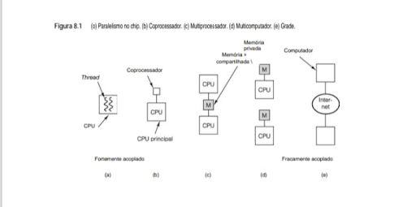

    +-----------------------------------------------------------------+
    |                  Arquiteturas                                   |
    +-----------------------------------------------------------------+
    |  Tipo           | Nível de Acoplamento  | Descrição Técnica     |
    +-----------------+-----------------------+-----------------------+
    | (a)             | Fortemente Acoplado   | Múltiplas threads     |
    | Paralelismo     |                       | de execução           |
    | no Chip         |                       | compartilhando        |
    |                 |                       | recursos internos     |
    +-----------------+-----------------------+-----------------------+
    | (b)             | Fortemente Acoplado   | CPU principal         |
    | Coprocessador   |                       | delegando tarefas     |
    |                 |                       | específicas           |
    +-----------------+-----------------------+-----------------------+
    | (c)             | Fortemente Acoplado   | Duas ou mais CPUs     |
    | Multiprocessador|                       | compartilhando M      |
    |                 |                       | através de barramento | 
    +-----------------+-----------------------+-----------------------+
    | (d)             | Fracamente Acoplado   | Cada CPU com M        |
    | Multicomputador |                       | privada e troca de    |
    |                 |                       | mensagens             |
    +-----------------+-----------------------+-----------------------+
    | (e)             | Fracamente Acoplado   | Computadores          |
    | Grade (Grid)    |                       | independentes         |
    |                 |                       | conectados via        |
    |                 |                       | Internet              |
    +-----------------+-----------------------+-----------------------+

## 8.1 Paralelismo no chip
Um modo de aumentar a produtividade de um chip é conseguir que ele faça mais coisas ao mesmo tempo. Em outras palavras, explorar o paralelismo. Nesta seção, vamos estudar alguns modos de conseguir aumentar a velocidade por meio do paralelismo no nível do chip, incluídos paralelismo no nível da instrução, multithreading e a colocação de mais de uma CPU no chip. Essas técnicas são bem diferentes, mas cada uma delas ajuda à sua própria maneira. Mas, em todos os casos, a ideia é conseguir que mais atividades aconteçam ao mesmo tempo.

## 8.1.1 Paralelismo no nível da instrução

Um modo de conseguir paralelismo no nível mais baixo é emitir múltiplas instruções por ciclo de clock. Há duas variedades de CPUs de emissão múltipla: processadores superescalares e processadores VLIW. Na verdade, já comentamos alguma coisa sobre essas duas no livro, mas talvez seja útil revisar aqui esse material.

Vimos CPUs superescalares antes (por exemplo, na Figura 2.5). Na configuração mais comum, em certo ponto do pipeline há uma instrução pronta para ser executada. CPUs superescalares são capazes de emitir múltiplas instruções para as unidades de execução em um único ciclo de clock. O número real de instruções emitidas
depende do projeto do processador, bem como das circunstâncias correntes. O hardware determina o número máximo que pode ser emitido, em geral duas a seis instruções. Contudo, se uma instrução precisar de uma unidade funcional que não está disponível ou de um resultado que ainda não foi calculado, ela não será emitida.

A outra forma de paralelismo no nível da instrução é encontrada em processadores VLIW (Very Long Instruction Word – palavra de instrução muito longa). Na forma original, máquinas VLIW de fato tinham palavras longas que continham instruções que usavam múltiplas unidades funcionais. Considere, por exemplo, o pipeline da Figura 8.2(a), no qual a máquina tem cinco unidades funcionais e pode efetuar, simultaneamente, duas operações com inteiros, uma operação de ponto flutuante, um carregamento e um armazenamento. Uma instrução VLIW para essa máquina conteria cinco opcodes e cinco pares de operandos, um opcode e um par de operandos por unidade funcional. Com 6 bits por opcode, 5 bits por registrador e 32 bits por endereço de memória, as instruções poderiam facilmente ter 134 bits – bem compridas, de fato.

Contudo, esse projeto revelou ser muito rígido porque nem toda instrução podia utilizar todas as unidades funcionais, o que resultava em muitas NO-OP inúteis usadas como filtro, como ilustrado na Figura 8.2(b). Por conseguinte, modernas máquinas VLIW têm um modo de marcar um grupo de instruções que formam um conjunto com um bit de “final de grupo”, conforme mostra a Figura 8.2(c). Então, o processador pode buscar o grupo inteiro e emiti-lo de uma vez só. Cabe ao compilador preparar grupos de instruções compatíveis.

Na verdade, VLIW transfere do tempo de execução para o tempo de compilação o trabalho de determinar quais instruções podem ser emitidas em conjunto. Essa opção não apenas simplifica o hardware e o torna mais rápido, mas também, visto que um compilador otimizador pode funcionar durante um longo tempo se for preciso,
permite que se montem pacotes melhores do que o hardware poderia montar durante o tempo de execução. É claro que tal mudança radical na arquitetura da CPU será difícil de introduzir, como demonstra a lenta aceitação do Itanium, exceto para aplicações de nicho.

Vale a pena observar que o paralelismo no nível da instrução não é a única forma de paralelismo de baixo nível. Outra forma é o paralelismo no nível da memória, no qual há múltiplas operações de memória no ar ao mesmo tempo (Chou et al., 2004).

**•A CPU VLIW TriMedia**
Estudamos um exemplo de uma CPU VLIW, a Itanium-2, no Capítulo 5. Agora, vamos examinar um processador VLIW muito diferente, o TriMedia, projetado pela Philips, a empresa holandesa de equipamentos eletrônicos que também inventou o CD de áudio e o CD-ROM. A utilização pretendida do TriMedia é como um processador embutido em aplicações que fazem uso intensivo de imagem, áudio e vídeo, como reprodutores de CD, DVD e players MP3, gravadores de CD e DVD, televisores interativos, câmeras digitais, filmadoras e assim por diante. Dadas essas áreas de aplicação, não é surpresa que ele seja consideravelmente diferente da Itanium-2, que é uma CPU de uso geral, voltada para servidores de alta tecnologia.

**• Figura 8.2   (a) Pipeline de CPU. (b) Sequência de instruções VLIW. (c) Fluxo de instruções com pacotes marcados.**

A Figura 8.2 é fundamental para o seu eBook, pois ela descreve como os processadores modernos otimizam a execução de tarefas através de paralelismo em nível de instrução. No seu Lenovo IdeaPad, o processador utiliza técnicas similares para garantir que o seu sistema Ubuntu rode de forma fluida mesmo com múltiplas aplicações abertas.

    +-------------------------------------------------------------+
    |              FLUXO DE EXECUÇÃO DA CPU (PIPELINE)            |
    |=============================================================|
    |                                                             |
    |   (a) ESTÁGIOS DO PIPELINE:                                 |
    |   [ BUSCA ] -> [ DECODIFICAÇÃO ] -> [ EMISSÃO ]             |
    |                                         ||                  |
    |          +------------------------------VV--------------+   |
    |          | UNIDADES DE EXECUÇÃO: INTEIRO, PONTO FLUT.,  |   |
    |          | CARGA E ARMAZENAMENTO                        |   |
    |          +------------------------------||--------------+   |
    |                                         VV                  |
    |                                    [ RETIRADA ]             |
    |                                                             |
    |   (b) VLIW: [ OP1 | OP2 | OP3 | OP4 ] (Uma instrução longa) |
    |                                                             |
    |   (c) GRUPOS: [ IL NFS ] / [ IFLS ] / [ IFL ] (Marcadores)  |
    +-------------------------------------------------------------+

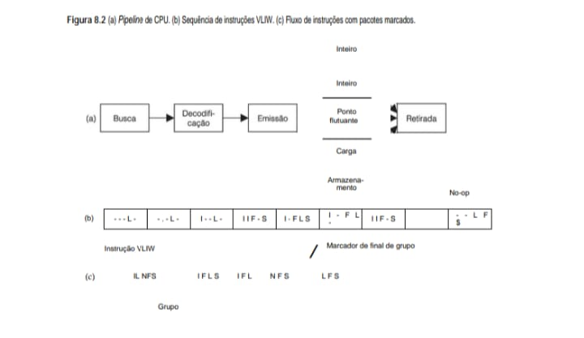

    +-------------------------------------------------+
    |                  Conceitos de Processamento     |
    +-------------------------------------------------+
    |  Conceito  | Descrição Técnica                  |
    +------------+------------------------------------+
    | (a)        | A CPU divide a execução de uma     |
    | Pipeline   | instrução em etapas sequenciais:   |
    | de CPU     | Busca, Decodificação, Emissão,     |
    |            | Execução e Retirada.               |
    +------------+------------------------------------+
    | (b)        | Very Long Instruction Word. O      |
    | Sequência  | compilador agrupa operações        |
    | VLIW       | independentes em uma instrução     |
    |            | longa para execução paralela.      |
    +------------+------------------------------------+
    | (c)        | Representa o fluxo de instruções   |
    | Fluxo com  | agrupadas. O processador utiliza   |
    | Pacotes    | Marcadores de final de grupo para  |
    |            | identificar instruções a serem     |
    |            | executadas juntas.                 |
    +------------+------------------------------------+

**• Decodificação dos Símbolos (Legenda Técnica)**
Cada letra no diagrama indica uma unidade funcional específica que será ativada naquele ciclo de clock:

 - I (Inteiro): Operações aritméticas básicas (adição, subtração) ou lógica de bits.

 - L (Carga - Load): Instrução para buscar um dado da memória (RAM/Cache) para o registrador.

 - S (Armazenamento - Store): Instrução para gravar um dado do registrador na memória.

 - F (Ponto Flutuante - Float): Operações matemáticas complexas com casas decimais.

 - Traço (—): Representa um Slot Vazio ou uma operação No-op (sem operação). Indica que, naquele ciclo, aquela unidade funcional específica não tem trabalho a fazer.

    +-----------------------------------------------------------------+
    |                  Unidades de Execução                           |
    +-----------------------------------------------------------------+
    |  Símbolo  | Unidade de Execução | Importância no seu Projeto    |
    +-----------+---------------------+-------------------------------+
    | I         | Unidade Inteira     | Essencial para manipulação    |
    |           |                     | de ponteiros em C e índices   |
    |           |                     | de arrays.                    |
    +-----------+---------------------+-------------------------------+
    | L/S       | Memória (Load/Store)| Crítico para o desempenho do  |
    |           |                     | backup de projetos e acesso   |
    |           |                     | a arquivos .md.               |
    +-----------+---------------------+-------------------------------+
    | /         | Marcador de Grupo   | Define o limite do paralelismo|
    |           |                     | que o seu Ubuntu pode extrair |
    |           |                     | do código.                    |
    +-----------+---------------------+-------------------------------+

O TriMedia é um verdadeiro processador VLIW, no qual todas as instruções contêm até cinco operações. Em
condições completamente ideais, a cada ciclo de clock é iniciada uma instrução e são emitidas cinco operações. O
clock funciona a 266 MHz ou 300 MHz; porém, como ele pode emitir cinco operações por ciclo, a velocidade efe-
tiva de clock é cinco vezes mais alta. Na discussão a seguir, focalizaremos a implementação TM3260 do TriMedia;
as diferenças em relação a outras versões são muito pequenas.

Uma instrução típica é ilustrada na Figura 8.3. As instruções variam de instruções padrões de inteiros de 8, 16
e 32 bits, passando por aquelas de ponto flutuante IEEE 754, até as de multimídia paralela. Como consequência das
cinco emissões por ciclo e das instruções de multimídia paralela, o TriMedia é rápido o suficiente para decodificar
vídeo digital de uma filmadora em tempo real em tamanho total e taxa de quadros total em software.

O TriMedia tem uma memória baseada em bytes, e os registradores de E/S são mapeados para o espaço de memó-
ria. Meias-palavras (16 bits) e palavras completas (32 bits) devem ser alinhadas em suas fronteiras naturais. Ela pode
funcionar como little-endian ou big-endian, dependendo de um bit PSW que o sistema operacional pode ajustar. Esse
bit afeta somente o modo com que as operações de carga e as de armazenamento transferem dados entre memória
e registradores. A CPU contém uma cache dividida de 8 vias de conjuntos associativos com tamanho de linha de 64
bytes para a cache de instruções, bem como para a de dados. A cache de instruções é de 64 KB; a de dados é de 16 KB.

**• Figura 8.3   Instrução TriMedia típica, mostrando cinco operações possíveis.**
    +---------------------------------------------------------------------------+
    |                   INSTRUÇÃO VLIW TÍPICA (TRIMEDIA)                        |
    |===========================================================================|
    |                                                                           |
    |  [ Posição 1 ]  [ Posição 2 ]  [ Posição 3 ]  [ Posição 4 ]  [ Posição 5 ]|
    |  +----------+   +----------+   +-----------+  +----------+  +----------+  |
    |  |  ADIÇÃO  |   | DESLOCA- |   | MULTIMÍDIA|  |   LOAD   |  |   STORE  |  |
    |  |   (Add)  |   |  MENTO   |   |   (DSP)   |  | (Carga)  |  |(Armazena)|  |
    |  +----------+   +----------+   +-----------+  +----------+  +----------+  |
    |                                                                           |
    |  <-------------------------- 1 ÚNICA INSTRUÇÃO ------------------------>  |
    +---------------------------------------------------------------------------+

**• Detalhando as Operações (Explicação para o eBook)**
No contexto de sistemas como o seu Ubuntu rodando no Lenovo IdeaPad, cada posição da instrução TriMedia utiliza uma unidade de execução distinta:

 - Posição 1 (Adição): Executa operações aritméticas inteiras (ex: i++ em um loop C).

 - Posição 2 (Deslocamento/Shift): Move bits para a esquerda ou direita. É vital para criptografia e manipulação de protocolos de rede no seu IDS Sentinel.

 - Posição 3 (Multimídia): Instruções especializadas (SIMD) que processam vários dados de imagem ou som de uma vez.

 - Posição 4 (Load): Busca um dado da memória RAM/Cache e traz para os registradores da CPU.

 - Posição 5 (Store): Pega o resultado processado e o grava de volta na memória.

**• Resumo Técnico para Documentação**

Característica                 Detalhe

Tipo de Arquitetura            VLIW (Very Long Instruction Word)

Paralelismo	                   Explícito (o compilador deve garantir que as 5 operações sejam independentes)

Vantagem	                   Alta performance com baixo consumo de energia, pois a CPU não precisa "adivinhar" o que pode ser feito em paralelo.

Há 128 registradores de uso geral de 32 bits. O registrador R0 é travado com valor 0. O registrador R1 é travado
em 1. Tentar mudar qualquer um deles provoca um ataque cardíaco na CPU. Os 126 registradores restantes são
todos equivalentes em termos funcionais e podem ser utilizados para qualquer finalidade. Além disso, há também
quatro registradores de uso especial de 32 bits: o contador de programa, a palavra de estado de programa e dois
registradores relacionados a interrupções. Por fim, um registrador de 64 bits conta o número de ciclos de CPU
desde sua última reinicialização. A 300 MHz, o contador leva cerca de dois mil anos para dar uma volta completa e
reiniciar o ciclo de contagem.

O Trimedia TM3260 tem 11 unidades funcionais diferentes para efetuar operações aritméticas, lógicas e de
controle de fluxo (bem como uma para controle de cache que não discutiremos aqui). Elas estão relacionadas na
Figura 8.4. As duas primeiras colunas dão o nome da unidade e uma breve descrição do que ela faz. A terceira
informa quantas cópias da unidade existem em hardware. A quarta dá a latência, isto é, quantos ciclos de clock
ela leva para concluir. Nesse contexto, vale a pena observar que todas as unidades funcionais, exceto a unidade
de ponto flutuante de raiz quadrada/divisão, têm paralelismo. A latência dada na tabela informa quanto tempo
falta para o resultado de uma operação estar disponível, mas uma nova operação pode ser iniciada a cada ciclo.
Assim, por exemplo, cada uma das três instruções consecutivas pode conter duas operações de carregamento, o
que resulta em seis carregamentos em vários estágios de execução ao mesmo tempo.

Por fim, as últimas cinco colunas mostram quais posições de instrução podem ser utilizadas por qual uni-
dade funcional. Por exemplo, operações de comparação de ponto flutuante devem aparecer somente na terceira
posição de uma instrução.

**• Figura 8.4   Unidades funcionais da TM3260, sua quantidade, latência e as posições de instrução que usam.**

    +-------------------------------------------------------------------------------+
    |              UNIDADES FUNCIONAIS DA TM3260 (TABELA CORRIGIDA)                 |
    |===============================================================================|
    |                                                                               |
    |  Unidade        | Descrição                        | Qtd | Lat |  1 2 3 4 5   |
    |-----------------|----------------------------------|-----|-----|--------------|
    |  Constante      | Operações imediatas              |  5  |  1  |  x x x x x   |
    |  ULA de inteiros| Operações aritmét., bool, 32 bit |  5  |  1  |  x x x x x   |
    |  Deslocador     | Deslocamentos multibits          |  2  |  1  |  x x x x x   |
    |  Load/Store     | Operações de memória             |  2  |  3  |        x x   |
    |  Int/FP MUL     | Multiplic. int e PF 32 bits      |  2  |  3  |    x x       |
    |  ULA de PF      | Aritmética de PF                 |  2  |  3  |  x     x     |
    |  Comparação PF  | Compara Ponto Flutuante          |  1  |  1  |      x       |
    |  Raiz/div de PF | Divisão e raiz quadrada PF       |  1  | 17  |    x         |
    |  Desvio         | Controle de fluxo (Jumps)        |  3  |  3  |    x x x     |
    |  ULA DSP        | Aritmét. multimídia (8/16 bits)  |  2  |  3  |  x   x   x   |
    |  MUL DSP        | Multiplic. multimídia (8/16 bits)|  2  |  3  |    x x       |
    |                                                                               |
    |  (Legenda: x = Unidade disponível nesta posição | Espaço vazio = Indisponível)|
    +-------------------------------------------------------------------------------+

**• Insights para sua Documentação de Hardware:**

 - Slots Dedicados: Note que a unidade de Raiz/div de PF só pode ser acionada na posição 2. O compilador do seu processador precisa garantir que qualquer divisão em C caia exatamente naquele slot, ou o código falhará.

 - Latência: A latência de 17 ciclos para a divisão significa que, se você iniciar essa operação no ciclo 0, o resultado só estará disponível no ciclo 18 (17 ciclos de espera).

 - Gargalo de Memória: Como só existem 2 unidades de Load/Store e elas operam nas posições 4 e 5, o seu sistema só consegue ler ou gravar 2 dados da memória RAM por ciclo.

A unidade de constante é usada para operações imediatas, como carregar em um registrador um número
armazenado na própria operação. A ULA de inteiros efetua adição, subtração, as operações booleanas normais e
operações de empacotamento/desempacotamento. O deslocador (shifter) pode mover um registrador em qualquer
direção por um número especificado de bits.

A unidade de Load/Store (carregamento/armazenamento) traz palavras da memória para dentro de regis-
tradores e as escreve de volta na memória. O TriMedia é, na essência, uma CPU RISC aumentada, portanto,
operações normais são efetuadas em registradores e a unidade de Load/Store é usada para acessar a memória.
Transferências podem ser de 8, 16 ou 32 bits. Instruções aritméticas e lógicas não acessam a memória.

A unidade de multiplicação efetua multiplicações de inteiros e de ponto flutuante. As três unidades
seguintes efetuam, na ordem, adições/subtrações, comparações, e raiz quadrada e divisões de ponto flutuante.

Operações de desvio são executadas pela unidade de desvio. Há um atraso fixo de 3 ciclos após um des-
vio, portanto, as três instruções (até 15 operações) que vêm após um desvio são sempre executadas, mesmo
para desvios incondicionais.

Por fim, chegamos às duas unidades de multimídia, que executam as operações especiais de multimídia. O
DSP no nome da unidade funcional refere-se a Digital Signal Processor (processador de sinal digital) que, na
verdade, as operações de multimídia substituem. Mais adiante, faremos uma breve descrição das operações de
multimídia. Um aspecto digno de nota é que todas elas utilizam aritmética saturada em vez de aritmética de com-
plemento de dois usada pelas operações com inteiros. Quando uma operação produz um resultado que não pode
ser expresso por causa de excesso, em vez de gerar uma exceção ou dar resultado lixo, é usado o número válido
mais próximo. Por exemplo, com números de 8 bits sem sinal, somar 130 com 130 dá 255.

Como nem toda operação pode aparecer em toda posição, muitas vezes acontece de uma instrução
não conter todas as cinco operações potenciais. Quando uma posição não é usada, ela é compactada para
minimizar a quantidade de espaço desperdiçada. Operações que estão presentes ocupam 26, 34 ou 42 bits.
Dependendo do número de operações que de fato estão presentes, as instruções TriMedia variam entre 2 e
28 bytes, incluindo algum cabeçalho fixo.

O TriMedia não verifica durante a execução se as operações um uma instrução são compatíveis. Se não
forem, ele as executa mesmo assim e obtém a resposta errada. Deixar a verificação de fora foi uma decisão
deliberada para poupar tempo e transistores. O Core i7 faz verificação em tempo de execução para ter certeza
de que todas as operações superescalares são compatíveis, mas a um custo imenso em termos de complexidade,
tempo e transistores. O TriMedia evita esse custo passando a carga do escalonamento para o compilador, que
tem todo o tempo do mundo para otimizar com cuidado o posicionamento de operações em palavras de instru-
ção. Por outro lado, se uma operação precisar de uma unidade funcional que não está disponível, a instrução
protelará até que ela fique disponível.

Como na Itanium-2, as operações do TriMedia são predicadas. Cada operação (com duas pequenas exce-
ções) especifica um registrador que é testado antes de ser executada. Se o bit de ordem baixa do registrador
estiver marcado (valor 1), a operação é executada; caso contrário, ela é saltada. Cada uma das (até) cinco
operações é predicada individualmente. Um exemplo de uma operação predicada é
    
    **IF R2 IADD R4, R5 –> R8**

que testa R2 e, se o bit de ordem baixa for 1, soma R4 com R5 e armazena o resultado em R8. Uma operação
pode ser transformada em incondicional usando R1 (que é sempre 1) como o registrador de predicado. Usar
R0 (que é sempre 0) a transforma em uma no-op.

As operações multimídia do TriMedia podem ser agrupadas nos 15 grupos relacionados na Figura 8.5.
Muitas das operações envolvem clipping (corte), que especifica um operando e uma faixa e obriga o operan-
do a entrar na faixa usando os valores mais baixo ou mais alto para operandos que caem fora da faixa. O
clipping pode ser feito em operandos de 8, 16 ou 32 bits. Por exemplo, quando o clipping é realizado dentro
de uma faixa de 0 a 255 sobre 40 e 340, os resultados cortados são 40 e 255, respectivamente. O grupo clip
efetua operações de corte.

Os quatro grupos seguintes da Figura 8.5 efetuam a operação indicada com operandos de vários tama-
nhos, cortando os resultados para ajustá-los a uma faixa específica. O grupo mínimo, máximo examina dois
registradores e acha o maior e o menor valor para cada byte. De modo semelhante, o grupo comparação
considera dois registradores como quatro pares de bytes e compara cada par.

É raro que operações de multimídia sejam efetuadas com inteiros de 32 bits porque a maioria das
imagens é composta de pixels RGB com valores de 8 bits para cada uma das cores vermelha, verde e azul.
Quando uma imagem está sendo processada – por exemplo, comprimida –, ela é em geral representada por
três componentes, um para cada cor (espaço RGB) ou por uma forma equivalente em termos lógicos (espaço
YUV, que será discutido mais adiante neste capítulo). De qualquer modo, muito processamento é executado
em arranjos retangulares que contêm inteiros de 8 bits sem sinal.

**• Figura 8.5   Principais grupos de operações que vêm com o TriMedia.**

+---------------------------------------------------------------------------------------------------------+
|                  Grupos de Operações TriMedia                                                           |
+---------------------------------------------------------------------------------------------------------+
| Grupo                      | Descrição                                                                  |
+----------------------------+----------------------------------------------------------------------------+
| Clip                       | Corta 4 bytes ou 2 meias-palavras                                          |
+----------------------------+----------------------------------------------------------------------------+
| Valor absoluto             | Valor cortado, com sinal, absoluto DSP                                     |                                                     
+----------------------------+----------------------------------------------------------------------------+
| Adição DSP                 | Adição cortada, com sinal                                                  |
+----------------------------+----------------------------------------------------------------------------+
| Subtração DSP              | Subtração cortada, com sinal                                               |
+----------------------------+----------------------------------------------------------------------------+
| Multiplicação              | Multiplicação cortada, com sinal DSP                                       |                             
+----------------------------+----------------------------------------------------------------------------+
| Mínimo, máximo             | Obtém mínimo ou máximo de pares de quatro bytes                            |               
+----------------------------+----------------------------------------------------------------------------+
| Comparação                 | Compara dois registradores byte por byte                                   |
+----------------------------+----------------------------------------------------------------------------+
| Deslocamento               | Desloca um par de operandos de 16 bits                                     |
+----------------------------+----------------------------------------------------------------------------+
| Soma de produtos           | Soma, com sinal, produtos de 8 ou 16 bits                                  |
+----------------------------+----------------------------------------------------------------------------+
| Merge, pack, swap          | Manipulação de bytes e meias-palavras                                      |      
+----------------------------+----------------------------------------------------------------------------+
| Médias quadráticas de byte | Média quádrupla, sem sinal, byte por byte                                  |
+----------------------------+----------------------------------------------------------------------------+
| Médias de byte             | Média de quatro elementos, sem sinal, byte por byte                        |
+----------------------------+----------------------------------------------------------------------------+
| Multiplicações de byte     | Multiplicação, sem sinal, de 8 bits                                        |
+----------------------------+----------------------------------------------------------------------------+
| Estimativa de movimento    | Soma, sem sinal, de valores absolutos de diferenças de 8 bits com sinal    |
+----------------------------+----------------------------------------------------------------------------+
| Diversos                   | Outras operações aritméticas                                               |
+----------------------------+----------------------------------------------------------------------------+

O TriMedia tem um grande número de operações projetadas especificamente para o processamento eficiente
de matrizes de inteiros de 8 bits sem sinal. Como um exemplo simples, considere o canto superior esquerdo de
uma matriz de valores de 8 bits armazenados em memória (big-endian), como ilustra a Figura 8.6(a). O bloco 4 × 4
mostrado nesse canto contém 16 valores de 8 bits rotulados de A até P. Suponha, por exemplo, que a imagem precisa
ser transposta, para produzir a Figura 8.6(b). Como essa tarefa deve ser realizada?

**• Figura 8.6 - (a) Matriz de elementos de 8 bits. (b) Matriz transposta. (c) Matriz original buscada em quatro registradores. (d) Matriz transposta em quatro registradores.

    +-----------------------------------------------------------------------------+
    |              TRANSPOSIÇÃO DE MATRIZ (REGISTRADORES DE 32 BITS)              |
    |=============================================================================|
    |                                                                             |
    | (a) Matriz Original (8-bit elem)      (b) Matriz Transposta                 |
    |      A  B  C  D                            A  E  I  M                       |
    |      E  F  G  H                            B  F  J  N                       |
    |      I  J  K  L                            C  G  K  O                       |
    |      M  N  O  P                            D  H  L  P                       |
    |                                                                             |
    |-----------------------------------------------------------------------------|
    |                                                                             |
    | (c) Carregamento nos Registradores    (d) Resultado nos Registradores       |
    |                                                                             |
    | R2: [ A ][ B ][ C ][ D ]              R2: [ A ][ E ][ I ][ M ]              |
    | R3: [ E ][ F ][ G ][ H ]    ====>     R3: [ B ][ F ][ J ][ N ]              |
    | R4: [ I ][ J ][ K ][ L ]              R4: [ C ][ G ][ K ][ O ]              |
    | R5: [ M ][ N ][ O ][ P ]              R5: [ D ][ H ][ L ][ P ]              |
    |                                                                             |
    +-----------------------------------------------------------------------------+

**• Detalhamento Técnico para o eBook**
Esta operação demonstra o poder das unidades de processamento que você está documentando:

 - Estrutura de Dados: Cada registrador de 32 bits comporta quatro elementos de 8 bits (1 byte cada), permitindo que uma única instrução atue sobre quatro dados simultaneamente.

 - A Operação (Transposição):

    - No estado (c), cada registrador armazena uma linha da matriz.

    - No estado (d), após a operação de transposição (geralmente usando instruções de "shuffle" ou "unpack"), cada registrador passa a armazenar uma coluna da matriz original.

Um modo de fazer a transposição é usar 12 operações, cada qual carregando um byte em um registrador
diferente, seguidas de mais 12 operações, cada qual armazenando um byte em sua localização correta. (Nota: os
quatro bytes na diagonal não são movidos na transposição.) O problema dessa abordagem é que ela requer 24
operações (longas e lentas) que referenciam a memória.

Uma abordagem alternativa é começar com quatro operações, cada qual carregando uma palavra dentro de
quatro registradores diferentes, R2 a R5, como mostra a Figura 8.6(c). Então, as quatro palavras produzidas são
montadas por operações de mascaramento e deslocamento para conseguir a saída desejada, conforme mostra a
Figura 8.6(d). Por fim, essas palavras são armazenadas na memória. Embora esse modo de fazer a transposição
reduza o número de referências à memória de 24 para 8, o mascaramento e o deslocamento são caros por causa
das muitas operações requeridas para extrair e inserir cada byte na posição correta.

O TriMedia proporciona uma solução melhor do que essas duas. Ela começa trazendo as quatro palavras para
registradores. Todavia, em vez de construir a saída usando mascaramento e deslocamento, são utilizadas opera-
ções especiais que extraem e inserem bytes em registradores para construir a saída. O resultado é que, com oito
referências à memória e oito dessas operações especiais de multimídia, pode-se realizar a transposição. Primeiro,
o código contém uma operação com duas operações de carregamento nas posições 4 e 5, para carregar palavras
em R2 e R3, seguida por outra operação como essa para carregar R4 e R5.

As instruções que contêm essas operações podem usar as posições 1, 2 e 3 para outras finalidades. Quando
todas as palavras forem carregadas, as oito operações especiais de multimídia podem ser empacotadas em duas
instruções para construir a saída, seguidas por duas operações para armazená-las. No total, são necessárias apenas
seis instruções, e 14 das 30 posições nessas instruções ficam disponíveis para outras operações. Na verdade, todo
o trabalho pode ser realizado com o equivalente efetivo a cerca de três instruções. Outras operações de multimí-
dia são igualmente eficientes. Entre essas operações poderosas e as cinco posições de emissão por instrução, o
TriMedia é muito eficiente para efetuar os tipos de cálculos necessários em processamento de multimídia.

## 8.1.2 Multithreading no chip
Todas as CPUs modernas, com paralelismo (pipeline), têm um problema inerente: quando uma referência à
memória encontra uma ausência das caches de nível 1 e nível 2, há uma longa espera até que a palavra requisitada
(e sua linha de cache associada) sejam carregadas na cache, portanto, o pipeline para. Uma abordagem para lidar
com essa situação, denominada multithreading no chip, permite que a CPU gerencie múltiplos threads de controle
ao mesmo tempo em uma tentativa de mascarar essas protelações. Em suma, se o thread 1 estiver bloqueado, a
CPU ainda tem uma chance de executar o thread 2, de modo a manter o hardware totalmente ocupado.

Embora a ideia básica seja bastante simples, existem múltiplas variantes, que examinaremos agora. A primeira
abordagem, multithreading de granulação fina, é ilustrada na Figura 8.7 para uma CPU que tem a capacidade de
emitir uma instrução por ciclo de clock. Na Figura 8.7(a)–(c), vemos três threads, A, B e C, para 12 ciclos de máquina.
Durante o primeiro ciclo, o thread A executa a instrução A1. Essa instrução conclui em um ciclo, portanto, no segun-
do, a instrução A2 é iniciada. Infelizmente, essa instrução encontra uma ausência de cache de nível 1, portanto, dois
ciclos são desperdiçados enquanto a palavra necessária é buscada na cache de nível 2. O thread continua no ciclo 5.
De modo semelhante, os threads B e C também protelam por vezes, como ilustrado na figura. Nesse modelo, se uma
instrução protelar, as subsequentes não podem ser emitidas. É claro que, mesmo com uma tabela de escalonamento
mais sofisticada, às vezes podem ser emitidas novas instruções, mas, nesta discussão, vamos ignorar tal possibilidade.

**• Figura 8.7 - (a)–(c) Três threads. Os retângulos vazios indicam que o thread parou esperando por memória. (d) Multithreading de granula-
ção fina. (e) Multithreading de granulação grossa.**

    THREADS INDIVIDUAIS:
    (a) A: [A1][A2][  ][  ][A3][A4][A5][  ][  ][A6][A7][A8]
    (b) B: [B1][  ][  ][  ][B2][  ][  ][B3][B4][B5][B6][B7]
    (c) C: [C1][C2][C3][C4][  ][  ][  ][  ][C5][C6][  ][  ]

    ESTRATÉGIAS DE EXECUÇÃO:
    (d) GRANULAÇÃO FINA (Alternância por ciclo):
        [A1][B1][C1][A2][  ][C2][  ][  ][C3][A3][B2][C4]...

    (e) GRANULAÇÃO GROSSA (Troca na espera longa):
        [A1][A2][ B1 ][C1][C2][C3][C4][A3][A4][A5][B2]...

O multithreading de granulação fina mascara as protelações executando os threads segundo uma política de
alternância circular, com um thread diferente em ciclos consecutivos, como ilustrado na Figura 8.7(d). Quando
chega o quarto ciclo, a operação de memória iniciada em A1 foi concluída, portanto, a instrução A2 pode ser
executada, ainda que necessite do resultado de A1. Nesse caso, a protelação máxima é dois ciclos, portanto, com
três threads, a operação protelada sempre é concluída a tempo. Se uma protelação de memória demorasse quatro
ciclos, precisaríamos de quatro threads para garantir a operação contínua e assim por diante.

Uma vez que threads diferentes nada têm a ver um com o outro, cada um precisa de seu próprio conjunto
de registradores. Quando uma instrução é emitida, é preciso incluir, com ela, um ponteiro para seu conjunto, de
modo que, se um registrador for referenciado, o hardware saberá qual conjunto de registradores usar. Por conse-
guinte, o número máximo de threads que podem ser executados de uma vez só é fixado na ocasião em que o chip
é projetado.

Operações de memória não são a única razão para protelação. Às vezes, uma instrução precisa de um resul-
tado calculado por uma instrução anterior que ainda não foi concluída. Às vezes, uma instrução não pode iniciar
porque ela vem após um desvio condicional cuja direção ainda não é conhecida. Em geral, se o pipeline tiver k
estágios, mas houver no mínimo k threads para fazer alternância circular, nunca haverá mais de uma instrução
por thread no pipeline a qualquer momento, portanto, não pode ocorrer nenhum conflito. Nessa situação, a CPU
pode executar na velocidade total, sem nunca ficar ociosa.

É claro que pode não haver tantos threads disponíveis quantos são os estágios do pipeline, portanto, alguns
projetistas preferem uma abordagem diferente, conhecida como multithreading de granulação grossa, ilustrada
na Figura 8.7(e). Nesse caso, o thread A inicia e continua a emitir instruções até protelar, desperdiçando um ciclo.
Nesse ponto, ocorre uma troca e B1 é executado. Visto que a primeira instrução do thread B protela, acontece
outra troca de thread e C1 é executado no ciclo 6. Como se perde um ciclo sempre que uma instrução protela,
o multithreading de granulação grossa é potencialmente menos eficiente do que o de granulação fina, mas tem a
grande vantagem de precisar de um número muito menor de threads para manter a CPU ocupada. Em situações
em que há um número insuficiente de threads ativos, para garantir que será encontrado um que pode ser execu-
tado, o multithreading de granulação grossa funciona melhor.

Embora tenhamos demonstrado que o multithreading de granulação grossa troca threads quando há uma
protelação, essa não é a única opção. Outra possibilidade é trocar de imediato em qualquer instrução que poderia
acarretar uma protelação, tal como uma instrução de carregamento, armazenamento ou desvio, antes mesmo de
descobrir se ela de fato causa isso. Essa última estratégia permite que uma troca ocorra mais cedo (tão logo a
instrução seja decodificada) e pode possibilitar evitar ciclos mortos. Na verdade, ela está dizendo: “Execute até
achar que poderia haver um problema, então troque, só por precaução”. Isso faz o multithreading de granulação
grossa ficar mais parecido com o de granulação fina, com suas trocas frequentes.

Seja qual for o tipo de multithreading usado, é preciso ter algum meio de monitorar qual operação pertence
a qual thread. Com o multithreading de granulação fina, a única possibilidade séria é anexar um identificador
de thread a cada operação, para que sua identidade fique clara ao percorrer o pipeline. Com o multithreading de
granulação grossa, existe outra maneira: ao trocar threads, limpe o pipeline e só então inicie o próximo thread.
Desse modo, somente um thread por vez está no pipeline e sua identidade nunca é duvidosa. É claro que deixar o
pipeline funcionar no vazio durante uma troca de thread só faz sentido se as trocas ocorrerem em intervalos muito
mais longos do que o tempo gasto para esvaziar o pipeline.

Até aqui, consideramos que a CPU só pode emitir uma única instrução por ciclo. Todavia, como já vimos,
CPUs modernas podem emitir múltiplas instruções por ciclo. Na Figura 8.8, consideramos que a CPU pode emitir
duas instruções por ciclo de clock, mas mantivemos a regra que diz que, quando uma instrução protela, as sub-
sequentes não podem ser emitidas. Na Figura 8.8(a), vemos como funciona o multithreading de granulação fina
com uma CPU superescalar de emissão dual. Para o thread A, as duas primeiras instruções podem ser emitidas
no primeiro ciclo, mas para o thread B encontramos logo um problema no próximo ciclo, portanto, somente uma
instrução pode ser emitida, e assim por diante.

**• Figura 8.8 - Multithreading com uma CPU superescalar de emissão dual. (a) Multithreading de granulação fina. (b) Multithreading de gra-
nulação grossa. (c) Multithreading simultâneo.**

    +-----------------------------------------------------------------------+
    |           COMPARAÇÃO DE MULTITHREADING (EMISSÃO DUAL)                 |
    |=======================================================================|
    |                                                                       |
    | (a) GRANULAÇÃO FINA:                                                  |
    |     Ciclo 1: [ A1 ][ A2 ]  <- Alterna a thread a cada ciclo           |
    |     Ciclo 2: [ B1 ][    ]                                             |
    |     Ciclo 3: [ C1 ][ C2 ]                                             |
    |                                                                       |
    | (b) GRANULAÇÃO GROSSA:                                                |
    |     Ciclo 1: [ A1 ][ A2 ]  <- Executa a mesma thread até encontrar    |
    |     Ciclo 2: [ B1 ][    ]     uma espera de memória longa.            |
    |     Ciclo 3: [ C1 ][ C2 ]                                             |
    |                                                                       |
    | (c) MULTITHREADING SIMULTÂNEO (SMT):                                  |
    |     Ciclo 1: [ A1 ][ A2 ]  <- Instruções de threads DIFERENTES podem  |
    |     Ciclo 2: [ B1 ][ C1 ]     ocupar o mesmo ciclo de clock.          |
    |     Ciclo 3: [ C2 ][ C3 ]                                             |
    |                                                                       |
    +-----------------------------------------------------------------------+

    +-----------------------------------------------------------------------+
    |          ESCALONAMENTO SUPERESCALAR DE DUAS VIAS (EMISSÃO DUAL)       |
    |=======================================================================|
    |                                                                       |
    | (a) GRANULAÇÃO FINA (Fine-grained)                                    |
    |     Ciclo:   1      2      3      4      5      6                     |
    |     Slot 1: [A1]   [B1]   [C1]   [A3]   [B2]   [C3]                   |
    |     Slot 2: [A2]   [  ]   [C2]   [A4]   [  ]   [C4]                   |
    |             (Alterna a thread a cada ciclo de clock)                  |
    |                                                                       |
    |-----------------------------------------------------------------------|
    |                                                                       |
    | (b) GRANULAÇÃO GROSSA (Coarse-grained)                                |
    |     Ciclo:   1      2      3      4      5      6                     |
    |     Slot 1: [A1]   [B1]   [C1]   [C3]   [A3]   [A5]                   |
    |     Slot 2: [A2]   [  ]   [C2]   [C4]   [A4]   [  ]                   |
    |             (Troca de thread apenas em esperas longas)                |
    |                                                                       |
    |-----------------------------------------------------------------------|
    |                                                                       |
    | (c) MULTITHREADING SIMULTÂNEO (SMT)                                   |
    |     Ciclo:   1      2      3      4      5      6                     |
    |     Slot 1: [A1]   [B1]   [C2]   [C4]   [A4]   [B2]                   |
    |     Slot 2: [A2]   [C1]   [C3]   [A3]   [A5]   [C5]                   |
    |             (Instruções de threads diferentes no mesmo ciclo)         |
    |                                                                       |
    +-----------------------------------------------------------------------+

    (a) Multithreading de Granulação Fina (Fine-grained) Alterna a thread a cada ciclo de clock.

    +-----------------------------------------------------------+
    | A1 | B1 | C1 | A3 | B2 | C3 | A5 | B3 | C5 | A6 | B5 | C7 |
    +-----------------------------------------------------------+
    | A2 |    | C2 | A4 |    | C4 |    | B4 | C6 | A7 | B6 | C8 |
    +-----------------------------------------------------------+

    (b) Multithreading de Granulação Grossa (Coarse-grained) Troca de thread apenas quando ocorre uma espera longa (ex: falta de dados no cache).

    +-----------------------------------------------------------+
    | A1 | B1 | C1 | C3 | A3 | A5 | B2 | C5 | A6 | A8 | B3 | B5 |
    +-----------------------------------------------------------+
    | A2 |    | C2 | C4 | A4 |    |    | C6 | A7 |    | B4 | B6 |
    +-----------------------------------------------------------+

    c) Multithreading Simultâneo (SMT) Instruções de threads diferentes podem ocupar o mesmo ciclo simultaneamente.

    +-----------------------------------------------------------+
    | A1 | B1 | C2 | C4 | A4 | B2 | C6 | A7 | B3 | B5 | B7 | C7 |
    +-----------------------------------------------------------+
    | A2 | C1 | C3 | A3 | A5 | C5 | A6 | A8 | B4 | B6 | B8 | C8 |
    +-----------------------------------------------------------+

**• Destaques para sua Documentação:**
 - Slots Vazios: Note que nas opções (a) e (b) existem espaços em branco. Isso representa unidades funcionais (como as ULAs que vimos na Figura 8.4) que ficaram ociosas naquele ciclo porque a thread atual não tinha uma segunda instrução pronta para disparar.

 - Eficiência do SMT: A representação (c) é a mais densa. Ela aproveita que as threads A, B e C são independentes para "empilhar" instruções e manter o hardware do seu IdeaPad operando na capacidade máxima.

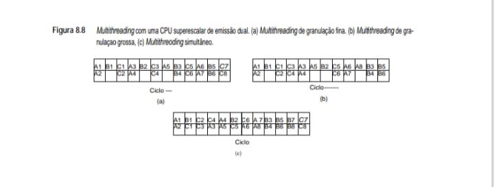

Na Figura 8.8(b), vemos como funciona o multithreading de granulação grossa com uma CPU de emissão
dual, mas agora com um escalonador estático que não introduz um ciclo morto após uma instrução que protela.
Em essência, os threads são executados um por vez, sendo que a CPU emite duas instruções por thread até atingir um
que protela, ponto em que troca para o próximo thread no início do ciclo seguinte.

Com CPUs superescalares há um terceiro modo, denominado multithreading simultâneo, ilustrado na
Figura 8.8(c). Essa técnica pode ser considerada um refinamento do multithreading de granulação grossa, na qual
um único thread tem permissão de emitir duas instruções por ciclo pelo tempo que puder, mas, quando prote-
lar, as instruções são tomadas imediatamente do próximo thread na sequência, para manter a CPU ocupada por
completo. O multithreading simultâneo também pode ajudar a manter ocupadas todas as unidades funcionais.
Quando uma instrução não puder ser iniciada porque uma unidade funcional de que ela necessita está ocupada,
pode-se escolher uma instrução de um thread diferente no lugar daquela. Nessa figura, estamos considerando que
B8 protela no ciclo 11, portanto, C7 é iniciada no ciclo 12.

    Se quiser mais informações sobre multithreading, consulte Gebhart et al., 2011; e Wing-kei et al., 2011.

**• Hyperthreading no Core i7**
Agora que já vimos o multithreading no campo abstrato, vamos considerar um exemplo prático: o Core i7.
No início da década de 2000, processadores como Pentium 4 não ofereciam os aumentos de desempenho de que
a Intel precisava para manter suas vendas. Depois que o Pentium 4 já estava em produção, os arquitetos da Intel
procuraram vários meios de aumentar sua velocidade sem mudar a interface de programadores, algo que jamais
seria aceito. Logo surgiram cinco modos:

    1. Aumentar a velocidade de clock.

    2. Colocar duas CPUs em um chip.

    3. Adicionar unidades funcionais.

    4. Aumentar o comprimento do pipeline.

    5. Usar multithreading.

Um modo óbvio de melhorar o desempenho é aumentar a velocidade de clock sem alterar mais nada. Isso é
algo relativamente direto e bem entendido, portanto, cada novo chip lançado em geral é um pouco mais rápido do
que seu predecessor. Infelizmente, um clock mais rápido também tem duas desvantagens principais que limitam
o tanto de aumento que pode ser tolerado. Primeiro, um clock mais rápido usa mais energia, o que é um enorme problema para notebooks e outros dispositivos que funcionam com bateria. Segundo, a entrada de energia extra
significa que o chip fica mais quente e que há mais calor para dissipar.

Colocar duas CPUs em um chip é relativamente direto, mas equivale a quase duplicar a área do chip se cada
uma tiver suas próprias caches e, por isso, reduz por um fator de dois o número de chips por lâmina, o que dobra
o custo de fabricação por unidade. Se os dois chips compartilharem uma cache em comum, do mesmo tamanho
da original, a área do chip não é dobrada, mas o tamanho da cache por CPU é dividido ao meio, o que reduz o
desempenho. Além disso, enquanto aplicações de servidores de alto desempenho muitas vezes podem utilizar
totalmente múltiplas CPUs, nem todas as aplicações para computadores de mesa têm paralelismo inerente sufi-
ciente para justificar duas CPUs completas.

Adicionar unidades funcionais também é razoavelmente fácil, mas é importante conseguir o equilíbrio corre-
to. Não adianta muito ter dez ULAs se o chip é incapaz de alimentar instruções no pipeline com rapidez suficiente
para mantê-las todas ocupadas.

Um pipeline mais longo, com mais estágios, cada um realizando uma porção menor do trabalho em um
período de tempo mais curto eleva o desempenho, mas também aumenta os efeitos negativos das previsões erra-
das de desvios, ausências da cache, interrupções e outros fatores que obstruem o fluxo normal no pipeline. Além
do mais, para o total aproveitamento de um pipeline mais longo, a velocidade de clock tem de ser aumentada, o
que significa que mais energia é consumida e mais calor é produzido.

Por fim, pode-se adicionar multithreading. Seu valor está em fazer um segundo thread utilizar hardware que,
não fosse por isso, ficaria abandonado. Após algumas experimentações, ficou claro que um aumento de 5% na
área do chip para suporte de multithreading resultaria em ganho de 25% em desempenho para muitas aplicações,
o que significava uma boa escolha. A primeira CPU com multithreading da Intel foi a Xeon em 2002, porém,
mais tarde ele foi adicionado ao Pentium 4, a partir da versão de 3,06 GHz e continuando com versões mais
rápidas do processador Pentium, incluindo o Core i7. A Intel deu o nome de hyperthreading à implementação
de multithreading usada nos seus processadores.

A ideia básica é permitir que dois threads (ou talvez processos, já que a CPU não pode distinguir entre
thread e processo) executem ao mesmo tempo. Para o sistema operacional, o chip Core i7 com hyperthreading
parece um processador dual em que ambas as CPUs compartilham em comum uma cache e a memória principal.
O sistema operacional escalona os threads de modo independente. Se duas aplicações estiverem executando ao
mesmo tempo, o sistema operacional pode executar ambos ao mesmo tempo. Por exemplo, se um daemon de cor-
reio estiver enviando ou recebendo e-mail em segundo plano enquanto um usuário está interagindo com algum
programa em primeiro plano, o programa daemon e o programa usuário podem executar em paralelo, como se
houvesse duas CPUs disponíveis.

Um software de aplicação projetado para executar como threads múltiplos pode usar ambas as CPUs virtuais.
Por exemplo, programas de edição de vídeo em geral permitem que os usuários especifiquem certos filtros para
aplicar a cada quadro dentro de algum limite. Esses filtros podem modificar o brilho, o contraste, o equilíbrio
de cores e outras propriedades. Então, o programa pode designar uma CPU para processar os quadros de números
pares e a outra para processar os de números ímpares e as duas conseguem executar em paralelo.

Uma vez que dois threads compartilham todos os recursos de hardware, é preciso uma estratégia para
gerenciar o compartilhamento. A Intel identificou quatro estratégias úteis para compartilhamento de recursos
em conjunto com hyperthreading: duplicação de recursos, partição de recursos, compartilhamento limitado e
compartilhamento total. Vamos estudar cada uma delas por vez.

Para começar, alguns recursos são duplicados só para fazer o threading. Por exemplo, visto que cada thread
tem seu próprio fluxo de controle, é preciso acrescentar um segundo contador de programa. Além disso, a tabela
que mapeia os registradores de arquitetura (EAX, EBX etc.) para registradores físicos também tem de ser dupli-
cada, assim como o controlador de interrupção, já que os threads podem ser interrompidos independentemente.

Em seguida, temos o, compartilhamento por partição de recursos, no qual os recursos do hardware são divi-
didos rigidamente entre os threads. Por exemplo, se a CPU tiver uma fila entre dois estágios de pipeline funcional, metade das posições poderia ser dedicada ao thread 1 e a outra metade ao thread 2. A partição é fácil de executar,
não tem sobrecarga e impede que os threads interfiram uns com os outros. Se todos os recursos são repartidos, na
verdade temos duas CPUs separadas. Como desvantagem, é fácil acontecer que, em algum ponto, um thread não
esteja usando alguns de seus recursos de que o outro necessita, porém está proibido de acessar. Por conseguinte,
recursos que poderiam ter sido usados produtivamente ficam ociosos.

O oposto do compartilhamento por partição de recursos é o compartilhamento total de recursos. Quando
esse esquema é usado, qualquer thread pode adquirir quaisquer recursos de que precisar, conforme política do
primeiro a chegar, primeiro a ser atendido. Contudo, imagine um thread rápido que consiste em adições e sub-
trações e um lento que consiste em multiplicações e divisões. Se as instruções forem buscadas na memória com
maior rapidez do que as multiplicações e divisões podem ser efetuadas, a provisão de instruções buscadas para o
thread lento e enfileiradas, mas ainda não alimentadas no pipeline, crescerá com o tempo.

Em dado instante, essa provisão ocupará toda a fila de instruções, o que ocasiona a parada do thread por
falta de espaço nessa fila. O compartilhamento total resolve o problema de um recurso que fica ocioso enquanto
outro thread o quer, mas cria um novo problema: um thread poderia tomar para si uma quantidade tão grande de
recursos que provocaria a redução da velocidade do outro ou o faria parar por completo.

Um esquema intermediário é o compartilhamento limitado, no qual um thread pode adquirir recursos
dinamicamente (não há partições fixas), mas apenas até um máximo. Quando há recursos duplicados, essa téc-
nica permite flexibilidade sem o perigo de um thread morrer de fome pela incapacidade de adquirir uma parte
do recurso. Por exemplo, se nenhum thread puder adquirir mais do que 3/4 da fila de instruções, não importa
o que o thread lento faça, o thread rápido sempre poderá executar. O hyperthreading do Core i7 usa estraté-
gias diferentes para recursos diferentes na tentativa de enfrentar os vários problemas que acabamos de citar. A
duplicação é usada para recursos que cada thread requer o tempo todo, como o contador de programa, o mapa
de registradores e o controlador de interrupção. Duplicar esses recursos aumenta a área do chip em apenas 5%,
um preço modesto a pagar pelo multithreading. Recursos disponíveis com tal abundância que não há perigo de um
único thread capturar todos eles, como linhas de cache, são totalmente compartilhados de um modo dinâmico.
Por outro lado, recursos que controlam a operação do pipeline, como as várias filas dentro do pipeline, são repar-
tidos e cada thread recebe metade das posições. O pipeline principal da microarquitetura Sandy Bridge usada no
Core i7 é ilustrado na Figura 8.9; os retângulos brancos e cinza indicam como os recursos são alocados entre os
threads brancos e cinza.

**• Figura 8.9 - Compartilhamento de recursos entre threads na microarquitetura Core i7.**
Figura 8.9, que detalha a microarquitetura do processador Core i7 (como o do seu Lenovo IdeaPad) e como ele compartilha recursos físicos entre diferentes threads para realizar o Multithreading Simultâneo (SMT).

    +-----------------------------------------------------------------------+
    |        FLUXO DE EXECUÇÃO E COMPARTILHAMENTO DE THREADS (i7)           |
    |=======================================================================|
    |                                                                       |
    |  [PC A] [PC B]  <-- Program Counters (Duplicados por Thread)          |
    |      |      |                                                         |
    |  +--------------+                                                     |
    |  |   Cache I    |  <-- Cache de Instruções (Compartilhado)            |
    |  +--------------+                                                     |
    |         |                                                             |
    |  +--------------+                                                     |
    |  | Fila / Busca |  <-- Fila de Alocação e Renomeação (Particionada)   |
    |  +--------------+                                                     |
    |      /      \                                                         |
    | [Buffer A] [Buffer B] <-- Buffers de Reordenação (Particionados)      |
    |      \      /                                                         |
    |  +--------------+                                                     |
    |  |  Escalonador |  <-- Scheduler Único (Compartilhado)                |
    |  +--------------+                                                     |
    |         |                                                             |
    |  +--------------+      +---------------------------+                  |
    |  | Registradores| ---> | UNIDADES DE EXECUÇÃO (6)  |                  |
    |  +--------------+      | (ALUs, FP, Load/Store...) |                  |
    |                        +---------------------------+                  |
    |                                     |                                 |
    |  +--------------+           +--------------+                          |
    |  |   Cache D    | <---------| Fila Retirada |  <-- (Particionada)     |
    |  +--------------+           +--------------+                          |
    |                                                                       |
    +-----------------------------------------------------------------------+

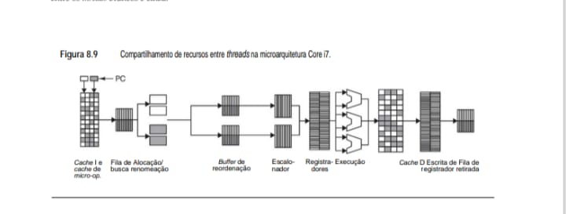

**• Detalhes Técnicos para o seu eBook:**

 - Recursos Duplicados: Para que o SMT funcione, o hardware duplica apenas o estado lógico (como o PC - Program Counter e os Registradores), fazendo o sistema operacional acreditar que existem dois núcleos onde só existe um.

 - Recursos Particionados: Elementos como o Buffer de Reordenação e as Filas de Retirada são divididos: metade do espaço para a Thread A e metade para a Thread B.

 - Recursos Compartilhados: O "coração" do chip, que inclui o Escalonador e as Unidades de Execução (como as que vimos na Figura 8.4), é totalmente compartilhado. Se a Thread A não estiver usando uma ULA em um ciclo, a Thread B pode usá-la imediatamente.

Nessa figura, podemos ver que todas as filas são repartidas, sendo que metade das posições em cada fila é
reservada para cada thread. Nessa partição, nenhum thread pode estrangular o outro. O alocador e renomeador
de registrador também é repartido. O escalonador é compartilhado dinamicamente, mas com um limite, para
impedir que qualquer dos threads reivindique para si todas as posições. Os estágios restantes do pipeline são
totalmente compartilhados.

Entretanto, nem tudo são flores no multithreading – também há uma desvantagem. Embora o particio-
namento seja barato, o compartilhamento dinâmico de qualquer recurso e, em especial, com um limite sobre
quanto um thread pode pegar, requer contabilidade durante a execução, para monitorar a utilização. Além
disso, podem surgir situações nas quais programas funcionam muito pior com multithreading do que sem ele.
Por exemplo, imagine que temos dois threads e que cada um precisa de 3/4 da cache para funcionar bem. Se
executados em separado, cada um funciona bem e encontra poucas ausências da cache (caras). Se executados
juntos, cada um encontra um grande número de ausências da cache e o resultado líquido é bem pior do que
se não houvesse multithreading.

Mais informações sobre multithreading e sua implementação dentro dos processadores Intel são dadas em
Gerber e Binstock, 2004; e Gepner et al., 2011.

## 8.1.3 Multiprocessadores com um único chip
Embora o multithreading ofereça ganhos em desempenho significativos por um custo modesto, para algumas aplicações é preciso um ganho em desempenho muito maior do que ele pode oferecer. Para conseguir esse desempenho estão sendo desenvolvidos chips multiprocessadores. Há duas áreas de interesse para esses chips
que contêm duas ou mais CPUs: servidores de alta tecnologia e equipamentos eletrônicos de consumo. A seguir, vamos fazer um breve estudo de cada uma delas.

**• Multiprocessadores homogêneos em um chip**
Com os avanços na tecnologia VLSI, agora é possível colocar duas ou mais CPUs de grande capacidade em um único chip. Visto que essas CPUs em geral compartilham a mesma cache de nível 2 e memória principal, elas se qualificam como um multiprocessador, como discutimos no Capítulo 2. Uma área de aplicação típica é um
grande conjunto de hospedeiros Web (server farm) composto de muitos servidores. Ao colocar duas CPUs na mesma caixa, compartilhando não só memória, mas também discos e interfaces de rede, muitas vezes pode-se dobrar o desempenho do servidor sem dobrar o custo (porque, mesmo ao dobro do preço, o chip de CPU é apenas
uma fração do custo total do sistema).

Há dois projetos predominantes para multiprocessadores de pequena escala em um único chip. No primeiro, mostrado na Figura 8.10(a), na realidade há só um chip, mas ele tem um segundo pipeline, o que pode dobrar a taxa de execução de instruções. No segundo, mostrado na Figura 8.10(b), há núcleos separados no chip e cada
um contém uma CPU completa. Um núcleo é um grande circuito, tal como uma CPU, controlador de E/S ou cache, que pode ser colocado em um chip de forma modular, normalmente ao lado de outros núcleos.

**• Figura 8.10   Multiprocessadores com um único chip. (a) Chip com pipeline dual. (b) Chip com dois núcleos.**

    (a) Chip com Pipeline Dual          (b) Chip com Dois Núcleos
    +--------------------------+        +--------------------------+
    |  CPU                     |        |  CPU 1       CPU 2       |
    |  [ooooooo] (Pipeline 1)  |        |  [ooooooo]   [ooooooo]   |
    |  [ooooooo] (Pipeline 2)  |        |                          |
    +--------------------------+        +--------------------------+
    |      Memória Cache       |        |      Memória Cache       |
    +--------------------------+        +--------------------------+

**• Conclusão para o eBook:**

 - Pipeline Dual (a): Compartilha mais recursos internos, sendo uma forma mais simples de paralelismo.

 - Dois Núcleos (b): Cada núcleo é independente, o que é o padrão atual do seu Lenovo IdeaPad, permitindo que tarefas pesadas como o seu IDS Sentinel rodem em um núcleo enquanto o sistema operacional gerencia o restante no outro.

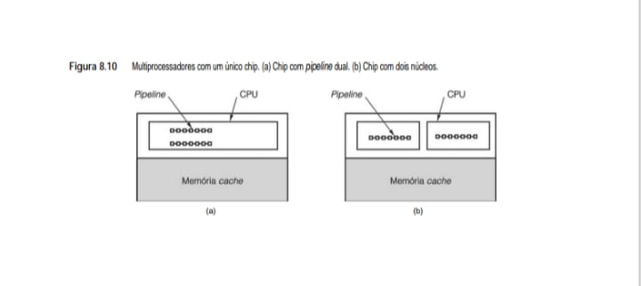

O primeiro projeto permite que recursos, como unidades funcionais, sejam compartilhados entre os processadores, o que permite que uma CPU use recursos que a outra não necessita. Por outro lado, essa técnica requer um novo projeto para o chip e não funciona muito bem para mais de duas CPUs. Por comparação, colocar dois ou mais núcleos de CPU no mesmo chip é algo relativamente fácil de fazer.

Discutiremos multiprocessadores mais adiante neste capítulo. Embora o foco dessa discussão esteja mais em multiprocessadores construídos a partir de chips com uma única CPU, grande parte também pode ser aplicada a chips com múltiplas CPUs.

**• O multiprocessador em um único chip Core i7**
A CPU Core i7 é um processador em um único chip manufaturado com quatro ou mais núcleos em uma única pastilha de silício. A organização de alto nível de um processador Core i7 é ilustrada na Figura 8.11.

**• Figura 8.11   Arquitetura do multiprocessador em um único chip do Core i7.**

        +-----------------------------------------------------------------------+
        |                 ARQUITETURA DO CHIP INTEL CORE I7                     |
        |=======================================================================|
        |                                                                       |
        |  +-----------+    +-----------+    +-----------+    +-----------+     |
        |  | IA-32 CPU |    | IA-32 CPU |    | IA-32 CPU |    | IA-32 CPU |     |
        |  |   + L1    |    |   + L1    |    |   + L1    |    |   + L1    |     |
        |  +-----------+    +-----------+    +-----------+    +-----------+     |
        |        |                |                |                |           |
        |  +-----------+    +-----------+    +-----------+    +-----------+     |
        |  | Cache L2  |    | Cache L2  |    | Cache L2  |    | Cache L2  |     |
        |  +-----------+    +-----------+    +-----------+    +-----------+     |
        |        |                |                |                |           |
        |      | R |            | R |            | R |            | R |         |
        |        |                |                |                |           |
        | [======================== REDE EM ANEL ============================]  |
        |                                |                                      |
        |                              | R |                                    |
        |                  +---------------------------+                        |
        |                  |   CACHE L3 COMPARTILHADA  |                        |
        |                  +---------------------------+                        |
        +-----------------------------------------------------------------------+

**•  Insights Técnicos para o seu eBook:**

- Hierarquia de Cache: Cada núcleo tem seu próprio Cache L1 e L2 (privados), o que garante velocidade para tarefas locais. O Cache L3 é o grande "pátio comum" onde todos os núcleos trocam dados.

- Rede em Anel (Ring Bus): É o barramento de alta velocidade que conecta as CPUs ao Cache L3 e ao controlador de memória, permitindo que a comunicação entre núcleos ocorra com latência mínima.

 - Eficiência de Pipeline: Ao unir as latências da Figura 8.4 com essa estrutura, você vê por que o Multithreading é necessário: se um núcleo trava em uma divisão de 17 ciclos, a rede em anel permite que as outras CPUs continuem acessando o Cache L3 sem interrupções.

Cada processador no Core i7 tem suas próprias caches L1 privada para instrução e dados, mais sua própria cache L2 unificada privada. Os processadores são conectados às caches privadas com conexões ponto a ponto dedicadas. O próximo nível da hierarquia de memória é a cache de dados L3 compartilhada e unificada.

As caches L2 se conectam à cache compartilhada L3 usando uma rede em anel. Quando um pedido de comunicação entra na rede em anel, ele é encaminhado para o próximo nó na rede, onde é verificado se alcançou seu nó de destino. Esse processo continua de um nó para outro no anel, até que o nó de destino seja encontrado ou o pedido chegue a sua origem novamente (quando o destino não existe). A vantagem de uma rede em anel é que ela é um modo barato de conseguir alta largura de banda, com o custo de maior latência enquanto os pedidos saltam de um nó para outro. A rede em anel do Core i7 tem duas finalidades principais. Primeiro, ela oferece um modo de mover pedidos de memória e E/S entre as caches e processadores. Segundo, ela executa as verificações necessárias para garantir que cada processador esteja sempre tendo uma visão coerente da memória. Aprenderemos mais sobre essas verificações de coerência mais adiante neste capítulo.

**• Multiprocessadores heterogêneos em um chip**
Uma área de aplicação completamente diferente que utiliza multiprocessadores em um único chip é a de sistemas embutidos, em especial em equipamentos eletrônicos audiovisuais de consumo, como aparelhos de televisão, DVDs, filmadoras, consoles de jogos, telefones celulares e assim por diante. Esses sistemas possuem
requisitos de desempenho exigentes e restrições rígidas. Embora tendo aparências diferentes, cada vez mais esses aparelhos são só pequenos computadores, com uma ou mais CPUs, memórias, controladores de E/S e alguns dispositivos de E/S próprios. Um telefone celular, por exemplo, é um mero PC com uma CPU, memória, teclado
diminuto, microfone, alto-falante e uma conexão de rede sem fio, dentro de um pequeno pacote.

Considere, como exemplo, um aparelho portátil de DVD. O computador que está dentro dele tem de manipular as seguintes funções:

    1. Controle de um servomecanismo barato, não confiável, para posicionamento do cabeçote.

    2. Conversão de analógico para digital.

    3. Correção de erros.

    4. Decriptação e gerenciamento de direitos digitais.

    5. Descompressão de vídeo MPEG-2.

    6. Descompressão de áudio.

    7. Codificação da saída para aparelhos de televisão NTSC, PAL ou SECAM.

Esse trabalho deve ser realizado em rígidas restrições de tempo real, qualidade de serviço, energia, dissipação de calor, tamanho, peso e preço.

Discos de CD, DVD e Blu-ray contêm uma longa espiral na qual estão as informações, como ilustrado na Figura 2.25 (para um CD). Nesta seção, discutiremos os DVDs, pois eles ainda são mais comuns do que os discos Blu-ray, mas estes são muito semelhantes aos DVDs, exceto por utilizarem codificação MPEG-4 em vez de MPEG-2.Com toda mídia ótica, o cabeçote de leitura deve percorrer a espiral com precisão à medida que o disco gira. O preço é mantido baixo pela utilização de um projeto mecânico relativamente simples e pelo rígido controle da posição do cabeçote em software. O sinal que sai do cabeçote é um sinal analógico que deve ser convertido para forma digital antes de ser processado. Após ser digitalizado, é preciso extensa correção de erros porque DVDs são prensados e contêm muitos erros, que devem ser corrigidos em software. O vídeo é comprimido usando o padrão internacional MPEG-2, que requer cálculos complexos para a descompressão (parecidos com transformadas de Fourier). O áudio é comprimido usando um modelo psicoacústico que também requer cálculos sofisticados para  descompressão. Por fim, áudio e vídeo têm de ser entregues em uma forma adequada para reprodução em aparelhos de televisão NTSC, PAL ou SECAM, dependendo do país para o qual o aparelho de DVD será despachado. Não é nenhuma surpresa que seja impossível fazer todo esse trabalho em tempo real, em software, com uma CPU barata de uso geral. Nesse caso, precisamos de um multiprocessador heterogêneo que contenha múltiplos núcleos, cada um especializado para uma tarefa particular. Um exemplo de aparelho de DVD é dado na Figura 8.12.

**• Figura 8.12 - A estrutura lógica de um simples aparelho de DVD contém um multiprocessador heterogêneo com múltiplos núcleos para diferentes funções.**

    +---------------------------------------------------------------+
    |          CHIP MULTIPROCESSADOR HETEROGÊNEO (6 NÚCLEOS)        |
    |===============================================================|
    |  [ Proc. ] [ Decod. ] [ Decod. ] [ Codif. ] [ Contr. ] [ C  ] |
    |  [ Contr.] [ Video  ] [ Áudio  ] [ Video  ] [ Disco  ] [ a  ] |
    |  [       ] [ MPEG   ] [        ] [ Comp.  ] [        ] [ che] |
    +---------------------------------------------------------------+
          |            |            |            |            |
     [======================== BARRAMENTO =========================]
          |                                      |
    +-----------+                          +-----------+
    |  MEMÓRIA  |                          | DISPOSIT. |
    +-----------+                          +-----------+

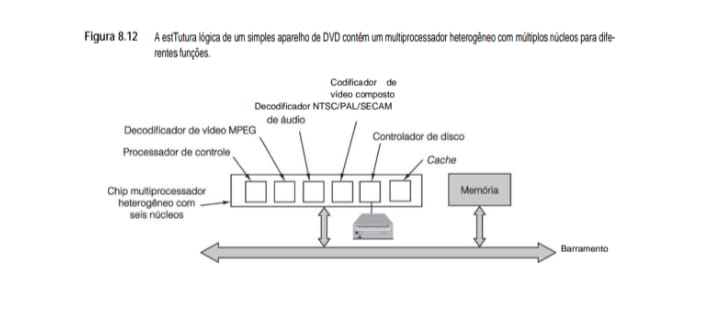

**• Notas para o seu eBook:**

 - Especialização vs. Generalização: Enquanto o processador do seu Lenovo é feito para rodar qualquer código (C, JS, Assembly), o chip da Figura 8.12 é otimizado. O "Decodificador de Vídeo MPEG" faz apenas uma coisa, mas a faz consumindo muito menos energia do que um núcleo comum.

 - Paralelismo Funcional: No exemplo do DVD, todos esses núcleos podem trabalhar ao mesmo tempo: um lê o disco, outro decodifica o som e um terceiro processa a imagem.

 - Conexão com Sistemas Operacionais: No Ubuntu, você consegue ver essa especialização ao usar a aceleração de hardware da sua GPU para processar vídeos, aliviando os núcleos principais da CPU.

As funções dos núcleos na Figura 8.12 são todas diferentes, e cada uma é projetada com cuidado para ser muito boa no que faz pelo preço mais baixo possível. Por exemplo, o vídeo de DVD é comprimido usando um esquema conhecido como MPEG-2 (que quer dizer Motion Picture Experts Group – grupo de especialistas em filmes –, que o inventou). O sistema consiste em dividir cada quadro em blocos de pixels e fazer uma transformação complexa em cada um. Um quadro pode consistir inteiramente em blocos transformados ou especificar que certo bloco é igual a outro já encontrado no quadro anterior, exceto por um par de pixels que foram alterados, porém localizado com um afastamento de (Δx, Δy) em relação à posição corrente. Esse cálculo em software é extremamente lento, mas é possível
construir uma máquina de decodificação MPEG-2 que pode efetuá-lo em hardware com bastante rapidez. De modo semelhante, a decodificação de áudio e a recodificação de sinal de áudio-vídeo composto para ficar de acordo com um dos padrões mundiais de televisão podem ser mais bem executadas por processadores dedicados em hardware. Essas observações não tardaram a gerar chips multiprocessadores heterogêneos que contêm múltiplos núcleos projetados para aplicações audiovisuais. Contudo, como o processador de controle é uma CPU programável de uso geral, o chip multiprocessador também pode ser usado em outras aplicações semelhantes, como um gravador de DVD.

Outro dispositivo que requer um multiprocessador heterogêneo é o que está dentro de um telefone celular avançado. Os atuais às vezes têm máquinas fotográficas, videocâmeras, máquinas de jogos, browsers Web, leitores de e-mail e receptores de rádio por satélite, que usam a tecnologia de telefonia celular (CDMA ou GSM, dependendo do país) ou Internet sem fio (IEEE 802.11, também chamada WiFi); os futuros podem incluir todos esses. À medida que os dispositivos adquirem cada vez mais funcionalidade, com relógios que se transformam em mapas baseados em GPS e óculos que se transformam em rádios, a necessidade de multiprocessadores heterogêneos só aumentará.

Dentro em pouco, os chips terão dezenas de bilhões de transistores. Chips como esses são grandes demais para que se projete uma porta e um fio por vez. O esforço humano requerido faria com que os chips ficassem obsoletos quando fossem terminados. A única maneira viável é usar núcleos (basicamente, bibliotecas) que contenham subconjuntos grandes o suficiente e então colocá-los e interconectá-los no chip conforme necessário. Então, os projetistas têm de determinar qual núcleo de CPU usar para o processador de controle e quais processadores de uso especial acrescentar para ajudá-lo. Atribuir mais carga ao software que executa no processador de controle faz o sistema ficar mais lento, mas resulta em um chip menor (e mais barato). Ter vários processadores de uso especial para processamento de áudio e vídeo ocupa área do chip, aumentando o custo, mas resulta em desempenhos mais altos e uma taxa de clock mais baixa, o que significa menor consumo de energia e menos dissipação de calor. Assim, os projetistas de chips enfrentam cada vez mais esses compromissos macroscópicos em vez de se preocupar com onde vão colocar cada transistor.

Aplicações audiovisuais utilizam dados intensamente. Enormes quantidades de dados têm de ser processadas de modo muito rápido, portanto, o normal é que 50% a 75% da área do chip sejam dedicados à memória de uma forma ou outra, e a quantidade está crescendo. Neste caso, as questões de projeto são numerosas. Quantos níveis devem ser usados? As caches devem ser divididas ou unificadas? Qual deverá ser o tamanho de cada uma? Qual deverá ser a rapidez? Um pouco da memória também tem de ir para o chip? Ela deve ser SRAM ou SDRAM? As respostas para cada uma dessas perguntas têm importantes implicações para o desempenho, consumo de energia e dissipação de calor do chip.

Além do projeto de processadores e sistema de memória, outra questão de considerável consequência é o sistema de comunicação – como todos os núcleos se comunicam uns com os outros? No caso de sistemas pequenos, um único barramento costuma dar conta do negócio, mas para sistemas maiores ele logo se torna um gargalo. Muitas vezes, o problema pode ser resolvido migrando para múltiplos barramentos ou, talvez, para um anel que vai de um núcleo a outro. Nesse último caso, a arbitração é conduzida passando um pequeno pacote, denominado permissão, ao redor do anel. Para transmitir, primeiro um núcleo deve capturar a permissão. Ao concluir, ele devolve a permissão ao anel, de modo que ela possa continuar circulando. Esse protocolo evita colisões no anel.

Como exemplo de uma interconexão no chip, considere o CoreConnect da IBM, ilustrado na Figura 8.13. É uma arquitetura para conectar núcleos em um multiprocessador heterogêneo de um único chip. Trata-se de um projeto de sistema-em-um-chip especialmente completo. De certo modo, o CoreConnect é para multiprocessadores de chip único o que o barramento PCI foi para o Pentium – a cola que mantém juntas todas as partes. (Com os modernos sistemas Core i7, PCIe é a cola, mas é uma rede ponto a ponto, sem um barramento compartilhado, como PCI.) Contudo, ao contrário do barramento PCI, o CoreConnect foi projetado sem qualquer exigência de compatibilidade com equipamentos herdados ou protocolos e sem as restrições de barramentos de nível de placa, como limites ao número de pinos que o conector de borda pode ter.

**• Figura 8.13   Exemplo da arquitetura CoreConnect da IBM.**
Este diagrama ilustra a organização de um sistema em chip (SoC) usando múltiplos barramentos interligados por uma ponte.

    +-------------------------------------------------------------+
    |               BARRAMENTO DE REGISTRADORES                   |
    +-------------------------------------------------------------+
        |           |           |                 |           |
    +-------+   +-------+   +-------+         +-------+   +-------+
    | CPU   |   | Outra |   | Disp. |         | Disp. |   | Disp. |
    | Contr.|   | CPU   |   | E/S   |         | E/S   |   | E/S   |
    +-------+   +-------+   +-------+         +-------+   +-------+
        |           |           |                 |           |
    [======= BARRAMENTO DE =======]     +-----+   [== BARRAMENTO ==]
    [======= PROCESSADOR   =======]<--->|PONTE|<-->[== PERIFÉRICOS ==]
        |           |           |       +-----+   [================]
        |       +-------+       |                         |
        +-------|MEMÓRIA|-------+                     +-------+
                +-------+                             |ÁRBITRO|
                                                      +-------+

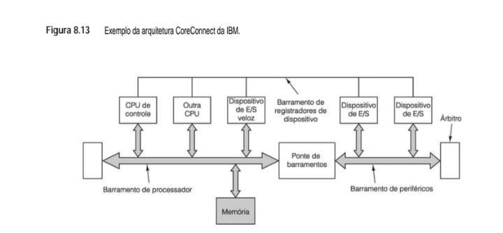

**• Notas Técnicas para o eBook:**

 - Escalonamento (Fig. 8.7): A granulação fina alterna threads a cada ciclo, enquanto a grossa espera por eventos longos de latência.

 - Densidade SMT (Fig. 8.8): O SMT é a técnica que permite ao seu Core i7 rodar instruções de threads diferentes simultaneamente no mesmo ciclo de clock, eliminando quase toda a ociosidade.

 - Hierarquia de Barramentos (Fig. 8.13): O uso de uma Ponte de Barramentos permite separar o tráfego rápido (CPU/Memória) do tráfego mais lento (Periféricos), evitando que dispositivos lentos reduzam a performance global do sistema.

O CoreConnect consiste em três barramentos. O barramento de processador é de alta velocidade, síncrono, com pipeline, com 32, 64 ou 128 linhas de dados com clocks de 66, 133 ou 183 MHz. Assim, a vazão máxima é 23,4 Gbps (contra 4,2 Gbps para o barramento PCI). As características de pipeline permitem que os núcleos
requisitem o barramento enquanto está ocorrendo uma transferência e permitem que diferentes núcleos usem linhas diferentes ao mesmo tempo, semelhante ao barramento PCI. O barramento de processador é otimizado para curtas transferências de blocos. Ele foi projetado para conectar núcleos rápidos, como CPUs, decodificadores MPEG-2, redes de alta velocidade e itens semelhantes.

Estender o **barramento de processador** ao chip inteiro reduziria seu desempenho, portanto, um segundo barramento está presente para dispositivos de E/S lentos, como UARTs, temporizadores, controladores USB, dispositivos de E/S serial e assim por diante. Esse barramento de periféricos foi projetado com o objetivo de simplificar sua interface com periféricos de 8, 16 e 32 bits usando não mais do que uma centena de portas. Ele também é síncrono, com uma vazão máxima de 300 Mbps. Os dois barramentos são conectados por uma ponte, não muito diferente das pontes que foram usadas para conectar os barramentos PCI e ISA em PCs, até o barramento ISA ser descontinuado há alguns anos.

O terceiro barramento é o barramento de registradores de dispositivo, de mútua apresentação, assíncrono, de velocidade muito baixa, utilizado para permitir que os processadores acessem os registradores de dispositivos de todos os periféricos de modo a controlar os dispositivos correspondentes. É destinado a transferências pouco frequentes de apenas alguns bytes por vez.

Ao fornecer barramento no chip, interface e estrutura padronizados, a IBM espera criar uma versão em miniatura do mundo do PCI, na qual muitos fabricantes produzam processadores e controladores fáceis de serem interconectados. Entretanto, uma diferença é que, no mundo do PCI, os fabricantes produzem e vendem
as placas propriamente ditas que os montadores e usuários finais de PC compram. No mundo do CoreConnect, terceiros projetam núcleos, mas não os fabricam. Em vez disso, eles os licenciam como propriedade intelectual para empresas de eletrônicos de consumo e outras, que então projetam chips multiprocessadores heterogêneos
por encomenda, baseados em seus próprios núcleos e em núcleos licenciados por terceiros. Visto que fabricar esses chips tão grandes e complexos requer maciço investimento em unidades industriais, na maioria dos casos as empresas de eletrônicos de consumo apenas fazem o projeto e subcontratam a fabricação do chip com um fabricante de semicondutores. Existem núcleos para várias CPUs (ARM, MIPS, PowerPC etc.), bem como para decodificadores MPEG, processadores de sinais digitais e todos os controladores de E/S padronizados.

O CoreConnect da IBM não é o único barramento no chip popular no mercado. O AMBA (Advanced Microcontroller Bus Architecture – arquitetura de barramento avançado de microcontrolador), também é muito usado para conectar CPUs ARM a outras CPUs e dispositivos de E/S (Flynn, 1997). Outros barramentos no chip um pouco menos populares são o VCI (Virtual Component Interconnect – interconexão de componentes virtuais) e o OCP-IP (Open Core Protocol-International Partnership – Aliança Internacional de Protocolo de Núcleo Aberto), que também estão competindo por uma fatia do mercado (Bhakthavatchalu et al., 2010). Barramentos no chip são
apenas o começo; há quem já esteja pensando em redes inteiras em um chip (Ahmadinia e Shahrabi, 2011). Como os fabricantes de chips encontram uma dificuldade cada vez maior para elevar frequências de clock por causa de problemas de dissipação de calor, multiprocessadores em um único chip são um tópico que desperta muito interesse. Mais informações podem ser encontradas em Gupta et al., 2010; Herrero et al., 2010; e Mishra et al., 2011.

## 8.2 Coprocessadores
Agora que já vimos alguns dos modos de conseguir paralelismo no chip, vamos subir um degrau e ver como o computador pode ganhar velocidade com a adição de um segundo processador especializado. Há uma variedade desses coprocessadores, de pequenos a grandes. Nos mainframes IBM 360 e em todos os seus sucessores, existem
canais independentes de E/S para fazer entrada/saída. De modo semelhante, o CDC 6600 tinha dez processadores independentes para efetuar E/S. Gráficos e aritmética de ponto flutuante são outras áreas em que são usados coprocessadores. Até mesmo um chip DMA pode ser visto como um coprocessador. Em alguns casos, a CPU dá ao coprocessador uma instrução ou um conjunto de instruções e ordena que ele as execute; em outros casos, ele é mais independente e funciona em grande parte por si só.

Em termos físicos, coprocessadores podem variar de um gabinete separado (os canais de E/S do 360) a uma placa de expansão (processadores de rede) ou uma área no chip principal (ponto flutuante). Em todos os casos, o que os distingue é o fato de que algum outro processador é o principal e que os coprocessadores estão lá para ajudá-lo. Agora, examinaremos três áreas em que é possível aumentar a velocidade: processamento de rede, multimídia e criptografia.

## 8.2.1 Processadores de rede
Grande parte dos computadores de hoje estão conectados a uma rede ou à Internet. Como resultado desse progresso tecnológico em hardware de rede, as redes agora são tão rápidas que ficou cada vez mais difícil processar em software todos os dados que entram e que saem. Por conseguinte, foram desenvolvidos processadores
especiais de rede para lidar com o tráfego e muitos computadores de alta tecnologia agora têm um desses processadores. Nesta seção, antes de tudo, vamos dar uma breve introdução a redes e em seguida discutiremos como funcionam os processadores de rede.

**• Introdução a redes**
Redes de computadores podem ser de dois tipos gerais: redes locais, ou LANs (Local-Area Networks), que conectam vários computadores dentro de um edifício, campus, escritório ou residência, e redes de longa distância ou WANs (Wide-Area Networks), que conectam computadores espalhados por uma grande área geográfica.
A LAN mais popular é denominada Ethernet. A Ethernet original consistia em um cabo grosso no qual eram forçosamente inseridos os fios que vinham de cada computador, usando uma derivação conhecida pelo eufemismo conector vampiro. Ethernets modernas ligam os computadores a um switch central, como ilustrado no lado
direito da Figura 8.14. A Ethernet original se arrastava a 3 Mbps, mas a primeira versão comercial foi de 10 Mbps. Ela não demorou muito a ser substituída pela Fast Ethernet a 100 Mbps e, em seguida, pela Gigabit Ethernet a 1 Gbps. Já existe no mercado uma Ethernet de 10 gigabits e uma de 40 gigabits já está pronta para ser lançada.

A organização das WANs é diferente. Elas consistem em computadores especializados denominados roteadores conectados por fios ou fibras óticas, como mostra a parte do meio da Figura 8.14. Blocos de dados denominados pacotes, normalmente de 64 a cerca de 1.500 bytes, são movidos da máquina de origem e passam por um
ou mais roteadores até alcançarem seu destino. Em cada salto, um pacote é armazenado na memória do roteador e então repassado ao próximo roteador ao longo do caminho, tão logo a linha de transmissão necessária esteja disponível. Essa técnica é denominada comutação de pacotes armazena-e-encaminha.

**• Figura 8.14   Como os usuários são conectados a servidores na Internet.**
Este diagrama ilustra o caminho físico de um pacote de dados desde o seu computador até o servidor de destino.

    +-----------+
    | Usuários  |----\
    +-----------+     \  +-----+     ( PACOTES )     +-------------+
                    >--->| ISP |====================>|  INTERNET   |
    +-----------+     /  +-----+    (Fibra Ótica)    | (Roteadores)|
    | Usuários  |----/                               +-------------+
    +-----------+                                             |
                                                              |
            +-------------------------------------------------+
            |
            |      INSTALAÇÕES DO PROVEDOR (APPLICATION PROVIDER) - Instalações do provedor de aplicação
            |     +----------+      +----------+      +----------+
            \---->| FIREWALL |----->|  SWITCH  |----->| SERVIDOR |
                  +----------+      +----------+      +----------+

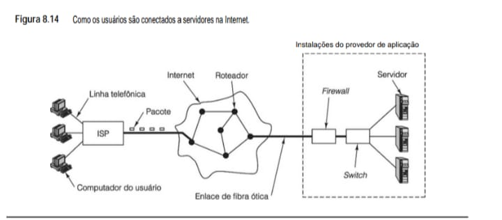

**• Hardware de Rede: O ISP (Provedor de Internet) converte o sinal da sua linha telefônica para enlaces de alta velocidade como a Fibra Ótica para atravessar a rede de roteadores da Internet.**

Embora muitos achem que Internet é uma WAN única, tecnicamente ela é um conjunto de muitas WANs conectadas umas às outras. Todavia, essa distinção não é importante para nossa finalidade. A Figura 8.14 dá uma visão da Internet do ponto de vista de um usuário doméstico. O computador do usuário em geral está conectado a um servidor Web pelo sistema telefônico, por meio de um modem discado de 56 kbps ou por ADSL, que foi discutido no Capítulo 2. (Como alternativa, pode ser usado um cabo de TV, caso em que o lado esquerdo da Figura 8.14 é ligeiramente diferente e a empresa de TV a cabo é o ISP.) O computador do usuário desmembra em pacotes os dados que serão enviados ao servidor e envia esses pacotes ao ISP (Internet Service Provider – provedor de serviços de Internet), uma empresa que oferece acesso à Internet aos seus clientes. O ISP tem uma conexão de alta velocidade (geralmente por fibra ótica) com uma das redes regionais ou backbones que compõem a Internet. Os pacotes do usuário são repassados salto por salto pela Internet até chegarem ao servidor Web.

A maioria das empresas que oferece serviços de Web tem um computador especializado denominado firewall, que filtra todo o tráfego que chega na tentativa de remover pacotes indesejados (por exemplo, pacotes de hackers que estejam tentando invadir a rede). O firewall está conectado à LAN local, normalmente um switch
Ethernet, que roteia pacotes até o servidor desejado. É claro que a realidade é muito mais complicada do que mostramos, mas a ideia básica da Figura 8.14 continua válida.

O software de rede consiste em múltiplos protocolos, e cada um deles é um conjunto de formatos, sequências de troca e regras sobre o significado dos pacotes. Por exemplo, quando um usuário quer buscar uma página Web em um servidor, seu browser envia ao servidor um pacote que contém uma requisição GET PAGE usando
o protocolo HTTP (HyperText Transfer Protocol – protocolo de transferência de hipertexto). O servidor sabe como processar essas requisições. Há muitos protocolos em uso e, com frequência, eles são combinados. Na maioria das situações, os protocolos são estruturados como uma série de camadas, sendo que as mais altas passam pacotes para as mais baixas para processamento e a camada mais baixa efetua a transmissão propriamente dita. No lado receptor, os pacotes percorrem seu caminho pelas camadas na ordem inversa.

Uma vez que processamento de protocolos é o que os processadores de rede fazem para ganhar a vida, é necessário explicar um pouco sobre protocolos antes de estudar os processadores de rede em si. Por enquanto, vamos voltar à requisição GET PAGE. Como ela é enviada ao servidor Web? O que acontece é que, em pri-
meiro lugar, o browser estabelece uma conexão com o servidor Web usando um protocolo denominado TCP (Transmission Control Protocol – protocolo de controle de transmissão). O software que executa esse protocolo verifica se todos os pacotes foram recebidos corretamente e na ordem certa. Se um pacote se perder, o software TCP garante que ele seja retransmitido tantas vezes quantas forem necessárias até ser recebido.

Na prática, o que acontece é que o browser Web formata a requisição GET PAGE como uma mensagem HTTP correta e então a entrega ao software TCP para que seja transmitida pela conexão. O software TCP acrescenta um cabeçalho à frente da mensagem, que contém um número de sequência e outras informações. Naturalmente, esse cabeçalho é denominado cabeçalho TCP.

Isso feito, o software TCP pega o cabeçalho TCP e a carga útil (ou payload, que contém a requisição GET PAGE) e os passa a outro software que executa o Protocolo IP (Internet Protocol). Esse software anexa à frente do pacote um cabeçalho IP que contém o endereço da origem (a máquina da qual o pacote está partindo), o endereço de destino (a máquina para a qual o pacote deve ir), por quantos saltos mais o pacote pode viver (para evitar que pacotes perdidos fiquem vagando eternamente pela rede), uma soma de verificação (para detectar erros de transmissão e de memória) e outros campos.

Em seguida, o pacote resultante (que agora é composto do cabeçalho IP, cabeçalho TCP e requisição GET PAGE) é passado para baixo, para a camada de enlace de dados, e é acrescentado um cabeçalho de enlace de dados à frente do pacote para a transmissão. A camada de enlace de dados também acrescenta uma soma de verificação ao final do pacote, denominada CRC (Cyclic Redundancy Code – código de redundância cíclica) para detectar erros de transmissão. A presença de somas de verificação na camada de enlace de dados e na de IP poderia parecer redundante, mas ela melhora a confiabilidade. A cada salto, o CRC é verificado e o cabeçalho e o CRC são removidos e recriados em um formato apropriado para o enlace de saída. A Figura 8.15 mostra o aspecto do pacote quando está na Ethernet. Em uma linha telefônica (para ADSL) ele é semelhante, exceto pelo “cabeçalho de linha telefônica” em vez de um cabeçalho Ethernet. O gerenciamento de cabeçalhos é importante e é uma das coisas que os processadores de rede podem fazer. Não é preciso dizer que apenas arranhamos a superfície da questão de redes de computadores. Se o leitor quiser um tratamento mais abrangente, consulte Tanenbaum e Wetherall, 2011.

**• Figura 8.15 - Pacote tal como aparece na Ethernet.**
Este diagrama é fundamental para o seu projeto de IDS Sentinel, pois mostra exatamente como os cabeçalhos são empilhados (encapsulamento) para que você possa realizar a análise de protocolos como IP e TCP.

    +-----------+-----------+-----------+-------------------------+-----+
    | Cabeçalho | Cabeçalho | Cabeçalho |                         |  C  |
    | Ethernet  |    IP     |    TCP    |       Carga Útil        |  R  |
    |           |           |           |                         |  C  |
    +-----------+-----------+-----------+-------------------------+-----+

**• Introdução a processadores de rede**
Há muitos tipos de dispositivos conectados às redes. Usuários finais têm computadores pessoais (de mesa ou notebooks), é claro, porém, cada vez mais também têm máquinas de jogos, PDAs (palmtops) e smartphones. Empresas têm PCs e servidores como sistemas finais. Todavia, há também numerosos dispositivos que funcionam
como sistemas intermediários em redes, entre eles roteadores, switches, firewalls, proxies da Web e balanceadores de carga. O interessante é que esses sistemas intermediários são os mais exigentes, já que são eles que devem movimentar o maior número de pacotes por segundo. Servidores também são exigentes, mas as máquinas do usuário não são.

Dependendo da rede e do pacote em si, um pacote que chega pode precisar de vários tipos de processamento antes de ser repassado para a linha de saída ou para o programa de aplicação. Esse processamento pode incluir decidir para onde enviar o pacote, fragmentá-lo, reconstruí-lo a partir de seus pedaços, gerenciar sua qualidade de serviço (em especial para fluxos de áudio e vídeo), gerenciar segurança (por exemplo, criptografar e decriptografar), compressão/descompressão e assim por diante.

Com a velocidade das LANs se aproximando de 40 gigabits/segundo e pacotes de 1 KB, um computador em rede pode ter de processar quase 5 milhões de pacotes/segundo. Quando os pacotes são de 64 bytes, o número deles que tem de ser processado por segundo sobe a quase 80 milhões. Executar todas as várias funções que
acabamos de mencionar em 12–200 ns (além das múltiplas cópias do pacote que, sempre, são necessárias) simplesmente não é viável em software. A assistência do hardware é essencial.

Um tipo de solução de hardware para processamento rápido de pacotes é usar um ASIC (Application-Specific Integrated Circuit – circuito integrado específico da aplicação) por especificação. Esse chip é como um programa fixo que executa qualquer conjunto de funções de processamento para o qual foi projetado. Muitos roteadores atuais usam ASICs. Entretanto, os ASICs têm muitos problemas. Primeiro, o projeto de um ASIC é muito demorado e sua fabricação também. Eles são rígidos, portanto, se for necessária uma nova funcionalidade, será preciso projetar e fabricar um novo chip. Além do mais, o gerenciamento de bugs é um pesadelo, visto que o único modo de consertá-los é projetar, fabricar, despachar e instalar novos chips. Também são caros, a menos que o volume seja tão grande
que permita amortizar o esforço do desenvolvimento com uma quantidade substancial de chips.

Uma segunda solução é o FPGA (Field Programmable Gate Array – arranjo de portas programável em campo), um conjunto de portas que pode ser organizado conforme o circuito desejado modificando sua fiação em campo. O tempo de chegada ao mercado desses chips é muito mais curto do que o dos ASICs, e sua fiação pode ser modificada em campo removendo-os do sistema e inserindo-os em um dispositivo especial de reprogramação. Por outro lado, eles são complexos, lentos e caros e, por isso, não são atraentes, exceto para aplicações que têm um nicho de mercado específico.

Por fim, chegamos aos processadores de rede, dispositivos programáveis que podem manipular pacotes que chegam e que saem à velocidade dos fios, isto é, em tempo real. Um projeto comum é uma placa de expansão que contém um processador de rede em um chip junto com memória e lógica de apoio. Uma ou mais linhas de rede se conectam com a placa e são roteadas para o processador de rede. Ali, os pacotes são extraídos, processados e enviados por uma linha de rede diferente (por exemplo, para um roteador) ou enviados para o barramento do sistema principal (por exemplo, o barramento PCI) no caso de dispositivo de usuário final, como um PC. Uma placa de processador de rede e um chip típicos são ilustrados na Figura 8.16.

**• Figura 8.16 - Placa e chip de um processador de rede típico.**
Este diagrama é o complemento perfeito para o seu estudo sobre o pacote Ethernet (Figura 8.15), pois mostra o "motor" físico que processa esses pacotes em alta velocidade.

    +-----------------------------------------------------------------------+
    |                   PLACA DE PROCESSADOR DE REDE                        |
    |=======================================================================|
    |  [ MEMÓRIA ]                                                          |
    |  +-------+-------+         [ PROCESSADOR DE REDE ]                    |
    |  | SRAM  | SDRAM |         +---------------------------------------+  |
    |  +-------+-------+         |  +---------+  +---------+  +--------+ |  |
    |  | Inter.| Inter.|         |  | CPU de  |  | Memória |  | Inter. | |  |
    |  | SRAM  | SDRAM | <------>|  | Controle|  | Local   |  | de Rede| |  |
    |  +-------+-------+         |  +---------+  +---------+  +--------+ |  |
    |                            |       |            |            |     |  |
    |                            |  [========== BARRAMENTOS ===========] |  |
    |                            |       |            |            |     |  |
    |  +---------------+         |  +-----+  +-----+  +-----+  +-----+   |  |
    |  | INTERFACE PCI | <------>|  | PPE |  | PPE |  | PPE |  | PPE |   |  |
    |  +---------------+         |  +-----+  +-----+  +-----+  +-----+   |  |
    |                            +---------------------------------------+  |
    |                               (PPE = Processadores Especializados)    |
    |_______________________________________________________________________|
    | |||||||||||||||||||||||||| CONECTOR PCI ||||||||||||||||||||||||||||| |
    +-----------------------------------------------------------------------+

**• Notas Técnicas para o eBook:**

 - PPE (Packet Processing Elements): São os núcleos especializados em processar pacotes individualmente. Em vez de núcleos genéricos como os do seu Core i7, esses são otimizados para tarefas de rede (como verificar o CRC ou ler o cabeçalho IP que vimos antes).

 - Hierarquia de Memória: O chip utiliza SRAM para tarefas que exigem altíssima velocidade (como tabelas de roteamento rápidas) e SDRAM para armazenamento de pacotes em trânsito (buffers).

 - Interface de Rede e PCI: O processador se comunica com a rede externa e com o restante do sistema (seu Ubuntu, por exemplo) através dessas interfaces dedicadas, garantindo que o tráfego de dados não sature o barramento principal do computador.

Tanto a SRAM quanto a SDRAM são fornecidas na placa e normalmente são usadas de modos diferentes. A SRAM é mais rápida, porém mais cara do que a SDRAM, portanto, há apenas uma pequena quantidade dela. A SRAM é usada para conter tabelas de roteamento e outras estruturas de dados fundamentais, enquanto a SDRAM contém os pacotes que estão sendo processados. Como a SRAM e a SDRAM são externas ao chip do processador de rede, os projetistas da placa têm flexibilidade para determinar quanto fornecer de cada uma. Desse modo, placas de baixa tecnologia com uma única linha de rede (por exemplo, para um PC ou um servidor) podem ser equipadas com uma pequena quantidade de memória, enquanto uma placa de alta tecnologia para um roteador de grande porte pode ser equipada com muito mais.

Chips de processadores de rede são otimizados para processar de modo rápido grandes quantidades de pacotes que entram e saem. Isso significa milhões de pacotes por segundo por linha de rede, e um roteador poderia ter, facilmente, meia dúzia de linhas. A única maneira de atingir tais taxas de processamento é construir processadores de rede munidos de alto grau de paralelismo. E, de fato, todos os processadores de rede consistem em vários PPEs, denominados pelos variados nomes Protocol/Programmable/Packet Processing Engines (dispositivos de processamento de protocolo/programáveis/pacotes). Cada um é um núcleo RISC (talvez modificado) e uma pequena quantidade de memória interna para conter o programa e algumas variáveis.

Os PPEs podem ser organizados de dois modos diferentes. A organização mais simples é todos os PPEs idênticos. Quando um pacote chega ao processador de rede, seja um pacote de entrada que vem de uma linha de rede, seja um de saída que vem do barramento, ele é entregue a um PPE ocioso para processamento. Se não houver
um, o pacote entra na fila da SDRAM na placa até que algum PPE seja liberado. Quando é usada essa organização, as conexões horizontais mostradas entre os PPEs na Figura 8.16 não existem porque os PPEs não têm nenhuma necessidade de se comunicar uns com os outros.

A outra forma de organização de PPEs é o pipeline. Nessa organização, cada PPE executa uma etapa de processamento e então alimenta um ponteiro para seu pacote de saída para o próximo PPE no pipeline. Desse modo, o pipeline de PPE age de modo muito parecido com os de CPU que estudamos no Capítulo 2. Em ambas as organizações, os PPEs são completamente programáveis.

Em projetos avançados, os PPEs têm multithreading, o que significa que eles têm vários conjuntos de registradores e um registrador em hardware que indica qual deles está em uso no momento. Essa característica é usada para executar vários programas ao mesmo tempo, permitindo que um programa (isto é, um thread) comute
apenas alterando a variável “conjunto atual de registradores”. Mais frequentemente, quando um PPE protela, por exemplo, quando referencia a SDRAM (o que toma vários ciclos de clock), ele pode comutar instantaneamente para um thread executável. Dessa maneira, um PPE pode conseguir alta utilização, mesmo quando bloqueia com frequência para acessar a SDRAM ou realizar alguma outra operação externa lenta. Além dos PPEs, todos os processadores de rede contêm um processador de controle, quase sempre apenas uma CPU RISC padronizada de uso geral, para realizar todo o trabalho não relacionado com processamento de pacotes, tal como atualização das tabelas de roteamento. Seu programa e dados estão na memória no chip local.

Além do mais, muitos chips de processadores de rede também contêm um ou mais processadores especializados para compatibilizar padrões ou outras operações críticas. Na realidade, esses processadores são pequenos ASICs que são bons para executar uma única operação simples, como consultar um endereço de destino na tabela de roteamento. Todos os componentes do processador de rede se comunicam por um ou mais barramentos paralelos no chip, que funcionam a velocidades de multigigabits/segundo.

**• Processamento de pacotes**
Quando um pacote chega, ele passa por vários estágios de processamento, independentemente de o processador de rede ter uma organização paralela ou de pipeline. Alguns processadores de rede dividem essas etapas em operações executadas em pacotes que chegam (seja de uma linha de rede, seja de um barramento de sistema),
denominadas processamento de entrada, e operações executadas em pacotes de saída, denominadas processamento de saída. Quando essa distinção é feita, todo pacote passa, primeiro, pelo processamento de entrada e, em seguida, pelo de saída. A fronteira entre o processamento de entrada e o de saída é flexível porque algumas etapas podem ser realizadas em quaisquer das duas partes (por exemplo, coletar estatísticas de tráfego).

A seguir, discutiremos uma ordenação potencial das várias etapas, mas observe que nem todos os pacotes precisam de todas as etapas e muitas outras ordenações são igualmente válidas.

    1. Soma de verificação. Se o pacote de entrada estiver chegando da Ethernet, o CRC é recalculado para ser comparado com o que está no pacote e ter certeza de que não há erro de transmissão algum. Se o CRC Ethernet estiver correto, ou não estiver presente, a soma de verificação IP é recalculada e comparada
    com a que está no pacote para ter certeza de que o pacote IP não foi danificado por um bit defeituoso na memória do remetente após o cálculo da soma de verificação IP ali efetuado. Se todas as somas estiverem corretas, o pacote é aceito para o processamento seguinte; caso contrário, é simplesmente
    descartado.

    2. Extração do campo. O cabeçalho relevante é analisado e os campos fundamentais são extraídos. Em um switch Ethernet, só o cabeçalho Ethernet é examinado, ao passo que, em um roteador IP, o cabeçalho IP é inspecionado. Os campos fundamentais são armazenados em registradores (organização em PPEs paralelos) ou SRAM (organização em pipeline).
    
    3. Classificação de pacotes. O pacote é classificado conforme uma série de regras programáveis. A classificação mais simples é distinguir pacotes de dados dos de controle, mas em geral são feitas distinções mais refinadas.
    
    4. Seleção de caminho. A maioria dos processadores de rede tem um caminho rápido especial, otimizado, para tratar os pacotes de dados mais comuns; todos os outros pacotes são tratados de modo diferente, muitas vezes pelo processador de controle. Por conseguinte, é preciso escolher o caminho rápido ou o caminho lento.

    5. Determinação da rede de destino. Pacotes IP contêm um endereço de destino de 32 bits. Não é possível (nem desejável) ter uma tabela de 232 entradas para consultar o destino de cada pacote IP, de modo que a parte da extrema esquerda do endereço IP é o número da rede e o resto especifica a máquina naquela
    rede. Números de rede podem ter qualquer comprimento, portanto, determinar o número da rede de destino não é uma tarefa trivial e piora pelo fato de que várias combinações são possíveis e a mais longa é a que conta. Nessa fase, muitas vezes é usado um ASIC por encomenda.
    
    6. Consulta de rota. Uma vez conhecido o número da rede de destino, a linha de saída a usar pode ser consultada em uma tabela na SRAM. Mais uma vez, nessa etapa pode ser usado um ASIC fabricado por encomenda.
    
    7. Fragmentação e reconstrução. Programadores gostam de apresentar grandes cargas úteis à camada TCP para reduzir o número de chamadas de sistema necessárias, mas todos, TCP, IP e Ethernet, têm tamanhos máximos para os pacotes que podem manusear. Como consequência desses limites, cargas úteis e pacotes talvez tenham de ser fragmentados no lado remetente e seus pedaços reconstruídos no lado receptor. Essas são tarefas que o processador de rede pode realizar.
    
    8. Computação. Às vezes, é necessário realizar computação pesada sobre a carga útil, por exemplo, comprimir/descomprimir dados e criptografar/decriptografar dados. Essas são tarefas que um processador de rede pode realizar.

    9. Gerenciamento de cabeçalho. Às vezes, é preciso adicionar ou remover cabeçalhos, ou modificar alguns de seus campos. Por exemplo, o cabeçalho IP tem um campo que conta o número de saltos que o pacote ainda pode fazer antes de ser descartado. Toda vez que é retransmitido, esse campo deve ser decrementado, algo que o processador de rede pode fazer.
    
    10. Gerenciamento de fila. Pacotes que chegam e saem muitas vezes têm de ser colocados em filas enquanto esperam sua vez de serem processados. Aplicações de multimídia talvez precisem de algum espaçamento de tempo entre pacotes para evitar instabilidade no sinal (jitter). Um firewall ou roteador pode precisar distribuir a carga que chega entre várias linhas de saída de acordo com certas regras. Todas essas tarefas podem ser executadas pelo processador de rede.
    
    11. Geração de soma de verificação. Pacotes de saída precisam receber uma soma de verificação. A soma de verificação IP pode ser gerada pelo processador de rede, mas o CRC Ethernet é em geral calculado pelo hardware.

    12. Contabilidade. Em alguns casos, é preciso uma contabilidade para o tráfego de pacotes, em especial quando uma rede está repassando tráfego para outras redes como um serviço comercial. O processador de rede pode fazer a contabilidade.
    
    13. Coleta de dados estatísticos. Por fim, muitas organizações gostam de coletar dados estatísticos referentes a seu tráfego. Elas querem saber quantos pacotes vieram e quantos foram enviados, em que horários do dia e outras informações. O processador de rede é um bom local para fazer essa coleta.

**• Melhorias de desempenho**
Desempenho é o que importa em processadores de rede. O que pode ser feito para melhorá-lo? Porém, antes de melhorar o desempenho, temos de definir o que ele significa. Um modo de medição é o número de pacotes repassados por segundo. Um segundo modo é o número de bytes transmitidos por segundo. Essas medições são
diferentes e um esquema que funciona bem para pacotes pequenos pode não funcionar tão bem para pacotes grandes. Em particular, no caso de pacotes pequenos, melhorar o número de consultas de destino por segundo pode ajudar muito, mas, quando se trata de pacotes grandes, pode não ajudar.

O modo mais direto de melhorar o desempenho é aumentar a velocidade de clock do processador de rede. Claro que o desempenho não é linear em relação à velocidade de clock, visto que tempo de ciclo de memória e outros fatores também o influenciam. Além disso, um clock mais rápido significa que mais calor deve ser dissipado.

Introduzir mais PPEs e paralelismo costuma ser um método que dá ótimos resultados, em especial quando a organização consiste em PPEs paralelos. Um pipeline mais profundo também pode ajudar, mas só se o trabalho de processar um pacote puder ser subdividido em porções menores.

Outra técnica é adicionar processadores especializados ou ASICs para tratar operações específicas, que tomam muito tempo e são realizadas repetidas vezes, e que podem ser executadas com maior rapidez em hardware do que em software. Consultas, cálculos de somas de verificação e criptografia estão entre as muitas candidatas.

Adicionar mais barramentos internos e aumentar a largura dos barramentos existentes pode ajudar a ganhar velocidade porque os pacotes passam pelo sistema com maior rapidez. Por fim, substituir SDRAM por SRAM costuma ser entendido como algo que melhora o desempenho, mas, por certo, tem um preço.

É claro que há muito mais a dizer sobre processadores de rede. Algumas referências são Freitas et al., 2009; Lin et al., 2010; e Yamamoto e Nakao, 2011.

## 8.2.2 Processadores gráficos
Uma segunda área na qual coprocessadores são usados é o tratamento de processamento gráfico de alta resolução, como renderização 3D. CPUs comuns não são muito boas nas computações maciças necessárias para processar as grandes quantidades de dados requeridas nessas aplicações. Por essa razão, alguns PCs atuais e a
maioria dos PCs futuros serão equipados com GPUs (Graphics Processing Units – unidades de processamento gráfico) para os quais passarão grandes porções do processamento geral.

**• A GPU Fermi NVIDIA**
Estudaremos essa área cada vez mais importante por meio de um exemplo: a GPU Fermi NVIDIA, uma arquitetura usada em uma família de chips de processamento gráfico que estão disponíveis em diversas velocidades e tamanhos. A arquitetura da GPU Fermi aparece na Figura 8.17. Ela é organizada em 16 SMs (Streaming
Multiprocessors – multiprocessadores streaming), tendo sua própria cache nível 1 privada com alta largura de banda. Cada multiprocessador streaming contém 32 núcleos CUDA, para um total de 512 núcleos CUDA por GPU Fermi. Um núcleo CUDA (Compute Unified Device Architecture – arquitetura de elemento unificado de computação) é um processador simples que dá suporte a cálculos com inteiros e ponto flutuante com precisão simples. Um único SM com 32 núcleos CUDA é ilustrado na Figura 2.7. Os 16 SMs compartilham acesso a uma única cache nível 2 unificada de 768 KB, que está conectada a uma interface DRAM de múltiplas portas. A inter-
face do processador hospedeiro oferece um caminho de comunicação entre o sistema hospedeiro e a GPU por meio de uma interface de barramento DRAM compartilhada, em geral por meio de uma interface PCI-Express.

A arquitetura Fermi é projetada para executar, com eficiência, códigos de processamento de gráficos, vídeo e imagens, que costumam ter muitos cálculos redundantes espalhados por muitos pixels. Por causa dessa redundância, os multiprocessadores streaming, embora capazes de executar 16 operações por vez, exigem que todas as operações executadas em um único ciclo sejam idênticas. Esse estilo de processamento é denominado computação SIMD (Single-Instruction Multiple Data – instrução única, múltiplos dados), e tem a importante vantagem de que cada SM busca e decodifica apenas uma única instrução a cada ciclo. Somente compartilhando o processamento de instruções por todos os núcleos em um SM é que a NVIDIA consegue colocar 512 núcleos em uma única pastilha de silício. Se os programadores puderem aproveitar todos os recursos de computação (sempre um “se” muito grande e incerto), então o sistema oferece vantagens computacionais significativas sobre arquiteturas escalares tradicionais, como o Core i7 ou o OMAP4430.

**• Figura 8.17 - A arquitetura da GPU Fermi.**
Este diagrama é excelente para contrastar com o Core i7 (Figura 8.11), mostrando como uma GPU prioriza milhares de pequenos núcleos para processamento massivo em paralelo.

    +-----------------------------------------------------------------------+
    |                    ARQUITETURA DA GPU (FERMI)                         |
    |=======================================================================|
    |                                                                       |
    |  [ SM ] [ SM ] [ SM ] [ SM ] [ SM ] [ SM ] [ SM ] [ SM ]              |
    |  +---+   +---+   +---+   +---+   +---+   +---+   +---+   +---+        |
    |  |||||   |||||   |||||   |||||   |||||   |||||   |||||   |||||        |
    |  |||||   |||||   |||||   |||||   |||||   |||||   |||||   ||||| (NÚCLEOS|
    |  |||||   |||||   |||||   |||||   |||||   |||||   |||||   |||||  CUDA) |
    |  +---+   +---+   +---+   +---+   +---+   +---+   +---+   +---+        |
    |    ^       ^       ^       ^       ^       ^       ^       ^          |
    |    |       |       |       |       |       |       |       |          |
    |  [=========== CACHE L2 / MEMÓRIA COMPARTILHADA =============]         |
    |    |                                                       |          |
    |    v                                                       v          |
    | +----------+                                         +------------+   |
    | | PARA DRAM|                                         | INTERFACE  |   |
    | +----------+                                         | HOSPEDEIRO |   |
    |                                                      +------------+   |
    +-----------------------------------------------------------------------+
    (SM = Multiprocessador Streaming | Cada SM contém 32 núcleos CUDA)

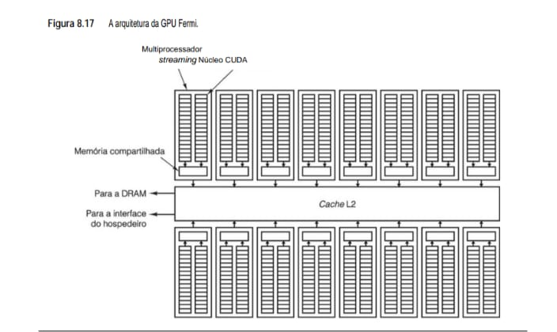

**• Notas Técnicas para o seu eBook:**

 - Núcleos CUDA: Diferente dos núcleos IA-32 complexos do seu Core i7, os núcleos CUDA são unidades simples e eficientes, focadas em cálculos matemáticos pesados. A Fermi possui centenas deles trabalhando em sincronia.

 - Multiprocessadores Streaming (SM): Os núcleos são agrupados em SMs. Cada SM compartilha uma pequena memória local ultrarrápida (Memória Compartilhada), permitindo que os núcleos troquem dados sem precisar acessar a DRAM externa o tempo todo.

 - Cache L2 Unificado: Serve como o ponto central de comunicação entre todos os SMs, a memória de vídeo (DRAM) e o processador principal do seu computador (Interface do Hospedeiro).

Os requisitos de processamento SIMD dentro dos SMs impõem restrições sobre o tipo de código que os programadores podem executar sobre essas unidades. De fato, cada núcleo CUDA precisa estar rodando o mesmo código em sincronismo para alcançar 16 operações ao mesmo tempo. Para aliviar esse peso ao programador, a
NVIDIA desenvolveu a linguagem de programação CUDA, a qual especifica o paralelismo do programa usando threads. Threads são então agrupados em blocos, designados a processadores streaming. Desde que cada thread em um bloco execute exatamente a mesma sequência de código (ou seja, todos os desvios tomem a mesma decisão), até 16 operações serão executadas em simultâneo (supondo que haja 16 threads prontos para executar). Quando os threads em um SM tomarem decisões de desvio diferentes, haverá um efeito de diminuição de desempenho, denominado divergência de desvio, forçando os threads com caminhos de código diferentes a serem executados de modo serial no SM. A divergência de desvio reduz o paralelismo e atrasa o processamento da GPU. Felizmente, há uma grande faixa de atividades no processamento gráfico e de imagens, que poderá evitar a divergência de desvio e alcançar bons ganhos de velocidade. Também muitos outros códigos se beneficiaram da arquitetura no estilo SIMD sobre processadores gráficos, como imagens médicas, resolução de prova, previsão financeira e análise de gráficos. Essa ampliação das aplicações em potencial para GPUs lhes deu o novo apelido de GPGPUs (General-Purpose Graphics Processing Units – unidades de processamento gráfico de uso geral).

Com 512 núcleos CUDA, a GPU Fermi pararia sem uma largura de banda de memória significativa. Para fornecer essa largura de banda, a GPU Fermi implementa uma hierarquia de memória moderna, conforme ilustrado na Figura 8.18. Todos os SMs têm uma memória compartilhada dedicada e uma cache de dados nível 1 privada. A memória compartilhada dedicada é endereçada diretamente pelos núcleos CUDA, e oferece compartilhamento rápido de dados entre threads dentro de um único SM. A cache de nível 1 agiliza os acessos aos dados da DRAM. Para acomodar a grande variedade de uso dos dados do programa, os SMs podem ser configurados com memória compartilhada de 16 KB e cache nível 1 de 48 KB ou memória compartilhada de 48 KB e cache nível 1 de 16 KB. Todos os SMs compartilham uma única cache nível 2 de 768 KB. A cache nível 2 oferece acesso mais rápido aos dados da DRAM que não couberem nas de nível 1. A cache nível 2 também oferece compartilhamento entre SMs, embora esse modo seja muito mais lento do que o que ocorre dentro da memória compartilhada de um SM. Além da cache nível 2 está a DRAM, que mantém os dados restantes, imagens e texturas, usados por programas rodando na GPU Fermi. Programas eficientes tentarão evitar o acesso à DRAM a todo custo, pois um único acesso pode levar centenas de ciclos para concluir.

**• Figura 8.18 - Hierarquia de memória da GPU Fermi.**

       +---------------------------------------------+
       |                  THREADS                    |
       +---------------------------------------------+
               |              |              |
       +-------v-------+  +---v-----------+  +-------v-------+
       |    Memória    |  |    Memória    |  |     Cache     |
       | Compartilhada |  | Compartilhada |  |     L1 de     |
       |    de 16 KB   |  | de 48 KB ou   |  |     16 KB     |
       |               |  |   cache L1    |  |               |
       +-------+-------+  +-------+-------+  +-------+-------+
               |                  |                  |
               +------------------v------------------+
                                  |
               +-------------------------------------+
               |          CACHE L2 de 768 KB         |
               +-------------------------------------+
                                  |
               +-------------------------------------+
               |                 DRAM                |
               +-------------------------------------+

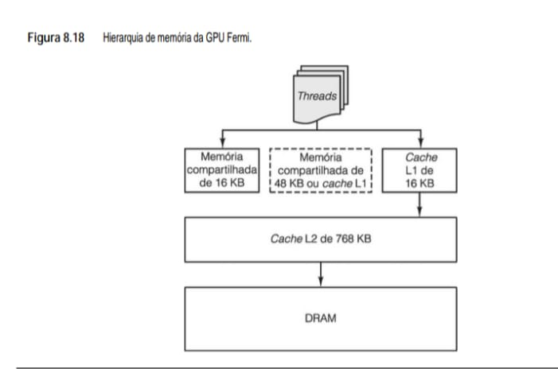

**• Resumo Técnico para o seu eBook**

 - Flexibilidade de Memória: O bloco central tracejado na figura original indica que os 64 KB de memória local podem ser configurados pelo programador: ou como 48 KB de Memória Compartilhada (gerenciada por software) e 16 KB de Cache L1 (gerenciada por hardware), ou o contrário.

 - Localização dos Dados: A Memória Compartilhada e o Cache L1 residem dentro dos Multiprocessadores Streaming (SM), garantindo que as threads tenham acesso quase instantâneo aos dados mais usados.

 - Interface com o Sistema: O Cache L2 de 768 KB é o ponto de encontro para todas as requisições de memória que não puderam ser resolvidas localmente, servindo de ponte para a DRAM (memória de vídeo principal).

Para um programador esperto, a GPU Fermi representa, em termos de computação, uma das plataformas mais capazes que já foram criadas. Uma única GPU GTX 580 baseada em Fermi rodando a 772 MHz com 512 núcleos CUDA pode alcançar uma taxa de computação sustentada de 1,5 teraflop, consumindo 250 watts de potência. Essa estatística é ainda mais impressionante quando se considera que o preço de varejo de uma GPU GTX 580 é menor que 600 dólares. Por questão de comparação histórica, em 1990, o computador mais rápido do mundo, o Cray-2, tinha um desempenho de 0,002 teraflop e um preço (em dólares ajustados pela inflação) de 30 milhões de dólares. Ele também preenchia uma sala de tamanho modesto e vinha com um sistema de resfriamento líquido para dissipar os 150 kW de potência que consumia. O GTX 580 tem 750 vezes mais potência para 1/50.000 do preço, enquanto consome 1/600 dessa energia. Não é um mau negócio.

## 8.2.3 Criptoprocessadores
Uma terceira área na qual os coprocessadores são populares é segurança, em especial segurança em redes. Quando uma conexão é estabelecida entre um cliente e um servidor, em muitos casos eles devem primeiro se autenticar mutuamente. Então, é preciso estabelecer uma conexão segura e criptografada entre eles, para que os
dados sejam transferidos com segurança, frustrando quaisquer bisbilhoteiros que poderiam estar invadindo a linha.

O problema da segurança é que, para consegui-la, é preciso usar criptografia, a qual faz uso muito intensivo de computação. Há dois tipos gerais de criptografia, denominados criptografia de chave simétrica e criptografia de chave pública. A primeira é baseada na mistura completa de bits, algo equivalente a jogar uma mensagem dentro de um liquidificador. A última é baseada em multiplicação e exponenciação de grandes números (por exemplo, 1.024 bits) e consome enormes quantidades de tempo.

Para tratar da computação necessária para criptografar os dados com segurança para transmissão ou armazenamento, várias empresas produziram coprocessadores criptográficos, às vezes na forma de placas de expansão para barramento PCI. Esses coprocessadores têm um hardware especial que os habilita a executar a criptografia necessária muito mais rápido do que poderia uma CPU comum. Infelizmente, uma discussão detalhada do modo de funcionamento dos criptoprocessadores exigiria, primeiro, explicar muita coisa sobre a criptografia em si, o que está fora do escopo deste livro. Se o leitor desejar mais informações sobre coprocessadores criptográficos, pode consultar Gaspar et al., 2010; Haghighizadeh et al., 2010; e Shoufan et al., 2011.

## 8.3 Multiprocessadores de memória compartilhada
Agora já vimos como se pode acrescentar paralelismo a chips únicos e a sistemas individuais adicionando um coprocessador. A próxima etapa é ver como múltiplas CPUs totalmente desenvolvidas podem ser combinadas para formar sistemas maiores. Sistemas com várias CPUs podem ser divididos em multiprocessadores e multicom-
putadores. Após vermos com atenção o que esses termos de fato significam, estudaremos primeiro multiprocessadores e, em seguida, multicomputadores.

## 8.3.1 Multiprocessadores versus multicomputadores
Em qualquer sistema de computação paralelo, CPUs que trabalham em partes diferentes do mesmo serviço devem se comunicar umas com as outras para trocarinformações. O modo exato como elas devem fazer isso é assunto de muito debate na comunidade da arquitetura de computadores. Dois projetos distintos foram propostos e implementados: multiprocessadores e multicomputadores. A diferença fundamental entre os dois é a presença ou  ausência de memória compartilhada. Essa diferença interfere no modo como são projetados, construídos e programados, bem como em sua escala e preço.

**• Multiprocessadores** 
Um computador paralelo no qual todas as CPUs compartilham uma memória comum é denominado um multiprocessador, como indicado simbolicamente na Figura 8.19. Todos os processos que funcionam juntos em um multiprocessador podem compartilhar um único espaço de endereço virtual mapeado para a memória comum. Qualquer processo pode ler ou escrever uma palavra de memória apenas executando uma instrução LOAD ou STORE. Nada mais é preciso. O hardware faz o resto. Dois processos podem se comunicar pelo simples ato de um deles escrever dados para a memória e o outro os ler de volta.

A capacidade de dois (ou mais) processos se comunicarem apenas lendo e escrevendo na memória é a razão por que os multiprocessadores são populares. É um modelo fácil de entender pelos programadores e é aplicável a uma ampla faixa de problemas. Considere, por exemplo, um programa que inspeciona uma imagem de mapa de bits
e relaciona todos os objetos ali encontrados. Uma cópia da imagem é mantida na memória, como mostra a Figura 8.19(b). Cada uma das 16 CPUs executa um único processo, ao qual foi designada uma das 16 seções a analisar. Não obstante, cada processo tem acesso à imagem inteira, que é essencial, visto que alguns objetos podem ocupar várias seções. Se um processo descobrir que um de seus objetos se estende para além da fronteira de uma seção, ele apenas segue o objeto na próxima seção lendo as palavras dessa seção. Nesse exemplo, alguns objetos serão descobertos por vários processos, portanto, é preciso certa coordenação no final para determinar quantas casas, árvores e aviões há.

Como todas as CPUs em um multiprocessador veem a mesma imagem de memória, há somente uma cópia do sistema operacional. Por conseguinte, há somente um mapa de páginas e uma tabela de processos. Quando um processo bloqueia, sua CPU salva seu estado nas tabelas do sistema operacional e então consulta essas tabelas
para achar outro processo para executar. É essa imagem de único sistema que distingue um multiprocessador de um multicomputador, no qual cada computador tem sua própria cópia do sistema operacional.

**• Figura 8.19 - (a) Multiprocessador com 16 CPUs que compartilham uma memória comum. (b) Imagem repartida em 16 seções, cada qual analisada por uma CPU diferente.**
A Figura 8.19, que ilustra o conceito de multiprocessadores com memória compartilhada e a técnica de decomposição de tarefas.

    (a) Multiprocessador com 16 CPUs          (b) Decomposição de Imagem 
            em Memória Compartilhada                  (Processamento Paralelo)

                [P] [P] [P] [P]                           [P] [P] [P] [P]
                |   |   |   |                             |   |   |   |
        [P]--+-----------------+--[P]             [P]--+-------------+--[P]
             |                 |                       |  ✈ |   | ☼  |
        [P]--|     MEMÓRIA     |--[P]             [P]--|----+---+----|--[P]
             |  COMPARTILHADA  |                       |    |   | ☁  |
        [P]--|                 |--[P]             [P]--|----+---+----|--[P]
             |                 |                       | 🚶 | 🌳| 🏠 |
        [P]--+-----------------+--[P]             [P]--+-------------+--[P]
                |   |   |   |                             |   |   |   |
                [P] [P] [P] [P]                           [P] [P] [P] [P]

        (P = Unidade de Processamento / CPU)

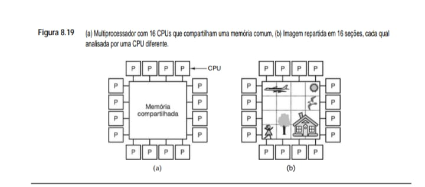

**• Notas Técnicas para o seu eBook:**

 - Modelo de Memória (a): Representa um sistema onde todas as 16 CPUs têm acesso direto a um único espaço de endereçamento global (Memória Compartilhada). Isso facilita a programação, pois as threads podem trocar dados simplesmente escrevendo em endereços de memória conhecidos.

 - Paralelismo de Dados (b): Mostra uma aplicação prática onde uma imagem complexa é dividida em 16 seções independentes. Cada CPU processa uma "peça" do quebra-cabeça simultaneamente, o que reduz drasticamente o tempo total de execução comparado a um processador único.

 - Aplicações Reais: Este é o princípio usado em algoritmos de renderização de vídeo e também no processamento de pacotes em larga escala, onde diferentes fluxos de dados podem ser analisados por núcleos distintos, como no hardware que vimos na Figura 8.16.

Um multiprocessador, como todos os computadores, deve ter dispositivos de E/S, como discos, adaptadores de rede e outros equipamentos. Em alguns sistemas multiprocessadores, somente certas CPUs têm acesso aos dispositivos de E/S e, por isso, têm uma função de E/S especial. Em outros, cada CPU tem igual acesso a
todo dispositivo de E/S. Quando cada CPU tem igual acesso a todos os módulos de memória e a todos os dispositivos de E/S e é tratada pelo sistema operacional como intercambiável com as outras, o sistema é denominado SMP (Symmetric MultiProcessor – multiprocessador simétrico).

**• Multicomputadores**
O segundo projeto possível para uma arquitetura paralela é um projeto no qual toda CPU tem sua própria memória privada, acessível somente a ela mesma e a nenhuma outra. Esse projeto é denominado multicomputador ou, às vezes, sistema de memória distribuída, e é ilustrado na Figura 8.20(a). O aspecto fundamental de um multicomputador que o distingue de um multiprocessador é que a CPU em um multicomputador tem sua própria memória local privada, a qual pode acessar apenas executando instruções LOAD e STORE, mas que nenhuma outra CPU pode acessar usando instruções LOAD e STORE. Assim, multiprocessadores têm um único espaço de endereço físico com- partilhado por todas as CPUs, ao passo que multicomputadores têm um espaço de endereço físico para cada CPU.

**• Figura 8.20 - (a) Multicomputador com 16 CPUs, cada uma com sua própria memória privada. (b) Imagem de mapa de bits da figura 8.19 dividida entre as 16** memórias.

    (a) Multicomputador com 16 CPUs           (b) Imagem de Mapa de Bits
            e Memórias Privadas (M)                   Dividida entre as Memórias

                [M] [M] [M] [M]                           [  ] [  ] [  ] [☼ ]
                |   |   |   |                             |   |   |   | 
                [P] [P] [P] [P]                           [P] [P] [P] [P]
                |   |   |   |                             |   |   |   | 
        [M]-[P]-+-----------+-[P]-[M]             [  ]-[P]-+-----------+-[P]-[  ]
                |  REDE DE  |                             |           | 
        [M]-[P]-| INTERCON. |--[P]-[M]           [  ]-[P]-|   REDE    |--[P]-[🧱]
                |           |                             |           | 
        [M]-[P]-|   TROCA   |--[P]-[M]           [🕊]-[P]-|           |--[P]-[🛣️]
                | MENSAGENS |                             |           | 
        [M]-[P]-+-----------+-[P]-[M]            [  ]-[P]-+-----------+-[P]-[🛤️]
                |   |   |   |                             |   |   |   | 
                [P] [P] [P] [P]                           [P] [P] [P] [P]
                |   |   |   |                             |   |   |   | 
                [M] [M] [M] [M]                           [🚶] [🌳] [🏠] [🏢]

        (P = CPU | M = Memória Privada)

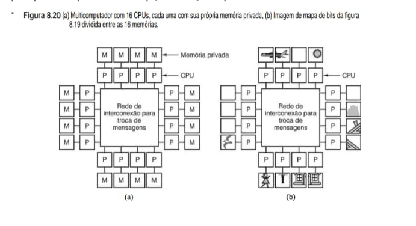

**• Notas Técnicas para o seu eBook:**

 - Arquitetura de Memória Privada (a): Diferente dos multiprocessadores, aqui cada CPU (P) possui sua própria memória local (M) exclusiva. A comunicação entre os nós não ocorre por endereços globais, mas sim através de uma Rede de Interconexão que utiliza troca de mensagens (message passing).

 - Distribuição do Mapa de Bits (b): Na prática de processamento de imagens, cada parte da figura (como o sol, a casa ou a árvore) é armazenada fisicamente em uma memória diferente. Se a CPU que processa a "casa" precisar de dados sobre o "sol", ela deve solicitar explicitamente via rede.

 - Escalabilidade: Este modelo é a base para grandes clusters de servidores e sistemas de computação em nuvem, pois é mais fácil adicionar novos nós (CPU + Memória) sem criar gargalos no acesso a uma memória central única.

Uma vez que as CPUs em um multicomputador não podem se comunicar apenas lendo e escrevendo na memória comum, elas precisam de um mecanismo de comunicação diferente. O que elas fazem é passar mensagens uma para outra usando a rede de interconexão. Entre os exemplos de multicomputadores podemos citar o IBM BlueGene/L, o Red Storm e o cluster Google.

A ausência de memória compartilhada em hardware em um multicomputador tem importantes implicações para a estrutura do software. Ter um único espaço de endereço virtual do qual e para o qual todos os processos podem ler e escrever de e para toda a memória apenas executando instruções LOAD e STORE é impossível em um
multicomputador. Por exemplo, se a CPU 0 (a que está no canto superior esquerdo) da Figura 8.19(b) descobrir que parte de seu objeto se estende até a seção designada à CPU 1, ainda assim ela continua a ler memória para acessar a cauda do avião. Por outro lado, se a CPU 0 da Figura 8.20(b) fizer a mesma descoberta, ela não pode simplesmente ler a memória da CPU. Em vez disso, ela precisa fazer algo bem diferente para obter os dados de que necessita.

Em particular, ela tem de descobrir (de algum modo) qual CPU tem os dados de que precisa e enviar a essa CPU uma mensagem requisitando uma cópia dos dados. Em seguida, normalmente ela bloqueará até que a requisição seja atendida. Quando a mensagem chegar à CPU 1, o software ali presente tem de analisá-la e enviar os dados necessários. Quando a mensagem de resposta voltar à CPU 0, o software é desbloqueado e pode continuar a executar.

Em um multicomputador, a comunicação entre processos costuma usar primitivas de software como send e receive. Isso dá ao software uma estrutura diferente e muito mais complicada do que para um multiprocessador. Também significa que subdividir os dados corretamente e posicioná-los em localizações ótimas é uma questão
importante. Não é tão fundamental em um multiprocessador, visto que o posicionamento não afeta a correção ou a programabilidade, embora possa impactar o desempenho. Em suma, programar um multicomputador é muito mais difícil do que programar um multiprocessador.

Nessas condições, por que alguém construiria multicomputadores, quando multiprocessadores são mais fáceis de programar? A resposta é fácil: é muito mais simples e mais barato construir grandes multicomputadores do que multiprocessadores com o mesmo número de CPUs. Executar uma memória compartilhada, ainda que seja para algumas centenas de CPUs, é uma empreitada substancial, ao passo que construir um multicomputador com 10 mil CPUs, ou mais, é direto. Mais adiante neste capítulo estudaremos um multicomputador com mais de 50 mil CPUs.

Portanto, temos um dilema: multiprocessadores são difíceis de construir, mas fáceis de programar, enquanto multicomputadores são fáceis de construir, mas difíceis de programar. Essa observação gerou muito esforço para construir sistemas híbridos que são relativamente fáceis de construir e relativamente fáceis de programar. Esse trabalho levou à percepção de que a memória compartilhada pode ser executada de vários modos, cada qual com seu próprio conjunto de vantagens e desvantagens. Na verdade, grande parte da pesquisa atual na área de arquiteturas paralelas está relacionada à convergência entre arquiteturas de multiprocessador e multicomputador para formas híbridas que combinam as forças de cada uma. Nesse caso, o Santo Graal é achar projetos que sejam escaláveis, isto é, que continuem a funcionar bem à medida que mais e mais CPUs sejam adicionadas.

Uma técnica para a construção de sistemas híbridos é baseada no fato de que sistemas de computação modernos não são monolíticos, mas construídos como uma série de camadas – o tema deste livro. Essa percepção abre a possibilidade de implementar memória compartilhada em qualquer uma das várias camadas, como ilustra a Figura 8.21. Na Figura 8.21(a), vemos a memória compartilhada executada pelo hardware como um verdadeiro multiprocessador. Nesse projeto, há uma única cópia do sistema operacional com um único conjunto de tabelas, em particular, a tabela de alocação de memória. Quando um processo precisa de mais memória, recorre ao sistema operacional, que então procura em sua tabela uma página livre e mapeia a página para o espaço de endereço do processo chamador. No que concerne ao sistema operacional, há uma única memória, e ele monitora em software qual processo possui qual página. Há muitos modos de implementar memória compartilhada em hardware, como veremos mais adiante.

**• Figura 8.21 - Várias camadas onde a memória compartilhada pode ser implementada. (a) Hardware. (b) Sistema operacional. (c) Sistema de execução da linguagem.**
    (a) Hardware             (b) Sistema Operacional   (c) Sistema de Execução
                                                            da Linguagem

     Máquina 1  Máquina 2      Máquina 1  Máquina 2      Máquina 1    Máquina 2
    +---------++---------+    +---------++---------+    +---------+  +---------+
    | Aplica. || Aplica. |    | Aplica. || Aplica. |    | Aplica. |  | Aplica. |
    +---------++---------+    +---------++---------+    +---------+  +---------+
    | Sist. de|| Sist. de|    | Sist. de|| Sist. de|    | Sist. de|  | Sist. de|
    | Execuç. || Execuç. |    | Execuç. || Execuç. |    | Execuç. |==| Execuç. |
    +---------++---------+    +---------++---------+    +---------+  +---------+
    | Sistema || Sistema |    | Sistema || Sistema |    | Sistema |  | Sistema |
    | Operac. || Operac. |    | Operac. || Operac. |    | Operac. |  | Operac. |
    +---------++---------+    +---------++---------+    +---------+  +---------+
    | Hardware|| Hardware|    | Hardware|| Hardware|    | Hardware|  | Hardware|
    +----+----++----+----+    +----+----++----+----+    +---------+  +---------+
         |          |              |          |              ^            ^
    [ MEMÓRIA COMPART. ]      [ MEMÓRIA COMPART. ]      [ MEMÓRIA COMPARTILHADA ]

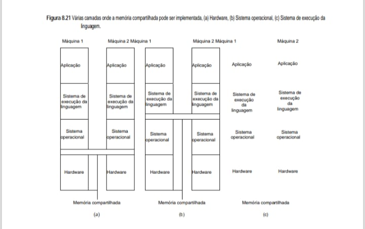

**• Análise Técnica para o eBook**

 - Esta figura é fundamental para entender como diferentes arquiteturas de computação distribuída simulam um ambiente de memória única entre máquinas distintas:

 - Implementação em Hardware (a): A memória compartilhada é física. Os processadores estão conectados diretamente ao mesmo barramento ou rede de memória, como vimos nos multiprocessadores da Figura 8.19.

 - Implementação no Sistema Operacional (b): O kernel do SO gerencia a ilusão de memória compartilhada. Ele intercepta falhas de página e busca os dados em outras máquinas via rede, de forma transparente para a aplicação.

 - Implementação no Sistema de Execução (c): Bibliotecas ou o próprio "runtime" da linguagem (como a JVM ou o runtime de C#) gerenciam a consistência dos dados. É comum em sistemas que utilizam objetos compartilhados em vez de endereços de memória brutos.

Uma segunda possibilidade é usar hardware de multicomputador e fazer com que o sistema operacional simule memória compartilhada proporcionando um único espaço de endereço virtual de compartilhamento de páginas no âmbito do sistema inteiro. Nessa técnica, denominada DSM (Distributed Shared Memory – memória compartilhada distribuída) (Li e Hudak, 1989), cada página está localizada em uma das memórias da Figura 8.20(a). Cada máquina tem memória virtual e tabelas de páginas próprias. Quando uma CPU faz uma LOAD ou uma STORE em uma página que ela não tem, ocorre uma exceção para o sistema operacional. Este, então, localiza
a página e solicita à CPU que a contém no momento que desmapeie a página e a envie pela interconexão de rede. Quando chega, a página é mapeada para dentro e a instrução que falhou é reiniciada. Na verdade, o sistema operacional está apenas atendendo faltas de páginas a partir de memórias remotas em vez de a partir de disco. Para o usuário, parece que a máquina tem memória compartilhada. Examinaremos a DSM mais adiante neste capítulo.

Uma terceira possibilidade é fazer com que um sistema de execução em nível de usuário, possivelmente específico para uma linguagem, execute uma forma de memória compartilhada. Nessa abordagem, a linguagem de programação provê algum tipo de abstração de memória compartilhada, que então é realizada pelo compilador e
pelo sistema de execução. Por exemplo, o modelo Linda é baseado na abstração de um espaço compartilhado de tuplas (registros de dados que contêm uma coleção de campos). Processos em qualquer máquina podem produzir entrada de uma tupla a partir do espaço compartilhado de tuplas ou produzir saída de uma tupla para o espaço compartilhado de tuplas. Como o acesso ao espaço de tuplas é todo controlado em software (pelo sistema de execução Linda), não é preciso nenhum hardware especial ou suporte de sistema operacional.

Outro exemplo de memória compartilhada específica de linguagem executada pelo sistema de execução é o modelo Orca de objetos de dados compartilhados. Em Orca, os processos compartilham objetos genéricos em vez de apenas tuplas e podem executar neles métodos específicos de objetos. Quando um método muda o estado interno de um objeto, cabe ao sistema de execução garantir que todas as cópias do objeto em todas as máquinas sejam atualizadas simultaneamente. Mais uma vez, como objetos são um conceito estritamente de software, a implementação pode ser feita pelo sistema de execução sem ajuda do sistema operacional ou do hardware.
Examinaremos ambos, Linda e Orca, mais adiante neste capítulo.

**• Taxonomia de computadores paralelos**
Agora, vamos voltar a nosso tópico principal, a arquitetura de computadores paralelos. Muitos tipos já foram propostos e construídos ao longo dos anos. Portanto, é natural perguntar se há alguma maneira de categorizá-los em uma taxonomia. Muitos pesquisadores tentaram, com resultados mistos (Flynn, 1972; e Treleaven, 1985). Infelizmente, o Carl von Linné1 da computação paralela ainda está para surgir. O esquema de Flynn, o único que é muito usado, é dado na Figura 8.22, e mesmo este é, na melhor das hipóteses, uma aproximação muito grosseira.

**• Figura 8.22   Taxonomia de Flynn para computadores paralelos**

    +---------------------+--------------- +-------------------------------------------+----------------------------------+
    | Fluxo de Instruções | Fluxo de Dados | Nome                                      | Exemplos                         |
    +---------------------+----------------+-------------------------------------------+----------------------------------+
    | 1                   | 1              | SISD (Single Instruction, Single Data)    | Máquina clássica de Von Neumann  | 
    +---------------------+----------------+----------------------------------------------+-------------------------------+
    | 1                   | Múltiplos      | SIMD (Single Instruction, Multiple Data)  | Supercomputador vetorial,        |
    |                     |                |                                           | processador de array             |
    +---------------------+----------------+-------------------------------------------+----------------------------------+
    | Múltiplos           | 1              | MISD (Multiple Instruction, Single Data)  | Possivelmente nenhum             |
    +---------------------+----------------+-------------------------------------------+----------------------------------+
    | Múltiplos           | Múltiplos      | MIMD (Multiple Instruction, Multiple Data)| Multiprocessador, multicomputador|
    +---------------------+----------------+-------------------------------------------+----------------------------------+

A classificação de Flynn é baseada em dois conceitos – fluxos de instruções e fluxos de dados. Um fluxo de instruções corresponde a um contador de programa. Um sistema com n CPUs tem n contadores de programa, por conseguinte, n fluxos de instruções.

Um fluxo de dados consiste em um conjunto de operandos. Por exemplo, em um sistema de previsão do tempo, cada um de um grande número de sensores poderia emitir um fluxo de temperaturas em intervalos regulares.

Os fluxos de instruções e de dados são, até certo ponto, independentes, portanto, existem quatro combinações, como relacionadas na Figura 8.22. SISD é apenas o clássico computador sequencial de Von Neumann. Ele tem um fluxo de instruções, um fluxo de dados e faz uma coisa por vez. Máquinas SIMD têm uma única unidade
de controle que emite uma instrução por vez, mas elas têm múltiplas ULAs para executá-las em vários conjuntos de dados simultaneamente. O ILLIAC IV (Figura 2.7) é o protótipo de tais máquinas. Elas estão ficando cada vez mais raras, mas computadores convencionais às vezes têm algumas instruções SIMD para processamento
de material audiovisual. As instruções SSE do Core i7 são SIMD. Não obstante, há uma nova área na qual algumas das ideias do mundo SIMD estão desempenhando um papel: processadores de fluxo. Essas máquinas são projetadas especificamente para tratar demandas de entrega de multimídia e podem se tornar importantes no futuro (Kapasi et al., 2003).

As máquinas MISD são uma categoria um tanto estranha, com múltiplas instruções operando no mesmo dado. Não está claro se elas existem, embora haja quem considere MISD as máquinas com pipeline.

Por fim, temos MIMD, que são apenas múltiplas CPUs independentes operando como parte de um sistema maior. A maioria dos processadores paralelos cai nessa categoria. Ambos, multiprocessadores e multicomputadores são máquinas MIMD.

1 - Carl von Linné (1707–1778) foi o biólogo sueco que inventou o sistema usado hoje para classificar todas as plantas e animais em reino, filo,
classe, ordem, família, gênero e espécie.

A taxonomia de Flynn para aqui, mas nós a ampliamos na Figura 8.23. A SIMD foi subdividida em dois sub-grupos. O primeiro é para supercomputadores numéricos e outras máquinas que operam sobre vetores, efetuando a mesma operação em cada elemento do vetor. O segundo é para máquinas do tipo paralelo como ILLIAC IV, na
qual uma unidade mestra de controle transmite instruções para muitas ULAs independentes.

**• Figura 8.23   Taxonomia de computadores paralelos.**