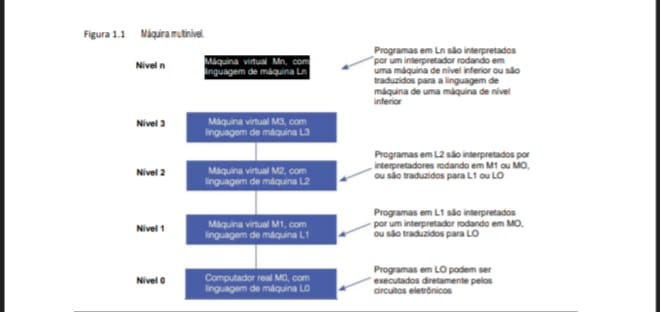
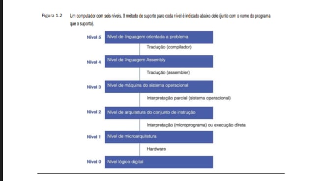
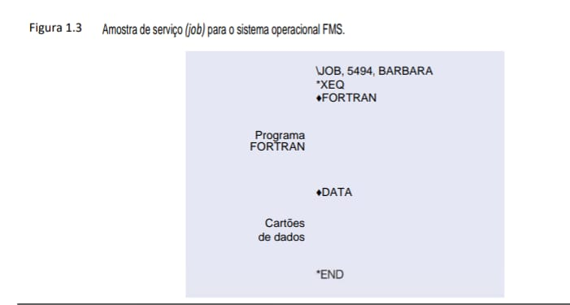
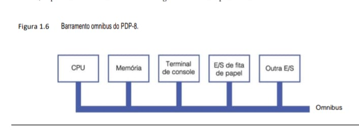
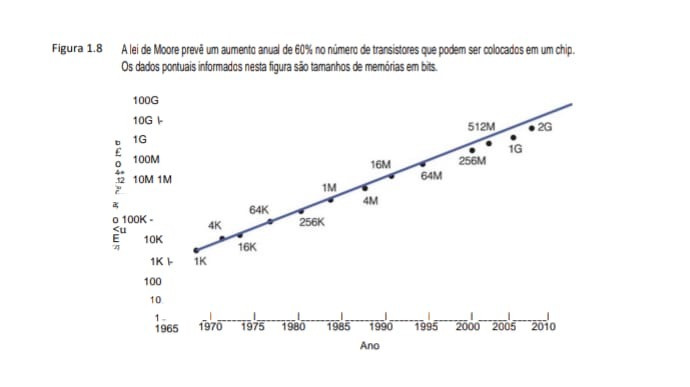
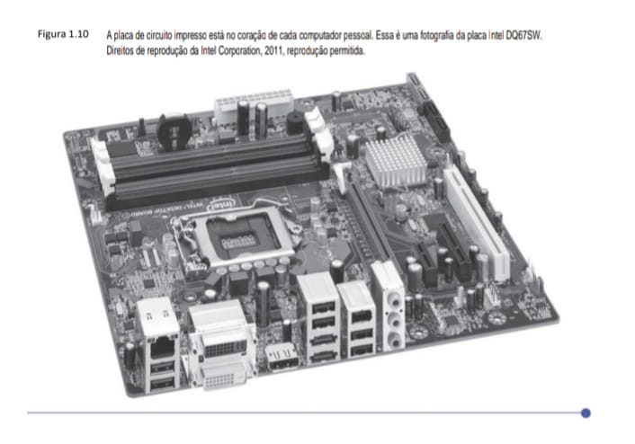
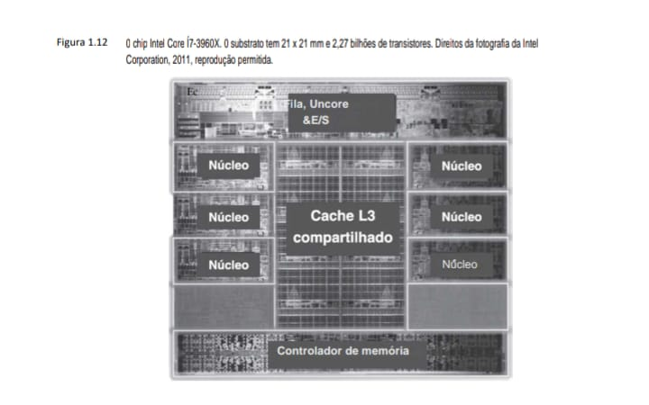
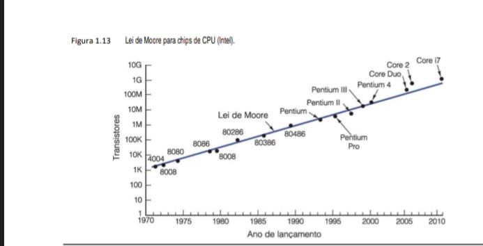
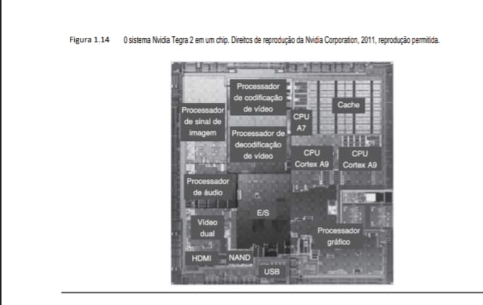

## Introdução

Um computador digital é uma máquina que pode resolver problemas para as pessoas, executando instruções que lhe são dadas. Uma sequência de instruções descrevendo como realizar determinada tarefa é chamada de programa. Os circuitos eletrônicos de cada computador podem reconhecer e executar diretamente um conjunto limitado de instruções simples, para o qual todos os programas devem ser convertidos antes que possam ser executados. Essas instruções básicas raramente são muito mais complicadas do que

    - Some dois números.
    - verifique se um número é zero.
    - Copie dados de uma parte da memória do computador para outra.

Juntas, as instruções primitivas de um computador formam uma linguagem com a qual as pessoas podem se comunicar com ele. Essa linguagem é denominada linguagem de máquina. Quem projeta um novo computador deve decidir quais instruções incluir em sua linguagem de máquina. De modo geral, os projetistas tentam tornar as instruções primitivas as mais simples possíveis, coerentes com os requisitos de utilização e desempenho idealizados para o computador e seus requisitos de desempenho, a fim de reduzir a complexidade e o custo dos circuitos eletrônicos necessários. Como a maioria das linguagens de máquina é muito simples, sua utilização direta pelas pessoas é difícil e tediosa.

Com o passar do tempo, essa observação simples tem levado a uma forma de estruturar os computadores como uma sequência de abstrações, cada uma baseada naquela abaixo dela. Desse modo, a complexidade pode ser dominada e os sistemas de computação podem ser projetados de forma sistemática e organizada. Denominamos essa abordagem organização estruturada de computadores – foi esse o nome dado a este livro. Na seção seguinte, descreveremos o que significa esse termo. Logo após, comentaremos alguns desenvolvimentos históricos, o estado atual da tecnologia e exemplos importantes.

## 1.1 Organização estruturada de computadores
Como já mencionamos, existe uma grande lacuna entre o que é conveniente para as pessoas e o que é conveniente para computadores. As pessoas querem fazer X, mas os computadores só podem fazer Y, o que dá origem a um problema. O objetivo deste livro é explicar como esse problema pode ser resolvido.

## 1.1.1 Linguagens, níveis e máquinas virtuais
O problema pode ser abordado de duas maneiras, e ambas envolvem projetar um novo conjunto de instruções que é mais conveniente para as pessoas usarem do que o conjunto embutido de instruções de máquina. Juntas, essas novas instruções também formam uma linguagem, que chamaremos de L1, assim como as instruções de máquina embutidas formam uma linguagem, que chamaremos de L0. As duas técnicas diferem no modo como os programas escritos em L1 são executados pelo computador que, afinal, só pode executar programas escritos em sua linguagem de máquina, L0.

Um método de execução de um programa escrito em L1 é primeiro substituir cada instrução nele por uma sequên­cia equivalente de instruções em L0. O programa resultante consiste totalmente em instruções L0. O computador, então, executa o novo programa L0 em vez do antigo programa L1. Essa técnica é chamada de tradução.

A outra técnica é escrever um programa em L0 que considere os programas em L1 como dados de entrada e os execute, examinando cada instrução por sua vez, executando diretamente a sequência equivalente de instruções L0. Essa técnica não requer que se gere um novo programa em L0. Ela é chamada de interpretação, e o programa que a executa é chamado de interpretador.

Tradução e interpretação são semelhantes. Nos dois métodos, o computador executa instruções em L1 executando sequências de instruções equivalentes em L0. A diferença é que, na tradução, o programa L1 inteiro primeiro é convertido para um L0, o programa L1 é desconsiderado e depois o novo L0 é carregado na memória do computador e executado. Durante a execução, o programa L0 recém-gerado está sendo executado e está no controle do computador.

Na interpretação, depois que cada instrução L1 é examinada e decodificada, ela é executada de imediato. Nenhum programa traduzido é gerado. Aqui, o interpretador está no controle do computador. Para ele, o programa L1 é apenas dados. Ambos os métodos e, cada vez mais, uma combinação dos dois, são bastante utilizados.

Em vez de pensar em termos de tradução ou interpretação, muitas vezes é mais simples imaginar a existência de um computador hipotético ou máquina virtual cuja linguagem seja L1. Vamos chamar essa máquina virtual de M1 (e de M0 aquela correspondente a L0). Se essa máquina pudesse ser construída de forma barata o suficiente, não seria preciso de forma alguma ter a linguagem L0 ou uma máquina que executou os programas em L0. As pessoas poderiam simplesmente escrever seus programas em L1 e fazer com que o computador os executasse diretamente.
Mesmo que a máquina virtual cuja linguagem é L1 seja muito cara ou complicada de construir com circuitos eletrônicos, as pessoas ainda podem escrever programas para ela. Esses programas podem ser ou interpretados ou traduzidos por um programa escrito em L0 que, por si só, consegue ser executado diretamente pelo computador real. Em outras palavras, as pessoas podem escrever programas para máquinas virtuais, como se realmente existissem.

Para tornar prática a tradução ou a interpretação, as linguagens L0 e L1 não deverão ser “muito” diferentes. Tal restrição significa quase sempre que L1, embora melhor que L0, ainda estará longe do ideal para a maioria das aplicações. Esse resultado talvez seja desanimador à luz do propósito original da criação de L1 – aliviar o trabalho do programador de ter que expressar algoritmos em uma linguagem mais adequada a máquinas do que a pessoas. Porém, a situação não é desesperadora.

A abordagem óbvia é inventar outro conjunto de instruções que seja mais orientado a pessoas e menos orientado a máquinas que a L1. Esse terceiro conjunto também forma uma linguagem, que chamaremos de L2 (e com a máquina virtual M2). As pessoas podem escrever programas em L2 exatamente como se de fato existisse uma máquina real com linguagem de máquina L2. Esses programas podem ser traduzidos para L1 ou executados por um interpretador escrito em L1.

A invenção de toda uma série de linguagens, cada uma mais conveniente que suas antecessoras, pode prosseguir indefinidamente, até que, por fim, se chegue a uma adequada. Cada linguagem usa sua antecessora como base, portanto, podemos considerar um computador que use essa técnica como uma série de camadas ou níveis, um sobre o outro, conforme mostra a Figura 1.1. A linguagem ou nível mais embaixo é a mais simples, e a linguagem ou nível mais em cima é a mais sofisticada.

### Figura 1.1  Máquina multinível.

A Figura 1.1 introduz o conceito fundamental de Máquina Multinível, que é a base para entendermos como o hardware físico (o computador real M_0) suporta camadas cada vez mais abstratas de software (M_1, M_2,...).

A Escala da Máquina Multinível (Figura 1.1)Aqui está a representação de como os programas são traduzidos ou interpretados entre os níveis para que o seu Lenovo IdeaPad entenda o que você digita:

        NÍVEL n  |   Máquina Virtual Mn (Linguagem Ln)
                    |   [ TRADUÇÃO OU INTERPRETAÇÃO ]
                    |           |
        NÍVEL 3  |   Máquina Virtual M3 (Linguagem L3)
                    |   [ INTERPRETAÇÃO POR M2 OU M1 ]
                    |           |
        NÍVEL 2  |   Máquina Virtual M2 (Linguagem L2)
                    |   [ TRADUÇÃO PARA L1 OU L0 ]
                    |           |
        NÍVEL 1  |   Máquina Virtual M1 (Linguagem L1)
                    |   [ INTERPRETAÇÃO POR M0 ]
                    |           |
        NÍVEL 0  |   Computador Real M0 (Linguagem L0)
                    |   [ EXECUÇÃO DIRETA PELOS CIRCUITOS ]
                    

### Insight para seus Projetos: O "Filtro" da Abstração
    Essa estrutura multinível é idêntica ao que discutimos sobre a pedagogia e o TEA:

    - O Nível 0 é como o processamento sensorial (bits de som/luz); é a "decodificação" pura.

    - Os Níveis Superiores são a "compreensão"; é onde os dados brutos ganham sentido lógico para resolver problemas.

    - No seu "Projeto IDS", você trabalha nos níveis superiores, mas seu software só funciona porque as portas lógicas no Nível 0 (como as da Figura 3.61) estão funcionando perfeitamente no seu hardware.

Há uma relação importante entre uma linguagem e uma máquina virtual. Cada máquina tem uma linguagem de máquina, consistindo em todas as instruções que esta pode executar. Com efeito, uma máquina define uma linguagem. De modo semelhante, uma linguagem define uma máquina – a saber, aquela que pode executar todos os programas escritos na linguagem. Claro, pode ser muito complicado e caro construir a máquina definida por determinada linguagem diretamente pelos circuitos eletrônicos, mas, apesar disso, podemos imaginá-la. Uma máquina que tivesse C ou C++ ou Java como sua linguagem seria de fato complexa, mas poderia ser construída usando a tecnologia de hoje. Porém, há um bom motivo para não construir tal computador: ele não seria econômico em comparação com outras técnicas. O mero fato de ser factível não é bom o suficiente: um projeto prático também precisa ser econômico.

De certa forma, um computador com n níveis pode ser visto como n diferentes máquinas virtuais, cada uma com uma linguagem de máquina diferente. Usaremos os termos “nível” e “máquina virtual” para indicar a mesma coisa. Apenas programas escritos na linguagem L0 podem ser executados diretamente pelos circuitos eletrônicos, sem a necessidade de uma tradução ou interpretação intervenientes. Os programas escritos em L1, L2, ..., Ln devem ser interpretados por um interpretador rodando em um nível mais baixo ou traduzidos para outra lingua-
gem correspondente a um nível mais baixo.

Uma pessoa que escreve programas para a máquina virtual de nível n não precisa conhecer os interpretadores e tradutores subjacentes. A estrutura de máquina garante que esses programas, de alguma forma, serão executados. Não há interesse real em saber se eles são executados passo a passo por um interpretador que, por sua vez, também é executado por outro interpretador, ou se o são diretamente pelos circuitos eletrônicos. O mesmo resultado aparece nos dois casos: os programas são executados.

Quase todos os programadores que usam uma máquina de nível n estão interessados apenas no nível superior, aquele que menos se parece com a linguagem de máquina do nível mais inferior. Porém, as pessoas interessadas em entender como um computador realmente funciona deverão estudar todos os níveis. Quem projeta novos computadores ou novos níveis também deve estar familiarizado com outros níveis além do mais alto. Os conceitos e técnicas de construção de máquinas como uma série de níveis e os detalhes dos próprios níveis
formam o assunto principal deste livro.

## 1.1.2 Máquinas multiníveis contemporâneas
A maioria dos computadores modernos consiste de dois ou mais níveis. Existem máquinas com até seis níveis, conforme mostra a Figura 1.2. O nível 0, na parte inferior, é o hardware verdadeiro da máquina. Seus circuitos executam os programas em linguagem de máquina do nível 1. Por razões de precisão, temos que mencionar a existência de outro nível abaixo do nosso nível 0. Esse nível, que não aparece na Figura 1.2 por entrar no domínio da engenharia elétrica (e, portanto, estar fora do escopo deste livro), é chamado de nível de dispositivo. Nele, o projetista vê transistores individuais, que são os primitivos de mais baixo nível para projetistas de computador. Se alguém quiser saber como os transistores funcionam no interior, isso nos levará para o campo da física no estado sólido.

### Figura 1.2 - Um computador com seis níveis. 
O método de suporte para cada nível é indicado abaixo dele (junto com o nome do programa
que o suporta).

### Os 6 Níveis de Abstração (Figura 1.2)

    NÍVEL 5 | Linguagem Orientada ao Problema (Python, JS, C#)
            |   [ TRADUÇÃO: COMPILADOR ]
    NÍVEL 4 | Linguagem Assembly
            |   [ TRADUÇÃO: ASSEMBLER ]
    NÍVEL 3 | Máquina do Sistema Operacional (Linux Ubuntu 24.04)
            |   [ INTERPRETAÇÃO PARCIAL: SO ]
    NÍVEL 2 | Arquitetura do Conjunto de Instruções (ISA - x86, ARM)
            |   [ INTERPRETAÇÃO: MICROPROGRAMA ]
    NÍVEL 1 | Microarquitetura (Caminho de Dados, ALU)
            |   [ HARDWARE ]
    NÍVEL 0 | Nível Lógico Digital (Portas AND, OR, NAND)

### Insight para o seu repositório estruturas_de_dados
    Este modelo explica por que você consegue programar em C ou JS sem precisar desenhar portas lógicas a cada linha de código:

    - Cada nível oferece uma Interface para o nível superior, escondendo a complexidade de baixo.

    - É exatamente o que acontece no aprendizado do aluno com TEA: quando ele domina a "decodificação" (Nível 0/1), ele consegue subir para a "compreensão" (Nível 5).

    - Se você estiver depurando o seu "Projeto IDS" e encontrar um erro de segmentação, você está basicamente vendo um conflito entre o Nível 5 (seu código) e o Nível 3 (como o SO gerencia o mapa de memória da Figura 3.60).

No nível mais baixo que estudaremos, o nível lógico digital, os objetos interessantes são chamados de portas (ou gates). Embora montadas a partir de componentes analógicos, como transistores, podem ser modeladas com precisão como dispositivos digitais. Cada porta tem uma ou mais entradas digitais (sinais representando 0 ou 1) e calcula como saída alguma função simples dessas entradas, como AND (E) ou OR (OU). Cada porta é composta de no máximo alguns transistores. Um pequeno número de portas podem ser combinadas para formar uma memória de 1 bit, que consegue armazenar um 0 ou um 1. As memórias de 1 bit podem ser combinadas em grupos de (por exemplo) 16, 32 ou 64 para formar registradores. Cada registrador pode manter um único número binário até algum máximo. As portas também podem ser combinadas para formar o próprio mecanismo de computação principal. Examinaremos as portas e o nível lógico digital com detalhes no Capítulo 3.

O próximo nível acima é o nível de microarquitetura. Aqui, vemos uma coleção de (em geral) 8 a 32 registradores que formam uma memória local e um circuito chamado ULA – Unidade Lógica e Artitmética (em inglês Arithmetic Logic Unit), que é capaz de realizar operações aritméticas simples. Os registradores estão conectados à ULA para formar um caminho de dados, sobre o qual estes fluem. A operação básica do caminho de dados consiste em selecionar um ou dois registradores, fazendo com que a ULA opere sobre eles (por exemplo, somando-os) e armazenando o resultado de volta para algum registrador.

Em algumas máquinas, a operação do caminho de dados é controlada por um programa chamado microprograma. Em outras, o caminho de dados é controlado diretamente pelo hardware. Nas três primeiras edições deste livro, chamamos esse nível de “nível de microprogramação”, pois no passado ele quase sempre era um interpretador de software. Como o caminho de dados agora quase sempre é (em parte) controlado diretamente
pelo hardware, mudamos o nome na quarta edição.

Em máquinas com controle do caminho de dados por software, o microprograma é um interpretador para as instruções no nível 2. Ele busca, examina e executa instruções uma por vez, usando o caminho de dados. Por exemplo, para uma instrução ADD, a instrução seria buscada, seus operandos localizados e trazidos para registradores, a soma calculada pela ULA e, por fim, o resultado retornado para o local a que pertence. Em uma máquina com controle do caminho de dados por hardware, haveria etapas semelhantes, mas sem um programa armazenado
explícito para controlar a interpretação das instruções desse nível.

Chamaremos o nível 2 de nível de arquitetura do conjunto de instrução, ou nível ISA (Instruction Set Architecture). Os fabricantes publicam um manual para cada computador que vendem, intitulado “Manual de Referência da Linguagem de Máquina”, ou “Princípios de Operação do Computador Western Wombat Modelo 100X”, ou algo semelhante. Esses manuais, na realidade, referem-se ao nível ISA, e não aos subjacen-
tes. Quando eles explicam o conjunto de instruções da máquina, na verdade estão descrevendo as instruções executadas de modo interpretativo pelo microprograma ou circuitos de execução do hardware. Se um fabricante oferecer dois interpretadores para uma de suas máquinas, interpretando dois níveis ISA diferentes, ele oferecer dois manuais de referência da “linguagem de máquina”, um para cada interpretador.

O próximo nível costuma ser híbrido. A maior parte das instruções em sua linguagem também está no nível ISA. (Não há motivo pelo qual uma instrução que aparece em um nível não possa estar presente também em outros.) Além disso, há um conjunto de novas instruções, uma organização de memória diferente, a capacidade de executar dois ou mais programas simultaneamente e diversos outros recursos. Existe mais variação entre os projetos de nível 3 do que entre aqueles no nível 1 ou no nível 2.

As novas facilidades acrescentadas no nível 3 são executadas por um interpretador rodando no nível 2, o qual, historicamente, tem sido chamado de sistema operacional. Aquelas instruções de nível 3 que são idênticas às do nível 2 são executadas direto pelo microprograma (ou controle do hardware), e não pelo sistema operacional. Em outras palavras, algumas das instruções de nível 3 são interpretadas pelo sistema operacional e algumas o são diretamente pelo microprograma. É a isso que chamamos de nível “híbrido”. No decorrer deste livro, nós o chamaremos de nível de máquina do sistema operacional.

Há uma quebra fundamental entre os níveis 3 e 4. Os três níveis mais baixos não servem para uso do programador do tipo mais comum. Em vez disso, eles são voltados principalmente para a execução dos interpretadores e tradutores necessários para dar suporte aos níveis mais altos. Esses interpretadores e tradutores são escritos pelos programadores de sistemas, profissionais que se especializam no projeto e execução de novas máquinas virtuais. Os níveis 4 e acima são voltados para o programador de aplicações, que tem um problema para solucionar.

Outra mudança que ocorre no nível 4 é o método de suporte dos níveis mais altos. Os níveis 2 e 3 são sempre interpretados. Em geral, mas nem sempre, os níveis 4, 5 e acima são apoiados por tradução.

Outra diferença entre níveis 1, 2 e 3, por um lado, e 4, 5 e acima, por outro, é a natureza da linguagem fornecida. As linguagens de máquina dos níveis 1, 2 e 3 são numéricas. Os programas nessas linguagens consistem em uma longa série de números, muito boa para máquinas, mas ruim para as pessoas. A partir do nível 4, as linguagens contêm palavras e abreviações cujo significado as pessoas entendem.

O nível 4, o da linguagem de montagem (assembly), na realidade é uma forma simbólica para uma das linguagens subjacentes. Esse nível fornece um método para as pessoas escreverem programas para os níveis 1, 2 e 3 em uma forma que não seja tão desagradável quanto às linguagens de máquina virtual em si. Programas em linguagem de montagem são primeiro traduzidos para linguagem de nível 1, 2 ou 3, e em seguida interpretados pela máquina virtual ou real adequada. O programa que realiza a tradução é denominado assembler.

O nível 5 normalmente consiste em linguagens projetadas para ser usadas por programadores de aplicações que tenham um problema a resolver. Essas linguagens costumam ser denominadas linguagens de alto nível. Existem literalmente centenas delas. Algumas das mais conhecidas são C, C++, Java, Perl, Python e PHP. Programas escritos nessas linguagens em geral são traduzidos para nível 3 ou nível 4 por tradutores conhecidos como compiladores, embora às vezes sejam interpretados, em vez de traduzidos. Programas em Java, por exemplo, costumam ser primeiro traduzidos para uma linguagem semelhante à ISA denominada código de bytes Java, ou bytecode Java, que é então interpretada.

Em alguns casos, o nível 5 consiste em um interpretador para o domínio de uma aplicação específica, como matemática simbólica. Ele fornece dados e operações para resolver problemas nesse domínio em termos que pessoas versadas nele possam entendê-lo com facilidade.

Resumindo, o aspecto fundamental a lembrar é que computadores são projetados como uma série de níveis, cada um construído sobre seus antecessores. Cada nível representa uma abstração distinta na qual estão presentes diferentes objetos e operações. Projetando e analisando computadores desse modo, por enquanto podemos dispensar detalhes irrelevantes e assim reduzir um assunto complexo a algo mais fácil de entender.

O conjunto de tipos de dados, operações e características de cada nível é denominado arquitetura. Ela trata dos aspectos que são visíveis ao usuário daquele nível. Características que o programador vê, como a quantidade de memória disponível, são parte da arquitetura. Aspectos de implementação, como o tipo da tecnologia usada para executar a memória, não são parte da arquitetura. O estudo sobre como projetar as partes de um sistema de computador que sejam visíveis para os programadores é denominado arquitetura de computadores. Na prática, contudo, arquitetura de computadores e organização de computadores significam basicamente a mesma coisa.

## 1.1.3 Evolução de máquinas multiníveis
Para colocar as máquinas multiníveis em certa perspectiva, examinaremos rapidamente seu desenvolvimento histórico, mostrando como o número e a natureza dos níveis evoluíram com o passar dos anos. Programas escritos em uma verdadeira linguagem de máquina (nível 1) de um computador podem ser executados diretamente pelos circuitos eletrônicos (nível 0) do computador, sem qualquer interpretador ou tradutor interveniente. Esses circuitos eletrônicos, junto com a memória e dispositivos de entrada/saída, formam o hardware do computador.
Este consiste em objetos tangíveis – circuitos integrados, placas de circuito impresso, cabos, fontes de alimentação, memórias e impressoras – em vez de ideias abstratas, algoritmos ou instruções.

Por outro lado, o software consiste em algoritmos (instruções detalhadas que dizem como fazer algo) e suas representações no computador – isto é, programas. Eles podem ser armazenados em disco rígido, CD-ROM, ou outros meios, mas a essência do software é o conjunto de instruções que compõe os programas, e não o meio físico no qual estão gravados.

Nos primeiros computadores, a fronteira entre hardware e software era nítida. Com o tempo, no entanto, essa fronteira ficou bastante indistinta, principalmente por causa da adição, remoção e fusão de níveis à medida que os computadores evoluíam. Hoje, muitas vezes é difícil distingui-la (Vahid, 2003). Na verdade, um tema central deste livro é
    Hardware e software são logicamente equivalentes.

Qualquer operação executada por software também pode ser embutida diretamente no hardware, de preferência após ela ter sido suficientemente bem entendida. Como observou Karen Panetta: “Hardware é apenas software petrificado”. Claro que o contrário é verdadeiro: qualquer instrução executada em hardware também pode ser simulada em software. A decisão de colocar certas funções em hardware e outras em software é baseada em fatores como custo, velocidade, confiabilidade e frequência de mudanças esperadas. Existem poucas regras rigorosas e
imutáveis para determinar que X deva ser instalado no hardware e Y deva ser programado explicitamente. Essas decisões mudam com as tendências econômicas, com a demanda e com a utilização de computadores.

### A invenção da microprogramação
Os primeiros computadores digitais, na década de 1940, tinham apenas dois níveis: o nível ISA, no qual era feita toda a programação, e o nível lógico digital, que executava esses programas. Os circuitos do nível lógico digital eram complicados, difíceis de entender e montar, e não confiáveis.

Em 1951, Maurice Wilkes, pesquisador da Universidade de Cambridge, sugeriu projetar um computador de três níveis para simplificar de maneira drástica o hardware e assim reduzir o número de válvulas (pouco confiá­veis) necessárias (Wilkes, 1951). Essa máquina deveria ter um interpretador embutido, imutável (o microprograma), cuja função fosse executar programas de nível ISA por interpretação. Como agora o hardware só teria de executar microprogramas, que tinham um conjunto limitado de instruções, em vez de programas de nível ISA, cujos conjuntos de instruções eram muito maiores, seria necessário um número menor de circuitos eletrônicos. Uma vez que, na época, os circuitos eletrônicos eram compostos de válvulas eletrônicas, tal simplificação prometia reduzir o número de válvulas e, portanto, aumentar a confiabilidade (isto é, o número de falhas por dia).

Poucas dessas máquinas de três níveis foram construídas durante a década de 1950. Outras tantas foram construídas durante a década de 1960. Em torno de 1970, a ideia de interpretar o nível ISA por um microprograma, em vez de diretamente por meios eletrônicos, era dominante. Todas as principais máquinas da época a usavam.

### A invenção do sistema operacional
Naqueles primeiros anos, grande parte dos computadores era “acessível a todos”, o que significava que o programador tinha de operar a máquina pessoalmente. Ao lado de cada máquina havia uma planilha de utilização. Um programador que quisesse executar um programa assinava a planilha e reservava um período de tempo, digamos, quarta-feira, das 3 às 5 da manhã (muitos programadores gostavam de trabalhar quando a sala onde a máquina estava instalada ficava tranquila). Quando chegava seu horário, o programador se dirigia à sala da máquina com um pacote de cartões perfurados de 80 colunas (um meio primitivo de entrada de dados) em uma das mãos e um lápis bem apontado na outra. Ao chegar à sala do computador, ele gentilmente levava até a porta o programador que lá estava antes dele e tomava posse da máquina.
    Se quisesse executar um programa em FORTRAN, o programador devia seguir estas etapas:

    1. Ele1 se dirigia ao armário onde era mantida a biblioteca de programas, retirava o grande maço verde rotulado “compilador FORTRAN”, colocava-o na leitora de cartões e apertava o botão START.

    2. Então, colocava seu programa FORTRAN na leitora de cartões e apertava o botão CONTINUE. O programa era lido pela máquina.

    3. Quando o computador parava, ele lia seu programa FORTRAN em um segundo momento. Embora alguns compiladores exigissem apenas uma passagem pela entrada, muitos demandavam duas ou mais. Para cada passagem, era preciso ler um grande maço de cartões.

    4. Por fim, a tradução se aproximava da conclusão. Era comum o programador ficar nervoso perto do fim porque, se o compilador encontrasse um erro no programa, ele teria de corrigi-lo e começar todo o processo novamente. Se não houvesse erro, o compilador perfurava em cartões o programa traduzido para linguagem de máquina.

    5. Então, o programador colocava o programa em linguagem de máquina na leitora de cartões, junto com o maço da biblioteca de sub-rotina, e lia ambos.

    6. O programa começava a executar. Quase sempre não funcionava e parava de repente no meio. Em geral, o programador mexia um pouco nas chaves de controle e observava as luzes do console durante alguns instantes. Se tivesse sorte, conseguiria descobrir qual era o problema e corrigir o erro. Em seguida, voltava ao armário onde estava guardado o grande e verde compilador FORTRAN e começava tudo de
    novo. Se não tivesse tanta sorte, imprimia o conteúdo da memória, denominado de dump de memória, e o levava para casa a fim de estudá-lo.

Esse procedimento, com pequenas variações, foi o normal em muitos centros de computação durante anos. Ele forçava os programadores a aprender como operar a máquina e o que fazer quando ela parava, o que acontecia com frequência. A máquina costumava ficar ociosa enquanto as pessoas carregavam cartões pela sala afora ou coçavam a cabeça tentando descobrir por que seus programas não estavam funcionando
adequadamente.

Por volta de 1960, as pessoas tentaram reduzir o desperdício de tempo automatizando o trabalho do operador. Um programa denominado sistema operacional era mantido no computador o tempo todo. O programador produzia certos cartões de controle junto com o programa, que eram lidos e executados pelo sistema operacional.

A Figura 1.3 apresenta uma amostra de serviço (job) para um dos primeiros sistemas operacionais de ampla uti-
lização, o FMS (FORTRAN Monitor System), no IBM 709.

### Figura 1.3 Amostra de serviço (job) para o sistema operacional FMS.

    +-----------------------------------------------------------+
    |                                                           |
    |   $JOB, 5494, BARBARA      <-- Identificação do Usuário   |
    |   $XEQ                     <-- Comando de Execução        |
    |   $FORTRAN                 <-- Carrega o Compilador       |
    |                                                           |
    |      [ Programa FORTRAN ]  <-- Código-fonte (Nível 5)     |
    |                                                           |
    |                                                           |
    |   $DATA                    <-- Início do Bloco de Dados   |
    |                                                           |
    |      [ Cartões de Dados ]  <-- Entrada para o Programa    |
    |                                                           |
    |                                                           |
    |   $END                     <-- Fim do Job                 |
    |                                                           |
    +-----------------------------------------------------------+

    Processamento                                                         Armazenamento

    Controle ($JOB, $XEQ)                                                 Dados ($DATA)
    :---                                                                  :---
    Instruções para o Monitor (antecessor do SO moderno)                  Local onde os parâmetros de entrada eram lidos, geralmente via sobre quem é o dono do job e o que deve ser executado.                      cartões perfurados."

                                                                          BARRAMENTO INTERNO

    Linguagem ($FORTRAN)                                                  Finalização ($END)

    Define qual tradutor de Nível 5 para Nível 4 (Assembly)               Indica ao sistema que os recursos podem ser liberados para o próximo será carregado na memória RAM.                                job da fila.

### Conexão com sua Realidade (Nível 3)
    Embora pareça arcaico, esse conceito de "Job" ainda existe no seu dia a dia:

    - Quando você executa o seu script backup_projeto.sh, você está basicamente criando um "Job" automatizado que roda uma sequência de comandos sem intervenção humana.

    - No seu "Projeto IDS", a compilação via build.sh segue exatamente essa lógica: identifica o compilador (GCC em vez de FORTRAN), passa o código-fonte e gera o binário.

O sistema operacional lia o cartão *JOB e usava a informação nele contida para fins de contabilidade. (O asterisco era usado para identificar cartões de controle, para que eles não fossem confundidos com cartões de programa e de dados.) Depois, o sistema lia o cartão *FORTRAN, que era uma instrução para carregar o compilador FORTRAN a partir de uma fita magnética. Então, o programa era lido para a máquina e compilava pelo programa FORTRAN. Quando o compilador terminava, ele devolvia o controle ao sistema operacional, que então
lia o cartão *DATA. Isso era uma instrução para executar o programa traduzido, usando como dados os cartões que vinham após o cartão *DATA.

Embora o sistema operacional fosse projetado para automatizar o trabalho do operador (daí seu nome), foi também o primeiro passo para o desenvolvimento de uma nova máquina virtual. O cartão *FORTRAN podia ser considerado uma instrução virtual “compilar programa”. De modo semelhante, o cartão *DATA podia ser considerado uma instrução virtual “executar programa”. Um nível que contivesse apenas duas instruções não era lá um grande nível, mas já era um começo.

Nos anos seguintes, os sistemas operacionais tornaram-se cada vez mais sofisticados. Novas instruções, facilidades e características foram adicionadas ao nível ISA até que ele começou a parecer um novo nível. Algumas das instruções desse novo nível eram idênticas às do nível ISA, mas outras, em particular as de entrada/saída, eram completamente diferentes. As novas instruções começaram a ficar conhecidas como macros de sistema operacional ou chamadas do supervisor. Agora, o termo mais comum é chamada do sistema.

Sistemas operacionais também se desenvolveram de outras maneiras. Os primeiros liam maços de cartões e imprimiam a saída na impressora de linha. Essa organização era conhecida como sistema batch. Em geral, havia uma espera de várias horas entre o momento em que um programa entrava na máquina e o horário em que os resultados ficavam prontos. Era difícil desenvolver software em tais circunstâncias.

No início da década de 1960, pesquisadores do Dartmouth College, do MIT e de outros lugares desenvolveram sistemas operacionais que permitiam a vários programadores se comunicarem diretamente com o computador. Esses sistemas tinham terminais remotos conectados ao computador central por linhas telefônicas. O computador era compartilhado por muitos usuários. Um programador podia digitar um programa e obter os resultados impressos quase de imediato em seu escritório, na garagem de sua casa ou onde quer que o terminal estivesse localizado. Esses sistemas eram denominados sistemas de tempo compartilhado (ou timesharing).

Nosso interesse em sistemas operacionais está nas partes que interpretam as instruções e características presentes no nível 3 e que não estão presentes no nível ISA, em vez de nos aspectos de compartilhamento de tempo. Embora não venhamos a destacar o fato, você sempre deve estar ciente de que os sistemas operacionais fazem mais do que apenas interpretar características adicionadas ao nível ISA.

### Migração de funcionalidade para microcódigo
Assim que a microprogramação se tornou comum (por volta de 1970), os projetistas perceberam que podiam acrescentar novas instruções simplesmente ampliando o microprograma. Em outras palavras, eles podiam acrescentar “hardware” (novas instruções de máquina) por programação. Essa revelação levou a uma explosão virtual de conjuntos de instruções de máquina, pois os projetistas competiam uns com os outros para produzir conjuntos de instruções maiores e melhores. Muitas delas não eram essenciais considerando que seu efeito podia ser conseguido com facilidade pelas instruções existentes, embora às vezes fossem um pouco mais velozes do que uma sequência
já existente. Por exemplo, muitas máquinas tinham uma instrução INC (INCrement) que somava 1 a um número. Como essas máquinas também tinham uma instrução geral ADD, não era necessário ter uma instrução especial para adicionar 1 (ou 720, se fosse o caso). Contudo, INC normalmente era um pouco mais rápida que ADD, e por isso foi inserida.

Por essa razão, muitas outras instruções foram adicionadas ao microprograma. Entre elas, as mais frequentes
eram:

    1.	Instruções para multiplicação e divisão de inteiros.
    
    2.	Instruções aritméticas para ponto flutuante.
    
    3.	Instruções para chamar e sair de procedimentos.
    
    4.	Instruções para acelerar laços (looping).
    
    5.	Instruções para manipular cadeias de caracteres.

Além do mais, assim que os projetistas de máquinas perceberam como era fácil acrescentar novas instruções,
começaram a procurar outras características para adicionar aos seus microprogramas. Alguns exemplos desses
acréscimos são:

    1. Características para acelerar cálculos que envolvessem vetores (indexação e endereçamento indireto).

    2. Características para permitir que os programas fossem movidos na memória após o início da execução (facilidades de relocação).

    3. Sistemas de interrupção que avisavam o computador tão logo uma operação de entrada ou saída estivesse concluída.

    4. Capacidade para suspender um programa e iniciar outro com um pequeno número de instruções (comutação de processos).

    5. Instruções especiais para processar arquivos de áudio, imagem e multimídia.

Diversas outras características e facilidades também foram acrescentadas ao longo dos anos, em geral para
acelerar alguma atividade particular.

### Eliminação da microprogramação
Os microprogramas engordaram durante os anos dourados da microprogramação (décadas de 1960 e 1970) e também tendiam a ficar cada vez mais lentos à medida que se tornavam mais volumosos. Por fim, alguns pesquisadores perceberam que, eliminando o microprograma, promovendo uma drástica redução no conjunto de instruções e fazendo com que as restantes fossem executadas diretamente (isto é, controle do caminho de dados por hardware), as máquinas podiam ficar mais rápidas. Em certo sentido, o projeto de computadores fechou um círculo completo, voltando ao modo como era antes que Wilkes inventasse a microprogramação.

Mas a roda continua girando. Processadores modernos ainda contam com a microprogramação para traduzir instruções complexas em microcódigo interno, que pode ser executado diretamente no hardware preparado para isso.

O objetivo dessa discussão é mostrar que a fronteira entre hardware e software é arbitrária e muda constantemente. O software de hoje pode ser o hardware de amanhã, e vice-versa. Além do mais, as fronteiras entre os diversos níveis também são fluidas. Do ponto de vista do programador, o modo como uma instrução é implementada não é importante, exceto, talvez, no que se refere à sua velocidade. Uma pessoa que esteja programando no nível ISA pode usar sua instrução de “multiplicar” como se fosse uma instrução de hardware sem ter de se preocupar com ela ou até mesmo sem saber se ela é, na verdade, uma instrução de hardware. O hardware de alguém é o software de outrem. Voltaremos a todos esses tópicos mais adiante neste livro.

## 1.2 Marcos da arquitetura de computadores
Durante a evolução do computador digital moderno, foram projetados e construídos centenas de diferentes tipos de computadores. Grande parte já foi esquecida há muito tempo, mas alguns causaram um impacto significativo sobre as ideias modernas. Nesta seção, vamos apresentar um breve esboço de alguns dos principais desenvolvimentos históricos, para entender melhor como chegamos onde estamos agora. Nem é preciso dizer que esta seção apenas passa por alto os pontos de maior interesse e deixa muita coisa de fora. A Figura 1.4 apresenta
algumas máquinas que marcaram época e que serão discutidas nesta seção. Slater (1987) é uma boa referência de consulta para quem quiser material histórico adicional sobre as pessoas que inauguraram a era do computador. Biografias curtas e belas fotos em cores, de autoria de Louis Fabian Bachrach, de alguns dos principais fundadores da era do computador são apresentadas no livro de arte de Morgan (1997).

## 1.2.1 A geração zero – computadores mecânicos (1642–1945)
A primeira pessoa a construir uma máquina de calcular operacional foi o cientista francês Blaise Pascal (1623–1662), em cuja honra a linguagem Pascal foi batizada. Esse dispositivo, construído em 1642, quando Pascal tinha apenas 19 anos, foi projetado para ajudar seu pai, um coletor de impostos do governo francês. Era inteiramente mecânico, usava engrenagens e funcionava com uma manivela operada à mão.

### Figura 1.4 Alguns marcos no desenvolvimento do computador digital moderno.

    --------------------------------------------------------------------------------------------------------------+
    Ano  | Nome              | Construído por    | Comentários                                                    |
    --------------------------------------------------------------------------------------------------------------+
    1834 | Máquina analítica | Babbage           | Primeira tentativa de construir um computador digital          |
    1936 | Z1                | Zuse              | Primeira máquina de calcular com relés                         |
    1943 | COLOSSUS          | Governo britânico | Primeiro computador eletrônico                                 |
    1944 | Mark I            | Aiken             | Primeiro computador norte-americano de uso geral               |
    1946 | ENIAC             | Eckert/Mauchley   | A história moderna dos computadores começa aqui                |
    1949 | EDSAC             | Wilkes            | Primeiro computador com programa armazenado                    |
    1951 | Whirlwind I       | MIT               | Primeiro computador de tempo real                              |
    1952 | IAS               | von Neumann       | A maioria das máquinas atuais usa esse projeto                 |
    1960 | PDP-1             | DEC               | Primeiro minicomputador (50 vendidos)                          |
    1961 | 1401              | IBM               | Máquina para pequenos negócios, com enorme popularidade        |
    1962 | 7094              | IBM               | Dominou computação científica no início da década de 1960      |
    1963 | B5000             | Burroughs         | Primeira máquina projetada para uma linguagem de alto nível    |
    1964 | 360               | IBM               | Primeira linha de produto projetada como uma família           |
    1966 | 6600              | CDC               | Primeiro supercomputador científico                            |
    1965 | PDP-8             | DEC               | Primeiro minicomputador de mercado de massa (50 mil vendidos)  |
    1970 | PDP-11            | DEC               | Dominou os minicomputadores na década de 1970                  |
    1974 | 8080              | Intel             | Primeiro computador de uso geral de 8 bits em um chip          |
    1974 | CRAY-1            | Cray              | Primeiro supercomputador vetorial                              |
    1978 | VAX               | DEC               | Primeiro superminicomputador de 32 bits                        |
    1981 | IBM PC            | IBM               | Deu início à era moderna do computador pessoal                 |
    1981 | Osborne-1         | Osborne           | Primeiro computador portátil                                   |
    1983 | Lisa              | Apple             | Primeiro computador pessoal com uma GUI                        |
    1985 | 386               | Intel             | Primeiro ancestral de 32 bits da linha Pentium                 |
    1985 | MIPS              | MIPS              | Primeira máquina comercial RISC                                |
    1985 | XC2064            | Xilinx            | Primeiro FPGA (Field-Programmable Gate Array)                  |
    1987 | SPARC             | Sun               | Primeira estação de trabalho RISC baseada em SPARC             |
    1989 | GridPad           | Grid Systems      | Primeiro computador tablet comercial                           |
    1990 | RS6000            | IBM               | Primeira máquina superescalar                                  |
    1992 | Alpha             | DEC               | Primeiro computador pessoal de 64 bits                         |
    1992 | Simon             | IBM               | Primeiro smartphone                                            |
    1993 | Newton            | Apple             | Primeiro computador palmtop (PDA)                              |
    2001 | POWER4            | IBM               | Primeiro multiprocessador com chip dual core                   |
    --------------------------------------------------------------------------------------------------------------+

A máquina de Pascal podia efetuar apenas operações de adição e subtração, mas 30 anos mais tarde o grande matemático alemão, barão Gottfried Wilhelm von Leibniz (1646–1716), construiu uma outra máquina mecânica que também podia multiplicar e dividir. Na verdade, Leibniz construiu o equivalente a uma calculadora de bolso de quatro operações três séculos atrás.

Durante 150 anos nada de muito importante aconteceu, até que um professor de matemática da Universidade de Cambridge, Charles Babbage (1792–1871), o inventor do velocímetro, projetou e construiu sua primeira máquina diferencial. Esse dispositivo mecânico que, assim como o de Pascal, só podia somar e subtrair, foi projetado para calcular tabelas de números úteis para a navegação marítima. Toda a construção da máquina foi projetada para executar um único algoritmo, o método de diferenças finitas que usava polinômios. A característica mais interessante dessa máquina era seu método de saída: ela perfurava seus resultados sobre uma chapa de gravação de cobre com uma punção de aço, prenunciando futuros meios de escrita única como cartões perfurados e CD-ROMs.

Embora o dispositivo funcionasse razoavelmente bem, Babbage logo se cansou dessa máquina que só podia executar um único algoritmo. Ele começou a gastar quantidades cada vez maiores de seu tempo e da fortuna da família (sem falar nas 17 mil libras do governo) no projeto e na construção de uma sucessora denominada máquina analítica. A máquina analítica tinha quatro componentes: a armazenagem (memória), o moinho (unidade de cálculo), a seção de entrada (leitora de cartões perfurados) e a seção de saída (saída perfurada e impressa). A armazenagem consistia em 1.000 palavras de 50 algarismos decimais, cada uma usada para conter variáveis e resultados. O moinho podia aceitar operandos da armazenagem e então os somava, subtraía, multiplicava ou dividia e, por fim, devolvia o resultado à armazenagem. Assim como a máquina diferencial, ela era inteiramente mecânica.

O grande avanço da máquina analítica era ser de uso geral. Lia instruções de cartões perfurados e as executava. Algumas instruções mandavam a máquina buscar dois números na armazenagem, trazê-los até o moinho, efetuar uma operação com eles (por exemplo, adição) e enviar o resultado de volta para a armazenagem. Outras podiam testar um número e desviá-lo condicionalmente, dependendo se ele era positivo ou negativo. Perfurando um programa diferente nos cartões de entrada, era possível fazer com que a máquina analítica realizasse cálculos diversos, o que não acontecia com a máquina diferencial.

Visto que a máquina analítica era programável em uma linguagem de montagem simples, ela precisava de software. Para produzi-lo, Babbage contratou uma jovem de nome Ada Augusta Lovelace, que era filha do famoso poeta britânico lord Byron. Assim, Ada Lovelace foi a primeira programadora de computadores do mundo. A linguagem de programação Ada tem esse nome em sua homenagem.

Infelizmente, assim como muitos projetistas modernos, Babbage nunca conseguiu depurar o hardware por completo. O problema era que ele precisava de milhares e milhares de dentes e rodas e engrenagens produzidos com um grau de precisão que a tecnologia do século XIX não podia oferecer. Ainda assim, suas ideias estavam muito à frente de sua época e, até hoje, a maioria dos computadores modernos tem uma estrutura muito semelhante à da máquina analítica; portanto, é mais do que justo dizer que Babbage foi avô do computador digital moderno.

O próximo desenvolvimento importante ocorreu no final da década de 1930, quando um estudante de engenharia alemão chamado Konrad Zuse construiu uma série de máquinas calculadoras automáticas usando relés eletromagnéticos. Ele não conseguiu financiamento do governo após o início da guerra porque os burocratas governamentais esperavam ganhar a guerra tão rapidamente que a nova máquina só estaria pronta após o término do conflito. Zuse não conhecia o trabalho de Babbage, e suas máquinas foram destruídas pelo bombardeio aliado de Berlim em 1944, portanto, seu trabalho não teve influência alguma sobre as máquinas subsequentes. Mesmo assim, ele foi um dos pioneiros da área.

Um pouco mais tarde, nos Estados Unidos, duas pessoas também projetaram calculadoras, John Atanasoff no Iowa State College e George Stibbitz no Bell Labs. A máquina de Atanasoff era surpreendentemente avançada para sua época. Usava aritmética binária e a memória era composta de capacitores recarregados periodicamente para impedir fuga de carga, um processo que ele denominou “sacudir a memória”. Os chips modernos de memória dinâmica (DRAM) funcionam desse mesmo modo. Infelizmente, a máquina nunca se tornou operacional de fato.
De certo modo, Atanasoff era como Babbage: um visionário que acabou derrotado pela tecnologia de hardware inadequada que existia em seu tempo.

O computador de Stibbitz, embora mais primitivo do que o de Atanasoff, funcionou de verdade. Stibbitz fez uma grande demonstração pública de sua máquina durante uma conferência no Dartmouth College em 1940. Uma dos presentes era John Mauchley, desconhecido professor de física da Universidade da Pensilvânia. Mais tarde, o mundo da computação ouviria mais a respeito do professor Mauchley.

Enquanto Zuse, Stibbitz e Atanasoff projetavam calculadoras automáticas, um jovem chamado Howard Aiken remoía tediosos cálculos numéricos à mão como parte de sua pesquisa de doutorado em Harvard. Depois de concluído o doutorado, Aiken reconheceu a importância de fazer cálculos à máquina. Foi à biblioteca, descobriu o trabalho de Babbage e decidiu construir com relés o computador de uso geral que ele não tinha conseguido construir com rodas dentadas.

A primeira máquina de Aiken, a Mark I, foi concluída em Harvard em 1944. Tinha 72 palavras de 23 algarismos decimais cada e um tempo de instrução de 6 s. A entrada e a saída usavam fita de papel perfurada. Quando Aiken concluiu o sucessor dessa máquina, a Mark II, os computadores de relés já eram obsoletos. A era eletrônica tinha começado.

## 1.2.2 A primeira geração – válvulas (1945–1955)
O estímulo para o computador eletrônico foi a Segunda Guerra Mundial. Durante a fase inicial do conflito, submarinos alemães causavam estragos em navios britânicos. As instruções de comando dos almirantes em Berlim eram enviadas aos submarinos por rádio, as quais os britânicos podiam interceptar – e interceptavam. O problema era que as mensagens eram codificadas usando um dispositivo denominado ENIGMA, cujo antecessor foi projetado pelo inventor amador e outrora presidente dos Estados Unidos, Thomas Jefferson.

Logo no início da guerra, a inteligência britânica conseguiu adquirir uma máquina ENIGMA da inteligência polonesa, que a tinha roubado dos alemães2. Contudo, para decifrar uma mensagem codificada era preciso uma quantidade enorme de cálculos e, para a mensagem ser de alguma utilidade, era necessário que esse cálculo fosse concluído logo depois de ela ter sido interceptada. Para decodificar essas mensagens, o governo britânico montou um laboratório ultrassecreto que construiu um computador eletrônico denominado COLOSSUS. O famoso matemático britânico Alan Turing ajudou a projetar essa máquina. Esse computador funcionava desde 1943, mas, uma vez que o governo britânico guardou praticamente todos os aspectos do projeto como segredo militar durante 30 anos, a linha COLOSSUS foi um beco sem saída. Só vale a pena citá-lo por ter sido o primeiro computador digital eletrônico do mundo.

Além de destruir as máquinas de Zuse e estimular a construção do COLOSSUS, a guerra também afetou a computação nos Estados Unidos. O exército precisava de tabelas de alcance visando sua artilharia pesada, e as produzia contratando centenas de mulheres para fazer os cálculos necessários com calculadoras de mão (as mulheres eram consideradas mais precisas que os homens). Ainda assim, o processo era demorado e surgiam erros com frequência.

John Mauchley, que conhecia o trabalho de Atanasoff, bem como o de Stibbitz, sabia que o exército estava interessado em calculadoras mecânicas. Como muitos cientistas da computação que vieram depois dele, Mauchley montou uma proposta solicitando ao exército financiamento para a construção de um computador eletrônico. A proposta foi aceita em 1943, e Mauchley e seu aluno de pós-graduação, J. Presper Eckert, passaram a construir um computador eletrônico, ao qual deram o nome de ENIAC (Electronic Numerical Integrator And Computer –
integrador e computador numérico eletrônico). O ENIAC consistia em 18 mil válvulas e 1.500 relés, pesava 30 toneladas e consumia 140 kw de energia. Em termos de arquitetura, a máquina tinha 20 registradores, cada um com capacidade para conter um número decimal de 10 algarismos. (Um registrador decimal é uma memória muito pequena que pode conter desde um número até outro número máximo de casas decimais,
mais ou menos como o odômetro, que registra quanto um carro rodou em seu tempo de vida útil.) O ENIAC era programado com o ajuste de até 6 mil interruptores multiposição e com a conexão de uma imensa quantidade de soquetes com uma verdadeira floresta de cabos de interligação.

A construção da máquina só foi concluída em 1946, tarde demais para ser de alguma utilidade em relação a seu propósito original. Todavia, como a guerra tinha acabado, Mauchley e Eckert receberam permissão para organizar um curso de verão para descrever seu trabalho para seus colegas cientistas. Aquele curso de verão foi o início de uma explosão de interesse na construção de grandes computadores digitais.

Após aquele curso de verão histórico, outros pesquisadores se dispuseram a construir computadores eletrônicos. O primeiro a entrar em operação foi o EDSAC (1949), construído na Universidade de Cambridge por Maurice Wilkes. Entre outros, figuravam JOHNNIAC, da Rand Corporation; o ILLIAC, da Universidade de Illinois; o MANIAC, do Los Alamos Laboratory; e o WEIZAC, do Weizmann Institute em Israel.

Eckert e Mauchley logo começaram a trabalhar em um sucessor, o EDVAC (Electronic Discrete Variable Automatic Computer). Contudo, o projeto ficou fatalmente comprometido quando eles deixaram a Universidade da Pensilvânia para fundar uma empresa nova, a Eckert-Mauchley Computer Corporation, na Filadélfia. (O Vale do Silício ainda não tinha sido inventado.) Após uma série de fusões, a empresa se tornou a moderna Unisys Corporation.

Como um aporte legal, Eckert e Mauchley solicitaram uma patente alegando que haviam inventado o computador digital. Em retrospecto, possuir essa patente não seria nada mau. Após anos de litígio, o tribunal decidiu que a patente de Eckert-Mauchley era inválida e que John Atanasoff tinha inventado o computador digital, embora nunca o tivesse patenteado, colocando efetivamente a invenção em domínio público.

Enquanto Eckert e Mauchley trabalhavam no EDVAC, uma das pessoas envolvidas no projeto ENIAC, John von Neumann, foi para o Institute of Advanced Studies de Princeton para construir sua própria versão do EDVAC, a máquina IAS. Von Neumann era um gênio, da mesma estirpe de Leonardo da Vinci. Falava muitos idiomas, era especialista em ciências físicas e matemática e guardava na memória tudo o que já tinha ouvido, visto ou lido. Conseguia citar sem consulta, palavra por palavra, o texto de livros que tinha lido anos antes. Na época em que se interessou por computadores, já era o mais eminente matemático do mundo.

Uma das coisas que logo ficou óbvia para ele foi que programar computadores com quantidades imensas de interruptores e cabos era uma tarefa lenta, tediosa e inflexível. Ele percebeu que o programa podia ser representado em forma digital na memória do computador, junto com os dados. Também viu que a desajeitada aritmética decimal serial usada pelo ENIAC, com cada dígito representado por 10 válvulas (1 acesa e 9 apagadas), podia ser substituída por aritmética binária paralela, algo que Atanasoff tinha percebido anos antes.

O projeto básico, o primeiro que ele descreveu, agora é conhecido como máquina de von Neumann. Ela foi usada no EDSAC, o primeiro computador de programa armazenado, e agora, mais de meio século depois, ainda é a base de quase todos os computadores digitais. Esse projeto – e a máquina IAS, construída em colaboração com Herman Goldstine – teve uma influência tão grande que vale a pena descrevê-lo rapidamente. Embora o nome de von Neumann esteja sempre ligado a esse projeto, Goldstine e outros também lhe deram grande contribuição.
Um esboço da arquitetura é dado na Figura 1.5.

### Figura 1.5 Máquina original de von Neumann.

### Figura 1.5: Máquina Original de von Neumann

                +---------------------------+
                |          MEMÓRIA          | <--- Armazena Instruções e Dados
                +-------------+-------------+
                      ^      |      ^
                      |      |      |
            +---------+      |      +---------+
            |                v                |
    +-------------+  +-------------------------------+
    |             |  | UNIDADE DE LÓGICA E ARITMÉTICA|
    | UNIDADE DE  |--|             (ULA)             |---> [ SAÍDA ]
    |  CONTROLE   |  |        +-------------+        |
    |             |<-|        | ACUMULADOR  |        |<--- [ ENTRADA ]
    +-------------+  +--------+-------------+--------+

### Insight para o seu eBook "Olá, mundo digital!"
    Esta arquitetura resolve o maior problema dos primeiros computadores: a necessidade de reconfigurar o hardware manualmente para cada tarefa.

    - No Software: Quando você compila seu código no Ubuntu 24.04, o binário resultante vai para a "Memória" e a "Unidade de Controle" executa instrução por instrução.

    - No Hardware: A "ULA" é composta pelas portas lógicas que vimos na Figura 3.61 (AND, NAND). O "Acumulador" é um tipo de registrador de altíssima velocidade.

A máquina de von Neumann tinha cinco partes básicas: a memória, a unidade de lógica e aritmética, a unidade de controle e o equipamento de entrada e saída. A memória consistia em 4.096 palavras, uma palavra contendo 40 bits, cada bit sendo 0 ou 1. Cada palavra continha ou duas instruções de 20 bits ou um inteiro de 40 bits com sinal. As instruções tinham 8 bits dedicados a identificar o tipo da instrução e 12 bits para especificar uma das 4.096 palavras de memória. Juntas, a unidade de lógica e aritmética e a unidade de controle formavam o “cérebro” do computador. Em computadores modernos, elas são combinadas em um único chip, denominado CPU (Central Processing Unit – unidade central de processamento).

Dentro da unidade de lógica e aritmética havia um registrador interno especial de 40 bits, denominado acumulador. Uma instrução típica adicionava uma palavra de memória ao acumulador ou armazenava o conteúdo deste na memória. A máquina não tinha aritmética de ponto flutuante porque von Neumann achava que qualquer matemático competente conseguiria acompanhar o ponto decimal (na verdade, o ponto binário) de cabeça.

Mais ou menos ao mesmo tempo em que von Neumann construía sua máquina IAS, pesquisadores do MIT também estavam construindo um computador. Diferente do IAS, do ENIAC e de outras máquinas desse tipo, cujas palavras tinham longos comprimentos e eram destinadas a cálculos numéricos pesados, a máquina do MIT, a Whirlwind I, tinha uma palavra de 16 bits e era projetada para controle em tempo real. Esse projeto levou à invenção da memória de núcleo magnético por Jay Forrester e, depois, por fim, ao primeiro minicomputador comercial.

Enquanto tudo isso estava acontecendo, a IBM era uma pequena empresa dedicada ao negócio de produzir perfuradoras de cartões e máquinas mecânicas de classificação de cartões. Embora tenha contribuído para o financiamento de Aiken, a IBM não estava muito interessada em computadores até que produziu o 701 em 1953, muito tempo após a empresa de Eckert e Mauchley ter alcançado o posto de número um no mercado comercial, com seu computador UNIVAC. O 701 tinha 2.048 palavras de 36 bits, com duas instruções por palavra. Foi o primeiro
de uma série de máquinas científicas que vieram a dominar o setor dentro de uma década. Três anos mais tarde, apareceu o 704 que, de início, tinha 4.096 palavras de memória de núcleos, instruções de 36 bits e uma inovação: hardware de ponto flutuante. Em 1958, a IBM começou a produzir sua última máquina de válvulas, a 709, que era basicamente um 704 incrementado.

## 1.2.3 A segunda geração – transistores (1955–1965)
O transistor foi inventado no Bell Labs em 1948 por John Bardeen, Walter Brattain e William Shockley, pelo qual receberam o Prêmio Nobel de física de 1956. Em dez anos, o transistor revolucionou os computadores e, ao final da década de 1950, os computadores de válvulas estavam obsoletos. O primeiro computador transistorizado foi construído no Lincoln Laboratory do MIT, uma máquina de 16 bits na mesma linha do Whirlwind I. Recebeu o nome de TX-0 (Transistorized eXperimental computer 0 – computador transistorizado experimental 0), e a
intenção era usá-la apenas como dispositivo para testar o muito mais elegante TX-2.

O TX-2 nunca foi um grande sucesso, mas um dos engenheiros que trabalhava no laboratório, Kenneth Olsen, fundou uma empresa, a Digital Equipment Corporation (DEC), em 1957, para fabricar uma máquina comercial muito parecida com o TX-0. Quatro anos se passaram antes que tal máquina, o PDP-1, aparecesse, principalmente porque os investidores de risco que fundaram a DEC estavam convictos de que não havia merca-
do para computadores. Afinal, T. J. Watson, antigo presidente da IBM, certa vez dissera que o mercado mundial de computadores correspondia a cerca de quatro ou cinco unidades. Em vez de computadores, a DEC vendia pequenas placas de circuitos.

Quando o PDP-1 finalmente apareceu em 1961, tinha 4.096 palavras de 18 bits e podia executar 200 mil instruções por segundo. Esse desempenho era a metade do desempenho do IBM 7090, o sucessor transistorizado do 709 e o computador mais rápido do mundo na época. O PDP-1 custava 120 mil dólares; o 7090 custava milhões. A DEC vendeu dezenas de PDP-1s, e nascia a indústria de minicomputadores.

Um dos primeiros PDP-1s foi dado ao MIT, onde logo atraiu a atenção de alguns novos gênios em aprimoramento tão comuns ali. Uma das muitas inovações do PDP-1 era um visor e a capacidade de plotar pontos em qualquer lugar de sua tela de 512 por 512. Em pouco tempo, os estudantes já tinham programado o PDP-1 para jogar Spacewar, e o mundo teria ganhado seu primeiro videogame.

Alguns anos mais tarde, a DEC lançou o PDP-8, que era uma máquina de 12 bits, porém muito mais barata que o PDP-1 (16 mil dólares). O PDP-8 tinha uma importante inovação: um barramento único, o omnibus, conforme mostra a Figura 1.6. Um barramento é um conjunto de fios paralelos usados para conectar os componentes de um computador. Essa arquitetura foi uma ruptura importante em relação à arquitetura da máquina IAS, centrada na memória, e, desde então, foi adotada por quase todos os computadores de pequeno porte. A DEC alcançou a marca de 50 mil PDP-8 vendidos, o que a consolidou como a líder no negócio de minicomputadores.

### Figura 1.6 Barramento omnibus do PDP-8.

        +---------+    +---------+    +----------+    +----------+    +----------+
        |         |    |         |    | TERMINAL |    | E/S FITA |    |  OUTRA   |
        |   CPU   |    | MEMÓRIA |    |    DE    |    |    DE    |    |   E/S    |
        |         |    |         |    | CONSOLE  |    |  PAPEL   |    |          |
        +----+----+    +----+----+    +----+-----+    +----+-----+    +----+-----+
             |              |              |               |               |
    =========+==============+==============+===============+===============+=========
                                    BARRAMENTO OMNIBUS
    =================================================================================

### Insight para o seu eBook "Olá, mundo digital!"
    O Omnibus do PDP-8 é o ancestral direto dos barramentos que você estuda hoje, como o PCI Express da Figura 3.57.

    - A Diferença: No PDP-8, o barramento era passivo e compartilhado (se um componente falhasse eletricamente, podia derrubar o Omnibus todo). No seu Lenovo IdeaPad, o barramento é uma série de conexões ponto-a-ponto de alta velocidade.

    - No seu Projeto IDS: Quando você monitora pacotes no Ubuntu 24.04, você está essencialmente olhando para os dados que viajam por um "Omnibus" moderno e muito mais rápido.

Enquanto isso, a reação da IBM ao transistor foi construir uma versão transistorizada do 709, o 7090, como já mencionamos, e, mais tarde, o 7094. Esse último tinha um tempo de ciclo de 2 microssegundos e 32.768 palavras de 36 bits de memória de núcleos. O 7090 e o 7094 marcaram o final das máquinas do tipo ENIAC, mas dominaram a computação científica durante anos na década de 1960.

Ao mesmo tempo em que se tornava uma grande força na computação científica com o 7094, a IBM estava ganhando muito dinheiro com a venda de uma pequena máquina dirigida para empresas, denominada 1401. Essa máquina podia ler e escrever fitas magnéticas, ler e perfurar cartões, além de imprimir saída de dados quase tão rapidamente quanto o 7094, e por uma fração do preço dele. Era terrível para a computação científica, mas perfeita para manter registros comerciais.

O 1401 era fora do comum porque não tinha nenhum registrador, nem mesmo um comprimento de palavra fixo. Sua memória tinha 4 mil bytes de 8 bits, embora modelos posteriores suportassem até incríveis 16 mil bytes. Cada byte continha um caractere de 6 bits, um bit administrativo e um bit para indicar o final da palavra. Uma instrução MOVE, por exemplo, tinha um endereço-fonte e um endereço-destino, e começava a transferir bytes da fonte ao destino até encontrar um bit de final com valor 1.

Em 1964, uma minúscula e desconhecida empresa, a Control Data Corporation (CDC), lançou a 6600, uma máquina que era cerca de uma ordem de grandeza mais rápida do que a poderosa 7094 e qualquer outra existente na época. Foi amor à primeira vista para os calculistas, e a CDC partiu a caminho do sucesso. O segredo de sua velocidade e a razão de ser tão mais rápida do que a 7094 era que, dentro da CPU, havia uma máquina com alto grau de paralelismo. Ela tinha diversas unidades funcionais para efetuar adições, outras para efetuar multiplica-
ções e ainda mais uma para divisão, e todas elas podiam funcionar em paralelo. Embora extrair o melhor dessa máquina exigisse cuidadosa programação, com um pouco de trabalho era possível executar dez instruções ao mesmo tempo.

Como se não bastasse, a 6600 tinha uma série de pequenos computadores internos para ajudá-la, uma espécie de “Branca de Neve e as Sete Pessoas Verticalmente Prejudicadas”. Isso significava que a CPU podia gastar todo o seu tempo processando números, deixando todos os detalhes de gerenciamento de jobs e entrada/saída para os computadores menores. Em retrospecto, a 6600 estava décadas à frente de sua época. Muitas das ideias fundamentais encontradas em computadores modernos podem ser rastreadas diretamente até ela.

O projetista da 6600, Seymour Cray, foi uma figura legendária, da mesma estatura de von Neumann. Ele dedicou sua vida inteira à construção de máquinas cada vez mais rápidas, denominadas então de supercomputadores, incluindo a 6600, 7600 e Cray-1. Também inventou o famoso algoritmo para comprar carros: vá à concessionária mais próxima de sua casa, aponte para o carro mais próximo da porta e diga: “Vou levar aquele”. Esse algoritmo gasta o mínimo de tempo em coisas sem importância (como comprar carros) para deixar o máximo de tempo livre para fazer coisas importantes (como projetar supercomputadores).

Havia muitos outros computadores nessa época, mas um se destaca por uma razão bem diferente e que vale a pena mencionar: o Burroughs B5000. Os projetistas de máquinas como PDP-1, 7094 e 6600 estavam totalmente preocupados com o hardware, seja para que ficassem mais baratos (DEC) ou mais rápidos (IBM e CDC). O software era praticamente irrelevante. Os projetistas do B5000 adotaram uma linha de ação diferente. Construíram uma máquina com a intenção específica de programá-la em linguagem Algol 60, uma precursora da C e da Java, e incluíram muitas características no hardware para facilitar a tarefa do compilador. Nascia a ideia de que o software também era importante. Infelizmente, ela foi esquecida quase de imediato.

## 1.2.4 A terceira geração – circuitos integrados (1965–1980)
A invenção do circuito integrado de silício por Jack Kilby e Robert Noyce (trabalhando independentemente) em 1958 permitiu que dezenas de transistores fossem colocados em um único chip. Esse empacotamento possibilitava a construção de computadores menores, mais rápidos e mais baratos do que seus precursores transistori- zados. Alguns dos computadores mais significativos dessa geração são descritos a seguir.

Em 1964, a IBM era a empresa líder na área de computadores e tinha um grande problema com suas duas máquinas de grande sucesso, a 7094 e a 1401: elas eram tão incompatíveis quanto duas máquinas podem ser. Uma era uma processadora de números de alta velocidade, que usava aritmética binária em registradores de 36 bits; a outra, um processador de entrada/saída avantajado, que usava aritmética decimal serial sobre palavras de comprimento variável na memória. Muitos de seus clientes empresariais tinham ambas e não gostavam da ideia de ter dois departamentos de programação sem nada em comum.

Quando chegou a hora de substituir essas duas séries, a IBM deu um passo radical. Lançou uma única linha de produtos, a linha System/360, baseada em circuitos integrados e projetada para computação científica e também comercial. A linha System/360 continha muitas inovações, das quais a mais importante era ser uma família de uma meia dúzia de máquinas com a mesma linguagem de montagem e tamanho e capacidade crescentes. Uma empresa poderia substituir seu 1401 por um 360 Modelo 30 e seu 7094 por um 360 Modelo 75. O Modelo 75 era maior e mais rápido (e mais caro), mas o software escrito para um deles poderia, em princípio, ser executado em outro. Na prática, o programa escrito para um modelo pequeno seria executado em um modelo grande sem problemas. Porém, a recíproca não era verdadeira. Quando transferido para uma máquina menor, o programa escrito para um modelo maior poderia não caber na memória. Ainda assim, era uma importante melhoria em relação à situação do 7094 e do 1401. A ideia de famílias de máquinas foi adotada de pronto e, em poucos anos, a maioria dos fabricantes de computadores tinha uma família de máquinas comuns que abrangiam uma ampla faixa de preços e desempenhos. Algumas características da primeira família 360 são mostradas na Figura 1.7. Mais tarde, foram lançados outros modelos.

### Figura 1.7 Oferta inicial da linha de produtos IBM 360.

    +-----------------------------------------------------------------------------------+
    | Propriedade                      | Modelo 30 | Modelo 40 | Modelo 50 | Modelo 65  |
    ----------------------------------------------------------------------------------P-+
    | Desempenho relativo              | 1         | 3,5       | 10        | 21         |
    | Tempo de ciclo (ns)              | 1.000     | 625       | 500       | 250        |
    | Memória máxima (bytes)           | 65.536    | 262.144   | 262.144   | 524.288    |
    | Bytes lidos por ciclo            | 1         | 2         | 4         | 16         |
    | Número máximo de canais de dados | 3         | 3         | 4         | 6          |
    ------------------------------------------------------------------------------------+

Outra importante inovação da linha 360 era a multiprogramação, com vários programas na memória ao mesmo tempo, de modo que, enquanto um esperava por entrada/saída para concluir sua tarefa, outro podia executar, o que resultava em uma utilização mais alta da CPU.

A 360 também foi a primeira máquina que podia emular (simular) outros computadores. Os modelos menores podiam emular a 1401, e os maiores podiam emular a 7094, de maneira que os clientes podiam continuar a executar seus antigos programas binários sem modificação durante a conversão para a 360. Alguns modelos executavam programas 1401 com uma rapidez tão maior que a própria 1401 que muitos clientes nunca converteram seus programas.

A emulação era fácil na 360 porque todos os modelos iniciais e grande parte dos que vieram depois eram microprogramados. Bastava que a IBM escrevesse três microprogramas: um para o conjunto nativo de instruções da 360, um para o conjunto de instruções da 1401 e outro para o conjunto de instruções da 7094. Essa flexibilidade foi uma das principais razões para a introdução da microprogramação na 360. É lógico que a motivação de Wilkes para reduzir a quantidade de válvulas não importava mais, pois a 360 não tinha válvula alguma.

A 360 resolveu o dilema “binária paralela” versus “decimal serial” com uma solução conciliatória: a máquina tinha 16 registradores de 32 bits para aritmética binária, mas sua memória era orientada para bytes, como a da 1401. Também tinha instruções seriais no estilo da 1401 para movimentar registros de tamanhos variáveis na memória.

Outra característica importante da 360 era (para a época) um imenso espaço de endereçamento de 224 (16.777.216) bytes. Como naquele tempo a memória custava vários dólares por byte, esse tanto de memória parecia uma infinidade. Infelizmente, a série 360 foi seguida mais tarde pelas séries 370, 4300, 3080, 3090, 390 e a série z, todas usando basicamente a mesma arquitetura. Em meados da década de 1980, o limite de memória tornou-se um problema real e a IBM teve de abandonar a compatibilidade em parte, quando mudou para endereços de 32 bits necessários para endereçar a nova memória de 232 bytes.

Com o benefício de uma percepção tardia, podemos argumentar que, uma vez que de qualquer modo tinham palavras e registros de 32 bits, provavelmente também deveriam ter endereços de 32 bits, mas na época ninguém podia imaginar uma máquina com 16 milhões de bytes de memória. Embora a transição para endereços de 32 bits tenha sido bem-sucedida para a IBM, essa mais uma vez foi apenas uma solução temporária para o problema do endereçamento de memória, pois os sistemas de computação logo exigiriam a capacidade de endereçar mais de 232 (4.294.967.296) bytes de memória. Dentro de mais alguns anos, entrariam em cena os computadores com endereços de 64 bits.

O mundo dos minicomputadores também avançou um grande passo na direção da terceira geração quando a DEC lançou a série PDP-11, um sucessor de 16 bits do PDP-8. Sob muitos aspectos, a série PDP-11 era como um irmão menor da série 360, tal como o PDP-1 era um irmãozinho da 7094. Ambos, 360 e PDP-11, tinham registradores orientados para palavras e uma memória orientada para bytes, e ambos ocupavam uma faixa que abrangia uma considerável relação preço/desempenho. O PDP-11 teve enorme sucesso, em especial nas universidades, e deu continuidade à liderança da DEC sobre os outros fabricantes de minicomputadores.

## 1.2.5 A quarta geração – integração em escala muito grande (1980–?)
Na década de 1980, a VLSI (Very Large Scale Integration – integração em escala muito grande) tinha possibilitado colocar primeiro dezenas de milhares, depois centenas de milhares e, por fim, milhões de transistores em um único chip. Esse desenvolvimento logo levou a computadores menores e mais rápidos. Antes do PDP-1, os computadores eram tão grandes e caros que empresas e universidades tinham de ter departamentos especiais denominados centrais de computação para usá-los. Com a chegada do minicomputador, cada departamento podia comprar sua própria máquina. Em 1980, os preços caíram tanto que era viável um único indivíduo ter seu próprio computador. Tinha início a era do computador pessoal.

Computadores pessoais eram utilizados de modo muito diferente dos computadores grandes. Eram usados para processar textos, montar planilhas e para numerosas aplicações de alto grau de interação (como os jogos) que as máquinas maiores não manipulavam bem.

Os primeiros computadores pessoais costumavam ser vendidos como kits. Cada kit continha uma placa de circuito impresso, um punhado de chips, que em geral incluía um Intel 8080, alguns cabos, uma fonte de energia e talvez um disco flexível de 8 polegadas. Juntar essas partes para montar um computador era tarefa do comprador. O software não era fornecido. Se quisesse algum, você mesmo teria de escrevê-lo. Mais tarde, o sistema operacional CP/M, escrito por Gary Kildall, tornou-se popular nos 8080s. Era um verdadeiro sistema operacional em disco flexível, com um sistema de arquivo e comandos de usuário digitados no teclado e enviados a um processador de comandos (shell).

Outro computador pessoal era o Apple, e mais tarde o Apple II, projetados por Steve Jobs e Steve Wozniak na tão falada garagem. Essa máquina gozava de enorme popularidade entre usuários domésticos e em escolas, e fez da Apple uma participante séria no mercado quase da noite para o dia.

Depois de muito deliberar e observar o que as outras empresas estavam fazendo, a IBM, que então era a força dominante na indústria de computadores, por fim decidiu que queria entrar no negócio de computadores pessoais. Em vez de projetar toda a máquina partindo do zero, usando somente peças da IBM, o que levaria tempo demasiado, fez algo que não lhe era característico. Deu a Philip Estridge, um de seus executivos, uma grande mala de dinheiro e disse-lhe que fosse para bem longe dos acionistas intrometidos da sede da empresa em Armonk, Nova York, e só voltasse quando tivesse um computador pessoal em funcionamento. Estridge se estabeleceu a dois mil km da sede, em Boca Raton, Flórida, escolheu o Intel 8088 como sua CPU, e construiu o IBM Personal Computer com componentes encontrados na praça. Foi lançado em 1981 e logo se tornou o maior campeão de vendas de computadores da história. Quando o PC alcançou 30 anos, foram publicados diversos artigos sobre sua história, incluindo os de Bradley (2011), Goth (2011), Bride (2011) e Singh (2011).

A IBM também fez algo que não lhe era característico e de que mais tarde viria a se arrepender. Em vez de manter o projeto da máquina em total segredo (ou ao menos protegido por uma patente), como costumava fazer, a empresa publicou os planos completos, incluindo todos os diagramas de circuitos, em um livro vendido por 49 dólares. A ideia era possibilitar a fabricação, por outras empresas, de placas de expansão (plug-in) para o IBM PC, a fim de aumentar sua flexibilidade e popularidade. Infelizmente para a IBM, uma vez que o projeto se tornara totalmente público e era fácil obter todas as peças no mercado, inúmeras outras empresas começaram a fabricar clones do PC, muitas vezes por bem menos do que a IBM estava cobrando. Assim, começava toda uma indústria.

Embora outras empresas fabricassem computadores pessoais usando CPUs não fornecidas pela Intel, entre elas Commodore, Apple e Atari, o impulso adquirido pela indústria do IBM PC era tão grande que os outros foram esmagados por esse rolo compressor. Apenas uns poucos sobreviveram, em nichos de mercado.

Um dos que sobreviveram, embora por um triz, foi o Macintosh da Apple. O Macintosh foi lançado em 1984 como o sucessor do malfadado Lisa, o primeiro computador que vinha com uma GUI (Graphical User Interface – interface gráfica de usuário), semelhante à agora popular interface Windows. O Lisa fracassou porque era muito caro, mas o Macintosh de menor preço lançado um ano depois foi um enorme sucesso e inspirou amor e paixão entre seus muitos admiradores.

Esse primeiro mercado do computador pessoal também levou ao desejo até então inaudito por computadores portáteis. Naquele tempo, um computador portátil fazia tanto sentido quanto hoje faz um refrigerador portátil. O primeiro verdadeiro computador pessoal portátil foi o Osborne-1 que, com 11 quilos, era mais um computador “arrastável” do que portátil. Ainda assim, era prova de que a ideia de um computador portátil era possível. O Osborne-1 foi um sucesso comercial modesto, mas um ano mais tarde a Compaq lançou seu primeiro clone portátil do IBM PC e logo se estabeleceu como a líder no mercado de computadores portáteis.

A versão inicial do IBM PC vinha equipada com o sistema operacional MS-DOS fornecido pela então minúscula Microsoft Corporation. Assim como a Intel conseguia produzir CPUs cada vez mais potentes, a IBM e a Microsoft conseguiram desenvolver um sucessor do MS-DOS, denominado OS/2, que apresentava uma interface gráfica de usuário semelhante à do Apple Macintosh. Ao mesmo tempo, a Microsoft também desenvolvia seu próprio sistema operacional, o Windows, que rodava sobre o MS-DOS caso o OS/2 não pegasse. Para encurtar a história, o OS/2 não pegou, a IBM e a Microsoft tiveram uma ruptura notavelmente pública e a Microsoft foi adiante e transformou o Windows em um enorme sucesso. O modo como a minúscula Intel e a mais insignificante ainda Microsoft conseguiram destronar a IBM, uma das maiores, mais ricas e mais poderosas corporações da história mundial, é uma parábola sem dúvida relatada com grandes detalhes nas escolas de administração de empresas de todo o mundo.

Com o sucesso do 8088 em mãos, a Intel continuou fazendo versões maiores e melhores dele. Particularmente digno de nota foi o 80386, lançado em 1985, que tinha uma CPU de 32 bits. Este foi seguido por uma versão melhorada, naturalmente denominada 80486. As versões seguintes receberam os nomes Pentium e Core. Esses chips são usados em quase todos os PCs modernos. O nome genérico que muita gente usa para descrever a arquitetura desses processadores é x86. Os chips compatíveis, fabricados pela AMD, também são denominados x86s.

Em meados da década de 1980, um novo desenvolvimento denominado RISC (discutido no Capítulo 2) começou a se impor, substituindo complicadas arquiteturas (CISC) por outras bem mais simples, embora mais rápidas. Na década de 1990, começaram a aparecer CPUs superescalares. Essas máquinas podiam executar várias instruções ao mesmo tempo, muitas vezes em ordem diferente da que aparecia no programa. Vamos apresentar os conceitos de CISC, RISC e superescalar no Capítulo 2 e discuti-los em detalhes ao longo de todo este livro.

Também em meados da década de 1980, Ross Freeman e seus colegas na Xilinx desenvolveram uma técnica inteligente para montar circuitos integrados, que não exigia uma fortuna ou o acesso a uma fábrica de silício. Esse novo tipo de chip de computador, denominado FPGA (Field-Programmable Gate Array), continha uma grande quantidade de portas lógicas genéricas, que poderiam ser “programadas” em qualquer circuito que coubesse no dispositivo. Essa extraordinária nova técnica de projeto tornou o hardware FPGA tão maleável quanto o software. Usando FPGAs que custavam dezenas a centenas de dólares americanos, era possível montar sistemas de computação especializados para aplicações exclusivas, que serviam apenas a alguns usuários. Felizmente, as empresas de fabricação de silício ainda poderiam produzir chips mais rápidos, com menor consumo de energia e mais baratos para aplicações que precisavam de milhões de chips. Porém, para aplicações com apenas alguns poucos usuários, como prototipagem, aplicações de projeto em baixo volume e educação, FPGAs continuam sendo uma ferramenta popular para a construção do hardware.

Até 1992, computadores pessoais eram de 8, 16 ou 32 bits. Então, a DEC surgiu com o revolucionário Alpha de 64 bits, uma verdadeira máquina RISC de 64 bits cujo desempenho ultrapassava por grande margem o de todos os outros computadores pessoais. Seu sucesso foi modesto, mas quase uma década se passou antes que as máquinas de 64 bits começassem a ter grande sucesso e, na maior parte das vezes, como servidores de topo de linha.

Durante a década de 1990, os sistemas de computação estavam se tornando cada vez mais rápidos usando uma série de aperfeiçoamentos microarquitetônicos, e muitos deles serão examinados neste livro. Os usuários desses sistemas eram procurados pelos vendedores de computador, pois cada novo sistema que eles compravam executava seus programas muito mais depressa do que em seu antigo sistema. Porém, ao final da década, essa tendência estava começando a desaparecer, devido a obstáculos importantes no projeto do computador: os arquitetos estavam esgotando seus truques para tornar seus programas mais rápidos e os processadores estavam ficando mais caros de resfriar. Desesperadas para continuar a montar processadores mais rápidos, a maioria das empresas de computador começou a se voltar para arquiteturas paralelas como um modo de obter mais desempenho do seu silício. Em 2001, a IBM introduziu a arquitetura dual core POWER4. Essa foi a primeira vez que uma CPU importante incorporava dois processadores no mesmo substrato. Hoje, a maioria dos processadores da classe desktop e servidor, e até mesmo alguns processadores embutidos, incorporam múltiplos processadores no chip. Infelizmente, o desempenho desses multiprocessadores tem sido menor que estelar para o usuário comum, pois (como veremos em outros capítulos) as máquinas paralelas exigem que os programadores trabalhem explicitamente em paralelo, o que é difícil e passível de erros.

## 1.2.6 A quinta geração – computadores de baixa potência e invisíveis
Em 1981, o governo japonês anunciou que estava planejando gastar 500 milhões de dólares para ajudar empresas a desenvolver computadores de quinta geração que seriam baseados em inteligência artificial e representariam um salto quântico em relação aos computadores “burros” da quarta geração. Como já tinham visto empresas japonesas se apossarem do mercado em muitos setores, de máquinas fotográficas a aparelhos de som e de televisão, os fabricantes de computadores americanos e europeus foram de zero a pânico total em um milissegundo, exigindo subsídios do governo e outras coisas. A despeito do grande barulho, o projeto japonês da quinta geração fracassou e foi abandonado sem alarde. Em certo sentido, foi como a máquina analítica de Babbage – uma ideia visionária, mas tão à frente de seu tempo que nem se podia vislumbrar a tecnologia necessária para realmente construí-la.

Não obstante, aquilo que poderia ser denominado a quinta geração na verdade aconteceu, mas de modo inesperado: os computadores encolheram. Em 1989, a Grid Systems lançou o primeiro tablet, denominado GridPad. Ele consistia em uma pequena tela em que os usuários poderiam escrever com uma caneta especial, para controlar o sistema. Sistemas como o GridPad mostraram que os computadores não precisam estar sobre uma mesa ou em uma sala de servidores, mas poderiam ser colocados em um pacote fácil de carregar, com telas sensíveis ao toque e reconhecimento de escrita, para torná-los ainda mais valiosos.

O Newton da Apple, lançado em 1993, mostrou que um computador podia ser construído dentro de um invólucro não maior do que um tocador de fitas cassete portátil. Assim como o GridPad, o Newton usava escrita à mão para entrada do usuário, o que provou ser um grande obstáculo, mas máquinas posteriores dessa classe, agora denominadas PDAs (Personal Digital Assistants – assistentes digitais pessoais), aprimoraram as interfaces de usuário e tornaram-se muito populares. Agora, elas evoluíram para smartphones.

Por fim, a interface de escrita do PDA foi aperfeiçoada por Jeff Hawkins, que criou uma empresa chamada Palm para desenvolver um PDA de baixo custo para o mercado consumidor em massa. Hawkins era engenheiro elétrico por treinamento, mas tinha um real interesse pela neurociência, que é o estudo do cérebro humano. Ele observou que o reconhecimento da escrita à mão poderia se tornar mais confiável treinando-se os usuários a escreverem de uma maneira mais legível pelos computadores, uma técnica de entrada que ele chamou de
“Graffiti”. Ela exigia um pouco de treinamento para o usuário, mas por fim levou a uma escrita mais rápida e mais confiável, e o primeiro PDA da Palm, denominado Palm Pilot, foi um grande sucesso. Graffiti é um dos grandes sucessos na computação, demonstrando o poder da mente humana de tirar proveito do poder da mente humana.

Os usuários de PDAs eram adeptos destes dispositivos, usando-os religiosamente para gerenciar seus compromissos e contatos. Quando os telefones celulares começaram a ganhar popularidade no início da década de 1990, a IBM aproveitou a oportunidade para integrar o telefone celular com o PDA, criando o “smartphone”. O primeiro, chamado Simon, usava uma tela sensível ao toque como entrada e dava ao usuário todas as capacidades de um PDA mais telefone, jogos e e-mail. A redução no tamanho dos componentes e no custo por fim levou ao grande uso de smartphones, incorporado nas populares plataformas Apple iPhone e Google Android.

Mas mesmo os PDAs e smartphones não são revolucionários de verdade. Ainda mais importantes são os computadores “invisíveis”, embutidos em eletrodomésticos, relógios, cartões bancários e diversos outros dispositivos (Bechini et al., 2004). Esses processadores permitem maior funcionalidade e custo mais baixo em uma ampla variedade de aplicações. Considerar esses chips uma verdadeira geração é discutível (estão por aí desde a década de 1970, mais ou menos), mas eles estão revolucionando o modo de funcionamento de milhares de aparelhos e outros dispositivos. Já começaram a causar um importante impacto no mundo e sua influência crescerá rapidamente nos próximos anos. Um aspecto peculiar desses computadores embutidos é que o hard­ ware e software costumam ser projetados em conjunto (Henkel et al., 2003). Voltaremos a eles mais adiante neste livro.

Se entendermos a primeira geração como máquinas a válvula (por exemplo, o ENIAC), a segunda geração como máquinas a transistores (por exemplo, o IBM 7094), a terceira geração como as primeiras máquinas de circuito integrado (por exemplo, o IBM 360), e a quarta geração como computadores pessoais (por exemplo, as CPUs Intel), a real quinta geração é mais uma mudança de paradigma do que uma nova arquitetura específica. No futuro, computadores estarão por toda parte e embutidos em tudo – de fato, invisíveis. Eles serão parte da estrutura da vida diária, abrindo portas, acendendo luzes, fornecendo cédulas de dinheiro e milhares de outras coisas. Esse modelo, arquitetado pelo falecido Mark Weiser, foi denominado originalmente computação ubíqua, mas o termo computação pervasiva também é usado agora com frequência (Weiser, 2002). Ele mudará o mundo com tanta profundidade quanto a Revolução Industrial. Não o discutiremos mais neste livro, mas se o leitor quiser mais informações sobre ele, deve consultar: Lyytinen e Yoo, 2002; Saha e Mukherjee, 2003 e Sakamura, 2002.

## 1.3 O zoológico dos computadores
Na seção anterior, apresentamos uma breve história dos sistemas de computação. Nesta, examinaremos o presente e olharemos para o futuro. Embora computadores pessoais sejam os mais conhecidos, há outros tipos de máquinas hoje, portanto, vale a pena dar uma pesquisada no que há mais por aí.

## 1.3.1 Forças tecnológicas e econômicas
A indústria de computadores está avançando como nenhuma outra. A força propulsora primária é a capacidade dos fabricantes de chips de empacotar cada vez mais transistores por chip todo ano. Mais transistores, que são minúsculos interruptores eletrônicos, significam memórias maiores e processadores mais poderosos. Gordon Moore, cofundador e ex-presidente do conselho da Intel, certa vez disse, brincando, que, se a tecnologia da aviação tivesse progredido tão depressa quanto a tecnologia de computadores, um avião custaria 500 dólares e daria uma volta na Terra em 20 minutos com 20 litros de gasolina. Entretanto, seria do tamanho de uma caixa de sapatos.

Especificamente, ao preparar uma palestra para um grupo do setor, Moore observou que cada nova geração de chips de memória estava sendo lançada três anos após a anterior. Uma vez que cada geração tinha quatro vezes mais memória do que sua antecessora, ele percebeu que o número de transistores em um chip estava crescendo a uma taxa constante e previu que esse crescimento continuaria pelas próximas décadas. Essa observação ficou conhecida como lei de Moore. Hoje, a lei de Moore costuma ser expressa dizendo que o número de transistores dobra a cada 18 meses. Note que isso equivale a um aumento de 60% no número de transistores por ano. Os tamanhos dos chips de memória e suas datas de lançamento mostrados na Figura 1.8 confirmam que a lei de Moore está valendo há mais de quatro décadas.

### Figura 1.8 - A lei de Moore prevê um aumento anual de 60% no número de transistores que podem ser colocados em um chip.
Os dados pontuais informados nesta figura são tamanhos de memórias em bits.

    Capacidade (Bits)
    ^
    100G |                                                /
    10G  |                                            * 2G
    1G   |                                        * 1G
    100M |                                * 256M
    10M  |                        * 16M
    1M   |                * 1M
    100K |        * 64K
    10K  |    * 16K
    1K   | * 1K
         +---------------------------------------------------> Ano
          1965   1975    1985    1995    2005    2015

### Insight para o seu eBook "Olá, mundo digital!"
    A Lei de Moore é o que permitiu sairmos do PDP-8 (Figura 1.6), que ocupava uma sala e tinha memória medida em Kilo-palavras, para o seu sistema com Ubuntu 24.04 que gerencia Gigabytes de RAM.

    - No seu Projeto IDS: A capacidade de processar 12.000 pacotes por segundo só é possível porque os chips atuais possuem bilhões de transistores, permitindo que os algoritmos de detecção rodem em "tempo real" sem travar o sistema.

    - Paradoxo Moderno: Embora o número de transistores continue subindo, a velocidade do clock estabilizou devido ao calor. Por isso, hoje focamos em múltiplos núcleos (multicore) para continuar evoluindo.

Claro que a lei de Moore não é uma lei real, mas uma simples observação empírica sobre quão rápido os físicos do estado sólido e os engenheiros estão avançando o estado da arte e uma previsão de que eles continuarão na mesma taxa no futuro. Alguns observadores do setor esperam que a lei de Moore continue válida ao menos por mais uma década, talvez até por mais tempo. Outros observadores esperam que dissipação de energia, fuga de corrente e outros efeitos apareçam antes e causem sérios problemas que precisam ser resolvidos (Bose, 2004; Kim et al., 2003). Contudo, a realidade do encolhimento de transistores é que a espessura desses dispositivos logo será de apenas alguns átomos. Nesse ponto, os transistores consistirão de muito poucos átomos para que sejam confiáveis, ou simplesmente chegaremos a um ponto onde outras diminuições de tamanho exigirão blocos de montagem subatômicos. (Como um conselho, recomenda-se que aqueles que trabalham em uma fábrica de silício tirem folga no dia em que decidirem dividir o transistor de um átomo!) Apesar dos muitos desafios na extensão das tendências da lei de Moore, existem tecnologias favoráveis no horizonte, incluindo os avanços na computação quântica (Oskin et al., 2002) e nanotubos de carbono (Heinze et al., 2002), que podem criar oportunidades para escalar a eletrônica além dos limites do silício.

A lei de Moore criou o que os economistas chamam de círculo virtuoso. Progressos na tecnologia (transistores/chip) levam a melhores produtos e preços mais baixos. Preços mais baixos levam a novas aplicações (ninguém estava fabricando videogames para computadores quando estes custavam 10 milhões de dólares cada, embora, quando o preço caiu para 120 mil dólares, os alunos do MIT aceitaram o desafio). Novas aplicações levam a novos mercados e a novas empresas, que surgem para aproveitar as vantagens desses mercados. A existência de todas essas empresas leva à concorrência que, por sua vez, cria demanda econômica por melhores tecnologias, que substituirão as outras. Então, o círculo deu uma volta completa.

Outro fator que trouxe avanço tecnológico foi a primeira lei do software de Nathan (trata-se de Nathan Myhrvold, antigo alto executivo da Microsoft). Diz a lei: “O software é um gás. Ele se expande até preencher o recipiente que o contém”. Na década de 1980, processamento de textos era feito com programas como o troff (ainda usado para este livro). O troff ocupa kilobytes de memória. Os modernos processadores de textos ocupam megabytes de memória. Os futuros sem dúvida exigirão gigabytes de memória. (Por uma primeira aproximação, os prefixos kilo, mega, giga e tera significam mil, milhão, bilhão e trilhão, respectivamente, mas veja a Seção 1.5 para outros detalhes.) O software que continua a adquirir características (não muito diferente dos celulares que estão sempre adquirindo novas aplicações) cria uma demanda constante por processadores mais velozes, memórias maiores e mais capacidade de E/S.

Enquanto os ganhos em transistores por chip tinham sido vultosos ao longo dos anos, os ganhos em outras tecnologias não foram menores. Por exemplo, o IBM PC/XT foi lançado em 1982 com um disco rígido de 10 mega- bytes. Trinta anos depois, discos rígidos de 1 terabyte eram comuns nos sucessores do PC/XT. Esse avanço de cinco ordens de grandeza em 30 anos representa um aumento de capacidade de 50% ao ano. Contudo, medir o avanço em discos é mais enganoso, visto que há outros parâmetros além da capacidade, como taxas (de transferência) de dados, tempo de busca e preço. Não obstante, quase qualquer método de medição mostrará que a razão preço/desempenho aumentou desde 1982 pelo menos 50% ao ano. Esses enormes ganhos em desempenho do disco, aliados ao fato de que o volume de dólares de discos despachados do Vale do Silício ultrapassou o de chips de CPU, levaram Al Hoagland a sugerir que o nome do local estava errado: deveria ser Vale do Óxido de Ferro (já que é esse o material de gravação utilizado em discos). Lentamente, essa tendência está se deslocando em favor do silício, enquanto memórias flash baseadas em silício começam a substituir os discos giratórios tradicionais em muitos sistemas.

Outra área que teve ganhos espetaculares foi a de telecomunicações e redes. Em menos de duas décadas fomos de modems de 300 bits/s para modems analógicos de 56 mil bits/s, e daí para redes de fibra ótica de 1012 bits/s. Os cabos de telefonia transatlânticos de fibra ótica, como o TAT-12/13, custam cerca de 700 milhões de dólares, duram dez anos e podem transportar 300 mil ligações telefônicas simultâneas, o que se traduz em menos do que 1 centavo de dólar para uma ligação telefônica intercontinental de dez minutos. Sistemas ópticos de comunicação que funcionam a 1012 bits/s, a distâncias que passam de 100 km e sem amplificadores, mostraram ser viáveis. Nem é preciso comentar aqui o crescimento exponencial da Internet.

## 1.3.2 Tipos de computadores
Richard Hamming, antigo pesquisador do Bell Labs, certa vez observou que uma mudança de uma ordem de grandeza em quantidade causa uma mudança na qualidade. Assim, um carro de corrida que alcança 1.000 km/h no deserto de Nevada é um tipo de máquina muito diferente de um carro normal que alcança 100 km/h em uma rodovia. De modo semelhante, um arranha-céu de 100 andares não é apenas um edifício de apartamentos de 10 andares em escala maior. E, no que se refere a computadores, não estamos falando de fatores de 10, mas, no decurso de três décadas, estamos falando de fatores na casa de milhão.

Os ganhos concedidos pela lei de Moore podem ser usados de vários modos por vendedores de chips. Um deles é construir computadores cada vez mais poderosos a preço constante. Outra abordagem é construir o mesmo computador por uma quantia de dinheiro cada vez menor a cada ano. A indústria fez ambas as coisas e ainda mais, o que resultou na ampla variedade de computadores disponíveis agora. Uma categorização muito aproximada dos computadores existentes hoje é dada na Figura 1.9.

### Figura 1.9 Tipos de computador disponíveis atualmente. Os preços devem ser vistos com certa condescendência (cum grano salis).

    +----------------------------+-------------+------------------------------------------------------------------+
    |Tipo                        | Preço (US$) | Exemplo de aplicação                                             |
    +----------------------------+-------------+------------------------------------------------------------------+
    |Computador descartável      | 0,5         | Cartões de felicitação                                           |
    |Microcontrolador            | 5           | Relógios, carros, eletrodomésticos                               |
    |Computador móvel e de jogos | 50          | Videogames domésticos e smartphones                              |
    |Computador pessoal          | 500         | Computador de desktop ou notebook                                |
    |Servidor                    | 5K          | Servidor de rede                                                 |
    |Mainframe                   | 5M          | Processamento de dados em bloco em um banco                      |
    +----------------------------+-------------+------------------------------------------------------------------+
        Nas seções seguintes, examinaremos cada uma dessas categorias e discutiremos brevemente suas propriedades.

## 1.3.3 Computadores descartáveis
Na extremidade inferior desse tipo encontramos um único chip colado na parte interna de um cartão de conratulações, que toca “Feliz Aniversário” ou “Lá vem a noiva”, ou qualquer outra dessas musiquinhas igualmente horrorosas. O autor ainda não encontrou um cartão de condolências que tocasse uma marcha fúnebre, mas, como lançou essa ideia em público, espera encontrá-lo em breve. Para quem cresceu com mainframes de muitos milhões de dólares, a ideia de computadores descartáveis faz tanto sentido quanto a de um avião descartável.

Contudo, os computadores descartáveis chegaram para ficar. Provavelmente, o desenvolvimento mais importante na área dos computadores descartáveis é o chip RFID (Radio Frequency IDentification – identificação por radiofrequência). Agora é possível fabricar, por alguns centavos, chips RFID sem bateria com menos de 0,5 mm
de espessura, que contêm um minúsculo transponder de rádio e um único número de 128 bits embutido. Quando pulsados por uma antena externa, são alimentados pelo sinal de rádio de entrada por tempo suficiente para transmitir seu número de volta à antena. Embora os chips sejam minúsculos, suas implicações com certeza não são.

Vamos começar com uma aplicação corriqueira: acabar com os códigos de barras de produtos. Já foram feitos testes experimentais nos quais o fabricante anexou chips RFID (em vez de códigos de barras) a seus produtos à venda em lojas. O cliente escolhe as mercadorias, coloca-as em um carrinho de compras e apenas as leva para fora da loja, sem passar pela caixa registradora. Na saída da loja, um leitor munido de uma antena envia um sinal solicitando que cada produto se identifique, o que cada um faz por meio de uma curta transmissão sem fio. O cliente também é identificado por um chip embutido em seu cartão bancário ou de crédito. No final do mês, a loja envia ao cliente uma fatura, identificada por itens, referente às compras do mês. Se o cartão de banco ou cartão de
crédito RFID do cliente não for válido, um alarme é ativado. Esse sistema não só elimina a necessidade de caixas e a correspondente espera na fila, mas também serve como método antifurto, porque de nada adianta esconder um produto no bolso ou na sacola.

Uma propriedade interessante desse sistema é que, embora os códigos de barra identifiquem o tipo de produto, não identificam o item específico. Com 128 bits à disposição, os chips RFID fazem isso. Como consequência, cada pacote de aspirina, por exemplo, em um supermercado, terá um código RFID diferente. Isso significa que, se um fabricante de medicamentos descobrir um defeito de fabricação em um lote de aspirinas após ele ter sido
despachado, poderá informar a todos os supermercados do mundo inteiro para que façam disparar o alarme sempre que um cliente comprar qualquer pacote cujo número RFID esteja na faixa afetada, mesmo que a compra aconteça em um país distante, meses depois. As cartelas de aspirina que não pertençam ao lote defeituoso não
farão soar o alarme.

Mas rotular pacotes de aspirina, de bolachas, de biscoitos para cachorro é só o começo. Por que parar nos biscoitos para cachorro quando você pode rotular o próprio cachorro? Donos de animais de estimação já estão pedindo aos veterinários para implantar chips RFID em seus animais de modo que possam ser rastreados se forem roubados ou perdidos. Fazendeiros também vão querer marcar seus rebanhos. O próximo passo óbvio é pais ansiosos pedirem a seus pediatras que implantem chips RFID em seus filhos para o caso de eles se perderem ou serem sequestrados. Já que estamos nisso, por que não fazer os hospitais identificarem todos os recém-nascidos para evitar troca de bebês? E os governos e a polícia sem dúvida terão muitas boas razões para rastrear todos os cidadãos o tempo todo. Agora,
as “implicações” dos chips RFID a que aludimos anteriormente estão ficando um pouco mais claras.

Outra aplicação (um pouco menos controvertida) de chips RFID é o rastreamento de veículos. Quando uma fila de automóveis com chips RFID embutidos estiver trafegando por uma rodovia e passarem por uma leitora, o computador ligado à leitora terá uma lista dos carros que estiveram por ali. Esse sistema facilita o rastreamento da localização de todos os veículos que passam por uma rodovia, o que ajuda fornecedores, seus clientes e as rodovias. Um esquema semelhante pode ser aplicado a caminhões. No caso dos carros, a ideia já está sendo usada para cobrar pedágio por meios eletrônicos (por exemplo, o sistema E-Z Pass).

Sistemas de transporte de bagagens aéreas e muitos outros sistemas de transporte de encomendas também podem usar chips RFID. Um sistema experimental testado no aeroporto de Heathrow, em Londres, permitia que os passageiros eliminassem a necessidade de carregar sua bagagem. As malas dos clientes que pagavam por esse
serviço recebiam um chip RFID, eram descarregadas em separado no aeroporto e entregues diretamente nos hotéis dos passageiros em questão. Entre outras utilizações de chips RFID estão carros que chegam à seção de pintura da linha de montagem com a cor que devem ter já especificada, estudo de migração de animais, roupas que informam à máquina de lavar que temperatura usar e muitas mais. Alguns chips podem ser integrados com sensores de modo que bits de baixa ordem possam conter temperatura, pressão e umidade correntes, ou outra variável ambiental.

Chips RFID avançados também contêm armazenamento permanente. Essa capacidade levou o Banco Central Europeu a tomar a decisão de incorporar chips RFID a notas de euros nos próximos anos. Os chips registrariam por onde as cédulas teriam passado. Isso não apenas tornaria a falsificação de notas de euros praticamente impos-
sível, mas também facilitaria muito o rastreamento e a possível invalidação remota de resgates de sequestros, do produto de assaltos e de dinheiro lavado. Quando o dinheiro vivo não for mais anônimo, o futuro procedimento padrão da polícia poderia ser verificar por onde o dinheiro do suspeito passou recentemente. Quem precisa implantar chips em pessoas quando suas carteiras estão cheias deles? Mais uma vez, quando o público souber o que os chips RFID podem fazer, é provável que surjam discussões públicas sobre o assunto.

A tecnologia usada em chips RFID está se desenvolvendo rapidamente. Os menores são passivos (não têm alimentação interna) e podem apenas transmitir seus números exclusivos quando consultados. Todavia, os maiores são ativos, podem conter uma pequena bateria e um computador primitivo, e são capazes de fazer alguns cálculos. Os smart cards usados em transações financeiras estão nessa categoria.

Chips RFID são diferentes não só por serem ativos ou passivos, mas também pela faixa de radiofrequências à qual respondem. Os que funcionam em baixas frequências têm uma taxa de transferência de dados limitada, mas podem ser captados a grandes distâncias por uma antena. Os que funcionam em altas frequências têm uma taxa de transferência de dados mais alta e alcance mais reduzido. Os chips também diferem de outras formas e estão sendo aperfeiçoados o tempo todo. A Internet está repleta de informações sobre chips RFID, e o site <www.rfid.org> é um bom ponto de partida.

## 1.3.4 Microcontroladores
No degrau seguinte da escada temos computadores que são embutidos em dispositivos que não são vendidos como computadores. Os computadores embutidos, às vezes denominados microcontroladores, gerenciam os dispositivos e manipulam a interface de usuário. São encontrados em grande variedade de aparelhos diferentes, entre eles os seguintes. Alguns exemplos de cada categoria são dados entre parênteses.

    1. Eletrodomésticos (rádio-relógio, máquina de lavar, secadora, forno de micro-ondas, alarme antifurto).

    2. Aparelhos de comunicação (telefone sem fio, telefone celular, fax, pager).

    3. Periféricos de computadores (impressora, scanner, modem, drive de CD-ROM).

    4. Equipamentos de entretenimento (VCR, DVD, aparelhos de som, MP3 player, transdutores de TV).

    5. Aparelhos de reprodução de imagens (TV, câmera digital, filmadora, lentes, fotocopiadora).

    6. Equipamentos médicos (raio-x, RMI – ressonância magnética, monitor cardíaco, termômetro digital).

    7. Sistemas de armamentos militares (míssil teleguiado, MBIC – míssil balístico intercontinental, torpedo).

    8. Dispositivos de vendas (máquina de venda automática, ATM – caixa eletrônico, caixa registradora).

    9. Brinquedos (bonecas que falam, consoles de jogos, carro ou barco com radiocontrole).

Um carro de primeira linha poderia sem problema conter 50 microcontroladores que executam subsistemas, como freios antitravamento, injeção de combustível, rádio e GPS. Um avião a jato poderia com facilidade ter 200 ou mais deles. Uma família poderia possuir facilmente centenas de computadores sem saber. Dentro de alguns
anos, quase tudo o que funciona por energia elétrica ou baterias conterá um microcontrolador. Os números de microcontroladores vendidos todo ano deixam longe, por ordens de grandeza, todos os outros tipos de computadores, exceto os descartáveis.

Enquanto chips RFID são sistemas mínimos, minicontroladores são computadores pequenos, mas completos. Cada microcontrolador tem um processador, memória e capacidade de E/S. A capacidade de E/S inclui detectar os botões e interruptores do aparelho e controlar suas luzes, monitores, sons e motores. Na maioria dos
casos, o software está incorporado no chip na forma de uma memória somente de leitura criada quando o microcontrolador é fabricado. Os microcontroladores são de dois tipos gerais: propósito geral e propósito específico. Os primeiros são apenas computadores pequenos, porém comuns; os últimos têm uma arquitetura e um conjunto de instruções dirigido para alguma aplicação específica, como multimídia. Microcontroladores podem ter versões de 4, 8, 16 e 32 bits.

Contudo, mesmo os microcontroladores de uso geral apresentam importantes diferenças em relação aos PCs. Primeiro, há a questão relacionada ao custo: uma empresa que compra milhões de unidades pode basear sua escolha em diferenças de preços de 1 centavo por unidade. Essa restrição obriga os fabricantes de microcontroladores a optar por arquiteturas muito mais com base em custos de fabricação do que em chips que custam centenas de dólares. Os preços de microcontroladores variam muito dependendo de quantos bits eles têm, de quanta memória têm e de que tipo é a memória, além de outros fatores. Para dar uma ideia, um microcontrolador de 8 bits comprado em volume grande o bastante pode custar apenas 10 centavos de dólar por unidade. Esse preço é o que possibilita inserir um computador em um rádio-relógio de 9,95 dólares.

Segundo, quase todos os microcontroladores funcionam em tempo real. Eles recebem um estímulo e devem dar uma resposta instantânea. Por exemplo, quando o usuário aperta um botão, em geral uma luz se acende e não deve haver nenhuma demora entre pressionar o botão e a luz se acender. A necessidade de funcionar em tempo
real costuma causar impacto na arquitetura.

Terceiro, os sistemas embutidos muitas vezes têm limitações físicas relativas a tamanho, peso, consumo de bateria e outras limitações elétricas e mecânicas. Os microcontroladores neles utilizados devem ser projetados tendo essas restrições em mente.

Uma aplicação particularmente divertida dos microcontroladores é na plataforma de controle embutida Arduino, que foi projetada por Massimo Banzi e David Cuartielles em Ivrea, Itália. Seu objetivo para o projeto foi produzir uma plataforma de computação embutida completa, que custa menos que uma pizza grande com
cobertura extra, tornando-o facilmente acessível a alunos e curiosos. (Essa foi uma tarefa difícil, pois há muitas pizzarias na Itália, de modo que as pizzas são realmente baratas.) Eles alcaçaram seu objetivo muito bem: um sistema Arduino completo custa menos de 20 dólares!

O sistema Arduino é um projeto de hardware de fonte aberta, o que significa que todos os seus detalhes são publicados e gratuitos, de modo que qualquer um pode montar (e até mesmo vender) um sistema Arduino. Ele é baseado no microprocessador RISC de 8 bits Atmel AVR, e a maioria dos projetos de placa também inclui suporte básico para E/S. A placa é programada usando uma linguagem de programação embutida, chamada Wiring, que tem embutidos todos
os balangandãs exigidos para controlar dispositivos em tempo real. O que torna a plataforma Arduino divertida de usar é sua comunidade de desenvolvimento grande e ativa. Existem milhares de projetos publicados usando o Arduino,3 variando desde um farejador de poluentes eletrônico até uma jaqueta de ciclismo com sinais de seta, um detector de umidade que envia e-mail quando uma planta precisa ser aguada e um avião autônomo não pilotado.

## 1.3.5 Computadores móveis e de jogos
Um nível acima estão as máquinas de videogame. São computadores normais, com recursos gráficos especiais e capacidade de som, mas software limitado e pouca capacidade de extensão. Começaram como CPUs de baixo valor para telefones simples e jogos de ação, como pingue-pongue em aparelhos de televisão. Com o passar dos
anos, evoluíram para sistemas muito mais poderosos, rivalizando com o desempenho de computadores pessoais e até ultrapassando esse desempenho em certas dimensões.

Para ter uma ideia do que está dentro de um computador de jogos, considere a especificação de três produtos populares. Primeiro, o Sony PlayStation 3. Ele contém uma CPU proprietária multicore de 3,2 GHz (denominada microprocessador Cell), que é baseada na CPU RISC PowerPC da IBM e sete Synergistic Processing Elements (SPEs) de 128 bits. O PlayStation 3 também contém 512 MB de RAM, um chip gráfico Nvidia de 550 MHz fabricado
por encomenda e um player Blu-ray. Em segundo lugar, o Microsoft Xbox 360. Ele contém uma CPU triple core PowerPC da IBM de 3,2 GHz com 512 MB de RAM, um chip gráfico ATI de 500 MHz fabricado por encomenda, um DVD player e um disco rígido. Em terceiro lugar, o Samsung Galaxy Tablet (no qual este livro foi revisado). Ele contém dois núcleos ARM de 1 GHz mais uma unidade de processamento gráfico (integrada ao sistema-em-um-chip Nvidia Tegra 2), 1 GB de RAM, duas câmeras, um giroscópio de 3 eixos e armazenamento com memória flash.

Embora essas máquinas não sejam tão poderosas quanto os computadores pessoais produzidos no mesmo período de tempo, elas não ficam muito atrás e, em certos aspectos, estão à frente (por exemplo, a SPE de 128 bits do PlayStation 3 é maior do que a CPU de qualquer PC). A principal diferença entre essas máquinas de jogos e um PC não está tanto na CPU, mas no fato de que máquinas de jogos são sistemas fechados. Os usuários não podem expandir a CPU com cartões plug-in, embora às vezes sejam fornecidas interfaces USB ou FireWire. Além disso, e talvez o mais importante, máquinas de jogos são cuidadosamente otimizadas para algumas poucas áreas de aplicação: jogos de alta interatividade em 3D e saída de multimídia. Todo o resto é secundário. Essas restrições de hardware e software, falta de extensibilidade, memórias pequenas, ausência de um monitor de alta resolução e disco rígido pequeno (às vezes, ausente) possibilitam a construção e a venda dessas máquinas por um preço mais baixo do que o de computadores pessoais. A despeito dessas restrições, são vendidas milhões dessas máquinas de jogos,
e a quantidade cresce o tempo todo.

Computadores móveis têm o requisito adicional de que utilizam o mínimo de energia possível para realizar suas tarefas. Quanto menos energia eles usam, mais tempo irá durar sua bateria. Essa é uma tarefa de projeto desafiadora, pois as plataformas móveis, como tablets e smartphones, devem reduzir seu uso de energia, mas, ao mesmo tempo, os usuários desses dispositivos esperam capacidades de alto desempenho, como gráficos 3D, processamento de multimídia de alta definição e jogos.

## 1.3.6 Computadores pessoais
Em seguida, chegamos aos computadores pessoais nos quais a maioria das pessoas pensa quando ouve o termo “computador”. O termo “computadores pessoais” abrange os modelos de desktop e notebook. Costumam vir equipados com gigabytes de memória e um disco rígido que contém terabytes de dados, um drive de CD-ROM/
DVD/Blu-ray, placa de som, interface de rede, monitor de alta resolução e outros periféricos. Têm sistemas operacionais elaborados, muitas opções de expansão e uma imensa faixa de softwares disponíveis.

O coração de todo computador pessoal é uma placa de circuito impresso que está no fundo ou na lateral da caixa. Em geral, essa placa contém a CPU, memória, vários dispositivos de E/S (como um chip de som e possivelmente um modem), bem como interfaces para teclado, mouse, disco, rede etc., e alguns encaixes (slots) de expansão. A Figura 1.10 mostra a foto de uma dessas placas de circuito.

### Figura 1.10 - A placa de circuito impresso está no coração de cada computador pessoal. Essa é uma fotografia da placa Intel DQ67SW. 

Essa é a visualização real de onde toda a teoria que estudamos se encontra. A Figura 1.10 mostra a placa-mãe Intel DQ67SW, que é o "corpo" físico onde as camadas de abstração (Nível 0 e 1) são implementadas.

    Figura 1.10: Placa-mãe Intel DQ67SW (Mapa ASCII)

    +-------------------------------------------------------+
    | [Painel Traseiro: USB/LAN/Áudio]        [Conector ATX]|
    |       |                                     |        |
    |    +--+--+       +-------------------+      |        |
    |    | CPU |       | SLOTS DE MEMÓRIA  |      |        |
    |    |SOQUET|      |      (RAM)        |      |        |
    |    +-----+       +-------------------+      |        |
    |                                             |        |
    |   +--------+      +-----------+       +-----+-----+  |
    |   |CHIPSET |      |   SLOTS   |       | CONECTORES|  |
    |   | (PCH)  |      |   PCIe    |       |   SATA    |  |
    |   +--------+      +-----------+       +-----------+  |
    +------------------------------------------------------+

    Componente na Foto                               Função na Arquitetura

    Soquete da CPU                                   Onde reside o ""cérebro"" da Máquina de Von Neumann (Figura 1.5).

    Slots de Memória (RAM)                           Onde o Mapa de Memória (Figura 3.60) é fisicamente mapeado.

    Chipset (PCH)                                    Gerencia os barramentos (como o PCIe da Figura 3.57) e interfaces como a PIO (Figura 3.59).

    Trilhas de Cobre                                 O ""Barramento Omnibus"" (Figura 1.6) moderno que conecta todos os chips.

### Insight 
    A placa-mãe é o que unifica os Níveis 0 e 1 da arquitetura multinível.

    - No Hardware: Cada componente que você vê na foto é uma coleção de bilhões de transistores (Lei de Moore - Figura 1.8).

    - No seu Lenovo IdeaPad: A placa é muito mais compacta e integrada, mas a lógica de interconexão entre a CPU e os periféricos segue exatamente este modelo da Intel.

    - No Projeto IDS: Quando o seu código em C no Ubuntu 24.04 pede um pacote da rede, os bits viajam fisicamente pelo conector LAN (painel traseiro), passam pelo chipset via barramento PCIe e chegam à CPU para serem processados.

Notebooks são basicamente PCs em uma embalagem menor e utilizam os mesmos componentes de hardware, mas em tamanhos menores. Também executam os mesmos softwares que os PCs de desktop. Uma vez que grande parte dos leitores deve conhecer computadores pessoais e notebooks muito bem, não será preciso fazer uma apresentação introdutória mais detalhada.

Outra variante desse tema é o computador tablet, como o popular iPad. Esses dispositivos são apenas PCs normais em um pacote menor, com um disco em estado sólido em vez de um disco rígido giratório, uma tela sensível ao toque e uma CPU diferente do x86. Mas, do ponto de vista arquitetônico, os tablets são apenas notebooks com tamanho e forma diferentes.

## 1.3.7 Servidores
Computadores pessoais reforçados ou estações de trabalho são muito usados como servidores de rede, tanto em redes locais (em geral, dentro de uma única empresa) quanto na Internet. Os servidores vêm em configurações com um único processador com múltiplos processadores, têm gigabytes de memória, centenas de gigabytes
de espaço de disco rígido e capacidade para trabalho em rede de alta velocidade. Alguns deles podem manipular milhares de transações por segundo.

Em termos de arquitetura, contudo, um servidor com um único processador na verdade não é muito diferente de um computador pessoal com um único processador. Apenas é mais rápido, maior e tem mais espaço de disco, e possivelmente conexão de rede mais rápida. Servidores executam os mesmos sistemas operacionais que
os computadores pessoais, normalmente alguma variação de Unix ou Windows.

### Clusters
Graças às melhorias quase contínuas na relação preço/desempenho dos servidores, nos últimos anos os projetistas de sistemas começaram a conectar grandes números deles para formar clusters. Eles consistem em sistemas padrão do tipo servidor, conectados por redes de gigabits/s e executam software especial que permite
a todas as máquinas trabalharem juntas em um único problema, muitas vezes científico ou de engenharia. Normalmente, são o que se costuma denominar COTS (Commodity Off The Shelf – mercadoria de prateleira), computadores que qualquer um pode comprar de algum vendedor de PCs comuns. O principal acréscimo é
a capacidade de trabalho em rede de alta velocidade, mas às vezes isso também é uma placa de rede padrão encontrada no mercado.

Grandes clusters costumam ser acomodados em salas de usuário especial ou prédios denominados data centers. A escala desses data centers é muito grande, e vai desde um punhado de máquinas até milhares delas. Em geral, o fator limitador é a verba disponível. Devido ao baixo preço por componente, agora departamentos individuais podem ter essas máquinas para uso interno. Muitas pessoas utilizam os termos “cluster” e “data center” para indicar a mesma coisa, embora, tecnicamente, o primeiro seja a coleção de servidores e o outro seja a sala ou prédio que os abriga.

Um uso comum para um cluster é como um servidor web. Quando um site espera milhares de solicitações por segundo para suas páginas, a solução mais econômica normalmente é construir um data center com centenas ou mesmo milhares de servidores. As solicitações que chegam são então espalhadas entre os servidores, para permitir que sejam processadas em paralelo. Por exemplo, a Google tem data centers por todo o mundo, para atender às solicitações de busca. O maior deles, em The Dalles, Oregon, é uma instalação com o tamanho de dois campos de futebol americano. O local foi escolhido porque os data centers exigem grandes quantidades de energia elétrica, e The Dalles é o local de uma represa hidrelétrica de 2 GW no rio Colúmbia, que pode fornecer essa energia. No total, considera-se que a Google tenha mais de um milhão de servidores em seus data centers.

O negócio de computação é muito dinâmico, e as coisas mudam o tempo todo. Na década de 1960, a computação era dominada por computadores mainframe gigantes (veja mais adiante), custando dezenas de milhões de dólares, aos quais os usuários se conectavam usando terminais remotos. Esse era um modelo bastante centraliza-
do. Depois, na década de 1980, os computadores pessoais entraram em cena, milhões de pessoas os compraram, e a computação tornou-se descentralizada.

Com o advento dos data centers, estamos começando a reviver o passado na forma de computação em nuvens (cloud computing), que é a computação do mainframe versão 2.0. A ideia aqui é que todos terão um ou mais dispositivos simples, incluindo PCs, notebooks, tablets e smartphones, que são basicamente interfaces do
usuário para a nuvem (ou seja, o data center), onde todas as fotos, vídeos, músicas e outros dados do usuário são armazenados. Nesse modelo, os dados são acessíveis a partir de diferentes dispositivos em qualquer lugar e a qualquer hora, sem que o usuário precise saber onde estão. Aqui, o data center cheio de servidores substituiu o único grande computador centralizado, mas o paradigma retornou ao que era antes: os usuários têm terminais e dados simples, e o poder da computação está centralizado em algum outro lugar.

Quem sabe por quanto tempo esse modelo será popular? Poderia acontecer simplesmente que, em dez anos, tantas pessoas tenham armazenado tantas músicas, fotos e vídeos na nuvem que a infraestrutura (sem fios) para a comunicação com tudo isso se torne um gargalo. Isso poderia levar a uma nova revolução: computadores pes-
soais, onde as pessoas armazenam seus próprios dados em suas próprias máquinas localmente, evitando assim o engarrafamento no ar.

A mensagem “leve para casa” aqui é que o modelo de computação popular em determinado momento depende muito da tecnologia, da economia e das aplicações disponíveis, e pode mudar quando esses fatores mudarem.

## 1.3.8 Mainframes
Agora chegamos aos mainframes: computadores que ocupam uma sala e nos fazem voltar à década de 1960. Essas máquinas são as descendentes diretas dos mainframes IBM 360 adquiridos há décadas. Em sua maior parte, não são muito mais rápidas do que servidores de grande potência, mas sempre têm mais capacidade de E/S e cos-
tumam ser equipadas com vastas coleções de discos que contêm milhares de gigabytes de dados. Embora sejam caras, é comum serem mantidas em funcionamento por causa do enorme investimento em software, dados, procedimentos operacionais e pessoal que representam. Muitas empresas acham mais barato pagar alguns milhões
de dólares de vez em quando na compra de uma nova do que sequer pensar no esforço exigido para reprogramar todas as suas aplicações para máquinas menores.

É essa classe de computadores que levou ao infame problema do “Ano 2000”, causado pelos programadores (principalmente Cobol) nas décadas de 1960 e 1970 porque representavam o ano com dois algarismos (dígitos) decimais para economizar memória. Eles nunca imaginaram que seus softwares durariam três ou quatro décadas.
Embora o desastre previsto não tenha ocorrido graças ao imenso trabalho realizado para solucionar o problema, muitas empresas repetiram o mesmo erro quando acrescentaram mais dois dígitos ao ano. O autor prevê aqui o final da civilização que conhecemos à meia-noite de 31 de dezembro de 9999, quando 8 mil anos de velhos programas Cobol falharem simultaneamente.

Além de sua utilização para executar software herdado de 40 anos de existência, nos últimos anos a Internet deu um novo fôlego a esses mainframes. Ela achou um novo nicho, como poderosos servidores de Internet, por exemplo, porque podem manipular quantidades maciças de transações de e-commerce por segundo, em particular
em empresas que exigem imensas bases de dados.

Até há pouco tempo havia outra categoria de computadores ainda mais poderosa que os mainframes: os supercomputadores. Eles tinham CPUs incrivelmente velozes, muitos gigabytes de memória principal e discos rígidos e redes muito velozes. Eram usados para cálculos científicos e de engenharia maciços, como a simulação de galáxias em colisão, síntese de novos medicamentos ou modelagem do fluxo de ar em torno da asa de um avião. Porém, nos últimos anos, data centers construídos por componentes comerciais passaram a oferecer todo esse poder de computação com preços muito mais baixos, e os verdadeiros supercomputadores agora são uma raça em extinção.

## 1.4 Exemplos de famílias de computadores
Neste livro, vamos analisar três arquiteturas de conjunto de instruções (ISAs) populares: x86, ARM e AVR. A arquitetura x86 é encontrada em quase todos os sistemas de computadores pessoais (incluindo PCs Windows e Linux e Macs) e servidores. Os computadores pessoais são de interesse porque todo leitor sem dúvida já usou um. Os servidores são de interesse porque eles rodam todos os serviços na Internet. A arquitetura ARM domina o mercado móvel. Por exemplo, a maioria dos smartphones e computadores tablet é baseada em processadores ARM. Por fim, a arquitetura AVR é empregada em microcontroladores de muito baixo custo, encontrados em muitas aplicações de computação embutidas. Computadores embutidos são invisíveis aos seus usuários, mas controlam carros, televisões, fornos de micro-ondas, máquinas de lavar e praticamente cada dispositivo elétrico que custa mais de 50 dólares. Nesta seção, faremos uma breve introdução às três arquiteturas de conjunto de instruções que serão usadas como exemplos no restante do livro.

## 1.4.1 Introdução à arquitetura x86
Em 1968, Robert Noyce, inventor do circuito integrado de silício, Gordon Moore, aquele famoso pela lei de Moore, e Arthur Rock, um capitalista de risco de São Francisco, formaram a Intel Corporation para fabricar chips de memória. Em seu primeiro ano de operação, a Intel vendeu apenas 3 mil dólares de chips, mas desde então o negócio melhorou (a Intel agora é o maior fabricante de chips de CPU do mundo).

No final da década de 1960, as calculadoras eram grandes máquinas eletromecânicas do tamanho de uma moderna impressora a laser e pesavam 20 kg. Em setembro de 1969, uma empresa japonesa, a Busicom, consultou a Intel sobre um pedido de fabricação de 12 chips sob encomenda para uma calculadora eletrônica proposta. Ted Hoff, o engenheiro da Intel designado para esse projeto, analisou o plano e percebeu que podia colocar uma CPU de uso geral de 4 bits em um único chip, que faria a mesma coisa e seria mais simples e também mais barata. Assim, nascia, em 1970, a primeira CPU de um só chip com 2.300 transistores, denominada 4004 (Faggin et al., 1996).

Vale a pena observar que nem a Intel nem a Busicom tinham a mínima ideia do que acabavam de fazer. Quando a Intel decidiu que poderia valer a pena tentar usar a 4004 em outros projetos, propôs à Busicom comprar de volta os direitos ao novo chip devolvendo os 60 mil dólares que aquela empresa pagara à Intel para desenvolvê-lo. A oferta foi aceita de pronto e então a Intel começou a trabalhar em uma versão de 8 bits do chip, o 8008, lançado em 1972. A família Intel, que começou com o 4004 e o 8008, é mostrada na Figura 1.11, com a data de introdução, taxa de clock, quantidade de transistores e memória.

### Figura 1.11 - Principais membros da família de CPUs da Intel. As velocidades de clock são medidas em MHz (megahertz) em que 1 MHz é
1 milhão de ciclos/s. Evolução da Família de CPUs Intel (1971 - 2011)

    +----------+---------+-------------+------------+-----------+------------------------------------+
    | CHIP     | DATA    | CLOCK (MHz) | TRANSIST.  | MEMÓRIA   | NOTAS / MARCOS                     |
    +----------+---------+-------------+------------+-----------+------------------------------------+
    | 4004     | 04/1971 | 0,108       | 2.300      | 640 B     | Primeiro microproc. em um chip     |
    | 8008     | 04/1972 | 0,108       | 3.500      | 16 KB     | Primeiro de 8 bits                 |
    | 8080     | 04/1974 | 2           | 6.000      | 64 KB     | Primeira CPU de uso geral          |
    | 8086     | 06/1978 | 5 - 10      | 29.000     | 1 MB      | Primeira de 16 bits                |
    | 8088     | 06/1979 | 5 - 8       | 29.000     | 1 MB      | Usada no IBM PC original           |
    | 80286    | 02/1982 | 8 - 12      | 134.000    | 16 MB     | Introduziu proteção de memória     |
    | 80386    | 10/1985 | 16 - 33     | 275.000    | 4 GB      | Primeira CPU de 32 bits            |
    | 80486    | 04/1989 | 25 - 100    | 1,2 M      | 4 GB      | Cache de 8 KB embutido             |
    | Pentium  | 03/1993 | 60 - 233    | 3,1 M      | 4 GB      | Dois pipelines; MMX posterior      |
    | P. Pro   | 03/1995 | 150 - 200   | 5,5 M      | 4 GB      | Dois níveis de cache embutidos     |
    | P. II    | 05/1997 | 233 - 450   | 7,5 M      | 4 GB      | Pentium Pro + instruções MMX       |
    | P. III   | 02/1999 | 650 - 1400  | 9,5 M      | 4 GB      | Instruções SSE (Gráficos 3D)       |
    | P. 4     | 11/2000 | 1300 - 3800 | 42 M       | 4 GB      | Hyperthreading e mais SSE          |
    | Core Duo | 01/2006 | 1600 - 3200 | 152 M      | 2 GB      | Dual core em um único substrato    |
    | Core 2   | 07/2006 | 1200 - 3200 | 410 M      | 64 GB     | Arquitetura Quad Core de 64 bits   |
    | Core i7  | 01/2011 | 1100 - 3300 | 1.160 M    | 24 GB     | Gráfico integrado e alta densidade |
    +----------+---------+-------------+------------+-----------+------------------------------------+

Essa tabela é o "mapa genético" do processador que você usa hoje. Ela mostra a evolução da Intel desde o 4004 (uma calculadora glorificada) até o Core i7, que estabeleceu a base para o desempenho multitarefa do seu Lenovo IdeaPad Gaming 3.

    Figura 1.11: Evolução da Família de CPUs Intel

    Processamento                                                            Armazenamento

    Chips Históricos (8088 / 8086)                                           Memória (Capacidade)
    :------------------------------------------------------------------------:----------------------------------------------------------------
    8088 (1979): O chip que iniciou a era PC. Rodava entre 5-8 MHz           Limitado a 1 MB, o que exigia técnicas complexas de segmentação de com 29 mil transistores.                                                 memória para rodar software."

    Salto Geracional (80386)                                                 Arquitetura de 32 bits
    :------------------------------------------------------------------------:----------------------------------------------------------------
    80386 (1985): Primeira CPU de 32 bits real. Saltou para 275 mil          Expandiu o endereçamento para 4 GB, o padrão que dominou a transistores.                                                            computação por décadas."

    Era Moderna (Pentium ao Core i7)                                         Paralelismo e Cache
    :-----------------------------------------------------------------------:-----------------------------------------------------------------

    Core Duo/i7: Introdução de múltiplos núcleos e GPUs integradas.          Gerenciamento de grandes volumes de RAM (até 64 GB) e múltiplos Transistores na casa dos bilhões (1.160M no i7 de 2011).       níveis de cache embutidos.

### Insight para o seu eBook: A Escala de Clock e Transistores
    Ao analisar esta tabela, observe dois fenômenos que explicam o seu ambiente de desenvolvimento no Ubuntu 24.04:

    - A Explosão de Transistores: Entre o 4004 (2.300) e o Core i7 (1,1 bilhão), a densidade aumentou em mais de 500.000 vezes. É por isso que seu computador atual pode rodar o seu "Projeto IDS" enquanto compila código e navega na web sem latência.

    - O Limite do Clock (MHz): Note que até o Pentium 4, a velocidade de clock subia agressivamente (até 3.800 MHz). Depois disso, a Intel focou em eficiência por ciclo e múltiplos núcleos (Core Duo/i7), porque aumentar o clock gerava calor excessivo para notebooks.

Como a empresa não esperava muita demanda pelo 8008, montou uma linha de produção de baixo volume. Para o espanto de todos, houve um enorme interesse, portanto, a Intel passou a projetar um novo chip de CPU que ultrapassava o limite de 16 kilobytes de memória do 8008 (imposto pelo número de pinos no chip). Esse
projeto resultou no 8080, uma CPU pequena, de uso geral, lançada em 1974. Muito parecido com o PDP-8, esse produto tomou o setor de assalto e se tornou de imediato um item de mercado de massa. Só que, em vez de vender milhares, como a DEC tinha vendido, a Intel vendeu milhões.

Em 1978, veio o 8086, uma genuína CPU de 16 bits em um único chip. O 8086 foi projetado para ser semelhante ao 8080, mas não era totalmente compatível com o 8080. O 8086 foi seguido pelo 8088, que tinha a mesma arquitetura do 8086 e executava os mesmos programas, mas tinha um barramento de 8 bits, em vez de 16 bits, o que o tornava mais lento e mais barato do que o 8086. Quando a IBM escolheu o 8088 como a CPU do IBM PC original, esse chip rapidamente se tornou o padrão da indústria dos computadores pessoais.

Nem o 8088 nem o 8086 podiam endereçar mais do que 1 megabyte de memória. No início da década de 1980, isso se tornou um problema cada vez mais sério, por isso a Intel projetou o 80286, uma versão do 8086 compatível com os chips anteriores. O conjunto de instruções básicas era em essência o mesmo do 8086 e do
8088, mas a organização da memória era bem diferente e um pouco desajeitada por causa do requisito de compatibilidade com os chips mais antigos. O 80286 foi usado no IBM PC/AT e nos modelos de faixa média PS/2. Assim como o 8088, ele foi um grande sucesso, em grande parte, porque todos o consideravam um 8088 mais veloz.

O próximo passo lógico seria uma verdadeira CPU de 32 bits em um chip, o 80386, lançado em 1985. Assim como o 80286, esse chip era mais ou menos compatível com tudo que havia antes, até o 8080. Sendo compatível com a família anterior, era importante para pessoas que queriam rodar velhos programas, mas um aborrecimento
para quem preferia uma arquitetura simples, limpa e moderna que não fosse prejudicada pelos erros e pela tecnologia do passado.

Quatro anos mais tarde, foi lançado o 80486 que, em essência, era uma versão mais veloz do 80386, que também tinha uma unidade de ponto flutuante e 8 kilobytes de memória cache no chip. A memória cache é usada para conter as palavras de memória mais usadas, dentro ou próximas da CPU, de modo a evitar o acesso (lento)
à memória principal. O 80486 também tinha suporte de multiprocessador embutido, o que permitia que os fabricantes construíssem sistemas com várias CPUs que compartilhavam uma memória em comum.

Nesse ponto, a Intel descobriu do modo mais difícil (perdendo uma ação judicial de violação de marca registrada) que números (como 80486) não podem ser considerados marca registrada, portanto, a geração seguinte ganhou um nome: Pentium (da palavra grega para cinco, πεντε). Diferente do 80486, que tinha um só pipeline interno, o Pentium tinha dois, o que ajudava a torná-lo duas vezes mais rápido (discutiremos pipelines em detalhes no Capítulo 2).

Mais tarde, a Intel acrescentou à linha de produção as instruções especiais MMX (MultiMedia eXtension). O propósito dessas instruções era acelerar os cálculos exigidos para processar áudio e vídeo, o que tornou desnecessária a adição de coprocessadores especiais de multimídia.

Quando a próxima geração apareceu, quem estava esperando por um Sexium (sex é “seis” em latim) ficou desapontado. O nome Pentium agora era tão conhecido que o pessoal de marketing resolveu conservá-lo, e o novo chip foi denominado Pentium Pro. A despeito da pequena mudança de nome em relação a seu antecessor, esse
processador representou uma grande ruptura com o passado. Em vez de ter dois ou mais pipelines, o Pentium Pro tinha uma organização interna muito diferente e podia executar até cinco instruções por vez.

Outra inovação encontrada no Pentium Pro era uma memória cache de dois níveis. O chip do processador em si tinha 8 kilobytes de memória rápida para conter instruções mais usadas e mais 8 kilobytes de memória rápida para conter dados mais usados. Na mesma cavidade dentro do pacote Pentium Pro (mas não no chip em
si) havia uma segunda memória cache de 256 kilobytes.

Embora o Pentium Pro tivesse uma grande cache, faltavam as instruções MMX (porque a Intel não conseguiu fabricar um chip tão grande com desempenho aceitável). Quando a tecnologia melhorou o bastante para conseguir colocar as instruções MMX e a cache no mesmo chip, o produto combinado foi lançado como Pentium
II. Logo após, foram adicionadas ainda mais instruções de multimídia, denominadas SSE (Streaming SIMD Extensions), para melhorar os gráficos em 3D (Raman et al., 2000). O novo chip foi denominado Pentium III, mas internamente era, em essência, um Pentium II.

O próximo Pentium, lançado em novembro de 2000, era baseado em uma arquitetura interna diferente, mas tinha o mesmo conjunto de instruções dos anteriores. Para celebrar esse evento, a Intel mudou de algarismos romanos para algarismos arábicos e o denominou Pentium 4. Como sempre, o Pentium 4 era mais rápido do
que todos os seus antecessores. A versão de 3,06 GHz também introduziu uma nova e intrigante característica, o hyperthreading. Essa característica permitia que os programas distribuíssem seu trabalho para dois threads de controle que o Pentium 4 podia executar em paralelo, acelerando a execução. Além disso, foi acrescentado um novo lote de instruções SSE para acelerar ainda mais o processamento de áudio e vídeo.

Em 2006, a Intel mudou o nome da marca Pentium para Core e lançou um chip dual core, o Core 2 duo. Quando a Intel decidiu que queria uma versão mais barata em um único núcleo do chip, ela simplesmente vendeu os Core 2 duos com um núcleo desabilitado, pois desperdiçar um único silício em cada chip fabricado, por
fim, era mais barato do que incorrer na enorme despesa de projetar e testar um novo chip do zero. A série Core continuou a evoluir, com o i3, i5 e i7 sendo variantes populares para computadores com desempenho baixo, médio e alto. Sem dúvida, haverá mais variantes. Uma foto do i7 aparece na Figura 1.12. Na realidade, existem oito núcleos nela, mas, exceto na versão Xeon, somente seis estão habilitados. Essa técnica significa que um chip com um ou dois núcleos com defeito ainda será vendido, desabilitando o(s) defeituoso(s). Cada núcleo tem suas próprias caches de nível 1 e 2, mas há também uma cache de nível 3 (L3) compartilhada, usada por todos os núcleos. Discutiremos as caches com mais detalhes em outro ponto deste livro.

### Figura 1.12 - O chip Intel Core i7-3960X. O substrato tem 21 × 21 mm e 2,27 bilhões de transistores. Direitos da fotografia da Intel
Corporation, 2011, reprodução permitida.

Essas imagens mostram o auge da organização de sistemas que discutimos até agora. A Figura 1.12 é particularmente impactante porque traz a visão microscópica do que acontece dentro de um chip moderno.

Enquanto a Figura 1.1 e a 1.2 mostram a teoria das camadas de abstração, a 1.12 mostra como o hardware é fisicamente dividido para suportar essas camadas.

    Figura 1.12: Anatomia do Intel Core i7-3960X (ASCII)

    +-----------------------------------------------------------+
    |          Fila, Uncore & Entrada/Saída (E/S)               |
    +-----------+-----------------------------------+-----------+
    |  NÚCLEO   |                                   |  NÚCLEO   |
    +-----------+       CACHE L3 COMPARTILHADO      +-----------+
    |  NÚCLEO   |                                   |  NÚCLEO   |
    +-----------+     (Onde os dados ficam prontos  +-----------+
    |  NÚCLEO   |      para acesso ultra-rápido)    |  NÚCLEO   |
    +-----------+                                   +-----------+
    |                 CONTROLADOR DE MEMÓRIA                    |
    +-----------------------------------------------------------+

### Insight para o seu repositório estruturas_de_dados
    Esta imagem explica por que o seu Ubuntu 24.04 é tão rápido no seu IdeaPad Gaming 3:

    - Paralelismo Real: Ter 6 núcleos (como na figura) permite que o sistema operacional (Nível 3) rode seu "Projeto IDS" em um núcleo, enquanto compila seu código em outro, e mantém o navegador aberto em um terceiro, tudo sem interferência direta.

    - Acesso a Dados: O Cache L3 é o que permite que suas estruturas de dados (listas, árvores, arrays) sejam acessadas quase instantaneamente se couberem dentro desse espaço interno do chip.

    - Escala Micro: Os 2,27 bilhões de transistores mencionados na legenda são os "operários" que executam as portas lógicas da Figura 3.61 em escala nanométrica.

Além das CPUs de desktop de uso geral discutidas até aqui, a Intel fabricou variantes de alguns dos chips Pentium para mercados especiais. No início de 1998, introduziu uma nova linha de produtos chamada Celeron, que era uma versão de baixo custo e baixo desempenho do Pentium 2, voltada para PCs inferiores. Uma vez que o Celeron tem a mesma arquitetura Pentium 2, não o discutiremos mais neste livro. Em junho de 1998, lançou uma versão especial do Pentium 2 para a faixa mais alta do mercado. Esse processador, denominado Xeon, tinha uma cache maior, barramento mais rápido e melhor suporte de microprocessador, mas, fora isso, era um Pentium 2 normal, portanto, tampouco vamos discuti-lo em separado. O Pentium III também teve uma versão Xeon, assim como os chips mais recentes. Nestes, um recurso do Xeon é a maior quantidade de núcleos.

Em 2003, a Intel lançou o Pentium M (de Mobile), um chip projetado para notebooks. Esse chip era parte da arquitetura Centrino, cujos objetivos eram menor consumo de energia para maior tempo de vida útil das baterias, computadores menores e mais leves, e capacidade de rede sem fio embutida usando o padrão IEEE 802.11 (WiFi).

O Pentium M consumia muito menos potência e era muito menor que o Pentium 4, duas características que logo lhe permitiriam (e aos seus sucessores) substituir a microarquitetura do Pentium 4 em produtos futuros da Intel.

Todos os chips da Intel são compatíveis com seus antecessores até os antigos 8086. Em outras palavras, um Pentium 4 pode executar antigos programas 8086 sem modificação. A Intel sempre considerou essa compatibilidade como um requisito de projeto, para permitir que seus usuários não percam seus investimentos em software. Claro que o Pentium 4 é quatro ordens de grandeza mais complexo do que o 8086, por isso pode fazer algumas coisas que o 8086 não podia. Essas extensões escalonadas resultaram em uma arquitetura que não é tão elegante quanto poderia ter sido se alguém tivesse dado aos arquitetos do Pentium 4 42 milhões de transistores e instruções para começar tudo de novo.

É interessante notar que, embora a lei de Moore venha há tempos sendo associada com o número de bits em uma memória, ela se aplica igualmente bem a chips de CPU. Plotando o número de transistores dados na Figura 1.8 contra as datas de lançamento de cada chip em uma escala semilogarítmica, vemos que a lei de Moore também vale nesse caso. Esse gráfico é apresentado na Figura 1.13.

### Figura 1.13 Lei de Moore para chips de CPU (Intel).

Essa é a visão complementar da Lei de Moore. Enquanto a Figura 1.8 focava em bits de memória, a Figura 1.13 aplica o mesmo conceito diretamente ao "cérebro" da máquina: a CPU. Ela mostra que a complexidade dos processadores seguiu a mesma curva exponencial, permitindo que as instruções que você executa no seu Ubuntu 24.04 sejam processadas por bilhões de transistores simultâneos.

### Figura 1.13: Lei de Moore para CPUs Intel

    Transistores
    ^
    10G   |                                                     * Core i7 (1,1B)
    1G    |                                             * Core 2 (410M)
    100M  |                                     * P4 (42M)
    10M   |                             * PIII (9,5M)
    1M   |                     * 80486 (1,2M)
    100K |             * 80286 (134K)
    10K  |     * 8086 (29K)
    1K   | * 4004 (2,3K)
         +-------------------------------------------------------------> Ano
        1970   1975   1980   1985   1990   1995   2000   2005   2010

### Insight
    Esta figura explica por que o software evoluiu tanto: o hardware deu o espaço.

    - Era 8086: O programador precisava economizar cada bit, pois tinha apenas 29 mil transistores para gerenciar tudo.

    - Era Core i7: Com bilhões de transistores, o hardware consegue prever quais instruções você vai executar (execução especulativa) e acelerar seu código em C automaticamente.

    - No seu Projeto IDS: A análise de integridade que você faz com o iwatch ou tcpdump exige milhares de operações lógicas por segundo. Isso só é "leve" no seu sistema porque a densidade de transistores permitiu criar aceleradores de hardware dedicados para essas tarefas.

Embora a lei de Moore provavelmente continue válida por alguns anos ainda, outro problema está começando a lançar uma sombra sobre ela: a dissipação de calor. Transistores menores possibilitam execução em frequências de clock mais altas, o que requer a utilização de uma tensão mais alta. O consumo de energia e o calor
dissipado são proporcionais ao quadrado da tensão elétrica, portanto, execução mais rápida significa ter mais calor para se livrar. Em 3,6 GHz, o Pentium 4 consome 115 watts de potência, o que significa que ele fica quase tão quente quanto uma lâmpada de 100 watts. Acelerar o clock agrava o problema.

Em novembro de 2004, a Intel cancelou o Pentium 4 de 4 GHz por causa de problemas de dissipação de calor. Grandes ventiladores podem ajudar, mas o barulho que fazem não agrada aos usuários, e a refrigeração com água, embora usada em grandes mainframes, não é uma opção viável para equipamentos de desktop (menos ainda para notebooks). Como consequência, a antes implacável marcha do clock pode ter terminado, ao menos até que os engenheiros da Intel descubram como se livrar com eficiência de todo o calor gerado. Em vez disso, os planos atuais da Intel são colocar duas ou mais CPUs em um mesmo chip, junto com uma grande cache compartilhada. Por causa do modo como o consumo de energia está relacionado com a tensão elétrica e a velocidade de clock, duas CPUs em um chip consomem muito menos energia do que uma CPU a uma velocidade duas vezes maior. Como consequência, o ganho oferecido pela lei de Moore pode ser ainda mais explorado no futuro para incluir mais núcleos e caches cada vez maiores embutidas em um chip, em vez de velocidades de clock cada vez mais altas. Tirar proveito desses multiprocessadores impõe grandes desafios aos programadores, pois, diferente das sofisticadas microarquiteturas uniprocessador, os multiprocessadores exigem que o programador orquestre explicitamente a execução paralela, usando threads, semáforos, memória compartilhada e outras tecnologias que causam bugs e dores de cabeça.

## 1.4.2 Introdução à arquitetura ARM
No início da década de 1980, a empresa Acorn Computer, sediada na Grã-Bretanha, após o sucesso de seu computador pessoal de 8 bits BBC Micro, começou a trabalhar em uma segunda máquina com a esperança de competir com o recém-lançado IBM PC. O BBC Micro era baseado no processador de 8 bits 6502, e Steve Furber
e seus colegas da Acorn acharam que o 6502 não tinha força para competir com o processador de 16 bits 8086 do IBM PC. Eles começaram a examinar as opções no mercado, e decidiram que estavam muito limitados.

Inspirados pelo projeto RISC de Berkeley, em que uma pequena equipe projetou um processador incrivelmente rápido (que, por fim, levou à arquitetura SPARC), decidiram montar sua própria CPU para o projeto. Eles chamaram seu projeto de Acorn RISC Machine (ou ARM, que mais tarde seria rebatizado para a máquina
Advanced RISC, quando o ARM por fim se separou da Acorn). O projeto foi concluído em 1985. Ele incluía instruções e dados de 32 bits, um espaço de endereços de 26 bits, e foi fabricado pela VLSI Technology.

A primeira arquitetura ARM (denominada ARM2) apareceu no computador pessoal Acorn Archimedes. O Archimedes era uma máquina muito rápida e barata para a sua época, rodando em até 2 MIPS (milhões de instruções por segundo) e custando apenas 899 libras esterlinas no lançamento. A máquina tornou-se muito popular na Grã-Bretanha, Irlanda, Austrália e Nova Zelândia, em especial nas escolas.

Com base no sucesso do Archimedes, a Apple fez contato com a Acorn para desenvolver um processador ARM para seu próximo projeto Apple Newton, o primeiro computador palmtop. Para focar melhor no projeto, a equipe de arquitetura ARM saiu da Acorn para criar uma nova empresa, chamada Advanced RISC Machines (ARM). Seu novo processador foi chamado de ARM 610, que controlou o Apple Newton quando ele foi lançado em 1993. Diferente do projeto ARM original, esse novo processador ARM incorporava uma cache de 4 KB, o que melhorou significativamente o desempenho do projeto. Embora o Apple Newton não tenha sido um grande sucesso, o ARM 610 viu outras aplicações bem-sucedidas, incluindo o computador RISC PC da Acorn.

Em meados dos anos 1990, a ARM colaborou com a Digital Equipment Corporation para desenvolver uma versão de alta velocidade e baixa potência do ARM, voltada para aplicações móveis com escassez de energia, como PDAs. Eles produziram o projeto StrongARM, que desde o seu lançamento causou um rebuliço no setor devido à
sua alta velocidade (233 MHz) e demandas de potência ultrabaixa (1 watt). Ele ganhou eficiência por meio de um projeto simples e limpo, que incluía duas caches de 16 KB para instruções e dados. O StrongARM e seus sucessores na DEC foram moderadamente bem-sucedidos no mercado, fazendo parte de diversos PDAs, transdutores
de TV, dispositivos de mídia e roteadores.

Talvez a mais venerável das arquiteturas ARM seja o projeto ARM7, lançado inicialmente pela ARM em 1994 e ainda bastante utilizado hoje em dia. O projeto incluía caches separados para instrução e dados, e também incorporava o conjunto de instruções de 16 bits Thumb. O conjunto de instruções Thumb é uma versão reduzida do conjunto de instruções completo de 32 bits do ARM, permitindo que os programadores codifiquem muitas das operações mais comuns em instruções menores de 16 bits, reduzindo bastante a quantidade de memória de programa necessária. O processador funcionava bem para uma grande variedade de aplicações embutidas, de nível inferior a médio, como torradeiras, controle de motor e até mesmo o console de jogos portátil Gameboy Advance da Nintendo.

Diferente de muitas empresas de computador, a ARM não fabrica qualquer microprocessador. Em vez disso, ela cria projetos e ferramentas e bibliotecas para o desenvolvedor baseadas em ARM, licenciando-as para projetistas de sistemas e fabricantes de chips. Por exemplo, a CPU usada no computador tablet Samsung Galaxy Tab baseado no Android é um processador baseado no ARM. O Galaxy Tab contém o processador de sistema-em-um-chip Tegra 2, que inclui dois processadores ARM Cortex-A9 e uma unidade de processamento gráfico Nvidia GeForce. Os núcleos do Tegra 2 foram projetados pela ARM, integrados a um projeto de sistema-em-um-chip
pela Nvidia e fabricados pela Taiwan Semiconductor Manufacturing Company (TSMC). Essa é uma colaboração impressionante por empresas em diferentes países, na qual todas elas agregaram valor ao projeto final.

A Figura 1.14 mostra uma foto do substrato do sistema-em-um-chip Tegra 2 da Nvidia. O projeto contém três processadores ARM: dois núcleos ARM Cortex-A9 de 1,2 GHz mais um núcleo ARM7. Os núcleos Cortex-A9 são núcleos fora de ordem de emissão dual e uma cache L2 de 1 MB, com suporte para multiprocessamento de memória compartilhada. (Todos esses termos serão explicados em outros capítulos. Por enquanto, basta saber que esses recursos tornam o projeto muito veloz!) O núcleo ARM7 é um núcleo ARM mais antigo e menor, usado para configuração do sistema e gerenciamento de energia. O núcleo gráfico é um projeto com uma unidade de processamento gráfico (GPU) GeForce de 333 MHz, otimizado para operação com baixa potência. Também incluídos no Tegra 2 estão um codificador/decodificador de vídeo, um processador de áudio e uma interface de saída de vídeo HDMI.

### Figura 1.14 O sistema Nvidia Tegra 2 em um chip. Direitos de reprodução da Nvidia Corporation, 2011.

Esta última imagem, a Figura 1.14, é o exemplo perfeito de como a arquitetura moderna evoluiu para o conceito de SoC (System on a Chip). Diferente do Core i7 que vimos antes, o Nvidia Tegra 2 coloca um computador quase inteiro dentro de um único pedaço de silício.

Para o seu eBook, isso demonstra a transição da computação de mesa para a computação móvel e embarcada.

Figura 1.14: Sistema Nvidia Tegra 2 

    +-----------------------------------------------------------+
    |          +--------------------------------------+         |
    | [Proc.   |  [ Proc. Codificação de Vídeo ]      | [CACHE] |
    |  de Sinal|--------------------------------------| [CPU A7]|
    |  Imagem] |  [ Proc. Decodificação de Vídeo ]    |         |
    |          +--------------------------------------+         |
    +-----------+-----------------------------------+-----------+
    | [Proc.    |                                   |  CPU  A9  |
    |  de Áudio]|          E / S (ENTRADA           | (Core 0)  |
    +-----------+           e SAÍDA)                +-----------+
    | [Vídeo    |                                   |  CPU  A9  |
    |  Dual]    |                                   | (Core 1)  |
    +-------+---+---+-----------+-------------------+-----------+
    | HDMI  | NAND  |  USB      |           | [ Proc. Gráfico ]     |
    +-------+-------+-----------+-----------+-----------------------+

### Insight para seus Estudos
A integração vista na Figura 1.14 explica por que o seu "Projeto IDS" roda com tanta eficiência. Ferramentas como o iwatch e tcpdump dependem de um subsistema de E/S de baixa latência e de núcleos de processamento que consigam gerenciar dados em tempo real. Em um SoC, a distância física entre a CPU, a RAM e a interface de rede é mínima, acelerando todo o processo de análise de integridade.

A arquitetura ARM teve grande sucesso nos mercados de dispositivos de baixa potência, móveis e embutidos. Em janeiro de 2011, a ARM anunciou que tinha vendido 15 bilhões de processadores desde o seu lançamento, e indicou que as vendas estavam continuando a crescer. Embora apropriada para mercados de classe mais baixa,
a arquitetura ARM tem a capacidade de computação para funcionar em qualquer mercado, e existem indícios de que poderá estar expandindo seus horizontes. Por exemplo, em outubro de 2011, foi anunciado um ARM de 64 bits. Também em janeiro de 2011, a Nvidia anunciou o “Projeto Denver”, um sistema-em-um-chip baseado em
ARM, sendo desenvolvido para o mercado de servidores e outros. O projeto irá incorporar vários processadores ARM de 64 bits e mais uma GPU de uso geral (GPGPU). Os aspectos de baixa potência do projeto ajudarão a reduzir os requisitos de resfriamento de server farms e data centers.

### 1.4.3 Introdução à arquitetura AVR
Nosso terceiro exemplo é muito diferente do primeiro (a arquitetura x86, usada em computadores pessoais­ e servidores) e do segundo (a arquitetura ARM, usada em PDAs e smartphones). É a arquitetura AVR, usada em sistemas embutidos de muito baixo nível. A história do AVR começa em 1996, no Norwegian Institute of
Technology, onde os estudantes Alf-Egil Bogen e Vegard Wollan projetaram uma CPU RISC de 8 bits chamada AVR. Esse nome supostamente significa “(A)lf and (V)egard’s (R)ISC processor” (processador RISC de Alf e Vegard). Logo depois que o projeto foi concluído, a Atmel o comprou e lançou a Atmel Norway, onde os dois
arquitetos continuaram a refinar o projeto do processador AVR. A Atmel lançou seu primeiro microcontrolador AVR, o AT90S1200, em 1997. Para facilitar sua adoção pelos projetistas de sistemas, eles executaram a pinagem para que fosse idêntica à do Intel 8051, que era um dos microcontroladores mais populares da época. Hoje, há muito interesse na arquitetura AVR porque ela está no centro da plataforma muito popular de controle embutido Arduino, de fonte aberta.

A arquitetura AVR é realizada em três classes de microcontroladores, listados na Figura 1.15. A classe mais baixa, a tinyAVR, foi projetada para aplicações mais restritas quanto a superfície, potência e custo. Ela inclui uma CPU de 8 bits, suporte digital básico para E/S e suporte para entrada analógica (por exemplo, na leitura de valores de temperatura de um termômetro). O tinyAVR é tão pequeno que seus pinos trabalham com dupla função, de modo que podem ser reprogramados em tempo de execução para qualquer uma das funções digitais ou analógicas admitidas pelo microcontrolador. O megaAVR, que é encontrado no popular sistema embutido de fonte aberta Arduino, também acrescenta suporte para E/S serial, clocks internos e saídas analógicas programáveis. O topo de linha nessa ponta inferior é o microcontrolador AVR XMEGA, que também incorpora um acelerador para operações criptográficas e mais suporte interno para interfaces USB.

### Figura 1.15 Classes de microcontrolador na família AVR.

    +--------------+-------------+------------+------------+-------+--------------------------+
    | CHIP         | FLASH       | EEPROM     | RAM        | PINOS | CARACTERÍSTICAS          |
    +--------------+-------------+------------+------------+-------+--------------------------+
    | tinyAVR      | 0,5 - 16 KB | 0 - 512 B  | 32 - 512 B | 6-32  | Pequeno, E/S Digital,    |
    |              |             |            |            |       | Entrada Analógica        |
    +--------------+-------------+------------+------------+-------+--------------------------+
    | megaAVR      | 8 - 256 KB  | 0,5 - 4 KB | 0,25 - 8 KB| 28-100| Muitos Periféricos,      |
    |              |             |            |            |       | Saída Analógica          |
    +--------------+-------------+------------+------------+-------+--------------------------+
    | AVR XMEGA    | 16 - 256 KB | 1 - 4 KB   | 2 - 16 KB  | 44-100| Aceleração Cripto,       |
    |              |             |            |            |       | E/S USB                  |
    +--------------+-------------+------------+------------+-------+--------------------------+

Junto com diversos periféricos adicionais, cada classe de processador AVR inclui alguns recursos de memória adicionais. Os microcontroladores possuem em geral três tipos de memória na placa: flash, EEPROM e RAM. A memória flash é programável usando uma interface externa e altas voltagens, e é nela que são armazenados código de programa e dados. A RAM flash é não volátil, de modo que, mesmo que o sistema perca a energia, a memória flash se lembrará do que foi gravado nela. Assim como a flash, a EEPROM também é não volátil, mas, diferente da RAM flash, ela pode ser mudada pelo programa enquanto está rodando. Esse é o armazenamento em que um sistema embutido manteria informações de configuração do usuário, como se o seu relógio mostra as horas em formato de 12 ou 24 horas. Por fim, a RAM é onde as variáveis do programa serão armazenadas enquanto o programa roda. Essa memória é volátil, de modo que qualquer valor armazenado aqui será perdido quando o sistema estiver sem energia. Estudamos os tipos de RAM volátil e não volátil com detalhes no Capítulo 2.

A receita para o sucesso no negócio de microcontroladores é colocar no chip tudo o que ele possivelmente precisará (e a pia da cozinha também, se puder ser reduzida para um milímetro quadrado) e depois colocá-lo em um pacote barato e pequeno, com muito poucos pinos. Integrando muitas características no microcontrolador, ele pode funcionar para muitas aplicações, e tornando-o barato e pequeno, ele pode caber em muitos tamanhos.

Para entender melhor quantas coisas podem caber em um microcontrolador moderno, vejamos os periféricos
incluídos no Atmel ATmega168 AVR:

    1. Três temporizadores (dois temporizadores de 8 bits e um de 16 bits).

    2. Clock de tempo real com oscilador.

    3. Seis canais por modulação de largura de pulso usados, por exemplo, para controlar a intensidade da luz ou a velocidade do motor.

    4. Oito canais de conversão analógico-digital usados para ler níveis de tensão elétrica.

    5. Receptor/transmissor serial universal.

    6. Interface serial I2C, um padrão comum para a interface com sensores.

    7. Temporizador de vigia programável, que detecta quando o sistema ficou travado.

    8. Comparador analógico no chip, que compara duas tensões de entrada.

    9. Detector de falha de energia, que interrompe o sistema quando a energia estiver faltando.

    10.Oscilador de clock interno programável, para controlar o clock da CPU.

## 1.5 Unidades métricas
Para evitar qualquer confusão, vale a pena deixar explícito que, neste livro, assim como na ciência da computa­ção em geral, são usadas unidades métricas em vez das tradicionais unidades inglesas (o sistema furlong-stone-fortnight). Os principais prefixos métricos estão relacionados na Figura 1.16. Os prefixos costumam ser abreviados por suas primeiras letras, sendo a unidade maior do que 1 em maiúsculas (KB, MB etc.). Uma exceção (por razões históricas) é kbps para kilobits/s. Assim, uma linha de comunicação de 1 Mbps transmite 106 bits/s e um relógio de 100 ps bate a cada 10–10 segundos. Uma vez que ambos os prefixos, mili e micro, começam com a letra “m”, foi preciso fazer uma escolha. Normalmente, “m” representa mili e “μ” (a letra grega mu) representa micro.

    Figura 1.16: Principais Prefixos Métricos
    +--------+--------------------------+---------++--------+-----------------------------+---------+
    | EXP.   | EXPLÍCITO                | PREFIXO || EXP.   | EXPLÍCITO                   | PREFIXO |
    +--------+--------------------------+---------++--------+-----------------------------+---------+
    | 10^-3  | 0,001                    | mili    || 10^3   | 1.000                       | kilo    |
    | 10^-6  | 0,000001                 | micro   || 10^6   | 1.000.000                   | mega    |
    | 10^-9  | 0,000000001              | nano    || 10^9   | 1.000.000.000               | giga    |
    | 10^-12 | 0,000000000001           | pico    || 10^12  | 1.000.000.000.000           | tera    |
    | 10^-15 | 0,000000000000001        | femto   || 10^15  | 1.000.000.000.000.000       | peta    |
    | 10^-18 | 0,000000000000000001     | ato     || 10^18  | 1.000.000.000.000.000.000   | exa     |
    | 10^-21 | 0,000000000000000000001  | zepto   || 10^21  | 1.000.000.000.000.000.000k  | zeta    |
    | 10^-24 | 0,0000000000000000000001 | iocto   || 10^24  | 1.000.000.000.000.000.000M  | iota    |
    +--------+--------------------------+---------++--------+-----------------------------+---------+

Também vale a pena lembrar que, para medir tamanhos de memórias, discos, arquivos e banco de dados, na prática comum do setor as unidades têm significados ligeiramente diferentes. Quilo, por exemplo, significa 210 (1.024) em vez de 103 (1.000), porque as memórias são sempre uma potência de dois. Assim, uma memó-
ria de 1 KB contém 1.024 bytes, e não 1.000 bytes. De modo semelhante, uma memória de 1 MB contém 220 (1.048.576) bytes, uma memória de 1 GB contém 230 (1.073.741.824) bytes e um banco de dados de 1 TB contém 240 (1.099.511.627.776) bytes.

Todavia, uma linha de comunicação de 1 kbps pode transmitir 1.000 bits por segundo e uma LAN de 10 Mbps funciona a 10.000.000 bits/s porque essas velocidades não são potências de dois. Infelizmente, muitas pessoas confundem esses dois sistemas, em especial quando se tratam de tamanhos de disco.

Para evitar ambiguidade, as organizações de padrões introduziram os novos termos kibibyte para 210 bytes, mebibyte para 220 bytes, gibibyte para 230 bytes e tebibyte para 240 bytes, mas o setor não os adotou ainda. Achamos que, até esses novos termos serem mais utilizados, é melhor ficar com os símbolos KB, MB, GB e TB para 210, 220, 230 e 240 bytes, respectivamente, e os símbolos kbps, Mbps, Gbps e Tbps para 103, 106, 109 e 1012 bits/s, respectivamente.

## 1.6 Esquema deste livro
Este livro trata de computadores multiníveis (o que inclui praticamente todos os computadores modernos) e de como eles são organizados. Examinaremos quatro níveis com considerável detalhe – a saber, o nível lógico digital, o da microarquitetura, o ISA e o do sistema operacional da máquina. Entre alguns dos assuntos básicos examinados estão o projeto global do nível (e por que foi projetado desse jeito), os tipos de instruções e dados disponíveis, a organização e endereçamento da memória e o método de execução do nível. O estudo desses tópicos e de tópicos semelhantes é denominado organização de computadores ou arquitetura de computadores.

Preocupamo-nos principalmente com os conceitos, em vez dos detalhes ou da matemática formal. Por esse motivo, alguns dos exemplos dados serão um pouco simplificados, a fim de enfatizar as ideias centrais, e não os detalhes.

Para dar uma ideia de como os princípios apresentados neste livro podem ser, e são, aplicados na prática, usaremos as arquiteturas x86, ARM e AVR como exemplos correntes em todo o livro. Esses três foram escolhidos por diversas razões. Primeiro, todos são muito usados e é provável que o leitor tenha acesso a no mínimo um deles. Segundo, cada um tem sua própria arquitetura exclusiva, o que dá uma base de comparação e incentiva uma atitude de questionamento a respeito das possíveis alternativas. Livros que tratam apenas de uma máquina costumam deixar o leitor com uma sensação de estar revelando um projeto de máquina absoluto, o que é absurdo à luz das muitas concessões e decisões arbitrárias que os projetistas são obrigados a tomar. Incentivamos estudar esses e todos os outros computadores com espírito crítico e tentar entender por que as coisas são como são e também como poderiam ser diferentes, em vez de simplesmente aceitá-las como fatos.

É preciso que fique claro desde o início que este livro não diz respeito a programar o x86, ARM ou AVR. Essas máquinas serão usadas como ilustração quando adequado, mas não temos a pretensão de sermos completos. Os leitores que desejarem uma introdução minuciosa a uma delas devem consultar o material publicado pelos fabricantes.

O Capítulo 2 é uma introdução aos componentes básicos de um computador – processadores, memórias e equipamento de E/S. Pretende oferecer uma visão geral da arquitetura de sistema e uma introdução aos capítulos seguintes.

Cada um dos capítulos seguintes – 3, 4, 5 e 6 – trata de um único nível específico mostrado na Figura 1.2. Nosso tratamento é de baixo para cima, porque as máquinas são tradicionalmente projetadas dessa maneira. O projeto do nível k é determinado em grande parte pelas propriedades do nível k – 1, portanto, é difícil entender qualquer nível, a menos que você já tenha um bom domínio do nível subjacente que o motivou. Além disso, em termos educacionais, parece mais sensato partir dos níveis inferiores mais simples para os níveis superiores mais complexos do que o contrário.

O Capítulo 3 é sobre o nível lógico digital, o verdadeiro hardware da máquina. Discute o que são portas e como podem ser combinadas para formar circuitos úteis. Também introduzimos a álgebra booleana, uma ferramenta para analisar circuitos digitais. São explicados barramentos de computador, em especial o popular
barramento PCI. Nesse capítulo, são discutidos diversos exemplos do setor, incluindo os três exemplos correntes já mencionados.

O Capítulo 4 apresenta a arquitetura do nível de microarquitetura e seu controle. Uma vez que a função desse nível é interpretar instruções de nível 2 na camada acima dele, nós nos concentraremos nesse tópico e o ilustraremos por meio de exemplos. O capítulo também contém discussões do nível de microarquitetura de algu-
mas máquinas reais.

O Capítulo 5 discute o nível ISA, aquele que a maioria dos fornecedores anuncia como a linguagem de máquina. Aqui, examinaremos em detalhes nossas máquinas de exemplo.

O Capítulo 6 abrange algumas das instruções, organização de memória e mecanismos de controle presentes no nível do sistema operacional da máquina. Os exemplos usados aqui são o sistema operacional Windows (popular em sistemas de desktop baseados no x86) e o Unix, usado em muitos sistemas baseados no ARM.

O Capítulo 7 trata do nível de linguagem de montagem. Abrange a linguagem de montagem e o processo de montagem. Aqui também é apresentado o tópico da ligação.

O Capítulo 8 discute computadores paralelos, um tópico de crescente importância nos dias de hoje. Alguns desses computadores paralelos têm múltiplas CPUs que compartilham a mesma memória. Outros têm múltiplas CPUs sem memória em comum. Alguns são supercomputadores; alguns são sistemas em um chip e outros são clusters de computadores.

O Capítulo 9 contém uma lista comentada de leituras sugeridas, que estão na Sala Virtual. Consulte
<sv.pearson.com.br>.

