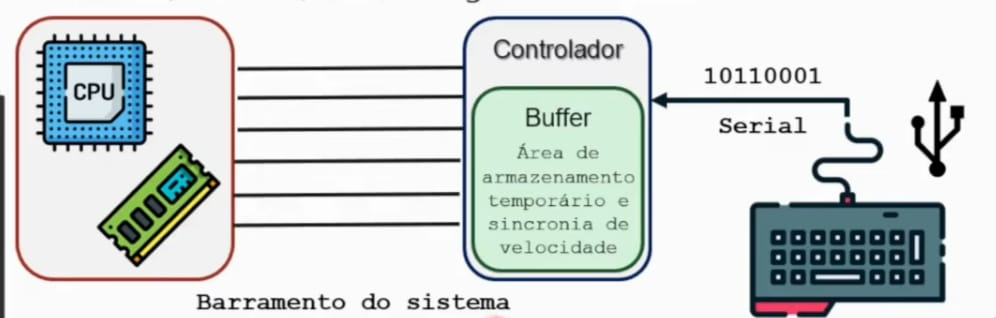
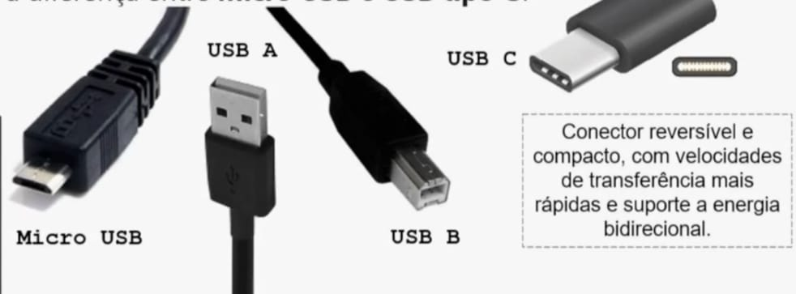
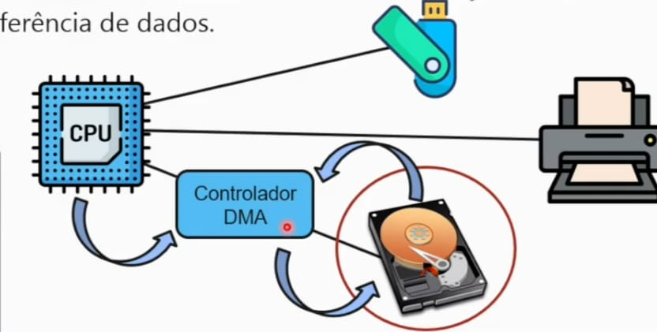

## Interface

Para que um computador possa processar dados e realizar operações é necessaŕio mecanismos para dar entrada e mecanismos para receber as saídas da máquina.
 
Esses dispositivos de entrada e saída (E/S) permitem realizar a interface do usuário com o computador e compõe o chamado subsistema de E/S, capar de realizar duas funções:

  - Receber ou enviar informações ao meio exterior;
  - Converter as informações (E/S) em uma forma inteligível para a máquina (se for de entrada) ou para o usuário (se for de saída).

## Dispositivos de E/S

Dentre os diversos dispositivos de E/S podemos citar: teclado, mouse, monitor de vídeo, impressora, webcam, mocrofone, fone de ouvido, dispositivo de armazenamento (ex:. disco rígido, pen-drive) e etc.

## Velocidade dos dispositivos

Os estímulos gerados pelos dispositivos de E/S são convertidos em vários sinais elétricos, com diferentes intensidades.

## Tabela de Velocidades de Transmissão (E/S)

| Dispositivo de entrada/saída | Velocidade de Transmissão (KB/s) |
| :--- | :--- |
| Teclado | 10 - 100 |
| Mouse | 10 - 100 |
| Webcam | 100 - 500 |
| Impressora | 100 - 1.000 |
| HD Externo e Pendrive (USB 2.0) | 1.000 - 5.000 |
| HD Externo e Pendrive (USB 3.0) | 5.000 - 50.000 |
| Disco Rígido Interno (SATA III) | 50.000 - 200.000 |
| SSD (SATA III) | 50.000 - 600.000 |
| SSD (NVMe) | 500.000 - 3.500.000 |

## Comunicação dos dispositivos

Além da velocidade, outro aspecto que diferencia os dispositivos de E/S é a sua forma de comunicação. A comunicação entre o núcleo do computador e os dispositivoss de E/S.

  - Comunicação serial: a informação pode ser transmitida e recebida, bit a bit, um em seguido do outro.

  - USB (Universal Serial Bus): A interface USB é amplamente utilizada para conectar periféricos ao computador, como teclados, mouses, impressoras, discos rígidos externos, webcams, entre outros.
  - Qual é a diferença entre Micro USB e USB tipo C?

### Diferenças de Conectores USB

Conforme a imagem dos cabos, os conectores também definem a compatibilidade e funcionalidade:

 - USB A: O padrão retangular comum em computadores.

 - USB B: Frequentemente usado em impressoras.

 - Micro USB: Comum em dispositivos móveis antigos.

 - USB C: O padrão moderno, reversível e compacto, que suporta velocidades mais altas e energia bidirecional.

Caminho na Placa-Mãe (Arquitetura)
A eficiência desses dispositivos depende de onde são conectados no Chipset:

Ponte Norte (Northbridge): Gerencia os dispositivos que exigem velocidade extrema, como a Memória RAM e Placas de Vídeo (AGP/PCIe).

Ponte Sul (Southbridge): Gerencia os dispositivos de E/S mais lentos e interfaces como SATA, IDE/ATA, BIOS e barramentos PCI.

### Bluetooth

Tecnologia de comunicação sem fio projetada para permitir a transferência de dados e o estabelecimento de conexões entre dispositivos próximos.

Opera numa frequência de rádio de 2,4 Ghz e possui o padrão IEEE 802.15.1 conectividade simplificada e alacance de até 10m de de distância.

### Wi-fi

Usada para comunicação sem fio que permite que computadores (laptops e desktops), dispositivos móveis (smartphones e dispositivos vestíveis) e outros equipamentos se conectem à Internet,

O padrão IEEE 802.11 define os protocolos que permitem a comunicação com os dispositivos sem fio.

Roteadores Wi-fi dual band operam em duas faixas de frequência 2,4 GHz (802.11g) e 5 GHz (802.11ac).

Cada periférico acoplado ao computador possuia um endereço de porta de E/S e um módulo de E/S. Podendo ser gerenciado de três formas:

     1) Entrada e saída programada: também chamada de pooling, a CPU precisa verificar continuamente se cada um dos dispositivos necessita de atendimento - (CPU dedicada à operação), uma técnica adotada anteriormente, mas não atualmete. 

     2) Entrada e saída controladas por interrupção: métod em que libera a CPU para realizar outras operações até que um dispositivo esteja pronto, realizando uma interrrupção.

     3) Acesso direto â memória (DMA): técnica que permite transferir dados diretamente entre dispositivos e a memória principal do computador, sem a necessidade de intervenção da CPU durante cada transferência de dados. 

