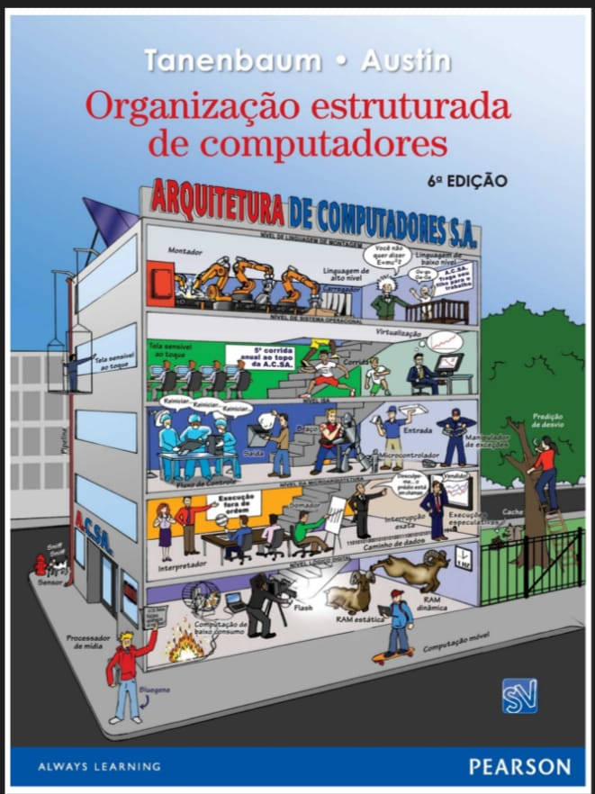
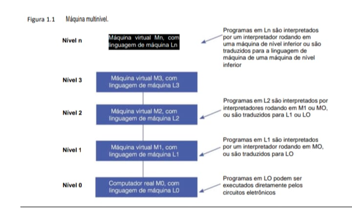
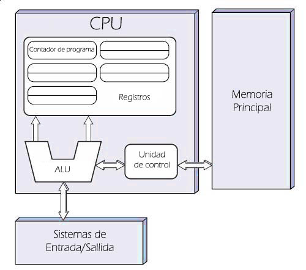
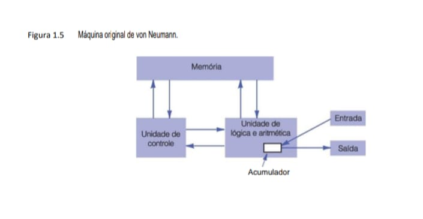

## Introdução

Um computador digital é uma máquina que pode resolver problemas para as pessoas, executando instruções que lhe são dadas. Uma sequência de instruções descrevendo como realizar determinada tarefa é chamada de programa. Os circuitos eletrônicos de cada computador podem reconhecer e executar diretamente um conjunto limitado de instruções simples, para o qual todos os programas devem ser convertidos antes que possam ser executados. Essas instruções básicas raramente são muito mais complicadas do que

    - Some dois números.
    - verifique se um número é zero.
    - Copie dados de uma parte da memória do computador para outra.

Juntas, as instruções primitivas de um computador formam uma linguagem com a qual as pessoas podem se comunicar com ele. Essa linguagem é denominada linguagem de máquina. Quem projeta um novo computador deve decidir quais instruções incluir em sua linguagem de máquina. De modo geral, os projetistas tentam tornar as instruções primitivas as mais simples possíveis, coerentes com os requisitos de utilização e desempenho idealizados para o computador e seus requisitos de desempenho, a fim de reduzir a complexidade e o custo dos circuitos eletrônicos necessários. Como a maioria das linguagens de máquina é muito simples, sua utilização direta pelas pessoas é difícil e tediosa.

Com o passar do tempo, essa observação simples tem levado a uma forma de estruturar os computadores como uma sequência de abstrações, cada uma baseada naquela abaixo dela. Desse modo, a complexidade pode ser dominada e os sistemas de computação podem ser projetados de forma sistemática e organizada. Denominamos essa abordagem organização estruturada de computadores – foi esse o nome dado a este livro. Na seção seguinte, descreveremos o que significa esse termo. Logo após, comentaremos alguns desenvolvimentos históricos, o estado atual da tecnologia e exemplos importantes.

## 1.1 Organização estruturada de computadores
Como já mencionamos, existe uma grande lacuna entre o que é conveniente para as pessoas e o que é conveniente para computadores. As pessoas querem fazer X, mas os computadores só podem fazer Y, o que dá origem a um problema. O objetivo deste livro é explicar como esse problema pode ser resolvido.

## 1.1.1 Linguagens, níveis e máquinas virtuais
O problema pode ser abordado de duas maneiras, e ambas envolvem projetar um novo conjunto de instruções que é mais conveniente para as pessoas usarem do que o conjunto embutido de instruções de máquina. Juntas, essas novas instruções também formam uma linguagem, que chamaremos de L1, assim como as instruções de máquina embutidas formam uma linguagem, que chamaremos de L0. As duas técnicas diferem no modo como os programas escritos em L1 são executados pelo computador que, afinal, só pode executar programas escritos em sua linguagem de máquina, L0.

Um método de execução de um programa escrito em L1 é primeiro substituir cada instrução nele por uma sequên­cia equivalente de instruções em L0. O programa resultante consiste totalmente em instruções L0. O computador, então, executa o novo programa L0 em vez do antigo programa L1. Essa técnica é chamada de tradução.

A outra técnica é escrever um programa em L0 que considere os programas em L1 como dados de entrada e os execute, examinando cada instrução por sua vez, executando diretamente a sequência equivalente de instruções L0. Essa técnica não requer que se gere um novo programa em L0. Ela é chamada de interpretação, e o programa que a executa é chamado de interpretador.

Tradução e interpretação são semelhantes. Nos dois métodos, o computador executa instruções em L1 executando sequências de instruções equivalentes em L0. A diferença é que, na tradução, o programa L1 inteiro primeiro é convertido para um L0, o programa L1 é desconsiderado e depois o novo L0 é carregado na memória do computador e executado. Durante a execução, o programa L0 recém-gerado está sendo executado e está no controle do computador.

Na interpretação, depois que cada instrução L1 é examinada e decodificada, ela é executada de imediato. Nenhum programa traduzido é gerado. Aqui, o interpretador está no controle do computador. Para ele, o programa L1 é apenas dados. Ambos os métodos e, cada vez mais, uma combinação dos dois, são bastante utilizados.

Em vez de pensar em termos de tradução ou interpretação, muitas vezes é mais simples imaginar a existência de um computador hipotético ou máquina virtual cuja linguagem seja L1. Vamos chamar essa máquina virtual de M1 (e de M0 aquela correspondente a L0). Se essa máquina pudesse ser construída de forma barata o suficiente, não seria preciso de forma alguma ter a linguagem L0 ou uma máquina que executou os programas em L0. As pessoas poderiam simplesmente escrever seus programas em L1 e fazer com que o computador os executasse diretamente.
Mesmo que a máquina virtual cuja linguagem é L1 seja muito cara ou complicada de construir com circuitos eletrônicos, as pessoas ainda podem escrever programas para ela. Esses programas podem ser ou interpretados ou traduzidos por um programa escrito em L0 que, por si só, consegue ser executado diretamente pelo computador real. Em outras palavras, as pessoas podem escrever programas para máquinas virtuais, como se realmente existissem.

Para tornar prática a tradução ou a interpretação, as linguagens L0 e L1 não deverão ser “muito” diferentes. Tal restrição significa quase sempre que L1, embora melhor que L0, ainda estará longe do ideal para a maioria das aplicações. Esse resultado talvez seja desanimador à luz do propósito original da criação de L1 – aliviar o trabalho do programador de ter que expressar algoritmos em uma linguagem mais adequada a máquinas do que a pessoas. Porém, a situação não é desesperadora.

A abordagem óbvia é inventar outro conjunto de instruções que seja mais orientado a pessoas e menos orientado a máquinas que a L1. Esse terceiro conjunto também forma uma linguagem, que chamaremos de L2 (e com a máquina virtual M2). As pessoas podem escrever programas em L2 exatamente como se de fato existisse uma máquina real com linguagem de máquina L2. Esses programas podem ser traduzidos para L1 ou executados por um interpretador escrito em L1.

A invenção de toda uma série de linguagens, cada uma mais conveniente que suas antecessoras, pode prosseguir indefinidamente, até que, por fim, se chegue a uma adequada. Cada linguagem usa sua antecessora como base, portanto, podemos considerar um computador que use essa técnica como uma série de camadas ou níveis, um sobre o outro, conforme mostra a Figura 1.1. A linguagem ou nível mais embaixo é a mais simples, e a linguagem ou nível mais em cima é a mais sofisticada.

### Figura 1.1  Máquina multinível.

A Figura 1.1 introduz o conceito fundamental de Máquina Multinível, que é a base para entendermos como o hardware físico (o computador real M_0) suporta camadas cada vez mais abstratas de software (M_1, M_2,...).

A Escala da Máquina Multinível (Figura 1.1)Aqui está a representação de como os programas são traduzidos ou interpretados entre os níveis para que o seu Lenovo IdeaPad entenda o que você digita:

        NÍVEL n  |   Máquina Virtual Mn (Linguagem Ln)
                    |   [ TRADUÇÃO OU INTERPRETAÇÃO ]
                    |           |
        NÍVEL 3  |   Máquina Virtual M3 (Linguagem L3)
                    |   [ INTERPRETAÇÃO POR M2 OU M1 ]
                    |           |
        NÍVEL 2  |   Máquina Virtual M2 (Linguagem L2)
                    |   [ TRADUÇÃO PARA L1 OU L0 ]
                    |           |
        NÍVEL 1  |   Máquina Virtual M1 (Linguagem L1)
                    |   [ INTERPRETAÇÃO POR M0 ]
                    |           |
        NÍVEL 0  |   Computador Real M0 (Linguagem L0)
                    |   [ EXECUÇÃO DIRETA PELOS CIRCUITOS ]
                    

### Insight para seus Projetos: O "Filtro" da Abstração
    Essa estrutura multinível é idêntica ao que discutimos sobre a pedagogia e o TEA:

    - O Nível 0 é como o processamento sensorial (bits de som/luz); é a "decodificação" pura.

    - Os Níveis Superiores são a "compreensão"; é onde os dados brutos ganham sentido lógico para resolver problemas.

    - No seu "Projeto IDS", você trabalha nos níveis superiores, mas seu software só funciona porque as portas lógicas no Nível 0 (como as da Figura 3.61) estão funcionando perfeitamente no seu hardware.

Há uma relação importante entre uma linguagem e uma máquina virtual. Cada máquina tem uma linguagem de máquina, consistindo em todas as instruções que esta pode executar. Com efeito, uma máquina define uma linguagem. De modo semelhante, uma linguagem define uma máquina – a saber, aquela que pode executar todos os programas escritos na linguagem. Claro, pode ser muito complicado e caro construir a máquina definida por determinada linguagem diretamente pelos circuitos eletrônicos, mas, apesar disso, podemos imaginá-la. Uma máquina que tivesse C ou C++ ou Java como sua linguagem seria de fato complexa, mas poderia ser construída usando a tecnologia de hoje. Porém, há um bom motivo para não construir tal computador: ele não seria econômico em comparação com outras técnicas. O mero fato de ser factível não é bom o suficiente: um projeto prático também precisa ser econômico.

De certa forma, um computador com n níveis pode ser visto como n diferentes máquinas virtuais, cada uma com uma linguagem de máquina diferente. Usaremos os termos “nível” e “máquina virtual” para indicar a mesma coisa. Apenas programas escritos na linguagem L0 podem ser executados diretamente pelos circuitos eletrônicos, sem a necessidade de uma tradução ou interpretação intervenientes. Os programas escritos em L1, L2, ..., Ln devem ser interpretados por um interpretador rodando em um nível mais baixo ou traduzidos para outra lingua-
gem correspondente a um nível mais baixo.

Uma pessoa que escreve programas para a máquina virtual de nível n não precisa conhecer os interpretadores e tradutores subjacentes. A estrutura de máquina garante que esses programas, de alguma forma, serão executados. Não há interesse real em saber se eles são executados passo a passo por um interpretador que, por sua vez, também é executado por outro interpretador, ou se o são diretamente pelos circuitos eletrônicos. O mesmo resultado aparece nos dois casos: os programas são executados.

Quase todos os programadores que usam uma máquina de nível n estão interessados apenas no nível superior, aquele que menos se parece com a linguagem de máquina do nível mais inferior. Porém, as pessoas interessadas em entender como um computador realmente funciona deverão estudar todos os níveis. Quem projeta novos computadores ou novos níveis também deve estar familiarizado com outros níveis além do mais alto. Os conceitos e técnicas de construção de máquinas como uma série de níveis e os detalhes dos próprios níveis
formam o assunto principal deste livro.

## 1.1.2 Máquinas multiníveis contemporâneas
A maioria dos computadores modernos consiste de dois ou mais níveis. Existem máquinas com até seis níveis, conforme mostra a Figura 1.2. O nível 0, na parte inferior, é o hardware verdadeiro da máquina. Seus circuitos executam os programas em linguagem de máquina do nível 1. Por razões de precisão, temos que mencionar a existência de outro nível abaixo do nosso nível 0. Esse nível, que não aparece na Figura 1.2 por entrar no domínio da engenharia elétrica (e, portanto, estar fora do escopo deste livro), é chamado de nível de dispositivo. Nele, o projetista vê transistores individuais, que são os primitivos de mais baixo nível para projetistas de computador. Se alguém quiser saber como os transistores funcionam no interior, isso nos levará para o campo da física no estado sólido.

### Figura 1.2 - Um computador com seis níveis. 
O método de suporte para cada nível é indicado abaixo dele (junto com o nome do programa
que o suporta).

### Os 6 Níveis de Abstração (Figura 1.2)

    NÍVEL 5 | Linguagem Orientada ao Problema (Python, JS, C#)
            |   [ TRADUÇÃO: COMPILADOR ]
    NÍVEL 4 | Linguagem Assembly
            |   [ TRADUÇÃO: ASSEMBLER ]
    NÍVEL 3 | Máquina do Sistema Operacional (Linux Ubuntu 24.04)
            |   [ INTERPRETAÇÃO PARCIAL: SO ]
    NÍVEL 2 | Arquitetura do Conjunto de Instruções (ISA - x86, ARM)
            |   [ INTERPRETAÇÃO: MICROPROGRAMA ]
    NÍVEL 1 | Microarquitetura (Caminho de Dados, ALU)
            |   [ HARDWARE ]
    NÍVEL 0 | Nível Lógico Digital (Portas AND, OR, NAND)

### Insight para o seu repositório estruturas_de_dados
    Este modelo explica por que você consegue programar em C ou JS sem precisar desenhar portas lógicas a cada linha de código:

    - Cada nível oferece uma Interface para o nível superior, escondendo a complexidade de baixo.

    - É exatamente o que acontece no aprendizado do aluno com TEA: quando ele domina a "decodificação" (Nível 0/1), ele consegue subir para a "compreensão" (Nível 5).

    - Se você estiver depurando o seu "Projeto IDS" e encontrar um erro de segmentação, você está basicamente vendo um conflito entre o Nível 5 (seu código) e o Nível 3 (como o SO gerencia o mapa de memória da Figura 3.60).

No nível mais baixo que estudaremos, o nível lógico digital, os objetos interessantes são chamados de portas (ou gates). Embora montadas a partir de componentes analógicos, como transistores, podem ser modeladas com precisão como dispositivos digitais. Cada porta tem uma ou mais entradas digitais (sinais representando 0 ou 1) e calcula como saída alguma função simples dessas entradas, como AND (E) ou OR (OU). Cada porta é composta de no máximo alguns transistores. Um pequeno número de portas podem ser combinadas para formar uma memória de 1 bit, que consegue armazenar um 0 ou um 1. As memórias de 1 bit podem ser combinadas em grupos de (por exemplo) 16, 32 ou 64 para formar registradores. Cada registrador pode manter um único número binário até algum máximo. As portas também podem ser combinadas para formar o próprio mecanismo de computação principal. Examinaremos as portas e o nível lógico digital com detalhes no Capítulo 3.

O próximo nível acima é o nível de microarquitetura. Aqui, vemos uma coleção de (em geral) 8 a 32 registradores que formam uma memória local e um circuito chamado ULA – Unidade Lógica e Artitmética (em inglês Arithmetic Logic Unit), que é capaz de realizar operações aritméticas simples. Os registradores estão conectados à ULA para formar um caminho de dados, sobre o qual estes fluem. A operação básica do caminho de dados consiste em selecionar um ou dois registradores, fazendo com que a ULA opere sobre eles (por exemplo, somando-os) e armazenando o resultado de volta para algum registrador.

Em algumas máquinas, a operação do caminho de dados é controlada por um programa chamado microprograma. Em outras, o caminho de dados é controlado diretamente pelo hardware. Nas três primeiras edições deste livro, chamamos esse nível de “nível de microprogramação”, pois no passado ele quase sempre era um interpretador de software. Como o caminho de dados agora quase sempre é (em parte) controlado diretamente
pelo hardware, mudamos o nome na quarta edição.

Em máquinas com controle do caminho de dados por software, o microprograma é um interpretador para as instruções no nível 2. Ele busca, examina e executa instruções uma por vez, usando o caminho de dados. Por exemplo, para uma instrução ADD, a instrução seria buscada, seus operandos localizados e trazidos para registradores, a soma calculada pela ULA e, por fim, o resultado retornado para o local a que pertence. Em uma máquina com controle do caminho de dados por hardware, haveria etapas semelhantes, mas sem um programa armazenado
explícito para controlar a interpretação das instruções desse nível.

Chamaremos o nível 2 de nível de arquitetura do conjunto de instrução, ou nível ISA (Instruction Set Architecture). Os fabricantes publicam um manual para cada computador que vendem, intitulado “Manual de Referência da Linguagem de Máquina”, ou “Princípios de Operação do Computador Western Wombat Modelo 100X”, ou algo semelhante. Esses manuais, na realidade, referem-se ao nível ISA, e não aos subjacen-
tes. Quando eles explicam o conjunto de instruções da máquina, na verdade estão descrevendo as instruções executadas de modo interpretativo pelo microprograma ou circuitos de execução do hardware. Se um fabricante oferecer dois interpretadores para uma de suas máquinas, interpretando dois níveis ISA diferentes, ele oferecer dois manuais de referência da “linguagem de máquina”, um para cada interpretador.

O próximo nível costuma ser híbrido. A maior parte das instruções em sua linguagem também está no nível ISA. (Não há motivo pelo qual uma instrução que aparece em um nível não possa estar presente também em outros.) Além disso, há um conjunto de novas instruções, uma organização de memória diferente, a capacidade de executar dois ou mais programas simultaneamente e diversos outros recursos. Existe mais variação entre os projetos de nível 3 do que entre aqueles no nível 1 ou no nível 2.

As novas facilidades acrescentadas no nível 3 são executadas por um interpretador rodando no nível 2, o qual, historicamente, tem sido chamado de sistema operacional. Aquelas instruções de nível 3 que são idênticas às do nível 2 são executadas direto pelo microprograma (ou controle do hardware), e não pelo sistema operacional. Em outras palavras, algumas das instruções de nível 3 são interpretadas pelo sistema operacional e algumas o são diretamente pelo microprograma. É a isso que chamamos de nível “híbrido”. No decorrer deste livro, nós o chamaremos de nível de máquina do sistema operacional.

Há uma quebra fundamental entre os níveis 3 e 4. Os três níveis mais baixos não servem para uso do programador do tipo mais comum. Em vez disso, eles são voltados principalmente para a execução dos interpretadores e tradutores necessários para dar suporte aos níveis mais altos. Esses interpretadores e tradutores são escritos pelos programadores de sistemas, profissionais que se especializam no projeto e execução de novas máquinas virtuais. Os níveis 4 e acima são voltados para o programador de aplicações, que tem um problema para solucionar.

Outra mudança que ocorre no nível 4 é o método de suporte dos níveis mais altos. Os níveis 2 e 3 são sempre interpretados. Em geral, mas nem sempre, os níveis 4, 5 e acima são apoiados por tradução.

Outra diferença entre níveis 1, 2 e 3, por um lado, e 4, 5 e acima, por outro, é a natureza da linguagem fornecida. As linguagens de máquina dos níveis 1, 2 e 3 são numéricas. Os programas nessas linguagens consistem em uma longa série de números, muito boa para máquinas, mas ruim para as pessoas. A partir do nível 4, as linguagens contêm palavras e abreviações cujo significado as pessoas entendem.

O nível 4, o da linguagem de montagem (assembly), na realidade é uma forma simbólica para uma das linguagens subjacentes. Esse nível fornece um método para as pessoas escreverem programas para os níveis 1, 2 e 3 em uma forma que não seja tão desagradável quanto às linguagens de máquina virtual em si. Programas em linguagem de montagem são primeiro traduzidos para linguagem de nível 1, 2 ou 3, e em seguida interpretados pela máquina virtual ou real adequada. O programa que realiza a tradução é denominado assembler.

O nível 5 normalmente consiste em linguagens projetadas para ser usadas por programadores de aplicações que tenham um problema a resolver. Essas linguagens costumam ser denominadas linguagens de alto nível. Existem literalmente centenas delas. Algumas das mais conhecidas são C, C++, Java, Perl, Python e PHP. Programas escritos nessas linguagens em geral são traduzidos para nível 3 ou nível 4 por tradutores conhecidos como compiladores, embora às vezes sejam interpretados, em vez de traduzidos. Programas em Java, por exemplo, costumam ser primeiro traduzidos para uma linguagem semelhante à ISA denominada código de bytes Java, ou bytecode Java, que é então interpretada.

Em alguns casos, o nível 5 consiste em um interpretador para o domínio de uma aplicação específica, como matemática simbólica. Ele fornece dados e operações para resolver problemas nesse domínio em termos que pessoas versadas nele possam entendê-lo com facilidade.

Resumindo, o aspecto fundamental a lembrar é que computadores são projetados como uma série de níveis, cada um construído sobre seus antecessores. Cada nível representa uma abstração distinta na qual estão presentes diferentes objetos e operações. Projetando e analisando computadores desse modo, por enquanto podemos dispensar detalhes irrelevantes e assim reduzir um assunto complexo a algo mais fácil de entender.

O conjunto de tipos de dados, operações e características de cada nível é denominado arquitetura. Ela trata dos aspectos que são visíveis ao usuário daquele nível. Características que o programador vê, como a quantidade de memória disponível, são parte da arquitetura. Aspectos de implementação, como o tipo da tecnologia usada para executar a memória, não são parte da arquitetura. O estudo sobre como projetar as partes de um sistema de computador que sejam visíveis para os programadores é denominado arquitetura de computadores. Na prática, contudo, arquitetura de computadores e organização de computadores significam basicamente a mesma coisa.

## 1.1.3 Evolução de máquinas multiníveis
Para colocar as máquinas multiníveis em certa perspectiva, examinaremos rapidamente seu desenvolvimento histórico, mostrando como o número e a natureza dos níveis evoluíram com o passar dos anos. Programas escritos em uma verdadeira linguagem de máquina (nível 1) de um computador podem ser executados diretamente pelos circuitos eletrônicos (nível 0) do computador, sem qualquer interpretador ou tradutor interveniente. Esses circuitos eletrônicos, junto com a memória e dispositivos de entrada/saída, formam o hardware do computador.
Este consiste em objetos tangíveis – circuitos integrados, placas de circuito impresso, cabos, fontes de alimentação, memórias e impressoras – em vez de ideias abstratas, algoritmos ou instruções.

Por outro lado, o software consiste em algoritmos (instruções detalhadas que dizem como fazer algo) e suas representações no computador – isto é, programas. Eles podem ser armazenados em disco rígido, CD-ROM, ou outros meios, mas a essência do software é o conjunto de instruções que compõe os programas, e não o meio físico no qual estão gravados.

Nos primeiros computadores, a fronteira entre hardware e software era nítida. Com o tempo, no entanto, essa fronteira ficou bastante indistinta, principalmente por causa da adição, remoção e fusão de níveis à medida que os computadores evoluíam. Hoje, muitas vezes é difícil distingui-la (Vahid, 2003). Na verdade, um tema central deste livro é
    Hardware e software são logicamente equivalentes.

Qualquer operação executada por software também pode ser embutida diretamente no hardware, de preferência após ela ter sido suficientemente bem entendida. Como observou Karen Panetta: “Hardware é apenas software petrificado”. Claro que o contrário é verdadeiro: qualquer instrução executada em hardware também pode ser simulada em software. A decisão de colocar certas funções em hardware e outras em software é baseada em fatores como custo, velocidade, confiabilidade e frequência de mudanças esperadas. Existem poucas regras rigorosas e
imutáveis para determinar que X deva ser instalado no hardware e Y deva ser programado explicitamente. Essas decisões mudam com as tendências econômicas, com a demanda e com a utilização de computadores.

### A invenção da microprogramação
Os primeiros computadores digitais, na década de 1940, tinham apenas dois níveis: o nível ISA, no qual era feita toda a programação, e o nível lógico digital, que executava esses programas. Os circuitos do nível lógico digital eram complicados, difíceis de entender e montar, e não confiáveis.

Em 1951, Maurice Wilkes, pesquisador da Universidade de Cambridge, sugeriu projetar um computador de três níveis para simplificar de maneira drástica o hardware e assim reduzir o número de válvulas (pouco confiá­veis) necessárias (Wilkes, 1951). Essa máquina deveria ter um interpretador embutido, imutável (o microprograma), cuja função fosse executar programas de nível ISA por interpretação. Como agora o hardware só teria de executar microprogramas, que tinham um conjunto limitado de instruções, em vez de programas de nível ISA, cujos conjuntos de instruções eram muito maiores, seria necessário um número menor de circuitos eletrônicos. Uma vez que, na época, os circuitos eletrônicos eram compostos de válvulas eletrônicas, tal simplificação prometia reduzir o número de válvulas e, portanto, aumentar a confiabilidade (isto é, o número de falhas por dia).

Poucas dessas máquinas de três níveis foram construídas durante a década de 1950. Outras tantas foram construídas durante a década de 1960. Em torno de 1970, a ideia de interpretar o nível ISA por um microprograma, em vez de diretamente por meios eletrônicos, era dominante. Todas as principais máquinas da época a usavam.

### A invenção do sistema operacional
Naqueles primeiros anos, grande parte dos computadores era “acessível a todos”, o que significava que o programador tinha de operar a máquina pessoalmente. Ao lado de cada máquina havia uma planilha de utilização. Um programador que quisesse executar um programa assinava a planilha e reservava um período de tempo, digamos, quarta-feira, das 3 às 5 da manhã (muitos programadores gostavam de trabalhar quando a sala onde a máquina estava instalada ficava tranquila). Quando chegava seu horário, o programador se dirigia à sala da máquina com um pacote de cartões perfurados de 80 colunas (um meio primitivo de entrada de dados) em uma das mãos e um lápis bem apontado na outra. Ao chegar à sala do computador, ele gentilmente levava até a porta o programador que lá estava antes dele e tomava posse da máquina.
    Se quisesse executar um programa em FORTRAN, o programador devia seguir estas etapas:

    1. Ele1 se dirigia ao armário onde era mantida a biblioteca de programas, retirava o grande maço verde rotulado “compilador FORTRAN”, colocava-o na leitora de cartões e apertava o botão START.

    2. Então, colocava seu programa FORTRAN na leitora de cartões e apertava o botão CONTINUE. O programa era lido pela máquina.

    3. Quando o computador parava, ele lia seu programa FORTRAN em um segundo momento. Embora alguns compiladores exigissem apenas uma passagem pela entrada, muitos demandavam duas ou mais. Para cada passagem, era preciso ler um grande maço de cartões.

    4. Por fim, a tradução se aproximava da conclusão. Era comum o programador ficar nervoso perto do fim porque, se o compilador encontrasse um erro no programa, ele teria de corrigi-lo e começar todo o processo novamente. Se não houvesse erro, o compilador perfurava em cartões o programa traduzido para linguagem de máquina.

    5. Então, o programador colocava o programa em linguagem de máquina na leitora de cartões, junto com o maço da biblioteca de sub-rotina, e lia ambos.

    6. O programa começava a executar. Quase sempre não funcionava e parava de repente no meio. Em geral, o programador mexia um pouco nas chaves de controle e observava as luzes do console durante alguns instantes. Se tivesse sorte, conseguiria descobrir qual era o problema e corrigir o erro. Em seguida, voltava ao armário onde estava guardado o grande e verde compilador FORTRAN e começava tudo de
    novo. Se não tivesse tanta sorte, imprimia o conteúdo da memória, denominado de dump de memória, e o levava para casa a fim de estudá-lo.

Esse procedimento, com pequenas variações, foi o normal em muitos centros de computação durante anos. Ele forçava os programadores a aprender como operar a máquina e o que fazer quando ela parava, o que acontecia com frequência. A máquina costumava ficar ociosa enquanto as pessoas carregavam cartões pela sala afora ou coçavam a cabeça tentando descobrir por que seus programas não estavam funcionando
adequadamente.

Por volta de 1960, as pessoas tentaram reduzir o desperdício de tempo automatizando o trabalho do operador. Um programa denominado sistema operacional era mantido no computador o tempo todo. O programador produzia certos cartões de controle junto com o programa, que eram lidos e executados pelo sistema operacional.

A Figura 1.3 apresenta uma amostra de serviço (job) para um dos primeiros sistemas operacionais de ampla uti-
lização, o FMS (FORTRAN Monitor System), no IBM 709.

### Figura 1.3 Amostra de serviço (job) para o sistema operacional FMS.

    +-----------------------------------------------------------+
    |                                                           |
    |   $JOB, 5494, BARBARA      <-- Identificação do Usuário   |
    |   $XEQ                     <-- Comando de Execução        |
    |   $FORTRAN                 <-- Carrega o Compilador       |
    |                                                           |
    |      [ Programa FORTRAN ]  <-- Código-fonte (Nível 5)     |
    |                                                           |
    |                                                           |
    |   $DATA                    <-- Início do Bloco de Dados   |
    |                                                           |
    |      [ Cartões de Dados ]  <-- Entrada para o Programa    |
    |                                                           |
    |                                                           |
    |   $END                     <-- Fim do Job                 |
    |                                                           |
    +-----------------------------------------------------------+

    Processamento                                                         Armazenamento

    Controle ($JOB, $XEQ)                                                 Dados ($DATA)
    :---                                                                  :---
    Instruções para o Monitor (antecessor do SO moderno)                  Local onde os parâmetros de entrada eram lidos, geralmente via sobre quem é o dono do job e o que deve ser executado.                      cartões perfurados."

                                                                          BARRAMENTO INTERNO

    Linguagem ($FORTRAN)                                                  Finalização ($END)

    Define qual tradutor de Nível 5 para Nível 4 (Assembly)               Indica ao sistema que os recursos podem ser liberados para o próximo será carregado na memória RAM.                                job da fila.

### Conexão com sua Realidade (Nível 3)
    Embora pareça arcaico, esse conceito de "Job" ainda existe no seu dia a dia:

    - Quando você executa o seu script backup_projeto.sh, você está basicamente criando um "Job" automatizado que roda uma sequência de comandos sem intervenção humana.

    - No seu "Projeto IDS", a compilação via build.sh segue exatamente essa lógica: identifica o compilador (GCC em vez de FORTRAN), passa o código-fonte e gera o binário.

O sistema operacional lia o cartão *JOB e usava a informação nele contida para fins de contabilidade. (O asterisco era usado para identificar cartões de controle, para que eles não fossem confundidos com cartões de programa e de dados.) Depois, o sistema lia o cartão *FORTRAN, que era uma instrução para carregar o compilador FORTRAN a partir de uma fita magnética. Então, o programa era lido para a máquina e compilava pelo programa FORTRAN. Quando o compilador terminava, ele devolvia o controle ao sistema operacional, que então
lia o cartão *DATA. Isso era uma instrução para executar o programa traduzido, usando como dados os cartões que vinham após o cartão *DATA.

Embora o sistema operacional fosse projetado para automatizar o trabalho do operador (daí seu nome), foi também o primeiro passo para o desenvolvimento de uma nova máquina virtual. O cartão *FORTRAN podia ser considerado uma instrução virtual “compilar programa”. De modo semelhante, o cartão *DATA podia ser considerado uma instrução virtual “executar programa”. Um nível que contivesse apenas duas instruções não era lá um grande nível, mas já era um começo.

Nos anos seguintes, os sistemas operacionais tornaram-se cada vez mais sofisticados. Novas instruções, facilidades e características foram adicionadas ao nível ISA até que ele começou a parecer um novo nível. Algumas das instruções desse novo nível eram idênticas às do nível ISA, mas outras, em particular as de entrada/saída, eram completamente diferentes. As novas instruções começaram a ficar conhecidas como macros de sistema operacional ou chamadas do supervisor. Agora, o termo mais comum é chamada do sistema.

Sistemas operacionais também se desenvolveram de outras maneiras. Os primeiros liam maços de cartões e imprimiam a saída na impressora de linha. Essa organização era conhecida como sistema batch. Em geral, havia uma espera de várias horas entre o momento em que um programa entrava na máquina e o horário em que os resultados ficavam prontos. Era difícil desenvolver software em tais circunstâncias.

No início da década de 1960, pesquisadores do Dartmouth College, do MIT e de outros lugares desenvolveram sistemas operacionais que permitiam a vários programadores se comunicarem diretamente com o computador. Esses sistemas tinham terminais remotos conectados ao computador central por linhas telefônicas. O computador era compartilhado por muitos usuários. Um programador podia digitar um programa e obter os resultados impressos quase de imediato em seu escritório, na garagem de sua casa ou onde quer que o terminal estivesse localizado. Esses sistemas eram denominados sistemas de tempo compartilhado (ou timesharing).

Nosso interesse em sistemas operacionais está nas partes que interpretam as instruções e características presentes no nível 3 e que não estão presentes no nível ISA, em vez de nos aspectos de compartilhamento de tempo. Embora não venhamos a destacar o fato, você sempre deve estar ciente de que os sistemas operacionais fazem mais do que apenas interpretar características adicionadas ao nível ISA.

### Migração de funcionalidade para microcódigo
Assim que a microprogramação se tornou comum (por volta de 1970), os projetistas perceberam que podiam acrescentar novas instruções simplesmente ampliando o microprograma. Em outras palavras, eles podiam acrescentar “hardware” (novas instruções de máquina) por programação. Essa revelação levou a uma explosão virtual de conjuntos de instruções de máquina, pois os projetistas competiam uns com os outros para produzir conjuntos de instruções maiores e melhores. Muitas delas não eram essenciais considerando que seu efeito podia ser conseguido com facilidade pelas instruções existentes, embora às vezes fossem um pouco mais velozes do que uma sequência
já existente. Por exemplo, muitas máquinas tinham uma instrução INC (INCrement) que somava 1 a um número. Como essas máquinas também tinham uma instrução geral ADD, não era necessário ter uma instrução especial para adicionar 1 (ou 720, se fosse o caso). Contudo, INC normalmente era um pouco mais rápida que ADD, e por isso foi inserida.

Por essa razão, muitas outras instruções foram adicionadas ao microprograma. Entre elas, as mais frequentes
eram:

    1.	Instruções para multiplicação e divisão de inteiros.
    
    2.	Instruções aritméticas para ponto flutuante.
    
    3.	Instruções para chamar e sair de procedimentos.
    
    4.	Instruções para acelerar laços (looping).
    
    5.	Instruções para manipular cadeias de caracteres.

Além do mais, assim que os projetistas de máquinas perceberam como era fácil acrescentar novas instruções,
começaram a procurar outras características para adicionar aos seus microprogramas. Alguns exemplos desses
acréscimos são:

    1. Características para acelerar cálculos que envolvessem vetores (indexação e endereçamento indireto).

    2. Características para permitir que os programas fossem movidos na memória após o início da execução (facilidades de relocação).

    3. Sistemas de interrupção que avisavam o computador tão logo uma operação de entrada ou saída estivesse concluída.

    4. Capacidade para suspender um programa e iniciar outro com um pequeno número de instruções (comutação de processos).

    5. Instruções especiais para processar arquivos de áudio, imagem e multimídia.

Diversas outras características e facilidades também foram acrescentadas ao longo dos anos, em geral para
acelerar alguma atividade particular.

### Eliminação da microprogramação
Os microprogramas engordaram durante os anos dourados da microprogramação (décadas de 1960 e 1970) e também tendiam a ficar cada vez mais lentos à medida que se tornavam mais volumosos. Por fim, alguns pesquisadores perceberam que, eliminando o microprograma, promovendo uma drástica redução no conjunto de instruções e fazendo com que as restantes fossem executadas diretamente (isto é, controle do caminho de dados por hardware), as máquinas podiam ficar mais rápidas. Em certo sentido, o projeto de computadores fechou um círculo completo, voltando ao modo como era antes que Wilkes inventasse a microprogramação.

Mas a roda continua girando. Processadores modernos ainda contam com a microprogramação para traduzir instruções complexas em microcódigo interno, que pode ser executado diretamente no hardware preparado para isso.

O objetivo dessa discussão é mostrar que a fronteira entre hardware e software é arbitrária e muda constantemente. O software de hoje pode ser o hardware de amanhã, e vice-versa. Além do mais, as fronteiras entre os diversos níveis também são fluidas. Do ponto de vista do programador, o modo como uma instrução é implementada não é importante, exceto, talvez, no que se refere à sua velocidade. Uma pessoa que esteja programando no nível ISA pode usar sua instrução de “multiplicar” como se fosse uma instrução de hardware sem ter de se preocupar com ela ou até mesmo sem saber se ela é, na verdade, uma instrução de hardware. O hardware de alguém é o software de outrem. Voltaremos a todos esses tópicos mais adiante neste livro.

## 1.2 Marcos da arquitetura de computadores
Durante a evolução do computador digital moderno, foram projetados e construídos centenas de diferentes tipos de computadores. Grande parte já foi esquecida há muito tempo, mas alguns causaram um impacto significativo sobre as ideias modernas. Nesta seção, vamos apresentar um breve esboço de alguns dos principais desenvolvimentos históricos, para entender melhor como chegamos onde estamos agora. Nem é preciso dizer que esta seção apenas passa por alto os pontos de maior interesse e deixa muita coisa de fora. A Figura 1.4 apresenta
algumas máquinas que marcaram época e que serão discutidas nesta seção. Slater (1987) é uma boa referência de consulta para quem quiser material histórico adicional sobre as pessoas que inauguraram a era do computador. Biografias curtas e belas fotos em cores, de autoria de Louis Fabian Bachrach, de alguns dos principais fundadores da era do computador são apresentadas no livro de arte de Morgan (1997).

## 1.2.1 A geração zero – computadores mecânicos (1642–1945)
A primeira pessoa a construir uma máquina de calcular operacional foi o cientista francês Blaise Pascal (1623–1662), em cuja honra a linguagem Pascal foi batizada. Esse dispositivo, construído em 1642, quando Pascal tinha apenas 19 anos, foi projetado para ajudar seu pai, um coletor de impostos do governo francês. Era inteiramente mecânico, usava engrenagens e funcionava com uma manivela operada à mão.

### Figura 1.4 Alguns marcos no desenvolvimento do computador digital moderno.

    --------------------------------------------------------------------------------------------------------------+
    Ano  | Nome              | Construído por    | Comentários                                                    |
    --------------------------------------------------------------------------------------------------------------+
    1834 | Máquina analítica | Babbage           | Primeira tentativa de construir um computador digital          |
    1936 | Z1                | Zuse              | Primeira máquina de calcular com relés                         |
    1943 | COLOSSUS          | Governo britânico | Primeiro computador eletrônico                                 |
    1944 | Mark I            | Aiken             | Primeiro computador norte-americano de uso geral               |
    1946 | ENIAC             | Eckert/Mauchley   | A história moderna dos computadores começa aqui                |
    1949 | EDSAC             | Wilkes            | Primeiro computador com programa armazenado                    |
    1951 | Whirlwind I       | MIT               | Primeiro computador de tempo real                              |
    1952 | IAS               | von Neumann       | A maioria das máquinas atuais usa esse projeto                 |
    1960 | PDP-1             | DEC               | Primeiro minicomputador (50 vendidos)                          |
    1961 | 1401              | IBM               | Máquina para pequenos negócios, com enorme popularidade        |
    1962 | 7094              | IBM               | Dominou computação científica no início da década de 1960      |
    1963 | B5000             | Burroughs         | Primeira máquina projetada para uma linguagem de alto nível    |
    1964 | 360               | IBM               | Primeira linha de produto projetada como uma família           |
    1966 | 6600              | CDC               | Primeiro supercomputador científico                            |
    1965 | PDP-8             | DEC               | Primeiro minicomputador de mercado de massa (50 mil vendidos)  |
    1970 | PDP-11            | DEC               | Dominou os minicomputadores na década de 1970                  |
    1974 | 8080              | Intel             | Primeiro computador de uso geral de 8 bits em um chip          |
    1974 | CRAY-1            | Cray              | Primeiro supercomputador vetorial                              |
    1978 | VAX               | DEC               | Primeiro superminicomputador de 32 bits                        |
    1981 | IBM PC            | IBM               | Deu início à era moderna do computador pessoal                 |
    1981 | Osborne-1         | Osborne           | Primeiro computador portátil                                   |
    1983 | Lisa              | Apple             | Primeiro computador pessoal com uma GUI                        |
    1985 | 386               | Intel             | Primeiro ancestral de 32 bits da linha Pentium                 |
    1985 | MIPS              | MIPS              | Primeira máquina comercial RISC                                |
    1985 | XC2064            | Xilinx            | Primeiro FPGA (Field-Programmable Gate Array)                  |
    1987 | SPARC             | Sun               | Primeira estação de trabalho RISC baseada em SPARC             |
    1989 | GridPad           | Grid Systems      | Primeiro computador tablet comercial                           |
    1990 | RS6000            | IBM               | Primeira máquina superescalar                                  |
    1992 | Alpha             | DEC               | Primeiro computador pessoal de 64 bits                         |
    1992 | Simon             | IBM               | Primeiro smartphone                                            |
    1993 | Newton            | Apple             | Primeiro computador palmtop (PDA)                              |
    2001 | POWER4            | IBM               | Primeiro multiprocessador com chip dual core                   |
    --------------------------------------------------------------------------------------------------------------+

A máquina de Pascal podia efetuar apenas operações de adição e subtração, mas 30 anos mais tarde o grande matemático alemão, barão Gottfried Wilhelm von Leibniz (1646–1716), construiu uma outra máquina mecânica que também podia multiplicar e dividir. Na verdade, Leibniz construiu o equivalente a uma calculadora de bolso de quatro operações três séculos atrás.

Durante 150 anos nada de muito importante aconteceu, até que um professor de matemática da Universidade de Cambridge, Charles Babbage (1792–1871), o inventor do velocímetro, projetou e construiu sua primeira máquina diferencial. Esse dispositivo mecânico que, assim como o de Pascal, só podia somar e subtrair, foi projetado para calcular tabelas de números úteis para a navegação marítima. Toda a construção da máquina foi projetada para executar um único algoritmo, o método de diferenças finitas que usava polinômios. A característica mais interessante dessa máquina era seu método de saída: ela perfurava seus resultados sobre uma chapa de gravação de cobre com uma punção de aço, prenunciando futuros meios de escrita única como cartões perfurados e CD-ROMs.

Embora o dispositivo funcionasse razoavelmente bem, Babbage logo se cansou dessa máquina que só podia executar um único algoritmo. Ele começou a gastar quantidades cada vez maiores de seu tempo e da fortuna da família (sem falar nas 17 mil libras do governo) no projeto e na construção de uma sucessora denominada máquina analítica. A máquina analítica tinha quatro componentes: a armazenagem (memória), o moinho (unidade de cálculo), a seção de entrada (leitora de cartões perfurados) e a seção de saída (saída perfurada e impressa). A armazenagem consistia em 1.000 palavras de 50 algarismos decimais, cada uma usada para conter variáveis e resultados. O moinho podia aceitar operandos da armazenagem e então os somava, subtraía, multiplicava ou dividia e, por fim, devolvia o resultado à armazenagem. Assim como a máquina diferencial, ela era inteiramente mecânica.

O grande avanço da máquina analítica era ser de uso geral. Lia instruções de cartões perfurados e as executava. Algumas instruções mandavam a máquina buscar dois números na armazenagem, trazê-los até o moinho, efetuar uma operação com eles (por exemplo, adição) e enviar o resultado de volta para a armazenagem. Outras podiam testar um número e desviá-lo condicionalmente, dependendo se ele era positivo ou negativo. Perfurando um programa diferente nos cartões de entrada, era possível fazer com que a máquina analítica realizasse cálculos diversos, o que não acontecia com a máquina diferencial.

Visto que a máquina analítica era programável em uma linguagem de montagem simples, ela precisava de software. Para produzi-lo, Babbage contratou uma jovem de nome Ada Augusta Lovelace, que era filha do famoso poeta britânico lord Byron. Assim, Ada Lovelace foi a primeira programadora de computadores do mundo. A linguagem de programação Ada tem esse nome em sua homenagem.

Infelizmente, assim como muitos projetistas modernos, Babbage nunca conseguiu depurar o hardware por completo. O problema era que ele precisava de milhares e milhares de dentes e rodas e engrenagens produzidos com um grau de precisão que a tecnologia do século XIX não podia oferecer. Ainda assim, suas ideias estavam muito à frente de sua época e, até hoje, a maioria dos computadores modernos tem uma estrutura muito semelhante à da máquina analítica; portanto, é mais do que justo dizer que Babbage foi avô do computador digital moderno.

O próximo desenvolvimento importante ocorreu no final da década de 1930, quando um estudante de engenharia alemão chamado Konrad Zuse construiu uma série de máquinas calculadoras automáticas usando relés eletromagnéticos. Ele não conseguiu financiamento do governo após o início da guerra porque os burocratas governamentais esperavam ganhar a guerra tão rapidamente que a nova máquina só estaria pronta após o término do conflito. Zuse não conhecia o trabalho de Babbage, e suas máquinas foram destruídas pelo bombardeio aliado de Berlim em 1944, portanto, seu trabalho não teve influência alguma sobre as máquinas subsequentes. Mesmo assim, ele foi um dos pioneiros da área.

Um pouco mais tarde, nos Estados Unidos, duas pessoas também projetaram calculadoras, John Atanasoff no Iowa State College e George Stibbitz no Bell Labs. A máquina de Atanasoff era surpreendentemente avançada para sua época. Usava aritmética binária e a memória era composta de capacitores recarregados periodicamente para impedir fuga de carga, um processo que ele denominou “sacudir a memória”. Os chips modernos de memória dinâmica (DRAM) funcionam desse mesmo modo. Infelizmente, a máquina nunca se tornou operacional de fato.
De certo modo, Atanasoff era como Babbage: um visionário que acabou derrotado pela tecnologia de hardware inadequada que existia em seu tempo.

O computador de Stibbitz, embora mais primitivo do que o de Atanasoff, funcionou de verdade. Stibbitz fez uma grande demonstração pública de sua máquina durante uma conferência no Dartmouth College em 1940. Uma dos presentes era John Mauchley, desconhecido professor de física da Universidade da Pensilvânia. Mais tarde, o mundo da computação ouviria mais a respeito do professor Mauchley.

Enquanto Zuse, Stibbitz e Atanasoff projetavam calculadoras automáticas, um jovem chamado Howard Aiken remoía tediosos cálculos numéricos à mão como parte de sua pesquisa de doutorado em Harvard. Depois de concluído o doutorado, Aiken reconheceu a importância de fazer cálculos à máquina. Foi à biblioteca, descobriu o trabalho de Babbage e decidiu construir com relés o computador de uso geral que ele não tinha conseguido construir com rodas dentadas.

A primeira máquina de Aiken, a Mark I, foi concluída em Harvard em 1944. Tinha 72 palavras de 23 algarismos decimais cada e um tempo de instrução de 6 s. A entrada e a saída usavam fita de papel perfurada. Quando Aiken concluiu o sucessor dessa máquina, a Mark II, os computadores de relés já eram obsoletos. A era eletrônica tinha começado.

## 1.2.2 A primeira geração – válvulas (1945–1955)
O estímulo para o computador eletrônico foi a Segunda Guerra Mundial. Durante a fase inicial do conflito, submarinos alemães causavam estragos em navios britânicos. As instruções de comando dos almirantes em Berlim eram enviadas aos submarinos por rádio, as quais os britânicos podiam interceptar – e interceptavam. O problema era que as mensagens eram codificadas usando um dispositivo denominado ENIGMA, cujo antecessor foi projetado pelo inventor amador e outrora presidente dos Estados Unidos, Thomas Jefferson.

Logo no início da guerra, a inteligência britânica conseguiu adquirir uma máquina ENIGMA da inteligência polonesa, que a tinha roubado dos alemães2. Contudo, para decifrar uma mensagem codificada era preciso uma quantidade enorme de cálculos e, para a mensagem ser de alguma utilidade, era necessário que esse cálculo fosse concluído logo depois de ela ter sido interceptada. Para decodificar essas mensagens, o governo britânico montou um laboratório ultrassecreto que construiu um computador eletrônico denominado COLOSSUS. O famoso matemático britânico Alan Turing ajudou a projetar essa máquina. Esse computador funcionava desde 1943, mas, uma vez que o governo britânico guardou praticamente todos os aspectos do projeto como segredo militar durante 30 anos, a linha COLOSSUS foi um beco sem saída. Só vale a pena citá-lo por ter sido o primeiro computador digital eletrônico do mundo.

Além de destruir as máquinas de Zuse e estimular a construção do COLOSSUS, a guerra também afetou a computação nos Estados Unidos. O exército precisava de tabelas de alcance visando sua artilharia pesada, e as produzia contratando centenas de mulheres para fazer os cálculos necessários com calculadoras de mão (as mulheres eram consideradas mais precisas que os homens). Ainda assim, o processo era demorado e surgiam erros com frequência.

John Mauchley, que conhecia o trabalho de Atanasoff, bem como o de Stibbitz, sabia que o exército estava interessado em calculadoras mecânicas. Como muitos cientistas da computação que vieram depois dele, Mauchley montou uma proposta solicitando ao exército financiamento para a construção de um computador eletrônico. A proposta foi aceita em 1943, e Mauchley e seu aluno de pós-graduação, J. Presper Eckert, passaram a construir um computador eletrônico, ao qual deram o nome de ENIAC (Electronic Numerical Integrator And Computer –
integrador e computador numérico eletrônico). O ENIAC consistia em 18 mil válvulas e 1.500 relés, pesava 30 toneladas e consumia 140 kw de energia. Em termos de arquitetura, a máquina tinha 20 registradores, cada um com capacidade para conter um número decimal de 10 algarismos. (Um registrador decimal é uma memória muito pequena que pode conter desde um número até outro número máximo de casas decimais,
mais ou menos como o odômetro, que registra quanto um carro rodou em seu tempo de vida útil.) O ENIAC era programado com o ajuste de até 6 mil interruptores multiposição e com a conexão de uma imensa quantidade de soquetes com uma verdadeira floresta de cabos de interligação.

A construção da máquina só foi concluída em 1946, tarde demais para ser de alguma utilidade em relação a seu propósito original. Todavia, como a guerra tinha acabado, Mauchley e Eckert receberam permissão para organizar um curso de verão para descrever seu trabalho para seus colegas cientistas. Aquele curso de verão foi o início de uma explosão de interesse na construção de grandes computadores digitais.

Após aquele curso de verão histórico, outros pesquisadores se dispuseram a construir computadores eletrônicos. O primeiro a entrar em operação foi o EDSAC (1949), construído na Universidade de Cambridge por Maurice Wilkes. Entre outros, figuravam JOHNNIAC, da Rand Corporation; o ILLIAC, da Universidade de Illinois; o MANIAC, do Los Alamos Laboratory; e o WEIZAC, do Weizmann Institute em Israel.

Eckert e Mauchley logo começaram a trabalhar em um sucessor, o EDVAC (Electronic Discrete Variable Automatic Computer). Contudo, o projeto ficou fatalmente comprometido quando eles deixaram a Universidade da Pensilvânia para fundar uma empresa nova, a Eckert-Mauchley Computer Corporation, na Filadélfia. (O Vale do Silício ainda não tinha sido inventado.) Após uma série de fusões, a empresa se tornou a moderna Unisys Corporation.

Como um aporte legal, Eckert e Mauchley solicitaram uma patente alegando que haviam inventado o computador digital. Em retrospecto, possuir essa patente não seria nada mau. Após anos de litígio, o tribunal decidiu que a patente de Eckert-Mauchley era inválida e que John Atanasoff tinha inventado o computador digital, embora nunca o tivesse patenteado, colocando efetivamente a invenção em domínio público.

Enquanto Eckert e Mauchley trabalhavam no EDVAC, uma das pessoas envolvidas no projeto ENIAC, John von Neumann, foi para o Institute of Advanced Studies de Princeton para construir sua própria versão do EDVAC, a máquina IAS. Von Neumann era um gênio, da mesma estirpe de Leonardo da Vinci. Falava muitos idiomas, era especialista em ciências físicas e matemática e guardava na memória tudo o que já tinha ouvido, visto ou lido. Conseguia citar sem consulta, palavra por palavra, o texto de livros que tinha lido anos antes. Na época em que se interessou por computadores, já era o mais eminente matemático do mundo.

Uma das coisas que logo ficou óbvia para ele foi que programar computadores com quantidades imensas de interruptores e cabos era uma tarefa lenta, tediosa e inflexível. Ele percebeu que o programa podia ser representado em forma digital na memória do computador, junto com os dados. Também viu que a desajeitada aritmética decimal serial usada pelo ENIAC, com cada dígito representado por 10 válvulas (1 acesa e 9 apagadas), podia ser substituída por aritmética binária paralela, algo que Atanasoff tinha percebido anos antes.

O projeto básico, o primeiro que ele descreveu, agora é conhecido como máquina de von Neumann. Ela foi usada no EDSAC, o primeiro computador de programa armazenado, e agora, mais de meio século depois, ainda é a base de quase todos os computadores digitais. Esse projeto – e a máquina IAS, construída em colaboração com Herman Goldstine – teve uma influência tão grande que vale a pena descrevê-lo rapidamente. Embora o nome de von Neumann esteja sempre ligado a esse projeto, Goldstine e outros também lhe deram grande contribuição.
Um esboço da arquitetura é dado na Figura 1.5.

### Figura 1.5 Máquina original de von Neumann.

### Figura 1.5: Máquina Original de von Neumann

                +---------------------------+
                |          MEMÓRIA          | <--- Armazena Instruções e Dados
                +-------------+-------------+
                      ^      |      ^
                      |      |      |
            +---------+      |      +---------+
            |                v                |
    +-------------+  +-------------------------------+
    |             |  | UNIDADE DE LÓGICA E ARITMÉTICA|
    | UNIDADE DE  |--|             (ULA)             |---> [ SAÍDA ]
    |  CONTROLE   |  |        +-------------+        |
    |             |<-|        | ACUMULADOR  |        |<--- [ ENTRADA ]
    +-------------+  +--------+-------------+--------+

### Insight para o seu eBook "Olá, mundo digital!"
    Esta arquitetura resolve o maior problema dos primeiros computadores: a necessidade de reconfigurar o hardware manualmente para cada tarefa.

    - No Software: Quando você compila seu código no Ubuntu 24.04, o binário resultante vai para a "Memória" e a "Unidade de Controle" executa instrução por instrução.

    - No Hardware: A "ULA" é composta pelas portas lógicas que vimos na Figura 3.61 (AND, NAND). O "Acumulador" é um tipo de registrador de altíssima velocidade.

A máquina de von Neumann tinha cinco partes básicas: a memória, a unidade de lógica e aritmética, a unidade de controle e o equipamento de entrada e saída. A memória consistia em 4.096 palavras, uma palavra contendo 40 bits, cada bit sendo 0 ou 1. Cada palavra continha ou duas instruções de 20 bits ou um inteiro de 40 bits com sinal. As instruções tinham 8 bits dedicados a identificar o tipo da instrução e 12 bits para especificar uma das 4.096 palavras de memória. Juntas, a unidade de lógica e aritmética e a unidade de controle formavam o “cérebro” do computador. Em computadores modernos, elas são combinadas em um único chip, denominado CPU (Central Processing Unit – unidade central de processamento).

Dentro da unidade de lógica e aritmética havia um registrador interno especial de 40 bits, denominado acumulador. Uma instrução típica adicionava uma palavra de memória ao acumulador ou armazenava o conteúdo deste na memória. A máquina não tinha aritmética de ponto flutuante porque von Neumann achava que qualquer matemático competente conseguiria acompanhar o ponto decimal (na verdade, o ponto binário) de cabeça.

Mais ou menos ao mesmo tempo em que von Neumann construía sua máquina IAS, pesquisadores do MIT também estavam construindo um computador. Diferente do IAS, do ENIAC e de outras máquinas desse tipo, cujas palavras tinham longos comprimentos e eram destinadas a cálculos numéricos pesados, a máquina do MIT, a Whirlwind I, tinha uma palavra de 16 bits e era projetada para controle em tempo real. Esse projeto levou à invenção da memória de núcleo magnético por Jay Forrester e, depois, por fim, ao primeiro minicomputador comercial.

Enquanto tudo isso estava acontecendo, a IBM era uma pequena empresa dedicada ao negócio de produzir perfuradoras de cartões e máquinas mecânicas de classificação de cartões. Embora tenha contribuído para o financiamento de Aiken, a IBM não estava muito interessada em computadores até que produziu o 701 em 1953, muito tempo após a empresa de Eckert e Mauchley ter alcançado o posto de número um no mercado comercial, com seu computador UNIVAC. O 701 tinha 2.048 palavras de 36 bits, com duas instruções por palavra. Foi o primeiro
de uma série de máquinas científicas que vieram a dominar o setor dentro de uma década. Três anos mais tarde, apareceu o 704 que, de início, tinha 4.096 palavras de memória de núcleos, instruções de 36 bits e uma inovação: hardware de ponto flutuante. Em 1958, a IBM começou a produzir sua última máquina de válvulas, a 709, que era basicamente um 704 incrementado.

## 1.2.3 A segunda geração – transistores (1955–1965)
O transistor foi inventado no Bell Labs em 1948 por John Bardeen, Walter Brattain e William Shockley, pelo qual receberam o Prêmio Nobel de física de 1956. Em dez anos, o transistor revolucionou os computadores e, ao final da década de 1950, os computadores de válvulas estavam obsoletos. O primeiro computador transistorizado foi construído no Lincoln Laboratory do MIT, uma máquina de 16 bits na mesma linha do Whirlwind I. Recebeu o nome de TX-0 (Transistorized eXperimental computer 0 – computador transistorizado experimental 0), e a
intenção era usá-la apenas como dispositivo para testar o muito mais elegante TX-2.

O TX-2 nunca foi um grande sucesso, mas um dos engenheiros que trabalhava no laboratório, Kenneth Olsen, fundou uma empresa, a Digital Equipment Corporation (DEC), em 1957, para fabricar uma máquina comercial muito parecida com o TX-0. Quatro anos se passaram antes que tal máquina, o PDP-1, aparecesse, principalmente porque os investidores de risco que fundaram a DEC estavam convictos de que não havia merca-
do para computadores. Afinal, T. J. Watson, antigo presidente da IBM, certa vez dissera que o mercado mundial de computadores correspondia a cerca de quatro ou cinco unidades. Em vez de computadores, a DEC vendia pequenas placas de circuitos.

Quando o PDP-1 finalmente apareceu em 1961, tinha 4.096 palavras de 18 bits e podia executar 200 mil instruções por segundo. Esse desempenho era a metade do desempenho do IBM 7090, o sucessor transistorizado do 709 e o computador mais rápido do mundo na época. O PDP-1 custava 120 mil dólares; o 7090 custava milhões. A DEC vendeu dezenas de PDP-1s, e nascia a indústria de minicomputadores.

Um dos primeiros PDP-1s foi dado ao MIT, onde logo atraiu a atenção de alguns novos gênios em aprimoramento tão comuns ali. Uma das muitas inovações do PDP-1 era um visor e a capacidade de plotar pontos em qualquer lugar de sua tela de 512 por 512. Em pouco tempo, os estudantes já tinham programado o PDP-1 para jogar Spacewar, e o mundo teria ganhado seu primeiro videogame.

Alguns anos mais tarde, a DEC lançou o PDP-8, que era uma máquina de 12 bits, porém muito mais barata que o PDP-1 (16 mil dólares). O PDP-8 tinha uma importante inovação: um barramento único, o omnibus, conforme mostra a Figura 1.6. Um barramento é um conjunto de fios paralelos usados para conectar os componentes de um computador. Essa arquitetura foi uma ruptura importante em relação à arquitetura da máquina IAS, centrada na memória, e, desde então, foi adotada por quase todos os computadores de pequeno porte. A DEC alcançou a marca de 50 mil PDP-8 vendidos, o que a consolidou como a líder no negócio de minicomputadores.

### Figura 1.6 Barramento omnibus do PDP-8.

        +---------+    +---------+    +----------+    +----------+    +----------+
        |         |    |         |    | TERMINAL |    | E/S FITA |    |  OUTRA   |
        |   CPU   |    | MEMÓRIA |    |    DE    |    |    DE    |    |   E/S    |
        |         |    |         |    | CONSOLE  |    |  PAPEL   |    |          |
        +----+----+    +----+----+    +----+-----+    +----+-----+    +----+-----+
             |              |              |               |               |
    =========+==============+==============+===============+===============+=========
                                    BARRAMENTO OMNIBUS
    =================================================================================

### Insight para o seu eBook "Olá, mundo digital!"
    O Omnibus do PDP-8 é o ancestral direto dos barramentos que você estuda hoje, como o PCI Express da Figura 3.57.

    - A Diferença: No PDP-8, o barramento era passivo e compartilhado (se um componente falhasse eletricamente, podia derrubar o Omnibus todo). No seu Lenovo IdeaPad, o barramento é uma série de conexões ponto-a-ponto de alta velocidade.

    - No seu Projeto IDS: Quando você monitora pacotes no Ubuntu 24.04, você está essencialmente olhando para os dados que viajam por um "Omnibus" moderno e muito mais rápido.

Enquanto isso, a reação da IBM ao transistor foi construir uma versão transistorizada do 709, o 7090, como já mencionamos, e, mais tarde, o 7094. Esse último tinha um tempo de ciclo de 2 microssegundos e 32.768 palavras de 36 bits de memória de núcleos. O 7090 e o 7094 marcaram o final das máquinas do tipo ENIAC, mas dominaram a computação científica durante anos na década de 1960.

Ao mesmo tempo em que se tornava uma grande força na computação científica com o 7094, a IBM estava ganhando muito dinheiro com a venda de uma pequena máquina dirigida para empresas, denominada 1401. Essa máquina podia ler e escrever fitas magnéticas, ler e perfurar cartões, além de imprimir saída de dados quase tão rapidamente quanto o 7094, e por uma fração do preço dele. Era terrível para a computação científica, mas perfeita para manter registros comerciais.

O 1401 era fora do comum porque não tinha nenhum registrador, nem mesmo um comprimento de palavra fixo. Sua memória tinha 4 mil bytes de 8 bits, embora modelos posteriores suportassem até incríveis 16 mil bytes. Cada byte continha um caractere de 6 bits, um bit administrativo e um bit para indicar o final da palavra. Uma instrução MOVE, por exemplo, tinha um endereço-fonte e um endereço-destino, e começava a transferir bytes da fonte ao destino até encontrar um bit de final com valor 1.

Em 1964, uma minúscula e desconhecida empresa, a Control Data Corporation (CDC), lançou a 6600, uma máquina que era cerca de uma ordem de grandeza mais rápida do que a poderosa 7094 e qualquer outra existente na época. Foi amor à primeira vista para os calculistas, e a CDC partiu a caminho do sucesso. O segredo de sua velocidade e a razão de ser tão mais rápida do que a 7094 era que, dentro da CPU, havia uma máquina com alto grau de paralelismo. Ela tinha diversas unidades funcionais para efetuar adições, outras para efetuar multiplica-
ções e ainda mais uma para divisão, e todas elas podiam funcionar em paralelo. Embora extrair o melhor dessa máquina exigisse cuidadosa programação, com um pouco de trabalho era possível executar dez instruções ao mesmo tempo.

Como se não bastasse, a 6600 tinha uma série de pequenos computadores internos para ajudá-la, uma espécie de “Branca de Neve e as Sete Pessoas Verticalmente Prejudicadas”. Isso significava que a CPU podia gastar todo o seu tempo processando números, deixando todos os detalhes de gerenciamento de jobs e entrada/saída para os computadores menores. Em retrospecto, a 6600 estava décadas à frente de sua época. Muitas das ideias fundamentais encontradas em computadores modernos podem ser rastreadas diretamente até ela.

O projetista da 6600, Seymour Cray, foi uma figura legendária, da mesma estatura de von Neumann. Ele dedicou sua vida inteira à construção de máquinas cada vez mais rápidas, denominadas então de supercomputadores, incluindo a 6600, 7600 e Cray-1. Também inventou o famoso algoritmo para comprar carros: vá à concessionária mais próxima de sua casa, aponte para o carro mais próximo da porta e diga: “Vou levar aquele”. Esse algoritmo gasta o mínimo de tempo em coisas sem importância (como comprar carros) para deixar o máximo de tempo livre para fazer coisas importantes (como projetar supercomputadores).

Havia muitos outros computadores nessa época, mas um se destaca por uma razão bem diferente e que vale a pena mencionar: o Burroughs B5000. Os projetistas de máquinas como PDP-1, 7094 e 6600 estavam totalmente preocupados com o hardware, seja para que ficassem mais baratos (DEC) ou mais rápidos (IBM e CDC). O software era praticamente irrelevante. Os projetistas do B5000 adotaram uma linha de ação diferente. Construíram uma máquina com a intenção específica de programá-la em linguagem Algol 60, uma precursora da C e da Java, e incluíram muitas características no hardware para facilitar a tarefa do compilador. Nascia a ideia de que o software também era importante. Infelizmente, ela foi esquecida quase de imediato.

## 1.2.4 A terceira geração – circuitos integrados (1965–1980)
A invenção do circuito integrado de silício por Jack Kilby e Robert Noyce (trabalhando independentemente) em 1958 permitiu que dezenas de transistores fossem colocados em um único chip. Esse empacotamento possibilitava a construção de computadores menores, mais rápidos e mais baratos do que seus precursores transistori- zados. Alguns dos computadores mais significativos dessa geração são descritos a seguir.

Em 1964, a IBM era a empresa líder na área de computadores e tinha um grande problema com suas duas máquinas de grande sucesso, a 7094 e a 1401: elas eram tão incompatíveis quanto duas máquinas podem ser. Uma era uma processadora de números de alta velocidade, que usava aritmética binária em registradores de 36 bits; a outra, um processador de entrada/saída avantajado, que usava aritmética decimal serial sobre palavras de comprimento variável na memória. Muitos de seus clientes empresariais tinham ambas e não gostavam da ideia de ter dois departamentos de programação sem nada em comum.

Quando chegou a hora de substituir essas duas séries, a IBM deu um passo radical. Lançou uma única linha de produtos, a linha System/360, baseada em circuitos integrados e projetada para computação científica e também comercial. A linha System/360 continha muitas inovações, das quais a mais importante era ser uma família de uma meia dúzia de máquinas com a mesma linguagem de montagem e tamanho e capacidade crescentes. Uma empresa poderia substituir seu 1401 por um 360 Modelo 30 e seu 7094 por um 360 Modelo 75. O Modelo 75 era maior e mais rápido (e mais caro), mas o software escrito para um deles poderia, em princípio, ser executado em outro. Na prática, o programa escrito para um modelo pequeno seria executado em um modelo grande sem problemas. Porém, a recíproca não era verdadeira. Quando transferido para uma máquina menor, o programa escrito para um modelo maior poderia não caber na memória. Ainda assim, era uma importante melhoria em relação à situação do 7094 e do 1401. A ideia de famílias de máquinas foi adotada de pronto e, em poucos anos, a maioria dos fabricantes de computadores tinha uma família de máquinas comuns que abrangiam uma ampla faixa de preços e desempenhos. Algumas características da primeira família 360 são mostradas na Figura 1.7. Mais tarde, foram lançados outros modelos.

### Figura 1.7 Oferta inicial da linha de produtos IBM 360.

    +-----------------------------------------------------------------------------------+
    | Propriedade                      | Modelo 30 | Modelo 40 | Modelo 50 | Modelo 65  |
    ----------------------------------------------------------------------------------P-+
    | Desempenho relativo              | 1         | 3,5       | 10        | 21         |
    | Tempo de ciclo (ns)              | 1.000     | 625       | 500       | 250        |
    | Memória máxima (bytes)           | 65.536    | 262.144   | 262.144   | 524.288    |
    | Bytes lidos por ciclo            | 1         | 2         | 4         | 16         |
    | Número máximo de canais de dados | 3         | 3         | 4         | 6          |
    ------------------------------------------------------------------------------------+

Outra importante inovação da linha 360 era a multiprogramação, com vários programas na memória ao mesmo tempo, de modo que, enquanto um esperava por entrada/saída para concluir sua tarefa, outro podia executar, o que resultava em uma utilização mais alta da CPU.

A 360 também foi a primeira máquina que podia emular (simular) outros computadores. Os modelos menores podiam emular a 1401, e os maiores podiam emular a 7094, de maneira que os clientes podiam continuar a executar seus antigos programas binários sem modificação durante a conversão para a 360. Alguns modelos executavam programas 1401 com uma rapidez tão maior que a própria 1401 que muitos clientes nunca converteram seus programas.

A emulação era fácil na 360 porque todos os modelos iniciais e grande parte dos que vieram depois eram microprogramados. Bastava que a IBM escrevesse três microprogramas: um para o conjunto nativo de instruções da 360, um para o conjunto de instruções da 1401 e outro para o conjunto de instruções da 7094. Essa flexibilidade foi uma das principais razões para a introdução da microprogramação na 360. É lógico que a motivação de Wilkes para reduzir a quantidade de válvulas não importava mais, pois a 360 não tinha válvula alguma.

A 360 resolveu o dilema “binária paralela” versus “decimal serial” com uma solução conciliatória: a máquina tinha 16 registradores de 32 bits para aritmética binária, mas sua memória era orientada para bytes, como a da 1401. Também tinha instruções seriais no estilo da 1401 para movimentar registros de tamanhos variáveis na memória.

Outra característica importante da 360 era (para a época) um imenso espaço de endereçamento de 224 (16.777.216) bytes. Como naquele tempo a memória custava vários dólares por byte, esse tanto de memória parecia uma infinidade. Infelizmente, a série 360 foi seguida mais tarde pelas séries 370, 4300, 3080, 3090, 390 e a série z, todas usando basicamente a mesma arquitetura. Em meados da década de 1980, o limite de memória tornou-se um problema real e a IBM teve de abandonar a compatibilidade em parte, quando mudou para endereços de 32 bits necessários para endereçar a nova memória de 232 bytes.

Com o benefício de uma percepção tardia, podemos argumentar que, uma vez que de qualquer modo tinham palavras e registros de 32 bits, provavelmente também deveriam ter endereços de 32 bits, mas na época ninguém podia imaginar uma máquina com 16 milhões de bytes de memória. Embora a transição para endereços de 32 bits tenha sido bem-sucedida para a IBM, essa mais uma vez foi apenas uma solução temporária para o problema do endereçamento de memória, pois os sistemas de computação logo exigiriam a capacidade de endereçar mais de 232 (4.294.967.296) bytes de memória. Dentro de mais alguns anos, entrariam em cena os computadores com endereços de 64 bits.

O mundo dos minicomputadores também avançou um grande passo na direção da terceira geração quando a DEC lançou a série PDP-11, um sucessor de 16 bits do PDP-8. Sob muitos aspectos, a série PDP-11 era como um irmão menor da série 360, tal como o PDP-1 era um irmãozinho da 7094. Ambos, 360 e PDP-11, tinham registradores orientados para palavras e uma memória orientada para bytes, e ambos ocupavam uma faixa que abrangia uma considerável relação preço/desempenho. O PDP-11 teve enorme sucesso, em especial nas universidades, e deu continuidade à liderança da DEC sobre os outros fabricantes de minicomputadores.

## 1.2.5 A quarta geração – integração em escala muito grande (1980–?)
Na década de 1980, a VLSI (Very Large Scale Integration – integração em escala muito grande) tinha possibilitado colocar primeiro dezenas de milhares, depois centenas de milhares e, por fim, milhões de transistores em um único chip. Esse desenvolvimento logo levou a computadores menores e mais rápidos. Antes do PDP-1, os computadores eram tão grandes e caros que empresas e universidades tinham de ter departamentos especiais denominados centrais de computação para usá-los. Com a chegada do minicomputador, cada departamento podia comprar sua própria máquina. Em 1980, os preços caíram tanto que era viável um único indivíduo ter seu próprio computador. Tinha início a era do computador pessoal.

Computadores pessoais eram utilizados de modo muito diferente dos computadores grandes. Eram usados para processar textos, montar planilhas e para numerosas aplicações de alto grau de interação (como os jogos) que as máquinas maiores não manipulavam bem.

Os primeiros computadores pessoais costumavam ser vendidos como kits. Cada kit continha uma placa de circuito impresso, um punhado de chips, que em geral incluía um Intel 8080, alguns cabos, uma fonte de energia e talvez um disco flexível de 8 polegadas. Juntar essas partes para montar um computador era tarefa do comprador. O software não era fornecido. Se quisesse algum, você mesmo teria de escrevê-lo. Mais tarde, o sistema operacional CP/M, escrito por Gary Kildall, tornou-se popular nos 8080s. Era um verdadeiro sistema operacional
em disco flexível, com um sistema de arquivo e comandos de usuário digitados no teclado e enviados a um processador de comandos (shell).

Outro computador pessoal era o Apple, e mais tarde o Apple II, projetados por Steve Jobs e Steve Wozniak na tão falada garagem. Essa máquina gozava de enorme popularidade entre usuários domésticos e em escolas, e fez da Apple uma participante séria no mercado quase da noite para o dia.

Depois de muito deliberar e observar o que as outras empresas estavam fazendo, a IBM, que então era a força dominante na indústria de computadores, por fim decidiu que queria entrar no negócio de computadores pessoais. Em vez de projetar toda a máquina partindo do zero, usando somente peças da IBM, o que levaria tempo demasiado, fez algo que não lhe era característico. Deu a Philip Estridge, um de seus executivos, uma grande mala de dinheiro e disse-lhe que fosse para bem longe dos acionistas intrometidos da sede da empresa em Armonk,
Nova York, e só voltasse quando tivesse um computador pessoal em funcionamento. Estridge se estabeleceu a dois mil km da sede, em Boca Raton, Flórida, escolheu o Intel 8088 como sua CPU, e construiu o IBM Personal Computer com componentes encontrados na praça. Foi lançado em 1981 e logo se tornou o maior campeão de vendas de computadores da história. Quando o PC alcançou 30 anos, foram publicados diversos artigos sobre sua história, incluindo os de Bradley (2011), Goth (2011), Bride (2011) e Singh (2011).

A IBM também fez algo que não lhe era característico e de que mais tarde viria a se arrepender. Em vez de manter o projeto da máquina em total segredo (ou ao menos protegido por uma patente), como costumava fazer, a empresa publicou os planos completos, incluindo todos os diagramas de circuitos, em um livro vendido por 49 dólares. A ideia era possibilitar a fabricação, por outras empresas, de placas de expansão (plug-in) para o IBM PC, a fim de aumentar sua flexibilidade e popularidade. Infelizmente para a IBM, uma vez que o projeto se tornara totalmente público e era fácil obter todas as peças no mercado, inúmeras outras empresas começaram a fabricar clones do PC, muitas vezes por bem menos do que a IBM estava cobrando. Assim, começava toda uma indústria.

Embora outras empresas fabricassem computadores pessoais usando CPUs não fornecidas pela Intel, entre elas Commodore, Apple e Atari, o impulso adquirido pela indústria do IBM PC era tão grande que os outros foram esmagados por esse rolo compressor. Apenas uns poucos sobreviveram, em nichos de mercado.

Um dos que sobreviveram, embora por um triz, foi o Macintosh da Apple. O Macintosh foi lançado em 1984 como o sucessor do malfadado Lisa, o primeiro computador que vinha com uma GUI (Graphical User Interface – interface gráfica de usuário), semelhante à agora popular interface Windows. O Lisa fracassou porque era muito caro, mas o Macintosh de menor preço lançado um ano depois foi um enorme sucesso e inspirou amor e paixão entre seus muitos admiradores.

Esse primeiro mercado do computador pessoal também levou ao desejo até então inaudito por computadores portáteis. Naquele tempo, um computador portátil fazia tanto sentido quanto hoje faz um refrigerador portátil. O primeiro verdadeiro computador pessoal portátil foi o Osborne-1 que, com 11 quilos, era mais um computador “arrastável” do que portátil. Ainda assim, era prova de que a ideia de um computador portátil era possível. O Osborne-1 foi um sucesso comercial modesto, mas um ano mais tarde a Compaq lançou seu primeiro clone portátil do IBM PC e logo se estabeleceu como a líder no mercado de computadores portáteis.

A versão inicial do IBM PC vinha equipada com o sistema operacional MS-DOS fornecido pela então minúscula Microsoft Corporation. Assim como a Intel conseguia produzir CPUs cada vez mais potentes, a IBM e a Microsoft conseguiram desenvolver um sucessor do MS-DOS, denominado OS/2, que apresentava uma interface gráfica de usuário semelhante à do Apple Macintosh. Ao mesmo tempo, a Microsoft também desenvolvia seu
próprio sistema operacional, o Windows, que rodava sobre o MS-DOS caso o OS/2 não pegasse. Para encurtar a história, o OS/2 não pegou, a IBM e a Microsoft tiveram uma ruptura notavelmente pública e a Microsoft foi adiante e transformou o Windows em um enorme sucesso. O modo como a minúscula Intel e a mais insignificante ainda Microsoft conseguiram destronar a IBM, uma das maiores, mais ricas e mais poderosas corporações da história mundial, é uma parábola sem dúvida relatada com grandes detalhes nas escolas de administração de empresas de todo o mundo.

Com o sucesso do 8088 em mãos, a Intel continuou fazendo versões maiores e melhores dele. Particularmente digno de nota foi o 80386, lançado em 1985, que tinha uma CPU de 32 bits. Este foi seguido por uma versão melhorada, naturalmente denominada 80486. As versões seguintes receberam os nomes Pentium e Core. Esses chips são usados em quase todos os PCs modernos. O nome genérico que muita gente
usa para descrever a arquitetura desses processadores é x86. Os chips compatíveis, fabricados pela AMD, também são denominados x86s.

Em meados da década de 1980, um novo desenvolvimento denominado RISC (discutido no Capítulo 2) começou a se impor, substituindo complicadas arquiteturas (CISC) por outras bem mais simples, embora mais rápidas. Na década de 1990, começaram a aparecer CPUs superescalares. Essas máquinas podiam executar várias instruções ao mesmo tempo, muitas vezes em ordem diferente da que aparecia no programa. Vamos apresentar os conceitos de CISC, RISC e superescalar no Capítulo 2 e discuti-los em detalhes ao longo de todo este livro.

Também em meados da década de 1980, Ross Freeman e seus colegas na Xilinx desenvolveram uma técnica inteligente para montar circuitos integrados, que não exigia uma fortuna ou o acesso a uma fábrica de silício. Esse novo tipo de chip de computador, denominado FPGA (Field-Programmable Gate Array), continha uma grande quantidade de portas lógicas genéricas, que poderiam ser “programadas” em qualquer circuito que coubesse no dispositivo. Essa extraordinária nova técnica de projeto tornou o hardware FPGA tão maleável quanto o software.
Usando FPGAs que custavam dezenas a centenas de dólares americanos, era possível montar sistemas de computação especializados para aplicações exclusivas, que serviam apenas a alguns usuários. Felizmente, as empresas de fabricação de silício ainda poderiam produzir chips mais rápidos, com menor consumo de energia e mais baratos para aplicações que precisavam de milhões de chips. Porém, para aplicações com apenas alguns poucos usuários, como prototipagem, aplicações de projeto em baixo volume e educação, FPGAs continuam sendo uma ferramenta popular para a construção do hardware.

Até 1992, computadores pessoais eram de 8, 16 ou 32 bits. Então, a DEC surgiu com o revolucionário Alpha de 64 bits, uma verdadeira máquina RISC de 64 bits cujo desempenho ultrapassava por grande margem o de todos os outros computadores pessoais. Seu sucesso foi modesto, mas quase uma década se passou antes que as máquinas de 64 bits começassem a ter grande sucesso e, na maior parte das vezes, como
servidores de topo de linha.

Durante a década de 1990, os sistemas de computação estavam se tornando cada vez mais rápidos usando uma série de aperfeiçoamentos microarquitetônicos, e muitos deles serão examinados neste livro. Os usuários desses sistemas eram procurados pelos vendedores de computador, pois cada novo sistema que eles compravam executava seus programas muito mais depressa do que em seu antigo sistema. Porém, ao
final da década, essa tendência estava começando a desaparecer, devido a obstáculos importantes no projeto do computador: os arquitetos estavam esgotando seus truques para tornar seus programas mais rápidos e os processadores estavam ficando mais caros de resfriar. Desesperadas para continuar a montar processadores mais rápidos, a maioria das empresas de computador começou a se voltar para arquiteturas paralelas como um modo de obter mais desempenho do seu silício. Em 2001, a IBM introduziu a arquitetura dual core POWER4. Essa foi a primeira vez que uma CPU importante incorporava dois processadores no mesmo substrato. Hoje, a maioria dos processadores da classe desktop e servidor, e até mesmo alguns processadores embutidos, incorporam múltiplos processadores no chip. Infelizmente, o desempenho desses multiprocessadores tem sido menor que estelar para o usuário comum, pois (como veremos em outros capítulos) as máquinas paralelas exigem que os programadores trabalhem explicitamente em paralelo, o que é difícil e passível de erros.

## 1.2.6 A quinta geração – computadores de baixa potência e invisíveis
Em 1981, o governo japonês anunciou que estava planejando gastar 500 milhões de dólares para ajudar empresas a desenvolver computadores de quinta geração que seriam baseados em inteligência artificial e representariam um salto quântico em relação aos computadores “burros” da quarta geração. Como já tinham visto empresas japonesas se apossarem do mercado em muitos setores, de máquinas fotográficas a aparelhos de som e de televisão, os fabricantes de computadores americanos e europeus foram de zero a pânico total em um milisse-
gundo, exigindo subsídios do governo e outras coisas. A despeito do grande barulho, o projeto japonês da quinta geração fracassou e foi abandonado sem alarde. Em certo sentido, foi como a máquina analítica de Babbage – uma ideia visionária, mas tão à frente de seu tempo que nem se podia vislumbrar a tecnologia necessária para realmente construí-la.

Não obstante, aquilo que poderia ser denominado a quinta geração na verdade aconteceu, mas de modo inesperado: os computadores encolheram. Em 1989, a Grid Systems lançou o primeiro tablet, denominado GridPad. Ele consistia em uma pequena tela em que os usuários poderiam escrever com uma caneta especial, para controlar o sistema. Sistemas como o GridPad mostraram que os computadores não precisam estar sobre uma mesa ou em uma sala de servidores, mas poderiam ser colocados em um pacote fácil de carregar, com telas sensíveis ao toque e reconhecimento de escrita, para torná-los ainda mais valiosos.

O Newton da Apple, lançado em 1993, mostrou que um computador podia ser construído dentro de um invólucro não maior do que um tocador de fitas cassete portátil. Assim como o GridPad, o Newton usava escrita à mão para entrada do usuário, o que provou ser um grande obstáculo, mas máquinas posteriores dessa classe, agora denominadas PDAs (Personal Digital Assistants – assistentes digitais pessoais), aprimoraram as interfaces de usuário e tornaram-se muito populares. Agora, elas evoluíram para smartphones.

Por fim, a interface de escrita do PDA foi aperfeiçoada por Jeff Hawkins, que criou uma empresa chamada Palm para desenvolver um PDA de baixo custo para o mercado consumidor em massa. Hawkins era engenheiro elétrico por treinamento, mas tinha um real interesse pela neurociência, que é o estudo do cérebro humano. Ele observou que o reconhecimento da escrita à mão poderia se tornar mais confiável treinando-se os usuários a escreverem de uma maneira mais legível pelos computadores, uma técnica de entrada que ele chamou de
“Graffiti”. Ela exigia um pouco de treinamento para o usuário, mas por fim levou a uma escrita mais rápida e mais confiável, e o primeiro PDA da Palm, denominado Palm Pilot, foi um grande sucesso. Graffiti é um dos grandes sucessos na computação, demonstrando o poder da mente humana de tirar proveito do poder da mente humana.

Os usuários de PDAs eram adeptos destes dispositivos, usando-os religiosamente para gerenciar seus compromissos e contatos. Quando os telefones celulares começaram a ganhar popularidade no início da década de 1990, a IBM aproveitou a oportunidade para integrar o telefone celular com o PDA, criando o “smartphone”. O primeiro, chamado Simon, usava uma tela sensível ao toque como entrada e dava ao usuário todas as capacidades de um PDA mais telefone, jogos e e-mail. A redução no tamanho dos componentes e no custo por fim levou ao grande uso de smartphones, incorporado nas populares plataformas Apple iPhone e Google Android.

Mas mesmo os PDAs e smartphones não são revolucionários de verdade. Ainda mais importantes são os computadores “invisíveis”, embutidos em eletrodomésticos, relógios, cartões bancários e diversos outros dispositivos (Bechini et al., 2004). Esses processadores permitem maior funcionalidade e custo mais baixo em uma ampla variedade de aplicações. Considerar esses chips uma verdadeira geração é discutível (estão por aí desde a década de 1970, mais ou menos), mas eles estão revolucionando o modo de funcionamento de milhares de aparelhos e outros dispositivos. Já começaram a causar um importante impacto no mundo e sua influência crescerá rapidamente nos próximos anos. Um aspecto peculiar desses computadores embutidos é que o hard­ ware e software costumam ser projetados em conjunto (Henkel et al., 2003). Voltaremos a eles mais adiante neste livro.

Se entendermos a primeira geração como máquinas a válvula (por exemplo, o ENIAC), a segunda geração como máquinas a transistores (por exemplo, o IBM 7094), a terceira geração como as primeiras máquinas de circuito integrado (por exemplo, o IBM 360), e a quarta geração como computadores pessoais (por exemplo, as CPUs Intel), a real quinta geração é mais uma mudança de paradigma do que uma nova arquitetura específica. No futuro, computadores estarão por toda parte e embutidos em tudo – de fato, invisíveis. Eles serão parte da estrutura da vida diária, abrindo portas, acendendo luzes, fornecendo cédulas de dinheiro e milhares de outras coisas. Esse modelo, arquitetado pelo falecido Mark Weiser, foi denominado originalmente computação ubíqua, mas o termo computação pervasiva também é usado agora com frequência (Weiser, 2002). Ele mudará o mundo com tanta profundidade quanto a Revolução Industrial. Não o discutiremos mais neste livro, mas se o leitor quiser mais informações sobre ele, deve consultar: Lyytinen e Yoo, 2002; Saha e Mukherjee, 2003 e
Sakamura, 2002.

## 1.3 O zoológico dos computadores
Na seção anterior, apresentamos uma breve história dos sistemas de computação. Nesta, examinaremos o presente e olharemos para o futuro. Embora computadores pessoais sejam os mais conhecidos, há outros tipos de máquinas hoje, portanto, vale a pena dar uma pesquisada no que há mais por aí.

## 1.3.1 Forças tecnológicas e econômicas
A indústria de computadores está avançando como nenhuma outra. A força propulsora primária é a capacidade dos fabricantes de chips de empacotar cada vez mais transistores por chip todo ano. Mais transistores, que são minúsculos interruptores eletrônicos, significam memórias maiores e processadores mais poderosos. Gordon Moore, cofundador e ex-presidente do conselho da Intel, certa vez disse, brincando, que, se a tecnologia da aviação tivesse progredido tão depressa quanto a tecnologia de computadores, um avião custaria 500 dólares e daria uma volta na Terra em 20 minutos com 20 litros de gasolina. Entretanto, seria do tamanho de uma caixa de sapatos.

Especificamente, ao preparar uma palestra para um grupo do setor, Moore observou que cada nova geração de chips de memória estava sendo lançada três anos após a anterior. Uma vez que cada geração tinha quatro vezes mais memória do que sua antecessora, ele percebeu que o número de transistores em um chip estava crescendo a uma taxa constante e previu que esse crescimento continuaria pelas próximas décadas. Essa observação ficou conhecida como lei de Moore. Hoje, a lei de Moore costuma ser expressa dizendo que o número de transistores
dobra a cada 18 meses. Note que isso equivale a um aumento de 60% no número de transistores por ano. Os tamanhos dos chips de memória e suas datas de lançamento mostrados na Figura 1.8 confirmam que a lei de Moore está valendo há mais de quatro décadas.

### Figura 1.8 - A lei de Moore prevê um aumento anual de 60% no número de transistores que podem ser colocados em um chip.
Os dados pontuais informados nesta figura são tamanhos de memórias em bits.

    Capacidade (Bits)
    ^
    100G |                                                /
    10G  |                                            * 2G
    1G   |                                        * 1G
    100M |                                * 256M
    10M  |                        * 16M
    1M   |                * 1M
    100K |        * 64K
    10K  |    * 16K
    1K   | * 1K
         +---------------------------------------------------> Ano
          1965   1975    1985    1995    2005    2015

### Insight para o seu eBook "Olá, mundo digital!"
    A Lei de Moore é o que permitiu sairmos do PDP-8 (Figura 1.6), que ocupava uma sala e tinha memória medida em Kilo-palavras, para o seu sistema com Ubuntu 24.04 que gerencia Gigabytes de RAM.

    - No seu Projeto IDS: A capacidade de processar 12.000 pacotes por segundo só é possível porque os chips atuais possuem bilhões de transistores, permitindo que os algoritmos de detecção rodem em "tempo real" sem travar o sistema.

    - Paradoxo Moderno: Embora o número de transistores continue subindo, a velocidade do clock estabilizou devido ao calor. Por isso, hoje focamos em múltiplos núcleos (multicore) para continuar evoluindo.

Claro que a lei de Moore não é uma lei real, mas uma simples observação empírica sobre quão rápido os físicos do estado sólido e os engenheiros estão avançando o estado da arte e uma previsão de que eles continuarão na mesma taxa no futuro. Alguns observadores do setor esperam que a lei de Moore continue válida ao menos por mais uma década, talvez até por mais tempo. Outros observadores esperam que dissipação de energia, fuga de corrente e outros efeitos apareçam antes e causem sérios problemas que precisam ser resolvidos (Bose, 2004;
Kim et al., 2003). Contudo, a realidade do encolhimento de transistores é que a espessura desses dispositivos logo será de apenas alguns átomos. Nesse ponto, os transistores consistirão de muito poucos átomos para que sejam confiáveis, ou simplesmente chegaremos a um ponto onde outras diminuições de tamanho exigirão blocos de montagem subatômicos. (Como um conselho, recomenda-se que aqueles que trabalham em uma fábrica de silício tirem folga no dia em que decidirem dividir o transistor de um átomo!) Apesar dos muitos desafios na extensão
das tendências da lei de Moore, existem tecnologias favoráveis no horizonte, incluindo os avanços na computação quântica (Oskin et al., 2002) e nanotubos de carbono (Heinze et al., 2002), que podem criar oportunidades para escalar a eletrônica além dos limites do silício.

A lei de Moore criou o que os economistas chamam de círculo virtuoso. Progressos na tecnologia (transistores/chip) levam a melhores produtos e preços mais baixos. Preços mais baixos levam a novas aplicações (ninguém estava fabricando videogames para computadores quando estes custavam 10 milhões de dólares cada, embora, quando o preço caiu para 120 mil dólares, os alunos do MIT aceitaram o desafio). Novas aplicações levam a novos mercados e a novas empresas, que surgem para aproveitar as vantagens desses mercados. A existência de todas essas empresas leva à concorrência que, por sua vez, cria demanda econômica por melhores tecnologias, que substituirão as outras. Então, o círculo deu uma volta completa.

Outro fator que trouxe avanço tecnológico foi a primeira lei do software de Nathan (trata-se de Nathan Myhrvold, antigo alto executivo da Microsoft). Diz a lei: “O software é um gás. Ele se expande até preencher o recipiente que o contém”. Na década de 1980, processamento de textos era feito com programas como o troff (ainda usado para este livro). O troff ocupa kilobytes de memória. Os modernos processadores de textos ocupam megabytes de memória. Os futuros sem dúvida exigirão gigabytes de memória. (Por uma primeira aproximação, os prefixos kilo, mega, giga e tera significam mil, milhão, bilhão e trilhão, respectivamente, mas veja a Seção 1.5 para outros detalhes.) O software que continua a adquirir características (não muito diferente dos celulares que estão sempre adquirindo novas aplicações) cria uma demanda constante por processadores mais velozes, memórias maiores e mais capacidade de E/S.

Enquanto os ganhos em transistores por chip tinham sido vultosos ao longo dos anos, os ganhos em outras tecnologias não foram menores. Por exemplo, o IBM PC/XT foi lançado em 1982 com um disco rígido de 10 mega- bytes. Trinta anos depois, discos rígidos de 1 terabyte eram comuns nos sucessores do PC/XT. Esse avanço de cinco ordens de grandeza em 30 anos representa um aumento de capacidade de 50% ao ano. Contudo, medir o avanço em discos é mais enganoso, visto que há outros parâmetros além da capacidade, como taxas (de transferência) de dados, tempo de busca e preço. Não obstante, quase qualquer método de medição mostrará que a razão preço/desempenho aumentou desde 1982 pelo menos 50% ao ano. Esses enormes ganhos em desempenho do disco, aliados ao fato de que o volume de dólares de discos despachados do Vale do Silício ultrapassou o de chips de CPU, levaram Al Hoagland a sugerir que o nome do local estava errado: deveria ser Vale do Óxido de Ferro (já que é esse o material de gravação utilizado em discos). Lentamente, essa tendência está se deslocando em favor do silício, enquanto memórias flash baseadas em silício começam a substituir os discos giratórios tradicionais em muitos sistemas.

Outra área que teve ganhos espetaculares foi a de telecomunicações e redes. Em menos de duas décadas fomos de modems de 300 bits/s para modems analógicos de 56 mil bits/s, e daí para redes de fibra ótica de 1012 bits/s. Os cabos de telefonia transatlânticos de fibra ótica, como o TAT-12/13, custam cerca de 700 milhões de dólares, duram dez anos e podem transportar 300 mil ligações telefônicas simultâneas, o que se traduz em menos do que 1 centavo de dólar para uma ligação telefônica intercontinental de dez minutos. Sistemas ópticos de comunicação que funcionam a 1012 bits/s, a distâncias que passam de 100 km e sem amplificadores, mostraram ser viáveis. Nem é preciso comentar aqui o crescimento exponencial da Internet.

## 1.3.2 Tipos de computadores
Richard Hamming, antigo pesquisador do Bell Labs, certa vez observou que uma mudança de uma ordem de grandeza em quantidade causa uma mudança na qualidade. Assim, um carro de corrida que alcança 1.000 km/h no deserto de Nevada é um tipo de máquina muito diferente de um carro normal que alcança 100 km/h em uma rodovia. De modo semelhante, um arranha-céu de 100 andares não é apenas um edifício de apartamentos de 10 andares em escala maior. E, no que se refere a computadores, não estamos falando de fatores de 10, mas, no decurso de três décadas, estamos falando de fatores na casa de milhão.

Os ganhos concedidos pela lei de Moore podem ser usados de vários modos por vendedores de chips. Um deles é construir computadores cada vez mais poderosos a preço constante. Outra abordagem é construir o mesmo computador por uma quantia de dinheiro cada vez menor a cada ano. A indústria fez ambas as coisas e ainda mais, o que resultou na ampla variedade de computadores disponíveis agora. Uma categorização muito aproximada dos computadores existentes hoje é dada na Figura 1.9.

### Figura 1.9 Tipos de computador disponíveis atualmente. Os preços devem ser vistos com certa condescendência (cum grano salis).

--------------------------------------------------------------------------------------------------------------+
Tipo                        | Preço (US$) | Exemplo de aplicação                                              |
---------------------------------------------------------------------------------------------------------------
Computador descartável      | 0,5         | Cartões de felicitação                                            |
Microcontrolador            | 5           | Relógios, carros, eletrodomésticos                                |
Computador móvel e de jogos | 50          | Videogames domésticos e smartphones                               |
Computador pessoal          | 500         | Computador de desktop ou notebook                                 |
Servidor                    | 5K          | Servidor de rede                                                  |
Mainframe                   | 5M          | Processamento de dados em bloco em um banco                       |
--------------------------------------------------------------------------------------------------------------|
    Nas seções seguintes, examinaremos cada uma dessas categorias e discutiremos brevemente suas propriedades.

## 1.3.3 Computadores descartáveis