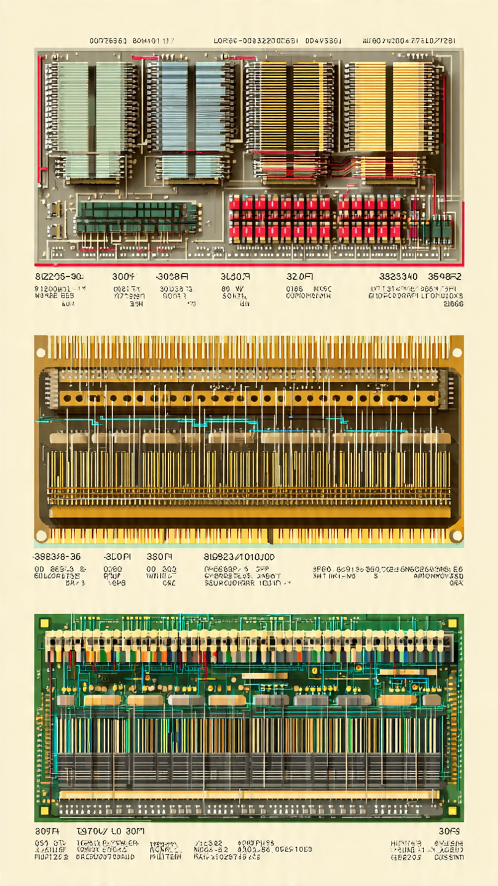
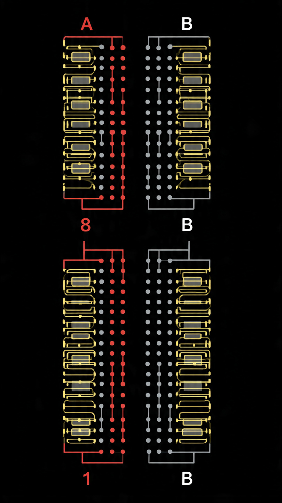
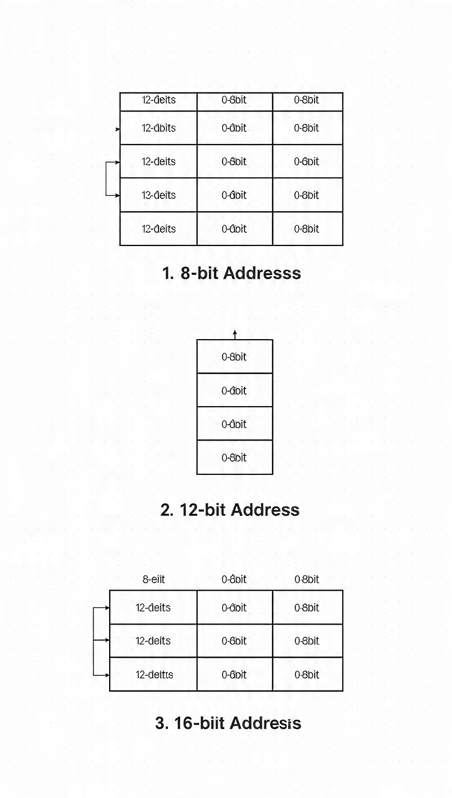
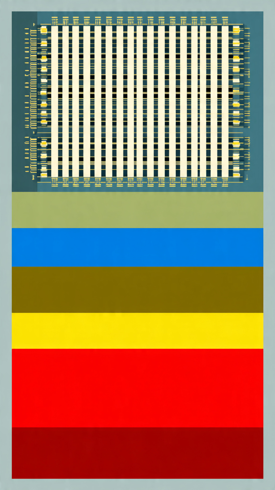

# Bits, Endereços de Memória e Ordenação de Bytes

## 2.2.1 Bits
- O que é um bit?: A menor unidade de informação no computador. Pode ser 0 ou 1.
- Por que bits?: Computadores usam linguagem binária (0s e 1s) para processar dados.

## 2.2.2 Endereços de Memória
- Memória é como uma rua com casas: Cada casa (posição de memória) tem um endereço único.
- Endereço de memória: Um número que identifica uma posição específica na memória.
- Como funciona?:
  - CPU quer acessar dado na memória → usa o endereço → pega o dado.
  - Endereços são números binários (ex.: 1010 em binário é endereço 10 em decimal).

## 2.2.3 Ordenação de Bytes
- Byte: Grupo de 8 bits. É como um "caracter" (ex.: letra 'A' = 1 byte).
- Problema: Computadores podem armazenar bytes em ordens diferentes:
  - Big-endian: Salva o byte mais significativo primeiro (ex.: 0x1234 → 12 34).
  - Little-endian: Salva o byte menos significativo primeiro (ex.: 0x1234 → 34 12).
- Por que importa?: Se você troca dados entre sistemas com ordenações diferentes, pode dar erro!

Exemplo prático:
- Número: 0xAABBCCDD
- Big-endian: AA BB CC DD
- Little-endian: DD CC BB AA

## Organizações de Memória
Três organizações para memória de 96 bits:
1. *1 bit por célula*: | b0 | b1 | b2 | ... | b95 |
2. *8 bits (1 byte) por célula*: | byte0 | byte1 | ... | byte11 |
3. *32 bits (4 bytes) por célula*: | word0 (32b) | word1 (32b) | word2 (32b) |

## Exemplos de Ordenação de Bytes (32 bits)
### Big-endian:
Endereço: 0 1 2 3
Valor: |A |B |C |D |

### Little-endian:
Endereço: 0 1 2 3
Valor: |D |C |B |A |

## Exemplos de Memória
a) 12 endereços de 8 bits
0 □ □ □ □ □ □ □ □
1 □ □ □ □ □ □ □ □
...
11 □ □ □ □ □ □ □ □

b) 8 endereços de 12 bits
0 □ □ □ □ □ □ □ □ □ □ □ □
...

c) 6 endereços de 16 bits
0 □ □ □ □ □ □ □ □ □ □ □ □ □ □ □ □
...

## Exemplo de Armazenamento de Dados
Suponha que os dados sejam armazenados em uma palavra de 32 bits (4 bytes):
- Nome: "Jim " (4 bytes, ASCII)
- Sobrenome: "Smit" (4 bytes, ASCII, truncado para caber)
- Idade: 1 byte (21)
- Departamento: 2 bytes (260)

### Big-endian:
□ J □ i □ m □ (bytes 0-3: "Jim ")
□ S □ m □ i □ t (bytes 4-7: "Smit")
□ 0 □ 0 □ 0 □21 (bytes 8-11: idade 21, padding)
□ 0 □ 1 □ 0 □ 4 (bytes 12-15: departamento 260 = 0x0104)

### Little-endian:
□ □ m □ i □ J (bytes 0-3: "Jim ")
□ t □ i □ m □ S (bytes 4-7: "Smit")
□21 □ 0 □ 0 □ 0 (bytes 8-11: idade 21, padding)
□ 4 □ 0 □ 1 □ 0 (bytes 12-15: departamento 260 = 0x0104)
