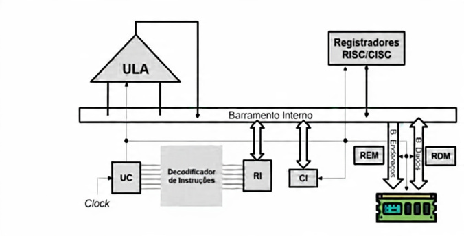

## CPU
A CPU é responsável pelo processamento e execução de programas armazenados na memória prncipal.

A CPU é composta por três partes distintas, são elas:

  1) Registradores;
  2) Unidade de Controle (UC); 
  3) Unidade Lógica Aritmética (ULA).

A CPU pode ser dividida em duas categorias funcionais, são elas, às quais podem ser chamadas de unidades:

  1) Unidade funcional de Controle;
  2) Unodade funcional de Processamento.

Diagrama Funcionamento CPU

## Unidade Funcional de Processamento
Esta área é responsável pela execução física das operações.

 - ULA (Unidade Lógica e Aritmética): É o componente encarregado de realizar todos os cálculos matemáticos (soma, subtração) e operações lógicas do sistema.

 - Registradores RISC/CISC: Pequenas áreas de armazenamento de alta velocidade localizadas dentro do processador para guardar dados temporários que estão sendo processados no momento.

 - Barramento Interno: É a via de comunicação que interliga todos os componentes internos da CPU, permitindo o tráfego de dados entre a unidade de processamento e a unidade de controle.

## Unidade Funcional de Controle
Esta unidade atua como o "cérebro" da CPU, coordenando o fluxo de informações.

 - UC (Unidade de Controle): Gerencia o funcionamento de todas as partes do computador sob o ritmo de um sinal de Clock.

 - Decodificador de Instruções: Recebe a instrução vinda da memória e a traduz em sinais que a ULA e outros componentes possam entender e executar.

 - RI (Registrador de Instrução): Armazena a instrução que está sendo executada no exato momento pelo processador.

 - CI (Contador de Instrução): Aponta para o endereço da próxima instrução que será buscada na memória para execução.

## Interface com a Memória Principal
Estes registradores gerenciam a entrada e saída de dados para a RAM.

 - REM (Registrador de Endereço de Memória): Armazena temporariamente o endereço de memória que a CPU deseja acessar (seja para ler ou escrever), enviando essa informação pelo Barramento de Endereços.

 - RDM (Registrador de Dados de Memória): Funciona como uma zona de espera para os dados reais que chegam ou saem da memória através do Barramento de Dados.

 Para explicar como a CPU processa a soma de dois valores (ex: $2 + 3$), vamos seguir o Ciclo de Busca:
 
Decodificação e Execução utilizando os componentes do diagrama:

1. Fase de Busca (Fetch)
Nesta etapa, a CPU busca a instrução que está na Memória Principal.

 - CI (Contador de Instrução): Contém o endereço de memória onde está a instrução de "Soma".

 - REM (Reg. de Endereço de Memória): Recebe esse endereço do CI e o envia para a memória via Barramento de Endereços.

 - Memória Principal: Localiza o dado e o envia de volta pelo Barramento de Dados.

 - RDM (Reg. de Dados de Memória): Recebe o código da instrução vindo da memória.

 - RI (Registrador de Instrução): O RDM repassa a instrução para o RI, que a armazena para processamento imediato.

2. Fase de Decodificação (Decode)
A unidade de controle interpreta o que deve ser feito.

 - UC (Unidade de Controle): Lê a instrução no RI e a envia para o Decodificador de Instruções.
 
 - Decodificador: Traduz a instrução (ex: transforma o código binário na operação "SOMAR") e identifica onde estão os valores $2$ e $3$.

3. Fase de Execução (Execute)
A operação física acontece agora.

 - Barramento Interno: Transporta os valores ($2$ e $3$) dos Registradores para a ULA.
 
 - ULA (Unidade Lógica e Aritmética): Recebe o comando da UC e realiza o cálculo matemático $2 + 3 = 5$.
  
 - Registradores RISC/CISC: O resultado ($5$) é guardado temporariamente em um registrador de dados.

4. Fase de Escrita (Write-back)
O resultado final é enviado de volta para a memória ou exibido.

 - RDM: Recebe o valor $5$ do registrador.
 
 - Barramento de Dados: O RDM envia o resultado para a Memória Principal para que ele possa ser salvo no seu HD ou mostrado na tela.
  
 - CI: É incrementado para apontar para o endereço da próxima instrução, reiniciando o ciclo.

| Processamento | Armazenamento |
| ULA (Cálculos) | Registradores |
|  |  |
|  | BARRAMENTO INTERNO |
| UC (Controle) | RI (Instrução Atual) |
| REM (Endereços) ---> [B. Endereços] | Decodificador |
| CI (Próxima Inst.) | RDM (Dados) <-> [B. Dados] |
| CLOCK (Sincronismo) | MEMÓRIA PRINCIPAL (RAM) |

## Undade Funcional de Processamento

Processar dados é a finalidade de sistema computacional e consiste em executar uma ação, com os dados, que produz algum tipo de resultado.

ULA -------> Registradores RISC/CISC

Logo as tarefas mais comuns do processamento são:

 - operações aritméticas (soma, subtrair, multiplicar, dividir);
 - operações lógicas (AND, OR, XOR, entre outras);
 - movimentação de dados entre a CPU e a memória.

A ULA pode ser considerada o "núcleo" da CPU, onde a maioria das operações matemáticas e lógicas ocorre.

São exemplos de operações executadas pela ULA: soma, multiplicação, operações lógicas (AND, OR, NOT, XOR, entre outras), incremento, decremento, entre outras operações básicas.

A ULA não lida diretamente com as instruções do programa. Em vez disso, recebe instruções da Unidade de Controle (UC) da CPU, que interpreta as instruções e determina as operações a serem executadas pela ULA.

## Registradores

Memória limitada de armazenamentoi temporário.

A quantidade e o emprego dos registradores variam bastante de modelo para modelo de processador.

A maioria dos processadores modernos utiliza arquitetura baseadas em registradores geral (RISC/CISC)

  - RISC (Reduce Instruction Set Computer):
  Caracterizada pela simplicidade e eficiência na execução de instrução (voltado mais para dispositivos móveis);

  - CISC (Complex Instruction Set Computer):
  Caracterizada por um conjunto de instruções mais complexo e abragente (usado em PCs e servidores).

## Unidade Funcional de Controle

Esta unidade é responsável pela realização das seguintes atividades:

 - busca da instrução que será executada, armazenando-a em um registrador da CPU;
 - interpretação das instruções a fim de saber quais operações deverão ser executadas pela ULA (soma, subtração e etc);
     - geração de sinais de controle apropriados para a ativação das atividades necessárias;

UC  <------>  Decodificador de Instruções  <------>  RI      CI      REM    RDM

## CI e RI

O CI - Contador de instruções realiza a contagem das instruções cujo valor aponta para a próxima instrução a ser buscada da memória a ser executada no processador.

Assim o CI é um registrador crucial para o processo de controle e de sequenciamento da execução dos programas,

O RI - Registrador de Instruções tem a função de armazenar a instrução a ser executada pela CPU.

 Clock --> UC -------- Decodificador --------- RI        CI

## Decodificador de Instruções

O RI irá passar ao decodificador uma sequência de bits representando uma instrução a ser executada.

A função do decodificador de instrução é identificar que operação será realizada, correlacionada à instrução cujo código de operação foi decodificado.

---- Registrador de Instrução ------> Decodificador -------> UC ---------> Sinais de controle

O RI passa um código de instrução ao decodificador, que é decodificado (interpretado) e encaminhado à UC para que ela emita sinais de controle para os demais elementos da CPU.

## O RDM e REM

O RDM - Registrador de Dados de Memória armazena temporariamente dados que estão sendo transferidos da memória principal para a CPU (e vice-versa).

A quantidade de bits que pode ser armazenada no RDM é a mesma quantidade suportada pelo barramento de dados.

O REM - Registrador de Endereços de Memória armazena temporariamente  o endereço de acesso a uma posição de memória, necessaŕio ao se iniciar uma operação de leitura ou de escrita, também limitado barramento endereço.

Barramento Interno----------REM[B. Endereços] ------> Memória principal
Barramento Interno----------RDM[B. Dados] ----------> Memória principal

## Considerações finais

A Unidade de Controle (UC) e a Unidade Lógica Aritmética (ULA) são duas partes fundamentais de um processador, e elas trabalham em conjunto para executar as operações de um programa.

A UC busca instruções da memória, decodifica essas instruções , controla a sequência de operações e sincroniza o tempo de execução, controlando o fluxo de dados entre a ULA e outros componentes do processador, como registradores e memória.

A ULA opera nos dados fornecidos pela UC e produz os resultados dessa operações.

| Processamento | Armazenamento |
| :--- | :--- |
| ULA (Cálculos) | Registradores |
|  |  |
|  | BARRAMENTO INTERNO |
| UC (Controle) | RI (Instrução Atual) |
| REM (Endereços) ---> [B. Endereços] | Decodificador |
| CI (Próxima Inst.) | RDM (Dados) <-> [B. Dados] |
| CLOCK (Sincronismo) | MEMÓRIA PRINCIPAL (RAM) |

graph TD
    subgraph "Unidade Funcional de Processamento"
        ULA[ULA - Unid. Lógica e Aritmética]
        REG[Registradores RISC/CISC]
    end

    BARRAMENTO{{"========== BARRAMENTO INTERNO =========="}}

    subgraph "Unidade Funcional de Controle"
        UC[UC - Unidade de Controle]
        DEC[Decodificador de Instruções]
        RI[RI - Reg. de Instrução]
        CI[CI - Contador de Instrução]
    end

    subgraph "Interface de Memória"
        REM[REM - Endereços]
        RDM[RDM - Dados]
    end

    RAM[("MEMÓRIA PRINCIPAL (RAM)") ]

    %% Conexões
    ULA <--> BARRAMENTO
    REG <--> BARRAMENTO
    UC <--> DEC
    DEC <--> RI
    RI <--> BARRAMENTO
    CI <--> BARRAMENTO
    REM <--> BARRAMENTO
    RDM <--> BARRAMENTO

    %% Fluxo Externo
    REM ---->|Barramento de Endereços| RAM
    RDM <---->|Barramento de Dados| RAM

## Resumo das Funções Baseado no Diagrama:

ULA: Executa operações matemáticas e lógicas.

Registradores RISC/CISC: Armazenamento de alta velocidade para dados imediatos.

UC & Clock: Coordenam o tempo e o fluxo de dados.

RI & CI: Controlam, respectivamente, a instrução atual e o endereço da próxima.

REM & RDM: Gerenciam a interface de endereços e dados com a memória principal.

