# Portas Lógicas e suas funções Elementos 

## Elementos Eletrônicos
Um computador é constituído de elementos eletrônicos, como capacitores, resistores e, principalmente, transitores.

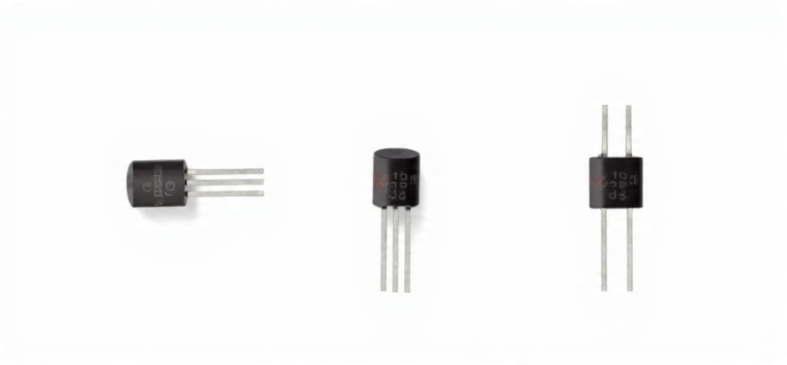

1. Resistor (R)
O resistor oferece resistência à passagem da corrente elétrica.

### Capacitor
Um capacitor é um componente eletrônico utilizado para armazenar e liberar carga elétrica, utilizado para filtar ruídos, estabilizar tensões ou temporizar sinais.

- **Função**: Armazenar carga elétrica e liberar quando necessário.
- **Unidade**: Farad (F)

(Não Polarizado)              (Polarizado)
           |  |                         + |  |
        ---|  |---                   -----|  |-----
           |  |                           |  |

### Resistor
Um resistor é um componente eletrônico que limita a corrente elétrica em um circuito, ajustando os níveis de tensão.

- **Função**: Reduzir a tensão e controlar a corrente.
- **Unidade**: Ohm (Ω)

(Padrão Americano)           (Padrão Europeu)
    ---/\/\/\/\/\/\/\/\---        -------[      ]-------

### Transistor
Um transistor é um dispositivo semicondutor utilizado para amplificar ou controlar o fluxo de corrente em um circuito e comuta sinais elétricos.

Os transitores são componentes que precisam armazenar os sinais binários e realizar certos tipos de operações com eles.

Desse modo, por permitirem ou não a pasagem de sinais binários, é necessário o uso de portas lógicas.

Os circuitos que contém as portas lógicas são conhecidos como circuitos lógicos.

Portanto, a porta lógica é a base para a construção de qualquer sistema digital (ex:. o microprocessador que é formado por várias portas lógicas).

Em geral, os circuitos lógicos são agrupados e embutidos em um Circuito Integrado (CI), com o objetivo de cumprir tarefas específicas.

Desse modo, portas lógicas são encontradas desde o nível de integração em Ultra Larga Escala (ULSI) ou Super Larga Escala (SLSI) até circuitos digitais mais simples.

- **Função**: Amplificar ou comutar sinais.
- **Tipos**: NPN, PNP, MOSFET, etc.

Coletor (C)
                  |
                  |
          B ------+
         Base    / \
                /   \ > Emissor (E)

# Álgebra de chaveamentos
Semelhante à algebra tradicional , torna-se necessário definir símbolos matemáticos e gráficos para representar as operações lógicas e seus operadores.

Uma operação lógica qualquer (ex:. soma ou multiplicação de binários) sempre irá resultar em dois valores possíveis: 0 (falso) ou 1 (verdadeiro).

Para representar tais possibilidades, utiliza-se de uma forma de organizá-las chamada Tabela Verdade.
## Portas Lógicas
### Definição
Portas lógicas são circuitos eletrônicos que realizam operações lógicas básicas, como AND, OR, NOT, etc.

### Porta AND
A porta AND produz uma saída verdadeira (1) apenas quando todas as entradas são verdadeiras.

A  B
|  |
|  |
+--+--+
| AND |
+-----+
|
Q

- **Tabela-Verdade**:

| A | B | Q |
|---|---|---|
| 0 | 0 | 0 |
| 0 | 1 | 0 |
| 1 | 0 | 0 |
| 1 | 1 | 1 |

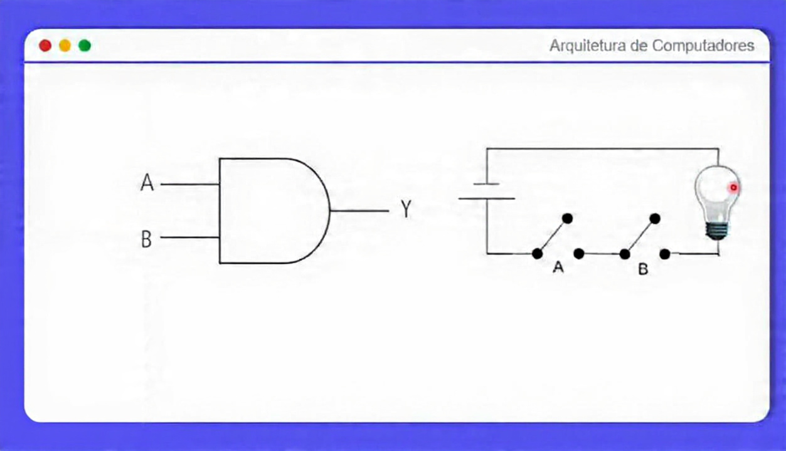

Para acender a lâmpada da image-6.png, só ocorrerá se A e B forem verdades.

** Tabela verdade - Porta AND

 Entradas | | Saída |
 A | B | Y = A.B |
|---|---|---|
| 1 | 1 | 1 |
| 1 | 0 | 0 |
| 0 | 1 | 0 |
| 0 | 0 | 0 |

Conforme é possível observar, a regra é: “se o primeiro operando é 1 e o segundo operando é 1, o resultado é 1 (Verdadeiro), senão o resultado é 0 (Falso)”.

## Funcionamento
- A saída Y é *1* apenas quando *A E B* são *1*.
- Caso contrário, Y é *0*.
- A porta AND só acende a lâmpada (Y=1) se *ambas as entradas A e B estiverem ligadas (1)*.

### Porta OR
A porta OR produz uma saída verdadeira (1) quando pelo menos uma entrada é verdadeira.

A  B
|  |
|  |
+--+--+
| OR  |
+-----+
|
Q

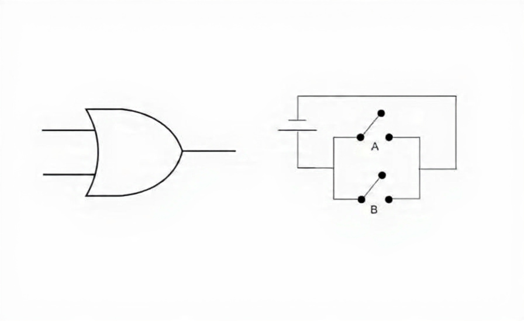

Trata-se de uma operação que aceita dois operandos, binários simples (0 e 1) ou duas entradas (A e B).

Podemos dizer que a operação OR simula uma soma de binários, muito utilizadas em lógica digital ou mesmo em comandos de decisão de algumas linguagens de programação (ex.: Se (X=1 OU Y=1) Então Executa uma ação).

Os circuitos representam:

1. Porta lógica OR:
    - Entradas A e B.
    - Saída Y = A + B (OU lógico).

2. Circuito elétrico equivalente:
    - Dois interruptores A e B em paralelo ligados a uma lâmpada (Y).
    - A lâmpada acende se A ou B (ou ambos) estiverem fechados (1).
    - Apaga apenas quando ambos A e B estão abertos (0).

A operação OR é uma soma lógica binária usada em lógica digital e programação (ex.: if (X == 1 || Y == 1)).

- **Tabela-Verdade**:

 Entradas | | Saída |
|---|---|---|
| A | B | Y = A+B |
| 1 | 1 | 1 |
| 1 | 0 | 1 |
| 0 | 1 | 1 |
| 0 | 0 | 0 |

A regra da porta OR é: “se o primeiro operando é 1 ou o segundo operando é 1, ou se os dois operandos forem 1, o resultado é 1; senão, o resultado é 0”.

### Porta XOR
A porta XOR produz uma saída verdadeira (1) quando as entradas são diferentes.

A  B
|  |
|  |
+--+--+
| XOR |
+-----+
|
Q

A denominação XOR é a abreviação do termo EXCLUSIVE OR. Trata-se de uma operação que aceita dois operandos, binários simples (0 e 1) ou duas entradas (A e B).

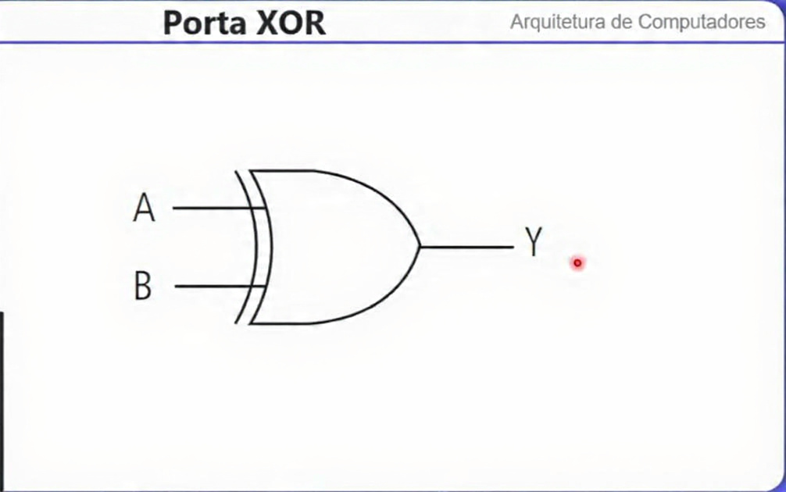

Pode-se dizer que a operação XOR possui como principal função a verificação de igualdade, utilizado na fabricação de um testador de igualdade entre valores.

- **Tabela-Verdade**:

| Entradas |  | Saída |
|---|---|---|
| A | B | Y = A ⊕ B |
| 1 | 1 | 0 |
| 1 | 0 | 1 |
| 0 | 1 | 1 |
| 0 | 0 | 0 |

Conforme é possível observar, a regra é: “se o primeiro operando ou o segundo operando for igual a 1, o resultado é 1; senão, o resultado é 0”. Ou seja, para entradas iguais a saída será 0 e para entradas diferentes a saída será 1.

### Porta NOT
A porta NOT inverte a entrada.

A
|
+-----+
| NOT |
+-----+
|
Q

A porta NOT representa um inversor. Essa operação aceita apenas um operando ou uma entrada (A), o operando pode ser um dígito binário (0 ou 1).

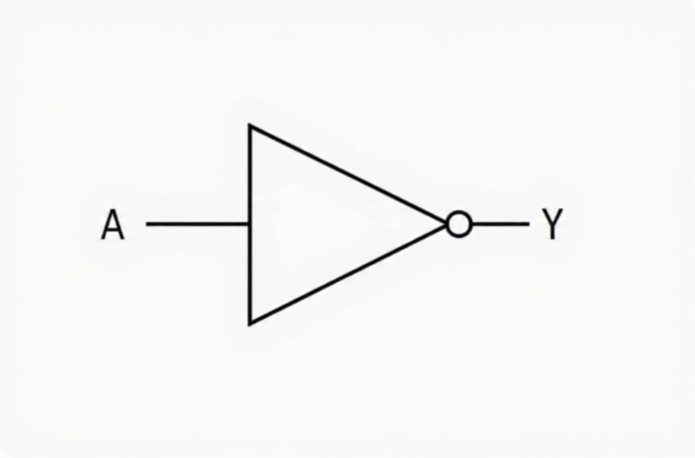

# Tabela verdade – Porta NOT

| Entradas | Saída |
|-----------|-------|
| A         | Y = Ā |
| 0         | 1     |
| 1         | 0     |

Conforme é possível observar, a regra é: "se o operando for , o resultado é 0, senão o resultado é 1.

Existem outras portas lpogicas derivadas da portas apresentadas.

Tais portas NAND (porta AND invertida) e a porta NOR (porta OR invertida.

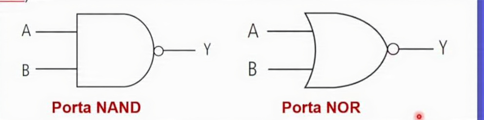

As operações lógicas são realizadas em dois sentidos: primeiro a operação AND ou OR e, em seguida, o seu resultado é invertido.

## Resumo dos símbolos gráficos

A imagem apresenta uma tabela com as funções lógicas básicas, seus símbolos gráficos (portas lógicas) e as respectivas equações Booleanas. Aqui está um resumo do conteúdo da tabela:

1. AND:
    - Símbolo gráfico: porta AND.
    - Equação Booleana: Y = A . B.

2. OR:
    - Símbolo gráfico: porta OR.
    - Equação Booleana: Y = A + B.

3. XOR:
    - Símbolo gráfico: porta XOR.
    - Equação Booleana: Y = A \oplus B.

4. NOT:
    - Símbolo gráfico: porta NOT (inversor).
    - Equação Booleana: Y = A barra acima.

5. NAND:
    - Símbolo gráfico: porta NAND.
    - Equação Booleana: Y = A . B  barra acima.

6. NOR:
    - Símbolo gráfico: porta NOR.
    - Equação Booleana: Y = A + B.

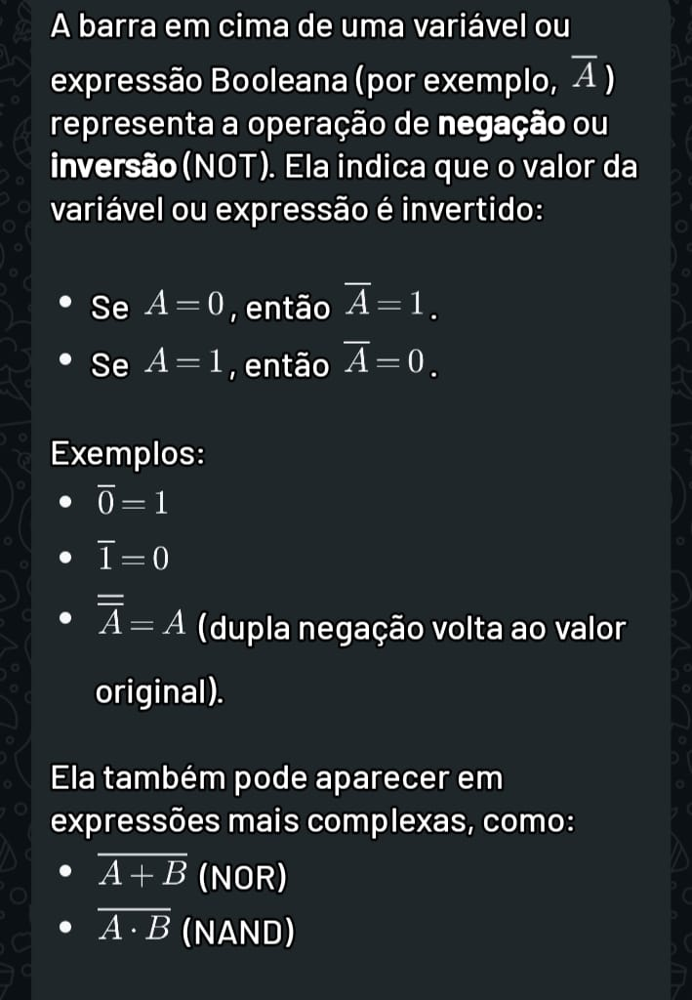

## RESUMO DOS SÍBOLOS GRÁFICOS

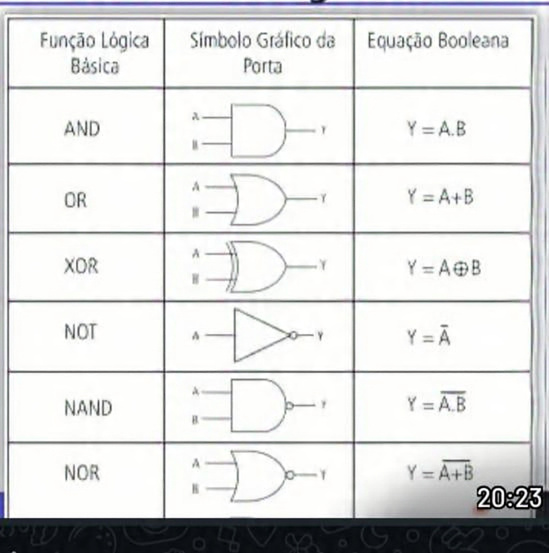

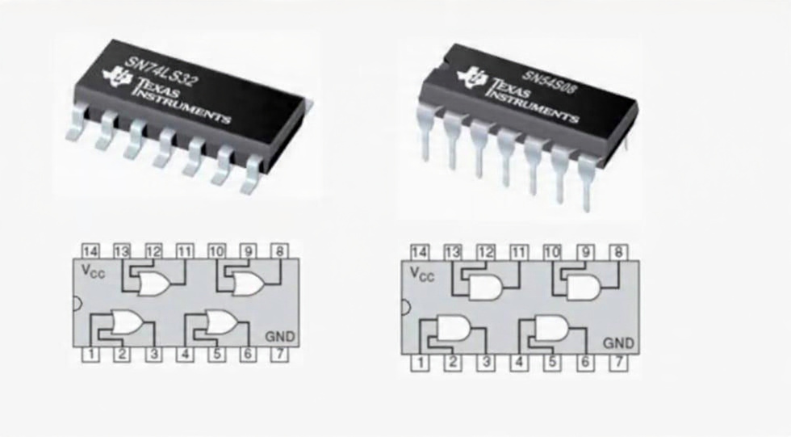

## Expressão lógica dos circuitos

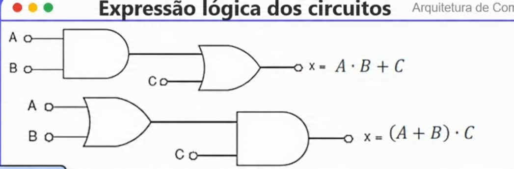

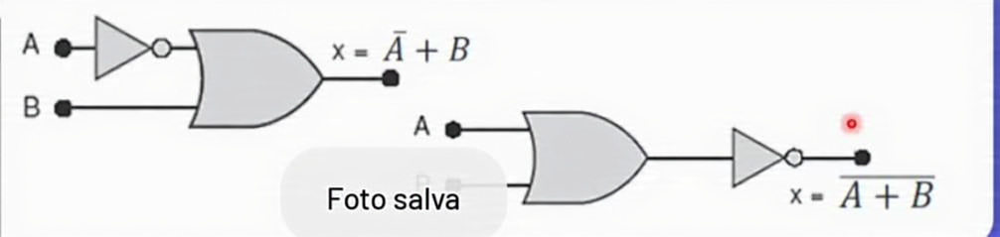

## Eexemplos práticos de circuitos lógicos:

1. Circuito de Alarme:
- Entradas: Sensor de porta (A) e Sensor de janela (B)
- Saída: Alarme (S)
- Lógica: S = A OR B (Se a porta ou a janela for aberta, o alarme dispara)

2. Circuito de Controle de Iluminação:
- Entradas: Interruptor (A) e Sensor de movimento (B)
- Saída: Luz (S)
- Lógica: S = A AND B (A luz acende se o interruptor estiver ligado e houver movimento)

3. Circuito de Autorização:
- Entradas: Cartão de acesso (A) e Senha (B)
- Saída: Porta desbloqueada (S)
- Lógica: S = A AND B (A porta é desbloqueada se o cartão e a senha estiverem corretos)

## Exercícios:

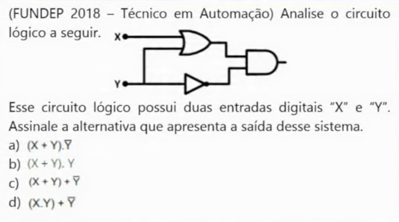

a) Alternativa correta.

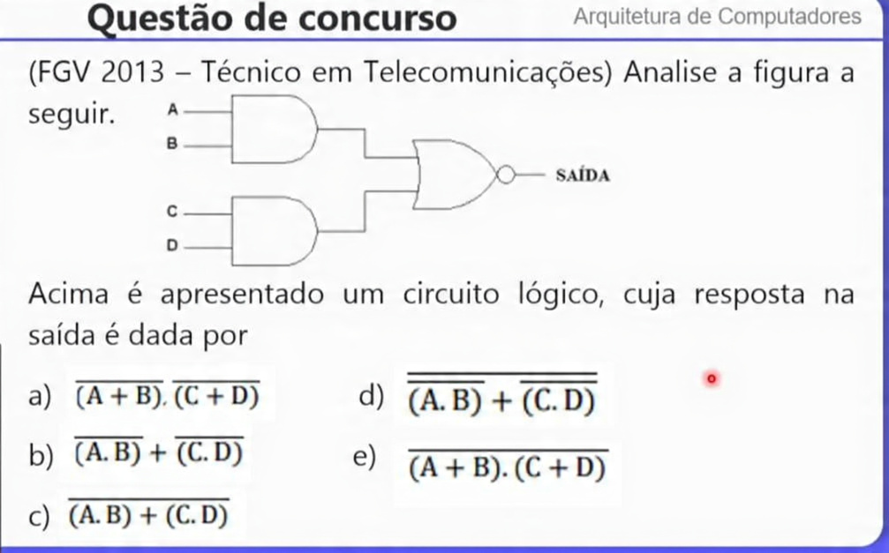

c) Alternativa correta.

b) Alternativa correta.

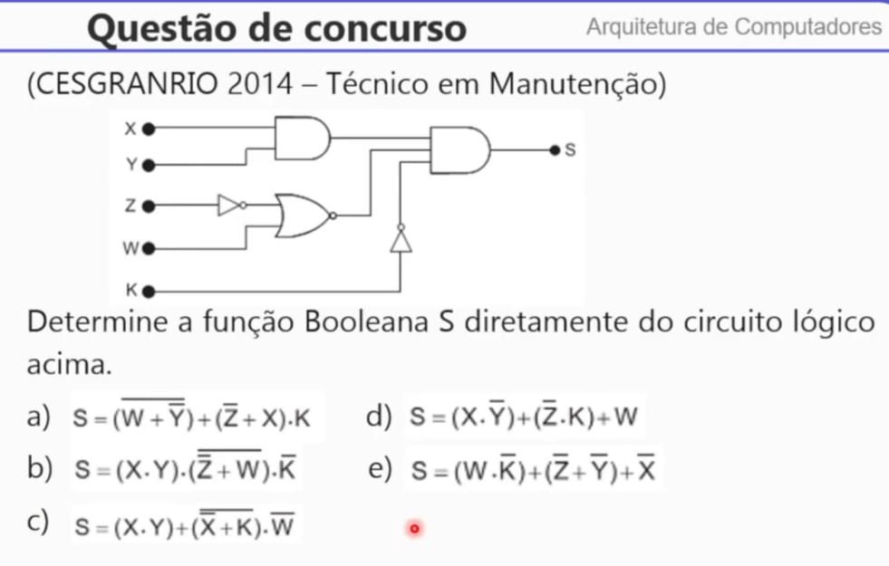

b) Alternativa correta.
