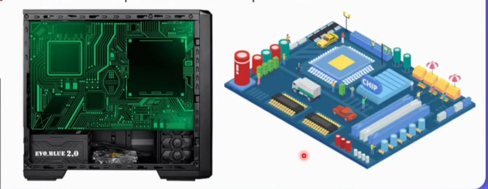
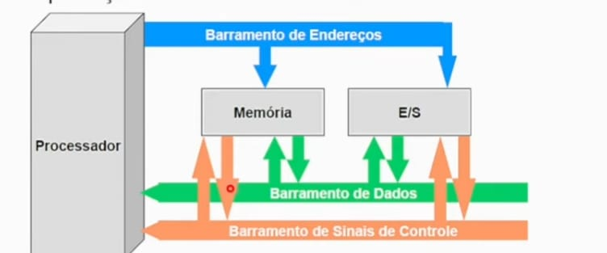
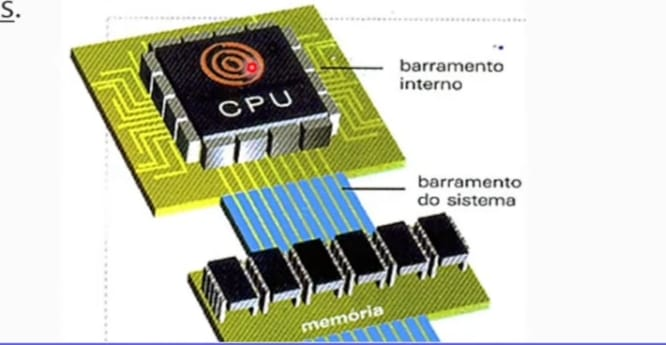
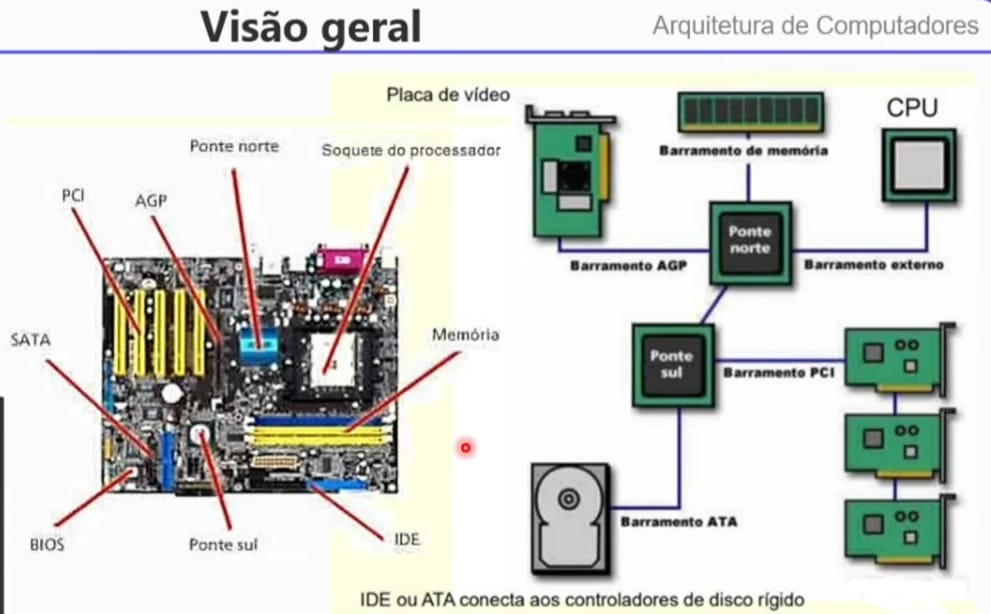

##  Barramentos

Os diversos componentes de um computador se comunicam através de barramentos.

Então barramento consite no conjunto de condutores elétricos que se interligam os diversos componentes do computador.

O barramento organiza o tráfego de informações observando as necessidades de recursos e as limitações de tempo de cada componente.

Barramento do sistema - É o caminho por onde trafegam todas as informações dentro do computador.

Barramento -> CPU -> Memória -> Disco -> Impresora -> Mouse -> Monitor -> Modem -> Disqete -> Teclado

| Processamento | Armazenamento |
| :--- | :--- |
| ULA (Cálculos) | Registradores |
|  |  |
|  | BARRAMENTO INTERNO |
| UC (Controle) | RI (Instrução Atual) |
| REM (Endereços) ---> [B. Endereços] | Decodificador |
| CI (Próxima Inst.) | RDM (Dados) <-> [B. Dados] |
| CLOCK (Sincronismo) | MEMÓRIA PRINCIPAL (RAM) |

## Categoria de barramento

A) Quanto à Estrutura (Funcionalidade)
 - Barramento de Dados: Transporta a informação propriamente dita. É bidirecional (a CPU lê e escreve dados).

 - Barramento de Endereços: Indica a localização (na memória ou periférico) de onde o dado deve ser retirado ou para onde deve ser enviado. É unidirecional (partindo da CPU).

 - Barramento de Controle: Transporta sinais de sincronização e comando (ex: sinal de "leitura", sinal de "escrita", sinal de "espera").

B) Quanto à Hierarquia (Localização)
 - Barramento Local: Conecta os componentes internos da CPU (ULA, UC, Registradores).

 - Barramento do Sistema: Conecta a CPU à Memória Principal (RAM).

 - Barramento de Expansão (E/S): Conecta a CPU aos periféricos de entrada e saída (Mouse, Teclado, Discos, Impressoras) através de slots como PCI Express ou USB.

| Processamento | Armazenamento |
| :--- | :--- |
| ULA (Cálculos) | Registradores |
|  |  |
|  | BARRAMENTO INTERNO |
| UC (Controle) | RI (Instrução Atual) |
| REM (Endereços) ---> [B. Endereços] | Decodificador |
| CI (Próxima Inst.) | RDM (Dados) <-> [B. Dados] |
| CLOCK (Sincronismo) | MEMÓRIA PRINCIPAL (RAM) |

## Estrutura de barramento
Barramento do Sistema é composto por:

### Barramento de Dados:

Função: Transporta o conteúdo real (instruções ou dados numéricos).

Este barramento interliga o RDM (localizado na CPU) à memória principal, para transferência de instruções ou dados a serem executados. 

Direção: É bidirecional. A CPU pode tanto ler dados da memória/periféricos quanto escrever neles. Ora os dinais percorrem o bar=ramento vindo da CPU para a memória principal (operação de escrita), ora percorre o caminho inverso.

Possui influência direta no desempenho do sistema, pois quanto maior a sua largura, maior o némero de bits *dados) trnasferidos (inicialmente com 8 bites nos primeiros PCs).

Capacidade: A largura deste barramento (ex: 8 bits, 16 bits,32 bits, 64 bits e 128 bits) determina a quantidade de dados que o computador pode processar por vez.

### Barramento de Endereços:

Interliga o REM (localizado na CPU) à memória principal para transferência dos bits que representamum determinado endereço de memória onde se localiza uma instrução ou dado a ser executado.

Função: Transporta a informação de "onde" o dado está. Ele identifica a posição de memória ou o dispositivo de E/S específico que a CPU deseja acessar.

Direção: É unidirecional. Apenas a CPU envia endereços para o sistema para selecionar o local de leitura ou escrita.

Impacto: O tamanho deste barramento define a capacidade máxima de memória RAM que o sistema consegue endereçar.

### Barramento de Controle:

Função: Transporta sinais que coordenam as atividades. Ele avisa se a operação é de leitura ou escrita, envia sinais de interrupção e sincroniza o tempo através do clock.

Direção: Geralmente bidirecional, pois os componentes precisam confirmar para a CPU que receberam o sinal ou que estão prontos.

Esquema de Entendimento (Fluxo)
Para entender como eles trabalham juntos em uma operação de Leitura de Memória:

A UC envia um sinal pelo Barramento de Controle avisando: "Vou ler um dado".

A CPU coloca o endereço da célula de memória no Barramento de Endereços (através do REM).

A Memória Principal identifica o endereço e coloca o dado solicitado no Barramento de Dados.

O dado chega à CPU e é armazenado no RDM para ser processado.

Os barramentos compartilham suas vias de comunicação (normalmente fios de cobre) entre diversos componentes neles conectados.

## Hierarquia de barramentos

Devido a grande diferença de características dos diversos componentes existentes, principalmente periféricos.

Os projetistas de sistemas de computação criaram diversos tipos de barramentos, apresentando taxas de transferência de bits diferentes e apropriados às velocidades dos componetes interconectados.

Nesse caso há uma hierarquia em que os barramentos são organizados:

    -  Barramento local (local bus);
    -  Barramento do sistema (system bus);
    -  Barramento de expansão (expansiom bus).

### Barramento local ou interno

Possui maior velocidade de transferência de dados, funcionando normalmente na mesma frequência do relógio do processaddor.

Este barramento conectam os componentes internos de um sistema de computador, permitindo uma rápida e eficiente entre esses componentes essenciais.

### Barramento do sistema

Permite que o barramento local faça a ligação entre a CPU e outros componentes do sistema, como a memória RAM, a cache de nível 2 (L2), fazendo uso do chipset nort da placa-mãe.

### Barramento de expansão ou E/S

Chamado de barramento de E/S é responsável por interligar os diversos dispositivos de E/S aos demais componentes de áudio, rede, USB e dispositivos de armazenamento.

Utiliza uma ponte sul (chipset) para se conectar ao barramento do sostema (as pontes sincronozam as diferente velocidades dos barramentos).

| Processamento | Armazenamento |
| :--- | :--- |
| ULA (Cálculos) | Registradores |
|  |  |
|  | BARRAMENTO INTERNO |
| UC (Controle) | RI (Instrução Atual) |
| REM (Endereços) ---> [B. Endereços] | Decodificador |
| CI (Próxima Inst.) | RDM (Dados) <-> [B. Dados] |
| CLOCK (Sincronismo) | MEMÓRIA PRINCIPAL (RAM) |

1. Estrutura do Barramento do Sistema
Conforme a primeira imagem, o barramento é o caminho de comunicação que interliga a CPU, a Memória Principal (MP) e os dispositivos de Entrada e Saída (E/S) através de três vias:

Barramento de Dados: Transporta a informação real (instruções ou dados). É bidirecional, permitindo que a CPU leia e escreva dados.

Barramento de Endereços: Indica a localização (na memória ou periférico) onde a CPU deseja acessar. É unidirecional (saída da CPU).

Barramento de Controle: Transporta sinais de sincronismo (clock) e comandos (leitura/escrita) para coordenar o sistema.

2. Componentes da Placa-Mãe (Chipset e Conectores)
De acordo com a imagem de "Visão Geral", os componentes são divididos e gerenciados pelo Chipset:

Ponte Norte (Northbridge): Chip responsável por controlar os componentes de alta velocidade, como a Memória RAM e a Placa de Vídeo (AGP/PCI Express). Ele conecta esses itens diretamente à CPU pelo barramento frontal.

Ponte Sul (Southbridge): Gerencia os componentes mais lentos e de entrada/saída, como os barramentos PCI, portas SATA/IDE (discos rígidos), portas USB e a BIOS.

Soquete do Processador: O local físico na placa-mãe onde a CPU é instalada.

Slots de Memória: Onde são encaixados os pentes de memória RAM.

SATA / IDE (ATA): Interfaces para conexão de unidades de armazenamento, como HDDs e SSDs.

PCI / AGP: Slots de expansão para placas de vídeo (AGP é um padrão antigo) e outras placas de expansão (som, rede, etc. via PCI).

BIOS: Chip que contém o firmware básico para iniciar o hardware do computador.

### Slots

Os Slots (fendas de expansão) são conectores que permitem a comunicação entre periféricos e o Barramento de Expansão. Com base na imagem da placa-mãe que você enviou, aqui estão os principais:

Slot de Memória (DIMM): Onde são encaixados os módulos de Memória RAM. Ele se comunica diretamente com a Ponte Norte através do barramento de memória para garantir alta velocidade.

Slot PCI (Peripheral Component Interconnect): Um slot mais antigo e lento, usado para placas de som, rede ou modems. Ele é gerenciado pela Ponte Sul.

Slot AGP / PCI Express: Slots de alta performance dedicados exclusivamente a Placas de Vídeo. O PCI Express substituiu o AGP e conecta-se à Ponte Norte (ou diretamente à CPU em arquiteturas modernas) para lidar com o grande volume de dados gráficos.

Conectores SATA/IDE: Embora tecnicamente interfaces de cabos, funcionam como "slots" de dados para Discos Rígidos (HD/SSD) e unidades de CD/DVD, sendo controlados pela Ponte Sul.

Como os Slots se relacionam com a sua Tabela?
Quando uma placa de vídeo está em um Slot PCI Express, ela recebe dados processados pela ULA, orientados pela UC, e as coordenadas de memória vêm do REM através do Barramento de Endereços, tudo sincronizado pelo Clock do sistema.

