# O nível lógico digital

Na parte inferior da hierarquia da Figura 1.2 encontramos o nível lógico digital, o real hardware do computador. Neste capítulo, examinaremos muitos aspectos da lógica digital, como um fundamento para o estudo de níveis mais altos em capítulos subsequentes. Esse assunto está no limiar entre a ciência da computação e a engenharia elétrica, mas o material é independente, portanto, não há necessidade de experiência prévia de hardware nem de engenharia para entendê-lo. 

Os elementos básicos que fazem parte de todos os computadores digitais são surpreendentemente simples. Iniciaremos nosso estudo examinando esses elementos básicos e também a álgebra especial de dois valores (álgebra booleana) usada para analisá-los. Em seguida, examinaremos alguns circuitos fundamentais que podem ser construídos usando simples combinações de portas, entre eles os circuitos que efetuam a aritmética. O tópico que vem depois desse é o modo como essas portas podem ser combinadas para armazenar informações, isto é, como as memórias são organizadas. Logo após, chegamos à questão das CPUs e, em especial, de como é a interface entre CPUs de um só chip, a memória e os dispositivos periféricos. Mais adiante neste capítulo serão estudados diversos exemplos da indústria de computadores.

## 3.1 Portas e álgebra booleana
Circuitos digitais podem ser construídos com um pequeno número de elementos primitivos combinando-os de inúmeras maneiras. Nas seções seguintes, descreveremos tais elementos, mostraremos como eles podem ser combinados e introduziremos uma poderosa técnica matemática que pode ser usada para analisar seu comportamento.

## 3.1.1 Portas
Um circuito digital é aquele em que estão presentes somente dois valores lógicos. O normal é que um sinal entre 0 e 0,5 volt represente um valor (por exemplo, 0 binário) e um sinal entre 1 e 1,5 volt represente o outro valor (por exemplo, 1 binário). Não são permitidas tensões fora dessas duas faixas. Minúsculos dispositivos eletrônicos, denominados portas (gates), podem calcular várias funções desses sinais de dois valores. Essas portas formam a base do hardware sobre a qual todos os computadores digitais são construídos.

Os detalhes do funcionamento interno das portas estão fora do escopo deste livro, pois pertencem ao nível de dispositivo, que está abaixo do nível 0. Não obstante, agora vamos divagar um pouco e examinar rapidamente a ideia básica, que não é difícil. No fundo, toda a lógica digital moderna se apoia no fato de que um transistor pode funcionar como um comutador binário muito rápido. Na Figura 3.1(a), mostramos um transistor bipolar (representado pelo círculo) inserido em um circuito simples. Esse transistor tem três conexões com o mundo exterior: o coletor, a base e o emissor. Quando a voltagem de entrada, Vin, está abaixo de certo valor crítico, o transistor desliga e age como uma resistência infinita. Isso faz com que a saída do circuito, Vout, assuma um valor próximo a Vcc, uma
voltagem regulada externamente, em geral +1,5 volt para esse tipo de transistor. Quando Vin excede o valor crítico, o transistor liga e age como um fio, fazendo Vout ficar conectado com a terra (por convenção, 0 volt).

O importante é notar que, quando Vin é baixa, Vout é alta, e vice-versa. Assim, esse circuito é um inversor, que converte um 0 lógico em um 1 lógico e um 1 lógico em um 0 lógico. O resistor (linha serrilhada) é necessário para limitar a quantidade de corrente drenada pelo transistor, de modo que ele não queime. O tempo típico exigido para passar de um estado para outro é tipicamente de um nanossegundo ou menos.

Na Figura 3.1(b), dois transistores estão ligados em série. Se ambas, V1 e V2, forem altas, ambos os transistores conduzirão e Vout cairá. Se qualquer das entradas for baixa, o transistor correspondente se desligará e a saída será alta. Em outras palavras, Vout será baixa se, e somente se, ambas, V1 e V2, forem altas.

Na Figura 3.1(c), os dois transistores estão ligados em paralelo em vez de em série. Nessa configuração, se qualquer das entradas for alta, o transistor correspondente ligará e conectará a saída com a terra. Se ambas as entradas forem baixas, a saída permanecerá alta.

Esses três circuitos, ou seus equivalentes, formam as três portas mais simples e são denominadas portas not, nand e nor, respectivamente. Portas not costumam ser denominadas inversoras; usaremos os dois termos indiferentemente. Se agora adotarmos a convenção de que “alta” (Vcc volts) é um 1 lógico e “baixa” (terra) é um 0 lógico, podemos expressar o valor de saída como uma função dos valores de entrada. Os símbolos usados para representar essas portas são mostrados nas figuras 3.2(a)-(c) junto com o comportamento funcional de cada circuito. Nessas figuras, A e B são entradas e X é a saída. Cada linha especifica a saída para uma combinação diferente das entradas.

Figura 3.1   (a) Inversor de transistor. (b) Porta nand. (c) Porta nor.

Sair da microarquitetura e descer para o Nível 0 (Lógica Digital) é como olhar para os átomos do processador. No ATmega168 ou na Mic-3, tudo se resume a esses transistores controlando o fluxo de elétrons.
Aqui está a representação dos circuitos analógicos que dão origem às portas lógicas digitais, usando os componentes que você descreveu (Vcc, Vout, Vin e os terminais do transistor).

    Circuitos de Transistores (Figura 3.1)

        (a) INVERSOR (NOT)           (b) PORTA NAND                (c) PORTA NOR
        
            +Vcc                         +Vcc                          +Vcc
            |                            |                             |
            R                            R                             R
            |                            |             +-------+-------+
            +---- Vout                   +---- Vout    |       |       |
            | Coletor                    |             |    +--+--+ +--+--+
        | /--+                       | /--+             +--- Vout  | |     |
    Vin -|<  Transistor          V1 -|<  (T1)            |    | /---+ | /---+
    Base  | \--+                       | \--+             V1 -|< (T1)  |< (T2)
            | Emissor                    |             V2 -|< (T1)  |< (T2)
            GND                      | /--+             |    | \---+ | \---+
                                V2 -|<  (T2)            |       |       |
                                    | \--+             +-------+-------+
                                            |                             |
                                        GND                           GND

Organização de Hardware: A Física da Lógica (Seu Padrão)

    Processamento (Lógica)      Armazenamento (Estado Físico)

    INVERSOR (NOT)                                                                  Corte / Saturação
    :-------------------------------------------------------------------
    Se Vin é Alto (1), o transistor conduz e joga Vout para o terra (0).            O dado é ""armazenado"" momentaneamente como uma diferença de potencial (tensão).

    PORTA NAND                                                                      Série (AND + NOT)
    O fluxo só vai para o GND se V1 E V2 estiverem ativos. Caso contrário,          É a "porta universal". Com ela, você constrói toda a ULA da Mic-3.
    Vout fica em Vcc.

                                                                                    BARRAMENTO INTERNO (Conexão)
    PORTA NOR                                                                       Paralelo
    Se V1 OU V2 conduzirem, o Vout cai para zero.                                   Muito usada em decodificadores de endereços (REM).
    Transistor (BJT)                                                                Vcc (Alimentação)
    Funciona como uma chave controlada por corrente na Base.                        A fonte de energia que mantém os bits ""vivos"" na SRAM.

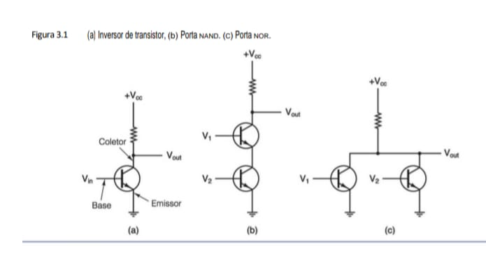

## Insight de Engenharia
No seu diretório estruturas_de_dados, quando você define um bool ou um int, o que está acontecendo fisicamente é uma dança entre milhares desses diagramas (a) e (b).

 - Curiosidade: O NAND é preferido na fabricação de chips porque é mais rápido e gasta menos área de silício do que a porta AND pura. Por isso, a maioria dos processadores modernos é, no fundo, uma "montanha de NANDs".

Se o sinal de saída da Figura 3.1(b) for alimentado em um circuito inversor, obtemos outro circuito com o inverso exato da porta nand, a saber, um cuja saída é 1 se, e somente se, ambas as entradas forem 1. Esse circuito é denominado uma porta and; seu símbolo e descrição funcional são dados na Figura 3.2(d). De modo semelhante, a porta nor pode ser conectada a um inversor para produzir um circuito cuja saída é 1 se quaisquer das saídas, ou ambas, for um 1, mas 0 se ambas as entradas forem 0. O símbolo e a descrição funcional desse circuito, denominado uma porta or são dados na Figura 3.2(e). Os pequenos círculos usados como parte dos símbolos para o inversor, porta nand e porta nor, são denominados bolhas de inversão. Também são usadas em outros contextos para indicar um sinal invertido.

As cinco portas da Figura 3.2 são os principais elementos de construção do nível lógico digital. A discussão precedente deve ter deixado claro que as portas nand e nor requerem dois transistores cada, ao passo que as portas and e or requerem três cada. Por essa razão, muitos computadores são baseados em portas nand e nor em vez das portas mais conhecidas, and e or. (Na prática, todas as portas são executadas de modo um pouco diferente, mas as nand e nor ainda são mais simples do que as and e or.) A propósito, vale a pena observar que as portas podem perfeitamente ter mais de duas entradas. Em princípio, uma porta nand, por exemplo, pode ter, arbitrariamente, muitas entradas, mas na prática não é comum encontrar mais de oito.

Embora a questão do modo como são construídas as portas pertença ao nível do dispositivo, gostaríamos de mencionar as principais famílias de tecnologia de fabricação porque elas são citadas com muita frequência. As duas tecnologias principais são bipolar e MOS (Metal Oxide Semiconductor – semicondutor de óxido metálico). Os dois principais tipos bipolares são a TTL (Transistor-Transistor Logic – lógica transistor-transistor), que há muitos anos é o burro de carga da eletrônica digital, e a ECL (Emitter-Coupled Logic – lógica de emissor acoplado), que era usada quando se requeria uma operação de velocidade muito alta. Para circuitos de computador, o que predomina agora é a tecnologia MOS.   

Portas MOS são mais lentas do que as TTL e ECL, mas exigem bem menos energia elétrica e ocupam um espaço muito menor, portanto, um grande número delas pode ser compactado e empacotado. Há muitas variedades de MOS, entre as quais PMOS, NMOS e CMOS. Embora os modos de construção dos transistores MOS e dos transistores bipolares sejam diferentes, sua capacidade de funcionar como comutadores eletrônicos é a mesma. A maioria das CPUs e memórias modernas usa tecnologia CMOS, que funciona a +1,5 volt. E isso é tudo o que diremos sobre o nível de dispositivo. O leitor interessado em continuar o estudo desse nível deve consultar as leituras sugeridas na Sala Virtual.

## 3.1.2 Álgebra booleana
Para descrever os circuitos que podem ser construídos combinando portas, é necessário um novo tipo de álgebra, no qual variáveis e funções podem assumir somente os valores 0 e 1. Essa álgebra é denominada álgebra booleana, nome que se deve a seu descobridor, o matemático inglês George Boole (1815–1864). Em termos estritos, estamos nos referindo a um tipo específico de álgebra booleana, uma álgebra de comutação, mas o termo “álgebra booleana” é tão utilizado no lugar de “álgebra de comutação” que não faremos a distinção.

A Figura 3.3(a) mostra a tabela verdade para uma função booleana de três variáveis: M = f(A, B, C). Essa função é a de lógica majoritária, isto é, ela é 0 se a maioria de suas entradas for 0, e 1 se a maioria de suas entradas for 1. Embora qualquer função booleana possa ser completamente especificada dada sua tabela verdade, à medida que aumenta o número de variáveis, essa notação fica cada vez mais trabalhosa. Portanto, costuma-se usar outra notação no lugar dela.

Figura 3.2   Símbolos e comportamento funcional das cinco portas básicas.
Essa é a base de tudo. Se os transistores da Figura 3.1 são os "átomos", essas portas da Figura 3.2 são as "moléculas" que formam a ULA e os Registradores que documentamos na Mic-3 e no ATmega168.
Aqui está a representação dos símbolos lógicos e suas respectivas Tabelas Verdade em formato ASCII para o seu arquivo Nivel-Logica-Digital.md.

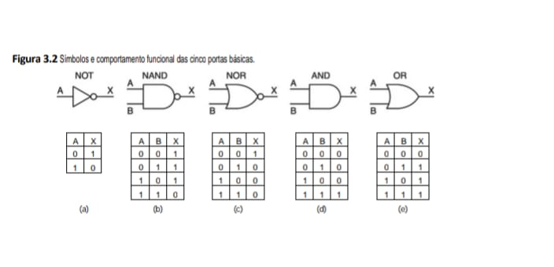

Organização de Hardware: Comportamento das Portas (Seu Padrão)
Esta tabela resume como essas funções básicas operam dentro do seu barramento de dados:

Processamento (Lógica)                                            Armazenamento (Significado)

NOT (Inversor)                                                    Troca de Estado: Transforma um bit 0 em 1 e vice-versa. Essencial para lógica de complemento.
NAND / AND                                                        Lógica de Conjunção: O AND verifica se todos os sinais estão presentes. O NAND é o oposto.
NOR / OR                                                          Lógica de Disjunção: O OR verifica se pelo menos um sinal está presente.
          
                                                                  BARRAMENTO INTERNO (Fluxo)
Seletor (Decodificador)                                           RI (Instrução)
Portas AND/NOR são usadas para decifrar qual instrução o          Cada instrução no seu registrador (RI) ativa um conjunto específico dessas portas.
processador deve executar

ULA (Unidade Lógica)                                              Clock (Sincronismo)
A ULA combina essas portas para somar números (usando portas      A velocidade com que essas portas mudam de estado define o limite do Clock.
XOR, feitas de NANDs).

## Insight para Estruturas de Dados
No seu diretório estruturas_de_dados, quando você usa operadores como && (AND lógico) ou || (OR lógico) em C, o compilador está, em última análise, escolhendo quais dessas portas na ULA do seu processador serão ativadas para retornar um resultado booleano.

 - Curiosidade de Microarquitetura: Lembra do Decodificador que incluímos na tabela da Mic-3? Ele é basicamente uma rede massiva de portas AND e NOT que "reconhece" um padrão de bits (como o código da instrução SWAP) e abre o caminho correto no barramento.

estritos, estamos nos referindo a um tipo específico de álgebra booleana, uma álgebra de comutação, mas o termo “álgebra booleana” é tão utilizado no lugar de “álgebra de comutação” que não faremos a distinção.

Assim como há funções na álgebra “ordinária” (isto é, a álgebra do colegial), também há funções na álgebra booleana. Uma função booleana tem uma ou mais variáveis de entrada e produz um resultado que depende somente dos valores dessas variáveis. Uma função simples, f, pode ser definida ao se dizer que f(A) é 1 se A for 0 e f(A) é 0 se A for 1. Essa função é a função not da Figura 3.2(a).

Como uma função booleana de n variáveis só tem 2n combinações possíveis de valores de entrada, ela pode ser completamente descrita por uma tabela com 2n linhas, na qual cada linha informa o valor da função para uma combinação diferente de valores de entrada. Ela é denominada tabela verdade. As tabelas da Figura 3.2 são todas exemplos de tabelas verdade. Se concordarmos em sempre listar as linhas de uma tabela verdade em ordem numérica (base 2), isto é, para duas variáveis na ordem 00, 01, 10 e 11, a função pode ser completamente descrita pelo número binário de 2n bits obtido pela leitura vertical da coluna de resultado da
tabela verdade. Assim, nand é 1110, nor é 1000, and é 0001 e or é 0111. É óbvio que só existem 16 funções booleanas de duas variáveis, correspondentes às 16 possíveis sequências de 4 bits resultantes. Por outro lado, a álgebra ordinária tem um número infinito de funções de duas variáveis, nenhuma das quais pode ser descrita por meio de uma tabela de saídas para todas as entradas possíveis, porque cada variável pode assumir qualquer valor de um número infinito de valores possíveis.

Figura 3.3   (a) Tabela verdade para a função majoritária de três variáveis. (b) Circuito para (a).
Essa Figura 3.3 é um marco no seu estudo: ela representa a transição da lógica básica para um Circuito Combinacional. A "Função Majoritária" é o que chamamos de "voto de Minerva" em hardware — o resultado (M) será 1 se a maioria das entradas (A, B, C) for 1. No contexto do seu diretório estruturas_de_dados, imagine que você tem três sensores lendo a mesma informação e precisa decidir qual valor é o correto (tolerância a falhas). Esse hardware resolve isso instantaneamente.

Função Majoritária (Figura 3.3)

Aqui está a representação da lógica que decide o destino do bit no barramento:

    ENTRADAS            PORTAS AND (3 ENTRADAS)          SAÍDA (OR)
        A  B  C
        |  |  |           +-----------+
        |  +--+---------->| (1)  _    |
        o--+------------->|     ABC   |----+
        NOT |  |           +-----------+    |
        |  |  |                            |
        +--+--+---------->| (2)   _   |    |      _______
        |  o--+------------>|     ABC   |----+----|       \
        | NOT |           +-----------+    |    |   OR    )--- M
        +--+--+---------->| (3)   _   |    +----| (4 ENT) )
        |  |  o------------>|     ABC  |----+----|_______/
        |  | NOT          +-----------+    |
        +--+--+---------->| (4)       |    |
        |  |  |           |     ABC   |----+
        +--+--+---------->+-----------+

    +---+---+---+---+
    | A | B | C | M |
    +---+---+---+---+
    | 0 | 0 | 0 | 0 |
    | 0 | 0 | 1 | 0 |
    | 0 | 1 | 0 | 0 |
    | 0 | 1 | 1 | 1 |
    | 1 | 0 | 0 | 0 |
    | 1 | 0 | 1 | 1 |
    | 1 | 1 | 0 | 1 |
    | 1 | 1 | 1 | 1 |
    +---+---+---+---+
        (a)

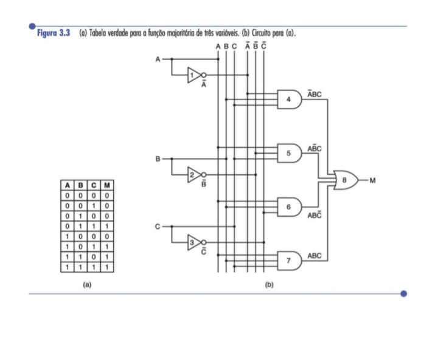

Organização de Hardware: Lógica Combinacional (Seu Padrão)
Esta tabela explica como esse "pequeno cérebro" de 3 entradas opera dentro da estrutura que você já conhece:

    Processamento                                                               Armazenamento

    ULA (Cálculos)                                                              Estado das Entradas
    :----------------------------------------------------------------------------------:------------------------------------------------------------------
    Lógica de Decisão: O circuito avalia as combinações AB+AC+BC.               Se qualquer par for 1, a saída é 1.","A, B, C: Representam sinais vindo de diferentes registradores ou barramentos.
    Portas AND (1, 2, 3): Filtram as coincidências entre os pares de entrada.   M (Majority): O resultado que será armazenado ou usado para controle.

                                                                                BARRAMENTO INTERNO
    UC (Controle)                                                               Sincronismo (Clock)
    Este circuito pode ser usado para verificar a integridade de sinais         Como é um circuito combinacional, a saída muda assim que as entradas mudam de controle.                                                                   (respeitando o tempo de propagação).

    Decodificador                                                               Nivel-Logica-Digital.md
    Frequentemente usado para ignorar ruído em linhas de endereço (REM).        Este é o exemplo clássico de como equações booleanas se tornam silício.

### O Hardware por Trás da Matemática
A equação simplificada que gera esse circuito é: M = (A \cdot B) + (A \cdot C) + (B \cdot C). Isso significa que, no seu arquivo Nivel-Logica-Digital.md, você pode documentar que a complexidade de um processador como o ATmega168 é apenas a repetição desses blocos combinacionais em escala massiva.Conexão com sua Carreira.
Você sabia que esse conceito de "voto majoritário" é usado em sistemas críticos (como aviões e foguetes)? Eles rodam três processadores em paralelo e usam um circuito exatamente como este (Figura 3.3) para decidir qual comando executar se um dos processadores falhar.

Para ver como ocorre essa outra notação, observe que qualquer função booleana pode ser especificada ao se dizer quais combinações de variáveis de entrada dão um valor de saída igual a 1. Para a função da Figura 3.3(a), há quatro combinações de variáveis de entrada que fazem com que M seja 1. Por convenção, marcaremos a variável de entrada com uma barra para indicar que seu valor é invertido. A ausência de uma barra significa que o valor não é invertido. Além disso, usaremos a multiplicação implícita ou um ponto para representar a função booleana and e + para representar a função booleana or. Assim, por exemplo, ABC assume o valor 1 somente quando A = 1 e B = 0 e C = 1. Além disso, AB + BC é 1 somente quando (A = 1 e B = 0) ou (B = 1 e C = 0). As quatro linhas da Figura 3.3(a) que produzem bits 1 na saída são: ABC, ABC, ABC e ABC. A função, M, é verdadeira (isto é, 1) se qualquer uma dessas quatro condições for verdadeira; daí, podemos escrever
         _      _      _
     M = ABC + ABC + ABC + ABC          

como um modo compacto de dar a tabela verdade. Assim, uma função de n variáveis pode ser descrita como se desse uma “soma” de no máximo 2n termos de “produtos” de n variáveis. Essa formulação é de especial importância, como veremos em breve, pois leva diretamente a uma execução da função que usa portas padronizadas.

É importante ter em mente a distinção entre uma função booleana abstrata e sua execução por um circuito eletrônico. Uma função booleana consiste em variáveis, como A, B e C, e operadores booleanos, como and, ore not. Ela é descrita por uma tabela verdade ou por uma função booleana como
         _      _
    F = ABC + ABC    

Uma função booleana pode ser executada por um circuito eletrônico (muitas vezes de vários modos diferentes) usando sinais que representam as variáveis de entrada e saída e portas como and, or e not. Em geral, empregaremos a notação and, or e not quando nos referirmos aos operadores booleanos, e and, or e not quando nos referirmos a portas, embora essa notação quase sempre seja ambígua em se tratando de indicar funções ou portas.

## 3.1.3 Execução de funções booleanas 
Como já mencionamos, a formulação de uma função booleana como uma soma de até 2n termos produtos leva a uma possível implementação. Usando a Figura 3.3 como exemplo, podemos ver como essa implementação é efetuada. Na Figura 3.3(b), as entradas, A, B e C, aparecem na extremidade esquerda, e a função de saída, M, na extremidade direita. Como são necessários complementos (inversos) das variáveis de entrada, eles são gerados tomando as entradas e passando-as pelos inversores rotulados 1, 2 e 3. Para evitar atravancar a figura, desenhamos seis linhas verticais, três das quais conectadas às variáveis de entrada e três aos complementos dessas variáveis. Tais linhas oferecem uma fonte conveniente para as entradas das portas subsequentes. Por exemplo, as portas 5, 6 e 7 usam A como uma entrada. Em um circuito real, essas portas provavelmente estariam ligadas direto a A sem usar nenhum fio “vertical” intermediário.

O circuito contém quatro portas and, uma para cada termo da equação para M (isto é, uma para cada linha da tabela verdade que tenha um bit 1 na coluna de resultado). Cada porta and calcula uma linha da tabela verdade, como indicado. Por fim, todos os termos produtos alimentam a porta lógica or para obter o resultado final.

O circuito da Figura 3.3(b) usa uma convenção que utilizaremos repetidas vezes neste livro: quando duas linhas se cruzam, não há nenhuma ligação implícita a menos que haja um ponto negro bem visível na intersecção. Por exemplo, a saída da porta 3 cruza todas as seis linhas verticais, mas está ligada apenas a C. É bom lembrar que alguns autores usam outras convenções.

Pelo exemplo da Figura 3.3 deve ficar claro como colocar em prática um circuito para qualquer função
booleana:

    1.Escreva a tabela verdade para a função.
    2.Providencie inversores para gerar o complemento de cada entrada.
    3.Desenhe uma porta and para cada termo que tenha um 1 na coluna de resultado.
    4.Ligue as portas and às entradas adequadas.
    5.Alimente a saída de todas as portas and a uma porta or.

Embora tenhamos mostrado como qualquer função booleana pode ser executada usando portas not, and e
or, muitas vezes é conveniente realizar circuitos usando só um tipo de porta. Felizmente, converter circuitos gera-
dos pelo algoritmo precedente à forma nand pura ou nor pura é uma operação direta. Para fazer essa conversão,
basta que tenhamos um modo de implementar not, and e or usando um único tipo de porta. A linha superior da
Figura 3.4 mostra como todas essas três podem ser implementadas usando apenas portas nand; a fileira de baixo
mostra como isso pode ser feito usando apenas portas nor. (Essas operações são diretas, mas também há outras
maneiras.)

Um modo de implementar uma função booleana usando somente portas nand ou somente portas nor é
primeiro seguir o procedimento dado anteriormente para construí-la com not, and e or. Em seguida, substi-
tuir as portas de múltiplas entradas por circuitos equivalentes usando portas de duas entradas. Por exemplo,
A + B + C + D pode ser computada como (A + B) + (C + D), empregando três portas or de duas entradas. Por fim,
as portas not, and e or são substituídas pelos circuitos da Figura 3.4.

Figura 3.4   Construção de portas (a) not, (b) and e (c) or usando somente portas nand ou somente portas nor.
Esta é a prova real de que a porta NAND (e a NOR) é o "átomo universal" da computação, Luís. No seu ATmega168 ou em qualquer processador moderno, é muito mais eficiente fabricar bilhões de cópias da mesma porta universal e arranjá-las para formar as outras funções do que fabricar cada tipo de porta separadamente.

Aqui está como o hardware "engana" a física para criar lógica usando apenas um componente:

    Universalidade das Portas (Figura 3.4)
    (a) NOT (Inversor)          (b) AND (Conjunção)           (c) OR (Disjunção)
        usando NAND                 usando NAND                   usando NAND
        _______                     _______    _______            _______
        |   \   |               A --|   \   |  |   \   |      A --|   \   |
    A --+---|  )o-- NOT A       |   |    )o-+--|    )o-- AB   |   |    )o--+
        |---|__/|               B --|___/|     |___/|         +---|___/|  |  _______
        |_______|                   |_______|  |_______|                  | |   \   |
                                                                        +-|    )o-- A+B
                                                                    _______| |___/|
                                                            B --|   \   | |_______|
                                                            |   |    )o--+
                                                            +---|___/|
                                                                |_______|

    (a) NOT (Inversor)          (b) AND (Conjunção)           (c) OR (Disjunção)
        usando NOR                  usando NOR                    usando NOR
        _______                     _______                       _______
        |   \   |               A --|   \   |                 A --|   \   |
    A --+---|  )o-- NOT A       |   |    )o--+                |   |    )o--+
        |---|__/|               +---|__/ |   |  _______       B --|__/ |   |  _______
        |_______|               _______  |   +-|   \   |          |_______|   +-|   \   |
                            B --|   \   | |     |    )o-- AB                   |    )o-- A+B
                            |   |    )o---+-----|__/ |                         |__/ |
                            +---|__/ |          |_______|                      |_______|
                                |_______|

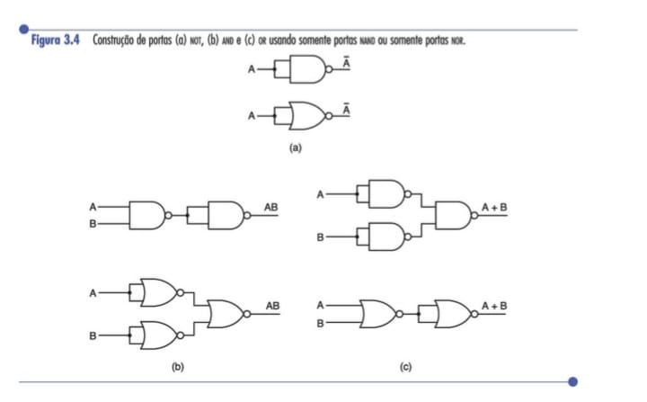

Organização de Hardware: Portas Universais (Seu Padrão)
Esta tabela explica por que seu repositório arquitetura-computadores precisa deste nível de detalhe:

Processamento,Armazenamento
ULA (Porta Universal)                                                Otimização de Silício

NAND/NOR: São chamadas de universais porque qualquer circuito pode   Economia: Fabricar apenas transistores para NAND (Figura 3.1b) reduz o ser feito com elas.                                                  custo por bit.
Lógica de De Morgan: Usada para transformar um AND em um OR com      Complexidade: Para fazer um OR com NAND, precisamos de 3 portas.
inversores.

                                                                     BARRAMENTO INTERNO
UC (Controle)                                                        Nivel-Logica-Digital.md
A Unidade de Controle da Mic-3 usa essas substituições para          Documentar isso explica como o hardware físico difere da lógica simplificar o caminho dos dados.                                     abstrata.

RI (Instrução)                                                       RDM (Dados)
O decodificador de instruções no RI é, na verdade, uma rede          O sinal de dado (0 ou 1) atravessa essas camadas de portas em massiva de NANDs.                                                            nanossegundos.

## Insight de "Programação" em Hardware
No seu diretório estruturas_de_dados, quando você escreve !(A && B), você está usando uma NAND lógica. O que a Figura 3.4 mostra é que, se você tiver apenas essa operação, você consegue reconstruir o A && B (fazendo !!(A && B)) e até o A || B.

Isso é exatamente o que acontece dentro de um chip de memória NAND Flash (como o do seu SSD): ele é otimizado para esse tipo específico de porta para atingir alta densidade.

Embora esse procedimento não resulte em circuitos ótimos, no sentido do número mínimo de portas, ele mostra que sempre há uma solução viável. Ambas as portas, nand e nor, são denominadas completas porque qualquer função booleana pode ser calculada usando quaisquer das duas. Nenhuma outra porta tem essa propriedade, o que é outra razão para elas serem preferidas como blocos de construção de circuitos.

## 3.1.4 Equivalência de circuito
Projetistas de circuitos muitas vezes tentam reduzir o número de portas em seus produtos para reduzir a área da placa de circuito interno necessária para executá-las, diminuir o consumo de potência e aumentar a velocidade. Para reduzir a complexidade de um circuito, o projetista tem de encontrar outro circuito que calcule a mesma função que o original, mas efetue essa operação com um número menor de portas (ou talvez com portas mais simples, por exemplo, com duas em vez de com quatro entradas). A álgebra booleana pode ser uma ferramenta
valiosa na busca de circuitos equivalentes.

Como exemplo de como a álgebra booleana pode ser usada, considere o circuito e a tabela verdade para AB + AC mostrados na Figura 3.5(a). Embora ainda não as tenhamos discutido, muitas das regras da álgebra comum também são válidas para a booleana. Em particular, a expressão AB + AC pode ser fatorada para A(B + C) usando a lei distributiva. A Figura 3.5(b) mostra o circuito e a tabela verdade para A(B + C). Como duas funções são equivalentes se, e somente se, elas tiverem a mesma saída para todas as entradas possíveis, é fácil ver pelas tabelas verdade da Figura 3.5 que A(B + C) é equivalente a AB + AC. Apesar dessa equivalência, o circuito da Figura 3.5(b) é claramente melhor do que o da Figura 3.5(a), pois contém menos portas.

Figura 3.5   Duas funções equivalentes. (a) AB + AC. (b) A(B + C).
Essa é a aplicação prática da Álgebra Booleana. A Figura 3.5 demonstra a Propriedade Distributiva, que é fundamental para a otimização de hardware.
No seu diretório estruturas_de_dados, isso equivale a refatorar um código para torná-lo mais eficiente. Em hardware, essa "refatoração" economiza transistores, reduz o calor e aumenta a velocidade do processador.

    Equivalência Lógica (Figura 3.5)

    (a) CIRCUITO ORIGINAL: AB + AC           (b) CIRCUITO OTIMIZADO: A(B + C)
        (Exige 3 portas)                         (Exige 2 portas)

        _______                                  _______
    A --|      |                             B --|      |
        | AND1 |--- AB                           |  OR  |--- (B + C)
    B --|______|      \     _______          C --|______|      \     _______
                        |---|       \                            |---|       \
                        +---|  OR   )--- SAÍDA               A --+---|  AND  )--- SAÍDA (A(B +C))
                        |---|_______/  (A(B +C))                 |---|_______/
        _______       /                                         
    A --|      |     /                                          
        | AND2 |--- AC                                          
    C --|______|

    +---+---+---+----+----+-------+-----+--------+---+
    | A | B | C | AB | AC | AB+AC | B+C | A(B+C) | M |
    +---+---+---+----+----+-------+-----+--------+---+
    | 0 | 0 | 0 | 0  | 0  | 0     | 0   | 0      | 0 |
    | 0 | 0 | 1 | 0  | 0  | 0     | 1   | 0      | 0 |
    | 0 | 1 | 0 | 0  | 0  | 0     | 1   | 0      | 0 |
    | 0 | 1 | 1 | 0  | 0  | 0     | 1   | 0      | 1 |
    | 1 | 0 | 0 | 0  | 0  | 0     | 0   | 0      | 0 |
    | 1 | 0 | 1 | 0  | 1  | 1     | 1   | 1      | 1 |
    | 1 | 1 | 0 | 1  | 0  | 1     | 1   | 1      | 1 |
    | 1 | 1 | 1 | 1  | 1  | 1     | 1   | 1      | 1 |
    +---+---+---+----+----+-------+-----+--------+---+
                        (a)

Tabela Verdade Comparativa
Ambos os circuitos produzem a mesma saída para as mesmas entradas, provando que são funcionalmente idênticos:

    +---+---+---+----+----+-----+--------+
    | A | B | C | A  | AC | B+C | A(B+C) |
    +---+---+---+----+----+-----+--------+
    | 0 | 0 | 0 | 0  | 0  | 0   | 0      |
    | 0 | 0 | 1 | 0  | 0  | 1   | 0      |
    | 0 | 1 | 0 | 0  | 0  | 1   | 0      |
    | 0 | 1 | 1 | 0  | 0  | 1   | 0      |
    | 1 | 0 | 0 | 1  | 0  | 0   | 0      |
    | 1 | 0 | 1 | 1  | 1  | 1   | 1      |
    | 1 | 1 | 0 | 1  | 0  | 1   | 1      |
    | 1 | 1 | 1 | 1  | 1  | 1   | 1      |
    +---+---+---+----+----+-----+--------+
                    (b)

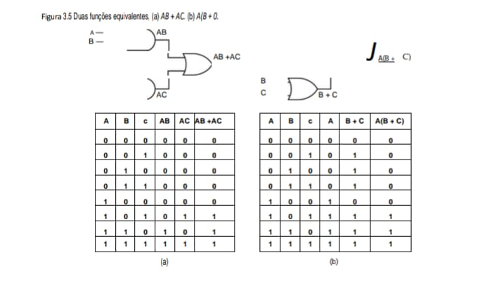

## Insight para o seu GitHub
Ao documentar isso, você mostra que entende que a Arquitetura de Computadores não é apenas sobre "ligar fios", mas sobre otimizar o caminho dos dados.

Se você estivesse programando um driver de baixo nível para as Torres de Hanói, entender essa equivalência ajudaria a escrever condicionais if que o compilador transformaria em instruções de máquina muito mais rápidas.

Em geral, um projetista de circuitos começa com uma função booleana e depois aplica a ela as leis da álgebra booleana na tentativa de achar uma função mais simples, porém equivalente. Um circuito pode ser construído com base na função final.

Para usar essa abordagem, precisamos de algumas identidades da álgebra booleana. A Figura 3.6 mostra algumas das mais importantes. É interessante notar que cada lei tem duas formas que são duais uma da outra. Permutando and e or e também 0 e 1, quaisquer das formas pode ser produzida com base na outra. Todas as leis podem ser provadas com facilidade construindo suas tabelas verdade. Com exceção da lei de De Morgan, a lei da absorção, e da forma and da lei distributiva, os resultados são razoavelmente intuitivos. A lei de De Morgan pode ser estendida para mais de duas variáveis, por exemplo, ABC = A + B + C.

    Figura 3.6   Algumas identidades da álgebra booleana.
    +-------------------------------+-------------------------------+-------------------------------+
    |          Nome                 |          Forma AND            |          Forma OR             |
    +-------------------------------+-------------------------------+-------------------------------+
    | Lei da identidade             | 1A = A                        | 0 + A = A                     |
    | Lei do elemento nulo          | 0A = 0                        | 1 + A = 1                     |
    | Lei idempotente               | AA = A                        | A + A = A                     |
    | Lei do inverso                | AĀ = 0                        | A + Ā = 1                     |
    | Lei comutativa                | AB = BA                       | A + B = B + A                 |
    | Lei associativa               | (AB)C = A(BC)                 | (A + B) + C = A + (B + C)     |
    | Lei distributiva              | A + BC = (A + B)(A + C)       | A(B + C) = AB + AC            |
    | Lei da absorção               | A(A + B) = A                  | A + AB = A                    |
    | Lei de De Morgan              | ĀB̄ = Ā + B̄                    | Ā + B̄ = ĀB̄                    |
    +-------------------------------+-------------------------------+-------------------------------+

A lei de De Morgan sugere uma notação alternativa. Na Figura 3.7(a), a forma and é mostrada com negação indicada por bolhas de inversão tanto para entrada quanto para saída. Assim, uma porta or com entradas invertidas é equivalente a uma porta nand. Pela Figura 3.7(b), a forma dual da lei de De Morgan, deve ficar claro que uma porta nor pode ser desenhada como uma porta and com entradas invertidas. Negando ambas as formas da lei de De Morgan, chegamos às figuras 3.7(c) e (d), que mostram representações equivalentes das portas and e or. Existem símbolos análogos para as formas de múltiplas variáveis da lei de De Morgan (por exemplo, uma porta nand com n entradas se torna uma porta or com entradas invertidas).

Figura 3.7   Símbolos alternativos para algumas portas: (a) nand. (b) nor. (c) and. (d) or.
Esta Figura 3.7 apresenta as Leis de De Morgan em formato gráfico. Ela é fundamental para qualquer arquiteto de hardware porque mostra que você pode "transformar" uma porta em outra apenas invertendo as entradas ou saídas. No seu ATmega168, isso é usado para simplificar o roteamento físico dos fios no silício.
A barra em cima da variável (negação) e o símbolo de inversão (a bolinha o) são a chave para entender esse "espelhamento" lógico.

    Símbolos Equivalentes (Figura 3.7)
    Aqui está a representação das equivalências que você descreveu, onde o símbolo = indica que a função lógica é a mesma, apesar do desenho diferente:
        SÍMBOLO PADRÃO          EQUIVALENTE (DE MORGAN)
            
        (a) NAND:  ____               ____
                A --|   \          A --o\   |
                    |    )o-- X  =      |    )--- X   =>  !(A & B) == !A | !B
                B --|___/          B --o/___|
            

        (b) NOR:   ____               ____
                A --|   \          A --o\   |
                    |    )o-- X  =      |    )--- X   =>  !(A | B) == !A & !B
                B --|__/           B --o\__/ 
            

        (c) AND:   ____               ____
                A --|   \          A --o\   |
                    |    )--- X  =      |    )o-- X   =>  (A & B) == !(!A | !B)
                B --|___/          B --o/___|
            

        (d) OR:    ____               ____
                A --|   \          A --o\   |
                    |    )--- X  =      |    )o-- X   =>  (A | B) == !(!A & !B)
                B --|__/           B --o\__/

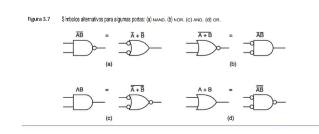

## Insight de "Escrita" em Memória
No seu diretório estruturas_de_dados, entender De Morgan é como saber que !(A && B) é exatamente o mesmo que !A || !B. Para o processador, dependendo da arquitetura (RISC como o seu AVR), uma dessas formas pode ser executada em menos ciclos ou usar menos instruções de máquina.

Usando as identidades da Figura 3.7 e as análogas para portas de múltiplas entradas é fácil converter a representação de soma de produtos de uma tabela verdade para a forma nand pura ou nor pura. Como exemplo, considere a função EXCLUSIVE OR da Figura 3.8(a). O circuito padrão da soma de produtos é mostrado na Figura 3.8(b). Para converter para a forma nand, as linhas que conectam a saída das portas and à entrada da porta or devem ser redesenhadas com duas bolhas de inversão, conforme mostra a Figura 3.8(c). Por fim, usando a Figura 3.7(a), chegamos à Figura 3.8(d). As variáveis A e B podem ser geradas de A e B usando portas nand ou nor com suas entradas interligadas. Note que as bolhas de inversão podem ser deslocadas à vontade ao longo da linha, por exemplo, desde as saídas das portas de entrada na Figura 3.8(d) até as entradas da porta de saída.

Figura 3.8   (a) Tabela verdade para a função XOR. (b)–(d) Três circuitos para calcular essa tabela.
A porta XOR (OR Exclusivo) é uma das mais fascinantes na arquitetura de computadores. Ela é a base para o Somador Completo (Full Adder) e para verificações de paridade. Enquanto o OR aceita "um ou outro ou ambos", o XOR é rigoroso: ele só resulta em 1 se as entradas forem diferentes.

Aqui está a representação da Figura 3.8, mostrando como a mesma lógica pode ser construída de três formas distintas no silício.
A Porta XOR e suas Implementações (Figura 3.8)

    (a) TABELA VERDADE XOR          (b) IMPLEMENTAÇÃO DIRETA (SOP)
                                        !(A)B + A!(B)
        A  B | XOR (Saída)               
    ------+---------               A ---+---o[NOT]---+---( AND1 )---+
        0  0 |    0                   B ---|---+--------+              |    ____
        0  1 |    1                        |   |                       +---|    \
        1  0 |    1                   A ---+---+--------+              | OR  )--- X
        1  1 |    0                   B ---+---o[NOT]---+---( AND2 )---+---|____/
                                                                    
                                     
    (c) USANDO APENAS NANDs          (d) CIRCUITO ALTERNATIVO (NOR/AND)
                                        
            +-------+                      A ---+-------( NOR )-------+
        A ---|       |---+                       |                     |    ____
            | NAND1 |   |      NAND3       B ---+-------( AND )-------+---|    \
        B ---|       |---+----+-------+                                    | AND )--- X
            +-------+        |       |     A -----------------------------|____/
            /     \    +----| NAND4 |--- X
        A ---+       +---|    |       |
            | NAND2 |---+----+-------+
        B ---+-------+

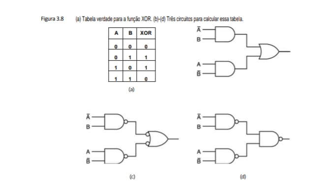

## Insight para o seu GitHub
O XOR é o "mágico" do baixo nível. No seu diretório estruturas_de_dados, você pode usar o XOR para trocar o valor de duas variáveis sem usar uma variável temporária (a ^= b; b ^= a; a ^= b;). No hardware, isso se traduz nos circuitos que acabamos de desenhar.

Como observação final em relação à equivalência de circuitos, demonstraremos agora o surpreendente resultado, isto é, a mesma porta física pode calcular funções diferentes dependendo das convenções usadas. Na Figura 3.9(a), mostramos a saída de certa porta, F, para diferentes combinações de entrada. Tanto entradas quanto saídas são representadas por volts. Se adotarmos a convenção de que 0 volt é 0 lógico e 1,5 volt é 1 lógico, denominada lógica positiva, obtemos a tabela verdade da Figura 3.9(b), a função AND. Contudo, se adotarmos a lógica negativa, na qual 0 volt é 1 lógico e 1,5 volt é 0 lógico, obtemos a tabela verdade da Figura 3.9(c), a função or.

    Figura 3.9   (a) Características elétricas de um dispositivo. (b) Lógica positiva. (c) Lógica negativa.
    +----+----+----+   
    | A  | B  | F  | 
    +----+----+----+
    | 0V | 0V | 0V | 
    | 0V | 5V | 0V | 
    | 5V | 0V | 0V | 
    | 5V | 5V | 5V | 
    +----+----+----+
        (a)

    +----+----+----+
    | A  | B  | F  | 
    +----+----+----+
    | 0  | 0  | 0  |  
    | 0  | 1  | 0  | 
    | 1  | 0  | 0  | 
    | 1  | 1  | 1  | 
    +----+----+----+
        (b)

    +----+----+----+
    | A  | B  | F  | 
    +----+----+----+
    | 1  | 1  | 1  |  
    | 1  | 0  | 1  | 
    | 0  | 1  | 1  | 
    | 0  | 0  | 0  | 
    +----+----+----+
        (c)

Assim, a convenção escolhida para mapear voltagens para valores lógicos é crítica. A menos que especifiquemos outra coisa, daqui em diante usaremos lógica positiva, portanto, os termos 1 lógico, verdade e tensão alta são sinônimos, assim como 0 lógico, falso e tensão baixa.

## 3.2 Circuitos lógicos digitais básicos
Nas seções anteriores vimos como executar tabelas verdade e outros circuitos simples usando portas individuais. Na prática, poucos circuitos são construídos porta por porta, embora tenha havido uma época em que isso era comum. Hoje, os blocos de construção mais comuns são módulos que contêm várias portas. Nas próximas seções, examinaremos esses blocos de construção mais de perto e veremos como eles podem ser construídos com base em portas individuais.

## 3.2.1  Circuitos integrados
Portas não são fabricadas nem vendidas individualmente, mas em unidades denominadas circuitos integrados, muitas vezes denominados ICs ou chips. Um IC é um pedaço quadrado de silício de tamanho variado, dependendo de quantas portas são necessárias para executar os componentes do chip. Substratos pequenos medirão cerca de 2 × 2 mm, enquanto os maiores podem ter até 18 × 18 mm. ICs costumam ser montados em pacotes retangulares de plástico ou cerâmica, que podem ser muito maiores que os substratos que eles abrigam, se forem necessários muitos pinos para conectar o chip ao mundo exterior. Cada pino se conecta com a entrada ou saída
de alguma porta no chip ou à fonte de energia, ou ao terra.

A Figura 3.10 mostra uma série de pacotes de IC comuns, usados para os chips de hoje. Chips menores, como os usados para microcontroladores domésticos ou chips de RAM, usarão pacotes duplos em linha (DIPs – Dual Inline Packages). Um DIP é um pacote com duas fileiras de pinos que se encaixam em um soquete correspondente na placa-mãe. Os pacotes mais comuns têm 14, 16, 18, 20, 22, 24, 28, 40, 64 ou 68 pinos. Para chips grandes costumam ser usados pacotes quadrados com pinos nos quatro lados ou na parte de baixo. Dois pacotes comuns para chips maiores são Pin Grid Arrays, ou PGAs, e Land Grid Arrays, ou LGAs. PGAs possuem pinos na parte inferior do pacote, que se encaixam em um soquete correspondente na placa-mãe. Soquetes PGA normalmente utilizam um mecanismo com força de inserção nula, onde uma alavanca aplica pressão lateral sobre todos os pinos do PGA, mantendo-o firmemente no soquete PGA. LGAs, por outro lado, possuem pequenas plataformas planas na parte inferior do chip, e um soquete LGA terá uma capa que se encaixa sobre o LGA e aplica uma força para baixo no chip, garantindo que todas as plataformas do LGA façam contato com as plataformas do soquete LGA. 

Figura 3.10   Tipos comuns de pacotes de circuito integrado, incluindo um pacote dual-in-line, ou DIP (a), PGA (b) e LGA (c).
Saímos agora da lógica abstrata das portas e entramos na Engenharia de Empacotamento. A Figura 3.10 mostra como os bilhões de transistores (como os das figuras anteriores) são protegidos e conectados ao mundo externo (placa-mãe).

Para o seu ATmega168, por exemplo, o formato mais comum é o DIP, enquanto o Core i7 que você documentou utiliza o LGA.

    Empacotamento de Circuitos Integrados (Figura 3.10)

    (a) DIP                     (b) PGA                     (c) LGA
    (Dual In-Line Package)        (Pin Grid Array)           (Land Grid Array)
    _________________             _______________             _______________
    |  _              |           |  ___________  |           |  ___________  |
    | | |             |           | |           | |           | |           | |
    | |_| IC Chip     |           | |  Silicon  | |           | |  Silicon  | |
    |_________________|           | |    Die    | |           | |    Die    | |
    | | | | | | | | |            | |___________| |           | |___________| |
    | | | | | | | | |            |_______________|           |_______________|
    Pinos Laterais               Pinos na Base               Contatos Planos
    (Atravessam a PCB)           (Encaixam no Socket)        (Socket tem os pinos)

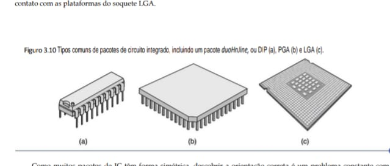

## Insight de Infraestrutura
No seu repositório, documentar isso é fundamental para diferenciar o Nível 0 (Lógica) da Implementação Física. Enquanto as portas NAND (Figura 3.4) operam em escala nanométrica dentro do silício, o pacote (DIP/PGA/LGA) opera em escala milimétrica para permitir que o Barramento Interno se conecte ao Barramento de Dados da placa-mãe.

Curiosidade: O número de contatos no pacote (como o LGA 1700) define quantos bits podem entrar e sair simultaneamente pelos barramentos de endereços e dados.

Como muitos pacotes de IC têm forma simétrica, descobrir a orientação correta é um problema constante com a instalação de IC. DIPs normalmente têm um entalhe em uma ponta, que combina com uma marca corresponde no soquete DIP. PGAs, em geral, possuem um pino faltando, de modo que, se você tentar inserir o PGA no soquete incorretamente, o PGA não se encaixará. Como os LGAs não possuem pinos, a instalação correta é imposta colocando-se um entalhe em um ou dois lados do LGA, que corresponde a um entalhe no soquete LGA. O LGA não entrará no soquete a menos que os dois entalhes combinem.

Para todos os efeitos, todas as portas são ideais no sentido de que a saída aparece logo que a entrada é aplicada. Na realidade, os chips têm um atraso de porta finito que inclui o tempo de propagação de sinal pelo chip e o tempo de comutação. Atrasos típicos são de centésimos de picossegundos a alguns nanossegundos.

A tecnologia moderna vigente permite colocar mais de 1 bilhão de transistores em um chip. Como qualquer circuito pode ser construído com base em portas NAND, você bem poderia imaginar que um fabricante poderia produzir um chip muito geral que contivesse 500 milhões de portas NANDs. Infelizmente, um chip como esse necessitaria de 1.500.000.002 pinos. Como o espaço-padrão entre pinos é 1 milímetro, um chip LGA teria 38 metros de comprimento para acomodar todos esses pinos, o que talvez tivesse um efeito negativo sobre as vendas. É claro que a única maneira de tirar proveito da tecnologia é projetar circuitos com uma alta relação porta/pino.

Nas seções seguintes vamos examinar circuitos simples que combinam uma quantidade de portas internamente para fornecer uma função útil que requer apenas um número limitado de conexões externas (pinos).

## 3.2.2 Circuitos combinatórios
Muitas aplicações de lógica digital requerem um circuito com múltiplas entradas e múltiplas saídas, no qual as saídas são determinadas exclusivamente pelas entradas em questão. Esses circuitos são denominados circuitos combinatórios. Nem todos os circuitos têm essa propriedade. Por exemplo, um circuito que contenha elementos de memória pode perfeitamente gerar saídas que dependem de valores armazenados, bem como de variáveis de entrada. Um circuito que esteja executando uma tabela verdade como a da Figura 3.3(a) é um exemplo típico de um circuito combinatório. Nesta seção, examinaremos alguns circuitos combinatórios de uso frequente.

### Multiplexadores
No nível lógico, um multiplexador é um circuito com 2n entradas de dados, uma saída de dados e n entradas de controle que selecionam uma das entradas de dados. Essa entrada selecionada é dirigida (isto é, roteada) até a saída. A Figura 3.11 é um diagrama esquemático de um multiplexador de oito entradas. As três linhas de controle, A, B e C, codificam um número de 3 bits que especifica qual das oito linhas de entrada é direcionada até a porta OR e dali até a saída. Não importa qual valor esteja nas linhas de controle, sete das portas and sempre produzirão saída 0; a outra pode produzir ou um 0 ou um 1, dependendo do valor da linha de entrada selecionada. Cada
porta and é habilitada por uma combinação diferente das entradas de controle. O circuito do multiplexador é mostrado na Figura 3.11.

Figura 3.11   Circuito multiplexador de oito entradas.

O Multiplexador (MUX) é o "Guarda de Trânsito" do barramento. Ele permite que o processador selecione qual canal de dados (D0 a D7) terá permissão para passar para a saída (F). Na Mic-3, isso é fundamental para escolher qual registrador vai colocar seu valor no barramento para a ULA processar.Para um MUX de 8 entradas, precisamos de 3 linhas de controle ($A, B, C$), pois $2^3 = 8$ combinações possíveis.

    Multiplexador de 8 Entradas (Figura 3.11)

    DADOS (D0-D7)          SELEÇÃO (A,B,C)          SAÍDA (F)
                                   | | |
        D0 ---|----\               | | |
        D1 ---|     \              | | |
        D2 ---|      \             | | |
        D3 ---|  MUX  )------------+ | | ------------> F
        D4 ---|  8:1  /            | | |       (Saída Selecionada)
        D5 ---|      /             | | |
        D6 ---|     /              | | |
        D7 ---|____/               | | |
                                    A B C
                                (Controle)

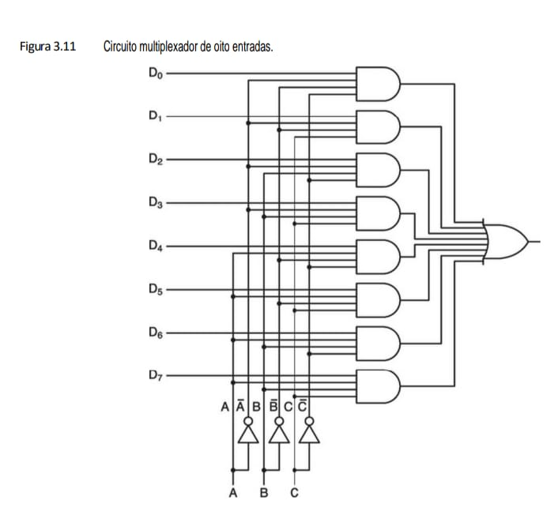

## Insight de Arquitetura
No seu diretório estruturas_de_dados, o MUX é a representação física de uma instrução switch(selecão) ou múltiplos if/else. Em vez de o software testar cada condição sequencialmente, o hardware do MUX entrega o resultado instantaneamente (no tempo de propagação das portas).

Na Mic-3: Quando você faz uma operação entre dois registradores, existem multiplexadores na frente da ULA para selecionar exatamente quais registradores do "Register File" serão lidos.

Usando o multiplexador, podemos executar a função majoritária da Figura 3.3(a), como mostrado na Figura 3.12(b). Para cada combinação de A, B e C, uma das linhas de dados é selecionada. Cada entrada é ligada ou a Vcc (1 lógico) ou ao terra (0 lógico). O algoritmo para ligar as entradas é simples: a entrada Di é a que tem o mesmo valor da linha i da tabela verdade. Na Figura 3.3(a), as linhas 0, 1, 2 e 4 são 0, portanto, as entradas correspondentes estão aterradas; as linhas restantes são 1, portanto, estão ligadas a 1 lógico. Dessa maneira qualquer tabela verdade de três variáveis pode ser executada usando o chip da Figura 3.12(a).

Figura 3.12   (a) Multiplexador com oito entradas. (b) O mesmo multiplexador ligado para calcular a função majoritária.

Essa Figura 3.12 é um "pulo do gato" na engenharia de computadores. Ela mostra que um Multiplexador não serve apenas para selecionar dados; ele é uma unidade lógica universal.

No item (b), você está usando o MUX para implementar a Função Majoritária que vimos na Figura 3.3, mas sem precisar projetar um circuito de portas AND/OR do zero. Você simplesmente "programa" o MUX fixando as entradas D 
Dn  em VCC (1) ou GND (0).

    MUX como Gerador de Funções (Figura 3.12)

    (a) MUX 8:1 (ESTRUTURA)          (b) MUX COMO FUNÇÃO MAJORITÁRIA
                                        (Programado via Hardware)
        +-----------+
    D0 -|           |               0 (GND) -- D0  \
    D1 -|           |               0 (GND) -- D1   |-- Saídas 0 (Menoria)
    D2 -|           |               0 (GND) -- D2  /
    D3 -|    MUX    |               1 (VCC) -- D3  --- Saída 1 (Maioria: 011)
    D4 -|    8:1    |--- F          0 (GND) -- D4  --- Saída 0 (Minoria: 100)
    D5 -|           |               1 (VCC) -- D5  \
    D6 -|           |               1 (VCC) -- D6   |-- Saídas 1 (Maioria)
    D7 -|___________|               1 (VCC) -- D7  /
            |   |   |                           | | |
            A   B   C                           A B C
        (CONTROLE/SEL)                   (ENTRADAS DA FUNÇÃO)

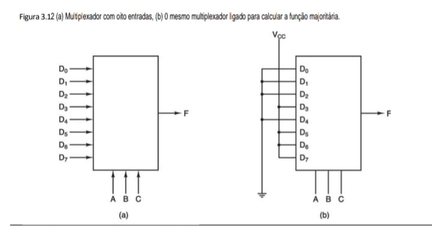

## Insight de "Programação em Silício"
O que você vê na Figura 3.12(b) é o princípio básico das LUTs (Look-Up Tables) usadas em FPGAs. No seu diretório estruturas_de_dados, imagine se, em vez de escrever um algoritmo complexo de decisão, você pudesse apenas criar um array com todos os resultados possíveis e usar os parâmetros como índices. É exatamente isso que o hardware está fazendo aqui!

Vantagem: Não importa quão complexa seja a função, o tempo de resposta (atraso) será sempre o mesmo: o tempo de um único MUX.

Acabamos de ver como um chip multiplexador pode ser usado para selecionar uma das diversas entradas e como ele pode implementar uma tabela verdade. Outra de suas muitas aplicações é como um conversor de dados paralelo para serial. Colocando 8 bits de dados nas linhas de entrada e então escalonando as linhas em sequência de 000 a 111 (binário), os 8 bits são colocados em série na linha de saída. Uma utilização típica da conversão paralela para serial é um teclado, onde cada acionamento de uma tecla define implicitamente um número de 7 ou 8 bits que deve ser enviado por um enlace serial, como USB.

O inverso de um multiplexador é um demultiplexador, que dirige sua única entrada até uma das 2n saídas, dependendo dos valores das n linhas de controle. Se o valor binário das linhas de controle for k, é selecionada a saída k.

### Decodificadores
Como um segundo exemplo, agora vamos examinar um circuito que toma um número de n bits como entrada e o usa para selecionar (isto é, definir em 1) exatamente uma das 2n linhas de saída. Tal circuito, ilustrado para n = 3 na Figura 3.13, é denominado decodificador.

Para ver como um decodificador pode ser útil, imagine uma pequena memória que consiste em oito chips, cada um contendo 256 MB. O chip 0 tem endereços de 0 a 256 MB, o chip 1 tem endereços de 256 MB a 512 MB e assim por diante. Quando um endereço é apresentado à memória, os 3 bits de ordem alta são usados
para selecionar um dos oito chips. Usando o circuito da Figura 3.13, esses 3 bits são as três entradas, A, B e C. Dependendo das entradas, exatamente uma das oito linhas de saída, D0, ..., D7, é 1; o resto é 0. Cada linha de saída habilita um dos oito chips de memória. Como só uma linha de saída é colocada em 1, apenas um chip é habilitado.
                                                                                                              _                   _                     _
A operação do circuito da Figura 3.13 é direta. Cada porta AND tem três entradas, das quais a primeira é A ou A, a segunda é B ou B e a terceira é C ou C. Cada porta é habilitada por uma combinação diferente de entradas: D0 por A B C, D1 por A B C, e assim por diante.

Figura 3.13   Circuito decodificador 3 para 8.

Essa Figura 3.13 apresenta o Decodificador, o componente "espelho" do Multiplexador. Enquanto o MUX concentra dados, o Decodificador expande um endereço binário para ativar uma linha específica.Na arquitetura da Mic-3, o decodificador é o coração do REM (Registrador de Endereços): ele recebe um número binário de 3 bits e "acende" exatamente uma das 8 linhas de memória ou um dos 8 registradores.

    Decodificador 3 para 8 (Figura 3.13)Como você descreveu, cada porta AND de 3 entradas representa um mintermo único da combinação de A, B e C.

    ENTRADAS (BINÁRIO)         LÓGICA INTERNA (PORTAS AND)        SAÍDAS (1-de-8)
                                        (A B C)
        A  B  C                      _______
        |  |  |                 +---|       |
        |  |  |  A B C  --------|AND|-------o D0 (000)
        |  |  |                 |___|
        |  |  |                      _______
        |  |  |                 +---|       |
        |  |  |  A B C  --------|AND|-------o D1 (001)
        |  |  |                 |___|
        |  |  |                      _______
        |  |  |  A B C  --------|AND|-------o D2 (010)
        |  |  |                 |___|
        ... ... ...                  ...           ...
        |  |  |                      _______
        |  |  |                 +---|       |
        |  |  |  A B C  --------|AND|-------o D7 (111)
        |  |  |                 |___|

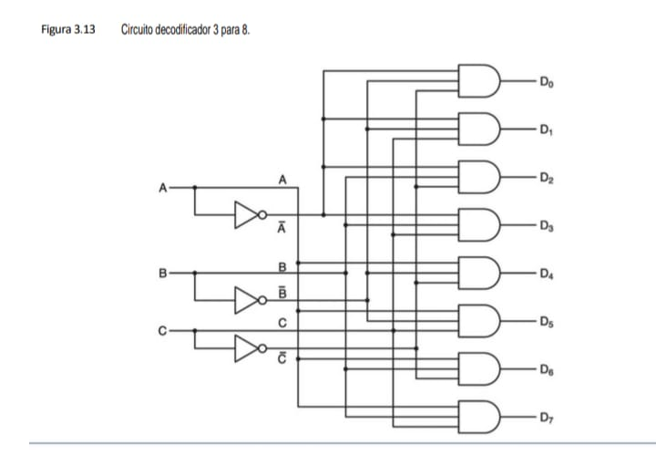

### Insight de "Endereçamento de Memória"
No seu diretório estruturas_de_dados, quando você acessa um índice de um array como lista[5], o hardware traduz o número 5 (101 em binário) e o envia para um decodificador idêntico ao da Figura 3.13. A porta AND correspondente ao D5 será a única a retornar 1, permitindo que os elétrons fluam apenas daquela posição da memória para o barramento.

Curiosidade: Se você tiver um chip de memória de 1 GB, ele possui decodificadores internos gigantescos (ou em cascata) para selecionar uma entre bilhões de células!

### Comparadores
Outro circuito útil é o comparador, que compara duas palavras de entrada. O comparador simples da Figura 3.14 toma duas entradas, A e B, cada uma de 4 bits de comprimento, e produz um 1 se elas forem iguais e um 0 se elas não o forem. O circuito é baseado na porta XOR (EXCLUSIVE OR), que produz um 0
se suas entradas forem iguais e um 1 se elas forem diferentes. Se as duas palavras de entrada forem iguais, todas as quatro portas xor devem produzir 0. Então, pode-se efetuar uma operação OR nesses quatro sinais; se o resultado for 0, as palavras de entrada são iguais; caso contrário, não. Em nosso exemplo, usamos uma
porta nor como o estágio final para reverter o sentido do teste: 1 significa igual, 0 significa diferente.

## 3.2.3 Circuitos aritméticos
Chegou a hora de passar dos circuitos de uso geral discutidos anteriormente para circuitos combinatórios
usados para operações aritméticas. Começaremos com um simples deslocador de 8 bits e em seguida veremos
como são construídos os somadores e, por fim, estudaremos as unidades de lógica e aritmética, que desempenham
um papel fundamental em qualquer computador.

Figura 3.14   Comparador simples de 4 bits.

Esta Figura 3.14 apresenta o Comparador de Magnitude, um componente essencial para as instruções de desvio condicional (como o if no seu código).O funcionamento é elegante: ele utiliza quatro portas XOR (que, como vimos na Figura 3.8, resultam em 0 quando as entradas são iguais) seguidas de inversores para detectar a igualdade bit a bit. No final, uma porta AND de 4 entradas consolida o resultado: a saída $A=B$ só será 1 se todos os pares de bits forem idênticos.

    Comparador de 4 Bits (Figura 3.14)

    ENTRADAS (A e B)         COMPARAÇÃO BIT A BIT          RESULTADO FINAL
                             (PORTAS XOR/NOT)
        A0  B0                     _______
        |   |                     |       |
        +---XOR o-----------------|       |
                                  |  AND  |
        A1  B1                    |   de  |
        |   |                     |   4   |----------------> SAÍDA: A=B
        +---XOR o-----------------| ENT.  |           (1 se iguais, 0 se não)
                                  |       |
        A2  B2                    |       |
        |   |                     |       |
        +---XOR o-----------------|       |
                                  |_______|
        A3  B3                        ^
        |   |                         |
        +---XOR o---------------------+

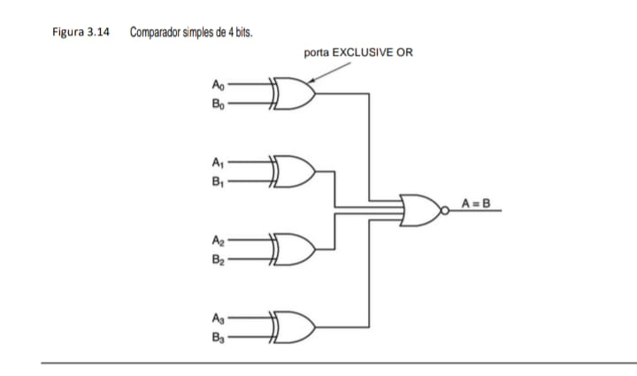

## Insight para Estruturas de Dados
No seu diretório estruturas_de_dados, quando você escreve if (valor == alvo), o compilador traduz isso para uma subtração na ULA ou uma operação de comparação direta. Fisicamente, os bits de valor e alvo são jogados nesse barramento da Figura 3.14. Se a saída for 1, o processador carrega o endereço do bloco if no CI (Contador de Instrução).

 - Curiosidade: Para comparar se um número é "Maior que" ou "Menor que", a lógica é um pouco mais complexa, envolvendo portas extras para analisar o bit mais significativo (MSB) e os "empréstimos" (borrows) de uma subtração.

Chegamos a um excelente ponto de conclusão para o Nível 0! Já cobrimos transistores, portas universais, multiplexadores, decodificadores e agora comparadores.

## Deslocadores
Nosso primeiro circuito aritmético é um deslocador de oito entradas e oito saídas (veja a Figura 3.15). Oito bits de entrada são apresentados nas linhas D0, ..., D7. A saída, que é apenas a entrada deslocada de 1 bit, está nas linhas S0, ..., S7. A linha de controle, C, determina a direção do deslocamento, 0 para a esquerda e 1 para a direita. Quando o deslocamento for para a esquerda, um 0 é inserido no bit 7. De modo semelhante, quando o deslocamento for para a direita, um 1 é inserido no bit 0.

Figura 3.15   Deslocador esquerda/direita de 1 bit.

O Deslocador (Shifter) é um componente fundamental para operações aritméticas e lógicas, como multiplicações e divisões por potências de 2, além de manipulação de campos de bits.Na arquitetura da Mic-3, o deslocador geralmente fica na saída da ULA, permitindo que o resultado de uma operação seja deslocado antes de ser armazenado de volta em um registrador.Diagrama ASCII: Deslocador de 1 Bit (Figura 3.15)O funcionamento baseia-se em um conjunto de multiplexadores 2:1 que decidem, para cada posição de saída S_n, qual bit de entrada $D$ será selecionado com base no sinal de controle C.

    ENTRADAS (D0-D7)          LÓGICA DE CONTROLE (C)         SAÍDAS (S0-S7)
        
        (C=0: Esq / C=1: Dir)               C
                                            |
        [0] -----------+          +---------+---------+         +----------- S0
                        |         |                   |         |
        D0 ------------+----[MUX 0]                  +----[MUX 1]---------- S1
                        |         |                   |         |
        D1 ------------+----[MUX 1]                  +----[MUX 2]---------- S2
                        |         |                   |         |
        D2 ------------+----[MUX 2]                  +----[MUX 3]---------- S3
                        |         |                   |         |
        D3 ------------+----[MUX 3]                  +----[MUX 4]---------- S4
                        |         |                   |         |
        D4 ------------+----[MUX 4]                  +----[MUX 5]---------- S5
                        |         |                   |         |
        D5 ------------+----[MUX 5]                  +----[MUX 6]---------- S6
                        |         |                   |         |
        D6 ------------+----[MUX 6]                  +----[MUX 7]---------- S7
                        |         |                   |
        D7 ------------+----[MUX 7]                  +--------- [0]

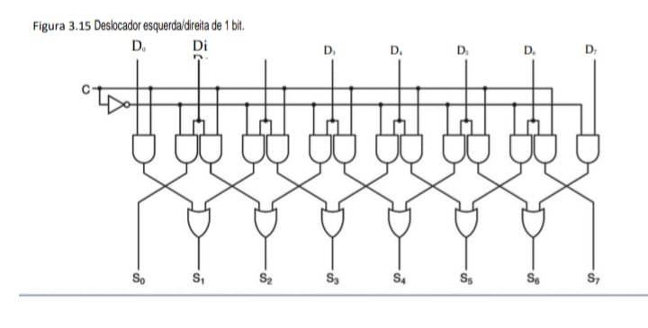

### Insight para Estruturas de Dados
No seu diretório estruturas_de_dados, quando você usa os operadores << ou >> em C, você está acessando diretamente este circuito.Se você fizer x << 1, o bit D_0 vai para S_1, D_1 para S_2, e assim por diante.É uma das operações mais rápidas que um processador pode realizar, sendo muito usada para otimizar cálculos matemáticos onde a precisão de potências de 2 é suficiente.

Para ver como o circuito funciona, observe os pares de portas AND para todos os bits, exceto as portas na extremidade. Quando C = 1, o membro da direita de cada par é ligado, passando o bit de entrada correspondente para a saída. Como a porta AND da direita está ligada à entrada da porta OR à sua direita, é executado um deslocamento para a direita. Quando C = 0, o membro da esquerda do par da porta AND é ligado, o que provoca um deslocamento para a esquerda.

### Somadores
Um computador que não possa somar números inteiros é quase inimaginável. Por consequência, um circuito de hardware para efetuar adição é uma parte essencial de toda CPU. A tabela verdade para adição de inteiros de 1 bit é mostrada na Figura 3.16(a). Há duas saídas presentes: a soma das entradas, A e B, e o transporte (vai-um) para a posição seguinte (à esquerda). Um circuito para calcular o bit de soma e o de transporte é ilustrado na Figura 3.16(b). Esse circuito simples é conhecido como um meio-somador.

Figura 3.16   (a) Tabela verdade para adição de 1 bit. (b) Circuito para um meio-somador.

Entramos agora na Unidade Lógica e Aritmética (ULA) propriamente dita. O Meio-Somador (Half Adder) é o primeiro passo para o processador realizar cálculos matemáticos.Ele é chamado de "meio" porque, embora consiga somar dois bits (A e B), ele não tem uma entrada para o "vai-um" (Carry-in) vindo de uma coluna anterior. Por isso, ele só é usado no bit menos significativo (LSB) de uma soma.

Meio-Somador (Figura 3.16)O circuito utiliza a porta XOR para a soma (pois $1+1=0$ no binário de 1 bit) e a porta AND para o transporte (pois o "vai-um" só ocorre se ambos forem 1).

    (a) TABELA VERDADE             (b) CIRCUITO DO MEIO-SOMADOR
                                        
    A | B | Soma | Transporte            _______
    -----+-------------------        A --|      \
    0 | 0 |   0  |   0                   | XOR   )--- SOMA (S)
    0 | 1 |   1  |   0               B --|______/
    1 | 0 |   1  |   0                  
    1 | 1 |   0  |   1               A -------+
                                              |  ____
                                    B -------+--|    \
                                                | AND )--- TRANSPORTE (C)
                                                |____/

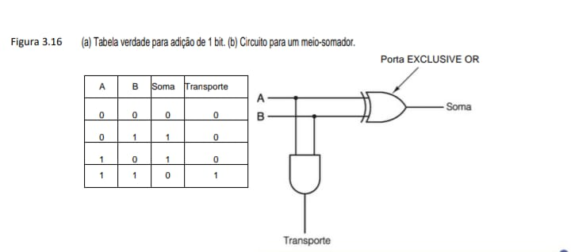

### Insight de "Bit-a-Bit"
No seu diretório estruturas_de_dados, quando você soma dois int, o processador encadeia um desses Meio-Somadores com vários Somadores Completos (que aceitam o Carry-in).

 - Curiosidade: Se você somar 1 + 1 e o resultado da soma for 0 com transporte 1, o hardware está literalmente fazendo o que aprendemos na escola: "põe o zero e vai um". A diferença é que ele faz isso na velocidade da luz usando transistores!

Embora um meio-somador seja adequado para somar os bits de ordem baixa de duas palavras de entrada de múltiplos bits, ele não servirá para uma posição de bit no meio da palavra porque não trata o transporte de bit da posição à direita (vem-um). Em seu lugar, precisamos do somador completo da Figura 3.17. Pela inspeção
do circuito, deve ficar claro que um somador completo é composto de dois meios-somadores. A linha de saída Soma é 1 se um número ímpar A, B e o vem-um (carry in) forem 1. O vai-um (carry out) é 1 se A e B forem ambos 1 (entrada esquerda para a porta OR) ou se exatamente um deles for 1 e o bit de vem-um (carry in) também é 1. Juntos, os dois meios-somadores geram a soma e também os bits de transporte.

Para construir um somador para palavras de 16 bits, por exemplo, basta repetir o circuito da Figura 3.17(b) 16 vezes. O vai-um de um bit é usado como vem-um para seu vizinho da esquerda. O vem-um do bit da extrema direita está ligado a 0. Esse tipo de somador é denominado somador de transporte encadeado porque, na pior das hipóteses, somando 1 a 111...111 (binário), a adição não pode ser concluída até que o vai-um tenha percorrido todo o caminho do bit da extrema direita até o da extrema esquerda. Também existem somadores que não têm esse atraso e, portanto, são mais rápidos – em geral, são os preferidos.

Como exemplo simples de um somador mais rápido, considere subdividir um somador de 32 bits em uma metade inferior e uma metade superior de 16 bits cada. Quando a adição começa, o somador superior ainda não pode trabalhar porque não sabe qual é o vem-um por 16 tempos de adição.

Figura 3.17   (a) Tabela verdade para somador completo. (b) Circuito para um somador completo.

O Somador Completo (Full Adder) é o "upgrade" necessário para o processador somar números de múltiplos bits (como os 8 bits do seu ATmega168). A grande diferença para o Meio-Somador é a entrada Vem-um (Carry-in), que permite receber o transporte da casa decimal (ou binária) anterior.

Fisicamente, ele é composto por dois Meio-Somadores e uma porta OR.

    Somador Completo (Figura 3.17)

    (a) TABELA VERDADE             (b) CIRCUITO DO SOMADOR COMPLETO
                                        
    Cin  A  B | Soma  Cout              A ---+     _______
    ----------+-----------              B ---|----|  XOR  |--+
    0   0  0  |   0     0                     |   |_______|  |    _______
    0   0  1  |   1     0                     |              +---|  XOR  |--- SOMA (S)
    0   1  0  |   1     0               Cin --|--------------+   |_______|
    0   1  1  |   0     1                     |
    1   0  0  |   1     0               A ----+    _______
    1   0  1  |   0     1               B ----|---|  AND  |--+
    1   1  0  |   0     1                     |   |_______|  |    _______
    1   1  1  |   1     1                     |              +---|   OR  |--- VAI-UM (Cout)
                                        Cin --+  _______     +---|_______|
                                            |---|  AND  |---+
                                            +---|_______|

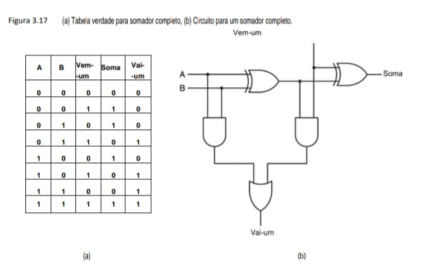

### Insight
No seu diretório estruturas_de_dados, quando ocorre um Overflow (estouro de capacidade), é exatamente por causa desse circuito. Se você somar dois números e o Vai-um (Cout) do bit mais significativo for 1, mas não houver mais espaço para armazená-lo, o processador levanta uma "bandeira" (flag) de erro ou Carry.

 - Curiosidade: Para evitar a lentidão do transporte "viajando" de bit em bit (Ripple Carry), processadores modernos usam uma lógica chamada Carry Look-ahead, que prevê o transporte antes mesmo da soma terminar.

Contudo, considere essa modificação no circuito. Em vez de uma única metade superior, vamos dar ao somador duas metades superiores em paralelo duplicando o hardware da metade superior. Desse modo, agora o circuito consiste em três somadores de 16 bits: uma metade inferior e duas metades superiores, U0 e U1 que
funcionam em paralelo. Um 0 é alimentado em U0 como vai-um; um 1 é alimentado em U1 como vai-um. Agora, ambos podem iniciar ao mesmo tempo do que a metade inferior, mas somente um estará correto. Após 16 tempos de adição de bits, já se saberá qual é o vem-um que deve ir para a metade superior, portanto, agora já se pode selecionar a metade superior correta com base em duas respostas disponíveis. Esse estratagema reduz o tempo de adição por um fator de dois. Um somador como esse é denominado somador de seleção de transporte. Então, o estratagema pode ser repetido para construir cada somador de 16 bits com base em somadores de 8 bits repetidos e assim por diante.

### Unidades lógica e aritmética
Grande parte dos computadores contém um único circuito para efetuar AND, OR e soma de duas palavras de máquina. No caso típico, tal circuito para palavras de n bits é composto de n circuitos idênticos para as posições individuais de bits. A Figura 3.18 é um exemplo simples de um circuito desses, denominado unidade lógica e aritmética (ULA) (Arithmetic Logic Unit – ALU). Ela pode calcular qualquer uma das quatro funções – a saber, A AND B, A OR B, B ou A + B, dependendo de as linhas de entrada de seleção de função F0 e F1 conterem 00, 01, 10 ou 11 (binário). Note que, aqui, A + B significa a soma aritmética de A e B, e não a
operação booleana OR.

O canto inferior esquerdo de nossa ULA contém um decodificador de 2 bits para gerar sinais de enable (habilitação) para as quatro operações, com base nos sinais de controle F0 e F1. Dependendo dos valores de F0 e F1, exatamente uma das quatro linhas de habilitação é selecionada. Ativar essa linha permite que a saída para a função selecionada passe por ela até a porta OR final, para saída.

O canto superior esquerdo contém a lógica para calcular A AND B, A OR, B e B, mas no máximo um desses resultados é passado para a porta OR final, dependendo das linhas de habilitação que saem do decodificador. Como exatamente uma das saídas do decodificador será 1, exatamente uma das quatro portas AND que comandam a porta OR será habilitada; as outras três resultarão em 0, independente de A e B.

Figura 3.18   ULA de 1 bit.

Esta Figura 3.18 é o ápice do nosso estudo de circuitos combinacionais. Ela não é apenas um componente isolado; ela é a Unidade Lógica e Atômica (ULA) de 1 bit.Imagine que o seu ATmega168 possui 8 dessas unidades enfileiradas, enquanto a Mic-3 possui 32. Ela combina tudo o que vimos até agora: Portas Lógicas, Multiplexadores (representados pelo Decodificador/Enable), o Somador Completo e inversores.

    ULA de 1 Bit (Figura 3.18)Este circuito permite que o processador escolha, através de sinais de controle, se quer fazer um AND, um OR, um NOT ou uma SOMA entre A e B.

    SINAIS DE CONTROLE          ENTRADAS DE DADOS          LÓGICA E SOMA
        (INVA, ENA, ENB, F0, F1)            (A, B)              (Multiplexada)
                |                          |  |
        INVA -----+---> [NOT] --+            |  |          Vem-um (Cin)
                                |            |  |             |
        ENA  -------------------+---> [AND]--+  |      _______V_______
                                |            |  +---->|               |
        ENB  -------------------+---> [AND]--+------->|    SOMADOR    |---> Vai-um
                                |                     |   COMPLETO    |    (Cout)
                +-------------+                       |_______________|
                |                                           |
        F0 -----+---> [DECODIFICADOR]                       |
        F1 -----+---> [ SELECIONA   ]                       |
                |     [  OPERAÇÃO   ]                       |
                |          |                                |
                |          +----(0)--> [ AND ] -------------+----[ OR ]---> SAÍDA
                |          +----(1)--> [  OR ] -------------+
                |          +----(2)--> [ NOT ] -------------+
                |          +----(3)--> [ SOMA] -------------+

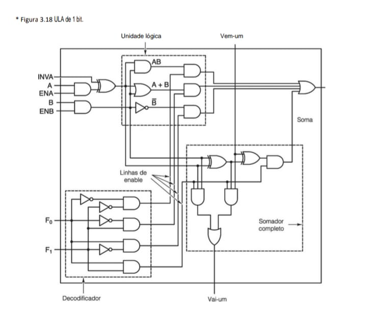

### Insight de Arquitetura (O Elo Perdido)
No seu diretório estruturas_de_dados, quando você escreve a + b ou a & b, o compilador gera um código que configura os sinais F0 e F1 desta ULA.

 - Se F0=0 e F1=0, a saída será o resultado da porta AND.

 - Se F0=1 e F1=1, a saída será o resultado do Somador Completo.

Isso prova que o processador não "muda" fisicamente para somar ou comparar; ele apenas abre o caminho (via decodificador) para que o resultado do circuito correto chegue à saída.

Com a Figura 3.18, terminamos a parte de Circuitos Combinacionais! O próximo passo natural seriam os Circuitos Sequenciais (Memória), onde os dados param de apenas fluir e começam a ser armazenados (Latches/Flip-flops).

Além de poder usar A e B como entradas para operações lógicas ou aritméticas, também é possível forçar quaisquer delas para 0 negando ENA ou ENB, respectivamente. Também é possível obter A ativando INVA. Veremos utilizações para INVA, ENA e ENB no Capítulo 4. Em condições normais, ENA e ENB são ambas 1 para habilitar ambas as entradas e INVA é 0. Nesse caso, A e B são apenas alimentados na unidade lógica, sem modificação.

O canto direito inferior da ULA contém um somador completo para calcular a soma de A e B, incluindo manipulação de transportes (vai-um e vem-um), porque é provável que, em seu devido tempo, vários desses circuitos serão ligados juntos para efetuar operações de palavra inteira. Na verdade, existem circuitos como o da Figura 3.18 que são conhecidos como segmentos de bits (bit slices). Eles permitem que o projetista do computador monte uma ULA da largura que quiser. A Figura 3.19 mostra uma ULA de 8 bits montada com 8 segmentos (slices) de ULA de 1 bit. O sinal INC só é útil para operações de adição. Quando presente, aumenta o resultado (isto é, soma 1 a ele), possibilitando o cálculo de somas como A + 1 e A + B + 1.

Anos atrás, um segmento de bit era na verdade um chip que você podia comprar. Hoje, é mais como uma biblioteca que um projetista de chip pode replicar quantas vezes quiser em um programa projeto-auxiliado-por-computador produzindo um arquivo de saída que direciona as máquinas de produção de chips. Mas a ideia, na
essência, é a mesma.

Figura 3.19  Oito segmentos (slices) de ULA de 1 bit conectados para formar uma ULA de 8 bits. Os sinais de habilitação e inversão não são mostrados por simplicidade.

Esta Figura 3.19 é o momento em que a teoria se torna um processador funcional. Aqui vemos o conceito de Bit-Slicing: pegamos oito cópias daquela ULA de 1 bit que analisamos (Figura 3.18) e as colocamos lado a lado para formar uma ULA de 8 bits — exatamente a largura de dados do seu ATmega168.O ponto chave aqui é o encadeamento do transporte (Carry). O "Vai-um" de uma fatia (slice) torna-se o "Vem-um" da próxima, permitindo que a soma se propague do bit menos significativo ($A_0, B_0$) até o mais significativo (A_7, B_7).

    ULA de 8 Bits (Figura 3.19)
    
    SINAIS DE FUNÇÃO (F0, F1) compartilhado por todas as fatias
        _______________________________________________________________
    |       |       |       |       |       |       |       |       |
    [ULA7]  [ULA6]  [ULA5]  [ULA4]  [ULA3]  [ULA2]  [ULA1]  [ULA0] <--+-- INC (Vem-um)
    |       |       |       |       |       |       |       |       |   (Carry In)
    +---<---+---<---+---<---+---<---+---<---+---<---+---<---+-------+
    Vai-um                                                        (Propagação do Carry)
    (Cout)

    A7 B7   A6 B6   A5 B5   A4 B4   A3 B3   A2 B2   A1 B1   A0 B0  (Entradas)
        |       |       |       |       |       |       |       |
    [ SLICE ] [ SLICE ] [ SLICE ] [ SLICE ] [ SLICE ] [ SLICE ] [ SLICE ] [ SLICE ]
        |       |       |       |       |       |       |       |
        O7      O6      O5      O4      O3      O2      O1      O0   (Saídas)

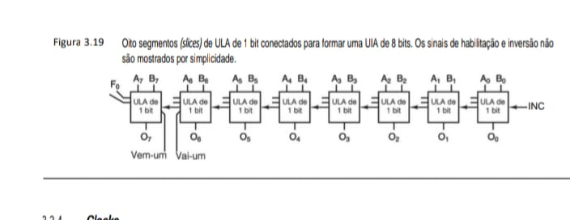

### Insight para o seu repositório estruturas_de_dados
Essa imagem explica por que o tipo char (8 bits) ou uint8_t no C é processado em um único ciclo no seu microcontrolador. O hardware está operando em paralelo: todos os 8 bits de A e B entram na ULA ao mesmo tempo, mas a Soma só é finalizada quando o Carry termina de percorrer as fatias.Se você estivesse usando um processador de 32 bits, essa corrente teria 32 fatias, o que exigiria técnicas como o Carry Look-ahead para não deixar o processador lento. Completamos a jornada da ULA! Saímos do silício (Figura 3.1) e chegamos ao motor aritmético de 8 bits (Figura 3.19).

## 3.2.4 Clocks
Em muitos circuitos digitais, a ordem em que os eventos ocorrem é crítica. Às vezes um evento deve preceder outro, às vezes dois eventos devem ocorrer simultaneamente. Para permitir que os projetistas consigam as relações de temporização requeridas, muitos circuitos digitais usam clocks para prover sincronização. Nesse contexto, um clock é um circuito que emite uma série de pulsos com uma largura de pulso precisa e intervalos precisos entre pulsos consecutivos. O intervalo de tempo entre as arestas correspondentes de dois pulsos consecutivos é denominado tempo de ciclo de clock. Em geral, as frequências de pulso estão entre 100 MHz e 4 GHz, correspondendo a ciclos de clock de 10 nanossegundos a 250 picossegundos. Para conseguir alta precisão, a frequência
de clock normalmente é controlada por um oscilador de cristal.

Muitos eventos podem ocorrer dentro de um computador durante um único ciclo de clock. Se eles devem ocorrer em uma ordem específica, o ciclo de clock deve ser dividido em subciclos. Uma maneira comum de prover resolução superior à do clock básico é aproveitar a linha de clock primária e inserir um circuito com um atraso conhecido, gerando assim um sinal de clock secundário deslocado em certa fase em relação ao primeiro, conforme mostra a Figura 3.20(a). O diagrama de temporização da Figura 3.20(b) dá quatro referências de tempo para eventos discretos:
   
    1.Fase ascendente de C1.
    2.Fase descendente de C1.
    3.Fase ascendente de C2.
    4.Fase descendente de C2.

Vinculando diferentes eventos às várias fases, pode-se conseguir a sequência requerida. Se forem necessárias mais do que quatro referências de tempo dentro de um ciclo de clock, podem-se puxar mais linhas da linha primária, com diferentes atrasos, se for preciso.

Em alguns circuitos, estamos interessados em intervalos de tempo em vez de instantes discretos de tempo. Por exemplo, pode-se permitir que algum evento aconteça toda vez que C1 estiver alto, em vez de exatamente na fase ascendente. Outro evento só poderá acontecer quando C2 estiver alto. Se forem necessários mais de
dois intervalos diferentes, podem ser instaladas mais linhas de clock ou pode-se fazer com que os estados altos dos dois clocks se sobreponham parcialmente no tempo. No último caso, podem-se distinguir quatro intervalos distintos: C1 and C2, C1 and C2, C1 and C2 e C1 and C2.

A propósito, clocks são simétricos, com o tempo gasto no estado alto igual ao tempo gasto no estado baixo, como mostra a Figura 3.20(b). Para gerar um trem de pulsos assimétrico, o clock básico é deslocado usando um circuito de atraso e efetuando uma operação AND com o sinal original, como mostra a Figura 3.20(c) como C.

Figura 3.20  (a) Um clock. (b) Diagrama de temporização para o clock. (c) Geração de um clock assimétrico.

    Clock e Temporização (Figura 3.20)

    (a) CIRCUITO OSCILADOR E ATRASO        (b) DIAGRAMA DE TEMPORIZAÇÃO (C1/C2)
                                        
        +-----------+                         _      _      _      _
    +---| OSCILADOR |---+---- C1        C1  _| |_  _| |_  _| |_  _| |_
    |   | (CRISTAL)  |   |                   _      _      _      _
    |   +-----------+   |               C2    _| |_  _| |_  _| |_  _| 
    |                   |                   |<--->|
    +-------------------+---[ ATRASO ]-- C2  Atraso (Skew)
                                        

    (c) GERAÇÃO DE CLOCK ASSIMÉTRICO (LÓGICA A, B, C)

              _      _      _      _      _      _
    Sinal A _| |_  _| |_  _| |_  _| |_  _| |_  _| |_  (Original)
                _      _      _      _      _      _
    Sinal B   _| |_  _| |_  _| |_  _| |_  _| |_  _|   (Atrasado)
                
              -      -      -      -      -      -
    Sinal C  |_|    |_|    |_|    |_|    |_|    |_|   (A AND NOT B)
            (Pulsos Curtos/Assimétricos)

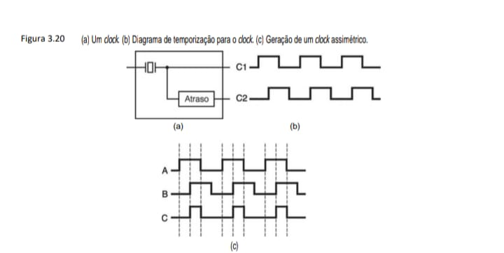

## 3.3 Memória
Um componente essencial de todo computador é sua memória. Sem ela não poderiam existir os computadores que conhecemos. A memória é usada para armazenar instruções a serem executadas e dados. Nas seções seguintes examinaremos os componentes básicos de um sistema de memória começando no nível da porta para
ver como eles funcionam e como são combinados para produzir memórias de grande porte.

## 3.3.1 Memórias de 1 bit
Para criar uma memória de 1 bit (“latch”), precisamos de um circuito que “se lembre”, de algum modo, de valores de entrada anteriores. Tal circuito pode ser construído com base em duas portas NOR, como ilustrado na Figura 3.21(a). Circuitos análogos podem ser construídos com portas NAND, porém, não vamos mais mencioná-los porque são conceitualmente idênticos às versões NOR.

O circuito da Figura 3.21(a) é denominado latch SR. Ele tem duas entradas, S, para ativar (setting) o latch, e R, para restaurá-lo (resetting), isto é, liberá-lo. O circuito também tem duas saídas, Q e !Q, que são complementares, como veremos em breve. Ao contrário de um circuito combinacional, as saídas do latch não são exclusivamente determinadas pelas entradas atuais.

Figura 3.21  (a) Latch NOR no estado 0. (b) Latch NOR no estado 1. (c) Tabela verdade para NOR.

Esta Figura 3.21 marca a nossa transição da lógica combinacional para a lógica sequencial, Luís. Aqui o hardware ganha "memória". O Latch NOR (ou Latch SR) é o tijolo básico de construção dos registradores que você usa no seu ATmega168.

A mágica acontece por causa do realimentação (feedback): a saída de uma porta é ligada na entrada da outra, permitindo que o circuito "lembre" seu estado anterior mesmo depois que os sinais de entrada mudam.

Latch NOR (Figura 3.21)

    O Latch possui dois estados estáveis: o Estado 0 (Reset) e o Estado 1 (Set).

    (a) ESTADO 0 (RESET)                     (b) ESTADO 1 (SET)
        S=0, R=1  => Q=0, !Q=1                   S=1, R=0  => Q=1, !Q=0

        S (0) --+-----\                          S (1) --+-----\
                | NOR1 )o-- Q (0)                        | NOR1 )o-- Q (1)
            +---|_____/    |               +-------------|_____/    |
            |              |               |                        |
            +-------+      |               +---------+              |
                    |      |                         |              |
        R (1) --+---|--\   |               R (0) --+---|--\         |
                | NOR2 )o--+-- !Q (1)              | NOR2 )o--------+-- !Q (0)
            +---|_____/                            |_____/
            |                                        |
            +----------------------------------------+

    (c) TABELA VERDADE NOR (REVISÃO)
        
        A  B | NOR
        ------+-----
        0  0 |  1  (Único caso que ativa a saída)
        0  1 |  0
        1  0 |  0
        1  1 |  0

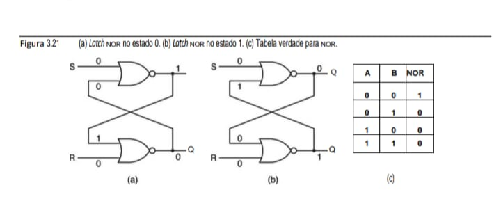

### Insight para o seu repositório estruturas_de_dados
No seu projeto de Torres de Hanói, cada vez que você salva a posição de um disco em uma variável, você está, em última instância, enviando um sinal de Set ou Reset para um conjunto de Latches como este.

 - Enquanto a porta NOR da Figura 3.2 (Combinacional) apenas processa, o Latch da Figura 3.21 (Sequencial) armazena.

Curiosidade de Baixo Nível: Se você desligar o computador, o feedback é interrompido e os elétrons param de circular entre as portas NOR, por isso a memória RAM é volátil.

Para ver como isso ocorre, vamos supor que ambos, S e R, sejam 0, o que é verdade na maior parte do tempo. Apenas para polemizar, vamos supor que Q = 0. Como Q é realimentado para a porta NOR superior, ambas as suas entradas são 0, portanto, sua saída, Q, é 1. O 1 é realimentado para a porta inferior que, então, tem entradas 1 e 0, resultando em Q = 0. Esse estado é no mínimo coerente e está retratado na Figura 3.21(a).

Agora, vamos imaginar que Q não seja 0, mas 1, com R e S ainda 0. A porta superior tem entradas de 0 e 1, e uma saída, Q, de 0, que é realimentada para a porta inferior. Esse estado, mostrado na Figura 3.21(b), também é coerente. Um estado com as duas saídas iguais a 0 é incoerente, porque força ambas as portas a ter dois 0 como entrada, o que, se fosse verdade, produziria 1, não 0, como saída. De modo semelhante, é impossível ter ambas as saídas iguais a 1, porque isso forçaria as entradas a 0 e 1, o que resultaria 0, não 1. Nossa conclusão é simples: para R = S = 0, o latch tem dois estados estáveis, que denominaremos 0 e 1, dependendo de Q.

Agora, vamos examinar o efeito das entradas sobre o estado do latch. Suponha que S se torna 1 enquanto Q = 0. Então, as entradas para a porta superior são 1 e 0, forçando a saída Q a 0. Essa mudança faz ambas as entradas para a porta inferior serem 0, forçando a saída para 1. Portanto, ativar S (isto é, fazer com que seja 1) muda o estado de 0 para 1. Definir R em 1 quando o latch está no estado 0 não tem efeito algum porque a saída da porta NOR inferior é 0 para entradas de 10 e entradas de 11.

Usando raciocínio semelhante, é fácil ver que definir S em 1 quando em estado Q = 1 não tem efeito algum, mas definir R leva o latch ao estado Q = 0. Resumindo, quando S é definido em 1 momentaneamente, o latch acaba no estado Q = 1, pouco importando seu estado anterior. Da mesma maneira, definir R em 1 momentaneamente
força o latch ao estado Q = 0. O circuito “se lembra” se foi S ou R definido por último. Usando essa propriedade podemos construir memórias de computadores.

### Latches SR com clock
Muitas vezes é conveniente impedir que o latch mude de estado, a não ser em certos momentos especificados. Para atingir esse objetivo, fazemos uma ligeira modificação no circuito básico, conforme mostra a Figura 3.22, para obter um latch SR com clock.

Figura 3.22   Latch SR com clock.               

Esta Figura 3.22 resolve um dos maiores problemas do projeto de hardware: o caos do tempo. Sem o clock, qualquer ruído elétrico nas linhas S ou R poderia mudar o valor da memória instantaneamente.

Com o Latch SR com Clock, o circuito só "escuta" as entradas S e R quando o sinal do Clock está em nível alto (1). É o equivalente a colocar um guarda na porta da memória que só permite a entrada de novos dados em momentos específicos.

    Latch SR com Clock (Figura 3.22)
    O segredo está nas duas portas AND adicionadas antes do Latch SR básico. Elas funcionam como comportas (gates) controladas pelo Clock.

        ENTRADAS DE DADOS          CONTROLE DE TEMPO          LATCH SR (MEMÓRIA)
                                            (CLOCK)
            S (SET) ----------------+
                                    |      _______
                                    +-----|       \         _______
                                        |  AND  |----------|       \
                        +-----------------|_______/        |  NOR  )o---- Q
                        |                               +--|_______/      |
            CLOCK -------+                               |                |
                        |                  _______       |   _______      |
                        +---------------- |       \      +--|       \     |
                                    +-----|  AND  |---------|  NOR  )o----+--- !Q
                                    |     |_______/         |_______/
            R (RESET) --------------+

    
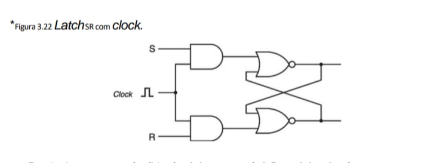

### Insight para o seu repositório estruturas_de_dados
Pense no Clock como o comando COMMIT de um banco de dados ou o momento em que você pressiona Enter após digitar um valor. Você pode mudar as entradas S e R quantas vezes quiser enquanto o clock estiver em 0; nada será salvo. O hardware só "valida" a informação no instante definido pelo pulso de clock.No seu projeto de Torres de Hanói, isso garante que a posição de um disco só seja atualizada quando o algoritmo de movimento terminar de calcular a trajetória, e não durante o cálculo.

Esse circuito tem uma entrada adicional, o clock, que em geral é 0. Com o clock em 0, ambas as portas AND geram saída 0, independentemente de ser S e R, e o latch não muda de estado. Quando o clock é 1, o efeito das portas AND desaparece e o latch se torna sensível a S e R. Apesar de seu nome, o sinal do clock não precisa ser gerado por um clock. Os termos enable e strobe também são muito usados para indicar que a entrada do clock é 1; isto é, o circuito é sensível ao estado de S e R.

Até aqui evitamos falar no que acontece quando ambos, S e R, são 1, por uma boa razão: o circuito se torna não determinístico quando ambos, R e S, finalmente retornam a 0. O único estado coerente para S = R = 1 é Q = Q = 0; porém, assim que ambas as entradas voltam para 0, o latch deve saltar para um de seus dois estados estáveis. Se quaisquer das entradas cair para 0 antes da outra, a que permanecer em 1 por mais tempo vence, porque, quando apenas uma entrada for 1, ela força o estado. Se ambas as entradas voltarem a 0 ao mesmo tempo (o que é muito improvável), o latch salta aleatoriamente para um de seus estados estáveis.

### Latches D com clock
Uma boa maneira de resolver a instabilidade do latch SR (causada quando S = R = 1) é evitar que ela ocorra. A Figura 3.23 apresenta um circuito de latch com somente uma entrada, D. Como a entrada para a porta AND inferior é sempre o complemento da entrada para a superior, nunca ocorre o problema de ambas as entradas serem 1. Quando D = 1 e o clock for 1, o latch é levado ao estado Q = 1. Quando D = 0 e o clock for 1, ele é levado ao estado Q = 0. Em outras palavras, quando o clock for 1, o valor corrente de D é lido e armazenado no latch. Esse circuito, denominado latch D com clock, é uma verdadeira memória de 1 bit. O valor armazenado sempre estará disponível em Q. Para carregar o valor atual de D na memória, um pulso positivo é colocado na linha do clock.

Figura 3.23   Latch D com clock.
O Latch D com Clock é a evolução final da memória de 1 bit que estávamos construindo. Ele resolve o "pecado original" do Latch SR: a condição proibida onde S = R = 1. Ao usar uma única entrada de dados (D) e um inversor, garantimos que as entradas internas do latch sejam sempre opostas, tornando o sistema infalível e previsível.

    Latch D com Clock (Figura 3.23)

    ENTRADA (D)            CONTROLE (CLOCK)           LATCH (MEMÓRIA)
                                      |
        D (Dado) -------+             |
                        |      _______V_______
                        +-----|               |          _______
                              |      AND      |---------|       \
                    +---------|_______________|         |  NOR  )o---- Q (Saída)
                    |                                +--|_______/     |
        CLOCK -------+                               |                |
                    |          _______________       |   _______      |
                    |         |               |      +--|       \     |
                    +---------|      AND      |---------|  NOR  )o----+--- !Q
                        |     |_______________|         |_______/
                        |             ^
                        [ NOT ]-------+
                        |
                        +--- (D Negado)

Esse circuito requer 11 transistores. Circuitos mais sofisticados (porém, menos óbvios) podem armazenar 1 bit com até seis transistores. Esses projetos costumam ser usados na prática. Esse circuito pode permanecer estável indefinidamente, desde que seja aplicada energia (não mostrado). Mais adiante, veremos os circuitos de memória que se esquecem rápido do estado em que estão, a menos que, de alguma forma, sejam “relembrados” constantemente.

### Insight para Estruturas de Dados
No seu diretório estruturas_de_dados, quando você declara uma variável global ou um static int, o compilador reserva um conjunto desses Latches D para segurar esses valores.Enquanto o Clock estiver em 0, você pode mudar o valor de D no barramento (outras operações ocorrendo), mas a sua variável em Q permanecerá intacta.O valor só muda no exato momento do pulso de clock, garantindo que sua lógica de software não sofra com instabilidades elétricas.

## 3.3.2 Flip-flops
Em muitos circuitos é necessário ler o valor em determinada linha em dado instante, e armazená-lo. Nessa variante, denominada flip-flop, a transição de estado não ocorre quando o clock é 1, mas durante a transição de 0 para 1 (borda ascendente), ou de 1 para 0 (borda descendente). Assim, o comprimento do pulso do clock não é importante, contanto que as transições ocorram rapidamente.

Para dar ênfase, vamos repetir qual é a diferença entre um flip-flop e um latch. Um flip-flop é disparado pela borda, enquanto um latch é disparado pelo nível. Contudo, fique atento, porque esses termos são muito confundidos na literatura. Muitos autores usam “flip-flop” quando estão se referindo a um latch, e vice-versa.

Há várias formas de projetar um flip-flop. Por exemplo, se houvesse alguma maneira de gerar um pulso muito curto na borda ascendente do sinal de clock, esse pulso poderia ser alimentado para um latch D. Na verdade, essa maneira existe, e o circuito para ela é mostrado na Figura 3.24(a).

À primeira vista, poderia parecer que a saída da porta and seria sempre zero, uma vez que a operação and de qualquer sinal com seu inverso é zero, mas a situação é um pouco diferente disso. O inversor tem um atraso de propagação pequeno, mas não zero, e é esse atraso que faz o circuito funcionar. Suponha que meçamos a tensão nos quatro pontos de medição a, b, c e d. O sinal de entrada, medido em a, é um pulso de clock longo, como mostrado na parte inferior da Figura 3.24(b). O sinal em b é mostrado acima dele. Observe que ele está invertido e também ligeiramente atrasado, quase sempre de alguns nanossegundos, dependendo do tipo de inversor utilizado.

O sinal em c também está atrasado, mas apenas pelo tempo correspondente à propagação (à velocidade da luz) do sinal. Se a distância física entre a e c for, por exemplo, 20 micra, então o atraso de propagação é 0,0001 ns, que decerto é desprezível em comparação com o tempo que o sinal leva para se propagar pelo inversor. Assim, para todos os efeitos e propósitos, o sinal em c é praticamente idêntico ao sinal em a.

Quando se efetua uma operação and com as entradas para a porta and, b e c, o resultado é um pulso curto, como mostra a Figura 3.24(b), onde a largura do pulso, Δ, é igual ao atraso da porta do inversor, em geral 5 ns ou menos. A saída da porta and é exatamente esse pulso deslocado pelo atraso da porta and, como
mostrado na parte superior da Figura 3.24(b). Esse deslocamento de tempo significa apenas que o latch D será ativado com um atraso fixo após a fase ascendente do clock, mas não tem efeito sobre a largura do pulso. Em uma memória com tempo de ciclo de 10 ns, um pulso de 1 ns para informar quando ler a linha D pode
ser curto o bastante, caso em que o circuito completo pode ser o da Figura 3.25. Vale a pena observar que esse projeto de flip-flop é atraente porque é fácil de entender, embora, na prática, sejam usados flip-flops mais sofisticados.

Figura 3.24   (a) Gerador de pulso. (b) Temporização em quatro pontos do circuito.

Esta Figura 3.24 detalha o Gerador de Pulso, um circuito refinado que utiliza o atraso de propagação para criar janelas de tempo extremamente precisas. No seu repositório arquitetura_computadores, este conceito explica como o hardware consegue "disparar" uma escrita no exato momento em que o dado está estável no barramento.

    Gerador de Pulso (Figura 3.24)

    (a) CIRCUITO GERADOR DE PULSO          (b) DIAGRAMA DE TEMPORIZAÇÃO (Waveform)
                                        
        Sinal (a) -----+-----------\          (a) ____|‾‾‾‾‾‾‾‾‾‾|____
                      |  AND (d)   )--- d     (b) ____|‾‾‾‾‾‾‾‾‾‾|____
                +-----|___________/           (c) ‾‾‾‾‾‾‾‾|__________|_  (Invertido + Δ)
                |                             (d)         |_|            (Pulso Curto)
        (b) ----+---[ NOT ]--- (c)                       ^
                                                         |
                                                Largura do Pulso = Δ

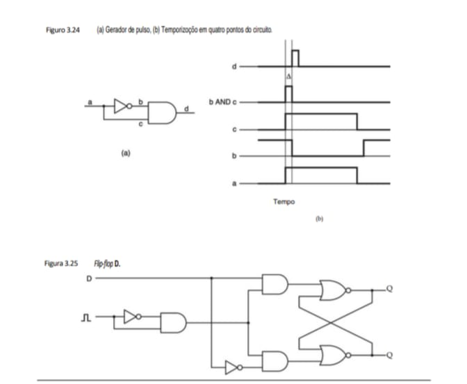

Os símbolos padronizados para latches e flip-flops são mostrados na Figura 3.26. A Figura 3.26(a) é um latch cujo estado é carregado quando o clock, CK, é 1, ao contrário da Figura 3.26(b), que é um latch cujo clock costuma ser 1, mas cai para 0 momentaneamente para carregar o estado a partir de D. As figuras 3.26(c) e (d) são flip-flops em vez de latches, o que é indicado pelo símbolo em ângulo nas entradas do clock. A Figura 3.26(c) muda de estado
na borda ascendente do pulso do clock (transição de 0 para 1), enquanto a Figura 3.26(d) muda de estado na borda descendente (transição de 1 para 0). Muitos latches e flip-flops (mas não todos) também têm Q como uma saída, e alguns têm duas entradas adicionais Set ou Preset (que forçam o estado para Q = 1) e Reset ou Clear (que forçam o estado para Q = 0).

Figura 3.26  Latches e flip-flops D.

Esta Figura 3.26 é um divisor de águas na arquitetura de computadores, Luís. Ela consolida a diferença entre um Latch (sensível ao nível) e um Flip-Flop (sensível à borda). No seu ATmega168, essa distinção é o que separa uma memória que "vaza" dados de um registrador que captura o valor no instante exato do pulso de clock.

O símbolo do pequeno triângulo na entrada de clock (CK) nos itens (c) e (d) indica o disparo por borda, uma técnica que utiliza o gerador de pulso que vimos na Figura 3.24.

    Simbologia de Latches e Flip-Flops (Figura 3.26)

    (a) LATCH D (NÍVEL ALTO)          (b) LATCH D (NÍVEL BAIXO)
        (Transparente se CK=1)            (Transparente se CK=0)
         _______                           _______
     D -|       |- Q                   D -|       |- Q
        |       |                         |       |
    CK -|_______|- !Q                CK -o|_______|- !Q
                                      (Bolinha = Inversão)

    (c) FLIP-FLOP D (BORDA SUBIDA)    (d) FLIP-FLOP D (BORDA DESCIDA)
        (Captura no 0 -> 1)               (Captura no 1 -> 0)
         _______                           _______
     D -|       |- Q                   D -|       |- Q
        |   >   |                         |   >   |
    CK -|_______|- !Q                CK -o|_______|- !Q
            ^                                 ^
            |-- Triângulo = Borda             |-- Círculo + Triângulo

### nsight para o seu repositório estruturas_de_dados
Imagine que você está implementando uma Fila (Queue) em C no seu diretório estruturas_de_dados.

 - O Latch seria como uma porta aberta por onde as pessoas passam enquanto ela estiver aberta.

 - O Flip-Flop é como uma foto tirada no exato milissegundo em que a porta começa a fechar: apenas quem estava exatamente na linha naquele instante é registrado.

Isso é o que permite que o processador faça A = A + 1. Com um Latch, o valor ficaria somando infinitamente enquanto o clock estivesse alto. Com o Flip-Flop D, o valor é lido, somado e o resultado só é gravado "na foto" do próximo ciclo.

## 3.3.3 Registradores
Flip-flops podem ser combinados em grupos para criar registradores, que mantêm tipos de dados com comprimentos maiores do que 1 bit. O registrador na Figura 3.27 mostra como oito flip-flops podem ser ligados para formar um registrador armazenador de 8 bits. O registrador aceita um valor de entrada de 8
bits (I0 a I7) quando o clock CK fizer uma transição. Para implementar um registrador, todas as linhas de clock são conectadas ao mesmo sinal de entrada CK, de modo que, quando o clock fizer uma transição, cada registrador aceitará o novo valor de dados de 8 bits no barramento de entrada. Os próprios flip-flops
são do tipo da Figura 3.26(d), mas as bolhas de inversão nos flip-flops são canceladas pelo inversor ligado ao sinal de clock CK, de modo que os flip-flops são carregados na transição ascendente do clock. Todos os oito sinais clear também são ligados, de modo que, quando o sinal clear CLR passar para 0, todos os
flip-flops serão forçados a passar para o seu estado 0. Caso você queira saber por que o sinal de clock CK é invertido na entrada e depois invertido novamente em cada flip-flop, um sinal de entrada pode não ter corrente suficiente para alimentar todos os oito flip-flops; o inversor da entrada, na realidade, está sendo
usado como um amplificador.

Figura 3.27   Um registrador de 8 bits construído a partir de flip-flops de único bit.

Esta Figura 3.27 representa a aplicação prática de tudo o que estudamos até aqui, Luís. Ao agrupar oito flip-flops D, criamos um Registrador de 8 bits, que é a unidade fundamental de armazenamento interno da CPU, como os registradores que você utiliza em seus projetos de arquitetura e microcontroladores.Neste circuito, os flip-flops operam em uníssono. Quando o sinal de clock (CK) faz uma transição, todos os 8 bits do barramento de entrada ($I_0$ a $I_7$) são capturados simultaneamente e disponibilizados nas saídas ($O_0$ a $O_7$).

    Registrador de 8 Bits (Figura 3.27)

    BARRAMENTO DE ENTRADA (I0 - I7)
        |   |   |   |   |   |   |   |
        I7  I6  I5  I4  I3  I2  I1  I0
        |   |   |   |   |   |   |   |
     [FF][FF][FF][FF][FF][FF][FF][FF] <--- CLR (Clear Geral)
        |   |   |   |   |   |   |   |
        +---+---+---+---+---+---+---+------ CK (Clock Único)
        |   |   |   |   |   |   |   |
        O7  O6  O5  O4  O3  O2  O1  O0
        BARRAMENTO DE SAÍDA (O0 - O7)

### Insight para o seu repositório arquitetura_computadores
No seu diretório estruturas_de_dados, quando você manipula um uint8_t, o hardware está utilizando exatamente este circuito da Figura 3.27.

 - O sinal CLR é frequentemente usado durante o "Power-on Reset" do sistema para garantir que todos os registradores comecem em um estado conhecido (zero).

 - A técnica de usar um inversor como amplificador de corrente é vital em chips reais para evitar a degradação do sinal de clock através de múltiplos componentes.

Quando tivermos projetado um registrador de 8 bits, poderemos usá-lo como um bloco de montagem para criar registradores maiores. Por exemplo, um registrador de 32 bits poderia ser criado pela combinação de dois registradores de 16 bits, unindo seus sinais de clock CK e sinais de clear CLR. Veremos os registradores e seus usos com mais detalhes no Capítulo 4.

## 3.3.4 Organização da memória
Embora agora tenhamos progredido de uma simples memória de 1 bit da Figura 3.23 para a de 8 bits da Figura 3.27, para construir memórias grandes é preciso uma organização diferente, na qual palavras individuais podem ser endereçadas. Uma organização de memória muito utilizada e que obedece a esse critério é mostrada na Figura 3.28. Esse exemplo ilustra uma memória com quatro palavras de 3 bits. Cada operação lê ou escreve uma palavra completa de 3 bits. Embora uma capacidade total de memória de 12 bits seja pouco mais do que nosso flip-flop octal, ela requer um número menor de pinos e, mais importante, o projeto pode ser estendido com facilidade para memórias grandes. Observe que o número de palavras é sempre uma potência de 2.

Figura 3.28  Diagrama lógico para uma memória 4 x 3. Cada linha é uma das quatro palavras de 3 bits. Uma operação de leitura ou
escrita sempre lê ou escreve uma palavra completa.

Esta Figura 3.28 é o "Grand Finale" do nível de lógica digital, Luís. Aqui, você vê como todos os componentes que estudamos — Decodificadores, Flip-Flops e Portas Lógicas — se unem para formar uma Memória RAM 4 x 3 (4 palavras de 3 bits cada).

No seu repositório arquitetura_computadores, este diagrama explica como o processador endereça uma célula específica de memória para ler ou escrever um dado.

Memória RAM 4 x 3 (Figura 3.28)

    ENTRADAS (I2, I1, I0)       ENDEREÇO (A1, A0)
            |   |   |                   |   |
            |   |   |            [ DECODIFICADOR ]
            |   |   |             /     |     |     \
            |   |   |            L0     L1    L2     L3  (Linhas de Seleção)
            |   |   |            |      |     |      |
    [I2] ---+---+---+---[W0]---[FF00]-[FF01]-[FF02]--+--- [O0]
    [I1] ---+---+---+---[W1]---[FF10]-[FF11]-[FF12]--+--- [O1]
    [I0] ---+---+---+---[W2]---[FF20]-[FF21]-[FF22]--+--- [O2]
            |   |   |                                |
            |   |   |        CONTROLE (CS, RD, OE) --+

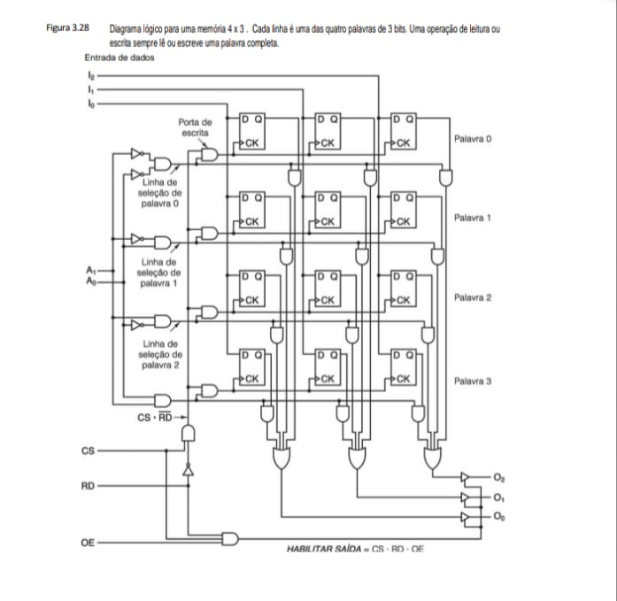

### Insight para o seu repositório estruturas_de_dados
Quando você cria um array int arr[4] no seu diretório estruturas_de_dados, o hardware está fazendo exatamente isto:

 - O índice do array arr[2] é convertido pelos bits de endereço (A_1=1, A_0=0) para ativar a Palavra 2.
 - A largura do tipo (como o seu uint8_t) determina quantas colunas de flip-flops existem em paralelo (neste exemplo da figura, são 3).

Embora à primeira vista talvez pareça complicada, a memória da Figura 3.28 na verdade é bastante simples devido à sua estrutura regular. Ela tem oito linhas de entrada e três de saída. Três entradas são de dados: I0, I1 e I2; duas são para o endereço: A0 e A1; e três são para controle: cs para chip select (selecionar
chip), rd para distinguir entre ler e escrever e oe para output enable (habilitar saída). As três saídas são para dados: O0, O1 e O2. É interessante notar que essa memória de 12 bits requer menos sinais que o registrador de 8 bits anterior. Este requer 20 sinais, incluindo alimentação e terra, enquanto a memória de 12 bits requer apenas 13 sinais. O bloco de memória requer menos sinais porque, diferente do registrador, os bits de memória compartilham um sinal de saída. Nessa memória, cada um dos 4 bits de memória compartilha um sinal de saída. O valor das linhas de endereço determina quais dos 4 bits de memória pode receber ou enviar um valor.

Para selecionar esse bloco de memória, a lógica externa deve estabelecer cs alto e também rd alto (1 lógico) para leitura e baixo (0 lógico) para escrita. As duas linhas de endereço devem ser ajustadas para indicar qual das quatro palavras de 3 bits deve ser lida ou escrita. Para uma operação de leitura, as linhas de entrada de dados não são usadas, mas a palavra selecionada é colocada nas linhas de saída de dados. Para uma operação de escrita, os bits presentes nas linhas de entrada de dados são carregados na palavra de memória selecionada; as linhas de saída de dados não são usadas.

Agora, vamos examinar atentamente a Figura 3.28 para ver como isso funciona. As quatro portas and de seleção de palavras à esquerda da memória formam um decodificador. Os inversores de entrada foram instalados de modo que cada porta é habilitada (saída é alta) por um endereço diferente. Cada porta comanda uma linha de seleção de palavra, de cima para baixo, para as palavras 0, 1, 2 e 3. Quando o chip é selecionado para uma
escrita, a linha vertical rotulada cs · rd estará alta, habilitando uma das quatro portas de escrita, dependendo de qual linha de seleção de palavra esteja alta. A saída da porta de escrita comanda todos os sinais ck para a palavra selecionada, carregando os dados de entrada nos flip-flops para aquela palavra. Uma escrita é efetuada apenas se cs estiver alto e rd estiver baixo, e, ainda assim, somente a palavra selecionada por A0 e A1 é escrita; as outras palavras não são alteradas.

Ler é semelhante a escrever. A decodificação de endereço é idêntica à da escrita. Mas agora a linha cs · rd está baixa, portanto, todas as portas de escrita estão desabilitadas e nenhum dos flip-flops é modificado. Em vez disso, a linha de seleção de palavra que for escolhida habilita as portas and vinculadas aos Q bits da palavra selecionada. Portanto, a palavra selecionada entrega seus dados às portas or de quatro entradas na parte inferior da figura, enquanto as outras três palavras produzem 0s. Em consequência, a saída das portas or é idêntica ao valor armazenado na palavra selecionada. As três palavras não selecionadas não dão nenhuma contribuição à saída.

Embora pudéssemos ter projetado um circuito no qual as três portas or fossem diretamente ligadas às três linhas de saída de dados, essa operação às vezes causa problemas. Em particular, mostramos que as linhas de entrada de dados e as linhas de saída de dados são diferentes, porém, nas memórias em si, as mesmas linhas são usadas. Se tivéssemos vinculado as portas or às linhas de saída de dados, o chip tentaria produzir dados, isto é, forçar cada linha a um valor específico, mesmo nas escritas, interferindo desse modo com os dados de entrada. Por essa razão, é desejável ter um meio de conectar as portas or às linhas de saída de dados em leituras, mas desconectá-las completamente nas escritas. O que precisamos é de um comutador eletrônico que possa estabelecer ou interromper uma conexão em poucos nanossegundos.

Felizmente, esses comutadores existem. A Figura 3.29(a) mostra o símbolo para o que denominamos buffer não inversor, que tem uma entrada e uma saída de dados e uma entrada de controle. Quando a entrada de controle estiver alta, o buffer age como um fio, como mostra a Figura 3.29(b). Quando a entrada de controle esti-
ver baixa, ele age como um circuito aberto, como mostra a Figura 3.29(c); é como se alguém desconectasse a saída de dados do resto do circuito com um alicate de corte. Contudo, ao contrário do que aconteceria no caso do alicate de corte, a conexão pode ser restaurada logo em seguida, dentro de alguns nanossegundos, apenas fazendo o sinal de controle ficar alto novamente.

A Figura 3.29(d) mostra um buffer inversor, que funciona como um inversor normal quando o controle estiver alto, e desconecta a saída do circuito quando o controle estiver baixo. Ambos os tipos de buffers são dispositivos de três estados, porque podem produzir 0, 1, ou nenhum dos dois (circuito aberto). Buffers também amplificam sinais, portanto, podem comandar muitas entradas simultaneamente. Às vezes, eles são usados em circuitos por essa razão, mesmo quando suas propriedades de comutação não são necessárias.

Voltando ao circuito de memória, agora já deve estar claro para que servem os três buffers não inversores nas linhas de saída de dados. Quando cs, rd e oe estiverem todos altos, o sinal output enable também está alto, habilitando os buffers e colocando uma palavra nas linhas de saída. Quando qualquer um dos cs, rd ou oe estiver baixo, as saídas de dados são desconectadas do resto do circuito.

Figura 3.29  (a) Buffer não inversor. (b) Efeito de (a) quando o controle está alto. (c) Efeito de (a) quando o controle está baixo. (d)
Buffer inversor.

Esta Figura 3.29 introduz um componente vital para a comunicação entre os circuitos que estudamos e o barramento (bus) do sistema: o Buffer de Três Estados (Tri-state Buffer). Sem ele, se dois registradores tentassem enviar dados ao mesmo tempo, haveria um curto-circuito. O buffer funciona como uma "chave eletrônica" que desconecta fisicamente a saída do barramento quando não está em uso.

    Buffer Tri-state (Figura 3.29)

    (a) BUFFER NÃO INVERSOR          (b) CONTROLE ALTO (1)
                                        (Passagem Livre)
            |\                                |\
    In -----|  >----- Out           In (0) ---|  >--- Out (0)
            |/                                |/
            ^                                 ^
            |-- Controle                      |-- (1)

    (c) CONTROLE BAIXO (0)           (d) BUFFER INVERSOR
        (Desconectado / High-Z)          (Saída = NOT In)
            |\                                |\
    In (X) -|  >---  (Z)            In -------|  >o--- Out
            |/                                |/
            ^                                 ^
            |-- (0)                           |-- Controle

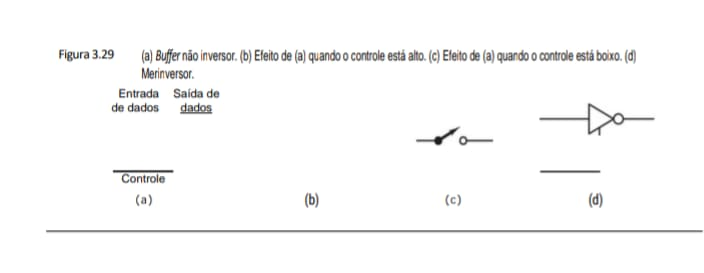

### nsight para o seu repositório estruturas_de_dados
No seu diretório estruturas_de_dados, quando você pensa em um barramento compartilhado, imagine uma sala onde várias pessoas querem falar.

 - O Buffer Tri-state é o microfone de cada pessoa.

 - A Unidade de Controle (Figura 3.28) garante que apenas uma pessoa ligue o microfone por vez.

 - Se alguém tentar falar com o microfone desligado (Controle=0), ninguém ouve nada (Alta Impedância), e o canal fica livre para outro orador.

## 3.3.5 Chips de memória
O bom da memória da Figura 3.28 é que ela pode ser ampliada com facilidade para tamanhos maiores. Em nosso desenho, a memória é 4 × 3, isto é, quatro palavras de 3 bits cada. Para ampliá-la para 4 × 8, basta adicionar cinco colunas de quatro flip-flops cada, bem como cinco linhas de entrada e cinco linhas de saída. Para passar de 4 × 3 para 8 × 3, devemos acrescentar quatro linhas de três flip-flops cada, bem como uma linha de endereço A2. Com esse tipo de estrutura, o número de palavras na memória deve ser uma potência de 2 para que haja o máximo de eficiência, mas o número de bits em uma palavra pode ser qualquer um.

Como a tecnologia de circuitos integrados se ajusta bem à fabricação de chips cuja estrutura interna é um padrão bidimensional repetitivo, chips de memória são uma aplicação ideal para ela. À medida que a tecnologia melhora, o número de bits que podem ser colocados em um chip continua crescendo, normalmente por um fator
de dois a cada 18 meses (lei de Moore). Os chips maiores nem sempre tornam os menores obsoletos devido aos diferentes compromissos entre capacidade, velocidade, energia, preço e conveniência da interface. Em geral, os chips maiores disponíveis no momento são vendidos por preços mais elevados, portanto, são mais caros por bit do que os antigos, menores.

Há vários modos de organizar o chip para qualquer tamanho de memória dado. A Figura 3.30 mostra duas organizações possíveis para um chip de memória mais antigo de 4 Mbits de tamanho: 512 K × 8 e 4.096 K × 1. (A propósito, os tamanhos de chips de memória costumam ser citados em bits em vez de bytes, e por isso adotaremos
essa convenção.) Na Figura 3.30(a), são necessárias 19 linhas de endereço para endereçar um dos 219 bytes e oito linhas de dados para carregar e armazenar o byte selecionado.

Cabe aqui uma observação sobre tecnologia. Em alguns pinos, a alta tensão provoca uma ação. Em outros, é a baixa tensão que causa uma ação. Para evitar confusão, preferimos manter a coerência e dizer sempre que o sinal é afirmado (em vez de dizer que fica alto ou baixo), o que significa que foi disparado para provocar alguma ação. Assim, para alguns pinos, afirmá-lo significa estabelecê-lo alto. Para outros, significa estabelecer o pino baixo. Os
nomes de sinais de pinos afirmados baixos são distinguidos por uma barra superior. Assim, um sinal com rótulo cs é ativado alto, mas um sinal com rótulo cs é ativado baixo. O oposto de afirmado é negado. Quando nada de especial estiver acontecendo, os pinos são negados.

Agora, vamos voltar ao nosso chip de memória. Uma vez que um computador costuma ter muitos chips de memória, é preciso um sinal para selecionar o chip necessário no momento em questão, de modo que ele responda e todos os outros não. O sinal cs (chip select – seleção de chip) existe para essa finalidade e é ativado para habilitar o chip. Além disso, é preciso uma maneira de distinguir entre leituras e escritas. O sinal we (write
enable – habilitar escrita) é usado para indicar que os dados estão sendo escritos, e não lidos. Por fim, o sinal (output enable – habilitar saída) é afirmado para comandar os sinais de saída. Quando ele não é afirmado, a saída
do chip é desconectada do circuito.

Na Figura 3.30(b), é usado um esquema de endereçamento diferente. Esse chip é organizado internamente como uma matriz 2.048 × 2.048 de células de 1 bit, o que dá 4 Mbits. Para endereçar o chip, em primeiro lugar uma linha é selecionada ao se colocar seu número de 11 bits nos pinos de endereço. Então o ras (row address
strobe – strobe de endereço de linha) é afirmado. Em seguida, um número de coluna é colocado nos pinos de endereço e o cas (column address strobe – strobe de endereço de coluna) é afirmado. O chip responde aceitando ou entregando um bit de dados.

Chips de memória de grande porte costumam ser construídos como matrizes n × n endereçadas por linha e coluna. Essa organização reduz o número de pinos requerido, mas também torna mais lento o endereçamento do chip, já que são necessários dois ciclos, um para a linha e outro para a coluna. Para recuperar um pouco da velocidade perdida por esse projeto, alguns chips de memória podem receber um endereço de linha acompanhado por uma sequência de endereços de coluna para acessar bits consecutivos em uma linha.

Anos atrás, os maiores chips de memória costumavam ser organizados como os da Figura 3.30(b). À medida que as palavras de memória cresciam de 8 bits até 32 bits e mais, os chips de 1 bit começaram a ser inconvenientes. Construir uma memória com uma palavra de 32 bits usando chips de 4.096 K × 1 requer 32 chips em paralelo. Esses 32 chips têm capacidade total de no mínimo 16 MB, ao passo que usar chips de 512 K × 8 requer somente quatro chips em paralelo e permite memórias pequenas, de até 2 MB. Para evitar ter 32 chips para memória, grande parte dos fabricantes lançou famílias com 4, 8 e 16 bits de largura. A situação com as palavras de 64 bits é pior ainda, é claro.

Dois exemplos de chips modernos de 512 Mbits são dados na Figura 3.31. Esses chips têm quatro bancos de memória internos de 128 Mbits cada, o que requer duas linhas de seleção de banco para escolher um banco. O projeto da Figura 3.31(a) é de um chip de 32 M × 16 com 13 linhas para o sinal ras, 10 linhas para o sinal cas e 2 linhas para a seleção de banco. Juntos, esses 25 sinais permitem o endereçamento de cada uma das 225 células internas de 16 bits. Em comparação, a Figura 3.31(b) apresenta um projeto de 128 M × 4 com 13 linhas para o sinal ras, 12 linhas para o sinal cas e 2 linhas para a seleção de banco. Nesse caso, 27 sinais podem selecionar quaisquer das 227 células internas de 4 bits a serem endereçadas. A decisão sobre o número de linhas e de colunas que um chip tem é tomada por razões de engenharia. A matriz não precisa ser quadrada.

Figura 3.30  Dois modos de organizar um chip de memória de 4 Mbits.

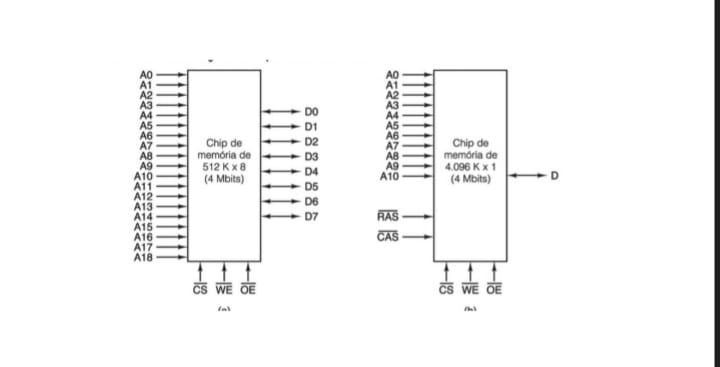

Esta Figura 3.30 ilustra uma decisão fundamental de projeto na engenharia de hardware: a organização interna da capacidade de armazenamento. Embora ambos os chips possuam 4 Mbits de capacidade total, eles são estruturados de formas diferentes para atender a necessidades distintas de largura de banda e endereçamento.

No seu repositório arquitetura_computadores, este conceito é essencial para entender por que, às vezes, usamos vários chips em paralelo para formar um barramento de dados completo.

    Organização de Chips de Memória (Figura 3.30)

    (a) ORGANIZAÇÃO 512K x 8                (b) ORGANIZAÇÃO 4096K x 1
        (Palavras de 1 Byte)                    (Palavras de 1 Bit)

        +-------------------+                   +-------------------+
    A0-A18|                   |           A0-A10  |                   |
    ----->|   512K x 8        |           ------->|   4096K x 1       |
        |   (4 Mbits)       |                   |   (4 Mbits)       |
        |                   |             RAS ->|                   |
        |                   |             CAS ->|                   |
        +-------------------+                   +-------------------+
            | | | | | | | |                         |
            D7 D6 D5 D4 D3 D2 D1 D0                 D (Entrada/Saída única)
        (8 Pinos de Dados)                      (1 Pino de Dados)

Opção (a): Usa 19 linhas de endereço (2^19 = 512K) para acessar 8 bits de uma vez. ----> Byte-Oriented: Ideal para sistemas onde a economia de pinos de endereço é menos crítica que a velocidade de acesso ao byte.

### Insight para o seu repositório estruturas_de_dados
Essa organização impacta diretamente como os dados são lidos da RAM para o seu diretório estruturas_de_dados.

 - Se você estiver usando o chip (a), uma única leitura retorna um char completo.

 - Se estiver usando o chip (b), o hardware do computador precisa ativar 8 chips simultaneamente para "montar" esse mesmo char.

Curiosidade: A organização (b) é muito popular em memórias modernas porque permite que o chip tenha menos pinos (usando a mesma linha para endereço de linha e coluna em tempos diferentes), o que reduz o custo de fabricação.

Figura 3.31  Dois modos de organizar um chip de memória de 512 Mbits.

Esta Figura 3.31 avança na escala de densidade para chips de 512 Mbits, introduzindo o conceito de Bancos de Memória. Diferente dos chips de 4 Mbits da figura anterior, aqui o hardware utiliza bancos internos (Banco 0 e Banco 1) para permitir que certas operações ocorram em paralelo, aumentando a eficiência do seu ATmega168 ou sistemas maiores.

No seu repositório arquitetura_computadores, esta organização demonstra como o endereçamento evolui para gerenciar grandes volumes de dados.

        Organização de 512 Mbits (Figura 3.31)

        (a) ORGANIZAÇÃO 32M x 16                (b) ORGANIZAÇÃO 128M x 4
            (Palavras de 16 bits/2 Bytes)           (Palavras de 4 bits/Nibble)

            +-------------------+                   +-------------------+
        A0-A12|      BANCO 0      |           A0-A12  |      BANCO 0      |
        ----->|      BANCO 1      |           ------->|      BANCO 1      |
            |   (512 Mbits)     |                   |   (512 Mbits)       |
            |                   |             RAS ->|                   |
        RAS ->|   32M x 16        |             CAS ->|   128M x 4        |
        CAS ->|                   |                   |                   |
            +-------------------+                   +-------------------+
                | | | | | | | | | |                     | | | |
                D15 ............ D0                     D3 D2 D1 D0
            (16 Pinos de Dados)                     (4 Pinos de Dados)

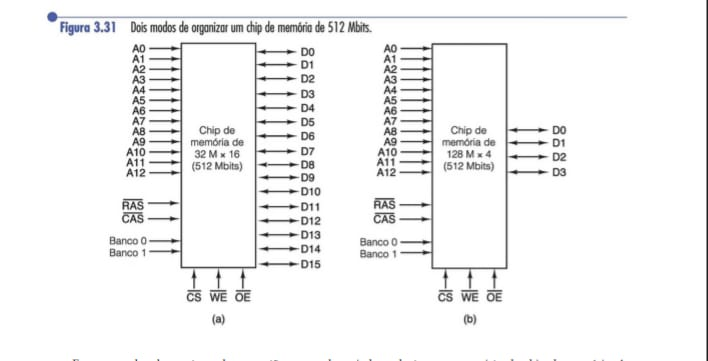

### Insight para o seu repositório estruturas_de_dados
Essa estrutura de bancos explica por que, em C, acessar a memória de forma sequencial é muito mais rápido do que acessos aleatórios. Quando você percorre um array no seu diretório estruturas_de_dados, o hardware mantém um Banco aberto, permitindo leituras consecutivas sem a necessidade de enviar novos sinais RAS (Row Address Strobe) o tempo todo.

Esses exemplos demonstram duas questões separadas e independentes para o projeto do chip de memória. A primeira é a largura da saída (em bits): o chip entrega 1, 4, 8, 16 ou algum outro número de bits de uma vez só? A segunda é se todos os bits de endereço são apresentados em pinos separados de uma vez só ou se as linhas e colunas são apresentadas em sequência, como nos exemplos da Figura 3.31. Um projetista de chips de memória tem de responder a ambas as perguntas antes de iniciar o projeto do chip.

## 3.3.6 RAMs e ROMs
Todas as memórias que estudamos até aqui podem ser escritas e lidas. Elas são denominadas memórias RAM (Random Access Memory – memória de acesso aleatório), um nome suspeito porque todos os chips de memória têm acesso aleatório. No entanto, o termo já é muito utilizado para que o mudemos agora. RAMs podem ser de
duas variedades, estáticas e dinâmicas. Nas estáticas (Static RAMs – SRAMs), a construção interna usa circuitos similares ao nosso flip-flop D básico. Uma das propriedades dessas memórias é que seus conteúdos são conservados enquanto houver fornecimento de energia: segundos, minutos, horas e até mesmo dias. As RAMs estáticas são muito rápidas. Um tempo de acesso típico é da ordem de um nanossegundo ou menos. Por essa razão, elas são muito usadas como memória cache.

RAMS dinâmicas (Dynamic RAMs – DRAMs), ao contrário, não usam flip-flops. Em vez disso, uma RAM dinâmica é um arranjo de células, cada uma contendo um transistor e um pequenino capacitor. Os capacitores podem ser carregados ou descarregados, permitindo que 0s e 1s sejam armazenados. Como a carga elétrica tende
a vazar, cada bit em uma RAM dinâmica deve ser renovado (recarregado) com alguns milissegundos de intervalo para evitar que os dados desapareçam. Como a lógica externa é que tem de cuidar da renovação, as RAMs dinâmicas precisam de uma interface mais complexa do que as estáticas, embora em muitas aplicações essa desvantagem seja compensada por suas maiores capacidades.

Visto que as RAMs dinâmicas precisam de apenas um transistor e um capacitor por bit, em comparação com os seis transistores por bit para a melhor RAM estática, elas têm densidade muito alta (muitos bits por chip). Por essa razão, as memórias principais quase sempre são construídas com RAMs dinâmicas. Contudo, essa grande capacidade tem um preço: são lentas (dezenas de nanossegundos). Dessa maneira, a combinação de uma cache de RAM estática e uma memória principal de RAM dinâmica tenta combinar as boas propriedades de cada uma.

Existem diversos tipos de RAMs dinâmicas. A mais antiga ainda existente (em computadores antigos) é a DRAM FPM (Fast Page Mode – modo de página rápida). Ela é organizada internamente como uma matriz de bits e funciona da seguinte maneira: o hardware escolhe um endereço de linha e então seleciona endereços de
coluna um a um, como descrevemos para o ras e o cas no contexto da Figura 3.30. Sinais explícitos informam à memória quando é hora de responder, de modo que ela funciona de forma assíncrona com o clock do sistema principal.

A DRAM FPM foi substituída pela EDO (Extended Data Output – saída de dados ampliada), que permite iniciar uma segunda referência à memória antes de ser concluída a referência à memória precedente. Esse paralelismo simples não acelerava uma referência individual à memória, mas melhorava a largura de banda da memória, resultando em mais palavras por segundo.

FPM e EDO funcionavam bastante bem quando os tempos de ciclo de chips de memória eram de 12 nanossegundos ou mais lentos. Quando os processadores ficaram tão rápidos que era mesmo preciso ter memórias mais rápidas, a FPM e a EDO foram substituídas pela SDRAM (Synchronous DRAM – DRAM síncrona), que é uma
híbrida de RAM estática e dinâmica, comandada pelo clock do sistema principal. A grande vantagem da SDRAM é que o clock elimina a necessidade de sinais de controle para informar ao chip de memória quando responder. Em vez disso, a CPU informa à memória por quantos ciclos ela deve funcionar e então a inicia. Em cada ciclo subsequente, a memória entrega 4, 8 ou 16 bits, dependendo de quantas linhas de saída ela tem. Eliminar a necessidade de sinais de controle aumenta a taxa de dados entre CPU e memória.

A melhoria seguinte em relação à SDRAM foi a SDRAM DDR (Double Data Rate – dupla taxa de dados). Com esse tipo de memória, o chip de memória produz saída na borda ascendente do clock e também na borda descendente, dobrando a taxa de dados. Portanto, um chip DDR de 8 bits de largura funcionando a 200 MHz entrega dois valores de 8 bits 200 milhões de vezes por segundo (por um curto intervalo, é claro), o que dá uma taxa de saída (burst) teórica de 3,2 Gbps. As interfaces de memória DDR2 e DDR3 oferecem desempenho adicional em relação à DDR, aumentando as velocidades do barramento de memória para 533 MHz e 1.067 MHz, respectivamente. No momento em que este livro era impresso, os chips DDR3 mais velozes poderiam enviar
dados a 17,067 GB/s.

#### Chips de memória não volátil
RAMs não são o único tipo de chip de memória. Em muitas aplicações, como brinquedos, eletrodomésticos e carros, o programa e alguns dos dados devem permanecer armazenados mesmo quando o fornecimento de energia for interrompido. Além do mais, uma vez instalados, nem o programa nem os dados são alterados.
Esses requisitos levaram ao desenvolvimento de ROMs (Read-Only Memories – memórias somente de leitura), que não podem ser alteradas nem apagadas, seja intencionalmente ou não. Os dados de uma ROM são inseridos durante sua fabricação por um processo que expõe um material fotossensível por meio de uma máscara que contém o padrão de bits desejado e então grava o padrão sobre a superfície exposta (ou não exposta). A única maneira de mudar o programa em uma ROM é substituir o chip inteiro.

ROMs são muito mais baratas que RAMs quando fabricadas em volumes grandes o bastante para cobrir o custo da fabricação da máscara. Todavia, são inflexíveis porque não podem ser alteradas após a manufatura, e o tempo decorrido entre fazer o pedido e receber as ROMs pode chegar a semanas. Para facilitar o desenvol-
vimento pelas empresas de novos produtos com ROM, foi inventada a PROM (Programmable ROM – ROM programável). Uma PROM é como uma ROM, exceto que ela pode ser programada (uma vez) em campo, eliminando o tempo de espera entre produção e entrega. Muitas PROMs contêm um arranjo de minúsculos fusíveis em seu interior. Um fusível específico pode ser queimado selecionando sua linha e coluna e então aplicando alta tensão a um pino especial no chip.

O desenvolvimento seguinte nessa linha foi a EPROM (Erasable PROM – PROM apagável), que não só pode ser programada, mas também apagada em campo. Quando a janela de quartzo de uma EPROM é exposta a uma forte luz ultravioleta durante 15 minutos, todos os bits são definidos em 1. Se a expectativa é ter muitas alterações
durante o ciclo de projeto, as EPROMs são muito mais econômicas do que as PROMs, porque podem ser reutilizadas. As EPROMS costumam ter a mesma organização que as RAMs estáticas. A EPROM 27C040 de 4 Mbits, por exemplo, usa a organização da Figura 3.31(a), que é típica de uma RAM estática. O interessante é que chips
antigos como este não desaparecem. Eles apenas se tornam mais baratos e são usados em produtos inferiores, que são altamente sensíveis ao custo. Um 27C040 agora pode ser comprado no varejo por menos de US$ 3, e por muito menos em grandes volumes.

Ainda melhor do que a EPROM é a EEPROM, que pode ser apagada aplicando-se pulsos em vez de ser exposta à luz ultravioleta dentro de uma câmara especial. Além disso, uma EEPROM pode ser reprogramada no local, enquanto uma EPROM tem de ser inserida em um dispositivo especial de programação de EPROM para ser
programada. Uma desvantagem é que a capacidade das maiores EEPROMs é em geral somente 1/64 da capacidade das EPROMs comuns, e sua velocidade é a metade. EEPROMs não podem competir com DRAMs ou SRAMs por- que são 10 vezes mais lentas, sua capacidade é 100 vezes menor e são muito mais caras. Elas são usadas somente em situações em que sua não volatilidade for crucial.

Um tipo mais recente de EEPROM é a memória flash. Diferente da EPROM, que é apagada pela exposição à luz ultravioleta, e da EEPROM, cujos bytes podem ser apagados, os blocos da memória flash podem ser apagados e reescritos. Como a EEPROM, a memória flash pode ser apagada sem ser removida do circuito. Vários fabricantes produzem pequenas placas de circuito impresso com até 64 GB de memória flash que são utilizadas como um “filme” para armazenar fotos em câmeras digitais e muitas outras finalidades. Como já vimos no Capítulo 2, a memória flash agora está começando a substituir os discos mecânicos. Assim como um disco, a memória flash oferece tempos de acesso menores com menor consumo de energia, mas com um custo por bit muito mais alto. Um resumo dos diversos tipos de memória pode ser visto na Figura 3.32.

Figura 3.32  Comparação entre vários tipos de memórias (Arranjo de portas programável em campo).

Esta Figura 3.32 é o fechamento perfeito para a sua documentação de hardware, Luís. Ela oferece uma visão comparativa essencial que conecta os componentes físicos que estudamos às aplicações práticas que você encontra no dia a dia do desenvolvimento de sistemas.

Para manter o padrão do seu repositório, organizei esses dados no formato de tabela que você solicitou, permitindo uma consulta rápida sobre qual tecnologia utilizar em cada projeto.

Comparação de Tecnologias de Memória (Figura 3.32)

+-----------------+------------------------+---------------+---------------+----------+-------------------------------+
| Tipo            | Categoria              | Modo de Apagar| Byte Alterável| Volátil  | Utilização Típica             |
+-----------------+------------------------+---------------+---------------+----------+-------------------------------+
| SRAM            | Leitura/Escrita        | Elétrico      | Sim           | Sim      | Cache de Nível 2              |
| DRAM            | Leitura/Escrita        | Elétrico      | Sim           | Sim      | Memória Principal (antiga)    |
| SDRAM           | Leitura/Escrita        | Elétrico      | Sim           | Sim      | Memória Principal (nova)      |
| ROM             | Somente Leitura        | Não é possível| Não           | Não      | Equipamentos de Grande Volume |
| PROM            | Somente Leitura        | Não é possível| Não           | Não      | Equipamentos de Pequeno Volume|
| EPROM           | Principalmente Leitura | Luz UV        | Não           | Não      | Prototipagem de Dispositivos  |
| EEPROM          | Principalmente Leitura | Elétrico      | Sim           | Não      | Prototipagem de Dispositivos  |
| Flash           | Leitura/Escrita        | Elétrico      | Não           | Não      | Filme para Câmera Digital     |
+-----------------+------------------------+---------------+---------------+----------+-------------------------------+

### Insight para o seu repositório estruturas_de_dados
Ao trabalhar em seu diretório estruturas_de_dados, entender essa tabela é crucial para otimização de código.

 - O uso de algoritmos que favorecem o cache (SRAM) resulta em uma performance drasticamente superior àqueles que dependem constantemente da memória principal (SDRAM).

 - Para projetos com microcontroladores (como o seu ATmega168), saber que a EEPROM é "Byte Alterável" permite salvar configurações específicas sem precisar regravar todo o firmware via memória Flash.

### Field-programmable gate arrays
Como vimos no Capítulo 1, Field-Programmable Gate Arrays (FPGAs) são chips que contêm lógica programável, de modo que podem formar um circuito lógico qualquer simplesmente carregando o FPGA com dados de configuração apropriados. A principal vantagem dos FPGAs é que novos circuitos de hardware podem ser
construídos em horas, em vez dos meses necessários para fabricar ICs. Porém, os circuitos integrados não serão extintos, pois ainda possuem uma vantagem de custo significativa em relação aos FPGAs para aplicações de alto volume, e também são mais rápidos e usam muito menos energia. Contudo, com suas vantagens de tempo de projeto, os FPGAs são usados constantemente para protótipo de projeto e aplicações com baixo volume.

Agora, vejamos o interior de um FPGA para entender como ele pode ser usado para executar uma grande gama de circuitos lógicos. O chip FPGA contém dois componentes principais que são replicados muitas vezes: LUTs (LookUp Tables – tabelas de pesquisa) e interconexões programáveis. Vejamos agora como estes são utilizados.

Uma LUT, mostrada na Figura 3.33(a), é uma pequena memória programável que produz um sinal de saída opcionalmente para um registrador, que é então enviada para a interconexão programável. A memória programável é usada para criar uma função lógica qualquer. A LUT na figura tem uma memória de 16 × 4, que pode
simular qualquer circuito lógico com 4 bits de entrada e 4 bits de saída. A programação da LUT requer a carga da memória com as respostas apropriadas da lógica combinatória sendo simulada. Em outras palavras, se a lógica combinatória produz o valor Y quando recebe a entrada X, o valor Y é escrito na LUT no índice X.

O projeto de exemplo na Figura 3.33(b) mostra como uma única LUT de 4 entradas poderia executar um contador de 3 bits com reset. O exemplo de contador conta de modo contínuo somando um (módulo 4) ao valor atual, a menos que um sinal de reset CLR seja afirmado, que nesse caso retorna o valor do contador a zero.

Para pôr em prática o contador do exemplo, as quatro entradas superiores da LUT são todas zero. Essas entradas enviam o valor zero quando o contador é reiniciado. Assim, o bit mais significativo da entrada da LUT (I3) representa a entrada de reset (CLR) que é ativada com uma lógica 1. Para as entradas restantes da LUT, o valor no índice I0..3 da LUT contém o valor (I + 1) módulo 4. Para concluir o projeto, o sinal de saída O0..3 deve ser conectado, usando a interconexão programável para o sinal de entrada interno I0..3.

Para entender melhor o contador baseado em FPGA com reset, vamos considerar sua operação. Se, por exemplo, o estado atual do contador for 2 e o sinal de reset (CLR) não for afirmado, o endereço de entrada da LUT será 2, que produzirá uma saída de 3 nos flip-flops. Se o sinal de reset (CLR) fosse afirmado para o mesmo estado, a entrada na LUT seria 6, que produziria o próximo estado de 0.

Apesar de tudo, esse pode parecer um modo arcaico de se construir um contador com reset e, de fato, um projeto totalmente personalizado, com um circuito incrementador e sinais de reset para os flip-flops, seria menor, mais rápido e usaria menos energia. A principal vantagem do projeto baseado em FPGA é que você pode ajustá-lo em uma hora em casa, enquanto o projeto totalmente personalizado, mais eficiente, deve ser fabricado com base no silício, o que poderia levar pelo menos um mês.

Figura 3.33  (a) Uma tabela de pesquisa (LUT) de um FPGA. (b) A configuração da LUT para criar um contador de apagamento de 3 bits.

Esta Figura 3.33 ilustra o funcionamento interno de um FPGA (Field Programmable Gate Array), especificamente como uma LUT (Look-Up Table) é utilizada para emular lógica digital de forma flexível. Ao contrário do seu ATmega168, que possui um hardware fixo, o FPGA permite que você "reconfigure" as conexões elétricas para criar qualquer circuito, como este contador de 3 bits.

    LUT e Configuração do Contador (Figura 3.33)

    (a) ESTRUTURA DA LUT (16x4)             (b) CONFIGURAÇÃO DO CONTADOR
                                            
        DA INTERCONEXÃO                         MAPA DE MEMÓRIA (LUT)
        PROGRAMÁVEL                            +----------+-------+
            |                                  | ENDEREÇO | DADOS |
        [I0..I3] (Endereço)                    +----------+-------+
            |                                  |    0     |   1   |
    +------V------+                            |    1     |   2   |
    |   MEMÓRIA   |                            |    2     |   3   |
    |    16 x 4   |---[O0..O3]                 |    3     |   0   |
    +-------------+      |                     +----------+-------+
            |             |                    (O endereço aponta para
            |        +----V----+                o próximo estado)
     CK ---+------->| FLIP-FLOP |
                    |    x 4    |---> À INTERCONEXÃO
    CLR ----------->|___________|     PROGRAMÁVEL (Q)

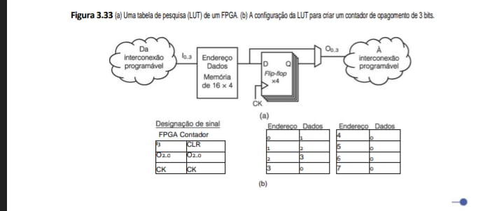

### Insight para o seu repositório estruturas_de_dados
No seu diretório estruturas_de_dados, você costuma pensar em algoritmos rodando sobre um hardware fixo. Com um FPGA e estas LUTs, você poderia criar um hardware que é, por si só, uma Estrutura de Dados.

Por exemplo: você poderia configurar as LUTs para serem um Hash Map físico, onde a busca ocorre na velocidade dos elétrons, sem passar por ciclos de instrução de uma CPU tradicional.

Com a Figura 3.33, cobrimos desde o bit individual até o hardware reconfigurável! Este é o estado da arte da lógica digital.

Para usar um FPGA, o projeto precisa ser descrito usando uma descrição de circuito ou uma linguagem de descrição de hardware (ou seja, uma linguagem de programação usada para descrever estruturas de hardware). O projeto é então processado por um sintetizador, que mapeia o circuito para uma arquitetura FPGA específica.

Um desafio do uso de FPGAs é que o projeto que você quer mapear nunca parece ser o suficiente. Os FPGAs são fabricados com uma quantidade variável de LUTs, com quantidades maiores custando mais. Em geral, se o seu projeto não for suficiente, você terá que simplificar ou abrir mão de alguma funcionalidade, ou então comprar um FPGA maior (e mais caro). Projetos muito grandes podem não caber nos maiores FPGAs, exigindo que o projetista mapeie o projeto em vários FPGAs; essa tarefa é definitivamente mais difícil, porém, ainda muito mais fácil do que projetar um circuito integrado personalizado completo.

## 3.4 Chips de CPU e barramentos
Agora que já temos todas essas informações sobre circuitos integrados, clocks e chips de memória, podemos começar a juntar todas as peças, examinando sistemas completos. Nesta seção, estudaremos primeiro alguns aspectos gerais das CPUs do ponto de vista do nível lógico digital, incluindo a pinagem (pinout) (isto é,
o que significam os sinais dos vários pinos). Como as CPUs estão tão entrelaçadas com o projeto dos barramentos que utilizam, também faremos uma introdução ao projeto de barramentos nesta seção. Nas seções seguintes, daremos exemplos detalhados de CPUs e seus barramentos e de como é a interface entre eles.

## 3.4.1 Chips de CPU
Todas as CPUs modernas são contidas em um único chip, o que faz sua interação com o resto do sistema ser bem definida. Cada chip de CPU tem um conjunto de pinos por meio dos quais deve ocorrer toda sua comunicação com o mundo exterior. Alguns pinos produzem sinais da CPU para o mundo exterior; outros aceitam
sinais do mundo exterior; alguns podem fazer as duas coisas. Entendendo a função de todos esses pinos, podemos aprender como a CPU interage com a memória e os dispositivos de E/S no nível lógico digital.

Os pinos de um chip de CPU podem ser divididos em três tipos: de endereço, de dados e de controle. Eles são conectados a pinos similares na memória e a chips de E/S por meio de um conjunto de fios paralelos, denominado barramento. Para buscar uma instrução, primeiro a CPU coloca o endereço de memória daquela instrução em seus pinos de endereço. Então, ela ativa uma ou mais linhas de controle para informar à memória que ela quer ler uma palavra, por exemplo. A memória responde colocando a palavra requisitada nos pinos de dados da CPU e ativando um sinal que informa o que acabou de fazer. Quando percebe esse sinal, a CPU aceita a palavra e executa a instrução.

A instrução pode requisitar leitura ou escrita de palavras de dados, caso em que todo o processo é repetido para cada palavra adicional. Mais adiante, vamos entrar nos detalhes do modo de funcionamento da leitura e da escrita. Por enquanto, o importante é entender que a CPU se comunica com a memória e com dispositivos de E/S apresentando sinais em seus pinos e aceitando sinais em seus pinos. Nenhuma outra comunicação é possível.

Dois dos parâmetros fundamentais que determinam o desempenho de uma CPU são o número de pinos de endereço e o número de pinos de dados. Um chip com m pinos de endereço pode endereçar até 2m localizações de memória. Valores comuns de m são 16, 32 e 64. De modo semelhante, um chip com n pinos de dados pode ler
ou escrever uma palavra de n bits em uma única operação. Valores comuns de n são 8, 32 e 64. Uma CPU com 8 pinos de dados efetuará quatro operações para ler uma palavra de 32 bits, enquanto uma CPU com 32 pinos de dados pode executar a mesma tarefa em uma única operação. Assim, o chip com 32 pinos de dados é muito mais
rápido; porém, invariavelmente, também é mais caro.

Além dos pinos de endereço e de dados, cada CPU tem alguns pinos de controle. Os pinos de controle regulam o fluxo e a temporização de dados que vêm da CPU e vão para ela, além de ter outras utilizações diversas. Todas as CPUs têm pinos para energia elétrica (geralmente +1,2 volt a +1,5 volt), para terra e para um sinal de clock (uma onda quadrada com uma frequência bem definida), mas os outros pinos variam muito de um chip para outro. Não obstante, os pinos de controle podem ser agrupados aproximadamente nas seguintes categorias principais:

    1. Controle de barramento.
    2. Interrupções.
    3. Arbitragem de barramento.
    4. Sinalização de coprocessador.
    5. Estado.
    6. Diversos.

Logo faremos uma breve descrição de cada uma dessas categorias. Quando examinarmos os chips Intel Core i7, TI OMAP4430 e Atmel ATmega168, mais adiante, daremos mais detalhes. Um chip de CPU genérico que usa esses grupos de sinais pode ser visto na Figura 3.34.

Figura 3.34  Pinagem lógica de uma CPU genérica. As setas indicam sinais de entrada e sinais de saída. Os segmentos de reta diagonais
indicam que são utilizados vários pinos. Há um número que indica quantos são os pinos para uma CPU específica.

Esta Figura 3.34 representa a interface física entre o silício e o mundo externo: a Pinagem Lógica de uma CPU. Enquanto as figuras anteriores focaram no que acontece dentro do chip, esta mostra como o processador se comunica com a memória e os periféricos através do barramento.

No seu repositório arquitetura_computadores, este diagrama é o mapa para entender como o seu ATmega168 ou qualquer CPU genérica organiza seus pinos para troca de informações.

    Pinagem Lógica (Figura 3.34)
    ______________________________________
            |                                       |
    <------//| ENDEREÇAMENTO (Ex: 16, 32, 64 pinos)  |--- (Define o Espaço de Endereçamento)
            |_______________________________________|
            |                                       |
    <------>//| DADOS (Ex: 8, 16, 32, 64 pinos)       |--- (Largura da Palavra/Throughput)
            |_______________________________________|
            |                                       |
    <------//| CONTROLE DE BARRAMENTO                |--- (RD, WR, M/IO)
            |_______________________________________|
            |                                       |
    <------- | ARBITRAGEM DE BARRAMENTO              |--- (Bus Request, Bus Grant)
            |_______________________________________|
            |                                       |
    -------> | INTERRUPÇÕES                          |--- (IRQ, NMI)
            |             MICROPROCESSADOR          |
    <------- | COPROCESSADOR  TÍPICO                 |--- (Sinais de Extensão)
            |                                       |
    <------//| ESTADO                                |--- (Status do Processador)
            |_______________________________________|
            |                                       |
    <------//| DIVERSOS                              |--- (Reset, Ready, Hold)
            |_______________________________________|
                |               |               |
                Φ               V               ⟒
            ALIMENTAÇÃO        CLOCK        ATERRAMENTO
                (Vcc)           (CLK)           (GND)

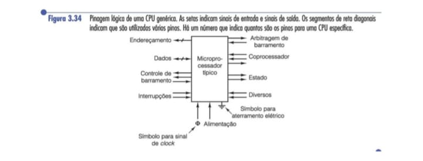

### Insight para o seu repositório estruturas_de_dados
Ao codificar em C no seu diretório estruturas_de_dados, cada vez que você faz um acesso a ponteiro, você está disparando eletronicamente os pinos de Endereçamento e aguardando a resposta nos pinos de Dados.

Se houver um erro de hardware (como um pino de aterramento solto ou interferência no clock), o seu software apresentará comportamentos imprevisíveis independentemente de quão perfeita seja a lógica do código.

Fechamos o ciclo da lógica digital! Partimos do transistor, passamos pela ULA, pelas memórias e chegamos aos pinos de conexão da CPU.

A maioria dos pinos de controle do barramento são saídas da CPU para o barramento (e, portanto, entradas para a memória e chips de E/S) que informam se a CPU quer ler ou escrever na memória ou fazer outra coisa qualquer. A CPU usa esses pinos para controlar o resto do sistema e informar o que ela quer fazer.

Os pinos de interrupção são entradas que vêm de dispositivos de E/S para a CPU. Em grande parte dos sistemas, a CPU pode dizer a um dispositivo de E/S que inicie uma operação e então continuar e fazer outra coisa qualquer enquanto o dispositivo de E/S está realizando seu trabalho. Quando a E/S estiver concluída, o chip controlador de E/S ativa um sinal em um desses pinos para interromper a CPU e fazê-la prestar algum serviço ao dispositivo de E/S, por exemplo, verificar se ocorreram erros de E/S. Algumas CPUs têm um pino de saída para confirmar o sinal de interrupção.

Os pinos de arbitragem de barramento são necessários para disciplinar o tráfego no barramento de modo a impedir que dois dispositivos tentem usá-lo ao mesmo tempo. Do ponto de vista da arbitragem, a CPU é um dispositivo e tem de requisitar o barramento como qualquer outro.

Alguns chips de CPUs são projetados para funcionar com coprocessadores, como chips de ponto flutuante, mas às vezes também com chips gráficos ou outros chips. Para facilitar a comunicação entre CPU e coprocessador, há pinos especiais dedicados a fazer e aceitar requisições.

Além desses sinais, há outros pinos diversos presentes em algumas CPUs. Alguns deles fornecem ou aceitam informações de estado, outros são úteis para depuração ou para reiniciar o computador, e outros mais estão presentes para garantir a compatibilidade com chips de E/S mais antigos.

### 3.4.2 Barramentos de computador
Um barramento é um caminho elétrico comum entre vários dispositivos. Os barramentos podem ser categorizados por sua função. Podem ser usados no interior da CPU para transportar dados de e para a ULA ou ser externos à CPU, para conectá-la à memória ou a dispositivos de E/S. Cada tipo tem seus próprios requisitos e propriedades. Nesta seção e nas seguintes, focalizaremos barramentos que conectam a CPU à memória e a dispositivos de E/S. No capítulo seguinte, examinaremos mais de perto os barramentos internos à CPU.

Os primeiros computadores pessoais tinham somente um barramento externo, ou barramento do sistema, que consistia em 50 a 100 fios de cobre paralelos gravados na placa-mãe, com conectores a intervalos regulares para ligação com a memória e placas de E/S. Os computadores pessoais modernos em geral têm um barramento de
uso especial entre a CPU e a memória e (pelo menos) outro barramento para os dispositivos de E/S. Um sistema mínimo, com um barramento de memória e um barramento de E/S, é ilustrado na Figura 3.35.

Figura 3.35  Sistema de computador com vários barramentos.

Esta Figura 3.35 representa a macroarquitetura de um sistema de computador, mostrando como os componentes que estudamos individualmente se conectam para formar um organismo funcional. Note que não existe apenas um barramento, mas uma hierarquia deles, cada um otimizado para uma velocidade e propósito específicos.

No seu repositório arquitetura_computadores, este diagrama é o mapa rodoviário que conecta o processamento à memória e aos periféricos.

    SINAL DE CLOCK (Fig. 3.20)          ESTRUTURA DE BARRAMENTOS (Fig. 3.35)
        ___________________________          ____________________________________
        |  [ GERADOR DE CLOCK ]     |        |          CHIP DE CPU               |
        |   (Cristal/Oscilador)     |        |   [ ULA ] <---> [ REGISTRADORES ]  |
        |___________|_______________|        |      ^               ^             |
                    |                        |______|_______________|_____________|
                    |                               |       |
        Sinal C1 --+------> [ SINCRONISMO ] <------+  Barramento no chip
        Sinal C2 --+------> [ DO SISTEMA  ] <------+
                    |                               |
                    v                               v
        [ CONTROLADOR DE BARRAMENTO ] <------------+
            /                    \
    BARRAMENTO DE MEMÓRIA    BARRAMENTO DE E/S (I/O)
            |                 /          |          \
    [ MEMÓRIA ]       [ DISCO ]    [ REDE ]   [ IMPRESSORA ]

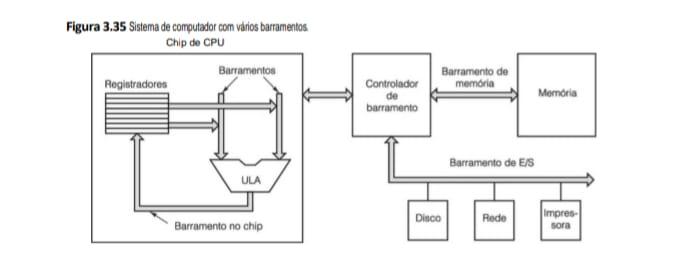

### Por que o diagrama original parece incompleto?
Faltam as camadas de controle que você já estudou nas figuras anteriores (como a 3.34):

 - Arbitragem: Como o Controlador de Barramento decide se o Disco ou a Rede podem falar.

 - Multiplexação: Como o mesmo barramento carrega Endereços em um ciclo e Dados em outro.

 - Alimentação: O chip da CPU não funciona apenas com lógica; ele precisa de energia estável (Vcc/GND) para manter os flip-flops acesos.

Na literatura, às vezes os barramentos são representados por setas largas e sombreadas, como nesta figura. A distinção entre essas setas e uma linha reta cortada por um pequeno segmento de reta inclinado acompanhado de um número de bits é sutil. Quando todos os bits são do mesmo tipo, por exemplo, todos
são bits de endereço ou todos são bits de dados, então costuma ser usada a representação pelo segmento de reta diagonal. Quando estão envolvidas linhas de endereço, de dados e de controle, a seta larga sombreada é a mais comum.

Embora os projetistas de CPUs tenham liberdade para usar qualquer tipo de barramento que quiserem dentro do chip, para possibilitar a ligação de placas projetadas por terceiros ao barramento de sistema é preciso haver regras bem definidas sobre o modo de funcionamento do barramento, às quais todos os dispositivos a ele ligados têm de obedecer. Essas regras são denominadas protocolo de barramento. Além disso, são necessárias especificações mecânicas e elétricas, de modo que placas de terceiros caibam no suporte da placa e tenham conectores compatíveis com os da placa-mãe, tanto em termos mecânicos quanto em termos de tensões, temporizações etc. Ainda assim, outros barramentos não possuem especificações mecânicas, pois são projetados para serem usados
dentro de um circuito integrado, por exemplo, para unir componentes dentro de um sistema-em-um-chip (SoC–System-on-a-Chip).

Há inúmeros barramentos em uso no mundo dos computadores. Alguns dos mais conhecidos, no passado e atualmente (com exemplos), são: Omnibus (PDP-8), Unibus (PDP-11), Multibus (8086), barramento VME (equipamento para laboratório de física), barramento do IBM PC (PC/XT), barramento ISA (PC/AT), barramento
EISA (80386), Microchannel (PS/2), Nubus (Macintosh), barramento PCI (muitos PCs), barramento SCSI (muitos PCs e estações de trabalho), Universal Serial Bus (PCs modernos) e FireWire (equipamentos eletrônicos de consumo). O mundo provavelmente seria um lugar melhor se todos os barramentos, menos um, desaparecessem
repentinamente da face da Terra (tudo bem, menos dois, então). Infelizmente, a padronização nessa área parece muito improvável porque muito dinheiro já foi investido em todos esses sistemas incompatíveis.

A propósito, existe outra interconexão, PCI Express, que geralmente é chamada de barramento, mas na verdade não é barramento algum. Vamos estudá-la mais adiante neste capítulo.

Agora, vamos iniciar nosso estudo do funcionamento dos barramentos. Alguns dispositivos ligados a um barramento são ativos e podem iniciar transferências no barramento, ao passo que outros são passivos e esperam requisições. Os ativos são denominados mestres; os passivos são denominados escravos. Quando a CPU ordena a um controlador que leia ou escreva um bloco, ela está agindo como mestre e o controlador de disco, como escravo. Todavia, mais tarde, o controlador de disco pode agir como um mestre quando manda a memória aceitar as palavras que são lidas do drive de disco. Várias combinações típicas mestre e escravo estão relacionadas na Figura 3.36. Em nenhuma circunstância a memória pode ser mestre.

    Figura 3.36   Exemplos de mestres e escravos de barramentos.

    +-------------------+-------------------+----------------------------------------------+
    | Mestre            | Escravo           | Exemplo                                      |
    +-------------------+-------------------+----------------------------------------------+
    | CPU               | Memória           | Buscar instruções e dados                    |
    | CPU               | Dispositivo de E/S| Iniciar transferência de dados               |
    | CPU               | Coprocessador     | CPU que passa instruções para o coprocessador|
    | Dispositivo de E/S| Memória           | DMA (acesso direto à memória)                |
    | Coprocessador     | CPU               | Coprocessador que busca operandos na CPU     |
    +-------------------+-------------------+----------------------------------------------+

Os sinais binários emitidos por dispositivos de computador muitas vezes são fracos demais para energizar um barramento, em especial se ele for relativamente longo ou tiver muitos dispositivos ligados a ele. Por esse motivo, a maioria dos mestres de barramento está conectada a ele por um chip denominado controlador de barramento, que é nada mais que um amplificador digital. De modo semelhante, grande parte dos escravos está conectada ao barramento
por um receptor de barramento. Quando dispositivos podem agir como mestres e também como escravos, é usado um chip combinado denominado transceptor de barramento. Essas interfaces de barramento são com frequência dispositivos de três estados, o que permite que flutuem (se desconectem) quando não são necessários ou então se conectem de modo um tanto diferente, denominado coletor aberto, que consegue um efeito semelhante. Quando dois ou mais dispositivos em uma linha de coletor aberto ativam a linha ao mesmo tempo, o resultado é o OR booleano de todos os sinais. Esse arranjo costuma ser denominado OR cabeado (wired-OR). Na maioria dos barramentos, algumas das linhas são de três estados, e outras, que precisam da propriedade OR cabeado, são de coletor aberto.

Assim como uma CPU, um barramento também tem linhas de endereço, de dados e de controle. Contudo, nem sempre há um mapeamento um-para-um entre os pinos da CPU e os sinais do barramento. Por exemplo, algumas CPUs têm três pinos que codificam se ela está fazendo uma leitura de memória, uma escrita na memória, uma leitura de E/S, uma escrita de E/S ou alguma outra operação. Um barramento típico poderia ter uma linha para leitura de memória, uma segunda para escrita na memória, uma terceira para leitura de E/S, uma quarta para escrita de E/S e assim por diante. Nesse caso, seria necessário um chip decodificador entre a CPU e o barramento para compatibilizar os dois lados, isto é, converter o sinal de 3 bits codificado em sinais separados que podem comandar as linhas do barramento.

Projeto e operação de barramento são questões de tamanha complexidade que há inúmeros livros escritos apenas sobre isso (Anderson et al., 2004; Solari e Willse, 2004). Os principais tópicos do projeto de barramento são largura, clock, arbitragem e operações. Cada um desses tópicos tem impacto substancial sobre a velocidade e a largura de banda do barramento. Agora, examinaremos cada um nas quatro seções seguintes.

## 3.4.3 Largura do barramento
A largura do barramento é o parâmetro de projeto mais óbvio. Quanto mais linhas de endereço tiver um barramento, mais memória a CPU pode endereçar diretamente. Se um barramento tiver n linhas de endereço, então uma CPU pode usá-las para endereçar 2n localizações de memória diferentes. Para memórias de grande porte, os
barramentos precisam de muitas linhas de endereço, o que parece algo bem simples.

O problema é que barramentos largos precisam de mais fios do que os estreitos, e também ocupam mais espaço físico (por exemplo, na placa-mãe), além de precisar de conectores maiores. Todos esses fatores encarecem o barramento e, por isso, há um compromisso entre tamanho máximo de memória e custo do sistema. Um
sistema com barramento de endereços de 64 linhas e 232 bytes de memória custará mais que um com 32 linhas e os mesmos 232 bytes de memória. A possibilidade de expansão posterior não é gratuita.

O resultado dessa observação é que muitos projetistas de sistemas tendem a ser imediatistas, o que provoca consequências desastrosas mais tarde. O IBM PC original continha uma CPU 8088 e um barramento de endereços de 20 bits, conforme mostra a Figura 3.37(a). Os 20 bits permitiam ao PC endereçar 1 MB de memória.

Figura 3.37   Crescimento de um barramento de endereços ao longo do tempo.

Esta Figura 3.37 ilustra a evolução técnica e o desafio de compatibilidade enfrentado pela Intel ao longo das décadas. O ponto central aqui é como manter a capacidade de rodar softwares antigos enquanto se expande o espaço de endereçamento para suportar mais memória RAM.

No seu repositório arquitetura_computadores, este diagrama serve para explicar por que a arquitetura x86 se tornou tão complexa (e por que o seu estudo de microarquitetura foca em modelos mais "limpos" como o do Tanenbaum).

    Evolução do Barramento de Endereços (Figura 3.37)

    (a) Intel 8088 (1979)          (b) Intel 80286 (1982)          (c) Intel 80386 (1985)
        [ 1 MB RAM ]                   [ 16 MB RAM ]                   [ 4 GB RAM ]
    _________________              _________________               _________________
    |      8088       |            |      80286      |             |      80386      |
    |                 |            |                 |             |                 |
    | [Endereço: 20b] |            | [Endereço: 20b] |             | [Endereço: 20b] |
    |      |          |            |      |          |             |      |          |
    | [Controle]      |            | [Controle]      |             | [Controle]      |
    |_________________|            |      |          |             |      |          |
                                   | [+4 bits Ext.]  |             | [+4 bits Ext.]  |
                                   |_________________|             |      |          |
                                                                   | [+8 bits Ext.]  |
                                                                   |_________________|

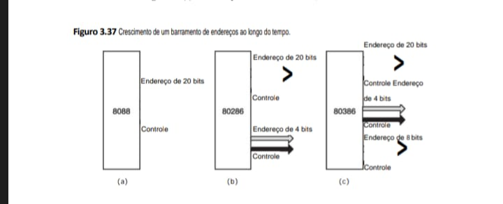

### Insight para o seu repositório estruturas_de_dados
Ao manipular ponteiros em C no seu diretório estruturas_de_dados, você raramente vê isso, mas o tamanho do seu void* é determinado por essa evolução.

 - Em sistemas de 32 bits (como o 80386), um ponteiro ocupa 4 bytes.

 - Em sistemas modernos de 64 bits, ele ocupa 8 bytes, permitindo endereçar exabytes de memória.

Entender a Figura 3.37 explica por que "economizar memória" era uma arte crítica nos anos 80 e por que estruturas de dados complexas como as que você estuda (Hash Tables, Linked Lists) precisavam lidar com a fragmentação dos barramentos antigos.

Quando lançou seu próximo chip de CPU (o 80286), a Intel decidiu aumentar o espaço de endereços para 16 MB, por isso precisou adicionar quatro linhas de barramento (sem mexer nas 20 originais, por razões de compatibilidade), como ilustrado na Figura 3.37(b). Infelizmente, mais linhas de controle tiveram de ser acrescentadas para lidar com as novas linhas de endereço. Quando o 80386 foi lançado, oito linhas de endereço foram adicionadas, junto com ainda mais linhas de controle, como mostra a Figura 3.37(c). O projeto resultante (o barramento EISA) é muito mais confuso do que seria se o barramento tivesse 32 linhas desde o início.

Não é apenas o número de linhas de endereço que tende a crescer com o tempo, mas também o número de linhas de dados, porém, por uma razão diferente. Há dois modos de aumentar a largura de banda de dados de um barramento: reduzir o tempo deste (mais transferências por segundo) ou aumentar sua largura de dados (mais
bits por transferência). Acelerar o barramento é possível, mas difícil, porque os sinais trafegam em linhas diferentes com velocidades ligeiramente diferentes, um problema conhecido como atraso diferencial do barramento. Quanto mais rápido o barramento, mais sério se torna o atraso diferencial.

Outro problema com a aceleração é que isso não será compatível. Placas antigas, projetadas para os barramentos mais lentos, não funcionarão com o novo. Invalidar as placas antigas descontentará não somente seus proprietários, mas também os fabricantes. Por conseguinte, a técnica que costuma ser adotada para melhorar o desempenho é adicionar linhas de dados, de forma análoga à Figura 3.37. Todavia, como era de esperar, no fim das contas esse crescimento incremental não leva a um projeto limpo. O IBM PC e seus sucessores, por exemplo, passaram de oito linhas de dados para 16 e em seguida para 32, conservando praticamente o mesmo barramento.

Para contornar o problema de barramentos muito largos, às vezes os projetistas optam por um barramento multiplexado. Nesse projeto, em vez de as linhas de endereços e dados serem separadas, há, por exemplo, 32 linhas para endereços e dados juntos. No início de uma operação de barramento, as linhas são usadas para o endereço.

Mais tarde, são usadas para dados. Para uma escrita na memória, por exemplo, isso significa que as linhas de endereço devem ser estabelecidas e propagadas para a memória antes que os dados possam ser colocados no barramento. Com linhas separadas, endereços e dados podem ser colocados juntos. Multiplexar as linhas reduz
a largura (e o custo) do barramento, mas resulta em um sistema mais lento. Quando tomam suas decisões, os projetistas de barramento têm de pesar cuidadosamente todas essas opções.

## 3.4.4 Clock do barramento
Barramentos podem ser divididos em duas categorias distintas, dependendo de seu clock. Um barramento síncrono tem uma linha comandada por um oscilador de cristal. O sinal nessa linha consiste em uma onda quadrada com uma frequência em geral entre 5 e 133 MHz. Todas as atividades do barramento tomam um número
inteiro desses ciclos denominados ciclos de barramento. O outro tipo de barramento, o barramento assíncrono, não tem um clock mestre. Ciclos de barramento podem ter qualquer largura requerida e não são os mesmos entre todos os pares de dispositivos. A seguir, estudaremos cada tipo de barramento.

### Barramentos síncronos
Como exemplo do funcionamento de um barramento síncrono, considere o diagrama temporal da Figura 3.38(a). Nesse exemplo, usaremos um clock de 100 MHz, que dá um ciclo de barramento de 10 nanossegundos. Embora isso possa parecer um tanto lento em comparação a velocidades de CPU de 3 GHz ou mais, poucos barramentos de PCs são muito mais rápidos. Por exemplo, o popular barramento PCI normalmente funciona a 33 ou 66 MHz e o barramento PCI-X atualizado (porém agora extinto) funcionava a uma velocidade de até 133 MHz. As razões por que os barramentos atuais são lentos já foram dadas: problemas técnicos de projeto, como atraso
diferencial de barramento e necessidade de compatibilidade.

Em nosso exemplo, admitiremos ainda que ler da memória leva 15 ns a partir do instante em que o endereço está estável. Como veremos em breve, com esses parâmetros, ler uma palavra levará três ciclos de barramento. O primeiro ciclo começa na borda ascendente de T1 e o terceiro termina na borda ascendente de T4, como mostra a figura. Observe que nenhuma das bordas ascendentes ou descendentes foi desenhada na linha vertical porque nenhum sinal elétrico pode trocar seu valor em tempo zero. Nesse exemplo, admitiremos que leva 1 ns para o sinal mudar. As linhas de clock, ADDRESS, DATA, MREQ, RD e WAIT, estão todas representadas na mesma escala de tempo.

O início de T1 é definido pela borda ascendente do clock. A meio caminho de T1 a CPU coloca o endereço da palavra que ela quer nas linhas de endereço. Como o endereço não é um valor único, como o clock, não podemos mostrá-lo como uma linha única na figura; em vez disso, ele é mostrado como duas linhas que se cruzam no instante em que o endereço muda. Além disso, a área sombreada antes do cruzamento indica que o valor nessa área
não é importante. Usando essa mesma convenção, vemos que o conteúdo das linhas de dados não é significativo até uma boa porção de T3.

Depois que as linhas de endereço tiverem uma chance de se acomodar a seus novos valores, MREQ e RD são ativados. O primeiro indica que é a memória (e não um dispositivo de E/S) que está sendo acessada e o segundo é ativado (valor 0) para leituras e negado (valor 1) para escritas. Uma vez que a memória leva 15 ns após o endereço estar estável (a meio caminho no primeiro ciclo de clock), ela não pode entregar os dados requisitados durante T2. Para dizer à CPU que não os espere, a memória ativa a linha wait no início de T2. Essa ação irá inserir estados de espera (ciclos extras de barramento) até que a memória conclua e desative wait. Em nosso exemplo, foi inserido um estado de espera (T2) porque a memória é muito lenta. No início de T3, quando está certa de que terá os dados durante o ciclo corrente, a memória nega wait.

Durante a primeira metade de T3, a memória coloca os dados nas linhas de dados. Na borda descendente de T3, a CPU mostra a linha de dados, isto é, lê a linha, armazenando (latching) o valor em um registrador interno. Após ter lido os dados, a CPU nega mreq e rd. Se for preciso, outro ciclo de memória pode começar na próxima borda ascendente do clock. Essa sequência pode ser repetida indefinidamente.

Na especificação temporal da Figura 3.38(b), esclarecemos melhor oito símbolos que aparecem no diagrama. TAD, por exemplo, é o intervalo de tempo entre a borda ascendente do clock T1 e o estabelecimento das linhas de endereço. Conforme a especificação de temporização, TAD ≤ 4 ns. Isso significa que o fabricante da CPU garante que durante qualquer ciclo de leitura a CPU entregará o endereço a ser lido dentro de 4 ns a partir do ponto médio da borda ascendente de T1.

Figura 3.38   (a) Temporização de leitura em um barramento síncrono. (b) Especificação de alguns tempos críticos.

Esta Figura 3.38 detalha o funcionamento de um Barramento Síncrono, onde todas as ações são coordenadas pelas bordas de subida e descida do clock (Φ). O ponto crucial aqui é o Estado de Espera (Wait State), um recurso vital quando a CPU é mais rápida que a memória RAM, algo comum nos seus estudos de microarquitetura.No seu repositório arquitetura_computadores, este diagrama explica por que o tempo de acesso à memória dita o desempenho real do sistema.

Temporização e Estados de Espera (Figura 3.38)

    CICLO T1        CICLO T2        ESPERA (T_w)       CICLO T3
             __              __              __              __
    Φ  _____|  |____________|  |____________|  |____________|  |_____
            
            [ ENDEREÇO VÁLIDO ]------------------------------------>
    ADDR  ___/XXXXXXXXXXXXXXXXX\_____________________________________
            |<-- TAD -->|
                                                [ DADOS VÁLIDOS ]
    DATA  _______________________________________/XXXXXXXXXXXXXXX\___
                                                |<-- TDS -->|
            __________
    MREQ               \_____________________________________________
            
            __________________
    RD                         \_____________________________________
                                          _______
    WAIT  _______________________________/       \___________________
                                        (CPU aguarda a memória)

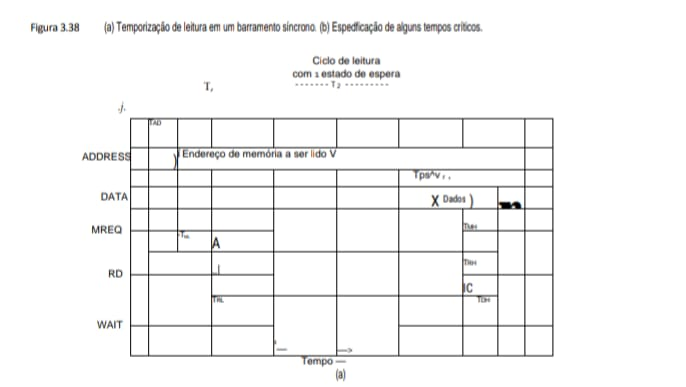

### Insight para o seu repositório estruturas_de_dados
Ao implementar algoritmos de busca no diretório estruturas_de_dados, os Wait States são os grandes vilões da performance.

 - Se a sua estrutura de dados está espalhada pela memória (como uma lista encadeada), cada salto para um novo ponteiro dispara um novo ciclo de leitura com possíveis estados de espera.

 - Já um array contínuo permite que o controlador de barramento otimize esses tempos, reduzindo a necessidade do sinal WAIT.

        +---------------+----------------------------------------------------------+-------+-------+--------+
        | Símbolo       | Parâmetro                                                | Mín.  | Máx.  | Unidade|
        +---------------+----------------------------------------------------------+-------+-------+--------+
        | TADA          | Atraso de saída do endereço                              |       | 4     | ns     |
        | TMLE          | Endereço estável antes de MREQ                           | 2     |       | ns     |
        | TM            | Mínimo                                                   |       | 3     | ns     |
        | TRL           | Atraso de RD desde a borda descendente de Φ em T1        |       | 3     | ns     |
        | TDS           | Tempo de ajuste dos dados antes da borda descendente de Φ| 2     |       | ns     |
        | TMHA          | Atraso de MREQ desde a borda descendente de Φ em T3      |       | 3     | ns     |
        | TRHA          | Atraso de RD desde a borda descendente de Φ em T3        |       | 3     | ns     |
        | TDH           | Tempo de sustentação dos dados desde a negação de RD     | 0     |       | ns     |
        +---------------+----------------------------------------------------------+-------+-------+--------+

As especificações de temporização também requerem que os dados estejam disponíveis nas linhas de dados no mínimo TDS (2 nanossegundos) antes da borda descendente de T3 para lhes dar tempo para se acomodarem antes que a CPU os leia. A combinação de restrições impostas a Tad e TDS significa que, na pior das hipóteses, a memória terá somente 25 – 4 – 2 = 19 ns desde o instante em que o endereço aparece até o instante em que ela
deve produzir os dados. Como 10 ns é suficiente, até mesmo no pior caso, uma memória de 10 ns sempre pode responder durante T3. Uma memória de 20 ns, entretanto, perderia o momento por pouco e teria de inserir um segundo estado de espera e responder durante T4.

A especificação de temporização garante ainda mais que o endereço será estabelecido pelo menos 2 nanossegundos antes de mreq ser ativado. Esse tempo pode ser importante se mreq comandar a seleção de chip no chip de memória, porque algumas memórias requerem um tempo de estabelecimento de endereço antes da seleção
do chip. Claro que o projetista do sistema não deve escolher um chip de memória que necessite de um tempo de estabelecimento de 3 ns.

As limitações impostas a TM e TRL significam que ambos, mreq e rd, serão ativados dentro de 3 ns a partir da borda descendente T1 do clock. No pior caso, o chip de memória terá somente 10 + 10 – 3 – 2 = 15 ns após a ativação de mreq e rd para levar seus dados até o barramento. Essa restrição é adicional ao (e independente do) intervalo de 15 ns necessário após o endereço estar estável.

TMH e TRH informam quanto tempo leva para mreq e rd serem negados após a leitura dos dados. Por fim, TDH informa por quanto tempo a memória deve sustentar os dados no barramento após a negação de rd. No que diz respeito a nosso exemplo de CPU, a memória pode remover os dados do barramento tão logo rd tenha sido negado; porém, em algumas CPUs modernas, os dados devem ser conservados estáveis durante um pouco mais de tempo.

Gostaríamos de destacar que a Figura 3.38 é uma versão muito simplificada das restrições reais de tempo. Na realidade, sempre são especificados muitos mais tempos críticos. Ainda assim, ela nos dá uma boa ideia do modo de funcionamento de um barramento síncrono.

Uma última coisa que vale a pena mencionar é que sinais de controle podem ser ativados baixos ou altos. Cabe aos projetistas do barramento determinar o que é mais conveniente, mas a escolha é, em essência, arbitrária. Podemos entendê-la como equivalente em hardware à decisão que o programador toma de representar blocos de discos livres em um mapa de bits como 0s ou 1s.

### Barramentos assíncronos
Embora seja fácil trabalhar com barramentos síncronos por causa de seus intervalos discretos de tempo, eles também têm alguns problemas. Por exemplo, tudo funciona como múltiplos do clock do barramento. Ainda que CPU e memória possam concluir uma transferência em 3,1 ciclos, elas terão de prolongar o ciclo até 4,0 porque ciclos fracionários são proibidos.

Pior ainda, uma vez escolhido o ciclo do barramento e construídas placas de memória e E/S para ele, é difícil aproveitar futuros avanços da tecnologia. Por exemplo, suponha que alguns anos após a construção do sistema da Figura 3.38 sejam lançadas novas memórias com tempos de acesso de 8 ns em vez de 15 ns, que eliminam o estado de espera e dão mais velocidade à máquina. Então, suponha que sejam lançadas memórias de 4 ns. Não haveria nenhum ganho adicional de desempenho porque, com esse projeto, o tempo mínimo para uma leitura é dois ciclos.

Exprimindo esses fatos em termos um pouco diferentes, se um barramento síncrono tiver uma coleção heterogênea de dispositivos, alguns rápidos, alguns lentos, ele tem de ser ajustado para o mais lento, e os mais rápidos não podem usar todo o seu potencial.

Pode-se utilizar tecnologia mista passando para um barramento assíncrono, isto é, que não tenha um clock mestre, como mostra a Figura 3.39. Em vez de vincular tudo ao clock, quando o mestre de barramento tiver ativado o endereço, MREQ, rd e tudo o mais que precisa, em seguida ele ativa um sinal especial que denominaremos msyn (Master SYNchronization). Quando o escravo vê esse sinal, ele realiza o trabalho com a maior rapidez que puder e, ao concluir essa fase, ativa ssyn (Slave SYNchronization).

Assim que o mestre perceber ssyn ativado, sabe que os dados estão disponíveis, portanto, ele os serializa e então desativa as linhas de endereço, junto com MREQ, RD e MSYN. Quando o escravo percebe a negação de msyn, sabe que o ciclo foi concluído, portanto, nega ssyn, e voltamos à situação original, com todos os sinais negados, esperando pelo próximo mestre.

Diagramas temporais de barramentos assíncronos (e às vezes também os de barramentos síncronos) usam setas para mostrar causa e efeito, como na Figura 3.39. A ativação de msyn faz com que as linhas de dados sejam ativadas e também com que o escravo ative ssyn. A ativação de ssyn, por sua vez, causa a negação das linhas de endereço, mreq, rd e msyn. Por fim, a negação de msyn causa a negação e ssyn, que conclui a leitura e retorna o sistema a seu estado original.

Figura 3.39   Operação de um barramento assíncrono.

Esta Figura 3.39 apresenta o contraste fundamental ao modelo anterior: o Barramento Assíncrono. Diferente do barramento síncrono (Figura 3.38), aqui não existe um clock global ($\Phi$) regendo o tempo; em vez disso, a comunicação ocorre por meio de um "aperto de mão" (handshake) entre a CPU e a memória.No seu repositório arquitetura_computadores, este diagrama é essencial para entender sistemas que precisam integrar componentes de velocidades vastamente diferentes sem desperdiçar ciclos de CPU.

    Barramento Assíncrono (Figura 3.39)

    PASSO 1         PASSO 2         PASSO 3         PASSO 4
        (CPU Inicia)    (Memória Responde) (CPU Lê/Finaliza) (Memória Reseta)

    ADDR  ___/XXXXXXXXXXXX\________________________________________________
            (Endereço)
            
    MREQ  ________\_______________________________________________________
            
    RD    ________\_______________________________________________________
                    \____
    MSYN  ______________|__________________________________________________
                        | (Master Sync)
                                          __________
    DATA  _______________________________/XXXXXXXXXX\______________________
                                        (Dados prontos)
                                          __________
    SSYN  _______________________________/          \______________________
                                        (Slave Sync)

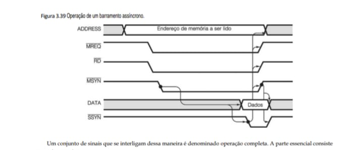

### Insight para o seu repositório estruturas_de_dados
Este conceito de barramento assíncrono é muito similar aos protocolos de rede que você estuda, como o TCP.

 - Assim como no estruturas_de_dados/redes, onde um pacote só é enviado após o ACK, no barramento assíncrono o dado só é considerado válido após o "reconhecimento" da memória.

 - Isso torna o sistema extremamente robusto contra variações de temperatura ou comprimento de cabos, que poderiam causar erros de temporização em um barramento síncrono rígido.

Um conjunto de sinais que se interligam dessa maneira é denominado operação completa. A parte essencial
consiste em quatro eventos:
       ____
    1. MSYN é ativado.
       ____                         ____
    2. SSYN é ativado em resposta a MSYN.
       ____                        ____
    3. MSYN é negado em resposta a SSYN.
       ____                                   ____
    4. SSYN é negado em resposta à negação de MSYN.

É preciso que fique claro que operações completas são independentes de temporização. Cada evento é causado por um evento anterior e não por um pulso de clock. Se determinado par mestre-escravo for lento, não afetará, de modo algum, um par mestre-escravo subsequente, que é muito mais rápido.

Agora, a vantagem de um barramento assíncrono já deve estar bem clara, mas a verdade é que a maioria dos barramentos é síncrona. A razão é que é mais fácil construir um sistema síncrono. A CPU apenas ativa seus sinais e a memória apenas reage. Não há realimentação (causa e efeito), mas, se os componentes foram escolhidos adequadamente, tudo funcionará sem dependência. Além disso, há muito dinheiro investido na tecnologia do barramento síncrono.

## 3.4.5 Arbitragem de barramento
Até aqui ficou subentendido que há somente um mestre de barramento, a CPU. Na realidade, chips de E/S têm de se tornar mestres de barramento para ler e escrever na memória e também para causar interrupções. Coprocessadores também podem precisar se tornar mestres de barramento. Então, surge a pergunta: “O que acontece se dois ou mais dispositivos quiserem se tornar mestres de barramento ao mesmo tempo?” A resposta é que é preciso algum mecanismo de arbitragem de barramento para evitar o caos.

Mecanismos de arbitragem podem ser centralizados ou descentralizados. Em primeiro lugar, vamos considerar a arbitragem centralizada. Uma forma particularmente simples de arbitragem centralizada é mostrada na Figura 3.40(a). Nesse esquema, um único árbitro de barramento determina quem entra em seguida. Muitas CPUs
contêm o árbitro no chip de CPU, mas às vezes é preciso um chip separado. O barramento contém uma única linha de requisição OR cabeada que pode ser afirmada por um ou mais dispositivos a qualquer tempo. Não há nenhum modo de o árbitro dizer quantos dispositivos requisitaram o barramento. As únicas categorias que ele
pode distinguir são algumas requisições e nenhuma requisição.

Quando o árbitro vê uma requisição de barramento, emite uma concessão que ativa a linha de concessão de barramento. Essa linha está ligada a todos os dispositivos de E/S em série, como um cordão de lâmpadas de árvore de Natal. Quando o dispositivo que está fisicamente mais próximo do árbitro vê a concessão, verifica para confirmar se fez uma requisição. Caso positivo, toma o barramento, mas não passa a concessão adiante na linha. Se não fez uma requisição, ele propaga a concessão até o próximo dispositivo na linha que se comporta da mesma maneira, e assim por diante, até algum deles aceitar a concessão e tomar o barramento. Esse esquema é denominado encadeamento em série (daisy chaining). Ele tem a propriedade de designar prioridades aos dispositivos dependendo da distância entre eles e o árbitro. O que estiver mais próximo vence.

Para contornar as prioridades implícitas baseadas na distância em relação ao árbitro, muitos barramentos têm vários níveis de prioridade. Para cada nível de prioridade há uma linha de requisição e uma linha de concessão de barramento. O barramento da Figura 3.40(b) tem dois níveis, 1 e 2 (barramentos reais costumam ter 4, 8 ou 16 níveis). Cada dispositivo está ligado a um dos níveis de requisição do barramento, sendo que os mais críticos em relação ao tempo estão ligados aos níveis com prioridade mais alta. Na Figura 3.40(b), os dispositivos 1, 2 e 4 usam prioridade 1, enquanto os dispositivos 3 e 5 usam prioridade 2.

Se vários níveis de prioridade são requisitados ao mesmo tempo, o árbitro emite uma concessão somente ao de prioridade mais alta. Entre os dispositivos da mesma prioridade, é usado o encadeamento em série. Na Figura 3.40(b), se ocorrer algum conflito, o dispositivo 2 vence o dispositivo 4, que vence o 3. O dispositivo 5 tem a menor prioridade porque está no final da linha de encadeamento de menor prioridade.

Figura 3.40   (a) Árbitro de barramento centralizado de um nível usando encadeamento em série. (b) Mesmo árbitro, mas com dois níveis.

Esta Figura 3.40 detalha o mecanismo de Arbitragem de Barramento, essencial para gerenciar quem tem o direito de "falar" no barramento de E/S quando múltiplos periféricos (como o seu SSD e a sua placa de rede) tentam acessá-lo ao mesmo tempo. Sem um árbitro, haveria colisões de dados e instabilidade no sistema.

No seu repositório arquitetura_computadores, este diagrama explica a lógica de prioridade física entre dispositivos.

    Arbitragem por Encadeamento (Figura 3.40)

    (a) UM NÍVEL (Daisy Chain)             (b) DOIS NÍVEIS (Prioridade)
                                        
        +---------+                            +---------+
        | ÁRBITRO |                            | ÁRBITRO |
        +----+----+                            +--+---+--+
            |                                    |   |
    [CONCESSÃO] (Bus Grant)              [NÍVEL 1]--+   +--[NÍVEL 2]
        |    |    |    |                          |           |
        [D1]--[D2]--[D3]--[D4]                   [D1]-[D2]   [D3]-[D4]
        |                                         |           |
    [REQUISIÇÃO] (Bus Request)               [REQ 1]     [REQ 2]

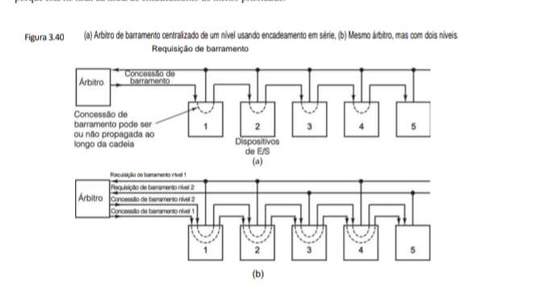

### Insight para o seu repositório estruturas_de_dados
Ao gerenciar processos ou threads no diretório estruturas_de_dados, você usa semáforos ou mutexes; a Arbitragem de Barramento é o equivalente a isso, mas implementado puramente em portas lógicas e fios.

 - Se você tiver um dispositivo "fominha" (que pede o barramento o tempo todo) no início da cadeia, os dispositivos no final podem sofrer de starvation (fome), nunca conseguindo transmitir seus dados.

 - É por isso que sistemas modernos usam o modelo (b) ou arbitragem distribuída, garantindo que a sua rede não pare enquanto o disco está sendo lido.

Com a Figura 3.40, chegamos ao coração da coordenação de hardware.

A propósito, tecnicamente não é necessário ligar a linha de concessão de barramento de nível 2 em série passando pelos dispositivos 1 e 2, já que eles não podem fazer requisições nessa linha. Contudo, por conveniência de execução, é mais fácil ligar todas as linhas de concessão passando por todos os dispositivos, em vez de fazer ligações especiais que dependem da prioridade de dispositivo.

Alguns árbitros têm uma terceira linha que um dispositivo ativa quando aceita uma concessão e pega o barramento. Tão logo tenha ativado essa linha de reconhecimento, as linhas de requisição e concessão podem ser negadas. O resultado é que outros dispositivos podem requisitar barramento enquanto o primeiro o estiver usando. No instante em que a transferência for concluída, o próximo mestre de barramento já terá sido selecionado. Ele pode começar logo que a linha de reconhecimento tenha sido negada, quando então pode ser iniciada a próxima rodada de arbitragem. Esse esquema requer uma linha de barramento extra e mais lógica em cada dispositivo, mas faz melhor uso de ciclos de barramento.

Em sistemas em que a memória está no barramento principal, a CPU deve competir pelo barramento com todos os dispositivos de E/S em praticamente todos os ciclos. Uma solução comum para essa situação é dar à CPU a prioridade mais baixa, de modo que ela obtenha o barramento apenas quando ninguém mais o quiser.
Nesse caso, a ideia é que a CPU sempre pode esperar, mas os dispositivos de E/S muitas vezes precisam adquirir logo o barramento ou então perdem os dados que chegam. Discos que giram a alta velocidade não podem esperar. Em muitos sistemas modernos de computadores, esse problema é evitado ao se colocar a memória em
um barramento separado dos dispositivos de E/S de modo que estes não tenham de competir pelo acesso ao barramento.

Também é possível haver arbitragem de barramento descentralizada. Por exemplo, um computador poderia ter 16 linhas de requisição de barramento priorizadas. Quando um dispositivo quer usar o barramento, ele afirma sua linha de requisição. Todos os dispositivos monitoram todas as linhas de requisição, de modo que, ao final de cada ciclo de barramento, cada dispositivo sabe se foi o requisitante de prioridade mais alta e, portanto, se tem permissão de usar o barramento durante o próximo ciclo. Comparado à arbitragem centralizada, o método descentralizado requer mais linhas de barramento, mas evita o custo potencial do árbitro. Além disso, limita o número de dispositivos ao número de linhas de requisição.

Outro tipo de arbitragem de barramento descentralizada, mostrado na Figura 3.41, usa apenas três linhas, não importando quantos dispositivos estiverem presentes. A primeira é uma linha OR cabeada para requisitar o barramento. A segunda é denominada busy e é ativada pelo mestre de barramento corrente. A terceira linha é usada para arbitrar o barramento. Ela está ligada por encadeamento em série a todos os dispositivos. O início dessa cadeia é ativado ligando-o a uma fonte de alimentação.

Figura 3.41   Arbitragem de barramento descentralizada.

Esta Figura 3.41 apresenta a Arbitragem de Barramento Descentralizada, um modelo que elimina a necessidade de um árbitro central (como o da Figura 3.40) para gerenciar conflitos. Em vez de um chip mestre, os próprios dispositivos de E/S decidem quem assume o controle do barramento através de uma linha de arbitragem compartilhada.

No seu repositório arquitetura_computadores, este diagrama representa um sistema mais resiliente, pois não possui um único ponto de falha.

    LINHA DE REQUISIÇÃO (BUS REQUEST) <--------------------+
        ___________________________________________________|
                                                           |
        LINHA BUSY (OCUPADO) <-----------------------------|--+
        ___________________________________________________|  |
                                                           |  |
        LINHA DE ARBITRAGEM (CHAIN)                        |  |
    VCC ---[D1]---[D2]---[D3]---[D4]---[D5]                |  |
            |      |      |      |      |                  |  |
            +------+------+------+------+-------------------+--+
                    (Sinais de Entrada/Saída de cada dispositivo)

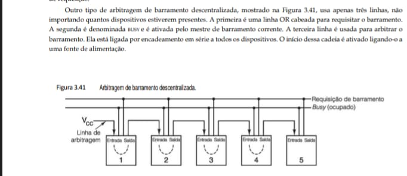

### Insight para o seu repositório estruturas_de_dados
Este conceito de arbitragem descentralizada é a base física para o que você estuda em Sistemas Distribuídos no diretório estruturas_de_dados.

 - É o equivalente em hardware a um algoritmo de Token Ring ou CSMA/CD, onde os nós precisam de um mecanismo de consenso para evitar colisões no meio de transmissão.

 - No seu código em C, entender isso ajuda a visualizar por que certas operações de baixo nível podem sofrer latência variável dependendo da posição física do dispositivo no barramento.

Quando nenhum dispositivo quiser o barramento, a linha de arbitragem ativada é propagada por todos os outros. Para adquirir o barramento, um dispositivo primeiro verifica para ver se o barramento está ocioso e se o sinal de arbitragem que está recebendo, in (entrada), está ativado. Se in estiver negado, o dispositivo em questão não pode se tornar o mestre de barramento e o sinal out (saída) é negado. Entretanto, se in for ativado, o dispositivo nega out, o que faz seu vizinho seguinte na cadeia ver in negado e negar seu próprio out. Daí, todos os dispositivos depois dele na cadeia veem in negado e, por sua vez, negam out. Quando o processo terminar, somente um dispositivo terá in ativado e out negado, e é ele que se torna o mestre de barramento, ativa busy e out e inicia sua transferência.

Um pouco de raciocínio revelará que o dispositivo mais à esquerda que quiser o barramento o obtém. Assim,
esse esquema é similar à arbitragem original por encadeamento em série, com a exceção de não ter o árbitro. Por
isso é mais barato, mais rápido e não está sujeito a falhas do árbitro.

## 3.4.6 Operações de barramento
Até agora, discutimos apenas ciclos de barramento comuns, com um mestre (em geral, a CPU) lendo de um escravo (em geral, a memória) ou escrevendo nele. Na verdade, existem vários outros tipos de ciclos de barramento. Em seguida, vamos estudar alguns deles.

Em geral, só uma palavra é transferida por vez. Contudo, quando é usado caching, é desejável buscar uma linha inteira de cache (por exemplo, 8 palavras de 64 bits consecutivas) por vez. Transferências de blocos costumam ser mais eficientes do que transferências individuais sucessivas. Quando uma leitura de bloco é iniciada, o mestre de barramento informa ao escravo quantas palavras serão transferidas, por exemplo, colocando o número de palavras nas linhas de dados durante T1. Em vez de retornar apenas uma palavra, o escravo entrega uma durante cada ciclo até esgotar aquele número de palavras. A Figura 3.42 mostra uma versão modificada da Figura 3.38(a), mas agora com um sinal extra, block, que é ativado para indicar que foi requisitada uma transferência de bloco. Nesse exemplo, uma leitura de bloco de 4 palavras demora 6 ciclos em vez de 12.

Figura 3.42   Transferência de bloco.

Esta Figura 3.42 apresenta a Transferência de Bloco (também conhecida como Burst Mode), uma técnica de otimização de barramento onde a CPU envia um único endereço inicial e a memória responde com uma sequência contínua de palavras de dados. No seu repositório arquitetura_computadores, este conceito explica como o hardware acelera o carregamento de linhas de cache e vetores de dados.

    Transferência de Bloco (Figura 3.42)

    CICLO T1      CICLO T2      CICLO T3      CICLO T4      CICLO T5
             __            __            __            __            __
    Φ  _____|  |__________|  |__________|  |__________|  |__________|  |_____
            
            [ ADDR 0 ]
    ADDR  ___/XXXXXXXX\_____________________________________________________
            
                                [ DADO 0 ]    [ DADO 1 ]    [ DADO 2 ]
    DATA  ________________________/XXXXXXXX\____/XXXXXXXX\____/XXXXXXXX\____
            
            _______________________________________________________________
    MREQ               \____________________________________________________
            
            _______________________________________________________________
    BLOCK              \____________________________________________________
                        (Sinaliza que múltiplos dados serão lidos)

### Insight para o seu repositório estruturas_de_dados
Ao trabalhar com memcpy() ou manipulação de grandes arrays no diretório estruturas_de_dados, o compilador e o hardware tentam usar este modo de Transferência de Bloco sempre que possível.

 - Estruturas de dados Contíguas (como Vetores) se beneficiam diretamente desse hardware, pois os dados estão em endereços adjacentes, permitindo que a memória apenas "vire a página" e continue enviando.

 - Já estruturas Dispersas (como Árvores ou Listas Encadeadas) forçam a CPU a desativar o modo BLOCK e enviar um novo endereço para cada nó, o que é drasticamente mais lento devido à latência de endereçamento repetida.

Há também outros tipos de ciclos de barramento. Por exemplo, em um sistema multiprocessador com duas ou mais CPUs no mesmo barramento, muitas vezes é necessário garantir que só uma CPU por vez use alguma estrutura de dados crítica na memória. Um modo típico de organizar isso é ter uma variável na memória que é 0
quando nenhuma CPU estiver usando a estrutura de dados e 1 quando esta estiver em uso. Se uma CPU quiser obter acesso à estrutura de dados, deve ler a variável e, se esta for 0, passá-la para 1. O problema é que, com um pouco de má sorte, duas CPUs podem ler a variável em ciclos de barramento consecutivos. Se cada uma perceber que a variável é 0, então cada uma passa a variável para 1 e acha que é a única CPU que está usando a estrutura de dados. Essa sequência de eventos leva ao caos.

Para evitar essa situação, sistemas multiprocessadores costumam ter um ciclo de barramento especial ler-modificar-escrever que permite a qualquer CPU ler uma palavra da memória, inspecionar e modificar essa palavra, e escrevê-la novamente na memória, tudo sem liberar o barramento. Esse tipo de ciclo evita que uma CPU
rival possa usar o barramento e assim interferir com a operação da primeira CPU.

Outro tipo importante de ciclo de barramento é o usado para manipular interrupções. Quando ordena que um dispositivo de E/S faça algo, a CPU espera uma interrupção quando o trabalho for concluído. A sinalização da interrupção requer o barramento.

Uma vez que vários dispositivos podem querer causar uma interrupção simultaneamente, os mesmos tipos de problemas de arbitragem que tivemos nos ciclos de barramento comuns também estão presentes aqui. A solução normal é atribuir prioridades a dispositivos e usar um árbitro centralizado para dar prioridade aos dis-
positivos mais críticos em relação ao tempo. Existem chips controladores de interrupção padronizados que são muito usados. Em PCs baseados em processador Intel, o chipset incorpora um controlador de interrupção 8259A, ilustrado na Figura 3.43.

Figura 3.43   Utilização do controlador de interrupção 8259A.

Esta Figura 3.43 apresenta o funcionamento do Controlador de Interrupção 8259A, um componente vital que atua como um "secretário" para a CPU. No seu repositório arquitetura_computadores, este diagrama explica como o hardware gerencia múltiplos dispositivos externos (teclado, disco, impressora) que precisam da atenção do processador ao mesmo tempo.

    Controlador de Interrupção 8259A (Figura 3.43)
    DISPOSITIVOS (IR0 - IR7)              INTERFACE DA CPU
         _________________________            _________________________
        |  [ CLOCK ]      --> IR0 |          |                         |
        |  [ TECLADO ]    --> IR1 |          |       [ CPU ]           |
        |  [ DISCO ]      --> IR2 |   INT    |                         |
        |  [ IMPRESSORA ] --> IR3 |--------->| <--- Pinos de Entrada   |
        |  [ VCC ]        --> IR7 |   INTA   |      (Figura 3.34)      |
        |_________________________| <--------|                         |
                     |                       |_________________________|
         ___________V___________                  |          |
        |                       |                 |          |
        |  CONTROLADOR 8259A    | <---------------+----------+
        |_______________________|           BARRAMENTO DE DADOS (D0-D7)
            ^      ^      ^
            |      |      |
            [RD]   [WR]   [CS] (Sinais de Controle)

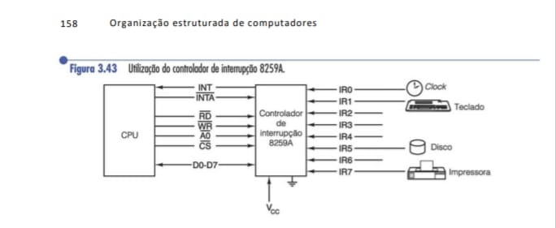

### Insight para o seu repositório estruturas_de_dados
Ao programar em C no diretório estruturas_de_dados, você lida com isso através de Interrupt Service Routines (ISRs) ou sinais.

 - Quando você pressiona uma tecla enquanto seu programa roda, o hardware do teclado ativa o pino IR1.

 - O 8259A interrompe a execução atual do seu código, salva o estado dos registradores e pula para a função que trata a entrada de dados.

 - Sem esse chip, o seu processador teria que gastar ciclos preciosos fazendo "polling" (perguntando constantemente a cada dispositivo se há algo novo), o que destruiria a performance das suas estruturas de dados.

Até oito controladores de E/S 8259A podem ser conectados direto às oito entradas irx (Interrupt Request ­solicitação de interrupção) do 8259A. Quando qualquer um desses dispositivos quiser causar uma interrupção, ele ativa sua linha de entrada. Quando uma ou mais entradas são acionadas, o 8259A ativa int (INTerrupt – interrupção), que impulsiona diretamente o pino de interrupção na CPU. Quando a CPU puder manipular a interrupção, ela devolve o pulso ao 8259A por inta (INTerrupt Acknowledge – reconhecimento de interrupção). Nesse ponto, o 8259A deve especificar qual entrada causou interrupção passando o número daquela entrada para o barramento de dados. Essa operação requer um ciclo de barramento especial. Então, o hardware da CPU usa esse número para indexar em uma tabela de ponteiros, denominados vetores de interrupção, para achar o endereço do procedimento a executar para atender à interrupção.

No interior do 8259A há diversos registradores que a CPU pode ler e escrever usando ciclos de barramento comuns e os pinos rd (ReaD), wr (WRite), cs (Chip Select) e a0. Quando o software tiver tratado da interrupção e estiver pronto para atender à seguinte, ele escreve um código especial em um dos registradores, que faz o 8259A negar INT, a menos que haja outra interrupção pendente. Esses registradores também podem ser escritos para colocar o 8259A em um de vários modos, mascarar um conjunto de interrupções e habilitar outras características.

Quando mais de oito dispositivos de E/S estiverem presentes, os 8259As podem funcionar em cascata. No caso mais extremo, todas as oito entradas podem ser conectadas às saídas de mais oito 8259As, permitindo até 64 dispositivos de E/S em uma rede de interrupção de dois estágios. O hub controlador de E/S ICH10 da Intel, um dos chips no chipset Core i7, incorpora dois controladores de interrupção 8259A. Isso dá ao ICH10 15 interrupções externas, uma a menos que as 16 interrupções nos dois controladores 8259A, pois uma das interrupções é usada para a operação em cascata do segundo 8259A para o primeiro. O 8259A tem alguns pinos dedicados a essa operação em cascata, que omitimos por questão de simplicidade. Hoje, o “8259A” é, na realidade, parte de outro chip.

Embora não tenhamos nem de perto esgotado a questão do projeto de barramento, o material que apresentamos até aqui deve oferecer fundamento suficiente para entender os aspectos essenciais do modo de funcionamento de um barramento e da interação entre CPUs e barramentos. Agora, vamos passar do geral para o específico e examinar alguns exemplos de CPUs reais e seus barramentos.

## 3.5 Exemplo de chips de CPUs
Nesta seção, vamos examinar com algum detalhe os chips Intel Core i7, TI OMAP4430 e Atmel ATmega168 no nível de hardware.

## 3.5.1 O Intel Core i7
O Core i7 é um descendente direto da CPU 8088 usada no IBM PC original. O primeiro Core i7 foi lançado em novembro de 2008 como uma CPU de 731 milhões de transistores de quatro processadores que funcionava em 3,2 GHz com uma largura de linha de 45 nanômetros. Largura da linha quer dizer a largura dos fios entre
transistores, assim como uma medida do tamanho dos próprios transistores. Quanto menor a largura da linha, mais transistores podem caber no chip. No fundo, a lei de Moore se refere à capacidade de os engenheiros de processo continuarem a reduzir as larguras das linhas. Para fins de comparação, os fios de cabelo humano ficam na faixa de 20 mil a 100 mil nanômetros de diâmetro, sendo o cabelo loiro mais fino do que o preto.

A versão inicial da arquitetura Core i7 era baseada na arquitetura “Nahalem”; porém, as versões mais novas são montadas sobre a arquitetura “Sandy Bridge” mais recente. A arquitetura nesse contexto representa a organização interna da CPU, que costuma receber um codinome. Apesar de serem em geral pessoas sérias,
os arquitetos de computador às vezes aparecerão com codinomes muito inteligentes para seus projetos. Uma arquitetura digna de nota foi a série K da AMD, projetada para quebrar a posição aparentemente invulnerável da Intel no segmento de CPU para desktop. O codinome dos processadores da série K foi “Kryptonite”, uma referência à única substância capaz de ferir o Super-homem, e um golpe inteligente na dominante Intel.

O novo Core i7 baseado na Sandy Bridge evoluiu para ter 1,16 bilhão de transistores e trabalha em velocidades de até 3,5 GHz, com larguras de linha de 32 nanômetros. Embora o Core i7 esteja longe do 8088 com 29 mil transistores, ele é totalmente compatível com o 8088 e pode rodar sem modificação os programas binários do 8088 (sem falar também nos programas para todos os processadores intermediários).

Do ponto de vista de software, o Core i7 é uma máquina completa de 64 bits. Tem todas as mesmas características ISA de nível de usuário que os chips 80386, 80486, Pentium, Pentium II, Pentium Pro, Pentium III e Pentium 4, inclusive os mesmos registradores, as mesmas instruções e uma execução completa no chip do padrão IEEE 754 de ponto flutuante. Além disso, tem algumas novas instruções destinadas principalmente a operações criptográficas.

O processador Core i7 é uma CPU multicore (de múltiplos núcleos), de modo que o substrato de silício contém vários processadores. A CPU é vendida com um número variável de processadores, que vai de 2 a 6, com outras configurações planejadas para o futuro próximo. Se os programadores escreverem um programa
paralelo, usando threads e locks, é possível obter ganhos significativos na velocidade do programa, explorando o paralelismo nos múltiplos processadores. Além disso, as CPUs individuais são “hyperthreaded”, de modo que várias threads de hardware podem estar ativas simultaneamente. O hyperthreading (normalmente denominado “multithreading simultâneo” pelos arquitetos de computador) permite que latências muito curtas, como faltas de cache, sejam toleradas com trocas de thread de hardware. O threading baseado no software só pode tolerar latências muito longas, como faltas de página, devido às centenas de ciclos necessárias para executar as trocas de threads baseadas em software.

Em sua parte interna, no nível da microarquitetura, o Core i7 é um projeto bastante capaz. Ele é baseado na arquitetura de seus predecessores, o Core 2 e Core 2 Due. O processador Core i7 pode executar até quatro instruções ao mesmo tempo, tornando-o uma máquina superescalar de largura 4. Examinaremos a microarquitetura
no Capítulo 4.

Todos os processadores Core i7 têm três níveis de cache. Cada processador em um processador Core i7 tem uma cache de dados de nível 1 (L1) com 32 KB e uma de instruções de nível 1 com 32 KB. Cada núcleo também tem sua própria cache de nível 2 (L2) com 256 KB. A cache de segundo nível é unificada, significando que pode
ter uma mistura de instruções e dados. Todos os núcleos compartilham uma só cache unificada de nível 3 (L3), cujo tamanho varia de 4 a 15 MB, dependendo do modelo de processador. Ter três níveis de cache melhora significativamente o desempenho do processador, mas com um grande custo na área de silício, pois as CPUs Core i7 podem ter até 17 MB de cache total em um único substrato de silício.

Visto que todos os chips Core i7 têm múltiplos processadores com caches de dados privadas, surge um problema quando uma CPU modifica uma palavra na cache privada que esteja contida na de outro processador. Se o outro processador tentar ler aquela palavra da memória, obterá um valor ultrapassado, já que palavras de cache modificadas não são escritas de imediato de volta na memória. Para manter a consistência da memória, cada CPU em um sistema microprocessador escuta (snoops) o barramento de memória em busca de referências de palavras que tenha em cache. Quando vê uma dessas referências, ela se apressa em fornecer os dados requisitados antes que a memória tenha chance de fazê-lo. Estudaremos a escuta (snooping) no Capítulo 8.

Dois barramentos externos principais são usados nos sistemas Core i7, ambos síncronos. Um barramento de memória DDR3 é usado para acessar a DRAM de memória principal, e um barramento PCI Express conecta o processador a dispositivos de E/S. Versões avançadas do Core i7 incluem memória múltipla e barramentos PCI
Express, e elas também incluem uma porta Quick Path Interconnect (QPI). A porta QPI conecta o processador a uma interconexão multiprocessadora externa, permitindo a montagem de sistemas com mais de seis processadores. A porta QPI envia e recebe requisições de coerência de cache, mais uma série de outras mensagens de gerenciamento de multiprocessador, como interrupções interprocessador.

Um problema com o Core i7, bem como com a maioria das outras CPUs modernas do tipo desktop, é a energia que consome e o calor que gera. Para impedir danos ao silício, o calor deve ser afastado do substrato do processador logo após ser produzido. O Core i7 consome entre 17 e 150 watts, dependendo da frequência e do modelo. Por consequência, a Intel está sempre buscando meios de controlar o calor produzido por seus chips de CPU. As tecnologias de resfriamento e os dissipadores de calor são vitais para evitar que o silício se queime.

O Core i7 vem em um pacote LGA quadrado com 37,5 mm de borda. Ele contém 1.155 pinos na parte inferior, dos quais 286 são para alimentação e 360 são aterramento, para reduzir o ruído. Os pinos são arrumados mais ou menos como um quadrado de 40 × 40, com os 17 × 25 do meio faltando. Além disso, 20 outros pinos
estão faltando no perímetro em um padrão assimétrico, para impedir que o chip seja inserido incorretamente em sua base. A disposição física dos pinos aparece na Figura 3.44.

Figura 3.44   Disposição física dos pinos no Core i7.

Esta Figura 3.44 marca a transição da lógica teórica para a realidade física brutal do hardware moderno: a Dissipação Térmica. Enquanto as figuras anteriores focaram em como os elétrons movem dados, esta foca em como o movimento desses elétrons gera calor — e muito calor.

No seu repositório arquitetura_computadores, este conceito é o que define os limites físicos da frequência de clock do seu processador.

    Gerenciamento Térmico (Figura 3.44)

         _______________________________________
        |          DISSIPADOR DE CALOR          |
        |   (Aletas de alumínio/cobre para      |
        |    aumentar a área de contato)        |
        |_______________________________________|
                    ||               ||
             _______||_______________||_______
            |       PLACA DE MONTAGEM         |
            |      (Heat Spreader - IHS)      |
            |_________________________________|
                    ||               ||
             _______||_______________||_______
            |     CHIP DO CORE i7 (DIE)       | --- (Gera ~150W de calor)
            |_________________________________|
                    ||               ||
             _______||_______________||_______
            |         SOQUETE / PCB           |
            |_________________________________|

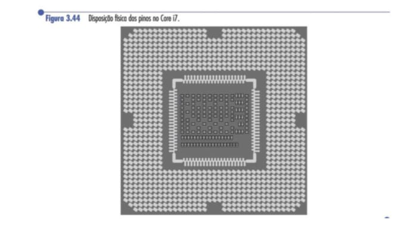

### Insight para o seu repositório estruturas_de_dados
Pode parecer que o calor não afeta o software, mas no diretório estruturas_de_dados, a eficiência do seu código impacta diretamente a temperatura do seu Lenovo IdeaPad Gaming 3.

 - Algoritmos com alta complexidade computacional que mantêm a CPU em 100% de uso por longos períodos disparam o ventilador e podem causar o Thermal Throttling.

 - Quando isso acontece, o hardware reduz o clock, e sua estrutura de dados, que deveria ser rápida, começa a performar de forma lenta devido à limitação térmica do hardware.

O chip é equipado com uma placa de montagem para um dissipador distribuir o calor e um ventilador para resfriá-lo. Para ter uma ideia do tamanho do problema da potência, ligue uma lâmpada incandescente de 150 watts, deixe-a aquecer e depois coloque suas mãos ao seu redor (mas não a toque). Essa quantidade de calor deve
ser dissipada continuamente por um processador Core i7 de última geração. Em consequência, quando o Core i7 não tiver mais utilidade como uma CPU, ele sempre poderá ser usado como um fogareiro em acampamentos.

De acordo com as leis da física, qualquer coisa que emita muito calor deve absorver muita energia. Não é interessante usar muita energia em um computador portátil com carga de bateria limitada porque a bateria se esgota rapidamente. Para resolver essa questão, a Intel oferece um meio de pôr a CPU para dormir quando ela estiver ociosa e de fazê-la cair em sono profundo quando é provável que fique adormecida durante algum tempo. Há cinco estados oferecidos, que vão de totalmente ativa a sono profundo. Nos estados intermediários são habilitadas algumas funcionalidades (tal como escuta de cache e manipulação de interrupção), mas outras funções são desativadas. Quando em estado de sono profundo, os valores de registradores são preservados, mas as caches são esvaziadas e desligadas. Nesse estado, é preciso que haja um sinal de hardware para despertá-la. Ainda não sabemos se um Core i7 pode sonhar quando está em sono profundo.

### Pinagem lógica do Core i7
Os 1.155 pinos do Core i7 são usados para 447 sinais, 286 conexões de energia elétrica (em diversas voltagens diferentes), 360 terras e 62 reservados para uso futuro. Alguns dos sinais lógicos usam dois ou mais pinos (tal como o endereço de memória requisitado), de modo que há somente 131 sinais diferentes. Uma pinagem
lógica um pouco simplificada é dada na Figura 3.45. No lado esquerdo da figura, há cinco grupos principais de sinais de barramento; no lado direito, há diversos sinais variados.

Figura 3.45   Pinagem lógica do Core i7

Esta Figura 3.45 representa a pinagem lógica do Core i7, mostrando como os conceitos de barramentos (Figura 3.35) e interrupções (Figura 3.43) se materializam em um chip de alta performance.

Note a enorme quantidade de pinos dedicados apenas à Energia e ao Terra, refletindo o desafio térmico que discutimos na Figura 3.44.

    Pinagem Lógica do Core i7 (Figura 3.45)
    No seu repositório arquitetura_computadores, este diagrama serve como a interface final entre a CPU e a placa-mãe.

                 ________________________________________
                |                                        |
       <------//| CANAL DDR #1 / #2 (124 + 124 pinos)    |-- (Interface com a RAM)
                |______________________________________ _|
                |                                        |
       <----->//| PCI Express (80 pinos)                 |--- (Placas de Vídeo/NVMe)
                |________________________________________|
                |                                        |
        <-----//| INTERFACE DE MÍDIA / MONITOR          |--- (Vídeo Integrado)
                |_______________________________________|
                |                                       |
        <------ | MONITORAMENTO TÉRMICO (10 pinos)      |--- (Prevenção de Throttling)
                |            CORE i7                    |
        <-------| GERENCIAMENTO DE ENERGIA (7 pinos)    |--- (Estados de Sleep/C-States)
                |                                       |
        <-----//| CONFIGURAÇÃO / DIVERSOS               |--- (Reset, JTAG, BCLK)
                |_______________________________________|
                    |               |               |
                    (286)           (360)           (12)
                    ENERGIA          TERRA           CLOCK

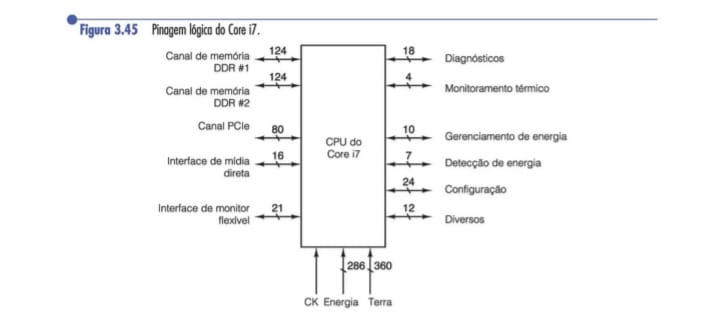

### Insight para o seu repositório estruturas_de_dados
Essa pinagem explica por que, no seu diretório estruturas_de_dados, a escolha de hardware impacta o software:

 - Se você tem dois pentes de RAM, a CPU ativa os 248 pinos dos canais DDR, permitindo que suas buscas em Hash Tables sejam muito mais rápidas devido ao acesso paralelo.

 - A enorme quantidade de pinos de energia e terra garante que, mesmo sob carga intensa de processamento de dados, os sinais lógicos permaneçam "limpos" e sem erros de bit.

Vamos examinar os sinais, começando com os do barramento. Os dois primeiros sinais são usados para a interface com DRAM compatível com DDR3. Esse grupo oferece endereço, dados, controle e clock ao banco de DRAMs. O Core i7 admite dois canais DRAM DDR3 independentes, rodando com um clock de barramento de 666 MHz que transfere nas duas bordas, para permitir 1.333 milhões de transações por segundo. A interface DDR3 tem 64 bits de largura, e assim, as duas interfaces DDR3 trabalham em sequência para dar aos programas com muita utilização de memória até 20 gigabytes de dados a cada segundo.

O terceiro grupo do barramento é a interface PCI Express, que é usada para conectar periféricos diretamente à CPU Core i7. A interface PCI Express é uma interface serial de alta velocidade, com cada enlace serial único formando uma “via” de comunicação com os periféricos. O enlace do Core i7 é uma interface x16, significando que pode utilizar 16 vias simultaneamente para uma largura de banda agregada de 16 GB/s. Apesar de ser um canal serial, um rico conjunto de comandos trafega pelos enlaces PCI Express, incluindo comandos de leituras de dispositivo, escrita, interrupção e configuração.

O grupo seguinte é a Direct Media Interface (DMI), que é usada para conectar a CPU do Core i7 ao seu chip-set correspondente. A interface DMI é semelhante à interface PCI Express, embora trabalhe com cerca de metade da velocidade, pois quatro vias podem fornecer apenas taxas de transferência de dados de até 2,5 GB por segundo.

O chipset de uma CPU contém um rico conjunto de suporte para interface de periférico adicional, exigido para sistemas de mais alto nível, com muitos dispositivos de E/S. O chipset do Core i7 é composto dos chips P67 e ICH10. O chip P67 é o canivete suíço dos chips, oferecendo interfaces SATA, USB, Audio, PCIe e memória flash. O chip ICH10 oferece suporte para interface legada, incluindo uma interface PCI e a funcionalidade de controle de interrupção do 8259A. Além disso, o ICH10 contém alguns outros circuitos, como clocks de tempo real, temporizadores de eventos e controladores de acesso direto à memória (DMA). Ter chips como esses simplifica bastante a construção de um PC completo.

O Core i7 pode ser configurado para usar interrupções do mesmo modo que o 8088 (para fins de compatibilidade) ou também pode usar um novo sistema de interrupção que utiliza um dispositivo denominado APIC (Advanced Programmable Interrupt Controller – controlador de interrupção programável avançado).

O Core i7 pode funcionar em quaisquer de várias tensões predefinidas, mas tem de saber qual delas. Os sinais de gerenciamento de energia são usados para seleção automática de tensão da fonte de alimentação, para informar à CPU que a energia está estável e outros assuntos relacionados com a energia. O controle dos vários estados de sono também é feito aqui, já que o sono acontece por razões de gerenciamento de energia.

A despeito de seu sofisticado gerenciamento de energia, o Core i7 pode ficar muito quente. Para proteger o silício, cada processador Core i7 contém vários sensores de calor internos, que detectam quando o chip está para superaquecer. O grupo de monitoramento térmico trata do gerenciamento térmico, permitindo que a CPU indi- que a seu ambiente que está em risco de superaquecimento. Um dos pinos é ativado pela CPU caso a temperatura atinja 130 °C (266°F). Se uma CPU alguma vez atingir essa temperatura, provavelmente estará sonhando com sua aposentadoria e posterior transformação em fogareiro de acampamento.

Até mesmo em temperaturas de fogareiro de acampamento você não precisa se preocupar com a segurança do Core i7. Se os sensores internos detectarem que o processador está para superaquecer, ele iniciará o estrangulamento térmico, uma técnica que logo reduz a geração de calor, usando o processador apenas a cada N-ésimo ciclo de clock. Quanto maior o valor de N, mais o processador é estrangulado, e mais rápido ele se resfriará. É claro que o custo desse estrangulamento é uma diminuição no desempenho do sistema. Antes da invenção do estrangulamento térmico, as CPUs se queimavam se seu sistema de resfriamento falhasse. A evidência desses tempos negros do gerenciamento térmico da CPU pode ser achada procurando-se por “exploding CPU” no YouTube. O vídeo é falso, mas o problema não.

O sinal Clock fornece o clock do sistema ao processador, que internamente é usado para gerar uma variedade de clocks com base em um múltiplo ou fração do clock do sistema. Sim, é possível gerar um múltiplo da frequência de clock, usando um dispositivo muito inteligente, chamado de delay-locked loop, ou DLL.

O grupo Diagnósticos contém sinais para testar e depurar sistemas em conformidade com o padrão de testes IEEE 1149.1 JTAG (Joint Test Action Group). Finalmente, o grupo Diversos é uma miscelânea de outros sinais que possuem diversas finalidades especiais.

### Paralelismo no barramento de memória do DDR3 do Core i7
CPUs modernas como o Core i7 colocam grandes demandas sobre as memórias DRAM. Os processadores individuais podem criar requisições de acesso muito mais depressa do que uma DRAM lenta consegue produzir valores, e esse problema é aumentado quando vários processadores estão fazendo requisições simultâneas. Para
evitar que as CPUs morram por falta de dados, é essencial conseguir o máximo de vazão possível da memória. Por esse motivo, o barramento de memória DDR3 do Core i7 pode ser operado de uma forma paralela, com até quatro transações de memória simultâneas ocorrendo ao mesmo tempo. Vimos o conceito de paralelismo (ou pipelining) no Capítulo 2, no contexto de uma CPU em paralelo (ver Figura 2.4), mas as memórias também podem trabalhar
com paralelismo.
    Para permitir o paralelismo, as requisições à memória do Core i7 têm três etapas:

    1. A fase ACTIVATE da memória, que “abre” uma linha de memória DRAM, aprontando-a para acessos
    subsequentes à memória.

    2. A fase READ ou WRITE da memória, na qual vários acessos podem ser feitos a palavras individuais
    dentro da linha DRAM aberta ou a várias palavras sequenciais dentro da linha de DRAM atual, usando
    um modo de rajada.
    
    3. A fase PRECHARGE, que “fecha” a linha de memória DRAM atual e prepara a memória DRAM para o
    próximo comando ACTIVATE.

O segredo do barramento de memória com paralelismo do Core i7 é que as DRAMs DDR3 são organizadas com vários bancos dentro do chip de DRAM. Um banco é um bloco de memória DRAM, que pode ser acessado em paralelo com outros bancos de memória DRAM, mesmo que estejam contidos no mesmo chip. Um chip DRAM DDR3 típico terá até 8 bancos de DRAM. Porém, a especificação de interface DDR3 permite apenas até quatro acessos simultâneos sobre um único canal DDR3. O diagrama de temporização da Figura 3.46 ilustra o Core i7 fazendo 4 acessos à memória para três bancos de DRAM distintos. Os acessos são totalmente sobrepostos, de modo que as leituras de DRAM ocorrem em paralelo dentro do chip de DRAM. Com setas no diagrama de temporização, a figura mostra quais comandos levam a outras operações.

Figura 3.46   Requisições de memória com paralelismo na interface DDR3 do Core i7.

    Paralelismo e Pipelining (Figura 3.46)

    CICLO:  0   1   2   3   4   5   6   7   8   9  10  11  12  13
            ___ ___ ___ ___ ___ ___ ___ ___ ___ ___ ___ ___ ___ ___
    CK  __| |_| |_| |_| |_| |_| |_| |_| |_| |_| |_| |_| |_| |_| |_
            
            [ACT 0] [RD 0]          [PCH 0] [ACT 0] [RD 0] [PCH 0]
    CMD   --+-------+---------------+-------+-------+-------+-----
             \ [ACT 1] [RD 1]          [PCH 1]
              \---+-------+-------------+-------+
                \ [ACT 2] [RD 2] [PCH 2]
                 \---+-------+-----+
                                    [DADO 0] [DADO 1] [DADO 2] [DADO 0]
    DATA  ---------------------------+--------+--------+--------+------

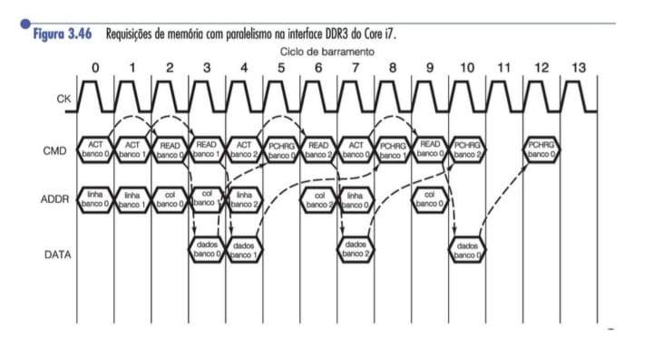

### Insight para o seu repositório estruturas_de_dados
Este nível de paralelismo é o que torna o Cache Prefetching tão eficiente no seu diretório estruturas_de_dados.

 - Quando o hardware percebe que você está percorrendo um array contíguo, ele começa a enviar comandos ACT para os próximos bancos de memória antes mesmo de você solicitar o dado.

 - Isso significa que, quando o seu código em C chega na próxima iteração, o dado já está "descendo" pelo barramento, eliminando quase todos os Wait States da Figura 3.38.

Como vemos na Figura 3.46, a interface de memória DDR3 tem quatro caminhos de sinal principais: clock de barramento (CK), comando de barramento (CMD), endereço (ADDR) e dados (DATA). O sinal CK de clock de barramento orquestra toda a atividade deste. O comando de barramento CMD indica qual atividade é requisitada da DRAM de conexão. O comando ACTIVATE especifica o endereço de linha de DRAM a ser aberta por meio do sinal ADDR. Quando um READ é executado, o endereço de coluna da DRAM é dado por meio de sinais ADDR, e a DRAM produz o valor de leitura após um tempo fixo sobre os sinais DATA. Por fim, o comando PRECHARGE indica ao banco para pré-carregar por meio dos sinais ADDR. Para a finalidade do exemplo, o comando ACTIVATE deverá preceder o primeiro READ para o mesmo banco por dois ciclos de barramento DDR3, e os dados são produzidos um ciclo após o comando READ. Além disso, a operação PRECHARGE deverá ocorrer pelo menos dois ciclos de barramento após a última operação READ para o mesmo banco de DRAM.

O paralelismo nas requisições de memória pode ser visto na sobreposição das requisições de READ para os diferentes bancos de DRAM. Os dois primeiros acessos READ aos bancos 0 e 1 são completamente superpostos, produzindo resultados nos ciclos de barramento 3 e 4, respectivamente. O acesso ao banco 2 é em parte superposto ao primeiro acesso do banco 1, e por fim a segunda leitura do banco 0 é parcialmente superposta ao acesso ao banco 2.

Você pode estar questionando como o Core i7 sabe quando os dados do comando READ retornarão e quando ele pode fazer uma nova requisição à memória. A resposta é que ele sabe quando receber e iniciar requisições porque modela totalmente as atividades internas de cada DRAM DDR3 conectada. Assim, ele antecipará o retorno
dos dados no ciclo correto e saberá evitar o início de uma operação de pré-carga antes que se passem dois ciclos de sua última operação de leitura. O Core i7 pode antecipar todas essas atividades porque a interface de memória DDR3 é uma interface de memória síncrona. Assim, todas as atividades usam um número bem conhecido de ciclos de barramento DDR3. Mesmo com todo esse conhecimento, a criação de uma interface de memória DDR3 com paralelismo completo e com alto desempenho é uma tarefa longe de ser trivial, exigindo muitos temporizadores internos e detectores de conflito para realizar o tratamento eficaz da requisição de DRAM.

## 3.5.2 O sistema-em-um-chip Texas Instruments OMAP4430
Como nosso segundo exemplo de um chip de CPU, examinaremos agora o sistema-em-um-chip Texas Instruments (TI) OMAP4430. O OMAP4430 realiza o conjunto de instruções ARM e é voltado para aplicações móveis e embutidas, como smartphones, tablets e dispositivos da Internet. Com um nome apropriado, um sistema-em-um-chip incorpora uma grande variedade de dispositivos, de modo que, combinado com periféricos físicos (tela sensível ao toque, memória flash etc.), ele executa um dispositivo de computação completo.

O sistema OMAP4430 inclui dois núcleos ARM A9, aceleradores adicionais e uma grande gama de interfaces periféricas. A organização interna do OMAP4430 aparece na Figura 3.47. Os núcleos ARM A9 são micro-arquiteturas superescalares de largura 2. Além disso, existem mais três processadores aceleradores no substrato
OMAP4430: o processador gráfico POWERVR SGX540, um processador de sinal de imagem (ISP) e um processador de vídeo IVA3. O SGX540 oferece uma renderização 3D programável eficaz, semelhante às GPUs encontradas em PCs desktop, apesar de menores e mais lentas. O ISP é um processador programável projetado para manipula-
ção eficiente da imagem, para o tipo de operações que seriam exigidas em uma câmera digital avançada. O IVA3 executa codificação e decodificação eficientes de vídeo, com desempenho suficiente para dar suporte a aplicações 3D, como as encontradas em consoles de jogos portáteis. Há também no sistema OMAP4430 uma gama de interfaces periféricas, incluindo uma tela sensível ao toque e controladores de teclado, DRAM e interfaces flash, USB e HDMI. A Texas Instruments detalhou um roteiro para a série OMAP de CPUs. Projetos futuros terão mais de tudo – mais núcleos ARM, mais GPUs e mais periféricos diversos.

Figura 3.47   Organização interna do sistema-em-um-chip OMAP4430.

    ___________________________________________________________________________
    |                                OMAP4430 SoC                               |
    |___________________________________________________________________________|
    |  [ MPU ARMv7 ]    [ IVA-HD ]    [ SGX540 ]    [ DUCATI ]    [ SEGURANÇA ] |
    |  (Dual Core)      (1080p)       (GPU 2D/3D)   (Cortex-M3)   (AES/SHA/DMA) |
    |______|_______________|______________|_____________|______________|________|
         |               |              |             |              |
    <-----+---------------+-------[ BARRAMENTO L3 ]----+--------------+------>
        |               |       (ALTA LARGURA)       |              |
    ______|______   ______|______          ____________|___________    |
    | CONTROLADOR | | CONTROLADOR |        |    DISPLAY (DSS)       |  |
    | MEMÓRIA EMIF| |  GPMC / RAM |        | (DSI / HDMI / TV OUT)  |  |
    | (LPDDR2 x2) | |   (48KB)    |        |________________________|  |
    |_____________| |_____________|                     |              |
                                                        V              |
    <---------------------------[ BARRAMENTO L4 ]---------------------+------>
        |               |              |             |              |
    [ UART / SPI ]   [ I2C / McBS ]  [ GPIOs ]    [ USB / OTG ]  [ CÂMERA ]

    Figura 3.35 Sistema de computador com vários barramentos

                    Chip de CPU
                .--------------------------.
                | .------------.           |         .---------------.
                | | Registradores| Barramentos  <--->| Controlador   |
                | |   ====     |----.      |         |      de       |
                | |   ====     |    |      |         |  barramento   |
                | '------+-----'    V      |         '-------+-------'
                |        ^        .---.    |                 |   ^
                |        |        |   |    |                 |   | Barramento de
                |Barramento no chip|ULA|    |                |   | memória
                |        |        |   |    |                 V   |
                |        '--------'---'    |         .-------+-------.
                |                          |         |               |
                '--------------------------'         |    Memória    |
                                                     |               |
                                                     '---------------'
                                                            |
                                                            | Barramento de E/S
                    .-------------------------------------+-------------------.
                    |                  |                  |                   |
                .---+---.          .---+---.          .---+---.           .---+---.
                |       |          |       |          |       |           |       |
                | Disco |          | Rede  |          |Impres-|           |       |
                |       |          |       |          | sora  |           |       |
                '-------'          '-------'          '-------'           '-------'

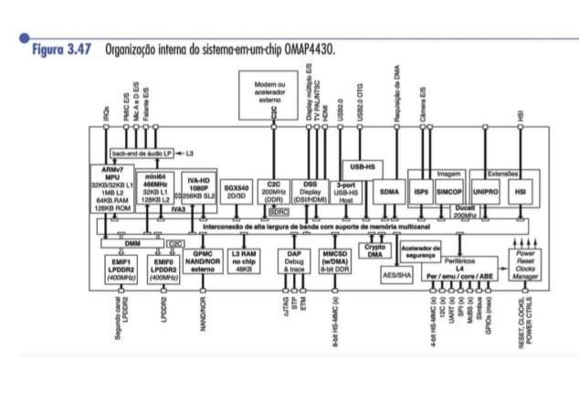

### Insight para o seu diretório estruturas_de_dados
Entender o OMAP4430 é vital para o seu trabalho com Sistemas Embarcados. No seu diretório estruturas_de_dados, quando você lida com buffers de áudio ou vídeo, você está interagindo com o SDMA (System DMA) mostrado no diagrama.

 - O uso correto de estruturas contíguas na memória permite que o SDMA mova dados diretamente entre o Back-end de Áudio e a LPDDR2 sem interromper o processamento da MPU ARMv7.

O sistema OMAP4430 foi lançado no início de 2011 com dois núcleos ARM A9 rodando a 1 GHz usando uma implementação de silício de 45 nanômetros. Um aspecto chave do projeto do OMAP4430 é que ele realiza quantidades significativas de cálculo com muito pouca potência, pois é visado para aplicações móveis, alimenta-
das por uma bateria. Em tais aplicações, quanto mais eficiente for a operação do projeto, mais tempo o usuário poderá ficar sem carregar a bateria.

Os muitos processadores do OMAP4430 são incorporados para dar suporte à missão de operação com baixa potência. O processador gráfico, ISP, e o IVA3 são todos aceleradores programáveis que fornecem capacidades de cálculo eficientes com significativamente menos energia em comparação com as mesmas tarefas sendo executadas apenas nas CPUs ARM A9. Totalmente alimentado, o sistema IMAP4430 consome apenas 600 mW de potência. Em comparação com o Core i7 avançado, o OMAP4430 usa cerca de 1/250 de sua potência. O OMAP4430 também executa um modo de sono muito eficaz; quando todos os componentes estão dormindo, o projeto consome somente 100 µW. Modos de sono eficientes são fundamentais para aplicações móveis com longos períodos de tempo de standby, como um telefone celular. Quanto menos energia usada no modo de sono, mais tempo o tele- fone celular durará no modo standby.

Para reduzir ainda mais as demandas de potência do OMAP4430, o projeto incorpora uma série de facilidades de gerenciamento de energia, incluindo a escalada dinâmica de tensão e o chaveamento de energia. A escalada dinâmica de tensão permite que os componentes sejam executados mais devagar em uma tensão inferior, o que reduz bastante os requisitos de potência. Se você não precisa da velocidade de computação mais ardente da CPU, a tensão do projeto pode ser reduzida para que a CPU trabalhe em uma velocidade mais lenta e muita energia será economizada. O chaveamento de energia é uma técnica de gerenciamento ainda mais agressiva, na qual um componente é desligado por completo quando não estiver em uso, eliminando assim seu consumo de energia. Por exemplo, em uma aplicação de tablet, se o usuário não estiver assistindo a um filme, o processador de vídeo IVA3 é completamente desligado e não consome energia. Por outro lado, quando o usuário está assistindo a um filme, o processador de vídeo IVA3 trabalha ao máximo em suas tarefas de decodificação de vídeo, enquanto as duas CPUs ARM A9 estão dormindo.

Apesar de sua tendência para uma operação com economia de energia, os núcleos ARM A9 utilizam uma microarquitetura bastante capaz. Eles podem decodificar e executar até duas instruções a cada ciclo. Conforme aprenderemos no Capítulo 4, essa taxa de execução representa a vazão máxima da microarquitetura. Mas não
espere que ela execute suas muitas instruções a cada ciclo. Em vez disso, pense nessa taxa como o desempenho máximo garantido pelo fabricante, um nível que o processador nunca excederá, não importa o que aconteça. Em muitos ciclos, menos de duas instruções serão executadas devido aos milhares de “hazards” (acasos) que podem adiar as instruções, levando a uma vazão de execução mais baixa. Para resolver muitos desses limitadores de vazão, o ARM A9 incorpora um poderoso previsor de desvio, escalonamento de instruções fora de ordem e um sistema de memória altamente otimizado.

O sistema de memória do OMAP4430 tem duas caches L1 internas principais para cada processador ARM A9: uma de 32 KB para instruções e uma de 32 KB para dados. Assim como o Core i7, ele também usa uma cache nível 2 (L2) no chip, mas, diferente do Core i7, ela é uma memória de 1 MB relativamente pequena em
tamanho, sendo compartilhada por ambos os núcleos ARM A9. As caches são alimentadas com canais de DRAM duais LPDDR2 de baixa potência. LPDDR2 é derivada do padrão de interface de memória DDR2, porém alterada para exigir menos fios e operar em tensões mais eficientes em termos de potência. Além disso, o controlador de memória incorpora uma série de otimizações de acesso à memória, como a pré-busca de memória ladrilhada e o suporte para rotação na memória.

Vamos discutir caching em detalhes no Capítulo 4, mas é bom dizer algumas palavras sobre ela aqui. Toda memória principal é dividida em linhas (blocos) de cache de 32 bytes. As 1.024 linhas de instrução mais usadas e as 1.024 linhas de dados mais usadas estão na cache de nível 1. Linhas de cache que são muito usadas mas
não cabem na de nível 1 são mantidas na de nível 2. Essa cache contém linhas de dados e linhas de instrução de ambas as CPUs ARM A9 misturadas aleatoriamente. A cache de nível 2 contém as 32.768 linhas acessadas mais recentemente na memória principal.

Quando há uma ausência na cache de nível 1, a CPU envia o identificador da linha que está procurando (endereço de tag) para a cache de nível 2. A resposta (dados de tag) informa à CPU se a linha está ou não na cache de nível 2 e, se estiver, informa também o estado em que esta se encontra. Se a linha estiver na cache, a CPU vai pegá-la. Para obter um valor da cache de nível 2, são necessários 19 ciclos. Esse é um longo tempo para esperar os dados, de modo que programadores inteligentes otimizarão seus programas para usar menos dados, aumentando a probabilidade de achar os dados na cache rápida de nível 1.

Se a linha de cache não estiver na cache de nível 2, ela deve ser buscada da memória principal por meio da interface de memória LPDDR2. A interface LPDDR2 do OMAP4430 é executada no chip de modo que a DRAM LPDDR2 possa ser conectada diretamente ao OMAP4430. Para acessar a memória, a CPU primeiro deve enviar a parte superior do endereço da DRAM ao chip de DRAM, usando as 13 linhas de endereço. Essa operação, chamada ACTIVATE, carrega uma linha inteira de memória da DRAM para um buffer de linha. Depois disso, a CPU pode emitir vários comandos read ou write, enviando o restante do endereço nas mesmas 13 linhas de endereço e enviando (ou recebendo) os dados para a operação nas 32 linhas de dados.

Enquanto espera os resultados, a CPU pode perfeitamente continuar executando outro trabalho. Por exemplo, uma ausência na cache durante a busca antecipada de uma instrução não inibe a execução de uma ou mais instruções já buscadas, cada uma das quais pode se referir a dados que não estão em quaisquer das caches. Assim, várias transações com as mesmas interfaces LPDDR2 podem estar pendentes ao mesmo tempo, até para o mesmo processador. Cabe ao controlador de memória monitorar tudo isso e fazer requisições de memória propriamente ditas na ordem mais eficiente.

Quando os dados por fim chegam da memória, podem vir em 4 bytes por vez. Uma operação de memória pode utilizar uma leitura ou escrita no modo rajada, permitindo que vários endereços contíguos dentro da mesma linha da DRAM sejam lidos ou escritos. Esse modo é particularmente eficaz para ler ou escrever blocos de cache. Apenas por registro, a descrição do OMAP4430 dada aqui, como a do Core i7 antes dele, foi bastante simplificada, mas a essência de sua operação foi descrita.

O OMAP4430 vem em uma matriz em grade de bola (PBGA) de 547 pinos, conforme mostra a Figura 3.48. Uma matriz em grade de bola é semelhante a uma matriz de grade de terra, exceto que as conexões no chip são pequenas bolas de metal, em vez de plataformas quadradas usadas na LGA. Os dois pacotes não são compatíveis,
oferecendo mais evidência de que você não pode encaixar uma ponta quadrada em um furo redondo. O pacote do OMAP4430 consiste em uma matriz retangular de 28 × 26 bolas, com os dois anéis de bolas mais internos faltando, e mais duas meias linhas e colunas assimétricas de bolas faltando, para impedir que o chip seja inserido incorretamente no soquete BGA.

Figura 3.48   A pinagem sistema-em-um-chip OMAP4430.

Pinagem do SoC OMAP4430 (Figura 3.48)
Ao contrário da pinagem lógica (Figura 3.45), esta imagem representa a matriz de esferas (BGA) localizada na parte inferior do chip que é soldada diretamente na placa-mãe do dispositivo móvel.

      0000000000000000          0000000000000000
      0000000000000000          0000000000000000
      0000000000000000          0000000000000000
      0000000000000000  ______  0000000000000000
      0000              |    |              0000
      0000              |    |              0000
      0000      00000000|____|00000000      0000
      0000      0000000000000000000000      0000
      0000      0000              0000      0000
      0000      0000    000000    0000      0000
      0000      0000    000000    0000      0000
      0000      0000    000000    0000      0000
      0000      0000    000000    0000      0000
      0000      0000              0000      0000
      0000      0000000000000000000000      0000
      0000      0000000000000000000000      0000
      0000                                  0000
      0000000000000000          0000000000000000
      0000000000000000          0000000000000000
      0000000000000000          0000000000000000
      0000000000000000          0000000000000000

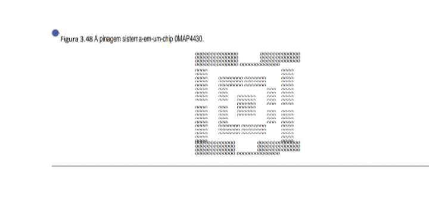

### Insight para o seu repositório estruturas_de_dados
Embora você não "programe" a pinagem, entender a Figura 3.48 é crucial para otimizar o uso do seu Lenovo IdeaPad Gaming 3.

 - Dispositivos com essa pinagem densa são extremamente sensíveis a aquecimento.

 - No seu diretório estruturas_de_dados, algoritmos que gerenciam mal a memória e causam "thrashing" (excesso de trocas entre cache e RAM externa) forçam a passagem de corrente constante por essas esferas de solda.

 - Com o tempo, o estresse térmico pode causar microfissuras nessas conexões físicas, levando a falhas de hardware que nenhum código em C poderá consertar.

É difícil comparar um chip CISC (como o Core i7) e um chip RISC (como o OMAP4430) apenas com base na velocidade do clock. Por exemplo, os dois núcleos ARM A9 no OMAP4430 têm uma velocidade máxima de execução de quatro instruções por ciclo de clock, dando-lhe quase a mesma taxa de execução dos processadores superescalares de largura 4 do Core i7. Entretanto, o Core i7 alcança execução de programa mais rápida, pois tem até seis processadores rodando com uma velocidade de clock 3,5 vezes mais rápida (3,5 GHz) que o OMAP4430. O OMAP4430 pode parecer uma tartaruga correndo ao lado da lebre do Core i7, mas a tartaruga usa muito menos potência, e pode terminar primeiro, ainda mais se a bateria da lebre não for muito grande.

## 3.5.3 O microcontrolador Atmel ATmega168
Tanto o Core i7 quanto a OMAP4430 são exemplos de CPUs de alto desempenho projetadas para construir dispositivos de computação altamente eficazes, com o Core i7 voltado para aplicações de desktop enquanto o OMAP4430 é voltado para aplicações móveis. Quando pensam em computadores, são esses os tipos de sistemas que muitas pessoas têm em mente. Entretanto, existe todo outro universo de computadores que na verdade é muito maior: sistemas embutidos. Nesta seção, vamos examinar brevemente esse outro universo.

Talvez não seja um grande exagero dizer que todo equipamento elétrico que custe mais de 100 dólares tem um computador dentro dele. Hoje, é certo que televisores, telefones celulares, agendas eletrônicas, fornos de micro-ondas, filmadoras, aparelhos de DVD, impressoras a laser, alarmes antifurto, aparelhos de surdez, jogos eletrônicos e outros incontáveis dispositivos são todos controlados por computador. Os computadores que estão dentro desses aparelhos costumam ser otimizados para baixo preço e não para alto desempenho, o que provoca compromissos diferentes dos feitos para CPUs de tecnologia avançada que estudamos até aqui.

Como mencionamos no Capítulo 1, o Atmel ATmega168 provavelmente é o microcontrolador mais popular em uso hoje, em grande parte por causa de seu custo muito baixo (cerca de 1 dólar). Como veremos em breve, ele também é um chip versátil, portanto, fazer interface com ele é algo simples e barato. Agora, vamos examinar esse chip, cuja pinagem física é mostrada na Figura 3.49.

Figura 3.49   Pinagem física do ATmega168.

Esta Figura 3.49 apresenta a pinagem física do ATmega168, um microcontrolador que contrasta radicalmente com o Core i7 e o OMAP4430 que analisamos anteriormente. Enquanto os outros são processadores que dependem de barramentos externos complexos, este chip é um sistema autocontido, projetado para interagir diretamente com o hardware físico sem a necessidade de pinos de endereçamento ou dados externos.

Pinagem do ATmega168 (Figura 3.49)
Organizei o diagrama para o seu arquivo Nivel-Logica-Digital.md, destacando a disposição dos 28 pinos no pacote DIP (Dual In-line Package).

    ATmega168 (DIP-28)
                  .------- \_/ -------.
            PC6  -| 1               28 |-  PC5
            PD0  -| 2               27 |-  PC4
            PD1  -| 3               26 |-  PC3
            PD2  -| 4               25 |-  PC2
            PD3  -| 5               24 |-  PC1
            PD4  -| 6               23 |-  PC0
            VCC  -| 7               22 |-  GND
            GND  -| 8               21 |-  AREF
            PB6  -| 9               20 |-  AVCC
            PB7  -| 10              19 |-  PB5
            PD5  -| 11              18 |-  PB4
            PD6  -| 12              17 |-  PB3
            PD7  -| 13              16 |-  PB2
            PB0  -| 14              15 |-  PB1
                  '-------------------'

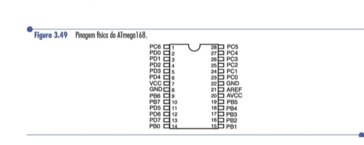

### nsight para o seu repositório estruturas_de_dados
O ATmega168 é o coração de muitas placas Arduino, e programar para ele exige uma mentalidade diferente no seu diretório estruturas_de_dados.

 - Como a SRAM é extremamente limitada (apenas 2KB), você deve evitar o uso de grandes arrays ou alocação dinâmica (malloc).

 - Em vez de barramentos de alta velocidade, você usará os pinos PD0 e PD1 (UART) para se comunicar com o seu Ubuntu 24.04 via terminal.

 - A manipulação direta de registradores de porta (PORTB, PORTD) é a forma mais rápida de interagir com o hardware, ignorando as camadas de abstração comuns em sistemas maiores.

Como podemos ver na figura, o ATmega168 normalmente vem em um pacote padrão de 28 pinos, embo-
ra haja outros pacotes disponíveis. À primeira vista, você talvez tenha notado que a pinagem nesse chip é um
pouco estranha em comparação com os dois projetos anteriores que examinamos. Em particular, esse chip não
tem linhas de endereço e dados. Isso porque não foi projetado para ser conectado à memória, só a dispositivos.
Toda a memória, SRAM e flash, está contida dentro do processador, evitando a necessidade de quaisquer pinos
de endereço e dados, como mostra a Figura 3.50.

Figura 3.50   Arquitetura interna e pinagem lógica do ATmega168.

Esta Figura 3.50 é a peça final do nosso quebra-cabeça de hardware, Luís, revelando o que acontece por dentro do ATmega168 para que ele funcione sem pinos externos de endereço e dados. Diferente do Core i7, aqui a CPU divide espaço no mesmo chip com memórias e uma vasta gama de periféricos de controle.

No seu repositório arquitetura_computadores, este diagrama é o exemplo máximo de uma Arquitetura Harvard, onde as instruções e os dados possuem caminhos separados.

    Arquitetura Interna ATmega168 (Figura 3.50)

    _________________________________________________________
        |               SUPERVISÃO DE ENERGIA / RESET             |
        |_________________________________________________________|
            |                     |                      |
    [ OSCILADORES ]       [ FLASH (Prog) ]        [ SRAM (Dados) ]
    [    CLOCK    ]       [      |       ]        [      |       ]
    |________|____________|______V_______|________|______V_______|
            |                   CPU (AVR Core)                  |
            |___________________________________________________|
            |                     |                      |
    [ EEPROM (Perm)]      [ BARRAMENTO DE DADOS ]       [ USART/SPI/TWI ]
    |________|____________|__________V___________|________|_______|
            |                     |                      |
    [ TIMER/COUNTERS ]    [ CONVERSOR A/D (ADC) ]   [ COMP. ANALÓGICO ]
    |________|____________|__________V___________|________|_______|
            |                     |                      |
        [ PORTA D ]           [ PORTA B ]            [ PORTA C ]
        (PD0 - PD7)           (PB0 - PB7)            (PC0 - PC6)

### Insight para o seu repositório estruturas_de_dados
Aqui no ATmega168, o seu conhecimento de Estruturas de Dados é testado ao limite devido à escassez de recursos:

 - No diretório estruturas_de_dados, você aprenderá que em 2KB de SRAM, uma Lista Encadeada com muitos ponteiros pode causar um Stack Overflow rapidamente.

 - O uso de Bitfields em C é essencial aqui para economizar cada byte de memória interna.

 - Como o acesso à Flash é mais lento que à SRAM, você usará modificadores como PROGMEM para manter tabelas de dados constantes fora da memória de trabalho, otimizando o barramento interno.

Em vez de pinos de endereço e dados, o ATmega168 tem 27 portas de E/S digitais, 8 linhas na porta B e D,
e 7 linhas na porta C. Essas linhas de E/S digitais são projetadas para serem conectadas aos periféricos de E/S, e
cada uma pode ser configurada internamente pelo software de partida para ser uma entrada ou uma saída. Por
exemplo, quando usada em um forno de micro-ondas, uma linha de E/S digital seria uma entrada do sensor de
“porta aberta”. Outra linha de E/S digital seria uma saída usada para ligar e desligar o gerador do micro-ondas. O
software no ATmega168 verificaria se a porta estava fechada antes de ligar o gerador do micro-ondas. Se a porta
de repente for aberta, o software deverá cortar a energia. Na prática, as interconexões de hardware também estão
sempre presentes.

Como opção, seis das entradas da porta C podem ser configuradas para serem E/S analógica. Pinos de E/S
analógica podem ler o nível de tensão de uma entrada ou definir o nível de tensão de uma saída. Estendendo
nosso exemplo de forno de micro-ondas, alguns aparelhos têm um sensor que permite ao usuário aquecer
o alimento até determinada temperatura. O sensor de temperatura seria conectado a uma entrada de porta
C, e o software poderia ler a tensão do sensor e depois convertê-la em uma temperatura usando uma função de
tradução específica do sensor. Os pinos restantes no ATmega168 são a entrada de tensão (vcc), dois pinos de terra
(gnd) e dois pinos para configurar os circuitos de E/S analógica (aref, avcc).

A arquitetura interna do ATmega168, como a do OMAP4430, é um sistema-em-um-chip com uma rica
matriz de dispositivos internos e memória. O ATmega168 vem com até 16 KB de memória flash interna, para
armazenamento de informações não voláteis que mudam com pouca frequência, como instruções de programa.
Ele também inclui até 1 KB de EEPROM, a memória não volátil que pode ser gravada pelo software. A EEPROM
guarda dados de configuração do sistema. De novo, usando nosso exemplo de micro-ondas, a EEPROM armaze-
naria um bit indicando se o micro-ondas mostrará a hora em formato de 12 ou 24 horas. O ATmega168 também
incorpora até 1 KB de SRAM interna, onde o software pode armazenar variáveis temporárias.

O processador interno roda o conjunto de instruções AVR, que é composto de 131 instruções, cada uma
com 16 bits de extensão. O processador tem 8 bits, o que significa que opera sobre valores de dados de 8
bits, e internamente seus registradores possuem um tamanho de 8 bits. O conjunto de instruções incorpora
instruções especiais que permitem ao processador de 8 bits operar de modo eficiente sobre tipos de dados
maiores. Por exemplo, para realizar adições de 16 bits ou maiores, o processador fornece a instrução “add-
-with-carry” (somar com vai-um), que soma dois valores e mais o “vai-um” da adição anterior. Os outros
componentes internos englobam o clock em tempo real e uma variedade de lógica de interface, incluindo
suporte para enlaces seriais, enlaces PWM (pulse-width-modulated – modulado por largura de pulso), enlaces
I2C (barramento Inter-IC) e controladores analógico e digital.

## 3.6 Exemplos de barramentos 
Barramentos são a cola que mantém a integridade dos sistemas de computadores. Nesta seção, examinaremos
minuciosamente alguns barramentos populares: o PCI e o USB (Universal Serial Bus – barramento serial univer-
sal). O PCI é o principal barramento de E/S usado hoje em dia nos PCs. Ele pode ter duas formas, o barramento
PCI mais antigo, e o novo e muito mais rápido barramento PCI Express (PCIe). O Universal Serial Bus é um
barramento de E/S cada vez mais popular para periféricos de baixa velocidade, como mouses e teclados. Uma
segunda e terceira versões do barramento USB rodam com velocidades muito mais altas. Nas próximas seções,
veremos esses barramentos um por vez, para ver como eles funcionam.

## 3.6.1 O barramento PCI
No IBM PC original, a maioria das aplicações era baseada em texto. De modo gradual, com a introdução do
Windows, pouco a pouco começaram a ser usadas as interfaces gráficas de usuário. Nenhuma dessas aplicações
exigia demais do barramento ISA. Contudo, com o passar do tempo, quando muitas aplicações, em especial jogos
em multimídia, começaram a usar computadores para exibir vídeo em tela cheia e com movimento completo, a
situação mudou radicalmente.

Vamos fazer um cálculo simples. Considere um vídeo colorido de 1.024 × 768 com 3 bytes/pixel. Um
quadro contém 2,25 MB de dados. Para um movimento suave, são necessárias ao menos 30 telas por segundo
para uma taxa de dados de 67,5 MB por segundo. Na verdade, é pior do que isso, pois para apresentar um
vídeo a partir de um disco rígido, CD-ROM ou DVD, os dados devem passar do drive de disco para o barra-
mento e ir até a memória. Então, para a apresentação, os dados devem novamente percorrer o barramento até
o adaptador gráfico. Portanto, precisamos de uma largura de banda de barramento de 135 MB por segundo
só para o vídeo, sem contar a largura de banda de que a CPU e outros dispositivos precisam.

O predecessor do barramento PCI, o ISA, funcionava à taxa máxima de 8,33 MHz e podia transferir 2 bytes
por ciclo para uma largura de banda máxima de 16,7 MB/s. O barramento ISA avançado, denominado EISA, podia
movimentar 4 bytes por ciclo, para alcançar 33,3 MB/s. Claro que nenhuma dessas taxas sequer chegava perto do
que era necessário para apresentação de vídeo completo em tela.

Com o vídeo de HD completo moderno, a situação é ainda pior. Isso exige 1.920 × 1.080 quadros a 30 qua-
dros/segundo para uma taxa de dados de 155 MB/s (ou 310 MB/s se os dados tiverem que atravessar o barramento
duas vezes). É claro que o barramento EISA sequer chegar perto de tratar disso.

Em 1990, a Intel percebeu o que estava para acontecer e desenvolveu um novo barramento com uma
largura de banda muito mais alta do que a do próprio barramento EISA. Foi denominado barramento PCI
(Peripheral Component Interconnect Bus – barramento de interconexão de componente periférico).
Para incentivar sua utilização, a Intel patenteou o PCI e então passou todas as patentes para domínio
público, de modo que qualquer empresa podia construir periféricos para esse barramento sem ter de pagar
royalties. Ela também organizou um consórcio de empresas, o PCI Special Interest Group, para gerenciar
o futuro desse barramento. O resultado foi que o PCI alcançou enorme popularidade. Praticamente todos
os computadores com chips Intel a partir do Pentium têm barramento PCI, e muitos outros computadores
também. Esse barramento é apresentado com todos os detalhes tétricos em Shanley e Anderson (1999) e
Solari e Willse (2004).

O barramento PCI original transferia 32 bits por ciclo e funcionava em 33 MHz (tempo de ciclo de 30
ns) para uma largura de banda total de 133 MB/s. Em 1993, foi lançado o PCI 2.0 e em 1995 saiu o PCI
2.1. O PCI 2.2 tem características para computadores portáteis (principalmente para economizar energia da
bateria). O barramento PCI funciona em até 66 MHz e pode manipular transferências de 64 bits para uma
largura de banda total de 528 MB/s. Com esse tipo de capacidade, o vídeo de tela inteira e movimento total
é viável (admitindo que o disco e o resto do sistema estejam à altura do serviço). Seja como for, o PCI não
será o gargalo.

Mesmo que 528 MB/s pareça muito rápido, ainda há dois problemas. Primeiro, não era muito bom para um
barramento de memória. Segundo, não era compatível com todas aquelas antigas placas ISA que havia por aí. A
solução imaginada pela Intel foi projetar computadores com três ou mais barramentos, conforme mostra a Figura
3.51. Nessa figura, vemos que a CPU pode se comunicar com a memória principal por um barramento de memó-
ria especial, e que um barramento ISA pode ser conectado ao PCI. Esse arranjo atendia a todos os requisitos e,
por consequência, foi amplamente usado na década de 1990.

Dois componentes fundamentais dessa arquitetura são os dois chips de pontes, fabricados pela Intel – daí
seu interesse em todo esse projeto. A ponte PCI conecta a CPU, a memória e o barramento PCI. A ponte ISA
conecta o barramento PCI ao ISA e também suporta um ou dois discos IDE. Quase todos os sistemas PC usando
essa arquitetura vêm com um ou mais encaixes PCI livres para acrescentar novos periféricos de alta velocidade e
um ou mais encaixes ISA para acrescentar periféricos de baixa velocidade.

A grande vantagem do arranjo da Figura 3.51 é que a CPU tem uma largura de banda extremamente alta para
a memória usando um barramento de memória proprietário; o PCI oferece alta largura de banda para periféricos
rápidos, como discos SCSI, adaptadores gráficos etc.; e as antigas placas ISA ainda podem ser usadas. A caixa USB
na figura se refere ao Universal Serial Bus, que será discutido mais adiante neste capítulo.

Seria bom se houvesse apenas um tipo de placa PCI. Porém, não é esse o caso. Há opções para tensão, lar-
gura e temporização. Computadores mais antigos usam em geral 5 volts e os mais novos tendem a usar 3,3 volts,
portanto, o barramento PCI suporta ambos. Os conectores são os mesmos, exceto por dois pedacinhos de plástico
que estão lá para impedir que as pessoas insiram uma placa de 5 volts em um barramento PCI de 3,3 volts ou
vice-versa. Felizmente, existem placas universais que suportam ambas as tensões e podem ser ligadas a quaisquer
dos tipos de encaixe. Além da opção de tensão, as placas também têm versões de 32 bits e 64 bits. As placas de 32
bits têm 120 pinos; as de 64 bits têm os mesmos 120 pinos mais 64 pinos adicionais. Um sistema de barramento
PCI que suporta placas de 64 bits também pode aceitar placas de 32 bits, mas o inverso não é verdade. Por fim,
barramentos e placas PCI podem funcionar em 33 MHz ou 66 MHz. A opção é feita ligando um pino à fonte de
energia ou ao fio terra. Os conectores são idênticos para ambas as velocidades.

igura 3.51  Arquitetura de um dos primeiros sistemas Pentium. Os barramentos representados por linhas mais largas têm mais largura de
banda do que os representados por linhas mais finas, mas a figura não está em escala.

Esta Figura 3.51 é um marco histórico na arquitetura de computadores, ilustrando como a Intel resolveu o problema do gargalo de dados nos anos 90. Ela introduz o conceito de hierarquia de barramentos, onde componentes de velocidades diferentes são isolados por "pontes" para que dispositivos lentos (como um mouse) não atrasem os rápidos (como a CPU).

No seu repositório arquitetura_computadores, este diagrama é a base para entender a evolução das Northbridges e Southbridges modernas.

    Hierarquia do Sistema Pentium (Figura 3.51)

    [ CACHE L2 ] <---(Barramento de Cache)--->  [  CPU  ]
                                                        |
                                                (Barramento Local)
                                                        |
        [ MEMÓRIA RAM ] <---(Barramento de Memória)---> [ PONTE PCI ]
                                                        |
        ______________________________________________ _|________________
        |                BARRAMENTO PCI (Alta Velocidade)                |
        |__________|_______________|_______________|______________|______|
                   |               |               |              |
            [ ADAPTADOR ]      [ SCSI ]        [ USB ]      [ ENCAIXE ]
            GRÁFICO          (Disco)         (Mouse)         PCI
                    |                               |
            [ MONITOR ]                     [ TECLADO ]
                                                    |
                                            [ PONTE ISA ]
                                                    |
         __________________________________________|_____________________
        |                 BARRAMENTO ISA (Baixa Velocidade)              |
        |__________|_______________|_______________|______________|______|
                   |               |               |              |
            [ DISCO ]        [ MODEM ]       [ PLACA ]      [ ENCAIXE ]
                IDE                            DE SOM           ISA

Insight para o seu repositório estruturas_de_dados
Essa estrutura de barramentos explica por que, ao programar em C no seu diretório estruturas_de_dados, a localidade de referência é tão importante.

 - Se o seu algoritmo acessa dados que estão no Cache L2, ele viaja pelo barramento mais curto e rápido.

 - Se ele precisar ler algo de um Disco IDE no barramento ISA, os dados precisam atravessar a Ponte ISA, o Barramento PCI e a Ponte PCI antes de chegar à CPU.

 - No seu Ubuntu 24.04, ferramentas como o nmap ou netcat que você usa dependem dessa eficiência: pacotes de rede chegam pelo barramento PCI e precisam ser movidos rapidamente para a RAM para não serem perdidos enquanto a CPU está ocupada.

No final da década de 1990, quase todos concordavam que o barramento ISA estava morto, portanto, os novos
projetos o excluíram. Contudo, nessa mesma época a resolução de monitores tinha aumentado, em alguns casos
para 1.600 × 1.200, e a demanda por vídeo de tela inteira e movimento total também cresceu, em especial no con-
texto de jogos de alto grau de interação, portanto, a Intel acrescentou mais um outro barramento só para comandar
a placa gráfica. Esse barramento foi denominado barramento AGP (Accelerated Graphics Port bus – barramento
de porta gráfica acelerada). A versão inicial, AGP 1.0, funcionava a 264 MB/s, o que foi definido como 1x. Embora
mais lento que o barramento PCI, foi dedicado a comandar a placa gráfica. Com o passar dos anos, saíram novas
versões, com AGP 3.0 funcionando a 2,1 GB/s (8x). Hoje, até mesmo o barramento AGP 3.0 de alto desempenho
foi substituído por outros ainda mais rápidos, em particular, o PCI Express, que pode bombear incríveis 16 GB/s de
dados por enlaces de barramento serial de alta velocidade. Um sistema Core i7 moderno é ilustrado na Figura 3.52.

Em um sistema moderno baseado no Core i7, diversas interfaces foram integradas diretamente no chip
da CPU. Os dois canais de memória DDR3, rodando a 1.333 transações/s, conectam-se à memória principal e
oferecem uma largura de banda agregada de 10 GB/s por canal. Também integrado à CPU está um canal PCI
Express de 16 vias, que idealmente pode ser configurado em um único barramento PCI Express de 16 bits ou
barramentos PCI Express independentes de 8 bits. As 16 vias juntas oferecem uma largura de banda de 16 GB/s
para dispositivos de E/S.

A CPU se conecta ao chip da ponte principal, o P67, por meio da interface de mídia direta (DMI) serial de 20
Gb/s (2,5 GB/s). O P67 oferece interfaces para uma série de interfaces de E/S modernas de alto desempenho. Oito
vias PCI Express adicionais são fornecidas, mais interfaces de disco SATA. O P67 também executa 14 interfaces
USB 2.0, Ethernet de 10G e uma de áudio.

O chip ICH10 oferece suporte a interface legada para dispositivos antigos. Ele está conectado ao P67 por
meio de uma interface DMI mais lenta. O ICH10 implementa o barramento PCI, Ethernet a 1G, portas USB e
as clássicas interfaces PCI Express e SATA. Sistemas mais novos não podem incorporar o ICH10; isso é exigido
apenas se o sistema precisa dar suporte a interfaces legadas.

Figura 3.52  Estrutura do barramento de um Core i7 moderno.

Estrutura do Core i7 Moderno (Figura 3.52)
Diferente das arquiteturas antigas, note que o controlador de memória e o controlador gráfico agora estão integrados diretamente na CPU para reduzir a latência.

_________________________________________________________________
        |                         INTEL CORE i7                           |
        |   (Controladores de Memória e Gráficos Integrados na CPU)       |
        |_________________________________________________________________|
            |                  |                  |                  |
    [ PCI Express 2.0 ] [ DDR3 1333 MHz ] [ DDR3 1333 MHz ] [ DMI 20 Gb/s ]
        (16 GB/s)          (Canal A)          (Canal B)            |
            |                                                      V
            |                                             [ CHIPSET P67 ]
            |                                             (Northbridge-ish)
            |                                           ___________|___________
            |                                          |                       |
    [ PLACA DE VÍDEO ]                         [ 8x PCIe 2.0 ]         [ 6x SATA ]
                                                [ HD Áudio    ]         [ 14x USB ]
                                                [ LAN Gigabit ]         [ DMI 2 Gb/s ]
                                                                                |
                                                                                V
                                                                        [ ICH10 / R ]
                                                                        (Southbridge)
                                                                    _____________|___________
                                                                |                         |
                                                            [ 6x PCIe x1 ]           [ 6x SATA ]
                                                            [ 12x USB    ]           [ PCI Bus ]
                                                            [ LAN / GLCI ]           [ BIOS SPI ]

### nsight Final para o seu repositório estruturas_de_dados
Esta arquitetura moderna é o que torna os seus projetos no diretório estruturas_de_dados viáveis em larga escala.

 - Quando você implementa uma Hash Table massiva em C, o fato do controlador de memória estar na CPU (e não na placa-mãe) reduz o tempo de busca em nanosegundos cruciais.

 - No seu Ubuntu 24.04, ao usar o nmcli para gerenciar a rede, os dados fluem do controlador LAN Gigabit através do ICH10, sobem pelo link DMI e chegam à CPU sem que você perceba a complexidade física envolvida.

### Operação do barramento PCI
Como todos os barramentos do PC desde o IBM PC original, o barramento PCI é síncrono. Todas as suas
transações ocorrem entre um mestre, cujo nome oficial é iniciador, e um escravo, oficialmente denominado alvo.
Para manter baixo o número de pinos PCI, as linhas de endereços e dados são multiplexadas. Desse modo, nas
placas PCI são necessários somente 64 pinos para endereço mais sinais de dados, ainda que o PCI suporte ende-
reços de 64 bits e dados de 64 bits.

Os pinos de endereço e de dados multiplexados funcionam da seguinte maneira. Em uma operação de leitu-
ra, durante o ciclo 1, o mestre coloca o endereço no barramento. No ciclo 2, ele remove o endereço e o barramento
muda de sentido, de modo que o escravo possa usá-lo. No ciclo 3, o escravo entrega os dados requisitados. Em
operações de escrita, o barramento não tem de virar porque o mestre coloca o endereço e também os dados. Não
obstante, a transação mínima ainda dura três ciclos. Se o escravo não conseguir responder em três ciclos, ele pode
inserir estados de espera. Também são permitidas transferências de blocos sem limite de tamanho, assim como
diversos outros tipos de ciclos de barramento.

### Arbitragem de barramento PCI
Para usar o barramento PCI, um dispositivo deve antes adquiri-lo. A arbitragem de barramento PCI usa um
árbitro de barramento centralizado, como mostra a Figura 3.53. Na maioria dos projetos, o árbitro de barramento
é inserido em um dos chips de ponte. Todo dispositivo PCI tem duas linhas dedicadas que vão dele até o árbitro.
Uma linha, req#, é usada para requisitar o barramento. A outra linha, gnt#, é usada para receber concessões de
barramento. Nota: req# é a forma do PCI indicar REQ.

**Figura 3.53  O barramento PCI usa um árbitro de barramento centralizado.**

________________________________________________
         |               ÁRBITRO DE BARRAMENTO            |
         |________________________________________________|
           ^    |            ^    |            ^    |
      REQ# |    | GNT#  REQ# |    | GNT#  REQ# |    | GNT#
           |    V            |    V            |    V
     .-----------.      .-----------.      .-----------.
     | DISPOSITIVO |    | DISPOSITIVO |    | DISPOSITIVO |
     |    PCI 1    |    |    PCI 2    |    |    PCI n    |
     '-----------'      '-----------'      '-----------'
           |                  |                  |
    =======+==================+==================+=======
                    BARRAMENTO DE DADOS PCI

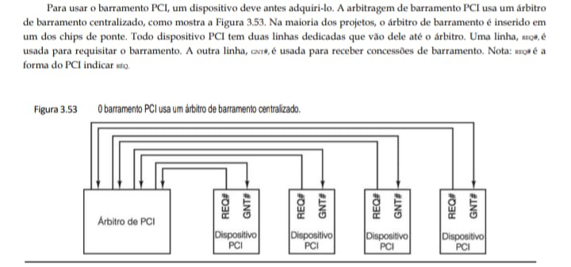

Para requisitar o barramento, um dispositivo PCI (incluindo a CPU) ativa req# e espera até ver sua linha
gnt# ativada pelo árbitro. Quando esse evento acontece, o dispositivo pode usar o barramento no próximo ciclo.
O algoritmo usado pelo árbitro não é definido pela especificação do PCI. Arbitragem por varredura circular, arbi-
tragem por prioridade e outros esquemas são todos permitidos. Claro que um bom árbitro será justo, de modo a
não deixar alguns dispositivos esperando para sempre.

Uma concessão de barramento serve para uma transação apenas, embora em teoria o comprimento dessa
transação não tenha limite. Se um dispositivo quiser executar uma segunda transação e nenhum outro dispo-
sitivo estiver requisitando o barramento, ele pode entrar de novo, apesar de ser preciso inserir um ciclo ocioso
entre transações. Contudo, em circunstâncias especiais, na ausência de disputa pelo barramento, um dispositivo
pode fazer uma transação atrás da outra sem ter de inserir um ciclo ocioso. Se um mestre de barramento estiver
realizando uma transferência muito longa e algum outro dispositivo requisitar o barramento, o árbitro pode
negar a linha gnt#. O mestre de barramento em questão deve monitorar a linha gnt#; portanto, quando perce-
ber a negação, deve liberar o barramento no próximo ciclo. Esse esquema permite transferências muito longas
(que são eficientes) quando há só um mestre de barramento candidato, mas ainda assim dá resposta rápida a
dispositivos concorrentes.

### Sinais de barramento PCI
O barramento PCI tem vários sinais obrigatórios, mostrados na Figura 3.54(a), e vários sinais opcionais,
mostrados na Figura 3.54(b). O restante dos 120 ou 184 pinos são usados para energia, aterramento e diversas
funções relacionadas, e não aparecem nessa lista. As colunas Mestre (iniciador) e Escravo (alvo) informam quem
ativa o sinal em uma transação normal. Se o sinal for ativado por um dispositivo diferente (por exemplo, clk),
ambas as colunas são deixadas em branco.

A análise detalhada do barramento PCI, a Figura 3.54 cataloga a "linguagem" elétrica utilizada por esse padrão, dividindo os sinais entre obrigatórios (essenciais para qualquer comunicação) e opcionais (usados para alta performance ou multiprocessamento).
No seu repositório arquitetura_computadores, esta tabela funciona como o dicionário de pinagem que permite a implementação física da arbitragem vista na Figura 3.53.

Figura 3.54 (a) - Sinais Obrigatórios do Barramento PCI
    Estes são os pinos essenciais que todo dispositivo PCI deve implementar para garantir a comunicação básica e a integridade dos dados.

    Sinal      | Linhas | M/E* | Descrição Técnica
    -----------|--------|------|-----------------------------------------------
    CLK        |   1    |  -   | Clock (33 MHz ou 66 MHz) para sincronismo.
    AD         |   32   |  X   | Endereço/Dados multiplexados (REM/RDM).
    PAR        |   1    |  X   | Bit de paridade para detecção de erros em AD.
    C/BE#      |   4    |  X   | Comando de barramento / Habilitação de bytes.
    FRAME#     |   1    |  X   | Indica que AD e C/BE estão ativos (Início).
    IRDY#      |   1    |  X   | Mestre pronto para trocar dados (Handshake).
    IDSEL      |   1    |  -   | Seleciona espaço de configuração (Plug & Play).
    DEVSEL#    |   1    |  E   | Escravo reconheceu o endereço e está ativo.
    TRDY#      |   1    |  E   | Escravo pronto para trocar dados (Handshake).
    STOP#      |   1    |  E   | Escravo solicita interrupção imediata.
    PERR#      |   1    |  -   | Erro de paridade de dados detectado.
    SERR#      |   1    |  -   | Erro de sistema ou paridade de endereço.
    REQ#       |   1    |  -   | Requisição de posse do barramento (Arbitragem).
    GNT#       |   1    |  -   | Concessão de posse do barramento (Arbitragem).
    RST#       |   1    |  -   | Reset do sistema e dos dispositivos.
    
    *M/E: Mestre/Escravo | X: Sinal multiplexado
    _______________________________________________________________________________

Figura 3.54 (b) - Sinais Opcionais do Barramento PCI
    Estes sinais são utilizados para extensões de performance (64 bits), multiprocessamento e testes de hardware.

    Sinal      | Linhas | M/E* | Descrição Técnica
    -----------|--------|------|-----------------------------------------------
    REQ64#     |   1    |  X   | Requisição para transação de 64 bits.
    ACK64#     |   1    |  X   | Confirmação de transação de 64 bits.
    AD         |   32   |  X   | 32 bits adicionais para endereços/dados.
    PAR64      |   1    |  X   | Paridade para os 32 bits extras.
    C/BE#      |   4    |  X   | 4 bits extras para habilitar os bytes adicionais.
    LOCK       |   1    |  X   | Trava o barramento para operações atômicas.
    SBO#       |   1    |  -   | Presença de dados em cache remota (Snooping).
    SDONE      |   1    |  -   | Escuta de cache realizada (Snoop Done).
    INTx       |   4    |  -   | Linhas de requisição de interrupção (A, B, C, D).
    JTAG       |   5    |  -   | Sinais de teste e diagnóstico IEEE 1149.1.
    M66EN      |   1    |  -   | Seletor de velocidade (66 MHz vs 33 MHz).
    
    *M/E: Mestre/Escravo | X: Sinal multiplexado

Durante o primeiro ciclo de clock de uma transação (indicado por FRAME#),          	Nos ciclos subsequentes, as mesmas linhas AD transportam os dados (RDM), as linhas AD transportam o endereço (REM).                                             otimizando a pinagem do chip.

Controle (C/BE#): Define se a operação é de leitura ou escrita de memória/E/S.	    Paridade (PAR/PAR64): Garante que os dados salvos ou lidos não foram        corrompidos no trajeto físico.

### Insight para o seu repositório estruturas_de_dados
O entendimento desses sinais é o que separa um programador de alto nível de um especialista em sistemas no seu diretório estruturas_de_dados:

 - No seu Ubuntu 24.04, quando você vê um erro de "Bus Error" ou "I/O Error", muitas vezes o que ocorreu foi uma falha nos sinais PERR# ou SERR# captada pelo kernel.

 - Ao programar em C para dispositivos PCI, você lida com o sinal IDSEL, que permite ao seu software configurar o dispositivo sem precisar saber o endereço físico de memória previamente.

 - O sinal LOCK# (opcional) é fundamental se você estiver implementando estruturas de dados concorrentes em multiprocessadores, pois ele garante que uma sequência de leitura-modificação-escrita não seja interrompida por outro núcleo.

Agora, vamos examinar brevemente cada um dos sinais do barramento PCI. Começaremos com os obrigató-
rios (32 bits) e em seguida passaremos para os opcionais (64 bits). O sinal clk comanda o barramento. A maioria
dos outros sinais é síncrona com ele. Ao contrário do ISA, uma transação de barramento PCI começa na borda
descendente do clk, que está no meio do ciclo, em vez de estar no início.

Os 32 sinais ad são para endereços e dados (para transações de 32 bits). Em geral, durante o ciclo 1 o ende-
reço é ativado e durante o ciclo 3 os dados são ativados. O sinal PAR é um bit de paridade para ad. O sinal c/be#
é usado para duas coisas diferentes. No ciclo 1, ele contém o comando de barramento (leia 1 palavra, leia bloco
etc.). No ciclo 2, contém um mapa de bits de 4 bits que informa quais bytes da palavra de 32 bits são válidos.
Usando c/be# é possível ler ou escrever 1, 2 ou 3 bytes quaisquer, bem como uma palavra inteira.

O sinal frame# é ativado pelo mestre para iniciar uma transação de barramento. Informa ao escravo que os
comandos de endereço e barramento agora são válidos. Em uma leitura, usualmente o irdy# é ativado ao mesmo tempo em que o frame#. Ele informa que o mestre está pronto para aceitar dados que estão chegando. Em uma
escrita, o irdy# é ativado mais tarde, quando os dados estão no barramento.

O sinal idsel está relacionado ao fato de que todo dispositivo PCI deve ter um espaço de configuração de
256 bytes que outros dispositivos possam ler (ativando idsel). Esse espaço de configuração contém propriedades
do dispositivo. A característica plug-and-play de alguns sistemas operacionais usa o espaço de configuração para
saber quais dispositivos estão no barramento.

Agora, chegamos aos sinais ativados pelo escravo. O primeiro deles, devsel#, anuncia que o escravo detectou
seu endereço nas linhas ad e está preparado para realizar a transação. Se devsel# não for ativado em certo limite
de tempo, o mestre esgota sua temporização e supõe que o dispositivo endereçado está ausente ou avariado.

O segundo sinal de escravo é trdy#, que ele ativa em leituras para anunciar que os dados estão nas linhas ad
e em escritas para anunciar que está preparado para aceitar dados.

Os três sinais seguintes são para notificar erros. O primeiro deles é stop#, que o escravo ativa se algo desas-
troso acontecer e ele quiser abortar a transação corrente. O seguinte, perr#, é usado para notificar um erro de
paridade no ciclo anterior. Para uma leitura, ele é ativado pelo mestre; para uma escrita, pelo escravo. Cabe ao
receptor executar a ação adequada. Por fim, serr# é para reportar erros de endereço e de sistema.

Os sinais req# e gnt# são para fazer arbitragem de barramento. Eles não são assegurados pelo mestre de
transferência de dados em questão, mas por um dispositivo que quer se tornar mestre de barramento. O último
sinal obrigatório é rst#, usado para reiniciar o sistema, seja porque o usuário apertou a tecla RESET seja porque
algum dispositivo do sistema notou um erro fatal. Ativar esse sinal restaura todos os dispositivos e reinicia o
computador.

Agora, chegamos aos sinais opcionais, cuja maioria está relacionada à expansão de 32 bits para 64 bits. Os
sinais req64# e ack64# permitem que o mestre peça permissão para conduzir uma transação de 64 bits e permite
que o escravo aceite, respectivamente. Os sinais ad, par64 e c/be# são apenas extensões dos sinais correspondentes
de 32 bits.

Os três sinais seguintes não estão relacionados aos 32 bits contra 64 bits, mas a sistemas multiprocessadores,
algo que as placas PCI não são obrigadas a suportar. O sinal lock permite que o barramento seja travado para múl-
tiplas transações. Os dois seguintes estão relacionados à escuta do barramento para manter coerência de cache.

Os sinais intx são para requisitar interrupções. Uma placa PCI pode conter até quatro dispositivos lógicos
separados e cada um pode ter sua própria linha e requisição de interrupção. Os sinais jtag são para procedimento
de teste IEEE 1149.1 JTAG. Por fim, o sinal m66en é ligado alto ou é ligado baixo para estabelecer a velocidade de
clock. Não deve mudar durante a operação do sistema.

### Transações de barramento PCI 
Na realidade, o barramento PCI é muito simples (no que diz respeito a barramentos). Para ter uma ideia
melhor dele, considere o diagrama temporal da Figura 3.55, onde podemos ver uma transação de leitura seguida
por um ciclo ocioso, seguida por uma transação de escrita pelo mesmo mestre de barramento.

Quando a borda descendente do clock acontece durante T1, o mestre põe o endereço de memória em ad e o
comando de barramento em c/be#. Então, ativa frame# para iniciar a transação de barramento.

Durante T2, o mestre libera o barramento de endereço para deixar que ele retorne em preparação para o
comando do escravo durante T3. O mestre também muda c/be# para indicar quais bytes na palavra endereçada ele
quer habilitar, isto é, quais quer que sejam lidos.

Em T3, o escravo ativa devsel# de modo que o mestre saiba que ele obteve o endereço e está planejando res-
ponder. Além disso, põe os dados nas linhas ad e ativa trdy# para informar ao mestre que fez isso. Se o escravo
não puder responder com tanta rapidez, ainda assim ele ativaria devsel# para anunciar sua presença, mas manteria
trdy# negado até que pudesse obter os dados que lá estão. Esse procedimento introduziria um ou mais estados
de espera.

**Figura 3.55  Exemplos de transações de barramento PCI de 32 bits. Os três primeiros ciclos são usados para uma operação de leitura, em
seguida um ciclo ocioso e depois três ciclos para uma operação de escrita.**

A Figura 3.55 detalha o funcionamento temporal de um barramento PCI de 32 bits, ilustrando como os sinais elétricos coordenam as transações de leitura e escrita. Este diagrama é fundamental para entender a eficiência do protocolo, que utiliza multiplexação para economizar pinos físicos.

    Temporização PCI (Figura 3.55) Abaixo, represento a sequência de ciclos de T_1 a T_7$, destacando a transição entre as operações:

    CICLO:      |  T1  |  T2  |  T3  |  T4  |  T5  |  T6  |  T7  |
    OPERAÇÃO:   | <---- LEITURA ----> | OCIO | <---- ESCRITA ----> |
               ____    ____    ____    ____    ____    ____    ____
    CLOCK (Φ):|    |__|    |__|    |__|    |__|    |__|    |__|    |__
               ______                 ______  ______          ______
    FRAME#   :       |_______________|      ||      |________|      |
                ______        _______ ______  ______          ______
    AD (Bus) : < END >-------< DADOS >      <  END  >--------< DADOS >
                ______        _______ ______  ______         ______
    C/BE#    : < CMD >-------< HABIL >      < CMD >--------< HABIL >
                       ______                 ______          ______
    IRDY#    :________|      |________ ______|      |________|      |
                              ________                 ______
    TRDY#    :_______________|        |_______________|      |______

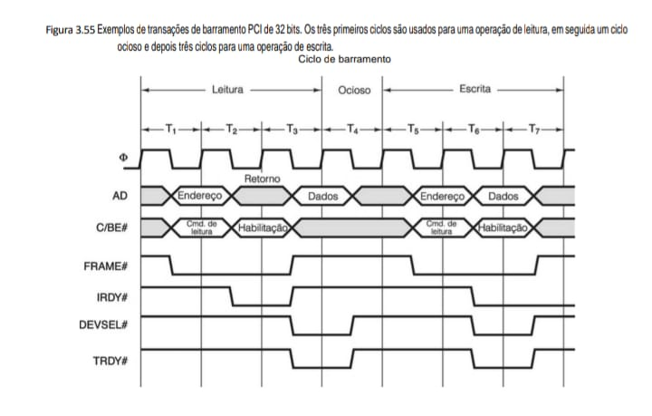

    Análise das Transações (Seu Padrão Técnico)
    Esta tabela explica o que ocorre em cada fase crítica do diagrama para o seu arquivo Nivel-Logica-Digital.md:
    +---------------------------------+-----------------------------------------------------------------------------------------------------+
    | Processamento                   | Armazenamento                                                                                       |
    +---------------------------------+-----------------------------------------------------------------------------------------------------+ 
    | Operação de Leitura (T1 a T3)   | Gerenciamento do Barramento                                                                         |
    | Início (T1)                     | O mestre coloca o endereço em AD e o comando em C/BE#, ativando o FRAME#.                           |
    | Ciclo de Retorno (T2)           | Necessário na leitura para que o mestre pare de dirigir as linhas AD e o escravo assuma o controle. |
    | Transferência (T3)              | Os dados são lidos quando IRDY# (Mestre pronto) e TRDY# (Escravo pronto) estão ambos ativos.        |
    | Ciclo Ocioso (T4)               | Intervalo de segurança entre transações para evitar conflitos elétricos no barramento.              |
    +---------------------------------+-----------------------------------------------------------------------------------------------------+
    | Operação de Escrita (T5 a T7)   | Gerenciamento do Barramento                                                                         |
    | Início (T5)                     | O mestre coloca o endereço em AD e o comando em C/BE#, ativando o FRAME#.                           |
    | T6                              | O mestre coloca os dados em AD (já no ciclo seguinte ao endereço).                                  |
    | Conclusão (T7)                  | A memória (escravo) aceita os dados e sinaliza através do TRDY#, finalizando a transação.           |
    +---------------------------------+-----------------------------------------------------------------------------------------------------+

Verificação Final de HardwareDestaque Técnico: Note que em $T_6$ na escrita, o mestre mantém o controle das linhas AD que ele já possuía em $T_5$, por isso a escrita é mais "direta" que a leitura no nível elétrico.Contexto Acadêmico: Esta é a aplicação prática da sinalização de "aperto de mão" (handshake) que garante que dados não sejam perdidos se um componente for mais lento que o outro.

### Insight para o seu repositório estruturas_de_dados
O comportamento visto na Figura 3.55 é o motivo pelo qual leituras de memória costumam ser ligeiramente mais lentas que escritas em nível de hardware.No seu diretório estruturas_de_dados, quando você percorre uma lista encadeada (múltiplas leituras dependentes), cada passo exige esse "ciclo de retorno" (T_2) para que a memória responda.Já em uma escrita sequencial em um array, o mestre pode manter o controle das linhas de dados de forma contínua, otimizando o uso do barramento PCI que analisamos nas Figuras 3.51 e 3.52.

Nesse exemplo (e muitas vezes na realidade), o ciclo seguinte é ocioso. Começando em T5, vemos o mesmo
mestre iniciando uma escrita. Ele começa colocando o endereço e o comando no barramento, como sempre. Só
que agora, no segundo ciclo, ele ativa os dados. Uma vez que o mesmo dispositivo está comandando as linhas ad,
não há necessidade de um ciclo de retorno. Em T7, a memória aceita os dados.

## 3.6.2 PCI express
Embora o funcionamento do barramento PCI seja adequado para a maioria das aplicações, a necessidade de
maior largura de banda de E/S está causando uma confusão na antes limpa arquitetura interna do PC. A Figura
3.52 deixa claro que o barramento PCI não é mais o elemento central que mantém unidas as partes do PC. O chip
ponte se apossou de parte desse papel.

A essência do problema é que há cada vez mais dispositivos de E/S muito rápidos para o barramento PCI.
Elevar a frequência de clock do barramento não é uma boa solução porque então os problemas de atraso diferen-
cial no barramento, interferência na fiação e efeitos de capacitância só ficariam piores. Toda vez que um dispo-
sitivo de E/S fica muito rápido para o barramento PCI (como as placas gráficas, disco rígido, redes etc.), a Intel
acrescenta uma porta especial para o chip ponte para permitir que o dispositivo contorne o barramento PCI. Claro
que isso tampouco é uma solução de longo prazo.

Outro problema com o barramento PCI é que as placas são muito grandes. Placas PCI padrão costumam ter
17,5 cm por 10,7 cm e placas inferiores possuem 12,0 cm por 3,6 cm. Nenhuma delas cabe em laptops e, com
certeza, não em dispositivos móveis. Os fabricantes gostariam de produzir dispositivos menores ainda. Além
disso, alguns deles gostariam de repartir o espaço interno do PC, colocando a CPU e a memória dentro de uma
pequena caixa selada e o disco rígido dentro do monitor. Com as placas PCI é impossível fazer isso.

Diversas soluções foram propostas, mas a que tem mais probabilidade de vencer (e em grande parte porque
a Intel está por trás dela) é denominada PCI Express. Ela tem pouco a ver com o barramento PCI e, na verdade, nem é um barramento, mas o pessoal do marketing não quer largar mão do famoso nome PCI. PCs que contêm
essa solução já estão no mercado há algum tempo. Vamos ver como eles funcionam.

### Arquitetura do PCI Express
O coração da solução PCI Express (em geral, abreviado como PCIe) é se livrar do barramento paralelo com
seus muitos mestres e escravos e passar para um projeto baseado em conexões seriais ponto a ponto de alta
velocidade. Essa solução representa uma ruptura radical com a tradição do barramento ISA/EISA/PCI e toma
emprestadas muitas ideias do mundo das redes locais, em especial a Ethernet comutada. A ideia básica se resume
no seguinte: no fundo, um PC é um conjunto de chips de CPU, memória, controladores de E/S que precisa ser
interconectado. O que o PCI Express faz é fornecer um comutador de uso geral para conectar chips usando liga-
ções seriais. Uma configuração típica é ilustrada na Figura 3.56.

**Figura 3.56  Sistema PCI express típico.**

A Figura 3.56 ilustra a evolução definitiva dos barramentos paralelos (como o PCI das figuras anteriores) para uma arquitetura baseada em ligações seriais ponto a ponto de alta velocidade. No seu repositório arquitetura_computadores, este diagrama explica como os computadores modernos gerenciam o tráfego massivo de dados sem os problemas de sincronismo das trilhas paralelas.

Arquitetura PCI Express (Figura 3.56)
Diferente do barramento compartilhado da Figura 3.51, aqui cada dispositivo possui uma "pista" exclusiva ligada a um Comutador (Switch) central:

    [ CACHE L2 ] <========> [  CPU  ] <========> [ CHIP PONTE ] <========> [ MEMÓRIA ]
                                                    ||
                                                    || (Link de Alta Velocidade)
                                                    ||
                                                [ COMUTADOR ]
                                                (Switch PCIe)
                                     __________________|__________________
                                    /        /         |         \        \
                                   /        /          |          \        \
                            [ GRÁFICOS ] [ DISCO ]  [ REDE ]  [ USB 2 ] [ OUTRO ]
                            (PCIe x16)  (PCIe x4)  (PCIe x1)  (PCIe x1)  (PCIe x1)

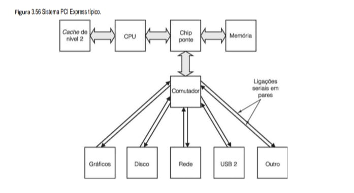

    +-------------------------------------+-----------------------------------------------------------------------------------------------------------------------+
    |Processamento                        | Armazenamento                                                                                                         |
    +-------------------------------------+-----------------------------------------------------------------------------------------------------------------------+
    |Comutador (Switch PCIe)              | Ligações Seriais em Pares                                                                                             |
    |Núcleo de Tráfego                    | Atua como um roteador de pacotes, direcionando dados entre o Chip Ponte e os periféricos finais.                      |
    |Dual-Simplex                         | Cada conexão usa dois pares de fios (um para enviar, outro para receber), permitindo tráfego bidirecional simultâneo. |
    |Escalabilidade                       | Permite que dispositivos usem múltiplas "vias" (x1, x4, x16) para aumentar a largura de banda conforme a necessidade. |
    |Eliminação do Clock Comum            | O clock é embutido no sinal de dados, resolvendo o problema de "skew" (atraso entre trilhas) do PCI antigo.           |
    +-------------------------------------+-----------------------------------------------------------------------------------------------------------------------+
    |Hierarquia Ponto a Ponto             | BARRAMENTO INTERNO                                                                                                    |
    |Diferente da Figura 3.53             | não há disputa por um único barramento; cada dispositivo tem largura de banda dedicada.                               |
    |O ápice da tecnologia de interconexão| como o hardware moderno lida com gigabytes por segundo.                                                               |
    |Latência Reduzida                    | A conexão direta entre CPU e Chip Ponte minimiza o tempo de resposta para acesso à memória e gráficos.                |
    |Compatibilidade de Software          | Apesar da mudança física, o software ainda "vê" os dispositivos como se estivessem em um barramento PCI tradicional   |
    +-------------------------------------+-----------------------------------------------------------------------------------------------------------------------+

### Insight para o seu repositório estruturas_de_dados
Entender a Figura 3.56 é vital para otimizar o desempenho do seu Lenovo IdeaPad Gaming 3 no seu diretório estruturas_de_dados:

 - Quando seu código em C acessa o Disco (NVMe), ele está usando vias PCIe diretas para o processador, o que é ordens de magnitude mais rápido que o antigo barramento ISA (Figura 3.51).

 - No seu Ubuntu 24.04, ao realizar transferências de dados entre a RAM e a Placa Gráfica para processamento paralelo, você está saturando o link PCIe x16 mostrado no diagrama.

 - A estrutura de "pacotes" do PCIe é muito similar às estruturas de dados de rede que você estuda; cada transferência de hardware é, na verdade, um pequeno envelope de dados com cabeçalho e CRC.

Como mostra a figura, a CPU, a memória e a cache estão conectadas ao chip ponte no modo tradicional. A
novidade aqui é um comutador conectado à ponte (talvez parte do próprio chip ponte ou integrado diretamente ao
processador). Cada um dos chips de E/S tem uma conexão ponto a ponto dedicada com o comutador. Cada conexão
consiste em um par de canais unidirecionais, um que vai para o comutador e outro que vem dele. Cada canal é com-
posto de dois fios, um para o sinal e outro para o terra, para dar imunidade contra ruído alto durante a transmissão
de alta velocidade. Essa arquitetura substituirá a atual por um modelo muito mais uniforme, no qual todos os dispo-
sitivos são tratados igualmente.

A arquitetura PCI Express tem três pontos de diferença em relação ao antigo barramento PCI. Já vimos dois
deles: um comutador centralizado contra um barramento multidrop e a utilização de conexões seriais ponto a
ponto estreitas contra um barramento paralelo largo. O terceiro é mais sutil. O modelo conceitual que fundamen-
ta o PCI é o de um mestre de barramento que emite um comando a um escravo para ler uma palavra ou um bloco
de palavras. O modelo do PCI Express é o de um dispositivo que envia um pacote de dados a outro dispositivo.
O conceito de um pacote, que consiste em um cabeçalho e em uma carga útil, é tirado do mundo das redes.
O cabeçalho contém informação de controle, o que elimina a necessidade dos muitos sinais de controle presen-
tes no barramento PCI. A carga útil contém os dados a transferir. Na verdade, um PC com PCI Express é uma
miniatura de rede de comutação de pacotes.

Além dessas três importantes rupturas com o passado, também há diversas pequenas diferenças. A quarta é
que o código de detecção de erro é usado somente nos pacotes, o que dá um grau de confiabilidade mais alto do
que o barramento PCI. A quinta é que a conexão entre um chip e o comutador é mais longa do que era, até 50 cm,
para permitir a repartição do sistema. A sexta é que o sistema pode ser expandido porque um dispositivo pode per-
feitamente ser outro comutador, o que permite uma árvore de comutadores. A sétima é que dispositivos podem ser
acrescentados ou removidos do sistema enquanto ele está em operação. Por fim, uma vez que conectores seriais
são muito menores do que os antigos conectores PCI, podem-se fabricar dispositivos e computadores muito
menores. Em resumo, o PCI Express é uma grande ruptura em relação ao barramento PCI.

### Pilha de protocolos do PCI Express
Condizente com o modelo de uma rede de comutação de pacotes, o sistema PCI Express tem uma pilha de
protocolos em camadas. Um protocolo é um conjunto de regras que governam a conversa entre duas partes. Uma
pilha de protocolos é uma hierarquia de protocolos que tratam de questões diferentes em camadas diferentes. Por
exemplo, considere uma carta comercial. Ela obedece a certas convenções referentes à localização e ao conteúdo
do cabeçalho, ao endereço do destinatário, à data, aos cumprimentos, ao corpo, à assinatura e assim por dian-
te. Podemos dizer que tudo isso junto é um protocolo de carta. Além disso, há outro conjunto de convenções
referentes ao envelope, como tamanho, local e formato do endereço do remetente, local e formato do endereço
do destinatário, local do selo e assim por diante. Essas duas camadas e seus protocolos são independentes. Por
exemplo, é possível dar um formato completamente diferente à carta, mas usar o mesmo envelope, e vice-versa.
Protocolos em camadas são um projeto modular flexível e há décadas são muito usados no mundo dos softwares
de rede. A novidade, no caso, é montá-los no hardware do “barramento”.
    A pilha de protocolos do PCI Express é mostrada na Figura 3.57(a). Ela é discutida a seguir.

**Figura 3.57  (a) Pilha de protocolos do PCI Express. (b) Formato de um pacote.**

Vamos examinar as camadas de baixo para cima. A camada mais baixa é a camada física. Ela trata da movi-
mentação de bits de um remetente para um destinatário por uma conexão ponto a ponto. Cada conexão ponto a
ponto consiste em um ou mais pares de enlaces simplex (isto é, unidirecionais). No caso mais simples, há um par
em cada direção, mas também é permitido ter 2, 4, 8, 16 ou 32 pares. Cada enlace é denominado via. O número
de vias em cada direção deve ser o mesmo. Produtos de primeira geração devem suportar uma taxa de dados de
no mínimo 2,5 Gbps, mas espera-se que logo a velocidade passe para 10 Gbps em cada direção.

Diferente dos barramentos ISA/EISA/PCI, o PCI Express não tem um clock mestre. Os dispositivos têm
liberdade para começar a transmitir tão logo tenham dados a enviar. Essa liberdade deixa o sistema mais rápido,
mas também leva a um problema. Suponha que um bit 1 seja codificado como +3 volts e um bit 0, como 0 volt.
Se os primeiros bytes forem todos 0s, como o destinatário sabe que dados estão sendo transmitidos? Afinal, uma
sequência de 0 bits parece o mesmo que um enlace ocioso. O problema é resolvido usando o que denominamos
codificação 8b/10b. Nesse esquema, 10 bits são usados para codificar 1 byte de dados reais em um símbolo de 10
bits. Entre os 1.024 símbolos de 10 bits possíveis, foram escolhidos como legais os que têm suficientes transições
de clock para manter remetente e destinatário sincronizados nas fronteiras de bits, mesmo sem um clock mestre.
Uma consequência da codificação 8b/10b é que um enlace que tenha uma capacidade bruta de 2,5 Gbps só pode
transmitir 2 Gbps (líquidos) de dados de usuário.

Enquanto a camada física lida com transmissão de bits, a camada de enlace trata de transmissão de pacotes.
Ela pega o cabeçalho e a carga útil passados para ela pela camada de transação e acrescenta a eles um número
de sequência e um código de correção de erro denominado CRC (Cyclic Redundancy Check – verificação por
redundância cíclica). O CRC é gerado pela execução de certo algoritmo no cabeçalho e nos dados da carga
útil. Quando um pacote é recebido, o destinatário efetua alguns cálculos no cabeçalho e nos dados e compara o
resultado com o CRC anexado ao pacote. Se forem compatíveis, ele devolve um curto pacote de reconhecimento
confirmando sua correta chegada. Se não forem, o destinatário solicita uma retransmissão. Desse modo, a integri-
dade dos dados melhora muito em relação ao sistema de barramento PCI, que não tem nenhuma prescrição para
verificação e retransmissão de dados enviados pelo barramento.

Para evitar que um transmissor rápido soterre um receptor lento com pacotes que ele não pode manipu-
lar, é usado um mecanismo de controle de fluxo que funciona da seguinte maneira: o receptor concede ao
transmissor certo número de créditos que correspondem em essência à quantidade de espaço de buffer de que
ele dispõe para armazenar pacotes que chegam. Quando os créditos se esgotam, o transmissor tem de parar de
enviar pacotes até receber mais créditos. Esse esquema, que é muito usado em todas as redes, evita a perda
de dados em consequência da incompatibilidade entre as velocidades do transmissor e do receptor.

A camada de transação trata das ações do barramento. Ler uma palavra da memória requer duas transações:
uma iniciada pela CPU ou canal DMA que está requisitando alguns dados e outra iniciada pelo alvo que está for-
necendo os dados. Mas a camada de transação faz mais do que manipular leituras e escritas puras. Ela adiciona
valor à transmissão de pacotes bruta oferecida pela camada de enlace. Para começar, ela pode dividir cada via em
até oito circuitos virtuais, cada um manipulando uma classe de tráfego diferente. A camada de transação pode
rotular pacotes de acordo com sua classe de tráfego, o que pode incluir atributos como “alta prioridade”, “baixa
prioridade”, “não escute”, “pode ser entregue fora da ordem” e outros mais. O comutador pode usar esses rótulos
para decidir qual pacote manipulará em seguida.
    Cada transação usa um dos quatro espaços de endereços:

    1. Espaço da memória (para leituras e escritas comuns).
    2. Espaço de E/S (para endereçar registradores de dispositivos).
    3. Espaço de configuração (para inicialização do sistema etc.).
    4. Espaço de mensagem (para sinalização, interrupções etc.).

Os espaços de memória e E/S são semelhantes aos dos sistemas existentes. O espaço de configuração pode
ser usado para executar características como plug-and-play. O espaço de mensagem assume o papel de muitos
dos sinais de controle existentes. É necessário ter algo parecido com esse espaço porque nenhuma das linhas de
controle do PCI existe no PCI Express.

A camada de software faz a interface entre sistema PCI Express e sistema operacional. Ela pode emular o
barramento PCI, possibilitando a execução de sistemas operacionais existentes não modificados em sistemas PCI
Express. Claro que uma operação como essa não irá explorar todo poder do PCI Express, mas a compatibilidade
é um mal necessário até que os sistemas operacionais sejam modificados para utilizar totalmente o PCI Express.
A experiência mostra que isso pode levar algum tempo.

O fluxo de informações é ilustrado na Figura 3.57(b). Quando é dado um comando à camada de software,
esta o passa para a camada de transação, que o formula em termos de um cabeçalho e uma carga útil. Então, essas
duas partes são passadas para a camada de enlace, que acrescenta um número de sequência à sua parte anterior e
um CRC à posterior. Em seguida, esse pacote ampliado é passado à camada física, que acrescenta informações de
enquadramento de dados a cada extremidade para formar o pacote físico, que é, por fim, transmitido. Na extre-
midade receptora ocorre o processo inverso – cabeçalho de enlace e as informações que acompanham o bloco de
dados (trailer) são removidos e o resultado é passado para a camada de transação.

O conceito do acréscimo de informações adicionais aos dados à medida que ele desce pela pilha de protoco-
los já é usado há décadas no mundo das redes com grande sucesso. A grande diferença entre uma rede e o PCI Express é que, no mundo das redes, o código nas várias camadas quase sempre é um software que faz parte do
sistema operacional. No PCI Express, ele faz parte do hardware do dispositivo.

O PCI Express é um assunto complicado. Para mais informações, consulte Mayhew e Krishnan, 2003; e
Solari e Congdon, 2005. Ele ainda está evoluindo. Em 2007, o PCIe 2.0 foi lançado. Ele admite 500 MB/s por
via em até 32 vias, para uma largura de banda total de 16 GB/s. Depois veio o PCIe 3.0 em 2011, que mudou a
codificação de 8b/10b para 128b/130b e pode rodar a 8 bilhões de transações por segundo, o dobro do PCIe 2.0.

## 3.6.3 Barramento serial universal (USB)
O barramento PCI e o PCI Express são bons para anexar periféricos de alta velocidade a um computador, mas
são muito caros para dispositivos de E/S de baixa velocidade, como teclados e mouses. Cada dispositivo padrão de
E/S era conectado ao computador de modo especial, com alguns encaixes ISA e PCI livres para adicionar novos
dispositivos. Infelizmente, esse esquema teve problemas desde o início.

Por exemplo, cada novo dispositivo de E/S costuma vir com sua própria placa ISA ou PCI. Muitas vezes, o usuá­
rio é responsável pelo ajuste de comutadores e pontes na placa e por assegurar que tais ajustes não entrem em con-
flito com as outras placas. Então, ele precisa abrir a torre, inserir cuidadosamente a placa, fechar a torre e reiniciar
o computador. Para muitos usuários, esse processo é difícil e sujeito a erros. Além disso, o número de encaixes ISA
e PCI é muito limitado (em geral, dois ou três). Placas plug-and-play eliminam o ajuste das pontes, mas ainda assim
o usuário tem de abrir o computador para inserir a placa e o número de encaixes do barramento continua limitado.

Para tratar desse problema, em 1993, representantes de sete empresas (Compaq, DEC, IBM, Intel, Microsoft,
NEC e Northern Telecom) se reuniram para buscar a melhor maneira de anexar dispositivos de E/S a um computador.
Desde então, centenas de outras empresas se juntaram a elas. O padrão resultante, lançado oficialmente em 1998, é
denominado USB (Universal Serial Bus – barramento serial universal), e é amplamente executado em computadores
pessoais. Uma descrição mais detalhada desse barramento pode ser encontrada em Anderson (1997) e Tan (1997).
    Alguns dos objetivos das empresas que conceberam o USB original e iniciaram o projeto eram os seguintes:

    1. Usuários não terão de ajustar comutadores ou pontes em placas ou dispositivos.
    2. Usuários não terão de abrir a torre para instalar novos dispositivos de E/S.
    3. Haverá apenas um tipo de cabo, que servirá para conectar todos os dispositivos.
    4. A energia para os dispositivos de E/S deve ser fornecida por esse cabo.
    5. Até 127 dispositivos poderão ser ligados a um único computador.
    6. O sistema deve suportar dispositivos de tempo real (por exemplo, som, telefone).
    7. Os dispositivos poderão ser instalados com o computador em funcionamento.
    8. Não será preciso reiniciar o computador após a instalação do dispositivo.
    9. O custo de produção do novo barramento e de seus dispositivos de E/S não deve ser alto.

O USB cumpre todos esses objetivos. É projetado para dispositivos de baixa velocidade, como teclados, mou-
ses, câmeras fotográficas, scanners, telefones digitais e assim por diante. A versão 1.0 tem uma largura de banda
de 1,5 Mbps, que é suficiente para teclados e mouses. A versão 1.1 funciona em 12 Mbps, que é suficiente para
impressoras, câmeras digitais e muitos outros dispositivos. A versão 2.0 tem suporte para dispositivos com até
480 Mbps, que é suficiente para trabalhar com drives de disco externos, webcams de alta definição e interfaces de
rede. O USB versão 3.0, recentemente definido, empurra as velocidades para acima de 5 Gbps; só o tempo dirá
quais aplicações novas e ávidas por largura de banda aproveitarão essa interface com largura de banda ultra-alta.

Um sistema USB consiste em um hub-raiz (root hub) que é ligado ao barramento principal (veja a Figura
3.51). Esse hub tem soquetes para cabos que podem ser conectados a dispositivos de E/S ou a hubs de expansão,
para fornecer mais soquetes, de modo que a topologia de um sistema USB é uma árvore cuja raiz está no hub, dentro do computador. Há diferentes conectores na extremidade dos cabos do hub-raiz e na extremidade do dis-
positivo para evitar que, por acidente, os usuários liguem dois soquetes entre si.

O cabo consiste em quatro fios: dois para dados, um para energia (+5 volts) e um para terra. O sistema de
sinalização transmite um 0 como uma transição de tensão e um 1 como ausência de uma transição da tensão,
portanto, longas carreiras de 0s geram um fluxo regular de pulsos.

Quando um novo dispositivo de E/S é ligado, o hub-raiz detecta esse evento e interrompe o sistema ope-
racional, que então pesquisa para descobrir que dispositivo é e de quanta largura de banda USB ele precisa.
Se o sistema operacional decidir que há suficiente largura de banda para o dispositivo, atribui um endereço
exclusivo para ele (1–127) e descarrega esse endereço e outras informações em registradores de configura-
ção dentro do dispositivo. Desse modo, novos dispositivos podem ser acrescentados com o computador em
funcionamento, sem exigir nenhuma configuração da parte do usuário e sem ter de instalar novas placas ISA
ou PCI. Placas não inicializadas começam com endereço 0, por isso, podem ser endereçadas. Para simplificar
o cabeamento, muitos dispositivos USB contêm conexões internas que aceitam dispositivos USB adicionais.
Por exemplo, um monitor poderia ter dois soquetes de conexão para acomodar os alto-falantes esquerdo e
direito.

Em termos lógicos, o sistema USB pode ser visto como um conjunto de ramificações que saem do hub-raiz
para os dispositivos de E/S. Cada dispositivo pode subdividir sua própria ramificação em até 16 ramos secundá-
rios para diferentes tipos de dados (por exemplo, áudio e vídeo). Dentro de cada ramo secundário, os dados fluem
do hub-raiz até o dispositivo, ou ao contrário. Não há tráfego entre dois dispositivos de E/S.

Exatamente a cada 1,00 ± 0,05 ms, o hub-raiz transmite um novo quadro para manter todos os dispositivos
sincronizados em relação ao tempo. Um quadro é associado a um caminho de bit e consiste em pacotes, o primei-
ro dos quais vem do hub-raiz até o dispositivo. Pacotes subsequentes no quadro também podem ir nessa direção
ou voltar do dispositivo até o hub-raiz. A Figura 3.58 mostra uma sequência de quatro quadros.

Na Figura 3.58, não há nenhum serviço a ser realizado nos quadros 0 e 2, portanto, basta um pacote SOF
(Start of Frame – início do quadro). Ele é sempre transmitido para todos os dispositivos. O quadro 1 é uma son-
dagem (poll), por exemplo, uma requisição para que um scanner devolva os bits que encontrou na imagem que
está digitalizando. O quadro 3 consiste em entregar dados a algum dispositivo, por exemplo, uma impressora.

O USB suporta quatro tipos de quadros: de controle, isócrono, de volume e de interrupção. Quadros de con-
trole são usados para configurar dispositivos, transmitir-lhes comandos e inquirir seu estado. Quadros isócronos
são para dispositivos de tempo real, como microfones, alto-falantes e telefones, que precisam enviar ou aceitar
dados a intervalos de tempo exatos. Eles têm um atraso muito previsível, mas não fazem retransmissões quando ocorrem erros. Quadros de volume são para grandes transferências de e para dispositivos para os quais não há
requisitos de tempo real, como impressoras. Por fim, quadros de interrupção são necessários porque o USB não
aceita interrupções. Por exemplo, em vez de fazer com que o teclado cause uma interrupção sempre que uma tecla
é acionada, o sistema operacional pode fazer uma sondagem a cada 50 ms para coletar qualquer tecla acionada
que esteja pendente.

**A Figura 3.58 detalha o funcionamento temporal do USB (Universal Serial Bus)**, mostrando como o Hub-raiz gerencia a comunicação através de quadros periódicos de 1,00 ms. Diferente do PCI Express, que é ponto a ponto, o USB utiliza uma estrutura de mestre/escravo onde o host controla rigidamente o tráfego para garantir que periféricos como o seu mouse e teclado funcionem sem atrasos.

**Cronometragem de Quadros USB (Figura 3.58)**
O Hub-raiz emite um sinal de início de quadro (SOF - Start of Frame) a cada milissegundo para sincronizar todos os dispositivos no barramento:

    TEMPO (ms): |   0 ms   |   1 ms   |   2 ms   |   3 ms   |
                |----------|----------|----------|----------|
    QUADROS:    | Quadro 0 | Quadro 1 | Quadro 2 | Quadro 3 |
                |    |     |    |     |    |     |    |     |
    SINALIZAÇÃO:|   SOF    |   SOF    |   SOF    |   SOF    |
                | (Ocioso) | (Dados)  | (Ocioso) | (Dados)  |
                             /    \                /    \
                            /      \              /      \
                    [ IN | DATA  | ACK ] [ OUT | DATA | ACK ]

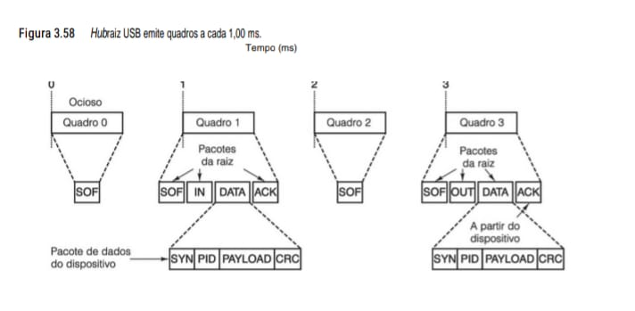

Processamento	                                                                            Armazenamento

Tipos de Pacotes (Raiz)	                                                                    Estrutura do Pacote de Dados
:---	                                                                                    :---
SOF (Start of Frame): O marcador de tempo que inicia cada quadro de 1,00 ms.	            SYN (Sync): Padrão de bits inicial para alinhar o clock do receptor com o do transmissor.

IN / OUT: Comandos do Host solicitando dados do dispositivo (IN) ou enviando dados (OUT).	PID (Packet ID): Identifica o tipo de pacote e inclui bits de verificação para evitar erros.

ACK (Acknowledge): Confirmação de que o pacote foi recebido sem erros de CRC.	            PAYLOAD / CRC: Os dados reais seguidos pelo código de verificação cíclica para integridade.

                                                                                            BARRAMENTO INTERNO

Interconexão OMAP4430	                                                                    Nivel-Logica-Digital.md

No SoC OMAP4430 (Figura 3.47), o USB-HS Host gerencia esses quadros de forma autônoma    	O fechamento da comunicação externa: como o computador interage com para aliviar a CPU.                                                                         o mundo físico.

Polling vs. Interrupção	                                                                    Frequência de Amostragem

O USB simula interrupções através de polling rápido (como visto nos Quadros 1 e 3).         Garante que dispositivos de interface humana (HID) tenham latência previsível.

### Insight para o seu repositório estruturas_de_dados
A lógica de quadros do USB é um exemplo clássico de escalonamento em tempo real que você pode aplicar no diretório estruturas_de_dados:

 - No seu Ubuntu 24.04, quando você conecta um dispositivo USB, o kernel precisa reservar "slots" dentro desses quadros de 1 ms para garantir que o dispositivo tenha largura de banda.

 - O uso de CRC em cada pacote (Figura 3.58) reforça a importância da integridade de dados que você implementou no "IDS Sentinel v5.0": mesmo em hardware, nada é confiável sem verificação.

Um quadro consiste em um ou mais pacotes, alguns possivelmente na mesma direção. Existem quatro tipos
de pacotes: permissão (token), dados, apresentação (handshake) e especial. Pacotes de permissão vêm da raiz
até um dispositivo e servem para controle do sistema. Os pacotes SOF, IN e OUT na Figura 3.58 são pacotes
de permissão. O pacote SOF é o primeiro de cada quadro e marca seu início. Se não houver nenhum trabalho a
realizar, o pacote SOF é o único no quadro. O pacote de permissão IN é uma sondagem, que pede ao dispositivo
que retorne certos dados. Campos no pacote IN informam qual caminho está sendo sondado de modo que o
dispositivo saiba quais dados retornar (se tiver múltiplos fluxos). O pacote de permissão OUT anuncia ao dispo-
sitivo que serão enviados dados a ele. Um quarto tipo de pacote de permissão, SETUP (não mostrado na figura),
é usado para configuração.

Além do pacote de permissão há três outros tipos de pacote: DATA (usado para transmitir até 64 bytes de
informação em qualquer direção), pacotes de apresentação e pacotes especiais. O formato de um pacote de dados
é mostrado na Figura 3.58. Consiste em um campo de sincronização de 8 bits, um tipo de pacote (PID) de 8 bits,
a carga útil (payload) e um CRC de 16 bits para detectar erros. São definidos três tipos de pacotes de apresentação:
ACK (o pacote de dados anterior foi recebido corretamente), NAK (foi detectado um erro CRC) e STALL (favor
esperar – agora estou ocupado).

Agora, vamos examinar a Figura 3.58 mais uma vez. A cada 1,00 ms um quadro deve ser enviado do
hub-raiz, mesmo que não haja trabalho a realizar. Os quadros 0 e 2 consistem em apenas um pacote SOF,
indicando que não há trabalho a executar. O quadro 1 é uma sondagem, portanto, começa com pacotes SOF
e IN do computador ao dispositivo de E/S, seguidos por um pacote DATA do dispositivo para o computador.
O pacote ACK informa ao dispositivo que os dados foram recebidos corretamente. Caso ocorra um erro, um
NAK é devolvido ao dispositivo e o pacote é retransmitido quando for de volume, mas não quando os dados
forem isócronos. A estrutura do quadro 3 é semelhante à do quadro 1, exceto que agora o fluxo de dados é
do computador para o dispositivo.

Após a conclusão do padrão USB em 1998, o pessoal que o projetou não tinha nada para fazer, então, come-
çou a trabalhar em uma nova versão de alta velocidade do USB, denominada USB 2.0. Esse padrão é semelhante
ao antigo USB 1.1 e compatível com ele, exceto pela adição de uma terceira velocidade, 480 Mbps, às duas exis-
tentes. Além disso, há algumas pequenas diferenças, como interface entre hub-raiz e o controlador. O USB 1.1
tinha duas interfaces disponíveis. A primeira, UHCI (Universal Host Controller Interface – interface universal
de controlador de hospedeiro), foi projetada pela Intel e passava grande parte da carga para os projetistas de
software (leia-se: Microsoft). A segunda, OHCI (Open Host Controller Interface – interface aberta de controla-
dor de hospedeiro), foi projetada pela Microsoft e passava grande parte da carga para os projetistas de hardware
(leia-se: Intel). No USB 2.0, todos concordaram com uma nova interface única denominada EHCI (Enhanced
Host Controller Interface – interface melhorada de controlador de hospedeiro).

Agora que o USB funcionava a 480 Mbps, passou a competir com o barramento serial IEEE 1394, mais conhe-
cido como FireWire, que funciona a 400 Mbps ou 800 Mbps. Visto que praticamente todo novo PC baseado no
Intel agora vem com USB 2.0 ou USB 3.0 (ver a seguir), é provável que o 1394 desapareça no devido tempo. O
desaparecimento não é tanto pela obsolescência quanto à guerra por territórios. O USB é um produto da indústria
da computação, enquanto o 1394 vem do setor de eletrônica de consumo. Quando se trata de conectar câmeras a
computadores, cada indústria queria que todos usassem seu cabo. Parece que o pessoal do computador ganhou essa.

Oito anos depois da introdução do USB 2.0, o padrão de interface USB 3.0 foi anunciado. O USB 3.0 admite
incríveis 5 Gbps de largura de banda pelo cabo, embora a modulação do enlace seja adaptativa, e provavelmente
essa velocidade só poderá ser alcançada com cabeamento de qualidade profissional. Os dispositivos USB 3.0 são
estruturalmente idênticos aos dispositivos USB anteriores, e executam totalmente o padrão USB 2.0. Se conecta-
dos a um soquete USB 2.0, eles operarão corretamente.

## 3.7  Interface
Um sistema de computador típico de pequeno a médio porte consiste em um chip de CPU, chipset, chips de
memória e alguns controladores de E/S, todos conectados por um barramento. Às vezes, todos esses dispositivos
estão integrados a um sistema-em-um-chip, como o TI OMAP4430. Já estudamos memórias, CPUs e barramentos
com certo detalhe. Agora, chegou a hora de examinar a última parte do quebra-cabeça, as interfaces de E/S. É por
meio dessas portas de E/S que o computador se comunica com o mundo exterior.

## 3.7.1 Interfaces de E/S
Há inúmeras interfaces de E/S disponíveis no mercado e novas são lançadas o tempo todo. Entre as interfaces
comuns estão UARTs, USARTs, controladores de CRT, controladores de disco e PIOs. Uma UART (Universal
Asynchronous Receiver Transmitter – transmissor receptor assíncrono universal) é uma interface de E/S que
pode ler um byte do barramento de dados e entregá-lo um bit por vez a um terminal por meio de uma linha serial,
ou receber dados de um terminal. Em geral, as UARTs permitem várias velocidades de 50 a 19.200 bps; largura de
caracteres de 5 a 8 bits; 1, 1,5 ou 2 bits de fim; e fornecem paridade par, ímpar ou nenhuma paridade, tudo sob con-
trole de programa. USARTs (Universal Synchronous Asynchronous Receiver Transmitters – transmissor receptor
assíncrono síncrono universal) podem manipular transmissão síncrona usando uma variedade de protocolos, bem
como executando todas as funções da UART. Como as UARTs se tornaram menos importantes com o desapareci-
mento dos modems de telefone, agora vamos estudar a interface paralela como exemplo de uma interface de E/S.

### Interfaces PIO
Uma interface PIO (Parallel Input/Output – entrada e saída paralela) típica é o Intel 8255A, mostrado na
Figura 3.59. Ele tem uma série de linhas de E/S (por exemplo, 24 linhas de E/S no exemplo da figura) que podem
fazer ligação com qualquer interface de dispositivo lógico digital, por exemplo, teclados, comutadores, luzes ou
impressoras. Resumindo, o programa da CPU pode escrever um 0 ou 1, ou ler o estado de entrada de qualquer
linha, o que dá grande flexibilidade. Um pequeno sistema com CPU que use uma interface PIO pode controlar
diversos dispositivos físicos, como um robô, torradeira ou microscópio eletrônico. As interfaces PIO são encon-
tradas frequentemente em sistemas embutidos.

**Figura 3.59  Uma interface PIO de 24 bits.**

Com a Figura 3.59, entramos no detalhamento técnico das interfaces de entrada e saída, explorando como a CPU se comunica com o mundo exterior através de uma Interface de E/S Paralela (PIO) de 24 bits. Este componente é essencial para sistemas embarcados, permitindo que o processador controle periféricos simples, como LEDs, sensores ou teclados, de forma direta.

Estrutura da Interface PIO (Figura 3.59)
Abaixo, represento o fluxo de sinais entre a CPU (lado esquerdo) e os periféricos (lado direito):

    SINAIS DA CPU                INTERFACE PIO               PERIFÉRICOS
     __________________          ______________________          ___________
    |                  |        |                      |   8    |           |
    | CS# (Chip Select)|------->|                      |=======>|  PORTA A  |
    | A0-A1 (Endereço) |---/--->|                      |        |___________|
    |                  |  2     |    REGISTRADORES     |   8    |           |
    | WR# (Escrita)    |------->|   DE CONFIGURAÇÃO    |=======>|  PORTA B  |
    | RD# (Leitura)    |------->|    E DE DADOS        |        |___________|
    | RESET            |------->|                      |   8    |           |
    | D0-D7 (Dados)    |--<=>---|                      |=======>|  PORTA C  |
    |__________________|  8     |______________________|        |___________|

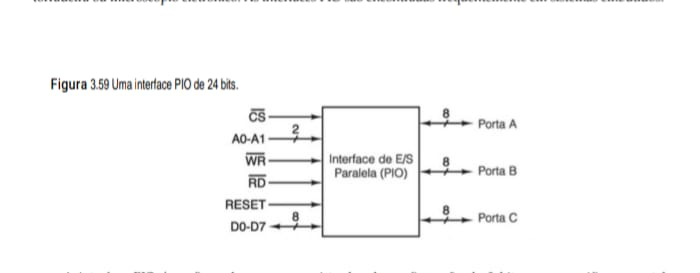

### Insight para o seu repositório estruturas_de_dados
A interface PIO é a personificação física de uma Tabela Hash ou um Vetor no seu diretório estruturas_de_dados:

 - Ao endereçar as portas A, B ou C através de A0-A1, a CPU está basicamente acessando um índice de um array de hardware.

 - No seu projeto de IDS Sentinel v5.0, você poderia usar uma porta PIO para acionar um alarme físico (saída) sempre que um pacote suspeito fosse detectado no seu Ubuntu 24.04.

 - O conceito de "travar" o valor na saída até a próxima escrita é o equivalente em hardware ao armazenamento de uma variável global em C.

A interface PIO é configurada com um registrador de configuração de 3 bits, que especifica se as três portas
independentes de 8 bits devem ser usadas para entrada (0) ou saída (1) do sinal digital. A definição do valor
apropriado no registrador de configuração permitirá qualquer combinação de entrada e saída para as três portas.
Associado com cada porta há um registrador com amostragem de 8 bits. Para estabelecer as linhas em uma porta
de saída, a CPU apenas escreve um número de 8 bits no registrador correspondente, e esse número aparece nas
linhas de saída e fica ali até que o registrador seja reescrito. Para usar uma porta para entrada, a CPU apenas lê o
registrador de 8 bits correspondente.

É possível montar interfaces PIO mais sofisticadas. Por exemplo, um modo de operação popular fornece apre-
sentação com dispositivos externos. Assim, para enviar a um dispositivo que nem sempre está pronto para aceitar dados, a interface PIO pode apresentar dados em uma porta de saída e esperar que o dispositivo devolva um pulso
informando que aceitou os dados e quer mais. A lógica necessária para amostrar tais pulsos e torná-los disponíveis
para a CPU inclui um sinal de pronto e mais uma fila de registradores de 8 bits para cada porta de saída.

Pelo diagrama funcional da interface PIO, podemos ver que, além dos 24 pinos para as três portas, ela tem oito
linhas que se conectam diretamente com o barramento de dados, uma linha de seleção de chip (chip select), linhas de
leitura e escrita, duas linhas de endereço e uma para reiniciar o chip. As duas linhas de endereço selecionam um dos
quatro registradores internos correspondentes às portas A, B, C e ao registrador de configuração de porta. Em geral, as
duas linhas de endereço estão conectadas aos bits de ordem baixa do barramento de endereço. A linha de seleção de
chip permite que a interface PIO de 24 bits seja combinada para formar interfaces PIO maiores, acrescentando outras
linhas de endereço e usando-as para selecionar a interface PIO apropriada, ativando sua linha de seleção de chip.

## 3.7.2 Decodificação de endereço
Até agora fomos propositalmente superficiais sobre como a seleção do chip é ativada na memória e nos chips
de E/S que já vimos. Agora, é hora de examinar com mais cuidado como isso é feito. Vamos considerar um com-
putador embutido simples de 16 bits que consiste em uma CPU, uma EPROM de 2 KB × 8 bytes para o programa,
uma RAM de 2 KB × 8 bytes para os dados e uma interface PIO. Esse pequeno sistema pode ser usado como
um protótipo para o cérebro de um brinquedo barato ou um eletrodoméstico simples. Uma vez em produção, a
EPROM poderia ser substituída por uma ROM.

A interface PIO pode ser selecionada de um entre dois modos: como um verdadeiro dispositivo de E/S
ou como parte da memória. Se optarmos por usá-la como um dispositivo de E/S, então devemos selecioná-la
usando uma linha de barramento explícita que indica que um dispositivo de E/S está sendo referenciado, e não
a memória. Se usarmos a outra abordagem, E/S mapeada para a memória, então temos de lhe designar 4 bytes
do espaço de memória para as três portas e o registrador de controle. A escolha é, de certa forma, arbitrária.
Escolheremos E/S mapeada para a memória porque ela ilustra alguns aspectos interessantes da interface de E/S.

A EPROM necessita de 2 KB de espaço de endereço, a RAM também precisa de 2 K de espaço de endereço e
a PIO precisa de 4 bytes. Como o espaço de endereço de nosso exemplo é 64 K, temos de escolher onde colocar
os três dispositivos. Uma opção possível é mostrada na Figura 3.60. A EPROM ocupa endereços até 2 K, a RAM
ocupa endereços de 32 KB a 34 KB e a PIO ocupa os 4 bytes mais altos do espaço de endereço, 65.532 a 65.535.
Do ponto de vista do programador, não faz diferença quais endereços são usados; contudo, isso não acontece
quando se trata da interface. Se tivéssemos optado por endereçar a PIO via espaço de E/S, ela não precisaria de
nenhum endereço de memória, mas precisaria de quatro espaços de endereço de E/S.

Com as designações de endereço da Figura 3.60, a EPROM deve ser selecionada por quaisquer endereços de
memória de 16 bits da forma 00000xxxxxxxxxxx (binário). Em outras palavras, qualquer endereço de memória
cujos 5 bits de ordem alta são todos 0s cai na parte inferior da memória de 2 KB, portanto, na EPROM. Por isso,
a seleção de chip da EPROM poderia ser ligada a um comparador de 5 bits, com uma de suas entradas perma-
nentemente ligada a 00000.

Uma maneira melhor de conseguir o mesmo efeito é usar uma porta OR de cinco entradas com as cinco
entradas ligadas às linhas de endereço A11 a A15. Se, e somente se, todas a cinco linhas forem 0, a saída será 0,

**Figura 3.60  Localização da EPROM, RAM e PIO em nosso espaço de endereço de 64 KB.**

A Figura 3.60 apresenta o Mapa de Memória de um sistema de 64 KB, demonstrando como diferentes componentes de hardware (EPROM, RAM e a interface PIO da Figura 3.59) são organizados dentro do espaço de endereçamento da CPU. Essa técnica é conhecida como E/S mapeada em memória, onde periféricos são acessados como se fossem endereços comuns de memória.

Mapa de Endereços de 64 KB (Figura 3.60)
Abaixo, represento a distribuição física desses componentes ao longo dos 65.536 endereços possíveis:

    Endereço (Hex) |  Endereço (Dec) |    Componente Alocado    | Tamanho / Uso
    ----------------|-----------------|--------------------------|-------------------
    0000H          |  0K             | [ EPROM ]                | Firmware/BIOS
    ...            |  ...            | (Espaço Vazio)           | -
    8000H          |  32K            | [ RAM ]                  | Dados Variáveis
    ...            |  ...            | (Espaço Vazio)           | -
    FFFCH          |  ~63.9K         | [ PIO ]                  | Interface de E/S
    FFFFH          |  64K            | (Fim do Espaço)          | -

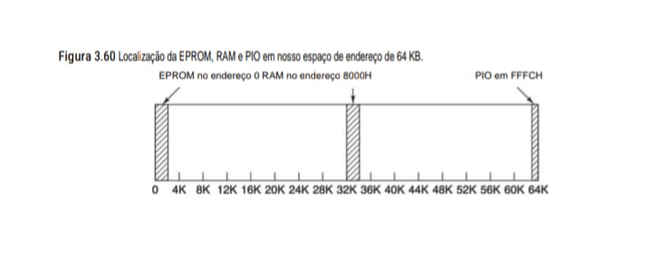

### nsight para o seu repositório estruturas_de_dados
O mapa de memória da Figura 3.60 é a base física para o conceito de Ponteiros que você utiliza no diretório estruturas_de_dados:

 - Em C, um ponteiro nada mais é do que uma variável que armazena um desses números (como 0x8000) para localizar um dado na RAM.

 - Quando você trabalha com Tabelas Hash, você está criando um "mapa lógico" que funciona de forma muito similar a esse mapa de hardware: converter uma chave em um endereço específico de armazenamento.

 - No seu Lenovo IdeaPad Gaming 3, embora o espaço de endereço seja de 64 bits (muito maior que os 16 bits/64 KB desta figura), a lógica de segmentação entre código (EPROM/Flash), dados (RAM) e periféricos (PIO) permanece a mesma.

Processamento	                                                               Armazenamento

Localização: EPROM (0000H)	                                                   Finalidade: Firmware

Ocupa o início do mapa para que a CPU encontre as primeiras instruções de      Armazena o código de inicialização permanente, similar ao suporte do BIOS visto boot assim que é ligada ou resetada.                                           na estrutura do Core i7 (Figura 3.52).

Localização: RAM (8000H)	                                                   Finalidade: Execução 

Posicionada no meio do mapa (32K), oferecendo um bloco contínuo para 	      Espaço onde suas estruturas de dados em C são carregadas e manipuladas durante a armazenamento de dados voláteis.                                              execução no seu Ubuntu 24.04.

Localização: PIO (FFFCH)                                                      Finalidade: Controle de E/S

Alocada no topo do espaço de endereçamento para não interferir nos            Permite que a CPU controle as Portas A, B e C (Figura 3.59) apenas lendo ou blocos principais de memória.                                                        escrevendo neste endereço específico.

o que ativa cs (que é ativado baixo). Esse método de endereçamento é ilustrado na Figura 3.61(a) e é chamado
decodificação de endereço completo.

O mesmo princípio pode ser usado para a RAM. Contudo, a RAM deve responder a endereços binários
da forma 10000xxxxxxxxxxx, portanto, é preciso um inversor adicional, como mostra a figura. A decodifica-
ção de endereços PIO é um pouco mais complicada, porque é selecionada pelos quatro endereços da forma
11111111111111xx. Um possível circuito que assegure cs só quando o endereço correto aparecer no barramento
de endereço é mostrado na figura. Ele usa duas portas nand de oito entradas para alimentar uma porta or.

Contudo, se o computador de fato tiver apenas uma CPU, dois chips de memória e a PIO, podemos usar
um truque para conseguir uma decodificação de endereço muito mais simples. Esse truque se baseia no fato de
que todos os endereços da EPROM, e somente endereços da EPROM, têm um 0 no bit de ordem alta, a15. Por
conseguinte, basta ligar cs a a15 diretamente, como mostra a Figura 3.61(b).

**Figura 3.61  (a) Decodificação total de endereço. (b) Decodificação parcial de endereço.**

A Figura 3.61 demonstra os métodos utilizados para implementar o mapa de memória que analisamos na figura anterior, focando em como os sinais do barramento de endereço (A_0 a A_15) são usados para ativar componentes específicos através do sinal Chip Select (CS).

(a) Decodificação Total (Alta Precisão)
Neste modelo, todos os bits de endereço relevantes são verificados por portas NAND e inversores (representados por o) para garantir que o chip responda a apenas um endereço único.

    BARRAMENTO DE ENDEREÇO (A0 - A15)
    =========================================== A0
    |   |   |   |   |   |   |   |   |   |
    |   |   |   |   |   |   |   |   |   |     (A11-A15)
    |   |   |   |   |  _|_ _|_ _|_ _|_ _|_ 
    |   |   |   |   |  \                 /
    |   |   |   |   |   \      NAND     /---> [ o ]---> [ CS ]
    |   |   |   |   |    \_____________/   Inversor   | EPROM|
    |   |   |   |   |                                  |______|

(b) Decodificação Parcial (Custo Reduzido)Aqui, apenas os bits mais significativos (como $A_{15}$) são usados. Isso simplifica o hardware, mas cria "apelidos" (aliasing), onde o dispositivo aparece em vários lugares do mapa de memória.

    BARRAMENTO DE ENDEREÇO (A0 - A15)
    =========================================== A0
    |                                   |
    |                                   |     (A15)
    |      __________                   |      _|_
    |     |          |                  |     |   |
    |-----|   RAM    |                  |-----|AND|---> [ CS ]
    |     | (2K x 8) |                  |     |___|    | PIO  |
    |     |__________|                  |              |______|
    |          ^                        |
    |__________| [ CS ]                 |

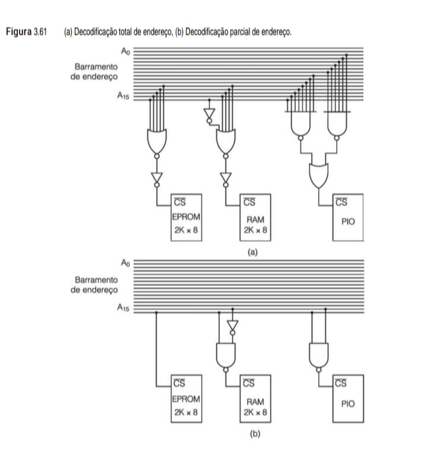

### Insight para estruturas_de_dados
Essa lógica explica como o seu Ubuntu 24.04 isola processos:

 - A Decodificação Total é como um índice único em um Banco de Dados; não há ambiguidade.

 - Se você estivesse programando um driver em C para o seu IDS Sentinel v5.0, entender se a decodificação é total ou parcial ditaria se você precisa se preocupar com endereços espelhados que poderiam corromper dados.

### Insight para o seu repositório estruturas_de_dados
A decodificação de endereço é o equivalente em hardware à resolução de colisões em uma Tabela Hash:

Na Decodificação Total, você tem uma função hash perfeita: cada chave (endereço) leva a exatamente um balde (dispositivo).

Na Decodificação Parcial, você aceita colisões para economizar recursos, tratando diferentes entradas como se fossem o mesmo local de armazenamento.

Ao depurar seus projetos em C no Ubuntu 24.04, erros de "Segmentation Fault" geralmente ocorrem quando o software tenta acessar um endereço que a lógica de decodificação da Figura 3.61 não mapeou para nenhum componente físico.

Nesse ponto, a decisão de colocar a RAM em 8000H pode parecer muito menos arbitrária. A decodifi-
cação da RAM pode ser feita observando que somente endereços válidos da forma 10xxxxxxxxxxxxxx estão
na RAM, portanto, 2 bits de decodificação são suficientes. De modo semelhante, qualquer endereço que
comece com 11 deve ser um endereço PIO. Agora, a lógica completa de decodificação são duas portas nand
e um inversor.

A lógica de decodificação de endereço da Figura 3.61(b) é denominada decodificação parcial de ende-
reço, porque não são usados os endereços completos. Ela tem essa propriedade: uma leitura dos endereços
0001000000000000, 0001100000000000 ou 0010000000000000 dará o mesmo resultado. Na verdade, todo ende-
reço na metade inferior do espaço de endereço selecionará a EPROM. Como os endereços extras não são usados,
não há dano algum, mas se estivermos projetando um computador que poderá ser expandido no futuro (o que é
improvável no caso de um brinquedo), devemos evitar a decodificação parcial porque ela ocupa muito espaço de
endereço.

Outra técnica comum de decodificação de endereço é usar um decodificador como o mostrado na Figura
3.13. Conectando as três entradas às três linhas de endereço de ordem alta, obtemos oito saídas correspondentes
aos endereços nos primeiros 8 K, nos 8 K seguintes e assim por diante. Para um computador com oito RAMs, cada
uma com 8 K × 8, um chip como esse fornece decodificação completa. Para um computador com oito chips de
memória de 2 K × 8, um único decodificador também é suficiente, contanto que cada um dos chips de memória
esteja localizado em porções distintas de 8 KB do espaço de endereço. (Lembre-se de que observamos anterior-
mente que a posição dos chips de memória e E/S dentro do espaço de endereços tem importância.)

## 3.8 Resumo
Computadores são construídos com base em chips de circuito integrado que contêm minúsculos elementos
comutadores denominados portas. As portas mais comuns são and, or, nand, nor e not. Circuitos simples podem
ser montados ao se combinar diretamente portas individuais.

Circuitos mais complexos são multiplexadores, demultiplexadores, codificadores, decodificadores, deslo-
cadores e ULAs. Funções booleanas arbitrárias podem ser programadas usando um FPGA. Se forem necessárias
muitas funções booleanas, os FPGAs costumam ser mais eficientes. As leis da álgebra booleana podem ser usadas
para transformar circuitos de uma forma para outra. Em muitos casos, é possível produzir circuitos mais econô-
micos dessa maneira.

A aritmética de computadores é efetuada por somadores. Um somador completo de um só bit pode ser cons-
truído usando dois meios-somadores. Um somador para uma palavra multibit pode ser construído com a conexão
de vários somadores completos de tal modo que permita o vai-um para seu vizinho da esquerda.

Os componentes de memórias (estáticas) são latches e flip-flops, cada um dos quais pode armazenar um bit de
informação. Esses bits podem ser combinados linearmente formando latches octais e flip-flops, ou por logaritmos
formando memórias completas que usam palavras. Há memórias de vários tipos: RAM, ROM, PROM, EPROM,
EEPROM e flash. RAMs estáticas não precisam ser renovadas; elas mantêm seus valores armazenados enquanto
a energia estiver ligada. RAMs dinâmicas, por outro lado, devem ser renovadas periodicamente para compensar a
fuga de corrente dos pequenos capacitores do chip.

Os componentes de um sistema de computador são conectados por barramentos. Muitos pinos – não todos –
de um chip de CPU típico comandam diretamente uma linha de barramento. Tais linhas podem ser divididas
em linhas de endereço, de dados e de controle. Barramentos síncronos são comandados por um clock mestre.
Barramentos assíncronos usam trocas completas para sincronizar o escravo com o mestre.

O Core i7 é um exemplo de uma CPU moderna. Sistemas modernos que usam esse chip têm um barramento
de memória, um barramento PCIe e um barramento USB. A interconexão PCIe é o modo mais comum de conectar
as partes internas de um computador em altas velocidades. A ARM também é uma CPU moderna de alto nível,
mas é voltada para sistemas embutidos e dispositivos móveis, onde o baixo consumo de energia é importante. O
Atmel ATmega168 é um exemplo de um chip de baixo preço para aparelhos pequenos, baratos, e muitas outras
aplicações sensíveis ao preço.

Comutadores, luzes, impressoras e muitos outros dispositivos de E/S podem fazer interface com computadores
usando interfaces de E/S paralela. Esses chips podem ser configurados como parte do espaço de E/S ou do espaço de
memória, conforme a necessidade. Eles podem ser total ou parcialmente decodificados, dependendo da aplicação.

