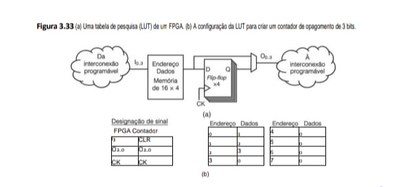

# O nível lógico digital

Na parte inferior da hierarquia da Figura 1.2 encontramos o nível lógico digital, o real hardware do computador. Neste capítulo, examinaremos muitos aspectos da lógica digital, como um fundamento para o estudo de níveis mais altos em capítulos subsequentes. Esse assunto está no limiar entre a ciência da computação e a engenharia elétrica, mas o material é independente, portanto, não há necessidade de experiência prévia de hardware nem de engenharia para entendê-lo. 

Os elementos básicos que fazem parte de todos os computadores digitais são surpreendentemente simples. Iniciaremos nosso estudo examinando esses elementos básicos e também a álgebra especial de dois valores (álgebra booleana) usada para analisá-los. Em seguida, examinaremos alguns circuitos fundamentais que podem ser construídos usando simples combinações de portas, entre eles os circuitos que efetuam a aritmética. O tópico que vem depois desse é o modo como essas portas podem ser combinadas para armazenar informações, isto é, como as memórias são organizadas. Logo após, chegamos à questão das CPUs e, em especial, de como é a interface entre CPUs de um só chip, a memória e os dispositivos periféricos. Mais adiante neste capítulo serão estudados diversos exemplos da indústria de computadores.

## 3.1 Portas e álgebra booleana
Circuitos digitais podem ser construídos com um pequeno número de elementos primitivos combinando-os de inúmeras maneiras. Nas seções seguintes, descreveremos tais elementos, mostraremos como eles podem ser combinados e introduziremos uma poderosa técnica matemática que pode ser usada para analisar seu comportamento.

## 3.1.1 Portas
Um circuito digital é aquele em que estão presentes somente dois valores lógicos. O normal é que um sinal entre 0 e 0,5 volt represente um valor (por exemplo, 0 binário) e um sinal entre 1 e 1,5 volt represente o outro valor (por exemplo, 1 binário). Não são permitidas tensões fora dessas duas faixas. Minúsculos dispositivos eletrônicos, denominados portas (gates), podem calcular várias funções desses sinais de dois valores. Essas portas formam a base do hardware sobre a qual todos os computadores digitais são construídos.

Os detalhes do funcionamento interno das portas estão fora do escopo deste livro, pois pertencem ao nível de dispositivo, que está abaixo do nível 0. Não obstante, agora vamos divagar um pouco e examinar rapidamente a ideia básica, que não é difícil. No fundo, toda a lógica digital moderna se apoia no fato de que um transistor pode funcionar como um comutador binário muito rápido. Na Figura 3.1(a), mostramos um transistor bipolar (representado pelo círculo) inserido em um circuito simples. Esse transistor tem três conexões com o mundo exterior: o coletor, a base e o emissor. Quando a voltagem de entrada, Vin, está abaixo de certo valor crítico, o transistor desliga e age como uma resistência infinita. Isso faz com que a saída do circuito, Vout, assuma um valor próximo a Vcc, uma
voltagem regulada externamente, em geral +1,5 volt para esse tipo de transistor. Quando Vin excede o valor crítico, o transistor liga e age como um fio, fazendo Vout ficar conectado com a terra (por convenção, 0 volt).

O importante é notar que, quando Vin é baixa, Vout é alta, e vice-versa. Assim, esse circuito é um inversor, que converte um 0 lógico em um 1 lógico e um 1 lógico em um 0 lógico. O resistor (linha serrilhada) é necessário para limitar a quantidade de corrente drenada pelo transistor, de modo que ele não queime. O tempo típico exigido para passar de um estado para outro é tipicamente de um nanossegundo ou menos.

Na Figura 3.1(b), dois transistores estão ligados em série. Se ambas, V1 e V2, forem altas, ambos os transistores conduzirão e Vout cairá. Se qualquer das entradas for baixa, o transistor correspondente se desligará e a saída será alta. Em outras palavras, Vout será baixa se, e somente se, ambas, V1 e V2, forem altas.

Na Figura 3.1(c), os dois transistores estão ligados em paralelo em vez de em série. Nessa configuração, se qualquer das entradas for alta, o transistor correspondente ligará e conectará a saída com a terra. Se ambas as entradas forem baixas, a saída permanecerá alta.

Esses três circuitos, ou seus equivalentes, formam as três portas mais simples e são denominadas portas not, nand e nor, respectivamente. Portas not costumam ser denominadas inversoras; usaremos os dois termos indiferentemente. Se agora adotarmos a convenção de que “alta” (Vcc volts) é um 1 lógico e “baixa” (terra) é um 0 lógico, podemos expressar o valor de saída como uma função dos valores de entrada. Os símbolos usados para representar essas portas são mostrados nas figuras 3.2(a)-(c) junto com o comportamento funcional de cada circuito. Nessas figuras, A e B são entradas e X é a saída. Cada linha especifica a saída para uma combinação diferente das entradas.

Figura 3.1   (a) Inversor de transistor. (b) Porta nand. (c) Porta nor.

Sair da microarquitetura e descer para o Nível 0 (Lógica Digital) é como olhar para os átomos do processador. No ATmega168 ou na Mic-3, tudo se resume a esses transistores controlando o fluxo de elétrons.
Aqui está a representação dos circuitos analógicos que dão origem às portas lógicas digitais, usando os componentes que você descreveu (Vcc, Vout, Vin e os terminais do transistor).

    Circuitos de Transistores (Figura 3.1)

        (a) INVERSOR (NOT)           (b) PORTA NAND                (c) PORTA NOR
        
            +Vcc                         +Vcc                          +Vcc
            |                            |                             |
            R                            R                             R
            |                            |             +-------+-------+
            +---- Vout                   +---- Vout    |       |       |
            | Coletor                    |             |    +--+--+ +--+--+
        | /--+                       | /--+             +--- Vout  | |     |
    Vin -|<  Transistor          V1 -|<  (T1)            |    | /---+ | /---+
    Base  | \--+                       | \--+             V1 -|< (T1)  |< (T2)
            | Emissor                    |             V2 -|< (T1)  |< (T2)
            GND                      | /--+             |    | \---+ | \---+
                                V2 -|<  (T2)            |       |       |
                                    | \--+             +-------+-------+
                                            |                             |
                                        GND                           GND

Organização de Hardware: A Física da Lógica (Seu Padrão)

    Processamento (Lógica)      Armazenamento (Estado Físico)

    INVERSOR (NOT)                                                                  Corte / Saturação
    :-------------------------------------------------------------------
    Se Vin é Alto (1), o transistor conduz e joga Vout para o terra (0).            O dado é ""armazenado"" momentaneamente como uma diferença de potencial (tensão).

    PORTA NAND                                                                      Série (AND + NOT)
    O fluxo só vai para o GND se V1 E V2 estiverem ativos. Caso contrário,          É a "porta universal". Com ela, você constrói toda a ULA da Mic-3.
    Vout fica em Vcc.

                                                                                    BARRAMENTO INTERNO (Conexão)
    PORTA NOR                                                                       Paralelo
    Se V1 OU V2 conduzirem, o Vout cai para zero.                                   Muito usada em decodificadores de endereços (REM).
    Transistor (BJT)                                                                Vcc (Alimentação)
    Funciona como uma chave controlada por corrente na Base.                        A fonte de energia que mantém os bits ""vivos"" na SRAM.

## Insight de Engenharia
No seu diretório estruturas_de_dados, quando você define um bool ou um int, o que está acontecendo fisicamente é uma dança entre milhares desses diagramas (a) e (b).

 - Curiosidade: O NAND é preferido na fabricação de chips porque é mais rápido e gasta menos área de silício do que a porta AND pura. Por isso, a maioria dos processadores modernos é, no fundo, uma "montanha de NANDs".

Se o sinal de saída da Figura 3.1(b) for alimentado em um circuito inversor, obtemos outro circuito com o inverso exato da porta nand, a saber, um cuja saída é 1 se, e somente se, ambas as entradas forem 1. Esse circuito é denominado uma porta and; seu símbolo e descrição funcional são dados na Figura 3.2(d). De modo semelhante, a porta nor pode ser conectada a um inversor para produzir um circuito cuja saída é 1 se quaisquer das saídas, ou ambas, for um 1, mas 0 se ambas as entradas forem 0. O símbolo e a descrição funcional desse circuito, denominado uma porta or são dados na Figura 3.2(e). Os pequenos círculos usados como parte dos símbolos para o inversor, porta nand e porta nor, são denominados bolhas de inversão. Também são usadas em outros contextos para indicar um sinal invertido.

As cinco portas da Figura 3.2 são os principais elementos de construção do nível lógico digital. A discussão precedente deve ter deixado claro que as portas nand e nor requerem dois transistores cada, ao passo que as portas and e or requerem três cada. Por essa razão, muitos computadores são baseados em portas nand e nor em vez das portas mais conhecidas, and e or. (Na prática, todas as portas são executadas de modo um pouco diferente, mas as nand e nor ainda são mais simples do que as and e or.) A propósito, vale a pena observar que as portas podem perfeitamente ter mais de duas entradas. Em princípio, uma porta nand, por exemplo, pode ter, arbitrariamente, muitas entradas, mas na prática não é comum encontrar mais de oito.

Embora a questão do modo como são construídas as portas pertença ao nível do dispositivo, gostaríamos de mencionar as principais famílias de tecnologia de fabricação porque elas são citadas com muita frequência. As duas tecnologias principais são bipolar e MOS (Metal Oxide Semiconductor – semicondutor de óxido metálico). Os dois principais tipos bipolares são a TTL (Transistor-Transistor Logic – lógica transistor-transistor), que há muitos anos é o burro de carga da eletrônica digital, e a ECL (Emitter-Coupled Logic – lógica de emissor acoplado), que era usada quando se requeria uma operação de velocidade muito alta. Para circuitos de computador, o que predomina agora é a tecnologia MOS.   

Portas MOS são mais lentas do que as TTL e ECL, mas exigem bem menos energia elétrica e ocupam um espaço muito menor, portanto, um grande número delas pode ser compactado e empacotado. Há muitas variedades de MOS, entre as quais PMOS, NMOS e CMOS. Embora os modos de construção dos transistores MOS e dos transistores bipolares sejam diferentes, sua capacidade de funcionar como comutadores eletrônicos é a mesma. A maioria das CPUs e memórias modernas usa tecnologia CMOS, que funciona a +1,5 volt. E isso é tudo o que diremos sobre o nível de dispositivo. O leitor interessado em continuar o estudo desse nível deve consultar as leituras sugeridas na Sala Virtual.

## 3.1.2 Álgebra booleana
Para descrever os circuitos que podem ser construídos combinando portas, é necessário um novo tipo de álgebra, no qual variáveis e funções podem assumir somente os valores 0 e 1. Essa álgebra é denominada álgebra booleana, nome que se deve a seu descobridor, o matemático inglês George Boole (1815–1864). Em termos estritos, estamos nos referindo a um tipo específico de álgebra booleana, uma álgebra de comutação, mas o termo “álgebra booleana” é tão utilizado no lugar de “álgebra de comutação” que não faremos a distinção.

A Figura 3.3(a) mostra a tabela verdade para uma função booleana de três variáveis: M = f(A, B, C). Essa função é a de lógica majoritária, isto é, ela é 0 se a maioria de suas entradas for 0, e 1 se a maioria de suas entradas for 1. Embora qualquer função booleana possa ser completamente especificada dada sua tabela verdade, à medida que aumenta o número de variáveis, essa notação fica cada vez mais trabalhosa. Portanto, costuma-se usar outra notação no lugar dela.

Figura 3.2   Símbolos e comportamento funcional das cinco portas básicas.
Essa é a base de tudo. Se os transistores da Figura 3.1 são os "átomos", essas portas da Figura 3.2 são as "moléculas" que formam a ULA e os Registradores que documentamos na Mic-3 e no ATmega168.
Aqui está a representação dos símbolos lógicos e suas respectivas Tabelas Verdade em formato ASCII para o seu arquivo Nivel-Logica-Digital.md.

Organização de Hardware: Comportamento das Portas (Seu Padrão)
Esta tabela resume como essas funções básicas operam dentro do seu barramento de dados:

Processamento (Lógica)                                            Armazenamento (Significado)

NOT (Inversor)                                                    Troca de Estado: Transforma um bit 0 em 1 e vice-versa. Essencial para lógica de complemento.
NAND / AND                                                        Lógica de Conjunção: O AND verifica se todos os sinais estão presentes. O NAND é o oposto.
NOR / OR                                                          Lógica de Disjunção: O OR verifica se pelo menos um sinal está presente.
          
                                                                  BARRAMENTO INTERNO (Fluxo)
Seletor (Decodificador)                                           RI (Instrução)
Portas AND/NOR são usadas para decifrar qual instrução o          Cada instrução no seu registrador (RI) ativa um conjunto específico dessas portas.
processador deve executar

ULA (Unidade Lógica)                                              Clock (Sincronismo)
A ULA combina essas portas para somar números (usando portas      A velocidade com que essas portas mudam de estado define o limite do Clock.
XOR, feitas de NANDs).

## Insight para Estruturas de Dados
No seu diretório estruturas_de_dados, quando você usa operadores como && (AND lógico) ou || (OR lógico) em C, o compilador está, em última análise, escolhendo quais dessas portas na ULA do seu processador serão ativadas para retornar um resultado booleano.

 - Curiosidade de Microarquitetura: Lembra do Decodificador que incluímos na tabela da Mic-3? Ele é basicamente uma rede massiva de portas AND e NOT que "reconhece" um padrão de bits (como o código da instrução SWAP) e abre o caminho correto no barramento.

estritos, estamos nos referindo a um tipo específico de álgebra booleana, uma álgebra de comutação, mas o termo “álgebra booleana” é tão utilizado no lugar de “álgebra de comutação” que não faremos a distinção.

Assim como há funções na álgebra “ordinária” (isto é, a álgebra do colegial), também há funções na álgebra booleana. Uma função booleana tem uma ou mais variáveis de entrada e produz um resultado que depende somente dos valores dessas variáveis. Uma função simples, f, pode ser definida ao se dizer que f(A) é 1 se A for 0 e f(A) é 0 se A for 1. Essa função é a função not da Figura 3.2(a).

Como uma função booleana de n variáveis só tem 2n combinações possíveis de valores de entrada, ela pode ser completamente descrita por uma tabela com 2n linhas, na qual cada linha informa o valor da função para uma combinação diferente de valores de entrada. Ela é denominada tabela verdade. As tabelas da Figura 3.2 são todas exemplos de tabelas verdade. Se concordarmos em sempre listar as linhas de uma tabela verdade em ordem numérica (base 2), isto é, para duas variáveis na ordem 00, 01, 10 e 11, a função pode ser completamente descrita pelo número binário de 2n bits obtido pela leitura vertical da coluna de resultado da
tabela verdade. Assim, nand é 1110, nor é 1000, and é 0001 e or é 0111. É óbvio que só existem 16 funções booleanas de duas variáveis, correspondentes às 16 possíveis sequências de 4 bits resultantes. Por outro lado, a álgebra ordinária tem um número infinito de funções de duas variáveis, nenhuma das quais pode ser descrita por meio de uma tabela de saídas para todas as entradas possíveis, porque cada variável pode assumir qualquer valor de um número infinito de valores possíveis.

Figura 3.3   (a) Tabela verdade para a função majoritária de três variáveis. (b) Circuito para (a).
Essa Figura 3.3 é um marco no seu estudo: ela representa a transição da lógica básica para um Circuito Combinacional. A "Função Majoritária" é o que chamamos de "voto de Minerva" em hardware — o resultado (M) será 1 se a maioria das entradas (A, B, C) for 1. No contexto do seu diretório estruturas_de_dados, imagine que você tem três sensores lendo a mesma informação e precisa decidir qual valor é o correto (tolerância a falhas). Esse hardware resolve isso instantaneamente.

Função Majoritária (Figura 3.3)

Aqui está a representação da lógica que decide o destino do bit no barramento:

    ENTRADAS            PORTAS AND (3 ENTRADAS)          SAÍDA (OR)
        A  B  C
        |  |  |           +-----------+
        |  +--+---------->| (1)  _    |
        o--+------------->|     ABC   |----+
        NOT |  |           +-----------+    |
        |  |  |                            |
        +--+--+---------->| (2)   _   |    |      _______
        |  o--+------------>|     ABC   |----+----|       \
        | NOT |           +-----------+    |    |   OR    )--- M
        +--+--+---------->| (3)   _   |    +----| (4 ENT) )
        |  |  o------------>|     ABC  |----+----|_______/
        |  | NOT          +-----------+    |
        +--+--+---------->| (4)       |    |
        |  |  |           |     ABC   |----+
        +--+--+---------->+-----------+

    +---+---+---+---+
    | A | B | C | M |
    +---+---+---+---+
    | 0 | 0 | 0 | 0 |
    | 0 | 0 | 1 | 0 |
    | 0 | 1 | 0 | 0 |
    | 0 | 1 | 1 | 1 |
    | 1 | 0 | 0 | 0 |
    | 1 | 0 | 1 | 1 |
    | 1 | 1 | 0 | 1 |
    | 1 | 1 | 1 | 1 |
    +---+---+---+---+
        (a)

Organização de Hardware: Lógica Combinacional (Seu Padrão)
Esta tabela explica como esse "pequeno cérebro" de 3 entradas opera dentro da estrutura que você já conhece:

    Processamento                                                               Armazenamento

    ULA (Cálculos)                                                              Estado das Entradas
    :----------------------------------------------------------------------------------:------------------------------------------------------------------
    Lógica de Decisão: O circuito avalia as combinações AB+AC+BC.               Se qualquer par for 1, a saída é 1.","A, B, C: Representam sinais vindo de diferentes registradores ou barramentos.
    Portas AND (1, 2, 3): Filtram as coincidências entre os pares de entrada.   M (Majority): O resultado que será armazenado ou usado para controle.

                                                                                BARRAMENTO INTERNO
    UC (Controle)                                                               Sincronismo (Clock)
    Este circuito pode ser usado para verificar a integridade de sinais         Como é um circuito combinacional, a saída muda assim que as entradas mudam de controle.                                                                   (respeitando o tempo de propagação).

    Decodificador                                                               Nivel-Logica-Digital.md
    Frequentemente usado para ignorar ruído em linhas de endereço (REM).        Este é o exemplo clássico de como equações booleanas se tornam silício.

### O Hardware por Trás da Matemática
A equação simplificada que gera esse circuito é: M = (A \cdot B) + (A \cdot C) + (B \cdot C). Isso significa que, no seu arquivo Nivel-Logica-Digital.md, você pode documentar que a complexidade de um processador como o ATmega168 é apenas a repetição desses blocos combinacionais em escala massiva.Conexão com sua Carreira.
Você sabia que esse conceito de "voto majoritário" é usado em sistemas críticos (como aviões e foguetes)? Eles rodam três processadores em paralelo e usam um circuito exatamente como este (Figura 3.3) para decidir qual comando executar se um dos processadores falhar.

Para ver como ocorre essa outra notação, observe que qualquer função booleana pode ser especificada ao se dizer quais combinações de variáveis de entrada dão um valor de saída igual a 1. Para a função da Figura 3.3(a), há quatro combinações de variáveis de entrada que fazem com que M seja 1. Por convenção, marcaremos a variável de entrada com uma barra para indicar que seu valor é invertido. A ausência de uma barra significa que o valor não é invertido. Além disso, usaremos a multiplicação implícita ou um ponto para representar a função booleana and e + para representar a função booleana or. Assim, por exemplo, ABC assume o valor 1 somente quando A = 1 e B = 0 e C = 1. Além disso, AB + BC é 1 somente quando (A = 1 e B = 0) ou (B = 1 e C = 0). As quatro linhas da Figura 3.3(a) que produzem bits 1 na saída são: ABC, ABC, ABC e ABC. A função, M, é verdadeira (isto é, 1) se qualquer uma dessas quatro condições for verdadeira; daí, podemos escrever
         _      _      _
     M = ABC + ABC + ABC + ABC          

como um modo compacto de dar a tabela verdade. Assim, uma função de n variáveis pode ser descrita como se desse uma “soma” de no máximo 2n termos de “produtos” de n variáveis. Essa formulação é de especial importância, como veremos em breve, pois leva diretamente a uma execução da função que usa portas padronizadas.

É importante ter em mente a distinção entre uma função booleana abstrata e sua execução por um circuito eletrônico. Uma função booleana consiste em variáveis, como A, B e C, e operadores booleanos, como and, ore not. Ela é descrita por uma tabela verdade ou por uma função booleana como
         _      _
    F = ABC + ABC    

Uma função booleana pode ser executada por um circuito eletrônico (muitas vezes de vários modos diferentes) usando sinais que representam as variáveis de entrada e saída e portas como and, or e not. Em geral, empregaremos a notação and, or e not quando nos referirmos aos operadores booleanos, e and, or e not quando nos referirmos a portas, embora essa notação quase sempre seja ambígua em se tratando de indicar funções ou portas.

## 3.1.3 Execução de funções booleanas 
Como já mencionamos, a formulação de uma função booleana como uma soma de até 2n termos produtos leva a uma possível implementação. Usando a Figura 3.3 como exemplo, podemos ver como essa implementação é efetuada. Na Figura 3.3(b), as entradas, A, B e C, aparecem na extremidade esquerda, e a função de saída, M, na extremidade direita. Como são necessários complementos (inversos) das variáveis de entrada, eles são gerados tomando as entradas e passando-as pelos inversores rotulados 1, 2 e 3. Para evitar atravancar a figura, desenhamos seis linhas verticais, três das quais conectadas às variáveis de entrada e três aos complementos dessas variáveis. Tais linhas oferecem uma fonte conveniente para as entradas das portas subsequentes. Por exemplo, as portas 5, 6 e 7 usam A como uma entrada. Em um circuito real, essas portas provavelmente estariam ligadas direto a A sem usar nenhum fio “vertical” intermediário.

O circuito contém quatro portas and, uma para cada termo da equação para M (isto é, uma para cada linha da tabela verdade que tenha um bit 1 na coluna de resultado). Cada porta and calcula uma linha da tabela verdade, como indicado. Por fim, todos os termos produtos alimentam a porta lógica or para obter o resultado final.

O circuito da Figura 3.3(b) usa uma convenção que utilizaremos repetidas vezes neste livro: quando duas linhas se cruzam, não há nenhuma ligação implícita a menos que haja um ponto negro bem visível na intersecção. Por exemplo, a saída da porta 3 cruza todas as seis linhas verticais, mas está ligada apenas a C. É bom lembrar que alguns autores usam outras convenções.

Pelo exemplo da Figura 3.3 deve ficar claro como colocar em prática um circuito para qualquer função
booleana:

    1.Escreva a tabela verdade para a função.
    2.Providencie inversores para gerar o complemento de cada entrada.
    3.Desenhe uma porta and para cada termo que tenha um 1 na coluna de resultado.
    4.Ligue as portas and às entradas adequadas.
    5.Alimente a saída de todas as portas and a uma porta or.

Embora tenhamos mostrado como qualquer função booleana pode ser executada usando portas not, and e
or, muitas vezes é conveniente realizar circuitos usando só um tipo de porta. Felizmente, converter circuitos gera-
dos pelo algoritmo precedente à forma nand pura ou nor pura é uma operação direta. Para fazer essa conversão,
basta que tenhamos um modo de implementar not, and e or usando um único tipo de porta. A linha superior da
Figura 3.4 mostra como todas essas três podem ser implementadas usando apenas portas nand; a fileira de baixo
mostra como isso pode ser feito usando apenas portas nor. (Essas operações são diretas, mas também há outras
maneiras.)

Um modo de implementar uma função booleana usando somente portas nand ou somente portas nor é
primeiro seguir o procedimento dado anteriormente para construí-la com not, and e or. Em seguida, substi-
tuir as portas de múltiplas entradas por circuitos equivalentes usando portas de duas entradas. Por exemplo,
A + B + C + D pode ser computada como (A + B) + (C + D), empregando três portas or de duas entradas. Por fim,
as portas not, and e or são substituídas pelos circuitos da Figura 3.4.

Figura 3.4   Construção de portas (a) not, (b) and e (c) or usando somente portas nand ou somente portas nor.
Esta é a prova real de que a porta NAND (e a NOR) é o "átomo universal" da computação, Luís. No seu ATmega168 ou em qualquer processador moderno, é muito mais eficiente fabricar bilhões de cópias da mesma porta universal e arranjá-las para formar as outras funções do que fabricar cada tipo de porta separadamente.

Aqui está como o hardware "engana" a física para criar lógica usando apenas um componente:

    Universalidade das Portas (Figura 3.4)
    (a) NOT (Inversor)          (b) AND (Conjunção)           (c) OR (Disjunção)
        usando NAND                 usando NAND                   usando NAND
        _______                     _______    _______            _______
        |   \   |               A --|   \   |  |   \   |      A --|   \   |
    A --+---|  )o-- NOT A       |   |    )o-+--|    )o-- AB   |   |    )o--+
        |---|__/|               B --|___/|     |___/|         +---|___/|  |  _______
        |_______|                   |_______|  |_______|                  | |   \   |
                                                                        +-|    )o-- A+B
                                                                    _______| |___/|
                                                            B --|   \   | |_______|
                                                            |   |    )o--+
                                                            +---|___/|
                                                                |_______|

    (a) NOT (Inversor)          (b) AND (Conjunção)           (c) OR (Disjunção)
        usando NOR                  usando NOR                    usando NOR
        _______                     _______                       _______
        |   \   |               A --|   \   |                 A --|   \   |
    A --+---|  )o-- NOT A       |   |    )o--+                |   |    )o--+
        |---|__/|               +---|__/ |   |  _______       B --|__/ |   |  _______
        |_______|               _______  |   +-|   \   |          |_______|   +-|   \   |
                            B --|   \   | |     |    )o-- AB                   |    )o-- A+B
                            |   |    )o---+-----|__/ |                         |__/ |
                            +---|__/ |          |_______|                      |_______|
                                |_______|

Organização de Hardware: Portas Universais (Seu Padrão)
Esta tabela explica por que seu repositório arquitetura-computadores precisa deste nível de detalhe:

Processamento,Armazenamento
ULA (Porta Universal)                                                Otimização de Silício

NAND/NOR: São chamadas de universais porque qualquer circuito pode   Economia: Fabricar apenas transistores para NAND (Figura 3.1b) reduz o ser feito com elas.                                                  custo por bit.
Lógica de De Morgan: Usada para transformar um AND em um OR com      Complexidade: Para fazer um OR com NAND, precisamos de 3 portas.
inversores.

                                                                     BARRAMENTO INTERNO
UC (Controle)                                                        Nivel-Logica-Digital.md
A Unidade de Controle da Mic-3 usa essas substituições para          Documentar isso explica como o hardware físico difere da lógica simplificar o caminho dos dados.                                     abstrata.

RI (Instrução)                                                       RDM (Dados)
O decodificador de instruções no RI é, na verdade, uma rede          O sinal de dado (0 ou 1) atravessa essas camadas de portas em massiva de NANDs.                                                            nanossegundos.

## Insight de "Programação" em Hardware
No seu diretório estruturas_de_dados, quando você escreve !(A && B), você está usando uma NAND lógica. O que a Figura 3.4 mostra é que, se você tiver apenas essa operação, você consegue reconstruir o A && B (fazendo !!(A && B)) e até o A || B.

Isso é exatamente o que acontece dentro de um chip de memória NAND Flash (como o do seu SSD): ele é otimizado para esse tipo específico de porta para atingir alta densidade.

Embora esse procedimento não resulte em circuitos ótimos, no sentido do número mínimo de portas, ele mostra que sempre há uma solução viável. Ambas as portas, nand e nor, são denominadas completas porque qualquer função booleana pode ser calculada usando quaisquer das duas. Nenhuma outra porta tem essa propriedade, o que é outra razão para elas serem preferidas como blocos de construção de circuitos.

## 3.1.4 Equivalência de circuito
Projetistas de circuitos muitas vezes tentam reduzir o número de portas em seus produtos para reduzir a área da placa de circuito interno necessária para executá-las, diminuir o consumo de potência e aumentar a velocidade. Para reduzir a complexidade de um circuito, o projetista tem de encontrar outro circuito que calcule a mesma função que o original, mas efetue essa operação com um número menor de portas (ou talvez com portas mais simples, por exemplo, com duas em vez de com quatro entradas). A álgebra booleana pode ser uma ferramenta
valiosa na busca de circuitos equivalentes.

Como exemplo de como a álgebra booleana pode ser usada, considere o circuito e a tabela verdade para AB + AC mostrados na Figura 3.5(a). Embora ainda não as tenhamos discutido, muitas das regras da álgebra comum também são válidas para a booleana. Em particular, a expressão AB + AC pode ser fatorada para A(B + C) usando a lei distributiva. A Figura 3.5(b) mostra o circuito e a tabela verdade para A(B + C). Como duas funções são equivalentes se, e somente se, elas tiverem a mesma saída para todas as entradas possíveis, é fácil ver pelas tabelas verdade da Figura 3.5 que A(B + C) é equivalente a AB + AC. Apesar dessa equivalência, o circuito da Figura 3.5(b) é claramente melhor do que o da Figura 3.5(a), pois contém menos portas.

Figura 3.5   Duas funções equivalentes. (a) AB + AC. (b) A(B + C).
Essa é a aplicação prática da Álgebra Booleana. A Figura 3.5 demonstra a Propriedade Distributiva, que é fundamental para a otimização de hardware.
No seu diretório estruturas_de_dados, isso equivale a refatorar um código para torná-lo mais eficiente. Em hardware, essa "refatoração" economiza transistores, reduz o calor e aumenta a velocidade do processador.

    Equivalência Lógica (Figura 3.5)

    (a) CIRCUITO ORIGINAL: AB + AC           (b) CIRCUITO OTIMIZADO: A(B + C)
        (Exige 3 portas)                         (Exige 2 portas)

        _______                                  _______
    A --|      |                             B --|      |
        | AND1 |--- AB                           |  OR  |--- (B + C)
    B --|______|      \     _______          C --|______|      \     _______
                        |---|       \                            |---|       \
                        +---|  OR   )--- SAÍDA               A --+---|  AND  )--- SAÍDA (A(B +C))
                        |---|_______/  (A(B +C))                 |---|_______/
        _______       /                                         
    A --|      |     /                                          
        | AND2 |--- AC                                          
    C --|______|

    +---+---+---+----+----+-------+-----+--------+---+
    | A | B | C | AB | AC | AB+AC | B+C | A(B+C) | M |
    +---+---+---+----+----+-------+-----+--------+---+
    | 0 | 0 | 0 | 0  | 0  | 0     | 0   | 0      | 0 |
    | 0 | 0 | 1 | 0  | 0  | 0     | 1   | 0      | 0 |
    | 0 | 1 | 0 | 0  | 0  | 0     | 1   | 0      | 0 |
    | 0 | 1 | 1 | 0  | 0  | 0     | 1   | 0      | 1 |
    | 1 | 0 | 0 | 0  | 0  | 0     | 0   | 0      | 0 |
    | 1 | 0 | 1 | 0  | 1  | 1     | 1   | 1      | 1 |
    | 1 | 1 | 0 | 1  | 0  | 1     | 1   | 1      | 1 |
    | 1 | 1 | 1 | 1  | 1  | 1     | 1   | 1      | 1 |
    +---+---+---+----+----+-------+-----+--------+---+
                        (a)

Tabela Verdade Comparativa
Ambos os circuitos produzem a mesma saída para as mesmas entradas, provando que são funcionalmente idênticos:

    +---+---+---+----+----+-----+--------+
    | A | B | C | A  | AC | B+C | A(B+C) |
    +---+---+---+----+----+-----+--------+
    | 0 | 0 | 0 | 0  | 0  | 0   | 0      |
    | 0 | 0 | 1 | 0  | 0  | 1   | 0      |
    | 0 | 1 | 0 | 0  | 0  | 1   | 0      |
    | 0 | 1 | 1 | 0  | 0  | 1   | 0      |
    | 1 | 0 | 0 | 1  | 0  | 0   | 0      |
    | 1 | 0 | 1 | 1  | 1  | 1   | 1      |
    | 1 | 1 | 0 | 1  | 0  | 1   | 1      |
    | 1 | 1 | 1 | 1  | 1  | 1   | 1      |
    +---+---+---+----+----+-----+--------+
                    (b)

## Insight para o seu GitHub
Ao documentar isso, você mostra que entende que a Arquitetura de Computadores não é apenas sobre "ligar fios", mas sobre otimizar o caminho dos dados.

Se você estivesse programando um driver de baixo nível para as Torres de Hanói, entender essa equivalência ajudaria a escrever condicionais if que o compilador transformaria em instruções de máquina muito mais rápidas.

Em geral, um projetista de circuitos começa com uma função booleana e depois aplica a ela as leis da álgebra booleana na tentativa de achar uma função mais simples, porém equivalente. Um circuito pode ser construído com base na função final.

Para usar essa abordagem, precisamos de algumas identidades da álgebra booleana. A Figura 3.6 mostra algumas das mais importantes. É interessante notar que cada lei tem duas formas que são duais uma da outra. Permutando and e or e também 0 e 1, quaisquer das formas pode ser produzida com base na outra. Todas as leis podem ser provadas com facilidade construindo suas tabelas verdade. Com exceção da lei de De Morgan, a lei da absorção, e da forma and da lei distributiva, os resultados são razoavelmente intuitivos. A lei de De Morgan pode ser estendida para mais de duas variáveis, por exemplo, ABC = A + B + C.

    Figura 3.6   Algumas identidades da álgebra booleana.
    +-------------------------------+-------------------------------+-------------------------------+
    |          Nome                 |          Forma AND            |          Forma OR             |
    +-------------------------------+-------------------------------+-------------------------------+
    | Lei da identidade             | 1A = A                        | 0 + A = A                     |
    | Lei do elemento nulo          | 0A = 0                        | 1 + A = 1                     |
    | Lei idempotente               | AA = A                        | A + A = A                     |
    | Lei do inverso                | AĀ = 0                        | A + Ā = 1                     |
    | Lei comutativa                | AB = BA                       | A + B = B + A                 |
    | Lei associativa               | (AB)C = A(BC)                 | (A + B) + C = A + (B + C)     |
    | Lei distributiva              | A + BC = (A + B)(A + C)       | A(B + C) = AB + AC            |
    | Lei da absorção               | A(A + B) = A                  | A + AB = A                    |
    | Lei de De Morgan              | ĀB̄ = Ā + B̄                    | Ā + B̄ = ĀB̄                    |
    +-------------------------------+-------------------------------+-------------------------------+

A lei de De Morgan sugere uma notação alternativa. Na Figura 3.7(a), a forma and é mostrada com negação indicada por bolhas de inversão tanto para entrada quanto para saída. Assim, uma porta or com entradas invertidas é equivalente a uma porta nand. Pela Figura 3.7(b), a forma dual da lei de De Morgan, deve ficar claro que uma porta nor pode ser desenhada como uma porta and com entradas invertidas. Negando ambas as formas da lei de De Morgan, chegamos às figuras 3.7(c) e (d), que mostram representações equivalentes das portas and e or. Existem símbolos análogos para as formas de múltiplas variáveis da lei de De Morgan (por exemplo, uma porta nand com n entradas se torna uma porta or com entradas invertidas).

Figura 3.7   Símbolos alternativos para algumas portas: (a) nand. (b) nor. (c) and. (d) or.
Esta Figura 3.7 apresenta as Leis de De Morgan em formato gráfico. Ela é fundamental para qualquer arquiteto de hardware porque mostra que você pode "transformar" uma porta em outra apenas invertendo as entradas ou saídas. No seu ATmega168, isso é usado para simplificar o roteamento físico dos fios no silício.
A barra em cima da variável (negação) e o símbolo de inversão (a bolinha o) são a chave para entender esse "espelhamento" lógico.

    Símbolos Equivalentes (Figura 3.7)
    Aqui está a representação das equivalências que você descreveu, onde o símbolo = indica que a função lógica é a mesma, apesar do desenho diferente:
        SÍMBOLO PADRÃO          EQUIVALENTE (DE MORGAN)
            
        (a) NAND:  ____               ____
                A --|   \          A --o\   |
                    |    )o-- X  =      |    )--- X   =>  !(A & B) == !A | !B
                B --|___/          B --o/___|
            

        (b) NOR:   ____               ____
                A --|   \          A --o\   |
                    |    )o-- X  =      |    )--- X   =>  !(A | B) == !A & !B
                B --|__/           B --o\__/ 
            

        (c) AND:   ____               ____
                A --|   \          A --o\   |
                    |    )--- X  =      |    )o-- X   =>  (A & B) == !(!A | !B)
                B --|___/          B --o/___|
            

        (d) OR:    ____               ____
                A --|   \          A --o\   |
                    |    )--- X  =      |    )o-- X   =>  (A | B) == !(!A & !B)
                B --|__/           B --o\__/

## Insight de "Escrita" em Memória
No seu diretório estruturas_de_dados, entender De Morgan é como saber que !(A && B) é exatamente o mesmo que !A || !B. Para o processador, dependendo da arquitetura (RISC como o seu AVR), uma dessas formas pode ser executada em menos ciclos ou usar menos instruções de máquina.

Usando as identidades da Figura 3.7 e as análogas para portas de múltiplas entradas é fácil converter a representação de soma de produtos de uma tabela verdade para a forma nand pura ou nor pura. Como exemplo, considere a função EXCLUSIVE OR da Figura 3.8(a). O circuito padrão da soma de produtos é mostrado na Figura 3.8(b). Para converter para a forma nand, as linhas que conectam a saída das portas and à entrada da porta or devem ser redesenhadas com duas bolhas de inversão, conforme mostra a Figura 3.8(c). Por fim, usando a Figura 3.7(a), chegamos à Figura 3.8(d). As variáveis A e B podem ser geradas de A e B usando portas nand ou nor com suas entradas interligadas. Note que as bolhas de inversão podem ser deslocadas à vontade ao longo da linha, por exemplo, desde as saídas das portas de entrada na Figura 3.8(d) até as entradas da porta de saída.

Figura 3.8   (a) Tabela verdade para a função XOR. (b)–(d) Três circuitos para calcular essa tabela.
A porta XOR (OR Exclusivo) é uma das mais fascinantes na arquitetura de computadores. Ela é a base para o Somador Completo (Full Adder) e para verificações de paridade. Enquanto o OR aceita "um ou outro ou ambos", o XOR é rigoroso: ele só resulta em 1 se as entradas forem diferentes.

Aqui está a representação da Figura 3.8, mostrando como a mesma lógica pode ser construída de três formas distintas no silício.
A Porta XOR e suas Implementações (Figura 3.8)

    (a) TABELA VERDADE XOR          (b) IMPLEMENTAÇÃO DIRETA (SOP)
                                        !(A)B + A!(B)
        A  B | XOR (Saída)               
    ------+---------               A ---+---o[NOT]---+---( AND1 )---+
        0  0 |    0                   B ---|---+--------+              |    ____
        0  1 |    1                        |   |                       +---|    \
        1  0 |    1                   A ---+---+--------+              | OR  )--- X
        1  1 |    0                   B ---+---o[NOT]---+---( AND2 )---+---|____/
                                                                    
                                     
    (c) USANDO APENAS NANDs          (d) CIRCUITO ALTERNATIVO (NOR/AND)
                                        
            +-------+                      A ---+-------( NOR )-------+
        A ---|       |---+                       |                     |    ____
            | NAND1 |   |      NAND3       B ---+-------( AND )-------+---|    \
        B ---|       |---+----+-------+                                    | AND )--- X
            +-------+        |       |     A -----------------------------|____/
            /     \    +----| NAND4 |--- X
        A ---+       +---|    |       |
            | NAND2 |---+----+-------+
        B ---+-------+

## Insight para o seu GitHub
O XOR é o "mágico" do baixo nível. No seu diretório estruturas_de_dados, você pode usar o XOR para trocar o valor de duas variáveis sem usar uma variável temporária (a ^= b; b ^= a; a ^= b;). No hardware, isso se traduz nos circuitos que acabamos de desenhar.

Como observação final em relação à equivalência de circuitos, demonstraremos agora o surpreendente resultado, isto é, a mesma porta física pode calcular funções diferentes dependendo das convenções usadas. Na Figura 3.9(a), mostramos a saída de certa porta, F, para diferentes combinações de entrada. Tanto entradas quanto saídas são representadas por volts. Se adotarmos a convenção de que 0 volt é 0 lógico e 1,5 volt é 1 lógico, denominada lógica positiva, obtemos a tabela verdade da Figura 3.9(b), a função AND. Contudo, se adotarmos a lógica negativa, na qual 0 volt é 1 lógico e 1,5 volt é 0 lógico, obtemos a tabela verdade da Figura 3.9(c), a função or.

    Figura 3.9   (a) Características elétricas de um dispositivo. (b) Lógica positiva. (c) Lógica negativa.
    +----+----+----+   
    | A  | B  | F  | 
    +----+----+----+
    | 0V | 0V | 0V | 
    | 0V | 5V | 0V | 
    | 5V | 0V | 0V | 
    | 5V | 5V | 5V | 
    +----+----+----+
        (a)

    +----+----+----+
    | A  | B  | F  | 
    +----+----+----+
    | 0  | 0  | 0  |  
    | 0  | 1  | 0  | 
    | 1  | 0  | 0  | 
    | 1  | 1  | 1  | 
    +----+----+----+
        (b)

    +----+----+----+
    | A  | B  | F  | 
    +----+----+----+
    | 1  | 1  | 1  |  
    | 1  | 0  | 1  | 
    | 0  | 1  | 1  | 
    | 0  | 0  | 0  | 
    +----+----+----+
        (c)

Assim, a convenção escolhida para mapear voltagens para valores lógicos é crítica. A menos que especifiquemos outra coisa, daqui em diante usaremos lógica positiva, portanto, os termos 1 lógico, verdade e tensão alta são sinônimos, assim como 0 lógico, falso e tensão baixa.

## 3.2 Circuitos lógicos digitais básicos
Nas seções anteriores vimos como executar tabelas verdade e outros circuitos simples usando portas individuais. Na prática, poucos circuitos são construídos porta por porta, embora tenha havido uma época em que isso era comum. Hoje, os blocos de construção mais comuns são módulos que contêm várias portas. Nas próximas seções, examinaremos esses blocos de construção mais de perto e veremos como eles podem ser construídos com base em portas individuais.

## 3.2.1  Circuitos integrados
Portas não são fabricadas nem vendidas individualmente, mas em unidades denominadas circuitos integrados, muitas vezes denominados ICs ou chips. Um IC é um pedaço quadrado de silício de tamanho variado, dependendo de quantas portas são necessárias para executar os componentes do chip. Substratos pequenos medirão cerca de 2 × 2 mm, enquanto os maiores podem ter até 18 × 18 mm. ICs costumam ser montados em pacotes retangulares de plástico ou cerâmica, que podem ser muito maiores que os substratos que eles abrigam, se forem necessários muitos pinos para conectar o chip ao mundo exterior. Cada pino se conecta com a entrada ou saída
de alguma porta no chip ou à fonte de energia, ou ao terra.

A Figura 3.10 mostra uma série de pacotes de IC comuns, usados para os chips de hoje. Chips menores, como os usados para microcontroladores domésticos ou chips de RAM, usarão pacotes duplos em linha (DIPs – Dual Inline Packages). Um DIP é um pacote com duas fileiras de pinos que se encaixam em um soquete correspondente na placa-mãe. Os pacotes mais comuns têm 14, 16, 18, 20, 22, 24, 28, 40, 64 ou 68 pinos. Para chips grandes costumam ser usados pacotes quadrados com pinos nos quatro lados ou na parte de baixo. Dois pacotes comuns para chips maiores são Pin Grid Arrays, ou PGAs, e Land Grid Arrays, ou LGAs. PGAs possuem pinos na parte inferior do pacote, que se encaixam em um soquete correspondente na placa-mãe. Soquetes PGA normalmente utilizam um mecanismo com força de inserção nula, onde uma alavanca aplica pressão lateral sobre todos os pinos do PGA, mantendo-o firmemente no soquete PGA. LGAs, por outro lado, possuem pequenas plataformas planas na parte inferior do chip, e um soquete LGA terá uma capa que se encaixa sobre o LGA e aplica uma força para baixo no chip, garantindo que todas as plataformas do LGA façam contato com as plataformas do soquete LGA. 

Figura 3.10   Tipos comuns de pacotes de circuito integrado, incluindo um pacote dual-in-line, ou DIP (a), PGA (b) e LGA (c).
Saímos agora da lógica abstrata das portas e entramos na Engenharia de Empacotamento. A Figura 3.10 mostra como os bilhões de transistores (como os das figuras anteriores) são protegidos e conectados ao mundo externo (placa-mãe).

Para o seu ATmega168, por exemplo, o formato mais comum é o DIP, enquanto o Core i7 que você documentou utiliza o LGA.

    Empacotamento de Circuitos Integrados (Figura 3.10)

    (a) DIP                     (b) PGA                     (c) LGA
    (Dual In-Line Package)        (Pin Grid Array)           (Land Grid Array)
    _________________             _______________             _______________
    |  _              |           |  ___________  |           |  ___________  |
    | | |             |           | |           | |           | |           | |
    | |_| IC Chip     |           | |  Silicon  | |           | |  Silicon  | |
    |_________________|           | |    Die    | |           | |    Die    | |
    | | | | | | | | |            | |___________| |           | |___________| |
    | | | | | | | | |            |_______________|           |_______________|
    Pinos Laterais               Pinos na Base               Contatos Planos
    (Atravessam a PCB)           (Encaixam no Socket)        (Socket tem os pinos)

## Insight de Infraestrutura
No seu repositório, documentar isso é fundamental para diferenciar o Nível 0 (Lógica) da Implementação Física. Enquanto as portas NAND (Figura 3.4) operam em escala nanométrica dentro do silício, o pacote (DIP/PGA/LGA) opera em escala milimétrica para permitir que o Barramento Interno se conecte ao Barramento de Dados da placa-mãe.

Curiosidade: O número de contatos no pacote (como o LGA 1700) define quantos bits podem entrar e sair simultaneamente pelos barramentos de endereços e dados.

Como muitos pacotes de IC têm forma simétrica, descobrir a orientação correta é um problema constante com a instalação de IC. DIPs normalmente têm um entalhe em uma ponta, que combina com uma marca corresponde no soquete DIP. PGAs, em geral, possuem um pino faltando, de modo que, se você tentar inserir o PGA no soquete incorretamente, o PGA não se encaixará. Como os LGAs não possuem pinos, a instalação correta é imposta colocando-se um entalhe em um ou dois lados do LGA, que corresponde a um entalhe no soquete LGA. O LGA não entrará no soquete a menos que os dois entalhes combinem.

Para todos os efeitos, todas as portas são ideais no sentido de que a saída aparece logo que a entrada é aplicada. Na realidade, os chips têm um atraso de porta finito que inclui o tempo de propagação de sinal pelo chip e o tempo de comutação. Atrasos típicos são de centésimos de picossegundos a alguns nanossegundos.

A tecnologia moderna vigente permite colocar mais de 1 bilhão de transistores em um chip. Como qualquer circuito pode ser construído com base em portas NAND, você bem poderia imaginar que um fabricante poderia produzir um chip muito geral que contivesse 500 milhões de portas NANDs. Infelizmente, um chip como esse necessitaria de 1.500.000.002 pinos. Como o espaço-padrão entre pinos é 1 milímetro, um chip LGA teria 38 metros de comprimento para acomodar todos esses pinos, o que talvez tivesse um efeito negativo sobre as vendas. É claro que a única maneira de tirar proveito da tecnologia é projetar circuitos com uma alta relação porta/pino.

Nas seções seguintes vamos examinar circuitos simples que combinam uma quantidade de portas internamente para fornecer uma função útil que requer apenas um número limitado de conexões externas (pinos).

## 3.2.2 Circuitos combinatórios
Muitas aplicações de lógica digital requerem um circuito com múltiplas entradas e múltiplas saídas, no qual as saídas são determinadas exclusivamente pelas entradas em questão. Esses circuitos são denominados circuitos combinatórios. Nem todos os circuitos têm essa propriedade. Por exemplo, um circuito que contenha elementos de memória pode perfeitamente gerar saídas que dependem de valores armazenados, bem como de variáveis de entrada. Um circuito que esteja executando uma tabela verdade como a da Figura 3.3(a) é um exemplo típico de um circuito combinatório. Nesta seção, examinaremos alguns circuitos combinatórios de uso frequente.

### Multiplexadores
No nível lógico, um multiplexador é um circuito com 2n entradas de dados, uma saída de dados e n entradas de controle que selecionam uma das entradas de dados. Essa entrada selecionada é dirigida (isto é, roteada) até a saída. A Figura 3.11 é um diagrama esquemático de um multiplexador de oito entradas. As três linhas de controle, A, B e C, codificam um número de 3 bits que especifica qual das oito linhas de entrada é direcionada até a porta OR e dali até a saída. Não importa qual valor esteja nas linhas de controle, sete das portas and sempre produzirão saída 0; a outra pode produzir ou um 0 ou um 1, dependendo do valor da linha de entrada selecionada. Cada
porta and é habilitada por uma combinação diferente das entradas de controle. O circuito do multiplexador é mostrado na Figura 3.11.

Figura 3.11   Circuito multiplexador de oito entradas.

O Multiplexador (MUX) é o "Guarda de Trânsito" do barramento. Ele permite que o processador selecione qual canal de dados (D0 a D7) terá permissão para passar para a saída (F). Na Mic-3, isso é fundamental para escolher qual registrador vai colocar seu valor no barramento para a ULA processar.Para um MUX de 8 entradas, precisamos de 3 linhas de controle ($A, B, C$), pois $2^3 = 8$ combinações possíveis.

    Multiplexador de 8 Entradas (Figura 3.11)

    DADOS (D0-D7)          SELEÇÃO (A,B,C)          SAÍDA (F)
                                   | | |
        D0 ---|----\               | | |
        D1 ---|     \              | | |
        D2 ---|      \             | | |
        D3 ---|  MUX  )------------+ | | ------------> F
        D4 ---|  8:1  /            | | |       (Saída Selecionada)
        D5 ---|      /             | | |
        D6 ---|     /              | | |
        D7 ---|____/               | | |
                                    A B C
                                (Controle)

## Insight de Arquitetura
No seu diretório estruturas_de_dados, o MUX é a representação física de uma instrução switch(selecão) ou múltiplos if/else. Em vez de o software testar cada condição sequencialmente, o hardware do MUX entrega o resultado instantaneamente (no tempo de propagação das portas).

Na Mic-3: Quando você faz uma operação entre dois registradores, existem multiplexadores na frente da ULA para selecionar exatamente quais registradores do "Register File" serão lidos.

Usando o multiplexador, podemos executar a função majoritária da Figura 3.3(a), como mostrado na Figura 3.12(b). Para cada combinação de A, B e C, uma das linhas de dados é selecionada. Cada entrada é ligada ou a Vcc (1 lógico) ou ao terra (0 lógico). O algoritmo para ligar as entradas é simples: a entrada Di é a que tem o mesmo valor da linha i da tabela verdade. Na Figura 3.3(a), as linhas 0, 1, 2 e 4 são 0, portanto, as entradas correspondentes estão aterradas; as linhas restantes são 1, portanto, estão ligadas a 1 lógico. Dessa maneira qualquer tabela verdade de três variáveis pode ser executada usando o chip da Figura 3.12(a).

Figura 3.12   (a) Multiplexador com oito entradas. (b) O mesmo multiplexador ligado para calcular a função majoritária.

Essa Figura 3.12 é um "pulo do gato" na engenharia de computadores. Ela mostra que um Multiplexador não serve apenas para selecionar dados; ele é uma unidade lógica universal.

No item (b), você está usando o MUX para implementar a Função Majoritária que vimos na Figura 3.3, mas sem precisar projetar um circuito de portas AND/OR do zero. Você simplesmente "programa" o MUX fixando as entradas D 
Dn  em VCC (1) ou GND (0).

    MUX como Gerador de Funções (Figura 3.12)

    (a) MUX 8:1 (ESTRUTURA)          (b) MUX COMO FUNÇÃO MAJORITÁRIA
                                        (Programado via Hardware)
        +-----------+
    D0 -|           |               0 (GND) -- D0  \
    D1 -|           |               0 (GND) -- D1   |-- Saídas 0 (Menoria)
    D2 -|           |               0 (GND) -- D2  /
    D3 -|    MUX    |               1 (VCC) -- D3  --- Saída 1 (Maioria: 011)
    D4 -|    8:1    |--- F          0 (GND) -- D4  --- Saída 0 (Minoria: 100)
    D5 -|           |               1 (VCC) -- D5  \
    D6 -|           |               1 (VCC) -- D6   |-- Saídas 1 (Maioria)
    D7 -|___________|               1 (VCC) -- D7  /
            |   |   |                           | | |
            A   B   C                           A B C
        (CONTROLE/SEL)                   (ENTRADAS DA FUNÇÃO)

## Insight de "Programação em Silício"
O que você vê na Figura 3.12(b) é o princípio básico das LUTs (Look-Up Tables) usadas em FPGAs. No seu diretório estruturas_de_dados, imagine se, em vez de escrever um algoritmo complexo de decisão, você pudesse apenas criar um array com todos os resultados possíveis e usar os parâmetros como índices. É exatamente isso que o hardware está fazendo aqui!

Vantagem: Não importa quão complexa seja a função, o tempo de resposta (atraso) será sempre o mesmo: o tempo de um único MUX.

Acabamos de ver como um chip multiplexador pode ser usado para selecionar uma das diversas entradas e como ele pode implementar uma tabela verdade. Outra de suas muitas aplicações é como um conversor de dados paralelo para serial. Colocando 8 bits de dados nas linhas de entrada e então escalonando as linhas em sequência de 000 a 111 (binário), os 8 bits são colocados em série na linha de saída. Uma utilização típica da conversão paralela para serial é um teclado, onde cada acionamento de uma tecla define implicitamente um número de 7 ou 8 bits que deve ser enviado por um enlace serial, como USB.

O inverso de um multiplexador é um demultiplexador, que dirige sua única entrada até uma das 2n saídas, dependendo dos valores das n linhas de controle. Se o valor binário das linhas de controle for k, é selecionada a saída k.

### Decodificadores
Como um segundo exemplo, agora vamos examinar um circuito que toma um número de n bits como entrada e o usa para selecionar (isto é, definir em 1) exatamente uma das 2n linhas de saída. Tal circuito, ilustrado para n = 3 na Figura 3.13, é denominado decodificador.

Para ver como um decodificador pode ser útil, imagine uma pequena memória que consiste em oito chips, cada um contendo 256 MB. O chip 0 tem endereços de 0 a 256 MB, o chip 1 tem endereços de 256 MB a 512 MB e assim por diante. Quando um endereço é apresentado à memória, os 3 bits de ordem alta são usados
para selecionar um dos oito chips. Usando o circuito da Figura 3.13, esses 3 bits são as três entradas, A, B e C. Dependendo das entradas, exatamente uma das oito linhas de saída, D0, ..., D7, é 1; o resto é 0. Cada linha de saída habilita um dos oito chips de memória. Como só uma linha de saída é colocada em 1, apenas um chip é habilitado.
                                                                                                              _                   _                     _
A operação do circuito da Figura 3.13 é direta. Cada porta AND tem três entradas, das quais a primeira é A ou A, a segunda é B ou B e a terceira é C ou C. Cada porta é habilitada por uma combinação diferente de entradas: D0 por A B C, D1 por A B C, e assim por diante.

Figura 3.13   Circuito decodificador 3 para 8.

Essa Figura 3.13 apresenta o Decodificador, o componente "espelho" do Multiplexador. Enquanto o MUX concentra dados, o Decodificador expande um endereço binário para ativar uma linha específica.Na arquitetura da Mic-3, o decodificador é o coração do REM (Registrador de Endereços): ele recebe um número binário de 3 bits e "acende" exatamente uma das 8 linhas de memória ou um dos 8 registradores.

    Decodificador 3 para 8 (Figura 3.13)Como você descreveu, cada porta AND de 3 entradas representa um mintermo único da combinação de A, B e C.

    ENTRADAS (BINÁRIO)         LÓGICA INTERNA (PORTAS AND)        SAÍDAS (1-de-8)
                                        (A B C)
        A  B  C                      _______
        |  |  |                 +---|       |
        |  |  |  A B C  --------|AND|-------o D0 (000)
        |  |  |                 |___|
        |  |  |                      _______
        |  |  |                 +---|       |
        |  |  |  A B C  --------|AND|-------o D1 (001)
        |  |  |                 |___|
        |  |  |                      _______
        |  |  |  A B C  --------|AND|-------o D2 (010)
        |  |  |                 |___|
        ... ... ...                  ...           ...
        |  |  |                      _______
        |  |  |                 +---|       |
        |  |  |  A B C  --------|AND|-------o D7 (111)
        |  |  |                 |___|

### Insight de "Endereçamento de Memória"
No seu diretório estruturas_de_dados, quando você acessa um índice de um array como lista[5], o hardware traduz o número 5 (101 em binário) e o envia para um decodificador idêntico ao da Figura 3.13. A porta AND correspondente ao D5 será a única a retornar 1, permitindo que os elétrons fluam apenas daquela posição da memória para o barramento.

Curiosidade: Se você tiver um chip de memória de 1 GB, ele possui decodificadores internos gigantescos (ou em cascata) para selecionar uma entre bilhões de células!

### Comparadores
Outro circuito útil é o comparador, que compara duas palavras de entrada. O comparador simples da Figura 3.14 toma duas entradas, A e B, cada uma de 4 bits de comprimento, e produz um 1 se elas forem iguais e um 0 se elas não o forem. O circuito é baseado na porta XOR (EXCLUSIVE OR), que produz um 0
se suas entradas forem iguais e um 1 se elas forem diferentes. Se as duas palavras de entrada forem iguais, todas as quatro portas xor devem produzir 0. Então, pode-se efetuar uma operação OR nesses quatro sinais; se o resultado for 0, as palavras de entrada são iguais; caso contrário, não. Em nosso exemplo, usamos uma
porta nor como o estágio final para reverter o sentido do teste: 1 significa igual, 0 significa diferente.

## 3.2.3 Circuitos aritméticos
Chegou a hora de passar dos circuitos de uso geral discutidos anteriormente para circuitos combinatórios
usados para operações aritméticas. Começaremos com um simples deslocador de 8 bits e em seguida veremos
como são construídos os somadores e, por fim, estudaremos as unidades de lógica e aritmética, que desempenham
um papel fundamental em qualquer computador.

Figura 3.14   Comparador simples de 4 bits.

Esta Figura 3.14 apresenta o Comparador de Magnitude, um componente essencial para as instruções de desvio condicional (como o if no seu código).O funcionamento é elegante: ele utiliza quatro portas XOR (que, como vimos na Figura 3.8, resultam em 0 quando as entradas são iguais) seguidas de inversores para detectar a igualdade bit a bit. No final, uma porta AND de 4 entradas consolida o resultado: a saída $A=B$ só será 1 se todos os pares de bits forem idênticos.

    Comparador de 4 Bits (Figura 3.14)

    ENTRADAS (A e B)         COMPARAÇÃO BIT A BIT          RESULTADO FINAL
                             (PORTAS XOR/NOT)
        A0  B0                     _______
        |   |                     |       |
        +---XOR o-----------------|       |
                                  |  AND  |
        A1  B1                    |   de  |
        |   |                     |   4   |----------------> SAÍDA: A=B
        +---XOR o-----------------| ENT.  |           (1 se iguais, 0 se não)
                                  |       |
        A2  B2                    |       |
        |   |                     |       |
        +---XOR o-----------------|       |
                                  |_______|
        A3  B3                        ^
        |   |                         |
        +---XOR o---------------------+

## Insight para Estruturas de Dados
No seu diretório estruturas_de_dados, quando você escreve if (valor == alvo), o compilador traduz isso para uma subtração na ULA ou uma operação de comparação direta. Fisicamente, os bits de valor e alvo são jogados nesse barramento da Figura 3.14. Se a saída for 1, o processador carrega o endereço do bloco if no CI (Contador de Instrução).

 - Curiosidade: Para comparar se um número é "Maior que" ou "Menor que", a lógica é um pouco mais complexa, envolvendo portas extras para analisar o bit mais significativo (MSB) e os "empréstimos" (borrows) de uma subtração.

Chegamos a um excelente ponto de conclusão para o Nível 0! Já cobrimos transistores, portas universais, multiplexadores, decodificadores e agora comparadores.

## Deslocadores
Nosso primeiro circuito aritmético é um deslocador de oito entradas e oito saídas (veja a Figura 3.15). Oito bits de entrada são apresentados nas linhas D0, ..., D7. A saída, que é apenas a entrada deslocada de 1 bit, está nas linhas S0, ..., S7. A linha de controle, C, determina a direção do deslocamento, 0 para a esquerda e 1 para a direita. Quando o deslocamento for para a esquerda, um 0 é inserido no bit 7. De modo semelhante, quando o deslocamento for para a direita, um 1 é inserido no bit 0.

Figura 3.15   Deslocador esquerda/direita de 1 bit.

O Deslocador (Shifter) é um componente fundamental para operações aritméticas e lógicas, como multiplicações e divisões por potências de 2, além de manipulação de campos de bits.Na arquitetura da Mic-3, o deslocador geralmente fica na saída da ULA, permitindo que o resultado de uma operação seja deslocado antes de ser armazenado de volta em um registrador.Diagrama ASCII: Deslocador de 1 Bit (Figura 3.15)O funcionamento baseia-se em um conjunto de multiplexadores 2:1 que decidem, para cada posição de saída S_n, qual bit de entrada $D$ será selecionado com base no sinal de controle C.

    ENTRADAS (D0-D7)          LÓGICA DE CONTROLE (C)         SAÍDAS (S0-S7)
        
        (C=0: Esq / C=1: Dir)               C
                                            |
        [0] -----------+          +---------+---------+         +----------- S0
                        |         |                   |         |
        D0 ------------+----[MUX 0]                  +----[MUX 1]---------- S1
                        |         |                   |         |
        D1 ------------+----[MUX 1]                  +----[MUX 2]---------- S2
                        |         |                   |         |
        D2 ------------+----[MUX 2]                  +----[MUX 3]---------- S3
                        |         |                   |         |
        D3 ------------+----[MUX 3]                  +----[MUX 4]---------- S4
                        |         |                   |         |
        D4 ------------+----[MUX 4]                  +----[MUX 5]---------- S5
                        |         |                   |         |
        D5 ------------+----[MUX 5]                  +----[MUX 6]---------- S6
                        |         |                   |         |
        D6 ------------+----[MUX 6]                  +----[MUX 7]---------- S7
                        |         |                   |
        D7 ------------+----[MUX 7]                  +--------- [0]

### Insight para Estruturas de Dados
No seu diretório estruturas_de_dados, quando você usa os operadores << ou >> em C, você está acessando diretamente este circuito.Se você fizer x << 1, o bit D_0 vai para S_1, D_1 para S_2, e assim por diante.É uma das operações mais rápidas que um processador pode realizar, sendo muito usada para otimizar cálculos matemáticos onde a precisão de potências de 2 é suficiente.

Para ver como o circuito funciona, observe os pares de portas AND para todos os bits, exceto as portas na extremidade. Quando C = 1, o membro da direita de cada par é ligado, passando o bit de entrada correspondente para a saída. Como a porta AND da direita está ligada à entrada da porta OR à sua direita, é executado um deslocamento para a direita. Quando C = 0, o membro da esquerda do par da porta AND é ligado, o que provoca um deslocamento para a esquerda.

### Somadores
Um computador que não possa somar números inteiros é quase inimaginável. Por consequência, um circuito de hardware para efetuar adição é uma parte essencial de toda CPU. A tabela verdade para adição de inteiros de 1 bit é mostrada na Figura 3.16(a). Há duas saídas presentes: a soma das entradas, A e B, e o transporte (vai-um) para a posição seguinte (à esquerda). Um circuito para calcular o bit de soma e o de transporte é ilustrado na Figura 3.16(b). Esse circuito simples é conhecido como um meio-somador.

Figura 3.16   (a) Tabela verdade para adição de 1 bit. (b) Circuito para um meio-somador.

Entramos agora na Unidade Lógica e Aritmética (ULA) propriamente dita. O Meio-Somador (Half Adder) é o primeiro passo para o processador realizar cálculos matemáticos.Ele é chamado de "meio" porque, embora consiga somar dois bits (A e B), ele não tem uma entrada para o "vai-um" (Carry-in) vindo de uma coluna anterior. Por isso, ele só é usado no bit menos significativo (LSB) de uma soma.

Meio-Somador (Figura 3.16)O circuito utiliza a porta XOR para a soma (pois $1+1=0$ no binário de 1 bit) e a porta AND para o transporte (pois o "vai-um" só ocorre se ambos forem 1).

    (a) TABELA VERDADE             (b) CIRCUITO DO MEIO-SOMADOR
                                        
    A | B | Soma | Transporte            _______
    -----+-------------------        A --|      \
    0 | 0 |   0  |   0                   | XOR   )--- SOMA (S)
    0 | 1 |   1  |   0               B --|______/
    1 | 0 |   1  |   0                  
    1 | 1 |   0  |   1               A -------+
                                              |  ____
                                    B -------+--|    \
                                                | AND )--- TRANSPORTE (C)
                                                |____/

### Insight de "Bit-a-Bit"
No seu diretório estruturas_de_dados, quando você soma dois int, o processador encadeia um desses Meio-Somadores com vários Somadores Completos (que aceitam o Carry-in).

 - Curiosidade: Se você somar 1 + 1 e o resultado da soma for 0 com transporte 1, o hardware está literalmente fazendo o que aprendemos na escola: "põe o zero e vai um". A diferença é que ele faz isso na velocidade da luz usando transistores!

Embora um meio-somador seja adequado para somar os bits de ordem baixa de duas palavras de entrada de múltiplos bits, ele não servirá para uma posição de bit no meio da palavra porque não trata o transporte de bit da posição à direita (vem-um). Em seu lugar, precisamos do somador completo da Figura 3.17. Pela inspeção
do circuito, deve ficar claro que um somador completo é composto de dois meios-somadores. A linha de saída Soma é 1 se um número ímpar A, B e o vem-um (carry in) forem 1. O vai-um (carry out) é 1 se A e B forem ambos 1 (entrada esquerda para a porta OR) ou se exatamente um deles for 1 e o bit de vem-um (carry in) também é 1. Juntos, os dois meios-somadores geram a soma e também os bits de transporte.

Para construir um somador para palavras de 16 bits, por exemplo, basta repetir o circuito da Figura 3.17(b) 16 vezes. O vai-um de um bit é usado como vem-um para seu vizinho da esquerda. O vem-um do bit da extrema direita está ligado a 0. Esse tipo de somador é denominado somador de transporte encadeado porque, na pior das hipóteses, somando 1 a 111...111 (binário), a adição não pode ser concluída até que o vai-um tenha percorrido todo o caminho do bit da extrema direita até o da extrema esquerda. Também existem somadores que não têm esse atraso e, portanto, são mais rápidos – em geral, são os preferidos.

Como exemplo simples de um somador mais rápido, considere subdividir um somador de 32 bits em uma metade inferior e uma metade superior de 16 bits cada. Quando a adição começa, o somador superior ainda não pode trabalhar porque não sabe qual é o vem-um por 16 tempos de adição.

Figura 3.17   (a) Tabela verdade para somador completo. (b) Circuito para um somador completo.

O Somador Completo (Full Adder) é o "upgrade" necessário para o processador somar números de múltiplos bits (como os 8 bits do seu ATmega168). A grande diferença para o Meio-Somador é a entrada Vem-um (Carry-in), que permite receber o transporte da casa decimal (ou binária) anterior.

Fisicamente, ele é composto por dois Meio-Somadores e uma porta OR.

    Somador Completo (Figura 3.17)

    (a) TABELA VERDADE             (b) CIRCUITO DO SOMADOR COMPLETO
                                        
    Cin  A  B | Soma  Cout              A ---+     _______
    ----------+-----------              B ---|----|  XOR  |--+
    0   0  0  |   0     0                     |   |_______|  |    _______
    0   0  1  |   1     0                     |              +---|  XOR  |--- SOMA (S)
    0   1  0  |   1     0               Cin --|--------------+   |_______|
    0   1  1  |   0     1                     |
    1   0  0  |   1     0               A ----+    _______
    1   0  1  |   0     1               B ----|---|  AND  |--+
    1   1  0  |   0     1                     |   |_______|  |    _______
    1   1  1  |   1     1                     |              +---|   OR  |--- VAI-UM (Cout)
                                        Cin --+  _______     +---|_______|
                                            |---|  AND  |---+
                                            +---|_______|

### Insight
No seu diretório estruturas_de_dados, quando ocorre um Overflow (estouro de capacidade), é exatamente por causa desse circuito. Se você somar dois números e o Vai-um (Cout) do bit mais significativo for 1, mas não houver mais espaço para armazená-lo, o processador levanta uma "bandeira" (flag) de erro ou Carry.

 - Curiosidade: Para evitar a lentidão do transporte "viajando" de bit em bit (Ripple Carry), processadores modernos usam uma lógica chamada Carry Look-ahead, que prevê o transporte antes mesmo da soma terminar.

Contudo, considere essa modificação no circuito. Em vez de uma única metade superior, vamos dar ao somador duas metades superiores em paralelo duplicando o hardware da metade superior. Desse modo, agora o circuito consiste em três somadores de 16 bits: uma metade inferior e duas metades superiores, U0 e U1 que
funcionam em paralelo. Um 0 é alimentado em U0 como vai-um; um 1 é alimentado em U1 como vai-um. Agora, ambos podem iniciar ao mesmo tempo do que a metade inferior, mas somente um estará correto. Após 16 tempos de adição de bits, já se saberá qual é o vem-um que deve ir para a metade superior, portanto, agora já se pode selecionar a metade superior correta com base em duas respostas disponíveis. Esse estratagema reduz o tempo de adição por um fator de dois. Um somador como esse é denominado somador de seleção de transporte. Então, o estratagema pode ser repetido para construir cada somador de 16 bits com base em somadores de 8 bits repetidos e assim por diante.

### Unidades lógica e aritmética
Grande parte dos computadores contém um único circuito para efetuar AND, OR e soma de duas palavras de máquina. No caso típico, tal circuito para palavras de n bits é composto de n circuitos idênticos para as posições individuais de bits. A Figura 3.18 é um exemplo simples de um circuito desses, denominado unidade lógica e aritmética (ULA) (Arithmetic Logic Unit – ALU). Ela pode calcular qualquer uma das quatro funções – a saber, A AND B, A OR B, B ou A + B, dependendo de as linhas de entrada de seleção de função F0 e F1 conterem 00, 01, 10 ou 11 (binário). Note que, aqui, A + B significa a soma aritmética de A e B, e não a
operação booleana OR.

O canto inferior esquerdo de nossa ULA contém um decodificador de 2 bits para gerar sinais de enable (habilitação) para as quatro operações, com base nos sinais de controle F0 e F1. Dependendo dos valores de F0 e F1, exatamente uma das quatro linhas de habilitação é selecionada. Ativar essa linha permite que a saída para a função selecionada passe por ela até a porta OR final, para saída.

O canto superior esquerdo contém a lógica para calcular A AND B, A OR, B e B, mas no máximo um desses resultados é passado para a porta OR final, dependendo das linhas de habilitação que saem do decodificador. Como exatamente uma das saídas do decodificador será 1, exatamente uma das quatro portas AND que comandam a porta OR será habilitada; as outras três resultarão em 0, independente de A e B.

Figura 3.18   ULA de 1 bit.

Esta Figura 3.18 é o ápice do nosso estudo de circuitos combinacionais. Ela não é apenas um componente isolado; ela é a Unidade Lógica e Atômica (ULA) de 1 bit.Imagine que o seu ATmega168 possui 8 dessas unidades enfileiradas, enquanto a Mic-3 possui 32. Ela combina tudo o que vimos até agora: Portas Lógicas, Multiplexadores (representados pelo Decodificador/Enable), o Somador Completo e inversores.

    ULA de 1 Bit (Figura 3.18)Este circuito permite que o processador escolha, através de sinais de controle, se quer fazer um AND, um OR, um NOT ou uma SOMA entre A e B.

    SINAIS DE CONTROLE          ENTRADAS DE DADOS          LÓGICA E SOMA
        (INVA, ENA, ENB, F0, F1)            (A, B)              (Multiplexada)
                |                          |  |
        INVA -----+---> [NOT] --+            |  |          Vem-um (Cin)
                                |            |  |             |
        ENA  -------------------+---> [AND]--+  |      _______V_______
                                |            |  +---->|               |
        ENB  -------------------+---> [AND]--+------->|    SOMADOR    |---> Vai-um
                                |                     |   COMPLETO    |    (Cout)
                +-------------+                       |_______________|
                |                                           |
        F0 -----+---> [DECODIFICADOR]                       |
        F1 -----+---> [ SELECIONA   ]                       |
                |     [  OPERAÇÃO   ]                       |
                |          |                                |
                |          +----(0)--> [ AND ] -------------+----[ OR ]---> SAÍDA
                |          +----(1)--> [  OR ] -------------+
                |          +----(2)--> [ NOT ] -------------+
                |          +----(3)--> [ SOMA] -------------+

### Insight de Arquitetura (O Elo Perdido)
No seu diretório estruturas_de_dados, quando você escreve a + b ou a & b, o compilador gera um código que configura os sinais F0 e F1 desta ULA.

 - Se F0=0 e F1=0, a saída será o resultado da porta AND.

 - Se F0=1 e F1=1, a saída será o resultado do Somador Completo.

Isso prova que o processador não "muda" fisicamente para somar ou comparar; ele apenas abre o caminho (via decodificador) para que o resultado do circuito correto chegue à saída.

Com a Figura 3.18, terminamos a parte de Circuitos Combinacionais! O próximo passo natural seriam os Circuitos Sequenciais (Memória), onde os dados param de apenas fluir e começam a ser armazenados (Latches/Flip-flops).

Além de poder usar A e B como entradas para operações lógicas ou aritméticas, também é possível forçar quaisquer delas para 0 negando ENA ou ENB, respectivamente. Também é possível obter A ativando INVA. Veremos utilizações para INVA, ENA e ENB no Capítulo 4. Em condições normais, ENA e ENB são ambas 1 para habilitar ambas as entradas e INVA é 0. Nesse caso, A e B são apenas alimentados na unidade lógica, sem modificação.

O canto direito inferior da ULA contém um somador completo para calcular a soma de A e B, incluindo manipulação de transportes (vai-um e vem-um), porque é provável que, em seu devido tempo, vários desses circuitos serão ligados juntos para efetuar operações de palavra inteira. Na verdade, existem circuitos como o da Figura 3.18 que são conhecidos como segmentos de bits (bit slices). Eles permitem que o projetista do computador monte uma ULA da largura que quiser. A Figura 3.19 mostra uma ULA de 8 bits montada com 8 segmentos (slices) de ULA de 1 bit. O sinal INC só é útil para operações de adição. Quando presente, aumenta o resultado (isto é, soma 1 a ele), possibilitando o cálculo de somas como A + 1 e A + B + 1.

Anos atrás, um segmento de bit era na verdade um chip que você podia comprar. Hoje, é mais como uma biblioteca que um projetista de chip pode replicar quantas vezes quiser em um programa projeto-auxiliado-por-computador produzindo um arquivo de saída que direciona as máquinas de produção de chips. Mas a ideia, na
essência, é a mesma.

Figura 3.19  Oito segmentos (slices) de ULA de 1 bit conectados para formar uma ULA de 8 bits. Os sinais de habilitação e inversão não são mostrados por simplicidade.

Esta Figura 3.19 é o momento em que a teoria se torna um processador funcional. Aqui vemos o conceito de Bit-Slicing: pegamos oito cópias daquela ULA de 1 bit que analisamos (Figura 3.18) e as colocamos lado a lado para formar uma ULA de 8 bits — exatamente a largura de dados do seu ATmega168.O ponto chave aqui é o encadeamento do transporte (Carry). O "Vai-um" de uma fatia (slice) torna-se o "Vem-um" da próxima, permitindo que a soma se propague do bit menos significativo ($A_0, B_0$) até o mais significativo (A_7, B_7).

    ULA de 8 Bits (Figura 3.19)
    
    SINAIS DE FUNÇÃO (F0, F1) compartilhado por todas as fatias
        _______________________________________________________________
    |       |       |       |       |       |       |       |       |
    [ULA7]  [ULA6]  [ULA5]  [ULA4]  [ULA3]  [ULA2]  [ULA1]  [ULA0] <--+-- INC (Vem-um)
    |       |       |       |       |       |       |       |       |   (Carry In)
    +---<---+---<---+---<---+---<---+---<---+---<---+---<---+-------+
    Vai-um                                                        (Propagação do Carry)
    (Cout)

    A7 B7   A6 B6   A5 B5   A4 B4   A3 B3   A2 B2   A1 B1   A0 B0  (Entradas)
        |       |       |       |       |       |       |       |
    [ SLICE ] [ SLICE ] [ SLICE ] [ SLICE ] [ SLICE ] [ SLICE ] [ SLICE ] [ SLICE ]
        |       |       |       |       |       |       |       |
        O7      O6      O5      O4      O3      O2      O1      O0   (Saídas)

### Insight para o seu repositório estruturas_de_dados
Essa imagem explica por que o tipo char (8 bits) ou uint8_t no C é processado em um único ciclo no seu microcontrolador. O hardware está operando em paralelo: todos os 8 bits de A e B entram na ULA ao mesmo tempo, mas a Soma só é finalizada quando o Carry termina de percorrer as fatias.Se você estivesse usando um processador de 32 bits, essa corrente teria 32 fatias, o que exigiria técnicas como o Carry Look-ahead para não deixar o processador lento. Completamos a jornada da ULA! Saímos do silício (Figura 3.1) e chegamos ao motor aritmético de 8 bits (Figura 3.19).

## 3.2.4 Clocks
Em muitos circuitos digitais, a ordem em que os eventos ocorrem é crítica. Às vezes um evento deve preceder outro, às vezes dois eventos devem ocorrer simultaneamente. Para permitir que os projetistas consigam as relações de temporização requeridas, muitos circuitos digitais usam clocks para prover sincronização. Nesse contexto, um clock é um circuito que emite uma série de pulsos com uma largura de pulso precisa e intervalos precisos entre pulsos consecutivos. O intervalo de tempo entre as arestas correspondentes de dois pulsos consecutivos é denominado tempo de ciclo de clock. Em geral, as frequências de pulso estão entre 100 MHz e 4 GHz, correspondendo a ciclos de clock de 10 nanossegundos a 250 picossegundos. Para conseguir alta precisão, a frequência
de clock normalmente é controlada por um oscilador de cristal.

Muitos eventos podem ocorrer dentro de um computador durante um único ciclo de clock. Se eles devem ocorrer em uma ordem específica, o ciclo de clock deve ser dividido em subciclos. Uma maneira comum de prover resolução superior à do clock básico é aproveitar a linha de clock primária e inserir um circuito com um atraso conhecido, gerando assim um sinal de clock secundário deslocado em certa fase em relação ao primeiro, conforme mostra a Figura 3.20(a). O diagrama de temporização da Figura 3.20(b) dá quatro referências de tempo para eventos discretos:
   
    1.Fase ascendente de C1.
    2.Fase descendente de C1.
    3.Fase ascendente de C2.
    4.Fase descendente de C2.

Vinculando diferentes eventos às várias fases, pode-se conseguir a sequência requerida. Se forem necessárias mais do que quatro referências de tempo dentro de um ciclo de clock, podem-se puxar mais linhas da linha primária, com diferentes atrasos, se for preciso.

Em alguns circuitos, estamos interessados em intervalos de tempo em vez de instantes discretos de tempo. Por exemplo, pode-se permitir que algum evento aconteça toda vez que C1 estiver alto, em vez de exatamente na fase ascendente. Outro evento só poderá acontecer quando C2 estiver alto. Se forem necessários mais de
dois intervalos diferentes, podem ser instaladas mais linhas de clock ou pode-se fazer com que os estados altos dos dois clocks se sobreponham parcialmente no tempo. No último caso, podem-se distinguir quatro intervalos distintos: C1 and C2, C1 and C2, C1 and C2 e C1 and C2.

A propósito, clocks são simétricos, com o tempo gasto no estado alto igual ao tempo gasto no estado baixo, como mostra a Figura 3.20(b). Para gerar um trem de pulsos assimétrico, o clock básico é deslocado usando um circuito de atraso e efetuando uma operação AND com o sinal original, como mostra a Figura 3.20(c) como C.

Figura 3.20  (a) Um clock. (b) Diagrama de temporização para o clock. (c) Geração de um clock assimétrico.

    Clock e Temporização (Figura 3.20)

    (a) CIRCUITO OSCILADOR E ATRASO        (b) DIAGRAMA DE TEMPORIZAÇÃO (C1/C2)
                                        
        +-----------+                         _      _      _      _
    +---| OSCILADOR |---+---- C1        C1  _| |_  _| |_  _| |_  _| |_
    |   | (CRISTAL)  |   |                   _      _      _      _
    |   +-----------+   |               C2    _| |_  _| |_  _| |_  _| 
    |                   |                   |<--->|
    +-------------------+---[ ATRASO ]-- C2  Atraso (Skew)
                                        

    (c) GERAÇÃO DE CLOCK ASSIMÉTRICO (LÓGICA A, B, C)

              _      _      _      _      _      _
    Sinal A _| |_  _| |_  _| |_  _| |_  _| |_  _| |_  (Original)
                _      _      _      _      _      _
    Sinal B   _| |_  _| |_  _| |_  _| |_  _| |_  _|   (Atrasado)
                
              -      -      -      -      -      -
    Sinal C  |_|    |_|    |_|    |_|    |_|    |_|   (A AND NOT B)
            (Pulsos Curtos/Assimétricos)

## 3.3 Memória
Um componente essencial de todo computador é sua memória. Sem ela não poderiam existir os computadores que conhecemos. A memória é usada para armazenar instruções a serem executadas e dados. Nas seções seguintes examinaremos os componentes básicos de um sistema de memória começando no nível da porta para
ver como eles funcionam e como são combinados para produzir memórias de grande porte.

## 3.3.1 Memórias de 1 bit
Para criar uma memória de 1 bit (“latch”), precisamos de um circuito que “se lembre”, de algum modo, de valores de entrada anteriores. Tal circuito pode ser construído com base em duas portas NOR, como ilustrado na Figura 3.21(a). Circuitos análogos podem ser construídos com portas NAND, porém, não vamos mais mencioná-los porque são conceitualmente idênticos às versões NOR.

O circuito da Figura 3.21(a) é denominado latch SR. Ele tem duas entradas, S, para ativar (setting) o latch, e R, para restaurá-lo (resetting), isto é, liberá-lo. O circuito também tem duas saídas, Q e !Q, que são complementares, como veremos em breve. Ao contrário de um circuito combinacional, as saídas do latch não são exclusivamente determinadas pelas entradas atuais.

Figura 3.21  (a) Latch NOR no estado 0. (b) Latch NOR no estado 1. (c) Tabela verdade para NOR.

Esta Figura 3.21 marca a nossa transição da lógica combinacional para a lógica sequencial, Luís. Aqui o hardware ganha "memória". O Latch NOR (ou Latch SR) é o tijolo básico de construção dos registradores que você usa no seu ATmega168.

A mágica acontece por causa do realimentação (feedback): a saída de uma porta é ligada na entrada da outra, permitindo que o circuito "lembre" seu estado anterior mesmo depois que os sinais de entrada mudam.

Latch NOR (Figura 3.21)

    O Latch possui dois estados estáveis: o Estado 0 (Reset) e o Estado 1 (Set).

    (a) ESTADO 0 (RESET)                     (b) ESTADO 1 (SET)
        S=0, R=1  => Q=0, !Q=1                   S=1, R=0  => Q=1, !Q=0

        S (0) --+-----\                          S (1) --+-----\
                | NOR1 )o-- Q (0)                        | NOR1 )o-- Q (1)
            +---|_____/    |               +-------------|_____/    |
            |              |               |                        |
            +-------+      |               +---------+              |
                    |      |                         |              |
        R (1) --+---|--\   |               R (0) --+---|--\         |
                | NOR2 )o--+-- !Q (1)              | NOR2 )o--------+-- !Q (0)
            +---|_____/                            |_____/
            |                                        |
            +----------------------------------------+

    (c) TABELA VERDADE NOR (REVISÃO)
        
        A  B | NOR
        ------+-----
        0  0 |  1  (Único caso que ativa a saída)
        0  1 |  0
        1  0 |  0
        1  1 |  0

### Insight para o seu repositório estruturas_de_dados
No seu projeto de Torres de Hanói, cada vez que você salva a posição de um disco em uma variável, você está, em última instância, enviando um sinal de Set ou Reset para um conjunto de Latches como este.

 - Enquanto a porta NOR da Figura 3.2 (Combinacional) apenas processa, o Latch da Figura 3.21 (Sequencial) armazena.

Curiosidade de Baixo Nível: Se você desligar o computador, o feedback é interrompido e os elétrons param de circular entre as portas NOR, por isso a memória RAM é volátil.

Para ver como isso ocorre, vamos supor que ambos, S e R, sejam 0, o que é verdade na maior parte do tempo. Apenas para polemizar, vamos supor que Q = 0. Como Q é realimentado para a porta NOR superior, ambas as suas entradas são 0, portanto, sua saída, Q, é 1. O 1 é realimentado para a porta inferior que, então, tem entradas 1 e 0, resultando em Q = 0. Esse estado é no mínimo coerente e está retratado na Figura 3.21(a).

Agora, vamos imaginar que Q não seja 0, mas 1, com R e S ainda 0. A porta superior tem entradas de 0 e 1, e uma saída, Q, de 0, que é realimentada para a porta inferior. Esse estado, mostrado na Figura 3.21(b), também é coerente. Um estado com as duas saídas iguais a 0 é incoerente, porque força ambas as portas a ter dois 0 como entrada, o que, se fosse verdade, produziria 1, não 0, como saída. De modo semelhante, é impossível ter ambas as saídas iguais a 1, porque isso forçaria as entradas a 0 e 1, o que resultaria 0, não 1. Nossa conclusão é simples: para R = S = 0, o latch tem dois estados estáveis, que denominaremos 0 e 1, dependendo de Q.

Agora, vamos examinar o efeito das entradas sobre o estado do latch. Suponha que S se torna 1 enquanto Q = 0. Então, as entradas para a porta superior são 1 e 0, forçando a saída Q a 0. Essa mudança faz ambas as entradas para a porta inferior serem 0, forçando a saída para 1. Portanto, ativar S (isto é, fazer com que seja 1) muda o estado de 0 para 1. Definir R em 1 quando o latch está no estado 0 não tem efeito algum porque a saída da porta NOR inferior é 0 para entradas de 10 e entradas de 11.

Usando raciocínio semelhante, é fácil ver que definir S em 1 quando em estado Q = 1 não tem efeito algum, mas definir R leva o latch ao estado Q = 0. Resumindo, quando S é definido em 1 momentaneamente, o latch acaba no estado Q = 1, pouco importando seu estado anterior. Da mesma maneira, definir R em 1 momentaneamente
força o latch ao estado Q = 0. O circuito “se lembra” se foi S ou R definido por último. Usando essa propriedade podemos construir memórias de computadores.

### Latches SR com clock
Muitas vezes é conveniente impedir que o latch mude de estado, a não ser em certos momentos especificados. Para atingir esse objetivo, fazemos uma ligeira modificação no circuito básico, conforme mostra a Figura 3.22, para obter um latch SR com clock.

Figura 3.22   Latch SR com clock.               

Esta Figura 3.22 resolve um dos maiores problemas do projeto de hardware: o caos do tempo. Sem o clock, qualquer ruído elétrico nas linhas S ou R poderia mudar o valor da memória instantaneamente.

Com o Latch SR com Clock, o circuito só "escuta" as entradas S e R quando o sinal do Clock está em nível alto (1). É o equivalente a colocar um guarda na porta da memória que só permite a entrada de novos dados em momentos específicos.

    Latch SR com Clock (Figura 3.22)
    O segredo está nas duas portas AND adicionadas antes do Latch SR básico. Elas funcionam como comportas (gates) controladas pelo Clock.

        ENTRADAS DE DADOS          CONTROLE DE TEMPO          LATCH SR (MEMÓRIA)
                                            (CLOCK)
            S (SET) ----------------+
                                    |      _______
                                    +-----|       \         _______
                                        |  AND  |----------|       \
                        +-----------------|_______/        |  NOR  )o---- Q
                        |                               +--|_______/      |
            CLOCK -------+                               |                |
                        |                  _______       |   _______      |
                        +---------------- |       \      +--|       \     |
                                    +-----|  AND  |---------|  NOR  )o----+--- !Q
                                    |     |_______/         |_______/
            R (RESET) --------------+

### Insight para o seu repositório estruturas_de_dados
Pense no Clock como o comando COMMIT de um banco de dados ou o momento em que você pressiona Enter após digitar um valor. Você pode mudar as entradas S e R quantas vezes quiser enquanto o clock estiver em 0; nada será salvo. O hardware só "valida" a informação no instante definido pelo pulso de clock.No seu projeto de Torres de Hanói, isso garante que a posição de um disco só seja atualizada quando o algoritmo de movimento terminar de calcular a trajetória, e não durante o cálculo.

Esse circuito tem uma entrada adicional, o clock, que em geral é 0. Com o clock em 0, ambas as portas AND geram saída 0, independentemente de ser S e R, e o latch não muda de estado. Quando o clock é 1, o efeito das portas AND desaparece e o latch se torna sensível a S e R. Apesar de seu nome, o sinal do clock não precisa ser gerado por um clock. Os termos enable e strobe também são muito usados para indicar que a entrada do clock é 1; isto é, o circuito é sensível ao estado de S e R.

Até aqui evitamos falar no que acontece quando ambos, S e R, são 1, por uma boa razão: o circuito se torna não determinístico quando ambos, R e S, finalmente retornam a 0. O único estado coerente para S = R = 1 é Q = Q = 0; porém, assim que ambas as entradas voltam para 0, o latch deve saltar para um de seus dois estados estáveis. Se quaisquer das entradas cair para 0 antes da outra, a que permanecer em 1 por mais tempo vence, porque, quando apenas uma entrada for 1, ela força o estado. Se ambas as entradas voltarem a 0 ao mesmo tempo (o que é muito improvável), o latch salta aleatoriamente para um de seus estados estáveis.

### Latches D com clock
Uma boa maneira de resolver a instabilidade do latch SR (causada quando S = R = 1) é evitar que ela ocorra. A Figura 3.23 apresenta um circuito de latch com somente uma entrada, D. Como a entrada para a porta AND inferior é sempre o complemento da entrada para a superior, nunca ocorre o problema de ambas as entradas serem 1. Quando D = 1 e o clock for 1, o latch é levado ao estado Q = 1. Quando D = 0 e o clock for 1, ele é levado ao estado Q = 0. Em outras palavras, quando o clock for 1, o valor corrente de D é lido e armazenado no latch. Esse circuito, denominado latch D com clock, é uma verdadeira memória de 1 bit. O valor armazenado sempre estará disponível em Q. Para carregar o valor atual de D na memória, um pulso positivo é colocado na linha do clock.

Figura 3.23   Latch D com clock.
O Latch D com Clock é a evolução final da memória de 1 bit que estávamos construindo. Ele resolve o "pecado original" do Latch SR: a condição proibida onde S = R = 1. Ao usar uma única entrada de dados (D) e um inversor, garantimos que as entradas internas do latch sejam sempre opostas, tornando o sistema infalível e previsível.

    Latch D com Clock (Figura 3.23)

    ENTRADA (D)            CONTROLE (CLOCK)           LATCH (MEMÓRIA)
                                      |
        D (Dado) -------+             |
                        |      _______V_______
                        +-----|               |          _______
                              |      AND      |---------|       \
                    +---------|_______________|         |  NOR  )o---- Q (Saída)
                    |                                +--|_______/     |
        CLOCK -------+                               |                |
                    |          _______________       |   _______      |
                    |         |               |      +--|       \     |
                    +---------|      AND      |---------|  NOR  )o----+--- !Q
                        |     |_______________|         |_______/
                        |             ^
                        [ NOT ]-------+
                        |
                        +--- (D Negado)

Esse circuito requer 11 transistores. Circuitos mais sofisticados (porém, menos óbvios) podem armazenar 1 bit com até seis transistores. Esses projetos costumam ser usados na prática. Esse circuito pode permanecer estável indefinidamente, desde que seja aplicada energia (não mostrado). Mais adiante, veremos os circuitos de memória que se esquecem rápido do estado em que estão, a menos que, de alguma forma, sejam “relembrados” constantemente.

### Insight para Estruturas de Dados
No seu diretório estruturas_de_dados, quando você declara uma variável global ou um static int, o compilador reserva um conjunto desses Latches D para segurar esses valores.Enquanto o Clock estiver em 0, você pode mudar o valor de D no barramento (outras operações ocorrendo), mas a sua variável em Q permanecerá intacta.O valor só muda no exato momento do pulso de clock, garantindo que sua lógica de software não sofra com instabilidades elétricas.

## 3.3.2 Flip-flops
Em muitos circuitos é necessário ler o valor em determinada linha em dado instante, e armazená-lo. Nessa
variante, denominada flip-flop, a transição de estado não ocorre quando o clock é 1, mas durante a transição de
0 para 1 (borda ascendente), ou de 1 para 0 (borda descendente). Assim, o comprimento do pulso do clock não
é importante, contanto que as transições ocorram rapidamente.

Para dar ênfase, vamos repetir qual é a diferença entre um flip-flop e um latch. Um flip-flop é disparado pela
borda, enquanto um latch é disparado pelo nível. Contudo, fique atento, porque esses termos são muito confun-
didos na literatura. Muitos autores usam “flip-flop” quando estão se referindo a um latch, e vice-versa.

Há várias formas de projetar um flip-flop. Por exemplo, se houvesse alguma maneira de gerar um pulso muito
curto na borda ascendente do sinal de clock, esse pulso poderia ser alimentado para um latch D. Na verdade, essa
maneira existe, e o circuito para ela é mostrado na Figura 3.24(a).

À primeira vista, poderia parecer que a saída da porta and seria sempre zero, uma vez que a operação and de
qualquer sinal com seu inverso é zero, mas a situação é um pouco diferente disso. O inversor tem um atraso de propa-
gação pequeno, mas não zero, e é esse atraso que faz o circuito funcionar. Suponha que meçamos a tensão nos quatro
pontos de medição a, b, c e d. O sinal de entrada, medido em a, é um pulso de clock longo, como mostrado na parte
inferior da Figura 3.24(b). O sinal em b é mostrado acima dele. Observe que ele está invertido e também ligeiramente
atrasado, quase sempre de alguns nanossegundos, dependendo do tipo de inversor utilizado.

O sinal em c também está atrasado, mas apenas pelo tempo correspondente à propagação (à velocidade da
luz) do sinal. Se a distância física entre a e c for, por exemplo, 20 micra, então o atraso de propagação é 0,0001
ns, que decerto é desprezível em comparação com o tempo que o sinal leva para se propagar pelo inversor. Assim,
para todos os efeitos e propósitos, o sinal em c é praticamente idêntico ao sinal em a.

Quando se efetua uma operação and com as entradas para a porta and, b e c, o resultado é um pulso
curto, como mostra a Figura 3.24(b), onde a largura do pulso, Δ, é igual ao atraso da porta do inversor, em
geral 5 ns ou menos. A saída da porta and é exatamente esse pulso deslocado pelo atraso da porta and, como
mostrado na parte superior da Figura 3.24(b). Esse deslocamento de tempo significa apenas que o latch D
será ativado com um atraso fixo após a fase ascendente do clock, mas não tem efeito sobre a largura do pulso.
Em uma memória com tempo de ciclo de 10 ns, um pulso de 1 ns para informar quando ler a linha D pode
ser curto o bastante, caso em que o circuito completo pode ser o da Figura 3.25. Vale a pena observar que
esse projeto de flip-flop é atraente porque é fácil de entender, embora, na prática, sejam usados flip-flops
mais sofisticados.

Figura 3.24   (a) Gerador de pulso. (b) Temporização em quatro pontos do circuito.

Esta Figura 3.24 detalha o Gerador de Pulso, um circuito refinado que utiliza o atraso de propagação para criar janelas de tempo extremamente precisas. No seu repositório arquitetura_computadores, este conceito explica como o hardware consegue "disparar" uma escrita no exato momento em que o dado está estável no barramento.

    Gerador de Pulso (Figura 3.24)

    (a) CIRCUITO GERADOR DE PULSO          (b) DIAGRAMA DE TEMPORIZAÇÃO (Waveform)
                                        
        Sinal (a) -----+-----------\          (a) ____|‾‾‾‾‾‾‾‾‾‾|____
                      |  AND (d)   )--- d     (b) ____|‾‾‾‾‾‾‾‾‾‾|____
                +-----|___________/           (c) ‾‾‾‾‾‾‾‾|__________|_  (Invertido + Δ)
                |                             (d)         |_|            (Pulso Curto)
        (b) ----+---[ NOT ]--- (c)                       ^
                                                         |
                                                Largura do Pulso = Δ

Os símbolos padronizados para latches e flip-flops são mostrados na Figura 3.26. A Figura 3.26(a) é um latch
cujo estado é carregado quando o clock, CK, é 1, ao contrário da Figura 3.26(b), que é um latch cujo clock costuma
ser 1, mas cai para 0 momentaneamente para carregar o estado a partir de D. As figuras 3.26(c) e (d) são flip-flops
em vez de latches, o que é indicado pelo símbolo em ângulo nas entradas do clock. A Figura 3.26(c) muda de estado
na borda ascendente do pulso do clock (transição de 0 para 1), enquanto a Figura 3.26(d) muda de estado na borda descendente (transição de 1 para 0). Muitos latches e flip-flops (mas não todos) também têm Q como uma saída, e
alguns têm duas entradas adicionais Set ou Preset (que forçam o estado para Q = 1) e Reset ou Clear (que forçam
o estado para Q = 0).

Figura 3.26  Latches e flip-flops D.

Esta Figura 3.26 é um divisor de águas na arquitetura de computadores, Luís. Ela consolida a diferença entre um Latch (sensível ao nível) e um Flip-Flop (sensível à borda). No seu ATmega168, essa distinção é o que separa uma memória que "vaza" dados de um registrador que captura o valor no instante exato do pulso de clock.

O símbolo do pequeno triângulo na entrada de clock (CK) nos itens (c) e (d) indica o disparo por borda, uma técnica que utiliza o gerador de pulso que vimos na Figura 3.24.

    Simbologia de Latches e Flip-Flops (Figura 3.26)

    (a) LATCH D (NÍVEL ALTO)          (b) LATCH D (NÍVEL BAIXO)
        (Transparente se CK=1)            (Transparente se CK=0)
         _______                           _______
     D -|       |- Q                   D -|       |- Q
        |       |                         |       |
    CK -|_______|- !Q                CK -o|_______|- !Q
                                      (Bolinha = Inversão)

    (c) FLIP-FLOP D (BORDA SUBIDA)    (d) FLIP-FLOP D (BORDA DESCIDA)
        (Captura no 0 -> 1)               (Captura no 1 -> 0)
         _______                           _______
     D -|       |- Q                   D -|       |- Q
        |   >   |                         |   >   |
    CK -|_______|- !Q                CK -o|_______|- !Q
            ^                                 ^
            |-- Triângulo = Borda             |-- Círculo + Triângulo

### nsight para o seu repositório estruturas_de_dados
Imagine que você está implementando uma Fila (Queue) em C no seu diretório estruturas_de_dados.

 - O Latch seria como uma porta aberta por onde as pessoas passam enquanto ela estiver aberta.

 - O Flip-Flop é como uma foto tirada no exato milissegundo em que a porta começa a fechar: apenas quem estava exatamente na linha naquele instante é registrado.

Isso é o que permite que o processador faça A = A + 1. Com um Latch, o valor ficaria somando infinitamente enquanto o clock estivesse alto. Com o Flip-Flop D, o valor é lido, somado e o resultado só é gravado "na foto" do próximo ciclo.

## 3.3.3 Registradores
Flip-flops podem ser combinados em grupos para criar registradores, que mantêm tipos de dados com
comprimentos maiores do que 1 bit. O registrador na Figura 3.27 mostra como oito flip-flops podem ser
ligados para formar um registrador armazenador de 8 bits. O registrador aceita um valor de entrada de 8
bits (I0 a I7) quando o clock CK fizer uma transição. Para implementar um registrador, todas as linhas de
clock são conectadas ao mesmo sinal de entrada CK, de modo que, quando o clock fizer uma transição,
cada registrador aceitará o novo valor de dados de 8 bits no barramento de entrada. Os próprios flip-flops
são do tipo da Figura 3.26(d), mas as bolhas de inversão nos flip-flops são canceladas pelo inversor ligado
ao sinal de clock CK, de modo que os flip-flops são carregados na transição ascendente do clock. Todos
os oito sinais clear também são ligados, de modo que, quando o sinal clear CLR passar para 0, todos os
flip-flops serão forçados a passar para o seu estado 0. Caso você queira saber por que o sinal de clock CK
é invertido na entrada e depois invertido novamente em cada flip-flop, um sinal de entrada pode não ter
corrente suficiente para alimentar todos os oito flip-flops; o inversor da entrada, na realidade, está sendo
usado como um amplificador.

Figura 3.27   Um registrador de 8 bits construído a partir de flip-flops de único bit.

Esta Figura 3.27 representa a aplicação prática de tudo o que estudamos até aqui, Luís. Ao agrupar oito flip-flops D, criamos um Registrador de 8 bits, que é a unidade fundamental de armazenamento interno da CPU, como os registradores que você utiliza em seus projetos de arquitetura e microcontroladores.Neste circuito, os flip-flops operam em uníssono. Quando o sinal de clock (CK) faz uma transição, todos os 8 bits do barramento de entrada ($I_0$ a $I_7$) são capturados simultaneamente e disponibilizados nas saídas ($O_0$ a $O_7$).

    Registrador de 8 Bits (Figura 3.27)

    BARRAMENTO DE ENTRADA (I0 - I7)
        |   |   |   |   |   |   |   |
        I7  I6  I5  I4  I3  I2  I1  I0
        |   |   |   |   |   |   |   |
     [FF][FF][FF][FF][FF][FF][FF][FF] <--- CLR (Clear Geral)
        |   |   |   |   |   |   |   |
        +---+---+---+---+---+---+---+------ CK (Clock Único)
        |   |   |   |   |   |   |   |
        O7  O6  O5  O4  O3  O2  O1  O0
        BARRAMENTO DE SAÍDA (O0 - O7)

### Insight para o seu repositório arquitetura_computadores
No seu diretório estruturas_de_dados, quando você manipula um uint8_t, o hardware está utilizando exatamente este circuito da Figura 3.27.

 - O sinal CLR é frequentemente usado durante o "Power-on Reset" do sistema para garantir que todos os registradores comecem em um estado conhecido (zero).

 - A técnica de usar um inversor como amplificador de corrente é vital em chips reais para evitar a degradação do sinal de clock através de múltiplos componentes.

Quando tivermos projetado um registrador de 8 bits, poderemos usá-lo como um bloco de montagem para
criar registradores maiores. Por exemplo, um registrador de 32 bits poderia ser criado pela combinação de dois
registradores de 16 bits, unindo seus sinais de clock CK e sinais de clear CLR. Veremos os registradores e seus
usos com mais detalhes no Capítulo 4.

## 3.3.4 Organização da memória
Embora agora tenhamos progredido de uma simples memória de 1 bit da Figura 3.23 para a de 8 bits
da Figura 3.27, para construir memórias grandes é preciso uma organização diferente, na qual palavras
individuais podem ser endereçadas. Uma organização de memória muito utilizada e que obedece a esse
critério é mostrada na Figura 3.28. Esse exemplo ilustra uma memória com quatro palavras de 3 bits. Cada
operação lê ou escreve uma palavra completa de 3 bits. Embora uma capacidade total de memória de 12
bits seja pouco mais do que nosso flip-flop octal, ela requer um número menor de pinos e, mais importante,
o projeto pode ser estendido com facilidade para memórias grandes. Observe que o número de palavras é
sempre uma potência de 2.

Figura 3.28  Diagrama lógico para uma memória 4 x 3. Cada linha é uma das quatro palavras de 3 bits. Uma operação de leitura ou
escrita sempre lê ou escreve uma palavra completa.

Esta Figura 3.28 é o "Grand Finale" do nível de lógica digital, Luís. Aqui, você vê como todos os componentes que estudamos — Decodificadores, Flip-Flops e Portas Lógicas — se unem para formar uma Memória RAM 4 x 3 (4 palavras de 3 bits cada).

No seu repositório arquitetura_computadores, este diagrama explica como o processador endereça uma célula específica de memória para ler ou escrever um dado.

Memória RAM 4 x 3 (Figura 3.28)

    ENTRADAS (I2, I1, I0)       ENDEREÇO (A1, A0)
            |   |   |                   |   |
            |   |   |            [ DECODIFICADOR ]
            |   |   |             /     |     |     \
            |   |   |            L0     L1    L2     L3  (Linhas de Seleção)
            |   |   |            |      |     |      |
    [I2] ---+---+---+---[W0]---[FF00]-[FF01]-[FF02]--+--- [O0]
    [I1] ---+---+---+---[W1]---[FF10]-[FF11]-[FF12]--+--- [O1]
    [I0] ---+---+---+---[W2]---[FF20]-[FF21]-[FF22]--+--- [O2]
            |   |   |                                |
            |   |   |        CONTROLE (CS, RD, OE) --+

### Insight para o seu repositório estruturas_de_dados
Quando você cria um array int arr[4] no seu diretório estruturas_de_dados, o hardware está fazendo exatamente isto:

 - O índice do array arr[2] é convertido pelos bits de endereço (A_1=1, A_0=0) para ativar a Palavra 2.
 - A largura do tipo (como o seu uint8_t) determina quantas colunas de flip-flops existem em paralelo (neste exemplo da figura, são 3).

Embora à primeira vista talvez pareça complicada, a memória da Figura 3.28 na verdade é bastante
simples devido à sua estrutura regular. Ela tem oito linhas de entrada e três de saída. Três entradas são de
dados: I0, I1 e I2; duas são para o endereço: A0 e A1; e três são para controle: cs para chip select (selecionar
chip), rd para distinguir entre ler e escrever e oe para output enable (habilitar saída). As três saídas são para
dados: O0, O1 e O2. É interessante notar que essa memória de 12 bits requer menos sinais que o registra-
dor de 8 bits anterior. Este requer 20 sinais, incluindo alimentação e terra, enquanto a memória de 12 bits
requer apenas 13 sinais. O bloco de memória requer menos sinais porque, diferente do registrador, os
bits de memória compartilham um sinal de saída. Nessa memória, cada um dos 4 bits de memória compar-
tilha um sinal de saída. O valor das linhas de endereço determina quais dos 4 bits de memória pode receber
ou enviar um valor.

Para selecionar esse bloco de memória, a lógica externa deve estabelecer cs alto e também rd alto (1 lógico)
para leitura e baixo (0 lógico) para escrita. As duas linhas de endereço devem ser ajustadas para indicar qual das
quatro palavras de 3 bits deve ser lida ou escrita. Para uma operação de leitura, as linhas de entrada de dados
não são usadas, mas a palavra selecionada é colocada nas linhas de saída de dados. Para uma operação de escrita,
os bits presentes nas linhas de entrada de dados são carregados na palavra de memória selecionada; as linhas de
saída de dados não são usadas.

Agora, vamos examinar atentamente a Figura 3.28 para ver como isso funciona. As quatro portas and de
seleção de palavras à esquerda da memória formam um decodificador. Os inversores de entrada foram instalados
de modo que cada porta é habilitada (saída é alta) por um endereço diferente. Cada porta comanda uma linha
de seleção de palavra, de cima para baixo, para as palavras 0, 1, 2 e 3. Quando o chip é selecionado para uma
escrita, a linha vertical rotulada cs · rd estará alta, habilitando uma das quatro portas de escrita, dependendo de
qual linha de seleção de palavra esteja alta. A saída da porta de escrita comanda todos os sinais ck para a palavra
selecionada, carregando os dados de entrada nos flip-flops para aquela palavra. Uma escrita é efetuada apenas se
cs estiver alto e rd estiver baixo, e, ainda assim, somente a palavra selecionada por A0 e A1 é escrita; as outras
palavras não são alteradas.

Ler é semelhante a escrever. A decodificação de endereço é idêntica à da escrita. Mas agora a linha cs · rd está
baixa, portanto, todas as portas de escrita estão desabilitadas e nenhum dos flip-flops é modificado. Em vez
disso, a linha de seleção de palavra que for escolhida habilita as portas and vinculadas aos Q bits da palavra
selecionada. Portanto, a palavra selecionada entrega seus dados às portas or de quatro entradas na parte inferior
da figura, enquanto as outras três palavras produzem 0s. Em consequência, a saída das portas or é idêntica ao
valor armazenado na palavra selecionada. As três palavras não selecionadas não dão nenhuma contribuição à
saída.

Embora pudéssemos ter projetado um circuito no qual as três portas or fossem diretamente ligadas às três
linhas de saída de dados, essa operação às vezes causa problemas. Em particular, mostramos que as linhas de
entrada de dados e as linhas de saída de dados são diferentes, porém, nas memórias em si, as mesmas linhas são
usadas. Se tivéssemos vinculado as portas or às linhas de saída de dados, o chip tentaria produzir dados, isto é,
forçar cada linha a um valor específico, mesmo nas escritas, interferindo desse modo com os dados de entrada.
Por essa razão, é desejável ter um meio de conectar as portas or às linhas de saída de dados em leituras, mas
desconectá-las completamente nas escritas. O que precisamos é de um comutador eletrônico que possa estabele-
cer ou interromper uma conexão em poucos nanossegundos.

Felizmente, esses comutadores existem. A Figura 3.29(a) mostra o símbolo para o que denominamos buffer
não inversor, que tem uma entrada e uma saída de dados e uma entrada de controle. Quando a entrada de con-
trole estiver alta, o buffer age como um fio, como mostra a Figura 3.29(b). Quando a entrada de controle esti-
ver baixa, ele age como um circuito aberto, como mostra a Figura 3.29(c); é como se alguém desconectasse a
saída de dados do resto do circuito com um alicate de corte. Contudo, ao contrário do que aconteceria no caso
do alicate de corte, a conexão pode ser restaurada logo em seguida, dentro de alguns nanossegundos, apenas
fazendo o sinal de controle ficar alto novamente.

A Figura 3.29(d) mostra um buffer inversor, que funciona como um inversor normal quando o controle
estiver alto, e desconecta a saída do circuito quando o controle estiver baixo. Ambos os tipos de buffers são dispositivos de três estados, porque podem produzir 0, 1, ou nenhum dos dois (circuito aberto). Buffers também
amplificam sinais, portanto, podem comandar muitas entradas simultaneamente. Às vezes, eles são usados em
circuitos por essa razão, mesmo quando suas propriedades de comutação não são necessárias.

Voltando ao circuito de memória, agora já deve estar claro para que servem os três buffers não inversores
nas linhas de saída de dados. Quando cs, rd e oe estiverem todos altos, o sinal output enable também está alto,
habilitando os buffers e colocando uma palavra nas linhas de saída. Quando qualquer um dos cs, rd ou oe estiver
baixo, as saídas de dados são desconectadas do resto do circuito.

Figura 3.29  (a) Buffer não inversor. (b) Efeito de (a) quando o controle está alto. (c) Efeito de (a) quando o controle está baixo. (d)
Buffer inversor.

Esta Figura 3.29 introduz um componente vital para a comunicação entre os circuitos que estudamos e o barramento (bus) do sistema: o Buffer de Três Estados (Tri-state Buffer). Sem ele, se dois registradores tentassem enviar dados ao mesmo tempo, haveria um curto-circuito. O buffer funciona como uma "chave eletrônica" que desconecta fisicamente a saída do barramento quando não está em uso.

    Buffer Tri-state (Figura 3.29)

    (a) BUFFER NÃO INVERSOR          (b) CONTROLE ALTO (1)
                                        (Passagem Livre)
            |\                                |\
    In -----|  >----- Out           In (0) ---|  >--- Out (0)
            |/                                |/
            ^                                 ^
            |-- Controle                      |-- (1)

    (c) CONTROLE BAIXO (0)           (d) BUFFER INVERSOR
        (Desconectado / High-Z)          (Saída = NOT In)
            |\                                |\
    In (X) -|  >---  (Z)            In -------|  >o--- Out
            |/                                |/
            ^                                 ^
            |-- (0)                           |-- Controle

### nsight para o seu repositório estruturas_de_dados
No seu diretório estruturas_de_dados, quando você pensa em um barramento compartilhado, imagine uma sala onde várias pessoas querem falar.

 - O Buffer Tri-state é o microfone de cada pessoa.

 - A Unidade de Controle (Figura 3.28) garante que apenas uma pessoa ligue o microfone por vez.

 - Se alguém tentar falar com o microfone desligado (Controle=0), ninguém ouve nada (Alta Impedância), e o canal fica livre para outro orador.

## 3.3.5 Chips de memória
O bom da memória da Figura 3.28 é que ela pode ser ampliada com facilidade para tamanhos maiores. Em
nosso desenho, a memória é 4 × 3, isto é, quatro palavras de 3 bits cada. Para ampliá-la para 4 × 8, basta adicionar
cinco colunas de quatro flip-flops cada, bem como cinco linhas de entrada e cinco linhas de saída. Para passar de
4 × 3 para 8 × 3, devemos acrescentar quatro linhas de três flip-flops cada, bem como uma linha de endereço A2.
Com esse tipo de estrutura, o número de palavras na memória deve ser uma potência de 2 para que haja o máximo
de eficiência, mas o número de bits em uma palavra pode ser qualquer um.

Como a tecnologia de circuitos integrados se ajusta bem à fabricação de chips cuja estrutura interna é um
padrão bidimensional repetitivo, chips de memória são uma aplicação ideal para ela. À medida que a tecnologia
melhora, o número de bits que podem ser colocados em um chip continua crescendo, normalmente por um fator
de dois a cada 18 meses (lei de Moore). Os chips maiores nem sempre tornam os menores obsoletos devido aos
diferentes compromissos entre capacidade, velocidade, energia, preço e conveniência da interface. Em geral, os
chips maiores disponíveis no momento são vendidos por preços mais elevados, portanto, são mais caros por bit
do que os antigos, menores.

Há vários modos de organizar o chip para qualquer tamanho de memória dado. A Figura 3.30 mostra duas
organizações possíveis para um chip de memória mais antigo de 4 Mbits de tamanho: 512 K × 8 e 4.096 K × 1. (A
propósito, os tamanhos de chips de memória costumam ser citados em bits em vez de bytes, e por isso adotaremos
essa convenção.) Na Figura 3.30(a), são necessárias 19 linhas de endereço para endereçar um dos 219 bytes e oito
linhas de dados para carregar e armazenar o byte selecionado.

Cabe aqui uma observação sobre tecnologia. Em alguns pinos, a alta tensão provoca uma ação. Em outros, é
a baixa tensão que causa uma ação. Para evitar confusão, preferimos manter a coerência e dizer sempre que o sinal
é afirmado (em vez de dizer que fica alto ou baixo), o que significa que foi disparado para provocar alguma ação.
Assim, para alguns pinos, afirmá-lo significa estabelecê-lo alto. Para outros, significa estabelecer o pino baixo. Os
nomes de sinais de pinos afirmados baixos são distinguidos por uma barra superior. Assim, um sinal com rótulo
cs é ativado alto, mas um sinal com rótulo cs é ativado baixo. O oposto de afirmado é negado. Quando nada de
especial estiver acontecendo, os pinos são negados.

Agora, vamos voltar ao nosso chip de memória. Uma vez que um computador costuma ter muitos chips
de memória, é preciso um sinal para selecionar o chip necessário no momento em questão, de modo que ele
responda e todos os outros não. O sinal cs (chip select – seleção de chip) existe para essa finalidade e é ativado
para habilitar o chip. Além disso, é preciso uma maneira de distinguir entre leituras e escritas. O sinal we (write
enable – habilitar escrita) é usado para indicar que os dados estão sendo escritos, e não lidos. Por fim, o sinal oe
(output enable – habilitar saída) é afirmado para comandar os sinais de saída. Quando ele não é afirmado, a saída
do chip é desconectada do circuito.

Na Figura 3.30(b), é usado um esquema de endereçamento diferente. Esse chip é organizado internamente
como uma matriz 2.048 × 2.048 de células de 1 bit, o que dá 4 Mbits. Para endereçar o chip, em primeiro lugar
uma linha é selecionada ao se colocar seu número de 11 bits nos pinos de endereço. Então o ras (row address
strobe – strobe de endereço de linha) é afirmado. Em seguida, um número de coluna é colocado nos pinos de
endereço e o cas (column address strobe – strobe de endereço de coluna) é afirmado. O chip responde aceitando
ou entregando um bit de dados.

Chips de memória de grande porte costumam ser construídos como matrizes n × n endereçadas por linha
e coluna. Essa organização reduz o número de pinos requerido, mas também torna mais lento o endereçamento
do chip, já que são necessários dois ciclos, um para a linha e outro para a coluna. Para recuperar um pouco da
velocidade perdida por esse projeto, alguns chips de memória podem receber um endereço de linha acompanhado
por uma sequência de endereços de coluna para acessar bits consecutivos em uma linha.

Anos atrás, os maiores chips de memória costumavam ser organizados como os da Figura 3.30(b). À medida
que as palavras de memória cresciam de 8 bits até 32 bits e mais, os chips de 1 bit começaram a ser inconvenien-
tes. Construir uma memória com uma palavra de 32 bits usando chips de 4.096 K × 1 requer 32 chips em paralelo.
Esses 32 chips têm capacidade total de no mínimo 16 MB, ao passo que usar chips de 512 K × 8 requer somente
quatro chips em paralelo e permite memórias pequenas, de até 2 MB. Para evitar ter 32 chips para memória,
grande parte dos fabricantes lançou famílias com 4, 8 e 16 bits de largura. A situação com as palavras de 64 bits
é pior ainda, é claro.

Dois exemplos de chips modernos de 512 Mbits são dados na Figura 3.31. Esses chips têm quatro bancos de
memória internos de 128 Mbits cada, o que requer duas linhas de seleção de banco para escolher um banco. O
projeto da Figura 3.31(a) é de um chip de 32 M × 16 com 13 linhas para o sinal ras, 10 linhas para o sinal cas e
2 linhas para a seleção de banco. Juntos, esses 25 sinais permitem o endereçamento de cada uma das 225 células internas de 16 bits. Em comparação, a Figura 3.31(b) apresenta um projeto de 128 M × 4 com 13 linhas para o
sinal ras, 12 linhas para o sinal cas e 2 linhas para a seleção de banco. Nesse caso, 27 sinais podem selecionar
quaisquer das 227 células internas de 4 bits a serem endereçadas. A decisão sobre o número de linhas e de colunas
que um chip tem é tomada por razões de engenharia. A matriz não precisa ser quadrada.

Figura 3.30  Dois modos de organizar um chip de memória de 4 Mbits.

Esta Figura 3.30 ilustra uma decisão fundamental de projeto na engenharia de hardware: a organização interna da capacidade de armazenamento. Embora ambos os chips possuam 4 Mbits de capacidade total, eles são estruturados de formas diferentes para atender a necessidades distintas de largura de banda e endereçamento.

No seu repositório arquitetura_computadores, este conceito é essencial para entender por que, às vezes, usamos vários chips em paralelo para formar um barramento de dados completo.

    Organização de Chips de Memória (Figura 3.30)

    (a) ORGANIZAÇÃO 512K x 8                (b) ORGANIZAÇÃO 4096K x 1
        (Palavras de 1 Byte)                    (Palavras de 1 Bit)

        +-------------------+                   +-------------------+
    A0-A18|                   |           A0-A10  |                   |
    ----->|   512K x 8        |           ------->|   4096K x 1       |
        |   (4 Mbits)       |                   |   (4 Mbits)       |
        |                   |             RAS ->|                   |
        |                   |             CAS ->|                   |
        +-------------------+                   +-------------------+
            | | | | | | | |                         |
            D7 D6 D5 D4 D3 D2 D1 D0                 D (Entrada/Saída única)
        (8 Pinos de Dados)                      (1 Pino de Dados)

Opção (a): Usa 19 linhas de endereço (2^19 = 512K) para acessar 8 bits de uma vez. ----> Byte-Oriented: Ideal para sistemas onde a economia de pinos de endereço é menos crítica que a velocidade de acesso ao byte.

### Insight para o seu repositório estruturas_de_dados
Essa organização impacta diretamente como os dados são lidos da RAM para o seu diretório estruturas_de_dados.

 - Se você estiver usando o chip (a), uma única leitura retorna um char completo.

 - Se estiver usando o chip (b), o hardware do computador precisa ativar 8 chips simultaneamente para "montar" esse mesmo char.

Curiosidade: A organização (b) é muito popular em memórias modernas porque permite que o chip tenha menos pinos (usando a mesma linha para endereço de linha e coluna em tempos diferentes), o que reduz o custo de fabricação.

Figura 3.31  Dois modos de organizar um chip de memória de 512 Mbits.

Esta Figura 3.31 avança na escala de densidade para chips de 512 Mbits, introduzindo o conceito de Bancos de Memória. Diferente dos chips de 4 Mbits da figura anterior, aqui o hardware utiliza bancos internos (Banco 0 e Banco 1) para permitir que certas operações ocorram em paralelo, aumentando a eficiência do seu ATmega168 ou sistemas maiores.

No seu repositório arquitetura_computadores, esta organização demonstra como o endereçamento evolui para gerenciar grandes volumes de dados.

        Organização de 512 Mbits (Figura 3.31)

        (a) ORGANIZAÇÃO 32M x 16                (b) ORGANIZAÇÃO 128M x 4
            (Palavras de 16 bits/2 Bytes)           (Palavras de 4 bits/Nibble)

            +-------------------+                   +-------------------+
        A0-A12|      BANCO 0      |           A0-A12  |      BANCO 0      |
        ----->|      BANCO 1      |           ------->|      BANCO 1      |
            |   (512 Mbits)     |                   |   (512 Mbits)       |
            |                   |             RAS ->|                   |
        RAS ->|   32M x 16        |             CAS ->|   128M x 4        |
        CAS ->|                   |                   |                   |
            +-------------------+                   +-------------------+
                | | | | | | | | | |                     | | | |
                D15 ............ D0                     D3 D2 D1 D0
            (16 Pinos de Dados)                     (4 Pinos de Dados)

### Insight para o seu repositório estruturas_de_dados
Essa estrutura de bancos explica por que, em C, acessar a memória de forma sequencial é muito mais rápido do que acessos aleatórios. Quando você percorre um array no seu diretório estruturas_de_dados, o hardware mantém um Banco aberto, permitindo leituras consecutivas sem a necessidade de enviar novos sinais RAS (Row Address Strobe) o tempo todo.

Esses exemplos demonstram duas questões separadas e independentes para o projeto do chip de memória.
A primeira é a largura da saída (em bits): o chip entrega 1, 4, 8, 16 ou algum outro número de bits de uma vez
só? A segunda é se todos os bits de endereço são apresentados em pinos separados de uma vez só ou se as linhas
e colunas são apresentadas em sequência, como nos exemplos da Figura 3.31. Um projetista de chips de memória
tem de responder a ambas as perguntas antes de iniciar o projeto do chip.

## 3.3.6 RAMs e ROMs
Todas as memórias que estudamos até aqui podem ser escritas e lidas. Elas são denominadas memórias RAM
(Random Access Memory – memória de acesso aleatório), um nome suspeito porque todos os chips de memória
têm acesso aleatório. No entanto, o termo já é muito utilizado para que o mudemos agora. RAMs podem ser de
duas variedades, estáticas e dinâmicas. Nas estáticas (Static RAMs – SRAMs), a construção interna usa circuitos
similares ao nosso flip-flop D básico. Uma das propriedades dessas memórias é que seus conteúdos são conser-
vados enquanto houver fornecimento de energia: segundos, minutos, horas e até mesmo dias. As RAMs estáticas
são muito rápidas. Um tempo de acesso típico é da ordem de um nanossegundo ou menos. Por essa razão, elas são
muito usadas como memória cache.

RAMS dinâmicas (Dynamic RAMs – DRAMs), ao contrário, não usam flip-flops. Em vez disso, uma RAM
dinâmica é um arranjo de células, cada uma contendo um transistor e um pequenino capacitor. Os capacitores
podem ser carregados ou descarregados, permitindo que 0s e 1s sejam armazenados. Como a carga elétrica tende
a vazar, cada bit em uma RAM dinâmica deve ser renovado (recarregado) com alguns milissegundos de intervalo
para evitar que os dados desapareçam. Como a lógica externa é que tem de cuidar da renovação, as RAMs dinâmi-
cas precisam de uma interface mais complexa do que as estáticas, embora em muitas aplicações essa desvantagem
seja compensada por suas maiores capacidades.

Visto que as RAMs dinâmicas precisam de apenas um transistor e um capacitor por bit, em comparação com
os seis transistores por bit para a melhor RAM estática, elas têm densidade muito alta (muitos bits por chip). Por
essa razão, as memórias principais quase sempre são construídas com RAMs dinâmicas. Contudo, essa grande
capacidade tem um preço: são lentas (dezenas de nanossegundos). Dessa maneira, a combinação de uma cache
de RAM estática e uma memória principal de RAM dinâmica tenta combinar as boas propriedades de cada uma.

Existem diversos tipos de RAMs dinâmicas. A mais antiga ainda existente (em computadores antigos) é a
DRAM FPM (Fast Page Mode – modo de página rápida). Ela é organizada internamente como uma matriz
de bits e funciona da seguinte maneira: o hardware escolhe um endereço de linha e então seleciona endereços de
coluna um a um, como descrevemos para o ras e o cas no contexto da Figura 3.30. Sinais explícitos informam
à memória quando é hora de responder, de modo que ela funciona de forma assíncrona com o clock do sistema
principal.

A DRAM FPM foi substituída pela EDO (Extended Data Output – saída de dados ampliada), que permite
iniciar uma segunda referência à memória antes de ser concluída a referência à memória precedente. Esse parale-
lismo simples não acelerava uma referência individual à memória, mas melhorava a largura de banda da memória,
resultando em mais palavras por segundo.

FPM e EDO funcionavam bastante bem quando os tempos de ciclo de chips de memória eram de 12 nanos-
segundos ou mais lentos. Quando os processadores ficaram tão rápidos que era mesmo preciso ter memórias mais
rápidas, a FPM e a EDO foram substituídas pela SDRAM (Synchronous DRAM – DRAM síncrona), que é uma
híbrida de RAM estática e dinâmica, comandada pelo clock do sistema principal. A grande vantagem da SDRAM é
que o clock elimina a necessidade de sinais de controle para informar ao chip de memória quando responder. Em
vez disso, a CPU informa à memória por quantos ciclos ela deve funcionar e então a inicia. Em cada ciclo subse-
quente, a memória entrega 4, 8 ou 16 bits, dependendo de quantas linhas de saída ela tem. Eliminar a necessidade
de sinais de controle aumenta a taxa de dados entre CPU e memória.

A melhoria seguinte em relação à SDRAM foi a SDRAM DDR (Double Data Rate – dupla taxa de dados).
Com esse tipo de memória, o chip de memória produz saída na borda ascendente do clock e também na borda
descendente, dobrando a taxa de dados. Portanto, um chip DDR de 8 bits de largura funcionando a 200 MHz
entrega dois valores de 8 bits 200 milhões de vezes por segundo (por um curto intervalo, é claro), o que dá uma
taxa de saída (burst) teórica de 3,2 Gbps. As interfaces de memória DDR2 e DDR3 oferecem desempenho adi-
cional em relação à DDR, aumentando as velocidades do barramento de memória para 533 MHz e 1.067 MHz,
respectivamente. No momento em que este livro era impresso, os chips DDR3 mais velozes poderiam enviar
dados a 17,067 GB/s.

#### Chips de memória não volátil
RAMs não são o único tipo de chip de memória. Em muitas aplicações, como brinquedos, eletrodomésti-
cos e carros, o programa e alguns dos dados devem permanecer armazenados mesmo quando o fornecimento
de energia for interrompido. Além do mais, uma vez instalados, nem o programa nem os dados são alterados.
Esses requisitos levaram ao desenvolvimento de ROMs (Read-Only Memories – memórias somente de leitura),
que não podem ser alteradas nem apagadas, seja intencionalmente ou não. Os dados de uma ROM são inseridos
durante sua fabricação por um processo que expõe um material fotossensível por meio de uma máscara que con-
tém o padrão de bits desejado e então grava o padrão sobre a superfície exposta (ou não exposta). A única maneira
de mudar o programa em uma ROM é substituir o chip inteiro.

ROMs são muito mais baratas que RAMs quando fabricadas em volumes grandes o bastante para cobrir o
custo da fabricação da máscara. Todavia, são inflexíveis porque não podem ser alteradas após a manufatura, e
o tempo decorrido entre fazer o pedido e receber as ROMs pode chegar a semanas. Para facilitar o desenvol-
vimento pelas empresas de novos produtos com ROM, foi inventada a PROM (Programmable ROM – ROM
programável). Uma PROM é como uma ROM, exceto que ela pode ser programada (uma vez) em campo, elimi-
nando o tempo de espera entre produção e entrega. Muitas PROMs contêm um arranjo de minúsculos fusíveis
em seu interior. Um fusível específico pode ser queimado selecionando sua linha e coluna e então aplicando
alta tensão a um pino especial no chip.

O desenvolvimento seguinte nessa linha foi a EPROM (Erasable PROM – PROM apagável), que não só pode
ser programada, mas também apagada em campo. Quando a janela de quartzo de uma EPROM é exposta a uma
forte luz ultravioleta durante 15 minutos, todos os bits são definidos em 1. Se a expectativa é ter muitas alterações
durante o ciclo de projeto, as EPROMs são muito mais econômicas do que as PROMs, porque podem ser reuti-
lizadas. As EPROMS costumam ter a mesma organização que as RAMs estáticas. A EPROM 27C040 de 4 Mbits,
por exemplo, usa a organização da Figura 3.31(a), que é típica de uma RAM estática. O interessante é que chips
antigos como este não desaparecem. Eles apenas se tornam mais baratos e são usados em produtos inferiores,
que são altamente sensíveis ao custo. Um 27C040 agora pode ser comprado no varejo por menos de US$ 3, e por
muito menos em grandes volumes.

Ainda melhor do que a EPROM é a EEPROM, que pode ser apagada aplicando-se pulsos em vez de ser
exposta à luz ultravioleta dentro de uma câmara especial. Além disso, uma EEPROM pode ser reprogramada no
local, enquanto uma EPROM tem de ser inserida em um dispositivo especial de programação de EPROM para ser
programada. Uma desvantagem é que a capacidade das maiores EEPROMs é em geral somente 1/64 da capacidade
das EPROMs comuns, e sua velocidade é a metade. EEPROMs não podem competir com DRAMs ou SRAMs por-
que são 10 vezes mais lentas, sua capacidade é 100 vezes menor e são muito mais caras. Elas são usadas somente
em situações em que sua não volatilidade for crucial.

Um tipo mais recente de EEPROM é a memória flash. Diferente da EPROM, que é apagada pela exposição à
luz ultravioleta, e da EEPROM, cujos bytes podem ser apagados, os blocos da memória flash podem ser apagados
e reescritos. Como a EEPROM, a memória flash pode ser apagada sem ser removida do circuito. Vários fabricantes
produzem pequenas placas de circuito impresso com até 64 GB de memória flash que são utilizadas como um
“filme” para armazenar fotos em câmeras digitais e muitas outras finalidades. Como já vimos no Capítulo 2, a
memória flash agora está começando a substituir os discos mecânicos. Assim como um disco, a memória flash
oferece tempos de acesso menores com menor consumo de energia, mas com um custo por bit muito mais alto.
Um resumo dos diversos tipos de memória pode ser visto na Figura 3.32.

Figura 3.32  Comparação entre vários tipos de memórias (Arranjo de portas programável em campo).

Esta Figura 3.32 é o fechamento perfeito para a sua documentação de hardware, Luís. Ela oferece uma visão comparativa essencial que conecta os componentes físicos que estudamos às aplicações práticas que você encontra no dia a dia do desenvolvimento de sistemas.

Para manter o padrão do seu repositório, organizei esses dados no formato de tabela que você solicitou, permitindo uma consulta rápida sobre qual tecnologia utilizar em cada projeto.

Comparação de Tecnologias de Memória (Figura 3.32)

+-----------------+------------------------+---------------+---------------+----------+-------------------------------+
| Tipo            | Categoria              | Modo de Apagar| Byte Alterável| Volátil  | Utilização Típica             |
+-----------------+------------------------+---------------+---------------+----------+-------------------------------+
| SRAM            | Leitura/Escrita        | Elétrico      | Sim           | Sim      | Cache de Nível 2              |
| DRAM            | Leitura/Escrita        | Elétrico      | Sim           | Sim      | Memória Principal (antiga)    |
| SDRAM           | Leitura/Escrita        | Elétrico      | Sim           | Sim      | Memória Principal (nova)      |
| ROM             | Somente Leitura        | Não é possível| Não           | Não      | Equipamentos de Grande Volume |
| PROM            | Somente Leitura        | Não é possível| Não           | Não      | Equipamentos de Pequeno Volume|
| EPROM           | Principalmente Leitura | Luz UV        | Não           | Não      | Prototipagem de Dispositivos  |
| EEPROM          | Principalmente Leitura | Elétrico      | Sim           | Não      | Prototipagem de Dispositivos  |
| Flash           | Leitura/Escrita        | Elétrico      | Não           | Não      | Filme para Câmera Digital     |
+-----------------+------------------------+---------------+---------------+----------+-------------------------------+

### nsight para o seu repositório estruturas_de_dados
Ao trabalhar em seu diretório estruturas_de_dados, entender essa tabela é crucial para otimização de código.

 - O uso de algoritmos que favorecem o cache (SRAM) resulta em uma performance drasticamente superior àqueles que dependem constantemente da memória principal (SDRAM).

 - Para projetos com microcontroladores (como o seu ATmega168), saber que a EEPROM é "Byte Alterável" permite salvar configurações específicas sem precisar regravar todo o firmware via memória Flash.

### Field-programmable gate arrays
Como vimos no Capítulo 1, Field-Programmable Gate Arrays (FPGAs) são chips que contêm lógica pro-
gramável, de modo que podem formar um circuito lógico qualquer simplesmente carregando o FPGA com dados
de configuração apropriados. A principal vantagem dos FPGAs é que novos circuitos de hardware podem ser
construídos em horas, em vez dos meses necessários para fabricar ICs. Porém, os circuitos integrados não serão
extintos, pois ainda possuem uma vantagem de custo significativa em relação aos FPGAs para aplicações de alto
volume, e também são mais rápidos e usam muito menos energia. Contudo, com suas vantagens de tempo de
projeto, os FPGAs são usados constantemente para protótipo de projeto e aplicações com baixo volume.

Agora, vejamos o interior de um FPGA para entender como ele pode ser usado para executar uma grande gama
de circuitos lógicos. O chip FPGA contém dois componentes principais que são replicados muitas vezes: LUTs
(LookUp Tables – tabelas de pesquisa) e interconexões programáveis. Vejamos agora como estes são utilizados.

Uma LUT, mostrada na Figura 3.33(a), é uma pequena memória programável que produz um sinal de saída
opcionalmente para um registrador, que é então enviada para a interconexão programável. A memória progra-
mável é usada para criar uma função lógica qualquer. A LUT na figura tem uma memória de 16 × 4, que pode
simular qualquer circuito lógico com 4 bits de entrada e 4 bits de saída. A programação da LUT requer a carga
da memória com as respostas apropriadas da lógica combinatória sendo simulada. Em outras palavras, se a lógica
combinatória produz o valor Y quando recebe a entrada X, o valor Y é escrito na LUT no índice X.

O projeto de exemplo na Figura 3.33(b) mostra como uma única LUT de 4 entradas poderia executar um
contador de 3 bits com reset. O exemplo de contador conta de modo contínuo somando um (módulo 4) ao valor
atual, a menos que um sinal de reset CLR seja afirmado, que nesse caso retorna o valor do contador a zero.

Para pôr em prática o contador do exemplo, as quatro entradas superiores da LUT são todas zero. Essas
entradas enviam o valor zero quando o contador é reiniciado. Assim, o bit mais significativo da entrada da LUT
(I3) representa a entrada de reset (CLR) que é ativada com uma lógica 1. Para as entradas restantes da LUT, o
valor no índice I0..3 da LUT contém o valor (I + 1) módulo 4. Para concluir o projeto, o sinal de saída O0..3 deve
ser conectado, usando a interconexão programável para o sinal de entrada interno I0..3.

Para entender melhor o contador baseado em FPGA com reset, vamos considerar sua operação. Se, por exem-
plo, o estado atual do contador for 2 e o sinal de reset (CLR) não for afirmado, o endereço de entrada da LUT será
2, que produzirá uma saída de 3 nos flip-flops. Se o sinal de reset (CLR) fosse afirmado para o mesmo estado, a
entrada na LUT seria 6, que produziria o próximo estado de 0.

Apesar de tudo, esse pode parecer um modo arcaico de se construir um contador com reset e, de fato, um
projeto totalmente personalizado, com um circuito incrementador e sinais de reset para os flip-flops, seria menor,
mais rápido e usaria menos energia. A principal vantagem do projeto baseado em FPGA é que você pode ajustá-lo
em uma hora em casa, enquanto o projeto totalmente personalizado, mais eficiente, deve ser fabricado com base
no silício, o que poderia levar pelo menos um mês.

Figura 3.33  (a) Uma tabela de pesquisa (LUT) de um FPGA. (b) A configuração da LUT para criar um contador de apagamento de 3 bits.

Esta Figura 3.33 ilustra o funcionamento interno de um FPGA (Field Programmable Gate Array), especificamente como uma LUT (Look-Up Table) é utilizada para emular lógica digital de forma flexível. Ao contrário do seu ATmega168, que possui um hardware fixo, o FPGA permite que você "reconfigure" as conexões elétricas para criar qualquer circuito, como este contador de 3 bits.

    LUT e Configuração do Contador (Figura 3.33)

    (a) ESTRUTURA DA LUT (16x4)             (b) CONFIGURAÇÃO DO CONTADOR
                                            
        DA INTERCONEXÃO                         MAPA DE MEMÓRIA (LUT)
        PROGRAMÁVEL                            +----------+-------+
            |                                  | ENDEREÇO | DADOS |
        [I0..I3] (Endereço)                    +----------+-------+
            |                                  |    0     |   1   |
    +------V------+                            |    1     |   2   |
    |   MEMÓRIA   |                            |    2     |   3   |
    |    16 x 4   |---[O0..O3]                 |    3     |   0   |
    +-------------+      |                     +----------+-------+
            |             |                    (O endereço aponta para
            |        +----V----+                o próximo estado)
     CK ---+------->| FLIP-FLOP |
                    |    x 4    |---> À INTERCONEXÃO
    CLR ----------->|___________|     PROGRAMÁVEL (Q)

### Insight para o seu repositório estruturas_de_dados
No seu diretório estruturas_de_dados, você costuma pensar em algoritmos rodando sobre um hardware fixo. Com um FPGA e estas LUTs, você poderia criar um hardware que é, por si só, uma Estrutura de Dados.

Por exemplo: você poderia configurar as LUTs para serem um Hash Map físico, onde a busca ocorre na velocidade dos elétrons, sem passar por ciclos de instrução de uma CPU tradicional.

Com a Figura 3.33, cobrimos desde o bit individual até o hardware reconfigurável! Este é o estado da arte da lógica digital.

Para usar um FPGA, o projeto precisa ser descrito usando uma descrição de circuito ou uma linguagem de
descrição de hardware (ou seja, uma linguagem de programação usada para descrever estruturas de hardware).
O projeto é então processado por um sintetizador, que mapeia o circuito para uma arquitetura FPGA específica.

Um desafio do uso de FPGAs é que o projeto que você quer mapear nunca parece ser o suficiente. Os FPGAs são
fabricados com uma quantidade variável de LUTs, com quantidades maiores custando mais. Em geral, se o seu
projeto não for suficiente, você terá que simplificar ou abrir mão de alguma funcionalidade, ou então comprar
um FPGA maior (e mais caro). Projetos muito grandes podem não caber nos maiores FPGAs, exigindo que o
projetista mapeie o projeto em vários FPGAs; essa tarefa é definitivamente mais difícil, porém, ainda muito mais
fácil do que projetar um circuito integrado personalizado completo.

## 3.4 Chips de CPU e barramentos
Agora que já temos todas essas informações sobre circuitos integrados, clocks e chips de memória, pode-
mos começar a juntar todas as peças, examinando sistemas completos. Nesta seção, estudaremos primeiro
alguns aspectos gerais das CPUs do ponto de vista do nível lógico digital, incluindo a pinagem (pinout) (isto é,
o que significam os sinais dos vários pinos). Como as CPUs estão tão entrelaçadas com o projeto dos barramen-
tos que utilizam, também faremos uma introdução ao projeto de barramentos nesta seção. Nas seções seguintes,
daremos exemplos detalhados de CPUs e seus barramentos e de como é a interface entre eles.

## 3.4.1 Chips de CPU
Todas as CPUs modernas são contidas em um único chip, o que faz sua interação com o resto do sistema
ser bem definida. Cada chip de CPU tem um conjunto de pinos por meio dos quais deve ocorrer toda sua comu-
nicação com o mundo exterior. Alguns pinos produzem sinais da CPU para o mundo exterior; outros aceitam
sinais do mundo exterior; alguns podem fazer as duas coisas. Entendendo a função de todos esses pinos, podemos
aprender como a CPU interage com a memória e os dispositivos de E/S no nível lógico digital.

Os pinos de um chip de CPU podem ser divididos em três tipos: de endereço, de dados e de controle. Eles são
conectados a pinos similares na memória e a chips de E/S por meio de um conjunto de fios paralelos, denominado
barramento. Para buscar uma instrução, primeiro a CPU coloca o endereço de memória daquela instrução em seus
pinos de endereço. Então, ela ativa uma ou mais linhas de controle para informar à memória que ela quer ler uma
palavra, por exemplo. A memória responde colocando a palavra requisitada nos pinos de dados da CPU e ativando
um sinal que informa o que acabou de fazer. Quando percebe esse sinal, a CPU aceita a palavra e executa a instrução.

A instrução pode requisitar leitura ou escrita de palavras de dados, caso em que todo o processo é repetido
para cada palavra adicional. Mais adiante, vamos entrar nos detalhes do modo de funcionamento da leitura e da
escrita. Por enquanto, o importante é entender que a CPU se comunica com a memória e com dispositivos de
E/S apresentando sinais em seus pinos e aceitando sinais em seus pinos. Nenhuma outra comunicação é possível.

Dois dos parâmetros fundamentais que determinam o desempenho de uma CPU são o número de pinos de
endereço e o número de pinos de dados. Um chip com m pinos de endereço pode endereçar até 2m localizações
de memória. Valores comuns de m são 16, 32 e 64. De modo semelhante, um chip com n pinos de dados pode ler
ou escrever uma palavra de n bits em uma única operação. Valores comuns de n são 8, 32 e 64. Uma CPU com 8
pinos de dados efetuará quatro operações para ler uma palavra de 32 bits, enquanto uma CPU com 32 pinos de
dados pode executar a mesma tarefa em uma única operação. Assim, o chip com 32 pinos de dados é muito mais
rápido; porém, invariavelmente, também é mais caro.

Além dos pinos de endereço e de dados, cada CPU tem alguns pinos de controle. Os pinos de controle regulam
o fluxo e a temporização de dados que vêm da CPU e vão para ela, além de ter outras utilizações diversas. Todas as
CPUs têm pinos para energia elétrica (geralmente +1,2 volt a +1,5 volt), para terra e para um sinal de clock (uma
onda quadrada com uma frequência bem definida), mas os outros pinos variam muito de um chip para outro. Não
obstante, os pinos de controle podem ser agrupados aproximadamente nas seguintes categorias principais:

    1. Controle de barramento.
    2. Interrupções.
    3. Arbitragem de barramento.
    4. Sinalização de coprocessador.
    5. Estado.
    6. Diversos.

Logo faremos uma breve descrição de cada uma dessas categorias. Quando examinarmos os chips Intel Core
i7, TI OMAP4430 e Atmel ATmega168, mais adiante, daremos mais detalhes. Um chip de CPU genérico que usa
esses grupos de sinais pode ser visto na Figura 3.34.

Figura 3.34  Pinagem lógica de uma CPU genérica. As setas indicam sinais de entrada e sinais de saída. Os segmentos de reta diagonais
indicam que são utilizados vários pinos. Há um número que indica quantos são os pinos para uma CPU específica.

Esta Figura 3.34 representa a interface física entre o silício e o mundo externo: a Pinagem Lógica de uma CPU. Enquanto as figuras anteriores focaram no que acontece dentro do chip, esta mostra como o processador se comunica com a memória e os periféricos através do barramento.

No seu repositório arquitetura_computadores, este diagrama é o mapa para entender como o seu ATmega168 ou qualquer CPU genérica organiza seus pinos para troca de informações.

    Pinagem Lógica (Figura 3.34)
    ______________________________________
            |                                       |
    <------//| ENDEREÇAMENTO (Ex: 16, 32, 64 pinos)  |--- (Define o Espaço de Endereçamento)
            |_______________________________________|
            |                                       |
    <------>//| DADOS (Ex: 8, 16, 32, 64 pinos)       |--- (Largura da Palavra/Throughput)
            |_______________________________________|
            |                                       |
    <------//| CONTROLE DE BARRAMENTO                |--- (RD, WR, M/IO)
            |_______________________________________|
            |                                       |
    <------- | ARBITRAGEM DE BARRAMENTO              |--- (Bus Request, Bus Grant)
            |_______________________________________|
            |                                       |
    -------> | INTERRUPÇÕES                          |--- (IRQ, NMI)
            |             MICROPROCESSADOR          |
    <------- | COPROCESSADOR  TÍPICO                 |--- (Sinais de Extensão)
            |                                       |
    <------//| ESTADO                                |--- (Status do Processador)
            |_______________________________________|
            |                                       |
    <------//| DIVERSOS                              |--- (Reset, Ready, Hold)
            |_______________________________________|
                |               |               |
                Φ               V               ⟒
            ALIMENTAÇÃO        CLOCK        ATERRAMENTO
                (Vcc)           (CLK)           (GND)

### Insight para o seu repositório estruturas_de_dados
Ao codificar em C no seu diretório estruturas_de_dados, cada vez que você faz um acesso a ponteiro, você está disparando eletronicamente os pinos de Endereçamento e aguardando a resposta nos pinos de Dados.

Se houver um erro de hardware (como um pino de aterramento solto ou interferência no clock), o seu software apresentará comportamentos imprevisíveis, independentemente de quão perfeita seja a lógica do código.

Fechamos o ciclo da lógica digital! Partimos do transistor, passamos pela ULA, pelas memórias e chegamos aos pinos de conexão da CPU.

A maioria dos pinos de controle do barramento são saídas da CPU para o barramento (e, portanto, entradas
para a memória e chips de E/S) que informam se a CPU quer ler ou escrever na memória ou fazer outra coisa
qualquer. A CPU usa esses pinos para controlar o resto do sistema e informar o que ela quer fazer.

Os pinos de interrupção são entradas que vêm de dispositivos de E/S para a CPU. Em grande parte dos sis-
temas, a CPU pode dizer a um dispositivo de E/S que inicie uma operação e então continuar e fazer outra coisa
qualquer enquanto o dispositivo de E/S está realizando seu trabalho. Quando a E/S estiver concluída, o chip
controlador de E/S ativa um sinal em um desses pinos para interromper a CPU e fazê-la prestar algum serviço ao
dispositivo de E/S, por exemplo, verificar se ocorreram erros de E/S. Algumas CPUs têm um pino de saída para
confirmar o sinal de interrupção.

Os pinos de arbitragem de barramento são necessários para disciplinar o tráfego no barramento de modo
a impedir que dois dispositivos tentem usá-lo ao mesmo tempo. Do ponto de vista da arbitragem, a CPU é um
dispositivo e tem de requisitar o barramento como qualquer outro.

Alguns chips de CPUs são projetados para funcionar com coprocessadores, como chips de ponto flutuante,
mas às vezes também com chips gráficos ou outros chips. Para facilitar a comunicação entre CPU e coprocessador,
há pinos especiais dedicados a fazer e aceitar requisições.

Além desses sinais, há outros pinos diversos presentes em algumas CPUs. Alguns deles fornecem ou aceitam
informações de estado, outros são úteis para depuração ou para reiniciar o computador, e outros mais estão pre-
sentes para garantir a compatibilidade com chips de E/S mais antigos.

### 3.4.2 Barramentos de computador
Um barramento é um caminho elétrico comum entre vários dispositivos. Os barramentos podem ser cate-
gorizados por sua função. Podem ser usados no interior da CPU para transportar dados de e para a ULA ou ser externos à CPU, para conectá-la à memória ou a dispositivos de E/S. Cada tipo tem seus próprios requisitos e
propriedades. Nesta seção e nas seguintes, focalizaremos barramentos que conectam a CPU à memória e a dispo-
sitivos de E/S. No capítulo seguinte, examinaremos mais de perto os barramentos internos à CPU.

Os primeiros computadores pessoais tinham somente um barramento externo, ou barramento do sistema,
que consistia em 50 a 100 fios de cobre paralelos gravados na placa-mãe, com conectores a intervalos regulares
para ligação com a memória e placas de E/S. Os computadores pessoais modernos em geral têm um barramento de
uso especial entre a CPU e a memória e (pelo menos) outro barramento para os dispositivos de E/S. Um sistema
mínimo, com um barramento de memória e um barramento de E/S, é ilustrado na Figura 3.35.

Figura 3.35  Sistema de computador com vários barramentos.

Esta Figura 3.35 representa a macroarquitetura de um sistema de computador, mostrando como os componentes que estudamos individualmente se conectam para formar um organismo funcional. Note que não existe apenas um barramento, mas uma hierarquia deles, cada um otimizado para uma velocidade e propósito específicos.

No seu repositório arquitetura_computadores, este diagrama é o mapa rodoviário que conecta o processamento à memória e aos periféricos.

    SINAL DE CLOCK (Fig. 3.20)          ESTRUTURA DE BARRAMENTOS (Fig. 3.35)
        ___________________________          ____________________________________
        |  [ GERADOR DE CLOCK ]     |        |          CHIP DE CPU               |
        |   (Cristal/Oscilador)     |        |   [ ULA ] <---> [ REGISTRADORES ]  |
        |___________|_______________|        |      ^               ^             |
                    |                        |______|_______________|_____________|
                    |                               |       |
        Sinal C1 --+------> [ SINCRONISMO ] <------+  Barramento no chip
        Sinal C2 --+------> [ DO SISTEMA  ] <------+
                    |                               |
                    v                               v
        [ CONTROLADOR DE BARRAMENTO ] <------------+
            /                    \
    BARRAMENTO DE MEMÓRIA    BARRAMENTO DE E/S (I/O)
            |                 /          |          \
    [ MEMÓRIA ]       [ DISCO ]    [ REDE ]   [ IMPRESSORA ]

### Por que o diagrama original parece incompleto?
Faltam as camadas de controle que você já estudou nas figuras anteriores (como a 3.34):

 - Arbitragem: Como o Controlador de Barramento decide se o Disco ou a Rede podem falar.

 - Multiplexação: Como o mesmo barramento carrega Endereços em um ciclo e Dados em outro.

 - Alimentação: O chip da CPU não funciona apenas com lógica; ele precisa de energia estável (Vcc/GND) para manter os flip-flops acesos.

Na literatura, às vezes os barramentos são representados por setas largas e sombreadas, como nesta
figura. A distinção entre essas setas e uma linha reta cortada por um pequeno segmento de reta inclinado
acompanhado de um número de bits é sutil. Quando todos os bits são do mesmo tipo, por exemplo, todos
são bits de endereço ou todos são bits de dados, então costuma ser usada a representação pelo segmento de
reta diagonal. Quando estão envolvidas linhas de endereço, de dados e de controle, a seta larga sombreada
é a mais comum.

Embora os projetistas de CPUs tenham liberdade para usar qualquer tipo de barramento que quiserem dentro
do chip, para possibilitar a ligação de placas projetadas por terceiros ao barramento de sistema é preciso haver
regras bem definidas sobre o modo de funcionamento do barramento, às quais todos os dispositivos a ele ligados
têm de obedecer. Essas regras são denominadas protocolo de barramento. Além disso, são necessárias especifi-
cações mecânicas e elétricas, de modo que placas de terceiros caibam no suporte da placa e tenham conectores
compatíveis com os da placa-mãe, tanto em termos mecânicos quanto em termos de tensões, temporizações etc.
Ainda assim, outros barramentos não possuem especificações mecânicas, pois são projetados para serem usados
dentro de um circuito integrado, por exemplo, para unir componentes dentro de um sistema-em-um-chip (SoC –
System-on-a-Chip).

Há inúmeros barramentos em uso no mundo dos computadores. Alguns dos mais conhecidos, no passado
e atualmente (com exemplos), são: Omnibus (PDP-8), Unibus (PDP-11), Multibus (8086), barramento VME
(equipamento para laboratório de física), barramento do IBM PC (PC/XT), barramento ISA (PC/AT), barramento
EISA (80386), Microchannel (PS/2), Nubus (Macintosh), barramento PCI (muitos PCs), barramento SCSI (mui-
tos PCs e estações de trabalho), Universal Serial Bus (PCs modernos) e FireWire (equipamentos eletrônicos de
consumo). O mundo provavelmente seria um lugar melhor se todos os barramentos, menos um, desaparecessem
repentinamente da face da Terra (tudo bem, menos dois, então). Infelizmente, a padronização nessa área parece
muito improvável porque muito dinheiro já foi investido em todos esses sistemas incompatíveis.

A propósito, existe outra interconexão, PCI Express, que geralmente é chamada de barramento, mas na ver-
dade não é barramento algum. Vamos estudá-la mais adiante neste capítulo.

Agora, vamos iniciar nosso estudo do funcionamento dos barramentos. Alguns dispositivos ligados a um
barramento são ativos e podem iniciar transferências no barramento, ao passo que outros são passivos e esperam
requisições. Os ativos são denominados mestres; os passivos são denominados escravos. Quando a CPU ordena a
um controlador que leia ou escreva um bloco, ela está agindo como mestre e o controlador de disco, como escra-
vo. Todavia, mais tarde, o controlador de disco pode agir como um mestre quando manda a memória aceitar as
palavras que são lidas do drive de disco. Várias combinações típicas mestre e escravo estão relacionadas na Figura
3.36. Em nenhuma circunstância a memória pode ser mestre.

Figura 3.36   Exemplos de mestres e escravos de barramentos.

+-------------------+-------------------+----------------------------------------------+
| Mestre            | Escravo           | Exemplo                                      |
+-------------------+-------------------+----------------------------------------------+
| CPU               | Memória           | Buscar instruções e dados                    |
| CPU               | Dispositivo de E/S| Iniciar transferência de dados               |
| CPU               | Coprocessador     | CPU que passa instruções para o coprocessador|
| Dispositivo de E/S| Memória           | DMA (acesso direto à memória)                |
| Coprocessador     | CPU               | Coprocessador que busca operandos na CPU     |
+-------------------+-------------------+----------------------------------------------+

Os sinais binários emitidos por dispositivos de computador muitas vezes são fracos demais para energizar um
barramento, em especial se ele for relativamente longo ou tiver muitos dispositivos ligados a ele. Por esse motivo, a
maioria dos mestres de barramento está conectada a ele por um chip denominado controlador de barramento, que é
nada mais que um amplificador digital. De modo semelhante, grande parte dos escravos está conectada ao barramento
por um receptor de barramento. Quando dispositivos podem agir como mestres e também como escravos, é usado um
chip combinado denominado transceptor de barramento. Essas interfaces de barramento são com frequência disposi-
tivos de três estados, o que permite que flutuem (se desconectem) quando não são necessários ou então se conectem
de modo um tanto diferente, denominado coletor aberto, que consegue um efeito semelhante. Quando dois ou mais
dispositivos em uma linha de coletor aberto ativam a linha ao mesmo tempo, o resultado é o OR booleano de todos os
sinais. Esse arranjo costuma ser denominado OR cabeado (wired-OR). Na maioria dos barramentos, algumas das linhas
são de três estados, e outras, que precisam da propriedade OR cabeado, são de coletor aberto.

Assim como uma CPU, um barramento também tem linhas de endereço, de dados e de controle. Contudo,
nem sempre há um mapeamento um-para-um entre os pinos da CPU e os sinais do barramento. Por exemplo,
algumas CPUs têm três pinos que codificam se ela está fazendo uma leitura de memória, uma escrita na memória,
uma leitura de E/S, uma escrita de E/S ou alguma outra operação. Um barramento típico poderia ter uma linha
para leitura de memória, uma segunda para escrita na memória, uma terceira para leitura de E/S, uma quarta para
escrita de E/S e assim por diante. Nesse caso, seria necessário um chip decodificador entre a CPU e o barramento
para compatibilizar os dois lados, isto é, converter o sinal de 3 bits codificado em sinais separados que podem
comandar as linhas do barramento.

Projeto e operação de barramento são questões de tamanha complexidade que há inúmeros livros escritos
apenas sobre isso (Anderson et al., 2004; Solari e Willse, 2004). Os principais tópicos do projeto de barramento
são largura, clock, arbitragem e operações. Cada um desses tópicos tem impacto substancial sobre a velocidade e
a largura de banda do barramento. Agora, examinaremos cada um nas quatro seções seguintes.

## 3.4.3 Largura do barramento
A largura do barramento é o parâmetro de projeto mais óbvio. Quanto mais linhas de endereço tiver um bar-
ramento, mais memória a CPU pode endereçar diretamente. Se um barramento tiver n linhas de endereço, então uma CPU pode usá-las para endereçar 2n localizações de memória diferentes. Para memórias de grande porte, os
barramentos precisam de muitas linhas de endereço, o que parece algo bem simples.

O problema é que barramentos largos precisam de mais fios do que os estreitos, e também ocupam mais
espaço físico (por exemplo, na placa-mãe), além de precisar de conectores maiores. Todos esses fatores encare-
cem o barramento e, por isso, há um compromisso entre tamanho máximo de memória e custo do sistema. Um
sistema com barramento de endereços de 64 linhas e 232 bytes de memória custará mais que um com 32 linhas e
os mesmos 232 bytes de memória. A possibilidade de expansão posterior não é gratuita.

O resultado dessa observação é que muitos projetistas de sistemas tendem a ser imediatistas, o que provoca
consequências desastrosas mais tarde. O IBM PC original continha uma CPU 8088 e um barramento de endereços
de 20 bits, conforme mostra a Figura 3.37(a). Os 20 bits permitiam ao PC endereçar 1 MB de memória.

Figura 3.37   Crescimento de um barramento de endereços ao longo do tempo.

Esta Figura 3.37 ilustra a evolução técnica e o desafio de compatibilidade enfrentado pela Intel ao longo das décadas. O ponto central aqui é como manter a capacidade de rodar softwares antigos enquanto se expande o espaço de endereçamento para suportar mais memória RAM.

No seu repositório arquitetura_computadores, este diagrama serve para explicar por que a arquitetura x86 se tornou tão complexa (e por que o seu estudo de microarquitetura foca em modelos mais "limpos" como o do Tanenbaum).

    Evolução do Barramento de Endereços (Figura 3.37)

    (a) Intel 8088 (1979)          (b) Intel 80286 (1982)          (c) Intel 80386 (1985)
        [ 1 MB RAM ]                   [ 16 MB RAM ]                   [ 4 GB RAM ]
    _________________              _________________               _________________
    |      8088       |            |      80286      |             |      80386      |
    |                 |            |                 |             |                 |
    | [Endereço: 20b] |            | [Endereço: 20b] |             | [Endereço: 20b] |
    |      |          |            |      |          |             |      |          |
    | [Controle]      |            | [Controle]      |             | [Controle]      |
    |_________________|            |      |          |             |      |          |
                                   | [+4 bits Ext.]  |             | [+4 bits Ext.]  |
                                   |_________________|             |      |          |
                                                                   | [+8 bits Ext.]  |
                                                                   |_________________|

### Insight para o seu repositório estruturas_de_dados
Ao manipular ponteiros em C no seu diretório estruturas_de_dados, você raramente vê isso, mas o tamanho do seu void* é determinado por essa evolução.

 - Em sistemas de 32 bits (como o 80386), um ponteiro ocupa 4 bytes.

 - Em sistemas modernos de 64 bits, ele ocupa 8 bytes, permitindo endereçar exabytes de memória.

Entender a Figura 3.37 explica por que "economizar memória" era uma arte crítica nos anos 80 e por que estruturas de dados complexas como as que você estuda (Hash Tables, Linked Lists) precisavam lidar com a fragmentação dos barramentos antigos.

Quando lançou seu próximo chip de CPU (o 80286), a Intel decidiu aumentar o espaço de endereços para 16
MB, por isso precisou adicionar quatro linhas de barramento (sem mexer nas 20 originais, por razões de compa-
tibilidade), como ilustrado na Figura 3.37(b). Infelizmente, mais linhas de controle tiveram de ser acrescentadas
para lidar com as novas linhas de endereço. Quando o 80386 foi lançado, oito linhas de endereço foram adiciona-
das, junto com ainda mais linhas de controle, como mostra a Figura 3.37(c). O projeto resultante (o barramento
EISA) é muito mais confuso do que seria se o barramento tivesse 32 linhas desde o início.

Não é apenas o número de linhas de endereço que tende a crescer com o tempo, mas também o número de
linhas de dados, porém, por uma razão diferente. Há dois modos de aumentar a largura de banda de dados de um
barramento: reduzir o tempo deste (mais transferências por segundo) ou aumentar sua largura de dados (mais
bits por transferência). Acelerar o barramento é possível, mas difícil, porque os sinais trafegam em linhas dife-
rentes com velocidades ligeiramente diferentes, um problema conhecido como atraso diferencial do barramento.
Quanto mais rápido o barramento, mais sério se torna o atraso diferencial.

Outro problema com a aceleração é que isso não será compatível. Placas antigas, projetadas para os barra-
mentos mais lentos, não funcionarão com o novo. Invalidar as placas antigas descontentará não somente seus
proprietários, mas também os fabricantes. Por conseguinte, a técnica que costuma ser adotada para melhorar
o desempenho é adicionar linhas de dados, de forma análoga à Figura 3.37. Todavia, como era de esperar, no
fim das contas esse crescimento incremental não leva a um projeto limpo. O IBM PC e seus sucessores, por
exemplo, passaram de oito linhas de dados para 16 e em seguida para 32, conservando praticamente o mesmo
barramento.

Para contornar o problema de barramentos muito largos, às vezes os projetistas optam por um barramento
multiplexado. Nesse projeto, em vez de as linhas de endereços e dados serem separadas, há, por exemplo, 32 linhas
para endereços e dados juntos. No início de uma operação de barramento, as linhas são usadas para o endereço.

Mais tarde, são usadas para dados. Para uma escrita na memória, por exemplo, isso significa que as linhas de
endereço devem ser estabelecidas e propagadas para a memória antes que os dados possam ser colocados no
barramento. Com linhas separadas, endereços e dados podem ser colocados juntos. Multiplexar as linhas reduz
a largura (e o custo) do barramento, mas resulta em um sistema mais lento. Quando tomam suas decisões, os
projetistas de barramento têm de pesar cuidadosamente todas essas opções.

## 3.4.4 Clock do barramento
Barramentos podem ser divididos em duas categorias distintas, dependendo de seu clock. Um barramento
síncrono tem uma linha comandada por um oscilador de cristal. O sinal nessa linha consiste em uma onda qua-
drada com uma frequência em geral entre 5 e 133 MHz. Todas as atividades do barramento tomam um número
inteiro desses ciclos denominados ciclos de barramento. O outro tipo de barramento, o barramento assíncrono,
não tem um clock mestre. Ciclos de barramento podem ter qualquer largura requerida e não são os mesmos entre
todos os pares de dispositivos. A seguir, estudaremos cada tipo de barramento.

### Barramentos síncronos

PÁGINA 151