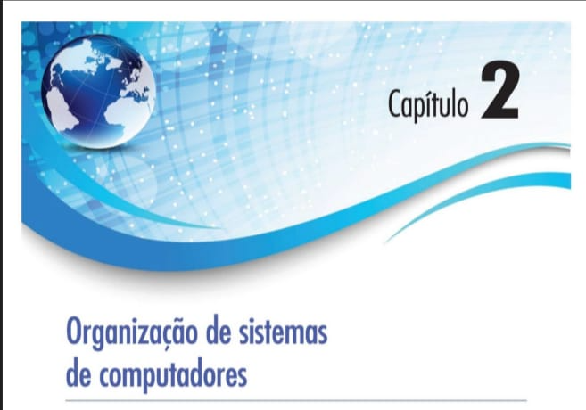

## Organização de sistemas de computadores

Um computador digital consiste em um sistema interconectado de processadores, memória e dispositivos de entrada/saída. Este capítulo é uma introdução a esses três componentes e a sua interconexão, como base para o exame mais detalhado de níveis específicos nos cinco capítulos subsequentes. Processadores, memórias e dispositivos de entrada/saída são conceitos fundamentais e estarão presentes em todos os níveis, portanto, iniciaremos nosso estudo da arquitetura de computadores examinando todos os três,
um por vez.

## 2.1 Processadores
A organização de um computador simples com barramento é mostrada na Figura 2.1. A CPU (Central Processing Unit - unidade central de processamento) é o “cérebro” do computador. Sua função é executar programas armazenados na memória principal buscando suas instruções, examinando-as e então executando-as uma após a outra. Os componentes são conectados por um barramento, conjunto de fios paralelos que transmitem endereços, dados e sinais de controle. Barramentos podem ser externos à CPU, conectando-a à memória e aos dispositivos de E/S, mas também podem ser internos, como veremos em breve. Os computadores modernos possuem vários barramentos.

**• Figura 2.1 A organização de um computador simples com uma CPU e dois dispositivos de E/S.**

A Figura 2.1 é fundamental, pois ela resume a Organização de um Computador Simples baseada no modelo de Von Neumann, conectando a CPU, a Memória e os Periféricos através de um Barramento compartilhado.

    UNIDADE CENTRAL DE PROCESSAMENTO (CPU)
        +-----------------------------------------+
        |                                         |
        |   [ UNIDADE DE CONTROLE ]               |
        |                                         |
        |-----------------------------------------|
        |                                         |
        |   [ UNIDADE DE LÓGICA E ARITMÉTICA ]    |
        |               (ULA)                     |
        |                                         |
        |-----------------------------------------|
        |                                         |
        |   [ REGISTRADORES ]                     |
        |    +---+  +---+  +---+  +---+           |
        |    | R0|  | R1|  | R2|  | R3|           |
        |    +---+  +---+  +---+  +---+           |
        |                                         |
        +----+------------------------------------+
             |
     ========+=======+=======+=======+=======+=======  <-- BARRAMENTO DE DADOS/ENDEREÇOS
                     |       |       |
                +----+----+  |  +----+----+
                |         |  |  |         |
                | MEMÓRIA |  |  | DISCO   |
                | PRINCIP.|  |  | (E/S)   |
                |         |  |  |         |
                +---------+  |  +---------+
                             |
                        +----+----+
                        |         |
                        |IMPRESSO.|
                        | (E/S)   |
                        |         |
                        +---------+
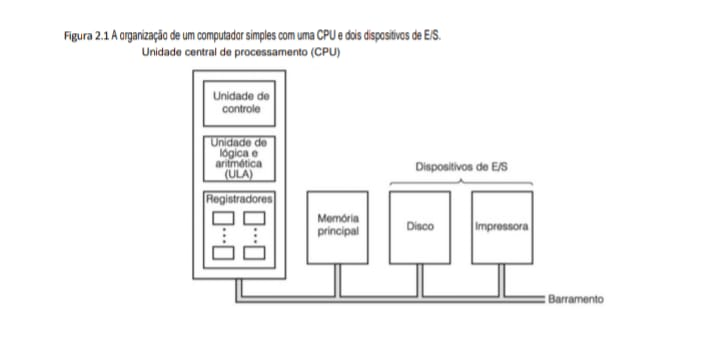

    Processamento	                                    Armazenamento

    CPU (Unidade de Controle e ULA)             	    Registradores e Memória Principal

    A Unidade de Controle decodifica as instruções      Registradores: Armazenamento interno ultrarrápido na CPU (Nível 1). Memória 
    ULA (Figura 1.5) executa os cálculos aritméticos    Principal: Onde o Mapa de Memória reside (Figura 3.60).
    e lógicos.

                                                        BARRAMENTO DE DADOS/ENDEREÇOS

    Dispositivos de E/S (Periféricos)	                Ciclo de Execução

    O Disco e a Impressora se comunicam com a CPU       As instruções e dados viajam pelo Barramento da Memória para a CPU para através do barramento, usando interfaces como a     serem processados.
    PIO (Figura 3.59).

### Insight para seus Estudos
A organização vista na Figura 2.1 explica por que o seu "Projeto IDS" roda com tanta eficiência. Ferramentas como o iwatch e tcpdump dependem de um subsistema de E/S de baixa latência e de núcleos de processamento que consigam gerenciar dados em tempo real. No seu Lenovo IdeaPad, o barramento compartilhado foi substituído por conexões ponto-a-ponto rápidas (como o PCIe na Figura 3.57), mas a lógica de comunicação entre a CPU, Memória e Periféricos permanece a mesma.

A CPU é composta por várias partes distintas. A unidade de controle é responsável por buscar instruções na memória principal e determinar seu tipo. A unidade de aritmética e lógica efetua operações como adição e AND (E) booleano para executar as instruções.

A CPU também contém uma pequena memória de alta velocidade usada para armazenar resultados temporários e para algum controle de informações. Essa memória é composta de uma quantidade de registradores, cada um deles com determinado tamanho e função. Em geral, todos os registradores têm o mesmo tamanho. Cada um pode conter um número, até algum máximo definido pelo tamanho do registrador. Registradores podem ser lidos e escritos em alta velocidade porque são internos à CPU.

O registrador mais importante é o Contador de Programa (PC - Program Counter), que indica a próxima instrução a ser buscada para execução. (O nome “contador de programa” é um tanto enganoso, porque nada tem a ver com contar qualquer coisa; porém, o termo é de uso universal.) Também importante é o Registrador de Instrução (IR - Instruction Register), que mantém a instrução que está sendo executada no momento em questão. A maioria dos computadores também possui diversos outros registradores, alguns de uso geral, outros de uso específico. Outros registradores são usados pelo sistema operacional para controlar o computador.

## 2.1.1 Organização da CPU
A organização interna de parte de uma típica CPU de von Neumann é mostrada na Figura 2.2 com mais detalhes. Essa parte é denominada caminho de dados e é composta por registradores (em geral 1 a 32), da ULA (unidade lógica e aritmética) e por diversos barramentos que conectam as partes. Os registradores alimentam dois registradores de entrada da ULA, representados por A e B n a figura. Eles contêm a entrada da ULA enquanto ela está executando alguma operação de computação. O caminho de dados é muito importante em todas as máquinas e nós o discutiremos minuciosamente em todo este livro.

**• Figura 2.2 0 caminho de dados de uma típica máquina de von Neumann.**

A Figura 2.2 detalha o Caminho de Dados interno da CPU, mostrando como uma operação aritmética simples ( A + B) acontece fisicamente entre os registradores e a ULA.

        +---------------------------------------+
        |             REGISTRADORES             |
        |  +---------------------------------+  |
        |  |              A + B              |  | <---+
        |  +---------------------------------+  |     |
        |  |                A                |  |     | (Feedback)
        |  +---------------------------------+  |     |
        |  |                B                |  |     |
        |  +---------------------------------+  |     |
        +-------+-----------------------+-------+     |
                |                       |             |
                v                       v             |
        +---------------+       +---------------+     |
        | REG. ENTRADA  |       | REG. ENTRADA  |     |
        |  DA ULA (A)   |       |  DA ULA (B)   |     |
        +-------+-------+       +-------+-------+     |
                |                       |             |
                v                       v             |
        +---------------------------------------+     |
        |      UNIDADE DE LÓGICA E ARITMÉTICA   |     |
        |                 (ULA)                 |     |
        +-------------------+-------------------+     |
                            |                         |
                            v                         |
                +-----------------------+             |
                |  REG. SAÍDA DA ULA    |             |
                |        (A + B)        |-------------+
                +-----------------------+

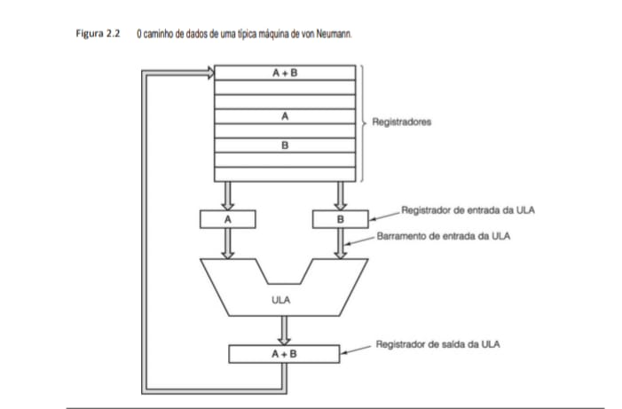

    Processamento	                                               Armazenamento

    Ciclo da ULA	                                               Hierarquia de Registradores

    A ULA recebe os operandos dos registradores de entrada,        Os registradores (Nível 1) são a memória mais rápida do sistema, realiza a soma e coloca o resultado no registrador             servindo de fonte e destino imediato para a ULA.
    de saída.

                                                                   BARRAMENTO INTERNO

    Feedback de Dados	                                           Execução em Hardware

    O resultado (A+B) volta para o banco de registradores          Este processo é o que acontece bilhões de vezes por segundo 
    para ser usado em instruções futuras.                          dentro do seu Core i7.

### Insight 
Este diagrama é o "coração" do que você estuda em Assembly e C:

 - No seu Projeto IDS: Quando você faz uma comparação de endereços IP no seu código, a CPU move os valores para os Registradores de Entrada, a ULA subtrai um do outro para verificar a igualdade e o resultado define o próximo passo do seu firewall.

 - Eficiência: Como vimos na Figura 1.12, chips modernos têm múltiplos núcleos, cada um com seu próprio caminho de dados como este, permitindo processar milhões de pacotes simultaneamente no seu Ubuntu 24.04.

A ULA efetua adição, subtração e outras operações simples sobre suas entradas, produzindo assim um resultado no registrador de saída, o qual pode ser armazenado em um registrador. Mais tarde, ele pode ser escrito (isto é, armazenado) na memória, se desejado. Nem todos os projetos têm os registradores A, B e de saída. No exemplo, ilustramos uma adição, mas as ULAs também realizam outras operações.

Grande parte das instruções pode ser dividida em uma de duas categorias: registrador-memória ou registrador-registrador.Instruções registrador-memória permitem que palavras de memória sejam buscadas em registradores, onde podem ser usadas como entradas de ULA em instruções subsequentes, por exemplo. (“Palavras” são as unidades de dados movimentadas entre memória e registradores. Uma palavra pode ser um número inteiro. Discutiremos organização de memória mais adiante neste capítulo.) Outras instruções registrador-memória permitem que registradores voltem à memória para armazenagem.

O outro tipo de instrução é registrador-registrador. Uma instrução registrador-registrador típica busca dois operandos nos registradores, traz os dois até os registradores de entrada da ULA, efetua alguma operação com eles (por exemplo, adição ou AND booleano) e armazena o resultado em um dos registradores. O processo de passar dois operandos pela ULA e armazenar o resultado é denominado ciclo do caminho de dados e é o coração da maioria das CPUs. Até certo ponto considerável, ele define o que a máquina pode fazer. Quanto mais rápido for o ciclo do caminho de dados, mais rápido será o funcionamento da máquina.

## 2.1.2 Execucõo de instrução
A CPU executa cada instrução em uma série de pequenas etapas. Em termos simples, as etapas são as seguintes:

    1. Trazer a próxima instrução da memória até o registrador de instrução.
    
    2. Alterar o contador de programa para que aponte para a próxima instrução.Capítulo 2 • Organização de sistemas de computadores
    
    3. Determinar o tipo de instrução trazida.
    
    4. Se a instrução usar uma palavra na memória, determinar onde essa palavra está.
    
    5. Trazer a palavra para dentro de um registrador da CPU, se necessário.
    
    6. Executar a instrução.
    
    7. Voltar à etapa 1 para iniciar a execução da instrução seguinte.

Tal sequência de etapas costuma ser denominada ciclo buscar-decodificar-executar. É fundamental para a operação de todos os computadores.

Essa descrição do modo de funcionamento de uma CPU é muito parecida com um programa escrito em inglês. A Figura 2.3 mostra esse programa informal reescrito como um método Java (isto é, um procedimento) denominado interpret. A máquina que está sendo interpretada tem dois registradores visíveis para programas usuários: o contador de programa (PC), para controlar o endereço da próxima instrução a ser buscada, e o acumulador (AC), para acumular resultados aritméticos. Também tem registradores internos para conter a instrução corrente durante sua execução (instr), o tipo da instrução corrente (instr_type), o endereço do operando da instrução (datajoc) e o operando corrente em si (data). Admitimos que as instruções contêm um único endereço de memória. A localização de memória endereçada contém o operando, por exemplo, o item de dado a ser somado ao acumulador.

**• Figura 2.3 Interpretador para um computador simples (escrito em Java).**

public class Interp {
    
    static int PC;                                       // contador de programa contém endereço da próxima instr
    static int AC;                                       // o acumulador , um registrador para efetuar aritmética
    static int instr;                                    // um registrador para conter a instrução corrente
    static int instr_type;                               // um tipo de instrução (opcode)
    static int data_loc;                                 // o endereço dos dados, ou -1 se nenhum
    static int data;                                     // mantém o operando corrente
    static boolean run_bit = true;                       // um bit que pode ser desligado para parar a máquina
    
                                                    
    public static void interpret(int memory[ ], int starting_ address) (
        // Esse procedimento interpreta programas para uma máquina simples com instruções que têm 
        // um operando na memória. A máquina tem um registrador AC (acumulador), usado para 
        // aritmética. A instrução ADD soma um inteiro na memória do AC, por exemplo.
        // 0 interpretador continua funcionando até o bit de funcionamento ser desligado pela instrução HALT. 
        // 0 estado de um processo que roda nessa máquina consiste em memória, o 
        // contador de programa, bit de funcionamento e AC. Os parâmetros de entrada consistem 
        // na imagem da memória e no endereço inicial.

    PC = starting_address; 
        while (run_bit) (
        instr = memory[PC];                                    // busca a próxima instrução e armazena em instr
        PC = PC + 1;                                           // incrementa contador do programa
        instr_type = get_instr_type(instr);                    // determina tipo de instrução
        data_loc = find_data(instr, instr_type);               // localiza dados (-1 se nenhum)
        if (data_loc >= 0)                                     // se data_loc é -1, não há nenhum operando
            data = memory [data_loc];                          // busca os dados
        execute(instr_type, data);                             // executa instrução
        }
    }
    private static int get_instr_type(int addr) ( . . . )
    private static int find_data(int instr, int type) ( . . . )
    private static void execute(int type, int data) ( . . . )

Essa equivalência entre processadores de hardware e interpretadores tem importantes implicações para a organização de computadores e para o projeto de sistemas de computadores. Após a especificação da linguagem de máquina, L, para um novo computador, a equipe de projeto pode decidir se quer construir um processador de hardware para executar programas em L diretamente ou se quer escrever um interpretador para interpretar programas em L. Se a equipe preferir escrever um interpretador, também deve providenciar alguma máquina de hardware para executá-lo. São possíveis ainda certas construções híbridas, com um pouco de execução em hardware, bem como alguma interpretação de software.

Um interpretador subdivide as instruções da máquina em questão em pequenas etapas. Por conseguinte, a máquina na qual o interpretador roda deve ser muito mais simples e menos cara do que seria um processador de hardware para a máquina citada. Essa economia é bastante significativa se a máquina em questão tiver um grande número de instruções e estas forem razoavelmente complicadas, com muitas opções. Basicamente, a economia vem do fato de que o hardware está sendo substituído por software (o interpretador) e custa mais reproduzir hardware do que software.

Os primeiros computadores tinham conjuntos de instruções pequenos, simples. Mas a procura por equipamentos mais poderosos levou, entre outras coisas, a instruções individuais mais poderosas. Logo se descobriu que instruções mais complexas muitas vezes levavam à execução mais rápida do programa mesmo que as instruções individuais demorassem mais para ser executadas. Uma instruçáo de ponto flutuante é um exemplo de instrução mais complexa. O suporte direto para acessar elementos matriciais é outro. Às vezes, isso era simples como observar que as mesmas duas instruções muitas vezes ocorriam em sequência, de modo que uma única instrução poderia fazer o trabalho de ambas.

As instruções mais complexas eram melhores porque a execução de operações individuais às vezes podia ser sobreposta ou então executada em paralelo usando hardware diferente. No caso de computadores caros, de alto desempenho, o custo desse hardware extra poderia ser justificado de imediato. Assim, computadores caros, de alto desempenho, passaram a ter mais instruções do que os de custo mais baixo. Contudo, requisitos de compatibilidade de instruções e o custo crescente do desenvolvimento de software criaram a necessidade de executar instruções complexas mesmo em computadores de baixo custo, nos quais o custo era mais importante do que a velocidade.

No final da década de 1950, a IBM (na época a empresa que dominava o setor de computadores) percebeu que prestar suporte a uma única família de máquinas, todas executando as mesmas instruções, tinha muitas vantagens, tanto para a IBM quanto para seus clientes. Então, a empresa introduziu o termo arquitetura para descrever esse nível de compatibilidade. Uma nova família de computadores teria uma só arquitetura, mas muitas implementações diferentes que poderiam executar o mesmo programa e seriam diferentes apenas em preço e velocidade. Mas como construir um computador de baixo custo que poderia executar todas as complicadas instruções de máquinas caras, de alto desempenho?

A resposta foi a interpretação. Essa técnica, que já tinha sido sugerida por Maurice Wilkes (1951), permitia o projeto de computadores simples e de menor custo, mas que, mesmo assim, podiam executar um grande número de instruções. O resultado foi a arquitetura IBM System/360, uma família de computadores compatíveis que abrangia quase duas ordens de grandeza, tanto em preço quanto em capacidade. Uma implementação de hardware direto (isto é, não interpretado) era usada somente nos modelos mais caros.
Computadores simples com instruções interpretadas também tinham outros benefícios, entre os quais os mais importantes eram:

    1. A capacidade de corrigir em campo instruções executadas incorretamente ou até compensar deficiências de
    projeto no hardware básico.

    2. A oportunidade de acrescentar novas instruções a um custo mínimo, mesmo após a entrega da máquina.

    3. Projeto estruturado que permitia desenvolvimento, teste e documentação eficientes de instruções complexas.

À medida que o mercado explodia em grande estilo na década de 1970 e as capacidades de computação cresciam depressa, a demanda por máquinas de baixo custo favorecia projetos de computadores que usassem interpretadores. A capacidade de ajustar hardware e interpretador para um determinado conjunto de instruções surgiu como um projeto muito eficiente em custo para processadores. À medida que a tecnologia subjacente dos semicondutores avançava, as vantagens do custo compensavam as oportunidades de desempenho mais alto e as arquiteturas baseadas em interpretador se tornaram o modo convencional de projetar computadores. Quase todos os novos computadores projetados na década de 1970, de microcomputadores a mainframes, tinham a interpretação como base.

No final da década de 1970, a utilização de processadores simples que executavam interpretadores tinha se propagado em grande escala, exceto entre os modelos mais caros e de desempenho mais alto, como o Cray-1 e a série Cyber da Control Data. A utilização de um interpretador eliminava as limitações de custo inerentes às instruções complexas, de modo que os projetistas começaram a explorar instruções muito mais complexas, em particular os modos de especificar os operandos a utilizar.

A tendência alcançou seu ponto mais alto com o VAX da Digital Equipment Corporation, que tinha várias centenas de instruções e mais de 200 modos diferentes de especificar os operandos a serem usados em cada instrução. Infelizmente, desde o início a arquitetura do VAX foi concebida para ser executada com um interpretador, sem dar muita atenção à realização de um modelo de alto desempenho. Esse modo de pensar resultou na inclusão de um número muito grande de instruções de valor marginal e que eram difíceis de executar diretamente. Essa omissão mostrou ser fatal para o VAX e, por fim, também para a DEC (a Compaq comprou a DEC em 1998 e a Hewlett-Packard comprou a Compaq em 2001).

Embora os primeiros microprocessadores de 8 bits fossem máquinas muito simples com conjuntos de instruções muito simples, no final da década de 1970 até os microprocessadores tinham passado para projetos baseados em interpretador. Durante esse período, um dos maiores desafios enfrentados pelos projetistas de microprocessadores era lidar com a crescente complexidade, possibilitada por meio de circuitos integrados. Uma importante vantagem do método baseado em interpretador era a capacidade de projetar um processador simples e confinar quase toda a complexidade na memória que continha o interpretador. Assim, um projeto complexo de hardware se transformou em um projeto complexo de software.

O sucesso do Motorola 68000, que tinha um grande conjunto de instruções interpretadas, e o concomitante fracasso do Zilog Z8000 (que tinha um conjunto de instruções tão grande quanto, mas sem um interpretador) demonstraram as vantagens de um interpretador para levar um novo microprocessador rapidamente ao mercado. Esse sucesso foi ainda mais surpreendente dada a vantagem de que o Zilog desfrutava (o antecessor do Z8000, o Z80, era muito mais popular do que o antecessor do 68000, o 6800). Claro que outros fatores também contribuíram para isso, e um dos mais importantes foi a longa história da Motorola como fabricante de chips e a longa história da Exxon (proprietária da Zilog) como empresa de petróleo, e não como fabricante de chips.

Outro fator a favor da interpretação naquela época foi a existência de memórias rápidas somente de leitura, denominadas memórias de controle, para conter os interpretadores. Suponha que uma instrução interpretada típica precisasse de 10 instruções do interpretador, denominadas microinstruções, a 100 ns cada, e duas referências à memória principal a 500 ns cada. Então, o tempo total de execução era 2.000 ns, apenas um fator de dois pior do que o melhor que a execução direta podia conseguir. Se a memória de controle não estivesse disponível, a instrução levaria 6.000 ns. Uma penalidade de fator seis é muito mais difícil de aceitar do que uma penalidade de fator dois.

## 2.1.1 RISC versus CISC
Durante o final da década de 1970, houve experiências com instruções muito complexas que eram possibilitadas pelo interpretador. Os projetistas tentavam fechar a “lacuna semântica” entre o que as máquinas podiam fazer e o que as linguagens de programação de alto nível demandavam. Quase ninguém pensava em projetar máquinas mais simples, exatamente como agora não há muita pesquisa na área de projeto de planilhas, redes, servidores Web etc. menos poderosos (o que talvez seja lamentável).

Um grupo que se opôs à tendência e tentou incorporar algumas das idéias de Seymour Cray em um minicomputador de alto desempenho foi liderado por John Cocke na IBM. Esse trabalho resultou em um minicomputador denominado 801. Embora a IBM nunca tenha lançado essa máquina no mercado e os resultados tenham sido publicados só muitos anos depois (Radin, 1982), a notícia vazou e outros começaram a investigar arquiteturas semelhantes.

Em 1980, um grupo em Berkeley, liderado por David Patterson e Cario Séquin, começou a projetar chips para CPUs VLSI que não usavam interpretação (Patterson, 1985; Patterson e Séquin, 1982). Eles cunharam o termo RISC para esse conceito e deram ao seu chip de CPU o nome RISC I CPU, seguido logo depois pelo RISC II. Um pouco mais tarde, em 1981, do outro lado da baía de São Francisco, em Stanford, John Hennessy projetou e fabricou um chip um pouco diferente, que ele chamou de MIPS (Hennessy, 1984). Esses chips evoluíram para produtos de importância comercial, o SPARC e o MIPS, respectivamente.

Esses novos processadores tinham diferenças significativas em relação aos que havia no comércio naquela época. Uma vez que essas novas CPUs não eram compatíveis com os produtos existentes, seus projetistas tinham liberdade para escolher novos conjuntos de instruções que maximizassem o desempenho total do sistema. Embora a ênfase inicial estivesse dirigida a instruções simples, que podiam ser executadas rapidamente, logo se percebeu que projetar instruções que podiam ser emitidas (iniciadas) rapidamente era a chave do bom desempenho. Na verdade, o tempo que uma instrução demorava importava menos do que quantas delas podiam ser iniciadas por segundo.

Na época em que o projeto desses processadores simples estava no início, a característica que chamou a atenção de todos era o número relativamente pequeno de instruções disponíveis, em geral cerca de 50. Esse número era muito menor do que as 200 a 300 de computadores como o VAX da DEC e os grandes mainframes da IBM. De fato, o acrônimo RISC quer dizer Reduced Instruction Set Computer (computador com conjunto de instruções reduzido), em comparação com CISC, que significa Complex Instruction Set Computer (computador com conjunto de instruções complexo), uma referência nada sutil ao VAX que, na época, dominava os departamentos de ciência da computação das universidades. Hoje em dia, poucas pessoas acham que o tamanho do conjunto de instruções seja um assunto importante, mas o nome pegou.

Encurtando a história, seguiu-se uma grande guerra santa, com os defensores do RISC atacando a ordem estabelecida (VAX, Intel, grandes mainframes da IBM). Eles afirmavam que o melhor modo de projetar um computador era ter um pequeno número de instruções simples que executassem em um só ciclo do caminho de dados da Figura 2.2, ou seja, buscar dois registradores, combiná-los de algum modo (por exemplo, adicionando-os ou fazendo AND) e armazenar o resultado de volta em um registrador. O argumento desses pesquisadores era de que, mesmo que uma máquina RISC precisasse de quatro ou cinco instruções para fazer o que uma CISC fazia com uma só, se as instruções RISC fossem dez vezes mais rápidas (porque não eram interpretadas), o RISC vencia. Também vale a pena destacar que, naquele tempo, a velocidade de memórias principais tinha alcançado a velocidade de memórias de controle somente de leitura, de modo que a penalidade imposta pela interpretação tinha aumentado demais, o que favorecia muito as máquinas RISC.

Era de imaginar que, dadas as vantagens de desempenho da tecnologia RISC, as máquinas RISC (como a Sun UltraSPARC) passariam como rolo compressor sobre as máquinas CISC (tal como a Pentium da Intel) existentes no mercado. Nada disso aconteceu. Por quê?

Antes de tudo, há a questão da compatibilidade e dos bilhões de dólares que as empresas tinham investido em software para a linha Intel. Em segundo lugar, o que era surpreendente, a Intel conseguiu empregar as mesmas idéias mesmo em uma arquitetura CISC. A partir do 486, as CPUs da Intel contêm um núcleo RISC que executa as instruções mais simples (que normalmente são as mais comuns) em um único ciclo do caminho de dados, enquanto interpreta as mais complicadas no modo CISC de sempre. O resultado disso é que as instruções comuns são rápidas e as menos comuns são lentas. Mesmo que essa abordagem híbrida não seja tão rápida quanto um projeto RISC puro, ela resulta em desempenho global competitivo e ainda permite que softwares antigos sejam executados sem modificação.

## 2.1.2 Princípios de projeto para computadores modernos
Agora que já se passaram mais de duas décadas desde que as primeiras máquinas RISC foram lançadas, certos princípios de projeto passaram a ser aceitos como um bom modo de projetar computadores, dado o estado atual da tecnologia de hardware. Se ocorrer uma importante mudança na tecnologia (por exemplo, se, de repente, um novo processo de fabricação fizer o ciclo de memória ficar dez vezes mais rápido do que o tempo de ciclo da CPU), todas as apostas perdem. Assim, os projetistas de máquinas devem estar sempre de olho nas mudanças tecnológicas que possam afetar o equilíbrio entre os componentes.

Dito isso, há um conjunto de princípios de projeto, às vezes denominados princípios de projeto RISC, que os arquitetos de CPUs de uso geral se esforçam por seguir. Limitações externas, como a exigência de compatibilidade com alguma arquitetura existente, muitas vezes exigem uma solução de conciliação de tempos em tempos, mas esses princípios são metas que a maioria dos projetistas se esforça para cumprir. A seguir, discutiremos os principais.

**• Todas as instruções são executadas diretamente por hardware**

Todas as instruções comuns são executadas diretamente pelo hardware - não são interpretadas por micro-instruções. Eliminar um nível de interpretação dá alta velocidade à maioria das instruções. No caso de computadores que executam conjuntos de instruções CISC, as instruções mais complexas podem ser subdivididas em partes separadas que então podem ser executadas como uma sequência de microinstruções. Essa etapa extra torna a máquina mais lenta, porém, para instruções que ocorrem com menos frequência, isso pode ser aceitável.

**• Maximize a taxa de execucão das instruções**

Computadores modernos recorrem a muitos truques para maximizar seu desempenho, entre os quais o principal é tentar iniciar o máximo possível de instruções por segundo. Afinal, se você puder emitir 500 milhões de instruções por segundo, terá construído um processador de 500 MIPS, não importa quanto tempo elas realmente levem para ser concluídas. (MIPS quer dizer Milhões de Instruções Por Segundo. O processador MIPS recebeu esse nome como um trocadilho desse acrônimo. Oficialmente, ele significa Microprocessor without Interlocked Pipeline Stages - microprocessador sem estágios paralelos de interbloqueio.) Esse princípio sugere que o paralelismo pode desempenhar um importante papel na melhoria do desempenho, uma vez que emitir grandes quantidades de instruções lentas em curto intervalo de tempo só é possível se várias instruções puderem ser executadas ao mesmo tempo.

Embora as instruções sempre sejam encontradas na ordem do programa, nem sempre elas são executadas nessa mesma ordem (porque algum recurso necessário pode estar ocupado) e não precisam terminar na ordem do programa. É claro que, se a instrução 1 estabelece um registrador e a instrução 2 usa esse registrador, deve-se tomar muito cuidado para garantir que a instrução 2 não leia o registrador até que ele contenha o valor correto. Fazer isso funcionar direito requer muito controle, mas possibilita ganhos de desempenho por executar várias instruções ao mesmo tempo.

**• Instruções devem ser fáceis de decodificar**

Um limite crítico para a taxa de emissão de instruções é a decodificação de instruções individuais para determinar quais recursos elas necessitam. Qualquer coisa que possa ajudar nesse processo é útil. Isso inclui fazer instruções regulares, de comprimento fixo, com um pequeno número de campos. Quanto menor o número de formatos diferentes para as instruções, melhor.

**• Somente LOAD e STORE devem referenciar a memória**

Um dos modos mais simples de subdividir operações em etapas separadas é requerer que os operandos para a maioria das instruções venham de registradores da CPU e a eles retornem. A operação de movimentação de operandos da memória para registradores pode ser executada em instruções separadas. Uma vez que o acesso à memória pode levar um longo tempo, e que o atraso é imprevisível, o melhor é sobrepor essas instruções a outras se elas nada fizerem exceto movimentar operandos entre registradores e memória. Essa observação significa que somente instruções LOAD e STORE devem referenciar a memória. Todas as outras devem operar apenas em registradores.

**• Providencie muitos registradores**

Visto que o acesso à memória é relativamente lento, é preciso providenciar muitos registradores (no mínimo, 32) de modo que, assim que uma palavra for buscada, ela possa ser mantida em um registrador até não ser mais necessária. Esgotar os registradores e ter de descarregá-los de volta à memória só para ter de recarregá-los mais tarde é indesejável e deve ser evitado o máximo possível. A melhor maneira de conseguir isso é ter um número suficiente de registradores.

## 2.1.3 Paralelismo no nível de instrução
Arquitetos de computadores estão sempre se esforçando para melhorar o desempenho das máquinas que projetam. Fazer os chips funcionarem com maior rapidez aumentando suas velocidades de clock é um modo, mas, para cada novo projeto, há um limite para o que é possível fazer por força bruta naquele momento da História. Por conseguinte, grande parte dos arquitetos de computadores busca o paralelismo (fazer duas ou mais coisas ao mesmo tempo) como um meio de conseguir desempenho ainda melhor para dada velocidade de clock.

O paralelismo tem duas formas gerais, a saber, no nível de instrução e no nível de processador. Na primeira, o paralelismo é explorado dentro de instruções individuais para obter da máquina mais instruções por segundo. Na última, várias CPUs trabalham juntas no mesmo problema. Cada abordagem tem seus próprios méritos. Nesta seção, vamos estudar o paralelismo no nível de instrução; na seção seguinte, estudaremos o paralelismo no nível de processador.

**• Pipelining (paralelismo)**

Há anos sabe-se que o processo de buscar instruções na memória é um grande gargalo na velocidade de execução da instrução. Para amenizar esse problema, os computadores, desde o IBM Stretch (1959), tinham a capacidade de buscar instruções na memória antecipadamente, de maneira que estivessem presentes quando necessárias. Essas instruções eram armazenadas em um conjunto de registradores denominado buffer de busca antecipada (ou prefetch buffer). Desse modo, quando necessária, uma instrução podia ser apanhada no buffer de busca antecipada, em vez de esperar pela conclusão de uma leitura da memória.

Na verdade, a busca antecipada divide a execução da instrução em duas partes: a busca e a execução propriamente dita. O conceito de pipeline (paralelismo, canalização) amplia muito mais essa estratégia. Em vez de dividir a execução da instrução em apenas duas partes, muitas vezes ela é dividida em muitas partes (uma dúzia ou mais), cada uma manipulada por uma parte dedicada do hardware, e todas elas podem executar em paralelo.

A Figura 2.4(a) ilustra um pipeline com cinco unidades, também denominadas estágios. O estágio 1 busca a instrução na memória e a coloca em um buffer até que ela seja necessária. O estágio 2 decodifica a instrução, determina seu tipo e de quais operandos ela necessita. O estágio 3 localiza e busca os operandos, seja nos registradores, seja na memória. O estágio 4 é que realiza o trabalho de executar a instrução, normalmente fazendo os operandos passarem pelo caminho de dados da Figura 2.2. Por fim, o estágio 5 escreve o resultado de volta no registrador adequado.

**• Figura 2.4 (a) Pipeline de cinco estágios, (b) Estado de cada estágio como uma função do tempo. São ilustrados nove ciclos de clock.**

Essa é uma das ilustrações mais clássicas para entender como a CPU consegue processar tantas informações ao mesmo tempo. A Figura 2.4 explica o conceito de Pipeline, que é basicamente a "linha de montagem" do processador.

Em vez de esperar uma instrução terminar completamente para começar a próxima, a CPU divide o trabalho em estágios. Assim que o estágio 1 termina para a "Instrução A", ele já começa a trabalhar na "Instrução B", enquanto a "A" segue para o estágio 2.

**• Figura 2.4: Pipeline de Cinco Estágios**

    (a) Os Estágios do Pipeline

       S1             S2             S3             S4             S5
    +---------+      +---------+      +---------+      +---------+      +---------+
    | Unidade |      | Unidade |      | Unidade |      | Unidade |      | Unidade |
    |  Busca  |----->|  Decod. |----->|  Busca  |----->|  Exec.  |----->|  Grav.  |
    |  Instr. |      |  Instr. |      |  Oper.  |      |  Instr. |      |  Resul. |
    +---------+      +---------+      +---------+      +---------+      +---------+

    (b) Fluxo de Instruções no Tempo

    ESTÁGIO | 1 | 2 | 3 | 4 | 5 | 6 | 7 | 8 | 9 |  <-- Ciclos de Clock
    --------+---+---+---+---+---+---+---+---+---+
    S1    | I1| I2| I3| I4| I5| I6| I7| I8| I9|
    S2    |   | I1| I2| I3| I4| I5| I6| I7| I8|
    S3    |   |   | I1| I2| I3| I4| I5| I6| I7|
    S4    |   |   |   | I1| I2| I3| I4| I5| I6|
    S5    |   |   |   |   | I1| I2| I3| I4| I5|

### Insight 
O Pipeline é o segredo da velocidade do seu Lenovo IdeaPad:

 - Eficiência no C: Quando você compila seu "Projeto IDS", o compilador tenta organizar as instruções para evitar "bolhas" (pausas) no pipeline. Se uma instrução depende do resultado da anterior, o pipeline pode travar por um ciclo.

 - No seu Ubuntu 24.04: O kernel gerencia o contexto de execução, mas é o hardware (Figura 1.12) que mantém esse fluxo constante para garantir que a análise de pacotes do seu IDS ocorra sem atrasos.

Na Figura 2.4(b), vemos como o pipeline funciona em função do tempo. Durante o ciclo de clock 1, o estágio SI está trabalhando na instrução 1, buscando-a na memória. Durante o ciclo 2, o estágio S2 decodifica a instrução 1, enquanto o estágio SI busca a instrução 2. Durante o ciclo 3, o estágio S3 busca os operandos para a instrução 1, o estágio S2 decodifica a instrução 2 e o estágio SI busca a terceira instrução. Durante o ciclo 4, o estágio S4 executa a instrução 1, S3 busca os operandos para a instrução 2, S2 decodifica a instrução 3 e SI busca a instrução 4. Por fim, durante o ciclo 5, S5 escreve (grava) o resultado da instrução 1 de volta ao registrador, enquanto os outros estágios trabalham nas instruções seguintes.

Vamos considerar uma analogia para esclarecer melhor o conceito de pipelining. Imagine uma fábrica de bolos na qual a operação de produção dos bolos e a operação da embalagem para expedição são separadas. Suponha que o departamento de expedição tenha uma longa esteira transportadora ao longo da qual trabalham cinco funcionários (unidades de processamento). A cada 10 segundos (o ciclo de clock), o funcionário 1 coloca uma embalagem de bolo vazia na esteira. A caixa é transportada até o funcionário 2, que coloca um bolo dentro dela. Um pouco mais tarde, a caixa chega à estação do funcionário 3, onde é fechada e selada. Em seguida, prossegue até o funcionário 4, que coloca uma etiqueta na embalagem. Por fim, o funcionário 5 retira a caixa da esteira e a coloca em um grande contêiner que mais tarde será despachado para um supermercado. Em termos gerais, esse é o modo como um pipeline de computador também funciona: cada instrução (bolo) passa por diversos estágios de processamento antes de aparecer já concluída na extremidade final.

Voltando ao nosso pipeline da Figura 2.4, suponha que o tempo de ciclo dessa máquina seja 2 ns. Sendo assim, uma instrução leva 10 ns para percorrer todo o caminho do pipeline de cinco estágios. À primeira vista, como uma instrução demora 10 ns, parece que a máquina poderia funcionar em 100 MIPS, mas, na verdade, ela funciona muito melhor do que isso. A cada ciclo de clock (2 ns), uma nova instrução é concluída, portanto, a velocidade real de processamento é 500 MIPS, e não 100 MIPS.

O pipelining permite um compromisso entre latência (o tempo que demora para executar uma instrução) e largura de banda de processador (quantos MIPS a CPU tem). Com um tempo de ciclo de T ns e n estágios no pipeline, a latência é nT ns porque cada instrução passa por n estágios, cada um dos quais demora T ns.

Visto que uma instrução é concluída a cada ciclo de clock e que há 109/T ciclos de clock por segundo, o número de instruções executadas por segundo é 107T. Por exemplo, se T = 2 ns, 500 milhões de instruções são executadas a cada segundo. Para obter o número de MIPS, temos de dividir a taxa de execução de instrução por 1 milhão para obter (109/T)/106 = 1.000/T MIPS. Em teoria, poderiamos medir taxas de execução de instrução em BIPS em vez de MIPS, mas ninguém faz isso, portanto, nós também não o faremos.

**• Arquiteturas superescalares**

Se um pipeline é bom, então certamente dois pipelines são ainda melhores. Um projeto possível para uma CPU com dois pipelines, com base na Figura 2.4, é mostrado na Figura 2.5. Nesse caso, uma única unidade de busca de instruções busca pares de instruções ao mesmo tempo e coloca cada uma delas em seu próprio pipeline, completo com sua própria ULA para operação paralela. Para poder executar em paralelo, as duas instruções não devem ter conflito de utilização de recursos (por exemplo, registradores) e nenhuma deve depender do resultado da outra. Assim como em um pipeline único, ou o compilador deve garantir que essa situação aconteça (isto é, o hardware não verifica e dá resultados incorretos se as instruções não forem compatíveis), ou os conflitos deverão ser detectados e eliminados durante a execução usando hardware extra.

**• Figura 2.5 Pipelines duplos de cinco estágios com uma unidade de busca de instrução em comum.**

A Figura 2.5 leva o conceito de pipeline um passo adiante, introduzindo os Pipelines Duplos. Enquanto o pipeline simples (Figura 2.4) foca em processar uma instrução por estágio, esta arquitetura permite que a CPU execute duas instruções simultaneamente usando uma única unidade de busca em comum.

                     S2              S3              S4              S5
               +---------------+---------------+---------------+---------------+
               | Unid. Decodif.| Unid. Busca   | Unid. Execução| Unid. de      |
          +--->| de Instrução  | de Operando   | de Instrução  | Gravação      |
          |    +---------------+---------------+---------------+---------------+
    +-----+-----+
    | Unidade de|
    | Busca de  |   S1
    | Instrução |
    +-----+-----+
          |    +---------------+---------------+---------------+---------------+
          +--->| Unid. Decodif.| Unid. Busca   | Unid. Execução| Unid. de      |
               | de Instrução  | de Operando   | de Instrução  | Gravação      |
               +---------------+---------------+---------------+---------------+
                     S2              S3              S4              S5

    Processamento	                                               Armazenamento

    Arquitetura Superescalar	                                   Vazão Duplicada (Throughput)

    A CPU pode iniciar e concluir duas instruções por ciclo        Exige um banco de registradores (Figura 2.2) com mais portas de de clock, desde que não haja dependências entre elas.          leitura/escrita para suportar o acesso simultâneo dos dois 
                                                                   caminhos.

                                                                   BARRAMENTO INTERNO

    Unidade de Busca Comum (S1)	                                   Lógica de Conflito

    Uma única unidade busca as instruções na Memória (Figura 2.1)  Se a segunda instrução depender da primeira, o hardware deve   as distribui para os dois pipelines paralelos.                 detectar o conflito e pausar o segundo pipeline.

### Insight 
Esta arquitetura é o que transformou CPUs simples em processadores de alto desempenho:

 - No seu Lenovo IdeaPad: Processadores modernos (como o seu Core i7) são muito mais complexos que isso, possuindo pipelines que podem ter 14 estágios ou mais e emitir até 6 instruções por ciclo.

 - Impacto no seu Código: Quando você escreve em C/C++, o compilador tenta "desenrolar" loops (loop unrolling) para que as instruções possam preencher ambos os pipelines da Figura 2.5, dobrando a velocidade de execução do seu Projeto IDS sem aumentar o clock.

Embora pipelines, simples ou duplos, sejam usados em sua maioria em máquinas RISC (o 386 e seus antecessores não tinham nenhum), a partir do 486 a Intel começou a acrescentar pipelines de dados em suas CPUs. O 486 tinha um pipeline e o Pentium original tinha pipelines de cinco estágios mais ou menos como os da Figura 2.5, embora a exata divisão do trabalho entre os estágios 2 e 3 (denominados decode-1 e decode-2) era ligeiramente diferente do que em nosso exemplo. O pipeline principal, denominado pipeline u,
podia executar uma instrução Pentium qualquer. O segundo, denominado pipeline v, podia executar apenas instruções com números inteiros (e também uma instrução simples de ponto flutuante – FXCH).

Regras fixas determinavam se um par de instruções era compatível e, portanto, se elas podiam ser executadas em paralelo. Se as instruções em um par não fossem simples o suficiente ou se fossem incompatíveis, somente a primeira era executada (no pipeline u). A segunda era retida para fazer par com a instrução seguinte. Instruções eram sempre executadas em ordem. Assim, os compiladores específicos para Pentium que produziam pares compatíveis podiam produzir programas de execução mais rápidos do que compiladores
mais antigos. Medições mostraram que um código de execução Pentium otimizado para ele era exatamente duas vezes mais rápido para programas de inteiros do que um 486 que executava à mesma velocidade de clock (Pountain, 1993). Esse ganho podia ser atribuído inteiramente ao segundo pipeline.

Passar para quatro pipelines era concebível, mas exigiria duplicar muito hardware (cientistas da computação, ao contrário de especialistas em folclore, não acreditam no número três). Em vez disso, uma abordagem diferente é utilizada em CPUs de topo de linha. A ideia básica é ter apenas um único pipeline, mas lhe dar várias unidades funcionais, conforme mostra a Figura 2.6. Por exemplo, a arquitetura Intel Core tem uma estrutura semelhante à dessa figura, que será discutida no Capítulo 4. O termo arquitetura superescalar foi cunhado para essa técnica em 1987 (Agerwala e Cocke, 1987). Entretanto, suas raízes remontam a mais de
40 anos, ao computador CDC 6600. O 6600 buscava uma instrução a cada 100 ns e a passava para uma das 10 unidades funcionais para execução paralela enquanto a CPU saía em busca da próxima instrução.

**• Figura 2.6 Processador superescalar com cinco unidades funcionais.**

A Figura 1.12 e a 1.14 mostram a implementação física dessas arquiteturas, enquanto a Figura 2.5 detalha a lógica de processamento paralelo.

Figura 1.12: Anatomia do Intel Core i7-3960X 
Este chip de 2011 é um exemplo clássico de processador de alto desempenho com múltiplos núcleos e cache compartilhada.

    +-----------------------------------------------------------+
    |          Fila, Uncore & Entrada/Saída (E/S)               |
    +-----------+-----------------------------------+-----------+
    |  NÚCLEO   |                                   |  NÚCLEO   |
    +-----------+       CACHE L3 COMPARTILHADO      +-----------+
    |  NÚCLEO   |                                   |  NÚCLEO   |
    +-----------+     (Onde os dados ficam prontos  +-----------+
    |  NÚCLEO   |      para acesso ultra-rápido)    |  NÚCLEO   |
    +-----------+                                   +-----------+
    |                 CONTROLADOR DE MEMÓRIA                    |
    +-----------------------------------------------------------+

Figura 1.14: Sistema Nvidia Tegra 2 (SoC)
Diferente do i7, o Tegra 2 é um System on a Chip, integrando funções multimídia e de rede no mesmo silício.

    +-----------------------------------------------------------+
    | [ Proc. Sinal Imagem ]  [ Proc. Codificação Vídeo ] [CACHE]|
    |                         [ Proc. Decodif. Vídeo    ] [CPU A7]|
    +-----------------------+---------------------------+-------+
    |                       |                           |  CPU  |
    | [ Proc. Áudio ]       |          E / S            | CORTEX|
    |                       |        (Entrada           |  A9   |
    +-----------------------+           e               +-------+
    | [ Video Dual ]        |         Saída)            |  CPU  |
    |                       |                           | CORTEX|
    +-------+-------+-------+-----------+---------------+  A9   |
    | HDMI  | NAND  |  USB  |           | [ Proc. Gráfico ]     |
    +-------+-------+-------+-----------+-----------------------+

Figura 2.6: Processador Superescalar
Este diagrama ilustra a lógica interna (estágios S1 a S5) que permite que o seu processador execute múltiplas operações simultaneamente através de unidades funcionais dedicadas.

    [S1]         [S2]         [S3]           [S4]           [S5]
    +--------+   +--------+   +--------+   +-------------+  +--------+
    | Unid.  |   | Unid.  |   | Unid.  |   |    ULA 1    |  |        |
    | busca  |-->| decod. |-->| busca  |-->+-------------+  | Unid.  |
    | instr. |   | instr. |   | oper.  |   |    ULA 2    |  | gravação|
    +--------+   +--------+   +--------+   +-------------+  |        |
                                    |        |    LOAD     |  | (Resul.)|
                                    |        +-------------+  |        |
                                    |        |    STORE    |  |        |
                                    |        +-------------+  |        |
                                    |        |  Pto. Flut. |  |        |
                                    |        +-------------+  +--------+

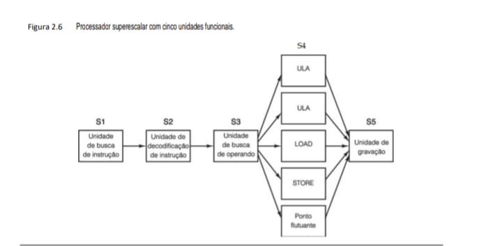

    Mapeamento Técnico para o seu Repositório

    Arquitetura              Vantagem para o seu IDS                    Camada de Hardware

    Multi-core (1.12)        Permite que o motor do seu IDS e           Nível 1: Microarquitetura.
                             o log de rede rodem em núcleos isolados.

    SoC (1.14)	             Baixa latência no acesso a periféricos 	Nível 0: Lógico Digital.
                             (NAND/USB) para backups automatizados.

    Superescalar (2.6)       Executa múltiplas comparações de pacotes  Nível 1: Pipeline de Execução.                        
                             por ciclo de clock.

A definição de “superescalar” evoluiu um pouco ao longo do tempo. Agora, ela é usada para descrever processadores que emitem múltiplas instruções – frequentemente, quatro ou seis – em um único ciclo de clock. Claro que uma CPU superescalar deve ter várias unidades funcionais para passar todas essas instruções. Uma vez que, em geral, os processadores superescalares têm um só pipeline, tendem a ser parecidos com os da Figura 2.6.

Usando essa definição, o 6600 não era tecnicamente um computador superescalar, pois emitia apenas uma instrução por ciclo. Todavia, o efeito era quase o mesmo: instruções eram terminadas em uma taxa muito mais alta do que podiam ser executadas. A diferença conceitual entre uma CPU com um clock de 100 ns que executa uma instrução a cada ciclo para um grupo de unidades funcionais e uma CPU com um clock de 400 ns que executa quatro instruções por ciclo para o mesmo grupo de unidades funcionais é muito pequena. Em ambos os casos, a ideia fundamental é que a taxa final é muito mais alta do que a taxa de execução, sendo a carga de trabalho distribuída entre um conjunto de unidades funcionais.

Implícito à ideia de um processador superescalar é que o estágio S3 pode emitir instruções com rapidez muito maior do que o estágio S4 é capaz de executá-las. Se o estágio S3 executasse uma instrução a cada 10 ns e todas as unidades funcionais pudessem realizar seu trabalho em 10 ns, nunca mais do que uma unidade estaria ocupada ao mesmo tempo, o que negaria todo o raciocínio. Na verdade, grande parte das unidades funcionais no estágio 4 leva um tempo bem maior do que um ciclo de clock para executar, decerto as que acessam memória ou efetuam aritmética de ponto flutuante. Como pode ser visto na figura, é possível ter várias ULAs no estágio S4.

## 2.1.6 Paralelismo no nível do processador
A demanda por computadores cada vez mais rápidos parece ser insaciável. Astrônomos querem simular o que aconteceu no primeiro microssegundo após o Big Bang, economistas querem modelar a economia mundial e adolescentes querem se divertir com jogos multimídia em 3D com seus amigos virtuais pela Internet. Embora as CPUs estejam cada vez mais rápidas, haverá um momento em que elas terão problemas com a velocidade da luz, que provavelmente permanecerá a 20 cm/nanossegundo em fio de cobre ou fibra ótica, não importando o grau de inteligência dos engenheiros da Intel. Chips mais velozes também produzem mais calor, cuja dissipação é um
problema. De fato, a dificuldade para se livrar do calor produzido é o principal motivo pelo qual as velocidades de clock da CPU se estagnaram na última década.

Paralelismo no nível de instrução ajuda um pouco, mas pipelining e operação superescalar raramente rendem mais do que um fator de cinco ou dez. Para obter ganhos de 50, 100 ou mais, a única maneira é projetar computadores com várias CPUs; portanto, agora vamos ver como alguns deles são organizados.

**• Computadores paralelos**

Um número substancial de problemas em domínios de cálculo como ciências físicas, engenharia e gráficos de computador envolve laços e matrizes, ou então tem estrutura de alta regularidade. Muitas vezes, os mesmos cálculos são efetuados em muitos conjuntos diferentes de dados ao mesmo tempo. A regularidade e a estrutura desses programas os tornam alvos especialmente fáceis para aceleração por meio de execução paralela. Há dois métodos que têm sido usados para executar esses programas altamente regulares de modo rápido e eficaz: processadores SIMD e processadores vetoriais. Embora esses dois esquemas guardem notáveis semelhanças na maioria de seus aspectos, por ironia o primeiro deles é considerado um computador paralelo, enquanto o segundo é considerado
uma extensão de um processador único.

Computadores paralelos de dados encontraram muitas aplicações bem-sucedidas como consequência de sua notável eficiência. Eles são capazes de produzir poder de computação significativo com menos transistores do que os métodos alternativos. Gordon Moore (da lei de Moore) observou que o silício custa cerca de 1 bilhão de dólares por acre (4.047 m²). Assim, quanto mais poder de computação puder ser espremido desse acre de silício, mais dinheiro uma empresa de computador poderá obter vendendo silício. Os processadores paralelos de dados são um dos meios mais eficientes de espremer o desempenho do silício. Como todos os processadores estão rodando a mesma instrução, o sistema só precisa de um “cérebro” controlando o computador. Em consequência, o processador só precisa de um estágio de busca, um estágio de decodificação e um conjunto de lógica de controle. Essa é uma enorme economia no silício, que dá aos computadores paralelos uma grande vantagem sobre outros processadores, desde que o software que eles estejam rodando seja altamente regular, com bastante paralelismo.

Um processador SIMD (Single Instruction-stream Multiple Data-stream, ou fluxo único de instruções, fluxo múltiplo de dados) consiste em um grande número de processadores idênticos que efetuam a mesma sequên­cia de instruções sobre diferentes conjuntos de dados. O primeiro processador SIMD do mundo foi o ILLIAC IV da Universidade de Illinois (Bouknight et al., 1972). O projeto original do ILLIAC IV consistia em quatro quadrantes, cada um deles com uma grade quadrada de 8 × 8 elementos de processador/memória. Uma única unidade de controle por quadrante transmitia uma única instrução a todos os processadores, que era executada
no mesmo passo por todos eles, cada um usando seus próprios dados de sua própria memória. Por causa de um excesso de custo, somente um quadrante de 50 megaflops (milhões de operações de ponto flutuante por segundo) foi construído; se a construção da máquina inteira de 1 gigaflop tivesse sido concluída, ela teria duplicado a capacidade de computação do mundo inteiro.

As modernas unidades de processamento de gráficos (GPUs) contam bastante com o processamento SIMD para fornecer poder computacional maciço com poucos transistores. O processamento de gráficos foi apropriado para processadores SIMD porque a maioria dos algoritmos é altamente regular, com operações repetidas sobre pixels, vértices, texturas e arestas. A Figura 2.7 mostra o processador SIMD no núcleo da GPU Fermi da Nvidia. A GPU Fermi contém até 16 multiprocessadores de fluxo (com memória compartilhada – SM) SIMD, com cada multiprocessador contendo 32 processadores SIMD. A cada ciclo, o escalonador seleciona dois threads para executar no processador SIMD. A próxima instrução de cada thread é então executada em até 16 processadores SIMD, embora possivelmente menos se não houver paralelismo de dados suficiente. Se cada thread for capaz de realizar 16 operações por ciclo, um núcleo GPU Fermi totalmente carregado com 32 multiprocessadores realizará incríveis 512 operações por ciclo. Esse é um feito impressionante, considerando que uma CPU quad-core de uso geral com tamanho semelhante lutaria para conseguir 1/32 desse processamento.

**• Figura 2.7 O núcleo SIMD da unidade de processamento de gráficos Fermi.**

    +-----------------------------------------------------------+
    |                  Cache de Instruções                      |
    +-----------------------------+-----------------------------+
    |   Despacho de Instruções    |    Despacho de Instruções   |
    +-----------------------------+-----------------------------+
    |                  Arquivo de Registradores                 |
    +-----------------------------------------------------------+
    |                                                           |
    | [N][N][N][N]   [N][N][N][N] | [N][N][N][N]   [N][N][N][N] | <-- Blocos de Núcleos
    | [N][N][N][N]   [N][N][N][N] | [N][N][N][N]   [N][N][N][N] | (Total: centenas de [N])
    | [N][N][N][N]   [N][N][N][N] | [N][N][N][N]   [N][N][N][N] |
    | [N][N][N][N]   [N][N][N][N] | [N][N][N][N]   [N][N][N][N] |
    |                                                           |
    |           +-----+--------> [ DETALHE DE 'N' ] <------+----+
    |           |                                          |
    |           |   [Operando A]        [Operando B]       |
    |           |       /     \         /      \           |
    |           |   +--v---+   +-------v--+     +--v---+   |
    |           |   |Unid. |   |   ULA    |     |Unid. |   |
    |           |   | Ponto|---| (Operaçõ.|     |  de  |   |
    |           |   | Flutu|   | Inteiras)|-----| Busca|   |
    |           |   | ante |   |          |     | Oper.|   |
    |           |   +--+---+   +-------+--+     +------+   |
    |           |       \             /                    |
    |           |        v           v                     |
    |           |   [Registrador de Resultado]             |
    |                                                           |
    +-----------------------------------------------------------+
    |                    Rede de Interconexão                   |
    +-----------------------------------------------------------+
    |                     Memória Compartilhada                 |
    +-----------------------------------------------------------+

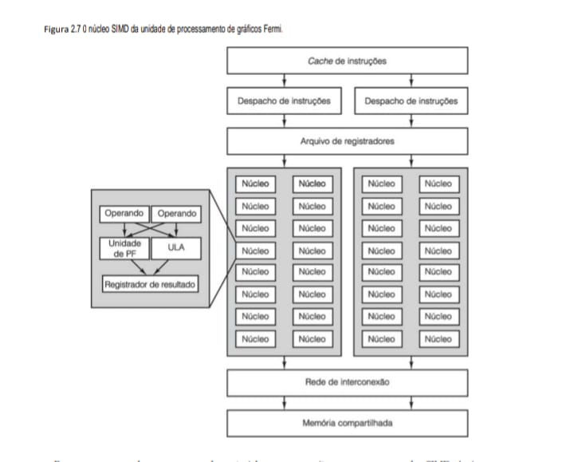

    Mapeamento Técnico para seu Repositório

    Processamento                                       Armazenamento

    Arquitetura Massivamente                            ParalelaAcesso à Memória (SIMD)

    O "Despacho de Instruções" envia a mesma ordem      Todos os núcleos [N] acessam a "Memória Compartilhada" de forma coordenada, (ex: SUB) para todos os núcleos [N] de um bloco     minimizando conflitos de barramento (visto na Figura 2.1).
    simultaneamente.

                                                        BARRAMENTO INTERNO

    Unidades Especializadas em 'N'	                    Impacto no seu Código (C/C++)

    Cada núcleo simples [N] tem sua própria ULA e       Ao programar em CUDA, você "desenrola" seu código para que ele se encaixe Unidade de Ponto Flutuante, mas não tem a complexa  nessas centenas de unidades funcionais, acelerando cálculos matemáticos no Unidade de Controle da CPU.                         seu Projeto IDS.

### Insight para o seu Projetos de TI
A Figura 2.7 é o "divisor de águas" da computação moderna. Ela explica como as GPUs evoluíram de renderizadores de polígonos para processadores genéricos de alta performance (GPGPU):

 - O seu IdeaPad: O seu notebook não usa apenas a CPU da Figura 1.12. Para tarefas pesadas, como o treinamento de modelos de IA ou a renderização 3D, ele delega o trabalho para a GPU NVIDIA que segue essa arquitetura massivamente paralela.

 - No seu Projeto IDS: Imagine monitorar 100 mil pacotes de rede por segundo. Em uma CPU, você os processa em lotes pequenos. Em uma GPU com arquitetura SIMD, você pode rodar a mesma regra de comparação em 10 mil pacotes simultaneamente, atingindo vazões Petabyte de dados (visto na Figura 1.16), essenciais para análises em tempo real.

Para um programador, um processador vetorial se parece muito com um processador SIMD. Assim como um processador SIMD, ele é muito eficiente para executar uma sequência de operações em pares de elementos de dados. Porém, diferente de um processador SIMD, todas as operações de adição são efetuadas em uma única unidade funcional, de alto grau de paralelismo. A Cray Research, empresa fundada por Seymour Cray, produziu muitos processadores vetoriais, começando com o Cray-1 em 1974 e continuando até os modelos atuais.

Processadores SIMD, bem como processadores vetoriais, trabalham com matrizes de dados. Ambos executam instruções únicas que, por exemplo, somam os elementos aos pares para dois vetores. Porém, enquanto o processador SIMD faz isso com tantos somadores quantos forem os elementos do vetor, o processador vetorial tem o conceito de um registrador vetorial, que consiste em um conjunto de registradores convencionais que podem ser carregados com base na memória em uma única instrução que, na verdade, os carrega serialmente com base na memória. Então, uma instrução de adição vetorial efetua as adições a partir dos elementos de dois desses vetores, alimentando-os em um somador com paralelismo (pipelined) com base em dois registradores vetoriais. O resultado do somador é outro vetor, que pode ser armazenado em um registrador vetorial ou usado diretamente como um operando para outra operação vetorial. As instruções SSE (Streaming SIMD Extension) disponíveis na arquitetura Intel Core utilizam esse modelo de execução para agilizar o cálculo altamente regular, como multimídia e software científico. Nesse aspecto particular, o ILLIAC IV é um dos ancestrais da arquitetura Intel Core.

**• Multiprocessadores**

Os elementos de processamento em um processador SIMD não são CPUs independentes, uma vez que há uma só unidade de controle compartilhada por todos eles. Nosso primeiro sistema paralelo com CPUs totalmente desenvolvidas é o multiprocessador, um sistema com mais de uma CPU que compartilha uma memória em comum, como um grupo de pessoas que, dentro de uma sala de aula, compartilha um quadro em comum. Uma vez que cada CPU pode ler ou escrever em qualquer parte da memória, elas devem se coordenar (em software)
para evitar que uma atrapalhe a outra. Quando duas ou mais CPUs têm a capacidade de interagir de perto, como é o caso dos multiprocessadores, diz-se que elas são fortemente acopladas.

Há vários esquemas de implementação possíveis. O mais simples é um barramento único com várias CPUs e uma memória, todas ligadas nele. Um diagrama desse tipo de multiprocessador de barramento único é mostrado na Figura 2.8(a).

**• Figura 2.8 (a) Multiprocessador de barramento único. (b) Multicomputador com memórias locais.**

Figura 2.8: Comparação de Sistemas Paralelos (

(a) Multiprocessador de barramento único

      [CPU]   [CPU]   [CPU]   [CPU]      [ MEMÓRIA ]
        |       |       |       |       [ COMPART. ]
    +---+-------+-------+-------+------------+------+
    |                BARRAMENTO GERAL               |
    +-----------------------------------------------+

(b) Multicomputador com memórias locais

    [MEM.L] [MEM.L] [MEM.L] [MEM.L]
        |       |       |       |
    [CPU ]  [CPU ]  [CPU ]  [CPU ]      [ MEMÓRIA ]
        |       |       |       |       [ COMPART. ]
   +----+-------+-------+-------+------------+------+
    |                BARRAMENTO GERAL               |
    +-----------------------------------------------+
    *(Legenda: MEM.L = Memória Local)*

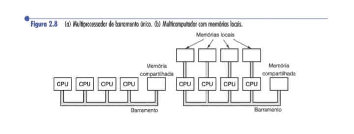

### Insight para seus Projetos de TI
A distinção vista na Figura 2.8 explica como o seu notebook funciona hoje:

 - O seu Lenovo IdeaPad é um Multiprocessador (a) em miniatura. As diferentes CPUs (os múltiplos núcleos que vimos na Figura 1.12) compartilham a mesma RAM física através do barramento interno da placa-mãe (Figura 1.10).

 - Mas quando você roda um cluster distribuído ou containers no Ubuntu, você está operando em um Multicomputador (b) virtual, onde cada container ou nó do cluster tem seu próprio sistema operacional (Nível 3) e memória local, mas compartilha a rede (barramento geral).

Não é preciso muita imaginação para perceber que, com um grande número de processadores velozes tentando acessar a memória pelo mesmo barramento, surgirão conflitos. Projetistas de multiprocessadores apresentaram vários esquemas para reduzir essa disputa e melhorar o desempenho. Um desses esquemas, mostrado na Figura 2.8(b), dá a cada processador um pouco de memória local só dele, que não é acessível para os outros. Essa memória pode ser usada para o código de programa e para os itens de dados que não precisam ser compartilhados. O acesso a essa memória privada não usa o barramento principal, o que reduz muito o tráfego no barramento.
Outros esquemas (por exemplo, caching – veja mais adiante) também são possíveis.

Multiprocessadores têm a vantagem sobre outros tipos de computadores paralelos: é fácil trabalhar com o modelo de programação de uma única memória compartilhada. Por exemplo, imagine um programa que procura células cancerosas na foto de algum tecido, tirada por um microscópio. A fotografia digitalizada poderia ser mantida na memória em comum, sendo cada processador designado para caçar essas células em alguma região. Uma vez que cada processador tem acesso a toda a memória, estudar a célula que começa em sua região designada mas atravessa a fronteira da próxima região não é problema.

**• Multicomputadores**

Embora seja um tanto fácil construir multiprocessadores com um número modesto de processadores (≤ 256), construir grandes é surpreendentemente difícil. A dificuldade está em conectar todos os processadores à memória. Para evitar esses problemas, muitos projetistas simplesmente abandonaram a ideia de ter uma memória compartilhada e passaram a construir sistemas que consistissem em grandes números de computadores interconectados, cada um com sua própria memória privada, mas nenhuma em comum. Esses sistemas
são denominados multicomputadores. Costuma-se dizer que as CPUs de um multicomputador são fracamente acopladas, para contrastá-las com as CPUs fortemente acopladas de um multiprocessador.

As CPUs de um multicomputador se comunicam enviando mensagens umas às outras, mais ou menos como enviar e-mails, porém, com muito mais rapidez. Em sistemas grandes, não é prático ter cada computador ligado a todos os outros, portanto, são usadas topologias como malhas 2D e 3D, árvores e anéis. O resultado é que mensagens de um computador para outro muitas vezes passam por um ou mais computadores ou comutadores (chaves) intermediários para ir da fonte até o destino. Não obstante, podem-se conseguir tempos de transmissão de mensagem da ordem de alguns microssegundos sem muita dificuldade. Multicomputadores com mais de 250 mil CPUs, como o Blue Gene/P da IBM, já foram construídos.

Uma vez que multiprocessadores são mais fáceis de programar e multicomputadores são mais fáceis de construir, há muita pesquisa sobre projetos de sistemas híbridos que combinam as boas propriedades de cada um. Esses computadores tentam apresentar a ilusão de memória compartilhada sem bancar a despesa de realmente construí-la. Falaremos mais de multiprocessadores e multicomputadores no Capítulo 8.

## 2.2 Memória primária
A memória é a parte do computador onde são armazenados programas e dados. Alguns cientistas da computação (em especial, os britânicos) usam o termo armazém ou armazenagem em vez de memória, se bem que o termo “armazenagem” está sendo usado cada vez mais para a armazenagem em disco. Sem uma memória da qual os processadores possam ler e na qual possam gravar, ou escrever, informações, não haveria computadores digitais com programas armazenados.

## 2.2.1 Bits
A unidade básica de memória é dígito binário, denominado bit. Um bit pode conter um 0 ou um 1. É a unidade mais simples possível. (Um dispositivo capaz de armazenar somente zeros dificilmente poderia formar a base de um sistema de memória; são necessários pelo menos dois valores.)

As pessoas costumam dizer que computadores usam aritmética binária porque ela é “eficiente”. O que elas querem dizer, embora quase nunca percebam, é que informações digitais podem ser armazenadas distinguindo entre valores diferentes de alguma quantidade física contínua, tal como tensão ou corrente elétrica. Quanto maior for o número de valores que precisam ser distinguidos, menores serão as separações entre valores adjacentes, e menos confiável será a memória. O sistema numérico binário requer a distinção entre apenas dois valores. Por conseguinte, é o método mais confiável para codificar informações digitais. Se você não estiver familiarizado com números binários, consulte o Apêndice A.

Há empresas que anunciam que seus computadores têm aritmética decimal, bem como binária, como é o caso da IBM e seus grandes mainframes. Essa façanha é realizada usando-se 4 bits para armazenar um dígito decimal que utiliza um código denominado BCD (Binary Coded Decimal – decimal codificado em binário). Quatro bits oferecem 16 combinações, usadas para os 10 dígitos de 0 a 9, mas seis combinações não são usadas. O número 1.944 é mostrado a seguir codificado em formato decimal e em formato binário puro, usando 16 bits em cada exemplo:

    decimal: 0001 1001 0100 0100        binário: 0000011110011000

Dezesseis bits no formato decimal podem armazenar os números de 0 a 9999, dando somente 10 mil combinações, ao passo que um número binário puro de 16 bits pode armazenar 65.536 combinações diferentes. Por essa razão, as pessoas dizem que o binário é mais eficiente.

No entanto, considere o que aconteceria se algum jovem e brilhante engenheiro elétrico inventasse um dispositivo eletrônico de alta confiabilidade que pudesse armazenar diretamente os dígitos de 0 a 9 dividindo a região de 0 a 10 volts em 10 intervalos. Quatro desses dispositivos poderiam armazenar qualquer número decimal de 0 a 9999. Quatro desses dispositivos dariam 10 mil combinações. Eles também poderiam ser usados para armazenar números binários usando somente 0 e 1, caso em que quatro deles só poderiam armazenar 16 combinações. Com tais dispositivos, o sistema decimal é obviamente mais eficiente.

## 2.2.2 Endereços de memória
Memórias consistem em uma quantidade de células (ou locais), cada uma das quais podendo armazenar uma informação. Cada célula tem um número, denominado seu endereço, pelo qual os programas podem se referir a ela. Se a memória tiver n células, elas terão endereços de 0 a n – 1. Todas as células em uma memória contêm o mesmo número de bits. Se uma célula consistir em k bits, ela pode conter quaisquer das 2k diferentes combinações de bits. A Figura 2.9 mostra três organizações diferentes para uma memória de 96 bits. Note que as células adjacentes têm endereços consecutivos (por definição).

**• Figura 2.9 Três maneiras de organizar uma memória de 96 bits.**

Três formas de estruturar a mesma quantidade de bits em diferentes larguras de célula.

    (a) 12 x 8 bits          (b) 8 x 12 bits          (c) 6 x 16 bits
        
    0 [][][][][][][][]       0 [][][][][][][][][][][][]   0 [][][][][][][][][][][][][][][][]
    1 [][][][][][][][]       1 [][][][][][][][][][][][]   1 [][][][][][][][][][][][][][][][]
    2 [][][][][][][][]       2 [][][][][][][][][][][][]   2 [][][][][][][][][][][][][][][][]
    3 [][][][][][][][]       3 [][][][][][][][][][][][]   3 [][][][][][][][][][][][][][][][]
    .        ...             4 [][][][][][][][][][][][]   4 [][][][][][][][][][][][][][][][]
    11 [][][][][][][][]       .        ...                5 [][][][][][][][][][][][][][][][]
                             7 [][][][][][][][][][][][]

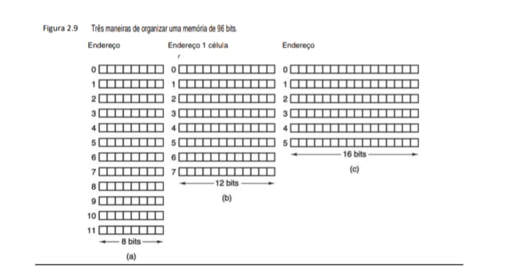

Computadores que usam o sistema de números binários (incluindo notação octal ou hexadecimal para números binários) expressam endereços de memória como números binários. Se um endereço tiver m bits, o número máximo de células endereçáveis é 2m. Por exemplo, um endereço usado para referenciar a memória da Figura 2.9(a) precisa de no mínimo 4 bits para expressar todos os números de 0 a 11. Contudo, um endereço de 3 bits é suficiente para as figuras 2.9(b) e (c). O número de bits no endereço determina o número máximo de células diretamente endereçáveis na memória e é independente do número de bits por célula. Uma memória com 212 células de 8 bits cada e uma memória com 212 células de 64 bits cada precisam de endereços de 12 bits. A Figura 2.10 mostra o número de bits por célula para alguns computadores que já foram vendidos comer-
cialmente.

A significância da célula é que ela é a menor unidade endereçável. Há poucos anos, praticamente todos os fabricantes de computadores padronizaram células de 8 bits, que é denominada um byte. O termo octeto também é usado. Bytes são agrupados em palavras. Um computador com uma palavra de 32 bits tem 4 bytes/palavra, enquanto um computador com uma palavra de 64 bits tem 8 bytes/palavra. A significância de uma palavra é que grande parte das instruções efetua operações com palavras inteiras, por exemplo, somando duas palavras. Assim, uma máquina de 32 bits terá registradores de 32 bits e instruções para manipular palavras de 32 bits, enquanto uma máquina de 64 bits terá registradores de 64 bits e instruções para movimentar, somar, subtrair e, em geral, manipular palavras de 64 bits.

**• Figura 2.10 Número de bits por célula para alguns computadores comerciais historicamente interessantes.**
    
    +----------------------+--------------+--------------------------------------------+
    | Computador           | Bits/Célula  | Notas de Arquitetura                       |
    +----------------------+--------------+--------------------------------------------+
    | Burroughs B1700      |      1       | Endereçamento ao nível de bit.             |
    | IBM PC               |      8       | Padronização do Byte (padrão atual).       |
    | DEC PDP-8            |     12       | Minicomputadores laboratoriais antigos.    |
    | IBM 1130             |     16       | Computação científica e engenharia.        |
    | DEC PDP-15           |     18       | Utilizado em sistemas de tempo real.       |
    | XDS 940              |     24       | Primeiros sistemas de tempo compartilhado. |
    | Electrologica X8     |     27       | Arquitetura europeia distinta.             |
    | XDS Sigma 9          |     32       | Base para a arquitetura de 32 bits.        |
    | Honeywell 6180       |     36       | Base do Multics (avô do Unix/Linux).       |
    | CDC 3600             |     48       | Supercomputador: precisão numérica.        |
    | CDC Cyber            |     60       | Extrema performance para a época.          |
    +----------------------+--------------+--------------------------------------------+

### Por que isso é relevante para o seu projeto?
Entender que o IBM PC consolidou os 8 bits como padrão explica por que, no seu código em C e Assembly, o endereçamento de memória (Figura 2.9) sempre salta em bytes:

 - Eficiência: No seu IDS, ler 8 bits de cada vez permite processar cabeçalhos de protocolos de rede de forma muito mais rápida do que em máquinas de 1 bit (Burroughs) ou 60 bits (CDC Cyber).

 - Compatibilidade: O seu sistema Ubuntu 24.04 e o hardware Lenovo são descendentes diretos da padronização de 8 bits mostrada nesta tabela.

### Por que isso importa para o seu eBook?
Ao escrever sobre Estruturas de Dados no seu eBook, entender essa tabela explica por que o tipo char em C quase sempre tem 8 bits:

 - História: A indústria convergiu para o modelo do IBM PC (8 bits) por ser o equilíbrio ideal entre representar o alfabeto e eficiência de hardware.

 - Impacto no seu IDS: Se você estivesse rodando seu sistema de detecção em um Honeywell 6180, um ponteiro de memória não saltaria de 1 em 1 byte, mas de 36 em 36 bits!
    
## 2.2.3 Ordenação de bytes
Os bytes em uma palavra podem ser numerados da esquerda para a direita ou da direita para a esquerda. A princípio, essa opção pode parecer sem importância, mas, como veremos em breve, ela tem consideráveis implicações. A Figura 2.11(a) retrata parte da memória de um computador de 32 bits cujos bytes são numerados da esquerda para a direita, tal como o SPARC ou os grandes mainframes da IBM. A Figura 2.11(b) dá uma representação análoga de um computador de 32 bits que usa uma numeração da direita para a esquerda, como a família Intel. O primeiro sistema, no qual a numeração começa na ordem “grande”, isto é, na ordem alta, é denominado
computador big endian, ao contrário do little endian da Figura 2.11(b). Esses termos se devem a Jonathan Swift, cujo livro As viagens de Gulliver satirizava os políticos que discutiam por que uns eram a favor de quebrar ovos no lado grande (big end) e outros achavam que deviam ser quebrados no lado pequeno (little end). O termo foi empregado pela primeira vez na arquitetura de computadores em um interessante artigo de Cohen (1981).

**• Figura 2.11 (a) Memória big endian. (b) Memória little endian.**

Crucial para entender como palavras de 32 bits são distribuídas na memória endereçada por byte. No Big Endian, o byte mais significativo fica no menor endereço; no Little Endian (padrão do seu Lenovo/Intel), ocorre o oposto.

    (a) BIG ENDIAN                  (b) LITTLE ENDIAN
        
        Endereço de Byte                Endereço de Byte
         0   1   2   3                   3   2   1   0
        +---+---+---+---+               +---+---+---+---+
    0   | 0 | 1 | 2 | 3 |            0  | 3 | 2 | 1 | 0 |
        +---+---+---+---+               +---+---+---+---+
    4   | 4 | 5 | 6 | 7 |            4  | 7 | 6 | 5 | 4 |
        +---+---+---+---+               +---+---+---+---+
    8   | 8 | 9 |10 |11 |            8  |11 |10 | 9 | 8 |
        +---+---+---+---+               +---+---+---+---+
    12  |12 |13 |14 |15 |           12  |15 |14 |13 |12 |
        +---+---+---+---+               +---+---+---+---+
    <--Palavra de 32 bits-->        <--Palavra de 32 bits--> 

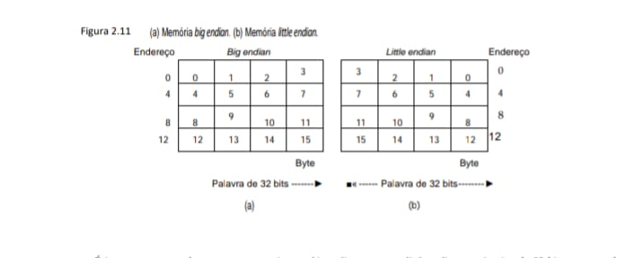

    Resumo para seu Repositório

    Conceito                      Vantagem Técnica                  Aplicação no seu IDS

    Arquitetura (2.1)             Modularidade via Barramento.      Facilita a adição de interfaces de rede rápidas.

    Pipeline (2.4/2.5)            Paralelismo de Instrução.         Aumenta a vazão de análise de pacotes por segundo.

    Endianness (2.11)             Compatibilidade de Protocolo.     Vital para decodificar corretamente cabeçalhos 
                                                                    TCP/IP (Big Endian) no seu PC (Little Endian).
                                                                    
É importante entender que, tanto no sistema big endian como no little endian, um inteiro de 32 bits com o valor numérico de, digamos, 6 é representado pelos bits 110 nos três bits mais à direita (baixa ordem) de uma palavra e os zeros nos 29 bits da esquerda. No esquema big endian, os bits 110 estão no byte 3 (ou 7, ou 11 etc.), enquanto no esquema little endian eles estão no byte 0 (ou 4, ou 8 etc.). Em ambos os casos, a palavra que contém esses inteiros tem endereço 0.

Se os computadores somente armazenassem inteiros, não haveria nenhum problema. Contudo, muitas aplicações requerem uma mistura de inteiros, cadeias de caracteres e outros tipos de dados. Considere, por exemplo, um simples registro de pessoal composto de uma cadeia (nome do empregado) e dois inteiros (idade e número do departamento). A cadeia é encerrada com 1 ou mais bytes de valor 0 para completar uma palavra. Para o registro “Jim Smith, idade 21, departamento 260 (1 × 256 + 4 = 260)”, a representação big endian é mostrada na Figura 2.12(a) e a representação little endian é mostrada na Figura 2.12(b).

**• Figura 2.12 (a) Registro de pessoal para uma máquina big endian. (b) O mesmo registro para uma máquina little endian. (c) Resultado da transferência do registro de uma máquina big endian para uma little endian. (d) Resultado da troca de bytes (c).**

A Figura 2.12. Esta figura é vital para o seu "Projeto IDS", pois demonstra o que acontece quando dados estruturados (como nomes e números) são transferidos entre sistemas com arquiteturas de bytes opostas.

Este exemplo usa um registro de pessoal com um nome ("JIM SMITH") e um número de matrícula (21, 12, 00, 00).

    (a) Máquina Big Endian           (b) Máquina Little Endian
        0   1   2   3                    3   2   1   0
        +---+---+---+---+                +---+---+---+---+
    0   | J | I | M |   |             0  |   | M | I | J |  (Nome)
        +---+---+---+---+                +---+---+---+---+
    4   | S | M | I | T |             4  | T | I | M | S |  (Nome)
        +---+---+---+---+                +---+---+---+---+
    8   | H |   | 0 | 0 |             8  | 0 | 0 |   | H |  (H = matrícula)
        +---+---+---+---+                +---+---+---+---+
    12  | 21| 12| 0 | 0 |            12  | 0 | 0 | 12| 21|  (ID numérico)
        +---+---+---+---+                +---+---+---+---+

        (c) Após Transferência           (d) Após Troca de Bytes (Swap)
             (Sem correção)                   (Resultado desejado)
        3   2   1   0                    3   2   1   0
        +---+---+---+---+                +---+---+---+---+
    0   | J | I | M |   |             0  |   | M | I | J |  <-- Nome "quebra"
        +---+---+---+---+                +---+---+---+---+
    4   | S | M | I | T |             4  | T | I | M | S |  <-- Nome "quebra"
        +---+---+---+---+                +---+---+---+---+
    8   | H |   | 0 | 0 |             8  | 0 | 0 |   | H |  <-- Numérico OK!
        +---+---+---+---+                +---+---+---+---+
    12  | 21| 12| 0 | 0 |            12  | 0 | 0 | 12| 21|  <-- Numérico OK!
        +---+---+---+---+                +---+---+---+---+

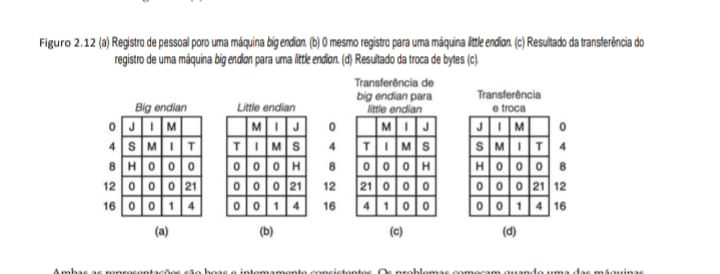

A a Figura 2.12 ilustra o "pesadelo" dos desenvolvedores de sistemas de rede. Se você apenas trocar os bytes para consertar o número da matrícula (item d), você acaba invertendo a ordem das letras no nome (que já estavam certas por serem lidas individualmente).

Isso reforça por que, no seu eBook, é importante destacar que strings e inteiros exigem tratamentos diferentes na memória.

Ambas as representações são boas e internamente consistentes. Os problemas começam quando uma das máquinas tenta enviar um registro à outra por uma rede. Vamos supor que a big endian envie o registro à little endian um byte por vez, começando com o byte 0 e terminando com o byte 19. (Vamos ser otimistas e supor que os bits dos bytes não sejam invertidos pela transmissão porque, assim como está, já temos problemas suficientes.) Portanto, o byte 0 da big endian entra na memória da little endian no byte 0 e assim por diante, como mostra a Figura 2.12(c).

Quando a little endian tenta imprimir o nome, ela funciona bem, mas a idade sai como 21 × 224 e o departamento também fica errado. Essa situação surge porque a transmissão inverteu a ordem dos caracteres em uma palavra, como deveria, mas também inverteu os bytes de um inteiro, o que não deveria.

Uma solução óbvia é fazer o software inverter os bytes de uma palavra após tê-la copiado. Isso leva à Figura 2.12(d), que faz os dois inteiros se saírem bem, mas transforma a cadeia em “MIJTIMS” e deixa o “H” perdido no meio do nada. Essa inversão da cadeia ocorre porque, ao ler a cadeia, o computador lê primeiro o byte 0 (um espaço), em seguida o byte 1 (M), e assim por diante.

Não há nenhuma solução simples. Um modo que funciona – porém, ineficiente – é incluir um cabeçalho na frente de cada item de dado, que informa qual tipo de dado vem a seguir (cadeia, inteiro ou outro) e qual é seu comprimento. Isso permite que o destinatário efetue apenas as conversões necessárias. De qualquer modo, é preciso deixar claro que a falta de um padrão para a ordenação de bytes é um grande aborrecimento quando há troca de dados entre máquinas diferentes.

## 2.2.4 Códigos de correção de erro
Memórias de computador podem cometer erros de vez em quando devido a picos de tensão na linha elétrica, raios cósmicos ou outras causas. Para se resguardar contra esses erros, algumas memórias usam códigos de detecção de erros ou códigos de correção de erros. Quando são usados, bits extras são adicionados a cada palavra de memória de modo especial. Quando uma palavra é lida na memória, os bits extras são verificados para ver se ocorreu um erro.

Para entender como os erros podem ser manipulados, é preciso ver de perto o que é, na realidade, um erro. Suponha que uma palavra de memória consista em m bits de dados, aos quais serão adicionados r bits redundantes, ou de verificação. Seja o comprimento total n (isto é, n = m + r). Uma unidade de n bits que contém m dados e r bits de verificação costuma ser denominada uma palavra de código de n bits.

Dadas duas palavras de código quaisquer, por exemplo, 10001001 e 10110001, é possível determinar quantos bits correspondentes são diferentes. Nesse caso, 3 bits são diferentes. Para saber quantos bits são diferentes, basta calcular o EXCLUSIVE OR (OU EXCLUSIVO) booleano bit por bit das duas palavras de código e contar o número de bits 1 no resultado. O número de posições de bit nas quais as duas palavras de código diferem é denominado distância de Hamming (Hamming, 1950). Sua principal significância é que, se duas palavras de código estiverem separadas por uma distância de Hamming d, será preciso d erros de único bit para converter uma na outra. Por exemplo, as palavras de código 11110001 e 00110000 estão a uma distância de Hamming 3 porque é preciso 3 erros de único bit para converter uma na outra.

Com uma palavra de memória de m bits, todos os 2m padrões de bits são válidos, mas, devido ao modo como os bits de verificação são computados, somente 2m das 2n palavras de código são válidas. Se uma leitura de memória aparecer com uma palavra de código inválida, o computador sabe que ocorreu um erro de memória. Dado o algoritmo para calcular os bits de verificação, é possível montar uma lista completa das palavras de código válidas e, por meio dela, achar as duas palavras de código cuja distância de Hamming seja mínima. Essa distância é a distância de Hamming do código completo.

As propriedades de detecção de erro e correção de erro de um código dependem de sua distância de Hamming. Para detectar d erros de único bit, você precisa de um código de distância d + 1 porque, com tal código, não existe nenhum modo que permita que d erros de único bit mudem uma palavra de código válida para outra. De modo semelhante, para corrigir erros de único bit, você precisa de um código de distância 2d + 1 porque, desse modo, as palavras de código válidas estão tão distantes uma da outra que, mesmo que d mude, a palavra de código original ainda estará mais perto do que qualquer outra, portanto, ela pode ser unicamente
determinada.

Como um exemplo simples de um código de detecção de erro, considere um código em que um único bit de paridade é anexado aos dados. O bit de paridade é escolhido de modo que o número de bits 1 na palavra de código seja par (ou ímpar). Tal código tem uma distância 2, uma vez que qualquer erro de bit único produz uma palavra de código com paridade errada. Ou seja, ele precisa de dois erros de único bit para ir de uma palavra de código válida até outra palavra de código válida. Ele pode ser usado para detectar erros isolados. Sempre que uma palavra que contenha paridade errada for lida da memória, uma condição de erro é sinalizada. O programa não pode continuar, mas, ao menos, nenhum resultado errado é calculado.

Como um exemplo simples de um código de correção de erros, considere um código que tenha apenas quatro
palavras de código válidas:

    0000000000        0000011111          1111100000     e     1111111111

Esse código tem uma distância 5, o que significa que pode corrigir erros duplos. Se a palavra de código 0000000111 chegar, o destinatário sabe que a original deve ter sido 0000011111 (se não houver mais do que um duplo erro). Contudo, se um erro triplo mudar 0000000000 para 0000000111, o erro não pode ser corrigido.

Imagine que queremos projetar um código com m bits de dados e r bits de verificação que permitirá que todos os erros de bits únicos sejam corrigidos. Cada uma das 2m palavras de memória válidas tem n palavras de código inválidas a uma distância 1. Essas palavras de código inválidas são formadas sistematicamente invertendo cada um dos n bits na palavra de código de n bits formada com base nela. Assim, cada uma das 2m palavras de memória válidas requer n + 1 padrões de bits dedicados a ela (para os n possíveis erros e padrão de correção). Uma vez que o número total de padrões de bits é 2n, temos de ter (n + 1)2m ≤ 2n. Usando n = m + r, esse requisito se torna (m + r + 1) ≤ 2r. Dado m, isso impõe um limite inferior ao número de bits de verificação necessários para corrigir erros únicos. A Figura 2.13 mostra o número de bits de verificação requeridos por vários tamanhos de
palavras de memória.

**• Figura 2.13 Número de bits de verificação para um código que pode corrigir um erro único.**

Essa tabela (Figura 2.13) é fundamental para o seu eBook, pois ela quantifica o custo de implementação de códigos de correção de erro (como o de Hamming) em diferentes tamanhos de palavra.

Para um sistema de alta performance como o seu "Projeto IDS", entender o acréscimo percentual é vital para equilibrar segurança de dados e largura de banda.

    +---------+-------------+---------+------------+
    | Tamanho |   Bits de   | Tamanho | Acréscimo  |
    | Palavra | Verificação |  Total  | Percentual |
    +---------+-------------+---------+------------+
    |    8    |      4      |    12   |     50%    |
    |   16    |      5      |    21   |     31%    |
    |   32    |      6      |    38   |     19%    |
    |   64    |      7      |    71   |     11%    |
    |  128    |      8      |   136   |      6%    |
    |  256    |      9      |   265   |      4%    |
    |  512    |     10      |   522   |      2%    |
    +---------+-------------+---------+------------+

    **Mapeamento Técnico**

    Processamento	                                                  Armazenamento

    Cálculo de Síndrome	                                              Redundância de Dados

    A ULA (Figura 2.2) precisa de ciclos extras para calcular os	  Palavras maiores (512 bits) são mais eficientes, pois a  bits de paridade antes de processar a instrução.                  a redutâncua cai para apenas 2%.

                                                                      BARRAMENTO INTERNO

    Confiabilidade no Barramento	                                  Impacto no seu Código C

    Evita que ruídos elétricos no barramento (Figura 2.1) alterem um  Ao lidar com structs grandes no seu IDS, você aproveita bit de um pacote de rede crítico.                                     melhor o hardware se a palavra for larga (E. AVX-512 no seu i                                                                 i7).

### Insight: "A Economia de Escala Digital"
Ao documentar isso no seu eBook, note que quanto maior a palavra, menor o "imposto" de bits que você paga pela segurança:

 - Palavras Curtas (8 bits): Como visto no IBM PC (Figura 2.10), você perde metade da capacidade (50%) apenas para corrigir erros.

 - Palavras Longas (512 bits): Em servidores modernos (como os que você gerencia na OCI), o custo é quase desprezível, permitindo uma integridade de dados massiva sem sacrificar o armazenamento.

Esse limite inferior teórico pode ser conseguido usando um método criado por Richard Hamming (1950). Antes de analisar o algoritmo de Hamming, vamos examinar uma representação gráfica simples que ilustra com clareza a ideia de um código de correção de erros para palavras de 4 bits. O diagrama de Venn da Figura 2.14(a) contém três círculos, A, B e C, que juntos formam sete regiões. Como exemplo, vamos codificar a palavra de memória de 4 bits 1100 nas regiões AB, ABC, AC e BC, 1 bit por região (em ordem alfabética). Essa codificação é mostrada na Figura 2.14(a).

**Figura 2.14 (a) Codificação de 1100. (b) Paridade par adicionada. (c) Erro em AC.**

**Figura 2.14: Codificação de Erros**
Visualização de como bits de paridade são usados para detectar e corrigir erros em uma sequência de dados.

    ((a) Codificação              (b) Paridade                (c) Erro em C
          de 1100                      Adicionada                  (Detection)
    
          /---\                        /---\                        /---\
         /  0  \                      /  0  \                      /  0  \
        |--- ---|                    |--- ---|                    |--- ---|
     /--| 1 | 0 |--\              /--| 1 | 0 |--\              /--| 1 | 0 |--\
    /  1 \ --- / 0  \            /  1 \ --- / 1  \            /  1 \ --- / 1  \
    \    /     \    /            \    /     \    /            \    /   X \    / <-- ERRO!
     \--/       \--/              \--/       \--/              \--/       \--/
       B         C                  B         C                  B         C
                                                          (Soma de paridade em C = ÍMPAR)
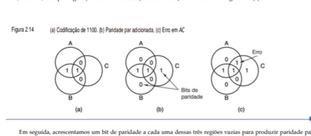

Em seguida, acrescentamos um bit de paridade a cada uma dessas três regiões vazias para produzir paridade par, como ilustrado na Figura 2.14(b). Por definição, agora a soma dos bits em cada um dos três círculos, A, B e C, é um número par. No círculo A, temos os quatro números 0, 0, 1 e 1, cuja soma total é 2, um número par. No círculo B, os números são 1, 1, 0 e 0, cuja soma total é 2, um número par. Por fim, no círculo C, temos a mesma coisa. Nesse exemplo, por acaso todos os círculos são iguais, mas as somas de 0 e 4 também são possíveis em outros exemplos. Essa figura corresponde a uma palavra de código com 4 bits de dados e 3 bits de paridade.

Agora, suponha que algo de ruim aconteça com o bit na região AC e ele mude de 0 para 1, conforme mostra a Figura 2.14(c). Agora, o computador pode ver que os círculos A e C têm a paridade errada (ímpar). A única mudança de bit individual que pode corrigi-los é restaurar AC para 0, o que corrige o erro. Desse modo, o com- putador pode corrigir automaticamente erros de memória em único bit.

Agora, vamos ver como o algoritmo de Hamming pode ser usado para construir códigos de correção de erros para qualquer tamanho de palavra de memória. Em um código de Hamming, são acrescentados r bits de paridade a uma palavra de m bits, formando uma nova palavra de comprimento m + r bits. Os bits são numerados começando com 1, não com 0, sendo que o bit 1 é o da extrema esquerda (ordem alta). Todos os bits cujo número de bit for uma potência de 2 são de paridade; os restantes são usados para dados. Por exemplo, com uma palavra de 16 bits, são adicionados 5 bits de paridade. Os bits 1, 2, 4, 8 e 16 são bits de paridade e todos os restantes são bits de dados. No total, a palavra de memória tem 21 bits (16 de dados, 5 de paridade). Neste exemplo, usaremos
(arbitrariamente) a paridade par.

Cada bit de paridade verifica posições específicas de bits; o bit de paridade é estabelecido de modo que o número de 1s nas posições verificadas seja par. As posições de bits verificadas pelos bits de paridade são

    Bit 1 verifica bits 1, 3, 5, 7, 9, 11, 13, 15, 17, 19, 21.
    Bit 2 verifica bits 2, 3, 6, 7, 10, 11, 14, 15, 18, 19.
    Bit 4 verifica bits 4, 5, 6, 7, 12, 13, 14, 15, 20, 21.
    Bit 8 verifica bits 8, 9, 10, 11, 12, 13, 14, 15.
    Bit 16 verifica bits 16, 17, 18, 19, 20, 21.

Em geral, o bit b é verificado pelos bits b1, b2, ..., bj tais que b1 + b2 + ... + bj = b. Por exemplo, o bit 5 é verificado pelos bits 1 e 4 porque 1 + 4 = 5. O bit 6 é verificado pelos bits 2 e 4 porque 2 + 4 = 6 e assim por diante.

A Figura 2.15 mostra a construção de um código de Hamming para a palavra de memória de 16 bits 1111000010101110. A palavra de código de 21 bits é 001011100000101101110. Para ver como funciona a correção de erros, considere o que aconteceria se o bit 5 fosse invertido por uma sobrecarga elétrica na linha de força. A nova palavra de código seria 001001100000101101110 em vez de 001011100000101101110. Os 5 bits de paridade serão verificados com os seguintes resultados:

    Bit de paridade 1 incorreto (1, 3, 5, 7, 9, 11, 13, 15, 17, 19, 21 contêm cinco 1s).
    Bit de paridade 2 correto (2, 3, 6, 7, 10, 11, 14, 15, 18, 19 contêm seis 1s).
    Bit de paridade 4 incorreto (4, 5, 6, 7, 12, 13, 14, 15, 20, 21 contêm cinco 1s).
    Bit de paridade 8 correto (8, 9, 10, 11, 12, 13, 14, 15 contêm dois 1s).
    Bit de paridade 16 correto (16, 17, 18, 19, 20, 21 contêm quatro 1s).

**• Figura 2.15 Construção do código de Hamming para a palavra de memória 1111000010101110 adicionando 5 bits de verificação aos
16 bits de dados**

    Palavra de Dados Original: 1 1 1 1 0 0 0 0 1 0 1 0 1 1 1 0 (16 bits)

    Posição:  1  2  3  4  5  6  7  8  9 10 11 12 13 14 15 16 17 18 19 20 21
              |  |  |  |  |  |  |  |  |  |  |  |  |  |  |  |  |  |  |  |  |
    Conteúdo: P  P  1  P  1  1  1  P  0  0  0  0  1  0  1  P  1  1  1  0  1
              ^  ^     ^           ^                       ^
              |__|_____|___________|_______________________|
                        Bits de Paridade (P)
                nas posições de potência de 2 (1, 2, 4, 8, 16)

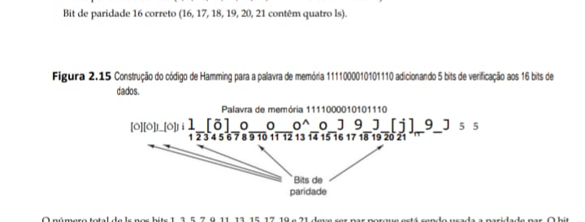

    Mapeamento Técnico 

    Processamento                                            Armazenamento                     

    Lógica de Potência de 2                                  Custo de Redundância

    A Unidade de Controle (Figura 2.1) reserva posições      Para 16 bits de dados, o acréscimo é de 31% (5 bits extras), específicas (2^n) para os bits de paridade, facilitando  totalizando 21 bits na memória (Figura 2.13).
    a localização do erro via hardware
                                                             BARRAMENTO INTERNO

    Confiabilidade no Barramento                             Aplicação no seu IDS
    
    Garante que um "bit flip" durante a transmissão pelo     Essencial para logs de segurança críticos onde um único bit alterado barramento (Figura 2.8) seja corrigido sem interromper   pode mudar um endereço IP ou uma flag de invasão.
    a execução.

### Insight 
Esta figura explica por que as memórias ECC (Error Correction Code) de servidores são mais caras e eficientes:

 - Hardware Transparente: No seu Lenovo, se ocorrer um erro de bit na RAM, o sistema pode travar (Tela Azul/Kernel Panic). Em sistemas com o código da Figura 2.15, o hardware corrige o bit "no voo" e o software nem percebe.

 - Eficiência no seu Código: Ao entender que os bits de paridade ocupam posições fixas, você entende por que o alinhamento de memória (Figura 2.9) é tão importante para o desempenho em C.

O número total de 1s nos bits 1, 3, 5, 7, 9, 11, 13, 15, 17, 19 e 21 deve ser par porque está sendo usada a paridade par. O bit incorreto deve ser um dos bits verificados pelo bit de paridade 1 – ou seja, bit 1, 3, 5, 7, 9, 11, 13, 15, 17, 19 ou 21. O bit de paridade 4 está incorreto, o que significa que um dos bits 4, 5, 6, 7, 12, 13, 14, 15, 20 ou 21 está incorreto. O erro deve ser um dos bits que está em ambas as listas, a saber, 5, 7, 13, 15 ou 21. Contudo, o bit 2 está correto, o que elimina os bits 7 e 15. De modo semelhante, o bit 8 está correto, eliminando o 13. Por fim, o bit 16 está correto, eliminando o 21. O único que sobrou é 5, que é o bit que está com erro. Uma vez que foi lido como um 1, ele deveria ser um 0. Dessa maneira, os erros podem ser corrigidos.

Um método simples para achar o bit incorreto é calcular antes todos os bits de paridade. Se todos estiverem corretos, não houve nenhum erro (ou então houve mais de um). Em seguida, somar todos os bits de paridade incorretos, contando 1 para o bit 1, 2 para o bit 2, 4 para o bit 4 e assim por diante. A soma resultante é a posição do bit incorreto. Por exemplo, se os bits de paridade 1 e 4 estiverem incorretos, mas 2, 8 e 16 estiverem corretos, o bit 5 (1 + 4) foi invertido.

## 2.2.5 Memória cache
Historicamente, as CPUs sempre foram mais rápidas do que as memórias. Conforme memórias melhoraram as CPUs também se aperfeiçoaram, mantendo o desequilíbrio. Na verdade, à medida que fica possível colocar cada vez mais circuitos em um chip, os projetistas estão usando essas novas facilidades no paralelismo (pipelining) e em operação superescalar, fazendo as CPUs ficarem ainda mais velozes. Projetistas de memória costumam usar nova tecnologia para aumentar a capacidade de seus chips, e não a velocidade, portanto, parece que os problemas estão piorando com o passar do tempo. Na prática, o significado desse desequilíbrio é que, após emitir uma requisição de memória, a CPU não obterá a palavra de que necessita por muitos ciclos de CPU. Quanto mais lenta a memória, mais ciclos a CPU terá de esperar.

Como já destacamos, há duas maneiras de tratar desse problema. O modo mais simples é somente iniciar READs (leituras) de memória quando elas forem encontradas, mas continuar executando e bloquear a CPU se uma instrução tentar usar a palavra de memória antes de ela chegar. Quanto mais lenta a memória, maior será a frequência desse problema e maior será a penalidade quando isso, de fato, ocorrer. Por exemplo, se uma instrução em cinco toca na memória e o tempo de acesso à memória for de cinco ciclos, o tempo de execução será o dobro daquele que teria sido na memória instantânea. Mas, se o tempo de acesso for de 50 ciclos, então o tempo
de execução será elevado por um fator de 11 (5 ciclos para executar instruções mais 50 ciclos para esperar pela memória).

A outra solução é ter máquinas que não ficam bloqueadas, mas, em vez disso, exigem que o compilador não gere código para usar palavras antes que elas tenham chegado. O problema é que é muito mais fácil falar dessa abordagem do que executá-la. Muitas vezes, não há nada mais a fazer após um LOAD (carregar), portanto, o compilador é forçado a inserir instruções NOP (nenhuma operação), que nada mais fazem do que ocupar um intervalo (slot) e gastar tempo. Com efeito, essa abordagem é um bloqueio de software em vez de um bloqueio de hardware, mas a degradação do desempenho é a mesma.

Na verdade, o problema não é tecnológico, mas econômico. Os engenheiros sabem como construir memórias tão rápidas quanto as CPUs, mas para que executem a toda velocidade, elas têm de estar localizadas no chip da CPU (porque passar pelo barramento para alcançar a memória é uma operação muito lenta). Instalar uma memória grande no chip da CPU faz com que esta fique maior e, portanto, mais cara. Ainda que o custo não fosse uma questão a considerar, há limites de tamanho para um chip de CPU. Assim, a opção se resume a ter uma pequena quantidade de memória rápida ou uma grande quantidade de memória lenta. O que nós gostaríamos de ter é uma grande quantidade de memória rápida a um preço baixo.

O interessante é que há técnicas conhecidas para combinar uma pequena quantidade de memória rápida com uma grande quantidade de memória lenta para obter (quase) a velocidade da memória rápida e a capacidade da memória grande a um preço módico. A memória pequena e rápida é denominada cache (do francês cacher, que significa “esconder” e se pronuncia “késh”). Em seguida, descreveremos brevemente como as caches são usadas e como funcionam. O Capítulo 4 apresenta uma descrição mais detalhada.

A ideia básica de uma cache é simples: as palavras de memória usadas com mais frequência são mantidas na cache. Quando a CPU precisa de uma palavra, ela examina em primeiro lugar a cache. Somente se a palavra não estiver ali é que ela recorre à memória principal. Se uma fração substancial das palavras estiver na cache, o tempo médio de acesso pode ser muito reduzido.

Assim, o sucesso ou o fracasso depende da fração das palavras que estão na cache. Há anos todos sabemos que programas não acessam suas memórias de forma totalmente aleatória. Se uma dada referência à memória for para o endereço A, é provável que a próxima estará na vizinhança geral de A. Um exemplo simples é o próprio programa. Exceto quando se trata de desvios e de chamadas de procedimento, as instruções são buscadas em localizações consecutivas da memória. Além do mais, grande parte do tempo de execução de um programa é gasto em laços, nos quais um número limitado de instruções é executado repetidas vezes. De modo semelhante, é provável que um programa de manipulação de matrizes fará muitas referências à mesma matriz antes de passar para outra coisa qualquer.

A observação de que referências à memória feitas em qualquer intervalo de tempo curto tendem a usar apenas uma pequena fração da memória total é denominada princípio da localidade, e forma a base de todos os sistemas de cache. A ideia geral é que, quando uma palavra for referenciada, ela e algumas de suas vizinhas sejam trazidas da memória grande e lenta para a cache, de modo que, na próxima vez em que for usada, ela possa ser acessada rapidamente. Um arranjo comum da CPU, cache e memória principal é ilustrado na Figura 2.16. Se uma palavra for lida ou escrita k vezes em um curto intervalo de tempo, o computador precisará de 1 referência à memória lenta e k – 1 referências à memória rápida. Quanto maior for k, melhor será o desempenho global.

**• Figura 2.16- A localização lógica da cache é entre a CPU e a memória principal. Em termos físicos, há diversos lugares em que ela poderia estar localizada.**

A Figura 2.16 ilustra o conceito de hierarquia de memória, focando na localização lógica da cache, que atua como uma ponte de alta velocidade entre a CPU e a memória principal.

No seu IdeaPad, essa arquitetura é o que impede que o processador i7 fique "ocioso" esperando dados da RAM, aumentando drasticamente o desempenho global.

    +----------+              +-------------------+
    |          |              |                   |
    |   CPU    |              | Memória Principal |
    |          |              |      (RAM)        |
    +----+-----+              +---------+---------+
        |                              |
        |          Cache               |
        +------->+-------+             |
                 |       |             |
                 +---+---+             |
                     |                 |
        =============+=================+============= BARRAMENTO

### Insight para o seu eBook: "A Ponte de Velocidade"
Ao documentar a Figura 2.16, você pode destacar dois pontos cruciais para seus leitores:

 - O Gargalo do Barramento: Como visto na Figura 2.1, o barramento é compartilhado. A cache diminui o tráfego nesse barramento, pois a CPU encontra o que precisa localmente.

 - Transparência de Software: Para o programador, a cache é "invisível". No entanto, escrever códigos "cache-friendly" (como os que você está desenvolvendo no repositório estruturas_de_dados) diferencia um software comum de um de alta performance.

Podemos formalizar esse cálculo introduzindo c, o tempo de acesso à cache; m, o tempo de acesso à memória principal; e h, a taxa de acerto, que é a fração de todas as referências que podem ser satisfeitas através da cache. Em nosso pequeno exemplo do parágrafo anterior, h = (k – 1)/k. Alguns autores também definem a taxa de falha (na cache), que é 1 – h.

    Com essas definições, podemos calcular o tempo de acesso médio como segue:

    tempo de acesso médio = c + (1 – h) m

À medida que h → 1, todas as referências podem ser satisfeitas fora da cache e o tempo de acesso médio se aproxima de c. Por outro lado, à medida que h → 0, toda vez será necessária uma referência à memória, portanto, o tempo de acesso se aproxima de c + m, primeiro um tempo para verificar a cache (sem sucesso) e então um tempo m para fazer a referência à memória. Em alguns sistemas, a referência à memória pode ser iniciada em paralelo com a busca na cache, de modo que, se ocorrer uma falha na cache (cache miss), o ciclo da memória já terá sido iniciado. Contudo, essa estratégia requer que a memória possa ser interrompida se houver uma presença na cache (cache hit), o que torna a implantação mais complicada.

Usando o princípio da localidade como guia, memórias principais e caches são divididas em blocos de tamanho fixo. Ao nos referirmos a esses blocos dentro da cache, eles costumam ser chamados de linhas de cache. Quando a busca na cache falha, toda a linha de cache é carregada da memória principal para a cache, e não apenas a palavra que se quer. Por exemplo, com uma linha de cache de 64 bytes de tamanho, uma referência ao endereço de memória 260 puxará a linha que consiste nos bytes 256 a 319 para uma linha de cache. Com um pouco de sorte, algumas das outras palavras na linha de cache também serão necessárias em breve. Esse tipo de operação é mais eficiente do que buscar palavras individuais porque é mais rápido buscar k palavras de uma vez só do que uma palavra k vezes. Além disso, ter entradas de cache de mais do que uma palavra significa que há menor número delas; por conseguinte, é preciso menos memória auxiliar (overhead). Por fim, muitos computadores podem transferir 64 ou 128 bits em paralelo em um único ciclo do barramento, até mesmo em máquinas de 32 bits.

O projeto de cache é uma questão de importância cada vez maior para CPUs de alto desempenho. Um aspecto é o tamanho da cache. Quanto maior, melhor seu funcionamento, mas também maior é o custo. Um segundo aspecto é o tamanho da linha de cache. Uma cache de 16 KB pode ser dividida em até 1.024 linhas de 16 bytes, 2.048 linhas de 8 bytes e outras combinações. Um terceiro aspecto é a maneira de organização, isto é, como ela controla quais palavras de memória estão sendo mantidas no momento. Examinaremos caches detalhadamente no Capítulo 4.

Um quarto aspecto do projeto é se as instruções e dados são mantidos na mesma cache ou em caches diferentes. Ter uma cache unificada (instruções e dados usam a mesma cache) é um projeto mais simples e mantém automaticamente o equilíbrio entre buscas de instruções e buscas de dados. No entanto, a tendência hoje é uma cache dividida, com instruções em uma cache e dados na outra. Esse projeto também é denominado arquitetura Harvard e essa referência volta ao passado até o computador Mark III de Howard Aiken, que tinha memórias diferentes para instruções e dados. A força que impele os projetistas nessa direção é a utilização muito difundida­ de CPUs com paralelismo (pipelined). A unidade de busca de instrução precisa acessar instruções ao mesmo tempo em que a unidade de busca de operandos precisa de acesso aos dados. Uma cache dividida permite acessos paralelos; uma cache unificada, não. Além disso, como as instruções não são modificadas durante a execução, o conteúdo da cache de instrução nunca tem de ser escrito de volta na memória.

Por fim, um quinto aspecto é o número de caches. Hoje em dia não é incomum ter chips com uma cache primária no chip, uma cache secundária fora dele, mas no mesmo pacote do chip da CPU, e uma terceira cache ainda mais distante.

## 2.2.6 Empacotamento e tipos de memória
Desde os primeiros dias da memória de semicondutor até o início da década 1990, a memória era fabricada, comprada e instalada como chips únicos. As densidades dos chips iam de 1 K bits até 1 M bits e além, mas cada chip era vendido como uma unidade separada. Os primeiros PCs costumavam ter soquetes vazios nos quais podiam ser ligados chips de memória adicionais, se e quando o comprador precisasse deles.

Desde o início da década de 1990, usa-se um arranjo diferente. Um grupo de chips, em geral 8 ou 16, é montado em uma minúscula placa de circuito impresso e vendido como uma unidade. Essa unidade é denominada SIMM (Single Inline Memory Module – módulo único de memória em linha) ou DIMM (Dual Inline Memory Module – módulo duplo de memória em linha), dependendo se tem uma fileira de conectores de um só lado ou de ambos os lados da placa. Os SIMMs têm um conector de borda com 72 contatos e transferem 32 bits por ciclo de clock. Os DIMMs em geral têm conectores de borda com 120 contatos em cada lado da placa, perfazendo um total de 240 contatos e transferem 64 bits por ciclo de clock. Os mais comuns hoje são os DIMMs DDR3, que é a terceira versão das memórias de taxa dupla. Um exemplo típico de DIMM é ilustrado na Figura 2.17.

**• Figura 2.17 Visão superior de um DIMM de 4 GB, com oito chips de 256 MB em cada lado. O outro lado tem a mesma aparência.**

        <-------------------- 133 mm -------------------->
        +--------------------------------------------------+
        |  +---+   +---+   +---+   +---+   +---+   +---+   |
        |  |CHIP|  |CHIP|  |CHIP|  |CHIP|  |CHIP|  |CHIP|  | --+
        |  |256 |  |256 |  |256 |  |256 |  |256 |  |256 |  |   | Lado A:
        |  | MB |  | MB |  | MB |  | MB |  | MB |  | MB |  |   | 8 Chips
        |  +---+   +---+   +---+   +---+   +---+   +---+   | --+
        |                                                  |
        +--||||||||||||||||||||||||||||||||||||||||||||||--+
            ^^^^^^^^^^^^^^^^^^ CONECTOR ^^^^^^^^^^^^^^^^^^

    Mapeamento Técnico 

    Processamento                                                  Armazenamento
    
    Barramento de Dados                                            Capacidade de Agregação
    -----------------------------------------------------------------------------------------------------------------------------
    O conector DIMM permite que a CPU (Figura 2.1) acesse 64 bits  Cada chip de 256 MB contribui para o total. Dois lados com 8 de dados simultaneamente (oito chips de 8 bits cada).             chips cada resultam em 16 chips × 256 MB = 4 GB por módulo.
    
                                                                   BARRAMENTO INTERNO
    Localização Física                                             Hierarquia de Memória
    
    Conecta-se diretamente à placa-mãe através do barramento de    Situada após a Cache (Figura 2.16), a RAM DIMM é onde o seu sistema (Figura 2.8).                                          Ubuntu carrega os processos do seu IDS.

### Insight para o eBook: "Do Bit ao Pente de Memória"
Ao adicionar esta figura ao seu material, você conecta todos os pontos anteriores:

 - Paridade e ECC: Em módulos voltados para servidores (como os da OCI), você verá frequentemente um nono chip no centro do DIMM. Esse chip extra serve especificamente para armazenar os bits de verificação da Figura 2.13 e realizar a correção da Figura 2.15.

 - Upgrade de Hardware: Se o seu notebook tem dois slots e você usa módulos de 4 GB como o da figura, você atinge 8 GB de RAM, o que é o "espaço de trabalho" real para suas estruturas de dados em C e JS.

Uma configuração típica de DIMM poderia ter oito chips de dados com 256 MB cada. Então, o módulo inteiro conteria 2 GB. Muitos computadores têm espaço para quatro módulos, o que dá uma capacidade total de 8 GB se usarem módulos de 2 GB e mais, se usarem módulos maiores.

Um DIMM fisicamente menor, denominado SO-DIMM (Small Outline DIMM – DIMM pequeno perfil) é usado em notebooks. Pode-se adicionar um bit de paridade ou correção de erro aos DIMMS, porém, visto que a taxa média de erro de um módulo é de um erro a cada dez anos, na maioria dos computadores de uso comum e doméstico, detecção e correção de erros são omitidas.

## 2.3 Memória secundária 
Seja qual for o tamanho da memória principal, ela sempre será muito pequena. As pessoas sempre querem armazenar mais informações do que a memória pode conter, ainda mais porque, à medida que a tecnologia melhora, elas começam a pensar em armazenar coisas que antes estavam inteiramente no reino da ficção científica. Por exemplo, como as diretrizes orçamentárias do governo dos Estados Unidos obrigam as agências governamentais a gerar sua própria receita, podemos imaginar a Biblioteca do Congresso decidindo digitalizar e vender todo o seu conteúdo como um artigo de consumo (“Todo o conhecimento humano por apenas US$ 299,95”). Cerca de 50 milhões de livros, cada qual com 1 MB de texto e 1 MB de figuras comprimidas, requerem armazenagem de 1014 bytes ou 100 terabytes. Armazenar todos os 50 mil filmes produzidos até agora também faz parte desse carnaval. Essa quantidade de informação não caberá na memória principal, ao menos por algumas décadas.

## 2.3.1 Hierarquias de memória
A solução tradicional para armazenar grandes quantidades de dados é uma hierarquia de memória, como ilustrada na Figura 2.18. No topo, estão os registradores da CPU, que podem ser acessados à velocidade total da CPU. Em seguida, vem a memória cache, que está na faixa de 32 KB a alguns megabytes. A memória vem logo após, hoje com tamanhos que vão de 1 GB para sistemas básicos até centenas de gigabytes na extremidade mais alta. Depois, vêm os discos magnéticos, o atual burro de carga da armazenagem permanente. Por fim, temos fitas magnéticas e discos ópticos para armazenagem de arquivos.

À medida que descemos na hierarquia, três parâmetros aumentam. Primeiro, o tempo de acesso fica maior. Os registradores da CPU podem ser acessados em um nanossegundo ou menos. Memórias cache demoram um pequeno múltiplo dos registradores da CPU. Acessos à memória principal normalmente levam 10 nanossegundos. Agora, vem uma grande lacuna, porque tempos de acesso a discos são no mínimo 10 vezes mais lentos para discos em estado sólido e centenas de vezes mais lentos para discos magnéticos. Acessos a fitas ou discos óticos podem ser medidos em segundos se a mídia tiver de ser buscada e inserida no drive.

**• Figura 2.18 - Hierarquia de memória de cinco níveis.**

                 /  \
                /----\
               / Reg  \  <-- Dentro da CPU (Velocidade Extrema)
              /--------\
             /  Cache   \ <-- L1, L2, L3 (Onde seu IDS brilha)
            /------------\
           / Mem. Principal\ <-- DIMM de 4GB (Seu Ubuntu roda aqui)
          /----------------\
         / SSD / Disco Mag. \ <-- Armazenamento Persistente
        /--------------------\
       / Fita / Disco Óptico  \ <-- Backup (Arquivamento)
      /------------------------\

    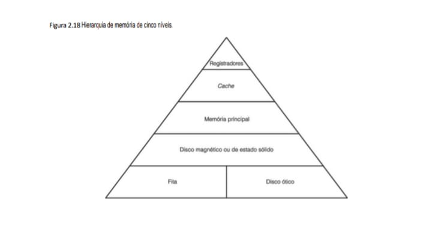

### Conexão com seu "Projeto IDS"
Ao documentar essas figuras, você explica por que o seu analisador de pacotes atinge taxas altas (como os 12.165 pacotes/seg que você registrou):

 - Pipeline/Superescalar: Permite que o código de checagem de IP e o de log rodem quase em paralelo.

 - Hierarquia: O seu objetivo é manter as regras de filtragem sempre nos Registradores ou na Cache (topo da pirâmide 2.18) para evitar o atraso da Memória Principal.

Segundo, a capacidade de armazenagem aumenta à medida que descemos na hierarquia. Registradores de CPU são bons para, talvez, 128 bytes, caches para algumas dezenas de megabytes, memórias principais para alguns gigabytes, discos em estado sólido para centenas de gigabytes e discos magnéticos para terabytes. Fitas e discos ópticos costumam ser mantidos off-line, portanto, sua capacidade é limitada apenas pelo orçamento do usuário.

Terceiro, o número de bits por dólar gasto aumenta descendo a hierarquia. Embora os preços atuais mudem com rapidez, a memória principal é medida em dólares/megabyte, o disco em estado sólido em dólares/gigabyte e a armazenagem em disco magnético e fita em centavos/gigabyte.

Já vimos registradores, cache e memória principal. Nas seções seguintes, vamos examinar os discos magnéticos e os discos em estado sólido; depois, estudaremos os discos óticos. Não estudaremos fitas porque são raramente usadas, exceto para cópias de segurança (backup) e, de qualquer forma, não há muita coisa a dizer sobre elas.

## 2.3.2 Discos magnéticos
Um disco magnético é composto de um ou mais pratos de alumínio com um revestimento magnetizável. No início, esses pratos tinham até 50 cm de diâmetro, mas agora têm normalmente de 3 a 9 cm, e discos para notebooks já estão com menos de 3 cm e continuam encolhendo. Um cabeçote de disco que contém uma bobina de indução flutua logo acima da superfície, apoiado sobre um colchão de ar. Quando uma corrente positiva ou negativa passa pelo cabeçote, ele magnetiza a superfície logo abaixo dele, alinhando as partículas magnéticas para a esquerda ou para a direita, dependendo da polaridade da corrente. Quando o cabeçote passa sobre uma área
magnetizada, uma corrente positiva ou negativa é induzida nele, o que possibilita a leitura dos bits armazenados antes. Assim, à medida que o prato gira sob o cabeçote, uma corrente de bits pode ser escrita e mais tarde lida. A geometria de uma trilha de disco é mostrada na Figura 2.19.

**• Figura 2.19 Porção de uma trilha de disco. Dois setores são ilustrados.**

Figura 2.19: Anatomia de uma Trilha de Disco
Mesmo em sistemas modernos, entender a geometria de um disco magnético é fundamental para otimizar sistemas de arquivos e bancos de dados.

    Direção da Rotação
                <-----------------
         /-------------------------------\
        /   SETOR 1      GAP      SETOR 2 \
        |  +---------+   +---+   +---------+ |
        |  |Preâmbulo|   |   |   |Preâmbulo| |
        |  |---------|   | I |   |---------| |
        |  |  Dados  |   | N |   |  Dados  | | <-- Braço do Disco
        |  | (4096)  |   | T |   | (4096)  | |      posicionado
        |  |---------|   | E |   |---------| |      na trilha
        |  |   ECC   |   | R |   |   ECC   | |
        |  +---------+   +---+   +---------+ |
          \------------------------------/---/
                        |            |
                    Lacuna de      Largura da
                Intersecção      Trilha

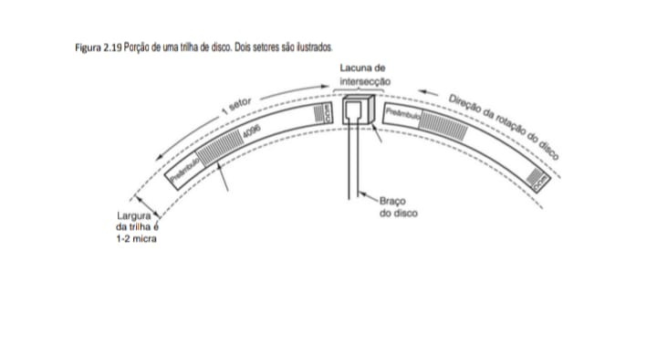

Todos os discos têm braços móveis que podem se mover para dentro e para fora a diferentes distâncias radiais da haste ao redor da qual o prato gira. A cada distância radial pode ser escrita uma trilha diferente. Assim, as trilhas são uma série de círculos concêntricos ao redor da haste. A largura de uma trilha depende da largura do cabeçote e da precisão com que ele pode ser posicionado radialmente. Com tecnologia atual, os discos têm em torno de 50 mil trilhas por centímetro, resultando em larguras de trilha na faixa de 200 nanômetros (1 nanômetro = 1/1.000.000 mm). Deve-se notar que uma trilha não é um sulco físico na superfície,
mas apenas um anel de material magnetizado com pequenas áreas de proteção que o separa das trilhas que estão dentro e fora dele.

A densidade linear de bits ao redor da circunferência da trilha é diferente da radial. Em outras palavras, o número de bits por milímetro medida em torno de uma trilha é diferente do número de bits por milímetro a partir do centro em direção à borda externa. A densidade ao redor de uma trilha é determinada em grande parte pela pureza da superfície e pela qualidade do ar. Os discos de hoje atingem densidades de 25 gigabits/cm. A densidade radial é determinada pela precisão que o braço pode ter para chegar a uma trilha. Assim, um bit é muitas vezes maior na direção radial em comparação com a circunferência, conforme sugere a Figura 2.19.

Para atingir densidades ainda mais altas, os fabricantes de discos estão desenvolvendo tecnologias nas quais a dimensão “longa” dos bits não está ao longo da circunferência do disco, mas na direção vertical, dentro do óxido de ferro. Essa técnica é denominada gravação perpendicular e demonstrou-se que pode oferecer densidades de dados de até 100 gigabits/cm. É provável que essa se torne a tecnologia dominante nos próximos anos.

Para conseguir alta qualidade de superfície e ar, a maioria dos discos é selada na fábrica para evitar a entrada de pó. Esses drives eram denominados discos Winchester, pois os primeiros deles (criados pela IBM) tinham 30 MB de armazenagem selada e fixa e 30 MB de armazenagem removível. Conta a história que esses discos 30-30 lembravam às pessoas os rifles Winchester 30-30, que desempenharam um papel importante na abertura das fronteiras norte-americanas, e o nome “Winchester” ficou. Agora, eles são chamados simplesmente de discos rígidos, para diferenciá-los dos antigos disquetes (ou discos flexíveis) usados nos primeiros
computadores pessoais. Nessa área, é muito difícil escolher um nome para alguma coisa que não se torne ridículo 30 anos depois.

A maioria dos discos é composta de vários pratos empilhados na vertical, como ilustrado na Figura 2.20. Cada superfície tem seu próprio braço e cabeçote. Os braços são agrupados de modo que todos se movimentem para diferentes posições radiais ao mesmo tempo. O conjunto de trilhas em uma dada posição radial é denominado cilindro. Os discos usados hoje em PCs costumam ter de 1 a 12 pratos por drive, o que resulta em 2 a 24 superfícies de gravação. Discos de última geração podem armazenar 1 TB em um único prato, e esse limite certamente crescerá com o tempo.

**• Figura 2.20 - Disco com quatro pratos.**

Diferente da Figura 2.19, que foca em uma trilha, aqui vemos o empilhamento físico que permite maior densidade de armazenamento.

    Eixo Central
                     |
            /--------|--------\  <-- Superfície 7 (Topo)
           |=========|=========| <-- Superfície 6
            \--------|--------/        |
                     |                 |---- Cabeçote de Leitura/Escrita
            /--------|--------\        |      (1 por superfície)
           |=========|=========| <-- Superfície 5
            \--------|--------/        |
                     |                 |---- Braço do Disco
            /--------|--------\        |     (Move-se p/ dentro/fora)
           |=========|=========| <-- Superfície 4
            \--------|--------/        |
                     |                 |
            /--------|--------\        |
           |=========|=========| <-- Superfície 0 (Base)
            \--------|--------/

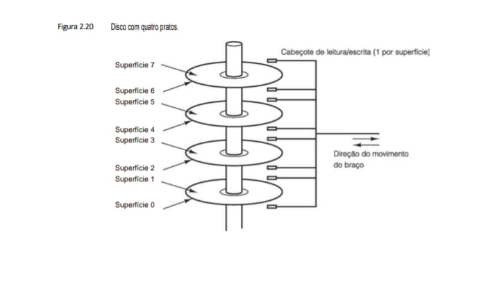

O desempenho do disco depende de vários fatores. Para ler ou escrever um setor, primeiro o braço deve se deslocar até a posição radial correta. Essa ação é denominada busca (seek). Tempos médios de busca (entre trilhas aleatórias) estão na faixa de 5 a 10 ms, embora buscas entre trilhas consecutivas agora já estejam abaixo de 1 ms. Logo que o cabeçote estiver posicionado radialmente, há um atraso, denominado latência rotacional, até que o setor desejado gire sob o cabeçote. A maioria dos discos gira a 5.400 RPM, 7.200 RPM ou 10.800 RPM, portanto, o atraso médio (meia rotação) é de 3 a 6 ms. O tempo de transferência depende da densidade linear e da velocidade de rotação. Com taxas de transferência típicas de 150 MB/s, um setor de 512 bytes demora cerca de 3,5 µs. Por conseguinte, o tempo de busca e a latência rotacional dominam o tempo de transferência. Ler setores aleatórios por todo o disco é claramente um modo ineficiente de operar.

Vale a pena mencionar que, por conta de preâmbulos, ECCs, lacunas intersetores, tempos de busca e latências rotacionais, há uma grande diferença entre taxa de rajada (burst rate) máxima de um drive e sua taxa máxima sustentada. A taxa máxima de rajada é a taxa de dados, uma vez que o cabeçote está sobre o primeiro bit de dados. O computador deve ser capaz de manipular os dados que estão chegando com essa mesma rapidez. Contudo, o drive só pode manter essa taxa para um único setor. Para algumas aplicações, como multimídia, o que importa é a taxa sustentada média durante um período de segundos, que também tem de levar em conta as necessárias buscas e atrasos rotacionais.

Um pouco de raciocínio e a utilização daquela velha fórmula de matemática do colegial para a circunferência de um círculo, c = 2πr, revelarão que a distância linear ao redor das trilhas mais externas é maior do que a das trilhas mais internas. Uma vez que todos os discos magnéticos giram com velocidade angular constante, não importando onde estão os cabeçotes, essa observação cria um problema. Nos drives antigos, os fabricantes usavam a máxima densidade linear possível na trilha mais interna e densidades lineares de bits sucessivamente menores nas trilhas mais externas. Se um disco tivesse 18 setores por trilha, por exemplo, cada uma ocupava 20 graus de arco, não importando em qual cilindro se encontrava.

Hoje, usa-se uma estratégia diferente. Os cilindros são divididos em zonas (normalmente, 10 a 30 por drive) e o número de setores por trilha aumenta de zona em zona partindo da trilha mais interna para a mais externa. Essa mudança dificulta o rastreamento de informações mas aumenta a capacidade do drive, que é considerada mais importante. Todos os setores são do mesmo tamanho. A Figura 2.21 mostra um disco com cinco zonas.

**• Figura 2.21 - Disco com cinco zonas. Cada zona tem muitas trilhas.**

Mostra como os discos modernos dividem a superfície em zonas concêntricas para aproveitar melhor o espaço físico, colocando mais setores nas trilhas externas.

                 ______
              /          \
             /     /--\   \
            |     |    |   |  <-- Zonas Externas (Mais Setores)
            |     |    |   |  <-- Zonas Internas (Menos Setores)
             \     \--/   /
              \__________/

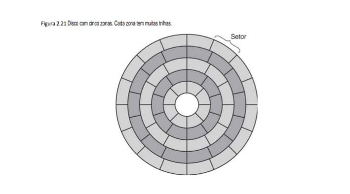

Associado a cada drive há um controlador de disco, um chip que controla o drive. Alguns controladores contêm uma CPU completa. Entre as tarefas do controlador estão: aceitar comandos do software, como READ, WRITE e FORMAT (escrevendo todos os preâmbulos), controlar o movimento do braço, detectar e corrigir erros e converter bytes de 8 bits lidos na memória em uma corrente serial de bits e vice-versa. Alguns controladores também manipulam o buffer de múltiplos setores, fazendo cache de setores lidos para potencial uso futuro e remapeando setores ruins. Essa última função é causada pela existência de setores que têm um ponto ruim, ou seja, permanentemente magnetizado. Quando descobre um setor ruim, o controlador o substitui por um dos setores sobressalentes reservados para esse fim dentro de cada cilindro ou zona.

## 2.3.3 Discos IDE
Os discos dos modernos computadores pessoais evoluíram daquele usado no IBM PC XT, que era um disco Seagate de 10 MB controlado por um controlador de disco Xebec em um cartão de encaixe (plug-in). O disco Seagate tinha 4 cabeçotes, 306 cilindros e 17 setores por trilha. O controlador conseguia manipular dois drives. O sistema operacional lia e escrevia em um disco colocando parâmetros em registradores da CPU e então chamando o BIOS (Basic Input Output System – sistema básico de entrada e saída) localizado na memória somente de leitura do PC. O BIOS emitia as instruções de máquina para carregar os registradores do controlador de disco que
iniciava as transferências.

A tecnologia evoluiu rapidamente e passou do controlador em uma placa separada para o controlador integrado com os drives, começando com drives IDE (Integrated Drive Electronics – eletrônica integrada ao drive) em meados da década de 1980. Contudo, as convenções de chamada do BIOS não foram alteradas por causa da compatibilidade. Essas convenções de chamada endereçavam setores dando seus números de cabeçote, cilindro e setor, sendo que a numeração de cabeçotes e cilindros começava em 0, e de setores, em 

1. Essa escolha provavelmente se deveu a um erro da parte do programador original do BIOS, que escreveu sua obra-prima em assembler
8088. Com 4 bits para o cabeçote, 6 bits para o setor e 10 bits para o cilindro, o drive máximo podia ter 16 cabeçotes, 63 setores e 1.024 cilindros, para um total de 1.032.192 setores. Esse drive máximo tinha uma capacidade de 504 MB, o que devia parecer uma infinidade naquela época, porém, agora, decerto não. (Hoje você criticaria uma nova máquina que não pudesse manipular drives maiores do que 1.000 TB?)

Infelizmente, não passou muito tempo e apareceram drives acima de 504 MB, mas com a geometria errada (por exemplo, 4 cabeçotes, 32 setores e 2.000 cilindros totalizam 256.000 setores). O sistema operacional não conseguia endereçá-los de modo algum, por causa das convenções de chamada do BIOS há muito cristalizadas. O resultado é que os controladores de disco começaram a mentir, fingindo que a geometria estava dentro dos limites do BIOS embora, na verdade, estivesse remapeando a geometria virtual para a geometria real. Embora essa técnica funcionasse, causava grandes estragos nos sistemas operacionais que posicionavam dados cuidadosamente para minimizar tempos de busca.

Com o tempo, os drives IDE evoluíram para drives EIDE (Extended IDE – IDE estendido), que também suportavam um segundo esquema de endereçamento denominado LBA (Logical Block Addressing – endereçamento de blocos lógicos), que numera os setores começando em 0 até um máximo de 228 – 1. Esse esquema requer que o controlador converta endereços LBA para endereços de cabeçote, setor e cilindro, mas ultrapassa o limite de 504 MB. Infelizmente, ele criava um novo gargalo a 228 × 29 bytes (128 GB). Em 1994, quando foi adotado o padrão EIDE, ninguém poderia imaginar discos de 128 GB. Comitês de padronização, assim como os políticos, têm tendência de empurrar problemas para que o próximo comitê os resolva.

Drives e controladores EIDE também tinham outras melhorias. Por exemplo, controladores EIDE podiam ter dois canais, cada um com um drive primário e um secundário. Esse arranjo permitia um máximo de quatro drives por controlador. Drives de CD-ROM e DVD também eram suportados, e a taxa de transferência aumentou de 4 MB/s para 16,67 MB/s.

Enquanto a tecnologia de disco continuava a melhorar, o padrão EIDE continuava a evoluir, mas, por alguma razão, o sucessor do EIDE foi denominado ATA-3 (AT Attachment), uma referência ao IBM PC/AT (onde AT se referia à então “tecnologia avançada” – Advanced Technology – de uma CPU de 16 bits executando em 8 MHz).

Na edição seguinte, o padrão recebeu o nome de ATAPI-4 (ATA Packet Interface – interface de pacotes ATA) e a velocidade aumentou para 33 MB/s. Com o ATAPI-5, ela alcançou 66 MB/s.

Nessa época, o limite de 128 GB imposto pelos endereços LBA de 28 bits estava ficando cada vez mais ameaçador, portanto, o ATAPI-6 alterou o tamanho do LBA para 48 bits. O novo padrão entrará em dificuldade quando os discos chegarem a 248 × 29 bytes (128 PB). Com um aumento de capacidade de 50% ao ano, o limite de 48 bits deverá durar até mais ou menos 2035. Para saber como o problema foi resolvido, favor consultar a décima primeira edição deste livro. A melhor aposta é que o tamanho do LBA alcance 64 bits. O padrão ATAPI-6 também aumentou a taxa de transferência para 100 MB/s e atacou a questão do ruído do disco pela primeira vez.

O padrão ATAPI-7 é uma ruptura radical com o passado. Em vez de aumentar o tamanho do conector do drive (para aumentar a taxa de dados), esse padrão usa o que é chamado ATA serial para transferir 1 bit por vez por um conector de 7 pinos a velocidades que começam em 150 MB/s e que, com o tempo, espera-se que alcancem 1,5 GB/s. Substituir o atual cabo plano de 80 fios por um cabo redondo com apenas alguns milímetros a mais de espessura melhora o fluxo de ar dentro do computador. Além disso, o ATA serial usa 0,5 volt para sinalização (em comparação com os 5 volts dos drives ATAPI-6), o que reduz o consumo de energia. É provável que, dentro de alguns anos, todos os computadores usarão ATA serial. A questão do consumo de energia pelos discos é cada vez mais importante, tanto na extremidade mais alta do mercado, onde centrais de dados têm vastas coleções de discos, como na mais baixa, onde os notebooks são limitados em questão de energia (Gurumurthi et al., 2003).

## 2.3.4 Discos SCSI
Discos SCSI não são diferentes de discos IDE em relação ao modo como seus cilindros, trilhas e setores são organizados, mas têm uma interface diferente e taxas de transferência muito mais elevadas. A história dos SCSI remonta a Howard Shugart, o inventor do disco flexível, cuja empresa lançou o disco SASI (Shugart Associates System Interface – interface de sistema da Shugart Associates) em 1979. Após algumas modificações e muita discussão, a ANSI o padronizou em 1986 e mudou o nome para SCSI (Small Computer System Interface – interface para sistemas computacionais pequenos). A pronúncia de SCSI em inglês é “scâzi”, de scuzzy. Desde então, foram padronizadas versões cada vez mais rápidas sob os nomes de Fast SCSI (10 MHz), Ultra SCSI (20 MHz), Ultra2 SCSI (40 MHz), Ultra3 SCSI (80 MHz) e Ultra4 SCSI (160 MHz). Cada uma dessas versões também tem uma versão larga (16 bits). As principais combinações são mostradas na Figura 2.22.

**• Figura 2.22 - Alguns dos possíveis parâmetros SCSI.**

    PADRÃO SCSI         BITS     FREQ. (MHz)    TAXA (MB/s)
    -----------        ------   -------------   -----------
    SCSI-1              [ 8]  x  (  5 MHz )  =      5
    Fast SCSI           [ 8]  x  ( 10 MHz )  =     10
    Wide Fast SCSI      [16]  x  ( 10 MHz )  =     20 <--- Dobro de bits
    Ultra SCSI          [ 8]  x  ( 20 MHz )  =     20
    Wide Ultra SCSI     [16]  x  ( 20 MHz )  =     40
    Ultra2 SCSI         [ 8]  x  ( 40 MHz )  =     40
    Wide Ultra2 SCSI    [16]  x  ( 40 MHz )  =     80
    Wide Ultra3 SCSI    [16]  x  ( 80 MHz )  =    160
    Wide Ultra4 SCSI    [16]  x  (160 MHz )  =    320
    Wide Ultra5 SCSI    [16]  x  (320 MHz )  =    640 <--- Limite Paralelo

### Insight para o eBook: "A Corrida pela Largura de Banda"
Ao incluir esta tabela, você pode destacar um conceito importante para os leitores do seu eBook:

 - Paralelismo de Barramento: O termo "Wide" indica que estamos dobrando a "estrada" (de 8 para 16 bits), o que permite dobrar a  - velocidade mesmo mantendo o mesmo "limite de velocidade" (MHz).

Limites Físicos: Note que a evolução do SCSI parou no Ultra5 devido a problemas de interferência eletromagnética em barramentos paralelos de alta frequência, o que abriu caminho para as interfaces seriais modernas como o SATA e o SAS.

Como têm altas taxas de transferência, os discos SCSI são o disco padrão de grande parte das estações de trabalho e servidores, em especial aqueles que trabalham na configuração RAID (ver adiante).

O SCSI é mais do que apenas uma interface de disco rígido. É um barramento ao qual podem ser conectados um controlador SCSI e até sete dispositivos. Entre eles, podem estar um ou mais discos rígidos SCSI, CD-ROMs, gravadores de CD, scanners, unidades de fita e outros periféricos SCSI. Cada dispositivo SCSI tem um único ID, de 0 a 7 (15 para o SCSI largo – wide SCSI). Cada dispositivo tem dois conectores: um para entrada e um para saída. Cabos conectam a saída de um dispositivo à entrada do seguinte, em série, como se fosse um cordão de lâmpadas baratas de árvore de Natal. O último dispositivo do cordão deve ser terminado para evitar que reflexões das extremidades do barramento SCSI interfiram com outros dados no barramento. Em geral, o controlador está em um cartão de encaixe (plug-in) no início da cadeia de cabos, embora essa configuração não seja uma exigência estrita do padrão.

O cabo mais comum para SCSI de 8 bits tem 50 fios, 25 dos quais são terras que fazem par com os outros 25 fios para dar excelente imunidade contra ruído, necessária para operação em alta velocidade. Dos 25 fios, 8 são para dados, 1 é para paridade, 9 são para controle e os restantes são para energia elétrica ou reservados para utilização futura. Os dispositivos de 16 bits (e 32 bits) precisam de um segundo cabo para os sinais adicionais. Os cabos podem ter muitos metros de comprimento, o que permite drives externos, scanners etc.

Controladores e periféricos SCSI podem funcionar como iniciadores ou como alvos. Em geral, o controlador, agindo como iniciador, emite comandos para discos e outros periféricos que agem como alvos. Esses comandos são blocos de até 16 bytes, que dizem ao alvo o que ele tem de fazer. Comandos e respostas ocorrem em fases, usando vários sinais de controle para delinear as fases e arbitrar o acesso ao barramento quando vários dispositivos tentam usá-lo ao mesmo tempo. Essa arbitragem é importante porque o SCSI permite que todos os dispositivos funcionem simultaneamente, o que de modo potencial resulta em grande aumento do desempenho em um
ambiente em que há múltiplos processos ativos ao mesmo tempo. IDE e EIDE permitem apenas um dispositivo ativo por vez.

## 2.3.5 RAID
O desempenho da CPU vem tendo aumento exponencial na última década e dobra a cada 18 meses mais ou menos. O mesmo não acontece com o desempenho do disco. Na década de 1970, os tempos médios de busca em discos de minicomputadores eram de 50 a 100 ms. Agora, são de 10 ms. Na maioria das indústrias técnicas (por exemplo, automóveis ou aviação), um fator de 5 a 10 de melhoria de desempenho em duas décadas seria uma grande notícia, mas na indústria de computadores isso é constrangedor. Assim, a lacuna entre o desempenho da
CPU e o do disco ficou cada vez maior com o passar do tempo.

Como vimos, muitas vezes é usado processamento paralelo para acelerar o desempenho da CPU. Ao longo dos anos, ocorreu a várias pessoas que a E/S paralela também poderia ser uma boa ideia. Em seu artigo de 1988, Patterson et al. sugeriram seis organizações específicas de disco que poderiam ser usadas para melhorar o desempenho, a confiabilidade do disco, ou ambos (Patterson et al., 1988). Essas ideias logo foram adotadas pela indústria e deram origem a uma nova classe de dispositivos de E/S, denominados RAID. Patterson et al. definiram RAID como Redundant Array of Inexpensive Disks (arranjo redundante de discos baratos), mas a indústria
redefiniu o I como “independente” em vez de barato (inexpensive) – talvez para que pudessem usar discos caros? Já que também era preciso ter um vilão (como no caso RISC versus CISC, também devido a Patterson), nesse caso o bandido era o SLED (Single Large Expensive Disk – disco único grande e caro).

A ideia fundamental de um RAID é instalar uma caixa cheia de discos próxima ao computador, em geral um grande servidor, substituir a placa do controlador de disco por um controlador RAID, copiar os dados para o RAID e então continuar a execução normal. Em outras palavras, um RAID deveria parecer um SLED para o sistema operacional, mas ter melhor desempenho e melhor confiabilidade. Uma vez que discos SCSI têm bom desempenho, baixo preço e a capacidade de ter até 7 drives em um único controlador (15 para o wide SCSI), é natural que a maioria dos RAIDs consista em um controlador RAID SCSI mais uma caixa de discos SCSI que parecem para o
sistema operacional como um único disco grande. Portanto, não é preciso alterar software para usar o RAID, um ótimo argumento de venda para muitos administradores de sistemas.

Além de parecerem um disco único para o software, há uma propriedade comum a todos os RAIDs, que é a distribuição dos dados pelos drives para permitir operação paralela. Patterson et al. definiram vários esquemas diferentes para fazer isso e, agora, eles são conhecidos como RAID nível 0 até RAID nível 5. Além disso, há alguns outros níveis menos importantes que não discutiremos. O termo “nível” é, de certa maneira, uma denominação imprópria, uma vez que não há nenhuma hierarquia envolvida; há simplesmente seis
diferentes organizações possíveis, cada qual com uma mistura diferente de características de confiabilidade e desempenho.

O RAID nível 0 é ilustrado na Figura 2.23(a). Consiste em ver o disco virtual simulado pelo RAID como se fosse dividido em tiras de k setores cada: os setores 0 a k – 1 são a tira 0, os setores k a 2k – 1 são a tira 1 e assim por diante. Para k = 1, cada tira é um setor; para k = 2, uma tira são dois setores etc. A organização RAID nível 0 escreve tiras consecutivas nos drives por alternância circular, como demonstrado na Figura 2.23(a) para um RAID com quatro drives de disco. Essa distribuição de dados por múltiplos drives é denominada striping (ou segmentação). Por exemplo, se o software emitir um comando para ler um bloco de dados que consiste em quatro tiras consecutivas e começa na borda da tira, o controlador RAID o subdividirá em quatro comandos separados, um para cada disco, e fará com que eles funcionem em paralelo. Assim, temos E/S paralela sem que o software saiba disso.

O RAID nível 0 funciona melhor com requisições grandes; quanto maiores, melhor. Se uma requisição for maior do que o número de drives vezes o tamanho da tira, alguns drives receberão múltiplas requisições, de modo que, quando terminam a primeira, iniciam a segunda. Cabe ao controlador dividir a requisição e alimentar os comandos adequados aos discos adequados na sequência certa e então agrupar os resultados na memória corretamente. O desempenho é excelente e a execução é direta.

O RAID nível 0 funciona pior com sistemas operacionais que costumam requisitar dados a um setor por vez. Os resultados serão corretos, mas não há paralelismo e, por conseguinte, nenhum ganho de desempenho. Outra desvantagem dessa organização é que a confiabilidade é potencialmente pior do que ter um SLED. Se um RAID consistir em quatro discos, cada um com um tempo médio de falha de 20 mil horas, mais ou menos uma vez a cada 5 mil horas um drive falhará e haverá perda total de dados. Um SLED com um tempo médio de falha de 20 mil horas seria quatro vezes mais confiável. Como não há nenhuma redundância presente nesse projeto, na
realidade ele não é um RAID verdadeiro.

A próxima opção, RAID nível 1, mostrada na Figura 2.23(b), é um RAID verdadeiro. Ele duplica todos os discos, portanto, há quatro discos primários e quatro de backup. Para uma escrita, cada tira é escrita duas vezes. Para uma leitura, qualquer das duas cópias pode ser usada, distribuindo a carga por mais drives. Por conseguinte, o desempenho da escrita não é melhor do que o de um único drive, mas o de leitura pode ser duas vezes melhor. A tolerância a falhas é excelente: se um drive falhar, basta usar a outra cópia em seu lugar. A recuperação consiste na simples instalação de um novo drive e em copiar todo o drive de backup para ele.

Ao contrário dos níveis 0 e 1, que trabalham com tiras de setores, o RAID nível 2 trabalha por palavra, possivelmente até por byte. Imagine dividir cada byte do disco virtual único em um par de nibbles de 4 bits e então acrescentar um código de Hamming a cada um para formar uma palavra de 7 bits, dos quais os bits 1, 2 e 4 fossem de paridade. Imagine ainda que a posição do braço e a posição rotacional dos sete drives da Figura 2.23(c) fossem sincronizadas. Então, seria possível escrever a palavra de 7 bits codificada por Hamming nos sete drives, um bit por drive.

**• Figura 2.23 - RAIDs níveis 0 a 5. Os drives de backup e paridade estão sombreados.**

A Figura 2.23 é essencial. Ela consolida os conceitos de redundância e integridade que discutimos (como o Código de Hamming e Paridade) aplicando-os ao armazenamento em massa através dos níveis de RAID.a Figura 2.23 é essencial. Ela consolida os conceitos de redundância e integridade que discutimos (como o Código de Hamming e Paridade) aplicando-os ao armazenamento em massa através dos níveis de RAID.

    (a) RAID 0 (Striping)        (b) RAID 1 (Mirroring)
        Sem Paridade                 Cópia Idêntica
        [D0][D1][D2][D3]             [D0][D1][D2][D3]
        [D4][D5][D6][D7]             [D0][D1][D2][D3] < (Backup)

    (c) RAID 2 (Hamming)         (d) RAID 3 (Paridade Bit)
        Erro de Bit                  Disco de Paridade Dedicado
        [B1][B2][B3][ P ]            [B1][B2][B3][B4] [Paridade]
        [B4][B5][B6][ P ]             ^   ^   ^   ^      ^
        (Usa Hamming)               +---+---+---+------+

    (e) RAID 4 (Paridade Bloco)  (f) RAID 5 (Paridade Distribuída)
        Disco Dedicado               Alta Disponibilidade
        [T0][T1][T2][ P ]            [T0][T1][T2][ P ]
        [T3][T4][T5][ P ]            [T3][T4][ P ][T5]
        [T6][T7][T8][ P ]            [T6][ P ][T7][T8]

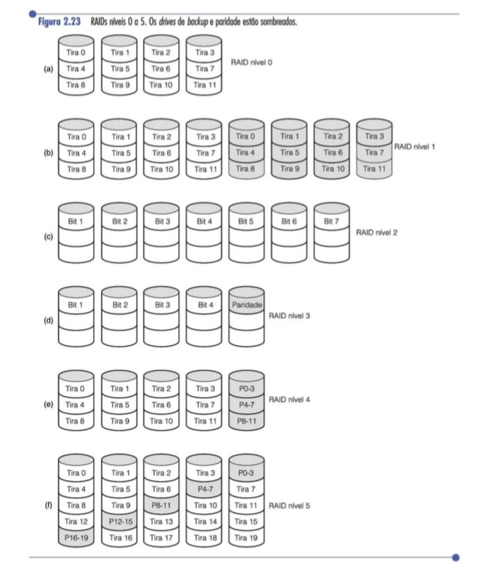

    Mapeamento Técnico para o eBook

    +------------------------+-------------------------------+---------------------------------------------+
    | Tecnologia             | Aplicação de Integridade      | Impacto no Desempenho                       |
    +------------------------+-------------------------------+---------------------------------------------+
    | RAID 2 (2.23c)         | Aplica o Código de Hamming    | Raramente usado hoje devido ao custo de     |
    |                        | (Figura 2.15) diretamente no  | sincronização dos eixos.                    |
    |                        | nível do disco.               |                                             |
    +------------------------+-------------------------------+---------------------------------------------+
    | RAID 5 (2.23f)         | Distribui a paridade (Figura  | O padrão ouro para servidores, equilibrando |
    |                        | 2.14) por todos os discos,    | custo e segurança.                          |
    |                        | evitando o gargalo de um      |                                             |
    |                        | único disco de paridade.      |                                             |
    +------------------------+-------------------------------+---------------------------------------------+

### Resumo do Capítulo: Da CPU ao Armazenamento Seguro
Agora você tem a jornada completa mapeada:

    1. Processamento: Começamos com a Figura 2.7 (SIMD/Fermi) mostrando como processar dados em massa.

    2. Organização: Vimos na Figura 2.9 e 2.11 como esses dados são endereçados e ordenados (Endianness).

    3. Velocidade: A Figura 2.16 e a pirâmide 2.18 explicaram a necessidade da Cache para alimentar a CPU.

    4. Confiabilidade: Fechamos com RAID (2.23) para garantir que, mesmo se o hardware falhar, os dados do seu IDS e do seu eBook permaneçam intactos.

O computador Thinking Machine CM-2 usava esse esquema, pegando palavras de 32 bits de dados e adicionando 6 bits de paridade para formar uma palavra de Hamming de 38 bits, mais um bit extra para paridade de palavra, e distribuindo cada palavra em 39 drives de disco. O rendimento total era imenso porque em um tempo de setor ele podia escrever o equivalente a 32 setores de dados. Além disso, perder um drive não causava problemas, porque essa perda equivaleria a perder 1 bit em cada palavra de 39 bits lida, algo que o código de Hamming poderia manipular facilmente.

Uma desvantagem é que esse esquema requer que as rotações de todos os drives sejam sincronizadas, e isso só faz sentido com um número substancial de drives (mesmo com 32 drives de dados e 6 drives de paridade, a sobrecarga seria de 19%). O esquema também exige muito do controlador, uma vez que ele deve efetuar uma soma de verificação (checksum) de Hamming a cada tempo de bit.

O RAID nível 3, ilustrado na Figura 2.23(d), é uma versão simplificada do RAID nível 2. Nesse arranjo, um único bit de paridade é computado para cada palavra de dados e escrito em um drive de paridade. Como no RAID nível 2, os drives devem estar em exata sincronia, uma vez que palavras de dados individuais estão distribuídas por múltiplos drives.

À primeira vista, pode parecer que um único bit de paridade dá somente detecção de erro, e não correção de erro. Para o caso de erros aleatórios não detectados, essa observação é verdadeira. Todavia, para o caso de uma falha de drive, ela provê correção total de erros de 1 bit, uma vez que a posição do bit defeituoso é conhecida. Se um drive falhar, o controlador apenas finge que todos os seus bits são 0s. Se uma palavra tiver um erro de paridade, o bit que vem de um drive extinto deve ter sido um 1, portanto, é corrigido. Embora ambos os RAIDs níveis 2 e 3 ofereçam taxas de dados muito altas, o número de requisições separadas de E/S por segundo que eles podem manipular não é melhor do que o de um único drive.

RAIDs níveis 4 e 5 de novo trabalham com tiras, e não com palavras individuais com paridade, e não requerem drives sincronizados. O RAID nível 4 [veja a Figura 2.23(e)] é como o RAID nível 0, com paridade tira por tira escrita em um drive extra. Por exemplo, se cada tira tiver k bytes de comprimento, todas as tiras passam por uma operação de EXCLUSIVE OR, resultando em uma tira de paridade de k bytes de comprimento. Se um drive falhar, os bytes perdidos podem ser recalculados com base no drive de paridade.

Esse projeto protege contra a perda de um drive, mas seu desempenho é medíocre para pequenas atualizações. Se um setor for alterado, é necessário ler todos os drives para recalcular a paridade que, então, precisará ser reescrita. Como alternativa, ele pode ler os velhos dados de usuário e os velhos dados de paridade e recalcular nova paridade, e partir deles. Mesmo com essa otimização, uma pequena atualização requer duas leituras e duas escritas, o que é, claramente, um mau arranjo.

Como consequência da carga pesada sobre o drive de paridade, ele pode se tornar um gargalo. Esse gargalo é eliminado no RAID nível 5 distribuindo os bits de paridade uniformemente por todos os drives, por alternância circular, conforme mostra a Figura 2.23(f). Contudo, no evento de uma falha de drive, a reconstrução do drive danificado é um processo complexo.

## 2.3.6 Discos em estado sólido
Discos feitos de memória flash não volátil, geralmente denominados discos em estado sólido (SSDs – Solid­ State Disks), estão ganhando mais popularidade como uma alternativa de alta velocidade às tecnologias tradicionais em disco magnético. A invenção do SSD é uma história clássica de “Quando lhe oferecem limões, faça uma limonada”. Embora a eletrônica moderna possa parecer totalmente confiável, a realidade é que os transistores se desgastam lentamente à medida que são usados. Toda vez que eles comutam, se desgastam um pouco e ficam mais perto de não funcionarem mais. Um modo provável de falha de um transistor é pela “injeção de portadora quente”, um mecanismo de falha em que uma carga elétrica é embutida dentro de um transistor que funcionava,
deixando-o em um estado onde fica permanentemente ligado ou desligado. Embora em geral considerado sentença de morte para um transistor (provavelmente) inocente, Fujio Masuoka, enquanto trabalhava para a Toshiba, descobriu um modo de aproveitar esse mecanismo de falha para criar uma nova memória não volátil. No início da década de 1980, ele inventou a primeira memória flash.

Os discos flash são compostos de muitas células de memória flash em estado sólido. As células da memória flash são feitas de um único transistor flash especial. Uma célula de memória flash aparece na Figura 2.24. Embutido no transistor há uma porta flutuante que pode ser carregada e descarregada usando altas voltagens. Antes de ser programada, a porta flutuante não afeta a operação do transistor, atuando como um isolador extra entre a porta de controle e o canal do transistor. Se a célula flash for testada, ela atuará como um transistor simples.

**• Figura 2.24 - Uma célula de memória flash.**

Esta figura é fascinante porque explica como o seu SSD retém dados mesmo sem energia, usando uma "porta flutuante" para interceptar carga negativa.

    Tensão (12V)
                     |
            +-------------------+
            | Porta de Controle |
            +-------------------+
            |     Isolador      |
            +-------------------+
            |  Porta Flutuante  | <-- Carga interceptada (Dado)
            +-------------------+
            |     Isolador      |
    +--------+    Canal    +-------+
    | Origem |             | Dreno |
    +--------+-------------+-------+
            Semicondutor           |
                                   | Terra

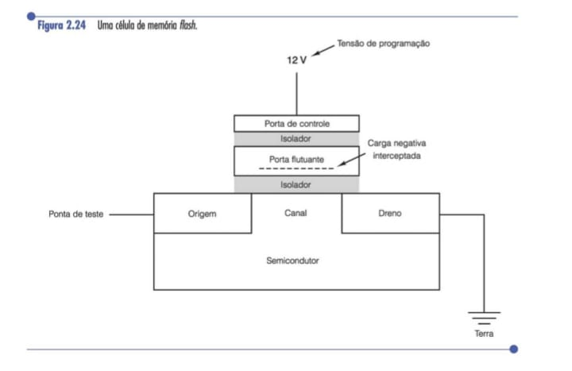

Mapeamento Técnico

        +------------------------+-------------------------------+---------------------------------------------+
        | Componente             | Função Crítica                | Aplicação Prática                           |
        +------------------------+-------------------------------+---------------------------------------------+
        | Endianness (2.11)      | Ordenação de bytes na RAM.    | Evita que seu analisador de pacotes leia    |
        |                        |                               | um IP "ao contrário".                       |
        +------------------------+-------------------------------+---------------------------------------------+
        | Hamming (2.15)         | Autocorreção de erros (ECC).  | Garante a integridade dos arquivos salvos   |
        |                        |                               | no seu servidor OCI.                        |
        +------------------------+-------------------------------+---------------------------------------------+
        | Flash (2.24)           | Retenção de carga persistente.| Tecnologia base do seu notebook e dos       |
        |                        |                               | backups criptografados que você faz.        |
        +------------------------+-------------------------------+---------------------------------------------+

Para programar uma célula de bit flash, uma alta tensão (no mundo dos computadores, 12 V é uma alta tensão) é aplicada à porta de controle, que acelera o processo de injeção de portadora quente na porta flutuante. Os elétrons são embutidos na porta flutuante, que coloca uma carga negativa interna no transistor flash. A carga negativa embutida aumenta a tensão necessária para ligar o transistor flash e, testando se o canal liga ou não com uma tensão alta ou baixa, é possível determinar se a porta flutuante está carregada ou não, resultando em um valor 0 ou 1 para a célula flash. A carga embutida permanece no transistor, mesmo que o sistema perca a alimentação, tornando a célula de memória flash não volátil.

Visto que os SSDs são basicamente memória, eles possuem desempenho superior aos discos giratórios, com tempo de busca zero. Enquanto um disco magnético típico pode acessar dados em até 100 MB/s, um SSD pode operar duas a três vezes mais rápido. E como o dispositivo não possui partes móveis, ele é muito adequado para uso em notebooks, onde trepidações e movimentos não afetarão sua capacidade de acessar dados. A desvantagem dos SSDs, em comparação com discos magnéticos, é o seu custo. Enquanto os discos magnéticos custam centavos de dólar por gigabyte, um SSD típico custará de um a três dólares por gigabyte, tornando seu uso apropriado apenas para aplicações com drive menor ou em situações em que o custo não é um problema. O custo dos SSDs está caindo, mas ainda há um longo caminho até que alcancem os discos magnéticos baratos. Assim, embora os SSDs estejam substituindo os discos magnéticos em muitos computadores, talvez ainda leve um bom tempo antes que o disco magnético siga o caminho dos dinossauros (a menos que outro grande meteoro atinja a Terra, mas nesse caso nem os SSDs sobreviveriam).

Outra desvantagem dos SSDs em comparação com os discos magnéticos é sua taxa de falha. Uma célula flash típica pode ser escrita somente por cerca de 100 mil vezes antes que não funcione mais. O processo de injetar elétrons na porta flutuante a danifica aos poucos, bem como seus isoladores ao redor, até que não funcione mais. Para aumentar o tempo de vida dos SSDs, é usada uma técnica denominada nivelamento de desgaste, para espalhar as escritas por todas as células flash no disco. Toda vez que um novo bloco de disco é escrito, o bloco de destino é reatribuído a um novo bloco do SSD, que não foi escrito recentemente. Isso exige o uso de um mapa de blocos lógicos dentro do drive flash, que é um dos motivos pelos quais os drives flash possuem altos overheads de armazenamento interno. Usando o nivelamento de desgaste, um drive flash pode dar suporte a uma quantidade de escritas igual ao
número de escritas que uma célula pode sustentar multiplicado pelo número de blocos no disco.

Alguns SSDs são capazes de codificar vários bits por byte, usando células flash multiníveis. A tecnologia controla cuidadosamente a quantidade de carga colocada na porta flutuante. Uma sequência cada vez maior de voltagens é então aplicada à porta de controle para determinar quanta carga é armazenada na flutuante. As células multiníveis típicas admitem quatro níveis de carga, resultando em dois bits por célula flash.

## 2.3.7 CD-ROMs
Discos ópticos foram desenvolvidos na origem para gravar programas e televisão, mas podem ser utilizados para uma função mais estética como dispositivos de armazenagem de computadores. Por sua grande capacidade e baixo preço, discos óticos são muito usados para distribuir software, livros, filmes e dados de todos os tipos, bem como para fazer backup de discos rígidos.

A primeira geração de discos óticos foi inventada pela Philips, conglomerado holandês de eletrônica, para conter filmes. Tinham 30 cm de diâmetro e eram comercializados com a marca LaserVision, mas não se estabeleceram, exceto no Japão.

Em 1980, a Philips, junto com a Sony, desenvolveu o CD (Compact Disc), que logo substituiu os discos de vinil de 33 1/3 RPM usados para gravar música. Os dados técnicos exatos do CD foram publicados em um Padrão Internacional (IS 10149), popularmente conhecido como Red Book (livro vermelho) por causa da cor de sua capa. (Padrões Internacionais são emitidos pela International Organization for Standardization, que é a contraparte internacional de grupos de padronização nacionais como ABNT, ANSI etc. Cada um tem um número IS.) O motivo da publicação das especificações do disco e do drive como um Padrão Internacional é permitir que CDs de diferentes gravadoras e aparelhos de reprodução de diferentes fabricantes funcionem em conjunto. Todos os CDs têm 120 mm de diâmetro 1,2 mm de espessura, com um orifício de 15 mm no meio. O CD de áudio foi o primeiro meio de armazenagem digital a ter sucesso no mercado de massa. Supõe-se que devam durar cem anos. Favor verificar em 2080 um relatório sobre como se saiu o primeiro lote.

Um CD é preparado com a utilização de um laser infravermelho de alta potência para queimar orifícios de 0,8 mícron de diâmetro em um disco mestre revestido de vidro. Com base nesse mestre é fabricado um molde, com saliências onde estavam os orifícios de laser. Então, injeta-se policarbonato fundido nesse molde para formar um CD com o mesmo padrão de orifícios do disco mestre revestido de vidro. Em seguida, é depositada uma fina camada de alumínio refletivo sobre o policarbonato, coberta por um verniz de proteção e, por fim, vem uma etiqueta. As marcas no substrato de policarbonato são denominadas depressões (pits) e as áreas entre elas são
denominadas planos (lands).

Quando o disco é tocado, um diodo a laser de baixa potência emite luz infravermelha de comprimento de onda de 0,78 mícron sobre as depressões e planos quando estes passam pela luz. O laser está no lado do policarbonato, portanto, as depressões estão invertidas na direção do laser e aparecem como saliências sobre uma superfície que, caso contrário, seria plana. Como as depressões têm uma altura de um quarto do comprimento de onda da luz de laser, a luz que se reflete de uma depressão tem uma defasagem de meio comprimento de onda em relação à que se reflete das superfícies que a circundam. O resultado é que as duas partes interferem uma com a outra de modo destrutivo e devolvem menos luz ao fotodetector do aparelho de reprodução do que a luz que se reflete
de um plano. É assim que o aparelho distingue uma depressão de um plano. Embora talvez pareça mais simples usar uma depressão para gravar um 0 e um plano para gravar um 1, é mais confiável usar uma transição depressão/plano ou plano/depressão para um 1 e sua ausência para um 0; portanto, esse é o esquema usado.

As depressões e os planos são escritos em uma única espiral contínua que começa perto do orifício central e continua por uma distância de 32 mm em direção à borda. A espiral faz 22.188 rotações ao redor do disco (cerca de 600 por mm). Se fosse desenrolada, teria 5,6 km de comprimento. A espiral é ilustrada na Figura 2.25.

**• Figura 2.25 Estrutura de gravação de um disco compacto ou CD-ROM.**

Para fazer a música ser tocada a uma taxa uniforme, é preciso que as depressões e os planos passem sob a luz a uma velocidade linear constante. Em consequência, a taxa de rotação deve ser continuamente reduzida à medida que o cabeçote de leitura se move da parte interna para a externa do CD. Na parte interna, a taxa de rotação é de 530 RPM para conseguir a taxa de reprodução regular de 120 cm/s; na parte mais externa, tem de cair para 200 RPM para dar a mesma velocidade linear no cabeçote. Um drive de velocidade linear constante é bem diferente de um drive de disco magnético, que funciona a uma velocidade angular constante, independente de onde o cabeçote esteja posicionado naquele momento. Além disso, 530 RPM estão bem longe das 3.600 a 7.200 RPM com as quais gira a maioria dos discos magnéticos.

Em 1984, a Philips e a Sony perceberam o potencial para usar CDs como meio de armazenagem de dados de computadores, então, publicaram o Yellow Book (livro amarelo) definindo um padrão exato para o que agora conhecemos como CD-ROMs (Compact Disc-Read Only Memory – disco compacto com memória somente de leitura). Para pegar carona no mercado de CDs de áudio, que já era substancial na época, os CD-ROMs tinham o mesmo tamanho físico dos CDs de áudio, guardavam compatibilidade mecânica e ótica com eles e eram produzidos usando as mesmas máquinas de moldagem por injeção. As consequências dessa decisão foram a necessidade de motores lentos de velocidade variável mas também que o custo de manufatura de um CD-ROM estivesse bem abaixo de um dólar para um volume moderado.

O Yellow Book definiu a formatação dos dados de computador. Também melhorou as capacidades de correção de erro do sistema, um passo essencial porque, embora os apreciadores de música não se importassem em perder um bit aqui, outro ali, os apreciadores de computadores tendiam a ser muito exigentes com isso. O formato básico de um CD-ROM consiste em codificar cada byte em um símbolo de 14 bits. Como já vimos, 14 bits são suficientes para codificar com Hamming um byte de 8 bits e ainda sobram 2. Na verdade, é usado um sistema de codificação mais poderoso. O mapeamento 14 para 8 para leitura é realizado em hardware por consulta de tabela.

Do nível seguinte para cima, um grupo de 42 símbolos consecutivos forma um quadro de 588 bits. Cada quadro contém 192 bits de dados (24 bytes). Os 396 bits restantes são usados para correção e controle de erro. Até aqui, esse esquema é idêntico para CDs e CD-ROMs.

O que o Yellow Book acrescenta é o agrupamento de 98 quadros em um setor de CD-ROM, conforme mostra a Figura 2.26. Cada setor de CD-ROM começa com um preâmbulo de 16 bytes, sendo os 12 primeiros 00FFFFFFFFFFFFFFFFFFFF00 (hexadecimal), para permitir que o aparelho de reprodução reconheça o início de um setor de CD-ROM. Os 3 bytes seguintes contêm o número do setor, necessário porque fazer busca em um CD-ROM com sua única espiral de dados é muito mais difícil do que em um disco magnético com suas trilhas
concêntricas uniformes. Para buscar, o software no drive calcula mais ou menos aonde ir, leva o cabeçote até lá e então começa a procurar um preâmbulo para verificar a precisão do cálculo. O último bit do preâmbulo é o modo.

**• Figura 2.26 Layout lógico de dados em um CD-ROM.**

Diferente dos setores magnéticos, o CD organiza os dados em símbolos de 14 bits que formam quadros e setores de 2.352 bytes no Modo 1.

    +-----------+---------------------------+-------+
    | Preâmbulo |           DADOS           |  ECC  |
    | (12 bytes)|       (2.048 bytes)       | (288) |
    +-----------+---------------------------+-------+
    |<------------------ 2.352 bytes ---------------->|

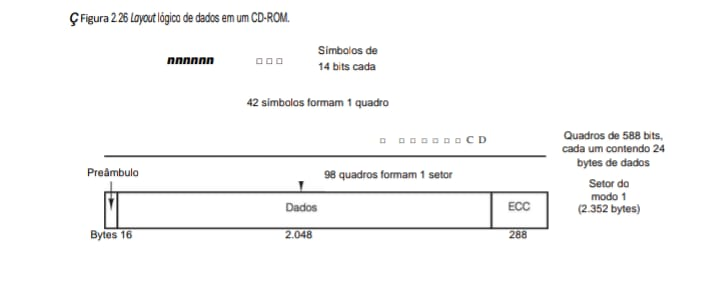

O CD-ROM utiliza uma hierarquia de encapsulamento: símbolos formam quadros, e quadros formam setores.

    HIERARQUIA DE DADOS (CD-ROM MODO 1)
    ===================================

    [SÍMBOLO] --> 14 bits (Codificação EFM)
        |
        | (42 símbolos)
        v
    [ QUADRO  ] --> 588 bits (contém 24 bytes de dados úteis)
        |
        | (98 quadros)
        v
    [  SETOR  ] --> 2.352 bytes totais

Estrutura de um Setor (2.352 bytes):

    +-----------+---------------------------+-----------+
    | PREÂMBULO |           DADOS           |    ECC    |
    | (12 bytes)|       (2.048 bytes)       | (288 bytes|
    +-----------+---------------------------+-----------+
    |  Sync/Id  |    Conteúdo Principal     | Correção  |
    +-----------+---------------------------+-----------+

Figura 2.26: Fluxo Lógico e Estrutura do CD-ROM (Modo 1)

    ===========================================================================
                        CAMADA DE PROCESSAMENTO (LÓGICA)
    ===========================================================================

    [ DADOS BRUTOS ] --> [ ENCODER EFM ] --> [ SINAL DO LASER ]
            |                  |                    |
            |          (8 bits -> 14 bits)      (Sincronismo)
            v                  v                    v
    Garante que não haja sequências longas de "0" ou "1".

    ===========================================================================
                        CAMADA DE ARMAZENAMENTO (FÍSICA)
    ===========================================================================

    ESTRUTURA DO SETOR (2.352 BYTES TOTAIS)
    +-----------+---------------------------------------+-----------+
    | PREÂMBULO |           DADOS DO USUÁRIO            |  ECC/EDC  |
    | (12 bytes)|           (2.048 bytes)               | (288 bytes|
    +-----------+---------------------------------------+-----------+
    | Sinc/ID   |     Conteúdo Real (Arquivos/Logs)     | Proteção  |
    +-----------+---------------------------------------+-----------+
            ^                                                 ^
            |                                                 |
    [ 16 Bytes Iniciais ]                     [ 13% de Sacrifício ]
                                                Contra riscos e sujeira.

    ===========================================================================
                        BARRAMENTO E TAXA DE TRANSFERÊNCIA
    ===========================================================================

    VELOCIDADE 1X:
    (75 setores/s)  x  (2.048 bytes úteis)  =  153.600 bytes/s (150 KB/s).

    CONEXÃO PROJETO IDS:
    Integridade de Pacotes <---------- Similar ----------> Integridade de Bits
    (Rede/C)                                              (Mídia Óptica).

O Yellow Book define dois modos. O modo 1 usa o layout da Figura 2.26, com um preâmbulo de 16 bytes, 2.048 bytes de dados e um código de correção de erro de 288 bytes (um código de Reed-Solomon de intercalação cruzada). O modo 2 combina os dados e campos ECC em um campo de dados de 2.336 bytes para as aplicações que não precisam de correção de erro (ou não dispõem de tempo para executá-la), como áudio e vídeo. Note que, para oferecer excelente confiabilidade, são usados três esquemas separados de correção de erros: dentro de um símbolo, dentro de um quadro e dentro de um setor de CD-ROM. Erros de único bit são corrigidos no nível mais
baixo, erros em rajada curtos são corrigidos no nível de quadro e quaisquer erros residuais são apanhados no nível de setor. O preço pago por essa confiabilidade é que são necessários 98 quadros de 588 bits (7.203 bytes) para transportar uma única carga útil de 2.048 bytes, uma eficiência de apenas 28%.

Drives de CD-ROM de uma velocidade operam a 75 setores/s, o que dá uma taxa de dados de 153.600 bytes/s em modo 1 e 175.200 bytes/s em modo 2. Drives de dupla velocidade são duas vezes mais rápidos e assim por diante, até a velocidade mais alta. Um CD padrão de áudio tem espaço para 74 minutos de música que, se usado para dados do modo 1, dá uma capacidade de 681.984.000 bytes. Esse número costuma ser informado como 650 MB, pois 1 MB é igual a 220 bytes (1.048.576 bytes), e não 1 milhão de bytes.

Como é muito comum, sempre que surge uma nova tecnologia, algumas pessoas tentam desafiar os limites. Ao projetar o CD-ROM, a Philips e a Sony foram cuidadosas e fizeram o processo de escrita parar bem antes que a borda externa do disco fosse alcançada. Não levou muito tempo para que alguns fabricantes permitissem que seus drives fossem além do limite oficial e chegassem perigosamente perto da borda física da mídia, gerando cerca de 700 MB em vez de 650 MB. Porém, quando a tecnologia foi aperfeiçoada e os discos vazios foram fabricados com um padrão mais alto, 703,12 MB (360 mil setores de 2.048 bytes, em vez de 333 mil setores) se tornaram a nova norma.

Note que mesmo um drive de CD-ROM 32x (4.915.200 bytes/s) não é páreo para o drive de disco magnético Fast SCSI-2 a 10 MB/s. Quando você se der conta de que o tempo de busca muitas vezes é de várias centenas de milissegundos, deve ficar claro que os drives de CD-ROM não estão de forma alguma na mesma categoria de desempenho dos drives de disco magnético, a despeito de sua grande capacidade.

Em 1986, a Philips atacou mais uma vez com o Green Book (livro verde), acrescentando recursos gráficos e a capacidade de intercalar áudio, vídeo e dados no mesmo setor, uma característica essencial para CD-ROMs multimídia.

A última peça do quebra-cabeça do CD-ROM é o sistema de arquivos. Para possibilitar a utilização do mesmo CD-ROM em diferentes computadores, era preciso chegar a um acordo quanto aos sistemas de arquivos em CD-ROM. Para conseguir esse acordo, representantes de muitas empresas fabricantes de computadores se reuniram em Lake Tahoe, nas High Sierras, na fronteira Califórnia-Nevada, e arquitetaram um sistema de arquivos que denominaram High Sierra. Mais tarde, ele evoluiu para um Padrão Internacional (IS 9660). O sistema tem três níveis. O nível 1 usa nomes de arquivo de até 8 caracteres e podem ser seguidos de uma extensão de até 3 caracteres (a convenção de nomeação de arquivos do MS-DOS). Nomes de arquivos só podem conter letras maiúsculas, dígitos e o caractere de sublinhado. Diretórios podem ser aninhados até oito, mas nomes de diretórios não podem conter extensões. O nível 1 requer que todos os arquivos sejam contíguos, o que não é problema para um meio que é escrito apenas uma vez. Qualquer CD-ROM que obedeça ao IS 9660 nível 1 pode ser lido usando MS-DOS, um computador Apple, um computador UNIX ou praticamente qualquer outro computador. Os fabricantes de CD-ROMs consideram essa propriedade uma grande vantagem.

O IS 9660 nível 2 permite nomes de até 32 caracteres e o nível 3 permite arquivos não contíguos. As extensões Rock Ridge (o nome extravagante se deve à cidade em que Mel Brooks filmou Blazing Saddles [Banzé no Oeste]) permitem nomes muito longos (para UNIX), UIDs, GIDs, e enlaces simbólicos, mas os CD-ROMs que não obedecem ao nível 1 não poderão ser lidos em todos os computadores.

## 2.3.8 CDs graváveis
De início, o equipamento necessário para produzir um CD-ROM mestre (ou CD de áudio, por falar nisso) era muito dispendioso. Mas, como sempre acontece na indústria de computadores, nada permanece caro por muito tempo. Em meados da década de 1990, gravadores de CD não maiores do que um reprodutor de CD eram um periférico comum disponível na maioria das lojas de computadores. Esses dispositivos ainda eram diferentes dos discos magnéticos porque, uma vez gravados, os CD-ROMs não podiam ser apagados. Ainda assim, eles logo encontraram um nicho como um meio de backup para grandes discos rígidos magnéticos e também permitiram que indivíduos ou novas empresas fabricassem seus próprios CD-ROMs em pequena escala ou produzissem mestres para fornecer a empresas comerciais de reprodução de grandes volumes de CDs. Esses drives são conhecidos como CD-Rs (CD-Recordables – CDs graváveis).

Os CD-Rs começaram com discos em branco de policarbonato de 120 mm de diâmetro que são como CD-ROMs, exceto por conterem um sulco de 0,6 mm de largura para guiar o laser durante a escrita (gravação). O sulco tem um desvio senoidal de 0,3 mm a uma frequência de exatos 22,05 kHz para prover realimentação contínua, de modo que a rotação possa ser monitorada e ajustada com precisão, caso necessário. Os primeiros CD-Rs pareciam CD-ROMs normais, exceto por terem a superfície superior dourada, e não prateada. Essa cor vinha da utilização de ouro verdadeiro em vez de alumínio na camada refletiva. Diferente dos CDs prateados que continham depressões físicas, nos CD-Rs as diferentes refletividades das depressões e dos planos têm de ser simuladas. Isso é feito com a adição de uma camada de corante entre o policarbonato e a superfície refletiva, como mostra a Figura 2.27. São usadas duas espécies de corantes: cianina, que é verde, e ftalocianina, que é amarelo-alaranjada. Os químicos podem discutir eternamente sobre qual das duas é melhor. Com o tempo, a camada refletiva dourada foi substituída por uma camada de alumínio.

**• Figura 2.27 - Seção transversal de um disco CD-R e laser (não está em escala). Um CD-ROM tem estrutura semelhante, exceto por não ter a camada de corante e por ter uma camada de alumínio cheia de depressões em vez de uma camada refletiva.**

Figura 2.27: Seção Transversal e Leitura de um CD-R
Diferente do CD-ROM prensado em fábrica, o CD-R usa uma camada de corante que é "queimada" pelo laser para representar os dados.

    ESTRUTURA FÍSICA (CAMADAS)
    ====================================
    [      Etiqueta Impressa       ]
    ------------------------------------
    [       Verniz Protetor        ]
    ------------------------------------
    [       Camada Refletiva       ]
    ------------------------------------
    [  Camada de Corante (Dye)     ] <--- Onde o laser "queima" o dado
    ------------------------------------
    [        Policarbonato         ] (1,2 mm de espessura)
    ====================================
            ^              |
            | [FEIXE]      | [REFLEXO]
            |              v
        +---------+    +--------------+
        |  Lente  |    | Fotodetector | <--- Lê 0 ou 1 pela luz refletida
        +---------+    +--------------+
            ^              |
            |    [PRISMA]--+
            |       |
        [ DIODO DE LASER ]

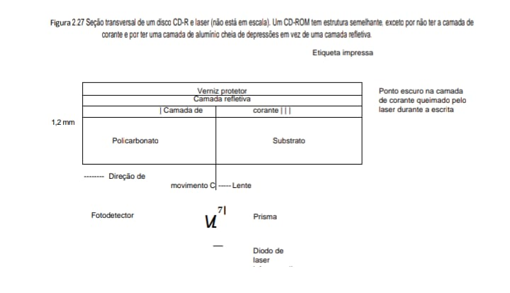

### Resumo para o Material de Estudos
 - CD-ROM vs. CD-R: No CD-ROM, as depressões são físicas (buracos no alumínio). No CD-R, são químicas (corante queimado).

 - Espessura: A camada de policarbonato de 1,2 mm serve como substrato e proteção, mantendo o laser focado apesar de pequenos arranhões na superfície.

Em seu estágio inicial, a camada de corante é transparente e permite que a luz do laser que a atravessa seja refletida pela camada refletiva. Para gravar (escrever), o laser CD-R é ligado em alta potência (8–16 mW). Quando o feixe atinge uma porção do corante, ele o aquece e rompe a ligação química. Essa alteração da estrutura molecular cria um ponto escuro. Quando o CD-R é lido (a 0,5 mW), o fotodetector vê uma diferença entre os pontos escuros onde o corante foi atingido e as áreas transparentes onde o disco está intacto. Essa diferença é interpretada como a diferença entre depressões e planos, mesmo quando lidas por um leitor de CD-ROM normal ou até mesmo por um reprodutor de CD de áudio.

Nenhum tipo novo de CD poderia se firmar com orgulho sem ter um livro colorido, portanto, o CD-R tem o Orange Book (livro laranja), publicado em 1989. Esse documento define o CD-R e também um novo formato, o CD-ROM XA, que permite que os CD-Rs sejam gravados por incrementos, alguns setores hoje, outros amanhã e mais alguns no próximo mês. Um grupo de setores consecutivos escritos de uma só vez é denominado trilha de CD-ROM.

Um dos primeiros usos do CD-R foi no PhotoCD da Kodak. Nesse sistema, o cliente leva ao processador de fotos um rolo de filme exposto e seu velho PhotoCD, e recebe de volta o mesmo PhotoCD com novas fotos acrescentadas às antigas. O novo lote, que é criado por digitalização dos negativos, é gravado no PhotoCD como uma trilha de CD-ROM separada. A gravação incremental é necessária porque os CD-Rs virgens são muito caros para se ter um novo para cada rolo de filme.

Contudo, a gravação incremental cria um novo problema. Antes do Orange Book, todos os CD-ROMs tinham, no início, uma única VTOC (Volume Table of Contents – sumário de conteúdo de volumes). Esse esquema não funciona com escritas incrementais (isto é, multitrilhas). A solução do Orange Book é dar a cada trilha de CD-ROM sua própria VTOC. Os arquivos listados na VTOC podem incluir alguns ou todos os arquivos de trilhas anteriores. Após a inserção do CD-R no drive, o sistema operacional faz uma busca em todas as trilhas do CD-ROM para localizar a VTOC mais recente, que dá o estado atual do disco. Por incluir alguns, mas não todos os arquivos de trilhas anteriores na VTOC corrente, é possível dar uma ilusão de que os arquivos foram apagados. As trilhas podem ser agrupadas em sessões, o que resulta em CD-ROMs multissessões. Reprodutores de CD de áudio padrão não podem manipular CDs multissessões, já que esperam uma única VTOC no início.

O CD-R possibilita que indivíduos e empresas copiem CD-ROMs (e CDs de áudio) com facilidade, em geral com a violação dos direitos autorais do editor. Vários esquemas já foram inventados para dificultar esse tipo de pirataria e também a leitura de um CD-ROM usando qualquer outra coisa que não seja o software do editor. Um deles envolve gravar todos os comprimentos de arquivos do CD-ROM como multigigabyte, frustrando quaisquer tentativas de copiar os arquivos para disco rígido com a utilização de software de cópia padrão. Os verdadeiros comprimentos estão embutidos no software do editor ou ocultos (possivelmente criptografados) no CD-ROM em um lugar não esperado. Outro esquema usa intencionalmente ECCs incorretos em setores selecionados, na esperança de que o software de cópia de CDs “corrija” os erros. O software de aplicação verifica os ECCs e se recusa a funcionar se estiverem “corrigidos”. Usar lacunas não padronizadas entre trilhas e outros “defeitos” físicos também são possibilidades.

## 2.3.9 CDs regraváveis
Embora todos estejam acostumados com outras mídias que aceitam apenas uma escrita, como papel fotográfico, existe uma demanda por CD-ROMs regraváveis. Uma tecnologia disponível agora é o CD-RW (CD-ReWritable – CDs regraváveis), que usa um meio do mesmo tamanho do CD-R. Contudo, em vez dos corantes cianina ou ftalocianina, o CD-RW usa uma liga de prata, índio, antimônio e telúrio para a camada de gravação. Essa liga tem dois estados estáveis: cristalino e amorfo, com diferentes refletividades.

Os drives de CD-RW usam lasers com três potências diferentes. Em alta potência, o laser funde a liga fazendo-a passar do estado cristalino de alta refletividade para o estado amorfo de baixa refletividade, para representar uma depressão. Em potência média, a liga se funde e volta a seu estado natural cristalino para se tornar novamente um plano. Em baixa potência, o estado do material é sondado (para leitura), mas não ocorre qualquer transição de fase.

A razão por que o CD-RW não substituiu completamente o CD-R é que os CD-RWs em branco são mais caros do que os CD-Rs em branco. Além disso, para aplicações de backup de discos rígidos, o fato de que, uma vez escrito, o CD não possa ser apagado acidentalmente, é uma grande vantagem, e não um bug.

## 2.3.10 DVD
O formato básico do CD/CD-ROM está na praça desde 1980. Em meados da década de 1990, a tecnologia melhorou bastante, de modo que discos ópticos de capacidade mais alta se tornaram economicamente viáveis. Ao mesmo tempo, Hollywood estava procurando um meio de substituir as fitas analógicas de videoteipe por discos digitais, pois estes têm qualidade mais alta, são mais baratos de fabricar, duram mais, ocupam menos espaço nas prateleiras das locadoras de vídeo e não precisam ser rebobinados. Estava parecendo que a roda do progresso para os discos óticos estava para girar mais uma vez.

Essa combinação de tecnologia e demanda por três indústrias imensamente ricas e poderosas resultou no DVD, na origem um acrônimo para Digital Video Disk (disco de vídeo digital), mas agora oficialmente Digital Versatile Disk (disco versátil digital). DVDs usam o mesmo desenho geral dos CDs, com discos de policarbonato de 120 mm moldados por injeção que contêm depressões e planos iluminados por um diodo de laser e lidos por um fotodetector. A novidade é o uso de

    1. Depressões menores (0,4 mícron versus 0,8 mícron para CDs).
    2. Uma espiral mais apertada (0,74 mícron entre trilhas versus 1,6 mícron para CDs).
    3. Um laser vermelho (a 0,65 mícron versus 0,78 mícron para CDs).

Juntas, essas melhorias aumentam sete vezes a capacidade, passando para 4,7 GB. Um drive de DVD 1x funciona a 1,4 MB/s (versus 150 KB/s para CDs). Infelizmente, a troca para lasers vermelhos usados em supermercados significa que os reprodutores de DVD precisarão de um segundo laser para poder ler os CDs e CD-ROMs existentes, aumentando um pouco de complexidade e custo.

Uma capacidade de 4,7 GB é suficiente? Talvez. Usando compressão MPEG-2 (padronizada no IS 13346), um disco DVD de 4,7 GB pode conter 133 minutos de vídeo de tela cheia com imagens em movimento em alta resolução (720 × 480), bem como trilhas sonoras em até oito idiomas e legendas em mais 32. Cerca de 92% de todos os filmes que Hollywood já produziu têm menos de 133 minutos. Não obstante, algumas aplicações, como jogos multimídia ou obras de referência, talvez precisem mais, e Hollywood gostaria de gravar vários filmes em um mesmo disco, portanto, quatro formatos foram definidos:

    1. Uma face, uma camada (4,7 GB).
   
    2. Uma face, duas camadas (8,5 GB).
   
    3. Duas faces, uma camada (9,4 GB).
   
    4. Duas faces, duas camadas (17 GB).

Por que tantos formatos? Em uma palavra: política. A Philips e a Sony queriam discos de uma única face com duas camadas para a versão de alta capacidade, mas a Toshiba e a Time Warner queriam discos de duas faces, com uma camada. A Philips e a Sony não imaginaram que as pessoas estariam dispostas a virar os discos, e a Time Warner não acreditava que colocar duas camadas em uma face poderia funcionar. A solução de conciliação: todas as combinações, mas o mercado determinará quais sobreviverão. Bem, o mercado falou. A Philips e a Sony estavam certas. Nunca aposte contra a tecnologia.

A tecnologia da camada dupla tem uma camada refletiva embaixo, coberta por uma semirrefletiva. Dependendo de onde o laser for focalizado, ele se reflete de uma camada ou da outra. A camada inferior precisa de depressões e planos um pouco maiores, para leitura confiável, portanto, sua capacidade é um pouco menor do que a da superior. Discos de dupla face são fabricados colando dois discos de uma face de 0,6 mm. Para que todas as versões tenham a mesma espessura, um disco de uma face consiste em um disco de 0,6 mm colado a um substrato em branco (ou, talvez, no futuro, contendo 133 minutos de propaganda, na esperança de que as pessoas ficarão curiosas de saber o que existe lá dentro). A estrutura do disco de dupla face, dupla camada, é ilustrada na Figura 2.28.

**• Figura 2.28 - Disco de DVD de dupla face, dupla camada.**

Diferente do CD-ROM (Figura 2.26), o DVD aumenta a densidade usando duas camadas de dados em cada face do disco, separadas por uma camada semirreflexiva.

    ESTRUTURA DO DVD (DUPLA CAMADA)
    ==========================================
    [ Substrato de Policarbonato 1 (0,6 mm)  ]
    ------------------------------------------
    [ Camada Semirreflexiva (Dados Camada 1) ]
    ------------------------------------------
    [ Refletor de Alumínio (Dados Camada 0)  ]
    ------------------------------------------
    <<<<<<<< CAMADA ADESIVA (CENTRO) >>>>>>>>>>
    ------------------------------------------
    [ Refletor de Alumínio (Dados Camada 0)  ]
    ------------------------------------------
    [ Camada Semirreflexiva (Dados Camada 1) ]
    ------------------------------------------
    [ Substrato de Policarbonato 2 (0,6 mm)  ]
    ==========================================

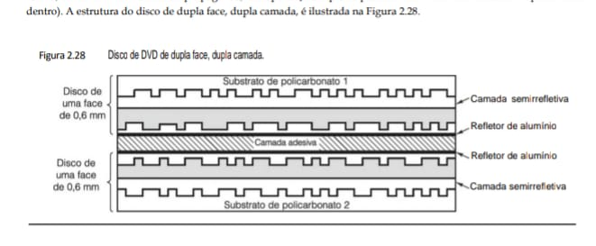

O DVD foi arquitetado por um consórcio de dez fabricantes de eletrônicos de consumo, sete deles japoneses, em estreita colaboração com os principais estúdios de Hollywood (alguns dos quais são de propriedade dos fabricantes de eletrônicos japoneses pertencentes ao consórcio). As empresas de computadores e telecomunicações não foram convidadas para o piquenique e o foco resultante foi o uso do DVD para locação de filmes. Por exemplo, entre as características padrão está a capacidade de saltar cenas impróprias em tempo real (o que permite que os pais transformem um filme proibido para menores de 18 anos em um filme que possa ser visto por
criancinhas), seis canais de som e suporte para Pan-and-Scan. Essa última característica permite que o tocador de DVD decida dinamicamente como recortar as extremidades direita e esquerda dos filmes (cuja relação largura/ altura é 3:2) para que se ajustem aos tamanhos das telas de aparelhos de televisão atuais (cuja relação é 4:3).

Outro item em que a indústria de computadores provavelmente não teria pensado é uma incompatibilidade intencional entre discos destinados aos Estados Unidos e discos destinados à Europa, e ainda outros padrões para outros continentes. Hollywood exigiu essa “característica” porque filmes novos são sempre lançados antes nos Estados Unidos e então despachados para a Europa quando os vídeos começam a sair do circuito comercial nos Estados Unidos. A ideia era garantir que as locadoras de vídeo não pudessem comprar vídeos nos Estados Unidos muito cedo, o que reduziria as receitas de filmes novos nos cinemas da Europa. Se Hollywood estivesse no controle na indústria de computadores, teríamos disquetes de 3,5 polegadas nos Estados Unidos e disquetes de 9 cm
na Europa.

## 2.3.11 Blu-ray
Nada fica parado no negócio de computadores, certamente não na tecnologia de armazenagem. O DVD mal acabara de ser lançado e seu sucessor já ameaçava torná-lo obsoleto. O sucessor do DVD é o Blu-ray (raio azul), assim chamado porque usa um laser azul, em vez do vermelho usado por DVDs. Um laser azul tem comprimento de onda mais curto do que o laser vermelho, o que permite um foco mais preciso e, portanto, depressões e planos menores. Discos Blu-ray de uma face contêm cerca de 25 GB de dados; os de dupla face contêm cerca de 50 GB. A taxa de dados é mais ou menos 4,5 MB/s, o que é bom para um disco óptico, mas ainda insignificante em
comparação com discos magnéticos (cf. ATAPI-6 a 100 MB/s e wide Ultra5 SCSI a 640 MB/s). Espera-se que, com o tempo, o Blu-ray substitua CD-ROMs e DVDs, mas essa transição ainda levará alguns anos.

## 2.4 Entrada/Saída
Como mencionamos no início deste capítulo, um sistema de computador tem três componentes principais: a CPU, as memórias (primária e secundária) e os equipamentos de E/S (entrada/saída), ou I/O (Input/Output), como impressoras, scanners e modems. Até aqui, só examinamos CPU e as memórias. Agora, é hora de examinar os equipamentos de E/S e como eles estão conectados ao restante do sistema.

## 2.4.1 Barramentos
A maioria dos computadores pessoais e estações de trabalho tem uma estrutura semelhante à mostrada na Figura 2.29. O arranjo comum é um gabinete de metal que contém uma grande placa de circuito impresso na parte inferior, denominada placa-mãe (ou placa-pai, para os que preferirem). A placa-mãe contém o chip da CPU, alguns encaixes para os módulos DIMM e vários chips de suporte. Contém também um barramento ao longo do comprimento e soquetes nos quais os conectores de borda das placas de E/S podem ser inseridos.

**• Figura 2.29 Estrutura física de um computador pessoal.**

    VISTA INTERNA DO GABINETE (Slots de Expansão)
    =======================================================
    |                                                       |
    |   [ PLACA DE SOM ]----------------+                   |
    |                                   |                   |
    |   [    MODEM     ]--------------+ |  (Conectores      |
    |                                 | |   de Borda)       |
    |   [ CONTROLADOR  ]------------+ | |                   |
    |   [    SCSI      ]            | | |                   |
    |                               v v v                   |
    |   _________________________________________________   |
    |  | [S] [L] [O] [T] [S]    D  E    B  A  R  R  A  | |  |
    |  |_______________________________________________|_|  |
    |                                                       |
    |                    PLACA-MÃE (Motherboard)            |
    =======================================================

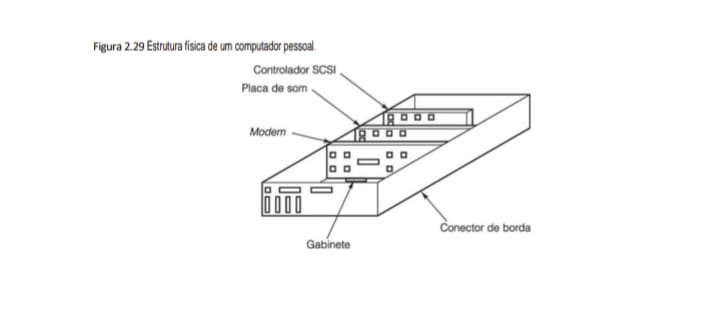

A estrutura lógica de um computador pessoal simples pode ser vista na Figura 2.30. Esse computador tem um único barramento para conectar a CPU, a memória e os equipamentos de E/S; a maioria dos sistemas tem dois ou mais barramentos. Cada dispositivo de E/S consiste em duas partes: uma que contém grande parte da eletrônica, denominada controlador, outra que contém o dispositivo de E/S em si, tal como um drive de disco. O controlador está em geral contido em uma placa que é ligada a um encaixe livre. Mesmo o monitor não sendo opcional, o controlador de vídeo às vezes está localizado em uma placa de encaixe (plug-in) para permitir que o usuário escolha entre placas com ou sem aceleradores gráficos, memória extra e assim por diante. O controlador se conecta com
seu dispositivo por um cabo ligado ao conector na parte de trás do gabinete.

**• Figura 2.30 Estrutura lógica de um computador pessoal simples.**

A Figura 2.30 é a peça final ideal. Ela integra a CPU e a memória com os controladores de periféricos (vídeo, teclado, CD-ROM e disco rígido) que discutimos nas figuras anteriores.

    [ MONITOR ]  [ TECLADO ]  [ DRIVE CD ]  [ DRIVE HDD ]
         |            |            |             |
    +----+----+  +----+----+  +----+----+   +----+----+
    | CTRL    |  | CTRL    |  | CTRL    |   | CTRL    |
    | VÍDEO   |  | TECLADO |  | CD-ROM  |   | DISCO   |
    +----+----+  +----+----+  +----+----+   +----+----+
         |            |            |             |
    [ CPU ]      [ MEMÓRIA ]       |             |
    |            |                 |             |
    ==+============+================+=============+====== [ BARRAMENTO ]

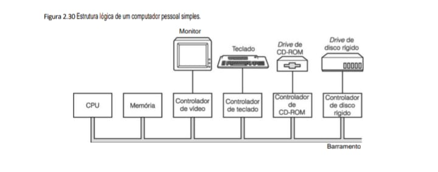

A função de um controlador é controlar seu dispositivo de E/S e manipular para ele o acesso ao barramento. Quando um programa quer dados do disco, por exemplo, ele envia um comando ao controlador de disco, que então emite comandos de busca e outros comandos para o drive. Quando a trilha e o setor adequados forem localizados, o drive começa a entregar dados ao controlador como um fluxo serial de bits. É função do controlador dividir o fluxo de bits em unidades e escrever cada uma delas na memória, à medida que seja montada. Uma unidade típica é composta de uma ou mais palavras. Quando um controlador lê ou escreve dados de ou para
a memória sem intervenção da CPU, diz-se que ele está executando acesso direto à memória (Direct Memory Access), mais conhecido por seu acrônimo DMA. Concluída a transferência, o controlador normalmente causa uma interrupção, forçando a CPU a suspender de imediato o programa em execução e começar a rodar um procedimento especial, denominado rotina de interrupção, para verificar erros, executar qualquer ação especial necessária e informar ao sistema operacional que a E/S agora está concluída. Quando a rotina de interrupção conclui sua tarefa, a CPU continua com o programa que foi suspenso quando ocorreu a interrupção.

O barramento não é usado apenas pelos controladores de E/S, mas também pela CPU para buscar instruções e dados. O que acontece se a CPU e um controlador de E/S quiserem usar barramento ao mesmo tempo? A resposta é que um chip, denominado árbitro de barramento, decide o que acontece em seguida. Em geral, é dada a preferência aos dispositivos de E/S sobre a CPU, porque discos e outros dispositivos que estão em movimento não podem ser interrompidos, e obrigá-los a esperar resultaria em perda de dados. Quando não há nenhuma E/S em curso, a CPU pode ficar com todos os ciclos do barramento para si própria, para referenciar a memória. Contudo,
quando algum dispositivo de E/S também estiver executando, ele requisitará e terá acesso ao barramento sempre que precisar. Esse processo é denominado roubo de ciclo, e reduz a velocidade do computador.

Esse projeto funcionou bem para os primeiros computadores pessoais, já que todos os componentes estavam em certo equilíbrio. Contudo, à medida que CPUs, memórias e dispositivos de E/S ficavam mais rápidos, surgiu um problema: o barramento não dava mais conta da carga apresentada. Em um sistema fechado, tal como uma estação de trabalho de engenharia, a solução foi projetar um novo barramento mais rápido para o próximo modelo.

Como ninguém nunca passava dispositivos de E/S de um modelo antigo para um novo, essa abordagem funcionou bem.

Todavia, no mundo do PC, quem passava para uma CPU mais potente muitas vezes queria levar sua impressora, scanner e modem para o novo sistema. Além disso, tinha-se desenvolvido uma imensa indústria destinada a fornecer uma ampla gama de dispositivos de E/S para o barramento do IBM PC, e essa indústria não estava nem um pouco interessada em perder todo seu investimento e começar de novo. A IBM aprendeu isso do modo mais difícil quando lançou o sucessor do IBM PC, a linha PS/2. O PS/2 tinha um barramento novo e mais rápido, mas a maioria dos fabricantes de clones continuava a usar o antigo barramento do PC, agora denominado barramento
ISA (Industry Standard Architecture). A maioria dos fabricantes de discos e dispositivos de E/S continuou a fabricar controladores para ele, e a IBM se viu enfrentando a peculiar situação de ser a única fabricante de PCs que não eram mais compatíveis com o PC da IBM. Com o tempo, a empresa foi forçada a dar suporte ao barramento ISA. Hoje, o barramento ISA é usado em sistemas legados e em museus de computador, pois foi substituído por arquiteturas de barramento padrão mais novas e mais rápidas. Como um comentário à parte, favor notar que ISA quer dizer Instruction Set Architecture (arquitetura do conjunto de instruções) no contexto de níveis
de máquina, ao passo que no contexto de barramentos quer dizer Industry Standard Architecture (arquitetura padrão da indústria).

### Os barramentos PCI e PCIe
Não obstante, a despeito da pressão do mercado para que nada mudasse, o antigo barramento era mesmo muito lento, portanto, era preciso fazer algo. Essa situação levou outras empresas a desenvolver máquinas com múltiplos barramentos, um dos quais era o antigo barramento ISA, ou seu sucessor compatível, o EISA (Extended ISA – ISA estendido). Agora, o mais popular deles é o barramento PCI (Peripheral Component Interconnect – interconexão de componentes periféricos). Esse barramento foi projetado pela Intel, mas a empresa decidiu passar todas as patentes para domínio público, a fim de incentivar toda a indústria (incluindo seus concorrentes) a adotá-lo.

O barramento PCI pode ser usado em muitas configurações, mas a Figura 2.31 ilustra uma configuração típica. Nesse caso, a CPU se comunica com um controlador de memória por meio de uma conexão dedicada, de alta velocidade. O controlador se comunica diretamente com a memória e com o barramento PCI, de modo que o tráfego CPU-memória não passa pelo barramento PCI. Outros periféricos podem ser conectados diretamente ao barramento PCI. Uma máquina com esse projeto teria dois ou três conectores PCI vazios, permitindo que os clientes conectem placas de E/S PCI para novos periféricos.

Qualquer que seja a velocidade de algo no mundo da computação, muita gente acha que ela é baixa. Esse destino também caiu sobre o barramento PCI, que está sendo substituído pelo PCI Express, abreviado como PCIe. A maior parte dos computadores modernos tem suporte para ele, de modo que os usuários podem conectar dispositivos novos e velozes ao barramento PCIe e os mais antigos e mais lentos ao barramento PCI.

**• Figura 2.31 PC típico montado em torno do barramento PCI. O controlador SCSI é um dispositivo PCI.**

Figura 2.31: PC Típico e o Barramento PCI 
Esta figura ilustra uma arquitetura mais avançada que a anterior, introduzindo o conceito de Ponte (Bridge) para separar o tráfego da CPU/Memória do tráfego de periféricos no barramento PCI.

    ARQUITETURA DE BARRAMENTO PCI
    =======================================
    [ CPU + Cache ] <--- Barramento de Memória ---> [ MEMÓRIA PRINCIPAL ]
            |                                               |
            +--------------[ PONTE PARA PCI ]---------------+
                                    |
            _______________________|________________________
            |          |            |           |            |
    [ CTRL VÍDEO ] [ CTRL REDE ]  |    [ CTRL SCSI ]-------+
                                    |           |            |
                                    |     [ DISCO SCSI ] [ SCANNER ]
    ================================================================
                            BARRAMENTO PCI

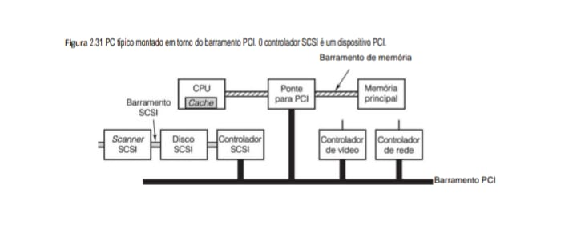

    ------------------------+--------------------------------+---------------------------------------------+
    | Componente            | Função Estrutural              | Relevância                                  |
    +-----------------------+--------------------------------+---------------------------------------------+
    | Ponte para PCI (2.31) | Coordena a comunicação entre   | Garante que o processamento do seu IDS não  |
    |                       | o barramento de alta velocidade| seja interrompido por periféricos lentos.   |
    |                       | da CPU e o barramento PCI.     |                                             |
    +-----------------------+--------------------------------+---------------------------------------------+
    | Barramento SCSI (2.31)| Um barramento secundário       | Demonstra a hierarquia de comunicação que   |
    |                       | dedicado a dispositivos de     | você estuda em Sistemas Operacionais.       |
    |                       | armazenamento e scanners.      |                                             |
    +-----------------------+--------------------------------+---------------------------------------------+
    | RAID Nível 5 (2.23)   | Utiliza paridade distribuída   | Melhor custo-benefício para os backups dos  |
    |                       | (sombreada na imagem) para     | seus projetos de C e Java.                  |
    |                       | segurança de dados.            |                                             |
    +-----------------------+--------------------------------+---------------------------------------------+

### Resumo de Armazenamento Consolidado
 - HDD (2.20 e 2.21): Organizam dados em superfícies múltiplas (0 a 7) e utilizam gravação em zonas para otimizar o espaço físico.

 - Flash (2.24): Baseia-se na captura de carga negativa na Porta Flutuante através de isoladores para manter o bit gravado.

 - CD-R (2.27): Utiliza um laser infravermelho para queimar pontos escuros na Camada de Corante, alterando a reflexão captada pelo fotodetector.

Enquanto o barramento PCI foi apenas uma atualização para o ISA mais antigo, com velocidades mais altas e mais bits transferidos em paralelo, o PCIe representa uma mudança radical do PCI. Na verdade, ele sequer é um barramento. É uma rede ponto a ponto usando linhas de bits seriais e troca de pacotes, mais parecido com a Internet do que com um barramento tradicional. Sua arquitetura aparece na Figura 2.32.

**• Figura 2.32 Exemplo de arquitetura de um sistema PCIe com três portas PCIe.**

A Figura 2.32 detalha a arquitetura PCIe (PCI Express), que é o padrão atual de comunicação de alta velocidade no seu Lenovo IdeaPad Gaming 3. Diferente do barramento PCI compartilhado (Fig. 2.31), o PCIe utiliza conexões ponto a ponto e um Complexo Raiz para gerenciar o tráfego.

    +-----------------------------------------------------------------------+
    |                   ARQUITETURA MODERNA (PCI EXPRESS)                   |
    |=======================================================================|
    |                                                                       |
    |   [   CPU    ]                                      [  MEMÓRIA  ]     |
    |   [  Cache   ]                                      [           ]     |
    |       |                                                   |           |
    |  +----+---------------------------------------------------+----+      |
    |  |                        COMPLEXO RAIZ                        |      |
    |  +---------+--------------------+--------------------+---------+      |
    |            |                    |                    |                |
    |        (Porta 1)            (Porta 2)            (Porta 3)            |
    |            |                    |                    |                |
    |       [ SWITCH ]           [ DISPOSITIVO]      [ PONTE PARA ]         |
    |      /     |    \          [    PCIe    ]      [     PCI    ]         |
    |     /      |     \                                   |                |
    | [PCIe]  [PCIe]  [PCIe]                      ========+========         |
    |                                              BARRAMENTO PCI           |
    |                                             [PCIe]   [PCIe]           |
    |                                                                       |
    |=======================================================================|
    |                COMUNICAÇÃO SERIAL PONTO A PONTO                       |
    +-----------------------------------------------------------------------+

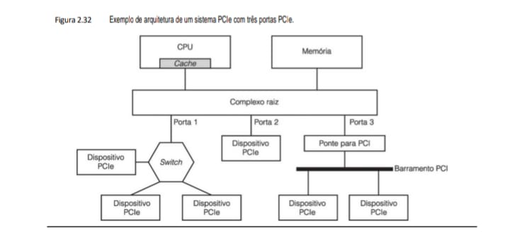

    +------------------------+-------------------------------+---------------------------------------------+
    | Processamento          | Armazenamento                 |                                             |
    +------------------------+-------------------------------+---------------------------------------------+
    | Complexo Raiz (Root    | Célula Flash (2.24)           |                                             |
    | Complex)               |                               |                                             |
    | Interface que conecta  | Estrutura de porta flutuante  |                                             |
    | a CPU e a memória ao   | que retém dados no seu SSD    |                                             |
    | restante do sistema de | através de isoladores         |                                             |
    | entrada/saída (I/O).   | semicondutores.               |                                             |
    +------------------------+-------------------------------+---------------------------------------------+
    | BARRAMENTO INTERNO     |                               | Conexão com seu Projeto                     |
    +------------------------+-------------------------------+---------------------------------------------+
    | Switch PCIe (2.31)     |                               | "Permite a expansão de uma única porta      |
    |                        |                               | PCIe para múltiplos dispositivos,           |
    |                        |                               | gerenciando as rotas de dados."             |
    |                        |                               | Esta arquitetura permite que sua GPU        |
    |                        |                               | (Gaming 3) e sua placa de rede trabalhem    |
    |                        |                               | em paralelo sem gargalos no IDS.            |
    +------------------------+-------------------------------+---------------------------------------------+
    | Ponte para PCI         |                               | Retrocompatibilidade                        |
    |                        |                               | Conector lógico que permite que             |
    |                        |                               | dispositivos PCI antigos funcionem em       |
    |                        |                               | placas-mãe modernas com PCIe.               |
    |                        |                               | "Assim como no seu estudo de Sociologia,    |
    |                        |                               | a evolução mantém estruturas antigas        |
    |                        |                               | integradas a novos contextos."              |
    +------------------------+-------------------------------+---------------------------------------------+

### Notas de Revisão de Hardware
 - Diferencial PCIe: Enquanto o barramento antigo (Fig. 2.30) era paralelo e compartilhado, o PCIe é serial e utiliza "lanes" (vias) dedicadas, o que elimina a colisão de dados entre periféricos.

 - Integridade Óptica: Lembre-se que dispositivos conectados via PCIe podem ser drivers de CD-ROM (Fig. 2.26) ou CD-R (Fig. 2.27), onde o laser lê dados organizados em quadros de 588 bits com proteção ECC.

Várias coisas se destacam de imediato sobre o PCIe. Primeiro, as conexões entre os dispositivos são seriais, ou seja, 1 bit de largura em vez de 8, 16, 32 ou 64 bits. Embora se possa pensar que uma conexão de 64 bits teria uma largura de banda mais alta do que uma conexão de 1 bit, na prática, as diferenças no tempo de propagação dos 64 bits, chamadas de skew (distorção), significa que precisam ser usadas velocidades relativamente baixas. Com uma conexão serial, velocidades muito mais altas podem ser usadas, e isso compensa bastante a perda de paralelismo. Os barramentos PCI trabalham com uma taxa de clock máxima de 66 MHz. Com 64 bits transferidos por ciclo, a taxa de dados é de 528 MB/s. Com uma taxa de clock de 8 GHz, até mesmo com transferência serial, a taxa de dados do PCIe é de 1 GB/s. Além do mais, os dispositivos não estão limitados a um único par de fios para se comunicarem com o complexo raiz ou com um switch. Um dispositivo pode ter até 32 pares de fios, chamados de lanes (pistas). Essas pistas não são síncronas, de modo que a distorção não é importante aqui. A maioria das placas-mãe tem um encaixe de 16 pistas para a placa gráfica, que no PCIe 3.0 dará à placa gráfica uma largura de banda de 16 GB/s, cerca de 30 vezes mais rápida do que uma placa gráfica PCI pode oferecer. Essa largura de banda é necessária para aplicações cada vez mais exigentes, como gráficos em 3D.

Segundo, toda a comunicação é ponto a ponto. Quando a CPU quer falar com um dispositivo, ela lhe envia um pacote e, em geral, recebe uma resposta depois. O pacote passa pelo complexo raiz, que está na placa-mãe, e depois para o dispositivo, possivelmente por um switch (ou, se o dispositivo for um PCI, por uma ponte para PCI). Essa evolução de um sistema em que todos os dispositivos escutavam o mesmo barramento para um que utiliza comunicações ponto a ponto é semelhante ao desenvolvimento das redes Ethernet (uma rede local muito popular), que também começou com um canal de broadcast, mas agora utiliza switches para permitir a comuni-
cação ponto a ponto.

## 2.4.2 Terminais
Há muitos tipos de dispositivos de E/S disponíveis. Alguns dos mais comuns são discutidos a seguir. Terminais de computador consistem em duas partes: um teclado e um monitor. No mundo dos mainframes, essas partes costumam ser integradas em um único dispositivo ligado ao computador principal por uma linha serial ou por uma linha telefônica. Nos setores de reserva de passagens aéreas, bancário e em outros setores que usam mainframes, esses dispositivos ainda estão sendo usados. No mundo dos computadores pessoais, o teclado e o monitor são dispositivos independentes. Qualquer que seja o caso, a tecnologia das duas partes é a mesma.

**• Teclados**
Há uma grande variedade de teclados. O IBM PC original vinha com um teclado munido de um contato mecânico sob cada tecla, que dava retorno tátil e emitia um clique quando a tecla era apertada corretamente. Hoje, os teclados mais baratos têm teclas que fazem apenas contato mecânico quando acionados. Os melhores têm uma lâmina de material elastométrico – espécie de borracha – entre as teclas e a placa de circuito impresso que está por baixo. Sob cada tecla há uma pequena saliência que cede quando pressionada corretamente. Um pontinho de material condutor dentro da saliência fecha o circuito. Alguns teclados têm um ímã sob cada tecla, que passa por uma bobina quando pressionado, induzindo assim a uma corrente que pode ser detectada. Também há vários outros métodos em uso, mecânicos e eletromagnéticos.

Em computadores pessoais, quando uma tecla é pressionada, uma interrupção é gerada e a rotina de interrupções do teclado (uma parte do software do sistema operacional) é executada. A rotina de interrupções lê um registrador de hardware dentro do controlador de teclado para pegar o número da tecla (1 a 102) que acabou de ser pressionada. Quando a tecla é solta, ocorre uma segunda interrupção. Assim, se um usuário pressionar SHIFT, e em seguida pressionar e soltar M, e depois soltar SHIFT, o sistema operacional pode ver que o usuário quer um “M”, e não um “m”. O tratamento de sequências de várias teclas envolvendo SHIFT, CTRL e ALT é todo feito em software (incluindo a abominável sequência CTRL-ALT-DEL, que é usada para reiniciar PCs).

**• Touch screens**
Embora os teclados não ofereçam perigo de atrapalhar a máquina de escrever manual, há um novo sujeito na praça quando se trata de entrada do computador: uma touch screen (tela sensível ao toque). Embora esses dispositivos só tenham se tornado itens do mercado de massa com a introdução do iPhone da Apple em 2007, eles são muito mais antigos. A primeira tela sensível ao toque foi desenvolvida no Royal Radar Establishment, em Malvern, Grã-Bretanha, em 1965. Até mesmo a capacidade de encolhimento na tela, tão anunciada pelo iPhone, vem do trabalho inicial na Universidade de Toronto em 1982. Desde então, muitas tecnologias diferentes foram
desenvolvidas e comercializadas.

Dispositivos de toque podem ser encontrados em duas categorias: opacos e transparentes. Um dispositivo sensível ao toque opaco é o touchpad de um notebook. Um dispositivo transparente típico é a tela de um smart­phone ou tablet. Vamos analisar apenas o segundo. Eles costumam ser chamados de touch screens. Os principais tipos de touch screens são infravermelho, resistivo e capacitivo.

As telas infravermelhas são transmissores de infravermelho, como os diodos ou lasers emissores de luz infravermelha (por exemplo) nas bordas esquerda ou superior do engaste em torno da tela e detectores nas bordas direita e inferior. Quando um dedo, caneta ou qualquer objeto opaco bloqueia um ou mais raios, o detector correspondente sente a queda no sinal e o hardware do dispositivo pode dizer ao sistema operacional quais raios foram bloqueados, permitindo que ele calcule a coordenadas (x, y) do dedo ou caneta. Embora esses dispositivos já tenham sido usados há algum tempo em quiosques e outras aplicações, eles não usados
para dispositivos móveis.

Outra tecnologia antiga consiste em touch screens resistivas. Estas consistem em duas camadas, sendo a superior flexível. Ela contém uma grande quantidade de fios horizontais. A inferior contém fios verticais. Quando um dedo ou outro objeto pressiona um ponto na tela, um ou mais dos fios entra em contato com os fios perpendiculares na camada inferior. Os circuitos eletrônicos do dispositivo possibilitam a leitura de qual área foi pressionada. Essas telas não são caras para se montar, e são muito usadas em aplicações mais simples.

As duas tecnologias são boas quando a tela é pressionada por um dedo, mas têm um problema quando dois dedos são usados. Para descrever a questão, usaremos a terminologia da touch screen infravermelha, mas a resistiva tem a mesma dificuldade. Imagine que os dois dedos estejam em (3, 3) e (8, 8). Como resultado, os feixes verticais x = 3 e x = 8 são interrompidos, assim como os feixes horizontais y = 3 e y = 8. Agora, imagine um cenário diferente, com os dedos em (3, 8) e (8, 3), que são os cantos opostos do retângulo cujos ângulos são (3, 3), (8,3), (8, 8) e (3, 8). Exatamente os mesmos feixes são bloqueados, de modo que o software não sabe qual dos dois cenários é o correto. Esse problema é conhecido como ghosting.

Para poder detectar vários dedos ao mesmo tempo – uma propriedade exigida para os gestos de encolhimento e expansão –, uma nova tecnologia foi necessária. Aquela usada na maioria dos smartphones e tablets (mas não em câmeras digitais e outros dispositivos) é a touch screen capacitiva projetada. Existem vários tipos, mas o mais comum é o tipo de capacitância mútua. Todas as touch screens que podem detectar dois ou mais pontos de contato ao mesmo tempo são conhecidas como telas multitoque. Vejamos rapidamente como elas funcionam.

Para os leitores que estão meio enferrujados em sua física do colégio, um capacitor é um dispositivo que pode armazenar carga elétrica. Um capacitor simples tem dois condutores separados por um isolador. Nas touch screens modernas, um padrão tipo grande com “fios” finos correndo verticalmente é separado de uma grade horizontal por uma camada isolante fina. Quando um dedo toca na tela, ela muda a capacitância em todas as intersecções tocadas (possivelmente afastadas). Essa mudança pode ser medida. Como uma demonstração de que uma touch screen moderna não é como as antigas telas infravermelhas e resistivas, tente tocar em uma com uma
caneta, lápis, clipe de papel ou dedo com luva e você verá que nada acontece. O corpo humano é bom para armazenar carga elétrica, como pode ser comprovado dolorosamente por qualquer um que já tenha se arrastado por um tapete em um dia frio e seco e depois tocado em uma maçaneta de metal. Instrumentos de plástico, madeira e metal não são tão bons quanto pessoas em termos de sua capacitância.

Os “fios” em uma touch screen não são os fios de cobre comuns, encontrados nos dispositivos elétricos normais, pois bloqueariam a luz da tela. Em vez disso, eles são tiras finas (em geral, com 50 micra) de óxido de índio-estanho condutor, ligadas em lados opostos de uma placa fina de vidro, que juntos formam os capacitores. Em alguns dispositivos mais novos, a placa de vidro isolante é substituída por uma fina camada de dióxido de silício (areia!), com as três camadas salpicadas (átomo por átomo) em algum substrato. De qualquer forma, os capacitores são protegidos contra poeira e arranhões por uma placa de vidro acima disso, para formar a superfície da tela a ser tocada. Quanto mais fina a placa de vidro superior, mais sensível é o desempenho, porém, mais frágil é o dispositivo.

Em operação, tensões são aplicadas alternadamente aos “fios” horizontal e vertical, enquanto os valores de tensão, que são afetados pela capacitância de cada intersecção, são lidos dos outros. Essa operação é repetida muitas vezes por segundo, com as coordenadas tocadas sendo alimentadas no controlador do dispositivo como um fluxo de pares (x, y). Mais processamento, como determinar se ocorre apontamento, compressão, expressão ou toque, é feito pelo sistema operacional. Se você usar todos os 10 dedos e pedir a um amigo para usar os dele, o sistema operacional terá mais trabalho, mas o hardware de toque múltiplo poderá realizar essa tarefa.

**• Monitores de tela plana**

Os primeiros monitores de computador usavam tubos de raios catódicos (CRTs – cathode ray tubes), assim como os antigos aparelhos de televisão. Eles eram muito volumosos e pesados para serem usados em notebooks, portanto, era preciso uma tecnologia completamente diferente para suas telas. O desenvolvimento de telas planas ofereceu um tamanho físico necessário para os notebooks, e esses dispositivos também usavam menos potência. Hoje, os benefícios em tamanho e potência do monitor de tela plana quase eliminaram o uso de monitores CRT.

A mais comum tecnologia de monitor de tela plana é o LCD (Liquid Crystal Display – monitor de cristal líquido). É uma tecnologia de alta complexidade, tem muitas variações e está mudando com grande rapidez, de modo que esta descrição será necessariamente breve e muito simplificada.

Cristais líquidos são moléculas orgânicas viscosas que fluem como um líquido, mas também têm estrutura espacial, como um cristal. Foram descobertos por um botânico austríaco, Friedrich Reinitzer, em 1888 e aplicados pela primeira vez em visores (por exemplo, de calculadoras e relógios) na década de 1960. Quando todas as moléculas estão alinhadas na mesma direção, as propriedades óticas do cristal dependem da direção e polarização da luz incidente. Usando um campo elétrico aplicado, o alinhamento molecular e, por conseguinte, as propriedades óticas, podem ser mudadas. Em particular, fazendo passar luz através de um cristal líquido, a
intensidade da luz que sai dele pode ser controlada por meios elétricos. Essa propriedade pode ser explorada para construir monitores de tela plana.

Uma tela de monitor de LCD consiste em duas placas de vidro paralelas entre as quais há um volume selado que contém um cristal líquido. Eletrodos transparentes são ligados a ambas as placas. Uma luz atrás da placa traseira, natural ou artificial, ilumina a tela por trás. Os eletrodos transparentes ligados a cada placa são usados para criar campos elétricos no cristal líquido. Diferentes partes da tela recebem tensões elétricas diferentes para controlar a imagem apresentada. Colados às partes frontal e traseira da tela há filtros de polarização (polaroides), pois a tecnologia do monitor requer a utilização de luz polarizada. A montagem geral é mostrada na Figura 2.33(a).

**• Figura 2.33 (a) Construção de uma tela de LCD. (b) Os sulcos nas placas traseira e frontal são perpendiculares uns aos outros.**

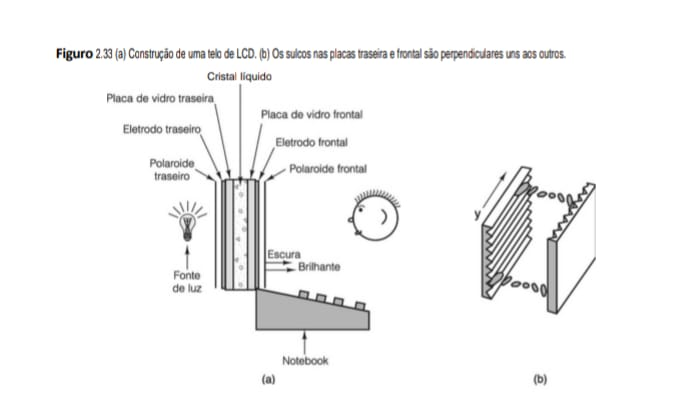

Embora muitos tipos de monitores de LCD estejam em uso, agora vamos considerar um tipo particular de visor, o TN (Twisted Nematic – nemático torcido), como exemplo. Nesse monitor, a placa traseira contém minúsculos sulcos horizontais, e a frontal, minúsculos sulcos verticais, como ilustrado na Figura 2.33(b). Na ausência de um campo elétrico, as moléculas do LCD tendem a se alinhar com os sulcos. Uma vez que os alinhamentos frontal e traseiro estão a 90 graus entre si, as moléculas (e, portanto, a estrutura cristalina) ficam torcidas entre as placas traseira e frontal.

Na parte de trás do monitor há um polaroide horizontal que permite apenas a passagem de luz polarizada horizontalmente. Na parte da frente do visor há um polaroide vertical que permite apenas a passagem de luz polarizada verticalmente. Se não houvesse nenhum líquido presente entre as placas, a luz polarizada horizontalmente que entrasse pelo polaroide traseiro seria bloqueada pelo polaroide frontal, produzindo uma tela uniformemente negra.

Contudo, a estrutura cristalina torcida das moléculas do LCD guia a luz na passagem e gira sua polarização, fazendo com que ela saia na vertical. Portanto, na ausência de um campo elétrico, a tela de LCD é uniformemente brilhante. Aplicando uma tensão elétrica em partes selecionadas da placa, a estrutura torcida pode ser destruída, bloqueando a luz nesses locais.

Há dois esquemas que podem ser usados para aplicar a tensão elétrica. Em um monitor de matriz passiva (de baixo custo), ambos os eletrodos contêm fios paralelos. Em um monitor de 1.920 × 1.080, por exemplo, o eletrodo traseiro poderia ter 1.920 fios verticais e o frontal poderia ter 1.080 horizontais. Aplicando-se uma tensão elétrica em um dos fios verticais e em seguida fazendo-se pulsar um dos horizontais, a tensão em uma posição de pixel selecionada pode ser mudada, fazendo-a escurecer por um curto espaço de tempo. Um pixel (aglutinação das palavras “picture” e “element”) é um ponto colorido a partir do qual todas as imagens digitais são construí­das. Repetindo-se esse pulso para o próximo pixel e então para o seguinte, pode-se pintar uma linha escura de varredura. Em geral, a tela inteira é pintada 60 vezes por segundo, para enganar o olho e fazê-lo pensar que ali há uma imagem constante.

O outro esquema de ampla utilização é o monitor de matriz ativa. É mais caro, mas produz melhor imagem. Em vez de apenas dois conjuntos de fios perpendiculares, ele tem um minúsculo elemento comutador em cada posição de pixel em um dos eletrodos. Desligando e ligando esses elementos, pode-se criar um padrão de tensão elétrica arbitrário na tela, o que permite um padrão de bits também arbitrário. Os elementos comutadores são denominados transistores de película fina (TFT – Thin Film Transistors) e os monitores de tela plana que os utilizam costumam ser denominados monitores TFT. Agora, a maioria dos notebooks e monitores de tela plana para desktops utiliza a tecnologia TFT.

Até aqui, descrevemos como funciona um monitor monocromático. Basta dizer que monitores coloridos usam os mesmos princípios gerais dos monocromáticos, mas os detalhes são muito mais complicados. Filtros ópticos são usados para separar a luz branca em componentes vermelha, verde e azul em cada posição de pixel, de modo que estes possam ser exibidos independentemente. Toda cor pode ser obtida por uma superposição dessas três cores primárias.

Outras tecnologias de tela estão surgindo. Uma das mais promissoras é a tela OLED (Organic Light Emitting Diode – diodo orgânico emissor de luz). Ela consiste em camadas de moléculas orgânicas carregadas eletricamente, dispostas entre dois eletrodos em forma de sanduíche. As mudanças de tensão fazem com que as moléculas sejam excitadas e se movam para estados de energia mais altos. Quando elas retornam ao seu estado normal, emitem luz. Outros detalhes estão fora do escopo deste livro (e de seus autores).

**• RAM de vídeo**
Quase todos os monitores são renovados de 60 a 100 vezes por segundo por uma memória especial, denominada RAM de vídeo (memória de acesso aleatório de vídeo), embutida na placa controladora do monitor. Essa memória tem um ou mais mapas de bits que representam a imagem da tela. Em uma tela com, por exemplo, 1.920 × 1.080 elementos de imagem, denominados pixels, uma RAM de vídeo conteria 1.920 × 1.080 valores, um para cada pixel. Na verdade, ela poderia conter muitos desses mapas de bits, para permitir a passagem rápida de uma imagem para outra.

Em um monitor comum, cada pixel seria representado como um valor RGB (red/green/blue) de 3 bytes, um para cada intensidade das componentes vermelha, verde e azul da cor do pixel (monitores de primeira linha usam 10 ou mais bits por cor). Pelas leis da física, sabe-se que qualquer cor pode ser obtida por uma superposição linear de luzes vermelha, verde e azul.

Uma RAM de vídeo com 1.920 × 1.080 pixels a 3 bytes/pixel requer mais de 6,2 MB para armazenar a imagem e uma boa quantidade de tempo de CPU para fazer qualquer coisa com ela. Por essa razão, alguns computadores adotam uma solução de conciliação usando um número de 8 bits para indicar a cor desejada. Então, esse número é usado como um índice para uma tabela de hardware denominada paleta de cores, que contém 256 entradas, cada uma com um valor RGB de 24 bits. Esse projeto, denominado cor indexada, reduz em dois terços o tamanho de memória da RAM de vídeo, mas permite somente 256 cores na tela ao mesmo tempo. Em geral, cada janela
na tela tem seu próprio mapeamento. Porém, com apenas uma paleta de cores em hardware, quando há várias janelas presentes, muitas vezes apenas a janela corrente apresenta suas cores corretamente. Paletas de cores com 216 entradas também são usadas, mas o ganho aqui é de apenas 1/3.

Monitores de vídeo com mapas de bits requerem grande quantidade de largura de banda. Para apresentar multimídia em tela cheia, com todas as cores em um monitor de 1.920 × 1.080, é preciso copiar 6,2 MB de dados para a RAM de vídeo para cada quadro. Quando o vídeo é de movimento total, é preciso uma taxa de no mínimo 25 quadros por segundo, o que resulta uma taxa total de dados de 155 MB/s. Essa carga é mais do que o barramento PCI original podia manipular (132 MB/s), mas o PCIe pode tratar disso com facilidade.

## 2.4.3 Mouses
À medida que o tempo passa, os computadores estão sendo usados por pessoas menos versadas sobre o modo de funcionamento desses equipamentos. Máquinas da geração ENIAC só eram empregadas pelas pessoas que as construíram. Na década de 1950, computadores eram utilizados apenas por programadores profissionais altamente treinados. Agora, são amplamente usados por pessoas que precisam fazer algum trabalho e não sabem muito (ou nem querem saber) sobre como funcionam os computadores ou como são programados.

Antigamente, a maioria dos computadores tinha interfaces de linha de comando, para as quais os usuários digitavam comandos. Visto que quem não é especialista quase sempre acha que interfaces de linha de comando não são amigáveis ao usuário – se não absolutamente hostis –, muitos fabricantes desenvolveram interfaces do tipo “apontar e clicar”, tais como as do Macintosh e do Windows. Usar esse modelo pressupõe que haja um modo de apontar algo na tela. O meio mais comum de permitir que usuários apontem algo na tela é um mouse.

Um mouse é um caixinha de plástico que fica sobre a mesa, ao lado do teclado. Quando ela é movimentada sobre a mesa, um pequeno ponteiro também se movimenta na tela, permitindo que os usuários apontem itens. O mouse tem um, dois ou três botões na parte de cima, que possibilitam aos usuários selecionar itens apresentados em menus. Muita polêmica já se levantou por causa de discussões sobre o número de teclas que um mouse deve ter. Usuários ingênuos preferem uma só (não há como apertar a tecla errada se houver apenas uma), mas os sofisticados gostam do poder conferido por várias teclas para fazer coisas imaginativas.

Três tipos de mouses foram produzidos: mecânicos, ópticos e óptico-mecânicos. Os primeiros tinham duas rodinhas de borracha para fora da parte inferior do corpo com eixos perpendiculares entre si. Quando o mouse era movimentado em paralelo com seu eixo principal, uma roda girava. Quando ele era movimentado ao longo da perpendicular de seu eixo principal, a outra roda girava. Cada rodinha comandava um resistor variável (potenciômetro). Medindo as alterações na resistência era possível ver como cada roda tinha girado e assim calcular a distância que o mouse tinha percorrido em cada direção. Depois, esse projeto foi substituído em grande parte por outro, no qual, em vez de rodinhas, era usada uma pequena esfera projetada um pouco para fora do fundo do mouse. Ele é mostrado na Figura 2.34.

**• Figura 2.34 Utilização do mouse para apontar itens de menu.**

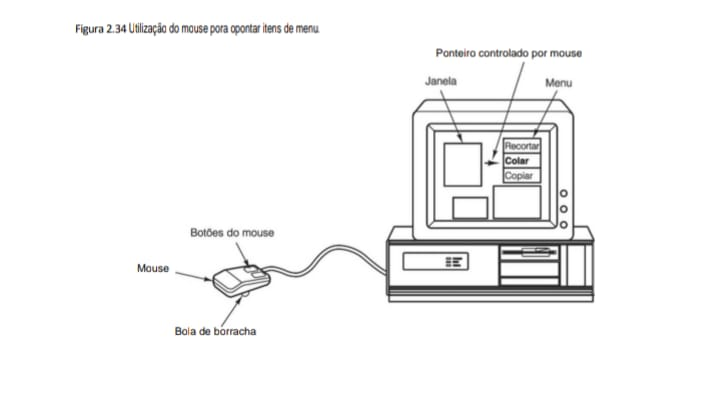

O segundo tipo de mouse é o óptico. Esse tipo não tem rodinhas nem esferas. Em vez delas, tem um LED (Light Emitting Diode – diodo emissor de luz) e um fotodetector na parte de baixo. Os primeiros mouses ópticos exigiam uma almofada plástica especial que continha uma grade retangular de linhas espaçadas muito próximas umas das outras para detectar quantas linhas tinham sido atravessadas e, assim, a que distância o mouse se movimentou. Os mouses ópticos modernos contêm um LED que ilumina as imperfeições da superfície, junto com uma pequena câmera de vídeo que registra uma pequena imagem (em geral, 18 × 18 pixels) até 1.000 vezes por segundo. Imagens consecutivas são comparadas para ver a que distância o mouse se moveu. Alguns mouses ópticos utilizam um laser no lugar de um LED para iluminação. Eles são mais precisos, mas também mais caros.

O terceiro tipo de mouse é o óptico-mecânico. Assim como o mouse mecânico mais novo, ele tem uma esfera que gira dois eixos alinhados a 90 graus em relação um ao outro. Os eixos estão conectados a decodificadores com fendas que permitem a passagem da luz. Quando o mouse se movimenta, os eixos giram e pulsos de luz atingem os detectores sempre que aparece uma fenda entre um LED e seu detector. O número de pulsos detectados é proporcional à quantidade de movimento.

Embora mouses possam ser montados de várias maneiras, um arranjo comum é enviar uma sequência de 3 bytes ao computador toda vez que o mouse se movimenta a uma distância mínima (por exemplo, 0,01 polegada), às vezes denominada mickey. Em geral, esses caracteres vêm em uma linha serial, um bit por vez. O primeiro byte contém um inteiro com sinal que informa quantas unidades o mouse se moveu na direção x desde a última vez. O segundo dá a mesma informação para movimento na direção y. O terceiro contém o estado corrente das teclas do mouse. Às vezes, são usados 2 bytes para cada coordenada.

No computador, um software de baixo nível aceita essas informações à medida que chegam e converte os movimentos relativos enviados pelo mouse em uma posição absoluta. Em seguida, ele apresenta na tela uma seta correspondente à posição onde o mouse está. Quando a seta indicar o item adequado, o usuário clica no botão do mouse e então o computador pode interpretar qual item foi selecionado, por saber onde a seta está posicionada na tela.

## 2.4.4 Controladores de jogos
Os videogames costumam ter exigências muito altas de E/S do usuário e, no mercado de console de vídeo, dispositivos de entrada especializados têm sido desenvolvidos. Nesta seção, veremos dois desenvolvimentos recentes em controladores para videogame, o Nintendo Wiimote e o Microsoft Kinect.

**• Controlador Wiimote**
Lançado em 2006 com o console de jogos Nintendo Wii, o controlador Wiimote contém botões tradicionais para jogos e mais uma capacidade de sensibilidade dupla ao movimento. Todas as interações com o Wiimote são enviadas em tempo real ao console de jogos, usando um rádio Bluetooth interno. Os sensores de movimento no Wiimote permitem que ele sinta seu próprio movimento nas três dimensões e mais; quando apontado para a televisão, ele oferece uma capacidade minuciosa para apontar.

A Figura 2.35 ilustra como o Wiimote executa essa função de sensibilidade ao movimento. O rastreamento do movimento do Wiimote em três dimensões é realizado com um acelerômetro interno de 3 eixos. Esse dispositivo contém três massas pequenas, cada qual podendo se mover nos eixos x, y e z (com relação ao chip do acelerômetro). Elas se movem em proporção ao grau de aceleração em seu eixo particular, o que muda a capacitância da massa em relação a uma parede fixa de metal. Medindo as três capacitâncias variáveis, é possível sentir a aceleração em três dimensões. Usando essa tecnologia e algum cálculo clássico, o console Wii pode rastrear o movimento do Wiimote no espaço. Ao movimentar o Wiimote para atingir uma bola de tênis virtual, esse movimento é rastreado enquanto você se desloca em direção à bola e, se você virou o pulso no último momento para atingir a bola por cima, os acelerômetros do Wiimote também notarão esse movimento.

**• Figura 2.35 Sensores de movimento do controlador de videogame Wiimote.**

Embora os acelerômetros funcionem bem para acompanhar o movimento do Wiimote enquanto ele se desloca em três dimensões, eles não podem oferecer a sensibilidade de movimento detalhada necessária para controlar um ponteiro na tela da televisão. Os acelerômetros sofrem com pequenos erros inevitáveis em suas medições de aceleração, de modo que, com o tempo, o local exato do Wiimote (com base na integração de suas acelerações) se tornará cada vez menos preciso.

Para oferecer a sensibilidade de movimento com precisão, o Wiimote utiliza uma tecnologia de visão de computador inteligente. Acima da televisão há uma “barra de sensor” que contém LEDs a uma distância fixa. No Wiimote há uma câmera que, quando apontada na barra de sensor, pode deduzir a distância e orientação em relação à televisão. Como os LEDs da barra de sensor estão afastados a certa distância, sua distância vista pelo Wiimote é proporcional àquela entre o Wiimote e a barra de sensor. O local da barra de sensor no campo de visão do Wiimote indica a direção que este aponta em relação à televisão. Observando essa orientação continua­mente, é possível dar suporte a uma capacidade de apontamento minucioso sem os erros de posição inerentes aos ace-
lerômetros.

**• Controlador Kinect**
O Microsoft Kinect leva as capacidades de visão dos controladores de jogos a um nível inteiramente novo. Esse dispositivo usa apenas a visão do computador para determinar as interações do usuário com o console de jogos. Ele funciona sentindo a posição do usuário na sala, mais a orientação e o movimento de seu corpo. Os jogos são controlados por movimentos predeterminados de suas mãos, braços e qualquer outra coisa que os projetistas do jogo acreditarem que você deva mexer a fim de controlar seu jogo.

A capacidade de sentir do Kinect é baseada em uma câmera de profundidade combinada com uma câmera de vídeo. A câmera de profundidade calcula a distância do objeto no campo de visão do Kinect. Ela faz isso emitindo uma matriz bidimensional de pontos a laser infravermelho, depois capturando seus reflexos com uma câmera infravermelha. Usando uma técnica de visão do computador chamada “iluminação estruturada”, o Kinect pode determinar a distância dos objetos em seu campo de visão com base em como o conjunto de pontos infravermelhos é agitado pelas superfícies iluminadas.

A informação de profundidade é combinada com a informação de textura retornada da câmera de vídeo para produzir um mapa de profundidade texturizado. Esse mapa pode então ser processado pelos algoritmos de visão do computador para localizar a pessoa na sala (até mesmo reconhecendo seus rostos) e a orientação e movimento de seu corpo. Depois de processar, a informação sobre as pessoas na sala é enviada ao console do jogo, que usa esses dados para controlar o videogame.

## 2.4.5 Impressoras**
Após o usuário preparar um documento ou buscar uma página na Web, muitas vezes quer imprimir seu trabalho, de modo que todos os computadores podem ser equipados com uma impressora. Nesta seção, descreveremos alguns dos tipos mais comuns de impressoras.

**• Impressoras a laser**
Talvez o desenvolvimento mais interessante da impressão desde que Johann Gutenberg inventou o tipo móvel no século XV é a impressora a laser. Esse dispositivo combina uma imagem de alta qualidade, excelente flexibilidade, grande velocidade e custo moderado em um único periférico compacto. Impressoras a laser usam quase a mesma tecnologia das máquinas fotocopiadoras. Na verdade, muitas empresas fabricam equipamentos que combinam cópia e impressão (e, às vezes, também fax).

A tecnologia básica é ilustrada na Figura 2.36. O coração da impressora é um tambor rotativo de precisão (ou uma correia, em alguns sistemas de primeira linha). No início de cada ciclo de página, ele recebe uma carga de até cerca de 1.000 volts e é revestido com um material fotossensível. Então, a luz de um laser passa pelo comprimento do tambor, refletindo-a de um espelho octogonal rotativo. O feixe de luz é modulado para produzir um padrão de pontos escuros e claros. Os pontos atingidos pelo feixe perdem sua carga elétrica.

**• Figura 2.36 Operação de uma impressora a laser.**

Figura 2.36: Operação de uma Impressora a Laser
Este diagrama ilustra o processo eletrofotográfico, onde a luz é convertida em uma imagem física no papel através de calor e pressão.

    MECANISMO DE IMPRESSÃO A LASER
    ========================================
    [ LASER ] ---> [ ESPELHO ROTATIVO ]
                            |
                            v (Feixe de luz)
    [ TONER ] ----> [ TAMBOR CARREGADO ]
                            | (Atração do pó)
    [ PAPEL BRANCO ] ----> [ ROLETES AQUECIDOS ] ---> [ SAÍDA ]
                                (Fusão)

Figura 2.21: Disco com Cinco Zonas (ZBR)
Diferente da velocidade linear constante (CLV) do CD-ROM, os discos rígidos modernos dividem o prato em zonas para manter a densidade de gravação eficiente em todas as trilhas.

    GEOMETRIA DE DISCO (ZBR)
             __________________________
            /     /     /     /     /  \
            |  Z4 |  Z3 |  Z2 |  Z1 | Z0 |  (Z0 = Externa)
            \_____\_____\_____\_____\__/
        
        * Zona Externa (Z0): Mais setores por trilha.
        * Zona Interna (Z4): Menos setores por trilha.

### Notas para o eBook
 - Conexão com seu Projeto: Assim como o seu IDS precisa de integridade no barramento PCIe (Fig. 2.32), os dados no CD-ROM (Fig. 2.26) dependem de 288 bytes de ECC para cada setor de 2.352 bytes para garantir que riscos físicos não corrompam o binário.

 - Física do CD-R (2.27): O diodo de laser infravermelho queima pontos escuros na camada de corante para simular as depressões físicas do alumínio de um CD-ROM prensado.

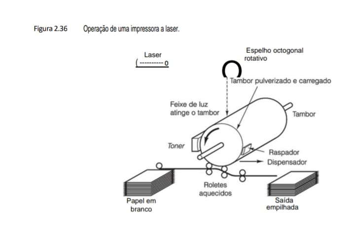

Após pintar uma linha de pontos, o tambor gira uma fração de um grau para permitir que a próxima linha seja pintada. Com o decorrer da rotação, a primeira linha de pontos chega ao toner, um reservatório que contém um pó negro eletrostaticamente sensível. O toner é atraído por aqueles pontos que ainda estão carregados, formando uma imagem visual daquela linha. Um pouco mais adiante na trajetória de transporte, o tambor revestido de toner é pressionado contra o papel, transferindo o pó preto para ele. Em seguida, o papel passa por rolamentos aquecidos que fundem permanentemente o toner à superfície do papel, fixando a imagem. Em um ponto mais adiante de sua rotação, o tambor é descarregado e raspado para limpar qualquer resíduo de toner, preparando-o
para receber nova carga elétrica e revestimento para imprimir a próxima página.

Nem é preciso dizer que esse processo é uma combinação extremamente complexa de física, química, engenharia mecânica e engenharia ótica. Ainda assim, há vários fabricantes no mercado que oferecem conjuntos complexos denominados mecanismos de impressão. Fabricantes de impressoras a laser combinam os mecanismos de impressão com sua própria eletrônica e software próprio para montar uma impressora completa. A parte eletrônica consiste em uma CPU rápida embutida junto com megabytes de memória para conter um mapa de bits de uma página inteira e numerosas fontes, algumas delas embutidas, outras carregadas por download. Grande parte das impressoras aceita comandos que descrevem as páginas a serem impressas (ao contrário de apenas aceitar mapas de bits preparados pela CPU principal). Esses comandos são dados em linguagens como a PCL da HP e PostScript da Adobe ou PDF, que são linguagens de programação completas, embora especializadas.

Impressoras a laser de 600 dpi ou mais podem executar um trabalho razoável na impressão de fotografias em preto e branco, mas a tecnologia é mais complicada do que pode parecer à primeira vista. Considere uma fotografia digitalizada em 600 dpi que deve ser impressa por uma impressora de 600 dpi. A imagem contém 600 × 600 pixels/polegada, cada um consistindo em um valor de cinza que varia de 0 (branco) a 255 (preto). A impressora também pode imprimir 600 dpi, mas cada pixel impresso é ou preto (toner presente) ou branco (nenhum toner presente). Valores cinza não podem ser impressos.

A solução habitual para imprimir imagens com valores de cinza é usar a técnica do meio-tom (retícula), a mesma empregada para imprimir cartazes comerciais. A imagem é desmembrada em células de meios-tons, em geral com 6 × 6 pixels. Cada célula pode conter entre 0 e 36 pixels pretos. O olho percebe uma célula com muitos pixels como mais escura do que uma com menos pixels. Valores de cinza na faixa de 0 a 255 são representados dividindo essa faixa em 37 zonas. Valores de 0 a 6 estão na zona 0, valores de 7 a 13 estão na zona 1 e assim por diante (a zona 36 é um pouco menor do que as outras porque 256 não é divisível exatamente por 37). Sempre que é encontrado um valor de cinza na zona 0, sua célula de meio-tom sobre o papel é deixada em branco, como ilustrado na Figura 2.37(a). Um valor de zona 1 é impresso como 1 pixel negro. Um valor de zona 2 é impresso como 2 pixels negros, conforme mostra a Figura 2.37(b). Outros valores de zonas são mostrados nas figuras 2.37(c)–(f). Claro que pegar uma fotografia digitalizada
a 600 dpi e usar essa técnica de meio-tom reduz a resolução efetiva a 100 células/polegada, denominada frequência de tela de meio-tom, medida por convenção em lpi (lines per inch – linhas por polegada).

**• Figura 2.37 - Pontos de meio-tom para várias faixas de escala de cinza. (a) 0–6. (b) 14–20. (c) 28–34. (d) 56–62. (e) 105–111.
(f) 161–167.**

Figura 2.37: Pontos de Meio-Tom (Escala de Cinza)Esta figura ilustra como impressoras (que só possuem tinta preta) simulam tons de cinza agrupando pontos em matrizes de $6 \times 6$ pixels.

    SIMULAÇÃO DE ESCALA DE CINZA (MATRIZ 6x6)
    =================================================
    (a) Branco     (c) Cinza Claro    (f) Cinza Escuro
    [        ]     [    ###     ]     [  #######  ]
    [        ]     [    ###     ]     [ ######### ]
    [        ]     [    ###     ]     [ ######### ]
    [        ]     [            ]     [  #######  ]
    =================================================
    Nível: 0-6       Nível: 28-34       Nível: 161-167

        (a) 0-6          (b) 14-20         (c) 28-34
        +-----------+     +-----------+     +-----------+
        | . . . . . |     | . . . . . |     | . . . . . |
        | . . . . . |     | . . # . . |     | . . # . . |
        | . . . . . |     | . # # . . |     | . # # # . |
        | . . . . . |     | . . . . . |     | . . # . . |
        | . . . . . |     | . . . . . |     | . . . . . |
        +-----------+     +-----------+     +-----------+

        (d) 56-62         (e) 105-111       (f) 161-167
        +-----------+     +-----------+     +-----------+
        | . . # . . |     | . # # # . |     | . # # # . |
        | . # # # . |     | # # # # # |     | # # # # # |
        | # # # # # |     | # # # # # |     | # # # # # |
        | . # # # . |     | # # # # # |     | # # # # # |
        | . . # . . |     | . # # # . |     | . # # # . |
        +-----------+     +-----------+     +-----------+

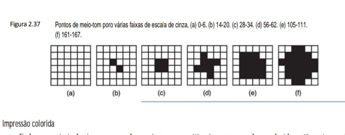

### Impressão colorida
Embora a maioria das impressoras a laser seja monocromática, impressoras a laser coloridas estão se tornando mais comuns, de modo que talvez seja útil dar aqui alguma explicação sobre a impressão colorida (que também se aplica a impressoras a jato de tinta e outras). Como você poderia imaginar, isso não é trivial. Imagens coloridas podem ser vistas de duas maneiras: por luz transmitida e por luz refletida. Imagens por luz transmitida, como as produzidas em monitores, são compostas por superposição linear das três cores primárias aditivas: vermelho, verde e azul.

Ao contrário, imagens por luz refletida, como fotografias em cores e fotos em revistas de papel lustroso, absorvem certos comprimentos de onda de luz e refletem o resto. Elas são compostas por uma superposição linear das três cores subtrativas primárias, ciano (toda cor vermelha absorvida), magenta (toda cor verde absorvida) e amarela (toda cor azul absorvida). Em teoria, toda cor pode ser produzida misturando as tintas ciano, amarela e magenta. Na prática, é difícil conseguir essas tintas com pureza suficiente para absorver toda a luz e produzir um negro verdadeiro. Por essa razão, praticamente todos os sistemas de impressão em cores usam quatro tintas: ciano, magenta, amarela e negra. Esses sistemas são denominados impressoras CMYK. O K é geralmente associado à cor negra (blacK), porém, ele é a placa chave com a qual as placas de cores são alinhadas em impressoras convencionais de quatro cores. Monitores, ao contrário, usam luz transmitida e o sistema RGB para produzir cores.

O conjunto completo de cores que um monitor ou uma impressora podem produzir é denominado sua gama. Nenhum dispositivo tem uma gama que se iguale à do mundo real, já que cada cor vem em 256 intensidades no máximo, o que dá apenas 16.777.216 cores discretas. Imperfeições na tecnologia reduzem ainda mais esse total e as restantes nem sempre estão uniformemente espaçadas no espectro de cores. Além do mais, a percepção da cor tem muito a ver com o modo de funcionamento dos bastões e cones na retina, e não apenas com a física da luz.

Como consequência dessas observações, converter uma imagem colorida que parece boa na tela em uma
imagem impressa idêntica está longe de ser trivial. Entre os problemas estão:

    1. Monitores em cores usam luz transmitida; impressoras em cores usam luz refletida.
   
    2. Monitores produzem 256 intensidades por cor; impressoras têm de usar meios-tons.
   
    3. Monitores têm um fundo negro; o papel tem um fundo claro.
   
    4. As gamas RGB de um monitor e as gamas CMYK de uma impressora são diferentes.

Obter imagens impressas em cores que reproduzem os tons do mundo real (ou até mesmo os das imagens na tela) requer calibração de dispositivos, software sofisticado e considerável conhecimento técnico e experiência da parte do usuário.

**• Impressoras a jato de tinta**
Para impressão doméstica de baixo custo, as impressoras a jato de tinta são as favoritas. A cabeça de impressão móvel, que mantém os cartuchos de tinta, é varrida horizontalmente pelo papel por uma correia, enquanto a tinta é espirrada por minúsculos esguichos. As gotículas de tinta têm um volume de mais ou menos 1 picolitro, de modo que 100 milhões delas formam uma única gota d’água.

Impressoras a jato de tinta podem ter duas variedades: piezelétricas (usadas pela Epson) e térmicas (usadas pela Canon, HP e Lexmark). As impressoras a jato de tinta piezelétricas possuem um tipo especial de cristal próximo de sua câmara de tinta. Quando uma tensão elétrica é aplicada ao cristal, ela se deforma ligeiramente, forçando uma gotícula de tinta a sair pelo esguicho. Quanto maior a tensão, maior a gotícula, permitindo que o software controle seu tamanho.

Impressoras a jato de tinta térmicas (também chamadas impressoras a jato de bolhas) contêm um minúsculo resistor dentro de cada esguicho. Quando uma tensão elétrica é aplicada ao resistor, ele se aquece extremamente rápido, elevando de imediato a temperatura da tinta que encosta nele até o ponto de ebulição, até que a tinta se vaporize para formar uma bolha de gás. A bolha de gás ocupa mais volume do que a tinta que a criou, produzindo pressão no esguicho. O único lugar para onde a tinta pode sair é pela frente do esguicho, para o papel. O esguicho é então resfriado e o vácuo resultante suga outra gota de tinta do cartucho. A velocidade da impressora é limitada pela velocidade com que o ciclo aquecer/resfriar pode ser repetido. As gotículas são todas do mesmo tamanho,
mas menores do que as usadas pelas impressoras piezelétricas.

As impressoras a jato de tinta normalmente possuem resoluções de pelo menos 1.200 dpi (dots per inch – pontos por polegada) e, no máximo, 4.800 dpi. Elas são baratas, silenciosas e possuem boa qualidade, apesar de também serem lentas, e utilizam cartuchos de tinta caros. Quando a melhor das impressoras a jato de tinta de alta qualidade é usada para imprimir fotografia em alta resolução profissional com papel fotográfico especialmente lustroso, os resultados são parecidos com a fotografia convencional, até mesmo com impressões de 20 × 25 cm.

Para obter melhores resultados, é preciso usar tinta e papel especiais. Tintas à base de corantes consistem em corantes coloridos dissolvidos em uma base fluida. Elas dão cores brilhantes e fluem com facilidade. Sua principal desvantagem é que desbotam quando expostas à luz ultravioleta, tal como a contida na luz solar. Tintas à base de pigmentos contêm partículas sólidas de pigmentos suspensas em uma base fluida, que evapora do papel deixando ali o pigmento. Não desbotam com o tempo, mas não são tão brilhantes como as tintas à base de corantes e as partículas de pigmento tendem a entupir os bicos injetores, que requerem limpeza periódica. Para imprimir fotografias, é preciso papel lustroso ou revestido. Esses tipos de papel foram projetados especialmente para conter
as gotículas de tinta e não permitir que elas se espalhem.

**• Impressoras especiais**
Embora impressoras a laser e a jato de tinta dominem os mercados de impressão doméstico e de escritório, outros tipos de impressoras são usados em outras situações, com outros requisitos em termos de qualidade de cor, preço e outras características.

Uma variante da impressora a jato de tinta é a impressora de tinta sólida. Esse tipo de impressora aceita quatro blocos sólidos de uma tinta especial à base de cera, que são derretidos e passam para reservatórios de tinta quente. Os tempos de partida dessas impressoras podem chegar a 10 minutos, enquanto os blocos de tinta estão derretendo. A tinta quente é borrifada sobre o papel, onde se solidifica e se funde com o papel quando este é forçado a passar entre dois roletes rígidos. De certa forma, ela combina a ideia de borrifar tinta das impressoras a jato de tinta com a ideia de fundir a tinta no papel com roletes de borracha rígidos das impressoras a laser.

Outro tipo de impressora em cores é a impressora a cera. Ela tem uma larga fita encerada em quatro cores, segmentada em faixas do tamanho de páginas. Milhares de elementos de aquecimento derretem a cera à medida que o papel passa por baixo dela. A cera se funde com o papel na forma de pixels usando o sistema CMYK. Impressoras a cera costumavam ser a principal tecnologia de impressão em cores, mas estão sendo substituídas pelos outros tipos cujos materiais de consumo são mais baratos.

Ainda outro tipo de impressora em cores é a impressora por sublimação de corante, ou de tinta. Embora dê a entender algo de freudiano, sublimação é o nome científico da passagem do estado sólido para o gasoso sem passar pelo estado líquido. Gelo seco (dióxido de carbono congelado) é um material bem conhecido que sublima. Em uma impressora por sublimação de tinta, uma base contendo os corantes CMYK passa sobre um cabeçote de impressão térmico que contém milhares de elementos de aquecimento programáveis. As tintas são vaporizadas instantaneamente e absorvidas por um papel especial que está próximo. Cada elemento de aquecimento pode produzir 256 temperaturas diferentes. Quanto mais alta a temperatura, mais corante é depositado e mais intensa
é a cor. Diferente de todas as outras impressoras em cores, nessa são possíveis cores praticamente contínuas para cada pixel, de modo que o meio-tom não é necessário. Pequenas impressoras de instantâneos muitas vezes usam o processo de sublimação de tinta para produzir imagens fotográficas de alto grau de realismo sobre papel especial
(e caro).

Por fim, chegamos à impressora térmica, que contém uma pequena cabeça de impressão com alguma quantidade de minúsculas agulhas que podem ser aquecidas. Quando uma corrente elétrica passa por uma agulha, ela se torna muito quente depressa. Quando um papel termicamente sensível especial é empurrado pela cabeça de impressão, os pontos são feitos no papel quando as agulhas estão quentes. Com efeito, uma impressora térmica é como as antigas impressoras matriciais, cujos pinos eram pressionados contra uma fita tipo máquina de escrever para formar os pontos de tinta no papel atrás da fita. As impressoras térmicas são muito usadas para imprimir recibos em lojas, caixas eletrônicos de banco, postos de gasolina automatizados etc.

## 2.4.6 Equipamento de telecomunicações
Hoje, grande parte dos computadores está ligada a uma rede de computadores, em geral a Internet. Para
conseguir acesso, é preciso usar equipamento especial. Nesta seção, veremos como esse equipamento funciona.

**• Modems**
Com o crescimento da utilização de computadores nos últimos anos, é comum que um computador precise se comunicar com outro. Por exemplo, muitas pessoas têm em casa computadores pessoais que usam para se comunicar com o que está em seu local de trabalho, com uma provedora de serviço de Internet (ISP – Internet Service Provider) ou com um sistema de home banking. Em muitos casos, a linha telefônica provê comunicação física.

Contudo, uma linha telefônica comum (ou cabo) não é adequada para transmissão de sinais de computador que costumam representar um 0 como 0 volt e um 1 como 3 a 5 volts, conforme mostra a Figura 2.38(a). Sinais de dois níveis sofrem considerável distorção quando transmitidos por uma linha telefônica projetada para voz, ocasionando erros de transmissão. Todavia, um sinal de onda senoidal pura em uma frequência de 1.000 a 2.000 Hz, denominada portadora, pode ser transmitido com relativamente pouca distorção, e esse fato é explorado como a base da maioria dos sistemas de telecomunicação.

Como as pulsações de uma onda senoidal são totalmente previsíveis, uma onda senoidal pura não transmite nenhuma informação. Contudo, variando a amplitude, frequência ou fase, uma sequência de 1s e 0s pode ser transmitida, como mostra a Figura 2.38. Esse processo é denominado modulação, e o dispositivo que faz isso é denominado modem, que significa MOdulador DEModulador. Na modulação de amplitude (veja a Figura 2.38(b)), são usados dois níveis de tensão elétrica (voltagem) para 0 e 1, respectivamente. Uma pessoa que esteja ouvindo dados transmitidos a uma taxa de dados muito baixa ouviria um ruído alto para 1 e nenhum ruído para 0.

Em modulação de frequência (veja a Figura 2.38(c)), o nível de tensão elétrica (voltagem) é constante, mas a frequência da portadora é diferente para 1 e para 0. Uma pessoa que estivesse ouvindo dados digitais com frequência modulada ouviria dois tons, correspondentes a 0 e 1. A modulação de frequência costuma ser denominada modulação por chaveamento de frequência.

**• Figura 2.38- Transmissão bit a bit do número binário 01001011000100 por uma linha telefônica. (a) Sinal de dois níveis.
(b) Modulação de amplitude. (c) Modulação de frequência. (d) Modulação de fase.**

Figura 2.27: Seção Transversal de um CD-R
Este diagrama ilustra como o laser interage com a camada de corante para simular as depressões de um disco convencional.

    +-----------------------------------------------------------+
    |               ESTRUTURA FÍSICA DO CD-R                    |
    |===========================================================|
    | [ Verniz Protetor ]                                       |
    | [ Camada Refletiva ]                                      |
    | [ CAMADA DE CORANTE ] <--- Ponto escuro queimado pelo     |
    |                            laser durante a escrita        |
    | [ POLICARBONATO ]          (Espessura total: 1,2 mm)      |
    |___________________________________________________________|
    |                                                           |
    |       ^                     |                             |
    |       | [ Fotodetector ]    | [ Lente ]                   |
    |       |                     |                             |
    |       +----[ Prisma ]-------+                             |
    |                ^                                          |
    |                | [ Diodo de Laser ]                       |
    +-----------------------------------------------------------+

Figura 2.38: Técnicas de Modulação de Sinal
Fundamental para entender como o binário viaja por meios analógicos, como linhas telefônicas.

    BIT:     0      1      0      0      1      0      1
    +-----------------------------------------------------------+
    | (a) Sinal Digital (Níveis de Tensão V1 e V2)              |
    |      ____        ____        ____        ____        ____ |
    | ____|    |______|    |______|    |______|    |______|    |
    |-----------------------------------------------------------|
    | (b) AM (Modulação de Amplitude)                           |
    |      _/\_        _/\_        _/\_        _/\_        _/\_ |
    | _/\_|    |_/\/\_|    |_/\/\_|    |_/\/\_|    |_/\/\_|    |
    |      (Baixa)     (Alta)                                   |
    |-----------------------------------------------------------|
    | (c) FM (Modulação de Frequência)                          |
    |      WWWW        wwww        WWWW        wwww        WWWW |
    | wwww|    |wwwwww|    |wwwwww|    |wwwwww|    |wwwwww|    |
    |     (Alta)      (Baixa)                                   |
    |-----------------------------------------------------------|
    | (d) PM (Modulação de Fase)                                |
    |      _/\_  /|    _/\_  /|    _/\_  /|    _/\_  /|    _/\_ |
    | _/\_|    |/_| \_|    |/_| \_|    |/_| \_|    |/_| \_|    |
    |            ^----------- Mudança brusca de fase            |
    +-----------------------------------------------------------+

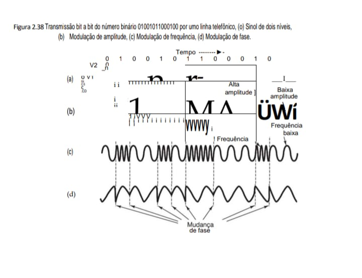

**• Mapeamento Técnico**

    +------------------------+-------------------------------+---------------------------------------------+
    | Processamento          | Armazenamento / Transmissão   |                                             |
    +------------------------+-------------------------------+---------------------------------------------+
    | Diodo de Laser (2.27)  | Policarbonato                 | Emite o feixe que é focado pela lente       |
    |                        |                               | para alterar quimicamente a camada de       |
    |                        |                               | corante.                                    |
    |                        |                               | Substrato plástico que dá suporte físico    |
    |                        |                               | ao disco.                                   |
    +------------------------+-------------------------------+---------------------------------------------+
    | BARRAMENTO INTERNO     |                               | Conexão com seu Projeto                     |
    +------------------------+-------------------------------+---------------------------------------------+
    | Modulação (2.38)       |                               | "Técnica de converter bits em ondas         |
    |                        |                               | (Amplitude, Frequência ou Fase) para        |
    |                        |                               | transmissão."                               |
    |                        |                               | Entender modulação é a base para o seu      |
    |                        |                               | estudo de protocolos de rede e segurança    |
    |                        |                               | no IDS.                                     |
    +------------------------+-------------------------------+---------------------------------------------+
    | DVD Dupla Face        | Camadas semirreflexivas       | permitem que o laser leia dois níveis        |
    | (2.28)                |                               | de dados no mesmo lado.                      |
    +------------------------+-------------------------------+---------------------------------------------+

### Notas de Revisão
 - CD-R vs CD-ROM: O CD-R usa corante queimado, enquanto o CD-ROM usa depressões físicas (pits) em uma camada de alumínio.

 - Modulação de Fase (PM): É a técnica mais complexa mostrada, onde a onda sofre uma "quebra" ou inversão para representar a mudança de bit.

Em modulação de fase simples (veja Figura 2.38(d)), a amplitude e a frequência não mudam, mas a fase da portadora é invertida 180 graus quando os dados passam de 0 para 1 ou de 1 para 0. Em sistemas de fase modulada mais sofisticados, no início de cada intervalo de tempo indivisível, a fase da portadora é bruscamente mudada para 45, 135, 225 ou 315 graus, para permitir 2 bits por intervalo de tempo, denominado codificação de fase dibit. Por exemplo, uma mudança de fase de 45 graus poderia representar 00, uma mudança de fase de 135 graus poderia representar 01 e assim por diante. Também existem outros esquemas para transmitir 3 ou mais
bits por intervalo de tempo. O número de intervalos de tempo, isto é, o número de mudanças de sinal por segundo, é uma taxa de bauds. Com 2 ou mais bits por intervalo, a taxa de bits ultrapassará a taxa de bauds. Muitos confundem os dois termos. Novamente: a taxa de bauds é o número de vezes que o sinal muda por segundo, enquanto a taxa de bits é o número de bits transmitidos por segundo. A taxa de bits geralmente é um múltiplo da taxa de bauds, mas teoricamente ela pode ser menor.

Se os dados a serem transmitidos consistirem em uma série de caracteres de 8 bits, seria desejável ter uma conexão capaz de transmitir 8 bits simultaneamente – isto é, oito pares de fios. Como as linhas telefônicas oferecem apenas um canal, os bits têm de ser enviados de modo serial, um após o outro (ou em grupos de dois se estiver sendo usada a codificação dibit). O dispositivo que aceita caracteres de um computador na forma de sinais de dois níveis, um bit por vez, e transmite os bits em grupos de um ou dois, em forma de amplitude, frequência ou fase modulada, é o modem. Para marcar o início e o final de cada caractere, é enviado um caractere de 8 bits precedido por um bit de início e seguido por um bit de fim, totalizando 10 bits.

O modem que está transmitindo envia os bits individuais dentro de um caractere a intervalos de tempo regularmente espaçados. Por exemplo, 9.600 bauds implica uma mudança de sinal a cada 104 μs. Um segundo modem na extremidade receptora é usado para converter uma portadora modulada em um número binário. Como os bits chegam ao receptor a intervalos regulares, uma vez que o modem receptor tenha determinado o início do caractere, seu clock o informa quando amostrar a linha para ler os bits que estão entrando.

Modems modernos funcionam a taxas de dados na faixa de 56 kbps, normalmente a taxas muito mais baixas. Eles usam uma combinação de técnicas para enviar múltiplos bits por baud, modulando a amplitude, a frequência e a fase. Quase todos eles são full-duplex, o que quer dizer que podem transmitir em ambas as direções ao mesmo tempo (usando frequências diferentes). Modems ou linhas de transmissão que só podem transmitir em uma direção por vez (como uma ferrovia com uma única linha que pode transportar trens em direção ao norte ou trens em direção ao sul, mas não fazê-lo ao mesmo tempo) são denominados half-duplex. Linhas que só podem transmitir em uma direção são linhas simplex.

**• Linhas digitais de assinante (DSL – Digital Subscriber Lines)**
Quando a indústria da telefonia chegou por fim aos 56 kbps, ela se congratulou por um trabalho bem-feito. Enquanto isso, a indústria da TV a cabo estava oferecendo velocidades de até 10 Mbps em cabos compartilhados e as operadoras de satélites estavam planejando oferecer mais de 50 Mbps. À medida que o acesso à Internet tornou-se uma parte cada vez mais importante de seus negócios, as telcos (telephone companies – empresas de telefonia) começaram a perceber que precisavam de um produto mais competitivo do que linhas discadas. A resposta dessas empresas foi começar a oferecer um novo serviço digital de acesso à Internet. Serviços com mais largura de banda do que o serviço telefônico padrão às vezes são denominados serviços de banda larga, embora, na realidade, o termo seja mais um conceito de marketing do que qualquer outra coisa. Por um ponto de vista estritamente técnico, banda larga significa que existem vários canais de sinalização, enquanto banda base significa que há somente um. Assim,
teoricamente, a Ethernet a 10 gigabits, que é muito mais distante do que qualquer serviço de “banda larga” oferecido pela companhia telefônica, não é banda larga de forma alguma, pois tem apenas um canal de sinalização.

De início, havia muitas ofertas que se sobrepunham, todas sob o mesmo nome geral de xDSL (Digital Subscriber Line), para vários x. Mais adiante, discutiremos o serviço que provavelmente vai se tornar o mais popular desses, o ADSL (Asymmetric DSL – DSL assimétrico). Visto que o ADSL ainda está sendo desenvolvido e nem todos os padrões estão totalmente em vigor, alguns dos detalhes dados mais adiante podem mudar com o tempo, mas o quadro básico deve continuar válido. Para obter mais informações sobre ADSL, veja Summers, 1999; e Vetter et al., 2000.

A razão por que modems são tão lentos é que os telefones foram inventados para transmitir a voz humana e todo o sistema foi cuidadosamente otimizado para essa finalidade. Dados sempre foram filhos adotivos. A linha, denominada loop local, de cada assinante da companhia telefônica é tradicionalmente limitada a cerca de 3.000 Hz por um filtro na central da empresa de telecomunicações. É esse filtro que limita a taxa de dados. A largura de banda real do loop local depende de seu comprimento, mas, para distâncias típicas de alguns quilômetros, 1,1 MHz é viável.

O método mais comum da oferta de ADSL é ilustrado na Figura 2.39. Na verdade, o que ele faz é remover o filtro e dividir o espectro disponível de 1,1 MHz no loop local em 256 canais independentes de 4.312,5 Hz cada. O canal 0 é usado para POTS (Plain Old Telephone Service – serviço telefônico normal). Os canais de 1 a 5 não são usados para evitar que o sinal de voz e os sinais de dados interfiram uns com os outros. Dos 250 canais restantes, um é usado para controle na direção da empresa de telefonia e outro para controle na direção do usuário. O resto está disponível para dados do usuário. O ADSL equivale a ter 250 modems.

**• Figura 2.39 Operação de ADSL.**

Figura 2.31: PC Típico com Barramento PCI
Esta arquitetura introduz a Ponte para PCI para permitir que a CPU e a Memória operem em frequências mais altas do que os periféricos.

    +-------------------------------------------------------------+
    |               ARQUITETURA DE BARRAMENTO PCI                 |
    |=============================================================|
    |                                                             |
    |  [ CPU + Cache ] <--- Barramento de Memória ---> [ MEMÓRIA ]|
    |          |                                                  |
    |          +-------------[ PONTE PARA PCI ]-------------------+
    |                                 |                           |
    |          _______________________|________________________   |
    |         |          |            |           |            |  |
    |   [ CTRL VÍDEO ] [ CTRL REDE ]  |    [ CTRL SCSI ]-------+  |
    |                                 |           |            |  |
    |                                 |    [ DISCO SCSI ] [ SCAN ]|
    |=============================================================|
    |                        BARRAMENTO PCI                       |
    +-------------------------------------------------------------+

Figura 2.32: Arquitetura Moderna PCIe
O padrão PCI Express substitui o barramento compartilhado por conexões ponto a ponto, utilizando um Complexo Raiz e Switches para gerenciar o tráfego de dados.

    +-------------------------------------------------------------+
    |                 ARQUITETURA PCI EXPRESS (PCIe)              |
    |=============================================================|
    |                                                             |
    |   [ CPU ] + [ Cache ]                      [ MEMÓRIA ]      |
    |          \                                /                 |
    |           \______[ COMPLEXO RAIZ ]_______/                  |
    |          ________/       |        \_________                |
    |         |                |                  |               |
    |     (Porta 1)        (Porta 2)          (Porta 3)           |
    |         |                |                  |               |
    |    [ SWITCH ]     [ DISPOSITIVO ]     [ PONTE PARA ]        |
    |   /    |     \    [    PCIe     ]     [     PCI    ]        |
    | [PCIe][PCIe][PCIe]                    =======+=======       |
    |                                       BARRAMENTO PCI        |
    +-------------------------------------------------------------+

Figura 2.39: Operação de ADSL
Ilustra a divisão do espectro de frequência em 256 canais de 4 kHz para voz e dados (direção da empresa e direção do usuário).

    +-------------------------------------------------------------+
    |                ESPECTRO DE FREQUÊNCIA ADSL                  |
    |=============================================================|
    | Potência                                                    |
    |  ^    256 canais de 4 kHz                                   |
    |  |   <--------------------------------------------------->  |
    |  |  n  nnnnnnnnnnnnnnnnnnnnnnnnnnnnnnnnnnnnnnnnnnnnnnnnnnn  |
    |  |_|_|___________________________________________________|  |
    |  0   25                                              1.100  |
    | kHz  kHz                                              kHz   |
    | [VOZ] [ DIREÇÃO DA EMPRESA ] [   DIREÇÃO DO USUÁRIO    ]    |
    +-------------------------------------------------------------+

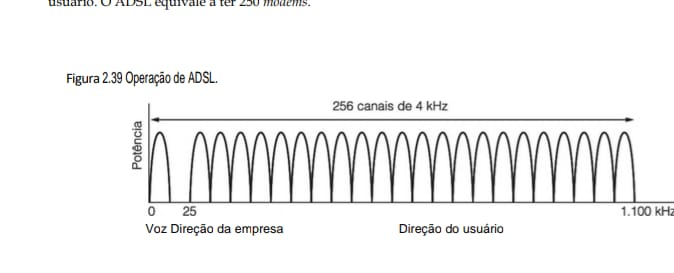

    +------------------------+-------------------------------+---------------------------------------------+
    | Estrutura              | Função Principal              | Impacto no Sistema                          |
    +------------------------+-------------------------------+---------------------------------------------+
    | Ponte para PCI (2.31)  | Isola o tráfego da CPU/Memória| Permite multitarefa eficiente no seu        |
    |                        | dos periféricos mais lentos.  | Ubuntu 24.04.                               |
    +------------------------+-------------------------------+---------------------------------------------+
    | Complexo Raiz (2.32)   | Ponto de conexão central para | Tecnologia base do seu IdeaPad Gaming 3.    |
    |                        | todos os dispositivos PCIe no |                                             |
    |                        | sistema.                      |                                             |
    +------------------------+-------------------------------+---------------------------------------------+
    | ADSL (2.39)            | Divide a linha telefônica em  | Base histórica para o desenvolvimento de    |
    |                        | canais independentes para voz | protocolos de rede modernos.                |
    |                        | e dados.                      |                                             |
    +------------------------+-------------------------------+---------------------------------------------+
    | SCSI (2.31)            | Barramento secundário para    | Estudo clássico para quem desenvolve        |
    |                        | dispositivos de alto          | Network Performance Suites.                 |
    |                        | desempenho como discos e      |                                             |
    |                        | scanners.                     |                                             |
    +------------------------+-------------------------------+---------------------------------------------+

### Conexão com seu eBook de Estudos
 - Performance: A transição do barramento compartilhado (2.30) para o ponto a ponto (2.32) é o que permite que seu IDS Sentinel processe pacotes em tempo real sem colisões no barramento.

 - Integridade: A modulação de sinal (2.38) e a divisão de canais ADSL (2.39) são fundamentais para entender como os dados do seu eBook são transmitidos com segurança pela rede.

Em princípio, cada um dos canais remanescentes pode ser usado para um fluxo de dados full-duplex, mas, na prática, harmônicos, linhas cruzadas e outros efeitos mantêm os sistemas bem abaixo do limite teórico. Cabe ao provedor determinar quantos canais são usados na direção da empresa e quantos na direção do usuário. Uma proporção de 50–50 é tecnicamente possível, mas a maioria das provedoras aloca cerca de 80%–90% da largura de banda na direção do usuário, uma vez que eles descarregam mais dados do que carregam. Essa opção deu origem ao “A” em ADSL (de Assimétrico). Uma divisão comum são 32 canais na direção da empresa e o resto na
direção do usuário.

A qualidade da linha é monitorada constantemente dentro de cada canal e a taxa de dados é ajustada conforme necessário, portanto, canais diferentes podem ter taxas de dados diferentes. Os dados propriamente ditos são enviados usando uma combinação de modulação de amplitude e de fase com até 15 bits por baud. Por exemplo, com 224 canais na direção do usuário e 15 bits/baud a 4.000 bauds, a largura de banda na direção do usuário é 13,44 Mbps. Na prática, a relação sinal/ruído nunca é boa o suficiente para alcançar essa taxa, mas 4–8 Mbps é possível em distâncias curtas por loops de alta qualidade.

Uma configuração ADSL típica é mostrada na Figura 2.40. Nesse esquema, o usuário ou um técnico da companhia telefônica deve instalar um NID (Network Interface Device – dispositivo de interface de rede) na casa ou escritório do cliente. Essa caixinha de plástico marca o final da propriedade da companhia telefônica e o início da propriedade do cliente. Próximo ao NID (ou às vezes combinado com ele) há um divisor, um filtro analógico que separa a faixa de 0–4.000 Hz usada pelo POTS dos dados. O sinal do POTS é direcionado ao telefone ou aparelho de fax e o sinal de dados é direcionado a um modem ADSL. Na verdade, o modem ADSL é um processador de sinais digitais que foi montado para agir como 250 modems funcionando em paralelo a frequências diferentes. Uma vez que a maioria dos modems ADSL é externa, o computador deve estar conectado a ele em alta velocidade. Isso costuma ser feito com a instalação de uma placa Ethernet no computador e operação de uma Ethernet muito curta de dois nós que contém apenas o computador e o modem ADSL. (Ethernet é um padrão de rede local popular e barato.) Por vezes, usa-se a porta USB em vez da Ethernet. Sem dúvida, haverá placas internas de modem ADSL disponíveis no futuro.

**• Figura 2.40 Configuração típica de equipamento ADSL.**

Esta figura demonstra como a separação de voz e dados (mostrada no espectro da Fig. 2.39) é implementada fisicamente através de divisores (splitters) e o DSLAM.

    +-----------------------------------------------------------+
    |               INFRAESTRUTURA DE REDE ADSL                 |
    |===========================================================|
    | [ COMPANHIA TELEFÔNICA ]        [ RESIDÊNCIA DO USUÁRIO ] |
    |                                                           |
    | [Comutador de Voz]              [ Telefone ]              |
    |        |                               |                  |
    |   [ Codec ]                       [ Divisor ]             |
    |        |                               |                  |
    |   [ Divisor ] <--- Linha Telefônica ---> [ NID ]          |
    |        |                               |                  |
    |   [ DSLAM ]                       [ Modem ADSL ]          |
    |        |                               |                  |
    |  [ Para o ISP ]                 [ Computador ]            |
    +-----------------------------------------------------------+

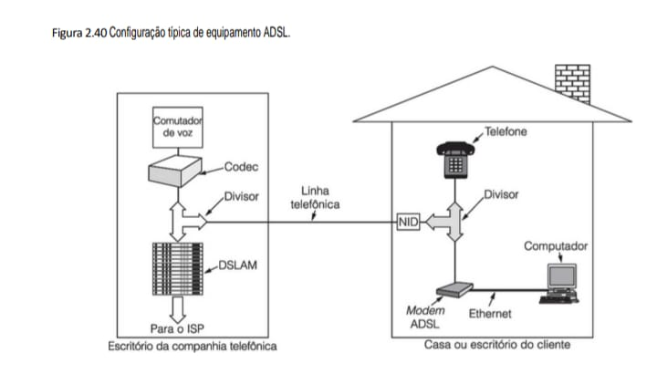

    +------------------------+-------------------------------+---------------------------------------------+
    | Tecnologia             | Processamento                 | Armazenamento / Conexão                     |
    +------------------------+-------------------------------+---------------------------------------------+
    | Escrita Óptica (2.27)  | "O laser aquece o corante a   | O fotodetector interpreta a mudança de      |
    |                        | 200∘C, criando uma mancha     | refletividade como o bit binário.           |
    |                        | escura permanente."           |                                             |
    +------------------------+-------------------------------+---------------------------------------------+
    | Densidade DVD (2.28)   | "O uso de dois substratos de  | Camadas semirreflexivas permitem que o      |
    |                        | 0,6 mm colados permite a      | laser "enxergue através" de uma camada      |
    |                        | leitura em ambos os lados do  | para ler a outra."                          |
    |                        | disco."                       |                                             |
    +------------------------+-------------------------------+---------------------------------------------+
    | Rede ADSL (2.40)       | O DSLAM no escritório central | O Divisor na casa do cliente garante que    |
    |                        | separa os dados de internet   | o sinal de alta frequência não interfira    |
    |                        | do tráfego de voz.            | no telefone.                                |
    +------------------------+-------------------------------+---------------------------------------------+

### Notas de Estudo
 - Independência de Meio: A configuração ADSL (Fig. 2.40) mostra que a infraestrutura física de cobre legada pôde ser reaproveitada para alta velocidade, conceito similar ao que você estuda em Sistemas Operacionais sobre abstração de hardware.

 - Segurança: Para o desenvolvimento do seu IDS Sentinel, é crucial entender que o tráfego do DSLAM para o ISP é um ponto crítico de monitoramento de integridade de pacotes.

Na outra extremidade da linha, no lado da empresa telefônica está instalado um divisor correspondente, no qual a parte da voz é filtrada e enviada ao comutador de voz normal. O sinal acima de 26 kHz é direcionado para um novo tipo de dispositivo denominado DSLAM (Digital Subscriber Line Access Multiplexer – multiplexador de acesso de linha digital de assinante), que contém o mesmo tipo de processador de sinal digital que o modem ADSL. Uma vez recuperado o sinal digital em um fluxo de bits, são formados pacotes e enviados à ISP.

**• Internet por cabo**
Muitas empresas de TV agora estão oferecendo acesso à Internet por meio de seus cabos. Como a tecnologia é muito diferente da ADSL, vale a pena fazer uma breve descrição. Em cada cidade, a operadora por cabo tem uma central e uma grande quantidade de caixas cheias de dispositivos eletrônicos denominados terminais de distribuição (headends) distribuídos por todo o seu território. Os terminais de distribuição estão conectados à central por cabos de alta largura de banda ou de fibra ótica.

Cada terminal tem um ou mais cabos que passam por centenas de casas e escritórios. Cada cliente da provedora por cabo está ligado ao cabo que passa por sua casa ou escritório. Assim, centenas de usuários compartilham o mesmo cabo até o terminal. Em geral, o cabo tem uma largura de banda de mais ou menos 750 MHz. Esse sistema é radicalmente diferente do ADSL porque cada usuário de telefone tem uma linha privada (isto é, não compartilhada) com a central telefônica. Contudo, na prática, ter seu próprio canal de 1,1 MHz com uma empresa de telefonia não é muito diferente do que compartilhar uma porção de 200 MHz do espectro do cabo que chega
ao terminal com 400 usuários, metade dos quais não o estará usando em qualquer dado momento. Porém, isso significa que um usuário de Internet por cabo conseguirá um serviço muito melhor às 4h00 do que às 16h00, enquanto o serviço ADSL é constante durante o dia inteiro. Quem quiser obter um serviço ideal de Internet por cabo deveria se mudar para uma vizinhança rica (casas mais afastadas uma da outra, portanto, menos usuários por cabo) ou para um bairro pobre (onde ninguém pode pagar pelo serviço de Internet).

Uma vez que o cabo é um meio compartilhado, determinar quem pode enviar quando e em qual frequência é uma questão importante. Para ver como isso funciona, temos de fazer um breve resumo do modo de funcionamento de uma TV a cabo. Nos Estados Unidos, os canais de televisão a cabo ocupam a região de 54 a 550 MHz (exceto para rádio FM, de 88 a 108 MHz). Esses canais têm 6 MHz de largura, incluindo faixas de proteção para impedir vazamento de sinal entre canais. Na Europa, a extremidade baixa é normalmente 65 MHz e os canais têm de 6 a 8 MHz de largura para a resolução mais alta exigida por PAL e SECAM; porém, quanto ao mais, o esquema de alocação é similar. A porção inferior da banda não é usada para transmissão de televisão.

Quando as empresas por cabo lançaram a Internet por cabo, tinham dois problemas a resolver:

    1. Como acrescentar acesso à Internet sem interferir com programas de TV.
   
    2. Como ter tráfego bidirecional quando os amplificadores são inerentemente unidirecionais.

As soluções são as seguintes. Cabos modernos têm uma largura de banda de pelo menos 550 MHz, muitas vezes até 750 MHz ou mais. Os canais ascendentes (isto é, do usuário ao terminal de distribuição) entram na faixa de 5–42 MHz (um pouco mais alta na Europa), e o tráfego descendente (isto é, do terminal de distribuição ao usuário) usa as frequências da extremidade alta, como ilustrado na Figura 2.41.

**• Figura 2.41 Alocação de frequência em um sistema típico de TV a cabo usado para acesso à Internet.**

Este diagrama ilustra como o espectro de até 750 MHz é particionado para suportar múltiplos serviços simultâneos, como TV, rádio FM e internet (dados).

    +--------------------------------------------------------------+
    |          ESPECTRO DE FREQUÊNCIA (SISTEMA DE CABO)            |
    |==============================================================|
    | Freq (MHz): 0   5  42  54  88  108            550      750   |
    |             |---|---|---|---|---|               |--------|   |
    |             | D |   | T | F |   |               | DADOS  |   |
    | SERVIÇO:    | A |   | V | M |      TV ANALÓGICA | DESCEN-|   |
    |             | D |   |   |   |                   | DENTES |   |
    |             | O |   |   |   |                   | (Down) |   |
    |             | S |   |   |   |                   |        |   |
    |             +---+   +---+---+                   +--------+   |
    |               ^                                              |
    |               |--- Dados Ascendentes (Upstream)              |
    +-------------------------------------------------------------+

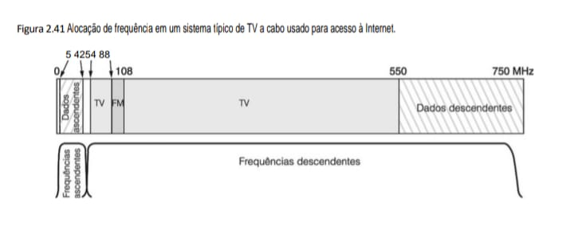

Mapeamento Técnico Consolidado

    +------------------------+----------------------------------+---------------------------------------------+
    | Tecnologia             | Processamento                    | Armazenamento / Conexão                     |
    +------------------------+----------------------------------+---------------------------------------------+
    | Escrita Óptica (2.27)  | "O laser altera quimicamente     | O fotodetector lê a mudança de              |
    |                        | a camada de corante para         | refletividade através do prisma e da lente. |
    |                        | simular as depressões ("pits")." |                                             |
    +------------------------+----------------------------------+---------------------------------------------+
    | Camadas DVD (2.28)     | O laser foca em diferentes       | "Dois substratos de 0,6 mm são unidos por   |
    |                        | profundidades para ler a         | uma camada adesiva para formar o disco de   |
    |                        | camada semirreflexiva ou o       | 1,2 mm."                                    |
    |                        | refletor de alumínio.            |                                             |
    +------------------------+----------------------------------+---------------------------------------------+
    | TV a Cabo (2.41)       | Utiliza frequências baixas       | A largura de banda para dados descendentes  |
    |                        | (5-42 MHz) para upload e         | é significativamente maior para favorecer   |
    |                        | frequências altas (550-750 MHz)  | o consumo de conteúdo.                      |
    |                        | para download.                   |                                             |
    +------------------------+----------------------------------+---------------------------------------------+

### Notas de Revisão para o Capítulo de Hardware
 - Estrutura de Barramento: A evolução da estrutura lógica simples (Fig. 2.30) para o barramento PCI (Fig. 2.31) e finalmente para o PCIe ponto a ponto (Fig. 2.32) reflete a necessidade de maior largura de banda que você observa no seu IdeaPad ao processar dados em tempo real no IDS Sentinel.

 - Conectividade: Enquanto o ADSL (Fig. 2.40) utiliza a rede telefônica de cobre com divisores de frequência, o sistema de cabo (Fig. 2.41) gerencia um espectro muito mais amplo para integrar entretenimento e dados no mesmo meio físico.

 - Meio-tom (2.37): A técnica de simulação de cinza é um exemplo clássico de como limitações de hardware (apenas um tipo de toner/tinta) são superadas por algoritmos de processamento de imagem.

Note que, como os sinais de TV são todos descendentes, é possível usar amplificadores ascendentes que funcionam apenas na região de 5 a 42 MHz, e amplificadores descendentes que só funcionam a 54 MHz e acima, conforme mostra a figura. Assim, obtemos uma assimetria nas larguras de banda ascendente e descendente, porque há mais espectro disponível acima da banda da televisão do que abaixo dela. Por outro lado, a maior parte do tráfego será provavelmente na direção descendente, portanto, as operadoras por cabo não estão infelizes com essas coisas da vida. Como vimos antes, empresas de telefonia costumam oferecer um serviço DSL assimétrico,
ainda que não tenham nenhuma razão técnica para fazê-lo.

O acesso à Internet requer um modem por cabo, um dispositivo que tem duas interfaces: uma com o computador e outra com a rede a cabo. A interface computador-modem a cabo é direta. Em geral, é Ethernet, exatamente como na ADSL. No futuro, o modem inteiro poderá se resumir a uma pequena placa inserida no computador, exatamente como nos antigos modems por telefone.

A outra extremidade é mais complicada. Grande parte do padrão por cabo lida com engenharia de rádio, uma questão que está muito além do escopo deste livro. A única parte que vale a pena mencionar é que modems por cabo, assim como os ADSL, estão sempre ligados. Eles estabelecem uma conexão quando são ligados e a mantêm enquanto houver energia, porque operadoras por cabo não cobram por tempo de conexão.

Para entender melhor como elas funcionam, vamos ver o que acontece quando um modem por cabo é instalado e ligado. O modem faz uma varredura dos canais descendentes em busca de um pacote especial lançado periodicamente pelo terminal de distribuição para fornecer parâmetros do sistema aos modems que acabaram de entrar em linha. Quando achar esse pacote, o novo modem anuncia sua presença em um dos canais ascendentes. O terminal de distribuição responde designando o modem a seus canais ascendente e descendente. Essas designações podem ser mudadas mais tarde se o terminal de distribuição achar necessário equilibrar a carga.

O modem determina sua distância em relação ao terminal de distribuição enviando um pacote especial e observando quanto tempo demora para obter uma resposta. Esse processo é denominado ranging. É importante que o modem conheça sua distância para ajustar o modo como os canais ascendentes operam e para acertar sua temporização. Eles são divididos em mini-intervalos de tempo. Cada pacote ascendente deve se ajustar a um ou mais mini-intervalos de tempo consecutivos. O terminal de distribuição anuncia periodicamente o início de uma nova rodada de mini-intervalos, mas o tiro de largada não é ouvido por todos os modems simultaneamente por causa do tempo de propagação pelo cabo. Sabendo a que distância está do terminal de distribuição, cada modem
pode calcular há quanto tempo o primeiro mini-intervalo de fato começou. O comprimento do mini-intervalo depende da rede. Uma carga útil típica é 8 bytes.

Durante a inicialização, o terminal de distribuição também designa cada modem a um mini-intervalo que será usado para requisitar largura de banda ascendente. Como regra, múltiplos modems serão designados ao mesmo mini-intervalo, o que leva à disputa. Quando um computador quer enviar um pacote, ele o transfere ao modem, que então requisita o número necessário de mini-intervalos para ele. Se a requisição for aceita, o terminal de distribuição manda um reconhecimento pelo canal descendente, informando ao modem quais mini-intervalos foram reservados para seu pacote. Então, o pacote é enviado, começando no mini-intervalo a ele alocado. Pacotes adicionais podem ser requisitados usando um campo no cabeçalho.

Por outro lado, se houver disputa para o mini-intervalo requisitado, nenhum reconhecimento será enviado e o modem espera um tempo aleatório, e tenta mais uma vez. Após cada uma dessas tentativas sucessivas malsucedidas, o tempo aleatório é duplicado para distribuir a carga quando o tráfego estiver pesado.

Os canais descendentes são gerenciados de modo diferente dos canais ascendentes. Uma razão é que há só um remetente (o terminal de distribuição), portanto, não há nenhuma disputa e nenhuma necessidade de mini-intervalos que, na verdade, é apenas um modo de multiplexação por divisão estatística. Outra razão é que o tráfego descendente costuma ser muito maior do que o ascendente, portanto, é um pacote de tamanho fixo de 204 bytes. Parte dele é um código de correção de erros Reed-Solomon e algumas outras informações de controle, sobrando 184 bytes de carga útil para o usuário. Esses números foram escolhidos por compatibilidade com a
televisão digital, que usa MPEG-2, de modo que os canais de TV e os canais descendentes sejam formatados do mesmo modo. O aspecto lógico das conexões é mostrado na Figura 2.42.

**• Figura 2.42 - Detalhes típicos dos canais ascendente e descendente na América do Norte. QAM-64 (Quadrature Amplitude Modulation – modulação de amplitude em quadratura) permite 6 bits/Hz, mas funciona somente em altas frequências. QPSK (Quadrature
Phase Shift Keying – modulação por chaveamento de fase em quadratura) funciona em baixas frequências, mas permite
apenas 2 bits/Hz.**

Ilustra a diferença de modulação e largura de banda entre os dados que saem do modem em direção ao provedor (ISP) e os que chegam ao usuário.

    +-------------------------------------------------------------+
    |               OPERAÇÃO DE CANAIS EM CABO COAXIAL            |
    |=============================================================|
    |                                                             |
    |           Fibra        [ TERMINAL ]         [ MODEM ]       |
    | [ ISP ] ---------|      (Headend)           (Usuário)       |
    |                  |          |                   |           |
    |                  |    /=======================\ |           |
    |                  |    |  Canal Descendente    | |           |
    |                  |    |   (27 Mbps QAM-64)    | |           |
    |                  |    |  [Dados]   [Dados]    | |           |
    |                  |    |-----------------------| |           |
    |                  |    |  Canal Ascendente     | |           |
    |                  |    |    (9 Mbps QPSK)      | |           |
    |                  |    | [..] [..] [..] [..]   | |           |
    |                  |    \=======================/ |           |
    |                  |          CABO COAXIAL        |           |
    |                                                             |
    +-------------------------------------------------------------+

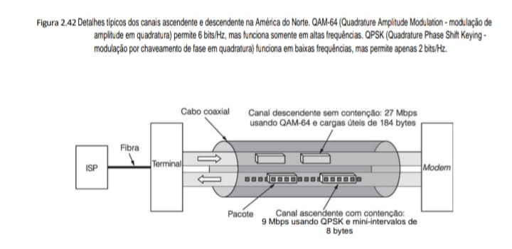

Mapeamento Técnico Consolidado

    ---------------------------+-------------------------------+---------------------------------------------+
    | Tecnologia               | Modulação / Processamento     | Performance                                 |
    +--------------------------+-------------------------------+---------------------------------------------+
    | Canal Descendente (2.42) | Utiliza QAM-64, que permite   | Oferece 27 Mbps de largura de banda sem     |
    |                          | 6 bits/Hz, mas exige altas    | contenção.                                  |
    |                          | frequências.                  |                                             |
    +--------------------------+-------------------------------+---------------------------------------------+
    | Canal Ascendente (2.42)  | Utiliza QPSK, operando em     | Limitado a 9 Mbps e sujeito a contenção     |
    |                          | baixas frequências com apenas | de pacotes.                                 |
    |                          | 2 bits/Hz.                    |                                             |
    +--------------------------+-------------------------------+---------------------------------------------+
    | Integridade Óptica (2.27)| O laser e o fotodetector      |                                             |
    |                          | operam através de um prisma   |                                             |
    |                          | para garantir a leitura       |                                             |
    |                          | correta dos bits.             |                                             |
    |                          | "O substrato de policarbonato |                                             |
    |                          | de 1,2 mm protege a camada    |                                             |
    |                          | de dados."                    |                                             |
    +--------------------------+-------------------------------+---------------------------------------------+
    | Densidade DVD (2.28)     | Camadas semirreflexivas       | "Substratos colados de 0,6 mm dobram a      |
    |                          | permitem que o laser mude o   | capacidade física."                         |
    |                          | foco para ler diferentes      |                                             |
    |                          | níveis de dados.              |                                             |
    +--------------------------+-------------------------------+---------------------------------------------+

### Notas para o eBook
 - Performance de Rede: A diferença entre QAM-64 (download) e QPSK (upload) na Fig. 2.42 explica por que as taxas de envio são geralmente menores que as de recebimento.

 - Conexão com Projetos: Entender esses diferentes esquemas de modulação é vital para o seu IDS Sentinel, pois o monitoramento de rede deve considerar as diferentes latências e larguras de banda de cada canal.

 - Hardware Físico: Enquanto o ADSL (Fig. 2.40) isola voz e dados em canais de 4 kHz, o sistema de cabo (Fig. 2.41 e 2.42) usa bandas muito maiores para dados, atingindo frequências de até 750 MHz.

Voltando à inicialização do modem, uma vez concluída a ranging e obtida a designação de seu canal ascendente, canal descendente e mini-intervalo, ele está liberado para começar a enviar pacotes. Esses pacotes vão até o terminal de distribuição, que os retransmite por um canal dedicado até a central da operadora por cabo e então até o ISP (que pode ser a própria empresa por cabo). O primeiro pacote é dirigido à ISP e requisita um endereço de rede (tecnicamente, um endereço IP) que é designado dinamicamente. O pacote também requisita e obtém um horário exato.

A próxima etapa envolve segurança. Uma vez que o cabo é um meio compartilhado, quem quiser se dar ao trabalho pode ler todo o tráfego que passar por ele. Para evitar que qualquer um bisbilhote seus vizinhos (literalmente), todo o tráfego é criptografado em ambas as direções. Parte do procedimento de inicialização envolve estabelecer chaves criptográficas. A princípio, poderíamos pensar que conseguir que dois estranhos, o terminal de distribuição e o modem, combinem uma chave secreta em plena luz do dia com milhares de pessoas vigiando seria algo difícil. Acontece que não é, mas a técnica usada (o algoritmo Diffie-Hellman) está fora do escopo deste livro. Uma discussão sobre esse algoritmo é dada em Kaufman et al. (2002).

Por fim, o modem tem de registrar (fazer login) e fornecer seu identificador exclusivo pelo canal seguro. Nesse ponto, está concluída a inicialização. Agora, o usuário pode se conectar com o ISP e começar a trabalhar.

Há muito mais a ser dito sobre modems a cabo. Algumas referências relevantes são: Adams e Dulchinos, 2001; Donaldson e Jones, 2001; Dutta-Roy, 2001.

## 2.4.7 Câmeras digitais
Uma utilização cada vez mais popular de computadores é a fotografia digital, o que transforma câmeras digitais em uma espécie de periférico de computador. Vamos descrever rapidamente como isso funciona. Todas as câmeras têm uma lente que forma uma imagem do sujeito no fundo da câmera. Em um equipamento convencional, o fundo da câmera está coberto por uma película fotográfica sobre a qual é formada uma imagem latente quando a luz a atinge. Essa imagem latente pode ficar visível pela ação de certos produtos
químicos presentes no líquido de revelação, ou revelador. Uma câmera digital funciona da mesma maneira, exceto que o filme é substituído por um arranjo retangular de CCDs (Charge-Coupled Devices – dispositivos de carga acoplada) sensíveis à luz. (Algumas câmeras digitais usam CMOS [Complementary Metal­‑Oxyde Semiconductor – semicondutor de óxido metálico complementar], mas aqui vamos nos concentrar nos CCDs, que são mais comuns.)

Quando a luz atinge um CCD, ele adquire uma carga elétrica. Quanto mais luz, mais carga. A carga pode ser lida em um conversor analógico para digital como um inteiro de 0 a 255 (em câmeras mais baratas) ou de 0 a 4.095 (em câmeras reflex digitais de uma lente). A configuração básica é mostrada na Figura 2.43.

**• Figura 2.43 - Câmera digital.**

Ilustra o caminho da luz desde a lente até o armazenamento em memória flash, destacando o arranjo de sensores CCD.

    +-------------------------------------------------------------+
    |                  ANATOMIA DE UMA CÂMERA DIGITAL             |
    |=============================================================|
    |                                                             |
    |   Objeto        Lente       Diafragma      Processamento    |
    |     (X)  --->   ( O )   --->   |  |   --->   [ CPU ]        |
    |                                |  |          [ RAM ]        |
    |                          [ Arranjo CCD ]     [ FLASH ]      |
    |                                |                            |
    |                     +----------v----------+                 |
    |                     |  R | G | R | G  ... | <-- Sensor      |
    |                     |  G | B | G | B  ... |     Bayer       |
    |                     +---------------------+                 |
    |                                                             |
    +-------------------------------------------------------------+

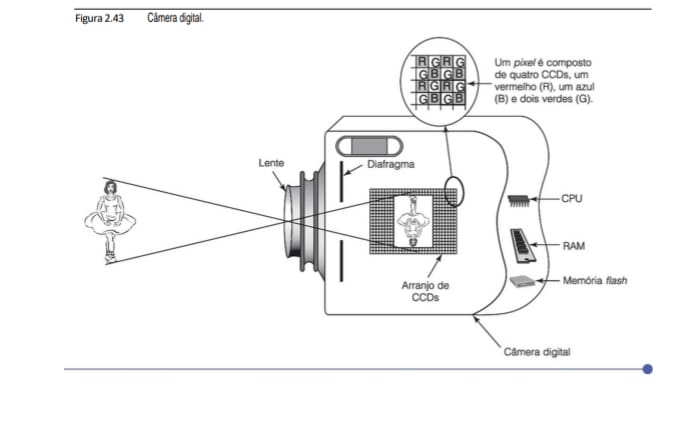

Cada CCD produz um único valor, independente da cor da luz que o atinge. Para formar imagens coloridas, os CCDs são organizados em grupos de quatro elementos. Um filtro Bayer é colocado no topo do CCD de modo a permitir que somente a luz vermelha atinja um dos quatro em cada grupo, apenas a luz azul atinja um outro e só a luz verde atinja os outros dois. São usados dois CCDs para a luz verde porque utilizar quatro CCDs para representar um pixel é muito mais conveniente do que usar três, e o olho é mais sensível
à luz verde do que à vermelha ou à azul. Quando um fabricante afirma que uma câmera tem, por exemplo, 6 milhões de pixels, ele está mentindo. A câmera tem 6 milhões de CCDs que, juntos, formam 1,5 milhão de pixels. A imagem será lida como um arranjo de 2.828 × 2.121 pixels (em câmeras de baixo preço) ou de 3.000 × 2.000 pixels (em SLRs digitais), mas os pixels extras são produzidos por interpolação pelo software dentro da câmera.

Quando o botão do obturador da câmera é pressionado, o software no equipamento realiza três tarefas: ajusta o foco, determina a exposição e efetua o equilíbrio do branco. O autofoco funciona analisando a informação de alta frequência na imagem e então movimentando a lente até que ela seja maximizada, para dar o máximo de detalhe. A exposição é determinada medindo a luz que cai sobre os CCDs e então ajustando o diafragma da lente e o tempo de exposição para fazer a intensidade da luz cair no meio da faixa de alcance dos CCDs. Ajustar o equilíbrio do branco tem a ver com medir o espectro da luz incidente para efetuar as necessárias correções de cor mais tarde.

Então, a imagem é lida com base nos CCDs e armazenada como um arranjo de pixels na RAM interna da câmera. SLRs de primeira linha usados por fotojornalistas podem fotografar oito quadros de alta resolução por segundo por 5 segundos, e precisam de cerca de 1 GB de RAM interna para armazenar as imagens antes de processá-las e armazená-las permanentemente. Câmeras mais baratas têm menos RAM, mas ainda assim têm boa quantidade.

Na fase de pós-captura, o software da câmera aplica correção da cor por equilíbrio do branco para compensar a luz avermelhada ou azulada (por exemplo, de um objeto na sombra ou da utilização de um flash). Em seguida, ele aplica um algoritmo para reduzir ruído e outro para compensar CCDs defeituosos. Logo após, o software tenta dar melhor definição à imagem (a menos que essa característica esteja desativada), procurando contornos e aumentando o gradiente de intensidade ao redor deles.

Por fim, a imagem pode ser comprimida para reduzir a quantidade de armazenagem requerida. Um formato comum é o JPEG (Joint Photographic Experts Group – grupo associado de especialistas em fotografia), no qual uma transformada de Fourier espacial bidimensional é aplicada e alguns dos componentes de alta frequência são omitidos. O resultado dessa transformação é que a imagem requer um número menor de bits de armazenagem, mas perdem-se os detalhes mais sutis.

Quando todo processamento interno à câmera estiver concluído, a imagem é gravada no meio de armazenagem, em geral uma memória rápida ou um minúsculo disco rígido removível denominado microdrive. O pós-processamento e a gravação podem levar vários segundos por imagem.

Quando o usuário chega em casa, a câmera pode ser conectada a um computador, em geral usando, por exemplo, uma entrada USB ou um cabo específico. Então, as imagens são transferidas da câmera para o discorígido do computador. Usando software especial, tal como o Adobe Photoshop, o usuário pode recortar a imagem, ajustar brilho, contraste e equilíbrio de cor, destacar, escurecer ou remover porções da imagem e aplicar diversos filtros. Quando ele estiver contente com o resultado, os arquivos podem ser impressos em uma impressora em cores, enviados pela Internet a uma loja especializada para fazer o acabamento ou gravados em um CD-ROM ou DVD para armazenagem em arquivo e subsequente impressão.

A quantidade de capacidade computacional, RAM, espaço em disco rígido e software em uma câmera digital SLR é estarrecedora. Além de o computador ter de fazer todas as coisas mencionadas, ainda precisa se comunicar com a CPU na lente e com a CPU na memória rápida, renovar a imagem na tela LCD e gerenciar todos os botões, engrenagens, luzes, mostradores e dispositivos da câmera em tempo real. Esse sistema embutido é extremamente poderoso e muitas vezes rivaliza com um computador de mesa de apenas alguns anos atrás.

## 2.4.8 Códigos de caracteres
Cada computador tem um conjunto de caracteres que ele usa. O conjunto mínimo contém as 26 letras maiúsculas, as 26 letras minúsculas, os algarismos de 0 a 9 e um conjunto de símbolos especiais, como espaço, sinal de menos, vírgula e retorno ao início da linha.

Para transferir esses caracteres para o computador, um número é designado a cada um, por exemplo, a = 1, b = 2, ..., z = 26, + = 27, – = 28. O mapeamento de caracteres para números inteiros é denominado código de caracteres. É essencial que computadores que se comunicam usem o mesmo código ou não conseguirão se entender. Por essa razão, foram desenvolvidos padrões. A seguir, examinaremos dois dos mais importantes.

**• ASCII**
Um código de ampla utilização é denominado ASCII (American Standard Code for Information Interchange – código padrão americano para troca de informações). Cada caractere ASCII tem 7 bits, o que permite 128 caracteres no total. Porém, como os computadores são orientados a byte, cada caractere ASCII é armazenado em um byte separado. A Figura 2.44 mostra o código ASCII. Os códigos de 0 a 1F (hexadecimal) são caracteres de controle e não são impressos. Os códigos de 128 a 255 não fazem parte do ASCII, mas o IBM PC os definiu para serem caracteres especiais, como os smileys, e a maioria dos computadores tem suporte para eles.

**• Figura 2.44 O conjunto de caracteres ASCII.**

    +------+-----+---------------------------------+------+-----+---------------------------------+
    | Hexa | Nome| Significado                     | Hexa | Nome| Significado                     |
    +------+-----+---------------------------------+------+-----+---------------------------------+
    | 0    | NUL | Null (Nulo)                     | 10   | DLE | Data Link Escape                |
    | 1    | SOH | Start Of Heading                | 11   | DC1 | Device Control 1                |
    | 2    | STX | Start Of Text                   | 12   | DC2 | Device Control 2                |
    | 3    | ETX | End Of Text                     | 13   | DC3 | Device Control 3                |
    | 4    | EOT | End Of Transmission             | 14   | DC4 | Device Control 4                |
    | 5    | ENQ | Enquiry                         | 15   | NAK | Negative AcKnowledgement        |
    | 6    | ACK | ACKnowledgement                 | 16   | SYN | Synchronous Idle                |
    | 7    | BEL | Bell (Sinal Sonoro)             | 17   | ETB | End of Transmission Block       |
    | 8    | BS  | BackSpace                       | 18   | CAN | CANcel                          |  
    | 9    | HT  | Horizontal Tab                  | 19   | EM  | End of Medium                   |
    | A    | LF  | Line Feed                       | 1A   | SUB | SUBstitute                      |
    | B    | VT  | Vertical Tab                    | 1B   | ESC | ESCape                          |
    | C    | FF  | Form Feed                       | 1C   | FS  | File Separator                  |
    | D    | CR  | Carriage Return                 | 1D   | GS  | Group Separator                 |
    | E    | SO  | Shift Out                       | 1E   | RS  | Record Separator                |
    | F    | SI  | Shift In                        | 1F   | US  | Unit Separator                  |
    +------+-----+---------------------------------+------+-----+---------------------------------+

    +-----+-----+-----+-----+-----+-----+-----+-----+-----+-----+-----+-----+
    | Hexa| Car | Hexa| Car | Hexa| Car | Hexa| Car | Hexa| Car | Hexa| Car |
    +-----+-----+-----+-----+-----+-----+-----+-----+-----+-----+-----+-----+
    | 20  | Esp | 30  | 0   | 40  | @   | 50  | P   | 60  | `   | 70  | p   |
    | 21  | !   | 31  | 1   | 41  | A   | 51  | Q   | 61  | a   | 71  | q   |
    | 22  | "   | 32  | 2   | 42  | B   | 52  | R   | 62  | b   | 72  | r   |
    | 23  | #   | 33  | 3   | 43  | C   | 53  | S   | 63  | c   | 73  | s   |
    | 24  | $   | 34  | 4   | 44  | D   | 54  | T   | 64  | d   | 74  | t   |
    | 25  | %   | 35  | 5   | 45  | E   | 55  | U   | 65  | e   | 75  | u   |
    | 26  | &   | 36  | 6   | 46  | F   | 56  | V   | 66  | f   | 76  | v   |
    | 27  | '   | 37  | 7   | 47  | G   | 57  | W   | 67  | g   | 77  | w   |
    | 28  | (   | 38  | 8   | 48  | H   | 58  | X   | 68  | h   | 78  | x   |
    | 29  | )   | 39  | 9   | 49  | I   | 59  | Y   | 69  | i   | 79  | y   |
    | 2A  | *   | 3A  | :   | 4A  | J   | 5A  | Z   | 6A  | j   | 7A  | z   |
    | 2B  | +   | 3B  | ;   | 4B  | K   | 5B  | [   | 6B  | k   | 7B  | {   |

    | 2C  | ,   | 3C  | <   | 4C  | L   | 5C  | \   | 6C  | l   | 7C  | |   |
    | 2D  | -   | 3D  | =   | 4D  | M   | 5D  | ]   | 6D  | m   | 7D  | }   |
    | 2E  | .   | 3E  | >   | 4E  | N   | 5E  | ^   | 6E  | n   | 7E  | ~   |
    | 2F  | /   | 3F  | ?   | 4F  | O   | 5F  | _   | 6F  | o   | 7F  | DEL |
    +-----+-----+-----+-----+-----+-----+-----+-----+-----+-----+-----+-----+

### Notas Técnicas para o seu eBook:
 - Controle de Fluxo: Os caracteres de 0 a 1F são códigos de controle. No desenvolvimento do seu IDS Sentinel, esses caracteres são frequentemente filtrados ou monitorados para evitar ataques de injeção em protocolos de rede.

 - Diferença de Sistemas: O caractere LF (0Ah) é o padrão de quebra de linha no seu Ubuntu, enquanto o Windows utiliza a combinação CR + LF (0Dh 0Ah).

 - Comunicação de Dados: O caractere ACK (06h) e NAK (15h) são a base lógica para os protocolos de confirmação que você estuda em redes, como o funcionamento do ADSL e Cabo vistos anteriormente.

Muitos dos caracteres de controle ASCII são destinados à transmissão de dados. Por exemplo, uma mensagem pode ser composta de um caractere SOH (start of header – início de cabeçalho), um caractere STX (start of text – início de texto), o texto em si, um caractere ETX (end of text – fim do texto) e então um caractere EOT (end of transmission – fim da transmissão). Contudo, na prática, as mensagens enviadas por linhas telefônicas e redes são formatadas de modo muito diferente, de modo que os caracteres ASCII de controle de transmissão já não são muito usados.

Os caracteres de impressão ASCII são diretos. Incluem as letras maiúsculas e minúsculas, dígitos, sinais de pontuação e alguns símbolos matemáticos.

**• Unicode**
A indústria do computador se desenvolveu em grande parte nos Estados Unidos, o que levou ao conjunto de caracteres ASCII. Esse código é bom para a língua inglesa, mas não tão bom para outros idiomas. O francês precisa de acentos (por exemplo, système); o alemão precisa de sinais diacríticos (por exemplo, für) e assim por diante. Algumas línguas europeias têm certas letras que não se encontram no ASCII, tais como a alemã ß e a dinamarquesa ø. Alguns idiomas têm alfabetos inteiramente diferentes (por exemplo, russo e árabe), e algumas poucas línguas não têm alfabeto algum (por exemplo, a chinesa). Como os computadores se espalharam pelos
quatro cantos do mundo e como os fabricantes de software querem vender produtos em países onde a maioria dos usuários não fala inglês, é preciso um novo conjunto de caracteres.

A primeira tentativa de ampliar o ASCII foi o IS 646, que acrescentou mais 128 caracteres ao ASCII, transformando-o em um código de 8 bits denominado Latin-1. A maioria dos caracteres adicionais eram letras latinas com acentos e sinais diacríticos. A próxima tentativa foi o IS 8859, que introduziu o conceito de uma página de código, um conjunto de 256 caracteres para um idioma particular ou grupo de idiomas. O IS 8859-1 é Latin-1. O IS 8859-2 trata dos idiomas eslavos baseados no latim (por exemplo, tcheco, polonês e húngaro). O IS 8859-3 contém os caracteres necessários para os idiomas turco, maltês, esperanto, galego e assim por diante. O problema da abordagem da página de código é que o software tem de manter controle da página em que está; é impossível
misturar idiomas nas páginas e o esquema não cobre a língua japonesa nem a chinesa.

Um grupo de empresas de computadores resolveu esse problema formando um consórcio para criar um novo sistema, denominado Unicode, e transformando-o em um Padrão Internacional (IS 10646). Agora, o Unicode é suportado por algumas linguagens de programação (por exemplo, Java), alguns sistemas operacionais (por exemplo, Windows) e muitas aplicações.

A ideia que fundamenta o Unicode é designar a cada caractere e símbolo um valor único de 16 bits, denominado ponto de código. Não são usados caracteres multibytes nem sequências de escape. Símbolos de 16 bits simplificam a escrita do software.

Com símbolos de 16 bits, o Unicode tem 65.536 pontos de código. Visto que todos os idiomas do mundo usam cerca de 200 mil símbolos, os pontos de código são um recurso escasso que deve ser alocado com grande cuidado. Para acelerar a aceitação do Unicode, o consórcio teve a brilhante ideia de usar Latin-1 como pontos de código 0 a 255, o que facilita a conversão entre ASCII e Unicode. Para evitar desperdiçar pontos de código, cada sinal diacrítico tem seu próprio ponto de código. Cabe ao software combinar sinais diacríticos com seus vizinhos para formar novos caracteres. Embora isso aumente o trabalho do software, economiza preciosos pontos de código.

O espaço do ponto de código é dividido em blocos, cada qual um múltiplo de 16 pontos de código. Todo alfabeto importante em Unicode tem uma sequência de zonas consecutivas. Alguns exemplos (e o número de pontos de código alocados) são latim (336), grego (144), cirílico (256), armênio (96), hebraico (112), devanágari (128), gurmuqui (128), oriá (128), telugo (128) e canará (128). Note que cada um desses idiomas recebeu um número maior de pontos de código do que número de letras que possui. Essa opção foi escolhida em parte porque muitas línguas têm várias formas para cada letra. Por exemplo, cada letra em português tem duas formas – minúscula e MAIÚSCULA. Alguns idiomas têm três ou mais formas, possivelmente dependendo de a letra estar no início, no meio ou no final de uma palavra.

Além desses alfabetos, foram designados pontos de código para sinais diacríticos (112), sinais de pontuação (112), subscritos e sobrescritos (48), símbolos monetários (48), símbolos matemáticos (256), formas geométricas (96) e sinais variados (dingbats) (192).

Depois desses, vêm os símbolos necessários para as línguas chinesa, japonesa e coreana. Primeiro, há 1.024 símbolos fonéticos (por exemplo, katakana e bopomofo) e, em seguida, os ideogramas han unificados (20.992) usados em chinês e japonês, e as sílabas hangul do idioma coreano (11.156).

Para permitir que os usuários inventem caracteres especiais para finalidades especiais, 6.400 pontos de código foram designados para uso local.

Embora o Unicode solucione muitas dificuldades associadas com a internacionalização, ele não resolve (nem tenta resolver) todos os problemas do mundo. Por exemplo, enquanto o alfabeto latino está em ordem alfabética, os ideogramas han não estão na ordem do dicionário. Por conseguinte, um programa em inglês pode procurar cat e dog em ordem alfabética simplesmente comparando o valor Unicode de seu primeiro caractere. Um programa em japonês precisa de tabelas externas para interpretar qual dos dois símbolos vem antes do outro no dicionário.

Outra questão é que surgem novas palavras o tempo todo. Há 50 anos ninguém falava de applets, ciberespaço, gigabytes, lasers, modems, smileys ou videoteipes. Acrescentar novas palavras em inglês não requer novos pontos de código, mas adicioná-las em japonês, sim. Além de novas palavras técnicas, há uma demanda para adicionar no mínimo 20 mil novos nomes de pessoas e lugares (a maioria chineses). Os cegos acham que o braille deveria estar presente e grupos de interesse especial de todos os tipos querem o que entendem como pontos de código a que têm direito. O consórcio Unicode estuda e decide todas as novas propostas.

O Unicode usa o mesmo ponto de código para caracteres que parecem quase idênticos mas têm significados diferentes ou são escritos de maneira ligeiramente diferente em japonês e chinês (como se processadores de texto em inglês sempre escrevessem blue como blew, porque têm o mesmo som). Há quem considere isso uma otimização para economizar pontos de código escassos; outros o veem como imperialismo cultural anglo-saxão (e você acha que designar 16 bits para caracteres não foi uma decisão muito política?). Para piorar as coisas, um dicionário japonês completo tem 50 mil kanji (excluindo nomes), portanto, com apenas 20.992 pontos de código disponíveis para os ideogramas han, escolhas tiveram de ser feitas. Nem todos os japoneses acham que um consórcio de fabricantes de
computadores – mesmo que alguns deles sejam japoneses – é o fórum ideal para fazer essas escolhas.

Adivinha só: 65.536 pontos de código não foram suficientes para satisfazer a todos, de modo que, em 1996, 16 planos adicionais de 16 bits cada foram acrescentados, expandindo o número total de caracteres para 1.114.112.

**• UTF-8**
Embora melhor que o ASCII, o Unicode por fim esgotou os pontos de código e também requer 16 bits por caractere para representar o texto ASCII puro, o que é um desperdício. Por conseguinte, outro esquema de codificação foi desenvolvido para resolver essas questões. Ele é denominado Formato de Transformação UTF-8 UCS, em que UCS significa Universal Character Set (conjunto de caracteres universal), que é Unicode na essência. Códigos UTF-8 têm tamanho variável, de 1 a 4 bytes, e podem codificar cerca de dois bilhões de caracteres. Ele é o conjunto de caracteres dominante em uso na Web.

Uma das propriedades interessantes do UTF-8 é que os códigos de 0 a 127 são os caracteres ASCII, permitindo que sejam expressos em 1 byte (contra os 2 bytes do Unicode). Para caracteres que não são ASCII, o bit de alta ordem do primeiro byte é definido como 1, indicando que virão 1 ou mais bytes adicionais. No fim, seis formatos diferentes são usados, conforme ilustra a Figura 2.45. Os bits marcados com “d” são bits de dados.

**• Figura 2.45 O esquema de codificação UTF-8.**

Diferente do ASCII fixo, o UTF-8 é um sistema de largura variável. O número de bits de dados (representados por d) determina quantos bytes são necessários para codificar o caractere.

    +-------+---------+---------+---------+---------+---------+--0------+
    | Bits  | Byte 1  | Byte 2  | Byte 3  | Byte 4  | Byte 5  | Byte 6  |
    +-------+---------+---------+---------+---------+---------+---------+
    | 7     | 0ddddddd|         |         |         |         |         |
    | 11    | 110ddddd| 10dddddd|         |         |         |         |
    | 16    | 1110dddd| 10dddddd| 10dddddd|         |         |         |
    | 21    | 11110ddd| 10dddddd| 10dddddd| 10dddddd|         |         |
    | 26    | 111110dd| 10dddddd| 10dddddd| 10dddddd| 10dddddd|         |
    | 31    | 1111110d| 10dddddd| 10dddddd| 10dddddd| 10dddddd| 10dddddd|
    +-------+---------+---------+---------+---------+---------+---------+

Mapeamento de Processamento e Armazenamento
Para manter a consistência com o modelo de tabelas que você utiliza para arquitetura, aqui está a lógica de funcionamento do UTF-8:

    +-------------------------------+-------------------------------+
    | Processamento (Lógica)        | Armazenamento (Estrutura)     |
    +-------------------------------+-------------------------------+
    | Identificação                 | O primeiro byte indica o      |
    |                               | tamanho da sequência pelo     |
    |                               | número de 1s iniciais.        |
    +-------------------------------+-------------------------------+
    | Compatibilidade               | "Se o primeiro bit for 0, o   |
    |                               | byte é tratado exatamente     |
    |                               | como ASCII de 7 bits."        |
    +-------------------------------+-------------------------------+
    | Continuação                   | Bytes subsequentes sempre     |
    |                               | começam com 10 para evitar    |
    |                               | confusão com inícios de       |
    |                               | sequência.                    |
    +-------------------------------+-------------------------------+
    | Eficiência                    | Caracteres comuns (latinos)   |
    |                               | ocupam menos espaço (1 byte)  |
    |                               | que símbolos complexos.        |
    +-------------------------------+-------------------------------+

### Notas Técnicas para o eBook
 - Desenvolvimento em C: Ao manipular strings no seu projeto IDS Sentinel, lembre-se que strlen() contará o número de bytes, e não necessariamente o número de caracteres se a string contiver caracteres UTF-8 multi-byte.

 - Interoperabilidade: Como você alterna entre Windows 11 e Linux, o UTF-8 garante que arquivos de código criados em um sistema sejam lidos sem erros de codificação ("mojibake") no outro.

 - Segurança de Rede: Em sistemas de detecção de intrusão, ataques de "Overlong UTF-8" tentam ocultar caracteres proibidos (como / ou \) usando sequências multi-byte inválidas para burlar filtros de segurança.

O UTF-8 tem uma série de vantagens em relação ao Unicode e outros esquemas. Primeiro, se um programa ou documento utiliza apenas caracteres que estão no conjunto ASCII, cada um pode ser representado em 8 bits. Segundo, o primeiro byte de cada caractere UTF-8 determina exclusivamente o número de bytes deste. Terceiro, os bytes de continuação em um caractere UTF-8 sempre começam com 10, enquanto o byte inicial nunca começa assim, tornando o código autossincronizável. Em particular, no caso de um erro de comunicação ou memória, sempre é possível prosseguir e achar o início do próximo caractere (supondo que ele não tenha sido danificado).

Em geral, o UTF-8 é usado para codificar apenas os 17 planos Unicode, embora o esquema tenha muito mais de 1.114.112 pontos de código. Porém, se os antropólogos descobrirem novas tribos em Nova Guiné (ou em outro lugar) cujos idiomas ainda não sejam conhecidos (ou se, no futuro, fizermos contato com extraterrestres), o UTF-8 conseguirá acrescentar seus alfabetos ou ideogramas.

## 2.5 Resumo
Sistemas de computadores são compostos por três tipos de componentes: processadores, memórias e dispositivos de E/S. A tarefa de um processador é buscar instruções, uma por vez, em uma memória, decodificá-las e executá-las. O ciclo busca-decodificação-execução pode ser descrito como um algoritmo e, na verdade, às vezes ele é executado por um interpretador de software que roda em um nível mais baixo. Para ganhar velocidade, muitos computadores agora têm um ou mais pipelines (paralelismo) ou têm um projeto superescalar com múltiplas unidades funcionais que funcionam em paralelo. Um pipeline permite que uma instrução seja dividida em etapas e as etapas para diferentes instruções sejam executadas ao mesmo tempo. Múltiplas unidades funcionais é outra forma de obter paralelismo sem afetar o conjunto de instruções ou a arquitetura visível ao programador ou compilador.

Sistemas com vários processadores são cada vez mais comuns. Computadores paralelos incluem processadores matriciais, nos quais a mesma operação é efetuada sobre múltiplos conjuntos de dados ao mesmo tempo; multiprocessadores, nos quais várias CPUs compartilham uma memória; e multicomputadores, nos quais cada um dos vários computadores tem sua própria memória, mas se comunicam passando mensagens.

Memórias podem ser categorizadas como primárias ou secundárias. A memória primária é usada para conter o programa que está sendo executado no momento. Seu tempo de acesso é curto – algumas poucas dezenas de nanos segundos, no máximo – e independe do endereço que está sendo acessado. Caches reduzem ainda mais esse tempo de acesso. Eles são necessários porque as velocidades do processador são muito maiores do que as velocidades da memória, o que significa que ter de esperar pelos acessos à memória o tempo todo atrasa bastante a execução do processador. Algumas memórias são equipadas com códigos de correção de erros para aumentar a confiabilidade.

Memórias secundárias, ao contrário, têm tempos de acesso muito mais longos (milissegundos ou mais) e dependem da localização dos dados que estão sendo lidos ou escritos. Fitas, discos magnéticos e discos ópticos são as memórias secundárias mais comuns. Há muitas variedades de discos magnéticos, incluindo discos IDE, discos SCSI e RAIDs. Entre os discos ópticos figuram CD-ROMs, CD-Rs, DVDs e Blu-rays.

Dispositivos de E/S são usados para transferir informações para dentro e para fora do computador. Então, são conectados ao processador e à memória por um ou mais barramentos. Alguns exemplos são terminais, mouses, impressoras e modems. A maioria dos dispositivos de E/S usa o código de caracteres ASCII, embora o Unicode também seja usado e o UTF-8 esteja ganhando rápida aceitação à medida que a indústria de computadores se volta mais para a Web.